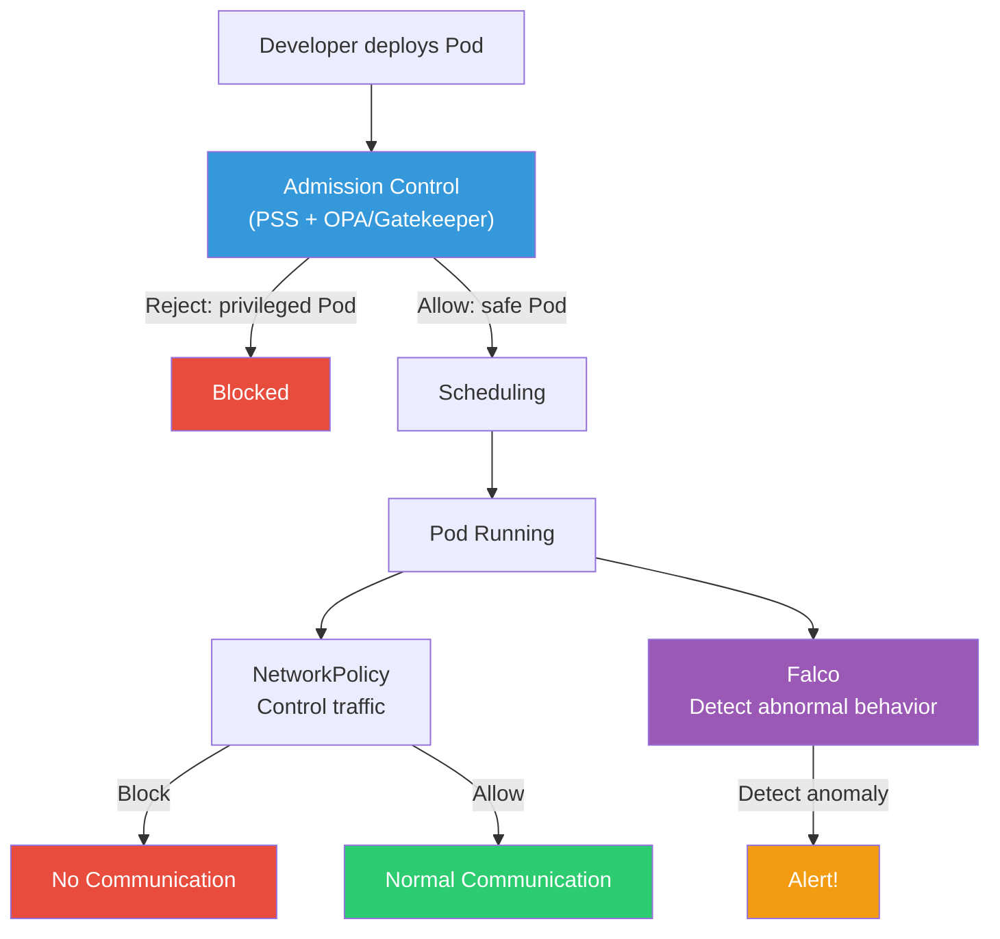
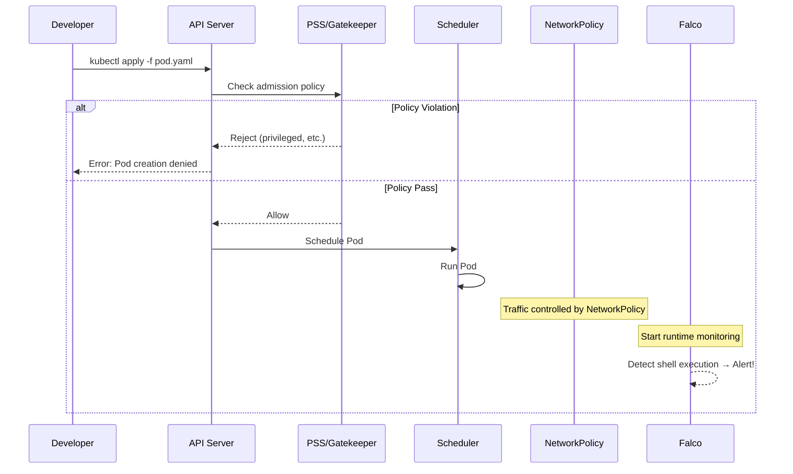
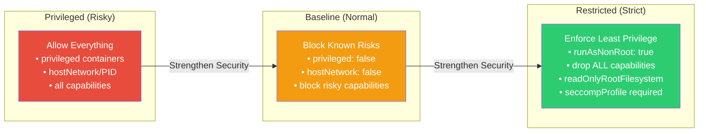
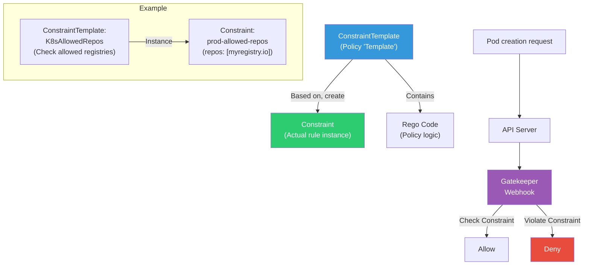
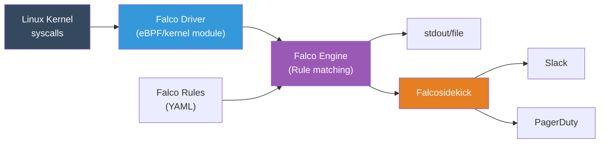

# NetworkPolicy / PSS / OPA / Falco

> You learned "who can do what" in [RBAC](./11-rbac), and "how to detect vulnerabilities in images" in [container security](../03-containers/09-security). Now let's complete the K8s security puzzle with **controlling traffic between Pods**(NetworkPolicy), **restricting how Pods run**(PSS), **enforcing policies automatically**(OPA/Gatekeeper), and **detecting threats at runtime**(Falco).

---

## 🎯 Why Learn This?

```
Real security gaps if you don't know K8s security:
• One Pod breach → Entire cluster at risk     → No NetworkPolicy means free lateral movement
• Someone deploys privileged container        → Node root access possible
• latest tag deployed to production          → Can't track which version
• Container shell execution, file tampering   → Can't catch at build/deploy time
• Security audit: "Show network isolation"   → Can't answer, audit fails
• Compliance: PCI-DSS, ISMS — need access control proof
```

K8s security has 4 layers:

| Layer | Tool | Role |
|-------|------|------|
| **Network** | NetworkPolicy | Control traffic between Pods |
| **Admission** | PSS, OPA/Gatekeeper | Prevent risky Pod creation |
| **Runtime** | Falco | Detect abnormal behavior while running |
| **Authority** | [RBAC](./11-rbac) | Control who can do what |

---

## 🧠 Core Concepts

### Metaphor: Apartment Building Security System

Think of K8s cluster as an **apartment complex**:

* **NetworkPolicy** = Entry/exit doors between buildings + CCTV. "Only people from Building 101 can use gym in Building 102"
* **PSS (Pod Security Standards)** = Move-in rules. "No fireworks, no hazardous materials" — Inspected at move-in
* **OPA/Gatekeeper** = Detailed management office rules. "Only small dogs allowed", "No motorcycles in parking" — More granular than move-in rules
* **Falco** = 24-hour security patrol. Even after move-in, detects "back door opened at 3AM", "roof access" — Real-time monitoring

### K8s Security 4-Layer Architecture



### When Security Applies



---

## 🔍 Detailed Explanation

### 1. NetworkPolicy — Control Traffic Between Pods

[CNI](./06-cni) shows that by default, all K8s Pods communicate freely. NetworkPolicy changes this "allow-by-default" to **whitelist mode** like a firewall.

#### Core Principle

```
No NetworkPolicy  → All Pods can talk to each other (default)
With NetworkPolicy → Only explicitly allowed traffic goes through
```

**Important**: NetworkPolicy requires [CNI plugin](./06-cni) support!

| CNI | NetworkPolicy Support |
|-----|-------------------|
| **Calico** | Full support (L3/L4) |
| **Cilium** | Full support (L3/L4/L7) |
| **AWS VPC CNI** | Needs Calico added |
| **Flannel** | Not supported! |

#### Default Deny All — Apply This First

```yaml
# default-deny-all.yaml
# Block all ingress/egress to Pods in this namespace
apiVersion: networking.k8s.io/v1
kind: NetworkPolicy
metadata:
  name: default-deny-all
  namespace: production
spec:
  podSelector: {}          # {} = all Pods in this namespace
  policyTypes:
    - Ingress              # Block incoming traffic
    - Egress               # Block outgoing traffic
```

```bash
kubectl apply -f default-deny-all.yaml
# networkpolicy.networking.k8s.io/default-deny-all created

kubectl get networkpolicy -n production
# NAME               POD-SELECTOR   AGE
# default-deny-all   <none>         5s
```

This blocks **all communication**. From here, we selectively allow only what's needed — this is security best practice.

#### Ingress Rule — Allow Incoming Traffic

```yaml
# allow-frontend-to-backend.yaml
# Only allow frontend Pods to backend Pods on port 80
apiVersion: networking.k8s.io/v1
kind: NetworkPolicy
metadata:
  name: allow-frontend-to-backend
  namespace: production
spec:
  podSelector:
    matchLabels:
      app: backend           # This policy applies to: backend Pods
  policyTypes:
    - Ingress
  ingress:
    - from:
        - podSelector:
            matchLabels:
              app: frontend  # Only from: frontend Pods
      ports:
        - protocol: TCP
          port: 8080         # On this port only
```

#### Egress Rule — DNS Must Be Allowed!

Default deny blocks **DNS (port 53)** too! Without DNS, service discovery fails.

```yaml
# allow-dns.yaml
# All Pods need DNS access (kube-dns/CoreDNS)
apiVersion: networking.k8s.io/v1
kind: NetworkPolicy
metadata:
  name: allow-dns
  namespace: production
spec:
  podSelector: {}            # All Pods
  policyTypes:
    - Egress
  egress:
    - to:
        - namespaceSelector:
            matchLabels:
              kubernetes.io/metadata.name: kube-system
          podSelector:
            matchLabels:
              k8s-app: kube-dns
      ports:
        - protocol: UDP
          port: 53
        - protocol: TCP
          port: 53
```

#### namespaceSelector — Allow Access from Other Namespaces

```yaml
# allow-monitoring-namespace.yaml
# Prometheus in monitoring namespace can scrape backend Pods in production
apiVersion: networking.k8s.io/v1
kind: NetworkPolicy
metadata:
  name: allow-monitoring
  namespace: production
spec:
  podSelector:
    matchLabels:
      app: backend
  policyTypes:
    - Ingress
  ingress:
    - from:
        - namespaceSelector:
            matchLabels:
              kubernetes.io/metadata.name: monitoring
          podSelector:
            matchLabels:
              app: prometheus
      ports:
        - protocol: TCP
          port: 9090          # Metrics port
```

#### Verify NetworkPolicy

```bash
# View applied policies
kubectl get networkpolicy -n production
# NAME                        POD-SELECTOR   AGE
# default-deny-all            <none>         10m
# allow-frontend-to-backend   app=backend    8m
# allow-dns                   <none>         9m

# Detailed view
kubectl describe networkpolicy allow-frontend-to-backend -n production
# Name:         allow-frontend-to-backend
# Namespace:    production
# ...

# Test communication (from temporary Pod)
kubectl run test-curl --rm -it --image=curlimages/curl \
  -n production -- curl -s -o /dev/null -w "%{http_code}" \
  http://backend-svc:8080/health
# 200  ← If frontend label missing, blocked
```

#### Calico vs Cilium NetworkPolicy

```yaml
# Calico extension: GlobalNetworkPolicy (cluster-wide)
apiVersion: projectcalico.org/v3
kind: GlobalNetworkPolicy
metadata:
  name: deny-external-egress
spec:
  selector: all()
  types:
    - Egress
  egress:
    - action: Deny
      destination:
        notNets:
          - 10.0.0.0/8       # Only cluster internal allowed
          - 172.16.0.0/12
```

```yaml
# Cilium extension: L7(HTTP) filtering!
apiVersion: cilium.io/v2
kind: CiliumNetworkPolicy
metadata:
  name: l7-rule
  namespace: production
spec:
  endpointSelector:
    matchLabels:
      app: backend
  ingress:
    - fromEndpoints:
        - matchLabels:
            app: frontend
      toPorts:
        - ports:
            - port: "8080"
              protocol: TCP
          rules:
            http:                    # L7 filtering!
              - method: "GET"
                path: "/api/v1/.*"   # GET /api/v1/* only
```

---

### 2. Pod Security Standards (PSS) — Restrict Pod Execution

PSS controls **how risky permissions Pods can run with**. 3 security levels built into K8s 1.25+ via `PodSecurity` admission controller.

> Previous PodSecurityPolicy(PSP) was removed in K8s 1.25. PSS is the successor.

#### 3 Security Levels



| Level | For | Main Restrictions |
|-------|-----|----------|
| **Privileged** | System components (kube-system) | None |
| **Baseline** | Most workloads | privileged, hostNetwork, risky capabilities blocked |
| **Restricted** | Security-sensitive workloads | root banned, read-only FS, seccomp required |

#### Apply with Namespace Label

PSS applies through namespace labels. 3 enforcement modes:

| Mode | Behavior | Use |
|------|----------|-----|
| **enforce** | Reject Pod creation on violation | Production |
| **audit** | Log violation (Pod still created) | Migration phase |
| **warn** | Warn user on creation (Pod created) | Development |

```bash
# Apply Baseline enforce + Restricted warn to production
kubectl label namespace production \
  pod-security.kubernetes.io/enforce=baseline \
  pod-security.kubernetes.io/enforce-version=latest \
  pod-security.kubernetes.io/warn=restricted \
  pod-security.kubernetes.io/warn-version=latest
# namespace/production labeled

# Verify
kubectl get namespace production --show-labels
# NAME         STATUS   AGE   LABELS
# production   Active   30d   pod-security.kubernetes.io/enforce=baseline,...
```

#### Test PSS Violation

```bash
# Try privileged Pod (blocked by Baseline)
kubectl run test-priv --image=nginx \
  --overrides='{"spec":{"containers":[{"name":"test","image":"nginx","securityContext":{"privileged":true}}]}}' \
  -n production
# Error from server (Forbidden): pods "test-priv" is forbidden:
# violates PodSecurity "baseline:latest":
# privileged (container "test" must not set securityContext.privileged=true)

# Normal Pod (Restricted warns)
kubectl run test-root --image=nginx -n production
# Warning: would violate PodSecurity "restricted:latest":
# allowPrivilegeEscalation != false
# unrestricted capabilities
# runAsNonRoot != true
# seccompProfile
# pod/test-root created   ← Created because warn mode allows
```

#### Restricted-Compliant Pod Spec

```yaml
# secure-pod.yaml
# Pod that passes Restricted PSS
apiVersion: v1
kind: Pod
metadata:
  name: secure-app
  namespace: production
spec:
  securityContext:
    runAsNonRoot: true           # No root execution
    runAsUser: 1000              # Run as UID 1000
    runAsGroup: 1000
    fsGroup: 1000
    seccompProfile:
      type: RuntimeDefault       # seccomp profile required
  containers:
    - name: app
      image: myregistry.io/app:v1.2.3   # Tag explicit
      securityContext:
        allowPrivilegeEscalation: false  # Prevent privilege escalation
        readOnlyRootFilesystem: true     # Read-only root FS
        capabilities:
          drop:
            - ALL                        # Drop all capabilities
      volumeMounts:
        - name: tmp
          mountPath: /tmp                # Separate volume for writes
  volumes:
    - name: tmp
      emptyDir: {}
```

#### Progressive Migration Strategy

```bash
# Step 1: Start with warn (impact assessment)
kubectl label namespace production \
  pod-security.kubernetes.io/warn=baseline

# Step 2: Add audit (logging)
kubectl label namespace production \
  pod-security.kubernetes.io/audit=baseline

# Step 3: After fixing violating Pods, enforce
kubectl label namespace production \
  pod-security.kubernetes.io/enforce=baseline --overwrite

# Step 4: Move to Restricted (repeat process)
kubectl label namespace production \
  pod-security.kubernetes.io/warn=restricted --overwrite
```

---

### 3. OPA/Gatekeeper — Custom Policy Engine

PSS handles Pod security specifically. But real-world requirements include:

* "Images must come from internal registry only"
* "latest tag forbidden"
* "Every resource must have team label"
* "Ingress must have TLS"

These **custom policies** need OPA(Open Policy Agent) + Gatekeeper.

#### Architecture: ConstraintTemplate + Constraint



#### Install Gatekeeper

```bash
# Install with Helm
helm repo add gatekeeper https://open-policy-agent.github.io/gatekeeper/charts
helm install gatekeeper gatekeeper/gatekeeper \
  --namespace gatekeeper-system \
  --create-namespace

# Verify installation
kubectl get pods -n gatekeeper-system
# NAME                                            READY   STATUS    RESTARTS   AGE
# gatekeeper-audit-7c84869dbf-xxxxx               1/1     Running   0          60s
# gatekeeper-controller-manager-6bcc7f8fb5-xxxxx  1/1     Running   0          60s
```

#### Example 1: Allow Only Specific Registries

```yaml
# constraint-template-allowed-repos.yaml
apiVersion: templates.gatekeeper.sh/v1
kind: ConstraintTemplate
metadata:
  name: k8sallowedrepos
spec:
  crd:
    spec:
      names:
        kind: K8sAllowedRepos
      validation:
        openAPIV3Schema:
          type: object
          properties:
            repos:
              type: array
              items:
                type: string
  targets:
    - target: admission.k8s.gatekeeper.sh
      rego: |
        package k8sallowedrepos

        # Define violation condition
        violation[{"msg": msg}] {
          container := input.review.object.spec.containers[_]
          satisfied := [good | repo = input.parameters.repos[_]
                               good = startswith(container.image, repo)]
          not any(satisfied)
          msg := sprintf("Container '%v' image '%v' not from allowed registry. Allowed: %v",
                         [container.name, container.image, input.parameters.repos])
        }
```

```yaml
# constraint-prod-repos.yaml
# Production: only internal registry allowed
apiVersion: constraints.gatekeeper.sh/v1beta1
kind: K8sAllowedRepos
metadata:
  name: prod-allowed-repos
spec:
  enforcementAction: deny          # deny | dryrun | warn
  match:
    kinds:
      - apiGroups: [""]
        kinds: ["Pod"]
    namespaces: ["production"]
  parameters:
    repos:
      - "myregistry.io/"
      - "gcr.io/my-project/"
```

```bash
kubectl apply -f constraint-template-allowed-repos.yaml
# constrainttemplate.templates.gatekeeper.sh/k8sallowedrepos created

kubectl apply -f constraint-prod-repos.yaml
# k8sallowedrepos.constraints.gatekeeper.sh/prod-allowed-repos created

# Test: Docker Hub image → Blocked!
kubectl run nginx --image=nginx -n production
# Error from server (Forbidden): admission webhook "validation.gatekeeper.sh" denied:
# [prod-allowed-repos] Container 'nginx' image 'nginx' not from allowed registry.
# Allowed: ["myregistry.io/", "gcr.io/my-project/"]

# Internal registry image → Allowed!
kubectl run nginx --image=myregistry.io/nginx:1.25 -n production
# pod/nginx created
```

#### Example 2: Forbid latest Tag

```yaml
# constraint-template-no-latest.yaml
apiVersion: templates.gatekeeper.sh/v1
kind: ConstraintTemplate
metadata:
  name: k8sdisallowedtags
spec:
  crd:
    spec:
      names:
        kind: K8sDisallowedTags
      validation:
        openAPIV3Schema:
          type: object
          properties:
            tags:
              type: array
              items:
                type: string
  targets:
    - target: admission.k8s.gatekeeper.sh
      rego: |
        package k8sdisallowedtags

        violation[{"msg": msg}] {
          container := input.review.object.spec.containers[_]
          # No tag = latest
          tag := [t | t = split(container.image, ":")[1]][0]
          disallowed := input.parameters.tags[_]
          tag == disallowed
          msg := sprintf("Container '%v' cannot use '%v' tag. Use exact version.",
                         [container.name, tag])
        }

        # No tag (= latest)
        violation[{"msg": msg}] {
          container := input.review.object.spec.containers[_]
          not contains(container.image, ":")
          msg := sprintf("Container '%v' image '%v' has no tag. Specify exact version.",
                         [container.name, container.image])
        }
```

```yaml
# constraint-no-latest.yaml
apiVersion: constraints.gatekeeper.sh/v1beta1
kind: K8sDisallowedTags
metadata:
  name: no-latest-tag
spec:
  enforcementAction: deny
  match:
    kinds:
      - apiGroups: [""]
        kinds: ["Pod"]
      - apiGroups: ["apps"]
        kinds: ["Deployment", "StatefulSet", "DaemonSet"]
    namespaces: ["production", "staging"]
  parameters:
    tags:
      - "latest"
```

#### dry-run Mode — Test Before Enforcing

```bash
# Test with dryrun first (no actual blocking)
kubectl patch k8sallowedrepos prod-allowed-repos \
  -p '{"spec":{"enforcementAction":"dryrun"}}' --type=merge
# k8sallowedrepos.constraints.gatekeeper.sh/prod-allowed-repos patched

# Check violations
kubectl get k8sallowedrepos prod-allowed-repos -o yaml
# status:
#   totalViolations: 3
#   violations:
#   - enforcementAction: dryrun
#     kind: Pod
#     message: 'Container nginx image nginx:latest not from allowed registry...'
#     name: legacy-nginx
#     namespace: production

# After cleanup, switch to deny
kubectl patch k8sallowedrepos prod-allowed-repos \
  -p '{"spec":{"enforcementAction":"deny"}}' --type=merge
```

---

### 3.5 CEL ValidatingAdmissionPolicy — Policy Validation Without Webhooks (K8s 1.26+)

OPA/Gatekeeper is powerful but **requires an external Webhook server**. `ValidatingAdmissionPolicy`, introduced in K8s 1.26 and **stable since 1.30**, uses **CEL (Common Expression Language)** to validate policies natively within the API Server without any Webhook.

#### Why CEL Matters

```bash
# OPA/Gatekeeper limitations:
# 1. Webhook server needed → extra infrastructure to manage
# 2. Webhook failure → Pod creation blocked or bypassed
# 3. Rego language → steep learning curve
# 4. Network latency → every request goes through Webhook

# CEL ValidatingAdmissionPolicy advantages:
# 1. Built into API Server → no separate server!
# 2. CEL expressions → concise and intuitive
# 3. No network hops → faster validation
# 4. K8s native → no installation needed (1.30+)
```

#### OPA Gatekeeper vs CEL Comparison

| Item | OPA/Gatekeeper | CEL ValidatingAdmissionPolicy |
|------|---------------|------------------------------|
| **Architecture** | Webhook server required | **Built into API Server** |
| **Language** | Rego (dedicated language) | **CEL (concise expressions)** |
| **Installation** | Separate Helm install | **Built into K8s 1.30+** |
| **Performance** | Webhook network hop | **Built-in, faster** |
| **Complex Policies** | Very flexible (Rego's strength) | Suited for simple to medium |
| **Ecosystem** | Large policy library | Still growing |
| **Failure Impact** | Webhook failure = risk | Same lifecycle as API Server |
| **Recommendation** | Complex custom policies | **Simple validation rules** |

> **Production Adoption Status (as of 2026):** CEL ValidatingAdmissionPolicy became Stable in Kubernetes 1.30 (2024), but OPA/Gatekeeper still dominates production environments. Gatekeeper has years of accumulated policy libraries and ecosystem, and most organizations already run it in production. The practical approach: use **CEL for simple validation rules on new clusters**, and **continue using Gatekeeper for complex policies or existing environments**. The two approaches can coexist.

#### Example 1: Restrict Image Registry

```yaml
# ValidatingAdmissionPolicy — allow only approved registries
apiVersion: admissionregistration.k8s.io/v1
kind: ValidatingAdmissionPolicy
metadata:
  name: restrict-image-registry
spec:
  failurePolicy: Fail
  matchConstraints:
    resourceRules:
    - apiGroups: [""]
      apiVersions: ["v1"]
      operations: ["CREATE", "UPDATE"]
      resources: ["pods"]
  validations:
  - expression: >-
      object.spec.containers.all(c,
        c.image.startsWith('myregistry.io/') ||
        c.image.startsWith('gcr.io/my-project/')
      )
    message: "All container images must come from myregistry.io/ or gcr.io/my-project/."
    reason: Invalid

---
# ValidatingAdmissionPolicyBinding — where to apply
apiVersion: admissionregistration.k8s.io/v1
kind: ValidatingAdmissionPolicyBinding
metadata:
  name: restrict-image-registry-binding
spec:
  policyName: restrict-image-registry
  validationActions: [Deny]
  matchResources:
    namespaceSelector:
      matchLabels:
        environment: production        # Only namespaces with production label
```

#### Example 2: Enforce Resource Limits

```yaml
# Require CPU/memory requests and limits on all containers
apiVersion: admissionregistration.k8s.io/v1
kind: ValidatingAdmissionPolicy
metadata:
  name: require-resource-limits
spec:
  failurePolicy: Fail
  matchConstraints:
    resourceRules:
    - apiGroups: [""]
      apiVersions: ["v1"]
      operations: ["CREATE", "UPDATE"]
      resources: ["pods"]
  validations:
  - expression: >-
      object.spec.containers.all(c,
        has(c.resources) &&
        has(c.resources.requests) &&
        has(c.resources.limits) &&
        has(c.resources.requests.cpu) &&
        has(c.resources.requests.memory) &&
        has(c.resources.limits.memory)
      )
    message: "All containers must have CPU requests, memory requests, and memory limits set."
```

#### Example 3: Forbid latest Tag

```yaml
apiVersion: admissionregistration.k8s.io/v1
kind: ValidatingAdmissionPolicy
metadata:
  name: deny-latest-tag
spec:
  failurePolicy: Fail
  matchConstraints:
    resourceRules:
    - apiGroups: [""]
      apiVersions: ["v1"]
      operations: ["CREATE", "UPDATE"]
      resources: ["pods"]
  validations:
  - expression: >-
      object.spec.containers.all(c,
        c.image.contains(':') && !c.image.endsWith(':latest')
      )
    message: "Images cannot use :latest tag or omit tag. Specify an exact version."
```

```bash
# Test CEL policy
kubectl apply -f deny-latest-tag.yaml
kubectl apply -f deny-latest-tag-binding.yaml

# Test
kubectl run test --image=nginx -n production
# Error: admission webhook denied the request:
# "Images cannot use :latest tag or omit tag. Specify an exact version."

kubectl run test --image=nginx:1.25 -n production
# pod/test created   ← Passes!
```

#### CEL vs Gatekeeper Usage Guide

```bash
# Use CEL ValidatingAdmissionPolicy when:
# → Simple field validation (image tags, labels, resource limits)
# → Don't want to manage Webhook infrastructure
# → K8s 1.30+ environment

# Use OPA/Gatekeeper when:
# → Complex policy logic (external data references, complex conditions)
# → Leveraging existing Rego policy libraries
# → Pre-K8s 1.30 environments
# → Need audit functionality

# Real-world recommendation:
# → Both can coexist! Simple rules with CEL, complex rules with Gatekeeper
```

---

### 4. Falco — Runtime Security Monitoring

Build-time (image scan) and deploy-time (PSS/Gatekeeper) checks miss **threats that happen at runtime**:

* Shell execution in container (hacking attempt)
* Reading sensitive files like `/etc/shadow`
* Unexpected network connections (C2 server access)
* Binary download then execution (cryptominer)

Falco **monitors Linux kernel syscalls** to detect abnormal behavior in real-time.

#### Falco Architecture



#### Install Falco (Helm)

```bash
# Install Falco
helm repo add falcosecurity https://falcosecurity.github.io/charts
helm install falco falcosecurity/falco \
  --namespace falco \
  --create-namespace \
  --set driver.kind=ebpf \
  --set falcosidekick.enabled=true \
  --set falcosidekick.config.slack.webhookurl="https://hooks.slack.com/services/XXX"

# Verify
kubectl get pods -n falco
# NAME                                   READY   STATUS    RESTARTS   AGE
# falco-xxxxx                            2/2     Running   0          60s
# falco-falcosidekick-yyyyy              1/1     Running   0          60s
```

#### Built-in Rule Examples

Falco comes with dozens of built-in rules:

```yaml
# Container shell execution detected
- rule: Terminal shell in container
  desc: Terminal shell executed in container
  condition: >
    spawned_process and
    container and
    shell_procs and
    proc.tty != 0
  output: >
    Shell executed in container
    (user=%user.name container=%container.name
     shell=%proc.name parent=%proc.pname
     cmdline=%proc.cmdline
     image=%container.image.repository)
  priority: WARNING
  tags: [container, shell, mitre_execution]
```

```yaml
# Sensitive file access detected
- rule: Read sensitive file untrusted
  desc: Untrusted process reading sensitive file
  condition: >
    sensitive_files and open_read and
    container and
    not proc.name in (trusted_processes)
  output: >
    Sensitive file access detected
    (user=%user.name command=%proc.cmdline
     file=%fd.name container=%container.name
     image=%container.image.repository)
  priority: WARNING
  tags: [filesystem, mitre_credential_access]
```

#### Custom Rule Writing

```yaml
# custom-rules.yaml (Injected as ConfigMap)
apiVersion: v1
kind: ConfigMap
metadata:
  name: falco-custom-rules
  namespace: falco
data:
  custom-rules.yaml: |
    # Detect exec into production Pod
    - rule: Exec into production pod
      desc: Exec access to production Pod
      condition: >
        spawned_process and
        container and
        k8s.ns.name = "production" and
        proc.pname = "runc"
      output: >
        Exec access to production Pod!
        (user=%user.name pod=%k8s.pod.name
         namespace=%k8s.ns.name
         command=%proc.cmdline)
      priority: CRITICAL
      tags: [production, exec, mitre_execution]

    # Detect package manager in container (suspicious)
    - rule: Package manager in container
      desc: Package manager execution in container (suspicious)
      condition: >
        spawned_process and
        container and
        proc.name in (apt, apt-get, yum, dnf, apk, pip, npm)
      output: >
        Package install attempt in container!
        (command=%proc.cmdline container=%container.name
         image=%container.image.repository)
      priority: ERROR
      tags: [container, package_manager, mitre_persistence]
```

#### Check Falco Logs

```bash
# Real-time Falco logs
kubectl logs -f -n falco -l app.kubernetes.io/name=falco

# Test: Execute shell in container
kubectl exec -it nginx -n production -- /bin/bash
# Falco logs immediately:
# 14:23:45.678 Warning Shell executed in container
# (user=root container=nginx shell=/bin/bash parent=runc
#  cmdline=bash image=myregistry.io/nginx)
```

#### Falcosidekick Alerts

Falcosidekick forwards Falco events to various channels:

```yaml
# falcosidekick values.yaml (Helm)
config:
  slack:
    webhookurl: "https://hooks.slack.com/services/T00/B00/XXXXX"
    channel: "#security-alerts"
    minimumpriority: "warning"     # warning and above to Slack

  pagerduty:
    routingkey: "xxxxxxxxxxxxxxxx"
    minimumpriority: "critical"    # Only critical to PagerDuty

  webhook:
    address: "http://siem-collector:8080/falco"
    minimumpriority: "notice"      # All events to SIEM
```

---

## 💻 Practice Examples

### Practice 1: NetworkPolicy for Microservices Isolation

3-tier architecture (frontend/backend/database) with NetworkPolicy minimum-privilege network.

```bash
# 1. Create namespace
kubectl create namespace netpol-lab
```

```yaml
# netpol-lab-apps.yaml
# Deploy 3-tier apps
apiVersion: apps/v1
kind: Deployment
metadata:
  name: frontend
  namespace: netpol-lab
spec:
  replicas: 1
  selector:
    matchLabels:
      app: frontend
      tier: frontend
  template:
    metadata:
      labels:
        app: frontend
        tier: frontend
    spec:
      containers:
        - name: nginx
          image: nginx:1.25
          ports:
            - containerPort: 80
---
apiVersion: apps/v1
kind: Deployment
metadata:
  name: backend
  namespace: netpol-lab
spec:
  replicas: 1
  selector:
    matchLabels:
      app: backend
      tier: backend
  template:
    metadata:
      labels:
        app: backend
        tier: backend
    spec:
      containers:
        - name: nginx
          image: nginx:1.25
          ports:
            - containerPort: 8080
---
apiVersion: apps/v1
kind: Deployment
metadata:
  name: database
  namespace: netpol-lab
spec:
  replicas: 1
  selector:
    matchLabels:
      app: database
      tier: database
  template:
    metadata:
      labels:
        app: database
        tier: database
    spec:
      containers:
        - name: postgres
          image: postgres:16
          ports:
            - containerPort: 5432
          env:
            - name: POSTGRES_PASSWORD
              value: "lab-password"    # Practice only, use Secret in production!
```

```yaml
# netpol-lab-policies.yaml
# Step 1: Default Deny All
apiVersion: networking.k8s.io/v1
kind: NetworkPolicy
metadata:
  name: default-deny-all
  namespace: netpol-lab
spec:
  podSelector: {}
  policyTypes:
    - Ingress
    - Egress
---
# Step 2: Allow DNS (all Pods)
apiVersion: networking.k8s.io/v1
kind: NetworkPolicy
metadata:
  name: allow-dns
  namespace: netpol-lab
spec:
  podSelector: {}
  policyTypes:
    - Egress
  egress:
    - to:
        - namespaceSelector:
            matchLabels:
              kubernetes.io/metadata.name: kube-system
      ports:
        - protocol: UDP
          port: 53
        - protocol: TCP
          port: 53
---
# Step 3: frontend → backend allowed
apiVersion: networking.k8s.io/v1
kind: NetworkPolicy
metadata:
  name: frontend-to-backend
  namespace: netpol-lab
spec:
  podSelector:
    matchLabels:
      tier: backend
  policyTypes:
    - Ingress
  ingress:
    - from:
        - podSelector:
            matchLabels:
              tier: frontend
      ports:
        - protocol: TCP
          port: 8080
---
# Step 4: backend → database allowed
apiVersion: networking.k8s.io/v1
kind: NetworkPolicy
metadata:
  name: backend-to-database
  namespace: netpol-lab
spec:
  podSelector:
    matchLabels:
      tier: database
  policyTypes:
    - Ingress
  ingress:
    - from:
        - podSelector:
            matchLabels:
              tier: backend
      ports:
        - protocol: TCP
          port: 5432
---
# Step 5: backend Egress — database only
apiVersion: networking.k8s.io/v1
kind: NetworkPolicy
metadata:
  name: backend-egress
  namespace: netpol-lab
spec:
  podSelector:
    matchLabels:
      tier: backend
  policyTypes:
    - Egress
  egress:
    - to:
        - podSelector:
            matchLabels:
              tier: database
      ports:
        - protocol: TCP
          port: 5432
    - to:                           # Also allow DNS
        - namespaceSelector:
            matchLabels:
              kubernetes.io/metadata.name: kube-system
      ports:
        - protocol: UDP
          port: 53
```

```bash
# Apply
kubectl apply -f netpol-lab-apps.yaml
kubectl apply -f netpol-lab-policies.yaml

# Verify
kubectl get networkpolicy -n netpol-lab
# NAME                   POD-SELECTOR     AGE
# default-deny-all       <none>           10s
# allow-dns              <none>           10s
# frontend-to-backend    tier=backend     10s
# backend-to-database    tier=database    10s
# backend-egress         tier=backend     10s

# Test communication — frontend to backend (should succeed)
kubectl exec -n netpol-lab deploy/frontend -- \
  curl -s -o /dev/null -w "%{http_code}" http://backend:8080 --max-time 3
# 200

# Test communication — frontend to database directly (should fail)
kubectl exec -n netpol-lab deploy/frontend -- \
  curl -s http://database:5432 --max-time 3
# curl: (28) Connection timed out   ← Blocked!

# Cleanup
kubectl delete namespace netpol-lab
```

---

### Practice 2: PSS Application and Testing

```bash
# 1. Create test namespace
kubectl create namespace pss-lab

# 2. Apply Baseline enforce + Restricted warn
kubectl label namespace pss-lab \
  pod-security.kubernetes.io/enforce=baseline \
  pod-security.kubernetes.io/enforce-version=latest \
  pod-security.kubernetes.io/warn=restricted \
  pod-security.kubernetes.io/warn-version=latest
# namespace/pss-lab labeled
```

```bash
# 3. Privileged Pod → Rejected!
kubectl run priv-test --image=nginx -n pss-lab \
  --overrides='{
    "spec": {
      "containers": [{
        "name": "priv",
        "image": "nginx:1.25",
        "securityContext": {"privileged": true}
      }]
    }
  }'
# Error from server (Forbidden): pods "priv-test" is forbidden:
# violates PodSecurity "baseline:latest":
# privileged (container "priv" must not set securityContext.privileged=true)

# 4. Normal Pod → Created with Restricted warning
kubectl run normal-test --image=nginx:1.25 -n pss-lab
# Warning: would violate PodSecurity "restricted:latest":
# allowPrivilegeEscalation != false, ...
# pod/normal-test created
```

```yaml
# pss-lab-restricted-pod.yaml
# Pod that passes Restricted level
apiVersion: v1
kind: Pod
metadata:
  name: restricted-test
  namespace: pss-lab
spec:
  securityContext:
    runAsNonRoot: true
    runAsUser: 65534           # nobody user
    seccompProfile:
      type: RuntimeDefault
  containers:
    - name: app
      image: nginx:1.25
      securityContext:
        allowPrivilegeEscalation: false
        readOnlyRootFilesystem: true
        capabilities:
          drop:
            - ALL
      volumeMounts:
        - name: tmp
          mountPath: /tmp
        - name: cache
          mountPath: /var/cache/nginx
        - name: run
          mountPath: /var/run
  volumes:
    - name: tmp
      emptyDir: {}
    - name: cache
      emptyDir: {}
    - name: run
      emptyDir: {}
```

```bash
kubectl apply -f pss-lab-restricted-pod.yaml
# pod/restricted-test created   ← Created cleanly, no warnings!

# Cleanup
kubectl delete namespace pss-lab
```

---

### Practice 3: Gatekeeper Forbid latest Tag

```bash
# 1. Install Gatekeeper (if not already)
helm repo add gatekeeper https://open-policy-agent.github.io/gatekeeper/charts
helm install gatekeeper gatekeeper/gatekeeper \
  --namespace gatekeeper-system --create-namespace

# Wait for readiness
kubectl wait --for=condition=Ready pods -l control-plane=controller-manager \
  -n gatekeeper-system --timeout=120s
```

```yaml
# gk-template-disallow-latest.yaml
apiVersion: templates.gatekeeper.sh/v1
kind: ConstraintTemplate
metadata:
  name: k8sdisallowlatest
spec:
  crd:
    spec:
      names:
        kind: K8sDisallowLatest
  targets:
    - target: admission.k8s.gatekeeper.sh
      rego: |
        package k8sdisallowlatest

        violation[{"msg": msg}] {
          container := input.review.object.spec.containers[_]
          endswith(container.image, ":latest")
          msg := sprintf("Image '%v' with :latest tag forbidden. Use specific version.", [container.image])
        }

        violation[{"msg": msg}] {
          container := input.review.object.spec.containers[_]
          not contains(container.image, ":")
          msg := sprintf("Image '%v' has no tag (treated as latest). Specify exact version.", [container.image])
        }
```

```yaml
# gk-constraint-disallow-latest.yaml
apiVersion: constraints.gatekeeper.sh/v1beta1
kind: K8sDisallowLatest
metadata:
  name: disallow-latest-tag
spec:
  enforcementAction: deny
  match:
    kinds:
      - apiGroups: [""]
        kinds: ["Pod"]
      - apiGroups: ["apps"]
        kinds: ["Deployment", "StatefulSet", "DaemonSet"]
    excludedNamespaces:
      - kube-system
      - gatekeeper-system
```

```bash
# 2. Apply
kubectl apply -f gk-template-disallow-latest.yaml
kubectl apply -f gk-constraint-disallow-latest.yaml

# 3. Test
kubectl run test-latest --image=nginx
# Error from server (Forbidden): admission webhook "validation.gatekeeper.sh" denied:
# [disallow-latest-tag] Image 'nginx' has no tag (treated as latest).
# Specify exact version.

kubectl run test-latest2 --image=nginx:latest
# Error from server (Forbidden): ...
# [disallow-latest-tag] Image 'nginx:latest' with :latest tag forbidden.
# Use specific version.

kubectl run test-versioned --image=nginx:1.25
# pod/test-versioned created   ← Passes with version tag!

# Check violations
kubectl get k8sdisallowlatest disallow-latest-tag -o json | \
  python3 -c "import sys,json; d=json.load(sys.stdin); print(f'Total violations: {d[\"status\"][\"totalViolations\"]}')"
# Total violations: 0
```

---

## 🏢 In Practice

### Scenario 1: Fintech Startup — PCI-DSS Compliance

```
Requirement: PCI-DSS security standards for card payment

Applied:
1. NetworkPolicy: Payment namespace Default Deny
   → Only payment API from frontend, DB only from payment service
2. PSS: payment namespace Restricted enforce
   → All containers non-root, read-only FS
3. Gatekeeper: Internal registry + image signature verification
   → Unverified images blocked at deploy
4. Falco: Shell/exec detection in payment Pods → PagerDuty alert
   → SOC responds within 5 minutes

Result: PCI-DSS audit passed, threat detection < 30 seconds
```

### Scenario 2: Enterprise Multi-Tenant Platform

```
Requirement: Multiple teams sharing one K8s cluster with strict isolation

Applied:
1. NetworkPolicy: Team namespace Default Deny
   → Same-team communication only
   → Common services (monitoring, logging) via namespaceSelector
2. PSS: All team namespaces Baseline enforce
   → Only kube-system Privileged
3. Gatekeeper: 15 policies
   → Resource labels (team, cost-center) required
   → CPU/memory limits required
   → Ingress TLS forced
   → NodeSelector enforcement for team nodes
4. Falco: Per-namespace monitoring → Slack channels per team

Result: 40 teams safely share cluster, zero isolation violations
```

### Scenario 3: SaaS Post-Cryptominer Attack

```
Requirement: Strengthen runtime security after cryptominer incident

Applied (in order):
1. Falco: Deploy immediately → Add cryptominer detection rules
   → Detect: new binary download + execution
   → Detect: CPU spike + external pool connection
2. NetworkPolicy: Egress whitelist only
   → Block unapproved external API access
3. Gatekeeper: 3-layer image policy
   → Source validation + tag verification + signature check
4. PSS: Restricted cluster-wide
   → readOnlyRootFilesystem blocks binary downloads

Result: 3 re-attack attempts all detected in <30 seconds, auto-blocked
```

---

## ⚠️ Common Mistakes

### 1. Adding Allow Rules Without Default Deny

```
❌ "Create frontend→backend allow policy" only
   → Result: All Pods can still access backend!
   → NetworkPolicy only adds, doesn't inherently block!
```

```yaml
# ✅ Always apply Default Deny first
spec:
  podSelector: {}
  policyTypes:
    - Ingress
    - Egress
# Then add specific allows
```

### 2. Forgetting DNS Egress in Default Deny

```
❌ Default Deny Egress applied → DNS blocked
   → "curl backend-svc:8080" → "Could not resolve host"
   → DNS (port 53) is part of Egress!
```

```yaml
# ✅ Always include DNS allow
egress:
  - to:
      - namespaceSelector:
          matchLabels:
            kubernetes.io/metadata.name: kube-system
    ports:
      - protocol: UDP
        port: 53
```

### 3. Applying PSS enforce to Production Immediately

```
❌ kubectl label ns prod enforce=restricted
   → Existing Pods unaffected, but new rollouts/updates fail!
   → Service outage!
```

```bash
# ✅ Staged migration
# Step 1: warn mode (impact assessment)
kubectl label ns prod pod-security.kubernetes.io/warn=baseline

# Step 2: audit mode (logging)
kubectl label ns prod pod-security.kubernetes.io/audit=baseline

# Step 3: Fix violating Pods, then enforce
kubectl label ns prod pod-security.kubernetes.io/enforce=baseline
```

### 4. Applying Gatekeeper Constraint to System Namespaces

```
❌ No excludedNamespaces
   → kube-system, gatekeeper-system also blocked!
   → Cluster components can't update!
```

```yaml
# ✅ Always exclude system namespaces
spec:
  match:
    excludedNamespaces:
      - kube-system
      - kube-public
      - gatekeeper-system
      - falco
```

### 5. Alert Fatigue from Falco

```
❌ Rules too sensitive → 1000s alerts/minute
   → Team ignores alerts
   → Real security incident missed!
```

```yaml
# ✅ Graduated rules + priority-based routing
# CRITICAL: PagerDuty (0-2/day)
- rule: Shell in production container
  priority: CRITICAL

# WARNING: Slack (10/day max)
- rule: Sensitive file access
  priority: WARNING

# NOTICE: Log only (analyze offline)
- rule: Normal but trackable events
  priority: NOTICE
```

---

## 📝 Summary

### K8s Security 4-Layer Checklist

| Layer | Tool | Key Setup | Verify |
|-------|------|----------|--------|
| **Network** | NetworkPolicy | Default Deny → Whitelist | `kubectl get netpol -A` |
| **Admission (built-in)** | PSS | Namespace label enforce/warn | `kubectl get ns --show-labels` |
| **Admission (custom)** | OPA/Gatekeeper | ConstraintTemplate + Constraint | `kubectl get constraints` |
| **Runtime** | Falco | Rules + alert channels | `kubectl logs -n falco` |
| **Authority** | [RBAC](./11-rbac) | Role/ClusterRole + Binding | `kubectl auth can-i --list` |

### Application Order (Recommended)

```
1. RBAC (who does what)         ← Should already be done
2. PSS (prevent risky Pods)     ← warn → audit → enforce
3. NetworkPolicy (Pod isolation) ← Default Deny first
4. Gatekeeper (custom policies) ← dryrun → deny
5. Falco (runtime monitoring)   ← Alert channels set up
```

### Quick Reference Table

| Need | Tool | Key Resource |
|------|------|----------|
| Pod traffic control | NetworkPolicy | `networking.k8s.io/v1` NetworkPolicy |
| Ban privileged containers | PSS | Namespace label `enforce=baseline` |
| Forbid latest tag | Gatekeeper | ConstraintTemplate + Constraint |
| Registry whitelist | Gatekeeper | ConstraintTemplate (Rego) |
| Shell execution detection | Falco | Falco Rule (YAML) |
| API call authorization | [RBAC](./11-rbac) | Role + RoleBinding |

### Related Lessons

| Topic | Link |
|-------|------|
| K8s Authorization | [RBAC / ServiceAccount](./11-rbac) |
| Pod Network Basics | [CNI / Calico / Cilium](./06-cni) |
| K8s Troubleshooting | [Complete Troubleshooting](./14-troubleshooting) |
| Container Image Security | [Container Security](../03-containers/09-security) |
| Network Security Basics | [Network Security](../02-networking/09-network-security) |
| OS-Level Security | [Linux Security](../01-linux/14-security) |

---

## 🔗 Next Lesson

> Security policies keep your cluster safe. Now **"What if disaster happens?"** — Learn etcd backups, Velero for cluster recovery, and DR strategies.

[Next: Backup and Disaster Recovery →](./16-backup-dr)
