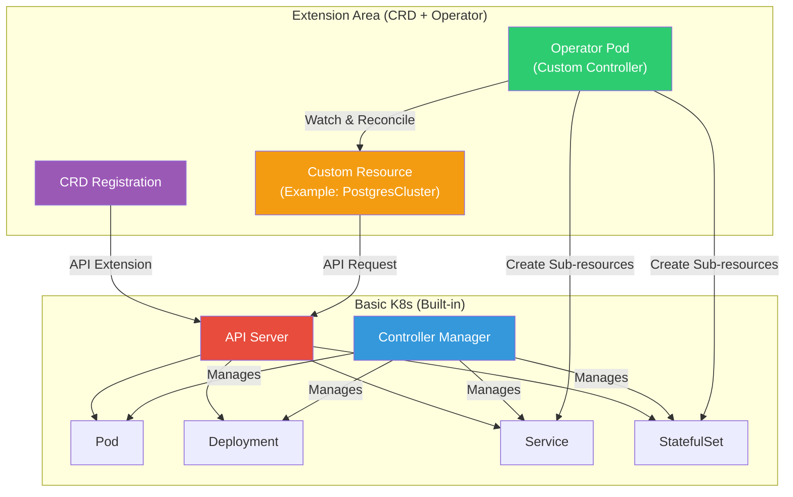
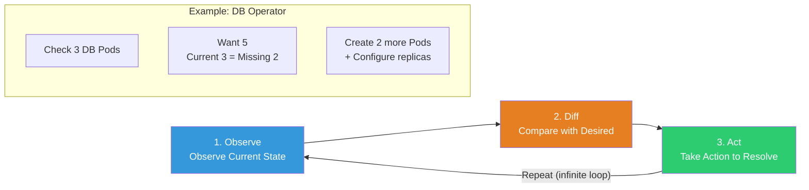
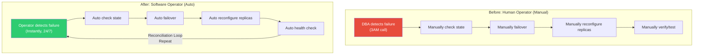
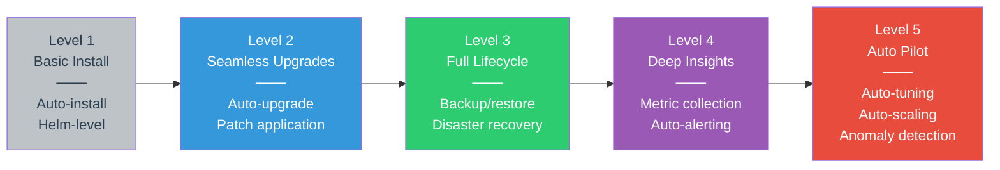
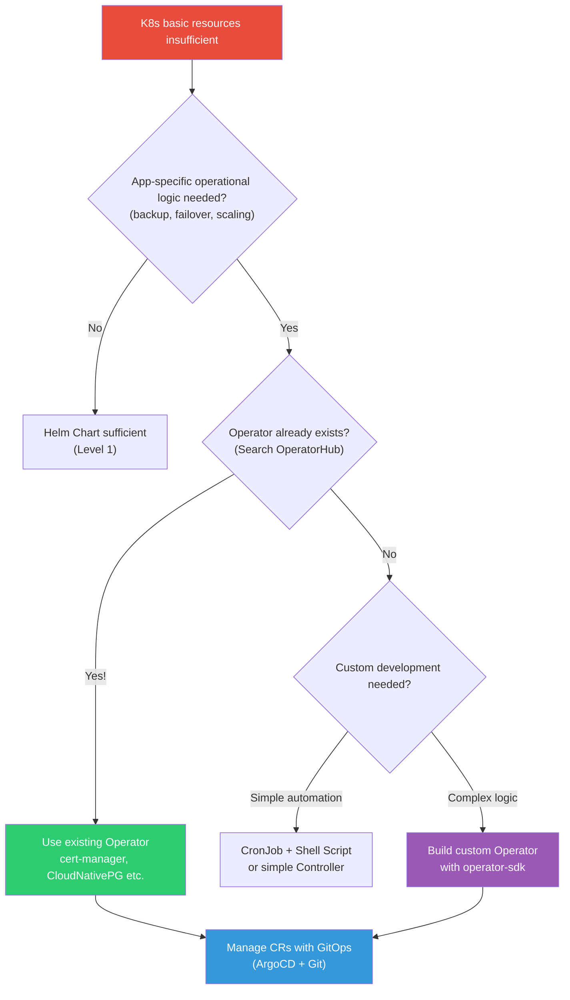

# Operator / CRD

> Managing complex applications with just K8s basic resources (Deployment, StatefulSet, etc.) is difficult. Just as the Controller Manager from [K8s Architecture](./01-architecture) manages basic resources, you can **define your own resources with CRD** and **automate operational logic with Operator**. [Helm](./12-helm-kustomize) installation and solving DB operational automation limitations of [StatefulSet](./03-statefulset-daemonset) is the core pattern.

---

## 🎯 Why You Need to Know This

```
When Operator/CRD is needed in real work:
• "Auto-failover for PostgreSQL cluster"          → CloudNativePG Operator
• "Auto-renew TLS certificates"                   → cert-manager Operator
• "Auto-scale Kafka cluster"                      → Strimzi Operator
• "Auto-register monitoring targets"              → Prometheus Operator
• "Manage DB backups declaratively with CRD"     → Custom Operator
• "View our app status with kubectl get"          → CRD definition
• Interview: "Explain the Operator pattern" (senior-level must-know!)
```

---

## 🧠 Core Concepts

### Analogy: Automated Apartment Management System

Let me compare Operator to an **automated apartment management system**.

* **CRD (Custom Resource Definition)** = Management rulebook. Define new management items like "swimming pool temp is 28°C, parking auto-assigned, packages stored in parcel locker."
* **CR (Custom Resource)** = Actual management request. A specific request like "raise pool temp to 30°C."
* **Operator** = AI management robot. Reads the rulebook (CRD), processes requests (CR), checks current state, and automatically adjusts to desired state.
* **Reconciliation Loop** = Manager's patrol rounds. "Is the pool 28°C? No? Turn on the heater!" — constantly comparing desired vs current state and reconciling.

A regular human manager can't respond after they leave work, but an **Operator (AI robot manager)** works 24/7 without rest!

### K8s API Extension Structure



### Operator Pattern = Reconciliation Loop



### With vs Without Operator

| Situation | Without Operator (Manual) | With Operator (Auto) |
|-----------|---------------------------|----------------------|
| Add DB replicas | Modify StatefulSet replicas + manually setup replication | Change replicas in CR and done |
| DB failover | Manual detection → promote → config changes | Auto detection → auto promote → auto config |
| TLS cert renewal | Manual renewal before expiry → update Secret | cert-manager auto-renews |
| Backup | Manual CronJob setup + script management | Declare CRD with `Schedule: "0 2 * * *"` |
| Version upgrade | Manual rolling update + compatibility check | Operator safely upgrades sequentially |

---

## 🔍 Detailed Explanation

### What is CRD?

CRD (Custom Resource Definition) is a way to **extend** K8s API. K8s has built-in Pod, Service, Deployment, etc., but when you register a CRD, you can create **your own resource types** like `PostgresCluster`, `Certificate`, `Kafka`.

```yaml
# === CRD Definition Example: Create custom "Website" resource ===
apiVersion: apiextensions.k8s.io/v1   # CRD-specific API group
kind: CustomResourceDefinition
metadata:
  name: websites.webapp.example.com    # Must be {plural}.{group} format
spec:
  group: webapp.example.com            # API group (domain in reverse)

  versions:
    - name: v1                         # API version
      served: true                     # Can requests use this version?
      storage: true                    # Store in etcd with this version?
      schema:
        openAPIV3Schema:               # Resource schema (required!)
          type: object
          properties:
            spec:
              type: object
              required: ["image", "replicas"]    # Required fields
              properties:
                image:
                  type: string
                  description: "Container image"
                replicas:
                  type: integer
                  minimum: 1
                  maximum: 10
                  description: "Number of replicas"
                domain:
                  type: string
                  description: "Domain name"
            status:
              type: object
              properties:
                availableReplicas:
                  type: integer
                url:
                  type: string

      # Columns to show in kubectl get (readability!)
      additionalPrinterColumns:
        - name: Image
          type: string
          jsonPath: .spec.image
        - name: Replicas
          type: integer
          jsonPath: .spec.replicas
        - name: URL
          type: string
          jsonPath: .status.url
        - name: Age
          type: date
          jsonPath: .metadata.creationTimestamp

  scope: Namespaced                    # Namespaced or Cluster

  names:
    plural: websites                   # kubectl get websites
    singular: website                  # kubectl get website
    kind: Website                      # kind: Website in YAML
    shortNames:
      - ws                             # kubectl get ws (shorthand)
    categories:
      - all                            # Included in kubectl get all
```

```bash
# Register CRD
kubectl apply -f website-crd.yaml
# customresourcedefinition.apiextensions.k8s.io/websites.webapp.example.com created

# Verify CRD is registered
kubectl get crd
# NAME                                CREATED AT
# websites.webapp.example.com         2026-03-13T09:00:00Z
# certificates.cert-manager.io        2026-03-10T08:00:00Z     ← cert-manager CRD
# prometheuses.monitoring.coreos.com  2026-03-10T08:00:00Z     ← Prometheus Operator CRD

# CRD details
kubectl describe crd websites.webapp.example.com
# Name:         websites.webapp.example.com
# Group:        webapp.example.com
# Version:      v1
# Scope:        Namespaced
# Kind:         Website
# Short Names:  ws
```

Once you register a CRD, you can now create resources of type `Website`.

```yaml
# === Create Custom Resource (CR): Website instance ===
apiVersion: webapp.example.com/v1     # group/version defined in CRD
kind: Website                         # kind defined in CRD
metadata:
  name: my-portfolio
  namespace: default
spec:
  image: nginx:1.25                   # Field matching CRD schema
  replicas: 3
  domain: portfolio.example.com
```

```bash
# Create CR
kubectl apply -f my-website.yaml
# website.webapp.example.com/my-portfolio created

# Query CR (using shorthand!)
kubectl get ws
# NAME           IMAGE        REPLICAS   URL   AGE
# my-portfolio   nginx:1.25   3                 5s

# CR details
kubectl describe ws my-portfolio

# Delete CR
kubectl delete ws my-portfolio
```

> At this point, we only have CRD + CR. **No Pod is actually created yet!** To make it work, you need an Operator (controller).

---

### Operator Pattern

#### Why is it needed? — StatefulSet alone is insufficient

[StatefulSet](./03-statefulset-daemonset) provides stable network IDs and persistent storage, but **application-level operational logic** is not handled.

```
What StatefulSet provides:
✅ Create Pods sequentially (db-0 → db-1 → db-2)
✅ Stable DNS (db-0.db-svc.ns.svc.cluster.local)
✅ Unique PVC per Pod
✅ Sequential updates

What StatefulSet doesn't provide:
❌ Auto Primary/Replica setup (replication configuration)
❌ Auto failover (promote Replica if Primary dies)
❌ Auto backup/restore
❌ Data migration during version upgrade
❌ Auto monitoring registration
❌ Connection Pooling management
```

This is why Operator is needed. **Software takes over operational work humans used to do!**

#### From Human Operator to Software Operator



#### Reconciliation Loop in Detail

The core of Operator is the **Reconciliation Loop**. It's the same pattern as the Controller Manager from [K8s Architecture](./01-architecture).

```go
// === Core Operator Logic (pseudocode) ===
// controller-runtime based Reconcile function

func (r *PostgresClusterReconciler) Reconcile(ctx context.Context, req ctrl.Request) (ctrl.Result, error) {
    // 1. Get CR (Custom Resource)
    cluster := &v1.PostgresCluster{}
    err := r.Get(ctx, req.NamespacedName, cluster)

    // 2. Read desired state (Desired State)
    desiredReplicas := cluster.Spec.Replicas   // Example: 3

    // 3. Check current state (Current State)
    currentPods := r.listPostgresPods(cluster)  // Example: 2 running

    // 4. Calculate diff (Diff) + action (Act)
    if len(currentPods) < desiredReplicas {
        // Add Pods + Configure Replication
        r.scaleUp(cluster)
    } else if len(currentPods) > desiredReplicas {
        // Safely remove Pods + Sync data
        r.scaleDown(cluster)
    }

    // 5. Check Primary health
    if !r.isPrimaryHealthy(cluster) {
        r.performFailover(cluster)  // Auto failover!
    }

    // 6. Update status
    cluster.Status.ReadyReplicas = len(healthyPods)
    r.Status().Update(ctx, cluster)

    // 7. Reconcile again after some time (periodic check)
    return ctrl.Result{RequeueAfter: 30 * time.Second}, nil
}
```

---

### Key Operator Examples

#### 1. Prometheus Operator (Monitoring)

```yaml
# === ServiceMonitor CRD — Auto-register monitoring targets ===
# CRD installed by Prometheus Operator
apiVersion: monitoring.coreos.com/v1
kind: ServiceMonitor
metadata:
  name: my-app-monitor
  namespace: monitoring
  labels:
    release: prometheus                 # Prometheus looks at this label
spec:
  selector:
    matchLabels:
      app: my-web-app                   # Monitor Services with this label
  endpoints:
    - port: metrics                     # Service port "metrics"
      interval: 15s                     # Scrape every 15s
      path: /metrics                    # Metrics endpoint
  namespaceSelector:
    matchNames:
      - production                      # Look in production namespace
```

```bash
# CRDs provided by Prometheus Operator
kubectl get crd | grep monitoring
# alertmanagerconfigs.monitoring.coreos.com
# alertmanagers.monitoring.coreos.com
# podmonitors.monitoring.coreos.com
# prometheuses.monitoring.coreos.com
# prometheusrules.monitoring.coreos.com
# servicemonitors.monitoring.coreos.com
# thanosrulers.monitoring.coreos.com

# Query ServiceMonitor
kubectl get servicemonitor -n monitoring
# NAME              AGE
# my-app-monitor    5m
```

#### 2. cert-manager (Certificate Automation)

```yaml
# === Certificate CRD — Auto-issue/renew TLS certificates ===
apiVersion: cert-manager.io/v1
kind: Certificate
metadata:
  name: my-app-tls
  namespace: production
spec:
  secretName: my-app-tls-secret        # Secret to store certificate
  issuerRef:
    name: letsencrypt-prod             # Which Issuer to use
    kind: ClusterIssuer
  dnsNames:
    - myapp.example.com                # Certificate domain
    - www.myapp.example.com
  renewBefore: 360h                    # Auto-renew 15 days before expiry
---
# === ClusterIssuer CRD — Certificate issuer configuration ===
apiVersion: cert-manager.io/v1
kind: ClusterIssuer
metadata:
  name: letsencrypt-prod
spec:
  acme:
    server: https://acme-v02.api.letsencrypt.org/directory
    email: admin@example.com
    privateKeySecretRef:
      name: letsencrypt-prod-key
    solvers:
      - http01:
          ingress:
            class: nginx
```

```bash
# cert-manager CRDs
kubectl get crd | grep cert-manager
# certificaterequests.cert-manager.io
# certificates.cert-manager.io
# challenges.acme.cert-manager.io
# clusterissuers.cert-manager.io
# issuers.cert-manager.io
# orders.acme.cert-manager.io

# Check certificate status
kubectl get certificate -n production
# NAME         READY   SECRET              AGE
# my-app-tls   True    my-app-tls-secret   30m

# Certificate details (expiry, renewal date, etc.)
kubectl describe certificate my-app-tls -n production
```

#### 3. CloudNativePG (PostgreSQL Operator)

```yaml
# === Cluster CRD — Declarative PostgreSQL cluster management ===
apiVersion: postgresql.cnpg.io/v1
kind: Cluster
metadata:
  name: my-postgres
  namespace: database
spec:
  instances: 3                         # Primary 1 + Replica 2 (auto-configured!)

  postgresql:
    parameters:
      max_connections: "200"
      shared_buffers: "512MB"

  storage:
    size: 50Gi
    storageClass: gp3

  backup:
    barmanObjectStore:                 # Auto-backup to S3!
      destinationPath: s3://my-backups/postgres/
      s3Credentials:
        accessKeyId:
          name: aws-creds
          key: ACCESS_KEY_ID
        secretAccessKey:
          name: aws-creds
          key: SECRET_ACCESS_KEY
    retentionPolicy: "30d"            # Keep for 30 days

  monitoring:
    enablePodMonitor: true            # Auto Prometheus integration
```

```bash
# CloudNativePG cluster status
kubectl get cluster -n database
# NAME          INSTANCES   READY   STATUS                   AGE
# my-postgres   3           3       Cluster in healthy state  1h

# Pod check — Primary/Replica auto-configured!
kubectl get pods -n database -l cnpg.io/cluster=my-postgres
# NAME            READY   STATUS    ROLE      AGE
# my-postgres-1   1/1     Running   primary   1h
# my-postgres-2   1/1     Running   replica   1h
# my-postgres-3   1/1     Running   replica   1h
```

#### 4. Strimzi (Kafka Operator)

```yaml
# === Kafka CRD — Declarative Kafka cluster management ===
apiVersion: kafka.strimzi.io/v1beta2
kind: Kafka
metadata:
  name: my-cluster
  namespace: kafka
spec:
  kafka:
    version: 3.7.0
    replicas: 3                        # 3 brokers
    listeners:
      - name: plain
        port: 9092
        type: internal
        tls: false
      - name: tls
        port: 9093
        type: internal
        tls: true
    storage:
      type: persistent-claim
      size: 100Gi
      class: gp3
    config:
      offsets.topic.replication.factor: 3
      transaction.state.log.replication.factor: 3
      default.replication.factor: 3

  zookeeper:
    replicas: 3
    storage:
      type: persistent-claim
      size: 20Gi

  entityOperator:                      # Include Topic/User management Operator!
    topicOperator: {}
    userOperator: {}
```

---

### Operator Installation/Management

#### Method 1: Install with Helm (Most Common)

[Helm](./12-helm-kustomize) installation of Operator is most common in real work.

```bash
# === cert-manager Installation (Helm) ===

# 1. Add repository
helm repo add jetstack https://charts.jetstack.io
helm repo update

# 2. Install with CRD
helm install cert-manager jetstack/cert-manager \
  --namespace cert-manager \
  --create-namespace \
  --set crds.enabled=true \
  --version v1.14.4

# Verify installation
kubectl get pods -n cert-manager
# NAME                                       READY   STATUS    AGE
# cert-manager-7b8c77d4bd-xxxxx              1/1     Running   1m
# cert-manager-cainjector-5c5695d97c-xxxxx   1/1     Running   1m
# cert-manager-webhook-6f97bb7d84-xxxxx      1/1     Running   1m

# Verify CRD
kubectl get crd | grep cert-manager
# certificates.cert-manager.io               2026-03-13T09:00:00Z
# clusterissuers.cert-manager.io             2026-03-13T09:00:00Z
# issuers.cert-manager.io                    2026-03-13T09:00:00Z
# ...
```

```bash
# === Prometheus Operator (kube-prometheus-stack) Installation ===
helm repo add prometheus-community https://prometheus-community.github.io/helm-charts
helm repo update

helm install prometheus prometheus-community/kube-prometheus-stack \
  --namespace monitoring \
  --create-namespace \
  --set grafana.adminPassword=mypassword
```

#### Method 2: OLM (Operator Lifecycle Manager)

OLM is an **Operator for Operators** that manages Operator installation, upgrade, and RBAC. It's built-in on OpenShift and can be installed on regular K8s.

```bash
# Install OLM (regular K8s)
curl -sL https://github.com/operator-framework/operator-lifecycle-manager/releases/download/v0.28.0/install.sh | bash -s v0.28.0

# Verify OLM
kubectl get pods -n olm
# NAME                                READY   STATUS    AGE
# olm-operator-xxxx                   1/1     Running   1m
# catalog-operator-xxxx               1/1     Running   1m
# packageserver-xxxx                  1/1     Running   1m

# List available Operators from OperatorHub
kubectl get packagemanifest
# NAME                      CATALOG               AGE
# prometheus                Community Operators   1m
# strimzi-kafka-operator    Community Operators   1m
# ...
```

#### Method 3: OperatorHub.io

[OperatorHub.io](https://operatorhub.io) is a catalog site for Operators. You can check installation methods, CRD lists, and usage examples for each Operator.

```bash
# Direct installation from OperatorHub via kubectl
# (Usually the Operator documentation has the install command)

# Example: Direct Strimzi Kafka Operator Installation
kubectl create namespace kafka
kubectl apply -f https://strimzi.io/install/latest?namespace=kafka

# Verify installation
kubectl get pods -n kafka
# NAME                                        READY   STATUS    AGE
# strimzi-cluster-operator-xxxx               1/1     Running   1m
```

#### operator-sdk Introduction

To build your own Operator, use `operator-sdk`. You can generate Operators based on Go, Ansible, or Helm.

```bash
# Install operator-sdk
brew install operator-sdk   # macOS
# Or
curl -LO https://github.com/operator-framework/operator-sdk/releases/download/v1.34.0/operator-sdk_linux_amd64
chmod +x operator-sdk_linux_amd64 && sudo mv operator-sdk_linux_amd64 /usr/local/bin/operator-sdk

# Create Go-based Operator project
operator-sdk init --domain example.com --repo github.com/example/my-operator

# Scaffold API (CRD) + Controller
operator-sdk create api --group webapp --version v1 --kind Website --resource --controller

# Generated project structure
# my-operator/
# ├── api/v1/                    # CRD type definitions
# │   └── website_types.go       # Website struct
# ├── internal/controller/       # Controller logic
# │   └── website_controller.go  # Reconcile function
# ├── config/
# │   ├── crd/                   # Auto-generated CRD YAML
# │   ├── rbac/                  # RBAC configuration
# │   └── manager/               # Operator Deployment
# ├── Dockerfile                 # Operator image build
# └── Makefile                   # Build/deploy automation
```

---

### Operator Maturity Model

Operator maturity is divided into 5 levels. Higher levels mean deeper automation.



| Level | Name | Automation Scope | Example |
|-------|------|------------------|---------|
| 1 | Basic Install | Auto install/delete | Helm Chart level |
| 2 | Seamless Upgrades | Auto upgrade, config changes | Seamless version upgrade |
| 3 | Full Lifecycle | Backup, restore, disaster recovery | CloudNativePG, Strimzi |
| 4 | Deep Insights | Metrics, alerting, log integration | Prometheus Operator |
| 5 | Auto Pilot | Auto-tuning, anomaly detection, auto-scaling | Some commercial Operators |

---

## 💻 Hands-on Examples

### Exercise 1: Define CRD + Create CR

Let's create a CRD and custom resource ourselves.

```yaml
# website-crd.yaml
# === Define custom Website resource type ===
apiVersion: apiextensions.k8s.io/v1
kind: CustomResourceDefinition
metadata:
  name: websites.webapp.example.com
spec:
  group: webapp.example.com
  versions:
    - name: v1
      served: true
      storage: true
      schema:
        openAPIV3Schema:
          type: object
          properties:
            spec:
              type: object
              required: ["image", "replicas"]
              properties:
                image:
                  type: string
                replicas:
                  type: integer
                  minimum: 1
                  maximum: 10
                domain:
                  type: string
            status:
              type: object
              properties:
                phase:
                  type: string
                availableReplicas:
                  type: integer
      subresources:
        status: {}                      # Enable /status subresource
      additionalPrinterColumns:
        - name: Image
          type: string
          jsonPath: .spec.image
        - name: Replicas
          type: integer
          jsonPath: .spec.replicas
        - name: Phase
          type: string
          jsonPath: .status.phase
        - name: Age
          type: date
          jsonPath: .metadata.creationTimestamp
  scope: Namespaced
  names:
    plural: websites
    singular: website
    kind: Website
    shortNames:
      - ws
```

```bash
# Step 1: Register CRD
kubectl apply -f website-crd.yaml
# customresourcedefinition.apiextensions.k8s.io/websites.webapp.example.com created

# Step 2: Verify CRD registration
kubectl get crd websites.webapp.example.com
# NAME                            CREATED AT
# websites.webapp.example.com     2026-03-13T09:00:00Z

# Step 3: Verify API resource registration
kubectl api-resources | grep website
# websites   ws   webapp.example.com/v1   true   Website
```

```yaml
# my-website.yaml
# === Create Custom Resource instance ===
apiVersion: webapp.example.com/v1
kind: Website
metadata:
  name: my-portfolio
  namespace: default
spec:
  image: nginx:1.25-alpine
  replicas: 3
  domain: portfolio.example.com
```

```bash
# Step 4: Create CR
kubectl apply -f my-website.yaml
# website.webapp.example.com/my-portfolio created

# Step 5: Query CR (using shorthand ws)
kubectl get ws
# NAME           IMAGE               REPLICAS   PHASE   AGE
# my-portfolio   nginx:1.25-alpine   3                  10s

# Step 6: Output YAML
kubectl get ws my-portfolio -o yaml
# apiVersion: webapp.example.com/v1
# kind: Website
# metadata:
#   name: my-portfolio
#   namespace: default
# spec:
#   image: nginx:1.25-alpine
#   replicas: 3
#   domain: portfolio.example.com

# Step 7: Schema validation check — error if replicas exceed max!
# (replicas: 20 would error with)
# The Website "test" is invalid: spec.replicas: Invalid value: 20: spec.replicas in body should be less than or equal to 10

# Step 8: Cleanup
kubectl delete ws my-portfolio
kubectl delete crd websites.webapp.example.com
```

---

### Exercise 2: Install cert-manager + Issue Certificates

Let's install and use cert-manager, one of the most-used Operators in real work.

```bash
# === Step 1: Install cert-manager (Helm) ===
helm repo add jetstack https://charts.jetstack.io
helm repo update

helm install cert-manager jetstack/cert-manager \
  --namespace cert-manager \
  --create-namespace \
  --set crds.enabled=true \
  --version v1.14.4

# Verify installation
kubectl get pods -n cert-manager
# NAME                                       READY   STATUS    AGE
# cert-manager-7b8c77d4bd-xxxxx              1/1     Running   30s
# cert-manager-cainjector-5c5695d97c-xxxxx   1/1     Running   30s
# cert-manager-webhook-6f97bb7d84-xxxxx      1/1     Running   30s

# Verify CRDs installed by cert-manager
kubectl get crd | grep cert-manager
# certificaterequests.cert-manager.io         2026-03-13T09:00:00Z
# certificates.cert-manager.io               2026-03-13T09:00:00Z
# challenges.acme.cert-manager.io            2026-03-13T09:00:00Z
# clusterissuers.cert-manager.io             2026-03-13T09:00:00Z
# issuers.cert-manager.io                    2026-03-13T09:00:00Z
# orders.acme.cert-manager.io                2026-03-13T09:00:00Z
```

```yaml
# === Step 2: Create Self-Signed Issuer (testing) ===
# self-signed-issuer.yaml
apiVersion: cert-manager.io/v1
kind: ClusterIssuer
metadata:
  name: selfsigned-issuer
spec:
  selfSigned: {}                        # Self-signed (testing)
---
# === Step 3: Request Certificate ===
# test-certificate.yaml
apiVersion: cert-manager.io/v1
kind: Certificate
metadata:
  name: test-tls
  namespace: default
spec:
  secretName: test-tls-secret           # Secret to store certificate
  duration: 2160h                       # 90-day validity
  renewBefore: 360h                     # Auto-renew 15 days before expiry!
  issuerRef:
    name: selfsigned-issuer
    kind: ClusterIssuer
  commonName: test.example.com
  dnsNames:
    - test.example.com
    - www.test.example.com
```

```bash
# Create Issuer + Certificate
kubectl apply -f self-signed-issuer.yaml
kubectl apply -f test-certificate.yaml

# Check certificate status
kubectl get certificate
# NAME       READY   SECRET            AGE
# test-tls   True    test-tls-secret   30s

# Certificate details
kubectl describe certificate test-tls
# Events:
#   Normal  Issuing    10s   cert-manager  Issuing certificate as Secret does not exist
#   Normal  Generated  9s    cert-manager  Stored new private key in temporary Secret
#   Normal  Requested  9s    cert-manager  Created new CertificateRequest resource "test-tls-xxxxx"
#   Normal  Issuing    9s    cert-manager  The certificate has been successfully issued

# Certificate auto-created as Secret!
kubectl get secret test-tls-secret
# NAME              TYPE                DATA   AGE
# test-tls-secret   kubernetes.io/tls   3      30s

# View certificate content
kubectl get secret test-tls-secret -o jsonpath='{.data.tls\.crt}' | base64 -d | openssl x509 -text -noout | head -15
# Certificate:
#     Data:
#         Version: 3 (0x2)
#         Serial Number: ...
#     Signature Algorithm: ...
#         Issuer: CN = test.example.com
#         Validity
#             Not Before: Mar 13 09:00:00 2026 GMT
#             Not After : Jun 11 09:00:00 2026 GMT
#         Subject: CN = test.example.com
```

---

### Exercise 3: Set up ServiceMonitor with Prometheus Operator

Let's auto-register application monitoring using Prometheus Operator.

```bash
# === Step 1: Install kube-prometheus-stack (if not already installed) ===
helm repo add prometheus-community https://prometheus-community.github.io/helm-charts
helm repo update

helm install prometheus prometheus-community/kube-prometheus-stack \
  --namespace monitoring \
  --create-namespace

# Verify Prometheus Operator CRDs
kubectl get crd | grep monitoring.coreos.com
# alertmanagerconfigs.monitoring.coreos.com    2026-03-13T09:00:00Z
# prometheuses.monitoring.coreos.com          2026-03-13T09:00:00Z
# servicemonitors.monitoring.coreos.com       2026-03-13T09:00:00Z
# ...
```

```yaml
# === Step 2: Deploy sample app + Service ===
# sample-app.yaml
apiVersion: apps/v1
kind: Deployment
metadata:
  name: sample-app
  namespace: default
spec:
  replicas: 2
  selector:
    matchLabels:
      app: sample-app
  template:
    metadata:
      labels:
        app: sample-app
    spec:
      containers:
        - name: app
          image: prom/prometheus:latest    # Example app that exposes metrics
          ports:
            - name: metrics
              containerPort: 9090
---
apiVersion: v1
kind: Service
metadata:
  name: sample-app-svc
  namespace: default
  labels:
    app: sample-app                        # ServiceMonitor looks at this label!
spec:
  selector:
    app: sample-app
  ports:
    - name: metrics
      port: 9090
      targetPort: metrics
```

```yaml
# === Step 3: Auto-register monitoring with ServiceMonitor ===
# service-monitor.yaml
apiVersion: monitoring.coreos.com/v1
kind: ServiceMonitor
metadata:
  name: sample-app-monitor
  namespace: monitoring                    # Namespace where Prometheus is
  labels:
    release: prometheus                    # kube-prometheus-stack looks for this!
spec:
  selector:
    matchLabels:
      app: sample-app                      # Target Service label
  namespaceSelector:
    matchNames:
      - default                            # Target Service namespace
  endpoints:
    - port: metrics                        # Service port name
      interval: 30s                        # Collect metrics every 30s
      path: /metrics                       # Metrics endpoint
```

```bash
# Deploy
kubectl apply -f sample-app.yaml
kubectl apply -f service-monitor.yaml

# Verify ServiceMonitor
kubectl get servicemonitor -n monitoring
# NAME                 AGE
# sample-app-monitor   10s

# Check if auto-registered in Prometheus targets
# (Prometheus UI: Status > Targets)
kubectl port-forward svc/prometheus-kube-prometheus-prometheus -n monitoring 9090:9090
# Open browser to http://localhost:9090/targets
# → Look for serviceMonitor/monitoring/sample-app-monitor!
```

---

## 🏢 In Real Work

### Scenario 1: Auto-operate PostgreSQL Cluster

```yaml
# === CloudNativePG for production PostgreSQL cluster ===
apiVersion: postgresql.cnpg.io/v1
kind: Cluster
metadata:
  name: prod-postgres
  namespace: database
spec:
  instances: 3                             # Primary 1 + Replica 2 auto-configured

  postgresql:
    parameters:
      max_connections: "300"
      shared_buffers: "1GB"
      effective_cache_size: "3GB"
      work_mem: "16MB"

  resources:
    requests:
      memory: "2Gi"
      cpu: "1"
    limits:
      memory: "4Gi"
      cpu: "2"

  storage:
    size: 100Gi
    storageClass: gp3-encrypted

  # Auto-backup configuration (S3)
  backup:
    barmanObjectStore:
      destinationPath: s3://company-backups/postgres/prod/
      s3Credentials:
        accessKeyId:
          name: aws-creds
          key: ACCESS_KEY_ID
        secretAccessKey:
          name: aws-creds
          key: SECRET_ACCESS_KEY
      wal:
        compression: gzip
    retentionPolicy: "30d"               # Keep 30 days

  # Auto-failover configuration
  minSyncReplicas: 1                     # Minimum 1 sync replica
  maxSyncReplicas: 1                     # Maximum 1 sync replica

  # Auto-monitoring integration
  monitoring:
    enablePodMonitor: true               # Auto Prometheus integration!
```

```bash
# Test auto-failover
kubectl delete pod prod-postgres-1 -n database
# → Operator automatically:
#   1. Promote Replica (prod-postgres-2) to Primary
#   2. Create new Pod as Replica
#   3. Reconfigure Replication
#   4. Auto-switch app connections
```

### Scenario 2: Kafka + Auto-monitoring

```yaml
# === Strimzi for Kafka cluster + auto-monitoring ===
apiVersion: kafka.strimzi.io/v1beta2
kind: Kafka
metadata:
  name: prod-kafka
  namespace: kafka
spec:
  kafka:
    version: 3.7.0
    replicas: 3
    listeners:
      - name: internal
        port: 9092
        type: internal
        tls: true                          # Internal communication also TLS!
    storage:
      type: persistent-claim
      size: 500Gi
      class: gp3
    metricsConfig:                         # Auto-expose JMX metrics
      type: jmxPrometheusExporter
      valueFrom:
        configMapKeyRef:
          name: kafka-metrics
          key: kafka-metrics-config.yml
  zookeeper:
    replicas: 3
    storage:
      type: persistent-claim
      size: 20Gi
---
# Manage Topics declaratively with CRD too!
apiVersion: kafka.strimzi.io/v1beta2
kind: KafkaTopic
metadata:
  name: orders
  namespace: kafka
  labels:
    strimzi.io/cluster: prod-kafka
spec:
  partitions: 12                           # 12 partitions
  replicas: 3                              # Replica factor 3
  config:
    retention.ms: "604800000"              # Keep 7 days
    segment.bytes: "1073741824"            # 1GB segments
```

### Scenario 3: GitOps + Operator Combination

[Helm](./12-helm-kustomize) and ArgoCD to manage Operator-based infrastructure with GitOps pattern.

```yaml
# === ArgoCD Application — Manage Operator with GitOps ===
# argocd-apps/cert-manager.yaml
apiVersion: argoproj.io/v1alpha1
kind: Application
metadata:
  name: cert-manager
  namespace: argocd
spec:
  project: infrastructure
  source:
    repoURL: https://charts.jetstack.io
    targetRevision: v1.14.4
    chart: cert-manager
    helm:
      values: |
        crds:
          enabled: true
        replicaCount: 2
        podDisruptionBudget:
          enabled: true
  destination:
    server: https://kubernetes.default.svc
    namespace: cert-manager
  syncPolicy:
    automated:
      prune: true
      selfHeal: true                       # Auto-restore if manually changed!
---
# argocd-apps/postgres-cluster.yaml
apiVersion: argoproj.io/v1alpha1
kind: Application
metadata:
  name: prod-postgres
  namespace: argocd
spec:
  project: database
  source:
    repoURL: https://github.com/company/k8s-manifests.git
    path: database/postgres               # CR YAML location
    targetRevision: main
  destination:
    server: https://kubernetes.default.svc
    namespace: database
  syncPolicy:
    automated:
      selfHeal: true
```

```
Git repository structure:
k8s-manifests/
├── operators/                    # Operator installation (Helm values)
│   ├── cert-manager/
│   ├── cloudnativepg/
│   └── strimzi/
├── database/                     # CR (Custom Resource) management
│   └── postgres/
│       ├── cluster.yaml          # PostgreSQL cluster CR
│       └── backup-schedule.yaml  # Backup schedule CR
├── kafka/
│   ├── kafka-cluster.yaml
│   └── topics/
│       ├── orders.yaml
│       └── events.yaml
└── certificates/
    ├── issuers/
    │   └── letsencrypt-prod.yaml
    └── certs/
        ├── api-tls.yaml
        └── web-tls.yaml
```

---

## ⚠️ Common Mistakes

### Mistake 1: Don't know that deleting CRD also deletes CR

```
❌ Deleting CRD deletes all CR of that type!
   kubectl delete crd clusters.postgresql.cnpg.io
   → All PostgresCluster CRs deleted → Data loss risk!

✅ Always backup CR and check dependencies before deleting CRD
   kubectl get clusters.postgresql.cnpg.io --all-namespaces  # Check first
   # If Finalizer issues, removing Finalizer is safer than deleting CRD
```

### Mistake 2: Don't verify CRD compatibility during Operator upgrade

```
❌ Major version upgrade without checking CRD schema changes
   helm upgrade cert-manager --version v2.0.0  # CRD schema may have changed!
   → Existing CR incompatible with new schema = error

✅ Check Breaking Changes in release notes before upgrade
   # Preview CRD changes
   helm template cert-manager jetstack/cert-manager --version v2.0.0 --show-only crds/ > new-crds.yaml
   kubectl diff -f new-crds.yaml
   # Staged upgrade (1.12 → 1.13 → 1.14, never major jumps)
```

### Mistake 3: Operator RBAC permissions insufficient

```
❌ Operator Pod lacks permissions to create/modify required resources
   # "forbidden" errors constantly in Operator logs
   # → CR created but sub-resources (Pod, Service) not created

✅ Verify Operator ServiceAccount + ClusterRole
   kubectl get clusterrolebinding | grep operator-name
   kubectl describe clusterrole operator-name-role
   # Check Helm values for RBAC setting
   # rbac.create: true (should be default but verify!)
```

### Mistake 4: Manually modify CR Status

```
❌ Directly edit status fields with kubectl edit
   kubectl edit website my-site
   # status.phase: "Ready"  ← Manual edit (Operator overwrites!)

✅ Status is Operator's domain. Only modify spec
   # spec change → Operator detects → does work → auto-updates status
   kubectl patch website my-site --type=merge -p '{"spec":{"replicas":5}}'
   # Operator will update status automatically
```

### Mistake 5: Leave resources stuck due to Finalizer

```
❌ CR deletion stuck, force-delete without understanding
   kubectl delete cluster my-postgres --force --grace-period=0
   → Sub-resources (PVC, Secret) not cleaned up!

✅ Understand Finalizer and resolve step by step
   # 1. Check why deletion is stuck
   kubectl get cluster my-postgres -o jsonpath='{.metadata.finalizers}'
   # ["cnpg.io/cluster"]

   # 2. Check if Operator is alive (must be for finalizer removal)
   kubectl get pods -n cnpg-system

   # 3. If Operator ok but stuck → check Operator logs
   kubectl logs -n cnpg-system deploy/cnpg-controller-manager

   # 4. Last resort: manually remove Finalizer (must clean sub-resources manually!)
   kubectl patch cluster my-postgres -p '{"metadata":{"finalizers":null}}' --type=merge
```

---

## 📝 Summary

```
CRD / Operator core summary:

1. CRD = K8s API Extension
   - Define new resource types with apiextensions.k8s.io/v1
   - Manage with kubectl get/create/delete
   - Enforce with OpenAPI v3 schema

2. Operator = Automated Operator
   - CRD + Controller (Reconciliation Loop)
   - Automate operational tasks humans used to do
   - Auto install/upgrade/backup/failover

3. Key Operators
   - cert-manager: Auto-issue/renew TLS certificates
   - Prometheus Operator: Auto-register monitoring with ServiceMonitor
   - CloudNativePG: Auto-operate PostgreSQL cluster
   - Strimzi: Auto-operate Kafka cluster

4. Installation Methods
   - Helm (most common) → helm install
   - OLM (Operator Lifecycle Manager) → OpenShift built-in
   - OperatorHub.io → Browse catalog

5. Maturity Model
   - Level 1: Basic Install (auto-install)
   - Level 2: Seamless Upgrades (auto-upgrade)
   - Level 3: Full Lifecycle (backup/restore/failover)
   - Level 4: Deep Insights (metrics/alerting integration)
   - Level 5: Auto Pilot (auto-tuning/scaling)

6. Core Commands
   - kubectl get crd                    → List registered CRDs
   - kubectl describe crd <name>        → CRD details
   - kubectl get <resource>             → Query CRs
   - kubectl api-resources | grep <name> → Verify API registration
```



| Concept | One-liner |
|---------|-----------|
| CRD | Extend K8s API by registering new resource types |
| CR | Actual instance of a type defined by CRD |
| Operator | Custom controller that Watches and Reconciles CRs |
| Reconciliation Loop | Infinite loop matching current state to desired state |
| Finalizer | Guarantee cleanup before CR deletion |
| OLM | Framework managing Operator installation/upgrade |
| operator-sdk | SDK/CLI tool to help Operator development |

---

## 🔗 Next Lecture

> You've experienced K8s extensibility with Operator. Next is **Service Mesh** which manages inter-service communication intelligently. Since Istio/Linkerd also work CRD-based, this lecture's concepts connect directly!

[Next: Service Mesh (Istio/Linkerd) ->](./18-service-mesh)

**Related Lectures to Review:**
- [K8s Architecture](./01-architecture) -- Reconciliation Loop from Controller Manager
- [StatefulSet](./03-statefulset-daemonset) -- State management that Operator supplements
- [Helm / Kustomize](./12-helm-kustomize) -- Most common tool for Operator installation
- [Backup / DR](./16-backup-dr) -- Velero also manages backups CRD-based
