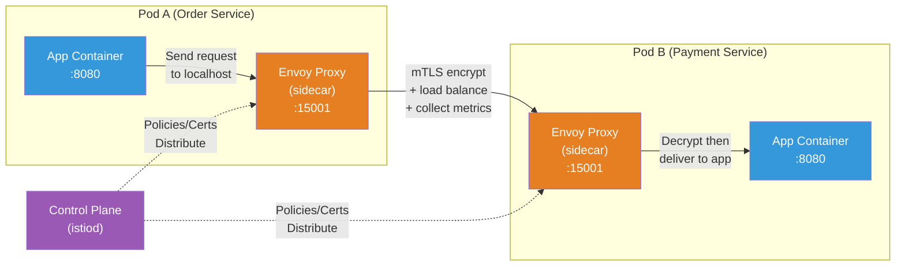
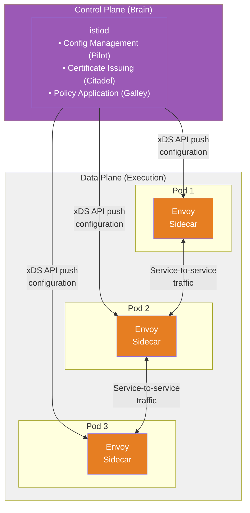
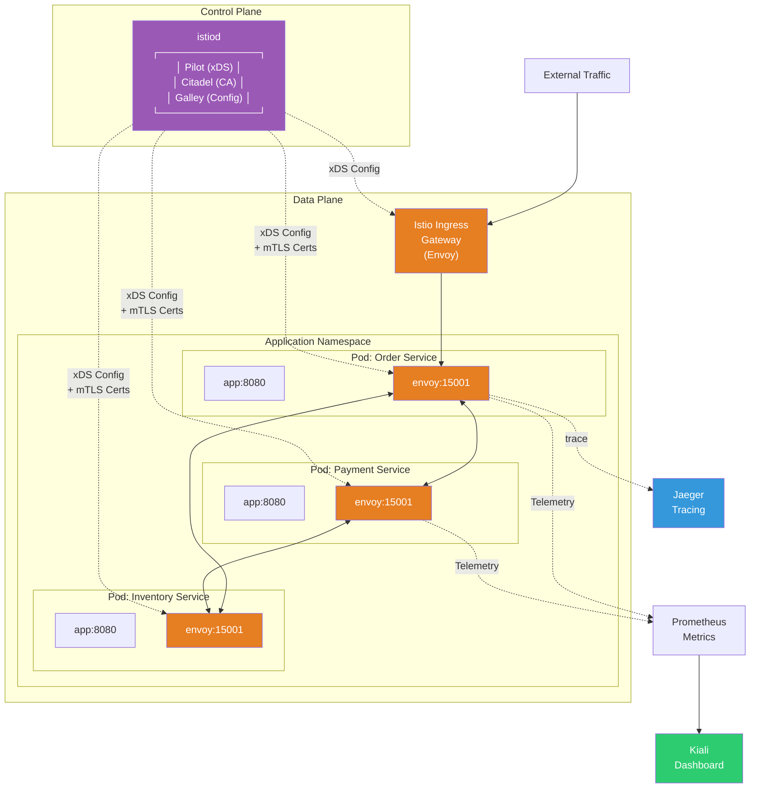
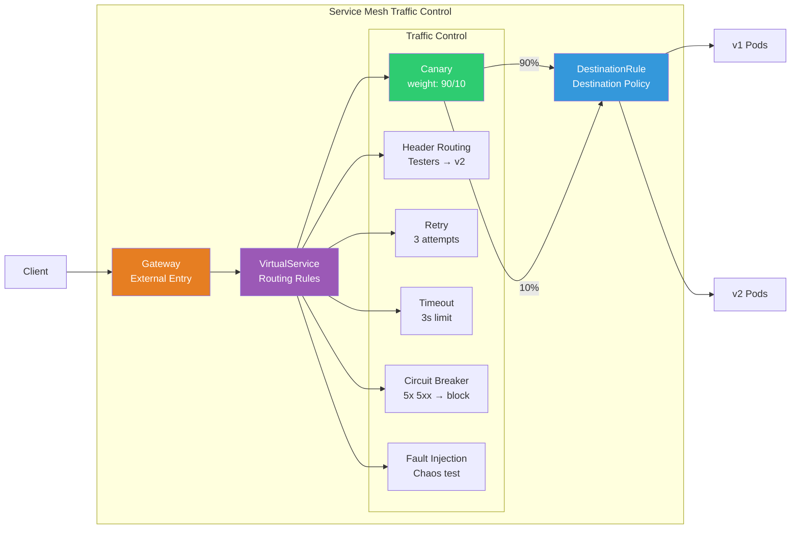

# Service Mesh — Envoy / Istio / Linkerd

> From [Service/Ingress](./05-service-ingress) you learned intra-cluster communication and external routing, from [CNI](./06-cni) you learned Pod network layer, from [Deployment Strategies](./09-operations) you learned canary/blue-green. When microservices scale to tens or hundreds, you want to manage inter-service communication **outside application code**. That's **Service Mesh**.

---

## 🎯 Why You Need to Know This

```
Service Mesh solves:
• "Apply mTLS to service-to-service communication"          → Istio auto-mTLS
• "Fine-grained canary with traffic percentage"             → VirtualService weight
• "Auto-retry/circuit-break when service calls fail"        → retry, circuit breaker
• "See which service calls where"                           → Auto distributed tracing
• "Nginx Ingress is reaching its limits"                    → Istio Gateway
• "Remove networking logic from app code"                   → sidecar proxy pattern
• Interview: "Explain Service Mesh, compare Istio & Linkerd"
```

---

## 🧠 Core Concepts

### Analogy: City Traffic Management System

Let me compare inter-service communication to **city traffic**.

* **Without Service Mesh** = A city with no traffic lights or police. Each vehicle (service) finds its own way; if there's an accident, they handle it.
* **Sidecar Proxy (Envoy)** = Each vehicle has its own **navigation + dashcam**. It guides direction and records all movements.
* **Control Plane (Istiod)** = **City traffic control center**. Sets overall traffic rules and pushes them to navigation systems in real-time.
* **mTLS** = Each vehicle has an **electronic permit**. Only authorized vehicles can use roads.
* **Circuit Breaker** = **Auto road closure** for accidents. Don't keep sending traffic to broken roads.
* **Canary Routing** = When opening a new road, send only **10% of vehicles** first to test.

### Sidecar Proxy Pattern

Service Mesh's core is **automatically injecting a proxy next to the application container**.



### Data Plane vs Control Plane



| Category | Data Plane | Control Plane |
|----------|-----------|---------------|
| **Role** | Handle actual traffic | Manage policies/config |
| **Components** | Envoy sidecar proxy | istiod (Istio), linkerd-destination (Linkerd) |
| **Operation** | Proxy intercepts all requests | Proxy rules distribution |
| **Analogy** | Each vehicle's navigation | Traffic control center |

---

## 🔍 Detailed Explanation

### What is Service Mesh?

**Service Mesh** is a dedicated layer that **transparently manages inter-microservice communication** at the infrastructure level.

```bash
# Networking challenges without Service Mesh:
# 1. Service A → B retry logic                 → Application code
# 2. mTLS communication                         → App has certificate management code
# 3. Canary deployment                          → Routing logic in app/Ingress
# 4. Metric collection                          → Prometheus instrumentation in app
# 5. Circuit breaker                            → Library integration (Hystrix etc.)

# With Service Mesh:
# → sidecar proxy handles all of above!
# → App focuses on business logic only!
# → Infrastructure team manages policies centrally!
```

**sidecar proxy pattern** operates **above** [CNI](./06-cni) which provides Pod network. CNI handles L3/L4 (IP/TCP), while Service Mesh controls at **L7 (HTTP/gRPC)**.

```bash
# Layered understanding:
# ┌─────────────────────────────────────┐
# │  Application (Business Logic)        │  ← App developers
# ├─────────────────────────────────────┤
# │  Service Mesh (L7 Traffic Mgmt)      │  ← Envoy sidecar ★ This lecture
# ├─────────────────────────────────────┤
# │  Service/Ingress (Discovery)        │  ← kube-proxy, Ingress Controller
# ├─────────────────────────────────────┤
# │  CNI (Pod Networking, L3/L4)        │  ← Calico, Cilium, VPC CNI
# ├─────────────────────────────────────┤
# │  Node Network (Physical/Virtual)     │  ← AWS VPC, On-Premises
# └─────────────────────────────────────┘
```

---

### Envoy Proxy

**Envoy** is a high-performance L7 proxy created by Lyft. Most Service Meshes use Envoy as Data Plane — Istio, Linkerd 2 (linkerd-proxy is Rust but same concept), AWS App Mesh.

```bash
# Why Envoy became the standard:
# 1. L7 Protocol Support: HTTP/1.1, HTTP/2, gRPC, WebSocket, TCP
# 2. xDS API: Dynamic config changes (no restart!)
# 3. Rich Filter Chain: Auth, rate limit, transformation etc. Plugin architecture
# 4. Observability Built-in: Auto metrics, access logs, tracing
# 5. CNCF Graduated Project: Large community and ecosystem
```

#### xDS API (Heart of Dynamic Configuration)

```bash
# xDS = x Discovery Service (x = various resource types)
# Envoy gets config via API, not config files!

# Main xDS APIs:
# • LDS (Listener Discovery): Which ports to listen
# • RDS (Route Discovery):    Route paths to destinations
# • CDS (Cluster Discovery):  List of upstream clusters (services)
# • EDS (Endpoint Discovery): Actual Pod IPs for each cluster
# • SDS (Secret Discovery):   TLS certs/keys

# Control Plane (istiod) pushes config via xDS
# → VirtualService change → istiod updates RDS → Envoy reflects instantly!
# → Pod add/delete → istiod updates EDS → Envoy detects instantly!
```

#### Envoy Filter Chain

```bash
# Request flow through Envoy:
#
# [Receive Request] → [Listener] → [Filter Chain] → [Router] → [Upstream Cluster]
#                                      │
#                                      ├── Network Filters (L4)
#                                      │   ├── TCP Proxy
#                                      │   └── Rate Limit
#                                      │
#                                      └── HTTP Filters (L7)
#                                          ├── Authentication (JWT Validation)
#                                          ├── Authorization (RBAC)
#                                          ├── Rate Limit
#                                          ├── Fault Injection (Testing)
#                                          └── Router (Final routing)
```

---

### Istio

Istio is the most widely-used Service Mesh. Created by Google, IBM, Lyft; now CNCF graduated project. Install with [Operator pattern](./17-operator-crd) and configure with CRD.

#### Istio Architecture



#### Install Istio (istioctl)

```bash
# Download and install istioctl
curl -L https://istio.io/downloadIstio | sh -
cd istio-1.22.0
export PATH=$PWD/bin:$PATH

# List available profiles
istioctl profile list
# Istio configuration profiles:
#     default      ← Production recommended (istiod + ingress gateway)
#     demo         ← For learning (all components)
#     minimal      ← istiod only
#     remote       ← Multi-cluster remote
#     ambient      ← Ambient mesh (no sidecar!)
#     empty

# Install with demo profile (for learning)
istioctl install --set profile=demo -y
# ✔ Istio core installed
# ✔ Istiod installed
# ✔ Egress gateways installed
# ✔ Ingress gateways installed
# ✔ Installation complete

# Verify installation
kubectl get pods -n istio-system
# NAME                                   READY   STATUS    AGE
# istiod-5d8f8b6b4-xxxxx                1/1     Running   30s
# istio-ingressgateway-7f8b9c-xxxxx     1/1     Running   25s
# istio-egressgateway-6c8d7a-xxxxx      1/1     Running   25s

# Enable sidecar auto-injection in namespace
kubectl label namespace default istio-injection=enabled
# namespace/default labeled

# Verify
kubectl get namespace default --show-labels
# NAME      STATUS   AGE   LABELS
# default   Active   10d   istio-injection=enabled
```

#### Verify Sidecar Auto-Injection

```bash
# Deploy app (sidecar auto-added!)
kubectl apply -f - <<EOF
apiVersion: apps/v1
kind: Deployment
metadata:
  name: httpbin
spec:
  replicas: 1
  selector:
    matchLabels:
      app: httpbin
  template:
    metadata:
      labels:
        app: httpbin
    spec:
      containers:
      - name: httpbin
        image: kong/httpbin:0.1.0
        ports:
        - containerPort: 80
EOF

# Check Pod → 2 containers! (app + istio-proxy)
kubectl get pods
# NAME                      READY   STATUS    RESTARTS   AGE
# httpbin-7f9d8c-xxxxx      2/2     Running   0          10s
#                           ^^^
#                           2/2 = app container + Envoy sidecar

# Verify sidecar container
kubectl describe pod httpbin-7f9d8c-xxxxx | grep -A 2 "Container ID"
# Container ID:  ...
#     Image:     docker.io/istio/proxyv2:1.22.0   ← Envoy proxy!
```

#### VirtualService (Traffic Routing)

VirtualService is a core Istio CRD defining **L7 routing rules**, much more sophisticated than [Ingress](./05-service-ingress).

```yaml
# VirtualService — Canary deployment (90% v1, 10% v2)
apiVersion: networking.istio.io/v1beta1
kind: VirtualService
metadata:
  name: reviews                     # Routing rule name
spec:
  hosts:
  - reviews                         # Target service (K8s Service name)
  http:
  - route:
    - destination:
        host: reviews               # Actual K8s Service
        subset: v1                  # Subset defined in DestinationRule
      weight: 90                    # ⭐ 90% traffic → v1
    - destination:
        host: reviews
        subset: v2
      weight: 10                    # ⭐ 10% traffic → v2 (canary!)
```

```yaml
# VirtualService — Header-based routing (testers → v2)
apiVersion: networking.istio.io/v1beta1
kind: VirtualService
metadata:
  name: reviews
spec:
  hosts:
  - reviews
  http:
  - match:
    - headers:
        x-user-group:
          exact: "canary-tester"    # With this header → v2
    route:
    - destination:
        host: reviews
        subset: v2
  - route:                          # Other traffic → v1
    - destination:
        host: reviews
        subset: v1
```

```yaml
# VirtualService — Retry + timeout
apiVersion: networking.istio.io/v1beta1
kind: VirtualService
metadata:
  name: ratings
spec:
  hosts:
  - ratings
  http:
  - route:
    - destination:
        host: ratings
    timeout: 3s                     # ⭐ Timeout after 3s
    retries:
      attempts: 3                   # ⭐ Max 3 retries
      perTryTimeout: 1s             # 1s per retry
      retryOn: "5xx,reset,connect-failure"  # Retry conditions
```

#### DestinationRule (Load Balancing / Circuit Breaker)

DestinationRule defines how traffic **arrives at destination**. Sets load balancing and circuit breaker.

```yaml
# DestinationRule — Define subsets + load balancing
apiVersion: networking.istio.io/v1beta1
kind: DestinationRule
metadata:
  name: reviews
spec:
  host: reviews                     # Target K8s Service
  trafficPolicy:
    loadBalancer:
      simple: ROUND_ROBIN           # Basic LB (RANDOM, LEAST_REQUEST also available)
  subsets:
  - name: v1                        # Subset referenced by VirtualService
    labels:
      version: v1                   # Match Pod label
  - name: v2
    labels:
      version: v2
```

```yaml
# DestinationRule — Circuit Breaker
apiVersion: networking.istio.io/v1beta1
kind: DestinationRule
metadata:
  name: reviews
spec:
  host: reviews
  trafficPolicy:
    connectionPool:
      tcp:
        maxConnections: 100         # Max TCP connections
      http:
        h2UpgradePolicy: DEFAULT
        http1MaxPendingRequests: 100  # Max pending requests
        http2MaxRequests: 1000        # Max concurrent HTTP/2
    outlierDetection:               # ⭐ Circuit breaker core!
      consecutive5xxErrors: 5       # 5 consecutive 5xx → eject
      interval: 10s                 # Check every 10s
      baseEjectionTime: 30s         # Block for 30s (ejection)
      maxEjectionPercent: 50        # Block max 50% endpoints
```

#### Gateway (External Traffic Entry Point)

```yaml
# Istio Gateway — Receive external HTTPS traffic
apiVersion: networking.istio.io/v1beta1
kind: Gateway
metadata:
  name: myapp-gateway
spec:
  selector:
    istio: ingressgateway           # Select Istio Ingress Gateway Pod
  servers:
  - port:
      number: 443
      name: https
      protocol: HTTPS
    tls:
      mode: SIMPLE                  # TLS termination (MUTUAL = mTLS)
      credentialName: myapp-tls     # K8s Secret name (TLS cert)
    hosts:
    - "myapp.example.com"           # Hostname
  - port:
      number: 80
      name: http
      protocol: HTTP
    hosts:
    - "myapp.example.com"
---
# VirtualService connected to Gateway
apiVersion: networking.istio.io/v1beta1
kind: VirtualService
metadata:
  name: myapp
spec:
  hosts:
  - "myapp.example.com"
  gateways:
  - myapp-gateway                   # Connect to above Gateway
  http:
  - match:
    - uri:
        prefix: /api
    route:
    - destination:
        host: api-service
        port:
          number: 8080
  - match:
    - uri:
        prefix: /
    route:
    - destination:
        host: web-service
        port:
          number: 3000
```

#### mTLS Automation

Apply TLS from [TLS lecture](../02-networking/05-tls-certificate) to **services automatically** is Istio's major benefit.

```yaml
# PeerAuthentication — Force mTLS for entire namespace
apiVersion: security.istio.io/v1beta1
kind: PeerAuthentication
metadata:
  name: default
  namespace: production             # All services in this namespace
spec:
  mtls:
    mode: STRICT                    # ⭐ STRICT = require mTLS (block plaintext)
                                    # PERMISSIVE = allow mTLS + plaintext (migration)
                                    # DISABLE = disable mTLS
```

```bash
# Check mTLS status
istioctl x describe service reviews
# Service: reviews
#    Port: http 9080/HTTP targets pod port 9080
# RBAC policies: ...
# mTLS: STRICT                     ← ⭐ mTLS enabled!

# Verify actual cert (sidecar auto-manages)
istioctl proxy-config secret deploy/reviews | head -5
# RESOURCE NAME     TYPE           STATUS   VALID CERT   SERIAL NUMBER
# default           Cert Chain     ACTIVE   true         xxx...
# ROOTCA            CA             ACTIVE   true         xxx...

# Verify traffic is encrypted (tcpdump)
kubectl exec -it deploy/reviews -c istio-proxy -- \
  openssl s_client -connect ratings:9080 -alpn istio-peer-exchange
# Certificate chain
#  0 s:O = cluster.local
#    i:O = cluster.local
# → Certificate auto-issued/rotated!
```

#### istioctl Core Commands

```bash
# Check proxy sync status
istioctl proxy-status
# NAME                        CDS    LDS    EDS    RDS    ECDS   ISTIOD
# httpbin-7f9d8c.default      SYNCED SYNCED SYNCED SYNCED        istiod-xxx
# reviews-6c8d7a.default      SYNCED SYNCED SYNCED SYNCED        istiod-xxx
# ⭐ All columns SYNCED = normal!

# Query Envoy config for specific Pod
istioctl proxy-config routes deploy/reviews
# NAME          DOMAINS                   MATCH     VIRTUAL SERVICE
# 9080          reviews                   /*        reviews.default
# 9080          ratings                   /*        ratings.default

# Analyze configuration
istioctl analyze
# ✔ No validation issues found when analyzing namespace: default
# → Tells you if there are config errors!

# Dump detailed Envoy config (debugging)
istioctl proxy-config cluster deploy/reviews -o json | head -30

# Check service routing rules
istioctl x describe service reviews
```

---

### Linkerd (Lightweight Alternative)

Linkerd by Buoyant is Service Mesh **lighter and easier to install than Istio**. Uses own Rust-based proxy (linkerd2-proxy).

```bash
# Install Linkerd (much simpler than Istio!)
curl --proto '=https' --tlsv1.2 -sSfL https://run.linkerd.io/install | sh
export PATH=$HOME/.linkerd2/bin:$PATH

# Pre-check
linkerd check --pre
# Status check results are √

# Install
linkerd install --crds | kubectl apply -f -
linkerd install | kubectl apply -f -

# Verify
linkerd check
# Status check results are √
# ...
# control-plane-version: stable-2.14.0

# Inject mesh in namespace
kubectl annotate namespace default linkerd.io/inject=enabled

# Restart Deployments for sidecar injection
kubectl rollout restart deploy -n default

# Dashboard (requires Viz extension)
linkerd viz install | kubectl apply -f -
linkerd viz dashboard
# → See service topology, metrics, success rate in browser!
```

#### Istio vs Linkerd Comparison

| Item | Istio | Linkerd |
|------|-------|---------|
| **Proxy** | Envoy (C++) | linkerd2-proxy (Rust) |
| **Resource Usage** | High (Envoy heavy) | Low (lightweight proxy) |
| **Install Complexity** | Medium-High | ⭐ Very Easy |
| **Feature Range** | Very Broad (full stack) | Core-focused |
| **mTLS** | Auto (Citadel) | Auto (identity) |
| **Traffic Mgmt** | VirtualService, DestinationRule rich | ServiceProfile simpler |
| **Multi-cluster** | Supported | Supported |
| **Learning Curve** | High (many CRDs) | Low |
| **Community** | Very Large (CNCF graduated) | Large (CNCF graduated) |
| **Best For** | Large scale, complex requirements | Mid-size, quick adoption |

```bash
# Selection guidance:
# "Need many features + team has experts" → Istio
# "Want quick adoption + core features only" → Linkerd
# "AWS managed in AWS environment" → AWS App Mesh (Envoy-based)
# "Want to reduce sidecar overhead" → Istio Ambient Mode (ztunnel)
```

---

### Traffic Management

One core Service Mesh value is **fine-grained traffic control without app code changes**. Canary from [Deployment Strategies](./09-operations) becomes sophisticated with Istio.

#### Canary (Weight-based Routing)

```yaml
# Step-by-step canary — adjust VirtualService weight
# Step 1: 5% to v2
apiVersion: networking.istio.io/v1beta1
kind: VirtualService
metadata:
  name: reviews
spec:
  hosts:
  - reviews
  http:
  - route:
    - destination:
        host: reviews
        subset: v1
      weight: 95
    - destination:
        host: reviews
        subset: v2
      weight: 5                     # ⭐ Only 5% to new version!

# Step 2: After metrics check, increase to 50%
# → Change weight to 50/50

# Step 3: All good, switch to 100%
# → Set v2 to 100, remove v1
```

#### Fault Injection (Chaos Testing)

```yaml
# Intentionally inject failures to test resilience
apiVersion: networking.istio.io/v1beta1
kind: VirtualService
metadata:
  name: ratings
spec:
  hosts:
  - ratings
  http:
  - fault:
      delay:
        percentage:
          value: 10                 # 10% requests get
        fixedDelay: 5s              # 5s delay
      abort:
        percentage:
          value: 5                  # 5% requests get
        httpStatus: 500             # 500 error
    route:
    - destination:
        host: ratings
```

#### Traffic Management Full Flow



---

### Observability (Auto Telemetry)

Another Service Mesh core value is **auto-collect metrics, tracing, logging without code changes**.

#### Auto Metrics (RED Method)

```bash
# Envoy sidecar auto-collects (Prometheus format):
# R - Rate:     istio_requests_total (requests per second)
# E - Errors:   istio_requests_total{response_code="5xx"} (error ratio)
# D - Duration: istio_request_duration_milliseconds (response time)

# Query examples in Prometheus:
# Requests per second by service
# rate(istio_requests_total{destination_service="reviews.default.svc.cluster.local"}[5m])

# Error rate by service
# sum(rate(istio_requests_total{destination_service="reviews.default.svc.cluster.local",response_code=~"5.."}[5m]))
# /
# sum(rate(istio_requests_total{destination_service="reviews.default.svc.cluster.local"}[5m]))

# P99 latency by service
# histogram_quantile(0.99, sum(rate(istio_request_duration_milliseconds_bucket{destination_service="reviews.default.svc.cluster.local"}[5m])) by (le))
```

#### Kiali Dashboard

```bash
# Kiali = Istio-dedicated observability dashboard
# Visualize service call relationships as graph!

# Install (included in Istio demo profile)
kubectl apply -f https://raw.githubusercontent.com/istio/istio/release-1.22/samples/addons/kiali.yaml

# Open dashboard
istioctl dashboard kiali
# → Opens in browser

# Kiali shows:
# • Service topology (which service calls where)
# • Real-time traffic flow (requests, error rate, latency)
# • VirtualService/DestinationRule config status
# • mTLS status check
# • Config validation (error detection)
```

#### Jaeger Distributed Tracing

```bash
# Jaeger = distributed tracing system
# Track request path through all services!

# Install
kubectl apply -f https://raw.githubusercontent.com/istio/istio/release-1.22/samples/addons/jaeger.yaml

# Open dashboard
istioctl dashboard jaeger

# Jaeger shows:
# • Full request call chain (A → B → C → D)
# • Time spent in each span (segment)
# • Where bottleneck is (visual)
# • Which service has error

# ⚠️ Note: For tracing to work, app must propagate trace headers!
# These headers must be passed forward:
# • x-request-id
# • x-b3-traceid
# • x-b3-spanid
# • x-b3-parentspanid
# • x-b3-sampled
# • x-b3-flags
# • b3
# → Envoy adds headers, but app must pass to next call!
```

---

## 💻 Hands-on Examples

### Exercise 1: Install Istio + Deploy Bookinfo App

Let's experience Service Mesh with Istio's official Bookinfo sample.

```bash
# 1. Install Istio (demo profile)
istioctl install --set profile=demo -y

# 2. Enable sidecar auto-injection in default namespace
kubectl label namespace default istio-injection=enabled

# 3. Deploy Bookinfo app
kubectl apply -f https://raw.githubusercontent.com/istio/istio/release-1.22/samples/bookinfo/platform/kube/bookinfo.yaml

# 4. Check Pods (all 2/2 = sidecar injected!)
kubectl get pods
# NAME                             READY   STATUS    AGE
# details-v1-7f8b9c-xxxxx         2/2     Running   30s
# productpage-v1-6c8d7a-xxxxx     2/2     Running   30s
# ratings-v1-5d8f8b-xxxxx         2/2     Running   30s
# reviews-v1-7f9d8c-xxxxx         2/2     Running   30s
# reviews-v2-8g0e9d-xxxxx         2/2     Running   30s
# reviews-v3-9h1f0e-xxxxx         2/2     Running   30s

# 5. Test internal access
kubectl exec "$(kubectl get pod -l app=ratings -o jsonpath='{.items[0].metadata.name}')" \
  -c ratings -- curl -sS productpage:9080/productpage | head -5
# <!DOCTYPE html>
# <html>
# <head>
#     <title>Simple Bookstore App</title>
# → Working!

# 6. Expose via Gateway + VirtualService
kubectl apply -f https://raw.githubusercontent.com/istio/istio/release-1.22/samples/bookinfo/networking/bookinfo-gateway.yaml

# 7. Get external access URL
export INGRESS_HOST=$(kubectl -n istio-system get service istio-ingressgateway \
  -o jsonpath='{.status.loadBalancer.ingress[0].ip}')
export INGRESS_PORT=$(kubectl -n istio-system get service istio-ingressgateway \
  -o jsonpath='{.spec.ports[?(@.name=="http2")].port}')
echo "http://$INGRESS_HOST:$INGRESS_PORT/productpage"
# → Access in browser!
```

### Exercise 2: Canary Deployment with VirtualService

```bash
# 1. Define subsets with DestinationRule
kubectl apply -f - <<EOF
apiVersion: networking.istio.io/v1beta1
kind: DestinationRule
metadata:
  name: reviews
spec:
  host: reviews
  subsets:
  - name: v1
    labels:
      version: v1              # No stars
  - name: v2
    labels:
      version: v2              # Black stars
  - name: v3
    labels:
      version: v3              # Red stars
EOF

# 2. Route all traffic to v1
kubectl apply -f - <<EOF
apiVersion: networking.istio.io/v1beta1
kind: VirtualService
metadata:
  name: reviews
spec:
  hosts:
  - reviews
  http:
  - route:
    - destination:
        host: reviews
        subset: v1
      weight: 100
EOF

# Check: Always see no-star screen on refresh

# 3. Start canary — send 20% to v3
kubectl apply -f - <<EOF
apiVersion: networking.istio.io/v1beta1
kind: VirtualService
metadata:
  name: reviews
spec:
  hosts:
  - reviews
  http:
  - route:
    - destination:
        host: reviews
        subset: v1
      weight: 80               # 80% → v1 (no stars)
    - destination:
        host: reviews
        subset: v3
      weight: 20               # 20% → v3 (red stars)
EOF

# Check: About 1 in 5 refreshes shows red stars!

# 4. Full migration to v3
kubectl apply -f - <<EOF
apiVersion: networking.istio.io/v1beta1
kind: VirtualService
metadata:
  name: reviews
spec:
  hosts:
  - reviews
  http:
  - route:
    - destination:
        host: reviews
        subset: v3
      weight: 100              # 100% → v3 (red stars)
EOF

# Check: Always red stars!
```

### Exercise 3: Circuit Breaker + Fault Injection Testing

```bash
# 1. Setup circuit breaker for ratings
kubectl apply -f - <<EOF
apiVersion: networking.istio.io/v1beta1
kind: DestinationRule
metadata:
  name: ratings
spec:
  host: ratings
  trafficPolicy:
    connectionPool:
      tcp:
        maxConnections: 1          # Max 1 connection (test!)
      http:
        http1MaxPendingRequests: 1 # Max 1 pending
        maxRequestsPerConnection: 1
    outlierDetection:
      consecutive5xxErrors: 1      # 1 5xx error → eject
      interval: 1s                 # Check every 1s
      baseEjectionTime: 30s        # Block 30s
      maxEjectionPercent: 100
EOF

# 2. Deploy load test client
kubectl apply -f https://raw.githubusercontent.com/istio/istio/release-1.22/samples/httpbin/fortio-deploy.yaml

# 3. Generate traffic with 3 concurrent connections
FORTIO_POD=$(kubectl get pods -l app=fortio -o jsonpath='{.items[0].metadata.name}')
kubectl exec "$FORTIO_POD" -c fortio -- \
  /usr/bin/fortio load -c 3 -qps 0 -n 30 -loglevel Warning \
  http://ratings:9080/ratings/0
# Sockets used: 15 (for perfect 30 - would be 3, err 12)
# Code 200 : 18 (60.0 %)
# Code 503 : 12 (40.0 %)        ← ⭐ Circuit breaker blocked!

# 4. Inject fault (delay)
kubectl apply -f - <<EOF
apiVersion: networking.istio.io/v1beta1
kind: VirtualService
metadata:
  name: ratings
spec:
  hosts:
  - ratings
  http:
  - fault:
      delay:
        percentage:
          value: 50                # 50% get 2s delay
        fixedDelay: 2s
    route:
    - destination:
        host: ratings
EOF

# 5. Test — half of requests delayed
kubectl exec "$FORTIO_POD" -c fortio -- \
  /usr/bin/fortio load -c 1 -qps 1 -n 10 -loglevel Warning \
  http://ratings:9080/ratings/0
# → About 50% show 2-second response time!

# 6. Cleanup
kubectl delete virtualservice ratings
kubectl delete destinationrule ratings
```

---

## 🏢 In Real Work

### Scenario 1: Migrate to mTLS for all inter-service communication

> "Security audit requires all service-to-service encryption"

```yaml
# Step 1: Start with PERMISSIVE mode (minimal impact)
apiVersion: security.istio.io/v1beta1
kind: PeerAuthentication
metadata:
  name: default
  namespace: production
spec:
  mtls:
    mode: PERMISSIVE               # Allow both plaintext + mTLS

---
# Step 2: Verify with Kiali all services use mTLS
# Status > Targets verify all traffic encrypted

# Step 3: Switch to STRICT
apiVersion: security.istio.io/v1beta1
kind: PeerAuthentication
metadata:
  name: default
  namespace: production
spec:
  mtls:
    mode: STRICT                   # Require mTLS only
```

```bash
# After mTLS switch
istioctl x describe service api-server -n production
# mTLS: STRICT ✔

# Verify external DB connections still work!
# → Need DestinationRule with tls.mode: DISABLE for mesh-external services
```

### Scenario 2: Progressive Canary with metrics-based rollback

> "Deploy new version 5% → 25% → 50% → 100%, auto-rollback if error rate exceeds 1%"

```bash
# Use Argo Rollouts + Istio (auto-adjust weight!)
```

```yaml
apiVersion: argoproj.io/v1alpha1
kind: Rollout
metadata:
  name: reviews
spec:
  replicas: 5
  strategy:
    canary:
      canaryService: reviews-canary
      stableService: reviews-stable
      trafficRouting:
        istio:
          virtualServices:
          - name: reviews            # Istio VirtualService name
            routes:
            - primary
      steps:
      - setWeight: 5                 # 5% traffic
      - pause: { duration: 5m }     # Wait 5m (check metrics)
      - setWeight: 25
      - pause: { duration: 5m }
      - setWeight: 50
      - pause: { duration: 10m }
      - setWeight: 100               # Full migration
      analysis:
        templates:
        - templateName: success-rate
        startingStep: 1              # Start analysis from step 1
---
apiVersion: argoproj.io/v1alpha1
kind: AnalysisTemplate
metadata:
  name: success-rate
spec:
  metrics:
  - name: success-rate
    interval: 60s
    successCondition: result[0] > 0.99   # Must be 99%+ success
    failureLimit: 3
    provider:
      prometheus:
        address: http://prometheus:9090
        query: |
          sum(rate(istio_requests_total{
            destination_service=~"reviews.*",
            response_code!~"5.*"
          }[2m])) /
          sum(rate(istio_requests_total{
            destination_service=~"reviews.*"
          }[2m]))
```

### Scenario 3: Traffic isolation for multi-tenant environment

> "Dev Team A and B share cluster but must be isolated"

```yaml
# Use Sidecar resource to restrict traffic scope per namespace
apiVersion: networking.istio.io/v1beta1
kind: Sidecar
metadata:
  name: default
  namespace: team-a                 # team-a namespace
spec:
  egress:
  - hosts:
    - "./*"                         # Same namespace only
    - "istio-system/*"              # Istio system
    - "shared-services/*"           # Shared services (DB, cache)
    # ⭐ team-b NOT included → cannot access!
---
# Additional: AuthorizationPolicy for stricter control
apiVersion: security.istio.io/v1beta1
kind: AuthorizationPolicy
metadata:
  name: team-a-only
  namespace: team-a
spec:
  rules:
  - from:
    - source:
        namespaces: ["team-a"]     # Only team-a requests allowed
    - source:
        namespaces: ["shared-services"]
```

---

## ⚠️ Common Mistakes

### ❌ Mistake 1: Apply VirtualService without sidecar injection

```bash
# ❌ Namespace missing istio-injection label
kubectl get namespace myapp --show-labels
# NAME    STATUS   AGE   LABELS
# myapp   Active   5d    <empty!>

# → VirtualService has no effect! No proxy to apply rules
```

```bash
# ✅ Correct method
kubectl label namespace myapp istio-injection=enabled
kubectl rollout restart deployment -n myapp   # Restart for sidecar injection!
```

### ❌ Mistake 2: Reference undefined subset in VirtualService

```yaml
# ❌ VirtualService references subset: v2 but DestinationRule doesn't define it
apiVersion: networking.istio.io/v1beta1
kind: VirtualService
metadata:
  name: reviews
spec:
  hosts:
  - reviews
  http:
  - route:
    - destination:
        host: reviews
        subset: v2            # ← Undefined subset = 503 error!
```

```yaml
# ✅ Must define subset in DestinationRule first
apiVersion: networking.istio.io/v1beta1
kind: DestinationRule
metadata:
  name: reviews
spec:
  host: reviews
  subsets:
  - name: v2                 # ← Must match VirtualService reference
    labels:
      version: v2            # Match Pod label
```

### ❌ Mistake 3: mTLS STRICT breaks external service communication

```bash
# ❌ Enabled mTLS globally but external DB (no sidecar) can't connect
# External MySQL doesn't have Envoy → can't do mTLS

# ✅ Disable mTLS for external services
```

```yaml
apiVersion: networking.istio.io/v1beta1
kind: DestinationRule
metadata:
  name: external-mysql
spec:
  host: mysql.external.svc.cluster.local
  trafficPolicy:
    tls:
      mode: DISABLE                # External services exempt
---
# Or register external service with ServiceEntry
apiVersion: networking.istio.io/v1beta1
kind: ServiceEntry
metadata:
  name: external-mysql
spec:
  hosts:
  - mysql.company.internal
  ports:
  - number: 3306
    name: tcp-mysql
    protocol: TCP
  location: MESH_EXTERNAL          # Mark as external
  resolution: DNS
```

### ❌ Mistake 4: Trace headers not propagated, tracing broken

```bash
# ❌ Jaeger shows only first service, trace cut off
# → App didn't propagate trace headers

# ✅ App must forward trace headers to next call
```

```python
# ✅ Python (Flask) example — propagate headers
import requests
from flask import Flask, request

app = Flask(__name__)

# Headers to propagate
TRACE_HEADERS = [
    'x-request-id',
    'x-b3-traceid',
    'x-b3-spanid',
    'x-b3-parentspanid',
    'x-b3-sampled',
    'x-b3-flags',
    'b3',
]

@app.route('/api/orders')
def get_orders():
    # Extract received trace headers
    headers = {h: request.headers.get(h)
               for h in TRACE_HEADERS
               if request.headers.get(h)}

    # Forward headers to next service call!
    response = requests.get(
        'http://payment:8080/api/charge',
        headers=headers              # ⭐ Forward headers!
    )
    return response.json()
```

### ❌ Mistake 5: Apply mesh to all namespaces, resource explosion

```bash
# ❌ Enable istio-injection on all namespaces
# → Every Pod gets Envoy sidecar → memory/CPU spike!
# Envoy per sidecar: ~50-100MB memory, 0.1 CPU

# Example: 100 Pods cluster
# Extra memory: 100 x 100MB = 10GB!
# Extra CPU: 100 x 0.1 = 10 cores!
```

```bash
# ✅ Selective namespace injection
kubectl label namespace production istio-injection=enabled    # Production only
kubectl label namespace monitoring istio-injection-          # Exclude monitoring

# Or per-Pod exclusion
```

```yaml
# Exclude specific Pod from sidecar injection
apiVersion: apps/v1
kind: Deployment
metadata:
  name: monitoring-agent
spec:
  template:
    metadata:
      annotations:
        sidecar.istio.io/inject: "false"   # ⭐ No sidecar for this Pod
```

---

## 📝 Summary

| Concept | Core | Remember |
|---------|------|----------|
| **Service Mesh** | Microservice communication infrastructure layer | Manage L7 traffic outside app code |
| **Sidecar Proxy** | Auto-inject Envoy proxy per Pod | All traffic goes through proxy |
| **Data / Control Plane** | Execution vs Management separation | Data=Envoy, Control=istiod |
| **Envoy** | L7 proxy, xDS dynamic config | Most Service Mesh uses |
| **Istio** | Most feature-rich Service Mesh | VirtualService, DestinationRule, mTLS |
| **Linkerd** | Lightweight alternative, Rust proxy | Simple install, fewer resources, fewer features |
| **VirtualService** | Routing rules | canary weight, header routing, retry/timeout |
| **DestinationRule** | Destination policy | subset, load balancing, circuit breaker |
| **mTLS** | Auto service encryption | PERMISSIVE → STRICT gradual transition |
| **Observability** | Auto metrics/tracing | RED metrics, Kiali, Jaeger |

```bash
# Service Mesh adoption checklist:
# □ Enough microservices? (5 or fewer = probably overkill)
# □ Need 2+ of: mTLS, traffic mgmt, observability?
# □ Can we afford sidecar resource overhead?
# □ Team ready to operate Service Mesh?
# □ Chose Istio vs Linkerd for your situation?

# Core commands:
istioctl install --set profile=demo -y      # Install Istio
kubectl label ns default istio-injection=enabled  # Enable auto-injection
istioctl proxy-status                        # Check proxy sync
istioctl analyze                             # Validate config
istioctl dashboard kiali                     # Kiali dashboard
```

---

## 🔗 Next Lecture

Service Mesh manages communication **within single cluster**.
But real-world often has **multiple clusters** — DR, multi-region, hybrid cloud.

Next is [Multi-Cluster](./19-multi-cluster) — operate multiple K8s clusters as one, federation, Istio multi-cluster setup.
