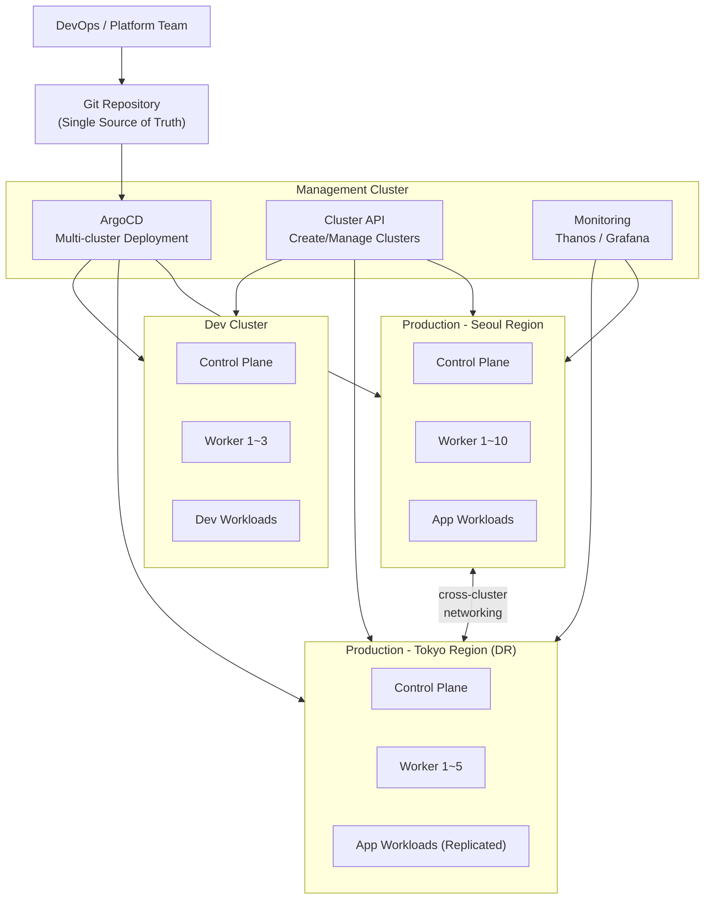
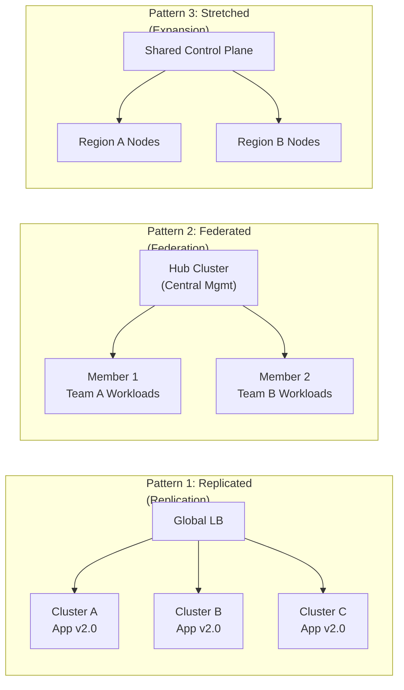
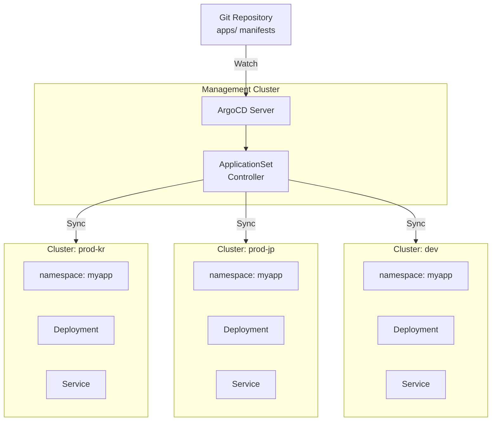
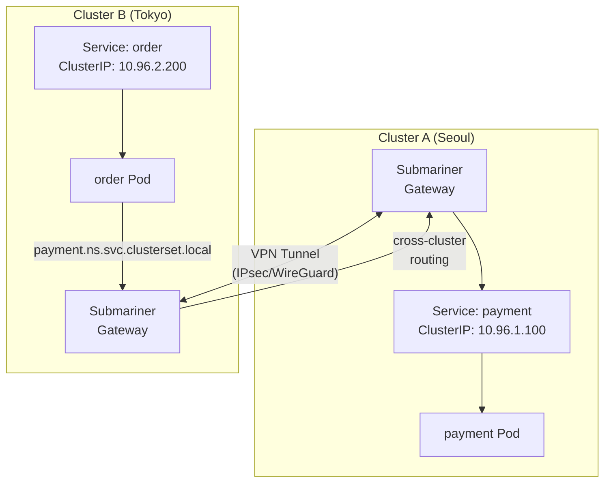

# Multi-Cluster / Hybrid Kubernetes

> Started with one K8s cluster, but as service grows, you **must operate multiple clusters**. DR, regional distribution, team isolation, scaling limits — multi-cluster is the answer. From [Service Mesh](./18-service-mesh) you learned intra-cluster communication, now learn **inter-cluster communication and unified management**. This lecture completes the 04-kubernetes category!

---

## 🎯 Why You Need to Know This

```
Real-world multi-cluster scenarios:
• "Seoul region fails, must failover to Tokyo"            → DR/HA
• "European users see slow responses"                     → Regional distribution (latency)
• "Want dev/staging/prod completely isolated"            → Environment isolation
• "Each team wants independent cluster"                   → Team isolation
• "5,000 nodes won't fit in one cluster"                  → Scaling limit
• "Personal data must stay in-country"                    → Data sovereignty/regulation
• "Need on-premises + AWS together"                       → Hybrid cloud
• Interview: "Explain multi-cluster strategy"
```

---

## 🧠 Core Concepts

### Analogy: Franchise Chain Operations

Let me compare multi-cluster to **franchise chain operations**.

* **Single cluster** = One store managing everything. When the store gets large, management hits limits.
* **Multi-cluster** = Multiple stores across regions. Each store operates independently.
* **Headquarters (Control Plane)** = ArgoCD, Cluster API like central management.
* **Menu Board (Git Repository)** = All stores provide same menu for standardization.
* **Shipping Network** = Inter-cluster networking (Submariner, Cilium ClusterMesh).
* **Regional HQ** = Hybrid cloud with on-premises/cloud separate management.

As one store (single cluster) reaches limits, you expand to regional stores (clusters) managed from HQ (central management).

---

### Multi-Cluster Full Topology



---

### 3 Multi-Cluster Patterns



| Pattern | Description | Advantages | Disadvantages | Example |
|---------|-------------|-----------|---------------|---------|
| **Replicated** | Replicate same app to multiple clusters | Easy DR, regional distribution | Data sync needed | Global SaaS |
| **Federated** | Hub manages Member clusters centrally | Unified policy, visibility | Hub failure is risky | Large enterprise platform team |
| **Stretched** | One logical cluster across regions/AZs | Single API, simple operations | Network delay sensitive | Same-region AZ distribution |

---

## 🔍 Detailed Explanation

### Why Multi-Cluster?

Let me summarize single-cluster limitations.

```
Single-cluster limitations:

1. DR/HA
   - Region failure = entire service down
   - Long recovery time (RTO)
   → See [Backup/DR](./16-backup-dr)

2. Regional Distribution (Latency)
   - Seoul-only cluster → US users 200ms+ latency
   - Need clusters near users
   → Use [DNS-based routing](../02-networking/03-dns)

3. Team/Environment Isolation
   - dev/staging/prod mixed → accident risk
   - Team resource conflicts, complex RBAC
   → Namespace isolation insufficient

4. Scaling Limits
   - K8s recommended: 5,000 nodes, 150,000 Pods
   - etcd performance, API Server load

5. Data Sovereignty/Regulation
   - GDPR: EU data must stay in EU
   - Domestic law: Personal data in-country storage
   - Need regional clusters
```

---

### kubeconfig Multi-Cluster Management

Multi-cluster operations basics: **kubeconfig context management**.

```yaml
# ~/.kube/config — Multi-cluster kubeconfig example
apiVersion: v1
kind: Config

# Cluster definitions
clusters:
- name: prod-kr            # Production Seoul
  cluster:
    server: https://api.prod-kr.example.com:6443
    certificate-authority-data: LS0tLS1CRUd...
- name: prod-jp            # Production Tokyo (DR)
  cluster:
    server: https://api.prod-jp.example.com:6443
    certificate-authority-data: LS0tLS1CRUd...
- name: dev                # Dev cluster
  cluster:
    server: https://api.dev.example.com:6443
    certificate-authority-data: LS0tLS1CRUd...

# User credentials
users:
- name: admin-prod-kr
  user:
    token: eyJhbGciOiJS...
- name: admin-prod-jp
  user:
    token: eyJhbGciOiJS...
- name: dev-user
  user:
    token: eyJhbGciOiJS...

# Context: cluster + user + namespace combination
contexts:
- name: prod-kr             # Seoul production
  context:
    cluster: prod-kr
    user: admin-prod-kr
    namespace: default
- name: prod-jp             # Tokyo DR
  context:
    cluster: prod-jp
    user: admin-prod-jp
    namespace: default
- name: dev                 # Development
  context:
    cluster: dev
    user: dev-user
    namespace: dev-team

# Current active context
current-context: prod-kr
```

```bash
# Check current context
kubectl config current-context
# Output: prod-kr

# List all contexts
kubectl config get-contexts
# Output:
# CURRENT   NAME      CLUSTER    AUTHINFO        NAMESPACE
# *         prod-kr   prod-kr    admin-prod-kr   default
#           prod-jp   prod-jp    admin-prod-jp   default
#           dev       dev        dev-user        dev-team

# Switch context
kubectl config use-context prod-jp
# Output: Switched to context "prod-jp".

# Run command in specific context (no switch)
kubectl --context=dev get pods
# Output: dev cluster Pod list

# Query multiple clusters simultaneously
for ctx in prod-kr prod-jp dev; do
  echo "=== $ctx ==="
  kubectl --context=$ctx get nodes -o wide
done
# Output:
# === prod-kr ===
# NAME       STATUS   ROLES    AGE   VERSION   INTERNAL-IP    ...
# node-kr-1  Ready    <none>   30d   v1.28.4   10.10.1.11     ...
# node-kr-2  Ready    <none>   30d   v1.28.4   10.10.1.12     ...
# === prod-jp ===
# NAME       STATUS   ROLES    AGE   VERSION   INTERNAL-IP    ...
# node-jp-1  Ready    <none>   15d   v1.28.4   10.20.1.11     ...
# === dev ===
# NAME       STATUS   ROLES    AGE   VERSION   INTERNAL-IP    ...
# node-dev-1 Ready    <none>   7d    v1.29.1   10.30.1.11     ...
```

#### kubectx / kubens (Convenience Tools)

```bash
# Install kubectx (macOS)
brew install kubectx

# Switch context (kubectx)
kubectx prod-kr
# Output: Switched to context "prod-kr".

# Return to previous context
kubectx -
# Output: Switched to context "prod-jp".

# Switch namespace (kubens)
kubens kube-system
# Output: Context "prod-kr" modified.
#        Active namespace is "kube-system".

# List all contexts (current highlighted)
kubectx
# Output:
# dev
# prod-jp
# prod-kr  ← Current context (highlighted)
```

---

### Multi-Cluster Pattern Details

#### Pattern 1: Replicated (Replication)

Deploy **identical applications to multiple clusters** with Global Load Balancer (Route 53, Cloudflare) distributing traffic.

```
Use cases:
- Global SaaS (serve from nearest user region)
- Active-Active DR (Seoul failure → Tokyo handles immediately)
- Regulation compliance (EU traffic → EU cluster, Asia → Asia)

Analogy: McDonald's — every store sells same Big Mac.
         Menu (app) identical, supply (data) region-specific.
```

#### Pattern 2: Federated (Federation)

**Hub cluster** manages multiple **Member clusters** centrally.

```
Use cases:
- Platform team manages multiple team clusters
- Unified policy enforcement (security, network, quotas)
- Workload scheduling (move between clusters by load)

Analogy: HQ-branch structure — HQ sets policy/standards,
         branches operate independently within standards.
```

#### Pattern 3: Stretched (Expansion)

Extend one **logical cluster** across regions/AZs.

```
Use cases:
- Same-region AZ distribution (Seoul a, b, c)
- Very low network latency (<2ms)
- Simple operations, single API

Analogy: Large store across multiple buildings.
         Customers see one store, internals distributed.

Warning: High inter-region latency breaks etcd sync!
```

---

### ArgoCD Multi-Cluster Deployment

Extend [Helm/Kustomize](./12-helm-kustomize) ArgoCD to multi-cluster.



#### Register Clusters with ArgoCD

```bash
# Login to ArgoCD
argocd login argocd.example.com --username admin --password $ARGO_PASSWORD
# Output: 'admin:login' logged in successfully

# Register target cluster (uses kubeconfig context name)
argocd cluster add prod-kr --name prod-kr
# Output:
# INFO[0000] ServiceAccount "argocd-manager" created in namespace "kube-system"
# INFO[0000] ClusterRole "argocd-manager-role" created
# INFO[0000] ClusterRoleBinding "argocd-manager-role-binding" created
# Cluster 'https://api.prod-kr.example.com:6443' added

argocd cluster add prod-jp --name prod-jp
# Output: Cluster 'https://api.prod-jp.example.com:6443' added

argocd cluster add dev --name dev
# Output: Cluster 'https://api.dev.example.com:6443' added

# Verify registered clusters
argocd cluster list
# Output:
# SERVER                                       NAME     VERSION  STATUS
# https://kubernetes.default.svc               in-cluster  1.28  Successful
# https://api.prod-kr.example.com:6443         prod-kr     1.28  Successful
# https://api.prod-jp.example.com:6443         prod-jp     1.28  Successful
# https://api.dev.example.com:6443             dev         1.29  Successful
```

#### ApplicationSet — Deploy to Multiple Clusters Simultaneously

```yaml
# applicationset-myapp.yaml
# Deploy app manifests to multiple clusters at once
apiVersion: argoproj.io/v1alpha1
kind: ApplicationSet
metadata:
  name: myapp-multi-cluster
  namespace: argocd
spec:
  generators:
  # Cluster Generator: Generate based on registered clusters
  - clusters:
      selector:
        matchLabels:
          env: production          # Target 'production' labeled clusters only
  template:
    metadata:
      # Include cluster name in Application name
      name: 'myapp-{{name}}'
    spec:
      project: default
      source:
        repoURL: https://github.com/myorg/k8s-apps.git
        targetRevision: main
        path: apps/myapp/overlays/{{metadata.labels.region}}  # Region-specific overlay
      destination:
        server: '{{server}}'       # Each cluster API server URL
        namespace: myapp
      syncPolicy:
        automated:
          prune: true              # Auto-delete resources deleted in Git
          selfHeal: true           # Auto-restore manual changes
        syncOptions:
        - CreateNamespace=true     # Auto-create namespace
```

```bash
# Deploy ApplicationSet
kubectl apply -f applicationset-myapp.yaml --context=mgmt-cluster
# Output: applicationset.argoproj.io/myapp-multi-cluster created

# Verify generated Applications
argocd app list
# Output:
# NAME              CLUSTER                                  STATUS  HEALTH   SYNC
# myapp-prod-kr     https://api.prod-kr.example.com:6443     Synced  Healthy  Synced
# myapp-prod-jp     https://api.prod-jp.example.com:6443     Synced  Healthy  Synced
```

---

### Cluster API — Declaratively Create/Manage Clusters

Cluster API (CAPI) manages K8s **clusters themselves as K8s resources**, declaratively. Applies [K8s Architecture](./01-architecture) declarative pattern to cluster creation.

```yaml
# cluster-prod-jp.yaml
# Create K8s cluster on AWS declaratively with Cluster API
apiVersion: cluster.x-k8s.io/v1beta1
kind: Cluster
metadata:
  name: prod-jp
  namespace: clusters
spec:
  clusterNetwork:
    pods:
      cidrBlocks: ["192.168.0.0/16"]       # Pod network CIDR
    services:
      cidrBlocks: ["10.96.0.0/12"]          # Service network CIDR
  controlPlaneRef:
    apiVersion: controlplane.cluster.x-k8s.io/v1beta2
    kind: KubeadmControlPlane
    name: prod-jp-control-plane
  infrastructureRef:
    apiVersion: infrastructure.cluster.x-k8s.io/v1beta2
    kind: AWSCluster                         # AWS Infrastructure Provider
    name: prod-jp
---
# AWS cluster infrastructure configuration
apiVersion: infrastructure.cluster.x-k8s.io/v1beta2
kind: AWSCluster
metadata:
  name: prod-jp
  namespace: clusters
spec:
  region: ap-northeast-1                     # Tokyo region
  sshKeyName: k8s-admin
  network:
    vpc:
      cidrBlock: 10.20.0.0/16
---
# Control Plane configuration
apiVersion: controlplane.cluster.x-k8s.io/v1beta2
kind: KubeadmControlPlane
metadata:
  name: prod-jp-control-plane
  namespace: clusters
spec:
  replicas: 3                                # HA with 3 replicas
  version: v1.28.4
  machineTemplate:
    infrastructureRef:
      apiVersion: infrastructure.cluster.x-k8s.io/v1beta2
      kind: AWSMachineTemplate
      name: prod-jp-control-plane
---
# Worker Nodes (MachineDeployment)
apiVersion: cluster.x-k8s.io/v1beta1
kind: MachineDeployment
metadata:
  name: prod-jp-workers
  namespace: clusters
spec:
  clusterName: prod-jp
  replicas: 5                                # 5 worker nodes
  selector:
    matchLabels: {}
  template:
    spec:
      clusterName: prod-jp
      version: v1.28.4
      bootstrap:
        configRef:
          apiVersion: bootstrap.cluster.x-k8s.io/v1beta1
          kind: KubeadmConfigTemplate
          name: prod-jp-workers
      infrastructureRef:
        apiVersion: infrastructure.cluster.x-k8s.io/v1beta2
        kind: AWSMachineTemplate
        name: prod-jp-workers
```

```bash
# Create cluster with Cluster API
kubectl apply -f cluster-prod-jp.yaml --context=mgmt-cluster
# Output:
# cluster.cluster.x-k8s.io/prod-jp created
# awscluster.infrastructure.cluster.x-k8s.io/prod-jp created
# kubeadmcontrolplane.controlplane.cluster.x-k8s.io/prod-jp-control-plane created
# machinedeployment.cluster.x-k8s.io/prod-jp-workers created

# Check provisioning status
kubectl get clusters --context=mgmt-cluster
# Output:
# NAME      PHASE         AGE    VERSION
# prod-kr   Provisioned   30d    v1.28.4
# prod-jp   Provisioning  2m     v1.28.4

# Check Machine status
kubectl get machines -l cluster.x-k8s.io/cluster-name=prod-jp --context=mgmt-cluster
# Output:
# NAME                          CLUSTER   NODENAME   PROVIDERID   PHASE        AGE
# prod-jp-control-plane-abc12   prod-jp                           Provisioning 2m
# prod-jp-control-plane-def34   prod-jp                           Pending      2m
# prod-jp-control-plane-ghi56   prod-jp                           Pending      2m
```

---

### Multi-Cluster Networking

**Service discovery and communication across clusters** is the critical multi-cluster challenge. [Service/Ingress](./05-service-ingress) handled single-cluster; now we cross cluster boundaries.



#### Submariner — Connect Clusters Across Network

```bash
# Install subctl (Submariner CLI)
curl -Ls https://get.submariner.io | VERSION=v0.17.0 bash

# Setup Broker (in management cluster)
subctl deploy-broker --context mgmt-cluster
# Output:
# ✓ Setting up broker RBAC
# ✓ Deploying the Submariner operator
# ✓ Created Broker namespace: submariner-k8s-broker
# ✓ Broker deployed successfully

# Connect Cluster A (Seoul)
subctl join broker-info.subm --context prod-kr \
  --clusterid prod-kr \
  --natt=false
# Output:
# ✓ Deploying Submariner gateway node
# ✓ Deploying Submariner route agent
# ✓ Connected to broker

# Connect Cluster B (Tokyo)
subctl join broker-info.subm --context prod-jp \
  --clusterid prod-jp \
  --natt=false
# Output:
# ✓ Deploying Submariner gateway node
# ✓ Connected to broker

# Verify connections
subctl show connections --context prod-kr
# Output:
# GATEWAY       CLUSTER   REMOTE IP     NAT   CABLE DRIVER   STATUS
# node-jp-gw    prod-jp   52.xx.xx.xx   no    vxlan          connected

# Verify cross-cluster endpoint discovery
subctl show endpoints --context prod-kr
# Output:
# CLUSTER   ENDPOINT IP    PUBLIC IP       CABLE DRIVER
# prod-kr   10.10.1.5      3.xx.xx.xx      vxlan
# prod-jp   10.20.1.5      52.xx.xx.xx     vxlan
```

#### ServiceExport / ServiceImport — Expose Cross-Cluster Services

```yaml
# Expose payment service from Seoul to other clusters
# service-export.yaml
apiVersion: multicluster.x-k8s.io/v1alpha1
kind: ServiceExport
metadata:
  name: payment              # Service name to expose
  namespace: finance
```

```bash
# Apply ServiceExport in Seoul cluster
kubectl apply -f service-export.yaml --context=prod-kr
# Output: serviceexport.multicluster.x-k8s.io/payment created

# Access Seoul's payment service from Tokyo cluster
kubectl --context=prod-jp run test-pod --rm -it --image=curlimages/curl -- \
  curl http://payment.finance.svc.clusterset.local:8080/health
# Output: {"status":"healthy","cluster":"prod-kr"}
# → Access other cluster's service via clusterset.local domain!
```

#### Cilium ClusterMesh (Alternative)

```bash
# Enable Cilium ClusterMesh
cilium clustermesh enable --context prod-kr
cilium clustermesh enable --context prod-jp

# Connect clusters
cilium clustermesh connect --context prod-kr --destination-context prod-jp
# Output:
# ✅ Connected cluster prod-kr <-> prod-jp
# ℹ️  Run 'cilium clustermesh status' to monitor

# Check status
cilium clustermesh status --context prod-kr
# Output:
#   ✅ ClusterMesh is enabled
#   ✅ 1 connected cluster(s):
#     - prod-jp: connected (2 nodes)
```

---

### Hybrid Cloud

Run **on-premises + cloud together** with unified management. [VPN](../02-networking/10-vpn) connects the two environments.

```
Hybrid Cloud Tools Comparison:

┌─────────────────┬──────────────┬──────────────┬───────────────┐
│ Tool            │ Provider     │ Features     │ Best For      │
├─────────────────┼──────────────┼──────────────┼───────────────┤
│ EKS Anywhere    │ AWS          │ Same EKS     │ AWS-focused   │
│                 │              │ experience   │ environment   │
├─────────────────┼──────────────┼──────────────┼───────────────┤
│ Anthos          │ Google       │ GKE          │ GCP-focused   │
│                 │              │ consistency  │ environment   │
├─────────────────┼──────────────┼──────────────┼───────────────┤
│ Rancher         │ SUSE         │ Vendor       │ Multi-cloud   │
│                 │              │ neutral,     │ small-medium  │
│                 │              │ Web UI       │ enterprises   │
├─────────────────┼──────────────┼──────────────┼───────────────┤
│ OpenShift       │ Red Hat      │ Enterprise   │ Large enterprise
│                 │              │ security     │ on-premises   │
├─────────────────┼──────────────┼──────────────┼───────────────┤
│ Tanzu           │ VMware       │ vSphere      │ VMware        │
│                 │              │ integration  │ environment   │
└─────────────────┴──────────────┴──────────────┴───────────────┘
```

#### EKS Anywhere Example

```bash
# Install EKS Anywhere CLI
curl -fsSL https://anywhere.eks.amazonaws.com/install.sh | bash

# Generate cluster config
eksctl anywhere generate clusterconfig hybrid-cluster \
  --provider vsphere > cluster-config.yaml
```

```yaml
# cluster-config.yaml (EKS Anywhere — vSphere-based)
apiVersion: anywhere.eks.amazonaws.com/v1alpha1
kind: Cluster
metadata:
  name: hybrid-cluster
spec:
  clusterNetwork:
    cniConfig:
      cilium: {}                        # Use Cilium for CNI
    pods:
      cidrBlocks: ["192.168.0.0/16"]
    services:
      cidrBlocks: ["10.96.0.0/12"]
  controlPlaneConfiguration:
    count: 3                            # HA with 3 Control Plane nodes
    endpoint:
      host: "10.0.0.100"               # On-premises VIP
    machineGroupRef:
      kind: VSphereMachineConfig
      name: cp-machines
  workerNodeGroupConfigurations:
  - count: 5                            # 5 worker nodes
    machineGroupRef:
      kind: VSphereMachineConfig
      name: worker-machines
    name: workers
  kubernetesVersion: "1.28"
  managementCluster:
    name: hybrid-cluster
```

```bash
# Create cluster (on on-premises vSphere)
eksctl anywhere create cluster -f cluster-config.yaml
# Output:
# Creating new bootstrap cluster
# Installing cluster-api providers on bootstrap cluster
# Creating new workload cluster
# Moving cluster management to workload cluster
# ✅ Cluster created!

# Verify
kubectl get nodes --kubeconfig hybrid-cluster/hybrid-cluster-eks-a-cluster.kubeconfig
# Output:
# NAME           STATUS   ROLES           AGE   VERSION
# cp-node-1      Ready    control-plane   10m   v1.28.4-eks-anywhere
# cp-node-2      Ready    control-plane   9m    v1.28.4-eks-anywhere
# cp-node-3      Ready    control-plane   8m    v1.28.4-eks-anywhere
# worker-node-1  Ready    <none>          5m    v1.28.4-eks-anywhere
# worker-node-2  Ready    <none>          5m    v1.28.4-eks-anywhere
```

---

### GitOps Multi-Cluster Management

**Git as Single Source of Truth** is critical in multi-cluster.

```
Git repository structure (multi-cluster GitOps):

k8s-platform/
├── clusters/                      # Cluster definitions (Cluster API)
│   ├── prod-kr.yaml
│   ├── prod-jp.yaml
│   └── dev.yaml
├── infrastructure/                # Common infrastructure components
│   ├── base/
│   │   ├── cert-manager/
│   │   ├── ingress-nginx/
│   │   ├── monitoring/           # Prometheus, Grafana
│   │   └── service-mesh/         # Istio
│   └── overlays/
│       ├── prod/                 # Production config overlay
│       └── dev/                  # Dev config overlay
├── apps/                         # Application manifests
│   ├── myapp/
│   │   ├── base/                 # Common Deployment, Service
│   │   │   ├── kustomization.yaml
│   │   │   ├── deployment.yaml
│   │   │   └── service.yaml
│   │   └── overlays/
│   │       ├── prod-kr/          # Seoul: replicas 10, high-spec
│   │       ├── prod-jp/          # Tokyo: replicas 5, DR
│   │       └── dev/              # Dev: replicas 1, low-spec
│   └── payment/
│       ├── base/
│       └── overlays/
└── argocd/                       # ArgoCD ApplicationSet definitions
    ├── applicationsets/
    │   ├── infra-appset.yaml     # Deploy infrastructure
    │   └── apps-appset.yaml      # Deploy apps
    └── projects/
        └── default.yaml
```

```yaml
# argocd/applicationsets/apps-appset.yaml
# Auto-deploy all apps to all target clusters
apiVersion: argoproj.io/v1alpha1
kind: ApplicationSet
metadata:
  name: all-apps
  namespace: argocd
spec:
  generators:
  # Matrix Generator: app list x cluster list combinations
  - matrix:
      generators:
      # Auto-detect apps from Git directories
      - git:
          repoURL: https://github.com/myorg/k8s-platform.git
          revision: main
          directories:
          - path: apps/*/base         # All apps under apps/
      # Select production-labeled clusters
      - clusters:
          selector:
            matchLabels:
              env: production
  template:
    metadata:
      name: '{{path.basename}}-{{name}}'   # Example: myapp-prod-kr
    spec:
      project: default
      source:
        repoURL: https://github.com/myorg/k8s-platform.git
        targetRevision: main
        path: 'apps/{{path.basename}}/overlays/{{name}}'
      destination:
        server: '{{server}}'
        namespace: '{{path.basename}}'
      syncPolicy:
        automated:
          prune: true
          selfHeal: true
        syncOptions:
        - CreateNamespace=true
        retry:
          limit: 3                        # Retry 3 times on failure
          backoff:
            duration: 30s
            factor: 2
            maxDuration: 3m
```

---

## 💻 Hands-on Examples

### Exercise 1: Setup Multi-Context kubeconfig

Practice managing multiple clusters with kubeconfig context switching.

```bash
# 1. Merge multiple kubeconfig files
# Assuming separate kubeconfig for each cluster
export KUBECONFIG=~/.kube/cluster-a.yaml:~/.kube/cluster-b.yaml:~/.kube/cluster-c.yaml

# Check merged config
kubectl config view
# Output: All clusters, users, contexts combined

# 2. Permanently merge into one file
kubectl config view --flatten > ~/.kube/config-merged
cp ~/.kube/config ~/.kube/config-backup     # Backup!
cp ~/.kube/config-merged ~/.kube/config

# 3. Verify contexts
kubectl config get-contexts
# Output:
# CURRENT   NAME         CLUSTER      AUTHINFO       NAMESPACE
# *         cluster-a    cluster-a    user-a         default
#           cluster-b    cluster-b    user-b         default
#           cluster-c    cluster-c    user-c         default

# 4. Switch and verify
kubectl config use-context cluster-b
kubectl get nodes
# Output: cluster-b's node list

# 5. Rename contexts (make readable)
kubectl config rename-context cluster-a prod-kr
kubectl config rename-context cluster-b prod-jp
kubectl config rename-context cluster-c dev
# Output: Context "cluster-a" renamed to "prod-kr".
#        Context "cluster-b" renamed to "prod-jp".
#        Context "cluster-c" renamed to "dev".

# 6. View all clusters status at once
for ctx in prod-kr prod-jp dev; do
  echo ""
  echo "=============================="
  echo " Cluster: $ctx"
  echo "=============================="
  kubectl --context=$ctx get nodes -o wide 2>/dev/null || echo "  ❌ Connection failed"
  kubectl --context=$ctx get pods -A --field-selector=status.phase!=Running 2>/dev/null | head -5
done
```

---

### Exercise 2: Deploy with ArgoCD ApplicationSet Multi-Cluster

Deploy nginx to multiple clusters using ArgoCD ApplicationSet.

```bash
# 1. Register target clusters with ArgoCD (already in kubeconfig)
argocd cluster add prod-kr --name prod-kr --label env=production --label region=kr
argocd cluster add prod-jp --name prod-jp --label env=production --label region=jp
argocd cluster add dev --name dev --label env=development --label region=kr
```

```yaml
# 2. App manifests (Git repository)
# apps/nginx-demo/base/deployment.yaml
apiVersion: apps/v1
kind: Deployment
metadata:
  name: nginx-demo
spec:
  selector:
    matchLabels:
      app: nginx-demo
  template:
    metadata:
      labels:
        app: nginx-demo
    spec:
      containers:
      - name: nginx
        image: nginx:1.25
        ports:
        - containerPort: 80
        resources:
          requests:
            cpu: 100m
            memory: 128Mi
          limits:
            cpu: 200m
            memory: 256Mi
---
# apps/nginx-demo/base/service.yaml
apiVersion: v1
kind: Service
metadata:
  name: nginx-demo
spec:
  selector:
    app: nginx-demo
  ports:
  - port: 80
    targetPort: 80
---
# apps/nginx-demo/base/kustomization.yaml
apiVersion: kustomize.config.k8s.io/v1beta1
kind: Kustomization
resources:
- deployment.yaml
- service.yaml
```

```yaml
# apps/nginx-demo/overlays/prod-kr/kustomization.yaml
# Seoul production: 5 replicas
apiVersion: kustomize.config.k8s.io/v1beta1
kind: Kustomization
resources:
- ../../base
patches:
- patch: |-
    apiVersion: apps/v1
    kind: Deployment
    metadata:
      name: nginx-demo
    spec:
      replicas: 5    # Seoul: main traffic, 5 replicas
```

```yaml
# apps/nginx-demo/overlays/prod-jp/kustomization.yaml
# Tokyo DR: 2 replicas
apiVersion: kustomize.config.k8s.io/v1beta1
kind: Kustomization
resources:
- ../../base
patches:
- patch: |-
    apiVersion: apps/v1
    kind: Deployment
    metadata:
      name: nginx-demo
    spec:
      replicas: 2    # Tokyo: DR standby, 2 replicas
```

```yaml
# 3. Create ApplicationSet
# applicationset-nginx-demo.yaml
apiVersion: argoproj.io/v1alpha1
kind: ApplicationSet
metadata:
  name: nginx-demo
  namespace: argocd
spec:
  generators:
  - clusters:
      selector:
        matchLabels:
          env: production        # Production clusters only
  template:
    metadata:
      name: 'nginx-demo-{{name}}'
    spec:
      project: default
      source:
        repoURL: https://github.com/myorg/k8s-platform.git
        targetRevision: main
        path: 'apps/nginx-demo/overlays/{{metadata.labels.region}}'
      destination:
        server: '{{server}}'
        namespace: nginx-demo
      syncPolicy:
        automated:
          prune: true
          selfHeal: true
        syncOptions:
        - CreateNamespace=true
```

```bash
# 4. Deploy ApplicationSet
kubectl apply -f applicationset-nginx-demo.yaml --context=mgmt-cluster
# Output: applicationset.argoproj.io/nginx-demo created

# 5. Verify Applications created
argocd app list | grep nginx
# Output:
# nginx-demo-prod-kr  https://api.prod-kr...  Synced  Healthy  Automated
# nginx-demo-prod-jp  https://api.prod-jp...  Synced  Healthy  Automated

# 6. Verify in each cluster
kubectl --context=prod-kr get pods -n nginx-demo
# Output:
# NAME                          READY   STATUS    RESTARTS   AGE
# nginx-demo-7d9f8b6c4d-abc12  1/1     Running   0          2m
# nginx-demo-7d9f8b6c4d-def34  1/1     Running   0          2m
# nginx-demo-7d9f8b6c4d-ghi56  1/1     Running   0          2m
# nginx-demo-7d9f8b6c4d-jkl78  1/1     Running   0          2m
# nginx-demo-7d9f8b6c4d-mno90  1/1     Running   0          2m
# → Seoul: 5 Pods

kubectl --context=prod-jp get pods -n nginx-demo
# Output:
# NAME                          READY   STATUS    RESTARTS   AGE
# nginx-demo-7d9f8b6c4d-pqr12  1/1     Running   0          2m
# nginx-demo-7d9f8b6c4d-stu34  1/1     Running   0          2m
# → Tokyo: 2 Pods (DR standby)
```

---

### Exercise 3: Multi-Cluster Monitoring Script

Script to view all cluster status at once.

```bash
#!/bin/bash
# multi-cluster-status.sh
# Show key status for all clusters

# Target clusters list
CLUSTERS=("prod-kr" "prod-jp" "dev")

# Colors
RED='\033[0;31m'
GREEN='\033[0;32m'
YELLOW='\033[1;33m'
NC='\033[0m'

echo "============================================"
echo " Multi-Cluster Status Dashboard"
echo " $(date '+%Y-%m-%d %H:%M:%S')"
echo "============================================"

for cluster in "${CLUSTERS[@]}"; do
  echo ""
  echo "━━━━━━━━━━━━━━━━━━━━━━━━━━━━━━━━━━━━━━━━"
  echo -e " Cluster: ${YELLOW}${cluster}${NC}"
  echo "━━━━━━━━━━━━━━━━━━━━━━━━━━━━━━━━━━━━━━━━"

  # Test connection
  if ! kubectl --context="$cluster" cluster-info &>/dev/null; then
    echo -e "  ${RED}Connection FAILED${NC}"
    continue
  fi

  # Node status
  echo ""
  echo "  [Nodes]"
  total_nodes=$(kubectl --context="$cluster" get nodes --no-headers 2>/dev/null | wc -l)
  ready_nodes=$(kubectl --context="$cluster" get nodes --no-headers 2>/dev/null | grep " Ready" | wc -l)
  if [ "$total_nodes" -eq "$ready_nodes" ]; then
    echo -e "  ${GREEN}Ready: ${ready_nodes}/${total_nodes}${NC}"
  else
    echo -e "  ${RED}Ready: ${ready_nodes}/${total_nodes} ⚠️${NC}"
  fi

  # Pod status summary
  echo ""
  echo "  [Pods]"
  total_pods=$(kubectl --context="$cluster" get pods -A --no-headers 2>/dev/null | wc -l)
  running_pods=$(kubectl --context="$cluster" get pods -A --no-headers 2>/dev/null | grep "Running" | wc -l)
  failed_pods=$(kubectl --context="$cluster" get pods -A --no-headers 2>/dev/null | grep -E "Error|CrashLoop|Failed" | wc -l)
  echo "  Total: $total_pods | Running: $running_pods | Failed: $failed_pods"

  # Show problem Pods
  if [ "$failed_pods" -gt 0 ]; then
    echo -e "  ${RED}Problem Pods:${NC}"
    kubectl --context="$cluster" get pods -A --no-headers 2>/dev/null | \
      grep -E "Error|CrashLoop|Failed" | \
      awk '{printf "    %-20s %-40s %s\n", $1, $2, $4}'
  fi

  # Resource usage
  echo ""
  echo "  [Resource Usage]"
  kubectl --context="$cluster" top nodes --no-headers 2>/dev/null | \
    awk '{printf "    %-15s CPU: %-8s MEM: %s\n", $1, $3, $5}' || \
    echo "    (metrics-server not available)"
done

echo ""
echo "============================================"
echo " Scan complete."
echo "============================================"
```

```bash
# Run script
chmod +x multi-cluster-status.sh
./multi-cluster-status.sh
# Output:
# ============================================
#  Multi-Cluster Status Dashboard
#  2026-03-13 14:30:00
# ============================================
#
# ━━━━━━━━━━━━━━━━━━━━━━━━━━━━━━━━━━━━━━━━
#  Cluster: prod-kr
# ━━━━━━━━━━━━━━━━━━━━━━━━━━━━━━━━━━━━━━━━
#
#   [Nodes]
#   Ready: 10/10
#
#   [Pods]
#   Total: 87 | Running: 85 | Failed: 2
#   Problem Pods:
#     monitoring          alertmanager-xxx                         CrashLoopBackOff
#     logging             fluentd-abc12                            Error
#
#   [Resource Usage]
#     node-kr-1       CPU: 45%     MEM: 62%
#     node-kr-2       CPU: 38%     MEM: 55%
#     ...
```

---

## 🏢 In Real Work

### Scenario 1: Global SaaS — Active-Active Multi-Region

```
Situation: B2B SaaS served from Seoul, Tokyo, Singapore

Architecture:
- Pattern: Replicated (identical app in each region)
- Management: ArgoCD ApplicationSet (one Git push = 3 regions)
- Networking: Cilium ClusterMesh (cross-cluster service discovery)
- Routing: Route 53 Latency-based (nearest region to user)
- Data: CockroachDB multi-region (auto-replicate across regions)
- DR: One region fails → others handle immediately (Active-Active)

Highlights:
- Route 53 health checks auto-exclude failed region
- Data sovereignty: EU customer data → EU region only
- Deployments rolling: Seoul → Tokyo → Singapore
```

### Scenario 2: Finance — On-Premises + Cloud Hybrid

```
Situation: Core finance on-premises, non-core on cloud

Architecture:
- On-Premises: OpenShift (security + regulation compliance)
  → Core trading systems, customer DB
- Cloud (AWS): EKS
  → Web frontend, API Gateway, analytics
- Connection: AWS Direct Connect + VPN redundant
- Management: Rancher unified management
- Networking: Submariner cross-cluster communication

Highlights:
- Regulation: Personal data must stay on-premises
- Latency: Direct Connect guarantees <5ms
- Disaster: Cloud fails → on-premises maintains core
- Cost: Fixed on-premises + variable cloud optimization
```

### Scenario 3: Startup Growth — Single to Multi-Cluster Transition

```
Situation: User growth hitting single-cluster limits

Transition Process:
Stage 1 (Now): Single cluster — dev/staging/prod Namespace separation
  → Problem: prod failure affects dev, etcd overloaded

Stage 2: Environment isolation — prod/non-prod 2 clusters
  → prod: stability-first, minimal changes
  → non-prod: dev + staging, free to experiment
  → ArgoCD manages both

Stage 3: Regional expansion — Seoul + Tokyo DR 3 clusters
  → Add Tokyo DR cluster
  → Velero auto-backup Seoul → Tokyo
  → [Backup/DR strategy](./16-backup-dr) applied

Key Insight:
- Don't start multi-cluster (over-engineering)
- Add cluster when problem appears
- GitOps makes cluster addition simple (just add Git config)
```

---

## ⚠️ Common Mistakes

### ❌ Mistake 1: Start with multi-cluster

```
❌ Wrong: "Let's build like big enterprise from day 1"
→ Operational complexity explosion
→ Small team can't manage 5 clusters

✅ Right: Start single → add clusters when needed
→ Multi-cluster is "required when needed", not "nice to have"
→ 3-person DevOps team managing 5 clusters = impossible
```

### ❌ Mistake 2: Wrong cluster in kubeconfig, deploy to dev by mistake

```bash
# ❌ No context check, deploy to wrong cluster
kubectl apply -f production-deploy.yaml
# → Might deploy production config to dev!

# ✅ Always check and specify context explicitly
kubectl config current-context           # Check first
kubectl apply -f production-deploy.yaml --context=prod-kr  # Explicit

# Safety: Show cluster in shell prompt
# ~/.bashrc
export PS1="\[\e[33m\](k8s: \$(kubectl config current-context 2>/dev/null))\[\e[0m\] \$ "
# Output: (k8s: prod-kr) $
```

### ❌ Mistake 3: Pod/Service CIDR conflicts between clusters

```
❌ Wrong config:
Cluster A — Pod CIDR: 10.244.0.0/16, Service: 10.96.0.0/12
Cluster B — Pod CIDR: 10.244.0.0/16, Service: 10.96.0.0/12
→ IP conflicts with Submariner/ClusterMesh!

✅ Right: Different CIDR for each cluster
Cluster A — Pod: 10.10.0.0/16,  Service: 10.110.0.0/16
Cluster B — Pod: 10.20.0.0/16,  Service: 10.120.0.0/16
Cluster C — Pod: 10.30.0.0/16,  Service: 10.130.0.0/16
→ Plan CIDR before cluster creation!
```

### ❌ Mistake 4: Deploy identical config to all environments

```yaml
# ❌ Ignore environment differences
spec:
  replicas: 10
  resources:
    cpu: "2"
    memory: "4Gi"
# → Wastes dev resources

# ✅ Use Kustomize overlays
# overlays/dev/kustomization.yaml
patches:
- patch: |-
    spec:
      replicas: 1                # Dev only needs 1
      template:
        spec:
          containers:
          - name: myapp
            resources:
              cpu: "100m"         # Dev minimal resources
              memory: "256Mi"
```

### ❌ Mistake 5: DR cluster never tested

```
❌ Wrong: Build DR, don't test
→ 6 months later, real disaster → failover fails
→ DR cluster K8s version mismatched, certs expired, sync broken

✅ Right: Regular DR testing
- Monthly: Failover to DR (Chaos Engineering)
- Weekly: DR health check automation
- Always: ArgoCD keeps DR in sync (same apps as main)
- Verify: K8s version, app version, config all match main
→ Regularly validate [Backup/DR](./16-backup-dr) RTO/RPO goals
```

---

## 📝 Summary

```
Multi-Cluster / Hybrid K8s core summary:

1. Why Multi-Cluster?
   - DR/HA, regional distribution, team isolation, scale limits, data sovereignty
   - Adopt when needed, not from start

2. 3 Patterns
   - Replicated: Same app multiple clusters (global services)
   - Federated: Hub-Member central management (platform teams)
   - Stretched: One logical cluster across regions (same-region AZ)

3. Essential Tools
   - kubeconfig/kubectx: Basic context management
   - ArgoCD ApplicationSet: Git → multi-cluster deploy
   - Cluster API: Declaratively create/manage clusters
   - Submariner/Cilium: Cross-cluster networking

4. Hybrid Cloud
   - EKS Anywhere, Anthos, Rancher, OpenShift
   - Connect on-premises + cloud with VPN/Direct Connect

5. GitOps is Critical
   - Git = Single Source of Truth
   - Cluster addition = Add Git config
   - All changes: PR review → merge → auto-deploy

6. Critical Cautions
   - CIDR planning (prevent conflicts)
   - Context always explicit in kubeconfig
   - Regular DR testing
   - Complexity vs benefit tradeoff
```

```
Multi-Cluster Adoption Checklist:

□ Can single cluster solve the problem? (Namespace isolation enough?)
□ Enough operations staff? (Min 1-2 DevOps per cluster)
□ Network ready? (CIDR plan, VPN/Peering)
□ GitOps pipeline ready? (Manual deploy impossible at scale)
□ Unified monitoring/logging possible? (Thanos, Loki)
□ DR scenarios documented and tested?
□ Cost/benefit analysis clear?
```

---

## 🔗 Next Lecture

🎉 **04-Kubernetes Category Complete!**

19 lectures through K8s — basic architecture to Pods, Services, Deployments, Storage, RBAC, Helm, troubleshooting, and multi-cluster!

Next: **[05-cloud-aws/01-iam — AWS IAM](../05-cloud-aws/01-iam)**

See where these K8s clusters **actually run** — cloud infrastructure. Understanding K8s [RBAC](./11-rbac) + AWS IAM connection clarifies real-world infrastructure design!
