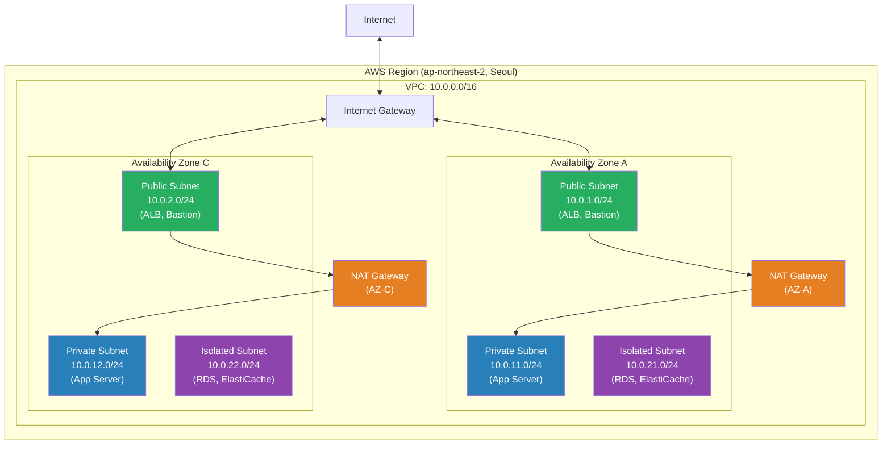
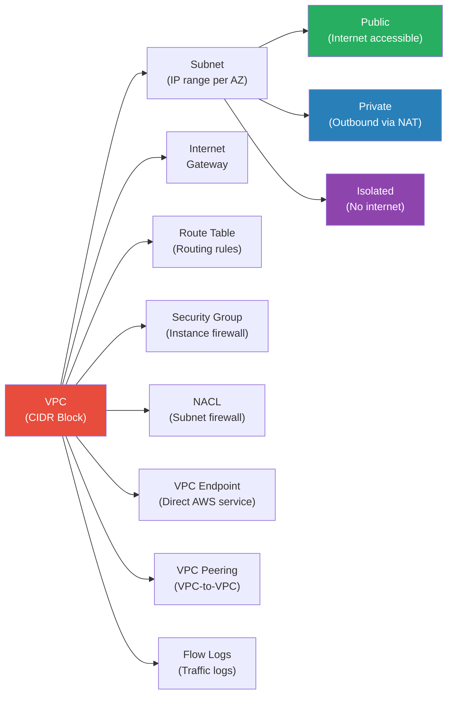
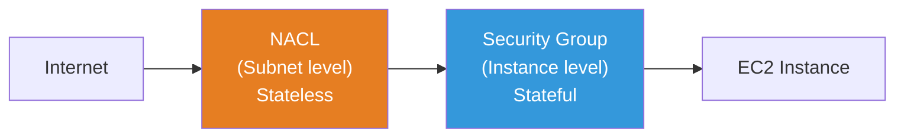
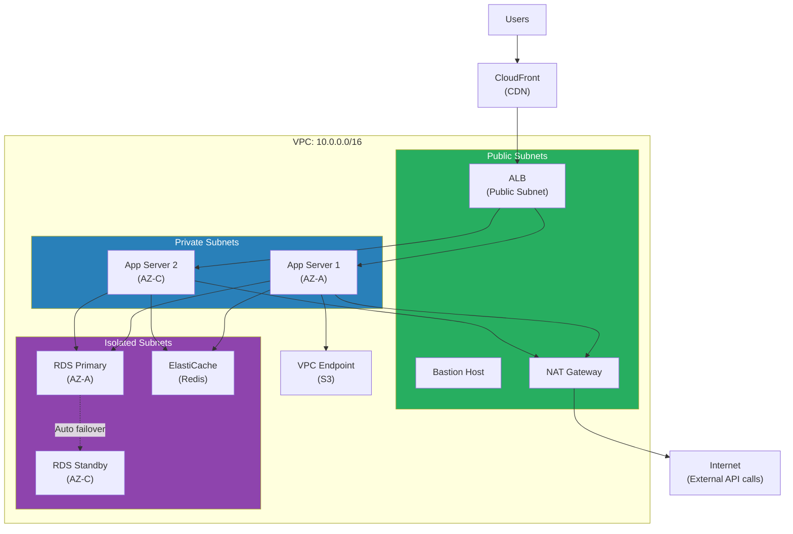

# VPC / Subnet / Routing / Peering

> To launch servers in AWS, the first thing you must create is **VPC (Virtual Private Cloud)**. VPC creates your own isolated network within AWS. In the [previous lecture](./01-iam), IAM taught us "who can access AWS", but this time we learn **"where to deploy"** -- network design.

---

## 🎯 Why Do You Need to Know This?

```
Real-world scenarios where VPC knowledge is essential:
- Setting up infrastructure for a new AWS account               → Design VPC first
- "Private subnet servers have no internet!"                    → Check NAT Gateway
- "Database is exposed to the internet!"                        → Subnet/routing misconfigured
- NAT Gateway costs exceed $100k/month                          → Consider VPC Endpoint
- Need communication between dev/prod VPCs                      → VPC Peering / Transit Gateway
- What's the difference between Security Group vs NACL?         → Understand layered firewalls
- EKS cluster deployment requires subnets                       → Pre-design VPC subnets
- Must analyze traffic with VPC Flow Log                        → Security audit response
```

In the [networking fundamentals lecture](../02-networking/04-network-structure), you learned CIDR, subnet, and NAT concepts. Now we **apply those concepts directly to AWS VPC**.

---

## 🧠 Core Concepts

### Analogy: Building a New City

Think of VPC as **building a new city**. You're building your own city inside an AWS region.

| Real World | AWS VPC |
|-----------|---------|
| City site | VPC (e.g., 10.0.0.0/16) |
| Zones in city (residential, commercial, industrial) | Subnet (Public, Private, Isolated) |
| City entrance (connection to outer road) | Internet Gateway (IGW) |
| Road signs within zones | Route Table |
| Apartment security desk (per-unit access control) | Security Group |
| Zone entrance checkpoint (zone-wide control) | NACL |
| Internal post office (send without revealing internal address) | NAT Gateway |
| Connection to neighboring city | VPC Peering |
| Highway hub (connecting multiple cities) | Transit Gateway |
| Underground tunnel (access AWS services without external exposure) | VPC Endpoint |

---

### Complete Architecture at a Glance



---

### VPC Core Components Relationship



---

## 🔍 Detailed Explanation

### 1. VPC Basics: Region and AZ

VPC belongs to one **AWS Region**. Each Region contains multiple **Availability Zones (AZ)**, and subnets must be placed in exactly one AZ.

```
Region: ap-northeast-2 (Seoul)
├── AZ: ap-northeast-2a
├── AZ: ap-northeast-2b
├── AZ: ap-northeast-2c
└── AZ: ap-northeast-2d

VPC = Region level → Spans multiple AZs
Subnet = AZ level → Exists in only one AZ
```

#### VPC CIDR Block

When creating a VPC, you specify a **CIDR block**. ([CIDR review - network structure](../02-networking/04-network-structure))

```
Allowed VPC CIDR range: /16 (65,536 IPs) ~ /28 (16 IPs)
Production recommendation: 10.0.0.0/16 — be generous to avoid IP exhaustion
```

#### Default VPC vs Custom VPC

```bash
# Check Default VPC — automatically created in all regions
aws ec2 describe-vpcs --filters "Name=isDefault,Values=true" --output table

# Output: CidrBlock=172.31.0.0/16, IsDefault=True, State=available
```

| Item | Default VPC | Custom VPC |
|------|-------------|------------|
| CIDR | 172.31.0.0/16 (fixed) | Configure as needed |
| Subnets | /20 public subnet auto-created per AZ | Design yourself |
| IGW | Auto-attached | Create/attach yourself |
| Use Case | Testing, learning | **Production (required)** |
| Security | Loose default settings | Design own security rules |

> **Production rule**: Never use Default VPC in production. Always design and use Custom VPC.

---

### 2. Subnet Design

Subnets are divided into 3 types by purpose.

| Type | Internet Access | Purpose | Route Table |
|------|-------------|------|-------------|
| **Public** | Inbound + Outbound | ALB, Bastion, NAT GW | 0.0.0.0/0 -> IGW |
| **Private** | Outbound only (via NAT) | App Server, EKS Node | 0.0.0.0/0 -> NAT GW |
| **Isolated** | None | RDS, ElastiCache | Local routing only |

#### CIDR Design Example (/24 recommended)

```
VPC: 10.0.0.0/16 (65,536 IPs)
│
├── Public Subnets (internet accessible)
│   ├── 10.0.1.0/24  (AZ-A) — 256 IPs
│   ├── 10.0.2.0/24  (AZ-C) — 256 IPs
│   └── 10.0.3.0/24  (AZ-D) — Reserve
│
├── Private Subnets (outbound via NAT)
│   ├── 10.0.11.0/24 (AZ-A) — App servers
│   ├── 10.0.12.0/24 (AZ-C) — App servers
│   └── 10.0.13.0/24 (AZ-D) — Reserve
│
├── Isolated Subnets (no internet)
│   ├── 10.0.21.0/24 (AZ-A) — RDS Primary
│   ├── 10.0.22.0/24 (AZ-C) — RDS Standby
│   └── 10.0.23.0/24 (AZ-D) — Reserve
│
└── Spare space: 10.0.100.0/24 ~ (EKS, additional services)
```

> **Tip**: Establish a subnet numbering system for easier management. For example: Public=1~9, Private=11~19, Isolated=21~29.

```bash
# Create subnet example
aws ec2 create-subnet \
  --vpc-id vpc-0abc1234def56789 \
  --cidr-block 10.0.1.0/24 \
  --availability-zone ap-northeast-2a \
  --tag-specifications 'ResourceType=subnet,Tags=[{Key=Name,Value=prod-public-a}]'

# Output: SubnetId=subnet-0aaa1111bbb22222, AvailableIpAddressCount=251, State=available
```

> **Note**: A /24 subnet has 256 IPs, but AWS reserves 5 (network address, VPC router, DNS, future use, broadcast). Actual usable IPs = **251**.

---

### 3. Internet Gateway + NAT Gateway

#### Internet Gateway (IGW)

IGW is the **front door** of your VPC. Only one can be attached per VPC.

```bash
# Create and attach Internet Gateway
aws ec2 create-internet-gateway \
  --tag-specifications 'ResourceType=internet-gateway,Tags=[{Key=Name,Value=prod-igw}]'
# Output: InternetGatewayId=igw-0abc1234def56789

aws ec2 attach-internet-gateway \
  --internet-gateway-id igw-0abc1234def56789 \
  --vpc-id vpc-0abc1234def56789
```

#### NAT Gateway

NAT Gateway allows **servers in private subnets to access the internet outbound**. Inbound from outside cannot reach. ([NAT concept review](../02-networking/04-network-structure))

```bash
# 1. Allocate Elastic IP (required for NAT Gateway)
aws ec2 allocate-address --domain vpc
# Output: AllocationId=eipalloc-0abc1234, PublicIp=52.78.xxx.xxx

# 2. Create NAT Gateway (deploy in public subnet!)
aws ec2 create-nat-gateway \
  --subnet-id subnet-0aaa1111bbb22222 \
  --allocation-id eipalloc-0abc1234 \
  --tag-specifications 'ResourceType=natgateway,Tags=[{Key=Name,Value=prod-nat-a}]'
# Output: NatGatewayId=nat-0abc1234def56789, State=pending
```

#### NAT Cost Optimization

NAT Gateway is **expensive** (hourly + data transfer charges). Ways to reduce costs:

| Method | Cost | Availability | Recommended For |
|------|------|--------|-----------|
| NAT Gateway (1 per AZ) | $$$ | High (AWS managed) | Production |
| NAT Gateway (1 shared) | $$ | Medium (AZ failure impact) | Cost reduction needed |
| NAT Instance (EC2) | $ | Low (self-managed) | Dev/test |
| VPC Endpoint | Free~$ | High | S3, DynamoDB access mostly |

```bash
# If S3 access causes NAT costs → Use VPC Endpoint
# (Detailed later)
```

---

### 4. Route Table (Routing Table)

Route Table is the **road sign for your subnet**. It tells "to reach this destination, go here".

#### Public Subnet Route Table

```
Destination        Target              Description
10.0.0.0/16        local               VPC internal (auto)
0.0.0.0/0          igw-0abc1234...     Everything else → Internet
```

#### Private Subnet Route Table

```
Destination        Target              Description
10.0.0.0/16        local               VPC internal (auto)
0.0.0.0/0          nat-0abc1234...     Everything else → NAT Gateway
```

#### Isolated Subnet Route Table

```
Destination        Target              Description
10.0.0.0/16        local               VPC internal only (that's all!)
```

```bash
# Create Route Table
aws ec2 create-route-table \
  --vpc-id vpc-0abc1234def56789 \
  --tag-specifications 'ResourceType=route-table,Tags=[{Key=Name,Value=prod-private-rt}]'
# Output: RouteTableId=rtb-0abc1234def56789

# Add default route via NAT Gateway (for Private Subnet)
aws ec2 create-route \
  --route-table-id rtb-0abc1234def56789 \
  --destination-cidr-block 0.0.0.0/0 \
  --nat-gateway-id nat-0abc1234def56789

# Associate Route Table with subnet
aws ec2 associate-route-table \
  --route-table-id rtb-0abc1234def56789 \
  --subnet-id subnet-0bbb3333ccc44444
```

> **Warning**: If you don't explicitly associate a Route Table with a subnet, the VPC's **Main Route Table** applies. If Main Route Table has IGW route, all subnets become public!

---

### 5. Security Group vs NACL

Both are **firewalls**, but they work differently. ([Advanced network security](../02-networking/09-network-security))



| Item | Security Group | NACL |
|------|----------------|------|
| Scope | Instance (ENI) | Subnet |
| State | **Stateful** (response auto-allowed) | **Stateless** (in/out separately) |
| Rules | Allow only | Allow + Deny |
| Evaluation | All rules, then allow | **In order by number** |
| Default | Block all inbound | Allow all (default NACL) |

#### Security Group Practical Design

```bash
# ALB Security Group — allow HTTP/HTTPS from anywhere
aws ec2 create-security-group \
  --group-name prod-alb-sg \
  --description "ALB Security Group" \
  --vpc-id vpc-0abc1234def56789

# Allow HTTP
aws ec2 authorize-security-group-ingress \
  --group-id sg-0alb1234 \
  --protocol tcp \
  --port 80 \
  --cidr 0.0.0.0/0

# Allow HTTPS
aws ec2 authorize-security-group-ingress \
  --group-id sg-0alb1234 \
  --protocol tcp \
  --port 443 \
  --cidr 0.0.0.0/0
```

```bash
# App Server Security Group — allow only from ALB SG
aws ec2 authorize-security-group-ingress \
  --group-id sg-0app5678 \
  --protocol tcp \
  --port 8080 \
  --source-group sg-0alb1234

# DB Security Group — allow only from App SG
aws ec2 authorize-security-group-ingress \
  --group-id sg-0db9012 \
  --protocol tcp \
  --port 3306 \
  --source-group sg-0app5678
```

> **Key**: Security Group can **reference other SGs as source**. You're allowing "traffic from resources in this SG", not IP addresses. This is the core pattern of AWS network security.

#### NACL Rule Example

```bash
# Add NACL rule — block specific IP (impossible with SG!)
aws ec2 create-network-acl-entry \
  --network-acl-id acl-0abc1234 \
  --rule-number 50 \
  --protocol tcp \
  --port-range From=0,To=65535 \
  --cidr-block 203.0.113.50/32 \
  --egress \
  --rule-action deny

# NACL evaluates by rule number (lower first)
# Rule 50 (deny 203.0.113.50) → Rule 100 (allow 0.0.0.0/0)
```

---

### 6. VPC Peering

VPC Peering **directly connects two VPCs**. Like building a dedicated road between neighboring cities.

```bash
# Request peering: Dev VPC → Prod VPC
aws ec2 create-vpc-peering-connection \
  --vpc-id vpc-dev-1234 \
  --peer-vpc-id vpc-prod-5678 \
  --tag-specifications 'ResourceType=vpc-peering-connection,Tags=[{Key=Name,Value=dev-to-prod}]'
# Output: VpcPeeringConnectionId=pcx-0abc1234def56789, Status=initiating-request

# Accept from the other side (production)
aws ec2 accept-vpc-peering-connection \
  --vpc-peering-connection-id pcx-0abc1234def56789

# Add peering routes to both Route Tables (both sides needed!)
aws ec2 create-route --route-table-id rtb-dev-1234 \
  --destination-cidr-block 10.1.0.0/16 \
  --vpc-peering-connection-id pcx-0abc1234def56789

aws ec2 create-route --route-table-id rtb-prod-5678 \
  --destination-cidr-block 10.0.0.0/16 \
  --vpc-peering-connection-id pcx-0abc1234def56789
```

#### VPC Peering Limitations

```
- Cannot peer if CIDR blocks overlap (10.0.0.0/16 <-> 10.0.0.0/16 ✗)
- No transitive routing
  A <-> B, B <-> C doesn't mean A <-> C communicates
- Cross-region peering possible but consider bandwidth/latency
```

#### Transit Gateway (For many VPCs)

With 3+ VPCs, peering becomes complex. Transit Gateway acts as a **hub**.

```
VPC Peering (N VPCs):                Transit Gateway:
A -- B                                    A
A -- C         →  Connections: N(N-1)/2   B -- [TGW] -- Hub connects all
B -- C                                    C
10 VPCs = 45 peerings!                   10 VPCs = 10 connections only
```

---

### 7. VPC Endpoint

VPC Endpoint is an **underground tunnel directly to AWS services** without traversing the internet. Reduces NAT costs and improves security.

| Type | Target Services | Cost | Implementation |
|------|-------------|------|-----------|
| **Gateway Endpoint** | S3, DynamoDB | **Free** | Add route to Route Table |
| **Interface Endpoint (PrivateLink)** | Other services (SQS, SNS, ECR, CloudWatch, etc) | Hourly + data | Create ENI in subnet |

```bash
# Create S3 Gateway Endpoint (free! always make it)
aws ec2 create-vpc-endpoint \
  --vpc-id vpc-0abc1234def56789 \
  --service-name com.amazonaws.ap-northeast-2.s3 \
  --route-table-ids rtb-0abc1234def56789
# Output: VpcEndpointId=vpce-0abc1234, Type=Gateway, State=available
# Route Table automatically adds S3 prefix list → vpce-0abc1234
```

```bash
# ECR Interface Endpoint (reduce NAT cost for EKS image pulls)
aws ec2 create-vpc-endpoint \
  --vpc-id vpc-0abc1234def56789 \
  --vpc-endpoint-type Interface \
  --service-name com.amazonaws.ap-northeast-2.ecr.dkr \
  --subnet-ids subnet-0bbb3333ccc44444 \
  --security-group-ids sg-0endpoint1234

# Need 3 Endpoints for ECR:
# 1. com.amazonaws.{region}.ecr.api
# 2. com.amazonaws.{region}.ecr.dkr
# 3. com.amazonaws.{region}.s3 (Gateway — image layer storage)
```

> **EKS operations tip**: EKS node pulling images from ECR often causes high NAT Gateway costs. VPC Endpoints significantly reduce this. ([K8s CNI and VPC relationship](../04-kubernetes/06-cni))

---

### 8. VPC Flow Logs

VPC Flow Logs **capture IP traffic information** flowing through network interfaces. Essential for security audits, traffic analysis, and troubleshooting.

```bash
# Create Flow Log at VPC level (send to CloudWatch Logs)
aws ec2 create-flow-logs \
  --resource-type VPC \
  --resource-ids vpc-0abc1234def56789 \
  --traffic-type ALL \
  --log-destination-type cloud-watch-logs \
  --log-group-name /vpc/flow-logs/prod \
  --deliver-logs-permission-arn arn:aws:iam::123456789012:role/VPCFlowLogRole
# For S3: --log-destination-type s3 --log-destination arn:aws:s3:::my-bucket/
```

#### Flow Log Record Analysis

```
# Format: version account-id eni-id srcaddr dstaddr srcport dstport protocol packets bytes start end action log-status

# Allowed SSH connection
2 123456789012 eni-0abc1234 10.0.1.50 10.0.11.100 52634 22 6 10 840 1616729292 1616729349 ACCEPT OK

# Denied RDP access attempt (port 3389)
2 123456789012 eni-0abc1234 203.0.113.50 10.0.1.50 45321 3389 6 5 280 1616729292 1616729349 REJECT OK
```

Key fields: `srcaddr/dstaddr` (IP), `srcport/dstport` (port), `protocol` (6=TCP, 17=UDP), `action` (ACCEPT/REJECT)

---

### 9. Practical 3-Tier Architecture VPC Design

The most common 3-tier architecture VPC design used in production.



---

## 💻 Lab Examples

### Lab 1: Build Custom VPC from Scratch

Create a production-ready 3-tier VPC from the beginning.

```bash
#!/bin/bash
# Lab: 3-Tier VPC Construction Script
# Goal: Create VPC with Public + Private + Isolated subnets

REGION="ap-northeast-2"

# === Step 1: Create VPC ===
echo ">>> Creating VPC..."
VPC_ID=$(aws ec2 create-vpc \
  --cidr-block 10.0.0.0/16 \
  --tag-specifications 'ResourceType=vpc,Tags=[{Key=Name,Value=practice-vpc}]' \
  --query 'Vpc.VpcId' \
  --output text \
  --region $REGION)
echo "VPC created: $VPC_ID"

# Enable DNS hostname (needed for RDS, ELB, etc)
aws ec2 modify-vpc-attribute \
  --vpc-id $VPC_ID \
  --enable-dns-hostnames '{"Value":true}' \
  --region $REGION

# === Step 2: Create and attach Internet Gateway ===
echo ">>> Creating IGW..."
IGW_ID=$(aws ec2 create-internet-gateway \
  --tag-specifications 'ResourceType=internet-gateway,Tags=[{Key=Name,Value=practice-igw}]' \
  --query 'InternetGateway.InternetGatewayId' \
  --output text \
  --region $REGION)

aws ec2 attach-internet-gateway \
  --internet-gateway-id $IGW_ID \
  --vpc-id $VPC_ID \
  --region $REGION
echo "IGW attached: $IGW_ID"

# === Step 3: Create subnets (2 AZs, 6 total) ===
echo ">>> Creating subnets..."

# Subnet creation helper function
create_subnet() {  # $1=cidr, $2=az_suffix, $3=name
  aws ec2 create-subnet --vpc-id $VPC_ID --cidr-block $1 \
    --availability-zone ${REGION}$2 \
    --tag-specifications "ResourceType=subnet,Tags=[{Key=Name,Value=$3}]" \
    --query 'Subnet.SubnetId' --output text --region $REGION
}

PUB_SUB_A=$(create_subnet 10.0.1.0/24  a practice-public-a)
PUB_SUB_C=$(create_subnet 10.0.2.0/24  c practice-public-c)
PRIV_SUB_A=$(create_subnet 10.0.11.0/24 a practice-private-a)
PRIV_SUB_C=$(create_subnet 10.0.12.0/24 c practice-private-c)
ISO_SUB_A=$(create_subnet 10.0.21.0/24  a practice-isolated-a)
ISO_SUB_C=$(create_subnet 10.0.22.0/24  c practice-isolated-c)

echo "6 subnets created"

# === Step 4: Configure Route Tables ===
echo ">>> Configuring Route Tables..."

# Public Route Table — default route to IGW
PUB_RT=$(aws ec2 create-route-table \
  --vpc-id $VPC_ID \
  --tag-specifications 'ResourceType=route-table,Tags=[{Key=Name,Value=practice-public-rt}]' \
  --query 'RouteTable.RouteTableId' --output text --region $REGION)

aws ec2 create-route \
  --route-table-id $PUB_RT \
  --destination-cidr-block 0.0.0.0/0 \
  --gateway-id $IGW_ID \
  --region $REGION

# Associate with public subnets
aws ec2 associate-route-table --route-table-id $PUB_RT --subnet-id $PUB_SUB_A --region $REGION
aws ec2 associate-route-table --route-table-id $PUB_RT --subnet-id $PUB_SUB_C --region $REGION

# Isolated Route Table — local only
ISO_RT=$(aws ec2 create-route-table \
  --vpc-id $VPC_ID \
  --tag-specifications 'ResourceType=route-table,Tags=[{Key=Name,Value=practice-isolated-rt}]' \
  --query 'RouteTable.RouteTableId' --output text --region $REGION)

aws ec2 associate-route-table --route-table-id $ISO_RT --subnet-id $ISO_SUB_A --region $REGION
aws ec2 associate-route-table --route-table-id $ISO_RT --subnet-id $ISO_SUB_C --region $REGION

echo "Route Tables configured"

# === Step 5: Create S3 Gateway Endpoint (free, essential!) ===
aws ec2 create-vpc-endpoint \
  --vpc-id $VPC_ID \
  --service-name com.amazonaws.${REGION}.s3 \
  --route-table-ids $PUB_RT $ISO_RT \
  --region $REGION

echo "=== VPC Construction Complete ==="
echo "VPC:      $VPC_ID"
echo "IGW:      $IGW_ID"
echo "Public:   $PUB_SUB_A, $PUB_SUB_C"
echo "Private:  $PRIV_SUB_A, $PRIV_SUB_C"
echo "Isolated: $ISO_SUB_A, $ISO_SUB_C"
```

```bash
# Verify creation
aws ec2 describe-subnets \
  --filters "Name=vpc-id,Values=$VPC_ID" \
  --query 'Subnets[*].[Tags[?Key==`Name`].Value|[0],CidrBlock,AvailabilityZone]' \
  --output table --region ap-northeast-2

# Output example:
# practice-public-a   | 10.0.1.0/24  | ap-northeast-2a
# practice-public-c   | 10.0.2.0/24  | ap-northeast-2c
# practice-private-a  | 10.0.11.0/24 | ap-northeast-2a
# practice-private-c  | 10.0.12.0/24 | ap-northeast-2c
# practice-isolated-a | 10.0.21.0/24 | ap-northeast-2a
# practice-isolated-c | 10.0.22.0/24 | ap-northeast-2c
```

---

### Lab 2: Configure Security Group Chain

Chain security groups for 3-tier architecture: ALB -> App -> DB.

```bash
#!/bin/bash
# Lab: Security Group Chain Configuration
# Pattern: ALB(SG) -> App(SG) -> DB(SG) — each tier allows only previous

VPC_ID="vpc-0abc1234def56789"  # VPC from Lab 1
REGION="ap-northeast-2"

# === ALB Security Group ===
ALB_SG=$(aws ec2 create-security-group \
  --group-name practice-alb-sg \
  --description "ALB - HTTP/HTTPS from anywhere" \
  --vpc-id $VPC_ID \
  --query 'GroupId' --output text --region $REGION)

# Allow HTTP/HTTPS from anywhere
aws ec2 authorize-security-group-ingress \
  --group-id $ALB_SG --protocol tcp --port 80 --cidr 0.0.0.0/0 --region $REGION
aws ec2 authorize-security-group-ingress \
  --group-id $ALB_SG --protocol tcp --port 443 --cidr 0.0.0.0/0 --region $REGION

echo "ALB SG: $ALB_SG (80, 443 from 0.0.0.0/0)"

# === App Security Group ===
APP_SG=$(aws ec2 create-security-group \
  --group-name practice-app-sg \
  --description "App - 8080 from ALB only" \
  --vpc-id $VPC_ID \
  --query 'GroupId' --output text --region $REGION)

# Allow 8080 from ALB SG only (SG reference, not IP!)
aws ec2 authorize-security-group-ingress \
  --group-id $APP_SG \
  --protocol tcp \
  --port 8080 \
  --source-group $ALB_SG \
  --region $REGION

echo "App SG: $APP_SG (8080 from ALB SG only)"

# === DB Security Group ===
DB_SG=$(aws ec2 create-security-group \
  --group-name practice-db-sg \
  --description "DB - 3306 from App only" \
  --vpc-id $VPC_ID \
  --query 'GroupId' --output text --region $REGION)

# Allow MySQL(3306) from App SG only
aws ec2 authorize-security-group-ingress \
  --group-id $DB_SG \
  --protocol tcp \
  --port 3306 \
  --source-group $APP_SG \
  --region $REGION

echo "DB SG: $DB_SG (3306 from App SG only)"

# === Verify ===
echo ""
echo "=== Security Group Chain ==="
echo "Internet → [80,443] → ALB($ALB_SG)"
echo "  ALB    → [8080]   → App($APP_SG)"
echo "  App    → [3306]   → DB($DB_SG)"
```

```bash
# Check Security Group rules
aws ec2 describe-security-groups \
  --group-ids $APP_SG \
  --query 'SecurityGroups[0].IpPermissions' \
  --output json --region ap-northeast-2

# Output: FromPort=8080, ToPort=8080, Protocol=tcp
#         Source: UserIdGroupPairs → GroupId=sg-0alb1234
#         → References SG ID, not IP!
```

---

### Lab 3: VPC Peering to Connect Dev/Prod VPCs

Connect two VPCs (dev 10.0.0.0/16, prod 10.1.0.0/16) via peering.

```bash
#!/bin/bash
# Lab: VPC Peering — Dev accessing Prod RDS read replica
REGION="ap-northeast-2"

# Step 1: Create peering + accept
PEER_ID=$(aws ec2 create-vpc-peering-connection \
  --vpc-id vpc-dev-1234 --peer-vpc-id vpc-prod-5678 \
  --query 'VpcPeeringConnection.VpcPeeringConnectionId' \
  --output text --region $REGION)

aws ec2 accept-vpc-peering-connection \
  --vpc-peering-connection-id $PEER_ID --region $REGION

# Step 2: Add routes to both Route Tables (both sides!)
aws ec2 create-route --route-table-id rtb-dev-private \
  --destination-cidr-block 10.1.0.0/16 \
  --vpc-peering-connection-id $PEER_ID --region $REGION

aws ec2 create-route --route-table-id rtb-prod-private \
  --destination-cidr-block 10.0.0.0/16 \
  --vpc-peering-connection-id $PEER_ID --region $REGION

# Step 3: Allow dev CIDR in prod DB security group
aws ec2 authorize-security-group-ingress \
  --group-id sg-prod-db-1234 --protocol tcp --port 3306 \
  --cidr 10.0.0.0/16 --region $REGION

# Step 4: Verify
aws ec2 describe-vpc-peering-connections \
  --vpc-peering-connection-ids $PEER_ID \
  --query 'VpcPeeringConnections[0].Status.Code' --output text
# Output: active

# Test connection from dev EC2 to prod database
mysql -h 10.1.21.50 -u readonly -p
# Connected to MySQL at 10.1.21.50
```

> **Warning**: CIDR blocks cannot overlap for peering! Design VPCs with separated ranges (dev: 10.0.0.0/16, prod: 10.1.0.0/16, staging: 10.2.0.0/16).

---

## 🏢 In Production

### Scenario 1: Solve NAT Gateway Cost Explosion

```
Situation: NAT Gateway bill is $800/month. Need to investigate.

1. Analyze VPC Flow Logs to check NAT traffic
   → S3 access = 70% of traffic
   → ECR image pulls = 20%

2. Solution:
   - Add S3 Gateway Endpoint (free) → 70% savings
   - Add ECR Interface Endpoint → 20% savings
   - Remaining 10% stays on NAT Gateway

3. Result: $800/month → $120/month (85% cost reduction)
```

### Scenario 2: Multi-Account VPC Network Design

```
Situation: 5 AWS accounts per team. Must share common services (monitoring, logging).

Design:
- Shared services account: 10.100.0.0/16 (operates Transit Gateway)
- Dev account: 10.0.0.0/16
- Staging account: 10.1.0.0/16
- Prod account: 10.2.0.0/16
- Data account: 10.3.0.0/16

Hub-spoke via Transit Gateway:
- All accounts → shared services communication allowed
- Prod → data account communication allowed
- Dev → prod direct communication blocked (Route Table control)
```

### Scenario 3: EKS Cluster VPC Design

```
Situation: Deploying EKS cluster, need VPC subnet design.

Considerations:
- One Pod = one VPC IP (VPC CNI characteristic)
- 50 nodes, average 30 Pods → 1,500 IPs needed
- /24 subnet = 251 IPs → insufficient!

Design: (K8s CNI reference: ../04-kubernetes/06-cni)
- EKS node subnet: /20 (4,091 IPs) x AZ 2
- Pod-dedicated subnet: /18 (16,379 IPs) — add Secondary CIDR
  → Add 100.64.0.0/16 CIDR to VPC (RFC 6598)
- Public subnet: /24 x 2 (ALB Ingress Controller)
- Isolated subnet: /24 x 2 (RDS)

aws ec2 associate-vpc-cidr-block \
  --vpc-id vpc-0abc1234 \
  --cidr-block 100.64.0.0/16
# → Allocate Pod IPs from Secondary CIDR to prevent primary CIDR exhaustion
```

---

## ⚠️ Common Mistakes

### 1. Design CIDR Too Narrow

```
❌ Create VPC with /24 = only 256 IPs
   → Hard to divide into subnets, IP exhaustion on scale

✅ Design with /16 from start (65,536 IPs)
   → VPC CIDR can be added later, but cannot change
   → Consider peering — don't overlap with other VPCs
```

### 2. Add IGW Route to Main Route Table

```
❌ Add 0.0.0.0/0 → IGW to Main Route Table
   → New subnets automatically become public!
   → Security incident: DB subnet exposed to internet

✅ Leave Main Route Table untouched (local routing only)
   → Create dedicated Public Route Table, explicitly associate
   → New subnets default to Private (safe)
```

### 3. Deploy NAT Gateway in Private Subnet

```
❌ Create NAT Gateway in private subnet
   → NAT Gateway itself cannot reach internet, doesn't work

✅ Always deploy NAT Gateway in public subnet
   → NAT Gateway must access internet via IGW to relay
     outbound traffic from private subnets
```

### 4. Security Group Opens All Ports to 0.0.0.0/0

```
❌ Ingress: All Traffic / 0.0.0.0/0 allowed
   → "Open for now, restrict later" → never happens → security breach

✅ Apply least privilege: specific ports and sources
   → Chain via SG references (ALB SG → App SG → DB SG)
   → 0.0.0.0/0 only for ALB 80/443
   → (Security details: ../02-networking/09-network-security)
```

### 5. Forget Route Table Update After VPC Peering

```
❌ Create peering, update only one side's Route Table
   → Request goes out, response can't return → no communication

✅ Peering configuration checklist:
   1. Create peering connection ✓
   2. Accept peering ✓
   3. Add route to both Route Tables ✓ ✓
   4. Allow peer CIDR in both SGs ✓ ✓
   → All 4 required!
```

---

## 📝 Summary

```
VPC Core Summary:
┌──────────────────────────────────────────────────────────┐
│ VPC = Your isolated network within AWS                   │
│                                                          │
│ 3 Subnet Types:                                          │
│   Public  — IGW attached, ALB/Bastion deployed           │
│   Private — NAT for outbound, App servers                │
│   Isolated — No internet, DB/cache                       │
│                                                          │
│ 2 Firewall Layers:                                        │
│   Security Group — instance level, stateful, allow only  │
│   NACL — subnet level, stateless, allow + deny           │
│                                                          │
│ Cost Optimization:                                        │
│   S3 Gateway Endpoint — free, always create              │
│   ECR Interface Endpoint — reduce NAT costs              │
│                                                          │
│ VPC Connectivity:                                         │
│   2~3 VPCs → VPC Peering                                 │
│   4+ VPCs → Transit Gateway                              │
│                                                          │
│ Design Principles:                                        │
│   /16 CIDR generous, no overlap with peers               │
│   Don't touch Main Route Table                           │
│   Chain SGs (ALB → App → DB)                            │
│   Monitor traffic with Flow Logs                          │
└──────────────────────────────────────────────────────────┘
```

### Related Lectures

- Network fundamentals (CIDR/subnet/NAT): [Network Structure](../02-networking/04-network-structure)
- DNS: [DNS Lecture](../02-networking/03-dns)
- VPN: [VPN Lecture](../02-networking/10-vpn)
- Network security (SG/NACL advanced): [Network Security](../02-networking/09-network-security)
- K8s VPC CNI: [CNI Lecture](../04-kubernetes/06-cni)
- IAM permissions: [IAM Lecture](./01-iam)

---

## 🔗 Next Lecture → [03-ec2-autoscaling](./03-ec2-autoscaling)

> Now that you've designed the network with VPC, let's learn how to **deploy EC2 servers in it and auto-scale them**.
