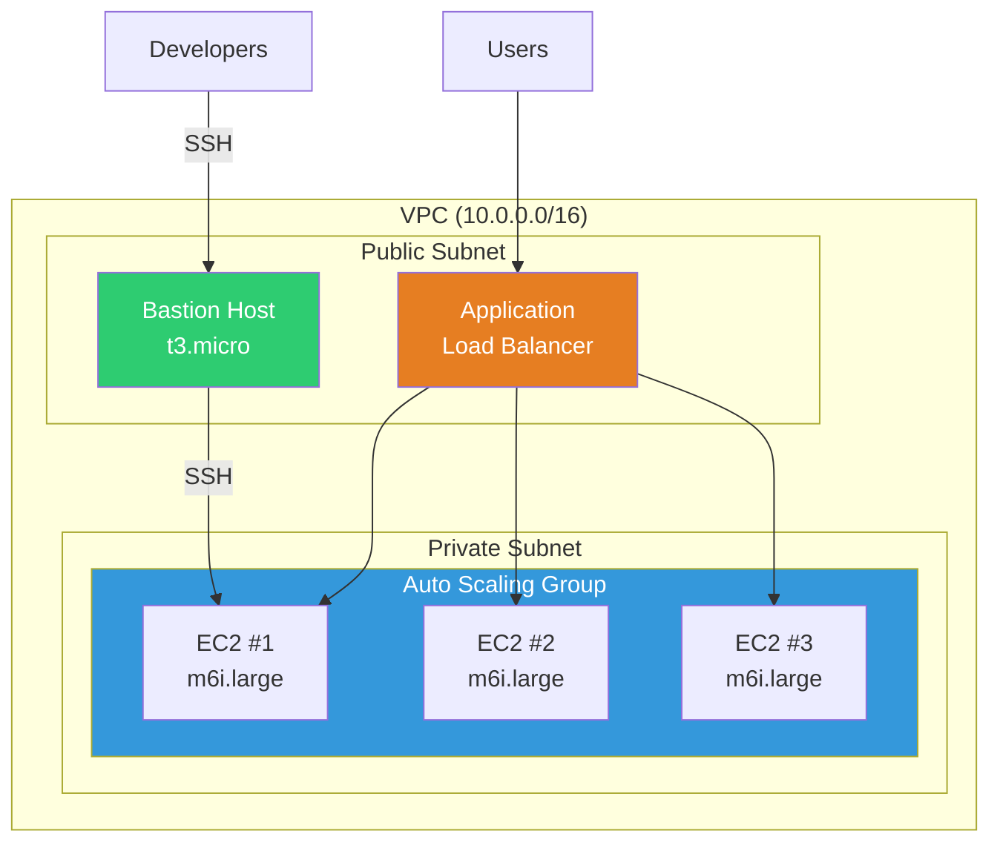
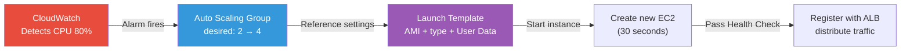
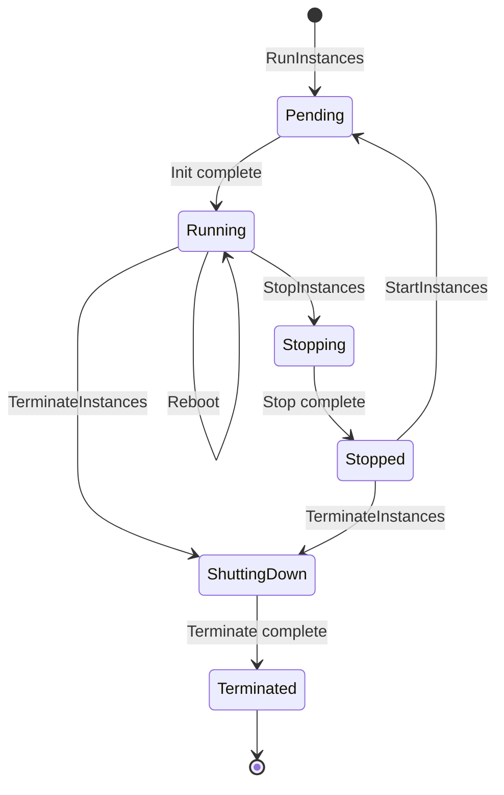

# EC2 / Auto Scaling

> The heart of cloud computing is "create servers when you need them, remove them when you don't". We've set up permissions with [IAM](./01-iam) and laid networking with [VPC](./02-vpc) -- now learn to deploy servers (EC2) on top and use Auto Scaling to automatically scale up/down with traffic.

---

## 🎯 Why Do You Need to Know This?

```
What DevOps does with EC2 + Auto Scaling:
• Operate service servers                     → Create/manage EC2 instances
• Handle traffic spikes                       → Auto scale automatically
• Cost optimization                           → Mix Spot + Reserved
• Manage server images                        → Build AMI (Golden Image)
• Zero-downtime deployment                    → Launch Template + Rolling Update
• Reduce costs nights/weekends                → Scheduled Scaling
• Auto recover from failures                  → Health Check + auto replace
```

On-premises took weeks from order to server installation. EC2 launches servers in **30 seconds**. Auto Scaling does it **automatically**.

---

## 🧠 Core Concepts

### Analogy: Office Rental and Employee Hiring

EC2 and Auto Scaling map to **office rental** and **employee hiring**.

| Real World | AWS |
|-----------|-----|
| Building/office space | VPC ([02-vpc](./02-vpc)) |
| Floors/zones | Subnets (Public / Private) |
| Office room (rental) | EC2 instance |
| Office size (10 vs 50 sq meters) | Instance type (t3.micro ~ m6i.24xlarge) |
| Office furniture/setup | AMI (server image) |
| Rental contract | Launch Template |
| Staffing agency | Auto Scaling Group |
| "Hire more when busy, reduce when slow" | Scaling Policy |
| Temp worker (cheap but can quit suddenly) | Spot Instance |
| 1-year contract (discount) | Reserved Instance |
| Full price | On-Demand |

### EC2 Complete Architecture



### Auto Scaling Flow



### Instance Lifecycle



---

## 🔍 Detailed Explanation

### 1. Instance Types — Choosing Server Specs

EC2 instance types combine **family + generation + size**.

```
Naming format:  m 6 i . xlarge
              │ │ │   └── Size (nano < micro < small < medium < large < xlarge < 2xlarge ...)
              │ │ └────── Add attr (i=Intel, g=Graviton, a=AMD, d=NVMe SSD, n=enhanced network)
              │ └──────── Generation (higher = newer, better value)
              └────────── Family (use case classification)
```

#### Family by Purpose

| Family | Purpose | Analogy | Common Types | Use Case |
|--------|---------|---------|----------|----------|
| **T** (Turbo) | General (burst) | Office worker | t3.micro, t3.medium | Dev servers, small web |
| **M** (Main) | General (balanced) | All-rounder | m6i.large, m7g.xlarge | Web servers, API |
| **C** (Compute) | Compute optimized | Math professor | c6i.xlarge, c7g.2xlarge | Batch, encoding |
| **R** (RAM) | Memory optimized | Memory genius | r6i.large, r7g.xlarge | Redis, DB cache |
| **G/P** (GPU) | Accelerated | ML researcher | g5.xlarge, p4d.24xlarge | ML training, inference |
| **I** (I/O) | Storage optimized | Warehouse | i3.large, i4i.xlarge | NoSQL, data warehouse |

#### Graviton (ARM) — Up to 40% Better Value

```bash
# Graviton instance = 'g' in the type
# m6g.large   → Graviton2 (ARM)
# m7g.large   → Graviton3 (ARM) ← Currently recommended
# m6i.large   → Intel x86

# Cost comparison for same size (large) per hour (Seoul region)
# m6i.large  (Intel):    $0.096/hr
# m6g.large  (Graviton): $0.077/hr  → ~20% cheaper
# m7g.large  (Graviton): $0.082/hr  → Newer but still cheaper than Intel

# ⚠️ Warning: ARM, so x86 binaries won't work!
# Must build Docker images multi-arch (linux/amd64 + linux/arm64)
docker buildx build --platform linux/amd64,linux/arm64 -t myapp:latest .
```

### 2. AMI — Server Image

AMI (Amazon Machine Image) is the EC2 **installation DVD**. It contains OS + software + configuration.

#### AMI Types

```bash
# Search official AMI
aws ec2 describe-images \
  --owners amazon \
  --filters "Name=name,Values=al2023-ami-2023*-x86_64" \
  --query "Images | sort_by(@, &CreationDate) | [-1].[ImageId,Name]" \
  --output text
# ami-0abcdef1234567890    al2023-ami-2023.6.20261201.0-kernel-6.1-x86_64

# Marketplace AMI (pre-configured software)
# → Search in AWS Console (Nginx, WordPress, GitLab, etc)

# My custom AMI list
aws ec2 describe-images --owners self \
  --query "Images[*].[ImageId,Name,CreationDate]" \
  --output table
# ---------------------------------------------------------------
# |                      DescribeImages                          |
# +------------------------+--------------------+----------------+
# |  ami-0abc123def456789  |  myapp-golden-v12  |  2026-03-01    |
# |  ami-0def456789abc123  |  myapp-golden-v11  |  2026-02-15    |
# +------------------------+--------------------+----------------+
```

#### Golden AMI Pattern

An AMI with everything pre-installed for production is called **Golden AMI**. Startup is faster and consistency guaranteed since no per-deployment package install.

```bash
# Golden AMI includes:
# ✅ OS patches + security settings
# ✅ Monitoring agents (CloudWatch Agent, Datadog, etc)
# ✅ Log collectors (Fluent Bit, etc)
# ✅ Application runtime (Java, Node.js, etc)
# ✅ Company security policies (CIS Benchmark applied)
# ❌ Application code → Add at deployment time (User Data or CodeDeploy)
```

#### Auto-build AMI with Packer

```hcl
# golden-ami.pkr.hcl (core only)
source "amazon-ebs" "golden" {
  ami_name      = "myapp-golden-{{timestamp}}"
  instance_type = "t3.medium"
  region        = "ap-northeast-2"
  source_ami_filter {
    filters = { name = "al2023-ami-2023*-x86_64", root-device-type = "ebs" }
    owners      = ["amazon"]
    most_recent = true
  }
  ssh_username = "ec2-user"
}

build {
  sources = ["source.amazon-ebs.golden"]
  provisioner "shell" {
    inline = [
      "sudo dnf update -y",
      "sudo dnf install -y docker amazon-cloudwatch-agent",
      "sudo systemctl enable docker amazon-cloudwatch-agent",
    ]
  }
}
```

```bash
# Build AMI with Packer
packer init golden-ami.pkr.hcl && packer build golden-ami.pkr.hcl
# ==> amazon-ebs.golden: Creating temporary EC2 instance...
# ==> amazon-ebs.golden: Running provisioner shell...
# ==> amazon-ebs.golden: Creating AMI: myapp-golden-1710345600
# Build 'amazon-ebs.golden' finished. → AMI: ami-0new123golden456
```

### 3. Storage — Instance Store vs EBS

```
Instance Store (temporary disk)       EBS (permanent disk)
├── Physical SSD on server            ├── Network-connected block storage
├── Very fast (NVMe)                  ├── Reliable (independent from server)
├── Data lost on stop/terminate!      ├── Data persists on stop
├── Use: cache, temp files            ├── Use: OS, DB, permanent data
└── Free (included in instance cost)  └── Pay-per-GB
```

#### EBS Volume Types

| Type | Purpose | IOPS | Throughput | Cost |
|------|---------|------|--------|------|
| **gp3** (general) | Most workloads | 3,000~16,000 | 125~1,000 MB/s | $0.08/GB |
| **io2** (provisioned) | DB, high I/O | Up to 64,000 | Up to 1,000 MB/s | $0.125/GB + IOPS |
| **st1** (HDD) | Logs, big data | 500 (baseline) | Up to 500 MB/s | $0.045/GB |
| **sc1** (Cold HDD) | Archive | 250 (baseline) | Up to 250 MB/s | $0.015/GB |

```bash
# Create gp3 volume (most common type)
aws ec2 create-volume \
  --volume-type gp3 \
  --size 100 \
  --iops 5000 \
  --throughput 250 \
  --availability-zone ap-northeast-2a \
  --tag-specifications 'ResourceType=volume,Tags=[{Key=Name,Value=myapp-data}]'
# {
#     "VolumeId": "vol-0abc123def456789",
#     "Size": 100,
#     "VolumeType": "gp3",
#     "Iops": 5000,
#     "Throughput": 250,
#     "State": "creating",
#     "AvailabilityZone": "ap-northeast-2a"
# }
```

### 4. Networking — ENI, Elastic IP, Placement Group

```bash
# ENI (Elastic Network Interface) — virtual network card
# EC2 has 1 by default, can attach more
aws ec2 describe-network-interfaces \
  --filters "Name=attachment.instance-id,Values=i-0abc123" \
  --query "NetworkInterfaces[*].[NetworkInterfaceId,PrivateIpAddress,Description]" \
  --output table
# -----------------------------------------------
# |         DescribeNetworkInterfaces            |
# +------------------+--------------+------------+
# |  eni-0abc123456  |  10.0.1.50   |  Primary   |
# +------------------+--------------+------------+

# Elastic IP — fixed public IP (survives restart)
aws ec2 allocate-address --domain vpc
# {
#     "PublicIp": "54.180.100.50",
#     "AllocationId": "eipalloc-0abc123",
#     "Domain": "vpc"
# }

# Attach Elastic IP to EC2
aws ec2 associate-address \
  --instance-id i-0abc123 \
  --allocation-id eipalloc-0abc123

# ⚠️ Warning: Elastic IP charged hourly if not attached!
```

#### Placement Group (Placement Strategy)

| Strategy | Description | Purpose |
|----------|-------------|---------|
| **Cluster** | Bundle in same rack → ultra-low latency | HPC, distributed ML |
| **Spread** | Distribute across different hardware → HA | Critical services (max 7/AZ) |
| **Partition** | Separate by partition (rack groups) → failure isolation | Kafka, Cassandra, HDFS |

### 5. Launch Template — EC2 Configuration Template

Launch Template **pre-defines all EC2 settings**. Auto Scaling Group uses this to spawn instances.

```bash
# Create Launch Template (core settings)
aws ec2 create-launch-template \
  --launch-template-name myapp-lt \
  --launch-template-data '{
    "ImageId": "ami-0abc123golden456",
    "InstanceType": "m6i.large",
    "KeyName": "my-keypair",
    "SecurityGroupIds": ["sg-0abc123"],
    "IamInstanceProfile": { "Name": "myapp-instance-profile" },
    "BlockDeviceMappings": [{
      "DeviceName": "/dev/xvda",
      "Ebs": { "VolumeSize": 50, "VolumeType": "gp3", "Encrypted": true }
    }],
    "MetadataOptions": { "HttpTokens": "required", "HttpEndpoint": "enabled" },
    "UserData": "'$(base64 -w0 <<'USERDATA'
#!/bin/bash
# cloud-init — automatically runs on instance start
dnf update -y
# Start CloudWatch Agent
/opt/aws/amazon-cloudwatch-agent/bin/amazon-cloudwatch-agent-ctl \
  -a fetch-config -m ec2 -c file:/opt/aws/amazon-cloudwatch-agent/etc/cloudwatch-agent.json -s
# Deploy application
aws s3 cp s3://myapp-deploy/latest/app.tar.gz /opt/myapp/
cd /opt/myapp && tar xzf app.tar.gz && systemctl start myapp
USERDATA
)'"
# {
#     "LaunchTemplate": {
#         "LaunchTemplateId": "lt-0abc123def456789",
#         "LaunchTemplateName": "myapp-lt",
#         "LatestVersionNumber": 1
#     }
# }
```

#### IMDSv2 — Instance Metadata (Enhanced Security)

Service to query instance's own information. **Must use IMDSv2 (token-based)**. IMDSv1 is vulnerable to SSRF attacks.

```bash
# Query metadata with IMDSv2 (run inside EC2)
# Step 1: Get token
TOKEN=$(curl -X PUT "http://169.254.169.254/latest/api/token" \
  -H "X-aws-ec2-metadata-token-ttl-seconds: 21600" -s)

# Step 2: Query with token
curl -H "X-aws-ec2-metadata-token: $TOKEN" \
  http://169.254.169.254/latest/meta-data/instance-id
# i-0abc123def456789

curl -H "X-aws-ec2-metadata-token: $TOKEN" \
  http://169.254.169.254/latest/meta-data/instance-type
# m6i.large

curl -H "X-aws-ec2-metadata-token: $TOKEN" \
  http://169.254.169.254/latest/meta-data/local-ipv4
# 10.0.1.50

# Get temporary credentials from Instance Profile (→ see IAM 01-iam)
curl -H "X-aws-ec2-metadata-token: $TOKEN" \
  http://169.254.169.254/latest/meta-data/iam/security-credentials/myapp-role
# {
#   "AccessKeyId": "ASIA...",
#   "SecretAccessKey": "...",
#   "Token": "...",
#   "Expiration": "2026-03-13T18:00:00Z"
# }
```

### 6. Auto Scaling Group (ASG) — The Core

ASG **automatically scales EC2 instances** up and down.

```bash
# Create Auto Scaling Group
aws autoscaling create-auto-scaling-group \
  --auto-scaling-group-name myapp-asg \
  --launch-template "LaunchTemplateId=lt-0abc123def456789,Version=\$Latest" \
  --min-size 2 \
  --max-size 10 \
  --desired-capacity 3 \
  --vpc-zone-identifier "subnet-0aaa111,subnet-0bbb222" \
  --target-group-arns "arn:aws:elasticloadbalancing:ap-northeast-2:123456789012:targetgroup/myapp-tg/abc123" \
  --health-check-type ELB \
  --health-check-grace-period 300 \
  --tags "Key=Name,Value=myapp-asg,PropagateAtLaunch=true" \
         "Key=Environment,Value=production,PropagateAtLaunch=true"

# Check ASG status
aws autoscaling describe-auto-scaling-groups \
  --auto-scaling-group-names myapp-asg \
  --query "AutoScalingGroups[0].{
    Min:MinSize, Max:MaxSize, Desired:DesiredCapacity,
    Instances:Instances[*].{Id:InstanceId,AZ:AvailabilityZone,Health:HealthStatus,State:LifecycleState}
  }" --output yaml
# Desired: 3
# Max: 10
# Min: 2
# Instances:
# - AZ: ap-northeast-2a
#   Health: Healthy
#   Id: i-0abc111
#   State: InService
# - AZ: ap-northeast-2c
#   Health: Healthy
#   Id: i-0abc222
#   State: InService
# - AZ: ap-northeast-2a
#   Health: Healthy
#   Id: i-0abc333
#   State: InService
```

#### Scaling Policy Types

```
┌─────────────────────────────────────────────────────────────────────┐
│                     Scaling Policy Comparison                       │
├──────────────────┬──────────────────────────────────────────────────┤
│ Target Tracking  │ "Keep CPU at 60%" → AWS auto-adjusts             │
│ (most recommended│ Works like AC auto-thermostat                    │
│ ⭐)              │                                                    │
├──────────────────┼──────────────────────────────────────────────────┤
│ Step Scaling     │ "CPU 70%→+2, 90%→+4" step-based rules           │
│                  │ For fine-grained control                         │
├──────────────────┼──────────────────────────────────────────────────┤
│ Scheduled        │ "9am scale to 5, 10pm scale to 2" daily pattern │
│                  │ For predictable traffic patterns                 │
├──────────────────┼──────────────────────────────────────────────────┤
│ Predictive       │ ML analyzes history to pre-scale                 │
│                  │ Use with Target Tracking                         │
└──────────────────┴──────────────────────────────────────────────────┘
```

```bash
# Target Tracking Policy (most recommended)
aws autoscaling put-scaling-policy \
  --auto-scaling-group-name myapp-asg \
  --policy-name cpu-target-60 \
  --policy-type TargetTrackingScaling \
  --target-tracking-configuration '{
    "PredefinedMetricSpecification": {
      "PredefinedMetricType": "ASGAverageCPUUtilization"
    },
    "TargetValue": 60.0,
    "ScaleInCooldown": 300,
    "ScaleOutCooldown": 60
  }'
# {
#     "PolicyARN": "arn:aws:autoscaling:...:scalingPolicy:...",
#     "Alarms": [
#         { "AlarmName": "TargetTracking-myapp-asg-AlarmHigh-..." },
#         { "AlarmName": "TargetTracking-myapp-asg-AlarmLow-..." }
#     ]
# }

# Scheduled Scaling (regular traffic patterns)
aws autoscaling put-scheduled-update-group-action \
  --auto-scaling-group-name myapp-asg \
  --scheduled-action-name morning-scale-out \
  --recurrence "0 0 * * MON-FRI" \
  --min-size 5 \
  --max-size 15 \
  --desired-capacity 5 \
  --time-zone "Asia/Seoul"

aws autoscaling put-scheduled-update-group-action \
  --auto-scaling-group-name myapp-asg \
  --scheduled-action-name night-scale-in \
  --recurrence "0 13 * * MON-FRI" \
  --min-size 2 \
  --max-size 10 \
  --desired-capacity 2 \
  --time-zone "Asia/Seoul"
# Seoul time: 9am UTC (0) scale out, 10pm UTC (13) scale in
```

#### Cooldown and Lifecycle Hooks

```bash
# Cooldown — prevent scaling oscillations after scaling
# ScaleOutCooldown: 60 seconds  → wait 60s before scaling again
# ScaleInCooldown: 300 seconds  → wait 5min after scale-in

# Lifecycle Hook — perform tasks before launch/termination
aws autoscaling put-lifecycle-hook \
  --auto-scaling-group-name myapp-asg \
  --lifecycle-hook-name launch-hook \
  --lifecycle-transition autoscaling:EC2_INSTANCE_LAUNCHING \
  --heartbeat-timeout 300 --default-result CONTINUE
# → Before service: download config, health check, verify agent

aws autoscaling put-lifecycle-hook \
  --auto-scaling-group-name myapp-asg \
  --lifecycle-hook-name terminate-hook \
  --lifecycle-transition autoscaling:EC2_INSTANCE_TERMINATING \
  --heartbeat-timeout 120 --default-result CONTINUE
# → Before termination: graceful shutdown, backup logs to S3, unregister monitoring
```

#### Warm Pool — Pre-warm Instances

```bash
# Warm Pool: pre-create instances, keep in Stopped state
# → Instantly switch to Running when needed (skips boot time)
aws autoscaling put-warm-pool \
  --auto-scaling-group-name myapp-asg \
  --pool-state Stopped \
  --min-size 2 \
  --max-group-prepared-capacity 5

# Normal scale-out: Create AMI → new instance → 3~5 minutes
# Warm Pool:        Stopped → Running           → 30 seconds~1 minute
```

### 7. Spot Instance — Up to 90% Discount

Spot Instance uses AWS's **spare computing capacity** via auction. AWS gives **2-minute warning** if it needs the capacity back.

```bash
# Check Spot prices
aws ec2 describe-spot-price-history \
  --instance-types m6i.large \
  --product-descriptions "Linux/UNIX" \
  --start-time "$(date -u +%Y-%m-%dT%H:%M:%S)" \
  --query "SpotPriceHistory[*].[AvailabilityZone,SpotPrice]" \
  --output table
# ----------------------------------------
# |      DescribeSpotPriceHistory         |
# +--------------------+------------------+
# |  ap-northeast-2a   |  0.028800        |
# |  ap-northeast-2c   |  0.029200        |
# +--------------------+------------------+
# On-Demand: $0.096/hr → Spot: ~$0.029/hr (about 70% discount!)
```

#### Handle Spot Interruption

```bash
# Detect 2-minute termination notice (check via IMDSv2 inside EC2)
TOKEN=$(curl -X PUT "http://169.254.169.254/latest/api/token" \
  -H "X-aws-ec2-metadata-token-ttl-seconds: 21600" -s)
curl -H "X-aws-ec2-metadata-token: $TOKEN" \
  http://169.254.169.254/latest/meta-data/spot/instance-action
# No action = 404, termination = → {"action":"terminate","time":"2026-03-13T12:34:56Z"}
# → On signal: finish tasks → flush logs → ALB deregister (draining)
```

#### Mixed Instances Policy (Spot + On-Demand)

```bash
# ASG mixing Spot + On-Demand
aws autoscaling create-auto-scaling-group \
  --auto-scaling-group-name myapp-mixed-asg \
  --mixed-instances-policy '{
    "LaunchTemplate": {
      "LaunchTemplateSpecification": {
        "LaunchTemplateId": "lt-0abc123def456789",
        "Version": "$Latest"
      },
      "Overrides": [
        {"InstanceType": "m6i.large"},
        {"InstanceType": "m6g.large"},
        {"InstanceType": "m5.large"},
        {"InstanceType": "m5a.large"}
      ]
    },
    "InstancesDistribution": {
      "OnDemandBaseCapacity": 2,
      "OnDemandPercentageAboveBaseCapacity": 30,
      "SpotAllocationStrategy": "capacity-optimized"
    }
  }' \
  --min-size 2 \
  --max-size 20 \
  --desired-capacity 6 \
  --vpc-zone-identifier "subnet-0aaa111,subnet-0bbb222"

# Result: 6 instances
# - On-Demand base: 2 (always guaranteed)
# - Remaining 4: 30% On-Demand (1) + 70% Spot (3)
# - If Spot interrupted? ASG auto-replaces with different type!
```

### 8. Monitoring — CloudWatch + Status Checks

```bash
# Basic monitoring (5-min interval, free) / Detailed (1-min, paid ← production recommended)
aws ec2 monitor-instances --instance-ids i-0abc123
# { "InstanceMonitorings": [{ "Monitoring": { "State": "enabled" } }] }

# Query CloudWatch metrics — CPU utilization
aws cloudwatch get-metric-statistics \
  --namespace AWS/EC2 --metric-name CPUUtilization \
  --dimensions Name=InstanceId,Value=i-0abc123 \
  --start-time "$(date -u -d '1 hour ago' +%Y-%m-%dT%H:%M:%S)" \
  --end-time "$(date -u +%Y-%m-%dT%H:%M:%S)" \
  --period 300 --statistics Average --output table
# +---------------------+----------+--------+
# |      Timestamp      | Average  |  Unit  |
# +---------------------+----------+--------+
# |  2026-03-13T05:00Z  |  23.456  |Percent |
# |  2026-03-13T05:05Z  |  45.789  |Percent |
# |  2026-03-13T05:10Z  |  67.123  |Percent |
# +---------------------+----------+--------+

# Status Check — dual check: infrastructure (System) + OS (Instance)
aws ec2 describe-instance-status --instance-ids i-0abc123 \
  --query "InstanceStatuses[0].{System:SystemStatus.Status,Instance:InstanceStatus.Status}"
# { "System": "ok", "Instance": "ok" }
# System fail → AWS infrastructure issue → move to different host
# Instance fail → OS issue → reboot or recreate
```

### 9. Pricing — On-Demand vs Reserved vs Savings Plans vs Spot

```
Cost Model Comparison (m6i.large, Seoul region)

┌─────────────────┬───────────┬──────────┬────────────────────────────┐
│ Model           │ Per Hour  │ Savings  │ Characteristics            │
├─────────────────┼───────────┼──────────┼────────────────────────────┤
│ On-Demand       │ $0.096    │ 0%       │ Flexible, no commitment    │
│ Reserved (1yr)  │ ~$0.060   │ ~37%     │ 1-year commitment, fixed   │
│ Reserved (3yr)  │ ~$0.040   │ ~58%     │ 3-year commitment, max     │
│ Savings Plans   │ ~$0.060   │ ~37%     │ 1-year, flexible types     │
│ Spot            │ ~$0.029   │ ~70%     │ Can interrupt, batch/non   │
└─────────────────┴───────────┴──────────┴────────────────────────────┘

Production Strategy:
• Base traffic → Reserved / Savings Plans (always need)
• Peak traffic → On-Demand (occasionally need)
• Batch/non-critical → Spot (fine if interrupted)
```

---

## 💻 Lab Examples

### Lab 1: Create EC2, SSH Access

```bash
# ── Step 1: Create key pair ──
aws ec2 create-key-pair \
  --key-name myapp-key \
  --key-type ed25519 \
  --query "KeyMaterial" \
  --output text > ~/.ssh/myapp-key.pem

chmod 400 ~/.ssh/myapp-key.pem  # Set permissions (SSH reference: ../01-linux/10-ssh)

# ── Step 2: Create security group (VPC reference: ./02-vpc) ──
aws ec2 create-security-group \
  --group-name myapp-sg \
  --description "My App Security Group" \
  --vpc-id vpc-0abc123
# { "GroupId": "sg-0abc123456" }

# Allow SSH (my IP only)
MY_IP=$(curl -s https://checkip.amazonaws.com)
aws ec2 authorize-security-group-ingress \
  --group-id sg-0abc123456 \
  --protocol tcp --port 22 \
  --cidr "${MY_IP}/32"

# ── Step 3: Create EC2 instance ──
aws ec2 run-instances \
  --image-id ami-0abcdef1234567890 \
  --instance-type t3.micro \
  --key-name myapp-key \
  --security-group-ids sg-0abc123456 \
  --subnet-id subnet-0aaa111 \
  --associate-public-ip-address \
  --tag-specifications 'ResourceType=instance,Tags=[{Key=Name,Value=myapp-dev}]' \
  --query "Instances[0].{Id:InstanceId,State:State.Name,AZ:Placement.AvailabilityZone}" \
  --output table
# -----------------------------------------------
# |                  RunInstances                |
# +-----------+-------------------+--------------+
# | AZ        | Id                | State        |
# +-----------+-------------------+--------------+
# | ap-ne-2a  | i-0abc123def456  | pending      |
# +-----------+-------------------+--------------+

# ── Step 4: Check status and SSH ──
aws ec2 wait instance-running --instance-ids i-0abc123def456

# Get public IP
aws ec2 describe-instances --instance-ids i-0abc123def456 \
  --query "Reservations[0].Instances[0].PublicIpAddress" --output text
# 3.38.100.50

# SSH access
ssh -i ~/.ssh/myapp-key.pem ec2-user@3.38.100.50
# The authenticity of host '3.38.100.50' can't be established.
# ED25519 key fingerprint is SHA256:abc123...
# Are you sure you want to continue connecting (yes/no)? yes
#
#    ,     #_
#    ~\_  ####_        Amazon Linux 2023
#   ~~  \_#####\
#   ~~     \###|
#   ~~       \#/ ___   https://aws.amazon.com/linux/amazon-linux-2023
#    ~~       V~' '->
#     ~~~         /
#       ~~._.   _/
#          _/ _/
#        _/m/'
# [ec2-user@ip-10-0-1-50 ~]$
```

### Lab 2: Launch Template + Auto Scaling Group

```bash
# ── Step 1: Create Launch Template ──
# Prepare User Data script
cat << 'EOF' > /tmp/userdata.sh
#!/bin/bash
# Simple web server (for lab)
dnf install -y httpd
INSTANCE_ID=$(curl -s -H "X-aws-ec2-metadata-token: $(curl -s -X PUT \
  http://169.254.169.254/latest/api/token \
  -H 'X-aws-ec2-metadata-token-ttl-seconds: 21600')" \
  http://169.254.169.254/latest/meta-data/instance-id)

echo "<h1>Hello from ${INSTANCE_ID}</h1>" > /var/www/html/index.html
systemctl enable --now httpd
EOF

aws ec2 create-launch-template \
  --launch-template-name myapp-web-lt \
  --launch-template-data "{
    \"ImageId\": \"ami-0abcdef1234567890\",
    \"InstanceType\": \"t3.small\",
    \"SecurityGroupIds\": [\"sg-0abc123456\"],
    \"UserData\": \"$(base64 -w0 /tmp/userdata.sh)\",
    \"TagSpecifications\": [{
      \"ResourceType\": \"instance\",
      \"Tags\": [{\"Key\": \"Name\", \"Value\": \"myapp-web\"}]
    }]
  }"
# {
#     "LaunchTemplate": {
#         "LaunchTemplateId": "lt-0web123456",
#         "LaunchTemplateName": "myapp-web-lt",
#         "LatestVersionNumber": 1
#     }
# }

# ── Step 2: Create Auto Scaling Group ──
aws autoscaling create-auto-scaling-group \
  --auto-scaling-group-name myapp-web-asg \
  --launch-template "LaunchTemplateId=lt-0web123456,Version=\$Latest" \
  --min-size 2 \
  --max-size 6 \
  --desired-capacity 2 \
  --vpc-zone-identifier "subnet-0aaa111,subnet-0bbb222" \
  --health-check-type EC2 \
  --health-check-grace-period 120

# ── Step 3: Add Target Tracking Policy ──
aws autoscaling put-scaling-policy \
  --auto-scaling-group-name myapp-web-asg \
  --policy-name cpu-target-60 \
  --policy-type TargetTrackingScaling \
  --target-tracking-configuration '{
    "PredefinedMetricSpecification": {
      "PredefinedMetricType": "ASGAverageCPUUtilization"
    },
    "TargetValue": 60.0
  }'

# ── Step 4: Verify ──
aws autoscaling describe-auto-scaling-groups \
  --auto-scaling-group-names myapp-web-asg \
  --query "AutoScalingGroups[0].{
    Status:Status,
    Min:MinSize,Max:MaxSize,Desired:DesiredCapacity,
    Instances:Instances[*].{Id:InstanceId,State:LifecycleState,Health:HealthStatus}
  }" --output yaml
# Desired: 2
# Max: 6
# Min: 2
# Instances:
# - Health: Healthy
#   Id: i-0web001
#   State: InService
# - Health: Healthy
#   Id: i-0web002
#   State: InService
```

### Lab 3: Spot + On-Demand Mixed ASG + Load Test

```bash
# ── Step 1: Create Mixed Instances ASG ──
aws autoscaling create-auto-scaling-group \
  --auto-scaling-group-name myapp-mixed-asg \
  --mixed-instances-policy '{
    "LaunchTemplate": {
      "LaunchTemplateSpecification": {
        "LaunchTemplateId": "lt-0web123456",
        "Version": "$Latest"
      },
      "Overrides": [
        {"InstanceType": "t3.small"},
        {"InstanceType": "t3a.small"},
        {"InstanceType": "t3.medium"}
      ]
    },
    "InstancesDistribution": {
      "OnDemandBaseCapacity": 1,
      "OnDemandPercentageAboveBaseCapacity": 25,
      "SpotAllocationStrategy": "capacity-optimized"
    }
  }' \
  --min-size 2 \
  --max-size 8 \
  --desired-capacity 4 \
  --vpc-zone-identifier "subnet-0aaa111,subnet-0bbb222"

# ── Step 2: Add scaling policy ──
aws autoscaling put-scaling-policy \
  --auto-scaling-group-name myapp-mixed-asg \
  --policy-name cpu-target-50 \
  --policy-type TargetTrackingScaling \
  --target-tracking-configuration '{
    "PredefinedMetricSpecification": {
      "PredefinedMetricType": "ASGAverageCPUUtilization"
    },
    "TargetValue": 50.0
  }'

# ── Step 3: Load test to observe auto scaling ──
# SSH into EC2 and generate CPU load (performance reference: ../01-linux/12-performance)
ssh -i ~/.ssh/myapp-key.pem ec2-user@<instance-ip>

# Generate CPU load with stress tool
sudo dnf install -y stress-ng
stress-ng --cpu 2 --timeout 300
# stress-ng: info:  [1234] dispatching hogs: 2 cpu
# → CPU rises → CloudWatch alarm fires
# → ASG automatically adds instances

# ── Step 4: Check scaling activities ──
aws autoscaling describe-scaling-activities \
  --auto-scaling-group-name myapp-mixed-asg \
  --max-items 5 \
  --query "Activities[*].{Time:StartTime,Status:StatusCode,Cause:Cause}" \
  --output table
# -----------------------------------------------------------------------
# |                    DescribeScalingActivities                         |
# +-------------------------+-----------+-------------------------------+
# |          Time           |  Status   |           Cause               |
# +-------------------------+-----------+-------------------------------+
# | 2026-03-13T06:05:00Z    | Successful| At 2026-03-13T06:04:00Z a    |
# |                         |           | monitor alarm TargetTracking  |
# |                         |           | -myapp-mixed-asg-AlarmHigh    |
# |                         |           | was in state ALARM...         |
# +-------------------------+-----------+-------------------------------+

# Cleanup (prevent costs after lab!)
aws autoscaling delete-auto-scaling-group \
  --auto-scaling-group-name myapp-mixed-asg \
  --force-delete
```

---

## 🏢 In Production

### Scenario 1: E-commerce — Black Friday Prep

```
Normal: 5 EC2 (2 On-Demand + 3 Spot)
Pre-Black-Friday: Scale to 20 via Scheduled Scaling
Black-Friday: Target Tracking auto-scales to 50 max
Post-Black-Friday: Gradual scale-down (10-min ScaleIn Cooldown)

Cost Strategy:
• Base 5 → Reserved Instance (1 year)
• Peak 15 → On-Demand
• Remaining 30 → Spot (replace with On-Demand if interrupted)
• Estimated savings: ~45% vs all On-Demand

Launch Template:
• Golden AMI (Packer auto-builds weekly)
• User Data deploys latest code (CodeDeploy)
• Warm Pool pre-stages 5 (30-second startup)
```

### Scenario 2: SaaS API Server — Reliability First

```
Configuration:
• Multi-AZ (2a + 2c) distributed
• min: 4, desired: 6, max: 20
• Health Check: ELB (HTTP 200)
• Lifecycle Hook: Connection Draining 60s before termination

Scaling:
• Target Tracking: CPU 60% + ALBRequestCountPerTarget 1000
  (two criteria: CPU and request count)
• Predictive Scaling enabled (learns weekday/weekend patterns)

Monitoring:
• CloudWatch detailed monitoring (1-min interval)
• Custom metric: application response time
• CloudWatch Alarm → SNS → Slack notification

K8s Comparison (→ ../04-kubernetes/10-autoscaling):
• EC2 ASG = K8s Cluster Autoscaler (node level)
• ASG Scaling Policy = K8s HPA (workload level)
• EC2 simpler, but K8s more efficient for containers
```

### Scenario 3: ML Training Pipeline — Cost Optimized

```
Workload Characteristics:
• GPU instances (g5.xlarge ~ p4d.24xlarge)
• Can checkpoint on interruption → restart from checkpoint
• 24-hour completion OK → perfect for Spot

Configuration:
• Spot Fleet: g5.xlarge, g5.2xlarge, g5.4xlarge mixed
• capacity-optimized strategy (highest availability type)
• On interrupt: save checkpoint to S3 → resume on new Spot

Cost Benefit:
• On-Demand g5.xlarge: $1.006/hr
• Spot g5.xlarge:      ~$0.302/hr (70% savings)
• 8-hour training: $2.42 vs $8.05 → $170/month savings (1 instance)
```

---

## ⚠️ Common Mistakes

### 1. Allow SSH (port 22) from 0.0.0.0/0

```bash
# ❌ Global SSH access → target for brute force attacks
aws ec2 authorize-security-group-ingress \
  --group-id sg-0abc123 \
  --protocol tcp --port 22 --cidr 0.0.0.0/0

# ✅ Allow from my IP or VPN/Bastion only (SSH reference: ../01-linux/10-ssh)
MY_IP=$(curl -s https://checkip.amazonaws.com)
aws ec2 authorize-security-group-ingress \
  --group-id sg-0abc123 \
  --protocol tcp --port 22 --cidr "${MY_IP}/32"
# Better: Use SSM Session Manager (no SSH port needed)
```

### 2. Allow IMDSv1 → SSRF Vulnerability

```bash
# ❌ IMDSv1 allows metadata access without token → IAM role theft
# (default optional allows both v1 and v2)
curl http://169.254.169.254/latest/meta-data/iam/security-credentials/my-role
# → SSRF attack on this URL = IAM credential leak!

# ✅ Require IMDSv2 only (HttpTokens: required)
aws ec2 modify-instance-metadata-options \
  --instance-id i-0abc123 \
  --http-tokens required \
  --http-endpoint enabled
# Best: Set in Launch Template from start
```

### 3. Set ASG min to 0

```bash
# ❌ min: 0 → all instances terminate on low traffic → cold start on next request!
aws autoscaling update-auto-scaling-group \
  --auto-scaling-group-name myapp-asg \
  --min-size 0

# ✅ min should maintain minimum service capacity (usually 2+)
aws autoscaling update-auto-scaling-group \
  --auto-scaling-group-name myapp-asg \
  --min-size 2
# For 0, use Warm Pool together
```

### 4. Don't encrypt EBS volumes

```bash
# ❌ Default is no encryption → compliance violation
aws ec2 create-volume --volume-type gp3 --size 100 \
  --availability-zone ap-northeast-2a

# ✅ Always enable encryption (set as account default)
aws ec2 enable-ebs-encryption-by-default
# { "EbsEncryptionByDefault": true }
# → All future EBS auto-encrypted
```

### 5. Run production on Spot only

```bash
# ❌ Spot-only → simultaneous interruptions → service outage!
# Especially if using single instance type (high same-time termination)

# ✅ Mixed Instances: On-Demand base + Spot addition
# - OnDemandBaseCapacity: minimum guaranteed
# - Multiple instance types + multiple AZs
# - capacity-optimized strategy for most stable Spot pools
# See "Mixed Instances Policy" section above for details
```

---

## 📝 Summary

### EC2 + Auto Scaling Cheat Sheet

```bash
# === EC2 Instance Management ===
aws ec2 run-instances ...           # Create instance
aws ec2 describe-instances          # List instances
aws ec2 start-instances             # Start
aws ec2 stop-instances              # Stop (EBS retained)
aws ec2 terminate-instances         # Terminate (delete)
aws ec2 describe-instance-status    # Status check

# === AMI ===
aws ec2 create-image                # Create AMI (snapshot)
aws ec2 describe-images --owners self  # My AMI list
aws ec2 deregister-image            # Delete AMI

# === Launch Template ===
aws ec2 create-launch-template      # Create template
aws ec2 create-launch-template-version  # New version
aws ec2 describe-launch-templates   # List

# === Auto Scaling ===
aws autoscaling create-auto-scaling-group   # Create ASG
aws autoscaling describe-auto-scaling-groups # ASG status
aws autoscaling update-auto-scaling-group   # Modify ASG
aws autoscaling set-desired-capacity        # Manual adjust
aws autoscaling put-scaling-policy          # Add policy
aws autoscaling describe-scaling-activities # Activity log

# === Spot ===
aws ec2 describe-spot-price-history  # Current Spot prices
aws ec2 request-spot-instances       # Request Spot (single)
```

### Instance Type Selection Guide

```
Web/API servers (general)       → m6i / m7g (Graviton) ⭐
Dev/test                        → t3.micro ~ t3.medium (burst)
CPU-intensive (encoding/batch)  → c6i / c7g
Memory-intensive (cache/DB)     → r6i / r7g
ML training                     → g5 / p4d (GPU)
Cost-first priority             → Graviton (m7g, c7g, r7g) ⭐
```

### Auto Scaling Checklist

```
✅ Use Launch Template (Launch Configuration is legacy)
✅ Multi-AZ deployment (min 2 AZs)
✅ Health Check Type: ELB (when using ALB)
✅ Health Check Grace Period sufficient (usually 120~300 seconds)
✅ min >= 2 (prevent single point of failure)
✅ Scaling Policy: prefer Target Tracking
✅ Set cooldowns (ScaleOut shorter, ScaleIn longer)
✅ Mixed Instances for Spot (multiple types + AZs)
✅ IMDSv2 mandatory (HttpTokens: required)
✅ EBS encryption enabled by default
```

---

## 🔗 Next Lecture

Next is **[04-storage](./04-storage)** — S3 / EBS / EFS / FSx.

Beyond EBS attached to EC2, learn AWS's diverse storage services: object storage (S3), shared file systems (EFS), high-performance file systems (FSx), and how to choose in production.
