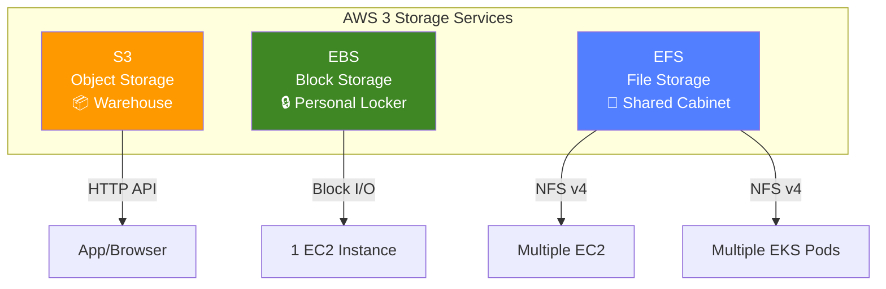
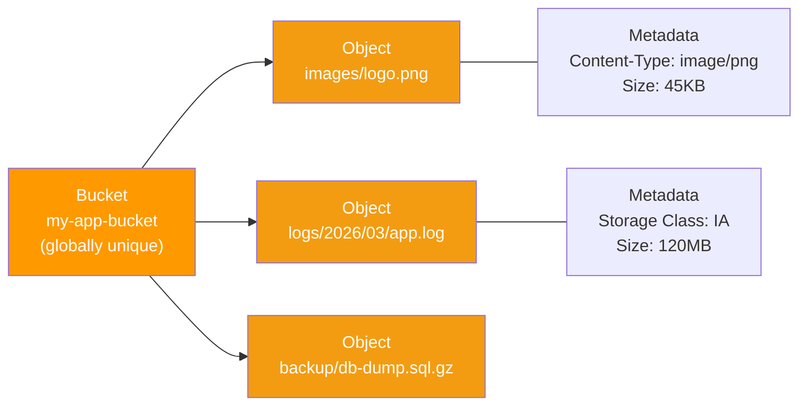
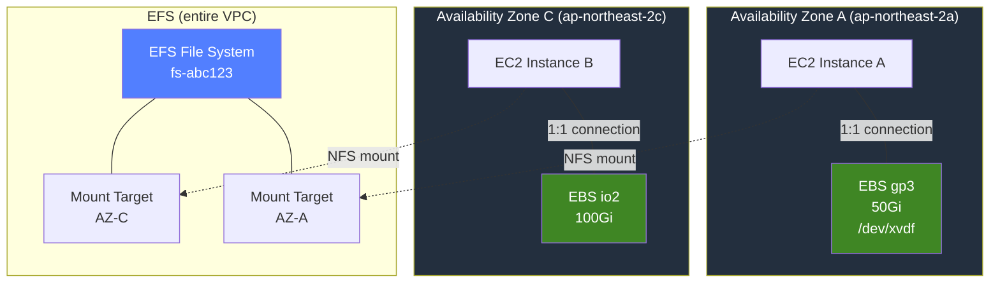
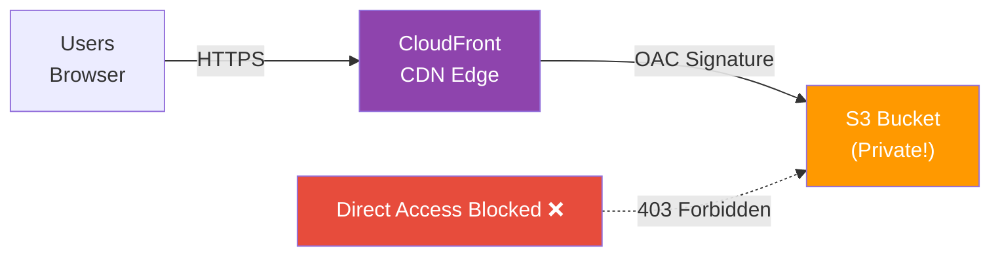
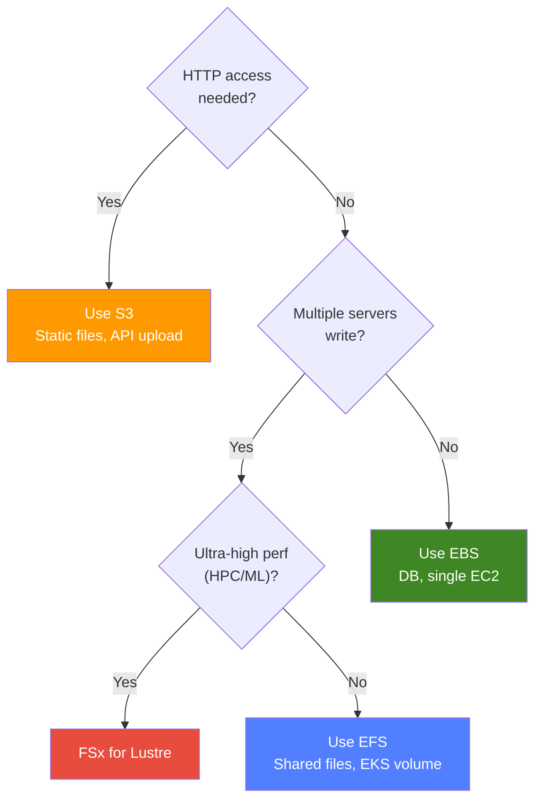

# S3 / EBS / EFS

> Deciding where to store data in the cloud is like deciding whether to keep clothes in a closet or storage unit at home. We determined "who can access" with [IAM](./01-iam) and "where to access from" with [VPC](./02-vpc) -- now let's learn "where to store the data".

---

## 🎯 Why Do You Need to Know This?

```
Real-world storage tasks:
• Deploy static files (images, CSS, JS)                 → S3 + CloudFront
• Store application logs/backups                        → S3 lifecycle policy
• Attach high-performance disk to EC2                   → EBS gp3/io2
• Share file system across multiple EC2/Pods           → EFS
• "S3 costs too much!"                                 → Optimize storage class
• "Need to restore EBS snapshot"                       → Snapshot management
• Store DB data permanently                             → EBS (or K8s PVC)
```

From [Linux disk management](../01-linux/07-disk), you learned `lsblk`, `mount`, `fdisk`. EBS provides that disk in the cloud. S3 is different -- it's object storage accessed via HTTP. EFS is an NFS file system multiple servers can use simultaneously.

---

## 🧠 Core Concepts

### Analogy: Three Storage Methods

AWS storage maps to home storage spaces:

* **S3 (Simple Storage Service)** = Large warehouse. Store items (files) in boxes with labels (keys). Unlimited capacity, retrieve by label. HTTP access, not drive mounting.
* **EBS (Elastic Block Storage)** = Personal locker. Only one person (EC2) uses it, fixed size, fast access. Mount as block device like [Linux /dev/sda](../01-linux/07-disk).
* **EFS (Elastic File System)** = Shared file cabinet. Multiple people (EC2/Pods) can open simultaneously and read/write. NFS network file system.

### Storage Type Comparison



### S3 Object Structure



### EBS/EFS and EC2 Relationship



> **Key Point**: EBS only attaches to one EC2 in the same AZ. EFS can be accessed simultaneously from multiple AZs in a VPC. S3 has no AZ concept, accessible region-wide.

---

## 🔍 Detailed Explanation

### 1. S3 Basics

#### Buckets and Objects

S3's basic units are **bucket** and **object**.

```bash
# Create bucket (name must be globally unique!)
aws s3 mb s3://my-company-app-prod-2026
# make_bucket: my-company-app-prod-2026

# List buckets
aws s3 ls
# 2026-03-13 09:00:00 my-company-app-prod-2026

# Upload file
aws s3 cp ./index.html s3://my-company-app-prod-2026/static/index.html
# upload: ./index.html to s3://my-company-app-prod-2026/static/index.html

# Upload folder (sync = changes only, cp --recursive = all)
aws s3 sync ./dist/ s3://my-company-app-prod-2026/static/
# upload: dist/main.js to s3://my-company-app-prod-2026/static/main.js
# upload: dist/style.css to s3://my-company-app-prod-2026/static/style.css
# (identical files skipped!)

# List objects
aws s3 ls s3://my-company-app-prod-2026/static/
# 2026-03-13 09:01:00       1024 index.html
# 2026-03-13 09:01:02      45678 main.js
# 2026-03-13 09:01:03       8901 style.css

# Download file
aws s3 cp s3://my-company-app-prod-2026/static/index.html ./downloaded.html
# download: s3://my-company-app-prod-2026/static/index.html to ./downloaded.html

# Delete file
aws s3 rm s3://my-company-app-prod-2026/static/style.css
# delete: s3://my-company-app-prod-2026/static/style.css
```

> **Note**: S3 has no real "folders". `static/index.html` -- `static/` is just a key prefix. Console displays it like folders.

#### Storage Classes

Optimize costs based on access frequency.

| Storage Class | Access Freq | Cost (GB/mo) | Retrieval | Use Case |
|---|---|---|---|---|
| **Standard** | Frequent | ~$0.025 | None | Active data, web content |
| **Standard-IA** | Infrequent (30d+) | ~$0.0138 | Yes | Backups, old logs |
| **One Zone-IA** | Infrequent + lower durability OK | ~$0.011 | Yes | Regenerable data |
| **Glacier Instant** | Rare (90d+) | ~$0.005 | Yes (immediate) | Archive (instant access) |
| **Glacier Flexible** | Almost never | ~$0.004 | Minutes~hours | Long-term archive |
| **Glacier Deep Archive** | 1-2x/year | ~$0.002 | 12-48 hours | Compliance, 7-year hold |
| **Intelligent-Tiering** | Unknown pattern | ~$0.025 + monitoring | Auto | Unpredictable access |

```bash
# Upload with specific storage class
aws s3 cp backup.tar.gz s3://my-company-app-prod-2026/backups/ \
  --storage-class STANDARD_IA
# upload: ./backup.tar.gz to s3://my-company-app-prod-2026/backups/backup.tar.gz

# Check storage class
aws s3api head-object \
  --bucket my-company-app-prod-2026 \
  --key backups/backup.tar.gz
# {
#     "StorageClass": "STANDARD_IA",
#     "ContentLength": 524288000,
#     "LastModified": "2026-03-13T09:05:00+00:00"
# }
```

#### Lifecycle Policy

Automatically change storage class or delete after time.

```json
// lifecycle.json - example lifecycle policy
{
  "Rules": [
    {
      "ID": "LogRetention",
      "Status": "Enabled",
      "Filter": { "Prefix": "logs/" },
      "Transitions": [
        {
          "Days": 30,
          "StorageClass": "STANDARD_IA"
        },
        {
          "Days": 90,
          "StorageClass": "GLACIER"
        }
      ],
      "Expiration": {
        "Days": 365
      }
    }
  ]
}
```

```bash
# Apply lifecycle policy
aws s3api put-bucket-lifecycle-configuration \
  --bucket my-company-app-prod-2026 \
  --lifecycle-configuration file://lifecycle.json

# Check policy
aws s3api get-bucket-lifecycle-configuration \
  --bucket my-company-app-prod-2026
# → outputs JSON above
```


---

### 2. S3 Advanced Features

#### Versioning

Recover accidentally overwritten or deleted files.

```bash
# Enable versioning
aws s3api put-bucket-versioning \
  --bucket my-company-app-prod-2026 \
  --versioning-configuration Status=Enabled

# Re-uploading same key creates new version
aws s3 cp v2-index.html s3://my-company-app-prod-2026/static/index.html
# upload: ./v2-index.html to s3://my-company-app-prod-2026/static/index.html

# List all versions
aws s3api list-object-versions \
  --bucket my-company-app-prod-2026 \
  --prefix static/index.html
# Versions: [{ "VersionId": "abc123", "IsLatest": true, "Size": 2048 },
#            { "VersionId": "def456", "IsLatest": false, "Size": 1024 }]

# Restore previous version
aws s3api get-object \
  --bucket my-company-app-prod-2026 \
  --key static/index.html \
  --version-id def456 restored-index.html
```

#### Encryption

Three encryption methods for S3 objects.

| Method | Key Mgmt | Use Case |
|---|---|---|
| **SSE-S3** | AWS manages keys (default) | General data |
| **SSE-KMS** | KMS manages keys + audit | Compliance data |
| **SSE-C** | Customer provides key | Full key control |

```bash
# Upload encrypted with SSE-KMS
aws s3 cp sensitive-data.csv s3://my-company-app-prod-2026/secure/ \
  --sse aws:kms \
  --sse-kms-key-id alias/my-s3-key

# Set default bucket encryption (auto-applies to new objects)
aws s3api put-bucket-encryption \
  --bucket my-company-app-prod-2026 \
  --server-side-encryption-configuration '{
    "Rules": [{
      "ApplyServerSideEncryptionByDefault": {
        "SSEAlgorithm": "aws:kms",
        "KMSMasterKeyID": "alias/my-s3-key"
      },
      "BucketKeyEnabled": true
    }]
  }'
```

#### Bucket Policy vs ACL

[IAM policies](./01-iam) manage user permissions, but S3 has **bucket policy** (resource-based).

```json
// Bucket policy example: allow only specific VPC
{
  "Version": "2012-10-17",
  "Statement": [
    {
      "Sid": "VPCOnly",
      "Effect": "Deny",
      "Principal": "*",
      "Action": "s3:*",
      "Resource": [
        "arn:aws:s3:::my-company-app-prod-2026",
        "arn:aws:s3:::my-company-app-prod-2026/*"
      ],
      "Condition": {
        "StringNotEquals": {
          "aws:sourceVpc": "vpc-abc123"
        }
      }
    }
  ]
}
```

> **ACL is deprecated!** AWS disabled ACL by default for new buckets in 2023. Use bucket policy + IAM policy combination. ACL remains only for legacy compatibility.

#### Presigned URL

Temporarily share private objects externally. URL has signature, expires after time limit.

```bash
# Generate 15-minute download URL
aws s3 presign s3://my-company-app-prod-2026/secure/report.pdf \
  --expires-in 900
# https://my-company-app-prod-2026.s3.amazonaws.com/secure/report.pdf?X-Amz-Algorithm=...&X-Amz-Expires=900&X-Amz-Signature=abc123...
# → Expires after 900 seconds (15 min)! No signature = no access
```

#### S3 Event Notifications (Lambda Trigger)

Automatically run Lambda when file uploads.

```bash
# S3 event → Lambda trigger (auto-run on uploads/*.jpg upload)
aws s3api put-bucket-notification-configuration \
  --bucket my-company-app-prod-2026 \
  --notification-configuration '{
    "LambdaFunctionConfigurations": [{
      "LambdaFunctionArn": "arn:aws:lambda:ap-northeast-2:123456789012:function:process-upload",
      "Events": ["s3:ObjectCreated:*"],
      "Filter": {"Key":{"FilterRules":[
        {"Name":"prefix","Value":"uploads/"},{"Name":"suffix","Value":".jpg"}
      ]}}
    }]
  }'
```

#### Cross-Region Replication (CRR)

Auto-replicate to different region for disaster recovery. **Both buckets must have versioning enabled**.

```bash
# Create destination bucket + enable versioning
aws s3 mb s3://my-company-app-dr-2026 --region us-west-2
aws s3api put-bucket-versioning \
  --bucket my-company-app-dr-2026 \
  --versioning-configuration Status=Enabled

# Setup replication (future uploads auto-replicate to us-west-2!)
aws s3api put-bucket-replication \
  --bucket my-company-app-prod-2026 \
  --replication-configuration '{
    "Role": "arn:aws:iam::123456789012:role/s3-replication-role",
    "Rules": [{"Status":"Enabled","Destination":{"Bucket":"arn:aws:s3:::my-company-app-dr-2026","StorageClass":"STANDARD_IA"}}]
  }'
```

#### Transfer Acceleration

Speed up uploads from worldwide via CloudFront edge locations.

```bash
# Enable, then use accelerated endpoint (s3.amazonaws.com → s3-accelerate.amazonaws.com)
aws s3api put-bucket-accelerate-configuration \
  --bucket my-company-app-prod-2026 \
  --accelerate-configuration Status=Enabled

aws s3 cp large-video.mp4 s3://my-company-app-prod-2026/videos/ \
  --endpoint-url https://s3-accelerate.amazonaws.com
```

---

### 3. S3 Static Website Hosting

Host HTML/CSS/JS on S3. Pair with [CDN (CloudFront)](../02-networking/11-cdn) for worldwide fast access.

```bash
# Enable static website hosting
aws s3 website s3://my-company-app-prod-2026 \
  --index-document index.html \
  --error-document error.html

# Upload build files
aws s3 sync ./build/ s3://my-company-app-prod-2026/ \
  --cache-control "public, max-age=31536000" \
  --exclude "index.html"

# index.html with short cache!
aws s3 cp ./build/index.html s3://my-company-app-prod-2026/ \
  --cache-control "no-cache"
```

#### CloudFront + S3 OAC (Origin Access Control)

Recommended: S3 bucket private, only CloudFront accesses.



```json
// S3 bucket policy: allow only CloudFront OAC
{
  "Version": "2012-10-17",
  "Statement": [
    {
      "Sid": "AllowCloudFrontOAC",
      "Effect": "Allow",
      "Principal": {
        "Service": "cloudfront.amazonaws.com"
      },
      "Action": "s3:GetObject",
      "Resource": "arn:aws:s3:::my-company-app-prod-2026/*",
      "Condition": {
        "StringEquals": {
          "AWS:SourceArn": "arn:aws:cloudfront::123456789012:distribution/E1234567890"
        }
      }
    }
  ]
}
```

> **OAI vs OAC**: OAI (Origin Access Identity) is legacy. **Always use OAC (Origin Access Control)** for new setups. OAC supports SSE-KMS encryption and finer-grained policies.

---

### 4. EBS (Elastic Block Storage)

Virtual hard disk attached to EC2. Use like [Linux disk management](../01-linux/07-disk) -- partition, filesystem, mount.

#### Volume Types

| Type | Category | IOPS (max) | Throughput (max) | Use Case |
|---|---|---|---|---|
| **gp3** | General SSD | 16,000 | 1,000 MB/s | Most workloads (default recommended!) |
| **gp2** | General SSD (older) | 16,000 | 250 MB/s | Legacy (migrate to gp3) |
| **io2 Block Express** | Provisioned SSD | 256,000 | 4,000 MB/s | High-perf DB (Oracle, SAP HANA) |
| **st1** | Throughput HDD | 500 | 500 MB/s | Big data, log processing |
| **sc1** | Cold HDD | 250 | 250 MB/s | Archive, rarely used |

> **gp3 vs gp2**: gp3 lets you set IOPS and throughput independently, 20% cheaper. Use gp3 for new volumes.

> **IOPS vs Throughput**: IOPS = "read/write operations per second" (important for DB transactions), Throughput = "data transferred per second" (important for large file processing).

#### Create, Attach, Mount EBS

```bash
# Create volume (must be same AZ as EC2!)
aws ec2 create-volume \
  --volume-type gp3 --size 100 --iops 3000 --throughput 125 \
  --availability-zone ap-northeast-2a --encrypted \
  --tag-specifications 'ResourceType=volume,Tags=[{Key=Name,Value=app-data}]'
# { "VolumeId": "vol-0abc123def456789", "Size": 100, "VolumeType": "gp3",
#   "AvailabilityZone": "ap-northeast-2a", "State": "creating" }

# Attach to EC2
aws ec2 attach-volume \
  --volume-id vol-0abc123def456789 \
  --instance-id i-0abc123def456789 \
  --device /dev/xvdf
# { "Device": "/dev/xvdf", "State": "attaching" }
```

After attaching, SSH to EC2 and mount.

```bash
# Run inside EC2 (same as Linux disk management!)
# Check disk
lsblk
# NAME    MAJ:MIN RM  SIZE RO TYPE MOUNTPOINTS
# xvda    202:0    0   20G  0 disk
# └─xvda1 202:1    0   20G  0 part /
# xvdf    202:80   0  100G  0 disk              ← new EBS

# Create filesystem (first time only!)
sudo mkfs.ext4 /dev/xvdf
# mke2fs 1.46.5 (30-Dec-2021)
# Creating filesystem with 26214400 4k blocks and 6553600 inodes

# Create mount point and mount
sudo mkdir -p /data
sudo mount /dev/xvdf /data

# Auto-mount after reboot (register fstab)
echo '/dev/xvdf /data ext4 defaults,nofail 0 2' | sudo tee -a /etc/fstab

# Verify
df -h /data
# Filesystem      Size  Used Avail Use% Mounted on
# /dev/xvdf        98G   61M   93G   1% /data
```

#### EBS Snapshots

Snapshots are point-in-time backups. Incremental method -- only changed blocks stored.

```bash
# Create snapshot (incremental -- saves changed blocks only!)
aws ec2 create-snapshot \
  --volume-id vol-0abc123def456789 \
  --description "app-data backup before deploy 2026-03-13" \
  --tag-specifications 'ResourceType=snapshot,Tags=[{Key=Name,Value=app-data-backup}]'
# { "SnapshotId": "snap-0abc123def456789", "State": "pending" }

# Create new volume from snapshot (can use different AZ!)
aws ec2 create-volume \
  --snapshot-id snap-0abc123def456789 \
  --volume-type gp3 \
  --availability-zone ap-northeast-2c
# → Recover AZ-a data to AZ-c
```

#### Multi-Attach (io2 only)

io2 volumes can attach to multiple EC2 in same AZ. For clustering workloads.

```bash
# Create io2 with multi-attach enabled
aws ec2 create-volume \
  --volume-type io2 \
  --size 100 \
  --iops 10000 \
  --multi-attach-enabled \
  --availability-zone ap-northeast-2a
# Note: Need application-level concurrent write control (e.g., cluster filesystem)!
```

---

### 5. EFS (Elastic File System)

NFS file system multiple EC2/Pods can read/write simultaneously. Capacity auto-scales (no provisioning).

#### Performance Mode vs Throughput Mode

| Setting | Option | Description |
|---|---|---|
| **Performance** | General Purpose | Most workloads (default, low latency) |
| | Max I/O | Thousands of concurrent clients (big data) |
| **Throughput** | Bursting | Proportional to filesystem size (small scale) |
| | Provisioned | Guarantee fixed throughput (predictable) |
| | Elastic | Auto-scale by workload (recommended!) |

```bash
# Create EFS
aws efs create-file-system \
  --performance-mode generalPurpose \
  --throughput-mode elastic \
  --encrypted \
  --tags Key=Name,Value=shared-app-data
# { "FileSystemId": "fs-0abc123def456789", "ThroughputMode": "elastic", "Encrypted": true }

# Create mount targets (one per AZ subnet!)
aws efs create-mount-target \
  --file-system-id fs-0abc123def456789 \
  --subnet-id subnet-aaa111 \
  --security-groups sg-efs-mount
# { "MountTargetId": "fsmt-0abc123", "IpAddress": "10.0.1.55" }

aws efs create-mount-target \
  --file-system-id fs-0abc123def456789 \
  --subnet-id subnet-ccc333 \
  --security-groups sg-efs-mount
```

```bash
# Mount on EC2 (needs amazon-efs-utils package)
sudo yum install -y amazon-efs-utils    # Amazon Linux
# or
sudo apt install -y amazon-efs-utils    # Ubuntu

# Mount with TLS encryption (recommended)
sudo mkdir -p /shared
sudo mount -t efs -o tls fs-0abc123def456789:/ /shared

# Register fstab (auto-mount after reboot)
echo 'fs-0abc123def456789:/ /shared efs _netdev,tls 0 0' | sudo tee -a /etc/fstab

# Verify
df -h /shared
# Filesystem                   Size  Used Avail Use% Mounted on
# fs-0abc123def456789.efs...   8.0E     0  8.0E   0% /shared
# → 8 Exabytes! (auto-expanding shown as max)
```

#### EFS + EKS (Kubernetes)

Connect EFS to PVC from [K8s storage (CSI/PV)](../04-kubernetes/07-storage). Multiple Pods share with ReadWriteMany.

```yaml
# StorageClass - use EFS CSI driver
apiVersion: storage.k8s.io/v1
kind: StorageClass
metadata:
  name: efs-sc
provisioner: efs.csi.aws.com
parameters:
  provisioningMode: efs-ap           # Auto-create Access Point
  fileSystemId: fs-0abc123def456789
  directoryPerms: "700"
---
# PVC
apiVersion: v1
kind: PersistentVolumeClaim
metadata:
  name: shared-data
spec:
  accessModes:
    - ReadWriteMany          # Multiple Pods read/write simultaneously!
  storageClassName: efs-sc
  resources:
    requests:
      storage: 5Gi           # EFS auto-expands, just for reference
---
# Use in Deployment
apiVersion: apps/v1
kind: Deployment
metadata:
  name: web-app
spec:
  replicas: 3                # All 3 Pods share same EFS
  selector:
    matchLabels:
      app: web-app
  template:
    metadata:
      labels:
        app: web-app
    spec:
      containers:
      - name: app
        image: nginx:1.25
        volumeMounts:
        - name: shared
          mountPath: /usr/share/nginx/html   # All 3 Pods serve same files
      volumes:
      - name: shared
        persistentVolumeClaim:
          claimName: shared-data
```

---

### 6. Selection Guide: S3 vs EBS vs EFS vs FSx

Reference this when unsure which storage to use.

| Criteria | S3 | EBS | EFS | FSx for Lustre |
|---|---|---|---|---|
| **Type** | Object storage | Block storage | File storage (NFS) | File storage (high-perf) |
| **Access** | HTTP API | Mount to EC2 | NFS mount | Lustre client |
| **Concurrent** | Unlimited | 1 EC2 (except io2 Multi-Attach) | Multiple EC2/Pods | Multiple EC2/Pods |
| **Capacity** | Unlimited | 1GiB ~ 64TiB | Auto-scale (unlimited) | 1.2TiB ~ hundreds PiB |
| **Performance** | High throughput | Very high (io2) | Medium ~ high | Very high (HPC) |
| **Cost** | Cheapest | Medium | High (per GB) | High |
| **Durability** | 99.999999999% (11 9s) | AZ replicated | Multi-AZ replicated | Multi-AZ replicated |
| **Backup** | Versioning, CRR | Snapshots | AWS Backup | AWS Backup |
| **Use Case** | Static files, backups, data lake | DB, OS | Shared home, CMS | ML training, HPC |



---

## 💻 Lab Examples

### Lab 1: S3 Static Website + CloudFront

> Host simple HTML on S3, deploy with CloudFront.

```bash
# 1. Create bucket + prepare HTML
aws s3 mb s3://my-static-site-demo-2026

cat > /tmp/index.html << 'EOF'
<!DOCTYPE html>
<html><head><title>Demo</title></head>
<body><h1>S3 Static Hosting Lab</h1></body></html>
EOF

# 2. Upload + enable static hosting
aws s3 cp /tmp/index.html s3://my-static-site-demo-2026/
aws s3 website s3://my-static-site-demo-2026 --index-document index.html

# 3. Create CloudFront distribution (use OAC)
aws cloudfront create-distribution \
  --origin-domain-name my-static-site-demo-2026.s3.ap-northeast-2.amazonaws.com \
  --default-root-object index.html
# → DomainName: d1234567.cloudfront.net

# 4. Add CloudFront OAC to bucket policy (see OAC policy JSON above)

# 5. Verify access
curl -s https://d1234567.cloudfront.net/
# → HTML content displays = success!
```

### Lab 2: Create EBS + Expand

> Create EBS, attach to EC2, then expand online.

```bash
# 1. Get instance info from metadata (IMDSv2)
TOKEN=$(curl -s -X PUT "http://169.254.169.254/latest/api/token" \
  -H "X-aws-ec2-metadata-token-ttl-seconds: 21600")
INSTANCE_ID=$(curl -s -H "X-aws-ec2-metadata-token: $TOKEN" \
  http://169.254.169.254/latest/meta-data/instance-id)
AZ=$(curl -s -H "X-aws-ec2-metadata-token: $TOKEN" \
  http://169.254.169.254/latest/meta-data/placement/availability-zone)

# 2. Create 50GB volume → attach → format → mount
VOLUME_ID=$(aws ec2 create-volume --volume-type gp3 --size 50 \
  --availability-zone $AZ --encrypted --query 'VolumeId' --output text)
aws ec2 wait volume-available --volume-ids $VOLUME_ID
aws ec2 attach-volume --volume-id $VOLUME_ID --instance-id $INSTANCE_ID --device /dev/xvdf
sleep 10

sudo mkfs.ext4 /dev/xvdf && sudo mkdir -p /data && sudo mount /dev/xvdf /data
df -h /data
# /dev/xvdf  49G  53M  47G  1% /data

# 3. Expand 50GB → 100GB (zero-downtime!)
aws ec2 modify-volume --volume-id $VOLUME_ID --size 100
# { "ModificationState": "modifying", "TargetSize": 100, "OriginalSize": 50 }

# 4. Extend filesystem in OS (from Linux disk management!)
sudo growpart /dev/xvdf 1 2>/dev/null || true   # Extend partition (if exists)
sudo resize2fs /dev/xvdf                         # Extend ext4 filesystem

df -h /data
# /dev/xvdf  98G  53M  93G  1% /data  ← zero-downtime expansion done!
```

### Lab 3: EFS Shared Storage (Multi-EC2)

> Mount EFS on two EC2s, share files.

```bash
# 1. Create EFS + security group (NFS port 2049)
EFS_ID=$(aws efs create-file-system \
  --performance-mode generalPurpose --throughput-mode elastic --encrypted \
  --tags Key=Name,Value=shared-demo --query 'FileSystemId' --output text)

SG_ID=$(aws ec2 create-security-group \
  --group-name efs-mount-sg --description "Allow NFS" \
  --vpc-id vpc-abc123 --query 'GroupId' --output text)
aws ec2 authorize-security-group-ingress \
  --group-id $SG_ID --protocol tcp --port 2049 --source-group sg-ec2-instances

# 2. Create mount targets (one per AZ)
aws efs create-mount-target --file-system-id $EFS_ID --subnet-id subnet-aaa111 --security-groups $SG_ID
aws efs create-mount-target --file-system-id $EFS_ID --subnet-id subnet-ccc333 --security-groups $SG_ID

# 3. Mount on EC2-A + create file
sudo yum install -y amazon-efs-utils
sudo mkdir -p /shared && sudo mount -t efs -o tls $EFS_ID:/ /shared
echo "Hello from EC2-A" | sudo tee /shared/test.txt

# 4. Mount on EC2-B → see EC2-A's file!
sudo yum install -y amazon-efs-utils
sudo mkdir -p /shared && sudo mount -t efs -o tls $EFS_ID:/ /shared
cat /shared/test.txt
# Hello from EC2-A
```

---

## 🏢 In Production

### Scenario 1: Frontend Deployment Pipeline (S3 + CloudFront)

```
Problem: Manage server every React app deployment
Solution: S3 + CloudFront + GitHub Actions

Pipeline:
1. Merge PR → trigger GitHub Actions
2. npm run build → create build artifacts
3. aws s3 sync --delete → upload to S3 (cleanup old)
4. aws cloudfront create-invalidation → invalidate CDN cache
5. Serve new version worldwide from edges!

Cost: $1~5/month (by traffic) -- 90% savings vs EC2 ops
```

### Scenario 2: DB Server Disk Management (EBS io2)

```
Problem: Run DB on EC2, need high performance
Solution: EBS io2 + auto-snapshots

Config:
- OS: gp3 20GiB (/dev/xvda)
- DB data: io2 500GiB, 10,000 IOPS (/dev/xvdf → /var/lib/mysql)
- DB WAL: io2 100GiB, 5,000 IOPS (/dev/xvdg → /var/lib/mysql-wal)

Snapshot Policy:
- Auto-snapshot daily at 3am (AWS Backup or DLM)
- Delete after 7 days
- Monthly snapshots kept 1 year
```

### Scenario 3: ML Team Shared Dataset (EFS + EKS)

```
Problem: 5 ML engineers each copy 100GB dataset
Solution: Store dataset on EFS, mount in EKS Pods

Config:
- EFS Elastic throughput (auto-scale during training)
- StorageClass: efs-sc (CSI driver)
- /datasets (ReadOnlyMany) → original dataset
- /outputs (ReadWriteMany) → each Pod's results

Benefits:
- No data duplication → save S3 copy costs
- New team member: spin Pod, instant data access
- Update dataset → all Pods see it immediately
```

---

## ⚠️ Common Mistakes

### 1. Make S3 Bucket Public

```
❌ Wrong:
   S3 bucket policy: "Principal": "*", "Action": "s3:GetObject"
   → Worldwide access to all files! Data breach!

✅ Right:
   Use CloudFront OAC (CloudFront only accesses)
   Presigned URLs (share specific file temporarily)
   → Enable "S3 Block Public Access" on bucket/account!
```

### 2. Try Attaching EBS to Different AZ EC2

```
❌ Wrong:
   Attach AZ-a EBS volume to AZ-c EC2
   → "The volume is not in the same availability zone" error!

✅ Right:
   1. Create snapshot: aws ec2 create-snapshot --volume-id vol-xxx
   2. Create volume from snapshot in target AZ: aws ec2 create-volume --snapshot-id snap-xxx --availability-zone ap-northeast-2c
   3. Attach new volume to AZ-c EC2
```

### 3. Forget to Resize Filesystem After EBS Expand

```
❌ Wrong:
   Only run aws ec2 modify-volume --size 200, done
   → df -h still shows 100G! OS doesn't know about new size

✅ Right:
   1. aws ec2 modify-volume --size 200           (AWS level)
   2. sudo growpart /dev/xvdf 1                  (extend partition - if exists)
   3. sudo resize2fs /dev/xvdf1                  (extend filesystem - ext4)
      or sudo xfs_growfs /data                   (if xfs)
```

### 4. No S3 Lifecycle Policy for Logs

```
❌ Wrong:
   Store logs in S3 Standard indefinitely
   → Hundreds TB after 1 year, thousands $/month!

✅ Right:
   Set lifecycle policy:
   - 30 days: Standard → Standard-IA (45% savings)
   - 90 days: Standard-IA → Glacier (80% savings)
   - 365 days: Delete or Glacier Deep Archive
   → Keep only compliance duration, auto-cleanup!
```

### 5. Don't Open NFS Port in EFS Security Group

```
❌ Wrong:
   EFS mount target security group without port 2049 open
   → mount command times out! "Connection timed out"

✅ Right:
   Mount target security group:
   - Inbound: TCP 2049 (NFS) ← allow from EC2/Pod SG
   - VPC internal, no need 0.0.0.0/0! Restrict to EC2 SG
```

---

## 📝 Summary

```
S3 (Object Storage):
├── HTTP API access, unlimited storage
├── Storage classes optimize cost (Standard → IA → Glacier)
├── Lifecycle policies auto-transition/delete
├── Versioning recovers mistakes
├── Bucket policy + IAM for access control (ACL deprecated)
├── CloudFront + OAC for static web hosting
└── Event notifications trigger Lambda

EBS (Block Storage):
├── Virtual disk for EC2 (use like Linux)
├── gp3 default recommended, io2 for high-perf DB
├── Attach to one EC2 in same AZ (io2 Multi-Attach except)
├── Snapshots backup + recover across AZs
└── After expansion, must resize filesystem in OS!

EFS (File Storage):
├── Multiple EC2/Pods read/write simultaneously (NFS v4)
├── Auto-scale capacity (no provisioning)
├── Elastic throughput mode recommended
├── EKS + CSI driver for K8s PVC
└── Mount target security group MUST open port 2049!

Selection:
• HTTP access + unlimited → S3
• Single EC2 + high-perf → EBS
• Multiple EC2/Pod + shared → EFS
• HPC/ML ultra-perf → FSx for Lustre
```

---

## 🔗 Next Lecture → [05-database](./05-database)

> You've learned "where" to store data. Next learn "how" to manage it -- AWS database services like RDS, DynamoDB, ElastiCache.

**Related Lectures:**
- [Linux disk management](../01-linux/07-disk) -- Essential for EBS on EC2
- [K8s storage (CSI/PV)](../04-kubernetes/07-storage) -- Connect EBS/EFS to K8s Pods
- [VPC](./02-vpc) -- Network where EFS mount targets reside
- [IAM (S3 policy)](./01-iam) -- S3 bucket policy and IAM roles
- [CDN (CloudFront+S3)](../02-networking/11-cdn) -- Deploy S3 static sites worldwide
