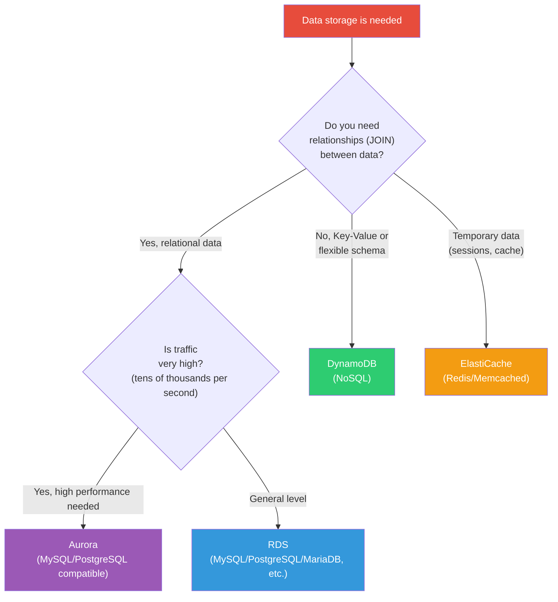
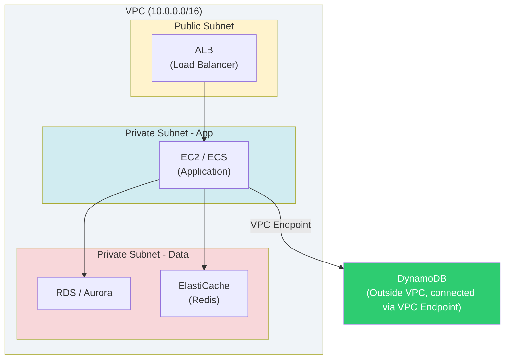
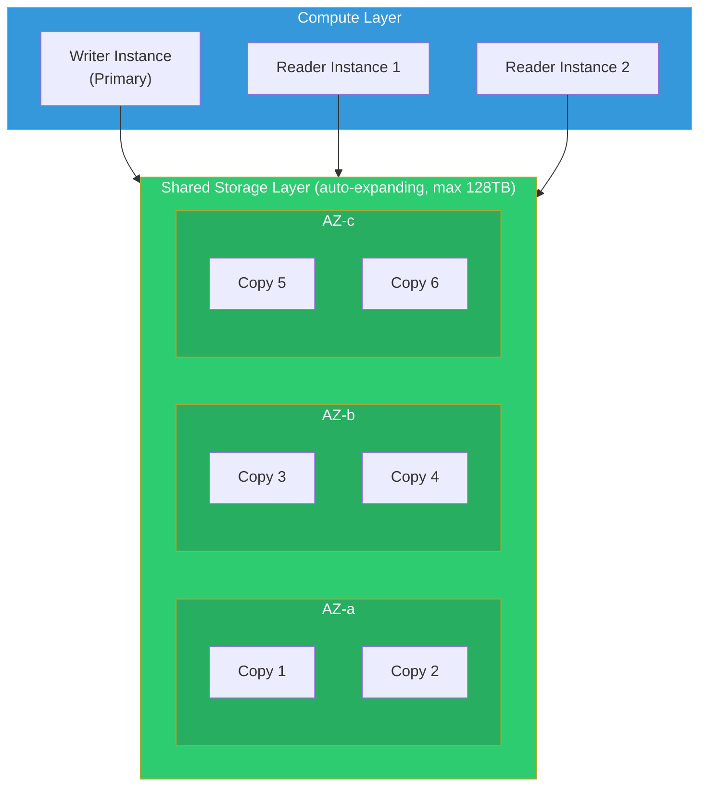
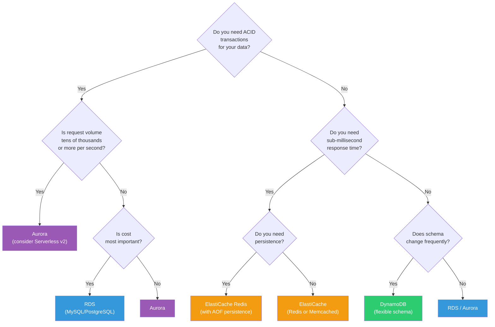

# RDS / Aurora / DynamoDB / ElastiCache

> AWS offers core database services for data storage and management. If you've learned about [storage services like S3, EBS, and EFS](./04-storage) in previous lectures, this time we'll explore how to handle **structured data**.

---

## 🎯 Why do you need to know this?

Any service you operate will need a database.

```
"Where should I store user information?"        → RDS (MySQL/PostgreSQL)
"I need to handle 100k reads per second"        → DynamoDB + DAX
"I want automatic recovery if DB fails"         → Aurora Multi-AZ
"Where should I store login sessions?"          → ElastiCache (Redis)
```

You could install MySQL directly on an EC2 instance. That's possible, but all of this becomes **your responsibility**:

- Patching/upgrading
- Backup/restore
- Failover when disasters occur
- Storage capacity management
- Monitoring setup

With AWS Managed Database services, you can hand off these operational burdens to AWS and focus on **application logic** instead.

---

## 🧠 Core Concepts

### Analogy: Think of data stores as restaurants

| Service | Analogy | Explanation |
|---------|---------|-------------|
| **RDS** | Neighborhood restaurant | Menu (schema) is fixed, recipes (SQL engine) are proven |
| **Aurora** | Franchise restaurant | Same menu as neighborhood restaurant, but kitchen has 6 locations spread out for speed and reliability |
| **DynamoDB** | Buffet | No menu—bring whatever you want. Just add more tables if crowds grow |
| **ElastiCache** | Counter with side dishes | Frequently used items are already out for quick access (caching) |

### RDBMS vs NoSQL vs Cache — Which to use when?



### Overall Architecture — Location within VPC

Databases are typically placed in **Private Subnets**. They shouldn't be accessible from outside.



> DynamoDB is an AWS-managed service outside the VPC. Using a VPC Endpoint, you can safely access it from a Private Subnet without going through the internet. For VPC concepts, see the [VPC lecture](./02-vpc).

### Management Level Comparison

Different services have different levels of AWS management.

```mermaid
flowchart LR
    subgraph SELF["Self-Managed (DB installed on EC2)"]
        direction TB
        S1["OS patching"]
        S2["DB installation/upgrade"]
        S3["Backup/restore"]
        S4["Failover"]
        S5["Storage management"]
    end

    subgraph MANAGED["RDS / Aurora"]
        direction TB
        M1["OS patching ✅ AWS"]
        M2["DB installation/upgrade ✅ AWS"]
        M3["Backup/restore ✅ AWS"]
        M4["Failover ✅ AWS"]
        M5["Storage management ✅ AWS"]
    end

    subgraph SERVERLESS["DynamoDB"]
        direction TB
        D1["Entire infrastructure ✅ AWS"]
        D2["Capacity management ✅ AWS"]
        D3["Scaling ✅ AWS"]
        D4["Patching/upgrade ✅ AWS"]
        D5["Table design is up to you!"]
    end

    SELF --> MANAGED --> SERVERLESS

    style SELF fill:#e74c3c,color:#fff
    style MANAGED fill:#f39c12,color:#fff
    style SERVERLESS fill:#2ecc71,color:#fff
```



---

## 🔍 Detailed Explanation

### 1. Amazon RDS (Relational Database Service)

RDS is **a managed service that provides relational databases**. Instead of installing MySQL manually on a server, AWS handles installation, patching, and backups for you.

#### Supported Engines

| Engine | Characteristics | Primary Uses |
|--------|-----------------|--------------|
| **MySQL** | Most widely used open-source DB | General web applications |
| **PostgreSQL** | Rich advanced features (JSON, GIS) | Complex queries, analytics workloads |
| **MariaDB** | MySQL fork with performance improvements | MySQL alternative |
| **Oracle** | Enterprise features | Legacy systems, finance |
| **SQL Server** | Microsoft ecosystem | .NET applications |

#### Core Components

**Instance Class** — Determines the specifications of the DB server.

```
db.t3.micro   → Development/testing (vCPU 2, 1GB memory)
db.r6g.large  → Production (vCPU 2, 16GB memory) — memory optimized
db.m6g.xlarge → General purpose (vCPU 4, 16GB memory)
```

> Analogy: When you open an Excel file, a better computer specs make it open faster, right? Instance class is exactly that "specification."

**DB Subnet Group** — Specifies the subnets where the DB will be placed.

```bash
# Retrieve DB Subnet Group
aws rds describe-db-subnet-groups \
  --query 'DBSubnetGroups[*].{Name:DBSubnetGroupName,VPC:VpcId,Subnets:Subnets[*].SubnetIdentifier}'

# Output example
# {
#     "Name": "my-db-subnet-group",
#     "VPC": "vpc-0abc123def456",
#     "Subnets": [
#         "subnet-0aaa111",   ← Private Subnet in AZ-a
#         "subnet-0bbb222"    ← Private Subnet in AZ-c
#     ]
# }
```

> For Multi-AZ, you need subnets in **at least 2 AZs**. Review the subnet design from the [VPC lecture](./02-vpc).

**Parameter Group** — Manages detailed engine configuration settings.

```bash
# Check parameter group contents (max_connections for MySQL, etc.)
aws rds describe-db-parameters \
  --db-parameter-group-name default.mysql8.0 \
  --query 'Parameters[?ParameterName==`max_connections`]'

# Output example
# {
#     "ParameterName": "max_connections",
#     "ParameterValue": "{DBInstanceClassMemory/12582880}",
#     "Description": "The number of simultaneous client connections allowed.",
#     "ApplyType": "dynamic"
# }
```

#### Multi-AZ (High Availability)

Enabling Multi-AZ automatically creates a **Standby replica in another AZ**. If Primary fails, it automatically switches (failover) to Standby.

```
┌─────────────────┐          ┌─────────────────┐
│   AZ-a          │          │   AZ-c          │
│  ┌───────────┐  │  Sync    │  ┌───────────┐  │
│  │  Primary  │──┼─replica→─┼──│  Standby  │  │
│  │   (R/W)   │  │          │  │   (Wait)  │  │
│  └───────────┘  │          │  └───────────┘  │
└─────────────────┘          └─────────────────┘
        ↑                            ↑
   Connect normally            Auto-failover on failure (~60 sec)
```

- **Synchronous replication** — Data written to Primary is confirmed in Standby before commit completes
- **Automatic Failover** — Within ~60 seconds, DNS endpoint switches to Standby
- **Standby is read-only** — Purely for waiting (use Read Replica for read distribution)

#### Read Replica (Read Distribution)

When read traffic is heavy, create **Read Replicas** for distribution.

```
        Write ──→ Primary ──→ Async replication ──→ Read Replica 1
                                                ──→ Read Replica 2
        Read ──→ Read Replica 1 or 2
```

- **Asynchronous replication** — There may be slight lag
- Maximum **15** Read Replicas possible (Aurora: 15, RDS: 5)
- **Cross-Region** Read Replica also available (disaster recovery purposes)

```bash
# List RDS instances
aws rds describe-db-instances \
  --query 'DBInstances[*].{ID:DBInstanceIdentifier,Engine:Engine,Class:DBInstanceClass,Status:DBInstanceStatus,MultiAZ:MultiAZ}' \
  --output table

# Output example
# ┌──────────────────┬─────────┬──────────────┬───────────┬─────────┐
# │       ID         │ Engine  │    Class     │  Status   │ MultiAZ │
# ├──────────────────┼─────────┼──────────────┼───────────┼─────────┤
# │ my-prod-db       │ mysql   │ db.r6g.large │ available │ True    │
# │ my-dev-db        │ mysql   │ db.t3.micro  │ available │ False   │
# │ my-prod-db-read1 │ mysql   │ db.r6g.large │ available │ False   │
# └──────────────────┴─────────┴──────────────┴───────────┴─────────┘
```

---

### 2. Amazon Aurora

Aurora is **AWS's redesigned cloud-native database based on MySQL/PostgreSQL**. It's compatible with traditional RDS but has a completely different internal architecture, offering far superior performance and reliability.

#### Why Aurora is Special: 6-Copy Distributed Storage



**Key Points:**
- Data is automatically saved as **6 copies across 3 AZs**
- Writes succeed when **4 out of 6** copies are written (Write Quorum)
- Reads return when **3 out of 6** copies are read (Read Quorum)
- Even if 2 copies fail simultaneously, writes still work; reads work even if 3 fail

> Analogy: Keep important documents by making 6 copies and storing them 2 each at 3 locations. Even if one location burns, you can get copies from the others.

#### Aurora Serverless v2

**Computing capacity automatically adjusts based on traffic**.

```
Low traffic: 0.5 ACU (approx. 1GB memory)  ← Cost savings
High traffic: 128 ACU (approx. 256GB memory) ← Auto-scaled

ACU(Aurora Capacity Unit) = vCPU + memory combination unit
```

- **Set only min/max ACU** and Aurora handles the rest
- Suitable for development/staging or services with variable traffic
- You can **mix Serverless v2 instances** with traditional Aurora instances in the same cluster

#### Aurora Global Database

Replicates data across multiple regions worldwide.

```
Seoul Region (Primary)
    ↓  Async replication in <1 second
Virginia Region (Secondary) — Read-only
    ↓
Europe Region (Secondary) — Read-only
```

- **RPO(data loss)**: Usually within 1 second
- **RTO(recovery time)**: Can promote Secondary to Primary within 1 minute
- Enable **reads from local region** for overseas users

#### Blue/Green Deployment

Database upgrades can be performed **without downtime**.

```
Blue (Current production) ──→ Service continues normally
                                ↕ Real-time replication
Green (New version)  ──→ After upgrade/test, switch

Switching: DNS points to Green (approximately 1 minute)
Rollback: Switch back to Blue
```

---

### 3. Amazon DynamoDB

DynamoDB is a **fully managed NoSQL database**. AWS handles server provisioning, patching, and scaling. You only need to **design your tables**.

> Analogy: If RDS is an "Excel file" (rows and columns are fixed), DynamoDB is a "notepad" (write whatever content you want). However, the notepad must have a **title (partition key)**.

#### Partition Key and Sort Key

DynamoDB table primary keys come in two forms.

```
1. Partition Key Only (Simple Primary Key)
   ┌─────────────────┬──────────┬────────┐
   │ user_id (PK)    │ name     │ email  │
   ├─────────────────┼──────────┼────────┤
   │ user-001        │ Hong Lee │ ...    │
   │ user-002        │ Kim Chul │ ...    │
   └─────────────────┴──────────┴────────┘

2. Partition Key + Sort Key (Composite Primary Key)
   ┌─────────────────┬──────────────────┬──────────┐
   │ user_id (PK)    │ order_date (SK)  │ amount   │
   ├─────────────────┼──────────────────┼──────────┤
   │ user-001        │ 2026-01-15       │ 50000    │
   │ user-001        │ 2026-02-20       │ 30000    │
   │ user-002        │ 2026-01-10       │ 80000    │
   └─────────────────┴──────────────────┴──────────┘
   → Can sort/range search by order_date within same user_id
```

- **Partition Key (PK)**: Determines which partition stores the data (design for even distribution)
- **Sort Key (SK)**: Sorting basis within same partition (enables range queries)

#### Capacity Mode: On-Demand vs Provisioned

| Item | On-Demand | Provisioned |
|------|-----------|-------------|
| Billing | Per-request | Set RCU/WCU in advance |
| Scaling | Automatic | Requires Auto Scaling setup |
| Cost | Cheap when traffic is low | Cheap when traffic is predictable |
| Good for | New services, highly variable traffic | Stable traffic patterns |

```
RCU(Read Capacity Unit):  1 strong consistency read of 4KB per second
                          or 2 eventual consistency reads of 4KB per second
WCU(Write Capacity Unit): 1 write of 1KB per second
```

#### GSI / LSI (Secondary Indexes)

Use when you want to search by conditions other than the primary key.

```
Original table:  PK=user_id, SK=order_date
             → Can only query by user_id

Add GSI:    PK=product_id, SK=order_date
             → Can also query by product_id!

Add LSI:    PK=user_id (same), SK=amount
             → Can sort/search by amount within same user
```

- **GSI(Global Secondary Index)**: Can be added after table creation, consumes separate RCU/WCU
- **LSI(Local Secondary Index)**: Can only be added at table creation, shares table's RCU/WCU

#### DynamoDB Streams

**Emits events when table data changes**.

```
Item added/updated/deleted
       ↓
  DynamoDB Stream (change log)
       ↓
  Lambda function triggered
       ↓
  Send notifications, sync other tables, analytics pipeline, etc.
```

#### TTL (Time to Live)

Set expiration time on items and they're **automatically deleted**. Useful for session data or logs.

```json
{
  "session_id": "abc-123",
  "user_id": "user-001",
  "expires_at": 1773561600    // Unix timestamp, auto-deleted after this time
}
```

#### DAX (DynamoDB Accelerator)

An **in-memory cache** placed in front of DynamoDB.

```
                  Cache hit → Microsecond response
Application → DAX ────────────→ DynamoDB
                  Cache miss → Fetch from DynamoDB and cache
```

- Minimal code changes (compatible with DynamoDB SDK)
- Reads are **tens of times faster** (milliseconds → microseconds)
- Effective for frequently read data (leaderboards, catalogs, etc.)

---

### 4. Amazon ElastiCache

ElastiCache provides **in-memory data stores** as a managed service. Since data is stored in **memory, not disk**, it's extremely fast.

> Analogy: Looking up a book in a library (RDS) takes time. If you take frequently used books and put them on your desk (cache), you can view them immediately. That's ElastiCache.

#### Redis vs Memcached

| Feature | Redis | Memcached |
|---------|-------|-----------|
| Data structures | String, List, Set, Hash, Sorted Set, etc. | String only |
| Persistence | Can save to disk via AOF/RDB | Memory only (lost on restart) |
| Replication | Primary-Replica supported | Not supported |
| Clustering | Cluster mode supported | Multi-node supported |
| Pub/Sub | Supported | Not supported |
| Use cases | Sessions, cache, leaderboards, queues | Simple cache only |
| **Conclusion** | **Most choose Redis** | When only simple caching is needed |

#### Redis Cluster Mode

```
Cluster mode disabled (Replication Group):
  Primary ──→ Replica 1
           ──→ Replica 2
  → One dataset, read distribution

Cluster mode enabled:
  Shard 1: Primary + Replica  (slots 0~5460)
  Shard 2: Primary + Replica  (slots 5461~10922)
  Shard 3: Primary + Replica  (slots 10923~16383)
  → Distributed storage, larger capacity and throughput
```

#### Key Usage Patterns

**1. Session Store**
```
User login → Store session in Redis
             (TTL 30 minutes)
Next request → Check session in Redis → Fast authentication
```

**2. Database Cache**
```
1. Application → First check Redis (cache hit)
2. Cache miss → Query RDS → Store result in Redis
3. Next same request → Return from Redis immediately
```

**3. Leaderboard (Sorted Set)**
```
ZADD leaderboard 95000 "player-001"    # Register score
ZADD leaderboard 87000 "player-002"
ZREVRANGE leaderboard 0 9              # Get top 10
```

---

### 5. Selection Guide: Decision Tree

When designing a service, here's how to choose which database.



| Use Case | Recommended Service | Reason |
|----------|-------------------|--------|
| General web services (forums, shopping malls) | RDS (PostgreSQL) | ACID, JOIN, proven ecosystem |
| Large-scale SaaS (tens of thousands per second) | Aurora Serverless v2 | Auto-scaling, high availability |
| IoT sensor data, game state | DynamoDB | Flexible schema, unlimited scaling |
| Login sessions, API response cache | ElastiCache Redis | Sub-millisecond response |
| Leaderboards, real-time analytics | ElastiCache Redis + DynamoDB | Fast reads + persistent storage |

---

## 💻 Hands-on Examples

### Lab 1: Create and Verify RDS MySQL Instance

```bash
# 1. Create DB Subnet Group (needs 2 Private subnets)
aws rds create-db-subnet-group \
  --db-subnet-group-name my-db-subnets \
  --db-subnet-group-description "Private subnets for RDS" \
  --subnet-ids '["subnet-0aaa111","subnet-0bbb222"]'

# Output example
# {
#     "DBSubnetGroup": {
#         "DBSubnetGroupName": "my-db-subnets",
#         "DBSubnetGroupDescription": "Private subnets for RDS",
#         "VpcId": "vpc-0abc123def456",
#         "SubnetGroupStatus": "Complete",
#         "Subnets": [
#             {"SubnetIdentifier": "subnet-0aaa111", "SubnetAvailabilityZone": {"Name": "ap-northeast-2a"}},
#             {"SubnetIdentifier": "subnet-0bbb222", "SubnetAvailabilityZone": {"Name": "ap-northeast-2c"}}
#         ]
#     }
# }

# 2. Create RDS instance
aws rds create-db-instance \
  --db-instance-identifier my-prod-db \
  --db-instance-class db.t3.micro \
  --engine mysql \
  --engine-version 8.0 \
  --master-username admin \
  --master-user-password 'MySecureP@ss123' \
  --allocated-storage 20 \
  --db-subnet-group-name my-db-subnets \
  --vpc-security-group-ids sg-0db12345 \
  --multi-az \
  --backup-retention-period 7 \
  --storage-encrypted \
  --no-publicly-accessible

# Output example (partial)
# {
#     "DBInstance": {
#         "DBInstanceIdentifier": "my-prod-db",
#         "DBInstanceClass": "db.t3.micro",
#         "Engine": "mysql",
#         "DBInstanceStatus": "creating",
#         "MultiAZ": true,
#         "StorageEncrypted": true,
#         "Endpoint": null   ← Endpoint appears after creation completes
#     }
# }

# 3. Wait for creation to complete (approximately 5-10 minutes)
aws rds wait db-instance-available \
  --db-instance-identifier my-prod-db

# 4. Check the endpoint
aws rds describe-db-instances \
  --db-instance-identifier my-prod-db \
  --query 'DBInstances[0].Endpoint'

# Output example
# {
#     "Address": "my-prod-db.c1xyz2abc3.ap-northeast-2.rds.amazonaws.com",
#     "Port": 3306,
#     "HostedZoneId": "Z3K1VBHNE..."
# }

# 5. Connection test (run from EC2)
mysql -h my-prod-db.c1xyz2abc3.ap-northeast-2.rds.amazonaws.com \
      -u admin -p \
      -e "SELECT VERSION();"

# Output example
# +------------+
# | VERSION()  |
# +------------+
# | 8.0.35     |
# +------------+
```

> You need to open port 3306 in the Security Group to connect. See the Security Group section in the [IAM lecture](./01-iam) and [VPC lecture](./02-vpc).

---

### Lab 2: Create DynamoDB Table and CRUD Operations

```bash
# 1. Create table (Orders table)
aws dynamodb create-table \
  --table-name Orders \
  --attribute-definitions \
    AttributeName=user_id,AttributeType=S \
    AttributeName=order_date,AttributeType=S \
  --key-schema \
    AttributeName=user_id,KeyType=HASH \
    AttributeName=order_date,KeyType=RANGE \
  --billing-mode PAY_PER_REQUEST

# Output example
# {
#     "TableDescription": {
#         "TableName": "Orders",
#         "TableStatus": "CREATING",
#         "KeySchema": [
#             {"AttributeName": "user_id", "KeyType": "HASH"},
#             {"AttributeName": "order_date", "KeyType": "RANGE"}
#         ],
#         "BillingModeSummary": {
#             "BillingMode": "PAY_PER_REQUEST"
#         }
#     }
# }

# 2. Check table status
aws dynamodb describe-table \
  --table-name Orders \
  --query 'Table.{Name:TableName,Status:TableStatus,ItemCount:ItemCount}'

# Output example
# {
#     "Name": "Orders",
#     "Status": "ACTIVE",
#     "ItemCount": 0
# }

# 3. Add data (PutItem)
aws dynamodb put-item \
  --table-name Orders \
  --item '{
    "user_id": {"S": "user-001"},
    "order_date": {"S": "2026-03-13"},
    "product": {"S": "AWS Lecture"},
    "amount": {"N": "49000"},
    "status": {"S": "completed"}
  }'

# (No return value means success)

# 4. Query data (GetItem — exact key lookup)
aws dynamodb get-item \
  --table-name Orders \
  --key '{
    "user_id": {"S": "user-001"},
    "order_date": {"S": "2026-03-13"}
  }'

# Output example
# {
#     "Item": {
#         "user_id": {"S": "user-001"},
#         "order_date": {"S": "2026-03-13"},
#         "product": {"S": "AWS Lecture"},
#         "amount": {"N": "49000"},
#         "status": {"S": "completed"}
#     }
# }

# 5. Range search (Query — all orders for user-001 in March 2026)
aws dynamodb query \
  --table-name Orders \
  --key-condition-expression "user_id = :uid AND begins_with(order_date, :month)" \
  --expression-attribute-values '{
    ":uid": {"S": "user-001"},
    ":month": {"S": "2026-03"}
  }'

# Output example
# {
#     "Items": [
#         {
#             "user_id": {"S": "user-001"},
#             "order_date": {"S": "2026-03-13"},
#             "product": {"S": "AWS Lecture"},
#             "amount": {"N": "49000"},
#             "status": {"S": "completed"}
#         }
#     ],
#     "Count": 1,
#     "ScannedCount": 1
# }

# 6. Enable TTL (auto-delete based on expires_at field)
aws dynamodb update-time-to-live \
  --table-name Orders \
  --time-to-live-specification "Enabled=true,AttributeName=expires_at"
```

---

### Lab 3: Create and Connect to ElastiCache Redis Cluster

```bash
# 1. Create ElastiCache Subnet Group
aws elasticache create-cache-subnet-group \
  --cache-subnet-group-name my-redis-subnets \
  --cache-subnet-group-description "Private subnets for Redis" \
  --subnet-ids subnet-0aaa111 subnet-0bbb222

# Output example
# {
#     "CacheSubnetGroup": {
#         "CacheSubnetGroupName": "my-redis-subnets",
#         "VpcId": "vpc-0abc123def456"
#     }
# }

# 2. Create Redis Replication Group (Primary + 1 Replica)
aws elasticache create-replication-group \
  --replication-group-id my-redis \
  --replication-group-description "Session store" \
  --engine redis \
  --cache-node-type cache.t3.micro \
  --num-cache-clusters 2 \
  --cache-subnet-group-name my-redis-subnets \
  --security-group-ids sg-0redis1234 \
  --at-rest-encryption-enabled \
  --transit-encryption-enabled \
  --automatic-failover-enabled

# Output example
# {
#     "ReplicationGroup": {
#         "ReplicationGroupId": "my-redis",
#         "Status": "creating",
#         "AutomaticFailover": "enabled",
#         "AtRestEncryptionEnabled": true,
#         "TransitEncryptionEnabled": true
#     }
# }

# 3. Check status
aws elasticache describe-replication-groups \
  --replication-group-id my-redis \
  --query 'ReplicationGroups[0].{ID:ReplicationGroupId,Status:Status,Endpoint:NodeGroups[0].PrimaryEndpoint}'

# Output example (after creation completes)
# {
#     "ID": "my-redis",
#     "Status": "available",
#     "Endpoint": {
#         "Address": "my-redis.abc123.ng.0001.apn2.cache.amazonaws.com",
#         "Port": 6379
#     }
# }

# 4. Connect to Redis from EC2
redis-cli -h my-redis.abc123.ng.0001.apn2.cache.amazonaws.com -p 6379

# Test Redis commands
> SET session:user-001 '{"name":"Hong Lee","role":"admin"}' EX 1800
OK
> GET session:user-001
"{\"name\":\"Hong Lee\",\"role\":\"admin\"}"
> TTL session:user-001
(integer) 1795    # Remaining seconds
> ZADD leaderboard 95000 "player-A" 87000 "player-B" 72000 "player-C"
(integer) 3
> ZREVRANGE leaderboard 0 2 WITHSCORES
1) "player-A"
2) "95000"
3) "player-B"
4) "87000"
5) "player-C"
6) "72000"
```

> For managing DB connection info (host, port, password) in K8s, see the [ConfigMap/Secret lecture](../04-kubernetes/04-config-secret). Passwords must always be managed with Secrets.

---

## 🏢 In the Real World

### Scenario 1: Shopping Mall Database Architecture

```
Problem: Running a shopping mall with 5000 product searches per second,
         200 orders per second. DB is getting slow.

Solution:
┌──────────────┐    ┌──────────────┐    ┌──────────────┐
│  Product     │    │  Product     │    │  Order/      │
│  Catalog     │    │  Details     │    │  Payment     │
│  DynamoDB    │    │ ElastiCache  │    │   Aurora     │
│              │    │   (cache)    │    │ (transaction)│
└──────────────┘    └──────────────┘    └──────────────┘

- Product list: DynamoDB (flexible schema, fast reads)
- Frequently queried product details: Cache in ElastiCache Redis
- Orders/payment: Aurora MySQL (ACID transactions essential)
- Order history lookup: Aurora Read Replica for distribution
```

**Key Point:** Combining multiple databases for their specific purposes is the typical real-world pattern. This is called **Polyglot Persistence**.

### Scenario 2: RDS Multi-AZ Disaster Recovery

```
Situation: 3 AM, Primary DB AZ experiences failure

Timeline:
03:00 — AZ-a failure, Primary DB inaccessible
03:00 — RDS detects and initiates Failover to Standby (AZ-c)
03:01 — DNS endpoint updated to point to Standby, failover complete
03:01 — Application reconnects via same endpoint → Working normally

Dev team's task: None (automatic failover)
Things to note:
  - Use DNS endpoint in connection strings, not IP
  - Connection pool will break, reconnection logic required
  - ~60 seconds of write unavailability → retry logic needed
```

### Scenario 3: Solving DynamoDB Hot Partition Problem

```
Problem: DynamoDB table writes are throttling.
         Provisioned WCU is sufficient, so why?

Root cause analysis:
  Table key: status (partition key) + created_at (sort key)
  status values: "active", "inactive", "pending"
  → 90% of traffic concentrated on "active"!
  → All load on single partition (hot partition)

Solution:
  Before: PK = status        ← Low cardinality (3 values)
  After:  PK = user_id       ← High cardinality (millions of values)
          GSI: PK = status    ← Use GSI for status search if needed

Lesson: Partition key must use attributes with high cardinality
        (many unique values)!
```

---

## ⚠️ Common Mistakes

### Mistake 1: Placing RDS in Public Subnet

```bash
# ❌ Wrong — DB is exposed to the internet!
aws rds create-db-instance \
  --publicly-accessible \
  --db-subnet-group-name public-subnets  # Using Public Subnet
```

```bash
# ✅ Correct — Private Subnet + Security Group protection
aws rds create-db-instance \
  --no-publicly-accessible \
  --db-subnet-group-name private-subnets \
  --vpc-security-group-ids sg-0db12345   # Allow only from app server SG
```

> Databases should **always be in Private Subnets**. To access locally during development, use SSH tunneling or a Bastion Host.

---

### Mistake 2: Overusing Scan in DynamoDB

```bash
# ❌ Scan — reads entire table (slow and expensive)
aws dynamodb scan --table-name Orders
# Reading 1 million items means reading all 1 million items and filtering

# ✅ Query — reads only necessary items based on partition key
aws dynamodb query \
  --table-name Orders \
  --key-condition-expression "user_id = :uid" \
  --expression-attribute-values '{":uid": {"S": "user-001"}}'
# Reads only user-001's data (fast and cheap)
```

> Use Scan only for analysis/migration. For regular queries, always use **Query**.

---

### Mistake 3: No Cache Invalidation Strategy for ElastiCache

```python
# ❌ Only caches data, doesn't refresh on change
def get_product(product_id):
    cached = redis.get(f"product:{product_id}")
    if cached:
        return cached                      # Returns stale data!
    product = db.query(product_id)
    redis.set(f"product:{product_id}", product)
    return product

# ✅ Cache-Aside pattern with invalidation on update
def update_product(product_id, new_data):
    db.update(product_id, new_data)        # 1. Update DB first
    redis.delete(f"product:{product_id}")  # 2. Delete cache
    # Next query will fetch from DB and cache the latest data
```

---

### Mistake 4: Using IP Address in RDS Connection String

```python
# ❌ Hardcoding IP requires manual change on failover
DB_HOST = "10.0.1.45"

# ✅ DNS endpoint automatically points to new instance after failover
DB_HOST = "my-prod-db.c1xyz2abc3.ap-northeast-2.rds.amazonaws.com"
```

---

### Mistake 5: Setting Aurora/RDS Backup Retention to 0

```bash
# ❌ Disabling automatic backup (data loss = no recovery!)
aws rds modify-db-instance \
  --db-instance-identifier my-prod-db \
  --backup-retention-period 0

# ✅ Minimum 7 days, production should be 14-35 days
aws rds modify-db-instance \
  --db-instance-identifier my-prod-db \
  --backup-retention-period 14
```

> Point-in-Time Recovery (restore to specific moment) only works with automatic backup enabled. Never disable backups on production!

---

## 📝 Summary

### Quick Comparison Table

| Item | RDS | Aurora | DynamoDB | ElastiCache |
|------|-----|--------|----------|-------------|
| **Type** | Relational (SQL) | Relational (SQL) | NoSQL (Key-Value) | In-memory cache |
| **Engine** | MySQL, PostgreSQL, MariaDB, Oracle, SQL Server | MySQL, PostgreSQL compatible | Custom engine | Redis, Memcached |
| **Max capacity** | 64TB | 128TB | Unlimited | Per-node memory |
| **Replication** | Multi-AZ Standby, Read Replica (max 5) | 6-Copy distributed, Read Replica (max 15) | Regional table, Global Table | Replication Group |
| **Failover** | ~60 seconds | ~30 seconds | N/A (Serverless) | Automatic Failover |
| **Scaling** | Manual (change instance) | Serverless v2 (automatic) | On-Demand (automatic) | Manual (add nodes) |
| **Cost** | Per-hour billing | Per-hour + I/O billing | Per-request or capacity billing | Per-hour billing |
| **Common use** | General web services | High-performance/high-availability services | IoT, games, sessions | Cache, sessions, leaderboards |

### Checklist

```
✅ Relational data + general traffic          → RDS
✅ Relational data + high performance/HA       → Aurora
✅ Flexible schema + unlimited scaling         → DynamoDB
✅ Sub-millisecond response + temporary data   → ElastiCache
✅ Always place DB in Private Subnet
✅ Use DNS endpoint, not IP, in connection strings
✅ Enable automatic backup (retention 7+ days)
✅ Enable encryption (at rest + in transit)
✅ Manage DB credentials via K8s Secret or Secrets Manager
✅ Choose high-cardinality attributes for DynamoDB partition keys
```

### Essential CLI Commands Summary

| Purpose | Command |
|---------|---------|
| List RDS instances | `aws rds describe-db-instances` |
| Create RDS instance | `aws rds create-db-instance` |
| Create RDS snapshot | `aws rds create-db-snapshot` |
| Query Aurora clusters | `aws rds describe-db-clusters` |
| List DynamoDB tables | `aws dynamodb list-tables` |
| Create DynamoDB table | `aws dynamodb create-table` |
| Write DynamoDB data | `aws dynamodb put-item` |
| Query DynamoDB data | `aws dynamodb query` |
| Query ElastiCache clusters | `aws elasticache describe-replication-groups` |
| Create ElastiCache cluster | `aws elasticache create-replication-group` |

---

## 🔗 Next Lecture → [06-db-operations](./06-db-operations)

In the next lecture, we'll learn about database **operations**.

- Backup and restore strategies (automatic/manual snapshots, PITR)
- Replication and synchronization (Cross-Region, CDC)
- Connection pooling (RDS Proxy)
- Monitoring and performance tuning (Performance Insights, slow query)
- Migration (DMS, Schema Conversion Tool)
