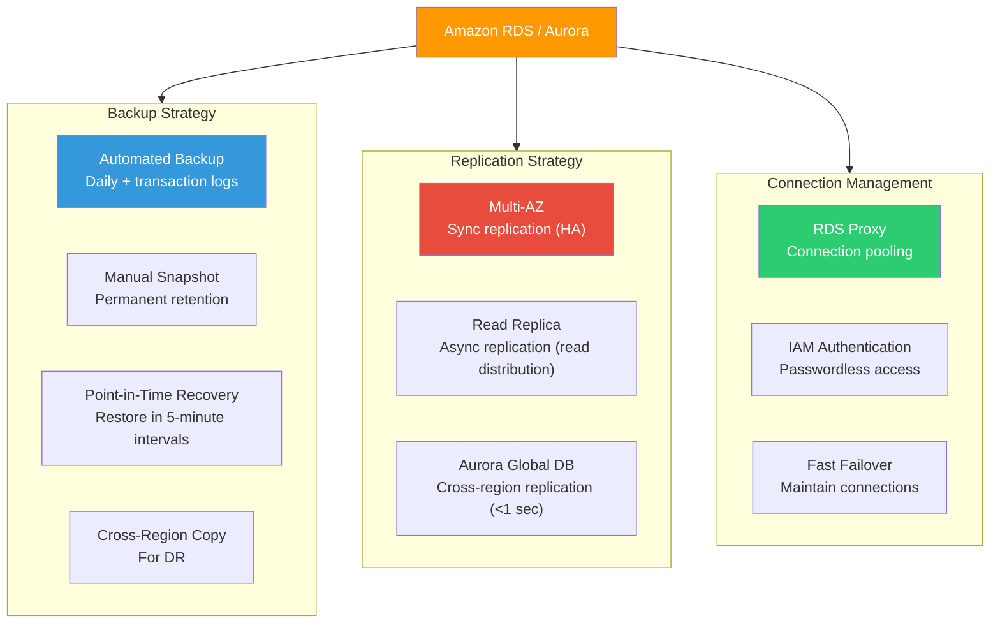
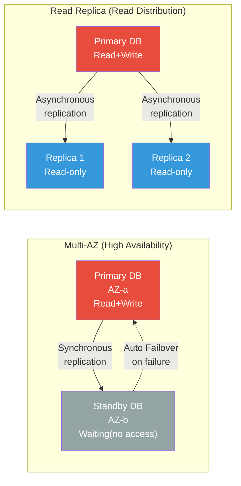
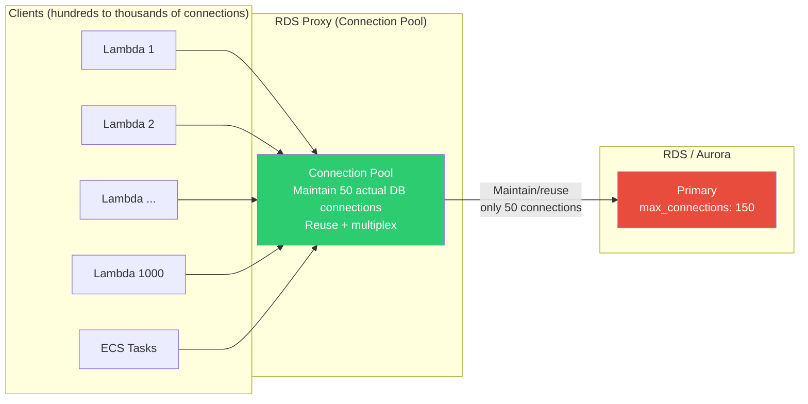
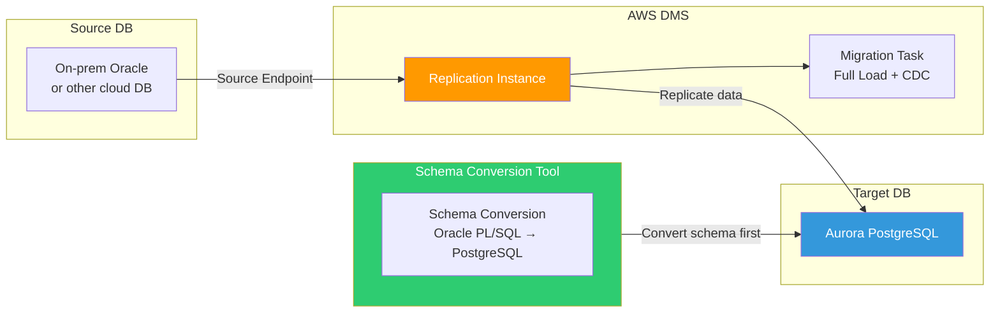
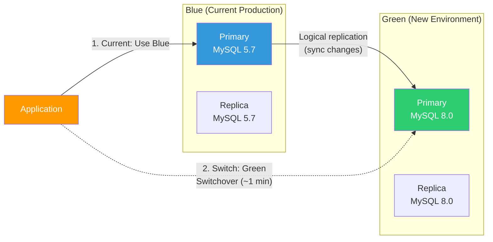

# DB Operations (Backup / Replication / Pooling)

> In the [previous lecture](./05-database), we learned about AWS database services like RDS, Aurora, and DynamoDB. Now we'll learn the operational techniques to **keep databases alive, recover them quickly, and connect them efficiently**.

---

## 🎯 Why do you need to know this?

```
Moments when DB operations are needed:
• "DB crashed at 3 AM and there's no backup"              → Backup strategy
• "Read traffic is so high the DB is slow"                → Read Replica
• "Primary DB died and service was down for 5 minutes"    → Multi-AZ Failover
• "Lambda opened 1000 DB connections and crashed"         → RDS Proxy (connection pooling)
• "Need to migrate on-prem Oracle to Aurora"              → DMS migration
• "Don't know where slow queries are coming from"         → Performance Insights
• Interview: "What's the difference between Multi-AZ and Read Replica?" → Sync vs async replication
```

---

## 🧠 Core Concepts (Analogy + Diagrams)

### Analogy: Bank vault backup system

Let's compare DB operations to a **bank**.

* **Automated Backup** = Bank **automatically takes photos of vault contents** every night and keeps them. Retained up to 35 days
* **Manual Snapshot** = **Take a photo yourself** before important transactions and keep separately. Permanently retained until deletion
* **Point-in-Time Recovery** = Not just photos, but **transaction logs** too, so you can restore to "yesterday 3:14 PM exactly"

### Analogy: Emergency generators and branch offices

* **Multi-AZ (Synchronous replication)** = Store in both main vault and **adjacent building vault simultaneously**. If main burns, restart business immediately from adjacent building
* **Read Replica (Asynchronous replication)** = Allow **branch offices to also check balance**. Some lag possible
* **RDS Proxy (Connection pooling)** = **Implement ticket system** at bank counter. Efficiently reuse 10 counters for 1000 customers
* **DMS (Migration)** = **Transfer accounts** from another bank to our bank. Continue business at old bank during transfer (CDC)

### Overall DB Operations Architecture



### Multi-AZ vs Read Replica Comparison



### RDS Proxy Connection Pooling



---

## 🔍 Detailed Explanation

### 1. Backup Strategy

Think of DB backup as **3-layer defense**. We learned about EBS snapshots in the [storage lecture](./04-storage); RDS backup internally uses EBS snapshots + transaction logs.

#### Automated Backup

RDS **automatically** takes a full DB snapshot daily and stores transaction logs to S3 every 5 minutes.

```bash
# === Check automated backup settings ===
aws rds describe-db-instances \
  --db-instance-identifier my-production-db \
  --query "DBInstances[0].{
    BackupRetentionPeriod: BackupRetentionPeriod,
    PreferredBackupWindow: PreferredBackupWindow,
    LatestRestorableTime: LatestRestorableTime
  }" --output table

# Expected output:
# +-----------------------+-------------------------------------+
# |  BackupRetentionPeriod|  7                                  |
# |  PreferredBackupWindow|  03:00-04:00                        |
# |  LatestRestorableTime |  2026-03-13T09:10:00+00:00          |
# +-----------------------+-------------------------------------+
```

```bash
# === Change automated backup retention (max 35 days) ===
aws rds modify-db-instance \
  --db-instance-identifier my-production-db \
  --backup-retention-period 35 \
  --preferred-backup-window "02:00-03:00" \
  --apply-immediately
# → BackupRetentionPeriod: 35, DBInstanceStatus: "modifying"
```

> **Warning**: Setting `BackupRetentionPeriod` to 0 **completely disables** automated backup. Never do this in production!

#### Manual Snapshot

Unlike automated backups, **retained permanently until deletion**. Take these before deployments, engine upgrades, and other important events.

```bash
# === Create manual snapshot ===
aws rds create-db-snapshot \
  --db-instance-identifier my-production-db \
  --db-snapshot-identifier my-prod-before-upgrade-20260313

# Expected output:
# {
#     "DBSnapshot": {
#         "DBSnapshotIdentifier": "my-prod-before-upgrade-20260313",
#         "Status": "creating",
#         "SnapshotType": "manual"
#     }
# }
```

#### Point-in-Time Recovery (PITR)

Combining automated backup + transaction logs, you can restore to **any point within retention period**.

```bash
# === Restore to "March 13, 9 AM" state by creating new instance ===
aws rds restore-db-instance-to-point-in-time \
  --source-db-instance-identifier my-production-db \
  --target-db-instance-identifier my-prod-restored-0313 \
  --restore-time "2026-03-13T09:00:00Z" \
  --db-instance-class db.r6g.large \
  --vpc-security-group-ids sg-0abc1234def56789
# → DBInstanceStatus: "creating" (creates new instance!)
```

> **Important**: PITR creates a **new instance**. It doesn't overwrite the existing instance!

#### Aurora Continuous Backup vs Regular RDS

| Item | RDS (General) | Aurora |
|------|---------------|--------|
| Backup method | EBS snapshot + binlog | Continuous storage layer backup |
| Backup performance impact | Possible I/O pause (Single-AZ) | None |
| PITR restore speed | Slow (snapshot + log replay) | Fast (parallel replay) |
| Backtrack | Not supported | Supported (rewind, no new instance) |

```bash
# === Aurora Backtrack (rewind) — Rewind existing cluster without new instance ===
aws rds backtrack-db-cluster \
  --db-cluster-identifier my-aurora-cluster \
  --backtrack-to "2026-03-13T09:00:00Z"
# → Status: "backtracking" (recover in minutes!)
```

#### Cross-Region Backup

For DR (disaster recovery), copy snapshots to another region. Remember RTO/RPO concepts from the [K8s Backup/DR lecture](../04-kubernetes/16-backup-dr).

```bash
# === Copy snapshot to another region ===
aws rds copy-db-snapshot \
  --source-db-snapshot-identifier arn:aws:rds:ap-northeast-2:123456789012:snapshot:my-prod-before-upgrade-20260313 \
  --target-db-snapshot-identifier my-prod-dr-copy-20260313 \
  --region us-west-2 \
  --kms-key-id arn:aws:kms:us-west-2:123456789012:key/abcd1234 \
  --copy-tags
# → You can restore DB from this snapshot in another region
```

---

### 2. Replication

#### RDS Multi-AZ (Synchronous Replication — High Availability)

Multi-AZ maintains a Standby replica **synchronously in another AZ of the same region**. If Primary fails, **automatic failover occurs within 60~120 seconds**.

```bash
# === Enable Multi-AZ ===
aws rds modify-db-instance \
  --db-instance-identifier my-production-db \
  --multi-az \
  --apply-immediately
# → MultiAZ: true, SecondaryAvailabilityZone: "ap-northeast-2b"

# === Test failover (manually trigger failover) ===
aws rds reboot-db-instance \
  --db-instance-identifier my-production-db \
  --force-failover
# → Standby becomes new Primary (DNS endpoint remains the same!)
```

> **Multi-AZ core point**: You cannot directly access Standby. It's purely for failover. For read distribution, use Read Replica.

#### Read Replica (Asynchronous Replication — Read Distribution)

```bash
# === Create Read Replica ===
aws rds create-db-instance-read-replica \
  --db-instance-identifier my-prod-read-replica-1 \
  --source-db-instance-identifier my-production-db \
  --db-instance-class db.r6g.large \
  --availability-zone ap-northeast-2c
# → StatusInfos: [{"StatusType": "read replication", "Status": "replicating"}]

# === Check Replica Lag (CloudWatch) ===
aws cloudwatch get-metric-statistics \
  --namespace AWS/RDS \
  --metric-name ReplicaLag \
  --dimensions Name=DBInstanceIdentifier,Value=my-prod-read-replica-1 \
  --start-time "2026-03-13T08:00:00Z" \
  --end-time "2026-03-13T10:00:00Z" \
  --period 300 --statistics Average
# → Average: 0.15 (seconds). Under 0.2 seconds is healthy.
```

#### Aurora Global Database (Cross-region Replication)

Aurora Global Database can replicate to up to 5 regions with **less than 1 second lag**.

```bash
# === Step 1: Expand existing Aurora cluster to Global ===
aws rds create-global-cluster \
  --global-cluster-identifier my-global-db \
  --source-db-cluster-identifier arn:aws:rds:ap-northeast-2:123456789012:cluster:my-aurora-cluster

# === Step 2: Add cluster to secondary region ===
aws rds create-db-cluster \
  --db-cluster-identifier my-aurora-cluster-us \
  --global-cluster-identifier my-global-db \
  --engine aurora-mysql \
  --region us-west-2
# → Read-only cluster created in secondary region
```

#### DynamoDB Global Tables

The **multi-region Active-Active** replication of DynamoDB that we learned in the [DB services lecture](./05-database).

```bash
# === Add region to DynamoDB Global Table ===
aws dynamodb update-table \
  --table-name UserSessions \
  --replica-updates '[{"Create": {"RegionName": "us-west-2"}}]'
# → Replicas: [{"RegionName":"ap-northeast-2","ReplicaStatus":"ACTIVE"},
#              {"RegionName":"us-west-2","ReplicaStatus":"CREATING"}]
```

---

### 3. Connection Management (Connection Pooling)

#### Why Connection Pooling is Needed

DB connections are **expensive resources**. Each connection consumes memory (approximately 5~10MB).

| DB Instance | max_connections (default) |
|------------|--------------------------|
| db.t3.micro | ~85 |
| db.t3.medium | ~170 |
| db.r6g.large | ~1,000 |
| db.r6g.2xlarge | ~2,000 |

> `max_connections` calculation formula: `{DBInstanceClassMemory/12582880}` (MySQL basis)

#### Create RDS Proxy

```bash
# === Create RDS Proxy ===
# First need to store DB credentials in Secrets Manager (see ./01-iam)
aws rds create-db-proxy \
  --db-proxy-name my-app-proxy \
  --engine-family MYSQL \
  --auth '[{
    "AuthScheme": "SECRETS",
    "SecretArn": "arn:aws:secretsmanager:ap-northeast-2:123456789012:secret:my-db-credentials",
    "IAMAuth": "REQUIRED"
  }]' \
  --role-arn arn:aws:iam::123456789012:role/rds-proxy-role \
  --vpc-subnet-ids subnet-0abc1234 subnet-0def5678 \
  --vpc-security-group-ids sg-0abc1234def56789 \
  --require-tls

# Expected output:
# {
#     "DBProxy": {
#         "DBProxyName": "my-app-proxy",
#         "Status": "creating",
#         "Endpoint": "my-app-proxy.proxy-abc123.ap-northeast-2.rds.amazonaws.com"
#     }
# }
```

```bash
# === Register target DB to Proxy + check endpoint ===
aws rds register-db-proxy-targets \
  --db-proxy-name my-app-proxy \
  --db-cluster-identifiers my-aurora-cluster

aws rds describe-db-proxy-endpoints \
  --db-proxy-name my-app-proxy --output table
# → Endpoint: my-app-proxy.proxy-abc123..., TargetRole: READ_WRITE
```

#### RDS Proxy Benefits

| Feature | Explanation |
|---------|-------------|
| **Connection pooling** | Thousands of app connections → multiplexed to tens of DB connections |
| **Failover acceleration** | 66% faster switch on Multi-AZ Failover (connections maintained) |
| **IAM authentication** | Access DB with [IAM](./01-iam) tokens instead of passwords |
| **Enforce TLS** | Mandatory encryption in transit |

#### PgBouncer vs RDS Proxy

| Item | PgBouncer | RDS Proxy |
|------|-----------|-----------|
| Installation | Manual on EC2/containers | Managed service |
| Engine support | PostgreSQL only | MySQL + PostgreSQL |
| Management overhead | Manual monitoring/patching | AWS managed |
| Cost | EC2 cost only | Per-vCPU hourly billing |
| Failover integration | Manual implementation | Automatic with RDS/Aurora |
| IAM authentication | Not supported | Supported |
| K8s deployment | Possible with [StatefulSet](../04-kubernetes/03-statefulset-daemonset) | Not needed (managed) |

---

### 4. Migration (DMS)

Used when moving DBs from on-prem or other clouds to AWS. Supports both **homogeneous migration** (MySQL → MySQL) and **heterogeneous migration** (Oracle → Aurora PostgreSQL).



| Migration Type | Example | SCT Required? |
|----------------|---------|---------------|
| **Homogeneous** | MySQL → Aurora MySQL | Not needed |
| **Heterogeneous** | Oracle → Aurora PostgreSQL | Required |

#### CDC (Change Data Capture)

After **Full Load** of existing data, **CDC** reflects changes during migration in real-time. You can migrate without stopping source DB!

```bash
# === Create DMS migration task (Full Load + CDC) ===
aws dms create-replication-task \
  --replication-task-identifier my-migration-task \
  --source-endpoint-arn arn:aws:dms:ap-northeast-2:123456789012:endpoint:source-oracle \
  --target-endpoint-arn arn:aws:dms:ap-northeast-2:123456789012:endpoint:target-aurora \
  --replication-instance-arn arn:aws:dms:ap-northeast-2:123456789012:rep:my-dms-instance \
  --migration-type full-load-and-cdc \
  --table-mappings '{
    "rules": [{
      "rule-type": "selection",
      "rule-id": "1",
      "rule-name": "select-all-tables",
      "object-locator": {"schema-name": "MYAPP", "table-name": "%"},
      "rule-action": "include"
    }]
  }'
# → MigrationType: "full-load-and-cdc", Status: "creating"
```

---

### 5. Monitoring

#### Performance Insights

Analyze slow queries and DB load **visually**.

```bash
# === Enable Performance Insights ===
aws rds modify-db-instance \
  --db-instance-identifier my-production-db \
  --enable-performance-insights \
  --performance-insights-retention-period 731 \
  --apply-immediately

# === Get Top 5 slow queries ===
aws pi get-resource-metrics \
  --service-type RDS \
  --identifier db-ABCDEFGHIJKLMNOP1234567890 \
  --metric-queries '[{"Metric":"db.load.avg","GroupBy":{"Group":"db.sql","Limit":5}}]' \
  --start-time "2026-03-13T00:00:00Z" \
  --end-time "2026-03-13T10:00:00Z" \
  --period-in-seconds 3600
# → Insights like "orders table created_at has no index!"
```

#### Enhanced Monitoring + CloudWatch Key Metrics

```bash
# === Enable Enhanced Monitoring (1-second granularity) ===
aws rds modify-db-instance \
  --db-instance-identifier my-production-db \
  --monitoring-interval 1 \
  --monitoring-role-arn arn:aws:iam::123456789012:role/rds-monitoring-role \
  --apply-immediately

# Key CloudWatch metrics:
# • CPUUtilization        — CPU usage (%)
# • FreeableMemory        — Available memory (bytes)
# • DatabaseConnections   — Current DB connections
# • ReadIOPS / WriteIOPS  — I/O operations per second
# • ReadLatency / WriteLatency — I/O latency (seconds)
# • FreeStorageSpace      — Remaining disk space (bytes)
# • ReplicaLag            — Read Replica lag (seconds)
```

---

### 6. Maintenance

#### Engine Upgrade (Major / Minor)

| Type | Minor Upgrade | Major Upgrade |
|------|---------------|---------------|
| Example | MySQL 8.0.32 → 8.0.35 | MySQL 5.7 → 8.0 |
| Auto-apply | Possible (optional) | Manual only |
| Downtime | Short (Multi-AZ: ~30 sec) | Long (minutes to tens of minutes) |
| Compatibility | Mostly compatible | Breaking changes possible |

```bash
# === Check available upgrade versions ===
aws rds describe-db-engine-versions \
  --engine aurora-mysql \
  --engine-version 8.0.mysql_aurora.3.04.1 \
  --query "DBEngineVersions[0].ValidUpgradeTarget[].EngineVersion"
# → ["8.0.mysql_aurora.3.04.2", "8.0.mysql_aurora.3.05.0", "8.0.mysql_aurora.3.05.1"]
```

#### Zero-Downtime Upgrade with Blue/Green Deployment

For major upgrades, use **Blue/Green Deployment**. Apply upgrade + test in Green environment, then switch.



```bash
# === Create Blue/Green Deployment ===
aws rds create-blue-green-deployment \
  --blue-green-deployment-name my-bg-upgrade \
  --source arn:aws:rds:ap-northeast-2:123456789012:db:my-production-db \
  --target-engine-version "8.0.35" \
  --target-db-parameter-group-name my-mysql80-params
# → Status: "PROVISIONING"

# === After testing Green environment, switch ===
aws rds switchover-blue-green-deployment \
  --blue-green-deployment-identifier bgd-abc123def456 \
  --switchover-timeout 300
# → Green becomes new Primary within ~1 minute. DNS endpoint changes automatically!
```

#### Parameter Changes

```bash
# === Enable slow query log + change threshold ===
aws rds modify-db-parameter-group \
  --db-parameter-group-name my-mysql80-params \
  --parameters \
    "ParameterName=slow_query_log,ParameterValue=1,ApplyMethod=immediate" \
    "ParameterName=long_query_time,ParameterValue=1,ApplyMethod=immediate"
# → Dynamic parameters apply immediately. Static parameters need reboot!
```

---

## 💻 Hands-on Examples

### Lab 1: Aurora Cluster Backup + Cross-Region Restore

```bash
# === Step 1: Check cluster status ===
aws rds describe-db-clusters \
  --db-cluster-identifier my-aurora-cluster \
  --query "DBClusters[0].{Status:Status,Engine:Engine,BackupRetentionPeriod:BackupRetentionPeriod,LatestRestorableTime:LatestRestorableTime}" \
  --output table

# === Step 2: Create manual snapshot ===
aws rds create-db-cluster-snapshot \
  --db-cluster-identifier my-aurora-cluster \
  --db-cluster-snapshot-identifier aurora-backup-20260313

# === Step 3: Wait for completion ===
aws rds wait db-cluster-snapshot-available \
  --db-cluster-snapshot-identifier aurora-backup-20260313

# === Step 4: Copy to another region (for DR) ===
aws rds copy-db-cluster-snapshot \
  --source-db-cluster-snapshot-identifier arn:aws:rds:ap-northeast-2:123456789012:cluster-snapshot:aurora-backup-20260313 \
  --target-db-cluster-snapshot-identifier aurora-backup-20260313-dr \
  --region us-west-2 --copy-tags

# === Step 5: Restore cluster from snapshot ===
aws rds restore-db-cluster-from-snapshot \
  --db-cluster-identifier my-aurora-restored \
  --snapshot-identifier aurora-backup-20260313 \
  --engine aurora-mysql

# Add instance to restored cluster
aws rds create-db-instance \
  --db-instance-identifier my-aurora-restored-instance-1 \
  --db-cluster-identifier my-aurora-restored \
  --db-instance-class db.r6g.large \
  --engine aurora-mysql
```

### Lab 2: RDS Proxy + Lambda Connection

```bash
# === Step 1: Store DB credentials in Secrets Manager ===
aws secretsmanager create-secret \
  --name my-db-credentials \
  --secret-string '{"username":"admin","password":"MySecureP@ssw0rd!","engine":"mysql","host":"my-aurora-cluster.cluster-abc123.ap-northeast-2.rds.amazonaws.com","port":3306,"dbname":"myapp"}'

# === Step 2: Create RDS Proxy ===
aws rds create-db-proxy \
  --db-proxy-name my-lambda-proxy \
  --engine-family MYSQL \
  --auth '[{"AuthScheme":"SECRETS","SecretArn":"arn:aws:secretsmanager:ap-northeast-2:123456789012:secret:my-db-credentials-AbCdEf","IAMAuth":"REQUIRED"}]' \
  --role-arn arn:aws:iam::123456789012:role/rds-proxy-role \
  --vpc-subnet-ids subnet-0abc1234 subnet-0def5678 \
  --require-tls

# === Step 3: Set Proxy endpoint in Lambda environment variable ===
aws lambda update-function-configuration \
  --function-name my-api-handler \
  --environment '{"Variables":{"DB_HOST":"my-lambda-proxy.proxy-abc123.ap-northeast-2.rds.amazonaws.com","DB_PORT":"3306","DB_NAME":"myapp"}}'
```

Lambda code pattern for IAM authentication access:

```python
# Lambda handler — RDS Proxy + IAM authentication
import pymysql, boto3, os

rds_client = boto3.client('rds')

def get_connection():
    token = rds_client.generate_db_auth_token(
        DBHostname=os.environ['DB_HOST'],  # RDS Proxy endpoint
        Port=3306, DBUsername='lambda_user', Region='ap-northeast-2'
    )
    return pymysql.connect(
        host=os.environ['DB_HOST'], user='lambda_user',
        password=token, database='myapp', ssl={'ssl': True}, connect_timeout=3
    )

# Create connection outside handler (reuse when Lambda container is reused)
conn = get_connection()

def handler(event, context):
    global conn
    try:
        with conn.cursor() as cursor:
            cursor.execute("SELECT * FROM users WHERE id = %s", (event['id'],))
            return cursor.fetchone()
    except pymysql.err.OperationalError:
        conn = get_connection()  # Reconnect if connection broken
        with conn.cursor() as cursor:
            cursor.execute("SELECT * FROM users WHERE id = %s", (event['id'],))
            return cursor.fetchone()
```

### Lab 3: DMS MySQL → Aurora Migration

```bash
# === Step 1: Create source/target endpoints ===
aws dms create-endpoint --endpoint-identifier source-mysql \
  --endpoint-type source --engine-name mysql \
  --server-name 10.0.1.50 --port 3306 \
  --username dms_user --password 'DmsP@ssw0rd!'

aws dms create-endpoint --endpoint-identifier target-aurora \
  --endpoint-type target --engine-name aurora \
  --server-name my-aurora-cluster.cluster-abc123.ap-northeast-2.rds.amazonaws.com \
  --port 3306 --username admin --password 'AuroraP@ssw0rd!'

# === Step 2: Test connections ===
aws dms test-connection \
  --replication-instance-arn arn:aws:dms:ap-northeast-2:123456789012:rep:my-dms-instance \
  --endpoint-arn arn:aws:dms:ap-northeast-2:123456789012:endpoint:source-mysql
# → Status: "successful"

# === Step 3: Start Full Load + CDC migration ===
aws dms create-replication-task \
  --replication-task-identifier mysql-to-aurora \
  --source-endpoint-arn arn:aws:dms:...:endpoint:source-mysql \
  --target-endpoint-arn arn:aws:dms:...:endpoint:target-aurora \
  --replication-instance-arn arn:aws:dms:...:rep:my-dms-instance \
  --migration-type full-load-and-cdc \
  --table-mappings '{"rules":[{"rule-type":"selection","rule-id":"1","rule-name":"migrate-all","object-locator":{"schema-name":"myapp","table-name":"%"},"rule-action":"include"}]}'

aws dms start-replication-task \
  --replication-task-arn arn:aws:dms:...:task:mysql-to-aurora \
  --start-replication-task-type start-replication

# === Step 4: Monitor progress ===
aws dms describe-table-statistics \
  --replication-task-arn arn:aws:dms:...:task:mysql-to-aurora \
  --query "TableStatistics[].{Table:TableName,FullLoadRows:FullLoadRows,Inserts:Inserts,Updates:Updates,Status:TableState}" \
  --output table
# → FullLoadRows: initial load complete, Inserts/Updates: real-time CDC sync
```

---

## 🏢 In the Real World

### Scenario 1: "Developer executes DELETE without WHERE at 3 AM"

```
Situation: DELETE FROM orders; (forgot WHERE clause)
         → All 20 million orders deleted

Response:
├─ Aurora → Backtrack to before DELETE (recover in minutes)
├─ Regular RDS → PITR to create new instance → verify data → restore
└─ Prevention:
    • Restrict production DB access with IAM (./01-iam)
    • Set sql_safe_updates=1 parameter (block DELETE/UPDATE without WHERE)
    • Automate manual snapshot before changes
```

### Scenario 2: "Traffic spike hits max_connections limit"

```
Situation: Black Friday sale starts
         → Lambda concurrency 500 → 3000, "Too many connections" error

Response:
├─ Immediate: Deploy RDS Proxy (3000 app connections → 100 DB connections)
├─ Read distribution: Add Read Replica → route read queries to Replica
├─ Scale up: db.r6g.large → db.r6g.2xlarge (max_connections: 1000 → 2000)
└─ Long-term: Query optimization + ElastiCache caching + DynamoDB for sessions
```

### Scenario 3: "Heterogeneous migration on-prem Oracle → Aurora PostgreSQL"

```
Migration plan (3 months):
├─ Month 1: AWS SCT schema analysis → PL/SQL → PL/pgSQL conversion (~80% auto)
├─ Month 2: DMS Full Load + CDC → app code update → staging test
└─ Month 3: Cutover rehearsal → verify CDC lag 0 → switch endpoint → stabilize
```

---

## ⚠️ Common Mistakes

### Mistake 1: Setting automated backup retention to 0

```bash
# ❌ Disable backup to save costs
aws rds modify-db-instance --db-instance-identifier my-prod --backup-retention-period 0
# → PITR impossible! Completely disable automated backup!

# ✅ Minimum 7 days, production should be 35 days
aws rds modify-db-instance --db-instance-identifier my-prod --backup-retention-period 35
```

### Mistake 2: Using Read Replica as Multi-AZ substitute

```
❌ "Since we have Read Replica, don't need Multi-AZ, right?"

✅ Correct understanding:
• Read Replica = async replication → data loss possible (lag)
• Multi-AZ = sync replication → zero data loss, automatic failover
• Production should use both Multi-AZ AND Read Replica!
```

### Mistake 3: Lambda connecting directly to DB without pooling

```python
# ❌ Create new connection per invocation + no cleanup → connection flood!
def handler(event, context):
    connection = pymysql.connect(host="my-rds-endpoint", ...)
    cursor = connection.cursor()
    cursor.execute("SELECT * FROM users")
    return cursor.fetchall()

# ✅ RDS Proxy + IAM auth + manage connection outside handler (see Lab 2)
```

### Mistake 4: Deleting existing DB immediately after PITR restore

```
❌ Wrong order: PITR restore → delete existing DB immediately → verify data on new DB (too late!)

✅ Correct order:
1. PITR creates new instance
2. Verify data integrity on new instance
3. Switch application endpoint
4. Monitor for at least 1 hour
5. Delete old instance with "create final snapshot" option
```

### Mistake 5: Applying Major upgrade directly to production

```bash
# ❌ Direct Major upgrade to production → compatibility issues + long downtime
aws rds modify-db-instance --engine-version "8.0.35" --apply-immediately

# ✅ Use Blue/Green Deployment (see maintenance section)
aws rds create-blue-green-deployment \
  --source arn:aws:rds:...:db:my-prod --target-engine-version "8.0.35"
# → Test in Green, then switch (~1 min, rollback possible)
```

---

## 📝 Summary

| Area | Core Service/Feature | Key Points |
|------|-------------------|-----------|
| **Backup** | Automated Backup + Manual Snapshot + PITR | Automated min 7 days, production 35 days. PITR creates new instance |
| **Aurora Backup** | Continuous Backup + Backtrack | No performance impact. Backtrack rewinds without new instance |
| **Multi-AZ** | Sync replication, automatic failover | For HA. Standby no direct access. Failover 60~120 sec |
| **Read Replica** | Async replication, read distribution | Max 15 (Aurora). Monitor ReplicaLag |
| **RDS Proxy** | Connection pooling, IAM auth | Essential for Lambda. Failover 66% faster. Secrets Manager integration |
| **DMS** | Full Load + CDC | Zero-downtime migration. SCT for heterogeneous schema conversion |
| **Monitoring** | Performance Insights + Enhanced Monitoring | Top N slow queries. OS metrics in 1-sec intervals |
| **Maintenance** | Blue/Green Deployment | Major upgrades always via B/G. ~1 min switch |

### Backup Strategy Decision Guide

```
What backup strategy should you use?
├─ "Basics first?" → Automated backup 35 days + manual snapshot (before deploy/change)
├─ "Restore in <5 min?" → Aurora Backtrack
├─ "Restore to specific point?" → PITR (within retention period)
├─ "Prepare for region failure?" → Cross-region snapshot copy or Aurora Global DB
└─ "K8s + DB simultaneous backup?" → Velero(../04-kubernetes/16-backup-dr) + RDS snapshot combo
```

### Connection Strategy Decision Guide

```
What connection method should you use?
├─ Lambda → DB?         → RDS Proxy (essential!)
├─ ECS/EKS → DB?        → RDS Proxy or app-level connection pool
├─ EC2 → DB?            → App-level connection pool (HikariCP, etc.)
├─ PostgreSQL only?     → PgBouncer (StatefulSet, ../04-kubernetes/03-statefulset-daemonset)
└─ Fast Multi-AZ Failover? → RDS Proxy (connection maintenance accelerates failover)
```

---

## 🔗 Next Lecture → [07-load-balancing](./07-load-balancing)

> In the next lecture, we'll learn about **load balancing** in front of DBs -- the differences between ALB, NLB, GLB and traffic distribution strategies. If you've distributed reads with DB Read Replicas, you also need to distribute the app servers themselves, right?
