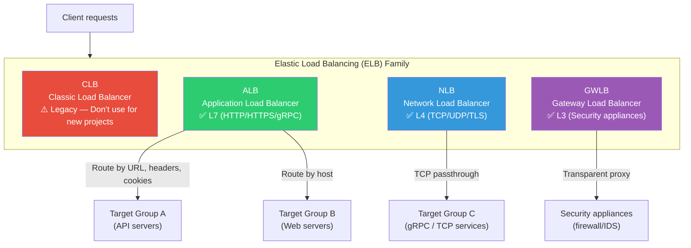
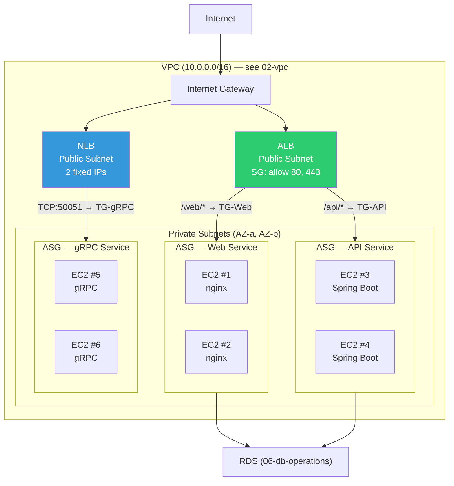
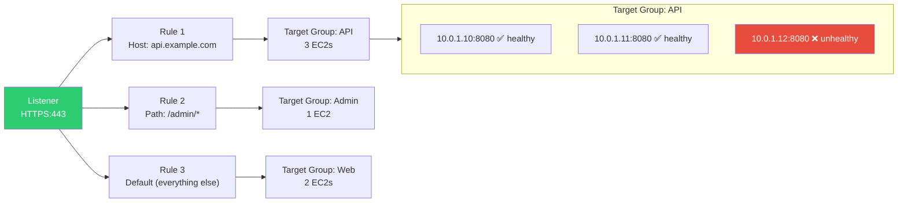
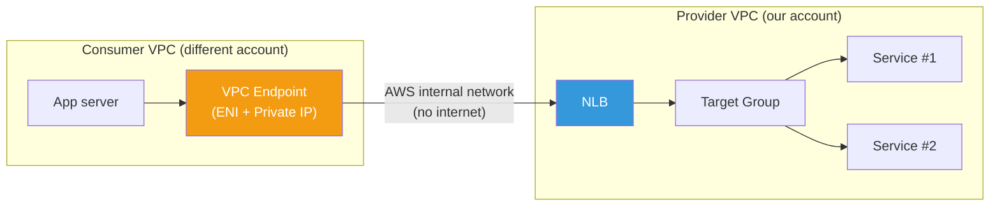
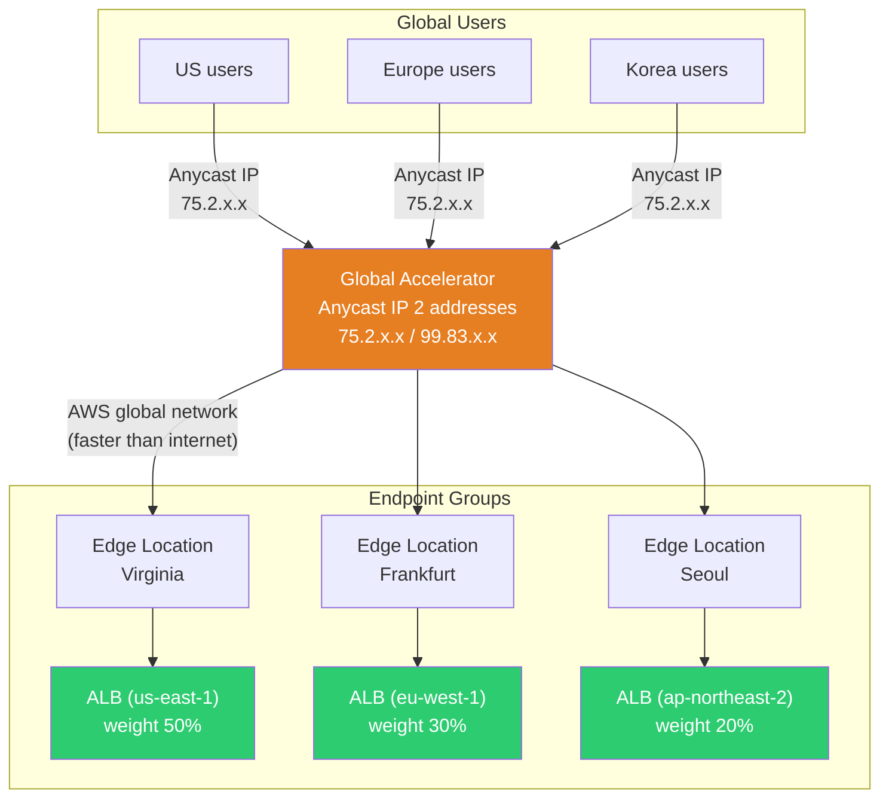

# ELB / ALB / NLB / Global Accelerator

> In the [previous lecture](./06-db-operations), we learned about DB operations (backup, replication, connection pooling). When you have multiple app servers in front of the DB, the load balancer's role is to **intelligently distribute traffic**. Since we learned L4/L7 concepts in [network fundamentals load balancing](../02-networking/06-load-balancing), now let's learn **how to actually configure it in AWS**.

---

## 🎯 Why do you need to know this?

```
DevOps tasks with AWS load balancing:
• "ALB vs NLB, which one should I use?"              → ELB selection criteria
• "I want to route different paths to different services" → ALB path-based routing
• "My gRPC service needs a fixed IP"                 → NLB TCP passthrough
• "Need to connect traffic to Auto Scaling Group"    → Target Group + ASG integration
• "Health Check keeps failing"                       → ALB vs NLB Health Check differences
• "Want to respond fast to global users"             → Global Accelerator
• "Getting 502 errors during deployment"             → Deregistration Delay + Slow Start
• Interview: "Explain the difference between ALB and NLB" → L7 vs L4, 10 comparison criteria
```

We learned about [EC2 + Auto Scaling](./03-ec2-autoscaling) before, right? ALB/NLB almost always work as a pair with ASG. If [Nginx/HAProxy](../02-networking/07-nginx-haproxy) are software load balancers, ELB is AWS's **managed load balancer**.

---

## 🧠 Core Concepts (Analogy + Diagrams)

### Analogy: Traffic system

Let's compare AWS load balancing to a **traffic system**.

| Real World | AWS |
|-----------|-----|
| Traffic Police (guide vehicles to lanes by destination) | **ALB** -- Distributes HTTP requests by URL, headers, cookies |
| Toll gate (check license plate only, quickly pass) | **NLB** -- Rapidly forwards TCP/UDP packets |
| Old manual traffic light (basic functions only) | **CLB** -- Legacy, no longer recommended |
| Customs checkpoint (security equipment scanning) | **GWLB** -- Route traffic through appliances like firewalls/IDS |
| Highway interchange (lanes = services) | **Target Group** -- Server group that receives actual traffic |
| Vehicle inspection station (block broken cars) | **Health Check** -- Exclude unhealthy servers |
| International airport hub (route to nearest airport) | **Global Accelerator** -- Route via Anycast IP to optimal region |

### ELB Types at a Glance



### ELB Selection Guide

```
Which load balancer should you use?
├─ HTTP/HTTPS web service?
│   ├─ Need URL-based routing?         → ALB (path-based routing)
│   ├─ Need domain-based routing?      → ALB (host-based routing)
│   ├─ Need WAF integration?           → ALB (direct WAF integration)
│   └─ Need Cognito authentication?    → ALB (built-in authentication)
├─ TCP/UDP / non-HTTP?
│   ├─ Need fixed IP?                  → NLB (can assign Elastic IP)
│   ├─ Need ultra-low latency?         → NLB (~100us vs ALB ~400ms)
│   ├─ gRPC + TLS passthrough?         → NLB
│   └─ Expose via PrivateLink?         → NLB (VPC Endpoint Service)
├─ Security appliance chaining?        → GWLB
└─ Currently using CLB?                → Migrate to ALB or NLB
```

### Complete ALB + NLB + ASG Architecture



---

## 🔍 Detailed Explanation

### 1. ALB (Application Load Balancer) Details

ALB operates at **L7 (HTTP/HTTPS/gRPC)** level. Since we already learned [L4/L7 concepts](../02-networking/06-load-balancing), this means ALB **opens and examines** HTTP requests before deciding.

#### Listener → Rule → Target Group Structure



**Listener**: Defines which port/protocol receives incoming traffic.

**Rule**: Defines conditions for where to send incoming requests. Conditions include:

| Condition Type | Example | Description |
|----------------|---------|-------------|
| **Host header** | `api.example.com` | Route by domain |
| **Path** | `/api/v1/*` | Route by URL path |
| **HTTP method** | `GET`, `POST` | Route by method |
| **Query string** | `?version=v2` | Route by query parameter |
| **Source IP** | `10.0.0.0/8` | Route by source IP |
| **HTTP header** | `X-Custom: blue` | Route by custom header |

**Target Group**: Group of targets that receive actual traffic.

#### ALB Target Types

| Target Type | Description | Use Case |
|-------------|-------------|----------|
| **instance** | Register by EC2 instance ID | General EC2 + ASG |
| **ip** | Register by IP address | ECS Fargate, on-prem (DX/VPN), other VPCs |
| **Lambda** | Call Lambda function directly | Serverless APIs |
| **ALB** | Use another ALB as target | NLB → ALB chaining (fixed IP + L7 routing) |

#### ALB Advanced Features

**Weighted Target Group (Weight-based Routing)**

Useful for canary deployments. Send 10% to new version and 90% to existing.

```bash
# Create weighted forwarding rule
# Distribute 90% to TG-v1, 10% to TG-v2 (canary deployment)
aws elbv2 modify-rule \
    --rule-arn arn:aws:elasticloadbalancing:ap-northeast-2:123456789012:listener-rule/app/my-alb/abcd1234/listener/5678/rule/9999 \
    --actions '[{
        "Type": "forward",
        "ForwardConfig": {
            "TargetGroups": [
                {"TargetGroupArn": "arn:aws:...tg-v1", "Weight": 90},
                {"TargetGroupArn": "arn:aws:...tg-v2", "Weight": 10}
            ],
            "TargetGroupStickinessConfig": {
                "Enabled": true,
                "DurationSeconds": 3600
            }
        }
    }]'
```

**Fixed Response**

Useful for maintenance pages. ALB responds directly without target group.

```bash
# Return 503 fixed response for /maintenance path
aws elbv2 create-rule \
    --listener-arn arn:aws:elasticloadbalancing:ap-northeast-2:123456789012:listener/app/my-alb/abcd1234/5678efgh \
    --priority 5 \
    --conditions '[{"Field": "path-pattern", "Values": ["/maintenance"]}]' \
    --actions '[{
        "Type": "fixed-response",
        "FixedResponseConfig": {
            "StatusCode": "503",
            "ContentType": "text/html",
            "MessageBody": "<h1>Maintenance in progress</h1><p>Please try again later.</p>"
        }
    }]'
```

**Redirect**

```bash
# HTTP → HTTPS redirect (most common pattern)
aws elbv2 create-rule \
    --listener-arn arn:aws:elasticloadbalancing:ap-northeast-2:123456789012:listener/app/my-alb/abcd1234/http-listener \
    --priority 1 \
    --conditions '[{"Field": "path-pattern", "Values": ["/*"]}]' \
    --actions '[{
        "Type": "redirect",
        "RedirectConfig": {
            "Protocol": "HTTPS",
            "Port": "443",
            "StatusCode": "HTTP_301"
        }
    }]'
```

**WAF Integration**

You can directly connect [AWS WAF](./12-security) to ALB. NLB doesn't support direct WAF integration.

```bash
# Associate WAF Web ACL to ALB
aws wafv2 associate-web-acl \
    --web-acl-arn arn:aws:wafv2:ap-northeast-2:123456789012:regional/webacl/my-web-acl/abcd1234 \
    --resource-arn arn:aws:elasticloadbalancing:ap-northeast-2:123456789012:loadbalancer/app/my-alb/abcd1234
```

**Authentication (Cognito / OIDC)**

ALB can handle authentication itself. Remove authentication logic from app code.

```bash
# Add Cognito authentication to ALB listener rule
aws elbv2 create-rule \
    --listener-arn arn:aws:elasticloadbalancing:ap-northeast-2:123456789012:listener/app/my-alb/abcd1234/5678efgh \
    --priority 10 \
    --conditions '[{"Field": "path-pattern", "Values": ["/admin/*"]}]' \
    --actions '[
        {
            "Type": "authenticate-cognito",
            "Order": 1,
            "AuthenticateCognitoConfig": {
                "UserPoolArn": "arn:aws:cognito-idp:ap-northeast-2:123456789012:userpool/ap-northeast-2_abcdef",
                "UserPoolClientId": "my-client-id",
                "UserPoolDomain": "my-auth-domain",
                "OnUnauthenticatedRequest": "authenticate"
            }
        },
        {
            "Type": "forward",
            "Order": 2,
            "TargetGroupArn": "arn:aws:...tg-admin"
        }
    ]'
```

**Access Log**

ALB can save all requests to S3. Essential for debugging and auditing.

```bash
# Enable ALB Access Log
aws elbv2 modify-load-balancer-attributes \
    --load-balancer-arn arn:aws:elasticloadbalancing:ap-northeast-2:123456789012:loadbalancer/app/my-alb/abcd1234 \
    --attributes \
        Key=access_logs.s3.enabled,Value=true \
        Key=access_logs.s3.bucket,Value=my-alb-logs-bucket \
        Key=access_logs.s3.prefix,Value=alb-logs
```

Access Log format example:

```
# One line of access log example (actually printed on one line)
https 2026-03-13T09:15:23.456789Z app/my-alb/abcd1234
  203.0.113.50:12345 10.0.1.10:8080
  0.001 0.032 0.000 200 200
  356 1247
  "GET https://api.example.com:443/api/v1/users HTTP/2.0"
  "Mozilla/5.0" ECDHE-RSA-AES128-GCM-SHA256 TLSv1.2
  arn:aws:...tg-api/abcd1234 "Root=1-abc-def"
  "api.example.com" "arn:aws:acm:..."
  0 2026-03-13T09:15:23.456000Z "forward" "-" "-"
  "10.0.1.10:8080" "200" "-" "-"
```

**Slow Start**

Gradually increase traffic to newly registered targets. Useful for Java services that need JVM warmup.

```bash
# Set Slow Start 300 seconds on target group
# New targets start at 0% and reach 100% over 300 seconds
aws elbv2 modify-target-group-attributes \
    --target-group-arn arn:aws:elasticloadbalancing:ap-northeast-2:123456789012:targetgroup/my-tg/abcd1234 \
    --attributes Key=slow_start.duration_seconds,Value=300
```

**Deregistration Delay (Connection Draining)**

Give existing connections time to finish safely when target is removed. Prevents 502 errors during deployment.

```bash
# Set Deregistration Delay to 30 seconds (default 300 seconds)
aws elbv2 modify-target-group-attributes \
    --target-group-arn arn:aws:elasticloadbalancing:ap-northeast-2:123456789012:targetgroup/my-tg/abcd1234 \
    --attributes Key=deregistration_delay.timeout_seconds,Value=30
```

---

### 2. NLB (Network Load Balancer) Details

NLB operates at **L4 (TCP/UDP/TLS)** level. It only looks at IP and port and distributes packets, knows nothing about HTTP content, but is **extremely fast and provides fixed IP**.

#### Key NLB Features

| Feature | Description |
|---------|-------------|
| **Fixed IP** | Can assign 1 Elastic IP per AZ. Useful for firewall whitelists |
| **Ultra-low latency** | ~100 microseconds. Hundreds of times faster than ALB |
| **TCP passthrough** | Can forward TLS to backend without terminating |
| **Source IP preservation** | Preserve client IP natively (backend sees actual client IP) |
| **PrivateLink** | Expose service as VPC Endpoint Service to other accounts/VPCs |
| **Massive scale** | Millions of requests per second, handles traffic spikes |

```bash
# Create NLB (with fixed IP assignment)
# Can specify Elastic IP per subnet
aws elbv2 create-load-balancer \
    --name my-nlb \
    --type network \
    --subnet-mappings \
        SubnetId=subnet-aaaa1111,AllocationId=eipalloc-1111aaaa \
        SubnetId=subnet-bbbb2222,AllocationId=eipalloc-2222bbbb

# Output result:
# {
#     "LoadBalancers": [{
#         "LoadBalancerArn": "arn:aws:elasticloadbalancing:ap-northeast-2:123456789012:loadbalancer/net/my-nlb/abcd1234",
#         "DNSName": "my-nlb-abcd1234.elb.ap-northeast-2.amazonaws.com",
#         "Type": "network",
#         "Scheme": "internet-facing",
#         "AvailabilityZones": [
#             {
#                 "ZoneName": "ap-northeast-2a",
#                 "SubnetId": "subnet-aaaa1111",
#                 "LoadBalancerAddresses": [{"IpAddress": "13.125.100.1", "AllocationId": "eipalloc-1111aaaa"}]
#             },
#             {
#                 "ZoneName": "ap-northeast-2b",
#                 "SubnetId": "subnet-bbbb2222",
#                 "LoadBalancerAddresses": [{"IpAddress": "13.125.200.2", "AllocationId": "eipalloc-2222bbbb"}]
#             }
#         ],
#         "State": {"Code": "provisioning"}
#     }]
# }
```

#### NLB + PrivateLink (VPC Endpoint Service)

Used when you want other AWS accounts' VPCs to access your service. Communication happens via AWS internal network without going through internet.



```bash
# Create VPC Endpoint Service (NLB-based)
aws ec2 create-vpc-endpoint-service-configuration \
    --network-load-balancer-arns arn:aws:elasticloadbalancing:ap-northeast-2:123456789012:loadbalancer/net/my-nlb/abcd1234 \
    --acceptance-required

# Output result:
# {
#     "ServiceConfiguration": {
#         "ServiceId": "vpce-svc-abcd1234",
#         "ServiceName": "com.amazonaws.vpce.ap-northeast-2.vpce-svc-abcd1234",
#         "ServiceState": "Available",
#         "AcceptanceRequired": true,
#         "NetworkLoadBalancerArns": ["arn:aws:...my-nlb/abcd1234"]
#     }
# }
```

---

### 3. ALB vs NLB Comparison Table

| Comparison | ALB | NLB |
|------------|-----|-----|
| **OSI Layer** | L7 (HTTP/HTTPS/gRPC) | L4 (TCP/UDP/TLS) |
| **Latency** | ~hundreds of ms | ~100 microseconds |
| **Fixed IP** | Not available (DNS name only) | Available (Elastic IP per AZ) |
| **Source IP preservation** | Via X-Forwarded-For header | Native preservation (Proxy Protocol also supported) |
| **SSL termination** | ALB terminates (required) | Can passthrough OR terminate at NLB |
| **Routing** | URL, host, header, query, etc. | Port-based only |
| **WAF integration** | Direct integration | Not available (use NLB → ALB chaining workaround) |
| **Authentication** | Cognito / OIDC built-in | Not available |
| **PrivateLink** | Not available (use NLB → ALB chaining workaround) | Direct integration |
| **Health Check** | HTTP/HTTPS (path, status code) | TCP / HTTP / HTTPS |
| **Sticky Session** | Cookie-based | Source IP-based (5-tuple hash) |
| **Security Group** | Available | Supported since 2023 (wasn't available before) |
| **Pricing** | Hourly + LCU (throughput-based) | Hourly + NLCU (connection/bandwidth-based) |
| **Primary Use** | Web services, REST APIs, microservices | gRPC, IoT, games, finance, TCP services |

---

### 4. Health Check: ALB vs NLB Differences

Health Check periodically verifies if targets are healthy. ALB and NLB operate differently.

#### ALB Health Check

```bash
# Create ALB target group + HTTP Health Check
aws elbv2 create-target-group \
    --name tg-web-alb \
    --protocol HTTP \
    --port 8080 \
    --vpc-id vpc-abcd1234 \
    --target-type instance \
    --health-check-protocol HTTP \
    --health-check-path /health \
    --health-check-interval-seconds 15 \
    --health-check-timeout-seconds 5 \
    --healthy-threshold-count 3 \
    --unhealthy-threshold-count 2 \
    --matcher '{"HttpCode": "200-299"}'

# Output result:
# {
#     "TargetGroups": [{
#         "TargetGroupArn": "arn:aws:...targetgroup/tg-web-alb/abcd1234",
#         "TargetGroupName": "tg-web-alb",
#         "Protocol": "HTTP",
#         "Port": 8080,
#         "HealthCheckProtocol": "HTTP",
#         "HealthCheckPath": "/health",
#         "HealthCheckIntervalSeconds": 15,
#         "HealthCheckTimeoutSeconds": 5,
#         "HealthyThresholdCount": 3,
#         "UnhealthyThresholdCount": 2,
#         "Matcher": {"HttpCode": "200-299"}
#     }]
# }
```

#### NLB Health Check

```bash
# Create NLB target group + TCP Health Check
# NLB uses TCP-level check by default but HTTP is also possible
aws elbv2 create-target-group \
    --name tg-grpc-nlb \
    --protocol TCP \
    --port 50051 \
    --vpc-id vpc-abcd1234 \
    --target-type instance \
    --health-check-protocol TCP \
    --health-check-interval-seconds 10 \
    --healthy-threshold-count 3 \
    --unhealthy-threshold-count 3

# Output result:
# {
#     "TargetGroups": [{
#         "TargetGroupArn": "arn:aws:...targetgroup/tg-grpc-nlb/efgh5678",
#         "TargetGroupName": "tg-grpc-nlb",
#         "Protocol": "TCP",
#         "Port": 50051,
#         "HealthCheckProtocol": "TCP",
#         "HealthCheckIntervalSeconds": 10,
#         "HealthyThresholdCount": 3,
#         "UnhealthyThresholdCount": 3
#     }]
# }
```

#### Health Check Comparison

| Item | ALB | NLB |
|------|-----|-----|
| **Default protocol** | HTTP | TCP |
| **Path specification** | Possible (`/health`) | Not for TCP, possible if HTTP |
| **Response code matching** | Range specification `200-299` | Possible only if HTTP |
| **Minimum Interval** | 5 seconds | 10 seconds |
| **Timeout** | Configurable separately | 10 seconds fixed (not changeable) |
| **Unhealthy criteria** | 2~10 consecutive failures | 2~10 consecutive failures |
| **Healthy criteria** | 2~10 consecutive successes | **3 consecutive successes (fixed, not changeable)** |

```bash
# Check target health state (common to ALB/NLB)
aws elbv2 describe-target-health \
    --target-group-arn arn:aws:elasticloadbalancing:ap-northeast-2:123456789012:targetgroup/tg-web-alb/abcd1234

# Output result:
# {
#     "TargetHealthDescriptions": [
#         {
#             "Target": {"Id": "i-0abc111", "Port": 8080},
#             "HealthCheckPort": "8080",
#             "TargetHealth": {"State": "healthy"}
#         },
#         {
#             "Target": {"Id": "i-0abc222", "Port": 8080},
#             "HealthCheckPort": "8080",
#             "TargetHealth": {
#                 "State": "unhealthy",
#                 "Reason": "Target.ResponseCodeMismatch",
#                 "Description": "Health checks failed with these codes: [503]"
#             }
#         },
#         {
#             "Target": {"Id": "i-0abc333", "Port": 8080},
#             "HealthCheckPort": "8080",
#             "TargetHealth": {
#                 "State": "unused",
#                 "Reason": "Target.NotInUse",
#                 "Description": "Target group is not configured to receive traffic from the load balancer"
#             }
#         }
#     ]
# }
```

---

### 5. Cross-Zone Load Balancing

When Cross-Zone is enabled, traffic is distributed evenly across all targets crossing AZ boundaries.

```
Cross-Zone OFF (default: ALB=ON, NLB=OFF)
─────────────────────────────────────
AZ-a (2 targets)          AZ-b (8 targets)
  50% of traffic            50% of traffic
  25% each target           6.25% each target  ← imbalanced!

Cross-Zone ON
─────────────────────────────────────
AZ-a (2 targets)          AZ-b (8 targets)
         Distribute evenly to all 10 targets
         10% each target  ← balanced!
```

| Item | ALB | NLB |
|------|-----|-----|
| **Default** | ON (always) | OFF |
| **Cost** | Free | Cross-AZ data transfer cost applies |
| **Configuration unit** | Load balancer | Target group |

```bash
# Enable Cross-Zone on NLB (per target group)
aws elbv2 modify-target-group-attributes \
    --target-group-arn arn:aws:elasticloadbalancing:ap-northeast-2:123456789012:targetgroup/tg-grpc-nlb/efgh5678 \
    --attributes Key=load_balancing.cross_zone.enabled,Value=true
```

---

### 6. Sticky Session (Session Affinity)

Routes requests from same client to same target. Needed for legacy apps that store session state on servers.

| Item | ALB | NLB |
|------|-----|-----|
| **Method** | Cookie-based (AWSALB / app cookie) | Source IP-based (5-tuple hash) |
| **Duration** | 1 second ~ 7 days | Not configurable (duration of connection) |
| **Note** | Possible unbalanced distribution | Clients behind NAT routed to same target |

```bash
# Set cookie-based Sticky Session on ALB target group
aws elbv2 modify-target-group-attributes \
    --target-group-arn arn:aws:elasticloadbalancing:ap-northeast-2:123456789012:targetgroup/tg-web-alb/abcd1234 \
    --attributes \
        Key=stickiness.enabled,Value=true \
        Key=stickiness.type,Value=lb_cookie \
        Key=stickiness.lb_cookie.duration_seconds,Value=86400
```

---

### 7. Global Accelerator

Global Accelerator uses **Anycast IP** to route global users to the nearest AWS region.

#### CloudFront vs Global Accelerator

| Comparison | CloudFront | Global Accelerator |
|-----------|------------|-------------------|
| **Operating Layer** | L7 (HTTP/HTTPS) | L4 (TCP/UDP) |
| **Caching** | Yes (cache static content) | No (no caching) |
| **IP** | DNS-based (IP changes) | **Fixed Anycast IP (2 addresses)** |
| **Use** | Static content, web acceleration | TCP/UDP apps, games, IoT, APIs |
| **Failover** | Origin failover | Auto failover between endpoint groups |
| **Routing** | Geographic DNS | Anycast + AWS global network |



```bash
# Create Global Accelerator
aws globalaccelerator create-accelerator \
    --name my-global-accelerator \
    --ip-address-type IPV4 \
    --enabled \
    --region us-west-2  # Global Accelerator managed only in us-west-2

# Output result:
# {
#     "Accelerator": {
#         "AcceleratorArn": "arn:aws:globalaccelerator::123456789012:accelerator/abcd-1234",
#         "Name": "my-global-accelerator",
#         "IpAddressType": "IPV4",
#         "Enabled": true,
#         "IpSets": [
#             {
#                 "IpFamily": "IPv4",
#                 "IpAddresses": ["75.2.100.50", "99.83.200.60"]
#             }
#         ],
#         "DnsName": "abcd1234.awsglobalaccelerator.com",
#         "Status": "DEPLOYED"
#     }
# }
```

---

## 💻 Hands-on Examples

### Lab 1: Create ALB + Path-Based Routing + ASG Integration

**Goal**: Configure ALB that routes `/api/*` to API servers and others to Web servers

```bash
# -------------------------------------------------------
# Step 1: Create ALB
# -------------------------------------------------------
aws elbv2 create-load-balancer \
    --name my-web-alb \
    --type application \
    --scheme internet-facing \
    --subnets subnet-pub-a subnet-pub-b \
    --security-groups sg-alb-web

# Output result:
# {
#     "LoadBalancers": [{
#         "LoadBalancerArn": "arn:aws:...loadbalancer/app/my-web-alb/aabb1122",
#         "DNSName": "my-web-alb-aabb1122.ap-northeast-2.elb.amazonaws.com",
#         "Type": "application",
#         "Scheme": "internet-facing",
#         "State": {"Code": "provisioning"}
#     }]
# }

# -------------------------------------------------------
# Step 2: Create 2 target groups (Web + API)
# -------------------------------------------------------

# Web target group
aws elbv2 create-target-group \
    --name tg-web \
    --protocol HTTP \
    --port 80 \
    --vpc-id vpc-abcd1234 \
    --target-type instance \
    --health-check-path /index.html \
    --health-check-interval-seconds 15

# API target group
aws elbv2 create-target-group \
    --name tg-api \
    --protocol HTTP \
    --port 8080 \
    --vpc-id vpc-abcd1234 \
    --target-type instance \
    --health-check-path /api/health \
    --health-check-interval-seconds 15

# -------------------------------------------------------
# Step 3: Create HTTPS listener (default → Web)
# -------------------------------------------------------
aws elbv2 create-listener \
    --load-balancer-arn arn:aws:...loadbalancer/app/my-web-alb/aabb1122 \
    --protocol HTTPS \
    --port 443 \
    --ssl-policy ELBSecurityPolicy-TLS13-1-2-2021-06 \
    --certificates CertificateArn=arn:aws:acm:ap-northeast-2:123456789012:certificate/abcd-1234 \
    --default-actions Type=forward,TargetGroupArn=arn:aws:...targetgroup/tg-web/1111aaaa

# -------------------------------------------------------
# Step 4: Add /api/* path rule → API target group
# -------------------------------------------------------
aws elbv2 create-rule \
    --listener-arn arn:aws:...listener/app/my-web-alb/aabb1122/listener-5678 \
    --priority 10 \
    --conditions '[{"Field": "path-pattern", "Values": ["/api/*"]}]' \
    --actions '[{"Type": "forward", "TargetGroupArn": "arn:aws:...targetgroup/tg-api/2222bbbb"}]'

# -------------------------------------------------------
# Step 5: HTTP → HTTPS redirect listener
# -------------------------------------------------------
aws elbv2 create-listener \
    --load-balancer-arn arn:aws:...loadbalancer/app/my-web-alb/aabb1122 \
    --protocol HTTP \
    --port 80 \
    --default-actions '[{
        "Type": "redirect",
        "RedirectConfig": {
            "Protocol": "HTTPS",
            "Port": "443",
            "StatusCode": "HTTP_301"
        }
    }]'

# -------------------------------------------------------
# Step 6: Connect ASGs to target groups (see 03-ec2-autoscaling)
# -------------------------------------------------------
aws autoscaling attach-load-balancer-target-groups \
    --auto-scaling-group-name asg-web \
    --target-group-arns arn:aws:...targetgroup/tg-web/1111aaaa

aws autoscaling attach-load-balancer-target-groups \
    --auto-scaling-group-name asg-api \
    --target-group-arns arn:aws:...targetgroup/tg-api/2222bbbb

# -------------------------------------------------------
# Step 7: Verify — Check target health status
# -------------------------------------------------------
aws elbv2 describe-target-health \
    --target-group-arn arn:aws:...targetgroup/tg-web/1111aaaa

# Output result:
# {
#     "TargetHealthDescriptions": [
#         {"Target": {"Id": "i-0web111", "Port": 80}, "TargetHealth": {"State": "healthy"}},
#         {"Target": {"Id": "i-0web222", "Port": 80}, "TargetHealth": {"State": "healthy"}}
#     ]
# }
```

---

### Lab 2: NLB + Fixed IP + gRPC Service

**Goal**: Connect gRPC service with NLB that has fixed IP

```bash
# -------------------------------------------------------
# Step 1: Allocate 2 Elastic IPs (1 per AZ)
# -------------------------------------------------------
aws ec2 allocate-address --domain vpc
# Output: {"AllocationId": "eipalloc-aaaa1111", "PublicIp": "13.125.10.1"}

aws ec2 allocate-address --domain vpc
# Output: {"AllocationId": "eipalloc-bbbb2222", "PublicIp": "13.125.20.2"}

# -------------------------------------------------------
# Step 2: Create NLB (with fixed IP)
# -------------------------------------------------------
aws elbv2 create-load-balancer \
    --name my-grpc-nlb \
    --type network \
    --subnet-mappings \
        SubnetId=subnet-priv-a,AllocationId=eipalloc-aaaa1111 \
        SubnetId=subnet-priv-b,AllocationId=eipalloc-bbbb2222

# -------------------------------------------------------
# Step 3: Create TCP target group (gRPC over HTTP/2 over TCP)
# -------------------------------------------------------
aws elbv2 create-target-group \
    --name tg-grpc \
    --protocol TCP \
    --port 50051 \
    --vpc-id vpc-abcd1234 \
    --target-type instance \
    --health-check-protocol TCP \
    --health-check-interval-seconds 10

# -------------------------------------------------------
# Step 4: Create TLS listener (TLS terminated at NLB)
# -------------------------------------------------------
aws elbv2 create-listener \
    --load-balancer-arn arn:aws:...loadbalancer/net/my-grpc-nlb/ccdd3344 \
    --protocol TLS \
    --port 443 \
    --ssl-policy ELBSecurityPolicy-TLS13-1-2-2021-06 \
    --certificates CertificateArn=arn:aws:acm:ap-northeast-2:123456789012:certificate/grpc-cert \
    --default-actions Type=forward,TargetGroupArn=arn:aws:...targetgroup/tg-grpc/3333cccc

# -------------------------------------------------------
# Step 5: Register targets
# -------------------------------------------------------
aws elbv2 register-targets \
    --target-group-arn arn:aws:...targetgroup/tg-grpc/3333cccc \
    --targets Id=i-0grpc111 Id=i-0grpc222

# -------------------------------------------------------
# Step 6: Verify health
# -------------------------------------------------------
aws elbv2 describe-target-health \
    --target-group-arn arn:aws:...targetgroup/tg-grpc/3333cccc

# Output result:
# {
#     "TargetHealthDescriptions": [
#         {"Target": {"Id": "i-0grpc111", "Port": 50051}, "TargetHealth": {"State": "healthy"}},
#         {"Target": {"Id": "i-0grpc222", "Port": 50051}, "TargetHealth": {"State": "healthy"}}
#     ]
# }
```

---

### Lab 3: NLB → ALB Chaining (Fixed IP + L7 Routing)

**Goal**: Need fixed IP AND L7 routing (URL-based). Common when partners need to register IP in their firewall.

```bash
# -------------------------------------------------------
# Step 1: Create internal ALB
# -------------------------------------------------------
aws elbv2 create-load-balancer \
    --name internal-alb \
    --type application \
    --scheme internal \
    --subnets subnet-priv-a subnet-priv-b \
    --security-groups sg-internal-alb

# -------------------------------------------------------
# Step 2: Create NLB target group (ALB type)
# -------------------------------------------------------
aws elbv2 create-target-group \
    --name tg-nlb-to-alb \
    --protocol TCP \
    --port 80 \
    --vpc-id vpc-abcd1234 \
    --target-type alb

# -------------------------------------------------------
# Step 3: Register ALB as NLB target
# -------------------------------------------------------
aws elbv2 register-targets \
    --target-group-arn arn:aws:...targetgroup/tg-nlb-to-alb/4444dddd \
    --targets Id=arn:aws:...loadbalancer/app/internal-alb/eeff5566

# -------------------------------------------------------
# Step 4: Create NLB (fixed IP) + listener → ALB target group
# -------------------------------------------------------
aws elbv2 create-load-balancer \
    --name front-nlb \
    --type network \
    --subnet-mappings \
        SubnetId=subnet-pub-a,AllocationId=eipalloc-aaaa1111 \
        SubnetId=subnet-pub-b,AllocationId=eipalloc-bbbb2222

aws elbv2 create-listener \
    --load-balancer-arn arn:aws:...loadbalancer/net/front-nlb/gghh7788 \
    --protocol TCP \
    --port 80 \
    --default-actions Type=forward,TargetGroupArn=arn:aws:...targetgroup/tg-nlb-to-alb/4444dddd
```

This architecture looks like:

```
Client → NLB (fixed IP: 13.125.10.1) → ALB (internal) → /api/* → API servers
                                                      → /web/* → Web servers
```

Partners only need to register `13.125.10.1` in their firewall, and internally we can use ALB's L7 routing freely.

---

## 🏢 In the Real World

### Scenario 1: Microservices Architecture + ALB

```
Situation: Migrating monolith to microservices.
          Need to separate traffic by service using URL.
```

```
Configuration:
• Single ALB + listener rules for path-based routing
  - /api/users/*     → TG-user-service    (ECS Fargate, IP type)
  - /api/orders/*    → TG-order-service   (ECS Fargate, IP type)
  - /api/payments/*  → TG-payment-service (ECS Fargate, IP type)
  - Default          → TG-legacy-monolith (EC2, instance type)
• Canary deployment: Weighted Target Group to gradually increase new version (5% → 100%)
• Cognito auth: Apply ALB built-in Cognito auth to /admin/* path
• WAF: Apply OWASP Top 10 rules for SQL Injection, XSS, etc.
```

In [Kubernetes environments](../04-kubernetes/05-service-ingress), AWS Load Balancer Controller automatically creates ALBs from K8s Ingress.

### Scenario 2: Game Server + NLB + Global Accelerator

```
Situation: Global real-time game. TCP-based, ultra-low latency required,
          clients must connect with fixed IP.
```

```
Configuration:
• Global Accelerator (Anycast IP 2 addresses) → Route to nearest region from worldwide edges
  - Endpoint groups: us-east-1 (40%), eu-west-1 (30%), ap-northeast-2 (30%)
• NLB (fixed IP) + ASG (game servers) in each region
  - NLB TCP:7777 → game server target group
  - Cross-Zone OFF (minimize latency within same AZ)
  - Sticky: Source IP-based (same game session → same server)
• Auto failover on failure: Global Accelerator automatically routes to different region
```

### Scenario 3: SaaS B2B API + NLB → ALB Chaining + PrivateLink

```
Situation: Provide API to customer (different AWS account).
          Customer must register fixed IP in their firewall.
          Some customers want PrivateLink connection.
```

```
Configuration:
• NLB (fixed IP) → internal ALB → microservice target groups
  - Firewall whitelist: only 2 fixed IPs from NLB
  - Internal ALB: path-based routing + WAF + Access Log
• NLB-based VPC Endpoint Service
  - Customer VPC connects via VPC Endpoint (private)
  - No internet traffic → enhanced security
• Request routing per customer: ALB listener rules route by X-Customer-Id header
```

---

## ⚠️ Common Mistakes

### Mistake 1: Not Opening ALB Security Group

```
❌ Wrong case:
   Opened port 443 in ALB SG only.
   Didn't allow ALB SG as source in EC2 SG.
   → Health Check fails, all targets unhealthy

✅ Correct configuration:
   ALB SG: inbound 443 (0.0.0.0/0)
   EC2 SG: inbound 8080 (source: ALB SG)  ← Don't skip this!
```

See [VPC Security Group](./02-vpc): SG can specify other SGs as source.

### Mistake 2: Configuring NLB Health Check like ALB

```
❌ Wrong case:
   Set NLB Health Check Interval to 5 seconds
   → NLB minimum Interval is 10 seconds! API error

   Try to change NLB Healthy Threshold to 2
   → NLB Healthy Threshold is 3 (fixed, unchangeable!)

✅ Correct configuration:
   NLB: Interval 10 seconds or more, Healthy Threshold 3 (fixed)
   For HTTP Health Check, explicitly set protocol to HTTP
```

### Mistake 3: Ignoring Deregistration Delay During Deployment

```
❌ Wrong case:
   Default Deregistration Delay is 300 seconds.
   Deployment script immediately terminates instance.
   → In-flight requests are cut off → 502 Bad Gateway

✅ Correct approach:
   1) Deregister target from target group (or ASG auto-deregisters)
   2) Wait for Deregistration Delay to allow existing connections to complete
   3) Terminate instance after delay
   → Zero-downtime deployment. Reduce Delay to 30 seconds if speed is critical
```

### Mistake 4: Always Enabling Cross-Zone

```
❌ Wrong case:
   Enable Cross-Zone on NLB and wonder "Why is billing so high?"
   → NLB Cross-Zone incurs AZ-to-AZ data transfer cost!

✅ Correct decision:
   ALB: Cross-Zone always ON (free), no concern
   NLB: If targets are evenly distributed per AZ, keep OFF (cost-efficient)
        If targets are unevenly distributed, enable ON and accept cost
```

### Mistake 5: Confusing Global Accelerator and CloudFront

```
❌ Wrong case:
   "Need CDN for static files" → Choose Global Accelerator
   → Global Accelerator doesn't cache! All requests go to origin

   "Need global acceleration for game TCP" → Choose CloudFront
   → CloudFront supports HTTP/HTTPS only!

✅ Selection criteria:
   HTTP + caching needed → CloudFront (./08-route53-cloudfront)
   TCP/UDP + fixed IP + global → Global Accelerator
   HTTP + fixed IP → Global Accelerator (fine even without caching)
```

---

## 📝 Summary

| Area | Core Service/Feature | Key Points |
|------|-------------------|-----------|
| **ALB** | L7 (HTTP/HTTPS/gRPC) | path/host routing, WAF, Cognito, canary deployment. Default for web services |
| **NLB** | L4 (TCP/UDP/TLS) | Fixed IP, ultra-low latency, PrivateLink, TCP passthrough. For non-HTTP services |
| **GWLB** | L3 (security appliances) | Firewall/IDS chaining. Security team domain |
| **CLB** | Legacy | Don't use new. Migrate to ALB or NLB |
| **Target Types** | instance/ip/Lambda/ALB | Fargate=ip, serverless=Lambda, chaining=ALB |
| **Health Check** | ALB: HTTP, NLB: TCP default | NLB Healthy Threshold=3 fixed. Interval minimum 10 sec |
| **Global Accelerator** | Anycast IP, global network | Different from CloudFront! No caching. Supports TCP/UDP |
| **Cross-Zone** | ALB=ON(free), NLB=OFF(paid) | NLB incurs AZ-to-AZ transfer cost when enabled |
| **Sticky Session** | ALB=cookie, NLB=source IP | Better to externalize sessions to Redis |
| **Deregistration Delay** | Default 300 seconds | Prevents 502 during deployment. Reduce to 30 sec if needed |

### ELB Selection Decision Guide

```
Which load balancer should you use?
├─ HTTP/HTTPS web service?                         → ALB
├─ TCP/UDP + fixed IP?                             → NLB
├─ Need both fixed IP + L7 routing?                → NLB → ALB chaining
├─ Global users + ultra-low latency?               → Global Accelerator + NLB
├─ Global users + caching?                         → CloudFront + ALB
├─ K8s Ingress?                                    → AWS LB Controller + ALB
│                                                   (../04-kubernetes/05-service-ingress)
├─ Security appliances?                            → GWLB
└─ Existing CLB?                                   → Migrate (ALB or NLB)
```

### Related Lectures

```
Lectures connected to this one:

• L4/L7 load balancing basics         → ../02-networking/06-load-balancing
• Nginx/HAProxy (software LB)         → ../02-networking/07-nginx-haproxy
• VPC / SG / Subnets                  → ./02-vpc
• EC2 + ASG (ALB integration)         → ./03-ec2-autoscaling
• K8s Service/Ingress + ALB           → ../04-kubernetes/05-service-ingress
• Route53 + CloudFront                → ./08-route53-cloudfront
```

---

## 🔗 Next Lecture → [08-route53-cloudfront](./08-route53-cloudfront)

> In the next lecture, we'll learn **Route53 (DNS)** and **CloudFront (CDN)**. Add domains to ALB/NLB (Route53) and cache static content globally (CloudFront). We'll also compare Global Accelerator and CloudFront in more depth.
