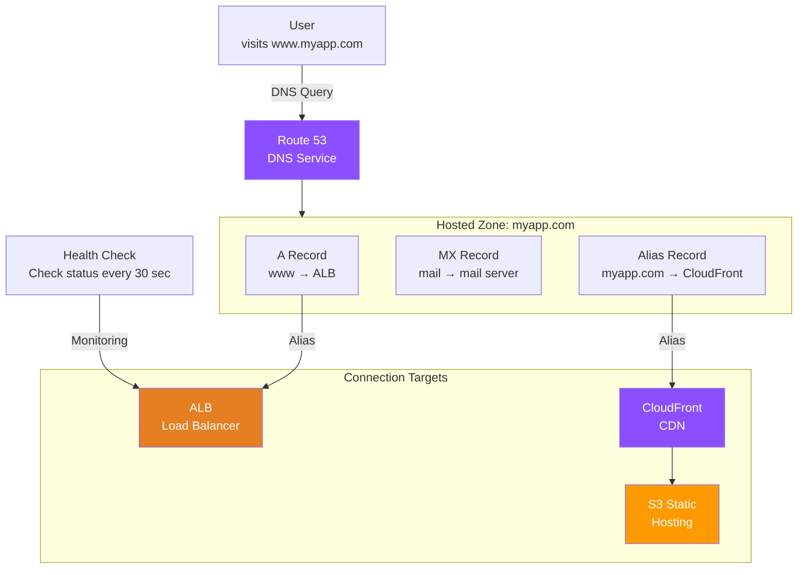
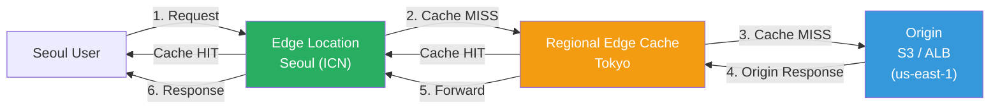
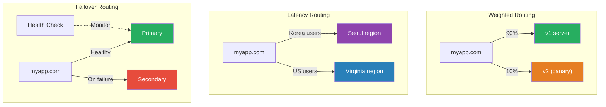

# Route 53 / CloudFront

> We've built servers ([EC2](./03-ec2-autoscaling)) and placed load balancers in front ([ALB](./07-load-balancing)) — now when users visit `www.myapp.com`, it's time to connect DNS and CDN so they respond from the nearest server quickly.

---

## 🎯 Why do you need to know this?

```
DevOps tasks with Route 53 + CloudFront:
• Connect domain                              → Route 53 Hosted Zone + A/Alias records
• Apply HTTPS certificate                    → ACM certificate + CloudFront/ALB integration
• Optimize global user response speed        → CloudFront CDN distribution
• Automatic failover on disaster             → Route 53 Health Check + Failover routing
• Blue/green and canary deployments          → Weighted routing policy
• Deploy static site globally                → S3 + CloudFront + OAC
• DDoS defense + geo-blocking                → CloudFront + WAF + Geo Restriction
```

We learned [DNS fundamentals](../02-networking/03-dns) with A records, CNAME, and nameservers before, right? Route 53 is AWS's managed DNS service. We learned about [CDN fundamentals](../02-networking/11-cdn) with edge servers and caching? CloudFront is AWS's CDN.

---

## 🧠 Core Concepts

### Analogy: Phone directory and convenience store chain

| Real World | AWS |
|-----------|-----|
| Phone directory (name → phone number) | Route 53 (domain → IP/resource) |
| Register number in directory | Add record to Hosted Zone |
| Main number + regional connections | Routing policies (Latency, Geo, etc.) |
| Verification call "is this number still active?" | Health Check |
| Headquarters distribution warehouse | Origin (S3, ALB, EC2) |
| Convenience stores nationwide | Edge Location (400+ locations) |
| Regional distribution hub | Regional Edge Cache |
| Keep popular items at stores | CDN caching (TTL) |
| "Recall expired products" | Cache invalidation |

### Route 53 Overall Architecture



### CloudFront Request Flow



> **Key Point**: First request goes to Origin (Cache MISS), but subsequent same content responds from Edge immediately (Cache HIT). Seoul user → US server directly takes 200ms, from Edge takes 10ms.

### Route 53 Routing Policy Comparison



---

## 🔍 Detailed Explanation

### 1. Route 53 Hosted Zone

Hosted Zone is a container for a domain's DNS records. Like having multiple phone numbers listed under a "company name" in a phone directory.

| Distinction | Public Hosted Zone | Private Hosted Zone |
|------------|-------------------|-------------------|
| Access Scope | Entire internet | Only within VPC |
| Use Case | External websites, APIs | Internal service discovery |
| Cost | $0.50/month | $0.50/month |

```bash
# Create Public Hosted Zone
aws route53 create-hosted-zone \
  --name myapp.com \
  --caller-reference "2026-03-13-initial"
# {
#     "HostedZone": {
#         "Id": "/hostedzone/Z0123456789ABCDEFGHIJ",
#         "Name": "myapp.com.",
#         "Config": { "PrivateZone": false },
#         "ResourceRecordSetCount": 2
#     },
#     "DelegationSet": {
#         "NameServers": [
#             "ns-1234.awsdns-01.org",
#             "ns-567.awsdns-02.co.uk",
#             "ns-890.awsdns-03.net",
#             "ns-12.awsdns-04.com"
#         ]
#     }
# }
# → Must change nameservers to these 4 at domain registrar (GoDaddy, Namecheap, etc.)!

# Create Private Hosted Zone (for within VPC)
aws route53 create-hosted-zone \
  --name internal.myapp.local \
  --caller-reference "2026-03-13-private" \
  --vpc VPCRegion=ap-northeast-2,VPCId=vpc-0abc123def456
```

### 2. Record Types and Alias vs CNAME

| Record Type | Role | Example |
|-----------|------|---------|
| **A** | Domain → IPv4 | `www.myapp.com → 54.230.1.100` |
| **AAAA** | Domain → IPv6 | `www.myapp.com → 2600:1f18::1` |
| **CNAME** | Domain → different domain | `app.myapp.com → myalb.elb.amazonaws.com` |
| **Alias** | Domain → AWS resource (free!) | `myapp.com → d1234567.cloudfront.net` |
| **MX** | Mail server | `myapp.com → 10 mail.myapp.com` |
| **TXT** | Text (authentication, etc.) | `"v=spf1 include:_spf.google.com ~all"` |

```
Alias vs CNAME -- Key Difference:

CNAME:
├── Standard DNS (usable at all DNS providers)
├── Can't use at Zone Apex (root domain)! (myapp.com ✘)
├── Route 53 query cost applies ($0.40/1M queries)
└── Can point to non-AWS resources

Alias (AWS-exclusive):
├── Can use at Zone Apex! (myapp.com ✔)
├── AWS resource queries free! ($0)
├── Targets: CloudFront, ALB/NLB, S3 Website, API Gateway, etc.
└── Health check integration possible
```

```bash
# Add Alias record (connect ALB -- OK at Zone Apex!)
aws route53 change-resource-record-sets \
  --hosted-zone-id Z0123456789ABCDEFGHIJ \
  --change-batch '{
    "Changes": [{
      "Action": "CREATE",
      "ResourceRecordSet": {
        "Name": "myapp.com",
        "Type": "A",
        "AliasTarget": {
          "HostedZoneId": "ZWKZPGTI48KDX",
          "DNSName": "myalb-123456.ap-northeast-2.elb.amazonaws.com",
          "EvaluateTargetHealth": true
        }
      }
    }]
  }'
# { "ChangeInfo": { "Id": "/change/C2JLKOP9HBTY4Z", "Status": "PENDING" } }

# Add MX record (Google Workspace mail)
aws route53 change-resource-record-sets \
  --hosted-zone-id Z0123456789ABCDEFGHIJ \
  --change-batch '{
    "Changes": [{
      "Action": "CREATE",
      "ResourceRecordSet": {
        "Name": "myapp.com",
        "Type": "MX",
        "TTL": 3600,
        "ResourceRecords": [
          { "Value": "1 aspmx.l.google.com" },
          { "Value": "5 alt1.aspmx.l.google.com" }
        ]
      }
    }]
  }'
```

### 3. Routing Policies

| Routing Policy | Use Case | Analogy |
|---|---|---|
| **Simple** | Single resource | Register only one phone number |
| **Weighted** | Canary deployment, A/B test | 9 of 10 calls to main, 1 to new branch |
| **Latency** | Global service, fastest region | Route to nearest branch |
| **Failover** | Disaster recovery (DR) | Auto-route to branch if main closes |
| **Geolocation** | Different response per country (compliance) | Korean customers only to Korean branch |
| **Geoproximity** | Geographic distance + bias adjustment | Widen certain branch's territory |
| **Multi-Value** | Simple load balancing + health check | Provide multiple numbers but exclude broken ones |

```bash
# Weighted routing -- Canary deployment (90:10)
aws route53 change-resource-record-sets \
  --hosted-zone-id Z0123456789ABCDEFGHIJ \
  --change-batch '{
    "Changes": [
      {
        "Action": "CREATE",
        "ResourceRecordSet": {
          "Name": "app.myapp.com", "Type": "A",
          "SetIdentifier": "v1-production", "Weight": 90,
          "AliasTarget": {
            "HostedZoneId": "ZWKZPGTI48KDX",
            "DNSName": "alb-v1.ap-northeast-2.elb.amazonaws.com",
            "EvaluateTargetHealth": true
          }
        }
      },
      {
        "Action": "CREATE",
        "ResourceRecordSet": {
          "Name": "app.myapp.com", "Type": "A",
          "SetIdentifier": "v2-canary", "Weight": 10,
          "AliasTarget": {
            "HostedZoneId": "ZWKZPGTI48KDX",
            "DNSName": "alb-v2.ap-northeast-2.elb.amazonaws.com",
            "EvaluateTargetHealth": true
          }
        }
      }
    ]
  }'
# → 90:10 canary deployment at DNS level! Gradually switch if no issues
```

### 4. Health Check

| Health Check Type | Target | Check Method |
|---|---|---|
| **Endpoint** | HTTP/HTTPS/TCP endpoint | Direct request, check status code |
| **Calculated** | Combination of other health checks | AND/OR condition combinations |
| **CloudWatch Alarm** | CloudWatch metric | Determine by alarm state |

```bash
# Create Health Check
HC_ID=$(aws route53 create-health-check \
  --caller-reference "hc-$(date +%s)" \
  --health-check-config '{
    "Type": "HTTPS",
    "FullyQualifiedDomainName": "api.myapp.com",
    "Port": 443,
    "ResourcePath": "/health",
    "RequestInterval": 30,
    "FailureThreshold": 3
  }' \
  --query 'HealthCheck.Id' --output text)
# → Global checkers verify /health every 30 sec, Unhealthy after 3 consecutive failures

# Check status
aws route53 get-health-check-status --health-check-id $HC_ID
# {
#     "HealthCheckObservations": [
#         { "Region": "us-east-1", "StatusReport": { "Status": "Success" } },
#         { "Region": "eu-west-1", "StatusReport": { "Status": "Success" } },
#         { "Region": "ap-southeast-1", "StatusReport": { "Status": "Success" } }
#     ]
# }
```

### 5. Domain Registration and DNSSEC

```bash
# Check domain availability
aws route53domains check-domain-availability \
  --domain-name my-new-startup-2026.com --region us-east-1
# { "Availability": "AVAILABLE" }

# Transfer domain (from other registrar → Route 53)
aws route53domains transfer-domain \
  --domain-name myapp.com --duration-in-years 1 \
  --admin-contact file://contact.json \
  --registrant-contact file://contact.json \
  --tech-contact file://contact.json \
  --auth-code "EPP_TRANSFER_CODE" --region us-east-1
# → Transfer completes in ~5-7 days

# Enable DNSSEC (prevent DNS response tampering)
aws route53 enable-hosted-zone-dnssec \
  --hosted-zone-id Z0123456789ABCDEFGHIJ
# → Sign DNS responses with KMS key, need to register DS record at parent domain
```

### 6. CloudFront Distribution

| Origin Type | Use Case | Connection Method |
|---|---|---|
| **S3 Bucket** | Static files (HTML, CSS, JS) | OAC (Origin Access Control) |
| **ALB** | Dynamic APIs, SSR | HTTPS + custom header |
| **Custom Origin** | On-prem, other clouds | HTTPS/HTTP |

```bash
# Create CloudFront Distribution (S3 Origin + custom domain)
aws cloudfront create-distribution \
  --distribution-config '{
    "CallerReference": "2026-03-13-myapp",
    "Comment": "myapp.com static site",
    "Enabled": true,
    "DefaultRootObject": "index.html",
    "Origins": {
      "Quantity": 1,
      "Items": [{
        "Id": "S3-myapp",
        "DomainName": "myapp-static.s3.ap-northeast-2.amazonaws.com",
        "S3OriginConfig": { "OriginAccessIdentity": "" },
        "OriginAccessControlId": "E2QWRUHAPOMQZL"
      }]
    },
    "DefaultCacheBehavior": {
      "TargetOriginId": "S3-myapp",
      "ViewerProtocolPolicy": "redirect-to-https",
      "CachePolicyId": "658327ea-f89d-4fab-a63d-7e88639e58f6",
      "AllowedMethods": { "Quantity": 2, "Items": ["GET", "HEAD"] },
      "Compress": true
    },
    "ViewerCertificate": {
      "ACMCertificateArn": "arn:aws:acm:us-east-1:123456789012:certificate/abc-123",
      "SSLSupportMethod": "sni-only",
      "MinimumProtocolVersion": "TLSv1.2_2021"
    },
    "Aliases": { "Quantity": 1, "Items": ["www.myapp.com"] }
  }'
# {
#     "Distribution": {
#         "Id": "E1A2B3C4D5E6F7",
#         "DomainName": "d1234567.cloudfront.net",
#         "Status": "InProgress"
#     }
# }
# → Distribution deployment completes in 5~15 minutes, Status becomes "Deployed"
```

> **Important**: [ACM certificate](../02-networking/05-tls-certificate) for CloudFront custom domain must be issued in **us-east-1**! CloudFront is a global service, so certificate must be in us-east-1.

### 7. Cache Policy, Cache Behavior, Cache Invalidation

```
Cache Behavior Configuration Example (separate Origin + cache by path):

Path Pattern          →  Origin        →  Cache Policy
─────────────────────────────────────────────────────
/api/*                →  ALB (dynamic) →  CachingDisabled (always fetch Origin)
/static/*             →  S3 (static)   →  CachingOptimized (24h)
/images/*             →  S3 (images)   →  custom (7 days)
/* (default)          →  S3 (HTML)     →  custom (1h)
```

```bash
# Cache invalidation (refresh immediately after deployment)
aws cloudfront create-invalidation \
  --distribution-id E1A2B3C4D5E6F7 \
  --paths '/index.html' '/css/main.css'
# {
#     "Invalidation": {
#         "Id": "I1A2B3C4D5",
#         "Status": "InProgress"
#     }
# }
# → Delete edge cache globally in 1~2 minutes (first 1,000/month free)

# Complete invalidation (caution on cost!)
aws cloudfront create-invalidation \
  --distribution-id E1A2B3C4D5E6F7 --paths '/*'
```

> **Tip**: Append version hash to static files (`main.abc123.js`) for auto-refresh without invalidation. This is the best approach in production.

### 8. CloudFront + S3 (OAC)

OAC ensures S3 is not publicly exposed, only accessible through CloudFront. We learned bucket policies in [S3 static hosting](./04-storage).

```bash
# Create OAC
aws cloudfront create-origin-access-control \
  --origin-access-control-config '{
    "Name": "myapp-s3-oac",
    "SigningProtocol": "sigv4",
    "SigningBehavior": "always",
    "OriginAccessControlOriginType": "s3"
  }'
# { "OriginAccessControl": { "Id": "E2QWRUHAPOMQZL" } }
```

```json
// S3 bucket policy -- only CloudFront can access
{
  "Version": "2012-10-17",
  "Statement": [{
    "Effect": "Allow",
    "Principal": { "Service": "cloudfront.amazonaws.com" },
    "Action": "s3:GetObject",
    "Resource": "arn:aws:s3:::myapp-static-2026/*",
    "Condition": {
      "StringEquals": {
        "AWS:SourceArn": "arn:aws:cloudfront::123456789012:distribution/E1A2B3C4D5E6F7"
      }
    }
  }]
}
```

```bash
# Verify -- only CloudFront access possible
curl -s https://d1234567.cloudfront.net/index.html   # → 200 OK
curl -s https://myapp-static-2026.s3.amazonaws.com/index.html  # → 403 Forbidden!
```

### 9. CloudFront + ALB

Placing dynamic APIs behind CloudFront gives DDoS protection + HTTPS termination + global acceleration. Block direct ALB access using custom headers.

```bash
# ALB listener rule -- block if no custom header
aws elbv2 create-rule \
  --listener-arn arn:aws:elasticloadbalancing:ap-northeast-2:123456789012:listener/app/myalb/abc/def \
  --priority 1 \
  --conditions '[{
    "Field": "http-header",
    "HttpHeaderConfig": {
      "HttpHeaderName": "X-CF-Secret",
      "Values": ["MyS3cretH3ader!"]
    }
  }]' \
  --actions '[{"Type": "forward", "TargetGroupArn": "arn:aws:elasticloadbalancing:..."}]'
# → Set same header in CloudFront Distribution Origin CustomHeaders
# → Direct ALB access bypassing CloudFront is blocked!
```

### 10. CloudFront Functions vs Lambda@Edge

| Item | CloudFront Functions | Lambda@Edge |
|---|---|---|
| Execution Location | Edge Location (400+) | Regional Edge Cache (13) |
| Runtime | JavaScript (ES 5.1) | Node.js, Python |
| Execution Time | < 1ms | < 5sec (Viewer) / 30sec (Origin) |
| Network Access | Not available | Available |
| Cost | $0.10/1M requests | $0.60/1M requests + execution time |
| Use Case | URL rewrite, header manipulation | Authentication, image resize, SSR |

```javascript
// CloudFront Function example: SPA URL rewrite
function handler(event) {
    var request = event.request;
    var uri = request.uri;
    // If no file extension, rewrite to index.html (SPA routing)
    if (!uri.includes('.')) {
        request.uri = '/index.html';
    }
    return request;
}
```

```bash
# Create + publish CloudFront Function
aws cloudfront create-function \
  --name spa-url-rewrite \
  --function-config '{"Comment":"SPA rewrite","Runtime":"cloudfront-js-2.0"}' \
  --function-code fileb://spa-rewrite.js
# → After publishing, associate to Cache Behavior's "Viewer Request"
```

### 11. Security: WAF, Geo Restriction, Signed URL/Cookie

```bash
# WAF integration -- block SQL injection, XSS at Edge
aws wafv2 associate-web-acl \
  --web-acl-arn arn:aws:wafv2:us-east-1:123456789012:global/webacl/myapp-waf/abc123 \
  --resource-arn arn:aws:cloudfront::123456789012:distribution/E1A2B3C4D5E6F7

# Geo Restriction -- allow only Korea, Japan, US
# In Distribution config, Restrictions section:
#   "GeoRestriction": {
#     "RestrictionType": "whitelist",
#     "Quantity": 3,
#     "Items": ["KR", "JP", "US"]
#   }

# Create Signed URL (access control for premium content)
aws cloudfront sign \
  --url "https://d1234567.cloudfront.net/premium/video.mp4" \
  --key-pair-id K1A2B3C4D5E6F7 \
  --private-key file://private_key.pem \
  --date-less-than "2026-03-14T00:00:00Z"
# → Generate signed URL with expiration (only this URL can access)
```

```
Signed URL vs Signed Cookie:

Signed URL  → Access control for single URL (download individual file)
Signed Cookie → Access control for multiple URLs (subscribe to all content)

Field-Level Encryption:
  User → Edge encrypts sensitive fields with public key → Origin decrypts with private key only
  (Hide sensitive data like credit card numbers from ALB/proxy level)
```

---

## 💻 Hands-on Examples

### Lab 1: Route 53 + ALB Failover Configuration

> Connect domain to ALB and configure Health Check-based failover.

```bash
# 1. Create Hosted Zone
ZONE_ID=$(aws route53 create-hosted-zone \
  --name myapp.com --caller-reference "lab1-$(date +%s)" \
  --query 'HostedZone.Id' --output text)

# 2. Create Health Check (monitor Primary ALB)
HC_ID=$(aws route53 create-health-check \
  --caller-reference "hc-$(date +%s)" \
  --health-check-config '{
    "Type": "HTTPS",
    "FullyQualifiedDomainName": "alb-seoul.ap-northeast-2.elb.amazonaws.com",
    "Port": 443, "ResourcePath": "/health",
    "RequestInterval": 10, "FailureThreshold": 2
  }' --query 'HealthCheck.Id' --output text)

# 3. Primary record (Seoul + Health Check)
aws route53 change-resource-record-sets --hosted-zone-id $ZONE_ID \
  --change-batch "{
    \"Changes\": [{
      \"Action\": \"CREATE\",
      \"ResourceRecordSet\": {
        \"Name\": \"myapp.com\", \"Type\": \"A\",
        \"SetIdentifier\": \"primary\", \"Failover\": \"PRIMARY\",
        \"HealthCheckId\": \"$HC_ID\",
        \"AliasTarget\": {
          \"HostedZoneId\": \"ZWKZPGTI48KDX\",
          \"DNSName\": \"alb-seoul.ap-northeast-2.elb.amazonaws.com\",
          \"EvaluateTargetHealth\": true
        }
      }
    }]
  }"

# 4. Secondary record (Tokyo -- DR)
aws route53 change-resource-record-sets --hosted-zone-id $ZONE_ID \
  --change-batch '{
    "Changes": [{
      "Action": "CREATE",
      "ResourceRecordSet": {
        "Name": "myapp.com", "Type": "A",
        "SetIdentifier": "secondary", "Failover": "SECONDARY",
        "AliasTarget": {
          "HostedZoneId": "Z14GRHDCWA56QT",
          "DNSName": "alb-tokyo.ap-northeast-1.elb.amazonaws.com",
          "EvaluateTargetHealth": true
        }
      }
    }]
  }'

# 5. Verify
dig myapp.com +short
# 54.230.1.100  ← Seoul ALB (healthy)
# On Seoul failure → Auto failover after 30~60 seconds
# 13.115.2.200  ← Tokyo ALB (failover!)
```

### Lab 2: CloudFront + S3 Static Site (OAC + Custom Domain)

> Upload static site to S3 and deploy via CloudFront + OAC + custom domain.

```bash
# 1. Create S3 bucket + block public access
aws s3 mb s3://myapp-static-lab-2026
aws s3api put-public-access-block --bucket myapp-static-lab-2026 \
  --public-access-block-configuration \
    BlockPublicAcls=true,IgnorePublicAcls=true,BlockPublicPolicy=true,RestrictPublicBuckets=true

# 2. Upload files
aws s3 sync ./dist/ s3://myapp-static-lab-2026/

# 3. Create OAC
OAC_ID=$(aws cloudfront create-origin-access-control \
  --origin-access-control-config '{
    "Name": "lab-oac", "SigningProtocol": "sigv4",
    "SigningBehavior": "always", "OriginAccessControlOriginType": "s3"
  }' --query 'OriginAccessControl.Id' --output text)

# 4. ACM certificate (must be us-east-1!)
CERT_ARN=$(aws acm request-certificate --region us-east-1 \
  --domain-name "www.myapp.com" --subject-alternative-names "myapp.com" \
  --validation-method DNS --query 'CertificateArn' --output text)
# → Add DNS validation record to Route 53, wait for issuance

# 5. Create CloudFront Distribution
DIST_ID=$(aws cloudfront create-distribution \
  --distribution-config "{
    \"CallerReference\": \"lab-$(date +%s)\",
    \"Enabled\": true, \"DefaultRootObject\": \"index.html\",
    \"Origins\": { \"Quantity\": 1, \"Items\": [{
      \"Id\": \"S3\", \"DomainName\": \"myapp-static-lab-2026.s3.ap-northeast-2.amazonaws.com\",
      \"S3OriginConfig\": { \"OriginAccessIdentity\": \"\" },
      \"OriginAccessControlId\": \"$OAC_ID\"
    }]},
    \"DefaultCacheBehavior\": {
      \"TargetOriginId\": \"S3\", \"ViewerProtocolPolicy\": \"redirect-to-https\",
      \"CachePolicyId\": \"658327ea-f89d-4fab-a63d-7e88639e58f6\",
      \"AllowedMethods\": { \"Quantity\": 2, \"Items\": [\"GET\",\"HEAD\"] },
      \"Compress\": true
    },
    \"ViewerCertificate\": {
      \"ACMCertificateArn\": \"$CERT_ARN\",
      \"SSLSupportMethod\": \"sni-only\", \"MinimumProtocolVersion\": \"TLSv1.2_2021\"
    },
    \"Aliases\": { \"Quantity\": 1, \"Items\": [\"www.myapp.com\"] }
  }" --query 'Distribution.Id' --output text)

# 6. Apply S3 bucket policy (CloudFront only) + Route 53 Alias record
# → See section 8 for OAC bucket policy JSON
# → Add www.myapp.com → CloudFront Alias to Route 53 (HostedZoneId: Z2FDTNDATAQYW2)

# 7. Verify
curl -sI https://www.myapp.com/ | grep x-cache
# x-cache: Hit from cloudfront
```

### Lab 3: Multi-Origin (S3 Static + ALB API) Path-Based Routing

> Create configuration where static files go to S3 and API to ALB via single domain.

```bash
# dist-config.json -- core structure
cat > /tmp/dist-config.json << 'EOF'
{
  "CallerReference": "multi-origin-lab",
  "Enabled": true, "DefaultRootObject": "index.html",
  "Origins": { "Quantity": 2, "Items": [
    {
      "Id": "S3-Static",
      "DomainName": "myapp-static.s3.ap-northeast-2.amazonaws.com",
      "S3OriginConfig": { "OriginAccessIdentity": "" },
      "OriginAccessControlId": "E2QWRUHAPOMQZL"
    },
    {
      "Id": "ALB-API",
      "DomainName": "myalb.ap-northeast-2.elb.amazonaws.com",
      "CustomOriginConfig": {
        "HTTPSPort": 443, "OriginProtocolPolicy": "https-only",
        "OriginSslProtocols": { "Quantity": 1, "Items": ["TLSv1.2"] }
      },
      "CustomHeaders": { "Quantity": 1,
        "Items": [{ "HeaderName": "X-CF-Secret", "HeaderValue": "s3cret!" }]
      }
    }
  ]},
  "DefaultCacheBehavior": {
    "TargetOriginId": "S3-Static",
    "ViewerProtocolPolicy": "redirect-to-https",
    "CachePolicyId": "658327ea-f89d-4fab-a63d-7e88639e58f6",
    "AllowedMethods": { "Quantity": 2, "Items": ["GET","HEAD"] },
    "Compress": true
  },
  "CacheBehaviors": { "Quantity": 1, "Items": [{
    "PathPattern": "/api/*",
    "TargetOriginId": "ALB-API",
    "ViewerProtocolPolicy": "https-only",
    "CachePolicyId": "4135ea2d-6df8-44a3-9df3-4b5a84be39ad",
    "AllowedMethods": { "Quantity": 7,
      "Items": ["GET","HEAD","OPTIONS","PUT","PATCH","POST","DELETE"] },
    "Compress": true
  }]}
}
EOF

aws cloudfront create-distribution --distribution-config file:///tmp/dist-config.json
# { "Distribution": { "Id": "E7X8Y9Z0A1B2C3", "DomainName": "d9876543.cloudfront.net" } }

# Verify
curl -s https://myapp.com/index.html     # → S3 static HTML
curl -s https://myapp.com/api/users       # → ALB → EC2/ECS dynamic JSON
curl -sI https://myapp.com/images/logo.png | grep x-cache
# x-cache: Hit from cloudfront  ← Edge cache HIT
```

---

## 🏢 In the Real World

### Scenario 1: Global SaaS Service

```
Route 53 (Latency Routing):
  Korea users → ap-northeast-2 ALB
  US users → us-east-1 ALB
  Europe users → eu-west-1 ALB

CloudFront:
  Static assets → S3 Origin, global Edge caching
  API → each region ALB, caching disabled

Health Check → auto-exclude failed regions (30~60 sec)
Effect: Seoul 10ms, New York 15ms (direct Origin access 200ms)
```

### Scenario 2: Canary Deployment + Instant Rollback

```
Route 53 Weighted Routing for gradual switch:

Stage 1: v1(95%) / v2(5%)  → Monitor error rate/latency
Stage 2: v1(50%) / v2(50%) → Expand if no issues
Stage 3: v1(0%)  / v2(100%) → Switchover complete
Rollback: Just change Weight → DNS TTL(60 sec) then instant rollback
```

### Scenario 3: React SPA + API Security Enhancement

```
CloudFront Distribution:
├── Origin 1: S3 (React build)
│   ├── OAC → Block direct S3 access
│   ├── CF Function → SPA URL rewrite
│   └── Cache 24h (file hash in name)
├── Origin 2: ALB (API)
│   ├── Custom header → Block direct access
│   └── Caching disabled
└── Security: WAF + Geo Restriction + ACM(TLS 1.2+) + Signed Cookie
```

---

## ⚠️ Common Mistakes

### Mistake 1: Issue ACM certificate for CloudFront in Seoul region

```
❌ Issue certificate in ap-northeast-2 → "Certificate not found" error when connecting to CloudFront
✅ CloudFront certificates must be issued in us-east-1!
   ALB certificates issued in ALB's region
```

### Mistake 2: Use CNAME instead of Alias at Zone Apex

```
❌ myapp.com CNAME d1234567.cloudfront.net
   → Violates DNS standard! CNAME not allowed at Zone Apex, breaks MX/NS records
✅ myapp.com A (Alias) d1234567.cloudfront.net
   → Alias allowed at Zone Apex + free queries!
```

### Mistake 3: Site doesn't update after deployment due to CloudFront caching

```
❌ Update index.html on S3 → Site doesn't change (Edge cache TTL remaining)
✅ 3 solutions:
   1. Invalidate cache: aws cloudfront create-invalidation --paths '/index.html'
   2. File hash in name: main.abc123.js (build tool auto-generates) ← Production recommended!
   3. Cache-Control: Short TTL for HTML, long TTL for hashed files
```

### Mistake 4: Expose S3 publicly without CloudFront

```
❌ S3 public access allowed + direct bucket website endpoint
   → No HTTPS, no WAF, no security headers
✅ S3 completely private + CloudFront + OAC
   → HTTPS automatic, WAF available, only CloudFront accesses S3
```

### Mistake 5: Failover routing without Health Check

```
❌ Configure Failover but don't create Health Check
   → Primary failure not detected → Users continue to dead server
✅ Create Health Check (RequestInterval: 10sec, FailureThreshold: 2)
   + attach to Primary + EvaluateTargetHealth: true
   → Detect failure in 20 sec → auto failover!
```

---

## 📝 Summary

```
Route 53 (DNS Service):
├── Hosted Zone: DNS record container for domain (Public / Private)
├── Records: A, AAAA, CNAME, Alias(Zone Apex OK, free!), MX, TXT
├── Routing: Simple / Weighted / Latency / Failover / Geolocation / Multi-Value
├── Health Check: Endpoint / Calculated / CloudWatch → auto failover
├── DNSSEC: Prevent DNS tampering, domain registration/transfer available
└── Key: Alias better than CNAME (Zone Apex + free + fast)

CloudFront (CDN):
├── Distribution: Origin + Cache Behavior + security settings
├── Origin: S3(OAC) / ALB(custom header) / Custom
├── Edge Location(400+) + Regional Edge Cache → respond near users
├── Cache: Policy defines TTL/cache key, Behavior separates by path
├── Invalidation: instant refresh (file hash better!)
├── Edge code: CF Functions(lightweight) vs Lambda@Edge(heavy)
└── Security: WAF, Geo Restriction, Signed URL/Cookie, Field-Level Encryption

Key Combinations:
• Static site: S3 + CloudFront(OAC) + Route 53(Alias) + ACM(us-east-1)
• Dynamic API: ALB + CloudFront(caching OFF) + Route 53 + WAF
• Global: Route 53(Latency) + multi-region ALB + Health Check
• DR: Route 53(Failover) + Health Check + multi-region
```

---

## 🔗 Next Lecture → [09-container-services](./09-container-services)

> We've learned how to receive traffic with domain (Route 53) and CDN (CloudFront). Next, we'll learn AWS container services (ECS, Fargate, ECR) that actually run applications behind them.

**Related Lectures:**
- [DNS Fundamentals](../02-networking/03-dns) -- A, CNAME, nameservers and DNS principles
- [CDN Fundamentals](../02-networking/11-cdn) -- Edge caching, CDN operation
- [TLS/Certificates](../02-networking/05-tls-certificate) -- ACM certificate issuance and HTTPS
- [S3 Static Hosting](./04-storage) -- S3 bucket policies, static web hosting
- [ALB + Route 53](./07-load-balancing) -- ALB listeners, target groups, domain connection
