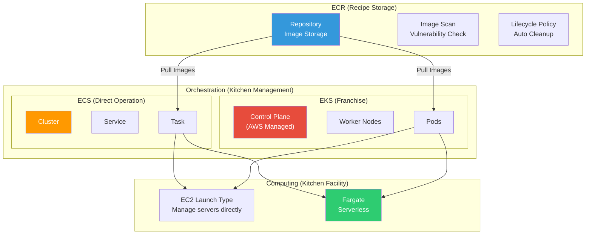
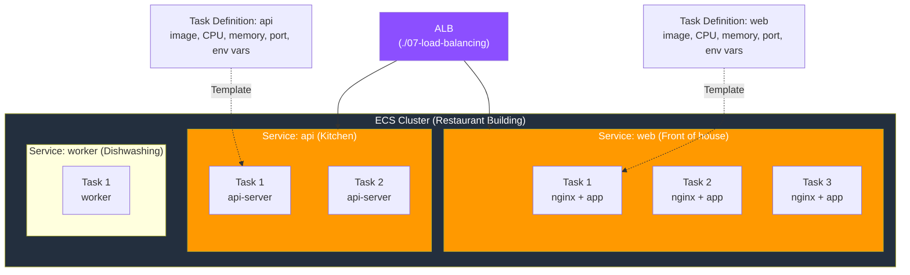
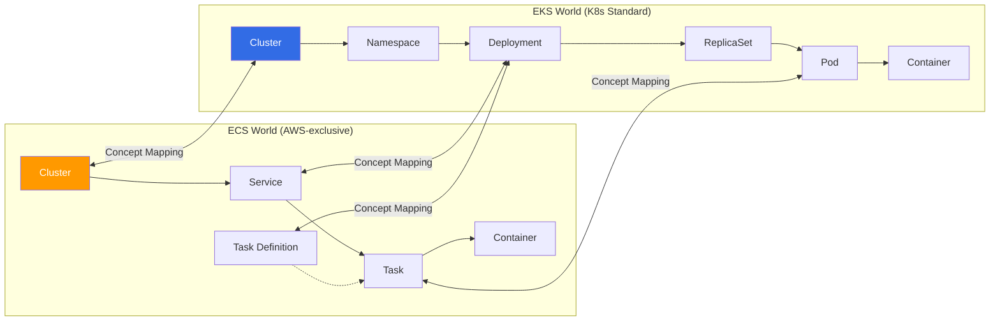
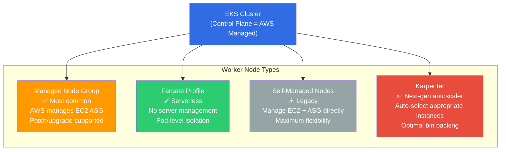

# ECR / ECS / EKS / Fargate

> In the [previous lecture](./07-load-balancing), we learned how to distribute traffic with ALB/NLB. Now let's learn the **container services** that receive that traffic -- ECR, ECS, EKS, Fargate. We learned containers in [container fundamentals](../03-containers/01-concept) and [Docker basics](../03-containers/02-docker-basics), now we'll learn how to **operate containers at scale** on AWS.

---

## 🎯 Why do you need to know this?

```
Moments when container services are needed:
• "I built a Docker image, where do I upload it?"                    → ECR (private registry)
• "I want to automatically launch and manage 10 containers"         → ECS / EKS (orchestration)
• "I want to run containers without managing servers"               → Fargate (serverless containers)
• "I want to use K8s but managing Control Plane is too hard"        → EKS (managed K8s)
• "I need to operate 100 microservices"                             → ECS/EKS + ALB + Service Discovery
• "I want to scan for vulnerabilities every time I build an image"  → ECR image scan
• Interview: "Should we use ECS or EKS?"                           → Depends on team size, complexity, existing investment
```

---

## 🧠 Core Concepts (Analogy + Diagrams)

### Analogy: Restaurant operating methods

Let's compare container services to **operating restaurants**.

* **ECR (Registry)** = **Recipe storage**. All cooking recipes (images) are kept centrally. Any location can retrieve and use these recipes
* **ECS (Orchestration)** = **Direct restaurant operation**. AWS's own kitchen management system that dispatches chefs (containers) when orders (requests) arrive
* **EKS (Managed K8s)** = **Franchise headquarters system**. Industry-standard (Kubernetes) management system installed by AWS. More complex but portable across multiple clouds
* **Fargate (Serverless)** = **Cloud kitchen from delivery app**. You only cook (run containers) without kitchen facilities (servers). The platform (AWS) handles kitchen management
* **App Runner** = **Meal kit delivery**. Send ingredients (code/image) and it handles everything from cooking to delivery

### AWS Container Services Complete Map



### ECS Core Structure: Cluster - Service - Task



### ECS vs EKS Comparison Structure



---

## 🔍 Detailed Explanation

### 1. ECR (Elastic Container Registry)

We learned basic ECR push/pull in [registry fundamentals](../03-containers/07-registry). Here we cover **operational aspects** and advanced features.

#### Create Repository and Push Image

```bash
# === Create private ECR repository ===
aws ecr create-repository \
  --repository-name my-team/api-server \
  --image-scanning-configuration scanOnPush=true \
  --image-tag-mutability IMMUTABLE \
  --encryption-configuration encryptionType=KMS \
  --region ap-northeast-2

# Expected output:
# {
#     "repository": {
#         "repositoryArn": "arn:aws:ecr:ap-northeast-2:123456789012:repository/my-team/api-server",
#         "repositoryUri": "123456789012.dkr.ecr.ap-northeast-2.amazonaws.com/my-team/api-server",
#         "imageTagMutability": "IMMUTABLE",
#         "imageScanningConfiguration": { "scanOnPush": true },
#         "encryptionConfiguration": { "encryptionType": "KMS" }
#     }
# }
```

```bash
# === ECR login (token valid 12 hours) ===
aws ecr get-login-password --region ap-northeast-2 | \
  docker login --username AWS --password-stdin \
  123456789012.dkr.ecr.ap-northeast-2.amazonaws.com

# Login Succeeded
```

```bash
# === Tag image and push ===
docker tag my-api:v1.2.0 \
  123456789012.dkr.ecr.ap-northeast-2.amazonaws.com/my-team/api-server:v1.2.0

docker push \
  123456789012.dkr.ecr.ap-northeast-2.amazonaws.com/my-team/api-server:v1.2.0

# Expected output:
# The push refers to repository [123456789012.dkr.ecr.ap-northeast-2.amazonaws.com/my-team/api-server]
# v1.2.0: digest: sha256:abc123... size: 2200
```

> **IMMUTABLE tag**: When you set `imageTagMutability` to `IMMUTABLE`, you can't overwrite with same tag. Prevents accidents where `:latest` suddenly changes in production.

#### Lifecycle Policy

Old images accumulate storage costs. Auto-cleanup with lifecycle policy.

```bash
# === Set lifecycle policy: keep only 10 recent images ===
aws ecr put-lifecycle-policy \
  --repository-name my-team/api-server \
  --lifecycle-policy-text '{
    "rules": [
      {
        "rulePriority": 1,
        "description": "delete untagged images after 7 days",
        "selection": {
          "tagStatus": "untagged",
          "countType": "sinceImagePushed",
          "countUnit": "days",
          "countNumber": 7
        },
        "action": { "type": "expire" }
      },
      {
        "rulePriority": 2,
        "description": "keep only 20 recent tagged images",
        "selection": {
          "tagStatus": "tagged",
          "tagPrefixList": ["v"],
          "countType": "imageCountMoreThan",
          "countNumber": 20
        },
        "action": { "type": "expire" }
      }
    ]
  }'

# Expected output:
# {
#     "registryId": "123456789012",
#     "repositoryName": "my-team/api-server",
#     "lifecyclePolicyText": "..."
# }
```

#### Check Image Scan Results

```bash
# === Get latest scan results ===
aws ecr describe-image-scan-findings \
  --repository-name my-team/api-server \
  --image-id imageTag=v1.2.0 \
  --query "imageScanFindings.findingSeverityCounts"

# Expected output:
# {
#     "CRITICAL": 0,
#     "HIGH": 2,
#     "MEDIUM": 5,
#     "LOW": 12,
#     "INFORMATIONAL": 8
# }
```

> **Enhanced Scanning**: Basic scanning only checks OS package vulnerabilities. Enhanced Scanning (Inspector integration) also checks **application libraries** (npm, pip, etc.) and enables **continuous scanning**.

#### Cross-Region Replication and Pull Through Cache

```bash
# === Set cross-region replication (DR preparation) ===
aws ecr put-replication-configuration \
  --replication-configuration '{
    "rules": [
      {
        "destinations": [
          {
            "region": "us-west-2",
            "registryId": "123456789012"
          }
        ],
        "repositoryFilters": [
          {
            "filter": "my-team/",
            "filterType": "PREFIX_MATCH"
          }
        ]
      }
    ]
  }'
# → All images with my-team/ prefix auto-replicate to us-west-2
```

```bash
# === Pull Through Cache (cache public images) ===
# Cache images from Docker Hub, ECR Public, GitHub GHCR, etc. in ECR
aws ecr create-pull-through-cache-rule \
  --ecr-repository-prefix docker-hub \
  --upstream-registry-url registry-1.docker.io \
  --region ap-northeast-2

# Now pulling automatically caches in ECR:
# docker pull 123456789012.dkr.ecr.ap-northeast-2.amazonaws.com/docker-hub/library/nginx:latest
```

> **Why Pull Through Cache**: Docker Hub applies [Rate Limit](https://docs.docker.com/docker-hub/download-rate-limit/) to anonymous users. CI/CD builds can hit this limit pulling from Docker Hub repeatedly. ECR caching solves this and speeds up pulls.

---

### 2. ECS (Elastic Container Service)

ECS is AWS's own **container orchestration service**. Simpler than K8s but deeply integrated with AWS services.

#### 4 Core ECS Concepts

| ECS Concept | K8s Concept | Analogy (Restaurant) | Explanation |
|---|---|---|---|
| **Cluster** | Cluster | Restaurant building | Logical grouping. Resource boundary |
| **Task Definition** | Pod Spec (in Deployment) | Recipe + cooking method | Template of container settings (image, CPU, memory, port, volume) |
| **Task** | Pod | One plate of food | Running **instance** of Task Definition |
| **Service** | Deployment + Service | Kitchen line | Maintain desired number of Tasks. Rolling update, ALB integration |

#### Write Task Definition

```bash
# === Register Task Definition (JSON file) ===
cat << 'EOF' > task-definition.json
{
  "family": "api-server",
  "networkMode": "awsvpc",
  "requiresCompatibilities": ["FARGATE"],
  "cpu": "512",
  "memory": "1024",
  "executionRoleArn": "arn:aws:iam::123456789012:role/ecsTaskExecutionRole",
  "taskRoleArn": "arn:aws:iam::123456789012:role/ecsTaskRole",
  "containerDefinitions": [
    {
      "name": "api",
      "image": "123456789012.dkr.ecr.ap-northeast-2.amazonaws.com/my-team/api-server:v1.2.0",
      "portMappings": [
        {
          "containerPort": 8080,
          "protocol": "tcp"
        }
      ],
      "environment": [
        { "name": "NODE_ENV", "value": "production" }
      ],
      "secrets": [
        {
          "name": "DB_PASSWORD",
          "valueFrom": "arn:aws:secretsmanager:ap-northeast-2:123456789012:secret:prod/db-password"
        }
      ],
      "logConfiguration": {
        "logDriver": "awslogs",
        "options": {
          "awslogs-group": "/ecs/api-server",
          "awslogs-region": "ap-northeast-2",
          "awslogs-stream-prefix": "ecs"
        }
      },
      "healthCheck": {
        "command": ["CMD-SHELL", "curl -f http://localhost:8080/health || exit 1"],
        "interval": 30,
        "timeout": 5,
        "retries": 3,
        "startPeriod": 60
      }
    }
  ]
}
EOF

aws ecs register-task-definition \
  --cli-input-json file://task-definition.json

# Expected output:
# {
#     "taskDefinition": {
#         "taskDefinitionArn": "arn:aws:ecs:ap-northeast-2:123456789012:task-definition/api-server:1",
#         "family": "api-server",
#         "revision": 1,
#         "status": "ACTIVE"
#     }
# }
```

> **executionRoleArn vs taskRoleArn**: These two IAM roles are confusing.
> * `executionRoleArn` = Role used by ECS **agent** (pull image from ECR, send logs to CloudWatch)
> * `taskRoleArn` = Role used by **application code** (access S3, DynamoDB, etc.)
> Apply [least privilege principle](./01-iam) from IAM lecture.

#### Create ECS Cluster and Deploy Service

```bash
# === Create ECS Cluster ===
aws ecs create-cluster \
  --cluster-name production \
  --capacity-providers FARGATE FARGATE_SPOT \
  --default-capacity-provider-strategy \
    capacityProvider=FARGATE,weight=1,base=2 \
    capacityProvider=FARGATE_SPOT,weight=3

# Expected output:
# {
#     "cluster": {
#         "clusterArn": "arn:aws:ecs:ap-northeast-2:123456789012:cluster/production",
#         "clusterName": "production",
#         "status": "ACTIVE",
#         "capacityProviders": ["FARGATE", "FARGATE_SPOT"]
#     }
# }
```

```bash
# === Create ECS Service (Fargate + ALB integration) ===
aws ecs create-service \
  --cluster production \
  --service-name api-service \
  --task-definition api-server:1 \
  --desired-count 3 \
  --launch-type FARGATE \
  --network-configuration '{
    "awsvpcConfiguration": {
      "subnets": ["subnet-private-a", "subnet-private-b"],
      "securityGroups": ["sg-ecs-tasks"],
      "assignPublicIp": "DISABLED"
    }
  }' \
  --load-balancers '[
    {
      "targetGroupArn": "arn:aws:elasticloadbalancing:ap-northeast-2:123456789012:targetgroup/api-tg/abc123",
      "containerName": "api",
      "containerPort": 8080
    }
  ]' \
  --deployment-configuration '{
    "maximumPercent": 200,
    "minimumHealthyPercent": 100
  }'

# Expected output:
# {
#     "service": {
#         "serviceName": "api-service",
#         "desiredCount": 3,
#         "runningCount": 0,
#         "status": "ACTIVE",
#         "launchType": "FARGATE",
#         "deployments": [
#             {
#                 "status": "PRIMARY",
#                 "desiredCount": 3,
#                 "runningCount": 0,
#                 "rolloutState": "IN_PROGRESS"
#             }
#         ]
#     }
# }
```

> **awsvpc network mode**: Fargate requires `awsvpc` mode. Each Task gets **its own ENI (network interface)**. Good security practice to place in [Private Subnet](./02-vpc) and only receive external traffic via ALB.

#### Launch Type Comparison: EC2 vs Fargate

| Item | EC2 Launch Type | Fargate Launch Type |
|---|---|---|
| **Server management** | Manage EC2 instances directly | AWS managed (serverless) |
| **Patching/AMI** | Patch OS manually, update AMI | AWS handles automatically |
| **Pricing model** | EC2 instance cost (always on) | Pay per Task execution time (per second) |
| **GPU support** | Supported | Not supported |
| **Docker access** | docker exec possible | Not possible (use ECS Exec) |
| **Large-scale operation** | Bin packing efficient | Independent isolation per Task |
| **Best for** | Cost optimization, GPU, special requirements | Fast startup, minimal management |

#### ECS Exec (Container Access)

Fargate doesn't support `docker exec`. Instead, use **ECS Exec** to access running Tasks.

```bash
# === Enable ECS Exec (Service update) ===
aws ecs update-service \
  --cluster production \
  --service api-service \
  --enable-execute-command

# === Shell into running Task ===
aws ecs execute-command \
  --cluster production \
  --task arn:aws:ecs:ap-northeast-2:123456789012:task/production/abc123def456 \
  --container api \
  --interactive \
  --command "/bin/sh"

# The Session Manager plugin was installed successfully...
# Starting session with SessionId: ecs-execute-command-abc123
# / # whoami
# root
# / # curl localhost:8080/health
# {"status":"healthy","uptime":"2h30m"}
```

> **Caution**: ECS Exec requires SSM permissions in Task Role and `initProcessEnabled: true` in Task Definition.

#### Service Connect (Service-to-Service Communication)

For microservice communication. Provides service discovery and load balancing within ECS without separate Service Mesh.

```bash
# === Create Service Connect namespace ===
aws servicediscovery create-http-namespace \
  --name production.local

# === Create Service with Service Connect ===
aws ecs create-service \
  --cluster production \
  --service-name payment-service \
  --task-definition payment:1 \
  --desired-count 2 \
  --launch-type FARGATE \
  --service-connect-configuration '{
    "enabled": true,
    "namespace": "production.local",
    "services": [
      {
        "portName": "http",
        "discoveryName": "payment",
        "clientAliases": [
          {
            "port": 8080,
            "dnsName": "payment.production.local"
          }
        ]
      }
    ]
  }' \
  --network-configuration '{
    "awsvpcConfiguration": {
      "subnets": ["subnet-private-a", "subnet-private-b"],
      "securityGroups": ["sg-ecs-tasks"]
    }
  }'

# → Other ECS services can access via http://payment.production.local:8080!
```

---

### 3. Fargate (Serverless Containers)

Fargate runs containers **without managing any EC2 instances**. Can be used with both ECS and EKS.

#### Fargate Cost Calculation

```
Fargate cost = vCPU hourly cost + memory GB hourly cost

Example (Seoul region, March 2026):
• Run 0.25 vCPU + 0.5GB memory Task for 24 hours
  = (0.25 × $0.04048/h × 24h) + (0.5 × $0.004445/GB/h × 24h)
  = $0.243 + $0.053
  = ~$0.30/day (≈ ~400 KRW/day)

• Run same specs on EC2 t3.micro for 24 hours
  = $0.0104/h × 24h = $0.25/day

→ EC2 slightly cheaper, but Fargate better when considering server patch/management labor
```

#### Fargate vs Fargate Spot

| Item | Fargate | Fargate Spot |
|---|---|---|
| **Availability** | Always available | Depends on AWS spare capacity (can be interrupted) |
| **Discount** | Base pricing | Up to 70% discount |
| **Interruption** | None | 2-minute warning before termination |
| **Good for** | Production web services | Batch jobs, dev/test, CI/CD |

```bash
# === Set Fargate Spot strategy (base 2 Fargate, rest Spot) ===
aws ecs create-service \
  --cluster production \
  --service-name batch-worker \
  --task-definition batch-worker:1 \
  --desired-count 10 \
  --capacity-provider-strategy '[
    {
      "capacityProvider": "FARGATE",
      "weight": 1,
      "base": 2
    },
    {
      "capacityProvider": "FARGATE_SPOT",
      "weight": 4
    }
  ]' \
  --network-configuration '{
    "awsvpcConfiguration": {
      "subnets": ["subnet-private-a", "subnet-private-b"],
      "securityGroups": ["sg-batch"]
    }
  }'

# → base=2: always 2 on Fargate (stability)
# → weight 1:4 ratio: ~6-7 of remaining 8 on Fargate Spot (cost savings)
```

---

### 4. EKS (Elastic Kubernetes Service)

EKS is AWS's **managed Kubernetes**. AWS manages the Control Plane (API Server, etcd, Scheduler, Controller Manager) that we learned about in [K8s architecture](../04-kubernetes/01-architecture). You focus only on Worker Nodes and workloads.

#### Create EKS Cluster (eksctl)

```bash
# === Create EKS cluster with eksctl ===
eksctl create cluster \
  --name production \
  --version 1.29 \
  --region ap-northeast-2 \
  --nodegroup-name workers \
  --node-type m5.large \
  --nodes 3 \
  --nodes-min 2 \
  --nodes-max 10 \
  --managed \
  --with-oidc

# Expected output (10~15 minutes):
# [i]  eksctl version 0.170.0
# [i]  using region ap-northeast-2
# [i]  setting availability zones to [ap-northeast-2a ap-northeast-2c]
# [i]  subnets for ap-northeast-2a - public:10.0.0.0/19 private:10.0.64.0/19
# [i]  subnets for ap-northeast-2c - public:10.0.32.0/19 private:10.0.96.0/19
# [i]  nodegroup "workers" will use "" [AmazonLinux2/1.29]
# [i]  using Kubernetes version 1.29
# [✓]  EKS cluster "production" in "ap-northeast-2" region is ready
# [i]  kubectl command should work, try 'kubectl get nodes'
```

```bash
# === Verify cluster access ===
kubectl get nodes

# Expected output:
# NAME                                                STATUS   ROLES    AGE   VERSION
# ip-10-0-65-123.ap-northeast-2.compute.internal      Ready    <none>   5m    v1.29.0-eks-abc123
# ip-10-0-97-45.ap-northeast-2.compute.internal       Ready    <none>   5m    v1.29.0-eks-abc123
# ip-10-0-65-200.ap-northeast-2.compute.internal      Ready    <none>   5m    v1.29.0-eks-abc123
```

#### EKS Node Type Comparison



| Node Type | Server Management | Scaling Method | Cost Efficiency | Best For |
|---|---|---|---|---|
| **Managed Node Group** | Semi-auto (AMI/patch support) | Cluster Autoscaler / Karpenter | Medium | Most workloads |
| **Fargate Profile** | Fully automatic | Auto scale based on Pod count | Good for small scale | Variable traffic, batch |
| **Self-Managed** | Manual | Manual ASG setup | Highly optimizable | GPU, custom AMI |
| **Karpenter** | Semi-auto | Intelligent auto-provisioning | High | Mixed instance types |

#### EKS Pod Identity (IAM Integration)

Method to grant K8s Pods IAM Roles we learned in [IAM lecture](./01-iam). Simpler than previous IRSA (IAM Roles for Service Accounts).

```bash
# === Install EKS Pod Identity Agent (Add-on) ===
aws eks create-addon \
  --cluster-name production \
  --addon-name eks-pod-identity-agent

# === Create Pod Identity Association ===
aws eks create-pod-identity-association \
  --cluster-name production \
  --namespace default \
  --service-account my-app-sa \
  --role-arn arn:aws:iam::123456789012:role/MyAppS3AccessRole

# Expected output:
# {
#     "association": {
#         "clusterName": "production",
#         "namespace": "default",
#         "serviceAccount": "my-app-sa",
#         "roleArn": "arn:aws:iam::123456789012:role/MyAppS3AccessRole",
#         "associationId": "a-abc123def456"
#     }
# }
```

```yaml
# In K8s, just specify ServiceAccount (Pod gets IAM role auto-injected)
apiVersion: v1
kind: ServiceAccount
metadata:
  name: my-app-sa
  namespace: default
---
apiVersion: apps/v1
kind: Deployment
metadata:
  name: my-app
spec:
  template:
    spec:
      serviceAccountName: my-app-sa  # ← This alone enables S3 access!
      containers:
        - name: app
          image: 123456789012.dkr.ecr.ap-northeast-2.amazonaws.com/my-app:v1.0.0
```

#### EKS Add-ons

EKS provides **managed Add-ons** for frequently used core components.

```bash
# === List available Add-ons ===
aws eks describe-addon-versions \
  --kubernetes-version 1.29 \
  --query "addons[].addonName" --output table

# Expected output:
# -----------------------------------------
# |        DescribeAddonVersions           |
# +----------------------------------------+
# |  vpc-cni                               |  ← Pod networking (ENI)
# |  coredns                               |  ← DNS
# |  kube-proxy                            |  ← Service proxy
# |  aws-ebs-csi-driver                    |  ← EBS volumes
# |  aws-efs-csi-driver                    |  ← EFS filesystem
# |  eks-pod-identity-agent                |  ← Pod Identity
# |  amazon-cloudwatch-observability       |  ← Monitoring
# |  aws-guardduty-agent                   |  ← Security threat detection
# +----------------------------------------+
```

```bash
# === Install VPC CNI Add-on ===
aws eks create-addon \
  --cluster-name production \
  --addon-name vpc-cni \
  --addon-version v1.16.0-eksbuild.1

# === Verify installed Add-ons ===
aws eks list-addons --cluster-name production

# {
#     "addons": ["vpc-cni", "coredns", "kube-proxy", "eks-pod-identity-agent"]
# }
```

---

#### EKS Auto Mode (2024)

EKS Auto Mode is a **fully managed EKS experience** announced in 2024. Previously, you had to manage worker nodes yourself even when using EKS -- choosing instance types, setting up node groups, configuring auto-scaling, and maintaining Karpenter. **Auto Mode handles all of this automatically**.

**Traditional EKS vs EKS Auto Mode Comparison:**

| Category | Traditional EKS | EKS Auto Mode |
|---|---|---|
| **Control Plane** | AWS managed | AWS managed |
| **Worker Nodes** | User managed (node groups, Karpenter) | **AWS managed** |
| **Scaling** | Manual ASG or Karpenter setup | **Automatic** |
| **Instance Selection** | User specifies | **AWS auto-optimizes** |
| **Add-ons Management** | Manual install/update | **Automatically included** |
| **OS Patching** | User responsibility | **AWS handles** |
| **Operational Burden** | Medium-high | **Minimal** |

**When to use EKS Auto Mode?**

```
Decision Tree:

Want K8s but don't want node management?
├─ Yes → EKS Auto Mode
└─ No, need fine control → Traditional EKS + Karpenter

Team has dedicated K8s operations staff?
├─ Yes → Traditional EKS (more optimization options)
└─ No → EKS Auto Mode (reduce ops burden)

Need specific instance types (GPU, Graviton, etc.)?
├─ Auto Mode supports GPU/Graviton → Still works
└─ Requires very specific configs → Traditional EKS
```

**EKS Computing Options Selection Guide:**

| Option | Best For | Trade-off |
|---|---|---|
| **Managed Node Group** | Standard workloads, EC2 control needed | Must manage scaling yourself |
| **Fargate** | Batch/lightweight, no node mgmt wanted | No DaemonSet, limited GPU support |
| **Karpenter** | Complex scaling needs, cost optimization | Setup/maintenance complexity |
| **Auto Mode** | Teams wanting K8s without ops overhead | Less fine-grained control |

---

### 5. ECS vs EKS Selection Criteria

This question comes up in interviews and real work. There's no "right" answer — **it depends on your situation**.

| Criteria | ECS | EKS |
|---|---|---|
| **Learning curve** | Low (AWS-only concepts) | High (entire K8s ecosystem) |
| **Team size** | Small (1-5 people) | Medium-large (5+ people) |
| **Service count** | Small-medium (~20) | Large (20+) |
| **Multi-cloud** | Not possible (AWS-locked) | Possible (K8s standard) |
| **Ecosystem** | AWS services only | Helm, Istio, ArgoCD, etc. |
| **Control Plane cost** | Free | $0.10/hour (~$73/month) |
| **Operational complexity** | Low | Medium-high |
| **AWS integration** | Very deep (native) | Deep (add-ons needed) |
| **CI/CD** | CodeDeploy integration | ArgoCD, Flux, CodeDeploy |
| **Service Mesh** | Service Connect (simple) | Istio, Linkerd (powerful) |

```
Which one should you choose?
├─ "No K8s experience, AWS only"          → ECS
├─ "Fewer than 5 microservices"           → ECS
├─ "Team has K8s experience"              → EKS
├─ "Might migrate to GCP/Azure later"     → EKS
├─ "Want to use Helm, ArgoCD, etc."       → EKS
├─ "Minimize management cost"             → ECS + Fargate
├─ "50+ services"                         → EKS
└─ "Deploy as fast as possible"           → App Runner
```

---

### 6. App Runner (Simplest Container Service)

App Runner **takes source code or image and handles** build, deploy, auto-scaling, HTTPS, load balancing — everything.

```bash
# === Create App Runner service (ECR image-based) ===
aws apprunner create-service \
  --service-name my-web-app \
  --source-configuration '{
    "ImageRepository": {
      "ImageIdentifier": "123456789012.dkr.ecr.ap-northeast-2.amazonaws.com/my-web:latest",
      "ImageRepositoryType": "ECR",
      "ImageConfiguration": {
        "Port": "8080",
        "RuntimeEnvironmentVariables": {
          "NODE_ENV": "production"
        }
      }
    },
    "AutoDeploymentsEnabled": true,
    "AuthenticationConfiguration": {
      "AccessRoleArn": "arn:aws:iam::123456789012:role/apprunner-ecr-access"
    }
  }' \
  --instance-configuration '{
    "Cpu": "1024",
    "Memory": "2048"
  }' \
  --auto-scaling-configuration-arn "arn:aws:apprunner:ap-northeast-2:123456789012:autoscalingconfiguration/default/1/abc123"

# Expected output:
# {
#     "Service": {
#         "ServiceName": "my-web-app",
#         "ServiceUrl": "abc123.ap-northeast-2.awsapprunner.com",
#         "Status": "OPERATION_IN_PROGRESS"
#     }
# }
# → Access via ServiceUrl in minutes! (HTTPS auto-enabled)
```

| Distinction | App Runner | ECS + Fargate | EKS |
|---|---|---|---|
| **Config complexity** | Very low | Medium | High |
| **Control level** | Low | Medium | High |
| **Networking** | Simple (VPC connection option) | Full VPC integration | Full VPC integration |
| **Best for** | Web apps, APIs, prototypes | Microservices, complex architecture | Large-scale, multi-cloud |

---

## 💻 Hands-on Examples

### Lab 1: Deploy Web App with ECR + ECS Fargate

Complete flow: Push image to ECR → Create ECS Cluster → Deploy Fargate Service.

```bash
# === Step 1: Create ECR repository ===
aws ecr create-repository \
  --repository-name hands-on/webapp \
  --image-scanning-configuration scanOnPush=true \
  --region ap-northeast-2

# === Step 2: Build and push app ===
# Dockerfile (Node.js example)
cat << 'EOF' > Dockerfile
FROM node:20-alpine
WORKDIR /app
COPY package*.json ./
RUN npm ci --only=production
COPY . .
EXPOSE 3000
# Health check endpoint
HEALTHCHECK --interval=30s CMD wget -qO- http://localhost:3000/health || exit 1
CMD ["node", "server.js"]
EOF

# Build
docker build -t hands-on/webapp:v1 .

# ECR login
aws ecr get-login-password --region ap-northeast-2 | \
  docker login --username AWS --password-stdin \
  123456789012.dkr.ecr.ap-northeast-2.amazonaws.com

# Tag + push
docker tag hands-on/webapp:v1 \
  123456789012.dkr.ecr.ap-northeast-2.amazonaws.com/hands-on/webapp:v1

docker push \
  123456789012.dkr.ecr.ap-northeast-2.amazonaws.com/hands-on/webapp:v1
```

```bash
# === Step 3: Create ECS Cluster ===
aws ecs create-cluster --cluster-name hands-on-cluster

# === Step 4: Register Task Definition ===
aws ecs register-task-definition --cli-input-json '{
  "family": "webapp",
  "networkMode": "awsvpc",
  "requiresCompatibilities": ["FARGATE"],
  "cpu": "256",
  "memory": "512",
  "executionRoleArn": "arn:aws:iam::123456789012:role/ecsTaskExecutionRole",
  "containerDefinitions": [
    {
      "name": "webapp",
      "image": "123456789012.dkr.ecr.ap-northeast-2.amazonaws.com/hands-on/webapp:v1",
      "portMappings": [{ "containerPort": 3000 }],
      "logConfiguration": {
        "logDriver": "awslogs",
        "options": {
          "awslogs-group": "/ecs/hands-on-webapp",
          "awslogs-region": "ap-northeast-2",
          "awslogs-stream-prefix": "ecs",
          "awslogs-create-group": "true"
        }
      }
    }
  ]
}'
```

```bash
# === Step 5: Create Service (Fargate) ===
aws ecs create-service \
  --cluster hands-on-cluster \
  --service-name webapp-service \
  --task-definition webapp:1 \
  --desired-count 2 \
  --launch-type FARGATE \
  --network-configuration '{
    "awsvpcConfiguration": {
      "subnets": ["subnet-0abc", "subnet-0def"],
      "securityGroups": ["sg-0xyz"],
      "assignPublicIp": "ENABLED"
    }
  }'

# === Step 6: Check deployment status ===
aws ecs describe-services \
  --cluster hands-on-cluster \
  --services webapp-service \
  --query "services[0].{
    Status: status,
    Running: runningCount,
    Desired: desiredCount,
    Deployments: deployments[*].{Status: status, Running: runningCount}
  }"

# Expected output:
# {
#     "Status": "ACTIVE",
#     "Running": 2,
#     "Desired": 2,
#     "Deployments": [
#         { "Status": "PRIMARY", "Running": 2 }
#     ]
# }
```

### Lab 2: ECS Rolling Update (Zero-Downtime Deployment)

```bash
# === Push new version ===
docker build -t hands-on/webapp:v2 .
docker tag hands-on/webapp:v2 \
  123456789012.dkr.ecr.ap-northeast-2.amazonaws.com/hands-on/webapp:v2
docker push \
  123456789012.dkr.ecr.ap-northeast-2.amazonaws.com/hands-on/webapp:v2

# === Register new Task Definition (v2 image) ===
aws ecs register-task-definition --cli-input-json '{
  "family": "webapp",
  "networkMode": "awsvpc",
  "requiresCompatibilities": ["FARGATE"],
  "cpu": "256",
  "memory": "512",
  "executionRoleArn": "arn:aws:iam::123456789012:role/ecsTaskExecutionRole",
  "containerDefinitions": [
    {
      "name": "webapp",
      "image": "123456789012.dkr.ecr.ap-northeast-2.amazonaws.com/hands-on/webapp:v2",
      "portMappings": [{ "containerPort": 3000 }],
      "logConfiguration": {
        "logDriver": "awslogs",
        "options": {
          "awslogs-group": "/ecs/hands-on-webapp",
          "awslogs-region": "ap-northeast-2",
          "awslogs-stream-prefix": "ecs",
          "awslogs-create-group": "true"
        }
      }
    }
  ]
}'

# → revision 2 created

# === Update Service (rolling update starts) ===
aws ecs update-service \
  --cluster hands-on-cluster \
  --service webapp-service \
  --task-definition webapp:2

# Expected output:
# {
#     "service": {
#         "deployments": [
#             { "status": "PRIMARY", "taskDefinition": "webapp:2", "runningCount": 0 },
#             { "status": "ACTIVE", "taskDefinition": "webapp:1", "runningCount": 2 }
#         ]
#     }
# }
# → v2 Tasks start, pass health check, then v1 tasks terminate sequentially

# === Monitor deployment progress ===
aws ecs wait services-stable \
  --cluster hands-on-cluster \
  --services webapp-service

# (Returns to prompt when successful)
```

### Lab 3: Create EKS Cluster with eksctl + Fargate Profile

```bash
# === Create EKS cluster + Fargate ===
cat << 'EOF' > cluster-config.yaml
apiVersion: eksctl.io/v1alpha5
kind: ClusterConfig
metadata:
  name: hands-on-eks
  region: ap-northeast-2
  version: "1.29"

# Managed Node Group (general workloads)
managedNodeGroups:
  - name: workers
    instanceType: m5.large
    desiredCapacity: 2
    minSize: 1
    maxSize: 5
    volumeSize: 50
    labels:
      role: worker

# Fargate Profile (batch jobs)
fargateProfiles:
  - name: batch-profile
    selectors:
      - namespace: batch
        labels:
          compute: fargate

# Add-ons
addons:
  - name: vpc-cni
  - name: coredns
  - name: kube-proxy
  - name: eks-pod-identity-agent
EOF

eksctl create cluster -f cluster-config.yaml

# Expected output (15~20 minutes):
# [i]  eksctl version 0.170.0
# [i]  using region ap-northeast-2
# [i]  will create 2 separate CloudFormation stacks for cluster and nodegroup
# [✓]  all EKS cluster resources for "hands-on-eks" have been created
# [✓]  created 1 managed nodegroup(s) in cluster "hands-on-eks"
# [✓]  created 1 Fargate profile(s) in cluster "hands-on-eks"
```

```bash
# === Verify ===
kubectl get nodes
# NAME                                                STATUS   ROLES    AGE   VERSION
# ip-10-0-65-123.ap-northeast-2.compute.internal      Ready    <none>   3m    v1.29.0

# === Deploy Pod on Fargate ===
kubectl create namespace batch

kubectl run batch-job \
  --namespace batch \
  --image=123456789012.dkr.ecr.ap-northeast-2.amazonaws.com/batch-processor:v1 \
  --labels="compute=fargate" \
  --restart=Never

# → batch namespace + compute=fargate label → auto-runs on Fargate!

kubectl get pods -n batch -o wide
# NAME        READY   STATUS    RESTARTS   AGE   IP           NODE
# batch-job   1/1     Running   0          30s   10.0.65.50   fargate-ip-10-0-65-50...
# → NODE name contains "fargate" → running on Fargate!
```

```bash
# === Cleanup after lab (save costs!) ===
eksctl delete cluster --name hands-on-eks --region ap-northeast-2
aws ecs delete-service --cluster hands-on-cluster --service webapp-service --force
aws ecs delete-cluster --cluster hands-on-cluster
aws ecr delete-repository --repository-name hands-on/webapp --force
```

---

## 🏢 In the Real World

### Scenario 1: Startup MVP (ECS + Fargate)

```
Situation: 3 developers, 4 microservices, need to launch fast

Choice: ECS + Fargate
Reasons:
├─ No K8s experience → ECS has lower learning curve
├─ No capacity for server management → Fargate serverless
├─ No Control Plane cost → ECS free (only pay for Fargate execution)
└─ Easy AWS service integration → ALB, RDS, Secrets Manager direct connection

Architecture:
  ECR → ECS Cluster → 4 Fargate Services
  ALB(./07-load-balancing) → web-service, api-service
  Internal ALB → auth-service, payment-service
  RDS(./05-database) → db

Estimated monthly cost:
  Fargate (4 services × 0.5vCPU × 1GB): ~$120/month
  ALB: ~$25/month
  ECR: ~$5/month
  → Total ~$150/month (zero server management labor)
```

### Scenario 2: Mid-sized Microservices (EKS + Managed Node Group + Karpenter)

```
Situation: 20 developers, 40 microservices, K8s-experienced DevOps team

Choice: EKS + Managed Node Group + Karpenter
Reasons:
├─ Leverage K8s ecosystem (Helm, ArgoCD, Istio)
├─ Considering multi-cloud strategy
├─ Karpenter optimizes node costs (selects appropriate instances)
└─ EKS Blueprints for standardized cluster setup

Architecture:
  ECR → EKS Cluster
    ├─ Managed Node Group: general services (m5.large, m5.xlarge mixed)
    ├─ Karpenter: auto-provision Spot instances based on traffic
    ├─ Fargate Profile: CronJob/batch jobs
    └─ Add-ons: VPC CNI, CoreDNS, EBS CSI, Pod Identity

  Istio Service Mesh(../04-kubernetes/18-service-mesh) → mTLS between services
  ArgoCD(../cicd/) → GitOps deployment
  Prometheus + Grafana(../observability/) → monitoring

Estimated monthly cost:
  EKS Control Plane: $73/month
  EC2 (Managed + Karpenter): ~$800/month (including Spot)
  Fargate (batch): ~$50/month
  → Total ~$923/month (requires management but maximum flexibility)
```

### Scenario 3: Large Regulated Environment (EKS + Multi-Cluster)

```
Situation: Finance/healthcare, strong regulations, complete env separation, 200+ services

Choice: EKS multi-cluster + EKS Blueprints
Reasons:
├─ Environment isolation: dev / staging / production clusters
├─ Regulatory compliance: RBAC(../04-kubernetes/11-rbac) + Pod Security + OPA
├─ Audit logs: CloudTrail + K8s Audit Log
└─ DR: multi-region clusters

Architecture:
  EKS Blueprints (standard cluster template)
    ├─ Cluster: dev-ap-northeast-2
    ├─ Cluster: staging-ap-northeast-2
    ├─ Cluster: production-ap-northeast-2
    └─ Cluster: production-us-west-2 (DR)

  Common config per cluster:
    ├─ Managed Node Group (On-Demand)
    ├─ Karpenter (Spot in non-prod)
    ├─ Istio (enforce mTLS)
    ├─ OPA Gatekeeper (enforce policies)
    └─ Velero (../04-kubernetes/16-backup-dr) (backups)

  ECR cross-region replication → DR region can pull images
```

---

## ⚠️ Common Mistakes

### Mistake 1: ECR login token expiration

```
❌ "It worked yesterday, but docker push fails today"
   → ECR login token valid only 12 hours!

✅ Include login in every CI/CD step:
   aws ecr get-login-password | docker login --username AWS --password-stdin ...
   Then docker push

   Or use credential helper:
   # ~/.docker/config.json
   { "credHelpers": { "123456789012.dkr.ecr.ap-northeast-2.amazonaws.com": "ecr-login" } }
```

### Mistake 2: Confusing executionRole and taskRole in Task Definition

```
❌ "Task needs S3 access, so I gave executionRole S3 permissions, but it doesn't work"
   → executionRole is for ECS agent (image pull, log sending)
   → App code uses taskRole!

✅ Role distinction:
   executionRole → ECR pull + CloudWatch Logs + Secrets Manager read
   taskRole      → App requirements (S3, DynamoDB, SQS, etc.)
```

### Mistake 3: Invalid CPU-memory combinations in Fargate Task Definition

```
❌ "Set cpu=1024, memory=512 but Task Definition registration fails"
   → Fargate has CPU-memory combination restrictions!

✅ Allowed combinations:
   CPU (unit) | Memory (MiB)
   256        | 512, 1024, 2048
   512        | 1024 ~ 4096
   1024       | 2048 ~ 8192
   2048       | 4096 ~ 16384
   4096       | 8192 ~ 30720

   → Minimum is CPU 256 with 512MB memory
```

### Mistake 4: EKS cluster deletion leaves resources behind

```
❌ "Ran eksctl delete cluster but ELB, EBS, ENI still exist, can't delete VPC"
   → LoadBalancer Services and PVCs don't auto-cleanup on cluster deletion!

✅ Deletion order:
   1. kubectl delete svc --all -A        # Delete LoadBalancers first
   2. kubectl delete pvc --all -A        # Delete PVCs → clean EBS
   3. kubectl delete ingress --all -A    # Delete Ingress → clean ALB
   4. Wait a few minutes (ALB/ELB deletion)
   5. eksctl delete cluster ...          # Then delete cluster
```

### Mistake 5: Ignore desiredCount/runningCount mismatch in ECS Service

```
❌ "desiredCount=3 but runningCount=1. I didn't check error logs"
   → Task in infinite crash loop
   → OOM (out of memory), health check failure, image pull error, etc.

✅ Debug sequence:
   1. aws ecs describe-services → check events (Task failure reason)
   2. aws ecs describe-tasks → check stoppedReason
   3. CloudWatch Logs → app error logs
   4. Common causes:
      ├─ "CannotPullContainerError" → ECR permission or wrong image tag
      ├─ "OutOfMemoryError" → increase Task Definition memory
      ├─ "Essential container exited" → app crash (check logs)
      └─ "HealthCheck failed" → verify health check path/port
```

---

## 📝 Summary

| Service | Core Role | Key Points |
|---|---|---|
| **ECR** | Image repository | Manage costs with lifecycle policy. Image scanning essential. Pull Through Cache avoids rate limits |
| **ECS** | AWS-only orchestration | 4-layer: Cluster-Service-Task-TaskDefinition. Distinguish executionRole vs taskRole |
| **Fargate** | Serverless compute engine | Works with both ECS/EKS. CPU-memory combinations limited. Spot saves costs |
| **EKS** | Managed K8s | Paid Control Plane ($73/month). Managed Node Group + Karpenter recommended |
| **App Runner** | Easiest deployment | Auto build-deploy-scale-HTTPS. Best for prototypes/small apps |

### Selection Guide

```
Which container service to use?
├─ "Just give code, handle rest"           → App Runner
├─ "No server management, don't know K8s"  → ECS + Fargate
├─ "AWS only, keep it simple"              → ECS
├─ "K8s ecosystem needed, team ready"      → EKS
├─ "Cost optimization critical"            → ECS/EKS + EC2 Launch Type + Spot
├─ "Regulated + large-scale"               → EKS + multi-cluster
└─ "Manage on-prem K8s too"                → EKS Anywhere
```

### Cost Comparison Summary

```
Same workload (2 vCPU, 4GB memory, 24hr continuous):

App Runner:    ~$110/month  (convenient but expensive)
Fargate:       ~$95/month   (serverless, minimal management)
EC2 On-Demand: ~$70/month   (manage yourself required)
EC2 Spot:      ~$25/month   (can be interrupted)
Fargate Spot:  ~$30/month   (serverless + cost-savings)

→ Fargate often better when including server management labor (TCO)
```

---

## 🔗 Next Lecture → [10-serverless](./10-serverless)

> In the next lecture, we learn **complete serverless** -- Lambda, API Gateway, Step Functions. If Fargate was "serverless containers," Lambda is "serverless functions." Run code without any servers at all.
