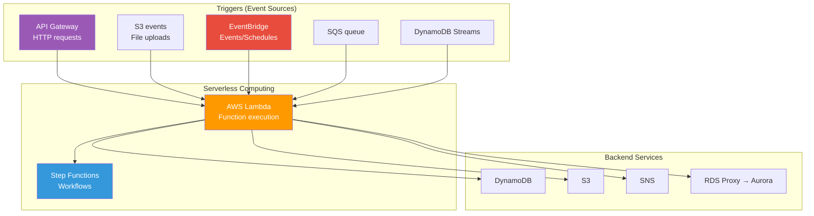
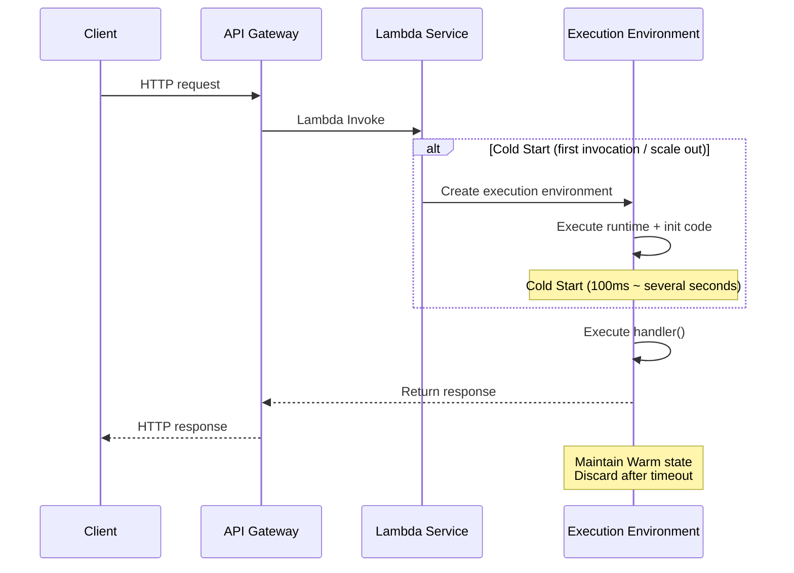
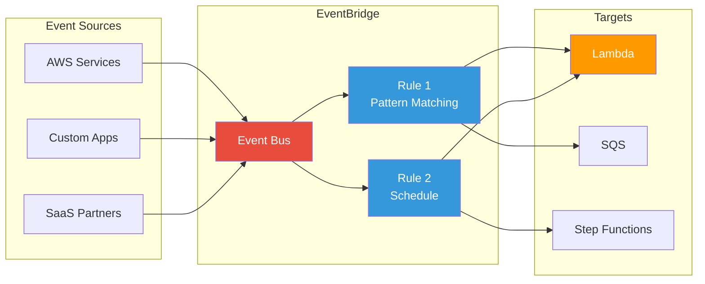
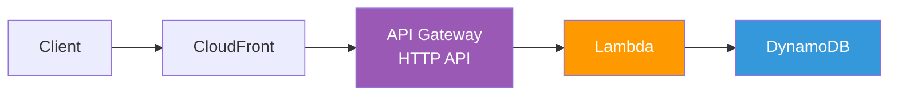
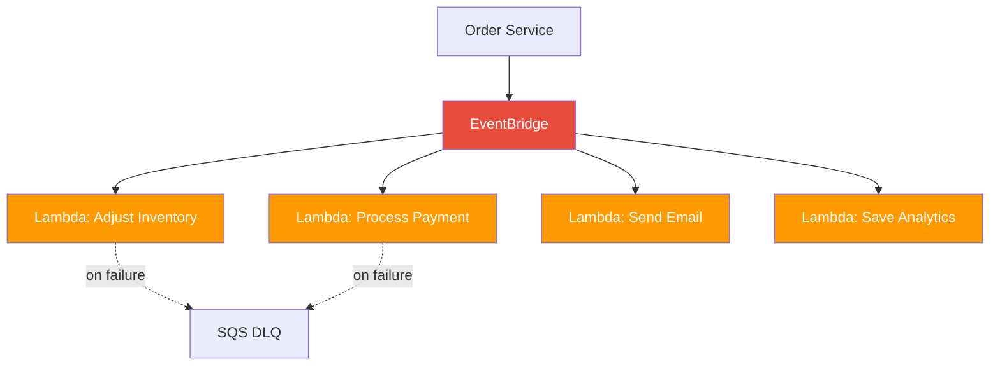

# Lambda / API Gateway / EventBridge

> In the [previous lecture](./09-container-services), we learned how to operate containers with ECS, EKS, and Fargate. Now let's move into the **serverless** world where you don't have to worry about servers themselves. It doesn't mean "there are no servers," but rather "I don't manage the servers."

---

## 🎯 Why do you need to know this?

```
When you need serverless:
• "Do I really need to launch EC2 just to create one API?"          → Lambda + API Gateway
• "When I upload an image to S3, I want to auto-generate a thumbnail"   → S3 event → Lambda
• "I need to run a DB cleanup script every day at 3 AM"       → EventBridge scheduler → Lambda
• "I'm paying for servers even when traffic is zero"               → Lambda charges only for invocations
• "When an order event comes in, I need to notify multiple systems"    → EventBridge event bus
• "I need to execute microservice workflows sequentially"    → Step Functions
• Interview question: "How do you solve Lambda cold start?"                → SnapStart / Provisioned Concurrency
```

[Container services](./09-container-services) meant "I launch containers and AWS manages servers," while serverless means "I just upload code and AWS manages everything." Both have pros and cons, so the key skill is knowing when to use which.

---

## 🧠 Core Concepts (Analogies + Diagrams)

### Analogy: Personal Car vs Taxi vs Uber

Let me compare server management approaches to transportation.

| Transportation | AWS Service | Characteristics |
|----------|-----------|------|
| Personal car (EC2) | Running EC2 directly | Buy a car, get insurance, maintain it yourself. Always paying parking fees |
| Taxi (ECS/EKS) | Container services | Don't drive, but still paying taxi fare (server costs) continuously |
| Uber (Lambda) | Serverless | Pay only when you ride. Zero cost when waiting |

Uber isn't always the best choice. **If you're traveling all day**, a personal car is cheaper. **If you're moving briefly**, Uber is cheaper. Lambda works the same way.

### Analogy: Vending Machine = Lambda

* **Vending machine (Lambda function)** = Insert a coin (event), get a predetermined drink (result)
* **Coin slot (trigger)** = Various inputs: S3, API Gateway, EventBridge, etc.
* **Drink varieties (runtime)** = Python, Node.js, Go, Java, Container Image
* **Vending machine size (memory)** = 128MB ~ 10GB, larger memory means proportionally more CPU
* **Maximum wait time (timeout)** = 15 minutes max. Forced termination if exceeded
* **Cold start** = Vending machine's power is off, so the first customer experiences a slight boot delay

### Complete Serverless Architecture



### Lambda Execution Model



### EventBridge Event Flow



---

## 🔍 Detailed Explanation

### 1. Lambda Basics

Lambda is a service that executes code **only when an event occurs**. AWS handles all server provisioning, patching, and scaling.

#### Handler Structure (Python Example)

```python
import json, boto3, os

# === init code: executed only once during cold start (outside handler) ===
dynamodb = boto3.resource('dynamodb')
table = dynamodb.Table(os.environ['TABLE_NAME'])

def lambda_handler(event, context):
    """
    event: Data sent by the trigger (JSON)
    context: Runtime information (function name, memory, remaining time, etc.)
    """
    body = json.loads(event.get('body', '{}'))
    table.put_item(Item={'user_id': body['user_id'], 'name': body['name']})

    return {
        'statusCode': 200,
        'headers': {'Content-Type': 'application/json'},
        'body': json.dumps({'message': 'Save completed'})
    }
```

> **Key point**: Init code outside `lambda_handler` runs only once during cold start. Always initialize DB connections and SDKs outside the handler.

#### Creating Lambda Function (CLI)

```bash
# === Create Lambda execution role (IAM role — see 01-iam) ===
aws iam create-role \
  --role-name my-lambda-role \
  --assume-role-policy-document '{
    "Version": "2012-10-17",
    "Statement": [{
      "Effect": "Allow",
      "Principal": {"Service": "lambda.amazonaws.com"},
      "Action": "sts:AssumeRole"
    }]
  }'
# → "Arn": "arn:aws:iam::123456789012:role/my-lambda-role"

# === Attach basic logging permissions ===
aws iam attach-role-policy \
  --role-name my-lambda-role \
  --policy-arn arn:aws:iam::aws:policy/service-role/AWSLambdaBasicExecutionRole
```

```bash
# === Create Lambda function ===
zip function.zip lambda_function.py

aws lambda create-function \
  --function-name my-order-processor \
  --runtime python3.12 \
  --role arn:aws:iam::123456789012:role/my-lambda-role \
  --handler lambda_function.lambda_handler \
  --zip-file fileb://function.zip \
  --timeout 30 \
  --memory-size 256 \
  --environment "Variables={TABLE_NAME=orders-table,ENV=production}"

# Expected output:
# {
#     "FunctionName": "my-order-processor",
#     "Runtime": "python3.12",
#     "Timeout": 30,
#     "MemorySize": 256,
#     "State": "Active"
# }
```

#### Runtimes and Memory

| Runtime | Cold Start | Good for |
|--------|-----------|------------|
| Python 3.12 | ~200ms | Scripts, data processing |
| Node.js 20.x | ~200ms | APIs, web backends |
| Go | ~100ms | High performance, bulk processing |
| Java 21 | ~2-5 seconds | Enterprise (SnapStart required) |
| Container Image | Variable | ML models, existing containers |

Lambda scales CPU proportionally with memory. At 1,769MB you get 1 vCPU, at 10,240MB you get 6 vCPUs. Doubling memory often cuts execution time in half, so costs may stay the same or even decrease.

#### Lambda Layers

```bash
# === Package common libraries as a Layer ===
mkdir -p python && pip install requests -t python/
zip -r my-layer.zip python/

aws lambda publish-layer-version \
  --layer-name my-common-libs \
  --zip-file fileb://my-layer.zip \
  --compatible-runtimes python3.12
# → "LayerVersionArn": "arn:aws:lambda:...:layer:my-common-libs:1"

# === Attach Layer to function ===
aws lambda update-function-configuration \
  --function-name my-order-processor \
  --layers arn:aws:lambda:ap-northeast-2:123456789012:layer:my-common-libs:1
```

#### Cold Start Optimization

| Method | Cold Start Reduction | Cost | Good for |
|------|----------------|------|------------|
| Init code optimization | Slight | Free | All functions (baseline) |
| Memory increase | Slight | Slight increase | CPU-bound initialization |
| Provisioned Concurrency | Complete removal | Continuous cost | APIs, latency-sensitive services |
| SnapStart (Java) | 90%+ reduction | Free | Java/Spring functions |

```bash
# === Provisioned Concurrency (Keep N warm environments always) ===
aws lambda put-provisioned-concurrency-config \
  --function-name my-order-processor \
  --qualifier prod \
  --provisioned-concurrent-executions 10
# → "Status": "IN_PROGRESS"

# === SnapStart (Java only) ===
aws lambda update-function-configuration \
  --function-name my-java-function \
  --snap-start ApplyOn=PublishedVersions

aws lambda publish-version --function-name my-java-function
# → SnapStart: { "OptimizationStatus": "On" }
```

#### /tmp Storage

Lambda has up to **10GB** temporary storage in `/tmp`. Default is 512MB.

```bash
aws lambda update-function-configuration \
  --function-name my-image-processor \
  --ephemeral-storage Size=2048
```

> **Warning**: `/tmp` data may persist in warm state. Delete sensitive data after processing!

### 2. Lambda Triggers

Lambda's power lies in its ability to **connect with diverse event sources**. [S3 events](./04-storage), [DynamoDB Streams](./05-database), and other services we learned earlier can trigger Lambda.

| Trigger | Invocation Type | Main Use Cases |
|--------|----------|--------------|
| API Gateway | Synchronous (Invoke) | REST/HTTP APIs |
| S3 | Asynchronous (Event) | File upload processing |
| SQS | Poll-based (Event Source Mapping) | Message queue processing |
| EventBridge | Asynchronous | Event-driven processing, scheduling |
| DynamoDB Streams | Poll-based | Detect data changes |
| ALB | Synchronous | HTTP requests |
| Kinesis | Poll-based | Real-time streaming |

```bash
# === Add S3 trigger (run Lambda when image uploads) ===
aws lambda add-permission \
  --function-name my-image-processor \
  --statement-id s3-trigger \
  --action lambda:InvokeFunction \
  --principal s3.amazonaws.com \
  --source-arn arn:aws:s3:::my-upload-bucket

aws s3api put-bucket-notification-configuration \
  --bucket my-upload-bucket \
  --notification-configuration '{
    "LambdaFunctionConfigurations": [{
      "LambdaFunctionArn": "arn:aws:lambda:ap-northeast-2:123456789012:function:my-image-processor",
      "Events": ["s3:ObjectCreated:*"],
      "Filter": {"Key": {"FilterRules": [
        {"Name": "prefix", "Value": "uploads/"},
        {"Name": "suffix", "Value": ".jpg"}
      ]}}
    }]
  }'
# → Lambda auto-runs when .jpg files upload to uploads/ folder!
```

```bash
# === SQS → Lambda event source mapping ===
aws lambda create-event-source-mapping \
  --function-name my-order-processor \
  --event-source-arn arn:aws:sqs:ap-northeast-2:123456789012:order-queue \
  --batch-size 10 \
  --maximum-batching-window-in-seconds 5
# → "State": "Creating"
```

### 3. API Gateway

API Gateway is the **HTTP gateway** you place in front of Lambda. It handles authentication, throttling, CORS, and stage management. We covered the concept in [networking API management](../02-networking/13-api-gateway), now we'll cover AWS implementation.

#### REST API vs HTTP API

| Comparison | REST API | HTTP API |
|-----------|----------|----------|
| Price | $3.50/1M requests | $1.00/1M requests (70% cheaper) |
| Latency | ~30ms | ~10ms |
| Authentication | Cognito, Lambda Authorizer, IAM | + Native JWT support |
| Caching/Usage Plans | Supported | Not supported |
| Recommendation | When you need many features | **Use this in most cases** |

#### Creating HTTP API (CLI)

```bash
# === Create HTTP API + Lambda integration in one go ===
aws apigatewayv2 create-api \
  --name my-order-api \
  --protocol-type HTTP \
  --target arn:aws:lambda:ap-northeast-2:123456789012:function:my-order-processor

# Expected output:
# {
#     "ApiId": "abc123def4",
#     "ApiEndpoint": "https://abc123def4.execute-api.ap-northeast-2.amazonaws.com",
#     "ProtocolType": "HTTP"
# }
```

```bash
# === Grant API Gateway permission to invoke Lambda ===
aws lambda add-permission \
  --function-name my-order-processor \
  --statement-id apigateway-invoke \
  --action lambda:InvokeFunction \
  --principal apigateway.amazonaws.com \
  --source-arn "arn:aws:execute-api:ap-northeast-2:123456789012:abc123def4/*"
```

```bash
# === Manual route + integration setup (fine-grained control) ===
aws apigatewayv2 create-integration \
  --api-id abc123def4 \
  --integration-type AWS_PROXY \
  --integration-uri arn:aws:lambda:ap-northeast-2:123456789012:function:my-order-processor \
  --payload-format-version "2.0"
# → "IntegrationId": "intg123"

aws apigatewayv2 create-route \
  --api-id abc123def4 \
  --route-key "POST /orders" \
  --target "integrations/intg123"

aws apigatewayv2 create-stage \
  --api-id abc123def4 \
  --stage-name prod \
  --auto-deploy
# → https://abc123def4.execute-api.ap-northeast-2.amazonaws.com/prod
```

#### CORS + Authentication

```bash
# === Configure CORS ===
aws apigatewayv2 update-api \
  --api-id abc123def4 \
  --cors-configuration '{
    "AllowOrigins": ["https://myapp.example.com"],
    "AllowMethods": ["GET", "POST", "PUT", "DELETE"],
    "AllowHeaders": ["Content-Type", "Authorization"],
    "MaxAge": 86400
  }'
```

```bash
# === JWT Authorizer (Cognito) — HTTP API ===
aws apigatewayv2 create-authorizer \
  --api-id abc123def4 \
  --authorizer-type JWT \
  --identity-source '$request.header.Authorization' \
  --name cognito-auth \
  --jwt-configuration '{
    "Audience": ["my-app-client-id"],
    "Issuer": "https://cognito-idp.ap-northeast-2.amazonaws.com/ap-northeast-2_AbCdEfG"
  }'
# → "AuthorizerId": "auth789"

aws apigatewayv2 update-route \
  --api-id abc123def4 \
  --route-id route456 \
  --authorization-type JWT \
  --authorizer-id auth789
```

### 4. EventBridge

EventBridge is AWS's **event router**. Like a package sorting center, it receives events and routes them to destinations based on rules.

#### Event Bus + Rules + Pattern Matching

```bash
# === Create custom event bus ===
aws events create-event-bus --name my-app-events
# → "EventBusArn": "arn:aws:events:ap-northeast-2:123456789012:event-bus/my-app-events"

# === Event rule (pattern matching — orders over 100,000 completed) ===
aws events put-rule \
  --name order-completed-rule \
  --event-bus-name my-app-events \
  --event-pattern '{
    "source": ["my-app.orders"],
    "detail-type": ["OrderCompleted"],
    "detail": { "amount": [{"numeric": [">=", 100000]}] }
  }' \
  --state ENABLED
# → "RuleArn": "arn:aws:events:...:rule/my-app-events/order-completed-rule"
```

> **Pattern Matching**: Supports various filters like `numeric`, `prefix`, `suffix`, `anything-but`, `exists`, etc.

```bash
# === Connect target (Lambda) to rule ===
aws events put-targets \
  --rule order-completed-rule \
  --event-bus-name my-app-events \
  --targets '[{
    "Id": "notify-lambda",
    "Arn": "arn:aws:lambda:ap-northeast-2:123456789012:function:order-notification",
    "RetryPolicy": { "MaximumRetryAttempts": 3, "MaximumEventAgeInSeconds": 3600 }
  }]'
# → "FailedEntryCount": 0
```

#### Scheduler (cron)

```bash
# === Schedule rule (every day at 3 AM KST = 18:00 UTC) ===
aws events put-rule \
  --name daily-cleanup \
  --schedule-expression "cron(0 18 * * ? *)" \
  --state ENABLED

# === EventBridge Scheduler (timezone support — recommended) ===
aws scheduler create-schedule \
  --name monthly-report \
  --schedule-expression "cron(0 9 1 * ? *)" \
  --schedule-expression-timezone "Asia/Seoul" \
  --flexible-time-window '{"Mode": "OFF"}' \
  --target '{
    "Arn": "arn:aws:lambda:ap-northeast-2:123456789012:function:generate-report",
    "RoleArn": "arn:aws:iam::123456789012:role/scheduler-role"
  }'
```

> **Scheduler vs cron rules**: Scheduler supports **timezone awareness**, one-time schedules, and FlexibleTimeWindow. Use Scheduler for new implementations.

#### Archive & Replay

You can save events and replay them later. Useful for disaster recovery and testing.

```bash
# === Create event archive (90-day retention) ===
aws events create-archive \
  --archive-name order-events-archive \
  --event-source-arn arn:aws:events:ap-northeast-2:123456789012:event-bus/my-app-events \
  --event-pattern '{"source": ["my-app.orders"]}' \
  --retention-days 90

# === Replay events from specific time range ===
aws events start-replay \
  --replay-name replay-20260313 \
  --event-source-arn arn:aws:events:ap-northeast-2:123456789012:event-bus/my-app-events \
  --event-start-time "2026-03-12T00:00:00Z" \
  --event-end-time "2026-03-12T23:59:59Z" \
  --destination '{"Arn": "arn:aws:events:ap-northeast-2:123456789012:event-bus/my-app-events"}'
# → "State": "STARTING"
```

#### Schema Registry

EventBridge auto-detects event structures passing through and creates schemas automatically.

```bash
aws schemas list-schemas --registry-name discovered-schemas
# → "SchemaName": "my-app.orders@OrderCompleted"
```

### 5. Step Functions

Use Step Functions when you need to execute multiple Lambdas **in sequence, in parallel, or with conditional branching**.

#### Standard vs Express

| Comparison | Standard | Express |
|-----------|----------|---------|
| Max execution time | 1 year | 5 minutes |
| Price model | Per state transition | Per execution + time |
| Execution guarantee | Exactly-once | At-least-once |
| Good for | Long-running workflows, payments | Bulk processing, real-time |

#### ASL (Amazon States Language) Example

```bash
aws stepfunctions create-state-machine \
  --name order-processing-workflow \
  --role-arn arn:aws:iam::123456789012:role/sf-role \
  --definition '{
    "Comment": "Order processing workflow",
    "StartAt": "ValidateOrder",
    "States": {
      "ValidateOrder": {
        "Type": "Task",
        "Resource": "arn:aws:lambda:...:function:validate-order",
        "Next": "CheckInventory",
        "Retry": [{"ErrorEquals": ["ServiceException"], "IntervalSeconds": 2, "MaxAttempts": 3, "BackoffRate": 2.0}],
        "Catch": [{"ErrorEquals": ["States.ALL"], "Next": "HandleError"}]
      },
      "CheckInventory": {
        "Type": "Task",
        "Resource": "arn:aws:lambda:...:function:check-inventory",
        "Next": "ProcessPayment"
      },
      "ProcessPayment": {
        "Type": "Task",
        "Resource": "arn:aws:lambda:...:function:process-payment",
        "Next": "ParallelNotify"
      },
      "ParallelNotify": {
        "Type": "Parallel",
        "End": true,
        "Branches": [
          {"StartAt": "SendEmail", "States": {"SendEmail": {"Type": "Task", "Resource": "arn:aws:lambda:...:send-email", "End": true}}},
          {"StartAt": "SendSlack", "States": {"SendSlack": {"Type": "Task", "Resource": "arn:aws:lambda:...:send-slack", "End": true}}}
        ]
      },
      "HandleError": {
        "Type": "Task",
        "Resource": "arn:aws:lambda:...:function:handle-error",
        "End": true
      }
    }
  }'
# → "stateMachineArn": "arn:aws:states:...:stateMachine:order-processing-workflow"
```

> **Error Handling**: `Retry` automatically retries transient errors, `Catch` routes failures to alternative paths.

### 6. Serverless Architecture Patterns

#### Pattern 1: API + Lambda + DynamoDB



#### Pattern 2: Event-Driven Fan-out



#### Cost Calculation Example

```
Scenario: 1M API requests/month, avg 200ms, 256MB memory

[Lambda]  Requests: $0.20 + Computing: $0.83 = $1.03/month
[API GW]  HTTP API: $1.00/month
[Total]    $2.03/month

[Comparison: EC2 t3.small 24/7]
→ $0.026 × 730 hours = $18.98/month

With low traffic, serverless is overwhelmingly cheaper!
With 10M+ requests/month, EC2 may become cheaper.
```

#### Lambda VPC Access

To access RDS in a [VPC](./02-vpc) private subnet, you must place Lambda inside the VPC.

```bash
aws lambda update-function-configuration \
  --function-name my-order-processor \
  --vpc-config '{"SubnetIds": ["subnet-0abc1111", "subnet-0abc2222"], "SecurityGroupIds": ["sg-0lambda1234"]}'
```

> **Warning**: Lambda in VPC needs **NAT Gateway** for internet access. If you only use AWS services, use **VPC Endpoint** instead.

---

## 💻 Hands-On Lab

### Lab 1: API Gateway + Lambda + DynamoDB CRUD API

**Goal**: Build an order create/retrieve API serverlessly.

```bash
# === Step 1: Create DynamoDB table ===
aws dynamodb create-table \
  --table-name orders \
  --attribute-definitions AttributeName=order_id,AttributeType=S \
  --key-schema AttributeName=order_id,KeyType=HASH \
  --billing-mode PAY_PER_REQUEST
```

```python
# === Step 2: Lambda code (order_handler.py) ===
import json, boto3, uuid
from datetime import datetime

dynamodb = boto3.resource('dynamodb')
table = dynamodb.Table('orders')

def lambda_handler(event, context):
    method = event.get('requestContext', {}).get('http', {}).get('method')
    path = event.get('rawPath', '')

    if method == 'POST' and path == '/orders':
        body = json.loads(event.get('body', '{}'))
        order = {
            'order_id': str(uuid.uuid4()),
            'customer_name': body.get('customer_name'),
            'items': body.get('items', []),
            'total_amount': body.get('total_amount', 0),
            'status': 'PENDING',
            'created_at': datetime.utcnow().isoformat()
        }
        table.put_item(Item=order)
        return {'statusCode': 201, 'body': json.dumps(order, default=str)}

    elif method == 'GET' and '/orders/' in path:
        order_id = path.split('/')[-1]
        item = table.get_item(Key={'order_id': order_id}).get('Item')
        if not item:
            return {'statusCode': 404, 'body': json.dumps({'error': 'Order not found'})}
        return {'statusCode': 200, 'body': json.dumps(item, default=str)}

    return {'statusCode': 404, 'body': json.dumps({'error': 'Path not found'})}
```

```bash
# === Step 3: Deploy + Create HTTP API ===
zip order_handler.zip order_handler.py
aws lambda create-function \
  --function-name order-api --runtime python3.12 \
  --role arn:aws:iam::123456789012:role/my-lambda-role \
  --handler order_handler.lambda_handler \
  --zip-file fileb://order_handler.zip --timeout 10 --memory-size 256

aws apigatewayv2 create-api --name order-api --protocol-type HTTP \
  --target arn:aws:lambda:ap-northeast-2:123456789012:function:order-api
# → "ApiEndpoint": "https://xyz789.execute-api.ap-northeast-2.amazonaws.com"

# === Step 4: Test ===
curl -X POST https://xyz789.execute-api.ap-northeast-2.amazonaws.com/orders \
  -H "Content-Type: application/json" \
  -d '{"customer_name": "John Doe", "items": ["Laptop"], "total_amount": 1500000}'
# → {"order_id": "a1b2c3d4-...", "status": "PENDING", ...}
```

### Lab 2: S3 Upload → Lambda Auto-Processing

**Goal**: When an image uploads to S3, automatically save metadata to DynamoDB.

```python
# === image_processor.py ===
import json, boto3, urllib.parse
from datetime import datetime

s3 = boto3.client('s3')
table = boto3.resource('dynamodb').Table('image-metadata')

def lambda_handler(event, context):
    for record in event['Records']:
        bucket = record['s3']['bucket']['name']
        key = urllib.parse.unquote_plus(record['s3']['object']['key'])
        size = record['s3']['object']['size']

        head = s3.head_object(Bucket=bucket, Key=key)
        table.put_item(Item={
            'image_key': key, 'bucket': bucket,
            'size_bytes': size, 'content_type': head.get('ContentType'),
            'uploaded_at': datetime.utcnow().isoformat()
        })
        print(f"Processing completed: s3://{bucket}/{key} ({size} bytes)")

    return {'processed': len(event['Records'])}
```

```bash
# === Deploy + Connect S3 trigger ===
zip image_processor.zip image_processor.py
aws lambda create-function --function-name image-processor --runtime python3.12 \
  --role arn:aws:iam::123456789012:role/my-lambda-role \
  --handler image_processor.lambda_handler --timeout 30 --memory-size 512

aws lambda add-permission --function-name image-processor --statement-id s3-invoke \
  --action lambda:InvokeFunction --principal s3.amazonaws.com \
  --source-arn arn:aws:s3:::my-image-bucket

aws s3api put-bucket-notification-configuration --bucket my-image-bucket \
  --notification-configuration '{
    "LambdaFunctionConfigurations": [{
      "LambdaFunctionArn": "arn:aws:lambda:ap-northeast-2:123456789012:function:image-processor",
      "Events": ["s3:ObjectCreated:*"],
      "Filter": {"Key": {"FilterRules": [{"Name": "prefix", "Value": "uploads/"}]}}
    }]}'

# === Test ===
aws s3 cp sample.jpg s3://my-image-bucket/uploads/sample.jpg
aws logs tail /aws/lambda/image-processor --since 1m
# → "Processing completed: s3://my-image-bucket/uploads/sample.jpg (234567 bytes)"
```

### Lab 3: EventBridge → Step Functions Order Workflow

**Goal**: Order event → EventBridge → Step Functions → Lambda chain processing.

```bash
# === Step 1: Send custom event ===
aws events put-events --entries '[{
  "Source": "my-app.orders", "DetailType": "OrderCreated",
  "Detail": "{\"order_id\": \"ORD-001\", \"customer\": \"John Doe\", \"amount\": 250000}",
  "EventBusName": "my-app-events"
}]'
# → "FailedEntryCount": 0

# === Step 2: Connect EventBridge → Step Functions ===
aws events put-rule --name order-workflow-trigger --event-bus-name my-app-events \
  --event-pattern '{"source": ["my-app.orders"], "detail-type": ["OrderCreated"]}' \
  --state ENABLED

aws events put-targets --rule order-workflow-trigger --event-bus-name my-app-events \
  --targets '[{
    "Id": "sf-target",
    "Arn": "arn:aws:states:ap-northeast-2:123456789012:stateMachine:order-processing-workflow",
    "RoleArn": "arn:aws:iam::123456789012:role/eventbridge-sf-role"
  }]'

# === Step 3: Verify execution ===
aws stepfunctions list-executions \
  --state-machine-arn arn:aws:states:ap-northeast-2:123456789012:stateMachine:order-processing-workflow \
  --status-filter RUNNING
# → "status": "RUNNING", "name": "evt-12345678"
```

---

## 🏢 In Real Practice

### Scenario 1: E-commerce Order Processing System

```
Problem: Order → Check Inventory → Process Payment → Ship → Notify
         Need sequential processing with failure compensation (cancellation).

Solution:
1. API Gateway → Lambda: Accept order
2. Lambda → EventBridge: Publish "OrderCreated" event
3. EventBridge → Step Functions start workflow
4. Step Functions: Validate → Inventory → Payment → Ship (with Retry/Catch)
5. On completion, EventBridge "OrderCompleted" → SNS notification

Benefits: Zero server management, auto-scaling, per-step error handling,
          Archive for disaster reproduction
```

### Scenario 2: Image Processing Pipeline (Fan-out)

```
Problem: Uploaded images need simultaneous thumbnail generation + text extraction
         + harmful content detection.

Solution:
1. S3 event → Lambda → EventBridge "ImageUploaded"
2. EventBridge → 3 Lambdas execute simultaneously:
   - Thumbnail generation (Pillow + /tmp 2GB)
   - Rekognition text extraction
   - Rekognition harmful content detection
3. Each Lambda → DynamoDB save results
4. DynamoDB Streams → Lambda: update final status

Notes: 3GB+ memory, /tmp expanded to 2GB, consider Provisioned Concurrency
```

### Scenario 3: Multi-Account Security Event Integration

```
Problem: Centralize security events from dev/staging/prod accounts into
         central monitoring.

Solution:
1. Each account's EventBridge → Cross-Account → Security account event bus
2. Classify by severity:
   - HIGH → Lambda → PagerDuty
   - MEDIUM → SQS → Security team dashboard
   - All → S3 Archive (audit logs)
```

---

## ⚠️ Common Mistakes

### 1. Initializing SDK Client Inside Lambda Handler

```python
# ❌ Creates new client on every invocation - slow
def lambda_handler(event, context):
    dynamodb = boto3.resource('dynamodb')   # Recreated each time!
    table = dynamodb.Table('orders')
    ...

# ✅ Initialize once outside handler (reused in warm state)
dynamodb = boto3.resource('dynamodb')
table = dynamodb.Table('orders')
def lambda_handler(event, context):
    table.put_item(Item={...})
```

### 2. Lambda Timeout > API Gateway Timeout

```
❌ Lambda: 60 seconds, API Gateway HTTP API: 30 seconds max
   → Returns 504 after 30 seconds, Lambda continues running (cost waste!)

✅ Set Lambda timeout shorter than API Gateway (25 seconds or less)
   Use async pattern (SQS → Lambda) for longer tasks
```

### 3. Including Sensitive Data in EventBridge Events

```json
// ❌ Events logged + archived with password exposed!
{"detail": {"user": "John Doe", "password": "myp@ss123"}}

// ✅ Include only IDs, fetch sensitive data in Lambda
{"detail": {"user_id": "USR-001", "order_id": "ORD-001"}}
```

### 4. Placing Lambda in VPC Without NAT Gateway

```
❌ Lambda → VPC private subnet → external API call fails!

✅ Solution (in cost order):
   1. Remove VPC if not needed (works without VPC for most cases)
   2. AWS services only → VPC Endpoint
   3. Need external access → NAT Gateway (~ $35+/month)
```

### 5. Missing Return in Step Functions Lambda

```python
# ❌ No return - next step receives null input!
def lambda_handler(event, context):
    validate(event)
    print("Done")  # Missing return

# ✅ Always return results
def lambda_handler(event, context):
    return {"order_id": event["order_id"], "is_valid": True}
```

---

## 📝 Summary

### Serverless Core Services Summary

| Service | Role | Key Features | Cost Model |
|--------|------|----------|----------|
| **Lambda** | Execute functions | Event-driven, auto-scale, 15-min max | Request count + execution time |
| **API Gateway** | HTTP gateway | Authentication, throttling, CORS | Request count (HTTP API 70% cheaper) |
| **EventBridge** | Event router | Pattern matching, schedules, Archive/Replay | Event count |
| **Step Functions** | Workflow orchestration | Visualization, Retry/Catch, Parallel | State transitions |

### Serverless vs Container Selection Criteria

| Situation | Lambda | ECS/EKS |
|------|--------|---------|
| Traffic | Sporadic, irregular | Stable, continuous |
| Execution time | < 15 minutes | Unlimited |
| Cold start | Acceptable | Not acceptable |
| Cost (low traffic) | Very cheap | Minimum cost exists |
| Cost (high traffic) | May be expensive | Relatively cheap |

### Checklist

```
Before Lambda deployment:
□ IAM Role has minimum permissions? (01-iam)
□ SDK initialized outside handler?
□ Memory optimized (Power Tuning)?
□ Timeout < trigger timeout?
□ Env vars use Secrets Manager ARN?
□ VPC really necessary?
□ DLQ configured?

API Gateway:
□ HTTP API vs REST API choice rationale?
□ CORS configured?
□ Throttling limits set?
□ Authorizer attached?

EventBridge:
□ Event pattern filters down to detail level?
□ Targets have DLQ?
□ No sensitive data in events?
□ Archive enabled?
```

---

## 🔗 Next Lecture → [11-messaging](./11-messaging)

If Lambda is the service that "executes code," then the **SQS, SNS, Kinesis, MSK** we'll learn next are services that "pass messages" between services. They're the core components that decouple services in serverless architectures and enable asynchronous processing.
