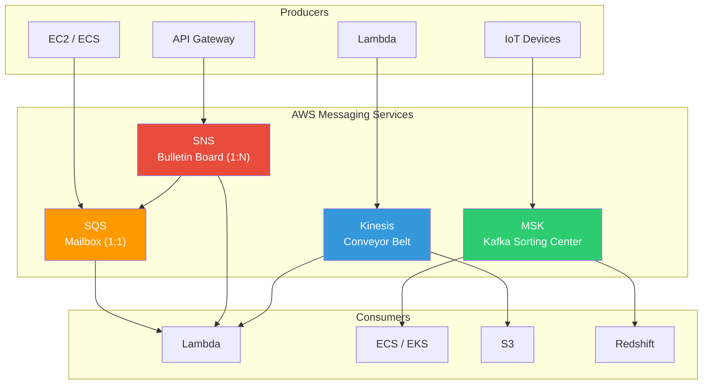
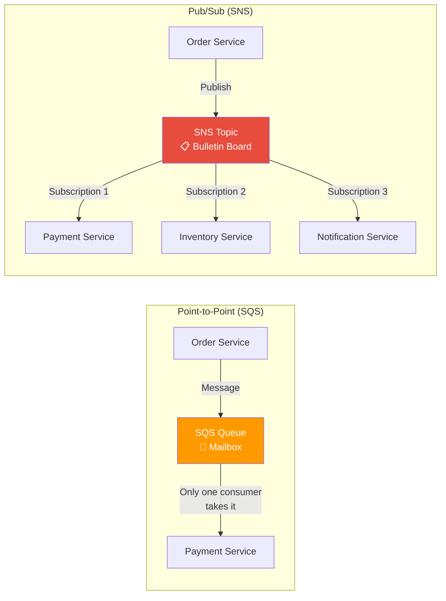
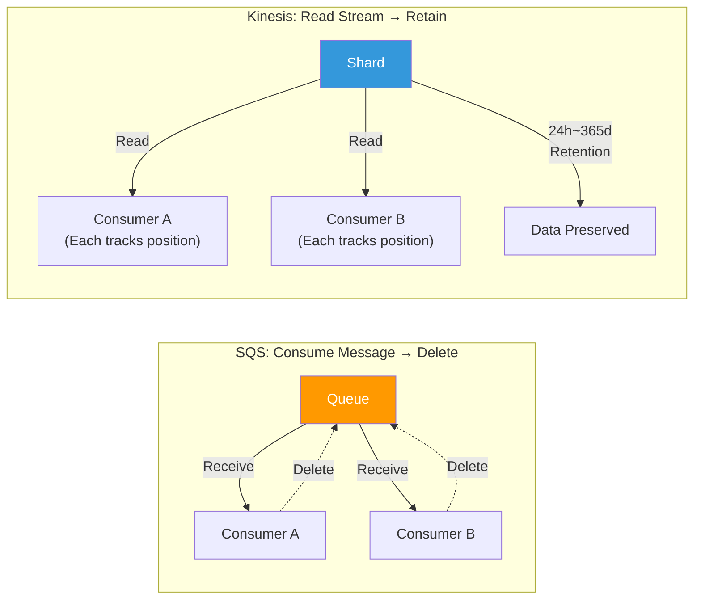
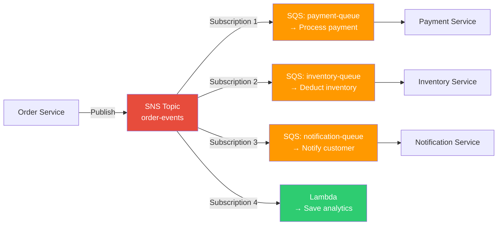
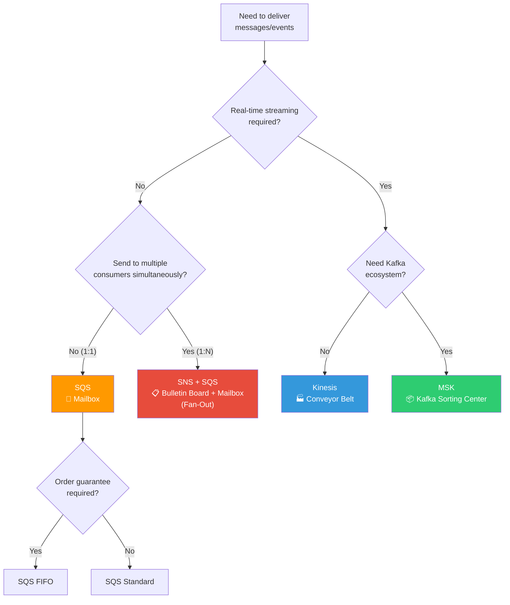

# SQS / SNS / Kinesis / MSK

> In the [previous lecture](./10-serverless), we learned serverless services like Lambda and API Gateway. Now let's learn **loosely coupled** messaging services that connect services together. We'll cover SQS and SNS frequently used as Lambda triggers, plus Kinesis, and MSK—AWS's managed Kafka.

---

## 🎯 Why do you need to know this?

```
When you need messaging:
• "If the order service dies, the payment service dies too"                → Decouple with SQS
• "I need to send one event to multiple services simultaneously"              → Fan-Out with SNS → SQS
• "I need to collect 100k logs per second in real-time"                  → Streaming with Kinesis
• "Failed messages keep retrying and cascading failures"            → DLQ (Dead Letter Queue)
• "I want to use Kafka but managing it is too hard"                     → MSK (managed Kafka)
• "Order sequence must not change but message order isn't guaranteed"   → FIFO queues / partition keys
• Interview: "What's the difference between SQS and Kinesis?"                               → Consumption model difference
```

---

## 🧠 Core Concepts (Analogies + Diagrams)

### Analogy: Synchronous vs Asynchronous Communication

Let me compare inter-service communication using **phone calls** and **mailboxes**.

* **Synchronous (Synchronous)** = Phone call. You must wait for the other party to answer. If they're busy, you're blocked.
* **Asynchronous (Asynchronous)** = Mailbox. Drop a letter and the recipient **picks it up at their own pace**. You don't need to wait.

### Analogy: 4 Messaging Patterns

| Service | Analogy | Core Feature |
|--------|------|-----------|
| **SQS** | Post office **mailbox** | 1:1 delivery, disappears when taken (Point-to-Point) |
| **SNS** | School **bulletin board** | 1:N notification, reaches all subscribers (Pub/Sub) |
| **Kinesis** | Factory **conveyor belt** | Real-time streaming, multiple consumers see same data |
| **MSK** | Large logistics **sorting center** | Kafka-based, high volume/long retention, parallel partitions |

### Complete Messaging Architecture



### Point-to-Point vs Pub/Sub



### SQS vs Kinesis Consumption Model



---

## 🔍 Detailed Explanation

### 1. SQS (Simple Queue Service)

SQS is one of AWS's oldest services (launched in 2006). Its core is placing a **mailbox (queue)** between services to decouple them. It's also frequently used as an event source for [Lambda](./10-serverless).

#### Standard vs FIFO

| Item | Standard Queue | FIFO Queue |
|------|---------------|------------|
| **Throughput** | Unlimited (thousands~hundreds of thousands per second) | 300 TPS (3,000 with batching) |
| **Order Guarantee** | Best-effort | Strict ordering |
| **Duplicates Possible** | Occasional duplicates possible | Exactly-once delivery |
| **Queue Name** | Any name | Must end with `.fifo` |
| **Use Cases** | Log processing, email sending | Order processing, financial transactions |

#### Visibility Timeout (Visibility Timeout)

When a consumer takes a message, it's **temporarily hidden** from other consumers. Once processing finishes, it's deleted. If not processed within the timeout, it reappears.

```bash
# === Create SQS queue (Standard) ===
aws sqs create-queue \
  --queue-name order-processing-queue \
  --attributes '{
    "VisibilityTimeout": "60",
    "MessageRetentionPeriod": "345600",
    "ReceiveMessageWaitTimeSeconds": "20"
  }'

# Expected output:
# {
#     "QueueUrl": "https://sqs.ap-northeast-2.amazonaws.com/123456789012/order-processing-queue"
# }
```

```bash
# === Create SQS FIFO queue ===
# FIFO queues must end with .fifo
aws sqs create-queue \
  --queue-name order-processing-queue.fifo \
  --attributes '{
    "FifoQueue": "true",
    "ContentBasedDeduplication": "true",
    "VisibilityTimeout": "60"
  }'

# Expected output:
# {
#     "QueueUrl": "https://sqs.ap-northeast-2.amazonaws.com/123456789012/order-processing-queue.fifo"
# }
```

#### Sending / Receiving / Deleting Messages

```bash
# === Send message (Standard Queue) ===
aws sqs send-message \
  --queue-url https://sqs.ap-northeast-2.amazonaws.com/123456789012/order-processing-queue \
  --message-body '{"orderId":"ORD-001","item":"laptop","qty":1}' \
  --message-attributes '{
    "OrderType": {"DataType":"String","StringValue":"electronics"}
  }'

# Expected output:
# {
#     "MD5OfMessageBody": "a1b2c3d4e5f6...",
#     "MD5OfMessageAttributes": "f6e5d4c3b2a1...",
#     "MessageId": "12345678-1234-1234-1234-123456789012"
# }
```

```bash
# === Send message to FIFO queue (MessageGroupId required) ===
aws sqs send-message \
  --queue-url https://sqs.ap-northeast-2.amazonaws.com/123456789012/order-processing-queue.fifo \
  --message-body '{"orderId":"ORD-002","item":"phone","qty":2}' \
  --message-group-id "user-1001" \
  --message-deduplication-id "dedup-ORD-002"

# Expected output:
# {
#     "MD5OfMessageBody": "b2c3d4e5f6a1...",
#     "MessageId": "abcdefgh-abcd-abcd-abcd-abcdefghijkl",
#     "SequenceNumber": "18870000000000000001"
# }
```

```bash
# === Receive message (Long Polling - 20 second wait) ===
aws sqs receive-message \
  --queue-url https://sqs.ap-northeast-2.amazonaws.com/123456789012/order-processing-queue \
  --max-number-of-messages 5 \
  --wait-time-seconds 20 \
  --attribute-names All \
  --message-attribute-names All

# Expected output:
# {
#     "Messages": [
#         {
#             "MessageId": "12345678-1234-1234-1234-123456789012",
#             "ReceiptHandle": "AQEBwJnK...long-string...",
#             "Body": "{\"orderId\":\"ORD-001\",\"item\":\"laptop\",\"qty\":1}",
#             "Attributes": {
#                 "SentTimestamp": "1710316800000",
#                 "ApproximateReceiveCount": "1",
#                 "ApproximateFirstReceiveTimestamp": "1710316805000"
#             }
#         }
#     ]
# }
```

```bash
# === Delete message (must delete after successful processing!) ===
aws sqs delete-message \
  --queue-url https://sqs.ap-northeast-2.amazonaws.com/123456789012/order-processing-queue \
  --receipt-handle "AQEBwJnK...long-string..."

# No output on success (HTTP 200)
```

#### Dead Letter Queue (DLQ)

If message processing repeatedly fails, we move it to a **DLQ (dead letter mailbox)** for isolation. This prevents the original queue from getting stuck and allows later analysis.

```bash
# === Step 1: Create DLQ first ===
aws sqs create-queue --queue-name order-processing-dlq

# === Step 2: Connect DLQ to main queue (move after 3 failures) ===
aws sqs set-queue-attributes \
  --queue-url https://sqs.ap-northeast-2.amazonaws.com/123456789012/order-processing-queue \
  --attributes '{
    "RedrivePolicy": "{\"deadLetterTargetArn\":\"arn:aws:sqs:ap-northeast-2:123456789012:order-processing-dlq\",\"maxReceiveCount\":\"3\"}"
  }'

# No output on success (HTTP 200)
```

```bash
# === Check messages in DLQ ===
aws sqs get-queue-attributes \
  --queue-url https://sqs.ap-northeast-2.amazonaws.com/123456789012/order-processing-dlq \
  --attribute-names ApproximateNumberOfMessages

# Expected output:
# {
#     "Attributes": {
#         "ApproximateNumberOfMessages": "7"
#     }
# }
```

#### Long Polling vs Short Polling

```
Short Polling (default):
• Responds immediately when ReceiveMessage is called (returns empty if no messages)
• API call costs incurred even for empty responses
• Wasteful costs + CPU

Long Polling (recommended):
• Set WaitTimeSeconds=1~20
• Waits up to 20 seconds for messages to arrive
• Reduces empty responses → cost savings
• Set default via ReceiveMessageWaitTimeSeconds when creating queue
```

#### SQS Key Limits

```
• Max message size: 256KB (larger messages go to S3 + pointer)
• Message retention: 1 minute ~ 14 days (default 4 days)
• Delay Queue: 0 seconds ~ 15 minutes (delay message delivery)
• In-flight messages: Standard 120,000, FIFO 20,000
• Long Polling max wait: 20 seconds
```

---

### 2. SNS (Simple Notification Service)

SNS is a **bulletin board (Pub/Sub)** model. When you **publish** a message to a topic, it goes to all **subscribers** of that topic.

#### SNS Subscription Targets

```
SNS topic subscriptions can go to:
• SQS queues         → Most common pattern (Fan-Out)
• Lambda functions     → Serverless event processing
• HTTP/HTTPS endpoints → External webhooks
• Email / Email-JSON    → Email notifications
• SMS            → Text message alerts
• Kinesis Firehose → Streaming delivery
• Mobile Push     → iOS/Android push notifications
```

#### Creating SNS Topics and Subscriptions

```bash
# === Create SNS topic ===
aws sns create-topic --name order-events

# Expected output:
# {
#     "TopicArn": "arn:aws:sns:ap-northeast-2:123456789012:order-events"
# }
```

```bash
# === Subscribe SQS queue to SNS topic (Fan-Out pattern) ===
aws sns subscribe \
  --topic-arn arn:aws:sns:ap-northeast-2:123456789012:order-events \
  --protocol sqs \
  --notification-endpoint arn:aws:sqs:ap-northeast-2:123456789012:payment-queue

# Expected output:
# {
#     "SubscriptionArn": "arn:aws:sns:ap-northeast-2:123456789012:order-events:a1b2c3d4-..."
# }
```

```bash
# === Add Email subscription (admin notification) ===
aws sns subscribe \
  --topic-arn arn:aws:sns:ap-northeast-2:123456789012:order-events \
  --protocol email \
  --notification-endpoint admin@mycompany.com

# Expected output:
# {
#     "SubscriptionArn": "pending confirmation"
# }
# → Confirmation link sent to email. Click to complete subscription!
```

```bash
# === Publish SNS message ===
aws sns publish \
  --topic-arn arn:aws:sns:ap-northeast-2:123456789012:order-events \
  --message '{"orderId":"ORD-003","status":"created","amount":150000}' \
  --subject "New Order Created" \
  --message-attributes '{
    "orderType": {"DataType":"String","StringValue":"electronics"},
    "amount": {"DataType":"Number","StringValue":"150000"}
  }'

# Expected output:
# {
#     "MessageId": "abcdef01-2345-6789-abcd-ef0123456789"
# }
```

#### SNS Filter Policies

Each subscriber can apply **filters** to receive only messages they care about. Much more efficient than receiving all messages and filtering in the application.

```bash
# === Payment queue: receive only electronics orders ===
aws sns set-subscription-attributes \
  --subscription-arn arn:aws:sns:ap-northeast-2:123456789012:order-events:a1b2c3d4-... \
  --attribute-name FilterPolicy \
  --attribute-value '{"orderType": ["electronics"]}'

# No output on success (HTTP 200)
# → Now only messages with orderType "electronics" go to this SQS queue
```

```bash
# === High-value order alert: receive only orders 100k+ (numeric filter) ===
aws sns set-subscription-attributes \
  --subscription-arn arn:aws:sns:ap-northeast-2:123456789012:order-events:e5f6g7h8-... \
  --attribute-name FilterPolicy \
  --attribute-value '{"amount": [{"numeric": [">=", 100000]}]}'

# No output on success (HTTP 200)
```

#### Fan-Out Pattern (SNS + SQS)

This is the most common pattern when **one event needs independent processing by multiple services**.



> **Why not send SNS directly to Lambda instead of through SQS?**
> Adding SQS gives you **retry, batch processing, and DLQ** safeguards. If Lambda temporarily fails, the message stays in the queue and won't be lost.

#### SNS FIFO Topics

SNS also supports FIFO. Used with SQS FIFO, you can have **order guarantee + Fan-Out** simultaneously.

```bash
# === Create SNS FIFO topic ===
aws sns create-topic \
  --name order-events.fifo \
  --attributes '{
    "FifoTopic": "true",
    "ContentBasedDeduplication": "true"
  }'

# Expected output:
# {
#     "TopicArn": "arn:aws:sns:ap-northeast-2:123456789012:order-events.fifo"
# }
# → FIFO topics can only be subscribed to by SQS FIFO queues (not Email, HTTP, etc)
```

---

### 3. Kinesis

Kinesis is a **real-time data streaming** service. If SQS is a mailbox, Kinesis is a **factory conveyor belt**. Data flows, and multiple consumers can **read the same data simultaneously**.

#### Kinesis Product Family

```
Kinesis Data Streams  → Real-time streaming (implement consumers yourself)
Kinesis Data Firehose → Auto-deliver (to S3, Redshift, OpenSearch)
Kinesis Data Analytics → Real-time SQL/Flink analysis
Kinesis Video Streams → Video streaming
```

#### Data Streams Core Concepts

```
• Shard (Shard): Processing unit. 1 shard = 1MB/s write, 2MB/s read
• Partition Key (Partition Key): Determines which shard. Same key → same shard → order guaranteed
• Retention Period (Retention): Default 24 hours, max 365 days
• Sequence Number: Unique number within shard that guarantees order
• Consumer (Consumer): KCL, Lambda, Firehose read data
```

```bash
# === Create Kinesis stream (On-Demand mode) ===
aws kinesis create-stream \
  --stream-name clickstream-events \
  --stream-mode-details StreamMode=ON_DEMAND

# No output (HTTP 200). Check status:
aws kinesis describe-stream-summary \
  --stream-name clickstream-events

# Expected output:
# {
#     "StreamDescriptionSummary": {
#         "StreamName": "clickstream-events",
#         "StreamARN": "arn:aws:kinesis:ap-northeast-2:123456789012:stream/clickstream-events",
#         "StreamStatus": "ACTIVE",
#         "StreamModeDetails": { "StreamMode": "ON_DEMAND" },
#         "OpenShardCount": 4,
#         "RetentionPeriodHours": 24
#     }
# }
```

```bash
# === Provisioned mode (specify shards directly) ===
aws kinesis create-stream \
  --stream-name order-stream \
  --shard-count 2

# → 2 shards = 2MB/s write, 4MB/s read
# → Use Provisioned if you need cost savings, ON_DEMAND if traffic prediction is hard
```

#### Putting / Reading Data

```bash
# === Put record (PutRecord) ===
aws kinesis put-record \
  --stream-name clickstream-events \
  --partition-key "user-1001" \
  --data $(echo '{"userId":"user-1001","page":"/product/123","ts":"2026-03-13T10:30:00Z"}' | base64)

# Expected output:
# {
#     "ShardId": "shardId-000000000001",
#     "SequenceNumber": "49640000000000000000000000000000000000001",
#     "EncryptionType": "NONE"
# }
# → Same partition-key("user-1001") always goes to same shard
```

```bash
# === Get shard iterator (set read start point) ===
aws kinesis get-shard-iterator \
  --stream-name clickstream-events \
  --shard-id shardId-000000000001 \
  --shard-iterator-type TRIM_HORIZON

# Expected output:
# {
#     "ShardIterator": "AAAAAAAAAAGQb3K..."
# }

# === Read records ===
aws kinesis get-records \
  --shard-iterator "AAAAAAAAAAGQb3K..." \
  --limit 10

# Expected output:
# {
#     "Records": [
#         {
#             "SequenceNumber": "49640000000000000000000000000000000000001",
#             "Data": "eyJ1c2VySWQiOiJ1c2VyLTEwMDEiLCJwYWdlIjoiL3Byb2R1Y3QvMTIzIn0=",
#             "PartitionKey": "user-1001",
#             "ApproximateArrivalTimestamp": "2026-03-13T10:30:01.000Z"
#         }
#     ],
#     "NextShardIterator": "AAAAAAAAAAHRk5...",
#     "MillisBehindLatest": 0
# }
# → Data is Base64 encoded. Decode for original JSON
```

#### Shard Iterator Types

```
TRIM_HORIZON     → Read from oldest data in stream
LATEST           → Read only new data going forward
AT_TIMESTAMP     → Read from specific time onwards
AT_SEQUENCE_NUMBER     → Read from specific sequence number
AFTER_SEQUENCE_NUMBER  → Read after specific sequence number
```

#### Enhanced Fan-Out

By default, all consumers share **2MB/s per shard**. With Enhanced Fan-Out, each consumer gets **dedicated 2MB/s**.

```bash
# === Register Enhanced Fan-Out consumer ===
aws kinesis register-stream-consumer \
  --stream-arn arn:aws:kinesis:ap-northeast-2:123456789012:stream/clickstream-events \
  --consumer-name analytics-consumer

# Expected output:
# {
#     "Consumer": {
#         "ConsumerName": "analytics-consumer",
#         "ConsumerARN": "arn:aws:kinesis:ap-northeast-2:123456789012:stream/clickstream-events/consumer/analytics-consumer:1710316800",
#         "ConsumerStatus": "CREATING"
#     }
# }
# → Each consumer gets dedicated 2MB/s. HTTP/2 push reduces latency too
```

#### Data Firehose (Delivery Service)

Firehose **automatically delivers** streaming data to S3, Redshift, OpenSearch without code. It handles buffering, transformation, and compression.

```bash
# === Create Firehose delivery stream (deliver to S3) ===
aws firehose create-delivery-stream \
  --delivery-stream-name clickstream-to-s3 \
  --delivery-stream-type DirectPut \
  --s3-destination-configuration '{
    "RoleARN": "arn:aws:iam::123456789012:role/firehose-s3-role",
    "BucketARN": "arn:aws:s3:::my-clickstream-bucket",
    "Prefix": "raw/year=!{timestamp:yyyy}/month=!{timestamp:MM}/day=!{timestamp:dd}/",
    "BufferingHints": {
      "SizeInMBs": 128,
      "IntervalInSeconds": 300
    },
    "CompressionFormat": "GZIP"
  }'

# Expected output:
# {
#     "DeliveryStreamARN": "arn:aws:firehose:ap-northeast-2:123456789012:deliverystream/clickstream-to-s3"
# }
# → Saves GZIP-compressed files to S3 every 5 minutes or when 128MB accumulated
```

---

### 4. MSK (Managed Streaming for Apache Kafka)

MSK is **Apache Kafka** managed by AWS. Running Kafka directly requires managing ZooKeeper, broker patching, storage expansion—very hard work. MSK handles this for you.

We learned [how to run Kafka in Kubernetes](../04-kubernetes/03-statefulset-daemonset) as a StatefulSet, but with MSK, those operational burdens almost disappear.

#### MSK Types

```
MSK Provisioned  → Specify broker count, instance type. Predictable workloads
MSK Serverless   → Auto-scaling without infrastructure management. Sporadic/unpredictable workloads
MSK Connect      → Managed Kafka Connect. Data pipelines with source/sink connectors
```

#### Checking MSK Cluster Info

```bash
# === List MSK clusters ===
aws kafka list-clusters-v2

# Expected output:
# {
#     "ClusterInfoList": [
#         {
#             "ClusterName": "my-kafka-cluster",
#             "ClusterArn": "arn:aws:kafka:ap-northeast-2:123456789012:cluster/my-kafka-cluster/abc-123",
#             "ClusterType": "PROVISIONED",
#             "State": "ACTIVE"
#         }
#     ]
# }
```

```bash
# === Get broker endpoints (bootstrap servers) ===
aws kafka get-bootstrap-brokers \
  --cluster-arn arn:aws:kafka:ap-northeast-2:123456789012:cluster/my-kafka-cluster/abc-123

# Expected output:
# {
#     "BootstrapBrokerStringTls": "b-1.mykafka.abc123.c2.kafka.ap-northeast-2.amazonaws.com:9094,b-2.mykafka.abc123.c2.kafka.ap-northeast-2.amazonaws.com:9094",
#     "BootstrapBrokerStringSaslIam": "b-1.mykafka.abc123.c2.kafka.ap-northeast-2.amazonaws.com:9098,b-2.mykafka.abc123.c2.kafka.ap-northeast-2.amazonaws.com:9098"
# }
```

#### Kafka vs Kinesis Comparison

| Item | Kinesis Data Streams | MSK (Kafka) |
|------|---------------------|-------------|
| **Management Level** | Fully managed (AWS native) | Semi-managed (Kafka API compatible) |
| **Protocol** | AWS SDK / API | Kafka protocol (open source) |
| **Retention** | Max 365 days | Unlimited (limited by disk) |
| **Partitioning** | Shards (1MB/s write) | Partitions (more flexible) |
| **Consumer Groups** | KCL / Lambda | Consumer Group (native) |
| **Scaling** | Split/merge shards | Add brokers/partitions |
| **Ecosystem** | AWS-only | Kafka Connect, ksqlDB, Schema Registry |
| **Cost** | Shard-hours + data | Broker instances + storage |
| **Good For** | AWS native + simple streaming | Existing Kafka workloads + rich ecosystem |

---

### 5. Selection Guide: SQS vs SNS vs Kinesis vs MSK



#### Quick Comparison Table

| Criteria | SQS | SNS | Kinesis | MSK |
|------|-----|-----|---------|-----|
| **Pattern** | Point-to-Point | Pub/Sub | Streaming | Streaming |
| **Consumers** | 1 queue → 1 consumer group | N subscribers | N consumers (independent positions) | N Consumer Group |
| **Order** | FIFO only guarantees | FIFO topic only | Within shard | Within partition |
| **Retention** | Max 14 days | No retention (immediate) | Max 365 days | Unlimited |
| **Throughput** | Unlimited (Standard) | Unlimited | Per shard 1MB/s | Per broker |
| **Message Size** | 256KB | 256KB | 1MB | 1MB default (configurable) |
| **Replay** | Not possible (deleted) | Not possible | Possible (within retention) | Possible (offset reset) |
| **Cost** | Per request | Per publish + delivery | Per shard-hour | Per broker instance |

---

## 💻 Hands-On Labs

### Lab 1: SQS + Lambda Async Order Processing

Create a structure where orders go to SQS, and [Lambda](./10-serverless) processes them automatically.

```bash
# === Step 1: Create DLQ ===
aws sqs create-queue --queue-name order-dlq

# === Step 2: Create order queue (with DLQ) ===
# Get DLQ ARN first
DLQ_ARN=$(aws sqs get-queue-attributes \
  --queue-url https://sqs.ap-northeast-2.amazonaws.com/123456789012/order-dlq \
  --attribute-names QueueArn \
  --query "Attributes.QueueArn" --output text)

aws sqs create-queue \
  --queue-name order-queue \
  --attributes '{
    "VisibilityTimeout": "300",
    "ReceiveMessageWaitTimeSeconds": "20",
    "RedrivePolicy": "{\"deadLetterTargetArn\":\"'$DLQ_ARN'\",\"maxReceiveCount\":\"3\"}"
  }'

# === Step 3: Lambda function uses SQS as event source ===
aws lambda create-event-source-mapping \
  --function-name process-order \
  --event-source-arn arn:aws:sqs:ap-northeast-2:123456789012:order-queue \
  --batch-size 10 \
  --maximum-batching-window-in-seconds 5

# Expected output:
# {
#     "UUID": "a1b2c3d4-...",
#     "EventSourceArn": "arn:aws:sqs:ap-northeast-2:123456789012:order-queue",
#     "FunctionArn": "arn:aws:lambda:ap-northeast-2:123456789012:function:process-order",
#     "BatchSize": 10,
#     "State": "Creating"
# }

# === Step 4: Send order message ===
aws sqs send-message \
  --queue-url https://sqs.ap-northeast-2.amazonaws.com/123456789012/order-queue \
  --message-body '{"orderId":"ORD-100","userId":"user-1001","items":[{"name":"laptop","price":1500000}]}'

# → Lambda automatically picks up message from queue and processes
# → On failure, retries 3 times then moves to DLQ
```

```python
# Lambda handler example (process-order function)
import json

def lambda_handler(event, context):
    """Lambda receives order messages from SQS and processes them"""
    for record in event['Records']:
        body = json.loads(record['body'])
        order_id = body['orderId']
        user_id = body['userId']
        total = sum(item['price'] for item in body['items'])

        print(f"Processing order: {order_id}, User: {user_id}, Total: {total}")

        # Actual business logic: DB save, payment API call, etc.
        # If exception raised, message returns to queue (retry)

    return {"statusCode": 200}
```

---

### Lab 2: SNS Fan-Out to Distribute Order Events

Send one order event **simultaneously** to payment, inventory, and notification services.

```bash
# === Step 1: Create SNS topic ===
aws sns create-topic --name order-created
# → TopicArn: arn:aws:sns:ap-northeast-2:123456789012:order-created

# === Step 2: Create SQS queues for each service ===
aws sqs create-queue --queue-name payment-queue
aws sqs create-queue --queue-name inventory-queue
aws sqs create-queue --queue-name notification-queue

# === Step 3: Subscribe each queue to SNS topic ===
# Subscribe payment queue
aws sns subscribe \
  --topic-arn arn:aws:sns:ap-northeast-2:123456789012:order-created \
  --protocol sqs \
  --notification-endpoint arn:aws:sqs:ap-northeast-2:123456789012:payment-queue \
  --attributes '{"RawMessageDelivery": "true"}'

# Subscribe inventory queue
aws sns subscribe \
  --topic-arn arn:aws:sns:ap-northeast-2:123456789012:order-created \
  --protocol sqs \
  --notification-endpoint arn:aws:sqs:ap-northeast-2:123456789012:inventory-queue \
  --attributes '{"RawMessageDelivery": "true"}'

# Subscribe notification queue (filter: orders over 100k only)
aws sns subscribe \
  --topic-arn arn:aws:sns:ap-northeast-2:123456789012:order-created \
  --protocol sqs \
  --notification-endpoint arn:aws:sqs:ap-northeast-2:123456789012:notification-queue \
  --attributes '{"RawMessageDelivery": "true", "FilterPolicy": "{\"amount\": [{\"numeric\": [\">\", 100000]}]}"}'

# === Step 4: Set SQS queue access policy (allow SNS to send messages) ===
# Each queue needs SNS access policy (omit to get "Access Denied"!)
# IAM policy setup see 01-iam lecture: ./01-iam

# === Step 5: Publish order event ===
aws sns publish \
  --topic-arn arn:aws:sns:ap-northeast-2:123456789012:order-created \
  --message '{"orderId":"ORD-200","userId":"user-2002","amount":250000,"items":["laptop"]}' \
  --message-attributes '{"amount":{"DataType":"Number","StringValue":"250000"}}'

# → Message delivered to all 3 queues
# → notification-queue receives message (meets filter: 100k+)
```

```bash
# === Check each queue for messages ===
# Check payment queue
aws sqs receive-message \
  --queue-url https://sqs.ap-northeast-2.amazonaws.com/123456789012/payment-queue \
  --max-number-of-messages 1

# Check inventory queue
aws sqs receive-message \
  --queue-url https://sqs.ap-northeast-2.amazonaws.com/123456789012/inventory-queue \
  --max-number-of-messages 1

# → Both queues have the same order message independently
```

---

### Lab 3: Kinesis + Firehose Real-time Log Collection

Collect website clickstreams with Kinesis, auto-save to S3 via Firehose.

```bash
# === Step 1: Create Kinesis stream ===
aws kinesis create-stream \
  --stream-name web-clickstream \
  --stream-mode-details StreamMode=ON_DEMAND

# Check status (wait for ACTIVE)
aws kinesis describe-stream-summary --stream-name web-clickstream \
  --query "StreamDescriptionSummary.StreamStatus"
# → "ACTIVE"

# === Step 2: Send click events (normally from web servers via SDK) ===
# Batch send events from multiple users
aws kinesis put-records \
  --stream-name web-clickstream \
  --records \
    '{"Data":"eyJ1c2VyIjoiMTAwMSIsInBhZ2UiOiIvaG9tZSJ9","PartitionKey":"user-1001"}' \
    '{"Data":"eyJ1c2VyIjoiMTAwMiIsInBhZ2UiOiIvcHJvZHVjdC81NiJ9","PartitionKey":"user-1002"}' \
    '{"Data":"eyJ1c2VyIjoiMTAwMSIsInBhZ2UiOiIvY2FydCJ9","PartitionKey":"user-1001"}'

# Expected output:
# {
#     "FailedRecordCount": 0,
#     "Records": [
#         {"SequenceNumber": "4964000...", "ShardId": "shardId-000000000001"},
#         {"SequenceNumber": "4964000...", "ShardId": "shardId-000000000002"},
#         {"SequenceNumber": "4964000...", "ShardId": "shardId-000000000001"}
#     ]
# }
# → user-1001 events go to same shard (0001) → order guaranteed!
# → user-1002 goes to different shard (0002) → parallel processing possible

# === Step 3: Create Firehose delivery stream (Kinesis → S3) ===
aws firehose create-delivery-stream \
  --delivery-stream-name clickstream-to-s3 \
  --delivery-stream-type KinesisStreamAsSource \
  --kinesis-stream-source-configuration '{
    "KinesisStreamARN": "arn:aws:kinesis:ap-northeast-2:123456789012:stream/web-clickstream",
    "RoleARN": "arn:aws:iam::123456789012:role/firehose-kinesis-role"
  }' \
  --s3-destination-configuration '{
    "RoleARN": "arn:aws:iam::123456789012:role/firehose-s3-role",
    "BucketARN": "arn:aws:s3:::my-clickstream-data",
    "Prefix": "clickstream/year=!{timestamp:yyyy}/month=!{timestamp:MM}/day=!{timestamp:dd}/hour=!{timestamp:HH}/",
    "ErrorOutputPrefix": "errors/",
    "BufferingHints": {"SizeInMBs": 64, "IntervalInSeconds": 60},
    "CompressionFormat": "GZIP"
  }'

# → Automatically saves Kinesis data to S3
# → Creates file every 1 minute or when 64MB accumulated
# → S3 path example: s3://my-clickstream-data/clickstream/year=2026/month=03/day=13/hour=10/
```

```bash
# === Step 4: Monitor Firehose delivery status ===
aws firehose describe-delivery-stream \
  --delivery-stream-name clickstream-to-s3 \
  --query "DeliveryStreamDescription.{
    Status: DeliveryStreamStatus,
    Source: Source.KinesisStreamSourceDescription.KinesisStreamARN
  }"

# Expected output:
# {
#     "Status": "ACTIVE",
#     "Source": "arn:aws:kinesis:ap-northeast-2:123456789012:stream/web-clickstream"
# }
```

---

## 🏢 In Real Practice

### Scenario 1: Microservice Decoupling (SNS + SQS Fan-Out)

```
[Situation]
- Monolith → Microservice transition
- Order creation needs to trigger: payment/inventory/shipping/email/analytics (5 services)
- Slowness in one service slows entire order API

[Solution]
- Publish order event to SNS topic
- Each service subscribes via SQS queue (Fan-Out)
- Each queue has DLQ → isolate failures
- Filter policies block unnecessary messages

[Benefits]
- Order API response: 2 seconds → 200ms (just enqueue)
- One service failure doesn't impact others
- DLQ enables failure analysis + reprocessing
```

### Scenario 2: KEDA + SQS Auto-scaling

Uses [Kubernetes autoscaling](../04-kubernetes/10-autoscaling) KEDA pattern combined with SQS.

```
[Situation]
- EKS order worker pods running
- Normal: 100/sec → Black Friday: 10,000/sec
- CPU-based HPA alone scales too slowly

[Solution]
- Use SQS queue depth (ApproximateNumberOfMessages) as KEDA trigger
- Queue reaches 1000+? Auto-scale worker pods
- Queue empty? Scale to 0 (cost savings)

[KEDA ScaledObject Example]
apiVersion: keda.sh/v1alpha1
kind: ScaledObject
metadata:
  name: order-worker-scaler
spec:
  scaleTargetRef:
    name: order-worker
  minReplicaCount: 0          # Scale to 0 when queue empty
  maxReplicaCount: 50         # Max 50 pods
  triggers:
  - type: aws-sqs-queue
    metadata:
      queueURL: https://sqs.ap-northeast-2.amazonaws.com/123456789012/order-queue
      queueLength: "100"      # 1 pod per 100 messages
      awsRegion: ap-northeast-2
```

### Scenario 3: Kinesis Real-time Anomaly Detection

```
[Situation]
- Online payment service must detect fraud in real-time
- 5,000+ transactions per second
- Must identify suspicious transactions within 5 seconds

[Solution]
- Collect payment events via Kinesis Data Streams
- Lambda (Enhanced Fan-Out) analyzes in real-time
- Suspicious transaction found? SNS alert + SQS blocking request
- Firehose saves all transactions to S3 (audit log)

[Architecture]
Payment API → Kinesis Data Streams → Lambda (anomaly detection)
                                      ├→ SNS → Security team alert
                                      └→ SQS → Blocking service
                                   → Firehose → S3 (audit log)
                                   → Firehose → OpenSearch (dashboard)
```

---

## ⚠️ Common Mistakes

### 1. Receiving SQS Message But Not Deleting It

```
❌ Wrong approach:
   Get message with ReceiveMessage, process it
   But never call DeleteMessage
   → Message reappears after Visibility Timeout
   → Gets processed again → duplicates
   → Infinite reprocessing → DLQ fills up

✅ Right approach:
   Always call DeleteMessage after success
   Lambda + SQS event source: Lambda auto-deletes on success
   But Lambda exception? Message not deleted → retry
```

### 2. Visibility Timeout Shorter Than Processing Time

```
❌ Wrong approach:
   Visibility Timeout: 30 seconds
   Actual processing: 2 minutes
   → After 30 sec, same message goes to different consumer
   → Order processed twice (disaster!)

✅ Right approach:
   Set Visibility Timeout to 6x max processing time
   Example: 30 sec processing → 180 sec timeout
   Lambda trigger: Set SQS timeout to 6x Lambda Timeout
```

### 3. SNS → SQS Fan-Out Missing SQS Access Policy

```
❌ Wrong approach:
   Subscribe SQS queue to SNS topic and done
   → SNS has no permission to send to SQS
   → Messages fail silently (no error logs!)

✅ Right approach:
   Add resource policy to SQS queue:
   {
     "Effect": "Allow",
     "Principal": {"Service": "sns.amazonaws.com"},
     "Action": "sqs:SendMessage",
     "Resource": "arn:aws:sqs:...:payment-queue",
     "Condition": {
       "ArnEquals": {"aws:SourceArn": "arn:aws:sns:...:order-events"}
     }
   }
   See 01-iam for IAM policy writing
```

### 4. Using Fixed Partition Key in Kinesis

```
❌ Wrong approach:
   Set partition-key to "default" for all records
   → All records go to one shard
   → Hot shard (bottleneck) → throughput limited

✅ Right approach:
   Use meaningful keys:
   - userId → Same user's events stay ordered
   - orderId → Same order's events stay ordered
   - UUID (random) → No order needed, balanced distribution
   Higher cardinality (unique values) → better shard distribution
```

### 5. Using Single MessageGroupId in SQS FIFO

```
❌ Wrong approach:
   All messages get MessageGroupId "orders"
   → Entire queue processes sequentially (300 TPS max)
   → Zero parallelism

✅ Right approach:
   Split MessageGroupId logically:
   - "user-1001" → This user's orders stay ordered
   - "user-1002" → Different user processes independently
   More groups → more parallelism (each group ordered)
   → 1000 users = 1000 groups in parallel!
```

---

## 📝 Summary

```
SQS (Simple Queue Service):
├─ Point-to-Point (1:1) messaging
├─ Standard (unlimited throughput) vs FIFO (ordered, 300 TPS)
├─ Visibility Timeout + DLQ + Long Polling
├─ Lambda event source for serverless workers
└─ Max 256KB message, max 14-day retention

SNS (Simple Notification Service):
├─ Pub/Sub (1:N) notifications
├─ Subscriptions: SQS, Lambda, Email, HTTP, SMS, etc.
├─ Filter policies per subscriber
├─ Fan-Out pattern = SNS + SQS (most common)
└─ FIFO topics (only SQS FIFO can subscribe)

Kinesis:
├─ Real-time data streaming (conveyor belt)
├─ Data Streams = direct consumption, Firehose = auto S3/Redshift delivery
├─ Shard-based (1 shard = 1MB/s write, 2MB/s read)
├─ 24h~365d retention, data Replay possible
└─ Enhanced Fan-Out = dedicated 2MB/s per consumer

MSK (Managed Streaming for Apache Kafka):
├─ Managed Kafka (ZooKeeper/KRaft management included)
├─ Provisioned vs Serverless
├─ Kafka Connect (MSK Connect) for data pipelines
├─ Native Kafka ecosystem available
└─ Operational overhead vs direct K8s deployment reduced

Selection criteria:
├─ 1:1 async processing → SQS
├─ 1:N event distribution → SNS + SQS (Fan-Out)
├─ Real-time streaming (AWS native) → Kinesis
└─ Real-time streaming (Kafka ecosystem) → MSK
```

---

## 🔗 Next Lecture → [12-security](./12-security)

> We learned how to loosely couple services with messaging. Next lecture covers **securing** all these AWS resources with security services (KMS, WAF, Shield, GuardDuty, etc.).
