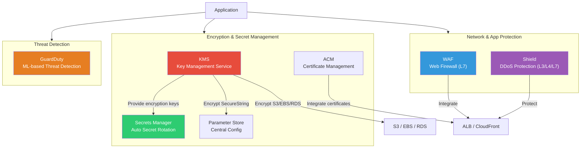
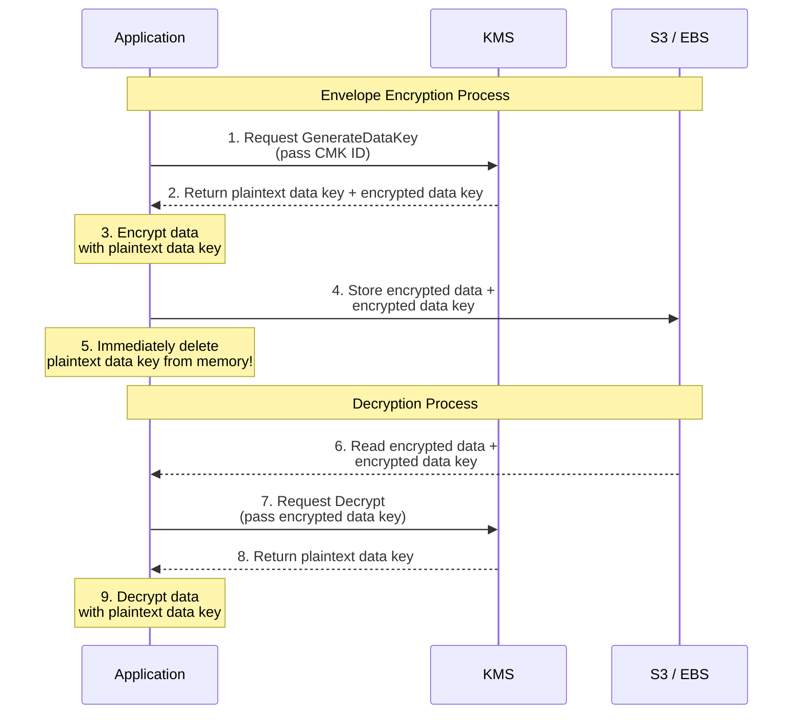
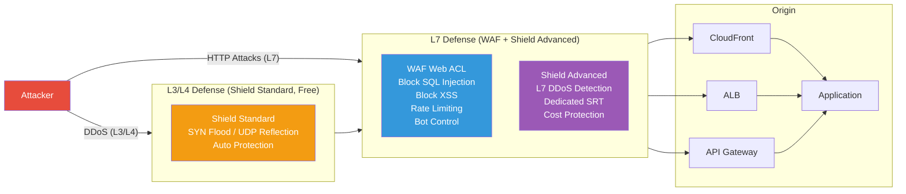
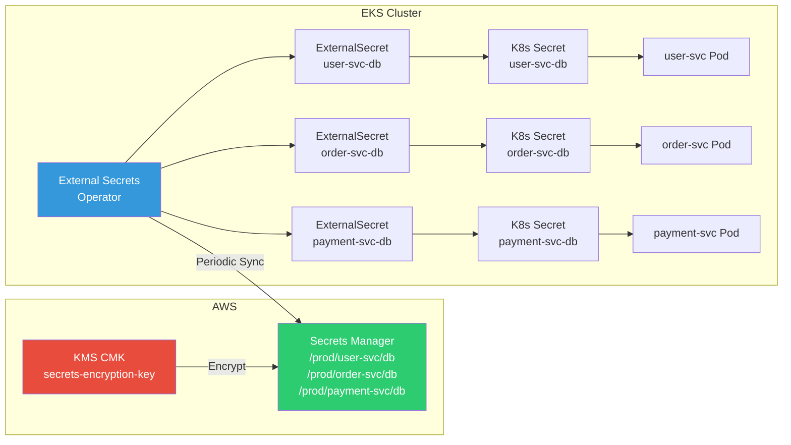

# KMS / Secrets Manager / WAF / Shield

> If [previous lectures](./06-db-operations) covered database operations, now we'll learn security services that **encrypt AWS resources, manage secrets, and protect against external attacks**. While [IAM](./01-iam) controls "who can access," this lecture covers "how to protect data and block attacks."

---

## 🎯 Why do you need to know this?

```
When security services are needed in practice:
• Data in S3/EBS/RDS needs encryption              → KMS (CMK)
• DB passwords shouldn't be hardcoded                  → Secrets Manager
• Want central config management (endpoints, flags)      → Parameter Store
• HTTPS certificates need manual renewal constantly                 → ACM (Certificate Manager)
• Must prevent SQL Injection, XSS attacks                     → WAF
• Service went down from DDoS attacks                     → Shield
• Someone mining Bitcoin on our account                → GuardDuty
• Want K8s Pods to safely fetch AWS secrets          → External Secrets + Secrets Manager
• Interview: "What is Envelope Encryption?"                     → KMS core concept
```

---

## 🧠 Core Concepts

### Analogy: Bank Security System

Let me compare AWS security services to a **bank**.

* **KMS (Key Management Service)** = Bank's **master key vault room**. Creates, stores, and rotates the master keys for opening safes. Instead of touching keys directly, you request "encrypt this document" and the vault room handles it.
* **Secrets Manager** = **Secret document storage**. Securely stores sensitive info like DB passwords and API keys, and auto-rotates passwords periodically.
* **Parameter Store** = **Office bulletin board**. Hierarchically manages general config values like URLs to encrypted secrets. Free tier available!
* **ACM** = **Certificate issuance window**. Issues SSL/TLS certificates for HTTPS for free and auto-renews them.
* **WAF (Web Application Firewall)** = Bank's **security checkpoint**. Inspects incoming people (HTTP requests) to block those with weapons (SQL Injection) or fake IDs (XSS).
* **Shield** = **Security company**. Prevents attacks where hundreds of people storm the bank simultaneously to disable operations (DDoS). Standard (free) is automatic, Premium (Advanced) includes dedicated security team.
* **GuardDuty** = **CCTV monitoring room**. 24/7 watches for suspicious activity inside the bank (abnormal API calls, crypto mining, etc.) and alerts you.

### Complete AWS Security Services Architecture



### KMS Envelope Encryption Flow

Understanding **Envelope Encryption**, KMS's core concept, is important. Instead of encrypting data directly with the master key, you create a **data key**, encrypt data with it, then encrypt the data key itself with the master key.



### WAF / Shield Defense Layers



---

## 🔍 Detailed Explanation

### 1. KMS (Key Management Service)

KMS is AWS's managed service for the symmetric/asymmetric encryption [basics](../02-networking/05-tls-certificate) we learned earlier.

#### CMK (Customer Master Key) Types

| Type | Managed By | Key Identity | Purpose | Cost |
|------|----------|---------|------|------|
| AWS managed key | AWS | `aws/s3`, `aws/ebs` etc. | Service default encryption | Free |
| Customer managed key (symmetric) | Customer | AES-256 | General encrypt/decrypt | $1/month + API |
| Customer managed key (asymmetric) | Customer | RSA, ECC | Sign/verify, external encryption | $1/month + API |
| External key (BYOK) | Customer | Bring your own | Compliance requirements | $1/month + API |

#### Creating CMK

```bash
# Create symmetric CMK (default: AES-256)
aws kms create-key \
    --description "my-app-encryption-key" \
    --key-usage ENCRYPT_DECRYPT \
    --origin AWS_KMS \
    --tags TagKey=Environment,TagValue=Production
```

```json
{
    "KeyMetadata": {
        "KeyId": "1234abcd-12ab-34cd-56ef-1234567890ab",
        "Arn": "arn:aws:kms:ap-northeast-2:123456789012:key/1234abcd-12ab-34cd-56ef-1234567890ab",
        "CreationDate": "2026-03-13T10:00:00+09:00",
        "Enabled": true,
        "Description": "my-app-encryption-key",
        "KeyUsage": "ENCRYPT_DECRYPT",
        "KeyState": "Enabled",
        "Origin": "AWS_KMS",
        "KeyManager": "CUSTOMER",
        "KeySpec": "SYMMETRIC_DEFAULT",
        "MultiRegion": false
    }
}
```

#### Setting Aliases

You can create human-readable aliases instead of key IDs.

```bash
# Create alias (alias/ prefix required)
aws kms create-alias \
    --alias-name alias/my-app-key \
    --target-key-id 1234abcd-12ab-34cd-56ef-1234567890ab
```

#### Encrypting / Decrypting Data

```bash
# Encrypt text
aws kms encrypt \
    --key-id alias/my-app-key \
    --plaintext "SuperSecretPassword123" \
    --output text \
    --query CiphertextBlob
```

```
AQICAHjK3... (Base64-encoded ciphertext)
```

```bash
# Decrypt
aws kms decrypt \
    --ciphertext-blob fileb://encrypted-data.bin \
    --output text \
    --query Plaintext | base64 --decode
```

```
SuperSecretPassword123
```

#### Auto Key Rotation

```bash
# Enable auto rotation (replace yearly)
aws kms enable-key-rotation \
    --key-id alias/my-app-key

# Check rotation status
aws kms get-key-rotation-status \
    --key-id alias/my-app-key
```

```json
{
    "KeyRotationEnabled": true
}
```

> Auto rotation only works for **customer-managed symmetric keys**. Asymmetric keys or BYOK keys need manual rotation.

#### Key Policy

Key policy is like [IAM policy](./01-iam) but is a **resource-based policy attached to the KMS key itself**.

```json
{
    "Version": "2012-10-17",
    "Statement": [
        {
            "Sid": "Key Administrator Permissions",
            "Effect": "Allow",
            "Principal": {
                "AWS": "arn:aws:iam::123456789012:role/KeyAdmin"
            },
            "Action": [
                "kms:Create*",
                "kms:Describe*",
                "kms:Enable*",
                "kms:List*",
                "kms:Put*",
                "kms:Update*",
                "kms:Revoke*",
                "kms:Disable*",
                "kms:Get*",
                "kms:Delete*",
                "kms:ScheduleKeyDeletion",
                "kms:CancelKeyDeletion"
            ],
            "Resource": "*"
        },
        {
            "Sid": "Key User Permissions",
            "Effect": "Allow",
            "Principal": {
                "AWS": "arn:aws:iam::123456789012:role/AppRole"
            },
            "Action": [
                "kms:Encrypt",
                "kms:Decrypt",
                "kms:GenerateDataKey"
            ],
            "Resource": "*"
        }
    ]
}
```

#### Grant (Temporary Permission Delegation)

Grant temporarily delegates KMS key usage permissions to another AWS service or user.

```bash
# Create grant - allow EBS service to use key
aws kms create-grant \
    --key-id alias/my-app-key \
    --grantee-principal arn:aws:iam::123456789012:role/EBSRole \
    --operations Encrypt Decrypt GenerateDataKey
```

```json
{
    "GrantToken": "AQpAM2...",
    "GrantId": "abcde1234..."
}
```

#### KMS Integration with Other Services

```bash
# Set S3 bucket default encryption to KMS
aws s3api put-bucket-encryption \
    --bucket my-secure-bucket \
    --server-side-encryption-configuration '{
        "Rules": [{
            "ApplyServerSideEncryptionByDefault": {
                "SSEAlgorithm": "aws:kms",
                "KMSMasterKeyID": "alias/my-app-key"
            },
            "BucketKeyEnabled": true
        }]
    }'

# Create EBS volume with KMS encryption
aws ec2 create-volume \
    --availability-zone ap-northeast-2a \
    --size 100 \
    --volume-type gp3 \
    --encrypted \
    --kms-key-id alias/my-app-key
```

#### aws:kms Condition Keys (for IAM Policies)

```json
{
    "Version": "2012-10-17",
    "Statement": [{
        "Effect": "Deny",
        "Action": "s3:PutObject",
        "Resource": "arn:aws:s3:::my-secure-bucket/*",
        "Condition": {
            "StringNotEquals": {
                "s3:x-amz-server-side-encryption": "aws:kms"
            }
        }
    }]
}
```

> This policy **denies** uploading objects to S3 without KMS encryption. Commonly used in practice to enforce data protection regulations.

---

### 2. Secrets Manager

Secrets Manager safely stores sensitive info like DB passwords and API keys, and **automatically rotates** them.

#### Creating Secrets

```bash
# Create RDS password secret
aws secretsmanager create-secret \
    --name prod/myapp/rds-password \
    --description "Production RDS master password" \
    --secret-string '{"username":"admin","password":"MyStr0ngP@ss!","engine":"mysql","host":"mydb.cluster-xxx.ap-northeast-2.rds.amazonaws.com","port":3306,"dbname":"myapp"}'
```

```json
{
    "ARN": "arn:aws:secretsmanager:ap-northeast-2:123456789012:secret:prod/myapp/rds-password-a1b2c3",
    "Name": "prod/myapp/rds-password",
    "VersionId": "a1b2c3d4-5678-90ab-cdef-EXAMPLE11111"
}
```

#### Retrieving Secrets

```bash
# Get secret value
aws secretsmanager get-secret-value \
    --secret-id prod/myapp/rds-password
```

```json
{
    "ARN": "arn:aws:secretsmanager:ap-northeast-2:123456789012:secret:prod/myapp/rds-password-a1b2c3",
    "Name": "prod/myapp/rds-password",
    "VersionId": "a1b2c3d4-5678-90ab-cdef-EXAMPLE11111",
    "SecretString": "{\"username\":\"admin\",\"password\":\"MyStr0ngP@ss!\",\"engine\":\"mysql\",\"host\":\"mydb.cluster-xxx.ap-northeast-2.rds.amazonaws.com\",\"port\":3306,\"dbname\":\"myapp\"}",
    "VersionStages": ["AWSCURRENT"],
    "CreatedDate": "2026-03-13T10:00:00+09:00"
}
```

#### RDS Auto Rotation Setup

Secrets Manager can **automatically rotate** RDS passwords using Lambda functions.

```bash
# Enable RDS password auto rotation (every 30 days)
aws secretsmanager rotate-secret \
    --secret-id prod/myapp/rds-password \
    --rotation-lambda-arn arn:aws:lambda:ap-northeast-2:123456789012:function:SecretsManagerRDSRotation \
    --rotation-rules '{"AutomaticallyAfterDays": 30}'
```

```json
{
    "ARN": "arn:aws:secretsmanager:ap-northeast-2:123456789012:secret:prod/myapp/rds-password-a1b2c3",
    "Name": "prod/myapp/rds-password",
    "VersionId": "b2c3d4e5-6789-01ab-cdef-EXAMPLE22222"
}
```

#### Secrets Manager vs Parameter Store Comparison

| Feature | Secrets Manager | Parameter Store (Standard) | Parameter Store (Advanced) |
|------|----------------|--------------------------|---------------------------|
| Auto Rotation | Yes (Lambda) | No | No |
| RDS Native Rotation | Yes | No | No |
| Cost | $0.40/secret/month + API calls | **Free** | $0.05/parameter/month |
| Max Size | 64KB | 4KB | 8KB |
| Encryption | Default KMS encryption | SecureString (KMS) | SecureString (KMS) |
| Version Control | Auto (AWSCURRENT/AWSPREVIOUS) | Label-based | Label-based |
| Cross-Account Access | Yes (resource policy) | No | Yes (advanced policy) |
| Main Use | DB passwords, API keys | Config values, endpoints, flags | Large parameter sets, policies |

> Use **Secrets Manager** if auto password rotation needed, **Parameter Store (free)** for simple config values.

---

### 3. Parameter Store (SSM)

Parameter Store, a feature of Systems Manager (SSM), **hierarchically** manages configuration values.

#### Creating Hierarchical Parameters

```bash
# Simple string parameter
aws ssm put-parameter \
    --name "/myapp/prod/db-endpoint" \
    --value "mydb.cluster-xxx.ap-northeast-2.rds.amazonaws.com" \
    --type String \
    --tags Key=Environment,Value=Production

# SecureString parameter (encrypted with KMS)
aws ssm put-parameter \
    --name "/myapp/prod/db-password" \
    --value "MyStr0ngP@ss!" \
    --type SecureString \
    --key-id alias/my-app-key

# Retrieve parameter
aws ssm get-parameter \
    --name "/myapp/prod/db-password" \
    --with-decryption
```

```json
{
    "Parameter": {
        "Name": "/myapp/prod/db-password",
        "Type": "SecureString",
        "Value": "MyStr0ngP@ss!",
        "Version": 1,
        "LastModifiedDate": "2026-03-13T10:00:00+09:00",
        "ARN": "arn:aws:ssm:ap-northeast-2:123456789012:parameter/myapp/prod/db-password",
        "DataType": "text"
    }
}
```

#### Retrieving Entire Hierarchy

```bash
# Get all parameters under /myapp/prod/
aws ssm get-parameters-by-path \
    --path "/myapp/prod" \
    --recursive \
    --with-decryption
```

```json
{
    "Parameters": [
        {
            "Name": "/myapp/prod/db-endpoint",
            "Type": "String",
            "Value": "mydb.cluster-xxx.ap-northeast-2.rds.amazonaws.com",
            "Version": 1
        },
        {
            "Name": "/myapp/prod/db-password",
            "Type": "SecureString",
            "Value": "MyStr0ngP@ss!",
            "Version": 1
        }
    ]
}
```

> Integrating with [K8s External Secrets](../04-kubernetes/04-config-secret) auto-syncs Parameter Store values to Kubernetes Secrets.

---

### 4. ACM (AWS Certificate Manager)

ACM automates [TLS certificate](../02-networking/05-tls-certificate) issuance and renewal. Public certificates are **free**.

#### Issuing Public Certificate (DNS Validation)

```bash
# Request certificate
aws acm request-certificate \
    --domain-name "example.com" \
    --subject-alternative-names "*.example.com" \
    --validation-method DNS \
    --tags Key=Environment,Value=Production
```

```json
{
    "CertificateArn": "arn:aws:acm:ap-northeast-2:123456789012:certificate/abcd-1234-efgh-5678"
}
```

```bash
# Check DNS validation CNAME record
aws acm describe-certificate \
    --certificate-arn arn:aws:acm:ap-northeast-2:123456789012:certificate/abcd-1234-efgh-5678 \
    --query 'Certificate.DomainValidationOptions[0].ResourceRecord'
```

```json
{
    "Name": "_abc123.example.com.",
    "Type": "CNAME",
    "Value": "_def456.acm-validations.aws."
}
```

> With Route 53, you can auto-add DNS validation records. DNS validation is better for auto renewal than email validation.

#### Connecting to ALB / CloudFront

```bash
# Attach certificate to ALB HTTPS listener
aws elbv2 create-listener \
    --load-balancer-arn arn:aws:elasticloadbalancing:ap-northeast-2:123456789012:loadbalancer/app/my-alb/1234567890 \
    --protocol HTTPS \
    --port 443 \
    --certificates CertificateArn=arn:aws:acm:ap-northeast-2:123456789012:certificate/abcd-1234-efgh-5678 \
    --default-actions Type=forward,TargetGroupArn=arn:aws:elasticloadbalancing:ap-northeast-2:123456789012:targetgroup/my-tg/1234567890
```

> Certificates for CloudFront **must be issued in us-east-1 (Virginia)** region!

---

### 5. WAF (Web Application Firewall)

WAF applies the [network firewall](../02-networking/09-network-security) concepts to **HTTP layer (L7)**.

#### Creating Web ACL (Using AWS Managed Rules)

```bash
# Create Web ACL - defend against SQL Injection + XSS
aws wafv2 create-web-acl \
    --name my-app-waf \
    --scope REGIONAL \
    --default-action Allow={} \
    --rules '[
        {
            "Name": "AWSManagedRulesCommonRuleSet",
            "Priority": 1,
            "Statement": {
                "ManagedRuleGroupStatement": {
                    "VendorName": "AWS",
                    "Name": "AWSManagedRulesCommonRuleSet"
                }
            },
            "OverrideAction": { "None": {} },
            "VisibilityConfig": {
                "SampledRequestsEnabled": true,
                "CloudWatchMetricsEnabled": true,
                "MetricName": "AWSCommonRules"
            }
        },
        {
            "Name": "AWSManagedRulesSQLiRuleSet",
            "Priority": 2,
            "Statement": {
                "ManagedRuleGroupStatement": {
                    "VendorName": "AWS",
                    "Name": "AWSManagedRulesSQLiRuleSet"
                }
            },
            "OverrideAction": { "None": {} },
            "VisibilityConfig": {
                "SampledRequestsEnabled": true,
                "CloudWatchMetricsEnabled": true,
                "MetricName": "AWSSQLiRules"
            }
        }
    ]' \
    --visibility-config SampledRequestsEnabled=true,CloudWatchMetricsEnabled=true,MetricName=my-app-waf-metric
```

```json
{
    "Summary": {
        "Name": "my-app-waf",
        "Id": "a1b2c3d4-5678-90ab-cdef-EXAMPLE11111",
        "ARN": "arn:aws:wafv2:ap-northeast-2:123456789012:regional/webacl/my-app-waf/a1b2c3d4...",
        "LockToken": "abc123..."
    }
}
```

#### Custom Rate Limiting Rule

```bash
# Block IPs with 1000+ requests in 5 minutes
aws wafv2 create-rule-group \
    --name rate-limit-rule \
    --scope REGIONAL \
    --capacity 10 \
    --rules '[
        {
            "Name": "RateLimit1000",
            "Priority": 1,
            "Action": { "Block": {} },
            "Statement": {
                "RateBasedStatement": {
                    "Limit": 1000,
                    "AggregateKeyType": "IP"
                }
            },
            "VisibilityConfig": {
                "SampledRequestsEnabled": true,
                "CloudWatchMetricsEnabled": true,
                "MetricName": "RateLimit1000"
            }
        }
    ]' \
    --visibility-config SampledRequestsEnabled=true,CloudWatchMetricsEnabled=true,MetricName=rate-limit-group
```

#### Key AWS Managed Rule Sets

| Rule Group | Defends Against | WCU |
|-----------|----------|-----|
| AWSManagedRulesCommonRuleSet | OWASP Top 10 basics | 700 |
| AWSManagedRulesSQLiRuleSet | SQL Injection | 200 |
| AWSManagedRulesKnownBadInputsRuleSet | Known vulnerability inputs | 200 |
| AWSManagedRulesAmazonIpReputationList | Malicious IPs | 25 |
| AWSManagedRulesBotControlRuleSet | Bot traffic | 50 |
| AWSManagedRulesAnonymousIpList | VPN/proxy/Tor | 50 |

> WCU (Web ACL Capacity Unit): Max **5,000 WCU** per Web ACL.

#### Connecting WAF to ALB / CloudFront / API Gateway

```bash
# Attach Web ACL to ALB
aws wafv2 associate-web-acl \
    --web-acl-arn arn:aws:wafv2:ap-northeast-2:123456789012:regional/webacl/my-app-waf/a1b2c3d4... \
    --resource-arn arn:aws:elasticloadbalancing:ap-northeast-2:123456789012:loadbalancer/app/my-alb/1234567890
```

---

### 6. Shield

#### Shield Standard vs Advanced

| Feature | Shield Standard | Shield Advanced |
|------|----------------|-----------------|
| Cost | **Free** (auto-applied) | $3,000/month + data transfer |
| Coverage | L3/L4 DDoS | L3/L4 + **L7 DDoS** |
| Detection | Automatic | Automatic + **real-time alerts** |
| Response | Automatic | Automatic + **SRT (Shield Response Team)** support |
| Cost Protection | No | Yes (refund DDoS scaling costs) |
| Visibility | Basic | **AWS Shield dashboard** |
| WAF Cost | Separate | **Included** |
| Protected Resources | All AWS | CloudFront, ALB, Route 53, Global Accelerator, EC2 EIP |

```bash
# Check Shield Advanced protected resources
aws shield list-protections
```

```json
{
    "Protections": [
        {
            "Id": "abc123",
            "Name": "my-alb-protection",
            "ResourceArn": "arn:aws:elasticloadbalancing:ap-northeast-2:123456789012:loadbalancer/app/my-alb/1234567890"
        }
    ]
}
```

> Shield Standard is **automatically applied** to all AWS accounts. No setup needed.

---

### 7. GuardDuty

GuardDuty analyzes VPC Flow Logs, DNS logs, CloudTrail events with **ML** to detect threats.

#### Enabling GuardDuty

```bash
# Enable GuardDuty detector
aws guardduty create-detector \
    --enable \
    --finding-publishing-frequency FIFTEEN_MINUTES
```

```json
{
    "DetectorId": "abc123def456"
}
```

#### Viewing Detection Findings

```bash
# List findings
aws guardduty list-findings \
    --detector-id abc123def456 \
    --finding-criteria '{
        "Criterion": {
            "severity": {
                "Gte": 7
            }
        }
    }'
```

#### Key Threat Detection Types

| Threat Type | Description | Severity |
|-----------|------|--------|
| CryptoCurrency:EC2/BitcoinTool | Crypto mining on EC2 detected | High |
| UnauthorizedAccess:IAMUser/ConsoleLoginSuccess.B | Anomalous console login | Medium |
| Recon:EC2/PortProbeUnprotectedPort | Port scanning detected | Low |
| Trojan:EC2/DriveBySourceTraffic | Malicious traffic detected | High |
| UnauthorizedAccess:EC2/RDPBruteForce | RDP brute force attack | Medium |

#### EventBridge + SNS Alert Integration

```bash
# Send SNS alert on high-severity GuardDuty findings (EventBridge rule)
aws events put-rule \
    --name guardduty-high-severity \
    --event-pattern '{
        "source": ["aws.guardduty"],
        "detail-type": ["GuardDuty Finding"],
        "detail": {
            "severity": [{ "numeric": [">=", 7] }]
        }
    }'

aws events put-targets \
    --rule guardduty-high-severity \
    --targets '[{
        "Id": "sns-target",
        "Arn": "arn:aws:sns:ap-northeast-2:123456789012:security-alerts"
    }]'
```

---

## 💻 Hands-On Labs

### Lab 1: S3 Encryption with KMS + Secrets Manager Integration

Scenario: Encrypt S3 bucket storing app data with KMS and safely store DB password in Secrets Manager.

```bash
# Step 1: Create KMS CMK
aws kms create-key \
    --description "s3-encryption-key" \
    --tags TagKey=Project,TagValue=MyApp

# From output, get KeyId and create alias
aws kms create-alias \
    --alias-name alias/myapp-s3-key \
    --target-key-id <KeyId>

# Step 2: Create S3 bucket + set KMS encryption
aws s3api create-bucket \
    --bucket myapp-secure-data-2026 \
    --region ap-northeast-2 \
    --create-bucket-configuration LocationConstraint=ap-northeast-2

aws s3api put-bucket-encryption \
    --bucket myapp-secure-data-2026 \
    --server-side-encryption-configuration '{
        "Rules": [{
            "ApplyServerSideEncryptionByDefault": {
                "SSEAlgorithm": "aws:kms",
                "KMSMasterKeyID": "alias/myapp-s3-key"
            },
            "BucketKeyEnabled": true
        }]
    }'

# Step 3: Verify encryption - upload file and check headers
echo "sensitive data" > /tmp/test.txt
aws s3 cp /tmp/test.txt s3://myapp-secure-data-2026/test.txt

aws s3api head-object \
    --bucket myapp-secure-data-2026 \
    --key test.txt
```

```json
{
    "ServerSideEncryption": "aws:kms",
    "SSEKMSKeyId": "arn:aws:kms:ap-northeast-2:123456789012:key/1234abcd-...",
    "BucketKeyEnabled": true,
    "ContentLength": 15,
    "ContentType": "text/plain"
}
```

```bash
# Step 4: Store DB password in Secrets Manager
aws secretsmanager create-secret \
    --name myapp/prod/db-credentials \
    --description "MyApp Production DB credentials" \
    --secret-string '{
        "username": "admin",
        "password": "Pr0d!SecureP@ss2026",
        "engine": "mysql",
        "host": "mydb.cluster-xxx.ap-northeast-2.rds.amazonaws.com",
        "port": 3306,
        "dbname": "myapp"
    }' \
    --kms-key-id alias/myapp-s3-key

# Step 5: Application retrieves secret (Python example in code)
aws secretsmanager get-secret-value \
    --secret-id myapp/prod/db-credentials \
    --query SecretString \
    --output text
```

```json
{"username":"admin","password":"Pr0d!SecureP@ss2026","engine":"mysql","host":"mydb.cluster-xxx.ap-northeast-2.rds.amazonaws.com","port":3306,"dbname":"myapp"}
```

---

### Lab 2: Protecting ALB with WAF

Scenario: Attach WAF to web app ALB to block SQL Injection, XSS, and excessive requests.

```bash
# Step 1: Create Web ACL (managed rules + rate limiting)
aws wafv2 create-web-acl \
    --name myapp-waf \
    --scope REGIONAL \
    --default-action Allow={} \
    --rules '[
        {
            "Name": "AWS-CommonRules",
            "Priority": 1,
            "Statement": {
                "ManagedRuleGroupStatement": {
                    "VendorName": "AWS",
                    "Name": "AWSManagedRulesCommonRuleSet"
                }
            },
            "OverrideAction": { "None": {} },
            "VisibilityConfig": {
                "SampledRequestsEnabled": true,
                "CloudWatchMetricsEnabled": true,
                "MetricName": "CommonRules"
            }
        },
        {
            "Name": "AWS-SQLiRules",
            "Priority": 2,
            "Statement": {
                "ManagedRuleGroupStatement": {
                    "VendorName": "AWS",
                    "Name": "AWSManagedRulesSQLiRuleSet"
                }
            },
            "OverrideAction": { "None": {} },
            "VisibilityConfig": {
                "SampledRequestsEnabled": true,
                "CloudWatchMetricsEnabled": true,
                "MetricName": "SQLiRules"
            }
        },
        {
            "Name": "RateLimit",
            "Priority": 3,
            "Action": { "Block": {} },
            "Statement": {
                "RateBasedStatement": {
                    "Limit": 2000,
                    "AggregateKeyType": "IP"
                }
            },
            "VisibilityConfig": {
                "SampledRequestsEnabled": true,
                "CloudWatchMetricsEnabled": true,
                "MetricName": "RateLimit"
            }
        }
    ]' \
    --visibility-config SampledRequestsEnabled=true,CloudWatchMetricsEnabled=true,MetricName=myapp-waf-metric
```

```bash
# Step 2: Attach Web ACL to ALB
aws wafv2 associate-web-acl \
    --web-acl-arn <ARN_from_above> \
    --resource-arn arn:aws:elasticloadbalancing:ap-northeast-2:123456789012:loadbalancer/app/my-alb/1234567890

# Step 3: Check blocked requests
aws wafv2 get-sampled-requests \
    --web-acl-arn <ARN_from_above> \
    --rule-metric-name SQLiRules \
    --scope REGIONAL \
    --time-window StartTime=2026-03-13T00:00:00Z,EndTime=2026-03-13T23:59:59Z \
    --max-items 10
```

```json
{
    "SampledRequests": [
        {
            "Request": {
                "ClientIP": "203.0.113.50",
                "Country": "KR",
                "URI": "/api/users?id=1 OR 1=1",
                "Method": "GET",
                "HTTPVersion": "HTTP/2.0"
            },
            "Action": "BLOCK",
            "RuleNameWithinRuleGroup": "SQLi_QUERYARGUMENTS",
            "Timestamp": "2026-03-13T14:30:00+09:00"
        }
    ],
    "PopulationSize": 1500,
    "TimeWindow": {
        "StartTime": "2026-03-13T00:00:00Z",
        "EndTime": "2026-03-13T23:59:59Z"
    }
}
```

> SQL Injection attempt like `/api/users?id=1 OR 1=1` was successfully blocked.

---

### Lab 3: GuardDuty + EventBridge Security Alert Pipeline

Scenario: Send Slack alerts when GuardDuty detects threats via EventBridge.

```bash
# Step 1: Enable GuardDuty
aws guardduty create-detector --enable

# Step 2: Create SNS topic (can forward to Slack webhook)
aws sns create-topic --name security-alerts
aws sns subscribe \
    --topic-arn arn:aws:sns:ap-northeast-2:123456789012:security-alerts \
    --protocol email \
    --notification-endpoint security-team@example.com

# Step 3: Create EventBridge rule (high severity findings)
aws events put-rule \
    --name guardduty-high-findings \
    --event-pattern '{
        "source": ["aws.guardduty"],
        "detail-type": ["GuardDuty Finding"],
        "detail": {
            "severity": [{ "numeric": [">=", 7] }]
        }
    }' \
    --description "GuardDuty high severity findings"

# Step 4: Set EventBridge target to SNS
aws events put-targets \
    --rule guardduty-high-findings \
    --targets '[{
        "Id": "security-sns",
        "Arn": "arn:aws:sns:ap-northeast-2:123456789012:security-alerts",
        "InputTransformer": {
            "InputPathsMap": {
                "severity": "$.detail.severity",
                "type": "$.detail.type",
                "description": "$.detail.description",
                "region": "$.detail.region"
            },
            "InputTemplate": "\"[GuardDuty Alert] Severity: <severity>\\nType: <type>\\nRegion: <region>\\nDescription: <description>\""
        }
    }]'

# Step 5: Create sample finding (for testing)
DETECTOR_ID=$(aws guardduty list-detectors --query 'DetectorIds[0]' --output text)
aws guardduty create-sample-findings \
    --detector-id $DETECTOR_ID \
    --finding-types "CryptoCurrency:EC2/BitcoinTool.B!DNS"
```

```
# Email notification example:
[GuardDuty Alert] Severity: 8
Type: CryptoCurrency:EC2/BitcoinTool.B!DNS
Region: ap-northeast-2
Description: EC2 instance i-0abc123 is querying a domain name associated with Bitcoin mining.
```

---

## 🏢 In Real Practice

### Scenario 1: Microservice Secret Management (EKS + External Secrets)

```
Problem: 10 microservices each use different DB passwords, but putting
         passwords in K8s ConfigMap as plaintext fails security audits.

Solution: Secrets Manager + External Secrets Operator
```



> [K8s security lecture](../04-kubernetes/15-security) covers External Secrets Operator setup in detail. See [K8s ConfigMap/Secret](../04-kubernetes/04-config-secret) too.

### Scenario 2: Multi-Layer Web Security Architecture

```
Problem: Global service gets simultaneous DDoS, bot traffic, and SQL Injection.

Solution: CloudFront + WAF + Shield Advanced combo
```

```
[User Request]
    ↓
[Route 53] ─── Shield Standard (L3/L4 DDoS auto-protection)
    ↓
[CloudFront] ─── WAF Web ACL attached
    │              ├── AWSManagedRulesCommonRuleSet (OWASP Top 10)
    │              ├── AWSManagedRulesSQLiRuleSet (SQL Injection)
    │              ├── AWSManagedRulesBotControlRuleSet (Bot blocking)
    │              ├── Rate Limiting (2000/5min per IP)
    │              └── Geographic Blocking (block specific countries)
    │
    │         ─── Shield Advanced (L7 DDoS + SRT support)
    ↓
[ALB] → [EKS / EC2]
```

Real-world tips:
- Attaching WAF to CloudFront blocks at **global edges**, reducing origin load.
- Shield Advanced's **cost protection** refunds scaling costs caused by DDoS.
- Bot Control uses many WCUs (50 WCU), apply only to necessary paths.

### Scenario 3: Compliance (Financial/Healthcare Data Encryption)

```
Problem: Regulations require encrypting customer data, rotating keys
         periodically, and auditing key usage.

Solution: KMS CMK + auto rotation + CloudTrail audit logs
```

```
Real-world setup:

1. Create KMS CMK (customer-managed)
   - Key policy: separate admin/user roles
   - Auto rotation: yearly
   - Alias: alias/compliance-data-key

2. Apply encryption to:
   - S3: SSE-KMS (enforce with aws:kms condition)
   - EBS: KMS encryption required (enforce with SCP)
   - RDS: Enable KMS encryption
   - Secrets Manager: KMS CMK encryption

3. Set up auditing:
   - CloudTrail: log KMS API calls
   - AWS Config: kms-key-rotation-enabled rule
   - GuardDuty: detect abnormal key usage

4. Enforce with SCP (Service Control Policy):
   - Block non-encrypted EBS creation
   - Block non-encrypted S3 bucket creation
```

---

## ⚠️ Common Mistakes

### 1. KMS Key Deletion Prevents Data Recovery

```
❌ Wrong: Delete KMS key immediately → all data encrypted with it is unrecoverable!
```

```bash
# This permanently deletes key after 7-30 days, losing all encrypted data
aws kms schedule-key-deletion \
    --key-id alias/my-key \
    --pending-window-in-days 7    # min 7, max 30 days
```

```
✅ Right: Disable key first → verify impact → schedule deletion with 30-day grace
```

```bash
# First disable to verify impact
aws kms disable-key --key-id alias/my-key

# Schedule deletion with ample notice (30 days)
aws kms schedule-key-deletion \
    --key-id alias/my-key \
    --pending-window-in-days 30

# Cancel if needed (during grace period)
aws kms cancel-key-deletion --key-id alias/my-key
aws kms enable-key --key-id alias/my-key
```

### 2. Not Caching Secrets Manager Values

```
❌ Wrong: Fetch from Secrets Manager on every request
         → cost increases + latency + throttling risk
```

```python
# Wrong - network call every time
def get_db_connection():
    secret = boto3.client('secretsmanager').get_secret_value(
        SecretId='prod/myapp/db-password'
    )
    password = json.loads(secret['SecretString'])['password']
    return connect(password=password)
```

```
✅ Right: Use AWS SDK caching library
```

```python
# Correct - caching applied
# pip install aws-secretsmanager-caching
from aws_secretsmanager_caching import SecretCache

cache = SecretCache()  # default 1 hour cache

def get_db_connection():
    # Fetches from cache (API call only on TTL expiry)
    secret_string = cache.get_secret_string('prod/myapp/db-password')
    password = json.loads(secret_string)['password']
    return connect(password=password)
```

### 3. WAF Block Mode Without Count Mode First

```
❌ Wrong: New WAF rule in Block mode immediately
         → blocks legitimate traffic too (false positives)
```

```
✅ Right: Count mode first → analyze logs → verify no false positives → Block mode
```

```bash
# 1. Deploy in Count mode (collect without blocking)
# Set OverrideAction to Count
"OverrideAction": { "Count": {} }

# 2. After 1-2 weeks, analyze CloudWatch for would-be blocks
aws wafv2 get-sampled-requests \
    --web-acl-arn <ACL_ARN> \
    --rule-metric-name CommonRules \
    --scope REGIONAL \
    --time-window StartTime=...,EndTime=... \
    --max-items 100

# 3. Switch to Block once false positives verified
"OverrideAction": { "None": {} }
```

### 4. ACM Certificate Region Mistake for CloudFront

```
❌ Wrong: Issue certificate in ap-northeast-2 (Seoul), use in CloudFront
         → Error! CloudFront only accepts us-east-1 certificates
```

```
✅ Right: CloudFront requires us-east-1, ALBs use local region
```

```bash
# CloudFront certificate (us-east-1 only)
aws acm request-certificate \
    --region us-east-1 \
    --domain-name "example.com" \
    --subject-alternative-names "*.example.com" \
    --validation-method DNS

# ALB certificate (ALB's region)
aws acm request-certificate \
    --region ap-northeast-2 \
    --domain-name "example.com" \
    --validation-method DNS
```

### 5. Storing Large Secrets in Parameter Store

```
❌ Wrong: Store 4KB+ data in Parameter Store Standard
         → Error! Standard limited to 4KB
```

```
✅ Right: Choose service by data size
```

```
Size selection guide:
• ≤4KB config values → Parameter Store Standard (free)
• 4-8KB config      → Parameter Store Advanced ($0.05/param/month)
• 8-64KB secrets    → Secrets Manager ($0.40/secret/month)
• >64KB             → S3 + KMS encryption
```

---

## 📝 Summary

```
Services at a Glance:

┌─────────────────┬──────────────────────────────────────────┐
│ Service         │ Core Role                                 │
├─────────────────┼──────────────────────────────────────────┤
│ KMS             │ Create/manage encryption keys, Envelope   │
│ Secrets Manager │ Store secrets + auto rotation (paid)      │
│ Parameter Store │ Central config management (free tier)     │
│ ACM             │ Issue/renew SSL/TLS certs (free)          │
│ WAF             │ L7 web firewall (SQLi, XSS, Bot)          │
│ Shield Standard │ L3/L4 DDoS defense (free, auto)           │
│ Shield Advanced │ L7 DDoS + team + cost protection ($3k)   │
│ GuardDuty       │ ML threat detection (VPC/DNS/CloudTrail)  │
└─────────────────┴──────────────────────────────────────────┘
```

**Key Points:**

1. **KMS**: Understand Envelope Encryption. 2-layer: data key encrypts data, master key encrypts data key.
2. **Secrets Manager vs Parameter Store**: Auto rotation needed? → Secrets Manager. Simple config? → Parameter Store (free).
3. **ACM**: CloudFront certificates **must be in us-east-1**.
4. **WAF**: New rules start in Count mode, analyze, then Block.
5. **Shield Standard**: Free, auto-applied. Advanced for L7 DDoS.
6. **GuardDuty**: Enable, integrate with EventBridge for alerts.

**Interview Keywords:**

```
Q: What is Envelope Encryption?
A: Encrypt data with data key, encrypt data key with master key (CMK).
   Efficient for large data, no need to re-encrypt on key rotation.

Q: Secrets Manager vs Parameter Store differences?
A: Secrets Manager has auto rotation (Lambda), RDS native rotation, paid ($0.40/secret/month).
   Parameter Store Standard is free, hierarchical, SecureString encryption, no auto rotation.

Q: WAF vs Shield difference?
A: WAF is L7 (HTTP) firewall - blocks SQLi, XSS, Bots.
   Shield is DDoS defense - Standard (free, L3/L4), Advanced (paid, L7 + team + cost protection).

Q: If KMS key is accidentally deleted?
A: Deletion has 7-30 day grace period for cancellation. After expiry,
   key is permanently deleted and all encrypted data becomes unrecoverable!
```

---

## 🔗 Next Lecture → [13-management](./13-management)

Next we'll learn AWS management services (CloudWatch, CloudTrail, AWS Config, Systems Manager). We'll see how to centrally manage logs and monitoring of these security services.
