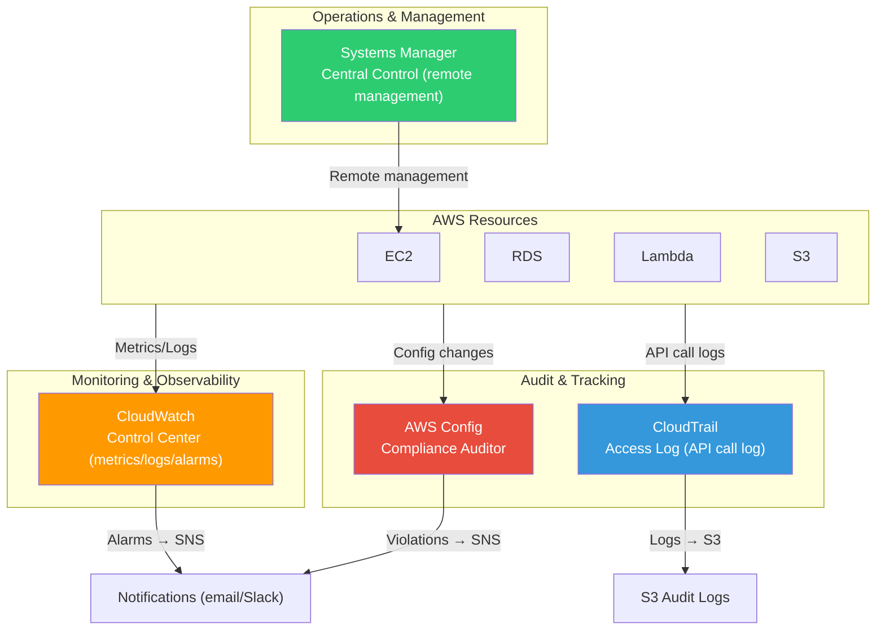
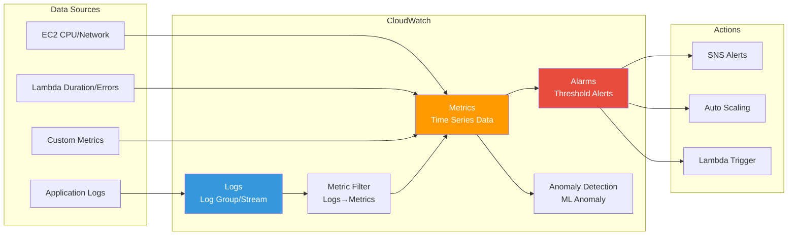
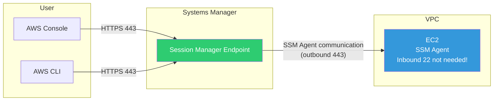
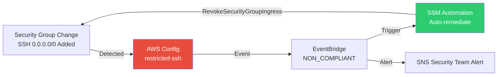

# CloudWatch / CloudTrail / SSM / Config

> In [previous lectures](./12-security), we learned AWS security services like KMS, WAF, and Shield. Now we'll learn **management services that monitor, audit, manage, and validate compliance** of all these resources. While [IAM](./01-iam) controlled "who accesses," and security services handled "how data is protected," this lecture covers **"what's happening now and what happened in the past."**

---

## 🎯 Why do you need to know this?

```
When management services are needed in practice:
• EC2 CPU hits 90% but nobody noticed                    → CloudWatch Alarm
• Need to track who changed security groups yesterday                → CloudTrail
• Must run commands on 100 servers without SSH                   → SSM Run Command
• Need to access EC2 but don't want to open port 22                 → SSM Session Manager
• Audit request: "Was S3 bucket ever public?"     → AWS Config
• Find error patterns in Lambda logs and send alerts    → CloudWatch Logs + Metric Filter
• "Do all EC2s have latest patches?"                    → SSM Patch Manager
• Interview: "Difference between CloudWatch and CloudTrail?"                   → Performance monitoring vs API audit
```

---

## 🧠 Core Concepts

### Analogy: Large Building Management System

Let me compare AWS management services to **managing a large building**.

* **CloudWatch** = Building's **control center**. Shows real-time dashboards of temperature, power usage, elevator status, and alerts when anomalies detected.
* **CloudTrail** = Building's **access log system (CCTV + entry log)**. Records who, when, and where everyone accessed. "Who opened the server room door on floor 3?" Check here.
* **Systems Manager (SSM)** = Building's **central control system**. Can remotely change all room AC temperatures or push software updates from one place. No need to visit each room.
* **AWS Config** = Building's **compliance auditor**. Auto-checks regulations like "emergency exits are unlocked" and "fire extinguishers in date," reports violations.

### Complete AWS Management Services Architecture



### CloudWatch Internal Structure



### CloudWatch vs CloudTrail Comparison

| Aspect | CloudWatch | CloudTrail |
|------|-----------|------------|
| **Analogy** | Control center dashboard | CCTV access log |
| **Target** | **Performance metrics** + logs | **API calls** |
| **Question** | "What's CPU %?" | "Who terminated the instance?" |
| **Use** | Monitoring + alarms | Audit + tracking |

---

## 🔍 Detailed Explanation

### 1. CloudWatch

CloudWatch is AWS's **core monitoring service**. While [Linux logging basics](../01-linux/08-log) covered syslog for single servers, CloudWatch **centrally manages metrics and logs across all AWS resources**.

#### Metrics

| Service | Key Metrics | Default Collection Interval |
|--------|------------|--------------|
| EC2 | CPUUtilization, NetworkIn/Out, DiskReadOps | 5 min (detailed: 1 min) |
| RDS | DatabaseConnections, FreeableMemory, ReadIOPS | 1 min |
| Lambda | Duration, Errors, Invocations, Throttles | 1 min |
| ALB | RequestCount, TargetResponseTime, HTTPCode_5XX | 1 min |

> EC2 default metrics don't include **memory usage** or **disk usage**. Install CloudWatch Agent to collect as custom metrics. Common interview question!

**Custom Metrics & High-Resolution Metrics**

```bash
# Send custom metric
aws cloudwatch put-metric-data \
    --namespace "MyApp" \
    --metric-name "ActiveUsers" \
    --value 150 \
    --unit "Count" \
    --dimensions Name=Environment,Value=Production

# 1-second resolution high-resolution metric (detect traffic spikes real-time)
aws cloudwatch put-metric-data \
    --namespace "MyApp" \
    --metric-name "TransactionsPerSecond" \
    --value 3500 \
    --unit "Count/Second" \
    --storage-resolution 1    # 1 second resolution (default: 60 seconds)
```

| Resolution | Retention | Use |
|--------|----------|------|
| 1 second (high-res) | 3 hours | Real-time spike detection |
| 60 seconds | 15 days | General monitoring |
| 5 minutes | 63 days | Trend analysis |
| 1 hour | 455 days (15 months) | Long-term trends |

#### Alarms

3 states: **OK** (normal) / **ALARM** (threshold exceeded) / **INSUFFICIENT_DATA**

```bash
# Alert when EC2 CPU exceeds 80%
aws cloudwatch put-metric-alarm \
    --alarm-name "high-cpu-alarm" \
    --alarm-description "Alert when EC2 CPU exceeds 80%" \
    --metric-name CPUUtilization \
    --namespace AWS/EC2 \
    --statistic Average \
    --period 300 \
    --threshold 80 \
    --comparison-operator GreaterThanThreshold \
    --evaluation-periods 2 \
    --alarm-actions arn:aws:sns:ap-northeast-2:123456789012:ops-alerts \
    --ok-actions arn:aws:sns:ap-northeast-2:123456789012:ops-alerts \
    --dimensions Name=InstanceId,Value=i-0abc123def456
```

```json
// aws cloudwatch describe-alarms --alarm-names "high-cpu-alarm"
{
    "MetricAlarms": [{
        "AlarmName": "high-cpu-alarm",
        "StateValue": "OK",
        "MetricName": "CPUUtilization",
        "Threshold": 80.0,
        "EvaluationPeriods": 2,
        "ComparisonOperator": "GreaterThanThreshold"
    }]
}
```

> `--evaluation-periods 2` means "alarm only if threshold exceeded 2 consecutive times (= 10 min)." Ignores momentary spikes.

**Composite Alarm**: Combine multiple alarms with AND/OR

```bash
aws cloudwatch put-composite-alarm \
    --alarm-name "critical-resource-alarm" \
    --alarm-rule 'ALARM("high-cpu-alarm") AND ALARM("high-memory-alarm")' \
    --alarm-actions arn:aws:sns:ap-northeast-2:123456789012:critical-alerts
```

#### Logs

Managed in **Log Group → Log Stream** hierarchy.

```
Log Group: /aws/lambda/my-function       ← Function/service level
  ├── Log Stream: 2026/03/13/[$LATEST]abc123   ← Instance level
  └── Log Stream: 2026/03/13/[$LATEST]def456
```

**Retention Policy** (default is never expire -- careful with costs!)

```bash
# Set retention to 30 days
aws logs put-retention-policy \
    --log-group-name /aws/lambda/my-function \
    --retention-in-days 30
```

**Log Search (filter-log-events)**

```bash
aws logs filter-log-events \
    --log-group-name /aws/lambda/my-function \
    --filter-pattern "ERROR" \
    --start-time 1710288000000 \
    --end-time 1710374400000 \
    --limit 5
```

```json
{
    "events": [
        {
            "logStreamName": "2026/03/13/[$LATEST]abc123",
            "timestamp": 1710320400000,
            "message": "[ERROR] ConnectionError: Database connection timeout after 30s"
        },
        {
            "logStreamName": "2026/03/13/[$LATEST]abc123",
            "timestamp": 1710324000000,
            "message": "[ERROR] ValueError: Invalid input parameter 'user_id'"
        }
    ]
}
```

**Logs Insights (SQL-like queries)**

```bash
aws logs start-query \
    --log-group-name /aws/lambda/my-function \
    --start-time $(date -d '1 hour ago' +%s) \
    --end-time $(date +%s) \
    --query-string '
        fields @timestamp, @message
        | filter @message like /ERROR/
        | stats count(*) as error_count by @message
        | sort error_count desc
        | limit 5
    '
```

**Subscription Filters & Metric Filters**

```bash
# Subscription filter: Stream ERROR logs to Lambda in real-time
aws logs put-subscription-filter \
    --log-group-name /aws/lambda/my-function \
    --filter-name "error-to-lambda" \
    --filter-pattern "ERROR" \
    --destination-arn arn:aws:lambda:ap-northeast-2:123456789012:function:log-processor

# Metric Filter: Convert log patterns → metrics → enable alarms
aws logs put-metric-filter \
    --log-group-name /aws/lambda/my-function \
    --filter-name "ErrorCount" \
    --filter-pattern "ERROR" \
    --metric-transformations \
        metricName=LambdaErrorCount,metricNamespace=MyApp,metricValue=1
```

> Subscription filter destinations: Lambda, Kinesis Data Streams, Kinesis Data Firehose, OpenSearch. Max **2 per Log Group**.

#### Anomaly Detection & Insights

**Anomaly Detection**: ML learns normal range (Band), detects "abnormal vs usual." Useful when fixed thresholds aren't appropriate.

**Container Insights** / **Lambda Insights**: Collect detailed performance metrics for ECS/EKS containers and Lambda. [K8s troubleshooting](../04-kubernetes/14-troubleshooting) covers Container Insights usage.

---

### 2. CloudTrail

CloudTrail is an audit service that **records all API calls** in AWS account.

#### Management Events vs Data Events

| Aspect | Management Events | Data Events |
|------|-------------------|-------------|
| **Examples** | CreateInstance, DeleteBucket | GetObject(S3), Invoke(Lambda) |
| **Default Recording** | Auto (free) | Separate activation (paid) |
| **Frequency** | Low | High |
| **Analogy** | "Install/remove door record" | "Open/close door record" |

```bash
# Create multi-region Trail
aws cloudtrail create-trail \
    --name my-org-trail \
    --s3-bucket-name my-cloudtrail-logs-bucket \
    --is-multi-region-trail \
    --enable-log-file-validation \
    --include-global-service-events

aws cloudtrail start-logging --name my-org-trail
```

```json
{
    "Name": "my-org-trail",
    "S3BucketName": "my-cloudtrail-logs-bucket",
    "IsMultiRegionTrail": true,
    "LogFileValidationEnabled": true,
    "TrailARN": "arn:aws:cloudtrail:ap-northeast-2:123456789012:trail/my-org-trail"
}
```

#### Event Lookup

```bash
# Track who terminated EC2
aws cloudtrail lookup-events \
    --lookup-attributes AttributeKey=EventName,AttributeValue=TerminateInstances \
    --max-results 3
```

```json
{
    "Events": [{
        "EventName": "TerminateInstances",
        "EventTime": "2026-03-13T14:30:00+09:00",
        "EventSource": "ec2.amazonaws.com",
        "Username": "developer@example.com",
        "Resources": [{"ResourceType": "AWS::EC2::Instance", "ResourceName": "i-0abc123def456"}]
    }]
}
```

#### Query CloudTrail Logs with Athena

Analyze logs stored in S3 with SQL.

```sql
-- Security group changes in last 7 days
SELECT eventTime, userIdentity.userName AS who, eventName AS action, sourceIPAddress
FROM cloudtrail_logs
WHERE eventName IN ('AuthorizeSecurityGroupIngress','RevokeSecurityGroupIngress',
                    'CreateSecurityGroup','DeleteSecurityGroup')
AND eventTime > date_format(date_add('day', -7, now()), '%Y-%m-%dT%H:%i:%sZ')
ORDER BY eventTime DESC;
```

#### Organization Trail & CloudTrail Lake

```bash
# Organization Trail: Records APIs from all accounts in one Trail
aws cloudtrail create-trail \
    --name org-trail \
    --s3-bucket-name org-cloudtrail-bucket \
    --is-multi-region-trail \
    --is-organization-trail \
    --enable-log-file-validation

# CloudTrail Lake: Managed data lake + SQL queries (simpler than S3+Athena, higher cost)
aws cloudtrail create-event-data-store \
    --name my-event-store \
    --retention-period 90
```

---

### 3. Systems Manager (SSM)

SSM **centrally manages** EC2 instances. Requires SSM Agent + **AmazonSSMManagedInstanceCore** IAM role.

#### Session Manager (Access EC2 Without SSH!)



```bash
aws ssm start-session --target i-0abc123def456
```

```
Starting session with SessionId: developer-0abc123def456
sh-4.2$ whoami
ssm-user
sh-4.2$ hostname
ip-10-0-1-50.ap-northeast-2.compute.internal
sh-4.2$ exit
Exiting session with sessionId: developer-0abc123def456
```

> Session Manager benefits: No SSH key management, port 22 not needed, **all sessions logged in CloudTrail**, session logs saveable to S3/CloudWatch Logs.

#### Run Command

```bash
# Execute commands on all production servers simultaneously (tag-based)
aws ssm send-command \
    --document-name "AWS-RunShellScript" \
    --targets "Key=tag:Environment,Values=Production" \
    --parameters '{"commands":["df -h","free -m","uptime"]}' \
    --comment "Check production server status"
```

```json
{
    "Command": {
        "CommandId": "cmd-0abc123def456",
        "Status": "Pending",
        "TargetCount": 15,
        "CompletedCount": 0
    }
}
```

```bash
# Check results
aws ssm get-command-invocation \
    --command-id cmd-0abc123def456 \
    --instance-id i-0abc123def456
```

```json
{
    "Status": "Success",
    "StandardOutputContent": "Filesystem  Size  Used Avail Use%\n/dev/xvda1   30G   12G   18G  40%\n\n         total  used  free\nMem:      7982  3214  4768\n\n 14:30:00 up 45 days"
}
```

#### Parameter Store (Brief)

> Details in [12-security](./12-security). Standard (free, 4KB, 10,000) vs Advanced (paid, 8KB, 100,000)

```bash
aws ssm get-parameter --name "/prod/myapp/db-endpoint" --with-decryption
```

#### Patch Manager & Automation & Inventory

```bash
# Check patch compliance status
aws ssm describe-instance-patch-states --instance-ids i-0abc123def456
```

```json
{
    "InstancePatchStates": [{
        "InstanceId": "i-0abc123def456",
        "InstalledCount": 45,
        "MissingCount": 3,
        "FailedCount": 0
    }]
}
```

```bash
# Automation: Auto-create golden AMI
aws ssm start-automation-execution \
    --document-name "AWS-CreateImage" \
    --parameters '{"InstanceId":["i-0abc123def456"],"NoReboot":["true"],"ImageName":["golden-ami-2026-03-13"]}'

# Inventory: Auto-collect installed software list
aws ssm list-inventory-entries \
    --instance-id i-0abc123def456 \
    --type-name "AWS:Application"
```

---

### 4. AWS Config

AWS Config **tracks resource configuration changes** and **auto-evaluates compliance**.

#### Enabling Config & Rules

```bash
# Create Config recorder + start
aws configservice put-configuration-recorder \
    --configuration-recorder name=default,roleARN=arn:aws:iam::123456789012:role/ConfigRole \
    --recording-group allSupported=true,includeGlobalResourceTypes=true

aws configservice put-delivery-channel \
    --delivery-channel name=default,s3BucketName=my-config-bucket

aws configservice start-configuration-recorder --configuration-recorder-name default

# Add managed rule (block S3 public read)
aws configservice put-config-rule \
    --config-rule '{
        "ConfigRuleName": "s3-bucket-public-read-prohibited",
        "Source": {"Owner":"AWS","SourceIdentifier":"S3_BUCKET_PUBLIC_READ_PROHIBITED"},
        "Scope": {"ComplianceResourceTypes":["AWS::S3::Bucket"]}
    }'
```

Commonly used managed rules:

| Rule Name | Check |
|-----------|----------|
| `s3-bucket-public-read-prohibited` | Block S3 public read |
| `encrypted-volumes` | EBS volume encryption |
| `restricted-ssh` | Block security group SSH 0.0.0.0/0 |
| `cloudtrail-enabled` | CloudTrail enabled |
| `ec2-instance-managed-by-ssm` | EC2 managed by SSM |

#### Checking Compliance Status

```bash
aws configservice describe-compliance-by-config-rule
```

```json
{
    "ComplianceByConfigRules": [
        {"ConfigRuleName": "s3-bucket-public-read-prohibited", "Compliance": {"ComplianceType": "COMPLIANT"}},
        {"ConfigRuleName": "restricted-ssh", "Compliance": {"ComplianceType": "NON_COMPLIANT"}},
        {"ConfigRuleName": "encrypted-volumes", "Compliance": {"ComplianceType": "COMPLIANT"}}
    ]
}
```

#### Resource Configuration History

```bash
aws configservice get-resource-config-history \
    --resource-type AWS::EC2::SecurityGroup \
    --resource-id sg-0abc123def456 \
    --limit 2
```

```json
{
    "configurationItems": [
        {
            "configurationItemCaptureTime": "2026-03-13T14:00:00Z",
            "configuration": "{\"ipPermissions\":[{\"fromPort\":22,\"ipRanges\":[{\"cidrIp\":\"10.0.0.0/8\"}]}]}"
        },
        {
            "configurationItemCaptureTime": "2026-03-12T10:00:00Z",
            "configuration": "{\"ipPermissions\":[{\"fromPort\":22,\"ipRanges\":[{\"cidrIp\":\"0.0.0.0/0\"}]}]}"
        }
    ]
}
```

> You can see SSH was open to 0.0.0.0/0 on Mar 12, changed to 10.0.0.0/8 on Mar 13.

#### Conformance Pack & Config + SNS Alerts

```bash
# Conformance Pack: Bundle multiple rules (CIS, PCI DSS, etc.)
aws configservice put-conformance-pack \
    --conformance-pack-name "CISBenchmark" \
    --template-s3-uri "s3://my-config-bucket/conformance-packs/cis-benchmark.yaml" \
    --delivery-s3-bucket "my-config-bucket"

# Alert on NON_COMPLIANT findings (via EventBridge)
aws events put-rule \
    --name config-noncompliant-alert \
    --event-pattern '{
        "source": ["aws.config"],
        "detail-type": ["Config Rules Compliance Change"],
        "detail": {
            "newEvaluationResult": {"complianceType": ["NON_COMPLIANT"]}
        }
    }'

aws events put-targets \
    --rule config-noncompliant-alert \
    --targets '[{"Id":"sns","Arn":"arn:aws:sns:ap-northeast-2:123456789012:config-alerts"}]'
```

---

## 💻 Hands-On Labs

### Lab 1: CloudWatch Integrated Monitoring Pipeline

Scenario: Monitor EC2 web server CPU, memory, app errors and send alerts.

```bash
# Step 1: Collect memory/disk + app logs with CloudWatch Agent
sudo /opt/aws/amazon-cloudwatch-agent/bin/amazon-cloudwatch-agent-ctl \
    -a fetch-config -m ec2 \
    -c file:/opt/aws/amazon-cloudwatch-agent/etc/config.json -s

# Step 2: CPU alarm
aws cloudwatch put-metric-alarm \
    --alarm-name "web-high-cpu" \
    --metric-name CPUUtilization --namespace AWS/EC2 \
    --statistic Average --period 300 --threshold 80 \
    --comparison-operator GreaterThanThreshold --evaluation-periods 2 \
    --alarm-actions arn:aws:sns:ap-northeast-2:123456789012:ops-alerts \
    --ok-actions arn:aws:sns:ap-northeast-2:123456789012:ops-alerts \
    --dimensions Name=InstanceId,Value=i-0abc123def456

# Step 3: Memory alarm (custom metric)
aws cloudwatch put-metric-alarm \
    --alarm-name "web-high-memory" \
    --metric-name mem_used_percent --namespace MyApp/EC2 \
    --statistic Average --period 300 --threshold 90 \
    --comparison-operator GreaterThanThreshold --evaluation-periods 2 \
    --alarm-actions arn:aws:sns:ap-northeast-2:123456789012:ops-alerts \
    --dimensions Name=InstanceId,Value=i-0abc123def456

# Step 4: Error logs → metric → alarm
aws logs put-metric-filter \
    --log-group-name /myapp/application \
    --filter-name "AppErrors" \
    --filter-pattern "[timestamp, level = ERROR, ...]" \
    --metric-transformations metricName=AppErrors,metricNamespace=MyApp,metricValue=1

aws cloudwatch put-metric-alarm \
    --alarm-name "app-error-spike" \
    --metric-name AppErrors --namespace MyApp \
    --statistic Sum --period 300 --threshold 5 \
    --comparison-operator GreaterThanThreshold --evaluation-periods 1 \
    --alarm-actions arn:aws:sns:ap-northeast-2:123456789012:ops-alerts

# Step 5: Composite alarm (CPU + memory simultaneously → critical)
aws cloudwatch put-composite-alarm \
    --alarm-name "critical-server" \
    --alarm-rule 'ALARM("web-high-cpu") AND ALARM("web-high-memory")' \
    --alarm-actions arn:aws:sns:ap-northeast-2:123456789012:critical-alerts
```

---

### Lab 2: CloudTrail Security Audit + Login Failure Alerts

Scenario: Track security group changes and send alerts on console login failures.

```bash
# Step 1: Send CloudTrail → CloudWatch Logs (for real-time detection)
aws cloudtrail update-trail \
    --name security-audit-trail \
    --cloud-watch-logs-log-group-arn arn:aws:logs:ap-northeast-2:123456789012:log-group:/aws/cloudtrail:* \
    --cloud-watch-logs-role-arn arn:aws:iam::123456789012:role/CloudTrailToCloudWatchRole

# Step 2: Console login failures → Metric Filter → Alarm
aws logs put-metric-filter \
    --log-group-name /aws/cloudtrail \
    --filter-name "ConsoleLoginFailures" \
    --filter-pattern '{ $.eventName = "ConsoleLogin" && $.errorMessage = "Failed authentication" }' \
    --metric-transformations metricName=LoginFailures,metricNamespace=Security,metricValue=1

aws cloudwatch put-metric-alarm \
    --alarm-name "console-login-failures" \
    --metric-name LoginFailures --namespace Security \
    --statistic Sum --period 300 --threshold 5 \
    --comparison-operator GreaterThanThreshold --evaluation-periods 1 \
    --alarm-actions arn:aws:sns:ap-northeast-2:123456789012:security-alerts \
    --alarm-description "5+ console login failures in 5 minutes"

# Step 3: Query security group changes with Athena
# SELECT eventTime, userIdentity.userName, eventName, sourceIPAddress
# FROM cloudtrail_logs WHERE eventName LIKE '%SecurityGroup%'
# ORDER BY eventTime DESC;
```

---

### Lab 3: SSM Patch Management + Config Compliance Automation

Scenario: Auto-apply security patches to prod EC2, monitor compliance with Config.

```bash
# Step 1: Check managed instances
aws ssm describe-instance-information \
    --filters "Key=tag:Environment,Values=Production"

# Step 2: Maintenance window (every Sunday 3 AM)
aws ssm create-maintenance-window \
    --name "prod-patch-window" \
    --schedule "cron(0 3 ? * SUN *)" \
    --duration 3 --cutoff 1 --allow-unassociated-targets
```

```json
{"WindowId": "mw-0abc123def456"}
```

```bash
# Step 3: Register patch targets + task
aws ssm register-target-with-maintenance-window \
    --window-id mw-0abc123def456 --resource-type INSTANCE \
    --targets "Key=tag:PatchGroup,Values=Production-Linux"

aws ssm register-task-with-maintenance-window \
    --window-id mw-0abc123def456 --task-type RUN_COMMAND \
    --task-arn "AWS-RunPatchBaseline" \
    --targets "Key=WindowTargetIds,Values=<target-id>" \
    --task-invocation-parameters '{"RunCommand":{"Parameters":{"Operation":["Install"]}}}' \
    --max-concurrency "50%" --max-errors "25%"

# Step 4: Monitor patch compliance with Config
aws configservice put-config-rule \
    --config-rule '{
        "ConfigRuleName": "ec2-patch-compliance",
        "Source": {"Owner":"AWS","SourceIdentifier":"EC2_MANAGEDINSTANCE_PATCH_COMPLIANCE_STATUS_CHECK"}
    }'

# Step 5: Alert on non-compliance
aws events put-rule \
    --name patch-noncompliant \
    --event-pattern '{
        "source":["aws.config"],
        "detail-type":["Config Rules Compliance Change"],
        "detail":{"configRuleName":["ec2-patch-compliance"],"newEvaluationResult":{"complianceType":["NON_COMPLIANT"]}}
    }'

aws events put-targets --rule patch-noncompliant \
    --targets '[{"Id":"ops","Arn":"arn:aws:sns:ap-northeast-2:123456789012:ops-alerts"}]'
```

---

## 🏢 In Real Practice

### Scenario 1: Microservice Central Monitoring (CloudWatch + Container Insights)

```
Problem: Running 30 microservices on EKS, can't identify
         which Pod has memory leak, which service has errors.

Solution: Container Insights + CloudWatch Dashboards + Composite Alarms

Setup:
1. Container Insights → Cluster/service/pod-level metrics
2. Per-service dashboards → team sees P99 latency, error rate, TPS
3. Alert layers → L1(team: error rate>1%), L2(SRE: composite failure), L3(admin: cluster resource shortage)
4. Log retention → dev 7 days, staging 14 days, prod 90 days
```

> [K8s troubleshooting](../04-kubernetes/14-troubleshooting) covers using Container Insights with kubectl logs.

### Scenario 2: Auto Security Incident Response (Config + SSM Automation)

```
Problem: Someone opened SSH 0.0.0.0/0 in security group, took 3 hours to discover.

Solution: Config Rule → EventBridge → SSM Automation → auto-remediate
```



```
Flow: Security group change → Config NON_COMPLIANT → EventBridge →
      SSM Automation removes rule automatically + SNS alerts security team →
      CloudTrail shows original changer → developer education
```

### Scenario 3: Multi-Account Compliance (Config Aggregator + Organization)

```
Problem: Manage S3 public block, EBS encryption, CloudTrail activation
         across 50 Organization accounts.

Solution:
1. Organization Trail → all account APIs logged to central S3
2. Config Aggregator → view compliance across all accounts in one place
3. Conformance Pack → deploy CIS Benchmark at Organization level
4. Non-compliance response → NON_COMPLIANT → EventBridge → SNS → team Slack
                           → critical violation (public S3) → SSM Automation → auto-block
```

---

## ⚠️ Common Mistakes

### 1. Not Setting CloudWatch Logs Retention

```
❌ Wrong: Leave retention default (Never Expire) → cost bomb after months
✅ Right: Set appropriate retention per environment
```

```bash
# Find log groups without retention
aws logs describe-log-groups \
    --query 'logGroups[?!retentionInDays].logGroupName'

# Batch set
for lg in $(aws logs describe-log-groups \
    --query 'logGroups[?!retentionInDays].logGroupName' --output text); do
    aws logs put-retention-policy --log-group-name "$lg" --retention-in-days 30
done
```

### 2. Enabling CloudTrail Only in Single Region

```
❌ Wrong: Trail in ap-northeast-2 only → miss IAM, CloudFront, Route 53 events!
✅ Right: Must use --is-multi-region-trail --include-global-service-events
```

> IAM, CloudFront, Route 53, STS are **global services**, events originate in us-east-1.

### 3. SSM Session Manager Access Without IAM Role

```
❌ Wrong: Install SSM Agent, forget IAM role → "TargetNotConnected"
✅ Right: Attach AmazonSSMManagedInstanceCore + check network + Agent status
```

```bash
# Check SSM managed instances
aws ssm describe-instance-information \
    --filters "Key=InstanceIds,Values=i-0abc123def456"
# If not listed: verify IAM role + network (internet or VPC endpoint) + agent status
```

### 4. Creating Config Rules Without Alerts/Remediation

```
❌ Wrong: Create 20 rules but nobody sees NON_COMPLIANT notifications
✅ Right: Config rules + EventBridge + SNS alerts (+ SSM Automation remediation)
```

### 5. Setting Alarm-Only Actions Without OK Actions

```
❌ Wrong: Alert on ALARM only → can't tell when recovered
✅ Right: Set both --alarm-actions and --ok-actions → know when issue starts/ends
```

---

## 📝 Summary

```
Services at a Glance:

┌──────────────────┬──────────────────────────────────────────────┐
│ Service          │ Core Role                                    │
├──────────────────┼──────────────────────────────────────────────┤
│ CloudWatch       │ Metric collection + log management + alarms  │
│  ├ Metrics       │ Basic/custom/high-res (1sec~5min)            │
│  ├ Logs          │ Log Group/Stream, Insights, sub-filters      │
│  ├ Alarms        │ OK/ALARM/INSUFFICIENT_DATA, composite        │
│  └ Anomaly Det.  │ ML normal range learn, anomaly detection     │
├──────────────────┼──────────────────────────────────────────────┤
│ CloudTrail       │ Log all API calls (management + data events) │
│  └ Athena/Lake   │ S3 logs SQL analysis                         │
├──────────────────┼──────────────────────────────────────────────┤
│ SSM              │ EC2 central management (no SSH!)             │
│  ├ Session Mgr   │ Port 22 not needed, session audit logging    │
│  ├ Run Command   │ Execute commands on multiple servers         │
│  └ Patch Manager │ Auto OS patch scheduling                     │
├──────────────────┼──────────────────────────────────────────────┤
│ AWS Config       │ Track config changes + auto compliance eval  │
│  ├ Rules         │ 200+ managed / custom Lambda                 │
│  └ Conformance   │ Rule bundles (CIS, PCI DSS)                 │
└──────────────────┴──────────────────────────────────────────────┘
```

**Interview Keywords:**

```
Q: Difference between CloudWatch and CloudTrail?
A: CloudWatch = performance monitoring (metrics, logs, alarms).
   CloudTrail = API audit (who did what). Completely different roles.

Q: Why can't CloudWatch see EC2 memory?
A: Memory is OS-internal metric, hypervisor can't collect.
   Install CloudWatch Agent, send as custom metric.

Q: SSM Session Manager benefits?
A: SSH key/port 22 not needed, sessions logged in CloudTrail,
   logs saveable to S3/CloudWatch, IAM-based access control.

Q: Config vs CloudTrail?
A: CloudTrail = "who called API" (action log).
   Config = "is resource config compliant" (state evaluation).
```

---

## 🔗 Next Lecture → [14-cost](./14-cost)

Next we'll learn AWS cost management services (Cost Explorer, Budgets, Savings Plans, Reserved Instances). We'll also cover setting cost alarms with CloudWatch.
