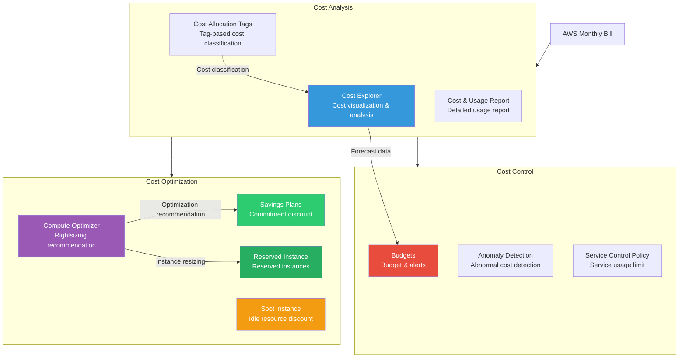
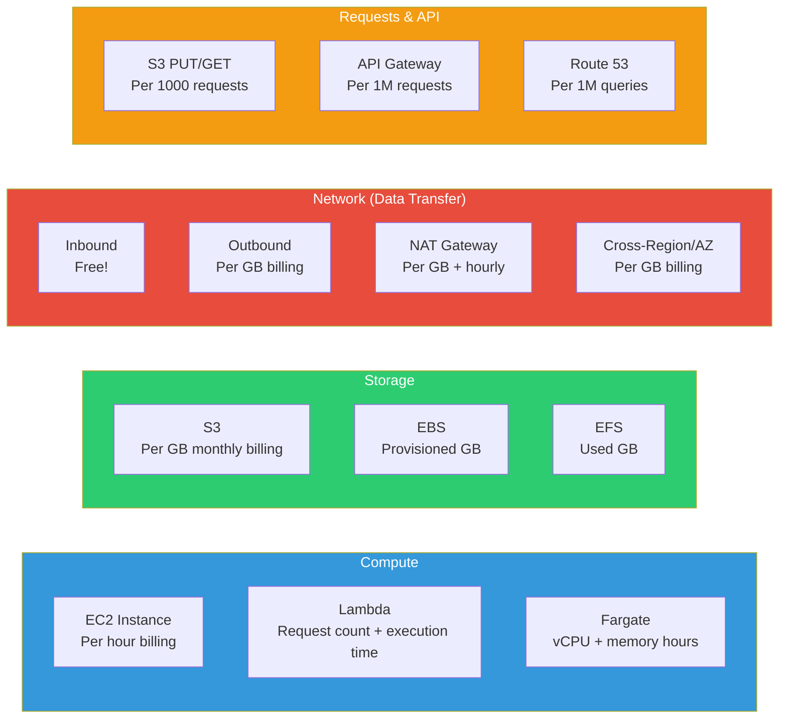
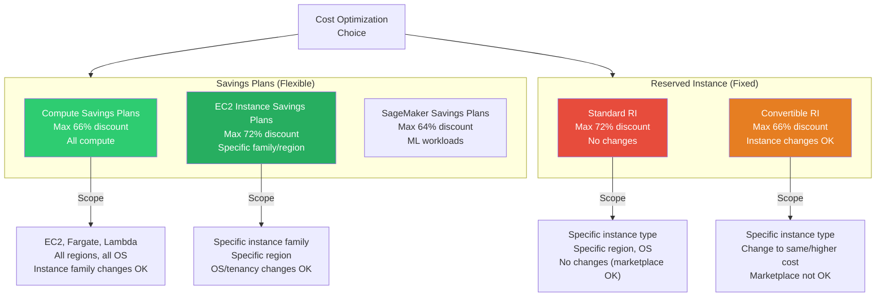

# Cost Explorer / Budgets / Savings Plans

> If [previous lectures](./13-management) covered CloudWatch, CloudTrail, and AWS management services, now it's time to talk about **money**. No matter how good an architecture is, without cost management you'll be shocked by next month's bill. This lecture teaches how to understand AWS cost structure, analyze (Cost Explorer), manage budgets (Budgets), and save costs (Savings Plans/Reserved Instances).

---

## 🎯 Why do you need to know this?

```
When cost management is needed in practice:
• "Why did AWS bill jump 2 million won this month?"         → Cost Explorer analysis
• "How much is each team spending?"                → Tag-based cost analysis
• "Alert me if monthly budget exceeds 5M won"                  → Budgets alerts
• "Development environment costs too much"                          → Auto-stop EC2 on budget exceed
• "We always use 5+ EC2s, any discount option?"         → Savings Plans / RI
• "Switched to Spot and saved 70%!"                     → Spot cost strategy
• "S3 costs grow every month"                              → Storage optimization
• "NAT Gateway costs more than EC2!"                → VPC Endpoint switch
• Interview: "Tell us about AWS cost optimization"               → This entire lecture
```

Cloud uses a "pay-as-you-go" model. But if you don't know what you're using and how much, it's like using a credit card without tracking expenses. **Cost Explorer is your expense tracker**, **Budgets is your budget limit**, **Savings Plans is a phone contract discount**.

---

## 🧠 Core Concepts

### Analogy: Expense Tracking and Phone Plans

AWS cost management is easier to understand with a **household economics** analogy.

| Real World | AWS |
|-----------|-----|
| Monthly credit card statement | AWS Bill |
| Expense tracker app | Cost Explorer |
| "Max $300 dining this month" | Budgets (cost limit) |
| Phone contract (2-year = discount) | Savings Plans |
| Annual subscription (Netflix yearly) | Reserved Instance |
| Discount store (cheap but limited stock) | Spot Instance |
| Electricity bill (base + usage) | AWS pricing (fixed + usage) |
| "Fridge uses a lot electricity?" | Resource-specific cost analysis |
| Cancel unused OTT subscriptions | Clean up idle resources |

### Complete AWS Cost Management Services Architecture



### AWS Billing Structure (4 Dimensions)

AWS costs break into **4 dimensions**. Understanding this is key to proper cost analysis and optimization.



**Key Point**: Pushing data **into** AWS (inbound) is **free**, but pulling it **out** (outbound) costs money. This is why NAT Gateway bills are higher than expected. ([VPC lecture](./02-vpc) covers this.)

### Savings Plans vs Reserved Instance Comparison



---

## 🔍 Detailed Explanation

### 1. AWS Billing Structure Details

#### Billing Units Summary

```
Service billing units:

┌─────────────────┬──────────────────────┬─────────────────────────┐
│ Service         │ Billing Unit          │ Example (Seoul Region)   │
├─────────────────┼──────────────────────┼─────────────────────────┤
│ EC2             │ Seconds (min 60sec)   │ m6i.large: $0.118/hour  │
│ EBS (gp3)       │ GB-month              │ $0.096/GB-month         │
│ S3 Standard     │ GB-month + requests   │ $0.025/GB-month         │
│ S3 GET request  │ Per 1,000             │ $0.00035/1,000          │
│ S3 PUT request  │ Per 1,000             │ $0.0045/1,000           │
│ NAT Gateway     │ Hourly + GB           │ $0.059/hour + $0.059/GB │
│ ALB             │ Hourly + LCU          │ $0.0252/hour + LCU cost │
│ Lambda          │ Requests + GB-seconds │ $0.20/1M requests       │
│ Fargate         │ vCPU-hour + GB-hour   │ $0.04656/vCPU-hour      │
│ RDS             │ Hourly + storage GB   │ db.r6g.large: $0.29/hr  │
│ Data OUT        │ GB (first 1GB free)   │ $0.126/GB (Seoul→Internet) │
│ AZ-to-AZ        │ GB (bidirectional)    │ $0.01/GB                │
└─────────────────┴──────────────────────┴─────────────────────────┘
```

> **Trap Alert**: NAT Gateway has **hourly cost + data transfer cost** dual charges. 24/7 operation = $43/month hourly + data transfer on top. See [VPC lecture](./02-vpc) for NAT Gateway config.

#### Data Transfer Cost Flow

```
Data transfer cost rules:

Internet → AWS         : Free (inbound)
AWS → Internet          : Paid ($0.09~$0.126/GB, varies by region)
Same AZ (Private IP)    : Free
AZ-to-AZ               : $0.01/GB (bidirectional, each direction charged)
Region-to-region       : $0.02/GB (bidirectional)
Same-region S3 → EC2   : Free (same region)
CloudFront → S3        : Free (origin transfer)
VPC Endpoint → S3      : Free (Gateway Endpoint)
```

### 2. Cost Explorer Details

Cost Explorer **visualizes and analyzes** AWS costs. Like an expense app showing "where you spend most" and "how much you'll spend next."

#### Key Features

```
Cost Explorer core features:

1. Cost visualization
   • Daily/monthly/annual cost graphs
   • By service, account, region, instance type, tags
   • Tag-based costs (by team, project)

2. Filters & grouping
   • Service, region, account, instance type, tags, etc.
   • Max 2 groups simultaneous

3. Forecasting
   • Based on historical data, forecast next 12 months
   • 80% / 95% confidence intervals

4. Savings Plans recommendation
   • Analyze past usage patterns → suggest optimal commitment amount
   • Calculate expected savings

5. Reserved Instance recommendation
   • Analyze utilization → recommend RI purchases
   • Coverage/utilization reports
```

### 3. Budgets Details

Budgets **sets budget limits, sends alerts on exceed, even auto-takes action**. Like "alert me when dining exceeds $300 this month."

#### Budget Types

```
4 types of budgets:

1. Cost Budget
   • "Alert if $5,000/month exceeded"
   • Can filter by service, tag, account

2. Usage Budget
   • "Alert if EC2 2,000 hours exceeded"
   • "Alert if S3 GET 100M requests exceeded"

3. RI Utilization Budget
   • "Alert if Reserved Instance utilization < 80%"
   • Avoid wasting RI purchases!

4. Savings Plans Utilization Budget
   • "Alert if SP utilization < 80%"
   • Monitor actual usage vs commitment
```

#### Alert Threshold Pattern

```
Recommended alert pattern ($5,000 monthly budget):

├─ 50% ($2,500)  → Info alert (email)         ← "Halfway there"
├─ 80% ($4,000)  → Warning alert (email+SNS)   ← "Be careful"
├─ 100% ($5,000) → Emergency alert (email+SNS) ← "Over budget!"
└─ Forecast 100% → Predictive alert             ← "Will exceed"
```

### 4. Savings Plans Details

Savings Plans work like "commit to minimum hourly spend and get discount." Similar to phone contract: "2-year commitment = 30% discount."

#### 3 Types Comparison

```
┌───────────────────────┬───────────────────────┬───────────────────────┐
│ Compute Savings Plans │ EC2 Instance SP       │ SageMaker SP          │
├───────────────────────┼───────────────────────┼───────────────────────┤
│ Max 66% discount      │ Max 72% discount      │ Max 64% discount      │
├───────────────────────┼───────────────────────┼───────────────────────┤
│ Applies to:           │ Applies to:           │ Applies to:           │
│ • EC2                 │ • EC2 Only            │ • SageMaker Only      │
│ • Fargate             │                       │                       │
│ • Lambda              │                       │                       │
├───────────────────────┼───────────────────────┼───────────────────────┤
│ Flexibility:          │ Flexibility:          │ Flexibility:          │
│ • Region change OK    │ • Region fixed        │ • Region fixed        │
│ • Family change OK    │ • Family fixed        │ • Family fixed        │
│ • OS change OK        │ • OS change OK        │ • Component changeable│
│ • Tenancy change OK   │ • Tenancy change OK   │                       │
├───────────────────────┼───────────────────────┼───────────────────────┤
│ Commitment: 1yr/3yr   │ Commitment: 1yr/3yr   │ Commitment: 1yr/3yr   │
├───────────────────────┼───────────────────────┼───────────────────────┤
│ Payment: All/Partial/ │ Payment: All/Partial/ │ Payment: All/Partial/ │
│ No Upfront           │ No Upfront           │ No Upfront           │
└───────────────────────┴───────────────────────┴───────────────────────┘

Discount by payment option (Compute SP, 3yr):
• All Upfront (full prepay)      → Max 66% discount
• Partial Upfront (50% prepay)   → Max 63% discount
• No Upfront (monthly billing)   → Max 60% discount
```

#### How Savings Plans Work

```
Commitment: $10/hour

Usage variations:
├─ Use $8/hour  → $8 discount applied, $2 wasted (under-use)
├─ Use $10/hour → $10 all discounted (perfect fit)
└─ Use $15/hour → $10 discounted, $5 at On-Demand rate (overage)
```

> **Key**: Under-committing cost isn't refunded. Analyze past usage in Cost Explorer and **conservatively commit**.

### 5. Spot Instance Cost Strategy

[EC2/Auto Scaling lecture](./03-ec2-autoscaling) covers Spot mechanics. Here's the **cost perspective**.

```
Spot Instance savings (m6i.large, Seoul):
• On-Demand: $0.118/hour × 730 hours = $86.14/month
• Spot:      $0.035/hour × 730 hours = $25.55/month (70% savings)

Running 100: Monthly savings = ($86.14 - $25.55) × 100 = $6,059/month

But Spot can be interrupted anytime:
✅ Good for: Batch jobs, CI/CD, data analysis, test env
❌ Bad for: Production APIs, databases, stateful services
```

### 6. Cost Optimization Strategies

#### Strategy 1: Tagging Policy

```
Standard required tags (example):

┌──────────┬───────────────────┬────────────────────────┐
│ Tag Key  │ Example Value     │ Purpose                 │
├──────────┼───────────────────┼────────────────────────┤
│ Team     │ backend, frontend │ Track costs by team     │
│ Env      │ prod, dev, staging│ Track costs by env      │
│ Project  │ user-service      │ Track costs by project  │
│ Owner    │ kim@example.com   │ Resource owner          │
│ CostCenter│ CC-1234          │ Department cost center  │
└──────────┴───────────────────┴────────────────────────┘
```

#### Strategy 2: Rightsizing (Compute Optimizer)

Over-provisioned instances waste money. Compute Optimizer recommends right-sizing based on utilization.

#### Strategy 3: S3 Storage Optimization

Use Intelligent-Tiering to automatically move infrequently accessed data to cheaper tiers.

```
S3 classes by cost (Seoul, GB-month):
Standard              : $0.025 (frequent access)
Intelligent-Tiering   : $0.025 (auto-classify)
Standard-IA           : $0.0138 (occasional access)
Glacier Instant       : $0.005 (archive, instant access)
Glacier Deep Archive  : $0.002 (long-term, 12hr retrieval)

→ Moving 10TB from Standard to Glacier Deep Archive:
  ($0.025 - $0.002) × 10,240 = $235.52/month savings!
```

#### Strategy 4: NAT Gateway Cost Reduction

NAT Gateway is expensive. Use VPC Endpoints instead.

```
NAT Gateway costs:
• Hourly: $0.059/hour × 730 = $43.07/month (per AZ)
• Data: $0.059/GB
• HA (2 AZ): $86.14+/month (plus data transfer)

Alternatives:
├─ S3 access → VPC Gateway Endpoint (Free!) ← Most effective
├─ DynamoDB → VPC Gateway Endpoint (Free!)
├─ ECR/CloudWatch → VPC Interface Endpoint ($0.014/hr)
└─ Dev env → NAT Instance t3.micro (~$10/month)
```

---

## 💻 Hands-On Labs

### Lab 1: Cost Explorer Analysis Dashboard

Scenario: Analyze this month's costs by service, daily, and forecast future costs.

This lab demonstrates using Cost Explorer CLI to identify cost trends, find spikes, and predict future spending.

### Lab 2: Budgets Team Budget Management + Auto-Actions

Scenario: Set dev team budget to $1,000/month, auto-block EC2 creation on exceed.

This lab shows creating cost budgets with alerts and auto-remediation policies.

### Lab 3: Savings Plans Analysis & Purchase Simulation

Scenario: Analyze current EC2 On-Demand costs and calculate Savings Plans ROI.

This lab calculates how much you can save with Savings Plans based on past usage.

---

## 🏢 In Real Practice

**Scenario 1**: Multi-team cost tracking with tag-based analysis ensures each team owns their budget.

**Scenario 2**: Cost anomaly detection using CloudWatch + Cost Explorer alerts on unusual spending patterns.

**Scenario 3**: Reserved Instance and Savings Plans ladder strategies for mixed predictable/variable workloads.

---

## ⚠️ Common Mistakes

### 1. Not Setting CloudWatch Logs Retention

```
❌ Wrong: Logs kept forever → massive bill after months
✅ Right: Set retention per environment (dev 7d, prod 30d)
```

### 2. Leaving NAT Gateway for Dev Environments

```
❌ Wrong: NAT Gateway in dev = $43+/month per AZ
✅ Right: Use NAT Instance (t3.micro) = $8/month
       Or use VPC Endpoint for AWS service access (free)
```

### 3. Buying RI for Unpredictable Workloads

```
❌ Wrong: Buy 3-year Standard RI, stop using after 6 months = sunk cost
✅ Right: Use Savings Plans (more flexible) or Spot instances
```

### 4. Not Using Savings Plans Together with Spot

```
❌ Wrong: Spot instances cost less but no commitment benefit
✅ Right: Baseline workload → Savings Plans
       Peak workload → Spot instances for additional burst capacity
```

### 5. Ignoring S3 Storage Class

```
❌ Wrong: All S3 data in Standard tier forever ($0.025/GB)
✅ Right: Intelligent-Tiering auto-moves cold data ($0.0045/GB archived)
```

---

## 📝 Summary

```
Cost Management Strategy:

1. ANALYZE (Cost Explorer)
   → Understand where money goes
   → Identify cost spikes and trends
   → Find optimization opportunities

2. CONTROL (Budgets)
   → Set limits per team/environment
   → Alert on approaching limits
   → Auto-take action on exceed

3. OPTIMIZE
   → Savings Plans for predictable workloads (66-72% discount)
   → Spot Instances for bursty/batch workloads (70% discount)
   → Rightsizing (Compute Optimizer) (10-30% savings)
   → Storage optimization (50%+ savings on cold data)

4. MONITOR (CloudWatch)
   → Cost alarms for budget exceed
   → Anomaly detection for unusual spending
   → Real-time visibility into resource usage
```

**Key Metrics to Track:**
- Cost per service
- Cost per team (via tags)
- RI/SP coverage ratio
- Commitment utilization
- Daily cost trends
- Forecasted monthly total

**Interview Talking Points:**
- Implemented tag-based cost allocation
- Achieved X% cost savings through rightsizing
- Reduced data transfer costs with VPC Endpoints
- Used Savings Plans for Y% discount on compute
- Set up cost anomaly alerts with CloudWatch

---

## 🔗 End of Core AWS Lectures

This completes the AWS architecture series covering compute, storage, networking, database, serverless, messaging, security, and management. You now have comprehensive knowledge of AWS services and best practices for building scalable, secure, cost-optimized infrastructure.

Next steps: Hands-on practice with AWS free tier, implement architectures from this course, and prepare for AWS certification exams (Solutions Architect Associate/Professional).
