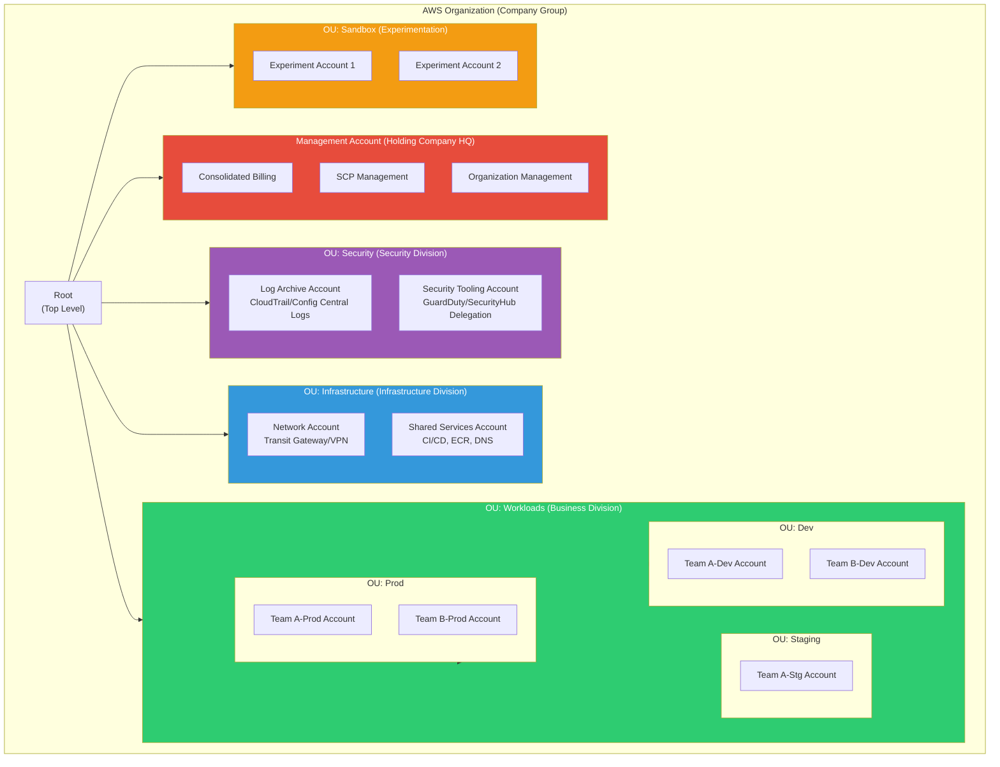
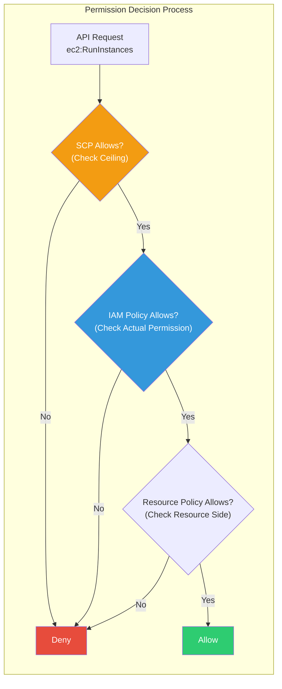
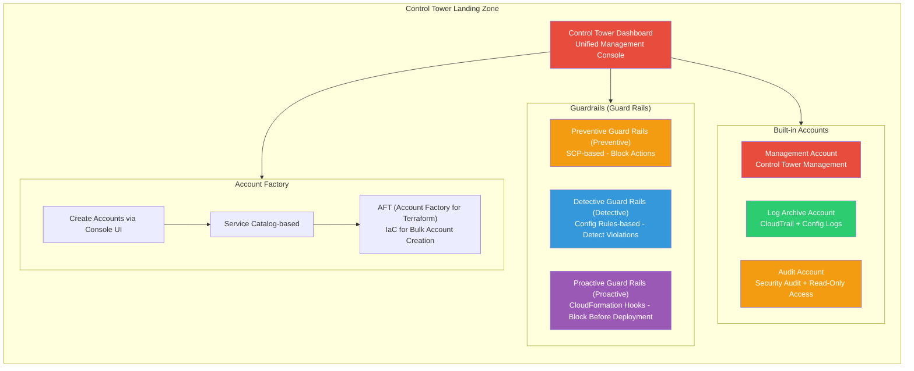
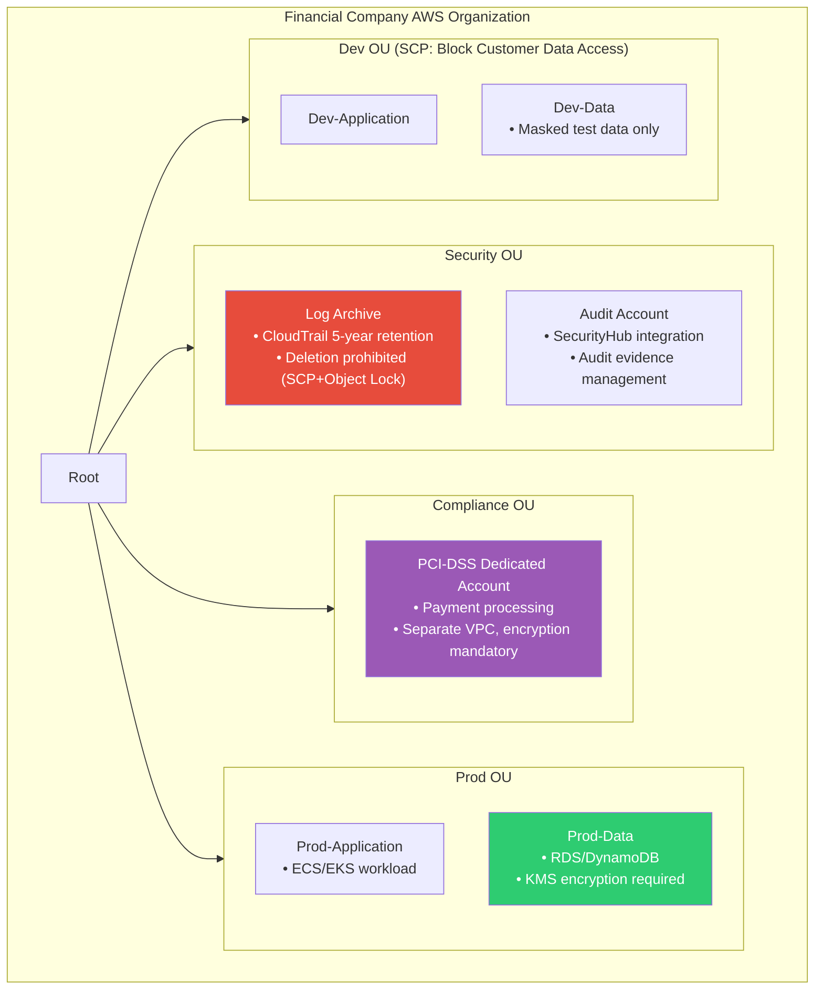

# Organizations / Control Tower

> If you've learned AWS cost optimization in [the previous lecture](./14-cost), now you'll learn about **systematically managing multiple AWS accounts and applying governance** — a multi-account strategy. Where [IAM](./01-iam) controlled "who can do what within a single account," this lecture is about "how to structure and integrate manage dozens to hundreds of accounts."

---

## 🎯 Why should you know this?

```
When you need multi-account in real work:
• I want to completely isolate dev/staging/production environments    → Organizations + OU
• I want to separate and bill AWS costs by team                      → Consolidated Billing
• I want to prohibit specific services in certain accounts            → SCP (Service Control Policy)
• It's tedious to manually set up security for each new account       → Control Tower + Account Factory
• I need to access S3 buckets or RDS in other accounts               → Cross-Account AssumeRole
• I want to collect CloudTrail logs from all accounts in one place    → Central log account
• Interview: "Why is a multi-account strategy necessary?"             → Security/cost/quota isolation
```

---

## 🧠 Core Concepts

### Analogy: Corporate Holding Company Structure

Let me compare AWS multi-account to a **large corporate holding company**.

* **Management Account (Admin Account)** = **Holding company HQ**. Creates subsidiaries (accounts), establishes company-wide policies, and manages consolidated finances (billing). It focuses on management, not directly running business operations (workloads).
* **Organization** = **Entire company group**. All subsidiaries under the holding company are bundled into one corporate group.
* **OU (Organizational Unit)** = **Business divisions/departments**. Subsidiaries are grouped by purpose, like "IT division" or "Finance division". OUs can be nested within OUs (up to 5 levels).
* **Member Account (Member Account)** = **Subsidiary**. Each is an independent legal entity (account), but must follow the holding company's policies. Has its own budget (resources) and workforce (IAM).
* **SCP (Service Control Policy)** = **Company-wide regulation compendium**. Rules like "all subsidiaries: foreign investment prohibited (block specific regions)" or "operations with annual revenue >$10M only (allow specific services)".
* **Control Tower** = **Holding company consulting team + standard manual**. When establishing a new subsidiary, it automatically applies standard setup: "accounting system like this, security like this, auditing like this."
* **Account Factory** = **Subsidiary establishment automation system**. When creating a new subsidiary, company registration, office rental, and IT infrastructure setup happen automatically — similarly, account creation automatically applies VPC/IAM/security settings.

### Organizations Complete Structure



### SCP vs IAM Policy Comparison

Many people confuse SCP and IAM Policy. The key is: **SCP is the ceiling (upper limit), IAM Policy is the floor (actual permissions)**.



```
Understanding Through Analogy:

SCP  = "No smoking in this building" (building rule - applies to everyone)
IAM  = "Allow Manager Kim access to 3rd floor conference room" (individual access permission)

→ If SCP says "No 3rd floor access", no amount of IAM permission allows 3rd floor access.
→ Even if SCP allows 3rd floor, if IAM doesn't allow it, you can't access.
→ Both must allow for access to be possible!
```

### Control Tower Landing Zone Configuration



---

## 🔍 Detailed Explanation

### 1. Why is Multi-Account Necessary?

Running with a single account is "convenient but risky."

```
Single Account Limitations:

┌──────────────────┬──────────────────────────────────────────────────┐
│ Problem           │ Description                                      │
├──────────────────┼──────────────────────────────────────────────────┤
│ Security Isolation│ Dev environment mistakes affect Prod data        │
│ Cost Tracking     │ Tags alone have limits for team/project costs    │
│ Service Quotas    │ If Dev uses 1000 Lambda concurrent execs, Prod affected │
│ Regulatory Compliance│ PCI-DSS, ISMS require environment separation   │
│ Permission Management│ IAM Policy alone makes env-level access control complex │
│ Blast Radius     │ Security incidents affect all environments         │
└──────────────────┴──────────────────────────────────────────────────┘

→ The account itself is the strongest isolation boundary!
```

### 2. Organizations Core Features

#### Account Creation and Management

```bash
# Create organization (Run in Management Account)
aws organizations create-organization --feature-set ALL
# → { "Organization": { "Id": "o-abc123def4", "FeatureSet": "ALL", ... } }

# View all accounts in current organization
aws organizations list-accounts
```

```json
{
    "Accounts": [
        { "Id": "111111111111", "Name": "Management Account", "Status": "ACTIVE", "JoinedMethod": "INVITED" },
        { "Id": "222222222222", "Name": "Dev Account", "Status": "ACTIVE", "JoinedMethod": "CREATED" },
        { "Id": "333333333333", "Name": "Prod Account", "Status": "ACTIVE", "JoinedMethod": "CREATED" }
    ]
}
```

```bash
# Create new member account (email must be unique)
aws organizations create-account \
    --email "team-a-dev@example.com" \
    --account-name "TeamA-Dev"
# → { "CreateAccountStatus": { "Id": "car-abc123def456", "State": "IN_PROGRESS" } }

# Check account creation status (usually takes a few minutes)
aws organizations describe-create-account-status \
    --create-account-request-id car-abc123def456
# → { "CreateAccountStatus": { "State": "SUCCEEDED", "AccountId": "444444444444" } }
```

#### OU (Organizational Unit) Management

```bash
# Check Root ID
aws organizations list-roots
# → { "Roots": [{ "Id": "r-abcd", "Name": "Root", "PolicyTypes": [{"Type": "SERVICE_CONTROL_POLICY", "Status": "ENABLED"}] }] }

# Create OU
aws organizations create-organizational-unit \
    --parent-id r-abcd --name "Workloads"
# → { "OrganizationalUnit": { "Id": "ou-abcd-workload1", "Name": "Workloads" } }

# Create nested OUs (Dev/Stg/Prod under Workloads)
aws organizations create-organizational-unit --parent-id ou-abcd-workload1 --name "Dev"
aws organizations create-organizational-unit --parent-id ou-abcd-workload1 --name "Staging"
aws organizations create-organizational-unit --parent-id ou-abcd-workload1 --name "Prod"

# Move account to OU
aws organizations move-account \
    --account-id 444444444444 \
    --source-parent-id r-abcd \
    --destination-parent-id ou-abcd-dev123
```

#### SCP (Service Control Policy)

SCP is a "ceiling" policy attached to OUs or accounts. It doesn't grant permissions — it **limits the maximum scope**.

```bash
# SCP Example: Allow only Seoul and Virginia regions (block other regions)
cat <<'EOF' > scp-region-restrict.json
{
    "Version": "2012-10-17",
    "Statement": [
        {
            "Sid": "DenyNonSeoulRegion",
            "Effect": "Deny",
            "Action": "*",
            "Resource": "*",
            "Condition": {
                "StringNotEquals": {
                    "aws:RequestedRegion": [
                        "ap-northeast-2",
                        "us-east-1"
                    ]
                },
                "ArnNotLike": {
                    "aws:PrincipalARN": [
                        "arn:aws:iam::*:role/OrganizationAccountAccessRole"
                    ]
                }
            }
        }
    ]
}
EOF

# Create SCP
aws organizations create-policy \
    --name "RegionRestriction" \
    --description "Allow only Seoul/Virginia regions" \
    --type SERVICE_CONTROL_POLICY \
    --content file://scp-region-restrict.json
```

```
# → { "Policy": { "PolicySummary": { "Id": "p-abc123policy", "Name": "RegionRestriction" } } }
```

```bash
# Attach SCP to OU
aws organizations attach-policy \
    --policy-id p-abc123policy \
    --target-id ou-abcd-workload1

# Check attached SCPs
aws organizations list-policies-for-target \
    --target-id ou-abcd-workload1 \
    --filter SERVICE_CONTROL_POLICY
# → FullAWSAccess (default) + RegionRestriction (just attached) both shown
```

> **Important**: SCP is not applied to Management Account! Therefore, it's best practice to not run workloads in the Management Account.

#### Consolidated Billing

When you set up Organizations, consolidated billing is automatically enabled. This connects to [the cost management lecture](./14-cost).

```
Consolidated Billing Advantages:

1. Volume Discount (Volume Discount)
   - Single account: each S3 100TB → regular rate each
   - Consolidated: total 300TB → volume discount applied!

2. Reserved Instance Sharing
   - RI purchased in Prod account also used in Dev account
   - Maximize RI utilization

3. Per-Account Cost Tracking
   - Costs automatically separated by account without tags
   - Cost Explorer supports account-level filtering
```

### 3. OU Design Patterns

Most commonly used OU structures in practice.

```
AWS Recommended OU Structure (Well-Architected based):

Root
├── Security OU           ← Dedicated security
│   ├── Log Archive       (Central logs: CloudTrail, Config, VPC Flow)
│   └── Security Tooling  (GuardDuty delegation, SecurityHub, Detective)
│
├── Infrastructure OU     ← Shared infrastructure
│   ├── Network           (Transit Gateway, VPN, Direct Connect)
│   └── Shared Services   (CI/CD, ECR, DNS, Active Directory)
│
├── Workloads OU          ← Actual services
│   ├── Dev OU
│   │   ├── TeamA-Dev
│   │   └── TeamB-Dev
│   ├── Staging OU
│   │   ├── TeamA-Stg
│   │   └── TeamB-Stg
│   └── Prod OU
│       ├── TeamA-Prod
│       └── TeamB-Prod
│
├── Sandbox OU            ← Experimentation/Learning
│   ├── Sandbox-1
│   └── Sandbox-2
│
├── Policy Staging OU     ← SCP Testing
│   └── Policy-Test
│
└── Suspended OU          ← Inactive/Departed accounts
    └── (Moved accounts)
```

```
SCP Application Example by OU:

┌────────────────────┬───────────────────────────────────────────────┐
│ OU                  │ SCP Policy                                    │
├────────────────────┼───────────────────────────────────────────────┤
│ Root               │ Region restriction (Seoul + Virginia)         │
│ Security           │ Log deletion prohibited, security service disable prohibited │
│ Sandbox            │ Block expensive services (Redshift, EMR, etc)  │
│ Prod               │ IAM User creation prohibited, Root login prohibited │
│ Suspended          │ Deny all services (separate FullAWSAccess)     │
└────────────────────┴───────────────────────────────────────────────┘
```

### 4. Control Tower Detailed

Control Tower creates a **landing zone with best practices pre-applied** on top of Organizations.

#### Guardrails (Guard Rails)

```
Guard Rail Types:

┌──────────────┬────────────────────┬──────────────────────────────────┐
│ Type          │ Implementation      │ Behavior                          │
├──────────────┼────────────────────┼──────────────────────────────────┤
│ Preventive   │ SCP                │ Block actions themselves (proactive prevention) │
│ Detective    │ AWS Config Rules   │ Detect violations, notify (post-detection) │
│ Proactive    │ CloudFormation     │ Validate resources before deployment │
│              │ Hooks              │                                   │
└──────────────┴────────────────────┴──────────────────────────────────┘

Guard Rail Levels:

• Mandatory  : Required - cannot be disabled (e.g., Log Archive account CloudTrail protection)
• Strongly    : Strongly recommended (e.g., Block MFA-less Root login)
  Recommended
• Elective   : Optional (e.g., Enforce S3 bucket versioning)
```

```bash
# Check enabled guardrails in Control Tower
aws controltower list-enabled-controls \
    --target-identifier "arn:aws:organizations::111111111111:ou/o-abc123def4/ou-abcd-workload1"
# → AWS-GR_RESTRICT_ROOT_USER_ACCESS_KEYS (ENABLED)
# → AWS-GR_ENCRYPTED_VOLUMES (ENABLED)
# → ...
```

#### Account Factory

Account Factory is a **factory pattern for creating standardized accounts**. New accounts automatically get VPC, IAM, and security settings.

```
Account Factory Includes by Default:

1. Pre-configured VPC (CIDR, subnets, NAT Gateway)
2. CloudTrail logs → Log Archive account
3. AWS Config → Log Archive account
4. GuardDuty → Security Tooling account delegation
5. IAM Identity Center SSO setup
6. Required guardrails automatically applied
```

#### AFT (Account Factory for Terraform)

For large organizations managing accounts as code, AFT is used. Commit Terraform code to Git, CodePipeline automatically creates accounts with custom settings.

```hcl
# AFT Account Request Example (account-request.tf)
module "team_c_dev" {
  source = "./modules/aft-account-request"

  control_tower_parameters = {
    AccountEmail              = "team-c-dev@example.com"
    AccountName               = "TeamC-Dev"
    ManagedOrganizationalUnit = "Workloads/Dev"  # OU Path
    SSOUserEmail              = "devops@example.com"
    SSOUserFirstName          = "DevOps"
    SSOUserLastName           = "Team"
  }

  # Custom tags per account
  account_tags = {
    Team        = "TeamC"
    Environment = "dev"
    CostCenter  = "CC-300"
  }

  # Additional customization after account creation
  account_customizations_name = "dev-baseline"
}
```

### 5. Cross-Account Access

In a multi-account environment, there are three methods to access resources across accounts.

#### Method 1: AssumeRole (Most Common)

Using AssumeRole across accounts, learned in [the IAM lecture](./01-iam).

```bash
# [Prod Account: 333333333333] Create role for Dev account read-only access
cat <<'EOF' > trust-policy.json
{
    "Version": "2012-10-17",
    "Statement": [{
        "Effect": "Allow",
        "Principal": {"AWS": "arn:aws:iam::444444444444:root"},
        "Action": "sts:AssumeRole",
        "Condition": {"StringEquals": {"sts:ExternalId": "cross-account-2026"}}
    }]
}
EOF

aws iam create-role --role-name CrossAccountReadOnly \
    --assume-role-policy-document file://trust-policy.json
aws iam attach-role-policy --role-name CrossAccountReadOnly \
    --policy-arn arn:aws:iam::aws:policy/ReadOnlyAccess

# [Dev Account: 444444444444] AssumeRole for Prod account
CREDS=$(aws sts assume-role \
    --role-arn "arn:aws:iam::333333333333:role/CrossAccountReadOnly" \
    --role-session-name "dev-to-prod-session" \
    --external-id "cross-account-2026" \
    --query 'Credentials' --output json)
# → Returns temporary AccessKeyId, SecretAccessKey, SessionToken (valid 1 hour)

export AWS_ACCESS_KEY_ID=$(echo $CREDS | jq -r '.AccessKeyId')
export AWS_SECRET_ACCESS_KEY=$(echo $CREDS | jq -r '.SecretAccessKey')
export AWS_SESSION_TOKEN=$(echo $CREDS | jq -r '.SessionToken')
aws s3 ls  # Prod account S3 buckets visible
```

#### Method 2: Resource-based Policy

For services supporting resource-based policies (S3, SQS, SNS, KMS). Instead of AssumeRole, directly specify other account principals in the resource policy.

```bash
# [Prod Account] S3 bucket policy allows Dev account specific role access
aws s3api put-bucket-policy --bucket prod-artifacts-bucket --policy '{
    "Version": "2012-10-17",
    "Statement": [{
        "Effect": "Allow",
        "Principal": {"AWS": "arn:aws:iam::444444444444:role/CICDPipeline"},
        "Action": ["s3:GetObject", "s3:ListBucket"],
        "Resource": ["arn:aws:s3:::prod-artifacts-bucket", "arn:aws:s3:::prod-artifacts-bucket/*"]
    }]
}'
```

#### Method 3: RAM (Resource Access Manager)

Used for sharing VPC subnets, Transit Gateway, Route 53 Resolver across accounts.

```bash
# Network account shares Transit Gateway with other accounts
aws ram create-resource-share \
    --name "SharedTransitGateway" \
    --resource-arns "arn:aws:ec2:ap-northeast-2:555555555555:transit-gateway/tgw-0abc123" \
    --principals "arn:aws:organizations::111111111111:ou/o-abc123def4/ou-abcd-workload1" \
    --allow-external-principals false
```

```
# → { "ResourceShare": { "Name": "SharedTransitGateway", "Status": "ACTIVE" } }
```

> If you specify an OU ARN in `--principals`, it automatically shares with all accounts in that OU. With Organizations + RAM, sharing happens immediately without invitation/acceptance.

### 6. Multi-Account Security Architecture

In practice, it's best practice to have dedicated central accounts for security, logs, and network. [Security lecture](./12-security) GuardDuty and CloudTrail integrate here.

```
Central Security Architecture:

Management Account (Organizations, SSO, Billing)
    ├── Log Archive Account: CloudTrail + Config + VPC Flow Logs (all accounts consolidated)
    ├── Security Tooling Account: GuardDuty(delegation) + SecurityHub + Detective + Inspector
    └── Network Account: Transit Gateway + VPN/Direct Connect + Route 53 + Firewall Manager
```

```bash
# Set GuardDuty delegation admin (run in Management Account)
aws guardduty enable-organization-admin-account \
    --admin-account-id 666666666666  # Security Tooling Account

# In Security Tooling Account: auto-enable GuardDuty for all member accounts
aws guardduty update-organization-configuration \
    --detector-id d-abc123 \
    --auto-enable \
    --data-sources '{
        "S3Logs": {"AutoEnable": true},
        "Kubernetes": {"AuditLogs": {"AutoEnable": true}},
        "MalwareProtection": {"ScanEc2InstanceWithFindings": {"EbsVolumes": {"AutoEnable": true}}}
    }'
```

```bash
# Create organization trail (run in Management Account)
# API calls from all member accounts → Log Archive account S3
aws cloudtrail create-trail \
    --name org-trail \
    --s3-bucket-name org-cloudtrail-logs-222222222222 \
    --is-organization-trail \
    --is-multi-region-trail \
    --enable-log-file-validation \
    --kms-key-id "arn:aws:kms:ap-northeast-2:222222222222:key/mrk-abc123"

aws cloudtrail start-logging --name org-trail
# → IsOrganizationTrail: true → Automatically applies to all member accounts!
```

---

## 💻 Hands-On Examples

### Exercise 1: Build Organizations + Apply SCP

Scenario: Create an organization, and apply SCP to the Sandbox OU to block expensive services.

```bash
# Step 1: Create organization
aws organizations create-organization --feature-set ALL

# Step 2: Create OU structure
ROOT_ID=$(aws organizations list-roots --query 'Roots[0].Id' --output text)

# Security OU
aws organizations create-organizational-unit \
    --parent-id $ROOT_ID --name "Security"

# Workloads OU + nested OUs
WORKLOADS_OU=$(aws organizations create-organizational-unit \
    --parent-id $ROOT_ID --name "Workloads" \
    --query 'OrganizationalUnit.Id' --output text)

aws organizations create-organizational-unit \
    --parent-id $WORKLOADS_OU --name "Dev"

aws organizations create-organizational-unit \
    --parent-id $WORKLOADS_OU --name "Staging"

aws organizations create-organizational-unit \
    --parent-id $WORKLOADS_OU --name "Prod"

# Sandbox OU
SANDBOX_OU=$(aws organizations create-organizational-unit \
    --parent-id $ROOT_ID --name "Sandbox" \
    --query 'OrganizationalUnit.Id' --output text)

# Step 3: Verify OU structure
aws organizations list-organizational-units-for-parent \
    --parent-id $ROOT_ID
```

```json
{
    "OrganizationalUnits": [
        {"Id": "ou-abcd-security", "Name": "Security"},
        {"Id": "ou-abcd-workload1", "Name": "Workloads"},
        {"Id": "ou-abcd-sandbox1", "Name": "Sandbox"}
    ]
}
```

```bash
# Step 4: Create SCP blocking expensive services in Sandbox OU
cat <<'EOF' > scp-sandbox-deny-expensive.json
{
    "Version": "2012-10-17",
    "Statement": [
        {
            "Sid": "DenyExpensiveServices",
            "Effect": "Deny",
            "Action": ["redshift:*", "emr:*", "sagemaker:CreateNotebookInstance"],
            "Resource": "*"
        },
        {
            "Sid": "DenyLargeEC2",
            "Effect": "Deny",
            "Action": "ec2:RunInstances",
            "Resource": "arn:aws:ec2:*:*:instance/*",
            "Condition": {
                "ForAnyValue:StringNotLike": {
                    "ec2:InstanceType": ["t3.*", "t4g.*"]
                }
            }
        }
    ]
}
EOF

SCP_ID=$(aws organizations create-policy \
    --name "SandboxCostGuard" \
    --description "Sandbox OU: Block expensive services and large instances" \
    --type SERVICE_CONTROL_POLICY \
    --content file://scp-sandbox-deny-expensive.json \
    --query 'Policy.PolicySummary.Id' --output text)

# Step 5: Attach SCP to Sandbox OU
aws organizations attach-policy --policy-id $SCP_ID --target-id $SANDBOX_OU
```

```bash
# Step 6: Validate — Try running expensive instance in Sandbox account
# (Run with Sandbox account credentials)
aws ec2 run-instances \
    --instance-type r5.4xlarge \
    --image-id ami-0c55b159cbfafe1f0 \
    --subnet-id subnet-abc123
```

```
An error occurred (AccessDeniedException) when calling the RunInstances operation:
User: arn:aws:iam::777777777777:user/developer is not authorized to perform:
ec2:RunInstances on resource: arn:aws:ec2:ap-northeast-2:777777777777:instance/*
with an explicit deny in a service control policy
```

> You can see that the `r5.4xlarge` instance creation is blocked by SCP. Since only `t3.*` instances are allowed, trying with `t3.micro` would succeed.

---

### Exercise 2: Cross-Account CI/CD Pipeline

Scenario: Set up cross-account role so CodePipeline in Shared Services account can deploy to Prod account.

```bash
# [Prod Account: 333333333333] Create deployment role

# Step 1: Trust policy — Only CodePipelineRole in Shared Services account can AssumeRole
# + Condition restricts to same Organization
cat <<'EOF' > cicd-trust-policy.json
{
    "Version": "2012-10-17",
    "Statement": [{
        "Effect": "Allow",
        "Principal": {"AWS": "arn:aws:iam::555555555555:role/CodePipelineRole"},
        "Action": "sts:AssumeRole",
        "Condition": {"StringEquals": {"aws:PrincipalOrgID": "o-abc123def4"}}
    }]
}
EOF

# Step 2: Create deployment role + minimum permissions for ECS deployment
aws iam create-role \
    --role-name CrossAccountDeployRole \
    --assume-role-policy-document file://cicd-trust-policy.json

cat <<'EOF' > deploy-permissions.json
{
    "Version": "2012-10-17",
    "Statement": [
        {
            "Effect": "Allow",
            "Action": ["ecs:UpdateService", "ecs:DescribeServices", "ecs:RegisterTaskDefinition",
                       "ecr:GetAuthorizationToken", "ecr:BatchGetImage", "ecr:GetDownloadUrlForLayer"],
            "Resource": "*"
        },
        {
            "Effect": "Allow",
            "Action": "iam:PassRole",
            "Resource": "arn:aws:iam::333333333333:role/ecsTaskExecutionRole"
        }
    ]
}
EOF

aws iam put-role-policy \
    --role-name CrossAccountDeployRole \
    --policy-name DeployPermissions \
    --policy-document file://deploy-permissions.json
```

```bash
# [Shared Services Account: 555555555555] In deployment script:

# Step 3: Switch to Prod account role
CREDS=$(aws sts assume-role \
    --role-arn "arn:aws:iam::333333333333:role/CrossAccountDeployRole" \
    --role-session-name "cicd-deploy-$(date +%s)" \
    --query 'Credentials' --output json)

export AWS_ACCESS_KEY_ID=$(echo $CREDS | jq -r '.AccessKeyId')
export AWS_SECRET_ACCESS_KEY=$(echo $CREDS | jq -r '.SecretAccessKey')
export AWS_SESSION_TOKEN=$(echo $CREDS | jq -r '.SessionToken')

# Step 4: Update ECS service in Prod account
aws ecs update-service \
    --cluster prod-cluster \
    --service api-service \
    --task-definition api-task:42 \
    --force-new-deployment
# → deployments[0].rolloutState: "IN_PROGRESS" → Deployment started!
```

> Using `aws:PrincipalOrgID` condition ensures only accounts in the same Organization can access the role. Accounts outside the Organization are blocked, enhancing security.

---

### Exercise 3: Create Account with Control Tower Account Factory

Scenario: Use Control Tower's Account Factory to create a new Dev account for a team and verify automatic security baseline application.

```bash
# Step 1: Create account through Account Factory (use Service Catalog API)
# Control Tower's Account Factory internally uses Service Catalog Product

# First, get Account Factory Product ID
PRODUCT_ID=$(aws servicecatalog search-products \
    --filters '{"FullTextSearch": ["AWS Control Tower Account Factory"]}' \
    --query 'ProductViewSummaries[0].ProductId' --output text)

# Get Provisioning Artifact (Version)
PA_ID=$(aws servicecatalog describe-product \
    --id $PRODUCT_ID \
    --query 'ProvisioningArtifacts[-1].Id' --output text)

# Step 2: Provision account
aws servicecatalog provision-product \
    --product-id $PRODUCT_ID \
    --provisioning-artifact-id $PA_ID \
    --provisioned-product-name "TeamD-Dev-Account" \
    --provisioning-parameters \
        Key=AccountName,Value="TeamD-Dev" \
        Key=AccountEmail,Value="team-d-dev@example.com" \
        Key=ManagedOrganizationalUnit,Value="Workloads/Dev" \
        Key=SSOUserEmail,Value="team-d-lead@example.com" \
        Key=SSOUserFirstName,Value="TeamD" \
        Key=SSOUserLastName,Value="Lead"
```

```
# → { "RecordDetail": { "RecordId": "rec-abc123", "Status": "IN_PROGRESS" } }
```

```bash
# Step 3: Check provisioning status (usually 20-30 minutes)
aws servicecatalog describe-record --id rec-abc123
# → Status: "SUCCEEDED", AccountId: "888888888888"
```

```bash
# Step 4: Validate created account — Check automatically applied security settings

# Verify GuardDuty auto-enabled (from Security Tooling Account)
aws guardduty list-members --detector-id d-abc123 \
    --query "Members[?AccountId=='888888888888']"
# → New account automatically registered as GuardDuty member

# Verify organization trail applied
aws cloudtrail describe-trails --query "trailList[?IsOrganizationTrail==\`true\`]"
# → org-trail automatically applied to new account

# Verify AWS Config enabled (from new account)
aws configservice describe-configuration-recorders
# → aws-controltower-BaselineConfigRecorder auto-created
```

> Accounts created with Control Tower Account Factory automatically get CloudTrail, Config, GuardDuty, and IAM Identity Center (SSO) configured. No need to manually set up each account!

---

## 🏢 In Real Work

### Scenario 1: Transition to Multi-Account as Startup Grows

```
Problem: Started with single account. Now 50 employees,
         dev/staging/prod separated only by IAM policy.
         A developer almost deleted prod data by accident.

Solution: Gradual multi-account migration
```

```
Phased Transition Strategy (Total ~9 weeks):

Phase 1 (1 week): Create Organizations + OU structure + Enable SSO
Phase 2 (2 weeks): Separate Log Archive/Security Tooling accounts + Org CloudTrail + Basic SCP
Phase 3 (4 weeks): Separate Prod/Staging accounts + Migrate resources + Cross-account CI/CD
Phase 4 (2 weeks): Strengthen SCP + Organize SSO + Set up cost alerts
              (Keep Dev in existing account → Minimize migration cost)
```

### Scenario 2: Financial Company Regulatory Compliance Multi-Account

```
Problem: ISMS-P audit noted "dev/prod logically separated only".
         Need physical separation for regulatory compliance.

Solution: Regulatory compliance-focused multi-account design
```



Key SCP: Prod (IAM User prohibited), Dev (Prod access prohibited), All (CloudTrail/Config disable prohibited), Log Archive (S3 delete/modify prohibited)

### Scenario 3: MSP Multi-Customer Account Management

```
Problem: MSP manages AWS infrastructure for 20 customers.
         Each customer needs separate account with complete isolation.
         Manual account setup takes 2 days per new customer.

Solution: Control Tower + AFT automates customer onboarding
```

```
Automated Customer Onboarding Process:

CRM Customer Registration → AFT Git PR Auto-created → DevOps Review/Merge
→ AFT Pipeline Executes (account creation + VPC + GuardDuty + SSO + cost alerts)
→ Deliver SSO login URL to customer

Total Time: 2 days (manual) → 30 minutes (AFT automated)
```

---

## ⚠️ Common Mistakes

### 1. Running Workloads in Management Account

```
❌ Wrong: Run EC2, ECS, Lambda etc. directly in Management Account
         → SCP doesn't apply, can bypass security policy
         → If management account compromised, entire organization at risk

✅ Correct: Management Account handles only Organizations/Billing/Control Tower/SSO
           Run workloads (EC2, DB, app deployment) in member accounts only
```

### 2. Confusing SCP Deny-list and Allow-list

```
❌ Wrong: Remove FullAWSAccess SCP and apply Allow-list only
         → "Anything not allowed is blocked" → Unexpected service outages!

✅ Correct: Keep FullAWSAccess and add Deny-list (block only what you don't want)
          • Deny-list (recommended): Simple and safe. Fits most organizations
          • Allow-list (advanced): Very strict. For highly regulated (finance/defense) only
```

### 3. Neglecting Account Email Management

```
❌ Wrong: Create AWS accounts with personal emails (kim@gmail.com)
         → After quitting, account access lost! Root password recovery impossible

❌ Wrong: Try using same email for multiple accounts
         → AWS requires unique email per account!
```

```
✅ Correct: Use team email + sub-addressing

# Gmail sub-addressing (+ symbol)
aws-root+management@example.com    → Management Account
aws-root+log-archive@example.com   → Log Archive
aws-root+security@example.com      → Security Tooling
aws-root+dev-team-a@example.com    → TeamA Dev
aws-root+prod-team-a@example.com   → TeamA Prod

→ All received at aws-root@example.com while meeting unique email requirement!
```

### 4. Applying New SCP to Prod OU Without Testing

```
❌ Wrong: Create new SCP and connect directly to Prod OU → Blocks essential services → Outage!

✅ Correct: Phased application
   Policy Staging OU → Sandbox → Dev → Staging → Prod (off-business hours)
   Monitor CloudTrail "AccessDenied" events at each stage!
```

```bash
# Monitor AccessDenied events after SCP application
aws cloudtrail lookup-events \
    --lookup-attributes AttributeKey=EventName,AttributeValue=RunInstances \
    --start-time "2026-03-13T00:00:00Z" \
    --end-time "2026-03-13T23:59:59Z" \
    --query 'Events[?contains(CloudTrailEvent, `AccessDenied`)]'
```

### 5. Missing ExternalId in Cross-Account Role

```
❌ Wrong: Cross-account AssumeRole trust policy without ExternalId condition
         → Vulnerable to "Confused Deputy" attack (third party hijacks role)

✅ Correct: Always include ExternalId + PrincipalOrgID conditions
```

```json
// Correct trust policy (ExternalId + Org condition)
{
    "Statement": [{
        "Effect": "Allow",
        "Principal": {"AWS": "arn:aws:iam::444444444444:root"},
        "Action": "sts:AssumeRole",
        "Condition": {"StringEquals": {
            "sts:ExternalId": "unique-secret-id-2026",
            "aws:PrincipalOrgID": "o-abc123def4"
        }}
    }]
}
```

```
• ExternalId: Prevent "Confused Deputy" attack
• PrincipalOrgID: Allow access only from same Organization accounts
• Minimum permissions: Specify role instead of root as Principal
```

---

## 📝 Summary

```
Service Overview at a Glance:

┌────────────────────┬───────────────────────────────────────────────────┐
│ Service/Concept     │ Core Role                                          │
├────────────────────┼───────────────────────────────────────────────────┤
│ Organizations      │ Multi-account structure, OU organization, consolidated billing │
│ SCP                │ Account/OU permission ceiling (upper limit), takes precedence over IAM │
│ OU                 │ Group accounts by purpose (environment/team/security/workload) │
│ Control Tower      │ Auto-configure landing zone with best practices      │
│ Guardrails         │ Preventive (SCP)/Detective (Config)/Proactive (CFN Hooks) │
│ Account Factory    │ Standardized account auto-creation (Service Catalog)  │
│ AFT                │ Terraform-based bulk account creation/management (IaC) │
│ AssumeRole         │ Cross-account temporary credentials (most common)     │
│ RAM                │ Share VPC subnets, TGW resources within organization │
│ Consolidated Billing│ Volume discounts, RI sharing, per-account cost tracking │
└────────────────────┴───────────────────────────────────────────────────┘
```

**Key Points:**

1. **Account = Strongest Isolation Boundary**: The account itself is more effective than VPC or IAM for reducing blast radius.
2. **SCP is Ceiling, IAM is Floor**: If SCP denies, even IAM allow won't work. SCP doesn't apply to Management Account, so avoid running workloads there.
3. **OU Design is Critical**: Environment-based (Dev/Stg/Prod) + Function-based (Security/Infra) combination is most common.
4. **Control Tower**: For multi-account beginners, start with Control Tower. Much faster to apply best practices than raw Organizations.
5. **Cross-Account Access**: Always use AssumeRole + ExternalId + PrincipalOrgID conditions.
6. **Central Security Account**: Delegate GuardDuty, SecurityHub, CloudTrail management to central account.

**Interview Keywords:**

```
Q: Why is multi-account necessary?
A: Security isolation (reduce blast radius), cost separation (account-level tracking),
   service quota isolation, regulatory compliance (environment separation requirement),
   simplified permission management. Account is strongest isolation boundary.

Q: SCP vs IAM Policy difference?
A: SCP is organization/OU/account-level permission "ceiling". IAM Policy is
   individual user/role "actual permission". SCP Deny takes precedence over IAM Allow.
   SCP doesn't apply to Management Account.

Q: What is Control Tower Landing Zone?
A: Multi-account environment with pre-applied best practices. Auto-creates
   Log Archive/Audit accounts, applies guardrails (preventive+detective),
   Account Factory for standardized account creation. Faster and safer
   than configuring Organizations manually.

Q: Confused Deputy problem and solution?
A: Attack where third party hijacks cross-account role. Prevent by using
   ExternalId condition + aws:PrincipalOrgID condition in trust policy.
   Specify specific roles as Principal instead of root.
```

---

## 🔗 Next Lecture → [16-well-architected](./16-well-architected)

Next lecture covers AWS Well-Architected Framework. While this multi-account strategy is the foundation for security and operational excellence, the framework evaluates architecture comprehensively through 6 pillars: operational excellence, security, reliability, performance efficiency, cost optimization, and sustainability. You'll understand how multi-account strategy fits as a core element of the security pillar.
