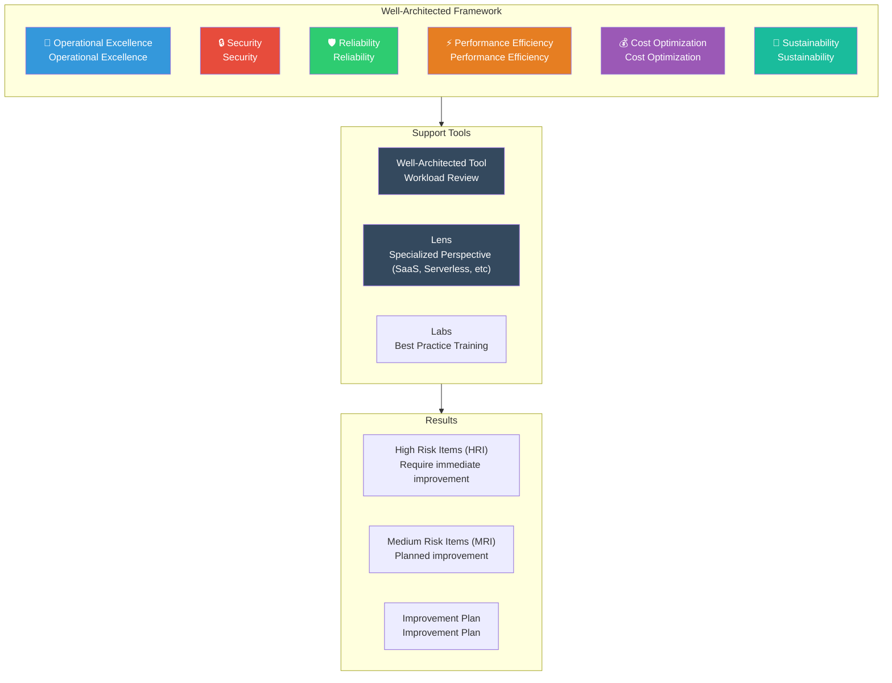
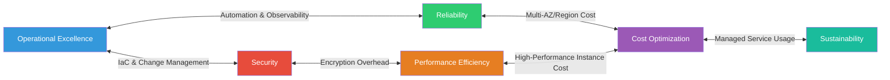
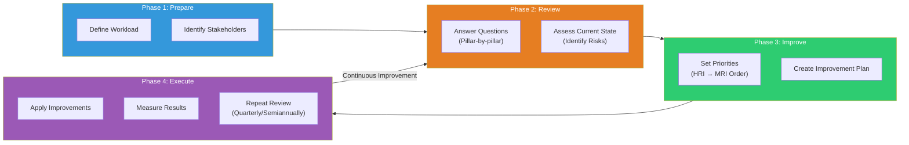

# Well-Architected Framework 6 Pillars

> If you've learned cost optimization in [the previous lecture](./14-cost), now you'll learn **comprehensive framework for evaluating architecture from 6 perspectives**. Cost is just one of 6 pillars, and you must consider security, reliability, performance, operations, and sustainability to create truly "well-designed" architecture.

---

## 🎯 Why should you know this?

```
When you need Well-Architected in real work:
• Reviewing new service architecture before launch                → Well-Architected Review
• Service keeps failing but can't find root cause                → Check Reliability Pillar
• Audit asks "Do you have systematic review process?"           → Well-Architected Tool
• Monthly costs keep rising, unsure what's wrong                 → Check Cost Optimization Pillar
• Service got slow, unclear where to improve                     → Check Performance Efficiency Pillar
• Company needs cloud carbon emissions for ESG report            → Check Sustainability Pillar
• Interview: "Explain Well-Architected Framework"               → Understand 6 Pillars
• Required scope for Solutions Architect certification           → Learn design principles + best practices
```

---

## 🧠 Core Concepts

### Analogy: Building Construction Design and Safety Inspection

Let me compare AWS Well-Architected Framework to **building construction**.

Your company is building a high-rise building. Good design isn't just about aesthetics. You need to check it against **multiple perspectives**: building codes, fire safety codes, energy efficiency standards, sustainability regulations, etc. — you must validate the design from multiple angles to ensure safety and efficiency.

| Building Construction | AWS Well-Architected |
|-----------|----------------------|
| Architectural design blueprint | Architecture design document |
| Building codes, safety standards | Well-Architected Framework (6 Pillars) |
| Operations manual (fire drills, equipment maintenance) | **Operational Excellence** |
| Access control, security system, CCTV | **Security** |
| Earthquake-resistant design, backup generator, sprinkler system | **Reliability** |
| Elevator speed, AC capacity, traffic flow design | **Performance Efficiency** |
| Energy cost optimization, LED lighting, solar power | **Cost Optimization** |
| Carbon-neutral certification, eco-friendly materials, recycling | **Sustainability** |
| Regular safety inspection (annual comprehensive check) | **Well-Architected Review** |
| Specialized inspections (food hygiene, medical facility) | **Well-Architected Lens** |

### Well-Architected Framework Complete Structure



### 6 Pillars Interdependence

The 6 pillars are not independent. Decisions in one pillar affect others. For example, strengthening security can reduce performance, increasing reliability raises costs. **Understanding trade-offs and balancing** is key.



### Well-Architected Review Process



---

## 🔍 Detailed Explanation

### Pillar 1: Operational Excellence

> "How can we run systems well and continuously improve processes?"

Operational excellence is the **operations manual** for buildings. When are fire drills? What's the equipment maintenance schedule? Who does what in emergencies? — these must be well-organized.

**Design Principles:**

| Principle | Explanation | AWS Service/Method |
|------|------|-----------------|
| Operate via code (IaC) | Manage infrastructure as code, not manual | CloudFormation, Terraform, CDK |
| Frequent, small changes | Change frequently in small increments, not big once | CodePipeline, CodeDeploy, canary deployment |
| Improve operational procedures | Create and automate runbooks and playbooks | Systems Manager Automation |
| Anticipate failure | Assume "failures will happen" not "if they happen" | GameDay, failure simulations |
| Learn from all failures | Don't repeat failures through post-mortems | Incident reports, improvement tracking |
| Ensure observability | Always able to understand system internal state | CloudWatch, X-Ray, OpenTelemetry |

> [Management Services lecture](./13-management) covered CloudWatch, CloudTrail, and Systems Manager in detail.

**Core Services:**

```
AWS Services for Operational Excellence:
• CloudWatch       → Metrics, logs, alarms, dashboards
• CloudTrail       → API call history tracking (who did what when)
• X-Ray            → Distributed tracing (microservice call flow)
• Systems Manager  → Runbook automation, patch management, parameter store
• Config           → Resource configuration change history, compliance verification
• EventBridge      → Event-driven automation (detect issues → auto-fix)
```

---

### Pillar 2: Security

> "How can we protect data, systems, and assets?"

Security is the **access control, security system, CCTV** of buildings. Who can enter, where are important documents stored, are there suspicious people? — security at every layer.

**Design Principles:**

| Principle | Explanation | AWS Service/Method |
|------|------|-----------------|
| Least privilege principle | Grant only necessary permissions for necessary duration | IAM Policy, SCP, Permission Boundary |
| Traceability | Record and track all actions | CloudTrail, VPC Flow Logs, GuardDuty |
| Apply security at every layer | Network, servers, apps, data — don't skip any layer | SG, NACL, WAF, KMS, Shield |
| Automate security | Systems do security checks, not people | Config Rules, Security Hub, Inspector |
| Data protection in transit and at rest | Encrypt data when moving and when stored | KMS, ACM, S3 SSE, EBS encryption |
| Prepare for security incidents | Have incident response procedures ready | Incident response runbook, forensics environment |

> [IAM lecture](./01-iam) covered basic access control; [Security lecture](./12-security) detailed KMS, WAF, Shield, GuardDuty.

**Defense-in-Depth Security Layer Model:**

```
┌─────────────────────────────────────────────────┐
│ Edge Layer      │ CloudFront + WAF + Shield (DDoS) │
├─────────────────┼───────────────────────────────┤
│ Network Layer   │ VPC, Subnet, NACL, Security Group │
├─────────────────┼───────────────────────────────┤
│ Compute Layer   │ EC2 security patches, Inspector, SSM │
├─────────────────┼───────────────────────────────┤
│ Application     │ WAF rules, authentication, input validation │
├─────────────────┼───────────────────────────────┤
│ Data Layer      │ KMS encryption, S3 bucket policy, RDS TDE │
├─────────────────┼───────────────────────────────┤
│ Identity        │ IAM, MFA, SSO, SCP             │
├─────────────────┼───────────────────────────────┤
│ Detection       │ GuardDuty, Security Hub, Config │
└─────────────────┴───────────────────────────────┘
```

---

### Pillar 3: Reliability

> "How can we ensure service operates normally even during failures?"

Reliability is **earthquake-resistant design, backup generator, sprinkler system**. Building doesn't collapse in earthquake, keeps running during power outage, auto-activates during fire.

**Design Principles:**

| Principle | Explanation | AWS Service/Method |
|------|------|-----------------|
| Automatic failure recovery | Detect failures and auto-recover | Auto Scaling, Route 53 Health Check |
| Test recovery procedures | Actually cause failures and verify recovery | Chaos Engineering (FIS) |
| Scale horizontally | Multiple small servers instead of one large | ELB + ASG, DynamoDB |
| Stop guessing capacity | Automatically adjust, don't pre-determine | Auto Scaling, Lambda |
| Automate change management | Manage infrastructure changes via code and auto-deploy | CloudFormation, CodePipeline |

> [VPC lecture](./02-vpc) covered Multi-AZ network design; [EC2/Auto Scaling lecture](./03-ec2-autoscaling) covered auto-scaling.

**Core Concept: RTO and RPO**

```
RPO (Recovery Point Objective) = Data loss tolerance
  "How much data (from how far back) is acceptable to lose?"

RTO (Recovery Time Objective) = Service recovery target time
  "Maximum time to recover service after failure?"

                    RPO                    RTO
    ◄────────────────┤────────────────────►
                     │
    Last Backup    Failure Occurs         Service Recovered
    ──────●──────────●──────────────────────●──────
         ▲                                  ▲
    Data in this period                Recovery must
    can be lost                        complete by here

Strategy Comparison by RTO/RPO:
┌──────────────────┬──────────┬──────────┬──────────┐
│ Strategy          │ RTO      │ RPO      │ Cost     │
├──────────────────┼──────────┼──────────┼──────────┤
│ Backup & Restore │ Hours-Days│ Hours-Days│ $        │
│ Pilot Light      │ 10min-1hr│ Minutes-Sec│ $$       │
│ Warm Standby     │ Minutes  │ Seconds  │ $$$      │
│ Multi-Site Active│ 0 seconds│ 0        │ $$$$     │
└──────────────────┴──────────┴──────────┴──────────┘
```

---

### Pillar 4: Performance Efficiency

> "How can we efficiently use resources and deliver optimal performance?"

Performance efficiency is **elevator speed, AC capacity, traffic flow design**. Fast elevators, sufficient AC, optimized pathways mean users are not inconvenienced even with crowds.

**Design Principles:**

| Principle | Explanation | AWS Service/Method |
|------|------|-----------------|
| Select appropriate resources | Choose services and types matching workload | EC2 types, RDS engines, serverless |
| Use global services | Place resources near users | CloudFront, Global Accelerator, Edge |
| Prefer managed services | Use AWS managed over running yourself | Aurora, DynamoDB, Lambda, ECS Fargate |
| Continuously monitor | Measure performance metrics and find bottlenecks | CloudWatch, X-Ray, Compute Optimizer |
| Adopt latest technology | New services/features may be more efficient | Graviton, Lambda SnapStart etc |
| Understand trade-offs | Consistency vs latency, cost vs performance | Caching strategies, read replicas |

> [EC2/Auto Scaling lecture](./03-ec2-autoscaling) covered instance selection and scaling.

**Resource Selection Guide:**

```
Workload Type → Recommended Resource:

┌───────────────────┬───────────────────────────────────────┐
│ Workload          │ Recommended Resource                   │
├───────────────────┼───────────────────────────────────────┤
│ Web API (General) │ ALB + ECS Fargate (or Lambda)         │
│ Web API (High Perf)│ ALB + EC2 (c7g Graviton) + ASG       │
│ Batch Processing  │ Step Functions + Lambda (or Batch)    │
│ Real-time Streaming│ Kinesis Data Streams + Lambda        │
│ ML Inference      │ SageMaker Endpoint (or Inf2 EC2)      │
│ Static Content    │ S3 + CloudFront                       │
│ Relational DB(OLTP)│ Aurora (MySQL/PostgreSQL)             │
│ NoSQL (High Throughput)│ DynamoDB (On-Demand or Provisioned) │
│ Caching           │ ElastiCache (Redis/Memcached)         │
│ Search            │ OpenSearch Service                    │
└───────────────────┴───────────────────────────────────────┘
```

---

### Pillar 5: Cost Optimization

> "How can we maximize business value without unnecessary costs?"

Cost optimization is the **energy cost optimization** for buildings. LED lighting, turning off lights in unused floors, solar power generation — reduce unnecessary costs, increase efficiency.

**Design Principles:**

| Principle | Explanation | AWS Service/Method |
|------|------|-----------------|
| Practice expenditure awareness | Pay for what you use only (don't over-buy) | On-Demand, Lambda, Fargate |
| Measure overall efficiency | Measure business results against costs | Cost Explorer, CUR, unit economics |
| Stop undifferentiated heavy lifting | Invest customer value not data center operations | Managed services |
| Analyze and attribute spending | Precisely track costs by team/service | Tagging strategy, Cost Allocation Tags |
| Use managed services | Managed service TCO lower than DIY | RDS vs self-managed DB, ECS Fargate |

> [Cost Optimization lecture](./14-cost) detailed Cost Explorer, Reserved Instances, Savings Plans, Spot strategies.

**Cost Optimization Impact Matrix:**

```
Strategy by Impact:

┌──────────────────────┬──────────┬──────────┬──────────────┐
│ Strategy              │ Savings  │ Difficulty│ Risk          │
├──────────────────────┼──────────┼──────────┼──────────────┤
│ Remove idle resources │ 10-30%  │ Low      │ Low           │
│ Right-sizing         │ 10-40%  │ Medium   │ Low           │
│ Reserved Instances   │ 30-60%  │ Medium   │ Medium(commitment) │
│ Savings Plans        │ 20-40%  │ Low      │ Low(flexible)  │
│ Spot Instances       │ 60-90%  │ High     │ High(interruption) │
│ Graviton Migration   │ 20-40%  │ Medium   │ Low           │
│ Serverless Transition│ 30-70%  │ High     │ Medium(refactor) │
│ Storage Tiering      │ 30-80%  │ Low      │ Low           │
└──────────────────────┴──────────┴──────────┴──────────────┘
```

---

### Pillar 6: Sustainability

> "How can we minimize environmental impact?"

Sustainability is **carbon-neutral certification, eco-friendly materials, recycling** for buildings. Newest pillar, added at 2021 re:Invent — expanded from 5 to 6 pillars.

**Design Principles:**

| Principle | Explanation | AWS Service/Method |
|------|------|-----------------|
| Understand impact | Measure cloud workload environmental impact | Customer Carbon Footprint Tool |
| Set sustainability goals | Establish and track specific targets | Set KPIs, regular reviews |
| Maximize resource utilization | Minimize idle resources, increase utilization | Auto Scaling, Right-sizing |
| Use managed/efficient services | AWS-optimized services consume less energy | Lambda, Fargate, Aurora Serverless |
| Reduce downstream impact | Minimize data transfer and storage energy | Data compression, caching, delete old data |

**Practical Ways to Reduce Carbon Footprint:**

```
Computing  → Use Graviton(ARM) (60% less energy), Auto Scaling, Lambda/Fargate
Storage    → S3 Intelligent-Tiering, lifecycle policies, data compression (gzip/zstd)
Network    → CloudFront edge caching, VPC Endpoint, select regions with renewable energy
Development→ Optimize CI/CD, auto-shutdown dev/test at night/weekends, code optimization
```

---

### Well-Architected Tool and Lens

AWS provides **managed tools** to help Well-Architected Review.

**Well-Architected Tool:**

```
The AWS Well-Architected Tool is a console-based tool where you
answer pillar-by-pillar questions about your workload to auto-identify risks.

Usage Flow:
1. Define workload (name, description, environment, region)
2. Answer pillar-by-pillar questions (multiple choice + notes)
3. Check risk level (High Risk / Medium Risk / No Risk)
4. Create Improvement Plan (Improvement Plan)
5. Save milestones (Milestone) → Track progress
```

**Well-Architected Lens:**

```
Lens is specialized perspective for specific industry/technology.
Provides additional questions and best practices beyond base Framework.

Main Lens List:
• Serverless Lens        → Optimize Lambda, API Gateway, Step Functions
• SaaS Lens              → Multi-tenant architecture, tenant isolation
• Data Analytics Lens    → Data lake, ETL, analytics pipeline
• Machine Learning Lens  → Model training, inference, MLOps
• IoT Lens               → Device management, edge computing
• Financial Services Lens→ Financial regulations, compliance
• Games Industry Lens    → Game servers, matchmaking
• Container Build Lens   → ECS, EKS, Fargate optimization
• Custom Lens            → Define organization's own criteria
```

---

## 💻 Hands-On Examples

### Exercise 1: Well-Architected Tool Workload Review

Scenario: Perform Well-Architected review on an operational web service.

```bash
# Step 1: Create workload
aws wellarchitected create-workload \
    --workload-name "my-web-service" \
    --description "Production web application with ECS + Aurora" \
    --environment PRODUCTION \
    --review-owner "devops-team@example.com" \
    --aws-regions ap-northeast-2 \
    --lenses "wellarchitected" \
    --pillar-priorities \
        "security" \
        "reliability" \
        "operationalExcellence" \
        "performanceEfficiency" \
        "costOptimization" \
        "sustainability"
```

```json
{
    "WorkloadId": "a1b2c3d4e5f6",
    "WorkloadArn": "arn:aws:wellarchitected:ap-northeast-2:123456789012:workload/a1b2c3d4e5f6"
}
```

```bash
# Step 2: Check question list for specific pillar (Security)
# ※ LensAlias is "wellarchitected", PillarId is "security"
aws wellarchitected list-answers \
    --workload-id a1b2c3d4e5f6 \
    --lens-alias wellarchitected \
    --pillar-id security \
    --max-results 5
```

```json
{
    "AnswerSummaries": [
        {
            "QuestionId": "securely-operate",
            "QuestionTitle": "SEC 1. How should you securely operate your workload?",
            "Choices": [
                {
                    "ChoiceId": "sec_securely_operate_multi_accounts",
                    "Title": "Use AWS accounts to separate workloads",
                    "Description": "Use AWS Organizations to separate workloads by account..."
                },
                {
                    "ChoiceId": "sec_securely_operate_aws_account",
                    "Title": "Securely operate AWS account",
                    "Description": "Enable MFA for root user, apply least privilege IAM..."
                }
            ],
            "Risk": "HIGH"
        }
    ]
}
```

```bash
# Step 3: Update answer for question
aws wellarchitected update-answer \
    --workload-id a1b2c3d4e5f6 \
    --lens-alias wellarchitected \
    --question-id securely-operate \
    --selected-choices \
        "sec_securely_operate_multi_accounts" \
        "sec_securely_operate_aws_account" \
    --notes "Currently separating dev/staging/prod accounts via Organizations. MFA enabled for root and all IAM users."
```

```bash
# Step 4: Check overall report
aws wellarchitected get-workload \
    --workload-id a1b2c3d4e5f6 \
    --query '{
        WorkloadName: Workload.WorkloadName,
        RiskCounts: Workload.RiskCounts,
        ImprovementStatus: Workload.ImprovementStatus
    }'
```

```json
{
    "WorkloadName": "my-web-service",
    "RiskCounts": {
        "HIGH": 3,
        "MEDIUM": 7,
        "NONE": 15,
        "NOT_APPLICABLE": 2,
        "UNANSWERED": 18
    },
    "ImprovementStatus": "IN_PROGRESS"
}
```

> If there are 3 HIGH risk items, immediate improvement needed. Check HIGH-risk items by `--pillar-id` in `list-answers`.

---

### Exercise 2: Operational Excellence Review — CloudWatch Dashboard + Auto Alarms

Scenario: Apply "observability" principle from Operational Excellence pillar. Set up dashboard and automated alarms for anomaly detection.

```bash
# Step 1: Create dashboard for key metrics
# Operational Excellence core: understand system state anytime
# Widgets: ECS status / ALB response codes / Aurora DB / Cost tracking
aws cloudwatch put-dashboard \
    --dashboard-name "WellArchitected-Ops-Dashboard" \
    --dashboard-body '{
        "widgets": [
            {
                "type": "metric", "x": 0, "y": 0, "width": 12, "height": 6,
                "properties": {
                    "title": "ECS Service Status",
                    "metrics": [
                        ["AWS/ECS", "CPUUtilization", "ServiceName", "my-web-svc", "ClusterName", "prod-cluster"],
                        ["AWS/ECS", "MemoryUtilization", "ServiceName", "my-web-svc", "ClusterName", "prod-cluster"]
                    ],
                    "period": 300, "stat": "Average", "region": "ap-northeast-2"
                }
            },
            {
                "type": "metric", "x": 12, "y": 0, "width": 12, "height": 6,
                "properties": {
                    "title": "ALB Response Codes (2xx/4xx/5xx)",
                    "metrics": [
                        ["AWS/ApplicationELB", "HTTPCode_Target_2XX_Count", "LoadBalancer", "app/my-alb/1234567890"],
                        ["AWS/ApplicationELB", "HTTPCode_Target_5XX_Count", "LoadBalancer", "app/my-alb/1234567890"]
                    ],
                    "period": 60, "stat": "Sum", "region": "ap-northeast-2"
                }
            },
            {
                "type": "metric", "x": 0, "y": 6, "width": 12, "height": 6,
                "properties": {
                    "title": "Aurora DB Status",
                    "metrics": [
                        ["AWS/RDS", "CPUUtilization", "DBClusterIdentifier", "prod-aurora-cluster"],
                        ["AWS/RDS", "DatabaseConnections", "DBClusterIdentifier", "prod-aurora-cluster"]
                    ],
                    "period": 300, "stat": "Average", "region": "ap-northeast-2"
                }
            }
        ]
    }'
```

```bash
# Step 2: Set up Composite Alarm (combine multiple conditions)
# Reliability Pillar: detect failures quickly and respond

# Individual alarm — High 5xx errors
aws cloudwatch put-metric-alarm \
    --alarm-name "wa-alb-5xx-high" \
    --alarm-description "ALB 5xx errors exceed 100 in 5 minutes" \
    --namespace "AWS/ApplicationELB" \
    --metric-name "HTTPCode_Target_5XX_Count" \
    --dimensions Name=LoadBalancer,Value=app/my-alb/1234567890 \
    --statistic Sum \
    --period 300 \
    --evaluation-periods 1 \
    --threshold 100 \
    --comparison-operator GreaterThanThreshold \
    --alarm-actions arn:aws:sns:ap-northeast-2:123456789012:ops-alerts

# Individual alarm — High latency
aws cloudwatch put-metric-alarm \
    --alarm-name "wa-alb-latency-high" \
    --alarm-description "ALB p99 response time exceeds 3 seconds in 5 minutes" \
    --namespace "AWS/ApplicationELB" \
    --metric-name "TargetResponseTime" \
    --dimensions Name=LoadBalancer,Value=app/my-alb/1234567890 \
    --extended-statistic p99 \
    --period 300 \
    --evaluation-periods 1 \
    --threshold 3 \
    --comparison-operator GreaterThanThreshold \
    --alarm-actions arn:aws:sns:ap-northeast-2:123456789012:ops-alerts

# Composite Alarm: High 5xx AND High latency = critical service degradation
aws cloudwatch put-composite-alarm \
    --alarm-name "wa-critical-service-degradation" \
    --alarm-description "5xx errors + response latency = critical service issue" \
    --alarm-rule 'ALARM("wa-alb-5xx-high") AND ALARM("wa-alb-latency-high")' \
    --alarm-actions arn:aws:sns:ap-northeast-2:123456789012:critical-alerts
```

```bash
# Step 3: Systems Manager Runbook for auto-response
# Operational Excellence: automate failure response
aws ssm create-document \
    --name "WA-AutoRestart-ECS-Service" \
    --document-type "Automation" \
    --document-format "YAML" \
    --content '{
        "schemaVersion": "0.3",
        "description": "ECS service auto-restart runbook",
        "parameters": {
            "ClusterName": {
                "type": "String",
                "default": "prod-cluster"
            },
            "ServiceName": {
                "type": "String",
                "default": "my-web-svc"
            }
        },
        "mainSteps": [
            {
                "name": "ForceNewDeployment",
                "action": "aws:executeAwsApi",
                "inputs": {
                    "Service": "ecs",
                    "Api": "UpdateService",
                    "cluster": "{{ ClusterName }}",
                    "service": "{{ ServiceName }}",
                    "forceNewDeployment": true
                }
            }
        ]
    }'
```

> If you connect runbook as CloudWatch Alarm action, failure detection → auto-recovery happens without human intervention.

---

### Exercise 3: Reliability Review — Chaos Engineering with FIS

Scenario: Apply "test recovery procedures" principle. Actually inject failures and verify system auto-recovers with AWS Fault Injection Service (FIS).

```bash
# Step 1: Create FIS experiment template
# "If 50% of ECS tasks terminate, does service still work?"
aws fis create-experiment-template \
    --description "ECS task 50% termination - reliability validation" \
    --role-arn arn:aws:iam::123456789012:role/FISExperimentRole \
    --stop-conditions '[{
        "source": "aws:cloudwatch:alarm",
        "value": "arn:aws:cloudwatch:ap-northeast-2:123456789012:alarm:wa-critical-service-degradation"
    }]' \
    --targets '{
        "myEcsTasks": {
            "resourceType": "aws:ecs:task",
            "resourceTags": {
                "Environment": "staging"
            },
            "selectionMode": "PERCENT(50)",
            "filters": [{
                "path": "State.Name",
                "values": ["RUNNING"]
            }]
        }
    }' \
    --actions '{
        "stopEcsTasks": {
            "actionId": "aws:ecs:stop-task",
            "description": "Terminate 50% of running ECS tasks",
            "parameters": {},
            "targets": {
                "Tasks": "myEcsTasks"
            },
            "startAfter": []
        }
    }' \
    --tags Environment=staging,Team=devops
```

```json
{
    "experimentTemplate": {
        "id": "EXT1234567890",
        "description": "ECS task 50% termination - reliability validation"
    }
}
```

```bash
# Step 2: Run experiment (staging environment only!)
# ※ Never run on production without preparation!
aws fis start-experiment \
    --experiment-template-id EXT1234567890 \
    --tags RunBy=devops-team,Purpose=reliability-test
```

```bash
# Step 3: Validate — Confirm service auto-recovers
aws ecs describe-services \
    --cluster staging-cluster \
    --services my-web-svc \
    --query 'services[0].{DesiredCount: desiredCount, RunningCount: runningCount}'
```

```json
{ "DesiredCount": 4, "RunningCount": 4 }
```

> When DesiredCount matches RunningCount, ECS auto-restarted tasks, passing reliability test. If not recovered, architecture needs improvement.

```bash
# Step 4: Record experiment as milestone
aws wellarchitected create-milestone \
    --workload-id a1b2c3d4e5f6 \
    --milestone-name "2026-Q1-Reliability-ChaosTest-Complete"
```

---

## 🏢 In Real Work

### Scenario 1: Pre-Launch Well-Architected Review

```
Problem: New service launching next week. CTO asks "Have you done
         Well-Architected Review?"

Solution: Systematic pre-launch review using Well-Architected Tool
```

```
Practical Review Process (1-2 days):

Day 1 Morning: Operational Excellence + Security
  ├─ Operational Excellence
  │   ✅ IaC usage? (Terraform/CDK check)
  │   ✅ CI/CD pipeline exists?
  │   ✅ Monitoring/alarms configured? (CloudWatch)
  │   ✅ Runbook exists? (Failure procedures)
  │   ✅ Rollback strategy confirmed?
  │
  └─ Security
      ✅ IAM least privilege applied?
      ✅ Data encryption (transit + at rest)?
      ✅ Network security (SG, NACL, Private Subnet)?
      ✅ Secret management? (Secrets Manager)
      ✅ WAF applied?

Day 1 Afternoon: Reliability + Performance Efficiency
  ├─ Reliability
  │   ✅ Multi-AZ deployment?
  │   ✅ Auto Scaling configured?
  │   ✅ DB backup/recovery tested?
  │   ✅ Health Check setup?
  │   ✅ RTO/RPO defined?
  │
  └─ Performance Efficiency
      ✅ Instance type appropriate? (Right-sizing)
      ✅ Caching strategy? (CloudFront, ElastiCache)
      ✅ DB indexes/query optimization?
      ✅ Load test performed?
      ✅ CDN configured?

Day 2 Morning: Cost Optimization + Sustainability + Summary
  ├─ Cost Optimization
  │   ✅ Tagging strategy applied?
  │   ✅ Budget alarms configured?
  │   ✅ Cost estimate vs actual?
  │   ✅ Savings Plans/RI considered?
  │
  ├─ Sustainability
  │   ✅ Graviton instances reviewed?
  │   ✅ Idle resource auto-shutdown?
  │   ✅ Data lifecycle policy?
  │
  └─ Summary
      📝 HIGH Risk items → Must resolve before launch
      📝 MEDIUM Risk items → Resolve within 1 month post-launch
      📝 Save milestone → Plan quarterly re-review
```

### Scenario 2: Post-Incident Architecture Improvement

```
Problem: DB failure caused 2-hour service outage.
         Direction: "Improve architecture to prevent recurrence."

Solution: Use Well-Architected Framework to systematically identify
          and prioritize improvements
```

```
Post-Incident Analysis → Well-Architected Mapping:

Root Cause: Aurora Primary instance failure → Failover delayed (15min)
           → Single-AZ, no Read Replica, never tested failover

Improvements by Well-Architected Pillar:

┌──────────────────┬────────────────────────────────────────────┐
│ Pillar           │ Improvement Action                          │
├──────────────────┼────────────────────────────────────────────┤
│ Reliability      │ • Enable Aurora Multi-AZ (auto failover <30sec) │
│                  │ • Add Read Replica (read load distribution) │
│                  │ • Quarterly FIS failover test               │
│                  │ • RTO: 2 hours → 1 minute                   │
├──────────────────┼────────────────────────────────────────────┤
│ Operational      │ • Create DB Failover runbook + automate     │
│ Excellence       │ • Add Aurora event alarms (failover start/complete) │
│                  │ • GameDay training quarterly                │
├──────────────────┼────────────────────────────────────────────┤
│ Cost Optimization│ • Multi-AZ cost vs. failure cost analysis   │
│                  │ • Read Replica Reserved Instance            │
├──────────────────┼────────────────────────────────────────────┤
│ Performance      │ • RDS Proxy for connection pooling          │
│ Efficiency       │ • Slow query monitoring enhancement         │
└──────────────────┴────────────────────────────────────────────┘
```

### Scenario 3: Custom Lens for Organization Standards

```
Problem: 100+ microservices, different teams have different
         architecture standards. "Can we define our company's
         Well-Architected criteria?"

Solution: Create Custom Lens and distribute organization-wide
```

```json
// Custom Lens JSON (key parts)
// Company Standard: "All services must meet these criteria"
{
    "schemaVersion": "2021-11-01",
    "name": "MyCompany Platform Standards",
    "description": "Our platform team's architecture standards",
    "pillars": [
        {
            "id": "platform_reliability",
            "name": "Platform Reliability",
            "questions": [
                {
                    "id": "rel_multi_az",
                    "title": "Is your service deployed Multi-AZ?",
                    "choices": [
                        { "id": "rel_multi_az_yes", "title": "Deployed in 2+ AZs" },
                        { "id": "rel_multi_az_no", "title": "Single-AZ only" }
                    ],
                    "riskRules": [
                        { "condition": "rel_multi_az_no", "risk": "HIGH_RISK" },
                        { "condition": "rel_multi_az_yes", "risk": "NO_RISK" }
                    ]
                }
            ]
        }
    ]
}
```

```bash
# Create Custom Lens and share organization-wide
aws wellarchitected create-lens-version \
    --lens-alias "mycompany-platform-standards" \
    --lens-version "1.0.0" \
    --is-major-version

aws wellarchitected create-lens-share \
    --lens-alias "mycompany-platform-standards" \
    --shared-with "arn:aws:organizations::123456789012:organization/o-abc123" \
    --type ORGANIZATION
```

> Custom Lens lets you add organization's own criteria to AWS base Framework. Platform team creates and shares with all teams for consistent architecture standards.

---

## ⚠️ Common Mistakes

### 1. Focusing on One Pillar Only

```
❌ Wrong: "Security is top priority, let's focus on security pillar only"
         → Security perfect but performance slow, cost skyrockets, operations complex

✅ Correct: Review 6 pillars in balance, explicitly document trade-offs
         → "Encryption adds 5ms latency, acceptable for regulatory compliance"
```

### 2. Doing Well-Architected Review Only Once

```
❌ Wrong: Review once before launch, consider it "done"
         → Architecture constantly evolves, review becomes stale

✅ Correct: Quarterly/semi-annual reviews, milestone tracking
         → Focus on pillars with major recent changes
         → Add review on major architecture changes too
```

### 3. Checking Theory, Not Testing Reality

```
❌ Wrong: Reliability pillar: "Multi-AZ deployment ✅" but never tested failover
         → Actual failure: failover doesn't work, data lost

✅ Correct: FIS Chaos Engineering for verification
         → Test actual failover → measure RTO
         → Verify data consistency
         → Check alarm functionality
         → "Untested recovery is no recovery"
```

### 4. Not Using Lens for Specialized Workloads

```
❌ Wrong: Serverless architecture (Lambda + API Gateway + DynamoDB)
         reviewed with basic framework only
         → Miss serverless-specific questions (Cold Start, concurrency limits)

✅ Correct: Add Serverless Lens in addition to base framework
         → Serverless → Serverless Lens
         → SaaS → SaaS Lens
         → Container → Container Build Lens
         → Multiple Lens on single workload supported
```

### 5. Plan Created But Not Executed

```
❌ Wrong: Identify HIGH Risk items but shelve the improvement plan
         → HIGH Risk = immediate action needed
         → As time passes, impact increases

✅ Correct: HIGH Risk → 2 weeks, MEDIUM Risk → 1 month
         → Convert to Jira/Linear tickets
         → Assign owner + deadline
         → Track next review (milestone comparison)
```

---

## 📝 Summary

```
Well-Architected Framework 6 Pillars at a Glance:

┌──────────────────┬──────────────────────────────────────────────┐
│ Pillar           │ Core Question                                 │
├──────────────────┼──────────────────────────────────────────────┤
│ Operational      │ "Are you operating and continuously improving?" │
│ Excellence       │                                               │
│ Security         │ "Are you protecting data and systems?"        │
│ Reliability      │ "Does system function normally under failure?"│
│ Performance      │ "Are you using resources efficiently?"        │
│ Efficiency       │                                               │
│ Cost Optimization│ "Are you delivering value without waste?"     │
│ Sustainability   │ "Are you minimizing environmental impact?"    │
└──────────────────┴──────────────────────────────────────────────┘
```

**Key Points:**

1. **6 Pillars Need Balance**, not perfection in one pillar. Understanding trade-offs and making explicit decisions is core.
2. **Review Periodically**, not one-time. Architecture changes → review again. Quarterly/semi-annual is standard.
3. **Actual Testing > Theory Checking**. "Multi-AZ configured" > "Failover actually works." FIS Chaos Engineering validates.
4. **Leverage Lens for Specialization**. Serverless, SaaS, containers, ML — specialized perspectives exist.
5. **Improvement Plan Must Execute**. HIGH Risk items aren't optional. Convert to tickets with owners and deadlines.
6. **Tooling Helps**, not substitutes. AWS Well-Architected Tool + Custom Lens systematizes and repeats review.

**Interview Keywords:**

```
Q: What are 6 pillars of Well-Architected Framework?
A: Operational Excellence, Security, Reliability, Performance Efficiency,
   Cost Optimization, Sustainability. Added Sustainability in 2021.

Q: Which pillar is most important?
A: Depends on context. Trade-offs are key.
   Finance/Healthcare → Security+Reliability first
   Startup → Cost+Operations first
   Global → Performance+Reliability first

Q: Well-Architected Tool vs Lens?
A: Tool = review platform, manages results
   Lens = specialized perspective (questions + best practices)

Q: RTO vs RPO?
A: RTO = service recovery time target, RPO = data loss tolerance
   Backup (hours) → Pilot Light (minutes) → Warm Standby (sec) → Active-Active (0)
```

---

## 🔗 Next Lecture → [17-disaster-recovery](./17-disaster-recovery)

Next covers AWS Disaster Recovery (DR) strategies. Building on Reliability pillar's RTO/RPO concepts, you'll learn 4 DR strategy levels: Backup & Restore, Pilot Light, Warm Standby, Multi-Site Active-Active, plus Chaos Engineering with AWS FIS in detail.
