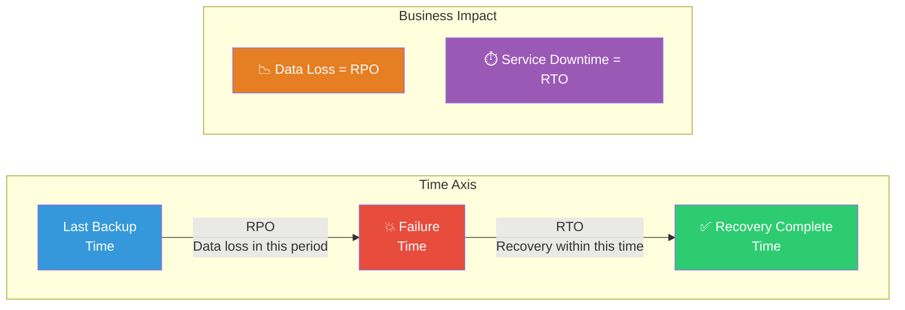
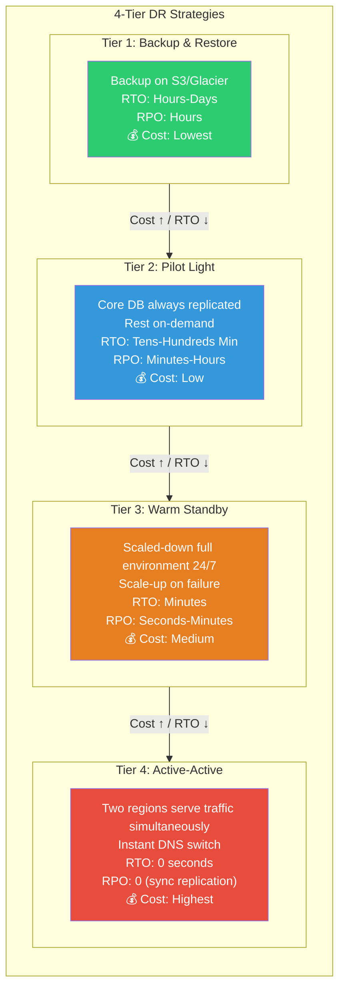
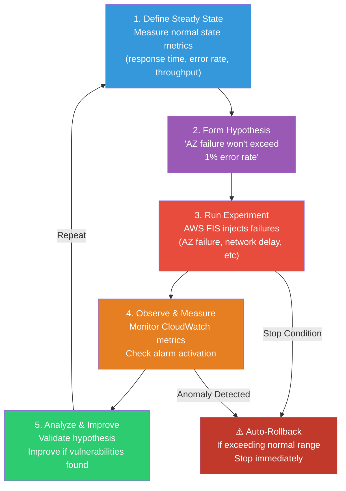

# RTO / RPO / DR Strategy / Chaos Engineering

> In [the previous lecture](./12-security), you learned AWS services for **protecting** resources. If security is "preventing attacks," this lecture is about **"how quickly to recover when disaster strikes"** — Disaster Recovery (DR) strategy and **"intentionally causing failures to find weaknesses"** — Chaos Engineering. If you learned [K8s DR](../04-kubernetes/16-backup-dr) with etcd backups and Velero, this is DR at the entire AWS infrastructure level.

---

## 🎯 Why should you know this?

```
When you need DR/Chaos Engineering in real work:
• "What if Seoul region entirely fails?"                    → DR strategy (Multi-Region)
• "How long until recovery after failure?"                  → Define RTO
• "How much data loss is acceptable?"                       → Define RPO
• "How much does DR cost?"                                  → Compare 4-strategy costs
• "Does service actually recover on real failure?"          → DR drills (Game Day)
• "How do we validate system behaves as expected?"          → Chaos Engineering + FIS
• "Should we test on production?"                           → Failure injection experiments
• Interview: "Explain Pilot Light vs Warm Standby"         → 4-tier DR strategies
```

---

## 🧠 Core Concepts

### Analogy: Fire Evacuation Drills and Backup Generators

Let me compare DR to **building emergency systems**.

* **RTO (Recovery Time Objective)** = In building fire, **how long until returning to normal work at alternate office**. "Resume operations within 30 minutes" is a goal.
* **RPO (Recovery Point Objective)** = Backup office documents at **last time backup saved**. RPO 1 hour means maximum 1-hour documents lost if fire happens.
* **Backup & Restore** = **Save copies of documents to external warehouse**. Takes time to retrieve from warehouse (hours to days).
* **Pilot Light** = **Keep small light on at emergency exit**. Keep minimum infrastructure running during normal, quickly start rest on failure (tens of minutes to hours).
* **Warm Standby** = **Backup generator on standby**. Backup system always ready. Failure activates backup in minutes.
* **Active-Active** = **Two buildings handling work simultaneously**. One building collapses, other immediately handles (real-time).
* **Chaos Engineering** = **Practice fire drills intentionally**. Validate that people actually evacuate properly before real disaster.

### Analogy: Hospital Emergency System

| Hospital System | AWS DR |
|-------------|--------|
| Max time until emergency patient admitted | RTO (recovery time target) |
| Patient record loss tolerance | RPO (recovery point target) |
| External storage for patient records | Backup & Restore |
| Emergency staff on-call | Pilot Light |
| ER 24/7 standby | Warm Standby |
| Two hospitals splitting patient load | Active-Active |
| Regular emergency response drills | Chaos Engineering / Game Day |
| Emergency action manual | Runbook (runbook) |

### RTO and RPO Relationship



### 4-Tier DR Strategy Comparison



### Chaos Engineering Experiment Flow



---

## 🔍 Detailed Explanation

### 1. RTO/RPO and Business Impact Analysis

RTO and RPO aren't technical metrics — they're **business requirements**.

```
📌 Critical Questions:
• "How long can service be down before business damage?"      → Determine RTO
• "How much data loss is acceptable?"                         → Determine RPO
• "Cost of recovery vs cost of failure — which is higher?"   → Choose DR strategy
```

**Business Impact Analysis (BIA) Example:**

| Service Type | Acceptable Downtime | Data Loss Tolerance | Recommended Strategy |
|------------|---------------|-----------------|----------|
| Payment System | 0 minutes | 0 | Active-Active |
| Order System | 5 minutes | 1 minute | Warm Standby |
| Admin Dashboard | 1 hour | 1 hour | Pilot Light |
| Batch Analytics | 24 hours | 24 hours | Backup & Restore |

**SLA Relationship:**

```
SLA 99.99% (Four Nines)
= Annual acceptable downtime: ~52 minutes
= Monthly acceptable downtime: ~4.3 minutes
→ Must set RTO within minutes
→ Requires Active-Active or Warm Standby

SLA 99.9% (Three Nines)
= Annual acceptable downtime: ~8.7 hours
= Monthly acceptable downtime: ~43 minutes
→ Pilot Light or Warm Standby sufficient
```

### 2. 4-Tier DR Strategies Detailed

#### 2-1. Backup & Restore (RTO: Hours to Days)

Cheapest but slowest recovery. Uses [S3 CRR](./04-storage) and [RDS snapshots](./06-db-operations).

```bash
# Check S3 Cross-Region Replication
aws s3api get-bucket-replication \
  --bucket my-backup-bucket \
  --region ap-northeast-2
```

```json
{
    "ReplicationConfiguration": {
        "Role": "arn:aws:iam::123456789012:role/S3ReplicationRole",
        "Rules": [{"ID": "dr-replication", "Status": "Enabled",
            "Destination": {"Bucket": "arn:aws:s3:::my-backup-bucket-us-west-2", "StorageClass": "STANDARD_IA"}}]
    }
}
```

```bash
# Copy RDS snapshot to DR region
aws rds copy-db-snapshot \
  --source-db-snapshot-identifier arn:aws:rds:ap-northeast-2:123456789012:snapshot:my-db-snap \
  --target-db-snapshot-identifier my-db-snap-dr \
  --region us-west-2
# Output: { "DBSnapshot": { "DBSnapshotIdentifier": "my-db-snap-dr", "Status": "creating" } }
```

#### 2-2. Pilot Light (RTO: Tens of Minutes to Hours)

Only core data layer always replicated. Compute resources activate only on failure.

```bash
# Check Aurora Global Database status — core DB always replicated
aws rds describe-global-clusters \
  --global-cluster-identifier my-global-db
```

```json
{
    "GlobalClusters": [{
        "GlobalClusterIdentifier": "my-global-db",
        "Status": "available",
        "Engine": "aurora-mysql",
        "GlobalClusterMembers": [
            {"DBClusterArn": "arn:aws:rds:ap-northeast-2:...:cluster:primary-cluster", "IsWriter": true},
            {"DBClusterArn": "arn:aws:rds:us-west-2:...:cluster:secondary-cluster", "IsWriter": false}
        ]
    }]
}
```

```bash
# Pilot Light: Activate EC2/ECS in DR region on failure
# CloudFormation StackSet deploys infrastructure to DR region
aws cloudformation create-stack-instances \
  --stack-set-name my-app-dr \
  --regions us-west-2 \
  --accounts 123456789012 \
  --operation-preferences MaxConcurrentPercentage=100
```

#### 2-3. Warm Standby (RTO: Minutes)

**Scaled-down full environment** always running in DR region. Scale up on failure.

```bash
# Scale up DR region ASG (Warm Standby → Full Capacity)
aws autoscaling update-auto-scaling-group \
  --auto-scaling-group-name my-app-dr-asg \
  --min-size 4 \
  --desired-capacity 8 \
  --max-size 16 \
  --region us-west-2
```

```
# No output (success). Verify with describe-auto-scaling-groups:
# MinSize: 4, DesiredCapacity: 8, MaxSize: 16
```

#### 2-4. Active-Active (RTO: Real-time to Seconds)

Both regions **simultaneously handle traffic**. Uses [Route 53](./08-route53-cloudfront) latency or failover routing.

```bash
# Route 53 Health Check setup
aws route53 create-health-check \
  --caller-reference "my-app-hc-$(date +%s)" \
  --health-check-config '{
    "IPAddress": "52.78.100.100",
    "Port": 443,
    "Type": "HTTPS",
    "ResourcePath": "/health",
    "RequestInterval": 10,
    "FailureThreshold": 2
  }'
```

```json
{
    "HealthCheck": {
        "Id": "abcd1234-5678-efgh-ijkl-mnop9012qrst",
        "HealthCheckConfig": {
            "Type": "HTTPS", "ResourcePath": "/health",
            "RequestInterval": 10, "FailureThreshold": 2
        }
    }
}
```

```bash
# DynamoDB Global Tables status — Active-Active data layer
aws dynamodb describe-table \
  --table-name my-global-table \
  --region ap-northeast-2 \
  --query 'Table.Replicas'
```

```json
[
    {
        "RegionName": "ap-northeast-2",
        "ReplicaStatus": "ACTIVE"
    },
    {
        "RegionName": "us-west-2",
        "ReplicaStatus": "ACTIVE"
    }
]
```

### 3. AWS Elastic Disaster Recovery (DRS)

AWS DRS **continuously replicates** servers from on-premises or other clouds to AWS. Agent-based block-level replication.

```bash
# Check DRS replication job status
aws drs describe-jobs \
  --filters '[{"name":"jobType","values":["LAUNCH"]}]' \
  --region us-west-2
```

```json
{
    "items": [{
        "jobID": "drs-job-1a2b3c4d5e6f",
        "type": "LAUNCH",
        "status": "COMPLETED",
        "initiatedBy": "DIAGNOSTIC",
        "endDateTime": "2026-03-12T09:45:00Z",
        "participatingServers": [{"sourceServerID": "s-1234567890abcdef0", "launchStatus": "LAUNCHED"}]
    }]
}
```

```bash
# Check source server replication status
aws drs describe-source-servers \
  --filters '[{"name":"stagingAccountID","values":["123456789012"]}]' \
  --region us-west-2
```

```json
{
    "items": [
        {
            "sourceServerID": "s-1234567890abcdef0",
            "lifeCycle": {
                "dataReplicationInfo": {
                    "dataReplicationState": "CONTINUOUS_REPLICATION",
                    "lagDuration": "PT2S"
                }
            },
            "sourceProperties": {
                "os": {"fullString": "Ubuntu 22.04 LTS"},
                "identificationHints": {"hostname": "web-server-01"}
            }
        }
    ]
}
```

**DRS Core Concept:**

```
📌 DRS Recovery Flow:
1. Install agent on source server → start continuous block replication
2. Replicate to staging area (lightweight EC2 + EBS)
3. DR drill (test) → boot actual EC2 from staging
4. Real failure → activate Recovery instance + Route 53 switch
5. After recovery → Failback (return to original environment)
```

### 4. Chaos Engineering and AWS FIS

#### Why Chaos Engineering is Needed

```
"Everything is running smoothly" ← This is overconfidence, not knowledge.

Real Incidents:
• 2017 S3 outage → Major internet disruption
• 2020 Kinesis outage → CloudWatch, Lambda cascading failures
• 2021 us-east-1 outage → Global service impacts

Lesson: "Failures happen. The question is whether you're prepared."
```

#### AWS Fault Injection Service (FIS)

FIS is AWS's official Chaos Engineering service.

```bash
# Create FIS experiment template — Terminate EC2 instances
aws fis create-experiment-template \
  --description "EC2 termination - verify Auto Scaling recovery" \
  --targets '{
    "ec2-instances": {
      "resourceType": "aws:ec2:instance",
      "resourceTags": {"Environment": "staging"},
      "selectionMode": "COUNT(1)",
      "filters": [
        {"path": "State.Name", "values": ["running"]}
      ]
    }
  }' \
  --actions '{
    "stop-instances": {
      "actionId": "aws:ec2:stop-instances",
      "parameters": {},
      "targets": {"Instances": "ec2-instances"},
      "startAfter": []
    }
  }' \
  --stop-conditions '[
    {
      "source": "aws:cloudwatch:alarm",
      "value": "arn:aws:cloudwatch:ap-northeast-2:123456789012:alarm:HighErrorRate"
    }
  ]' \
  --role-arn "arn:aws:iam::123456789012:role/FISExperimentRole" \
  --tags '{"Project": "chaos-engineering"}' \
  --region ap-northeast-2
```

```json
{
    "experimentTemplate": {
        "id": "EXT1a2b3c4d5e6f7",
        "description": "EC2 termination - verify Auto Scaling recovery",
        "targets": {
            "ec2-instances": {
                "resourceType": "aws:ec2:instance",
                "selectionMode": "COUNT(1)"
            }
        },
        "actions": {
            "stop-instances": {
                "actionId": "aws:ec2:stop-instances"
            }
        },
        "stopConditions": [
            {"source": "aws:cloudwatch:alarm", "value": "arn:aws:cloudwatch:...:alarm:HighErrorRate"}
        ]
    }
}
```

```bash
# Run experiment → Check result
aws fis start-experiment --experiment-template-id EXT1a2b3c4d5e6f7 --region ap-northeast-2
aws fis get-experiment --id EXP9z8y7x6w5v4u --region ap-northeast-2
```

```json
{
    "experiment": {
        "id": "EXP9z8y7x6w5v4u",
        "state": {"status": "completed", "reason": "Experiment completed successfully"},
        "startTime": "2026-03-13T10:05:01Z",
        "endTime": "2026-03-13T10:12:30Z"
    }
}
```

#### FIS Supported Failure Injection Types

```
📌 FIS Action Types:
├── EC2
│   ├── aws:ec2:stop-instances        — Stop instances
│   ├── aws:ec2:terminate-instances   — Terminate instances
│   └── aws:ec2:send-spot-instance-interruptions  — Simulate spot interruption
├── ECS
│   ├── aws:ecs:drain-container-instances  — Drain containers
│   └── aws:ecs:stop-task                  — Stop task
├── EKS
│   ├── aws:eks:terminate-nodegroup-instances  — Terminate nodes
│   └── aws:eks:pod-delete                     — Delete pod
├── RDS
│   ├── aws:rds:failover-db-cluster    — DB cluster failover
│   └── aws:rds:reboot-db-instances    — Reboot DB instance
├── Network
│   ├── aws:network:disrupt-connectivity  — Block connectivity
│   └── aws:network:route-table-disrupt   — Change routing
└── SSM (Systems Manager)
    ├── aws:ssm:send-command/AWSFIS-Run-CPU-Stress     — CPU load
    ├── aws:ssm:send-command/AWSFIS-Run-Memory-Stress  — Memory load
    └── aws:ssm:send-command/AWSFIS-Run-Network-Latency — Network delay
```

### 5. DR Testing and Game Day

Disaster recovery must be **regularly tested**. Untested DR plan is worthless.

#### Game Day Process

```
📌 Game Day Execution:

1. [Pre-Preparation]
   - Notify teams (or unannounced — Surprise Drill)
   - Create rollback plan
   - Prepare monitoring dashboards
   - Define success/failure criteria

2. [Inject Failure]
   - FIS experiment or manual failure injection
   - "Seoul region AZ-a network disconnection" scenario

3. [Observe Response]
   - Measure on-call engineer response time
   - Execute runbook recovery procedure
   - Record decision-making process

4. [Verify Recovery]
   - Confirm service normal operation
   - Validate data consistency
   - Check RTO/RPO target achievement

5. [Post-mortem Analysis]
   - Compile timeline
   - Document what went well / improve
   - Update runbook
   - Schedule next Game Day
```

```bash
# Pre-GameDay: Create monitoring dashboard
aws cloudwatch put-dashboard \
  --dashboard-name "DR-GameDay-Dashboard" \
  --dashboard-body '{"widgets":[
    {"type":"metric","properties":{"metrics":[
      ["AWS/ApplicationELB","HTTPCode_Target_5XX_Count","LoadBalancer","app/my-alb/1234567890"],
      ["AWS/ApplicationELB","TargetResponseTime","LoadBalancer","app/my-alb/1234567890"]
    ],"period":60,"title":"ALB Error Rate & Response Time"}},
    {"type":"metric","properties":{"metrics":[
      ["AWS/Route53","HealthCheckStatus","HealthCheckId","abcd1234-5678"]
    ],"period":60,"title":"Route 53 Health Check"}}
  ]}'
# Output: { "DashboardValidationMessages": [] }
```

#### Runbook (Runbook) Example Structure

```
📌 DR Runbook — Region-wide Seoul Failure:

[Step 1] Detect Failure (Automatic)
  - Route 53 Health Check fails → alarm → PagerDuty call
  - Expected time: 1-2 minutes

[Step 2] Assess Situation (Manual)
  - Check AWS Health Dashboard
  - Determine impact scope (AZ vs Region failure)
  - Expected time: 2-5 minutes

[Step 3] Decide DR Activation (Manual)
  - DR decision criteria: 15+ minutes recovery impossible
  - Approver: SRE Lead or CTO

[Step 4] Execute DR (Semi-Automated)
  - Route 53 Failover record → auto-switch
  - Aurora Global Database → Failover to secondary
    aws rds failover-global-cluster \
      --global-cluster-identifier my-global-db \
      --target-db-cluster-identifier arn:aws:rds:us-west-2:123456789012:cluster:secondary-cluster
  - Scale up ASG (if Warm Standby)
  - Expected time: 5-15 minutes

[Step 5] Validate (Manual)
  - Service responding normally
  - Data consistency verified
  - Customer impact monitoring
```

---

## 💻 Hands-On Examples

### Exercise 1: Configure S3 Cross-Region Replication for Backup & Restore

Most basic DR strategy. Automatically replicate data to another region.

```bash
# 1. Create destination bucket in DR region
aws s3api create-bucket \
  --bucket my-app-backup-us-west-2 \
  --region us-west-2 \
  --create-bucket-configuration LocationConstraint=us-west-2

# 2. Enable versioning on both buckets (required for CRR)
aws s3api put-bucket-versioning \
  --bucket my-app-backup-ap-northeast-2 \
  --versioning-configuration Status=Enabled

aws s3api put-bucket-versioning \
  --bucket my-app-backup-us-west-2 \
  --versioning-configuration Status=Enabled

# 3. Configure CRR rule
aws s3api put-bucket-replication \
  --bucket my-app-backup-ap-northeast-2 \
  --replication-configuration '{
    "Role": "arn:aws:iam::123456789012:role/S3ReplicationRole",
    "Rules": [
      {
        "ID": "dr-replication-rule",
        "Status": "Enabled",
        "Priority": 1,
        "Filter": {"Prefix": ""},
        "Destination": {
          "Bucket": "arn:aws:s3:::my-app-backup-us-west-2",
          "StorageClass": "STANDARD_IA"
        },
        "DeleteMarkerReplication": {"Status": "Enabled"}
      }
    ]
  }'
```

```bash
# 4. Verify replication
aws s3api head-object \
  --bucket my-app-backup-us-west-2 \
  --key important-data/backup-2026-03-13.tar.gz
```

```json
{
    "ContentLength": 524288000,
    "ContentType": "application/gzip",
    "ETag": "\"d41d8cd98f00b204e9800998ecf8427e\"",
    "LastModified": "2026-03-13T06:00:00Z",
    "ReplicationStatus": "REPLICA",
    "StorageClass": "STANDARD_IA"
}
```

```bash
# 5. DR scenario: Restore data from DR region on primary region failure
aws s3 ls s3://my-app-backup-us-west-2/important-data/ --region us-west-2
```

```
2026-03-13 06:00:00  524288000 backup-2026-03-13.tar.gz
2026-03-12 06:00:00  512000000 backup-2026-03-12.tar.gz
2026-03-11 06:00:00  508000000 backup-2026-03-11.tar.gz
```

### Exercise 2: Route 53 Failover + Aurora Global Database for Warm Standby

Combines [Route 53 Failover](./08-route53-cloudfront) and [Aurora Global Database](./05-database) for Warm Standby.

```bash
# 1. Create Aurora Global Database (Primary: Seoul, Secondary: Oregon)
# — Assume Primary cluster already exists
aws rds create-global-cluster \
  --global-cluster-identifier my-app-global-db \
  --source-db-cluster-identifier arn:aws:rds:ap-northeast-2:123456789012:cluster:my-app-primary \
  --region ap-northeast-2

# 2. Add cluster in secondary region
aws rds create-db-cluster \
  --db-cluster-identifier my-app-secondary \
  --engine aurora-mysql \
  --engine-version 8.0.mysql_aurora.3.04.0 \
  --global-cluster-identifier my-app-global-db \
  --region us-west-2
```

```bash
# 3. Configure Route 53 Failover
# Primary record: Failover=PRIMARY + Health Check → Seoul ALB
aws route53 change-resource-record-sets --hosted-zone-id Z1234567890ABC \
  --change-batch '{
    "Changes": [{"Action":"CREATE","ResourceRecordSet":{
      "Name":"api.myapp.com","Type":"A","SetIdentifier":"primary-seoul",
      "Failover":"PRIMARY","HealthCheckId":"hc-primary-seoul",
      "AliasTarget":{"HostedZoneId":"ZWKZPGTI48KDX",
        "DNSName":"my-alb-seoul.ap-northeast-2.elb.amazonaws.com",
        "EvaluateTargetHealth":true}
    }}]}'

# Secondary record: Failover=SECONDARY → Oregon ALB (auto-switch if health check fails)
aws route53 change-resource-record-sets --hosted-zone-id Z1234567890ABC \
  --change-batch '{
    "Changes": [{"Action":"CREATE","ResourceRecordSet":{
      "Name":"api.myapp.com","Type":"A","SetIdentifier":"secondary-oregon",
      "Failover":"SECONDARY",
      "AliasTarget":{"HostedZoneId":"Z1H1FL5HABSF5",
        "DNSName":"my-alb-oregon.us-west-2.elb.amazonaws.com",
        "EvaluateTargetHealth":true}
    }}]}'
```

```bash
# 4. Failure simulation — Aurora Global Database failover
aws rds failover-global-cluster \
  --global-cluster-identifier my-app-global-db \
  --target-db-cluster-identifier arn:aws:rds:us-west-2:123456789012:cluster:my-app-secondary \
  --region ap-northeast-2
```

```json
{
    "GlobalCluster": {
        "GlobalClusterIdentifier": "my-app-global-db",
        "Status": "failing-over",
        "GlobalClusterMembers": [
            {"DBClusterArn": "arn:aws:rds:us-west-2:...:cluster:my-app-secondary", "IsWriter": true},
            {"DBClusterArn": "arn:aws:rds:ap-northeast-2:...:cluster:my-app-primary", "IsWriter": false}
        ]
    }
}
```

### Exercise 3: AWS FIS AZ Failure Chaos Experiment

Verify that service remains available even if one AZ fails.

```bash
# 1. Create stop condition CloudWatch alarm
# — Auto-stop experiment if error rate exceeds 5%
aws cloudwatch put-metric-alarm \
  --alarm-name "FIS-StopCondition-HighErrorRate" \
  --metric-name "HTTPCode_Target_5XX_Count" \
  --namespace "AWS/ApplicationELB" \
  --statistic Sum \
  --period 60 \
  --threshold 50 \
  --comparison-operator GreaterThanThreshold \
  --evaluation-periods 1 \
  --dimensions Name=LoadBalancer,Value=app/my-alb/1234567890 \
  --alarm-actions "arn:aws:sns:ap-northeast-2:123456789012:ops-alerts"
```

```bash
# 2. Create FIS experiment — Block AZ-a network
aws fis create-experiment-template \
  --description "AZ-a network isolation - verify availability" \
  --targets '{
    "az-subnets": {
      "resourceType": "aws:ec2:subnet",
      "resourceTags": {"Environment": "staging"},
      "filters": [
        {"path": "AvailabilityZone", "values": ["ap-northeast-2a"]}
      ],
      "selectionMode": "ALL"
    }
  }' \
  --actions '{
    "disrupt-az-network": {
      "actionId": "aws:network:disrupt-connectivity",
      "parameters": {
        "scope": "all",
        "duration": "PT5M"
      },
      "targets": {"Subnets": "az-subnets"}
    }
  }' \
  --stop-conditions '[
    {
      "source": "aws:cloudwatch:alarm",
      "value": "arn:aws:cloudwatch:ap-northeast-2:123456789012:alarm:FIS-StopCondition-HighErrorRate"
    }
  ]' \
  --role-arn "arn:aws:iam::123456789012:role/FISExperimentRole" \
  --tags '{"Project": "chaos-az-test"}' \
  --region ap-northeast-2
```

```json
{
    "experimentTemplate": {
        "id": "EXTaz1b2c3d4e5f",
        "description": "AZ-a network isolation - verify availability",
        "actions": {"disrupt-az-network": {"actionId": "aws:network:disrupt-connectivity", "parameters": {"duration": "PT5M"}}},
        "stopConditions": [{"source": "aws:cloudwatch:alarm"}]
    }
}
```

```bash
# 3. Run experiment
aws fis start-experiment --experiment-template-id EXTaz1b2c3d4e5f --region ap-northeast-2
# Output: { "experiment": { "id": "EXPaz9y8x7w6v5", "state": { "status": "running" } } }
```

```bash
# 4. Monitor during experiment — Check ALB target status
aws elbv2 describe-target-health \
  --target-group-arn arn:aws:elasticloadbalancing:ap-northeast-2:123456789012:targetgroup/my-tg/1234567890 \
  --region ap-northeast-2
```

```json
{
    "TargetHealthDescriptions": [
        {"Target": {"Id": "i-0a1b2c3d4e (AZ-a)"}, "TargetHealth": {"State": "unhealthy", "Reason": "Target.Timeout"}},
        {"Target": {"Id": "i-1b2c3d4e5f (AZ-b)"}, "TargetHealth": {"State": "healthy"}},
        {"Target": {"Id": "i-2c3d4e5f6g (AZ-c)"}, "TargetHealth": {"State": "healthy"}}
    ]
}
```

```bash
# 5. Check experiment result
aws fis get-experiment --id EXPaz9y8x7w6v5 --region ap-northeast-2
# Output: { "experiment": { "state": { "status": "completed" }, "endTime": "2026-03-13T11:05:30Z" } }
```

```
✅ Experiment Results Analysis:
• AZ-a instances marked unhealthy → ALB auto-distributes traffic to AZ-b, AZ-c
• 5XX error rate: 2.1% for 15 sec after failure → then 0.3% (stable)
• Stop Condition alarm didn't trigger → Service availability maintained
• Improvement: 15 seconds for target removal → reduce Health Check interval
```

---

## 🏢 In Real Work

### Scenario 1: E-commerce — Prepare for Black Friday DR

```
Context: 30% of annual revenue from Black Friday. Massive sales loss if down.

Architecture:
├── Normal: Warm Standby (Seoul Primary + Oregon scaled-down)
│   ├── Aurora Global Database (RPO ~1 second)
│   ├── DynamoDB Global Tables (cart, session)
│   ├── S3 CRR (product images)
│   └── Route 53 Failover (auto-switch)
│
├── Week before Black Friday: Scale up DR region → Active-Active
│   ├── Oregon ASG min = Seoul
│   ├── Route 53 → Latency-based routing
│   └── Payment system: both regions simultaneously
│
└── After Black Friday: Scale down back to Warm Standby (cost saving)

RTO: < 30 seconds (Active-Active during peak)
RPO: 0 (DynamoDB Global Tables sync)
Monthly DR cost: ~$3,000 baseline + ~$12,000 during event
```

### Scenario 2: Fintech — Regulatory DR Requirement

```
Context: Financial regulator mandates: "RTO < 2 hours, RPO = 0, biannual DR drills"

Architecture:
├── Primary: Seoul (ap-northeast-2)
├── DR: Tokyo (ap-northeast-1) — Warm Standby
│   ├── Aurora Global Database (sync replication → RPO 0)
│   ├── ElastiCache Global Datastore (session sync)
│   ├── CloudFormation StackSets (infra sync)
│   └── AWS DRS (on-premises legacy system replication)
│
├── DR Drills (bi-annual):
│   ├── Q1: Announced Game Day
│   ├── Q3: Unannounced Surprise Drill
│   ├── Post-drill: Runbook updates
│   └── Audit report auto-generated (CloudTrail + Athena)
│
└── Chaos Engineering (monthly):
    ├── FIS: AZ failure, DB failover, network delay
    └── Results → Jira tickets → Improvement tracking

Actual RTO: 23 minutes (vs 2-hour target — safety margin)
Actual RPO: 0 seconds (Aurora sync replication)
```

### Scenario 3: SaaS — Multi-tenant DR

```
Context: SaaS for 100+ customers. Different SLAs by tier.
         Enterprise: SLA 99.99% (RTO < 5min)
         Standard: SLA 99.9% (RTO < 1 hour)

Architecture:
├── Enterprise Tenants:
│   ├── Active-Active (Seoul + Oregon)
│   ├── DynamoDB Global Tables (tenant partition)
│   ├── Route 53 Latency routing
│   └── Weekly FIS experiments
│
├── Standard Tenants:
│   ├── Pilot Light (DR region DB replica only)
│   ├── Aurora Read Replica (Cross-Region)
│   ├── CloudFormation StackSets (launch on failure)
│   └── Monthly FIS experiments
│
└── Common:
    ├── S3 CRR (all static assets)
    ├── Secrets Manager replication (connection info)
    ├── Quarterly Game Day (all tenants)
    └── Automated DR runbook (Step Functions + SSM)

Cost Optimization: Tiered DR by tenant tier → Avoid unnecessary spending
```

---

## ⚠️ Common Mistakes

### ❌ Mistake 1: Plan Created But Never Tested

```
❌ Wrong: "We have DR architecture designed, recovery should work"
         → Real failure: runbook doesn't match reality, no permission to execute
         → Untested DR plan has no reliability

✅ Correct: Quarterly DR drills (Game Day)
         → Minimum semi-annual, prefer quarterly
         → Mix announced + unannounced (Surprise Drill)
         → Post-mortem after every drill → runbook update
```

### ❌ Mistake 2: RTO/RPO Decided by Tech Team Alone

```
❌ Wrong: "RPO 1 hour should be sufficient"
         → Business: "Losing 1 hour of transaction data = millions"
         → RTO/RPO are business metrics, not technical targets

✅ Correct: Business Impact Analysis (BIA) → agree with business
         → Critical payment: RPO 0, RTO 5 min
         → Admin tools: RPO 1 hour, RTO 4 hours
         → Different services get different DR levels
```

### ❌ Mistake 3: Chaos Tests on Production Without Control

```
❌ Wrong: "Need real production results" → Run FIS without stop condition
         → Uncontrolled failure → Real service outage
         → Security/legal issues

✅ Correct: Phased approach:
         1. Dev environment first
         2. Staging validation
         3. Production: Must have Stop Condition + rollback plan + notification
         4. Off-business hours (late night)
         5. Minimize blast radius
```

### ❌ Mistake 4: Apply Active-Active to Everything

```
❌ Wrong: "Active-Active for all services is safest"
         → Infrastructure cost 2x+
         → Complexity: data sync, conflict resolution, dual deployment
         → Admin dashboard needs Active-Active?

✅ Correct: Differentiate by business impact:
         → Payment/Auth: Active-Active (failure = direct revenue loss)
         → API servers: Warm Standby (minutes of RTO acceptable)
         → Batch servers: Backup & Restore (hours acceptable)
         → Admin tools: Pilot Light (cost optimization)
```

### ❌ Mistake 5: Ignore DR Region Service Quota

```
❌ Wrong: "Plan to launch 100 EC2 in DR region on failure"
         → DR region has only 20 EC2 quota, creation fails
         → Service quota is default level on unused regions

✅ Correct: Pre-verify DR region service quotas
         aws service-quotas get-service-quota \
           --service-code ec2 \
           --quota-code L-1216C47A \
           --region us-west-2
         → Ensure sufficient quota in DR region beforehand
         → Consider On-Demand Capacity Reservation (ODCR)
         → Test actual resource creation during drill
```

---

## 📝 Summary

```
DR and Chaos Engineering at a Glance:

┌──────────────────┬──────────────────────────────────────────┐
│ Concept           │ Core Definition                           │
├──────────────────┼──────────────────────────────────────────┤
│ RTO              │ Service recovery target time              │
│ RPO              │ Data loss tolerance time                  │
│ Backup & Restore │ Lowest cost, slowest (hours-days)         │
│ Pilot Light      │ Core DB replicated, compute on-demand     │
│ Warm Standby     │ Scaled-down full environment 24/7         │
│ Active-Active    │ Both regions simultaneous, zero RTO       │
│ AWS DRS          │ Agent-based continuous replication        │
│ Aurora Global DB │ < 1sec RPO, managed failover             │
│ DynamoDB Global  │ Active-Active data, multi-region sync     │
│ S3 CRR           │ Bucket-to-bucket auto cross-region        │
│ Route 53 Failover│ Health check-based DNS switching          │
│ AWS FIS          │ Managed chaos engineering, failure tests  │
│ Game Day         │ Periodic DR drills, post-mortem learning  │
│ Runbook          │ Step-by-step failure recovery procedure   │
└──────────────────┴──────────────────────────────────────────┘
```

**Key Points:**

1. **RTO/RPO Are Business Decisions**, not technical specs. Business determines tolerance, tech implements.
2. **DR Strategy is Cost vs RTO Trade-off**. Backup (cheap, slow) to Active-Active (expensive, fast).
3. **Untested DR is Worthless**. Regular Game Day + FIS experiments prove it actually works.
4. **Chaos Engineering Builds Confidence**. "Our system survives AZ failures" only proven by testing.
5. **Runbooks Are Living Documents**. Update after every drill, make anyone followable.

**Interview Keywords:**

```
Q: RTO vs RPO?
A: RTO = recovery time target (downtime), RPO = recovery point objective (data loss).
   RPO 1 hour = 1-hour data loss acceptable.
   RTO 30 minutes = must recover within 30 minutes.

Q: Pilot Light vs Warm Standby?
A: Pilot Light = only DB replicated, compute launches on failure (tens-hundreds min).
   Warm Standby = full environment running at reduced capacity, scales up (minutes).

Q: Chaos Engineering purpose?
A: Intentionally inject failures to find weaknesses beforehand.
   Hypothesis → Experiment → Observe → Analyze → Improve.
   AWS FIS is managed service for this.

Q: Aurora Global Database spec?
A: ~1 second RPO, cross-region read replicas, managed failover.
   Strongest data layer for Pilot Light/Warm Standby.

Q: When to test DR?
A: Quarterly minimum (better: monthly). Include announced + surprise drills.
   Production chaos must have stop condition + rollback plan.
```

---

## 🔗 Next Lecture → [18-multi-cloud](./18-multi-cloud)

Next covers multi-cloud strategy. This DR focuses on **recovery within AWS** (across regions), while multi-cloud spans **AWS + GCP + Azure**. Learn how Terraform and Kubernetes enable multi-cloud architecture.
