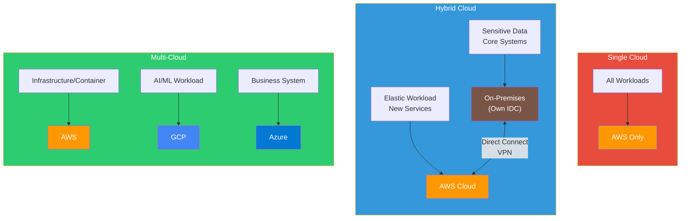
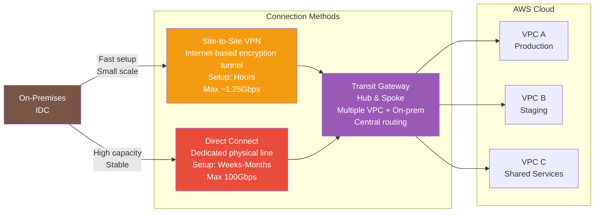
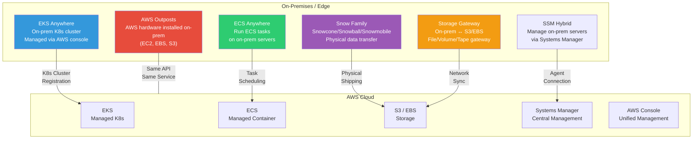

# Multi-Cloud / Hybrid Cloud

> In [the previous lecture](./15-multi-account), you learned to manage multiple AWS accounts through Organizations. Now expand your vision beyond AWS to **connect on-premises to AWS hybrid cloud**, and **operate across multiple clouds** (AWS, GCP, Azure) multi-cloud strategy. The final AWS lecture completes the big picture of cloud architecture.

---

## 🎯 Why should you know this?

```
When you need multi/hybrid cloud in real work:
• Company has IDC servers and is migrating to cloud         → Hybrid (Direct Connect)
• Regulations require on-premises data storage              → Hybrid (Outposts)
• Single vendor lock-in reduces negotiation power           → Multi-cloud (avoid lock-in)
• M&A: acquired GCP company, need to integrate              → Multi-cloud (integration)
• GCP excels at AI/ML, AWS better at infrastructure         → Multi-cloud (best-of-breed)
• Want to manage on-premises K8s + EKS unified              → EKS Anywhere
• Terraform to manage AWS + GCP simultaneously              → IaC multi-cloud
• Interview: "Multi-cloud vs Hybrid — what's the difference?"  → Core concepts
```

---

## 🧠 Core Concepts

### Analogy: Supply Chain Diversification and In-house + Outsourced Production

Let me compare multi-cloud and hybrid cloud to **business operations**.

* **Single Cloud** = **Relying on single supplier**. If prices change or supplier fails, no alternatives.
* **Multi-Cloud** = **Distributing orders across multiple suppliers**. AWS provides servers, GCP provides AI services, Azure provides business tools. If one vendor has issues, alternatives exist.
* **Hybrid Cloud** = **Owning in-house factory + using contract manufacturers**. Core manufacturing in your factory (on-premises), surge capacity outsourced (cloud). Key data stays in-house, flexible workloads in cloud.
* **Investment Portfolio Analogy**: Never bet everything on one stock — diversify across stocks, bonds, etc. Similarly, one cloud creates **vendor lock-in risk**. Distribute across clouds like diversifying investments.

### Multi-Cloud vs Hybrid Cloud Comparison



### Why Choose Multi/Hybrid?

| Motivation | Explanation | Analogy |
|------|------|------|
| **Avoid Vendor Lock-in** | Single cloud dependency = vulnerable to price/policy changes | Supplier dependency kills negotiation power |
| **Regulatory Compliance** | Finance/medical data must stay in specific location | Legal requirement to maintain in-house factory |
| **Best-of-Breed** | Use each cloud's strengths (GCP AI, AWS infrastructure) | Buy components from best supplier per type |
| **M&A/Legacy** | Merged company brings different cloud | Acquired company has existing supplier relationships |
| **Disaster Recovery** | One cloud region failure → other cloud backup | Factory across multiple locations |
| **Cost Optimization** | Cloud competition → price negotiation leverage | Bid to multiple suppliers |

### Hybrid Connection Method Comparison



> [VPC lecture](./02-vpc) covers Site-to-Site VPN and Direct Connect basics. [VPN basics](../02-networking/10-vpn) is also useful reference.

### AWS Hybrid Service Complete Map



---

## 🔍 Detailed Explanation

### Hybrid Connection: Direct Connect vs VPN

Two main methods to connect on-premises and AWS.

| Item | Site-to-Site VPN | Direct Connect |
|------|-------------------|----------------|
| **Connection** | IPsec tunnel over internet | Dedicated physical line |
| **Setup Time** | Minutes-Hours | Weeks-Months |
| **Bandwidth** | ~1.25 Gbps per tunnel | 1/10/100 Gbps |
| **Stability** | Depends on internet | Consistent latency |
| **Cost** | ~$0.05/hour | ~$0.30/hour per port (1Gbps) |
| **Encryption** | Built-in (IPsec) | Optional (MACsec) |
| **Use Case** | Backup, small-scale, quick setup | Production, high-volume data |
| **HA** | Auto dual tunnel | 2 connections + 2 locations recommended |

**Practical Tip**: Typically Direct Connect as primary + Site-to-Site VPN as backup.

### Transit Gateway: Hub & Spoke

Many VPCs make VPC Peering management difficult. Transit Gateway acts as **central hub** connecting multiple VPCs, VPN, Direct Connect.

```
Without Transit Gateway (VPC Peering - Full Mesh):

VPC-A ←→ VPC-B
VPC-A ←→ VPC-C
VPC-A ←→ VPC-D
VPC-B ←→ VPC-C     ← 4 VPCs = 6 connections, 10 VPCs = 45 connections!
VPC-B ←→ VPC-D
VPC-C ←→ VPC-D

With Transit Gateway (Hub & Spoke):

VPC-A ─┐
VPC-B ─┤
VPC-C ─┼── Transit Gateway ── Direct Connect ── On-Premises
VPC-D ─┤                   ── VPN ── Remote Office
VPC-E ─┘

         ← No matter how many VPCs, only add TGW connection!
```

### AWS Outposts: Bring AWS to On-Premises

Outposts is AWS **installing physical hardware rack** in your data center. You use EC2, EBS, S3, RDS, EKS with **same AWS API**, but on your hardware in your location.

```
When Outposts is needed:
• Data Residency: Legally data must not leave physical location
• Ultra-Low Latency: Millisecond-level communication with on-prem required
• Gradual Migration: Integrate existing IDC + AWS in same environment
```

### EKS Anywhere / ECS Anywhere

```
EKS Anywhere:
• Deploy K8s cluster on on-prem, VM, bare metal
• Manage from AWS console (unified)
• GitOps-based cluster upgrade automation
• License: Free (support contract separate)

ECS Anywhere:
• Install SSM Agent + ECS Agent on-prem server
• Schedule tasks from ECS console
• Use same task definition as cloud ECS
```

> [K8s Multi-Cluster lecture](../04-kubernetes/19-multi-cluster) covers EKS Anywhere in detail.

### Multi-Cloud Tool Ecosystem

For unified multi-cloud management, **cloud-neutral tools** are essential.

| Tool | Role | Description |
|------|------|------|
| **Terraform** | IaC (Infrastructure as Code) | HCL manages AWS + GCP + Azure in single codebase |
| **Kubernetes** | Container Orchestration | Pod/Service abstraction identical on any cloud |
| **Consul** | Service Discovery | Multi-cloud auto-routing |
| **Vault** | Secret Management | Cloud-neutral password/certificate management |
| **Prometheus + Grafana** | Monitoring | Multi-cloud metric collection/visualization |
| **Backstage** | Developer Portal | Multi-cloud service catalog unified management |

```
Multi-Cloud Management with Terraform:

main.tf
├── provider "aws" { region = "ap-northeast-2" }
├── provider "google" { project = "my-project" }
│
├── module "aws_infra" {
│   ├── aws_eks_cluster       # K8s on AWS
│   ├── aws_rds_instance      # DB on AWS
│   └── aws_s3_bucket         # Storage on AWS
│
└── module "gcp_ai" {
    ├── google_vertex_ai       # AI/ML on GCP
    └── google_bigquery        # Analytics on GCP
```

> [IaC Concepts lecture](../06-iac/01-concept) covers Terraform basics. Multi-cloud Terraform extends the principles.

### AWS vs GCP vs Azure Service Mapping

Three clouds have similar services with different names. Understanding mapping helps.

| Category | AWS | GCP | Azure |
|----------|-----|-----|-------|
| **Compute** | EC2 | Compute Engine | Virtual Machines |
| **Managed K8s** | EKS | GKE | AKS |
| **Serverless Function** | Lambda | Cloud Functions | Azure Functions |
| **Object Storage** | S3 | Cloud Storage | Blob Storage |
| **Block Storage** | EBS | Persistent Disk | Managed Disks |
| **SQL DB** | RDS / Aurora | Cloud SQL / AlloyDB | Azure SQL |
| **NoSQL DB** | DynamoDB | Firestore / Bigtable | Cosmos DB |
| **Message Queue** | SQS | Pub/Sub | Service Bus |
| **CDN** | CloudFront | Cloud CDN | Azure CDN |
| **DNS** | Route 53 | Cloud DNS | Azure DNS |
| **Network** | VPC | VPC | VNet |
| **Identity** | IAM | IAM | Entra ID (AAD) |
| **IaC** | CloudFormation | Deployment Manager | ARM / Bicep |
| **AI/ML Platform** | SageMaker | Vertex AI | Azure ML |
| **Data Warehouse** | Redshift | BigQuery | Synapse Analytics |
| **Container Registry** | ECR | Artifact Registry | ACR |
| **Secret Management** | Secrets Manager | Secret Manager | Key Vault |
| **Monitoring** | CloudWatch | Cloud Monitoring | Azure Monitor |

**Each Cloud's Strengths:**

```
AWS:    Broadest service range, largest market share, mature ecosystem
GCP:    Data analytics (BigQuery), AI/ML (Vertex AI), K8s (GKE originator)
Azure:  Microsoft ecosystem integration (AD, Office 365), enterprise hybrid
```

### Considerations: Reality Check

Multi/hybrid cloud isn't always the answer. Before adopting, consider:

```
Pros vs Cons Reality Check:

Pros:
✓ Vendor lock-in prevention → Price negotiation leverage
✓ Regulatory compliance → Data sovereignty requirements
✓ Disaster recovery → One cloud failure, other backup
✓ Best-of-Breed → Each cloud's strengths

Cons:
✗ Complexity 2-3x increase → Operations burden
✗ Double cost → Network transfer + redundant services
✗ Team capability scattered → Need AWS + GCP + Azure experts
✗ Lowest-common-denominator trap → Each cloud's unique features unused
✗ Network latency → Cross-cloud data movement slower
✗ Data egress cost → Expensive to send data out of cloud
```

---

## 💻 Hands-On Examples

### Exercise 1: Site-to-Site VPN Connection Simulating On-Premises

Scenario: Connect VPC and on-premises (simulated) via Site-to-Site VPN. Understand VPN setup flow without real on-prem hardware.

```bash
# Step 1: Create Customer Gateway (represents on-prem VPN device public IP)
# Using simulated IP for demo
aws ec2 create-customer-gateway \
    --type ipsec.1 \
    --public-ip 203.0.113.100 \
    --bgp-asn 65000 \
    --tag-specifications 'ResourceType=customer-gateway,Tags=[{Key=Name,Value=onprem-vpn-device}]'

# Get Customer Gateway ID
CGW_ID=$(aws ec2 describe-customer-gateways \
    --filters "Name=tag:Name,Values=onprem-vpn-device" \
    --query 'CustomerGateways[0].CustomerGatewayId' \
    --output text)
echo "Customer Gateway: $CGW_ID"
```

```bash
# Step 2: Create Virtual Private Gateway + attach to VPC
aws ec2 create-vpn-gateway \
    --type ipsec.1 \
    --tag-specifications 'ResourceType=vpn-gateway,Tags=[{Key=Name,Value=hybrid-vpn-gw}]'

VGW_ID=$(aws ec2 describe-vpn-gateways \
    --filters "Name=tag:Name,Values=hybrid-vpn-gw" \
    --query 'VpnGateways[0].VpnGatewayId' \
    --output text)

# Attach VPN Gateway to VPC
aws ec2 attach-vpn-gateway \
    --vpn-gateway-id $VGW_ID \
    --vpc-id vpc-0abc123456

# Enable route propagation (VPN routes auto-propagate)
aws ec2 enable-vgw-route-propagation \
    --route-table-id rtb-0abc123456 \
    --gateway-id $VGW_ID
```

```bash
# Step 3: Create VPN Connection
aws ec2 create-vpn-connection \
    --type ipsec.1 \
    --customer-gateway-id $CGW_ID \
    --vpn-gateway-id $VGW_ID \
    --options '{
        "StaticRoutesOnly": false,
        "TunnelOptions": [
            {
                "PreSharedKey": "my-preshared-key-1",
                "TunnelInsideCidr": "169.254.10.0/30"
            },
            {
                "PreSharedKey": "my-preshared-key-2",
                "TunnelInsideCidr": "169.254.10.4/30"
            }
        ]
    }' \
    --tag-specifications 'ResourceType=vpn-connection,Tags=[{Key=Name,Value=onprem-to-aws}]'

# Step 4: Check VPN connection status
aws ec2 describe-vpn-connections \
    --filters "Name=tag:Name,Values=onprem-to-aws" \
    --query 'VpnConnections[0].{
        State: State,
        Tunnel1: VgwTelemetry[0].Status,
        Tunnel2: VgwTelemetry[1].Status
    }'
```

```json
{
    "State": "available",
    "Tunnel1": "UP",
    "Tunnel2": "UP"
}
```

> Two tunnels auto-created for HA. If one fails, traffic switches to the other automatically.

---

### Exercise 2: ECS Anywhere — Run Container on On-Premises Server

Scenario: Register on-premises server (or local VM) to ECS cluster and manage tasks from AWS console.

```bash
# Step 1: Create ECS Anywhere cluster
aws ecs create-cluster \
    --cluster-name hybrid-cluster \
    --tags key=Environment,value=hybrid

# Step 2: Create SSM Hybrid Activation (for on-prem server registration)
aws ssm create-activation \
    --default-instance-name "onprem-server-01" \
    --iam-role ecsAnywhereRole \
    --registration-limit 10 \
    --tags Key=Environment,Value=hybrid

# Output — use these in on-prem server:
# ActivationId: 1a2b3c4d-1234-5678-abcd-1234567890ab
# ActivationCode: ABCDEFGHIJ1234567890
```

```bash
# Step 3: On on-premises server (Linux), install agent
# Download SSM Agent + ECS Agent install script
curl --proto "https" -o /tmp/ecs-anywhere-install.sh \
    "https://amazon-ecs-agent.s3.amazonaws.com/ecs-anywhere-install-latest.sh"

# Install agent + register to cluster
sudo bash /tmp/ecs-anywhere-install.sh \
    --region ap-northeast-2 \
    --cluster hybrid-cluster \
    --activation-id "1a2b3c4d-1234-5678-abcd-1234567890ab" \
    --activation-code "ABCDEFGHIJ1234567890"
```

```bash
# Step 4: Verify on-premises instance registered
aws ecs list-container-instances \
    --cluster hybrid-cluster \
    --filter "attribute:ecs.os-type == linux"

# Step 5: Create task definition (EXTERNAL launch type)
cat << 'TASKDEF' > /tmp/hybrid-task.json
{
    "family": "hybrid-nginx",
    "requiresCompatibilities": ["EXTERNAL"],
    "containerDefinitions": [
        {
            "name": "nginx",
            "image": "nginx:latest",
            "memory": 256,
            "cpu": 256,
            "essential": true,
            "portMappings": [
                {
                    "containerPort": 80,
                    "hostPort": 8080,
                    "protocol": "tcp"
                }
            ]
        }
    ]
}
TASKDEF

aws ecs register-task-definition \
    --cli-input-json file:///tmp/hybrid-task.json

# Step 6: Run task on on-prem server
aws ecs run-task \
    --cluster hybrid-cluster \
    --task-definition hybrid-nginx \
    --launch-type EXTERNAL
```

```
Result: nginx running on on-prem server :8080,
        monitored from AWS ECS console.
        AWS Console > ECS > Clusters > hybrid-cluster > Tasks
        → Task on EXTERNAL instance visible
```

> [Container Services lecture](./09-container-services) covers ECS basics. ECS Anywhere is just changing launch type to `EXTERNAL`.

---

### Exercise 3: Terraform Multi-Cloud Infrastructure (AWS + GCP)

Scenario: Terraform manages S3 bucket on AWS + Cloud Storage on GCP simultaneously. Single code base for multi-cloud.

```hcl
# providers.tf — Multi-cloud provider setup
terraform {
  required_version = ">= 1.5.0"

  required_providers {
    aws = {
      source  = "hashicorp/aws"
      version = "~> 5.0"
    }
    google = {
      source  = "hashicorp/google"
      version = "~> 5.0"
    }
  }
}

# AWS provider
provider "aws" {
  region = "ap-northeast-2"  # Seoul region

  default_tags {
    tags = {
      Project     = "multi-cloud-demo"
      ManagedBy   = "terraform"
    }
  }
}

# GCP provider
provider "google" {
  project = "my-gcp-project-id"
  region  = "asia-northeast3"  # Seoul region
}
```

```hcl
# storage.tf — Create storage on both clouds
# ============================================
# AWS S3 Bucket (Primary Data Storage)
# ============================================
resource "aws_s3_bucket" "main_data" {
  bucket = "my-company-main-data-2026"

  tags = {
    Purpose = "primary-storage"
    Cloud   = "aws"
  }
}

resource "aws_s3_bucket_versioning" "main_data" {
  bucket = aws_s3_bucket.main_data.id
  versioning_configuration {
    status = "Enabled"  # Data protection via versioning
  }
}

# ============================================
# GCP Cloud Storage Bucket (Backup/Analytics)
# ============================================
resource "google_storage_bucket" "backup_data" {
  name     = "my-company-backup-data-2026"
  location = "ASIA-NORTHEAST3"  # Seoul

  # GCP recommends uniform_bucket_level_access
  uniform_bucket_level_access = true

  versioning {
    enabled = true  # Same versioning as AWS
  }

  labels = {
    purpose    = "backup-storage"
    cloud      = "gcp"
    managed-by = "terraform"
  }
}

# ============================================
# Output: Show storage info from both clouds
# ============================================
output "aws_bucket" {
  description = "AWS S3 bucket name"
  value       = aws_s3_bucket.main_data.id
}

output "gcp_bucket" {
  description = "GCP Cloud Storage bucket name"
  value       = google_storage_bucket.backup_data.name
}

output "summary" {
  description = "Multi-cloud storage configuration summary"
  value = <<-EOT
    AWS S3 (Primary):  ${aws_s3_bucket.main_data.id}
    GCP GCS (Backup):  ${google_storage_bucket.backup_data.name}
    Management Tool:   Terraform v${terraform.required_version}
  EOT
}
```

```bash
# Terraform execution
cd multi-cloud-infra/

# Initialize (download both provider plugins)
terraform init

# Check plan (see what creates)
terraform plan
# Plan: 3 to add, 0 to change, 0 to destroy.
# + aws_s3_bucket.main_data
# + aws_s3_bucket_versioning.main_data
# + google_storage_bucket.backup_data

# Apply (create both clouds simultaneously)
terraform apply -auto-approve

# Check state (single state manages both clouds)
terraform state list
# aws_s3_bucket.main_data
# aws_s3_bucket_versioning.main_data
# google_storage_bucket.backup_data
```

```
Key Points:
• Single terraform state manages AWS + GCP resources
• terraform plan shows changes on both clouds
• Team only needs HCL knowledge, avoids cloud console switching
• Production: store state in S3 + DynamoDB backend
```

> [IaC Concepts lecture](../06-iac/01-concept) teaches Terraform from basics. Multi-cloud Terraform just adds provider blocks.

---

## 🏢 In Real Work

### Scenario 1: Financial Company Hybrid Architecture (Regulatory)

```
Problem: Regulations require on-premises data storage.
         Simultaneously need AWS cloud scalability for mobile app.
         Safely connect two environments.

Solution: Direct Connect + Transit Gateway + Outposts
```

```
Architecture:

[On-Premises IDC — Financial Data]
├── Core Banking System (account ledger, transactions)
├── AWS Outposts (installed on-prem)
│   ├── RDS on Outposts (customer ledger — data sovereignty)
│   └── EKS on Outposts (payment processing Pod)
│
├── Direct Connect (10Gbps x 2 = Dual)
│   └── Transit Gateway
│       ├── VPC-Production (mobile banking API)
│       │   ├── EKS Cluster (app server)
│       │   ├── ElastiCache (session/cache)
│       │   └── ALB + WAF (security)
│       │
│       ├── VPC-Analytics (data analysis)
│       │   ├── Redshift (analytics DB)
│       │   └── SageMaker (fraud detection ML)
│       │
│       └── VPC-DR (disaster recovery)
│           └── Aurora read replica
│
└── Site-to-Site VPN (Direct Connect backup)

Key Points:
• Customer ledger stays Outposts (on-prem) — regulatory compliance
• Mobile banking on AWS — elastic scaling
• Direct Connect dual + VPN backup — 99.99% availability
• Transit Gateway — VPC routing centralized
```

### Scenario 2: Global Company Multi-Cloud (Best-of-Breed)

```
Problem: Global commerce company needs:
         - Infrastructure/container: AWS most mature
         - Data analysis: BigQuery(GCP) fastest/cheapest
         - Acquired AI team: uses GCP Vertex AI
         - Europe office: uses Azure + Microsoft 365

Solution: Best-of-breed cloud selection + Terraform + Kubernetes
```

```
Architecture:

┌─────────────────────────────────────────────────────┐
│                 Unified Management Layer             │
│                                                     │
│ Terraform (IaC)  │ Vault (Secrets)  │ Consul        │
│ All infrastructure│ All secrets      │ Service       │
│ as code           │ centralized      │ discovery     │
└─────────────────────────────────────────────────────┘
         │                    │                    │
    ┌────▼────┐         ┌────▼────┐         ┌────▼────┐
    │  AWS     │         │  GCP     │         │  Azure   │
    │          │         │          │         │          │
    │ EKS      │         │ GKE      │         │ AKS      │
    │ (main app)│        │ (AI/ML)  │         │ (EU app) │
    │          │         │          │         │          │
    │ Aurora   │         │ BigQuery │         │ Azure AD │
    │ (main DB)│         │ (analytics)│       │ (SSO)    │
    │          │         │          │         │          │
    │ S3       │         │ Vertex AI│         │ M365     │
    │ (storage)│         │ (ML train)│        │ (collab) │
    └─────────┘         └─────────┘         └─────────┘

Data Flow:
AWS S3 (original data) → GCP BigQuery (analysis) → AWS S3 (results saved)
                              ↓
                        Vertex AI (ML model training)
                              ↓
                        AWS SageMaker Endpoint (inference serving)

Cost Consideration:
• AWS → GCP data transfer: $0.09/GB (egress cost!)
• 10TB monthly transfer: ~$900/month network cost
• Strategy: one-way data transfer, return only results
```

### Scenario 3: Startup Pragmatic Strategy (Start Simple, Expand Gradually)

```
Problem: 10-person startup, CTO says "avoid vendor lock-in,
         start multi-cloud." Most team knows AWS only.

Realistic Advice:
```

```
❌ Wrong Approach: Use all 3 clouds from day 1

"AWS + GCP + Azure from start"
→ 10 people can't be expert on 3 clouds
→ Infrastructure code 3x larger
→ Operations nightmarishly complex
→ Lose each cloud's unique features (minimun common denominator)
→ Result: slower delivery, higher cost, team burnout

✅ Correct Approach: Single cloud focus, gradual expansion

Phase 1 (Now): Concentrate on AWS
  • Leverage AWS-native services aggressively (Aurora, EKS, Lambda)
  • Deep team expertise in AWS
  • Product delivery speed = priority

Phase 2 (Growth): Prepare for portability
  • Container-based app architecture (Docker/K8s)
  • Infrastructure as code (Terraform)
  • Use standard protocols instead of cloud-specific APIs
  • (e.g., S3 API compatible with GCS)

Phase 3 (Maturity): Selective multi-cloud if needed
  • Only specific workloads on other cloud (best-of-breed)
  • Dedicated team per additional cloud
  • Scale allows added complexity

Core: "Multi-cloud is a tool, not a goal.
       Use when business requires it,
       not from day one complexity."
```

---

## ⚠️ Common Mistakes

### 1. Abstracting Everything (Lowest Common Denominator Trap)

```
❌ Wrong: "Make everything portable to any cloud"
         → Use direct MySQL instead of Aurora
         → Self-manage functions instead of Lambda
         → Skip each cloud's managed services
         → Result: Lose managed service benefits, higher operational burden

✅ Correct: "Implement portability for apps, leverage native services"

Abstract these (portable):
• Application code → Containers (Docker/K8s)
• Infrastructure definition → Terraform
• CI/CD pipelines → Cloud-neutral tools (GitHub Actions)

Don't abstract (use native):
• Databases → Aurora, DynamoDB — use fully
• Serverless → Lambda — leverage
• Messaging → SQS/SNS
• Monitoring → CloudWatch
• (+ Grafana overlay for unified view)

Philosophy: "Apps are portable, infrastructure optimized"
```

### 2. Ignoring Network Costs

```
❌ Wrong: Freely transfer data between AWS and GCP
         → Cross-cloud data incurs egress cost
         → $0.09/GB AWS egress + costs add up fast
         → 100TB monthly = $8,500+ network cost!

✅ Correct: Minimize cross-cloud data + plan costs

Cost Checks:
• AWS egress: $0.09/GB (first 10TB), then decreasing
• GCP egress: $0.08-0.12/GB (region-dependent)
• Direct Connect + Interconnect: separate cost for inter-cloud

Design Principles:
1. Keep data in one location, move compute to data
2. Only transfer aggregated/summarized data (original X)
3. Calculate egress explicitly in architecture design
4. Negotiate volume discounts with vendors
```

### 3. Multi-Cloud Without Team Capability

```
❌ Wrong: AWS-only team adopts GCP for vendor lock-in avoidance
         → GCP failure → no one can troubleshoot
         → "Multi-cloud but GCP nobody understands" paradox
         → Actually reduces availability

✅ Correct: Capability first, then expand

Capability Roadmap:
1. Deep expertise in primary cloud (AWS) — whole team
2. Learning group for new cloud — subset of team
3. Non-critical PoC on new cloud → small experiment
4. Operational experience → incident response training
5. Production expansion → validated area only

Minimum: 2-3 dedicated experts per new cloud before production
```

### 4. Assuming 1:1 Service Replacement

```
❌ Wrong: "Just replace DynamoDB with Firestore"
         → Different data model (Key-Value vs Document)
         → Missing features: DAX, Streams, Global Tables
         → Query patterns completely different
         → "Names similar, behavior completely different"

✅ Correct: Service mapping is concept only, requires redesign

Pre-Migration Checklist:
1. Feature gap analysis: current features → target service support
2. Data model difference: DynamoDB (K-V) vs Firestore (Document) mapping
3. SDK/API rewrite scope
4. Performance testing: same workload on target
5. Cost model difference: RCU vs read request count — actual cost?

Rule: "Service mapping table = learning, not migration design"
```

### 5. Hybrid Security Boundary Negligence

```
❌ Wrong: Open VPN between on-prem and AWS, no firewall rules
         → Compromise on-prem → spreads to AWS
         → "Connected = secure" false assumption

✅ Correct: Zero Trust — segmented security

Security Checklist:
1. Network segmentation: on-prem → AWS only necessary ports/IPs
2. Security Group: per on-prem CIDR block separate rules
3. Transit Gateway route table: VPC accessible from on-prem limited
4. VPC Flow Logs + GuardDuty: monitor inter-environment traffic
5. IAM condition keys: VPN source IP only certain APIs
   Example: "aws:SourceIp": "10.0.0.0/8" (on-prem)
```

---

## 📝 Summary

```
Multi/Hybrid Cloud at a Glance:

┌─────────────────┬──────────────────────────────────────────┐
│ Concept         │ Definition                                │
├─────────────────┼──────────────────────────────────────────┤
│ Hybrid Cloud    │ On-premises + public cloud connection     │
│ Multi-Cloud     │ Multiple public clouds (AWS+GCP+Azure)    │
├─────────────────┼──────────────────────────────────────────┤
│ Direct Connect  │ Dedicated line, high capacity, weeks setup│
│ Site-to-Site VPN│ Internet encryption, fast setup, ~1.25Gbps│
│ Transit Gateway │ Hub & spoke, VPC + on-prem + VPN routing │
│ Outposts        │ AWS hardware in your IDC, same API        │
├─────────────────┼──────────────────────────────────────────┤
│ EKS Anywhere    │ On-prem K8s managed from AWS console      │
│ ECS Anywhere    │ On-prem container tasks from ECS console  │
│ Storage Gateway │ On-prem ↔ S3 file/volume/tape gateway    │
│ Snow Family     │ Physical data transfer (Snowball, etc)    │
├─────────────────┼──────────────────────────────────────────┤
│ Terraform       │ HCL multi-cloud IaC unified management   │
│ Kubernetes      │ Cloud-neutral container orchestration     │
│ Vault           │ Multi-cloud secret unified management     │
│ Consul          │ Multi-cloud service discovery             │
└─────────────────┴──────────────────────────────────────────┘
```

**Key Points:**

1. **Hybrid ≠ Multi-Cloud**: Hybrid = on-prem+cloud, Multi = multiple public clouds. Can use both.
2. **Direct Connect + VPN**: Primary line (DX) + backup line (VPN) for redundancy. VPN alone too unstable for production.
3. **Transit Gateway**: 3+ VPCs → use TGW. VPC Peering full mesh becomes unmanageable.
4. **Outposts vs EKS Anywhere**: Data sovereignty → Outposts, unified K8s management → EKS Anywhere.
5. **Multi-Cloud Tools**: Terraform (IaC) + Kubernetes (runtime) + Vault (secrets) — industry-standard combo.
6. **Realistic Approach**: Small teams focus on single cloud, assure portability. Expand when business needs + team capability mature.
7. **Abstraction Trade-off**: Apps portable, infrastructure optimized. Don't sacrifice cloud-native benefits for portability.

**Interview Keywords:**

```
Q: Multi-cloud vs Hybrid difference?
A: Hybrid = on-premises + public cloud connection.
   Multi-cloud = multiple public clouds (AWS+GCP+Azure).
   Mutually exclusive, but can have both.

Q: Avoid vendor lock-in?
A: 1) Container-based apps (K8s)
   2) Infrastructure as code (Terraform)
   3) Standard protocols/APIs (S3-compatible)
   BUT: Complete vendor independence unrealistic → suitable-level portability.

Q: Direct Connect vs VPN?
A: Direct Connect = dedicated line, max 100Gbps, weeks setup.
   VPN = internet encryption, fast setup, ~1.25Gbps, backup.
   Standard: DX main + VPN backup.

Q: AWS Outposts when?
A: 1) Data residency: legal requirement for physical location
   2) Ultra-low latency: ms-level on-prem communication
   3) Unified environment: same AWS API on-prem

Q: Multi-cloud reality?
A: Complexity 2-3x, networking costs, team spread thin.
   Use only if business legitimately requires. Startups: focus AWS first.
```

---

## 🔗 Next Lecture

🎉 **05-Cloud AWS Category Complete!**

18 lectures through IAM, VPC, EC2, storage, databases, load balancing, Route 53, containers, serverless, messaging, security, management, cost, multi-account, Well-Architected, DR, and multi-cloud — complete AWS infrastructure architecture picture.

Next: **[06-iac/01-concept — IaC Concepts](../06-iac/01-concept)**

You've tasted Terraform multi-cloud in this lecture. IaC lecture covers Terraform from basics to advanced. Previously, you created AWS resources one-by-one via console/CLI. Now manage them **as code** — version control, repeatable, collaborative infrastructure.
