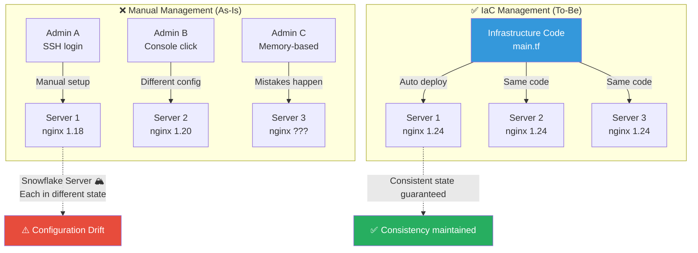
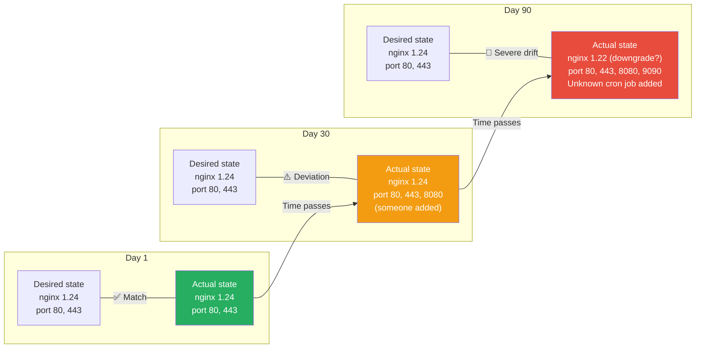
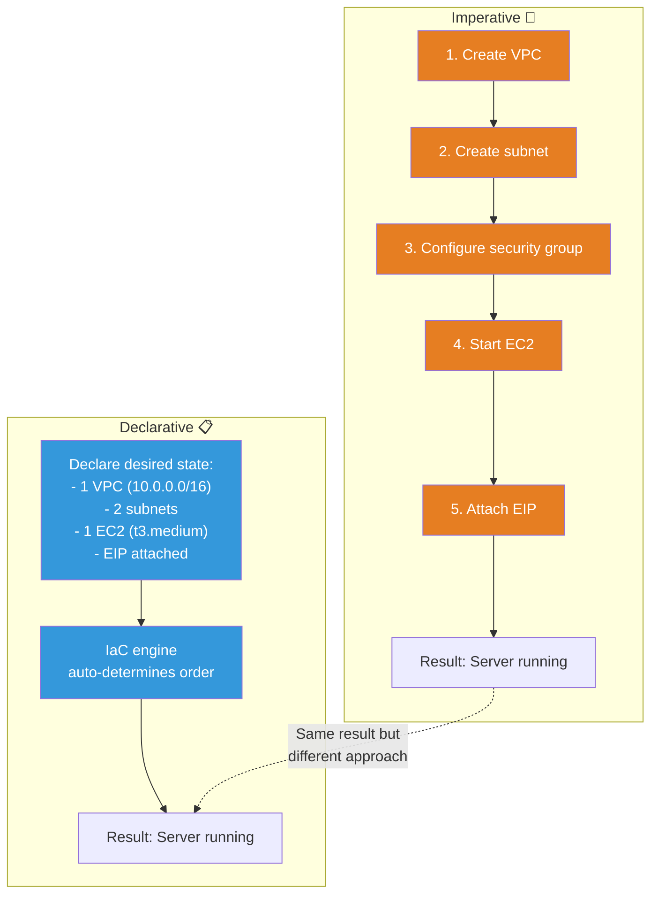
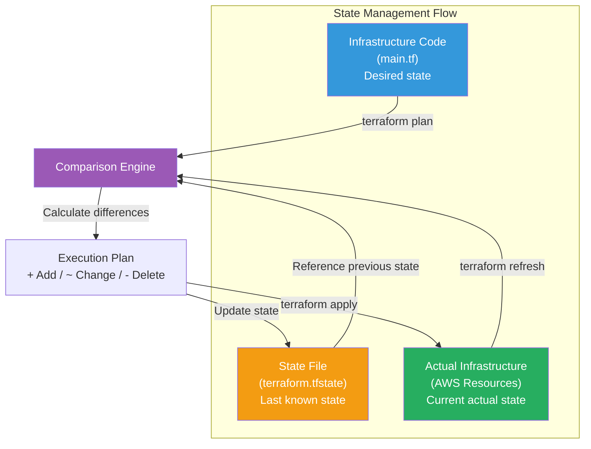
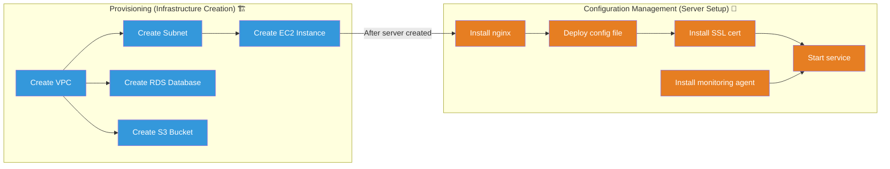
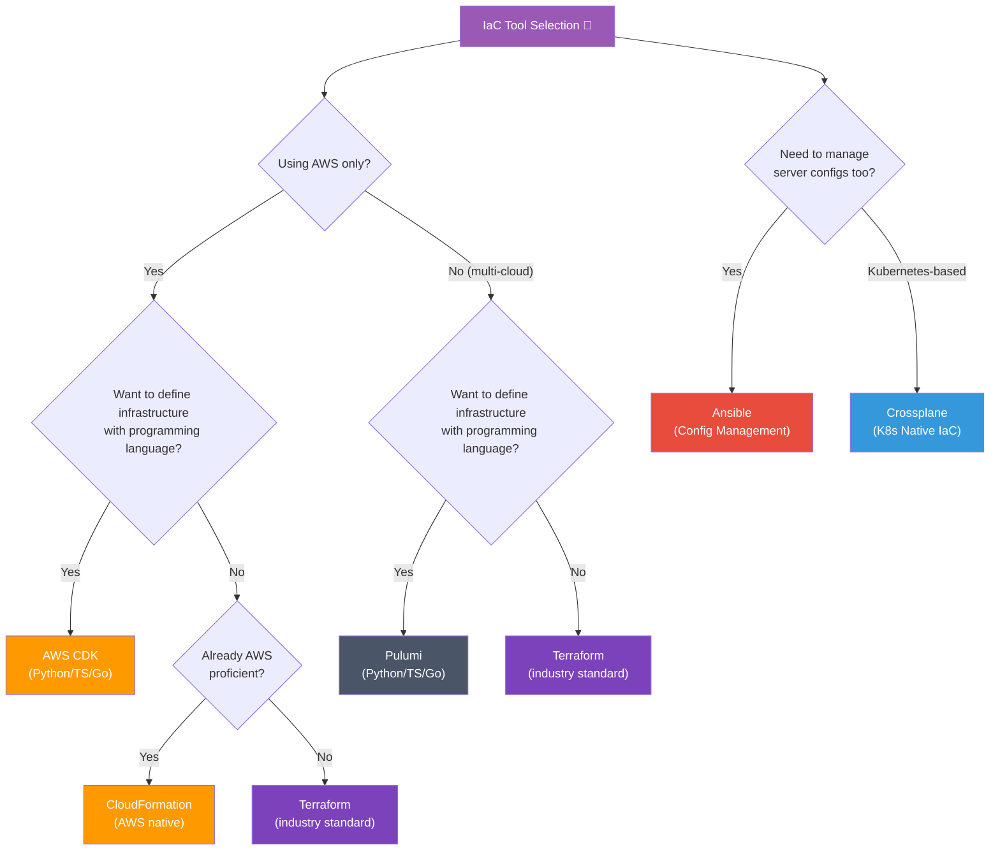
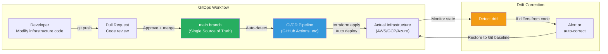

# Infrastructure as Code (IaC): Why Is It Needed?

> Managing infrastructure as code is like changing from a chef cooking by intuition without recipes to using a precise cookbook. It guarantees the same result every time, and anyone can follow the recipe to create it. Let's move from an era where you built [AWS services](../05-cloud-aws/01-iam) by clicking in the console to an era where you manage your entire infrastructure with a single line of code.

---

## 🎯 Why Do You Need to Understand IaC?

### Daily Life Analogy: A Chef Without Recipes

Imagine a famous restaurant chef who doesn't write down recipes and cooks purely by intuition.

- The pasta taste differs between Monday and Tuesday
- If the chef gets sick, nobody can reproduce that dish
- Everything depends on memory: "How much salt did I add?"
- When a new chef arrives, they have to start learning from scratch

**This is the reality of manual infrastructure management.**

```
When IaC becomes necessary in practice:

• Need to configure 100 servers identically           → Impossible manually
• "Who changed this server configuration?"            → No change tracking
• System outage! Need to recover the server quickly   → Configuration not documented
• Dev/staging/production environments differ          → Configuration Drift
• New team members struggle to understand infrastructure → Tribal Knowledge
• Security audit: "Show me infrastructure change history" → Git history solves it
• Want to clean up resources for AWS cost optimization → Full visibility through code
```

### The Nightmare of Manual Management



---

## 🧠 Grasping Core Concepts

### 1. Infrastructure as Code (IaC)

> **Analogy**: A building architect's blueprint

You never see a construction worker building a building without architectural blueprints. IaC is the blueprint for infrastructure. You define the desired state of your infrastructure as code, and tools automatically create that state for you.

### 2. Declarative vs Imperative

> **Analogy**: Taxi destination vs driving instructions

- **Declarative**: "Please take me to Gangnam Station" (Tell the destination; the taxi driver figures out the route)
- **Imperative**: "Go straight → Turn left → Go 300m → Turn right" (Direct every step)

### 3. Idempotency (멱등성)

> **Analogy**: Elevator button

Whether you press the 5th floor button once or ten times in an elevator, the result is the same — you arrive at the 5th floor. Running the same IaC code multiple times should produce identical results.

### 4. State Management

> **Analogy**: A household account book

Without an account book, you don't know your current balance. Terraform's state file is like a "ledger" that records "what state your infrastructure is currently in." Based on this, it calculates "what needs to change."

### 5. Provisioning vs Configuration Management

> **Analogy**: Building a house vs interior decoration

- **Provisioning**: Buying land, erecting columns, putting on a roof (Creating servers/networks/storage)
- **Configuration Management**: Painting walls, placing furniture, installing AC (OS settings, package installation, service configuration)

---

## 🔍 Detailed Deep Dive

### 1. Why IaC Is Necessary

#### The Snowflake Server Problem

"Snowflake Server" refers to each server having a unique state like individual snowflakes. Manual management gradually causes configurations to differ across servers over time.

```
# ❌ The reality of Snowflake Servers

Server A (Built March 2023):
  - Ubuntu 20.04
  - nginx 1.18
  - Node.js 16
  - /etc/nginx/nginx.conf → Modified by admin Kim
  - Firewall rules: ports 80, 443, 8080 (left open for debugging)

Server B (Built September 2023):
  - Ubuntu 22.04
  - nginx 1.24
  - Node.js 18
  - /etc/nginx/nginx.conf → Modified differently by admin Lee
  - Firewall rules: ports 80, 443

Server C (Built February 2024):
  - Ubuntu 22.04
  - nginx 1.24
  - Node.js 20
  - /etc/nginx/nginx.conf → Unknown who modified it
  - Firewall rules: ???
```

#### Configuration Drift (Configuration Deviation)

Over time, the actual state of infrastructure diverges from the intended state.



#### Before and After IaC Comparison

| Item | Before IaC (Manual) | After IaC (Code) |
|------|-------------------|-------------------|
| **Server setup time** | 2-3 days (finding docs + manual setup) | 10-30 minutes (run code) |
| **Environment consistency** | Different per server (Snowflake) | Same result if code is same |
| **Change tracking** | "Who changed it?" detective work | Git history immediately visible |
| **Disaster recovery** | Hours to days (memory-dependent) | Minutes to tens of minutes (rerun code) |
| **Code review** | Impossible | PR-based review possible |
| **Team onboarding** | Oral tradition (tribal knowledge) | Read code (explicit knowledge) |
| **Environment duplication** | Painful | `terraform workspace` |
| **Cost tracking** | Check console one by one | Full visibility through code |

---

### 2. Declarative vs Imperative Approaches

This is one of the most important concepts to understand IaC.



#### Imperative Example (Bash Script)

```bash
#!/bin/bash
# ❌ Imperative approach: Direct all steps

# 1. Create VPC
VPC_ID=$(aws ec2 create-vpc --cidr-block 10.0.0.0/16 --query 'Vpc.VpcId' --output text)
aws ec2 create-tags --resources $VPC_ID --tags Key=Name,Value=my-vpc

# 2. Create subnet
SUBNET_ID=$(aws ec2 create-subnet --vpc-id $VPC_ID --cidr-block 10.0.1.0/24 --query 'Subnet.SubnetId' --output text)

# 3. Create and attach internet gateway
IGW_ID=$(aws ec2 create-internet-gateway --query 'InternetGateway.InternetGatewayId' --output text)
aws ec2 attach-internet-gateway --internet-gateway-id $IGW_ID --vpc-id $VPC_ID

# 4. Create EC2
INSTANCE_ID=$(aws ec2 run-instances \
  --image-id ami-0abcdef1234567890 \
  --instance-type t3.medium \
  --subnet-id $SUBNET_ID \
  --query 'Instances[0].InstanceId' --output text)

# Problems:
# - If VPC already exists? → Error or duplicate creation
# - Fails midway? → Left in partially created state
# - Want to delete? → Must delete each step in reverse order
# - Run again? → Creates again (no idempotency)
```

#### Declarative Example (Terraform)

```hcl
# ✅ Declarative approach: Just declare the desired state

resource "aws_vpc" "main" {
  cidr_block = "10.0.0.0/16"

  tags = {
    Name = "my-vpc"
  }
}

resource "aws_subnet" "public" {
  vpc_id     = aws_vpc.main.id
  cidr_block = "10.0.1.0/24"
}

resource "aws_internet_gateway" "main" {
  vpc_id = aws_vpc.main.id
}

resource "aws_instance" "web" {
  ami           = "ami-0abcdef1234567890"
  instance_type = "t3.medium"
  subnet_id     = aws_subnet.public.id
}

# Advantages:
# - If already exists? → Apply only changes (idempotency)
# - Fails midway? → Track state, can retry
# - Want to delete? → terraform destroy once deletes everything
# - Run again? → "No changes" (already in desired state)
```

#### Comparison Summary

| Characteristic | Imperative | Declarative |
|------|---------------------|---------------------|
| **Method** | Direct "how to" | Declare "what" |
| **Execution order** | Developer decides | Tool decides automatically |
| **Idempotency** | Must implement | Tool guarantees |
| **State management** | Manual tracking | Tool manages |
| **Learning curve** | Low (script writing) | Moderate (DSL learning) |
| **Representative tools** | Ansible, Shell Script | Terraform, CloudFormation, Pulumi |
| **Analogy** | Drive without navigation | Just input destination |

> **Note**: Ansible can be declarative or imperative, but is typically used procedurally. Terraform is purely declarative.

---

### 3. Idempotency

Idempotency is one of the most critical characteristics in IaC. It means **executing the same operation multiple times produces identical results**.

#### Problems Without Idempotency

```bash
# ❌ Non-idempotent script
#!/bin/bash
echo "nameserver 8.8.8.8" >> /etc/resolv.conf

# 1st run: nameserver 8.8.8.8  (1 line)
# 2nd run: nameserver 8.8.8.8  (2 lines - duplicate!)
#          nameserver 8.8.8.8
# 3rd run: nameserver 8.8.8.8  (3 lines - more duplicates!)
#          nameserver 8.8.8.8
#          nameserver 8.8.8.8
```

#### Idempotent Code

```bash
# ✅ Idempotent script
#!/bin/bash
if ! grep -q "nameserver 8.8.8.8" /etc/resolv.conf; then
  echo "nameserver 8.8.8.8" >> /etc/resolv.conf
fi

# 1st run: nameserver 8.8.8.8  (1 line added)
# 2nd run: (no change - already exists)
# 3rd run: (no change)
```

#### Terraform's Idempotency

```bash
# First run
$ terraform apply
aws_instance.web: Creating...
aws_instance.web: Creation complete after 45s [id=i-0abc123]

Apply complete! Resources: 1 added, 0 changed, 0 destroyed.

# Second run (no code changes)
$ terraform apply
aws_instance.web: Refreshing state... [id=i-0abc123]

No changes. Your infrastructure matches the configuration.

Apply complete! Resources: 0 added, 0 changed, 0 destroyed.

# Third run (only instance_type changed)
$ terraform apply
aws_instance.web: Refreshing state... [id=i-0abc123]

  ~ resource "aws_instance" "web" {
      ~ instance_type = "t3.medium" -> "t3.large"  # Only this changes
    }

Plan: 0 to add, 1 to change, 0 to destroy.
```

---

### 4. State Management

#### Role of Terraform State

Terraform stores the current infrastructure state in the `terraform.tfstate` file. This file acts as a bridge connecting "actual infrastructure" to "code."



#### State File Example

```json
{
  "version": 4,
  "terraform_version": "1.7.0",
  "resources": [
    {
      "mode": "managed",
      "type": "aws_instance",
      "name": "web",
      "provider": "provider[\"registry.terraform.io/hashicorp/aws\"]",
      "instances": [
        {
          "attributes": {
            "id": "i-0abc123def456",
            "ami": "ami-0abcdef1234567890",
            "instance_type": "t3.medium",
            "private_ip": "10.0.1.50",
            "public_ip": "54.123.45.67",
            "subnet_id": "subnet-0abc123",
            "tags": {
              "Name": "web-server"
            }
          }
        }
      ]
    }
  ]
}
```

#### Drift Detection

When someone changes infrastructure directly in the console (Drift), Terraform detects it in the next `plan`.

```bash
# If someone changed instance_type to t3.large via AWS console...

$ terraform plan

aws_instance.web: Refreshing state... [id=i-0abc123def456]

Note: Objects have changed outside of Terraform

Terraform detected the following changes made outside of Terraform
since the last "terraform apply":

  # aws_instance.web has been changed
  ~ resource "aws_instance" "web" {
        id            = "i-0abc123def456"
      ~ instance_type = "t3.large" -> "t3.medium"  # Code says t3.medium
        # (1 unchanged attribute hidden)
    }

# Terraform will try to revert to t3.medium as defined in code
```

#### Remote State Repository

When working as a team, state files should be stored in a remote repository, not locally.

```hcl
# backend.tf - Store state in S3
terraform {
  backend "s3" {
    bucket         = "my-terraform-state"
    key            = "prod/terraform.tfstate"
    region         = "ap-northeast-2"
    encrypt        = true
    dynamodb_table = "terraform-locks"  # Prevent concurrent modification (Locking)
  }
}
```

```
State repository comparison:

┌─────────────────┬────────────────┬────────────────┬───────────────┐
│                 │  Local File    │ S3 + DynamoDB  │  Terraform    │
│                 │                │                │  Cloud        │
├─────────────────┼────────────────┼────────────────┼───────────────┤
│ Team Collab.    │  ❌ No         │  ✅ Yes        │  ✅ Yes       │
│ State Locking   │  ❌ None       │  ✅ DynamoDB   │  ✅ Built-in  │
│ Encryption      │  ❌ Manual     │  ✅ S3 SSE     │  ✅ Built-in  │
│ Version Control │  ❌ Manual     │  ✅ S3 versioning │ ✅ Built-in │
│ Access Control  │  ❌ File perms │  ✅ IAM        │  ✅ Built-in  │
│ Cost            │  Free          │  Very cheap    │  Free/Paid    │
│ Setup complexity│  None          │  Moderate      │  Low          │
└─────────────────┴────────────────┴────────────────┴───────────────┘
```

---

### 5. Provisioning vs Configuration Management

Understanding this distinction is key to choosing IaC tools correctly.



| Distinction | Provisioning | Configuration Management |
|------|-------------|------------------------|
| **What** | Create/delete infrastructure resources | OS/app config, package installation |
| **Target** | Cloud resources (VMs, networks, DBs) | Server internals (OS, services, files) |
| **Analogy** | Building on empty land | Interior decoration |
| **Representative tools** | Terraform, CloudFormation, Pulumi | Ansible, Chef, Puppet, SaltStack |
| **Execution target** | Cloud APIs | SSH/WinRM to servers |
| **State** | Cloud resource existence | Server internal configuration |

> **Reality**: Nowadays, containers and immutable infrastructure are reducing the need for configuration management. Using [Kubernetes](../04-kubernetes/01-architecture) means deploying apps via container images instead of server configuration.

---

### 6. IaC Tools Comparison

#### Defining Same Infrastructure in 3 Tools

Below are examples of the same infrastructure — **AWS VPC + EC2 web server** — defined in three different tools.

##### Terraform HCL

```hcl
# main.tf - Defined with Terraform
provider "aws" {
  region = "ap-northeast-2"
}

resource "aws_vpc" "main" {
  cidr_block           = "10.0.0.0/16"
  enable_dns_hostnames = true

  tags = {
    Name        = "web-vpc"
    Environment = "production"
  }
}

resource "aws_subnet" "public" {
  vpc_id                  = aws_vpc.main.id
  cidr_block              = "10.0.1.0/24"
  availability_zone       = "ap-northeast-2a"
  map_public_ip_on_launch = true

  tags = {
    Name = "web-public-subnet"
  }
}

resource "aws_security_group" "web" {
  name        = "web-sg"
  description = "Allow HTTP and SSH"
  vpc_id      = aws_vpc.main.id

  ingress {
    from_port   = 80
    to_port     = 80
    protocol    = "tcp"
    cidr_blocks = ["0.0.0.0/0"]
  }

  ingress {
    from_port   = 22
    to_port     = 22
    protocol    = "tcp"
    cidr_blocks = ["10.0.0.0/16"]  # SSH only from VPC
  }

  egress {
    from_port   = 0
    to_port     = 0
    protocol    = "-1"
    cidr_blocks = ["0.0.0.0/0"]
  }
}

resource "aws_instance" "web" {
  ami                    = "ami-0c9c942bd7bf113a2"  # Amazon Linux 2023
  instance_type          = "t3.medium"
  subnet_id              = aws_subnet.public.id
  vpc_security_group_ids = [aws_security_group.web.id]

  user_data = <<-EOF
    #!/bin/bash
    yum install -y nginx
    systemctl start nginx
    systemctl enable nginx
  EOF

  tags = {
    Name = "web-server"
  }
}

output "web_server_ip" {
  value = aws_instance.web.public_ip
}
```

##### CloudFormation YAML

```yaml
# template.yaml - Defined with CloudFormation
AWSTemplateFormatVersion: '2010-09-09'
Description: Web Server Infrastructure

Resources:
  MainVPC:
    Type: AWS::EC2::VPC
    Properties:
      CidrBlock: 10.0.0.0/16
      EnableDnsHostnames: true
      Tags:
        - Key: Name
          Value: web-vpc
        - Key: Environment
          Value: production

  PublicSubnet:
    Type: AWS::EC2::Subnet
    Properties:
      VpcId: !Ref MainVPC
      CidrBlock: 10.0.1.0/24
      AvailabilityZone: ap-northeast-2a
      MapPublicIpOnLaunch: true
      Tags:
        - Key: Name
          Value: web-public-subnet

  WebSecurityGroup:
    Type: AWS::EC2::SecurityGroup
    Properties:
      GroupName: web-sg
      GroupDescription: Allow HTTP and SSH
      VpcId: !Ref MainVPC
      SecurityGroupIngress:
        - IpProtocol: tcp
          FromPort: 80
          ToPort: 80
          CidrIp: 0.0.0.0/0
        - IpProtocol: tcp
          FromPort: 22
          ToPort: 22
          CidrIp: 10.0.0.0/16
      SecurityGroupEgress:
        - IpProtocol: -1
          CidrIp: 0.0.0.0/0

  WebServer:
    Type: AWS::EC2::Instance
    Properties:
      ImageId: ami-0c9c942bd7bf113a2
      InstanceType: t3.medium
      SubnetId: !Ref PublicSubnet
      SecurityGroupIds:
        - !Ref WebSecurityGroup
      UserData:
        Fn::Base64: |
          #!/bin/bash
          yum install -y nginx
          systemctl start nginx
          systemctl enable nginx
      Tags:
        - Key: Name
          Value: web-server

Outputs:
  WebServerIP:
    Description: Web Server Public IP
    Value: !GetAtt WebServer.PublicIp
```

##### Pulumi Python

```python
# __main__.py - Defined with Pulumi (Python)
import pulumi
import pulumi_aws as aws

# VPC
vpc = aws.ec2.Vpc("main",
    cidr_block="10.0.0.0/16",
    enable_dns_hostnames=True,
    tags={
        "Name": "web-vpc",
        "Environment": "production",
    }
)

# Subnet
subnet = aws.ec2.Subnet("public",
    vpc_id=vpc.id,
    cidr_block="10.0.1.0/24",
    availability_zone="ap-northeast-2a",
    map_public_ip_on_launch=True,
    tags={"Name": "web-public-subnet"}
)

# Security Group
sg = aws.ec2.SecurityGroup("web",
    name="web-sg",
    description="Allow HTTP and SSH",
    vpc_id=vpc.id,
    ingress=[
        {"protocol": "tcp", "from_port": 80, "to_port": 80,
         "cidr_blocks": ["0.0.0.0/0"]},
        {"protocol": "tcp", "from_port": 22, "to_port": 22,
         "cidr_blocks": ["10.0.0.0/16"]},
    ],
    egress=[
        {"protocol": "-1", "from_port": 0, "to_port": 0,
         "cidr_blocks": ["0.0.0.0/0"]},
    ]
)

# EC2 Instance
server = aws.ec2.Instance("web",
    ami="ami-0c9c942bd7bf113a2",
    instance_type="t3.medium",
    subnet_id=subnet.id,
    vpc_security_group_ids=[sg.id],
    user_data="""#!/bin/bash
yum install -y nginx
systemctl start nginx
systemctl enable nginx
""",
    tags={"Name": "web-server"}
)

pulumi.export("web_server_ip", server.public_ip)
```

#### Comprehensive Tool Comparison Table

```
┌──────────────────┬─────────────┬──────────────┬───────────────┬─────────────┬──────────────┬────────────┐
│                  │  Terraform  │  Ansible     │ CloudFormation│  Pulumi     │  AWS CDK     │ Crossplane │
├──────────────────┼─────────────┼──────────────┼───────────────┼─────────────┼──────────────┼────────────┤
│ Type             │Provisioning │ Config Mgmt  │ Provisioning  │Provisioning │Provisioning  │Provisioning│
│ Approach         │ Declarative │Procedural/Dec│ Declarative   │ Imperative  │ Imperative   │ Declarative│
│ Language         │ HCL         │ YAML         │ JSON/YAML     │ Python/TS/Go│ Python/TS/Go │ YAML       │
│ Cloud Support    │ Multi-cloud │ Multi-cloud  │ AWS only      │ Multi-cloud │ AWS only     │ Multi-cloud│
│ State Management │ State file  │ None(agent)  │ Stack mgmt    │ State file  │ CFN stack    │ K8s etcd   │
│ Learning Curve   │ Moderate    │ Low          │ Moderate      │ High        │ High         │ High       │
│ Community        │ Very large  │ Very large   │ Large (AWS)   │ Growing     │ Growing      │ Growing    │
│ Agent-based      │ Agentless   │ Agentless    │ Agentless     │ Agentless   │ Agentless    │ K8s-based  │
│ Test Tools       │ terratest   │ molecule     │ taskcat       │ Built-in    │ Built-in     │ Limited    │
│ License          │ BSL 1.1     │ GPL v3       │ Free (AWS)    │ Apache 2.0  │ Apache 2.0   │ Apache 2.0 │
│ Drift Detection  │ ✅ plan     │ ❌           │ ✅ Drift chk  │ ✅ preview  │ ✅ diff      │ ✅ auto fix│
└──────────────────┴─────────────┴──────────────┴───────────────┴─────────────┴──────────────┴────────────┘
```

#### Tool Selection Guide



---

### 7. GitOps and IaC Relationship

GitOps is an operational model that makes IaC even more powerful. It uses a Git repository as "Single Source of Truth" and performs all infrastructure changes only through Git.



#### GitOps Principles

1. **Declarative**: Define infrastructure's desired state as code
2. **Versioned**: All changes recorded in Git
3. **Automated**: Changes automatically applied after merge
4. **Self-healing**: Auto-restore to Git state if drift occurs

```yaml
# .github/workflows/terraform.yml - Implement GitOps with GitHub Actions
name: Terraform GitOps

on:
  push:
    branches: [main]
    paths: ['infra/**']
  pull_request:
    branches: [main]
    paths: ['infra/**']

jobs:
  plan:
    if: github.event_name == 'pull_request'
    runs-on: ubuntu-latest
    steps:
      - uses: actions/checkout@v4

      - name: Terraform Init
        run: terraform init
        working-directory: infra/

      - name: Terraform Plan
        run: terraform plan -no-color
        working-directory: infra/
        env:
          AWS_ACCESS_KEY_ID: ${{ secrets.AWS_ACCESS_KEY_ID }}
          AWS_SECRET_ACCESS_KEY: ${{ secrets.AWS_SECRET_ACCESS_KEY }}

  apply:
    if: github.ref == 'refs/heads/main' && github.event_name == 'push'
    runs-on: ubuntu-latest
    steps:
      - uses: actions/checkout@v4

      - name: Terraform Init
        run: terraform init
        working-directory: infra/

      - name: Terraform Apply
        run: terraform apply -auto-approve
        working-directory: infra/
        env:
          AWS_ACCESS_KEY_ID: ${{ secrets.AWS_ACCESS_KEY_ID }}
          AWS_SECRET_ACCESS_KEY: ${{ secrets.AWS_SECRET_ACCESS_KEY }}
```

---

### 8. IaC Best Practices

#### Directory Structure Best Practices

```
infra/
├── environments/
│   ├── dev/
│   │   ├── main.tf          # Dev environment config
│   │   ├── variables.tf
│   │   ├── terraform.tfvars # Dev variable values
│   │   └── backend.tf       # Dev state repository
│   ├── staging/
│   │   ├── main.tf
│   │   ├── variables.tf
│   │   ├── terraform.tfvars
│   │   └── backend.tf
│   └── prod/
│       ├── main.tf
│       ├── variables.tf
│       ├── terraform.tfvars
│       └── backend.tf
├── modules/                  # Reusable modules
│   ├── vpc/
│   │   ├── main.tf
│   │   ├── variables.tf
│   │   └── outputs.tf
│   ├── ec2/
│   │   ├── main.tf
│   │   ├── variables.tf
│   │   └── outputs.tf
│   └── rds/
│       ├── main.tf
│       ├── variables.tf
│       └── outputs.tf
└── README.md
```

#### Modularization Example

```hcl
# modules/vpc/main.tf - Reusable VPC module
variable "vpc_cidr" {
  description = "VPC CIDR block"
  type        = string
}

variable "environment" {
  description = "Environment name"
  type        = string
}

variable "public_subnet_cidrs" {
  description = "Public subnet CIDR blocks"
  type        = list(string)
}

resource "aws_vpc" "main" {
  cidr_block           = var.vpc_cidr
  enable_dns_hostnames = true

  tags = {
    Name        = "${var.environment}-vpc"
    Environment = var.environment
  }
}

resource "aws_subnet" "public" {
  count             = length(var.public_subnet_cidrs)
  vpc_id            = aws_vpc.main.id
  cidr_block        = var.public_subnet_cidrs[count.index]
  availability_zone = data.aws_availability_zones.available.names[count.index]

  tags = {
    Name = "${var.environment}-public-${count.index + 1}"
  }
}

output "vpc_id" {
  value = aws_vpc.main.id
}

output "public_subnet_ids" {
  value = aws_subnet.public[*].id
}
```

```hcl
# environments/prod/main.tf - Using modules
module "vpc" {
  source = "../../modules/vpc"

  vpc_cidr            = "10.0.0.0/16"
  environment         = "prod"
  public_subnet_cidrs = ["10.0.1.0/24", "10.0.2.0/24"]
}

module "web_server" {
  source = "../../modules/ec2"

  instance_type = "t3.large"
  subnet_id     = module.vpc.public_subnet_ids[0]
  environment   = "prod"
}
```

#### Code Review Checklist

```markdown
IaC Pull Request Review Checklist:

□ Is terraform plan output attached to the PR?
□ Are there no unintended resource deletions (destroy)?
□ Are variables used instead of hardcoded values?
□ Are sensitive values (passwords, API keys) excluded from code?
□ Are tags (Name, Environment, Team, etc) properly set?
□ Are there unnecessary 0.0.0.0/0 inbound rules in security groups?
□ Are modules designed for reusability?
□ Are outputs defined so other modules/environments can use them?
□ Is README updated?
□ Has cost impact been reviewed? (using tools like infracost)
```

---

## 💻 Hands-On Practice

### Lab 1: Create S3 Bucket with Terraform (Simplest IaC)

> **Prerequisites**: AWS CLI configured, Terraform installed

#### Step 1: Create Project Directory

```bash
mkdir -p ~/iac-lab/01-s3-bucket
cd ~/iac-lab/01-s3-bucket
```

#### Step 2: Write Terraform Code

```hcl
# main.tf
terraform {
  required_version = ">= 1.7.0"

  required_providers {
    aws = {
      source  = "hashicorp/aws"
      version = "~> 5.0"
    }
  }
}

provider "aws" {
  region = "ap-northeast-2"  # Seoul region
}

# Create S3 bucket
resource "aws_s3_bucket" "my_bucket" {
  bucket = "my-first-iac-bucket-${random_id.suffix.hex}"

  tags = {
    Name        = "My First IaC Bucket"
    Environment = "lab"
    ManagedBy   = "terraform"
  }
}

# Random ID to prevent bucket name conflicts
resource "random_id" "suffix" {
  byte_length = 4
}

# Enable bucket versioning
resource "aws_s3_bucket_versioning" "my_bucket" {
  bucket = aws_s3_bucket.my_bucket.id

  versioning_configuration {
    status = "Enabled"
  }
}

# Output results
output "bucket_name" {
  value       = aws_s3_bucket.my_bucket.bucket
  description = "Created S3 bucket name"
}

output "bucket_arn" {
  value       = aws_s3_bucket.my_bucket.arn
  description = "Created S3 bucket ARN"
}
```

#### Step 3: Initialize Terraform

```bash
$ terraform init

Initializing the backend...

Initializing provider plugins...
- Finding hashicorp/aws versions matching "~> 5.0"...
- Finding latest version of hashicorp/random...
- Installing hashicorp/aws v5.82.2...
- Installed hashicorp/aws v5.82.2 (signed by HashiCorp)
- Installing hashicorp/random v3.6.3...
- Installed hashicorp/random v3.6.3 (signed by HashiCorp)

Terraform has been successfully initialized!
```

#### Step 4: Review Execution Plan

```bash
$ terraform plan

Terraform used the selected providers to generate the following execution plan.
Resource actions are indicated with the following symbols:
  + create

Terraform will perform the following actions:

  # aws_s3_bucket.my_bucket will be created
  + resource "aws_s3_bucket" "my_bucket" {
      + arn                     = (known after apply)
      + bucket                  = (known after apply)
      + id                      = (known after apply)
      + region                  = "ap-northeast-2"
      + tags                    = {
          + "Environment" = "lab"
          + "ManagedBy"   = "terraform"
          + "Name"        = "My First IaC Bucket"
        }
    }

  # random_id.suffix will be created
  + resource "random_id" "suffix" {
      + b64_std = (known after apply)
      + hex     = (known after apply)
      + id      = (known after apply)
    }

Plan: 3 to add, 0 to change, 0 to destroy.

Changes to Outputs:
  + bucket_arn  = (known after apply)
  + bucket_name = (known after apply)
```

#### Step 5: Apply

```bash
$ terraform apply

# (plan output omitted)

Do you want to perform these actions?
  Terraform will perform the actions described above.
  Only 'yes' will be accepted to approve.

  Enter a value: yes

random_id.suffix: Creating...
random_id.suffix: Creation complete after 0s [id=qL7xYQ]
aws_s3_bucket.my_bucket: Creating...
aws_s3_bucket.my_bucket: Creation complete after 2s [id=my-first-iac-bucket-a8bef161]
aws_s3_bucket_versioning.my_bucket: Creating...
aws_s3_bucket_versioning.my_bucket: Creation complete after 1s

Apply complete! Resources: 3 added, 0 changed, 0 destroyed.

Outputs:

bucket_arn  = "arn:aws:s3:::my-first-iac-bucket-a8bef161"
bucket_name = "my-first-iac-bucket-a8bef161"
```

#### Step 6: Verify Idempotency (Run Again)

```bash
$ terraform apply

aws_s3_bucket.my_bucket: Refreshing state...
random_id.suffix: Refreshing state...
aws_s3_bucket_versioning.my_bucket: Refreshing state...

No changes. Your infrastructure matches the configuration.

Apply complete! Resources: 0 added, 0 changed, 0 destroyed.
```

#### Step 7: Cleanup (Destroy)

```bash
$ terraform destroy

# (list of resources to destroy shown)

Do you want to perform these actions?
  Enter a value: yes

aws_s3_bucket_versioning.my_bucket: Destroying...
aws_s3_bucket_versioning.my_bucket: Destruction complete after 1s
aws_s3_bucket.my_bucket: Destroying...
aws_s3_bucket.my_bucket: Destruction complete after 1s
random_id.suffix: Destroying...
random_id.suffix: Destruction complete after 0s

Destroy complete! Resources: 3 destroyed.
```

---

### Lab 2: Experience Imperative vs Declarative

Experiencing the same task in two approaches shows the difference clearly.

#### Imperative (AWS CLI)

```bash
# Create S3 bucket (imperative)
aws s3api create-bucket \
  --bucket my-imperative-bucket-test \
  --region ap-northeast-2 \
  --create-bucket-configuration LocationConstraint=ap-northeast-2

# Run again? → Error!
aws s3api create-bucket \
  --bucket my-imperative-bucket-test \
  --region ap-northeast-2 \
  --create-bucket-configuration LocationConstraint=ap-northeast-2

# An error occurred (BucketAlreadyOwnedByYou): Your previous request
# to create the named bucket succeeded and you already own it.

# To delete, run command manually
aws s3api delete-bucket --bucket my-imperative-bucket-test
```

#### Declarative (Terraform)

```bash
# Create S3 bucket (declarative)
terraform apply    # → Created

# Run again? → "No changes" (no error!)
terraform apply    # → No changes

# To delete
terraform destroy  # → Clean deletion
```

---

### Lab 3: Understanding State Files

```bash
# After terraform apply, check state file
$ terraform show

# aws_s3_bucket.my_bucket:
resource "aws_s3_bucket" "my_bucket" {
    arn                         = "arn:aws:s3:::my-first-iac-bucket-a8bef161"
    bucket                      = "my-first-iac-bucket-a8bef161"
    hosted_zone_id              = "Z3W03O7B5YMIYP"
    id                          = "my-first-iac-bucket-a8bef161"
    region                      = "ap-northeast-2"
    request_payer               = "BucketOwner"
    tags                        = {
        "Environment" = "lab"
        "ManagedBy"   = "terraform"
        "Name"        = "My First IaC Bucket"
    }
}

# List state
$ terraform state list
aws_s3_bucket.my_bucket
aws_s3_bucket_versioning.my_bucket
random_id.suffix

# Detailed info on specific resource
$ terraform state show aws_s3_bucket.my_bucket
```

---

## 🏢 In Practice

### Scenario 1: Multi-Environment Management

**Situation**: Operating 3 environments — development (dev), staging, and production (prod).

```hcl
# environments/dev/terraform.tfvars
environment    = "dev"
instance_type  = "t3.small"
instance_count = 1
rds_class      = "db.t3.micro"
enable_waf     = false

# environments/staging/terraform.tfvars
environment    = "staging"
instance_type  = "t3.medium"
instance_count = 2
rds_class      = "db.t3.small"
enable_waf     = false

# environments/prod/terraform.tfvars
environment    = "prod"
instance_type  = "t3.large"
instance_count = 4
rds_class      = "db.r6g.large"
enable_waf     = true
```

```bash
# Deploy dev environment
cd environments/dev
terraform apply -var-file="terraform.tfvars"

# Deploy production (same code, different config)
cd environments/prod
terraform apply -var-file="terraform.tfvars"
```

**Key**: Same module, different variable values. Maintain consistency across environments with one set of code.

---

### Scenario 2: Disaster Recovery

**Situation**: Seoul region (ap-northeast-2) experienced an outage. Need to quickly recover infrastructure in Tokyo region (ap-northeast-1).

```hcl
# DR scenario: Change only region to recover identical infrastructure
# variables.tf
variable "region" {
  default = "ap-northeast-2"  # Change to "ap-northeast-1" during disaster
}

variable "ami_map" {
  description = "Region-specific AMI mapping"
  type        = map(string)
  default = {
    "ap-northeast-2" = "ami-0c9c942bd7bf113a2"  # Seoul
    "ap-northeast-1" = "ami-0d52744d6551d851e"  # Tokyo
  }
}
```

```bash
# Disaster! Recover in Tokyo region
terraform apply -var="region=ap-northeast-1"

# Without IaC:
# 1. Remember Seoul server configs (if docs exist)
# 2. Manually create in Tokyo one-by-one (hours to days)
# 3. High chance of config omissions
#
# With IaC:
# 1. Change region variable
# 2. terraform apply (minutes to tens of minutes)
# 3. Identical infrastructure guaranteed
```

---

### Scenario 3: Security Audit Response

**Situation**: Security team requests "Show infrastructure changes for the last 6 months."

```bash
# Perfect audit trail with IaC + Git
$ git log --oneline --since="6 months ago" -- infra/

a1b2c3d feat: add WAF rules for OWASP Top 10
d4e5f6g fix: restrict SSH access to VPN CIDR only
h7i8j9k feat: enable S3 bucket encryption (AES-256)
l0m1n2o chore: upgrade RDS from db.t3 to db.r6g
p3q4r5s feat: add CloudTrail logging to all regions
t6u7v8w fix: close unused port 8080 in prod SG
x9y0z1a feat: add VPC flow logs for network monitoring

# Detailed info on specific change
$ git show d4e5f6g

  resource "aws_security_group_rule" "ssh" {
-   cidr_blocks = ["0.0.0.0/0"]        # SSH was open to all
+   cidr_blocks = ["10.100.0.0/16"]    # Restricted to VPN
  }

  Reviewed-by: security-team
  Approved-by: infra-lead
```

```
Audit response comparison:

Without IaC:
"Need to dig through CloudTrail logs..."
"Not sure who changed it in the console..."
"Don't know why it changed that way..."
→ Audit response time: days to weeks

With IaC + Git:
"Here's the Git history."
"Each change has PR review records."
"Commit messages explain the why."
→ Audit response time: minutes to hours
```

---

## ⚠️ Common Mistakes

### Mistake 1: Committing State Files to Git

```bash
# ❌ Never do this!
git add terraform.tfstate
git commit -m "add state file"

# State files contain sensitive information:
# - DB passwords
# - IAM keys
# - Private IP addresses
# - Encryption keys

# ✅ Must add to .gitignore
# .gitignore
*.tfstate
*.tfstate.*
*.tfvars       # Exclude sensitive variable values too
.terraform/    # Provider plugin directory
```

**Solution**: Use remote backend (S3 + DynamoDB) and add state files to `.gitignore`.

---

### Mistake 2: Using Hardcoded Values

```hcl
# ❌ Hardcoding (must modify code per environment)
resource "aws_instance" "web" {
  ami           = "ami-0c9c942bd7bf113a2"
  instance_type = "t3.large"
  subnet_id     = "subnet-0abc123def456"
}

# ✅ Using variables (separate config per environment)
variable "ami_id" {
  description = "EC2 AMI ID"
  type        = string
}

variable "instance_type" {
  description = "EC2 instance type"
  type        = string
  default     = "t3.medium"
}

resource "aws_instance" "web" {
  ami           = var.ami_id
  instance_type = var.instance_type
  subnet_id     = var.subnet_id
}
```

**Solution**: Use variables and environment-specific `tfvars` files.

---

### Mistake 3: Putting Everything in One File

```bash
# ❌ All resources in single main.tf (500+ lines)
infra/
└── main.tf  # VPC + EC2 + RDS + S3 + IAM + ... (unmanageable)

# ✅ Separate files by purpose
infra/
├── main.tf          # Provider, Terraform config
├── vpc.tf           # VPC, subnets, routing
├── ec2.tf           # EC2 instances
├── rds.tf           # RDS database
├── security.tf      # Security groups, IAM
├── variables.tf     # Variable declarations
├── outputs.tf       # Output definitions
└── terraform.tfvars # Variable values (exclude from Git)
```

**Solution**: Separate files by resource type and modularize large projects.

---

### Mistake 4: Running `terraform apply` Without plan

```bash
# ❌ Apply without checking plan
terraform apply -auto-approve  # Never in production!

# ✅ Always check plan first
terraform plan -out=tfplan     # Save plan to file
# (Carefully review plan content)
terraform apply tfplan          # Apply exact reviewed plan
```

**Solution**: Always follow plan → review → apply sequence. In CI/CD, comment plan results on PRs.

---

### Mistake 5: Mixing Manual Changes with IaC

```bash
# ❌ Modifying Terraform-created resources in AWS console
# → Configuration Drift happens!
# → Next terraform apply may cause unexpected changes/deletions

# Example: Added port 3306 to security group via console
# → terraform plan output:
#
# ~ aws_security_group.web
#   - ingress {  # This rule will be deleted!
#       from_port   = 3306
#       to_port     = 3306
#     }
#
# Code doesn't have this rule, so Terraform removes it!

# ✅ All changes through code only!
# 1. Add security group rule to code
# 2. Create PR → code review
# 3. terraform apply
```

**Solution**: Establish team rule: "Console is read-only." All changes flow through code → PR → apply.

---

## 📝 Wrap-Up

### Core Concept Summary Table

| Concept | Explanation | Analogy |
|------|------|------|
| **IaC** | Define and manage infrastructure as code | Architect's blueprint |
| **Declarative** | Declare "what" you want | "Take me to Gangnam Station" |
| **Imperative** | Direct "how" step-by-step | "Go straight → turn left → 300m" |
| **Idempotency** | Multiple runs produce same result | Elevator 5th floor button |
| **State Management** | Track current infrastructure state | Account book (ledger) |
| **Configuration Drift** | Actual state differs from code | Recipe vs actual cooking |
| **Provisioning** | Create infrastructure resources | Building construction |
| **Config Management** | Manage server internals | Interior decoration |
| **GitOps** | Git as Single Source of Truth | Official recipe book |

### IaC Adoption Checklist

```
IaC Adoption Readiness Checklist:

□ Have you chosen an IaC tool? (Terraform recommended for start)
□ Have you configured remote state storage? (S3 + DynamoDB)
□ Have you excluded state files and sensitive info in .gitignore?
□ Have you designed directory structure? (environments/ + modules/)
□ Have you established team rules? (no console changes, PR required, plan review required)
□ Have you set up CI/CD pipeline? (plan → review → apply)
□ Do you have a plan to import existing infrastructure? (terraform import)
□ Do you have team training plan?
```

### Tool Selection at a Glance

```
"Which IaC tool should I use?"

Starting new? → Terraform (industry standard, abundant resources)
AWS only? → Terraform or CloudFormation
Prefer programming language? → Pulumi or AWS CDK
Server configuration needed? → Ansible
Kubernetes-focused? → Crossplane

Most common real-world combinations:
• Terraform (infrastructure creation) + Ansible (server config)
• Terraform (infrastructure creation) + Kubernetes (app deployment)
• AWS CDK (infrastructure creation) + GitHub Actions (CI/CD)
```

---

## 🔗 Next Steps

This lecture covered IaC concepts and necessity. The next lecture will focus on **Terraform**, the most widely used IaC tool.

**Next lecture**: [Terraform Basics - HCL Syntax and Resource Management](./02-terraform-basics)

```
Topics in next lecture:
• Terraform installation and initial setup
• HCL (HashiCorp Configuration Language) syntax
• Provider, Resource, Data Source, Variable, Output
• terraform init / plan / apply / destroy workflow
• Lab: Build 3-tier architecture with VPC + EC2 + RDS
```

**Related lectures to review**:
- [AWS IAM - Access Control Fundamentals](../05-cloud-aws/01-iam)
- [AWS VPC - Network Design](../05-cloud-aws/02-vpc)
- [AWS EC2 - Server Management](../05-cloud-aws/03-ec2-autoscaling)
- [Kubernetes Architecture](../04-kubernetes/01-architecture)
- [Helm & Kustomize - K8s Package Management](../04-kubernetes/12-helm-kustomize)
