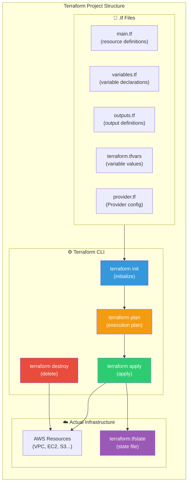
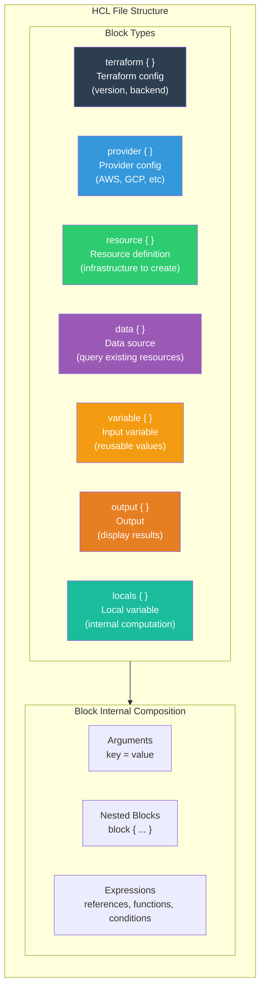
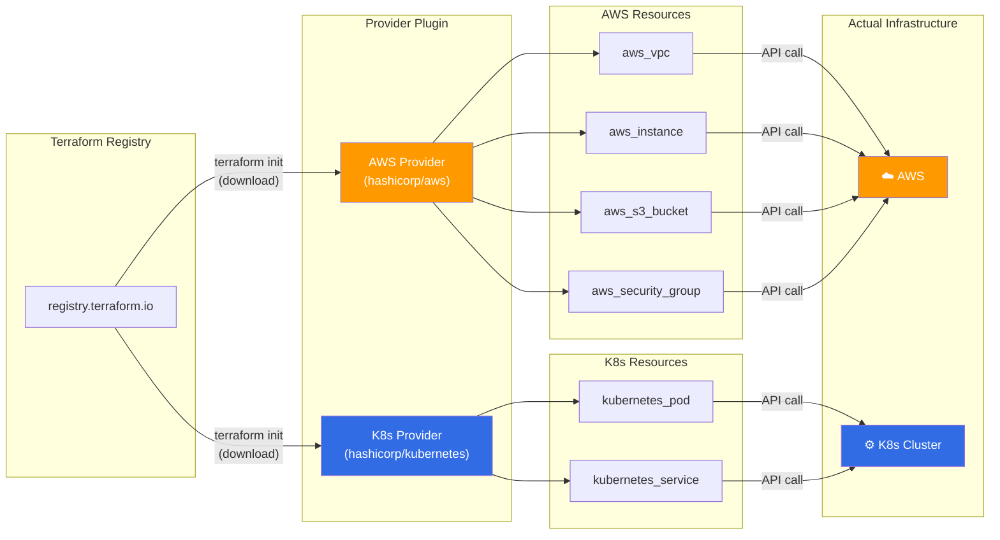
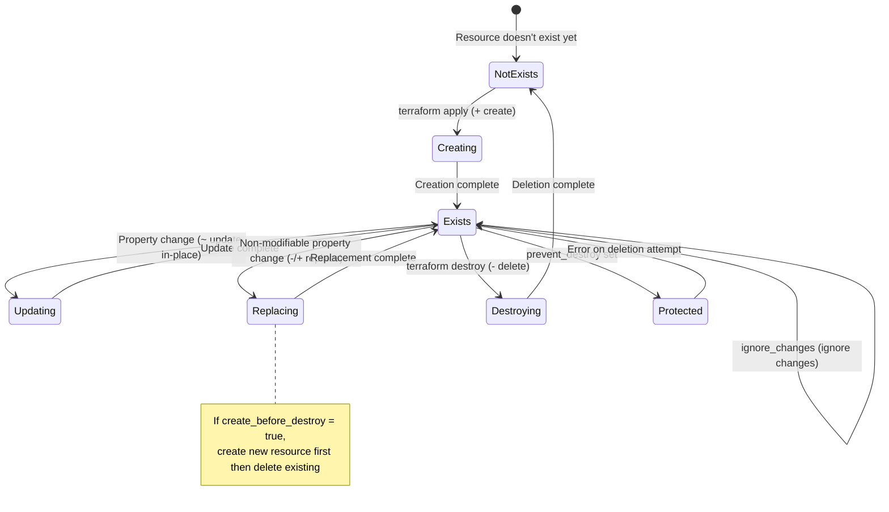
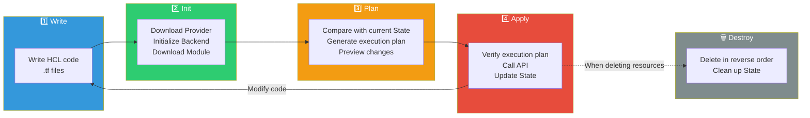
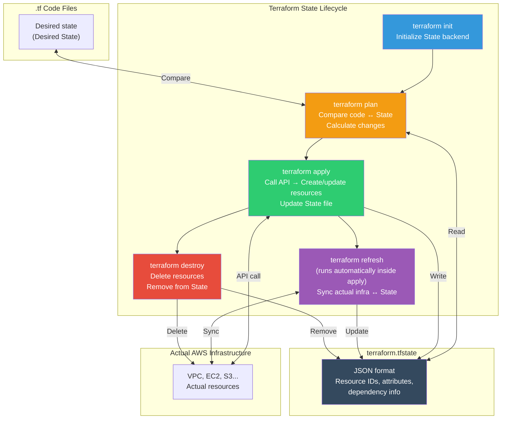

# Terraform Basics

> You learned the IaC concept in [the previous lecture](./01-concept). Now let's work directly with **Terraform**, the most widely used IaC tool. From HCL syntax to Provider, Resource, Variable, and Output — we'll practice the entire workflow from `terraform init` to `destroy`.

---

## 🎯 Why Do You Need to Understand Terraform?

### Daily Life Analogy: An Architecture Design Office

Imagine building a house. An architect draws **architectural blueprints**, then a contractor builds the house according to the blueprints. What if you said "Just build it however you think" without blueprints? Every house would turn out different.

Terraform is exactly this: **architectural blueprint + automatic construction system**.

- **HCL file** = Building design blueprint (declare what infrastructure to create)
- **terraform plan** = Design review meeting (preview how it will turn out)
- **terraform apply** = Actual construction (build infrastructure according to the blueprint)
- **terraform destroy** = Demolition (clean removal when no longer needed)

### When Terraform Is Needed in Practice

```
When Terraform is needed in practice:
• Want to create VPC + Subnet + EC2 with code           → Write main.tf
• Need identical dev/staging/prod environments         → Reuse with variable changes
• "Who changed this Security Group rule?"              → Track via Git history
• Want to see impact scope before infrastructure change → terraform plan
• Need to clean up 100 resources at once               → terraform destroy
• Want to manage manually created AWS resources as code → terraform import
• Want to auto-deploy infrastructure in CI/CD pipeline → terraform apply -auto-approve
```

If you've created [IAM](../05-cloud-aws/01-iam) and [VPC](../05-cloud-aws/02-vpc) in the console, this time we'll create the same thing **with code**.

---

## 🧠 Grasping Core Concepts

To understand Terraform, you must grasp 5 core concepts first.

### Analogy: Architecture Project

| Architecture World | Terraform |
|-----------|-----------|
| Design document language (CAD) | **HCL** (HashiCorp Configuration Language) |
| Building material suppliers (Posco, Hanssem, etc.) | **Provider** (AWS, GCP, Azure, etc.) |
| Actual structures (buildings, roads, pipes) | **Resource** (EC2, VPC, S3, etc.) |
| Existing building information inquiry (title deeds) | **Data Source** (reference existing resources) |
| Design variables (number of floors, area, finishes) | **Variable** (reusable input values) |
| Project completion report (address, area, etc.) | **Output** (output results) |
| Construction progress log | **State** (current infrastructure state record) |

### Overall Structure at a Glance



---

## 🔍 Detailed Deep Dive

### 1. HCL (HashiCorp Configuration Language) Syntax Basics

HCL is Terraform's dedicated design document language. It expresses data like JSON but is **much easier for humans to read and write**.

#### Block Structure

The basic unit of HCL is **Block**. A block has the form `type "label" { ... }`.

```hcl
# Basic block structure
# block_type "label1" "label2" {
#   argument = value
# }

# Example: AWS EC2 instance resource block
resource "aws_instance" "web_server" {
  ami           = "ami-0c6b1d09930fac512"
  instance_type = "t3.micro"

  tags = {
    Name = "web-server"
  }
}
```

Let's understand what each part means.

| Part | Description | Example |
|------|------|------|
| `resource` | Block Type | resource, variable, output, data, etc. |
| `"aws_instance"` | Label 1 (resource type) | AWS EC2 instance |
| `"web_server"` | Label 2 (resource name) | My internal reference name |
| `ami = "..."` | Argument | key = value format |

#### Data Types

```hcl
# String
name = "my-server"

# Number
count = 3

# Boolean
enable_monitoring = true

# List/Tuple
availability_zones = ["ap-northeast-2a", "ap-northeast-2c"]

# Map/Object
tags = {
  Environment = "production"
  Team        = "devops"
}
```

#### String Interpolation

You can embed variables and expressions inside strings.

```hcl
# Variable reference
name = "web-${var.environment}"
# If var.environment is "prod" → "web-prod"

# Resource attribute reference
subnet_id = aws_subnet.public.id
# Reference the id attribute of the aws_subnet resource named "public"

# Conditional expression (ternary operator)
instance_type = var.environment == "prod" ? "t3.large" : "t3.micro"
```

#### Key Built-in Functions

Terraform provides 100+ built-in functions. Let's look at frequently used ones.

```hcl
# String functions
upper("hello")                    # → "HELLO"
lower("HELLO")                    # → "hello"
format("Hello, %s!", "World")     # → "Hello, World!"
join(", ", ["a", "b", "c"])       # → "a, b, c"
split(",", "a,b,c")              # → ["a", "b", "c"]

# Number functions
min(5, 12, 3)                     # → 3
max(5, 12, 3)                     # → 12
ceil(4.3)                         # → 5

# Collection functions
length(["a", "b", "c"])           # → 3
contains(["a", "b"], "a")         # → true
merge({a=1}, {b=2})               # → {a=1, b=2}
lookup({a=1, b=2}, "a", 0)       # → 1

# File system functions
file("${path.module}/userdata.sh")          # Read file content as string
filebase64("${path.module}/script.sh")      # Read and Base64 encode
templatefile("${path.module}/config.tpl", { # Render template file
  port = 8080
  host = "0.0.0.0"
})

# CIDR functions (networking)
cidrsubnet("10.0.0.0/16", 8, 1)   # → "10.0.1.0/24"
cidrsubnet("10.0.0.0/16", 8, 2)   # → "10.0.2.0/24"
```

> You can test functions directly with `terraform console` command. We'll do this in hands-on practice.

#### HCL Structure Diagram



---

### 2. Provider Configuration and Operation

#### What Is a Provider?

A Provider is like a **building material supplier**. When building a house, you get steel from Posco, furniture from Hanssem, electricity from Korea Electric Power. Terraform is the same.

- **AWS Provider** → Manage AWS resources (EC2, VPC, S3, etc.)
- **Google Provider** → Manage GCP resources (GCE, GKE, Cloud Storage, etc.)
- **Azure Provider** → Manage Azure resources (VM, VNet, Blob Storage, etc.)
- **Kubernetes Provider** → Manage K8s resources (Pod, Service, Deployment, etc.)

#### Configuring a Provider

```hcl
# Declare required_providers in terraform block
terraform {
  required_version = ">= 1.0"

  required_providers {
    aws = {
      source  = "hashicorp/aws"
      version = "~> 5.0"    # Use 5.x version (5.0 or higher, less than 6.0)
    }
  }
}

# Detailed configuration in provider block
provider "aws" {
  region = "ap-northeast-2"   # Seoul region

  default_tags {
    tags = {
      ManagedBy   = "Terraform"
      Environment = "dev"
    }
  }
}
```

#### Version Constraints

| Expression | Meaning | Example |
|--------|------|------|
| `= 5.0.0` | Exactly this version only | Only 5.0.0 |
| `>= 5.0` | This version or newer | 5.0, 5.1, 6.0 all OK |
| `~> 5.0` | 5.x range (minor version updates only) | 5.0 ~ 5.99 (less than 6.0) |
| `~> 5.31.0` | 5.31.x range (patch updates only) | 5.31.0 ~ 5.31.99 |
| `>= 5.0, < 6.0` | Specify range | Same as ~> 5.0 |

> In practice, `~> 5.0` format is most common. Major version upgrades can have Breaking Changes.

#### Provider Alias (Multiple Providers)

You can use the same Provider multiple times. For example, when creating resources in Seoul and Virginia regions simultaneously.

```hcl
# Default Provider (Seoul)
provider "aws" {
  region = "ap-northeast-2"
}

# Aliased Provider (Virginia - for CloudFront)
provider "aws" {
  alias  = "virginia"
  region = "us-east-1"
}

# Create ACM certificate in Virginia (for CloudFront)
resource "aws_acm_certificate" "cert" {
  provider          = aws.virginia     # Specify alias
  domain_name       = "example.com"
  validation_method = "DNS"
}
```

#### Provider and Resource Relationship



When you run `terraform init`, it downloads Provider plugins from the Terraform Registry to the `.terraform/` directory. These plugins make actual AWS API calls.

---

### 3. Resource Definition and Lifecycle

#### What Is a Resource?

A Resource is **actual infrastructure component to be created**. In architecture terms, it's like buildings, roads, and pipes — actual structures.

```hcl
# resource "resource_type" "resource_name" { ... }
resource "aws_vpc" "main" {
  cidr_block           = "10.0.0.0/16"
  enable_dns_hostnames = true
  enable_dns_support   = true

  tags = {
    Name = "main-vpc"
  }
}

resource "aws_subnet" "public_a" {
  vpc_id                  = aws_vpc.main.id    # Reference the VPC above
  cidr_block              = "10.0.1.0/24"
  availability_zone       = "ap-northeast-2a"
  map_public_ip_on_launch = true

  tags = {
    Name = "public-subnet-a"
  }
}
```

In the code above, you can **reference** attributes of other resources like `aws_vpc.main.id`. Terraform automatically determines dependencies — creating the VPC first, then the Subnet.

#### Resource Lifecycle

Resources have 4 operations.

| Operation | When | Plan Symbol |
|------|------|----------------|
| **Create** | Creating a new resource | `+` (green) |
| **Update** | Changing existing resource properties | `~` (yellow) |
| **Destroy** | Removing a resource | `-` (red) |
| **Replace** | Changing non-modifiable properties (delete then recreate) | `-/+` (red/green) |

> **Why is Replace needed?** Some properties can only be changed by deleting and recreating the resource. For example, changing EC2's `ami` requires terminating the instance and creating a new one. This is called **"force replacement"**.

#### lifecycle Meta-argument

You can fine-tune resource lifecycle behavior.

```hcl
resource "aws_instance" "web" {
  ami           = "ami-0c6b1d09930fac512"
  instance_type = "t3.micro"

  lifecycle {
    # 1. create_before_destroy: Create new resource first, delete existing
    #    → Minimize downtime! (default is delete then create)
    create_before_destroy = true

    # 2. prevent_destroy: Prevent accidental deletion
    #    → Raise error during terraform destroy (protect critical resources)
    prevent_destroy = true

    # 3. ignore_changes: Ignore specific property changes
    #    → Terraform won't overwrite values changed externally
    ignore_changes = [
      tags,           # Ignore tag changes
      ami,            # Ignore AMI changes (useful for ASG)
    ]
  }
}
```

Let's see when to use each option.

| Option | Usage Scenario | Analogy |
|------|-------------|------|
| `create_before_destroy` | When zero downtime is needed | Move to new apartment after completion, then demolish old building |
| `prevent_destroy` | DB, VPC that must not be accidentally deleted | Protected cultural heritage — cannot be demolished carelessly |
| `ignore_changes` | Properties managed by external systems | "Residents handle interior decoration themselves" |

#### Resource Lifecycle Diagram



---

### 4. Data Source — Referencing Existing Infrastructure

#### What Is a Data Source?

Data Source is like **checking title deeds**. Just as you inquire about existing building information (address, area, owner), you use data sources to fetch information about already-created AWS resources.

If Resource is "**creating**", Data Source is "**querying**".

```hcl
# data "data_source_type" "name" { ... }

# 1. Query latest Amazon Linux 2023 AMI
data "aws_ami" "amazon_linux" {
  most_recent = true
  owners      = ["amazon"]

  filter {
    name   = "name"
    values = ["al2023-ami-*-x86_64"]
  }

  filter {
    name   = "state"
    values = ["available"]
  }
}

# 2. Query current AWS account info
data "aws_caller_identity" "current" {}

# 3. Query current region info
data "aws_region" "current" {}

# 4. Query existing VPC
data "aws_vpc" "existing" {
  filter {
    name   = "tag:Name"
    values = ["existing-vpc"]
  }
}
```

Reference values from Data Source with the `data.` prefix.

```hcl
resource "aws_instance" "web" {
  ami           = data.aws_ami.amazon_linux.id    # Use queried AMI ID
  instance_type = "t3.micro"
  subnet_id     = data.aws_vpc.existing.id        # Use existing VPC

  tags = {
    Name      = "web-server"
    AccountId = data.aws_caller_identity.current.account_id
    Region    = data.aws_region.current.name
  }
}
```

#### Resource vs Data Source Comparison

| | Resource | Data Source |
|---|---------|------------|
| Keyword | `resource` | `data` |
| Role | **Create/modify/delete** resources | **Query** existing resources |
| Reference | `aws_vpc.main.id` | `data.aws_vpc.existing.id` |
| Recorded in state | Yes (all attributes) | Yes (query results only) |
| Analogy | Build a new building | Check title deeds |

---

### 5. Variable and Output

#### Variable (Input Variables)

Variables are like **design blueprint variables**. "How many floors should this building have?" — same blueprint with different values enables reusability.

##### Variable Declaration (variables.tf)

```hcl
# Basic string variable
variable "environment" {
  description = "Deployment environment (dev, staging, prod)"
  type        = string
  default     = "dev"
}

# Number variable
variable "instance_count" {
  description = "Number of EC2 instances"
  type        = number
  default     = 1
}

# Boolean variable
variable "enable_monitoring" {
  description = "Enable CloudWatch monitoring"
  type        = bool
  default     = false
}

# List variable
variable "availability_zones" {
  description = "List of AZs to use"
  type        = list(string)
  default     = ["ap-northeast-2a", "ap-northeast-2c"]
}

# Map variable
variable "instance_types" {
  description = "Instance type per environment"
  type        = map(string)
  default = {
    dev     = "t3.micro"
    staging = "t3.small"
    prod    = "t3.large"
  }
}

# Object variable (complex type)
variable "vpc_config" {
  description = "VPC configuration"
  type = object({
    cidr_block         = string
    enable_dns_support = bool
    public_subnets     = list(string)
  })
  default = {
    cidr_block         = "10.0.0.0/16"
    enable_dns_support = true
    public_subnets     = ["10.0.1.0/24", "10.0.2.0/24"]
  }
}

# Sensitive variable (masked in output)
variable "db_password" {
  description = "RDS database password"
  type        = string
  sensitive   = true   # Shows (sensitive value) in plan/apply output
}

# Validation
variable "environment" {
  description = "Deployment environment"
  type        = string

  validation {
    condition     = contains(["dev", "staging", "prod"], var.environment)
    error_message = "environment must be dev, staging, or prod."
  }
}
```

##### Variable Value Passing Methods (Priority Order)

```bash
# 1. Command-line -var flag (highest priority)
terraform apply -var="environment=prod" -var="instance_count=3"

# 2. Command-line -var-file flag
terraform apply -var-file="prod.tfvars"

# 3. *.auto.tfvars files (auto-loaded)
# Files ending in .auto.tfvars are automatically loaded

# 4. terraform.tfvars file (auto-loaded)
# Automatically loaded if in project root

# 5. Environment variable (TF_VAR_ prefix)
export TF_VAR_environment="prod"
export TF_VAR_instance_count=3
export TF_VAR_db_password="super-secret-123"

# 6. default value (lowest priority)
# default value in variable block
```

##### terraform.tfvars File Example

```hcl
# terraform.tfvars
environment    = "dev"
instance_count = 1

availability_zones = [
  "ap-northeast-2a",
  "ap-northeast-2c",
]

instance_types = {
  dev     = "t3.micro"
  staging = "t3.small"
  prod    = "t3.large"
}

vpc_config = {
  cidr_block         = "10.0.0.0/16"
  enable_dns_support = true
  public_subnets     = ["10.0.1.0/24", "10.0.2.0/24"]
}
```

##### Using Variables

```hcl
# Reference with var.variable_name
resource "aws_instance" "web" {
  count = var.instance_count

  ami           = data.aws_ami.amazon_linux.id
  instance_type = var.instance_types[var.environment]
  # If var.environment is "dev" → "t3.micro"

  tags = {
    Name        = "web-${var.environment}-${count.index + 1}"
    Environment = var.environment
  }
}
```

#### Output (Output Values)

Output is like a **project completion report**. After a building is completed, it shows "address is here, phone is here" — Terraform outputs key information about created resources.

```hcl
# outputs.tf
output "vpc_id" {
  description = "ID of created VPC"
  value       = aws_vpc.main.id
}

output "public_subnet_ids" {
  description = "List of public subnet IDs"
  value       = [aws_subnet.public_a.id, aws_subnet.public_c.id]
}

output "instance_public_ip" {
  description = "Public IP of EC2 instance"
  value       = aws_instance.web.public_ip
}

# Sensitive information gets masked
output "db_endpoint" {
  description = "RDS endpoint"
  value       = aws_db_instance.main.endpoint
  sensitive   = true
}
```

After `terraform apply`, outputs are displayed. Use `terraform output` anytime to check them again.

```bash
$ terraform output
vpc_id             = "vpc-0abc123def456"
public_subnet_ids  = ["subnet-0aaa", "subnet-0bbb"]
instance_public_ip = "52.78.100.200"
db_endpoint        = <sensitive>

# View specific output only
$ terraform output vpc_id
"vpc-0abc123def456"

# View sensitive information
$ terraform output -raw db_endpoint
mydb.cdef123.ap-northeast-2.rds.amazonaws.com:3306
```

---

### 6. Terraform CLI Workflow

Terraform's core workflow is **Write → Init → Plan → Apply** — 4 steps.

#### Terraform Workflow Diagram



#### 6-1. terraform init (Initialize)

Run this **first** when starting a project. Downloads Provider plugins and initializes Backend (state storage).

```bash
$ terraform init

Initializing the backend...

Initializing provider plugins...
- Finding hashicorp/aws versions matching "~> 5.0"...
- Installing hashicorp/aws v5.82.2...
- Installed hashicorp/aws v5.82.2 (signed by HashiCorp)

Terraform has created a lock file .terraform.lock.hcl to record the provider
selections it made above. Include this file in your version control repository
so that Terraform can guarantee to make the same selections by default when
you run "terraform init" in the future.

Terraform has been successfully initialized!

You may now begin working with Terraform. Try running "terraform plan" to see
any changes that are required for your infrastructure.

If you ever set or change modules or backend configuration for Terraform,
rerun this command to reinitialize your working directory. If you forget, other
commands will detect it and remind you to do so if necessary.
```

Summary of what `init` does:

| Operation | Description |
|------|------|
| Download Provider | Save plugin to `.terraform/providers/` |
| Create lock file | `.terraform.lock.hcl` — pin exact version |
| Initialize Backend | Configure state file storage (local or S3, etc.) |
| Download Module | If using modules, save to `.terraform/modules/` |

```bash
# Directory structure after init
my-terraform-project/
├── .terraform/                   # Directory created by init (exclude from Git!)
│   ├── providers/
│   │   └── registry.terraform.io/
│   │       └── hashicorp/
│   │           └── aws/
│   │               └── 5.82.2/
│   │                   └── ... (plugin binary)
│   └── modules/
├── .terraform.lock.hcl           # Version lock file (include in Git!)
├── main.tf
├── variables.tf
├── outputs.tf
└── terraform.tfvars
```

> Must add `.terraform/` to `.gitignore`. Provider binaries can be hundreds of MB.

#### 6-2. terraform plan (Execution Plan)

Compares code with current State to **show what will change before actually making it**. Nothing actually changes — it's a simulation.

```bash
$ terraform plan

Terraform used the selected providers to generate the following execution plan.
Resource actions are indicated with the following symbols:
  + create

Terraform will perform the following actions:

  # aws_vpc.main will be created
  + resource "aws_vpc" "main" {
      + arn                                  = (known after apply)
      + cidr_block                           = "10.0.0.0/16"
      + default_network_acl_id               = (known after apply)
      + default_route_table_id               = (known after apply)
      + default_security_group_id            = (known after apply)
      + dhcp_options_id                      = (known after apply)
      + enable_dns_hostnames                 = true
      + enable_dns_support                   = true
      + id                                   = (known after apply)
      + instance_tenancy                     = "default"
      + ipv6_association_id                  = (known after apply)
      + ipv6_cidr_block                      = (known after apply)
      + main_route_table_id                  = (known after apply)
      + owner_id                             = (known after apply)
      + tags                                 = {
          + "Name" = "main-vpc"
        }
      + tags_all                             = {
          + "Environment" = "dev"
          + "ManagedBy"   = "Terraform"
          + "Name"        = "main-vpc"
        }
    }

  # aws_subnet.public_a will be created
  + resource "aws_subnet" "public_a" {
      + arn                                            = (known after apply)
      + assign_ipv6_address_on_creation                = false
      + availability_zone                              = "ap-northeast-2a"
      + cidr_block                                     = "10.0.1.0/24"
      + id                                             = (known after apply)
      + map_public_ip_on_launch                        = true
      + owner_id                                       = (known after apply)
      + tags                                           = {
          + "Name" = "public-subnet-a"
        }
      + vpc_id                                         = (known after apply)
    }

  # aws_instance.web will be created
  + resource "aws_instance" "web" {
      + ami                                  = "ami-0c6b1d09930fac512"
      + arn                                  = (known after apply)
      + associate_public_ip_address          = (known after apply)
      + availability_zone                    = (known after apply)
      + cpu_core_count                       = (known after apply)
      + get_password_data                    = false
      + host_id                              = (known after apply)
      + id                                   = (known after apply)
      + instance_lifecycle                   = (known after apply)
      + instance_state                       = (known after apply)
      + instance_type                        = "t3.micro"
      + monitoring                           = false
      + primary_network_interface_id         = (known after apply)
      + private_dns                          = (known after apply)
      + private_ip                           = (known after apply)
      + public_dns                           = (known after apply)
      + public_ip                            = (known after apply)
      + secondary_private_ips                = (known after apply)
      + subnet_id                            = (known after apply)
      + tags                                 = {
          + "Name" = "web-dev-1"
        }
      + vpc_security_group_ids               = (known after apply)
    }

Plan: 3 to add, 0 to change, 0 to destroy.

Changes to Outputs:
  + instance_public_ip = (known after apply)
  + public_subnet_ids  = [
      + (known after apply),
    ]
  + vpc_id             = (known after apply)
```

Symbols in plan output:

| Symbol | Color | Meaning |
|------|------|------|
| `+` | Green | Create new (create) |
| `~` | Yellow | Update (update in-place) |
| `-` | Red | Delete (destroy) |
| `-/+` | Red/Green | Delete then recreate (replace) |
| `<=` | Blue | Data Source read (read) |

```bash
# Save execution plan to file (useful for CI/CD)
$ terraform plan -out=tfplan

# Apply from saved plan (runs without additional prompts)
$ terraform apply tfplan
```

#### 6-3. terraform apply (Apply)

**Actually executes** the plan content. By default, it asks for confirmation before executing.

```bash
$ terraform apply

# ... (same plan output) ...

Plan: 3 to add, 0 to change, 0 to destroy.

Do you want to perform these actions?
  Terraform will perform the actions described above.
  Only 'yes' will be accepted to approve.

  Enter a value: yes

aws_vpc.main: Creating...
aws_vpc.main: Creation complete after 3s [id=vpc-0abc123def456]
aws_subnet.public_a: Creating...
aws_subnet.public_a: Creation complete after 1s [id=subnet-0aaa111bbb222]
aws_instance.web: Creating...
aws_instance.web: Still creating... [10s elapsed]
aws_instance.web: Still creating... [20s elapsed]
aws_instance.web: Creation complete after 25s [id=i-0123456789abcdef0]

Apply complete! Resources: 3 added, 0 changed, 0 destroyed.

Outputs:

instance_public_ip = "52.78.100.200"
public_subnet_ids  = [
  "subnet-0aaa111bbb222",
]
vpc_id             = "vpc-0abc123def456"
```

```bash
# For CI/CD: Skip confirmation prompt
$ terraform apply -auto-approve

# Apply only specific resources
$ terraform apply -target=aws_instance.web

# Apply while passing variables
$ terraform apply -var="environment=prod"
```

> Use `-auto-approve` only in CI/CD pipelines. For manual execution, always review plan and enter `yes` for safety.

#### 6-4. terraform destroy (Delete)

**Deletes all resources in reverse order**. Automatically determines dependency order and deletes safely (EC2 → Subnet → VPC order).

```bash
$ terraform destroy

# ... (list of resources to delete) ...

Plan: 0 to add, 0 to change, 3 to destroy.

Do you really want to destroy all resources?
  Terraform will destroy all your managed infrastructure, as shown above.
  There is no undo. Only 'yes' will be accepted to confirm.

  Enter a value: yes

aws_instance.web: Destroying... [id=i-0123456789abcdef0]
aws_instance.web: Still destroying... [10s elapsed]
aws_instance.web: Destruction complete after 32s
aws_subnet.public_a: Destroying... [id=subnet-0aaa111bbb222]
aws_subnet.public_a: Destruction complete after 1s
aws_vpc.main: Destroying... [id=vpc-0abc123def456]
aws_vpc.main: Destruction complete after 1s

Destroy complete! Resources: 3 destroyed.
```

#### 6-5. Other Useful Commands

```bash
# Format code (auto-indent/align)
$ terraform fmt
main.tf
variables.tf

# Validate code syntax
$ terraform validate
Success! The configuration is valid.

# Interactive console (test functions/expressions)
$ terraform console
> upper("hello")
"HELLO"
> cidrsubnet("10.0.0.0/16", 8, 1)
"10.0.1.0/24"
> var.environment
"dev"
> exit

# Check current state
$ terraform show

# List resources in state
$ terraform state list
aws_vpc.main
aws_subnet.public_a
aws_instance.web

# Detailed state info for specific resource
$ terraform state show aws_instance.web

# Force replace (recreate) resource
$ terraform apply -replace=aws_instance.web
```

#### State Lifecycle Diagram



> **State file is very important!** Without it, Terraform can't track resources it created. In practice, manage State remotely using S3 + DynamoDB. We'll cover this in the [next lecture](./03-terraform-advanced).

---

## 💻 Hands-On Practice

Let's create VPC + Subnet + Security Group + EC2 instance with Terraform.

### Prerequisites

```bash
# 1. Check Terraform installation
$ terraform version
Terraform v1.9.8
on linux_amd64

# 2. Check AWS CLI configuration (Access Key must be set)
$ aws sts get-caller-identity
{
    "UserId": "AIDAEXAMPLE123456",
    "Account": "123456789012",
    "Arn": "arn:aws:iam::123456789012:user/devops-user"
}

# 3. Create project directory
$ mkdir -p ~/terraform-lab && cd ~/terraform-lab
```

### Step 1: Create File Structure

```bash
~/terraform-lab/
├── main.tf              # Main resource definitions
├── variables.tf         # Variable declarations
├── outputs.tf           # Output definitions
├── terraform.tfvars     # Variable values
└── .gitignore           # Git exclusions
```

### Step 2: Write .gitignore

```bash
# .gitignore
.terraform/
*.tfstate
*.tfstate.backup
*.tfvars      # Can contain sensitive info (optional)
.terraform.lock.hcl
```

### Step 3: Write variables.tf

```hcl
# variables.tf

variable "aws_region" {
  description = "AWS region"
  type        = string
  default     = "ap-northeast-2"
}

variable "project_name" {
  description = "Project name (used in resource naming)"
  type        = string
  default     = "terraform-lab"
}

variable "environment" {
  description = "Deployment environment"
  type        = string
  default     = "dev"

  validation {
    condition     = contains(["dev", "staging", "prod"], var.environment)
    error_message = "environment must be dev, staging, or prod."
  }
}

variable "vpc_cidr" {
  description = "VPC CIDR block"
  type        = string
  default     = "10.0.0.0/16"
}

variable "public_subnet_cidrs" {
  description = "Public subnet CIDR list"
  type        = list(string)
  default     = ["10.0.1.0/24", "10.0.2.0/24"]
}

variable "instance_type" {
  description = "EC2 instance type"
  type        = string
  default     = "t3.micro"
}

variable "allowed_ssh_cidr" {
  description = "CIDR for SSH access (recommend your IP/32)"
  type        = string
  default     = "0.0.0.0/0"  # Lab use only, change to your IP in production
}
```

### Step 4: Write main.tf

```hcl
# main.tf

# ============================================================
# Terraform & Provider Configuration
# ============================================================
terraform {
  required_version = ">= 1.0"

  required_providers {
    aws = {
      source  = "hashicorp/aws"
      version = "~> 5.0"
    }
  }
}

provider "aws" {
  region = var.aws_region

  default_tags {
    tags = {
      Project     = var.project_name
      Environment = var.environment
      ManagedBy   = "Terraform"
    }
  }
}

# ============================================================
# Data Sources — Query Existing Information
# ============================================================

# Latest Amazon Linux 2023 AMI
data "aws_ami" "amazon_linux" {
  most_recent = true
  owners      = ["amazon"]

  filter {
    name   = "name"
    values = ["al2023-ami-*-x86_64"]
  }

  filter {
    name   = "state"
    values = ["available"]
  }
}

# Available AZs
data "aws_availability_zones" "available" {
  state = "available"
}

# ============================================================
# VPC
# ============================================================
resource "aws_vpc" "main" {
  cidr_block           = var.vpc_cidr
  enable_dns_hostnames = true
  enable_dns_support   = true

  tags = {
    Name = "${var.project_name}-vpc"
  }
}

# ============================================================
# Internet Gateway
# ============================================================
resource "aws_internet_gateway" "main" {
  vpc_id = aws_vpc.main.id

  tags = {
    Name = "${var.project_name}-igw"
  }
}

# ============================================================
# Public Subnets
# ============================================================
resource "aws_subnet" "public" {
  count = length(var.public_subnet_cidrs)

  vpc_id                  = aws_vpc.main.id
  cidr_block              = var.public_subnet_cidrs[count.index]
  availability_zone       = data.aws_availability_zones.available.names[count.index]
  map_public_ip_on_launch = true

  tags = {
    Name = "${var.project_name}-public-${count.index + 1}"
  }
}

# ============================================================
# Route Table (Public)
# ============================================================
resource "aws_route_table" "public" {
  vpc_id = aws_vpc.main.id

  route {
    cidr_block = "0.0.0.0/0"
    gateway_id = aws_internet_gateway.main.id
  }

  tags = {
    Name = "${var.project_name}-public-rt"
  }
}

# Attach Route Table to Subnet
resource "aws_route_table_association" "public" {
  count = length(var.public_subnet_cidrs)

  subnet_id      = aws_subnet.public[count.index].id
  route_table_id = aws_route_table.public.id
}

# ============================================================
# Security Group
# ============================================================
resource "aws_security_group" "web" {
  name        = "${var.project_name}-web-sg"
  description = "Security group for web server"
  vpc_id      = aws_vpc.main.id

  # Allow SSH
  ingress {
    description = "SSH"
    from_port   = 22
    to_port     = 22
    protocol    = "tcp"
    cidr_blocks = [var.allowed_ssh_cidr]
  }

  # Allow HTTP
  ingress {
    description = "HTTP"
    from_port   = 80
    to_port     = 80
    protocol    = "tcp"
    cidr_blocks = ["0.0.0.0/0"]
  }

  # Allow all outbound
  egress {
    from_port   = 0
    to_port     = 0
    protocol    = "-1"
    cidr_blocks = ["0.0.0.0/0"]
  }

  tags = {
    Name = "${var.project_name}-web-sg"
  }
}

# ============================================================
# EC2 Instance
# ============================================================
resource "aws_instance" "web" {
  ami                    = data.aws_ami.amazon_linux.id
  instance_type          = var.instance_type
  subnet_id              = aws_subnet.public[0].id
  vpc_security_group_ids = [aws_security_group.web.id]

  user_data = <<-EOF
    #!/bin/bash
    dnf update -y
    dnf install -y httpd
    systemctl start httpd
    systemctl enable httpd
    echo "<h1>Hello from Terraform! 🎉</h1>" > /var/www/html/index.html
    echo "<p>Instance ID: $(curl -s http://169.254.169.254/latest/meta-data/instance-id)</p>" >> /var/www/html/index.html
    echo "<p>AZ: $(curl -s http://169.254.169.254/latest/meta-data/placement/availability-zone)</p>" >> /var/www/html/index.html
  EOF

  tags = {
    Name = "${var.project_name}-web"
  }
}
```

### Step 5: Write outputs.tf

```hcl
# outputs.tf

output "vpc_id" {
  description = "Created VPC ID"
  value       = aws_vpc.main.id
}

output "vpc_cidr" {
  description = "VPC CIDR block"
  value       = aws_vpc.main.cidr_block
}

output "public_subnet_ids" {
  description = "Public subnet ID list"
  value       = aws_subnet.public[*].id
}

output "security_group_id" {
  description = "Web server Security Group ID"
  value       = aws_security_group.web.id
}

output "instance_id" {
  description = "EC2 instance ID"
  value       = aws_instance.web.id
}

output "instance_public_ip" {
  description = "EC2 public IP (access web server with this)"
  value       = aws_instance.web.public_ip
}

output "instance_public_dns" {
  description = "EC2 public DNS"
  value       = aws_instance.web.public_dns
}

output "ami_id" {
  description = "Used AMI ID"
  value       = data.aws_ami.amazon_linux.id
}

output "web_url" {
  description = "Web server access URL"
  value       = "http://${aws_instance.web.public_ip}"
}
```

### Step 6: Write terraform.tfvars

```hcl
# terraform.tfvars

aws_region   = "ap-northeast-2"
project_name = "terraform-lab"
environment  = "dev"

vpc_cidr = "10.0.0.0/16"
public_subnet_cidrs = [
  "10.0.1.0/24",
  "10.0.2.0/24",
]

instance_type    = "t3.micro"
allowed_ssh_cidr = "0.0.0.0/0"   # Lab use! Change to your IP/32 in production
```

### Step 7: Execute

```bash
# Step 1: Initialize
$ terraform init

Initializing the backend...
Initializing provider plugins...
- Finding hashicorp/aws versions matching "~> 5.0"...
- Installing hashicorp/aws v5.82.2...
- Installed hashicorp/aws v5.82.2 (signed by HashiCorp)

Terraform has been successfully initialized!
```

```bash
# Step 2: Format & validate
$ terraform fmt
$ terraform validate
Success! The configuration is valid.
```

```bash
# Step 3: Preview execution plan
$ terraform plan

data.aws_availability_zones.available: Reading...
data.aws_ami.amazon_linux: Reading...
data.aws_availability_zones.available: Read complete after 0s [id=ap-northeast-2]
data.aws_ami.amazon_linux: Read complete after 1s [id=ami-0c6b1d09930fac512]

Terraform used the selected providers to generate the following execution plan.
Resource actions are indicated with the following symbols:
  + create

Terraform will perform the following actions:

  # aws_instance.web will be created
  + resource "aws_instance" "web" {
      + ami                          = "ami-0c6b1d09930fac512"
      + instance_type                = "t3.micro"
      + public_ip                    = (known after apply)
      + subnet_id                    = (known after apply)
      + tags                         = {
          + "Name" = "terraform-lab-web"
        }
      + vpc_security_group_ids       = (known after apply)
      ...
    }

  # aws_internet_gateway.main will be created
  + resource "aws_internet_gateway" "main" {
      + id     = (known after apply)
      + vpc_id = (known after apply)
      + tags   = {
          + "Name" = "terraform-lab-igw"
        }
    }

  # aws_route_table.public will be created
  + resource "aws_route_table" "public" { ... }

  # aws_route_table_association.public[0] will be created
  + resource "aws_route_table_association" "public" { ... }

  # aws_route_table_association.public[1] will be created
  + resource "aws_route_table_association" "public" { ... }

  # aws_security_group.web will be created
  + resource "aws_security_group" "web" {
      + name   = "terraform-lab-web-sg"
      + vpc_id = (known after apply)
      ...
    }

  # aws_subnet.public[0] will be created
  + resource "aws_subnet" "public" {
      + availability_zone       = "ap-northeast-2a"
      + cidr_block              = "10.0.1.0/24"
      + map_public_ip_on_launch = true
      + vpc_id                  = (known after apply)
      ...
    }

  # aws_subnet.public[1] will be created
  + resource "aws_subnet" "public" {
      + availability_zone       = "ap-northeast-2c"
      + cidr_block              = "10.0.2.0/24"
      + map_public_ip_on_launch = true
      + vpc_id                  = (known after apply)
      ...
    }

  # aws_vpc.main will be created
  + resource "aws_vpc" "main" {
      + cidr_block           = "10.0.0.0/16"
      + enable_dns_hostnames = true
      + enable_dns_support   = true
      + tags                 = {
          + "Name" = "terraform-lab-vpc"
        }
      ...
    }

Plan: 9 to add, 0 to change, 0 to destroy.

Changes to Outputs:
  + ami_id              = "ami-0c6b1d09930fac512"
  + instance_id         = (known after apply)
  + instance_public_dns = (known after apply)
  + instance_public_ip  = (known after apply)
  + public_subnet_ids   = [
      + (known after apply),
      + (known after apply),
    ]
  + security_group_id   = "sg-0jjj999kkk000lll"
  + vpc_cidr            = "10.0.0.0/16"
  + vpc_id              = (known after apply)
  + web_url             = (known after apply)
```

```bash
# Step 4: Apply
$ terraform apply

# ... (plan output above) ...

Do you want to perform these actions?
  Only 'yes' will be accepted to approve.

  Enter a value: yes

aws_vpc.main: Creating...
aws_vpc.main: Creation complete after 3s [id=vpc-0abc123def456789]
aws_internet_gateway.main: Creating...
aws_subnet.public[0]: Creating...
aws_subnet.public[1]: Creating...
aws_internet_gateway.main: Creation complete after 1s [id=igw-0def456789abc123]
aws_route_table.public: Creating...
aws_subnet.public[0]: Creation complete after 1s [id=subnet-0aaa111bbb222ccc]
aws_subnet.public[1]: Creation complete after 1s [id=subnet-0ddd444eee555fff]
aws_route_table.public: Creation complete after 1s [id=rtb-0ggg777hhh888iii]
aws_route_table_association.public[0]: Creating...
aws_route_table_association.public[1]: Creating...
aws_security_group.web: Creating...
aws_route_table_association.public[0]: Creation complete after 0s
aws_route_table_association.public[1]: Creation complete after 0s
aws_security_group.web: Creation complete after 2s [id=sg-0jjj999kkk000lll]
aws_instance.web: Creating...
aws_instance.web: Still creating... [10s elapsed]
aws_instance.web: Still creating... [20s elapsed]
aws_instance.web: Creation complete after 25s [id=i-0123456789abcdef0]

Apply complete! Resources: 9 added, 0 changed, 0 destroyed.

Outputs:

ami_id              = "ami-0c6b1d09930fac512"
instance_id         = "i-0123456789abcdef0"
instance_public_dns = "ec2-52-78-100-200.ap-northeast-2.compute.amazonaws.com"
instance_public_ip  = "52.78.100.200"
public_subnet_ids   = [
  "subnet-0aaa111bbb222ccc",
  "subnet-0ddd444eee555fff",
]
security_group_id   = "sg-0jjj999kkk000lll"
vpc_cidr            = "10.0.0.0/16"
vpc_id              = "vpc-0abc123def456789"
web_url             = "http://52.78.100.200"
```

```bash
# Step 5: Verify results
$ curl http://52.78.100.200
<h1>Hello from Terraform! 🎉</h1>
<p>Instance ID: i-0123456789abcdef0</p>
<p>AZ: ap-northeast-2a</p>

# Check output
$ terraform output web_url
"http://52.78.100.200"

# Check state
$ terraform state list
data.aws_ami.amazon_linux
data.aws_availability_zones.available
aws_instance.web
aws_internet_gateway.main
aws_route_table.public
aws_route_table_association.public[0]
aws_route_table_association.public[1]
aws_security_group.web
aws_subnet.public[0]
aws_subnet.public[1]
aws_vpc.main
```

```bash
# Step 6: Practice modification — change instance_type
# Edit terraform.tfvars: instance_type = "t3.small", then:
$ terraform plan

  # aws_instance.web will be updated in-place
  ~ resource "aws_instance" "web" {
        id            = "i-0123456789abcdef0"
      ~ instance_type = "t3.micro" -> "t3.small"
        tags          = {
            "Name" = "terraform-lab-web"
        }
        # (12 unchanged attributes hidden)
    }

Plan: 0 to add, 1 to change, 0 to destroy.
```

```bash
# Step 7: Cleanup (save lab costs!)
$ terraform destroy

Plan: 0 to add, 0 to change, 9 to destroy.

Do you really want to destroy all resources?
  Only 'yes' will be accepted to confirm.

  Enter a value: yes

aws_route_table_association.public[1]: Destroying...
aws_route_table_association.public[0]: Destroying...
aws_instance.web: Destroying...
aws_route_table_association.public[1]: Destruction complete after 0s
aws_route_table_association.public[0]: Destruction complete after 0s
aws_route_table.public: Destroying...
aws_route_table.public: Destruction complete after 1s
aws_instance.web: Still destroying... [10s elapsed]
aws_instance.web: Still destroying... [20s elapsed]
aws_instance.web: Still destroying... [30s elapsed]
aws_instance.web: Destruction complete after 32s
aws_security_group.web: Destroying...
aws_subnet.public[0]: Destroying...
aws_subnet.public[1]: Destroying...
aws_security_group.web: Destruction complete after 1s
aws_subnet.public[0]: Destruction complete after 1s
aws_subnet.public[1]: Destruction complete after 1s
aws_internet_gateway.main: Destroying...
aws_internet_gateway.main: Destruction complete after 1s
aws_vpc.main: Destroying...
aws_vpc.main: Destruction complete after 1s

Destroy complete! Resources: 9 destroyed.
```

> **Always run `terraform destroy` after lab.** EC2 instances incur charges if they keep running!

---

## 🏢 In Practice

### Scenario 1: Multi-Environment Management (dev/staging/prod)

Often need to deploy same infrastructure differently per environment. Create environment-specific tfvars files.

```bash
# Directory structure
infrastructure/
├── main.tf
├── variables.tf
├── outputs.tf
├── envs/
│   ├── dev.tfvars
│   ├── staging.tfvars
│   └── prod.tfvars
```

```hcl
# envs/dev.tfvars
environment    = "dev"
instance_type  = "t3.micro"
instance_count = 1
enable_monitoring = false

# envs/prod.tfvars
environment    = "prod"
instance_type  = "t3.large"
instance_count = 3
enable_monitoring = true
```

```bash
# Deploy per environment
$ terraform plan -var-file=envs/dev.tfvars
$ terraform apply -var-file=envs/prod.tfvars
```

### Scenario 2: Converting Existing Manual Resources to Terraform

You can import resources already created in the console to Terraform.

```bash
# 1. Write resource block in code first
# Add aws_vpc.existing block to main.tf

# 2. Use terraform import to register existing resource in state
$ terraform import aws_vpc.existing vpc-0abc123existing

# 3. Check differences with plan (code vs actual config may differ)
$ terraform plan
# If differences exist, update code to match actual configuration

# 4. Verify "No changes" in plan
$ terraform plan
No changes. Your infrastructure matches the configuration.
```

### Scenario 3: Auto-Deploy Terraform in CI/CD Pipeline

Common pattern: terraform plan on PR, apply on merge to main in GitHub Actions.

```yaml
# .github/workflows/terraform.yml
name: Terraform
on:
  pull_request:
    branches: [main]
  push:
    branches: [main]

jobs:
  terraform:
    runs-on: ubuntu-latest
    steps:
      - uses: actions/checkout@v4

      - uses: hashicorp/setup-terraform@v3
        with:
          terraform_version: 1.9.8

      - name: Terraform Init
        run: terraform init

      - name: Terraform Format Check
        run: terraform fmt -check

      - name: Terraform Validate
        run: terraform validate

      - name: Terraform Plan
        if: github.event_name == 'pull_request'
        run: terraform plan -no-color
        # Can also post plan results to PR comment

      - name: Terraform Apply
        if: github.ref == 'refs/heads/main' && github.event_name == 'push'
        run: terraform apply -auto-approve
```

---

## ⚠️ Common Mistakes

### Mistake 1: Committing State File to Git

```bash
# ❌ Wrong: Pushing terraform.tfstate to Git
$ git add .
$ git commit -m "add terraform"
# terraform.tfstate can contain passwords, keys, sensitive info!
```

```bash
# ✅ Solution: Must add to .gitignore
# .gitignore
*.tfstate
*.tfstate.backup
.terraform/
```

> State file stores all resource attributes in JSON. Can contain DB passwords, API keys, etc. as plain text. Never commit to Git!

### Mistake 2: Running plan/apply Without terraform init

```bash
# ❌ plan without init
$ terraform plan
╷
│ Error: Inconsistent dependency lock file
│
│ The following dependency selections recorded in the lock file are
│ inconsistent with the current configuration:
│   - provider registry.terraform.io/hashicorp/aws: required by this
│     configuration but no version is selected
╵
```

```bash
# ✅ Solution: Always run init first
$ terraform init
$ terraform plan
```

### Mistake 3: Ignoring Resource Dependencies and Manually Deleting

```bash
# ❌ Manually deleted VPC in AWS console, but State still has it
$ terraform plan
# Error: VPC not found → State and actual infrastructure mismatch!
```

```bash
# ✅ Solution: Always use terraform destroy or manually remove from state
$ terraform state rm aws_vpc.main
# Or
$ terraform refresh
```

### Mistake 4: Not Pinning Provider Version

```hcl
# ❌ No version specified → breaks when new major version releases
terraform {
  required_providers {
    aws = {
      source = "hashicorp/aws"
    }
  }
}
```

```hcl
# ✅ Solution: Always specify version range
terraform {
  required_providers {
    aws = {
      source  = "hashicorp/aws"
      version = "~> 5.0"    # Pin to 5.x range
    }
  }
}
```

### Mistake 5: Using Hardcoded Values

```hcl
# ❌ Hardcoding AMI ID, region
resource "aws_instance" "web" {
  ami           = "ami-0c6b1d09930fac512"   # Valid only in Seoul region
  instance_type = "t3.micro"
  subnet_id     = "subnet-0abc123"           # Valid only in my account
}
```

```hcl
# ✅ Solution: Use variables and Data Sources
data "aws_ami" "amazon_linux" {
  most_recent = true
  owners      = ["amazon"]
  filter {
    name   = "name"
    values = ["al2023-ami-*-x86_64"]
  }
}

resource "aws_instance" "web" {
  ami           = data.aws_ami.amazon_linux.id   # Always latest AMI
  instance_type = var.instance_type               # Changeable per environment
  subnet_id     = aws_subnet.public[0].id         # Resource reference
}
```

---

## 📝 Wrap-Up

### Core Concept Summary Table

| Concept | Description | Analogy |
|------|------|------|
| **HCL** | Terraform configuration language | Building design blueprint language |
| **Provider** | Cloud API plugin | Building material supplier |
| **Resource** | Infrastructure to create/manage | Actual structures (buildings, roads) |
| **Data Source** | Query existing resources | Title deed inquiry |
| **Variable** | Reusable input values | Design variables (floors, area) |
| **Output** | Output results | Project completion report |
| **State** | Infrastructure state record | Construction progress log |

### Terraform CLI Command Summary

| Command | Role | When to Use |
|--------|------|-------------|
| `terraform init` | Download providers, initialize | Project start / Provider change |
| `terraform fmt` | Format code | After writing code |
| `terraform validate` | Validate syntax | Before plan |
| `terraform plan` | Preview changes | Before apply MUST |
| `terraform apply` | Execute (create/update resources) | After plan confirmation |
| `terraform destroy` | Delete all resources | During cleanup |
| `terraform output` | Display outputs | After apply |
| `terraform state list` | List state resources | Check managed resources |
| `terraform console` | Interactive console | Test functions/expressions |

### Checklist

After this lecture, verify these items:

```
✅ Understand HCL basic syntax (blocks, arguments, expressions)
✅ Understand what Provider is and how to configure
✅ Explain difference between Resource and Data Source
✅ Understand Variable types (string, number, bool, list, map, object)
✅ Can pass variables via terraform.tfvars, env vars, -var flag
✅ Understand terraform init → plan → apply → destroy workflow
✅ Understand +, ~, -, -/+ symbols in terraform plan output
✅ Understand lifecycle meta-arguments (create_before_destroy, prevent_destroy, ignore_changes)
✅ Can output results with Output
✅ Understand State file importance and Git exclusion necessity
```

---

## 🔗 Next Steps

You've learned Terraform basics. The next lecture covers more practical content.

| Next Lecture | Content |
|-----------|------|
| [Terraform Advanced](./03-terraform-advanced) | Module, Remote State (S3 Backend), Workspace, team collaboration, terraform import, moved block |

### Related Reference Lectures

| Lecture | Relevance |
|------|--------|
| [IaC Concept](./01-concept) | Why Terraform is chosen for IaC |
| [IAM](../05-cloud-aws/01-iam) | Terraform needs IAM permissions to access AWS |
| [VPC](../05-cloud-aws/02-vpc) | Review VPC concepts created via Terraform in hands-on |
