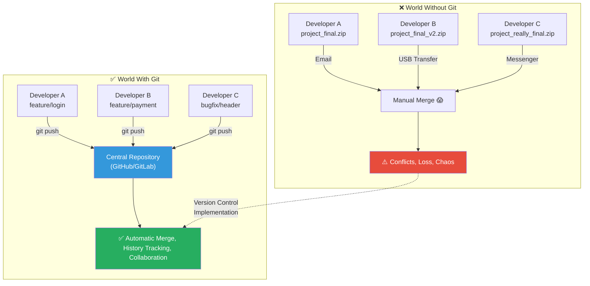
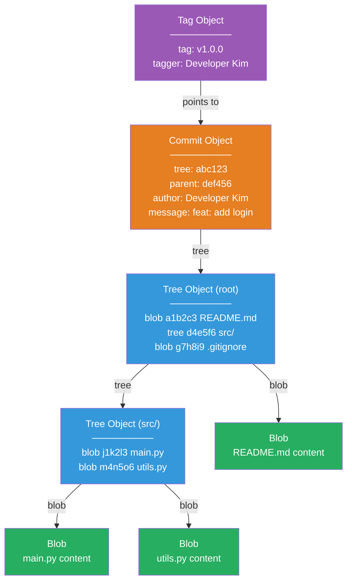
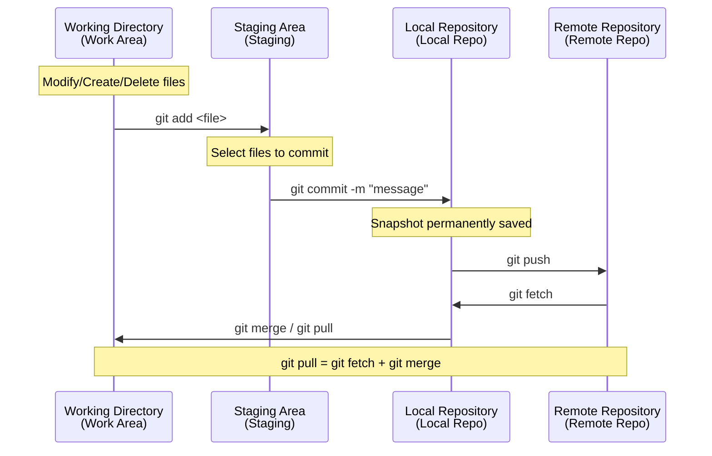
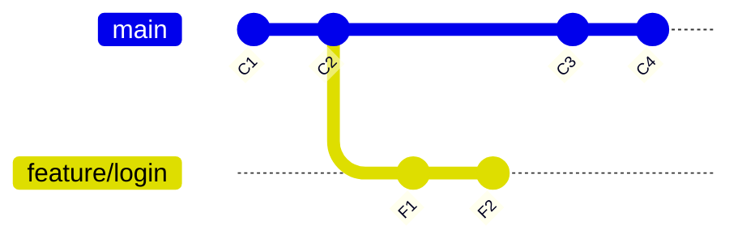
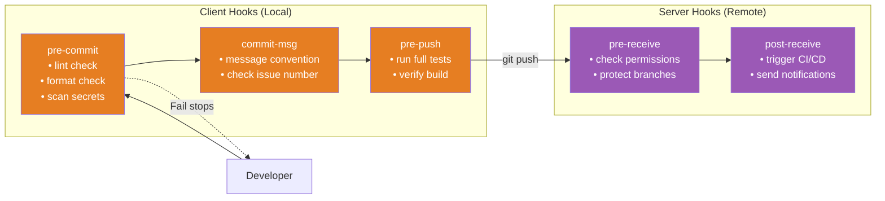
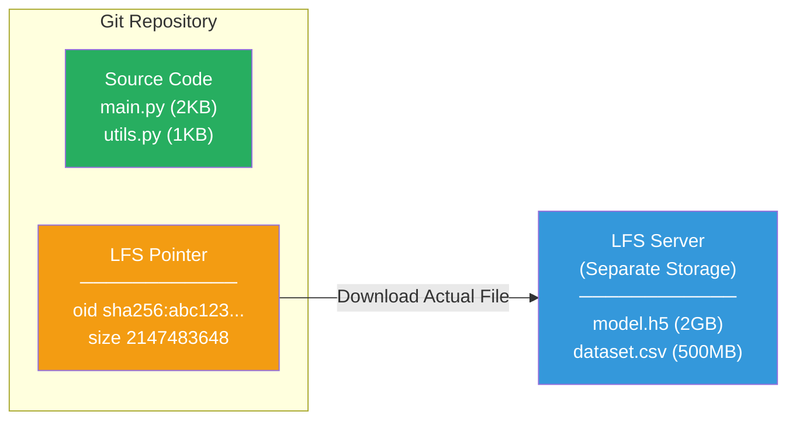
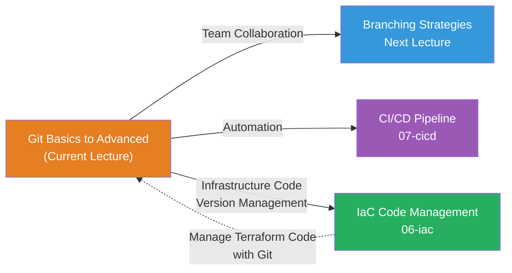

# Git Basics to Advanced: Everything About Version Control

> Managing code is like transforming the old writer's approach of creating "final.docx", "really_final.docx", "really_really_final_v3.docx" for every edit into a systematic version management system. To [manage infrastructure as code with IaC](../06-iac/01-concept), you absolutely need Git to safely manage that code itself.

---

## 🎯 Why Do You Need to Know Git?

### Daily Analogy: A Workshop with a Time Machine

Imagine you're writing a novel. Without any tools:

- A paragraph you deleted yesterday is suddenly needed today → Can't recover it
- You and a colleague are editing the same chapter simultaneously → Whose version do we use?
- "Who changed this code and why?" → Dependent only on memory
- Want to experiment with the ending → Worried about destroying the original

**Git installs a time machine in your code workshop.** You can go back to any point in the past, create parallel universes (branches) to experiment, and allow multiple people to work simultaneously.

```
Moments in real work where Git is needed:

• 10 developers modifying code simultaneously        → Conflicts and bugs when integrating
• "It works on my computer, what do you mean?"      → Environment dependency issues
• Bug found in production code pushed Friday evening → Feedback loop is too long
• During code review: "Did you run the tests?"      → Manual verification has limits
• Type error appears in production after deploy      → No lint/type check in place
• Using a library with security vulnerabilities     → No SAST/SCA in place
• Build takes 30 minutes, so devs skip CI           → Need caching/parallelization
```

### World Without Git vs With Git



---

## 🧠 Grasping Core Concepts

### 1. Git's Essence — Snapshot System

> **Analogy**: Game Save File

Git doesn't store the "differences (diff)" of files; it saves a **snapshot** of the entire project with each commit. Just like creating a save point in a game, it records the complete state at that moment.

### 2. Four Git Internal Objects

> **Analogy**: Library System

- **Blob**: File content itself → Library's **book contents**
- **Tree**: Directory structure → Library's **shelf catalog** (which books are where)
- **Commit**: Snapshot + metadata → Library's **checkout record** (who changed what, when, and why)
- **Tag**: Nickname for a specific commit → Library's **special display section** (like "Book of the Year" label)

### 3. Three Areas

> **Analogy**: Cooking Process

- **Working Directory**: Preparing ingredients in the kitchen → Freely modify files
- **Staging Area**: Plating on a dish → Select files to commit
- **Repository**: Served to customers → Commits are permanently recorded

### 4. Distributed Version Management and SHA-1 Hash

Git gives every developer a complete copy of the entire history. You can commit, check logs, and create branches even without network. All objects are identified by SHA-1 hash (40-digit hexadecimal) to guarantee data integrity.

---

## 🔍 Exploring in Detail

### 1. Git Internal Structure (Git Internals)

```bash
$ tree .git/ -L 1
.git/
├── HEAD          # Pointer to the currently checked-out branch
├── config        # Configuration for this repository
├── hooks/        # Git hook scripts
├── index         # Staging Area information
├── objects/      # All Git objects (blob, tree, commit, tag)
├── refs/         # Pointers to branches and tags
├── logs/         # reflog records
└── info/
```

#### Git Object Model Details



#### Directly Examine Internal Objects

```bash
# Check object type
$ git cat-file -t 7a8b9c
commit

# Commit object contents
$ git cat-file -p 7a8b9c
tree 4b825dc642cb6eb9a060e54bf899d15363bf9d45
parent 3f2a1b8c9d0e1f2a3b4c5d6e7f8a9b0c1d2e3f4a
author Developer Kim <kim@dev.com> 1710300000 +0900
committer Developer Kim <kim@dev.com> 1710300000 +0900

feat: add user login feature

# Tree object contents (directory structure)
$ git cat-file -p 4b825d
100644 blob a1b2c3d4e5f6...  README.md
040000 tree d4e5f6a1b2c3...  src
100644 blob g7h8i9j1k2l3...  .gitignore
```

---

### 2. Three Areas and Basic Workflow



#### Basic Commands

```bash
# ── Initial Setup ──
$ git config --global user.name "Developer Kim"
$ git config --global user.email "kim@dev.com"
$ git config --global init.defaultBranch main

# ── Create Repository ──
$ git init
Initialized empty Git repository in /home/user/my-project/.git/

# Or clone remote repository
$ git clone https://github.com/team/project.git

# ── Check Status ──
$ git status
On branch main
Changes not staged for commit:
        modified:   src/main.py
Untracked files:
        src/utils.py

# ── Staging ──
$ git add src/main.py              # Specific file
$ git add src/                     # Entire directory
$ git add -p                       # Selective staging by hunk (recommended for real work!)

# ── Check Changes ──
$ git diff                         # Working Directory vs Staging Area
$ git diff --staged                # Staging Area vs Last Commit
$ git diff main..feature/login     # Compare two branches

# ── Commit ──
$ git commit -m "feat: add server startup logic"
[main a1b2c3d] feat: add server startup logic
 1 file changed, 3 insertions(+), 1 deletion(-)

# ── Check Log ──
$ git log --oneline --graph --all
* e4f5g6h (HEAD -> main) feat: add server startup logic
| * f1a2b3c (feature/payment) feat: add payment module
|/
* a1b2c3d fix: fix login error

# ── Who Modified (blame) ──
$ git blame src/main.py
a1b2c3d4 (Developer Kim 2026-03-01  1) def main():
e4f5g6h8 (Developer Lee 2026-03-10  2)     print("hello, world!")
```

---

### 3. Merge vs Rebase — Two Philosophies of Combining



```bash
# Merge — "Preserve history as it is"
$ git checkout main
$ git merge feature/login
# → Creates merge commit

# Rebase — "Clean up history neatly"
$ git checkout feature/login
$ git rebase main
# → Feature commits are replayed on top of main
```

```
Merge Result:   C1 --- C2 --- C3 --- C4 --- M (merge commit)
                        \                  /
                         F1 --- F2 -------

Rebase Result:  C1 --- C2 --- C3 --- C4 --- F1' --- F2'
```

| Item | Merge | Rebase |
|------|-------|--------|
| **History** | Shows branching/merging as is | Clean linear line |
| **Merge Commit** | Created | Not created |
| **Original Commits** | Preserved | Recreated as new commits (hash changes) |
| **Conflict Resolution** | Resolve once | May resolve per commit |
| **Shared Branches** | Safe | Risky (never rebase pushed commits!) |

> **Golden Rule**: Never rebase commits already pushed to remote!

---

### 4. Interactive Rebase — Commit History Editor

```bash
# Edit last 4 commits
$ git rebase -i HEAD~4
```

Editor opens with:

```
pick a1b2c3d feat: add login UI
pick e4f5g6h fix: fix typo
pick 1a2b3c4 feat: connect login API
pick 7d8e9f0 fix: another typo

# p, pick   = keep commit    r, reword = change message only
# s, squash = combine        f, fixup  = combine (discard message)
# d, drop   = delete commit  reorder lines = change commit order
```

**Pattern for Cleaning Commits Before PR**:

```
pick a1b2c3d feat: add login UI
fixup e4f5g6h fix: fix typo          ← Combine into UI commit
pick 1a2b3c4 feat: connect login API
fixup 7d8e9f0 fix: another typo       ← Combine into API commit

# Result: Only 2 clean commits remain
```

---

### 5. Cherry-pick — Extract Specific Commits

> **Analogy**: Pick only what you want from a buffet

```bash
$ git cherry-pick a1b2c3d                # Get only one specific commit
$ git cherry-pick a1b2c3d e4f5g6h        # Multiple commits
$ git cherry-pick --no-commit a1b2c3d    # Get but don't auto-commit

# If conflict occurs
$ git cherry-pick a1b2c3d
error: could not apply a1b2c3d...
$ git add .                    # Resolve conflicts then
$ git cherry-pick --continue   # Continue
$ git cherry-pick --abort      # Or cancel
```

**Real-world Scenario** — Apply bug fix from release branch to main:

```
main:        A --- B --- C --- D --- F'  (cherry-pick)
                    \
release/1.0:         E --- F(bugfix) --- G
```

---

### 6. Git Bisect — Find Bugs with Binary Search

> **Analogy**: Finding a name in a phonebook (divide and search)

Even with 1000 commits, you can find the bug-introducing commit in ~10 checks!

```bash
$ git bisect start
$ git bisect bad                  # Current commit has bug
$ git bisect good v1.2.0          # This point was bug-free
Bisecting: 15 revisions left to test after this (roughly 4 steps)

# Git auto-checks out middle commit → test → judge good/bad repeatedly

$ git bisect bad
Bisecting: 7 revisions left to test after this (roughly 3 steps)

$ git bisect good
# ... repeat ...

# Culprit found!
a1b2c3d4e5f6 is the first bad commit
Author: Developer Park <park@dev.com>
    refactor: change cache TTL

$ git bisect reset   # Finish

# Automate (script auto-judges!)
$ git bisect start HEAD v1.2.0
$ git bisect run npm test
# → Automatically finds the culprit commit
```

---

### 7. Reflog — Git's Black Box Recorder

> **Analogy**: Airplane Black Box

`git log` shows only commit history, but `git reflog` shows **all movements** of HEAD.

```bash
$ git reflog
e4f5g6h (HEAD -> main) HEAD@{0}: commit: feat: add payment feature
a1b2c3d HEAD@{1}: reset: moving to HEAD~3       ← reset removed 3 commits!
7d8e9f0 HEAD@{2}: commit: fix: fix login bug
3f2a1b8 HEAD@{3}: commit: feat: connect login API

# Rescue from accident!
$ git reset --hard HEAD~3          # Oops! Deleted commits
$ git reflog                       # It's all recorded!
$ git reset --hard e4f5g6h         # Bring them back!
# → Commits return!
```

> **Reflog only works locally.** It's kept for 90 days by default.

---

### 8. Stash — Temporary Work Storage

> **Analogy**: Put unfinished work in your desk drawer for a moment

```bash
$ git stash push -m "working on login UI"     # Temporary storage
$ git stash list                              # See what's stored
stash@{0}: On main: working on login UI
stash@{1}: WIP on main: a1b2c3d feat: initial setup

$ git stash pop                    # Take out latest (deletes it)
$ git stash apply stash@{1}       # Take out but keep in stash
$ git stash drop stash@{1}        # Delete specific stash
$ git stash push --include-untracked -m "include new files"  # Include untracked
$ git stash push -m "config only" src/config.py              # Specific file only
```

---

### 9. Conflict Resolution Strategy

Conflicts happen when you modify the same part of the same file differently.

```python
def get_user():
<<<<<<< HEAD (current branch)
    return db.query("SELECT * FROM users WHERE active = 1")
=======
    return db.query("SELECT * FROM users WHERE role = 'admin'")
>>>>>>> feature/login (branch to merge)
```

```bash
# After resolving conflict
$ git add src/main.py
$ git commit -m "merge: merge feature/login"

# Specify merge strategy
$ git merge -X ours feature/login     # Prefer current branch on conflict
$ git merge -X theirs feature/login   # Prefer other branch on conflict
$ git merge --abort                   # Cancel merge
```

---

### 10. Git Hooks — Where Automation Begins

> **Analogy**: Airport Security Checkpoint



#### pre-commit Hook

```bash
$ cat .git/hooks/pre-commit
#!/bin/bash
echo "🔍 Running code checks before commit..."

# 1. Python lint check
pylint --fail-under=7.0 $(git diff --cached --name-only --diff-filter=ACM | grep '\.py$')
if [ $? -ne 0 ]; then
    echo "❌ pylint check failed!"
    exit 1
fi

# 2. Scan for sensitive information
if git diff --cached --diff-filter=ACM | grep -iE "(password|api_key|secret)\\s*=\\s*['\"]"; then
    echo "❌ Sensitive information detected! Cannot commit."
    exit 1
fi

echo "✅ All checks passed!"
exit 0

$ chmod +x .git/hooks/pre-commit
```

#### commit-msg Hook (Validate Conventional Commits)

```bash
$ cat .git/hooks/commit-msg
#!/bin/bash
FIRST_LINE=$(head -n 1 "$1")
PATTERN="^(feat|fix|docs|style|refactor|test|chore|perf|ci|build)(\(.+\))?: .{1,72}$"

if ! echo "$FIRST_LINE" | grep -qE "$PATTERN"; then
    echo "❌ Commit message format error!"
    echo "Correct format: type(scope): description"
    echo "Example: feat(auth): add social login"
    exit 1
fi
exit 0
```

> **Tip**: For team sharing, use [Husky](https://typicode.github.io/husky/) (Node.js) or [pre-commit](https://pre-commit.com/) (Python) frameworks.

---

### 11. .gitignore — Manage Files Not to Track

```bash
# ── .gitignore Basic Syntax ──
*.pyc                  # Specific extension
__pycache__/           # Specific directory
logs/*.log             # Specific files in directory
**/*.class             # Recursive matching
!important.log         # Negation pattern (exception)
/TODO.md               # Root only
log[0-9].txt           # Character range
```

#### Real-world .gitignore Example

```bash
# ── OS/IDE ──
.DS_Store
.idea/
.vscode/settings.json

# ── Python ──
__pycache__/
*.py[cod]
venv/

# ── Node.js ──
node_modules/

# ── Build Artifacts ──
build/
dist/
*.exe

# ── Environment Variables / Sensitive Info (🔴 MOST IMPORTANT!) ──
.env
.env.*
*.pem
*.key
credentials.json

# ── IaC (Terraform) ──
.terraform/
*.tfstate
*.tfstate.backup
*.tfvars
!example.tfvars
```

```bash
# When you add file to .gitignore after already tracking it
$ git rm --cached .env
$ git commit -m "chore: stop tracking .env"

# Verify .gitignore works
$ git check-ignore -v .env
.gitignore:15:.env	.env
```

---

### 12. Git LFS — Large File Management

> **Analogy**: Library Separate Storage — Keep card on shelf, actual item in separate storage



```bash
# Install and initialize
$ git lfs install
Git LFS initialized.

# Specify file types to manage
$ git lfs track "*.h5"
$ git lfs track "*.pkl"
$ git lfs track "*.mp4"

# Records in .gitattributes (must commit!)
$ git add .gitattributes
$ git commit -m "chore: add Git LFS configuration"

# Use normally after setup
$ git add model.h5
$ git commit -m "feat: add trained model"
$ git push    # → model.h5 automatically uploads to LFS server

# Check LFS files
$ git lfs ls-files
a1b2c3d4e5 * model.h5

# Clone without LFS files (fast)
$ GIT_LFS_SKIP_SMUDGE=1 git clone https://...
$ git lfs pull    # Download LFS files later
```

---

## 💻 Try It Yourself

### Lab 1: Explore Git Internal Structure

```bash
$ mkdir git-lab && cd git-lab && git init

# Add file and examine blob object
$ echo "Hello, Git!" > hello.txt
$ git add hello.txt
$ git ls-files --stage
100644 8e27be7d6154a1f68ea9160ef0e18691d20560dc 0	hello.txt

$ git cat-file -t 8e27be    # blob
$ git cat-file -p 8e27be    # Hello, Git!

# Commit and examine commit + tree objects
$ git commit -m "feat: first commit"
$ git cat-file -p HEAD       # Check tree, author, message
$ git count-objects           # blob + tree + commit = 3 objects
```

### Lab 2: Emergency Hotfix Scenario (Stash + Cherry-pick)

```bash
# 1. Working on feature branch
$ git checkout -b feature/dashboard
$ echo "def render(): pass" > dashboard.py
$ git add . && git commit -m "feat: initial dashboard structure"
$ echo "def charts(): pass" >> dashboard.py  # Not committed

# 2. Emergency bug! → stash and create hotfix
$ git stash push -m "chart feature in progress"
$ git checkout main
$ git checkout -b hotfix/crash
$ echo "def fix(): return True" > fix.py
$ git add . && git commit -m "fix: fix crash"

# 3. Merge to main and return to feature with stash restored
$ git checkout main && git merge hotfix/crash
$ git checkout feature/dashboard && git stash pop

# 4. Apply hotfix to feature too
$ git cherry-pick $(git log main --oneline -1 | cut -d' ' -f1)
```

### Lab 3: Clean Commits with Interactive Rebase

```bash
$ git checkout -b feature/profile
$ echo "class Profile:" > profile.py
$ git add . && git commit -m "feat: Profile class"
$ echo "  def __init__(): pass" >> profile.py
$ git add . && git commit -m "wip: constructor"
$ echo "  def get_name(): pass" >> profile.py
$ git add . && git commit -m "feat: get_name"
$ echo "  # oops" >> profile.py
$ git add . && git commit -m "fix: typo"

# Clean up commits: apply squash/fixup in editor
$ git rebase -i HEAD~4
# pick → Profile class
# squash → constructor
# pick → get_name
# fixup → typo
```

### Lab 4: Set Up pre-commit Framework

```bash
$ pip install pre-commit
$ cat > .pre-commit-config.yaml << 'EOF'
repos:
  - repo: https://github.com/pre-commit/pre-commit-hooks
    rev: v4.5.0
    hooks:
      - id: trailing-whitespace
      - id: check-yaml
      - id: check-added-large-files
        args: ['--maxkb=500']
      - id: detect-private-key
  - repo: https://github.com/psf/black
    rev: 24.3.0
    hooks:
      - id: black
EOF

$ pre-commit install
$ pre-commit run --all-files
trailing whitespace...................Passed
check yaml...........................Passed
check for added large files..........Passed
detect private key...................Passed
black................................Passed
```

---

## 🏢 In Real Practice

### Scenario 1: Git Workflow for Terraform Code

When [managing infrastructure as code](../06-iac/02-terraform-basics), Git is essential.

```bash
$ git checkout -b infra/add-rds-instance
$ vim modules/database/main.tf
$ terraform plan -out=plan.out
$ git add modules/database/
$ git commit -m "feat(infra): Add RDS PostgreSQL instance

- db.t3.medium, Multi-AZ configuration
- Plan result: 3 to add, 0 to change, 0 to destroy"
# → Create PR → Team review → merge → CI/CD applies terraform
```

### Scenario 2: Emergency Rollback on Production Outage

```bash
# revert (safe rollback — preserves history, recommended for real work)
$ git revert e4f5g6h
[main f1a2b3c] Revert "feat: change cache expiration logic"

# reset (strong rollback — deletes history, use with caution!)
$ git reset --hard a1b2c3d
$ git push --force-with-lease   # Includes safety mechanism
```

### Scenario 3: Automate Commit Convention

```bash
# commitlint + husky enforces consistent commit messages team-wide
$ git commit -m "updated something"
⧗   input: updated something
✖   type may not be empty [type-empty]
✖   Found 2 problems, 0 warnings
# → Doesn't match convention, auto-rejected!
```

### Real-world Git Configuration Recommendations

```bash
$ git config --global core.autocrlf input     # Mac/Linux (Windows: true)
$ git config --global pull.rebase true        # Prevent unnecessary merge commits
$ git config --global diff.algorithm histogram # More readable diffs
$ git config --global core.longpaths true     # Support long filenames
$ git config --global alias.lg "log --oneline --graph --all --decorate"
$ git config --global alias.st "status"
```

---

## ⚠️ Common Mistakes

### Mistake 1: Committing Sensitive Information

```bash
# ❌ Commit .env → Permanently recorded in Git history!
# 🔴 Adding to .gitignore later doesn't remove already-committed contents!

# ✅ Set up .gitignore immediately at project start
# ✅ Share only .env.example template, never actual .env
```

### Mistake 2: Rebase/Force Push on Shared Branches

```bash
# ❌ rebase on main then force push → Team history gets corrupted!
# ✅ rebase only on local feature branches
# ✅ If unavoidable, use git push --force-with-lease (safety mechanism)
```

### Mistake 3: Missing .gitignore Setup

```bash
# ❌ Commit node_modules or .terraform → Repository size explodes
# ✅ Use language templates from github.com/github/gitignore
```

### Mistake 4: Giant Single Commits

```bash
# ❌ git add . && git commit -m "update: various" → Can't track/review/rollback
# ✅ Divide into logical units
$ git add src/auth/ && git commit -m "feat(auth): add JWT validation"
$ git add tests/ && git commit -m "test(auth): add JWT tests"
```

### Mistake 5: Using reset --hard Without Knowing reflog

```bash
# ❌ panic after reset --hard → can recover with reflog!
$ git reflog
$ git reset --hard HEAD@{1}   # Bring commits back!
```

### Mistake 6: Committing Conflict Markers

```bash
# ❌ Conflict markers <<<<<<< HEAD ... ======= ... >>>>>>> left in code
# ✅ Completely remove markers, fix code to match intent, then commit
```

### Mistake 7: Committing Large Files Without Git LFS

```bash
# ❌ 2GB model file in regular Git → clone takes 30 minutes
# ✅ git lfs track "*.h5" before committing
```

---

## 📝 Wrapping Up

### Git Commands Summary

| Category | Command | Description |
|----------|---------|-------------|
| **Basics** | `git init / clone` | Create/copy repository |
| | `git add / commit / push / pull` | Basic workflow |
| **Check** | `git status / log / diff / blame` | Check status/history/changes/responsibility |
| **Branch** | `git branch / checkout / merge / rebase` | Branching/moving/combining/rebasing |
| **Advanced** | `git cherry-pick` | Extract specific commits |
| | `git bisect` | Binary search for bugs |
| | `git reflog` | Complete HEAD movement history |
| | `git stash` | Temporary work storage |
| | `git rebase -i` | Edit commit history |
| **Cleanup** | `git revert / reset` | Undo/delete commits |

### Git Internal Objects Summary

| Object | Role | Analogy |
|--------|------|---------|
| **Blob** | Store file content | Book manuscript content |
| **Tree** | Store directory structure | Bookshelf catalog |
| **Commit** | Store snapshot + metadata | Publication record (who, when, why) |
| **Tag** | Label for specific commit | "First Edition", "Revised Edition" labels |

### Real-world Checklist

```
At Project Start:
  □ Set up .gitignore          □ Set up .gitattributes (LFS)
  □ Configure pre-commit hooks □ Configure commit-msg hooks
  □ Agree on branching strategy

Daily Work:
  □ Work on feature branches   □ Make small commits with logical units
  □ Follow Conventional Commits □ Interactive rebase before PR
  □ Never commit sensitive information

Crisis Situations:
  □ Recoverable with reflog    □ Use --force-with-lease
  □ Prefer revert for rollback □ Use bisect to find culprit
```

---

## 🔗 Next Steps

In this lecture, we explored Git from basic principles through advanced commands. In the next lecture, we'll learn **team collaboration through branching strategies**.

| Lecture | Topic | Key Content |
|---------|-------|------------|
| [02. Branching Strategies](./02-branching) | Git Flow, GitHub Flow, Trunk-based | Choose branching strategy that fits team size |



### Want to Learn More?

- **Official Docs**: [Pro Git Book](https://git-scm.com/book/en/v2) (free English version)
- **Visual Learning**: [Learn Git Branching](https://learngitbranching.js.org/) (interactive tutorial)
- **Git Internals**: Pro Git Book Chapter 10 "Git Internals"
- **Real-world Branching**: [Next Lecture: 02-branching.md](./02-branching) covers this in detail
