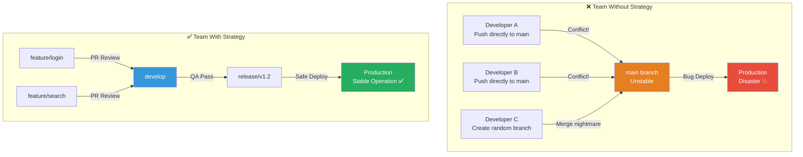
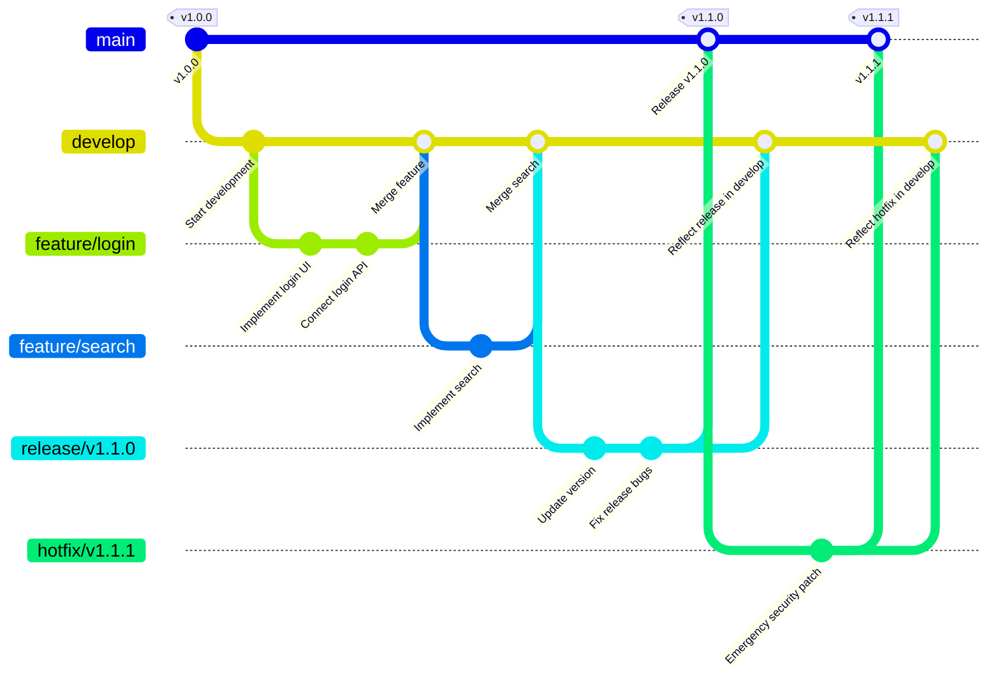
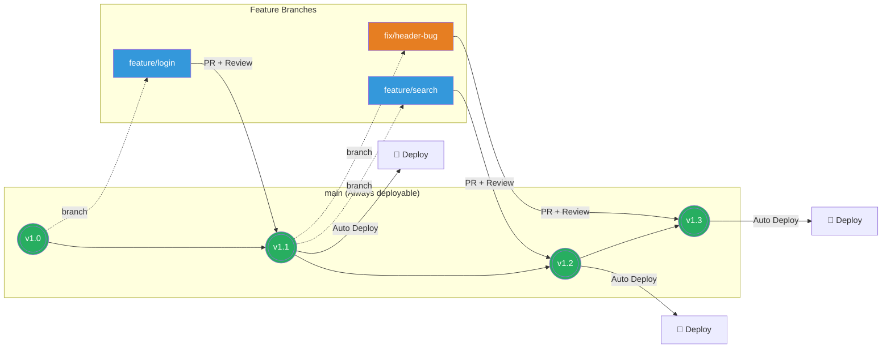
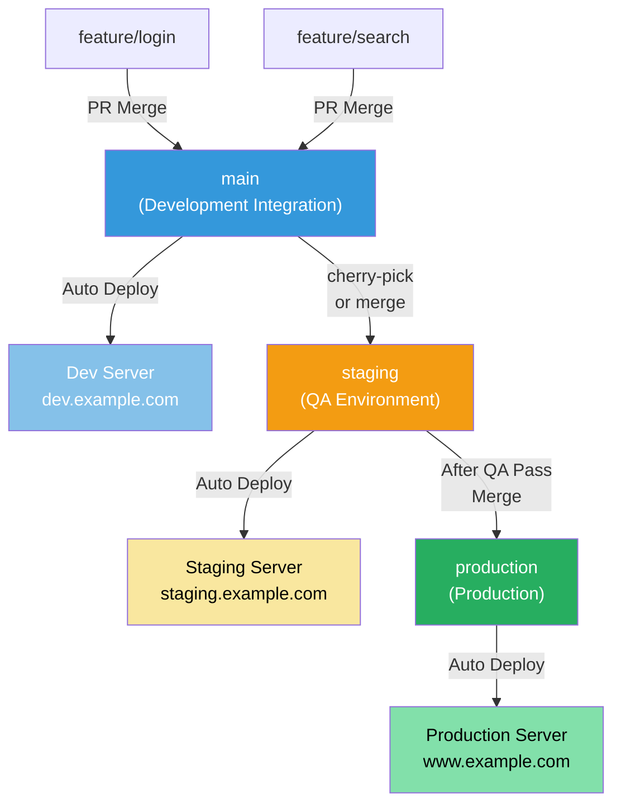
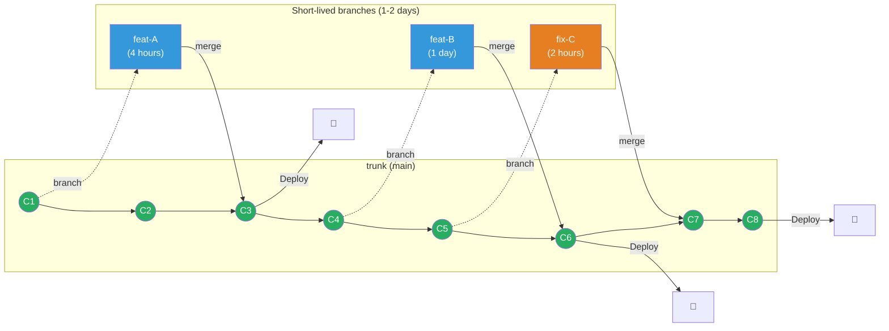
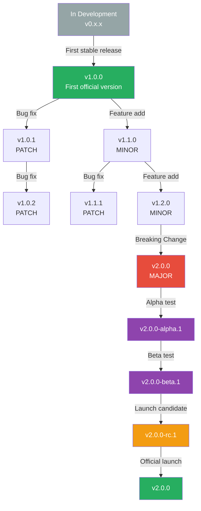
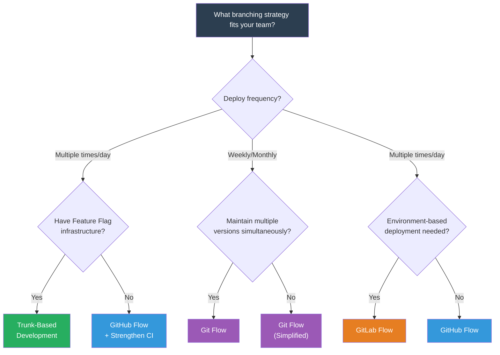

# Branching Strategies and Versioning

> Branching strategy is a "traffic rule" for how teams divide and combine code. Without traffic rules, when cars drive on roads without rules, there are accidents. Without branching rules, code conflicts and deployment accidents never stop. Now that you've learned [Git basics](./01-git-basics), let's understand how to use Git effectively at the team level with proper branching strategies.

---

## 🎯 Why Learn Branching Strategies?

### Daily Analogy: Lane Rules on the Highway

Imagine a highway with 100 cars driving simultaneously without lanes or traffic signals. What happens?

- Everyone drives in whatever direction they want
- Collisions happen constantly
- Emergency vehicles can't get through
- You can't predict arrival time

**This is what development without branching strategy looks like.**

```
Moments in real work where branching strategy is needed:

• 10 developers developing different features simultaneously      → Code conflict hell
• "When will this feature be deployed?"  Can't answer            → Release prediction impossible
• Production emergency! But develop branch has incomplete feature → Can't hotfix
• Version confusion: is it v2.1.3 or v2.2.0?                    → Version management chaos
• "What release includes this commit?"                           → Can't track
• Monorepo: frontend and backend interfering with each other     → No monorepo branching strategy
```

### Team Without Branching Strategy vs With Strategy



### What This Lecture Covers

```
📌 Branching Strategies Comparison
├── Git Flow         — Structured release-focused strategy
├── GitHub Flow      — Simple, fast deployment strategy
├── GitLab Flow      — Environment-aware deployment strategy
└── Trunk-Based      — Ultra-fast integration strategy

📌 Versioning
├── Semantic Versioning (SemVer)
├── Conventional Commits
└── Release Strategies (tag-based, branch-based)

📌 Real-world Patterns
├── Monorepo Branching
└── PR/MR Best Practices
```

---

## 🧠 Grasping Core Concepts

### 1. Branching Strategy (Branching Strategy)

> **Analogy**: Work Zones on Apartment Construction Site

When building apartments, electricians, plumbers, and interior designers work simultaneously. Each team works in their own zone (branch), and when done, they combine their work. Branching strategy is the "rule for how to divide zones and in what order to combine them".

### 2. Semantic Versioning (Meaningful Versioning)

> **Analogy**: Address System for Buildings

"Seoul, Gangnam-gu, Yeoksam-dong 123-4" — this address tells you where it is. Similarly, version number `v2.3.1` tells you the scope and nature of the change.

- **MAJOR (2)**: Rebuild the building — Incompatible changes
- **MINOR (3)**: Add a new floor — Feature additions (backward compatible)
- **PATCH (1)**: Paint wall repair — Bug fixes (backward compatible)

### 3. Conventional Commits (Structured Commits)

> **Analogy**: Parcel Classification System

Parcel companies can auto-classify when each box is labeled "food", "electronics", "clothing". Similarly, labeling commits with `feat:`, `fix:`, `chore:` prefixes allows auto-classification of change history.

### 4. Release Strategy

> **Analogy**: Book Publishing Process

Manuscript writing (development) → Proofreading (code review) → Printing (build) → Publishing (release). Release strategy defines "when" and "how" to publish.

### Branching Strategies at a Glance

```
┌─────────────────┬───────────────┬───────────────┬──────────────────┐
│                 │ Team Size     │ Deploy Period │ Complexity       │
├─────────────────┼───────────────┼───────────────┼──────────────────┤
│ Git Flow        │ Medium-Large  │ Weekly/Monthly│ ★★★★☆ High     │
│ GitHub Flow     │ Small-Medium  │ Multiple/Day  │ ★★☆☆☆ Low      │
│ GitLab Flow     │ Medium        │ Environment   │ ★★★☆☆ Medium   │
│ Trunk-Based     │ All Sizes     │ Multiple/Hour │ ★★☆☆☆ Low      │
└─────────────────┴───────────────┴───────────────┴──────────────────┘
```

---

## 🔍 Exploring in Detail

### 1. Git Flow

Proposed by Vincent Driessen in 2010, this strategy is suitable for projects with **structured release cycles**.

#### Branch Structure

```
Git Flow's 5 Branch Types:

┌─────────────┬───────────────────────────────────────────────────────┐
│ Branch      │ Role                                                 │
├─────────────┼───────────────────────────────────────────────────────┤
│ main        │ Production code. Always deployment-ready               │
│ develop     │ Prepare next release. Development integration branch   │
│ feature/*   │ New feature development. Create from develop → merge   │
│ release/*   │ Release preparation. Create from develop → merge both │
│ hotfix/*    │ Emergency fix. Create from main → merge both          │
└─────────────┴───────────────────────────────────────────────────────┘
```

#### Git Flow Diagram



#### Git Flow Commands in Practice

```bash
# ─── Feature Workflow ───
git checkout develop && git pull origin develop
git checkout -b feature/user-profile
git add . && git commit -m "feat: add user profile page"
git checkout develop
git merge --no-ff feature/user-profile   # --no-ff: create merge commit
git branch -d feature/user-profile

# ─── Release Workflow ───
git checkout develop && git checkout -b release/v1.2.0
git commit -m "chore: bump version to v1.2.0"
git checkout main && git merge --no-ff release/v1.2.0
git tag -a v1.2.0 -m "Release v1.2.0"
git checkout develop && git merge --no-ff release/v1.2.0
git branch -d release/v1.2.0

# ─── Hotfix Workflow ───
git checkout main && git checkout -b hotfix/v1.2.1
git commit -m "fix: XSS vulnerability patch"
git checkout main && git merge --no-ff hotfix/v1.2.1
git tag -a v1.2.1 -m "Hotfix v1.2.1"
git checkout develop && git merge --no-ff hotfix/v1.2.1  # Must merge both!
git branch -d hotfix/v1.2.1
```

#### Git Flow Pros and Cons

```
✅ Advantages:
  • Release version management is clear
  • Production (main) is always stable
  • Hotfix path is well-defined
  • Can maintain multiple versions simultaneously

❌ Disadvantages:
  • Many branches, complex
  • May not align well with CI/CD (frequent merges needed)
  • develop and main can diverge
  • Overhead for small teams
```

---

### 2. GitHub Flow

GitHub's proposal — **simplicity is key**. One main branch, everything else is feature branch.

#### GitHub Flow Rules

```
GitHub Flow 6 Steps:

1️⃣ Create branch from main
2️⃣ Work and commit
3️⃣ Create Pull Request
4️⃣ Code review + discussion
5️⃣ Deploy (before or after merge)
6️⃣ Merge to main
```

#### GitHub Flow Diagram



#### GitHub Flow Commands in Practice

```bash
# 1. Create branch from main
git checkout main
git pull origin main
git checkout -b feature/payment-gateway

# 2. Develop and commit
git add .
git commit -m "feat: Stripe payment integration"
git push -u origin feature/payment-gateway

# 3. Create PR (using GitHub CLI)
gh pr create \
  --title "feat: Stripe payment integration" \
  --body "## Changes
- Stripe API integration
- Payment flow implementation
- Error handling added

## Testing
- [x] Unit tests pass
- [x] Stripe test mode verified"

# 4. After review, merge (Squash & Merge recommended)
gh pr merge --squash --delete-branch
```

#### GitHub Flow Pros and Cons

```
✅ Advantages:
  • Very simple — little to learn
  • Good fit with CI/CD
  • Optimized for fast deployment cycles
  • Always latest code in main

❌ Disadvantages:
  • Hard to manage multiple release versions
  • main doubles as production, mistakes immediately reflected
  • Large teams have frequent merge conflicts
  • Insufficient for projects needing release preparation
```

---

### 3. GitLab Flow

Adds **environment-aware deployment** to GitHub Flow's simplicity. For teams where deploying right after merging to main feels risky.

#### GitLab Flow Variants

```
GitLab Flow has two variants:

1. Environment Branches (Environment Branches)
   main → staging → production
   Each environment has corresponding branch

2. Release Branches (Release Branches)
   Branch release/v1.0, release/v2.0 from main
   Suited for LTS (Long Term Support) products
```

#### Environment Branch Pattern



#### GitLab Flow Pros and Cons

```
✅ Advantages:
  • Track deployment status by environment via branches
  • More release-management flexibility than GitHub Flow
  • Sufficient testing on staging before production deploy

❌ Disadvantages:
  • More complex than GitHub Flow
  • Need to synchronize between environment branches
  • Many cherry-picks become hard to manage
```

---

### 4. Trunk-Based Development (TBD)

**All developers frequently integrate into one trunk (main) branch**. Adopted by Google, Facebook and other large organizations.

#### TBD Core Principles

```
Trunk-Based Development Rules:

1. Commit directly to main or use short-lived branches (1-2 days)
2. Feature branch lifespan must not exceed 2 days maximum
3. Hide incomplete features with Feature Flags
4. Every commit on main must pass build/test
5. Integrate to main multiple times per day
```

#### Trunk-Based Development Diagram



#### Feature Flag Pattern

Key technique: hide incomplete features on main while keeping them deployed.

```python
# Feature Flag Example (Python)
from feature_flags import is_enabled

def get_search_results(query):
    # Legacy search logic
    results = legacy_search(query)

    # New search engine hidden behind Feature Flag
    if is_enabled("new_search_engine"):
        results = new_ai_search(query)  # Still under development but deployed on main

    return results
```

```yaml
# feature-flags.yaml
flags:
  new_search_engine:
    enabled: false            # Disabled in production
    environments:
      development: true       # Enabled in dev environment only
      staging: true           # Test on staging
      production: false       # Not yet enabled in production
    rollout_percentage: 0     # Supports gradual rollout
```

#### TBD Pros and Cons

```
✅ Advantages:
  • Prevent integration hell (merge hell)
  • Perfect alignment with CI/CD
  • Very fast deployment cycles
  • Small code review scope is efficient

❌ Disadvantages:
  • Feature Flag infrastructure required
  • Strong CI pipeline is prerequisite
  • Learning curve for junior developers
  • Broken build affects entire team
```

---

### 5. Semantic Versioning (SemVer)

**Standard rules that give meaning (semantic) to version numbers**. Official spec maintained at `semver.org`.

#### Version Number Structure

```
MAJOR.MINOR.PATCH Format

Example: v2.3.1

v2    .3      .1
│      │       └── PATCH: Bug fixes (backward compatible)
│      └────────── MINOR: Feature additions (backward compatible)
└───────────────── MAJOR: Breaking changes (incompatible)

Additional labels:
v2.3.1-beta.1      ← Pre-release (test before launch)
v2.3.1-rc.1        ← Release Candidate (launch candidate)
v2.3.1+build.123   ← Build metadata (build information)
```

#### When to Increment Which Version?

```
PATCH (2.3.1 → 2.3.2):
  • Bug fixes
  • Security patches
  • Documentation fixes
  • Internal improvements users don't notice

MINOR (2.3.1 → 2.4.0):
  • New features added
  • New API endpoints
  • Mark existing features as Deprecated (not deleted yet)
  • PATCH resets to 0

MAJOR (2.3.1 → 3.0.0):
  • API response format changes
  • Existing functions/classes deleted
  • Required parameters added
  • Database schema incompatible changes
  • MINOR and PATCH both reset to 0
```

#### Version Lifecycle



#### What v0.x.x Means

```
v0.x.x = "Not yet stabilized"

• v0.1.0 — Early development stage
• v0.x.x — Public API can change anytime
• v1.0.0 — "Public API is now stable" declaration

Important: In v0.x.x, even MINOR changes can be breaking!
Many open-source projects stay in v0.x for a long time for this reason.
```

---

### 6. Conventional Commits

**Structured format for commit messages**. Enables automatic version management and CHANGELOG generation.

#### Commit Message Format

```
<type>[optional scope]: <description>

[optional body]

[optional footer(s)]
```

#### Type List

```
┌──────────┬────────────────────────────────┬──────────────┐
│ Type     │ Description                    │ SemVer Impact│
├──────────┼────────────────────────────────┼──────────────┤
│ feat     │ Add new feature                │ MINOR bump   │
│ fix      │ Bug fix                        │ PATCH bump   │
│ docs     │ Documentation changes         │ -            │
│ style    │ Formatting (semicolons, etc)  │ -            │
│ refactor │ Refactoring (no function change)│ -           │
│ perf     │ Performance improvement       │ PATCH bump   │
│ test     │ Add/modify tests              │ -            │
│ chore    │ Build, tool configuration     │ -            │
│ ci       │ CI configuration changes      │ -            │
│ build    │ Build system changes          │ -            │
│ revert   │ Revert previous commit        │ Case-by-case │
└──────────┴────────────────────────────────┴──────────────┘

Signaling BREAKING CHANGE:
  1. Add "BREAKING CHANGE: description" in footer
  2. Add ! after type → feat!: or fix!:
  → Bumps SemVer MAJOR
```

#### Real-world Examples

```bash
# ✅ Good examples
git commit -m "feat(auth): add social login"          # → MINOR
git commit -m "fix(cart): fix ordering with 0 quantity"  # → PATCH
git commit -m "feat(api)!: change response to camelCase  # → MAJOR

BREAKING CHANGE: All API response keys now use camelCase format"
git commit -m "refactor(user): improve dependency injection"  # → No version change
git commit -m "ci: add cache to GitHub Actions"     # → No version change

# ❌ Bad examples
git commit -m "fix"          # What did you fix?
git commit -m "WIP"          # Incomplete commit
git commit -m "various fix"  # Scope unclear
```

---

## 💻 Try It Yourself

### Lab 1: Complete Git Flow Cycle

```bash
# ─── Setup: Create new repository ───
mkdir git-flow-practice && cd git-flow-practice
git init
echo "# My App v1.0.0" > README.md
git add README.md && git commit -m "chore: initialize project"
git tag -a v1.0.0 -m "v1.0.0"

# ─── Create develop branch ───
git checkout -b develop

# ─── Feature development ───
git checkout -b feature/user-auth
echo 'class AuthService: pass' > auth.py
git add auth.py
git commit -m "feat(auth): implement login/logout"

# Merge feature → develop
git checkout develop
git merge --no-ff feature/user-auth -m "Merge feature/user-auth into develop"
git branch -d feature/user-auth

# ─── Prepare release ───
git checkout -b release/v1.1.0
sed -i 's/v1.0.0/v1.1.0/' README.md
git add README.md && git commit -m "chore: bump version to v1.1.0"

# Merge release → main + develop
git checkout main
git merge --no-ff release/v1.1.0 -m "Release v1.1.0"
git tag -a v1.1.0 -m "Release v1.1.0: user authentication"
git checkout develop
git merge --no-ff release/v1.1.0 -m "Merge release/v1.1.0 back into develop"
git branch -d release/v1.1.0

# ─── Hotfix ───
git checkout main && git checkout -b hotfix/v1.1.1
echo '# security patch' >> auth.py
git add auth.py && git commit -m "fix(auth): patch token validation"

git checkout main
git merge --no-ff hotfix/v1.1.1 -m "Hotfix v1.1.1"
git tag -a v1.1.1 -m "Hotfix v1.1.1"
git checkout develop
git merge --no-ff hotfix/v1.1.1 -m "Merge hotfix into develop"
git branch -d hotfix/v1.1.1

# ─── View results ───
git log --oneline --graph --all
git tag -l
```

### Lab 2: Conventional Commits + Auto CHANGELOG

```bash
mkdir conventional-practice && cd conventional-practice
git init && npm init -y

# Setup commitlint + husky
npm install -D @commitlint/cli @commitlint/config-conventional husky
echo "module.exports = { extends: ['@commitlint/config-conventional'] };" \
  > commitlint.config.js
npx husky init
echo 'npx --no -- commitlint --edit $1' > .husky/commit-msg

git add . && git commit -m "chore: setup commitlint and husky"

# Setup standard-version for auto release
npm install -D standard-version
npm pkg set scripts.release="standard-version"

# Add some commits
echo "export const add = (a, b) => a + b;" > math.js
git add math.js && git commit -m "feat: add addition function"

echo "// fix: negative numbers" >> math.js
git add math.js && git commit -m "fix: handle negative input"

# Execute release → auto CHANGELOG + tags!
npm run release
cat CHANGELOG.md
```

### Lab 3: GitHub Flow + Tag Release

```bash
mkdir github-flow-practice && cd github-flow-practice
git init && echo "# Todo App" > README.md
git add . && git commit -m "chore: initialize"
gh repo create github-flow-practice --public --push --source=.

# Feature development → PR → Merge
git checkout -b feature/add-todo
echo 'class TodoApp: pass' > todo.py
git add todo.py && git commit -m "feat(todo): implement CRUD"
git push -u origin feature/add-todo

gh pr create --title "feat: Implement Todo CRUD" \
  --body "- Add/complete/list todos"
gh pr merge --squash --delete-branch

# Tag-based release
git checkout main && git pull
git tag -a v1.0.0 -m "v1.0.0: Initial release"
git push origin v1.0.0
gh release create v1.0.0 --title "v1.0.0" --notes "Initial release"
```

---

## 🏢 In Real Practice

### Startup (5-15 people) — Adopt GitHub Flow

```
🏢 Scenario: Mobile App Startup

Team: 3 FE, 4 BE, 2 iOS, 2 Android, 1 DevOps

Strategy: GitHub Flow
Reason:
  • Fast feature shipping is key (2-3 deploys/week)
  • Team too small for Git Flow overhead
  • Every PR requires minimum 1 review
  • main merge → auto deploy (Vercel, ECS)

Branch Naming:
  • feature/JIRA-123-feature-name    (features)
  • fix/JIRA-456-bug-name            (fixes)
  • chore/task-name                  (misc tasks)

Deploy Flow:
  Feature branch → PR → Code review → Squash Merge → Auto deploy
```

---

## 📝 Summary

### Branching Strategy Selection Guide



### One-look Comparison Table

```
┌─────────────────┬─────────────┬──────────────┬──────────────┬───────────────┐
│                 │ Git Flow    │ GitHub Flow  │ GitLab Flow  │ Trunk-Based   │
├─────────────────┼─────────────┼──────────────┼──────────────┼───────────────┤
│ Complexity      │ High        │ Low          │ Medium       │ Low           │
│ Deploy Period   │ Weekly      │ On-demand    │ Env-based    │ Multiple/hour │
│ Team Size       │ Medium-Larg │ Small-Medium │ Medium       │ All sizes     │
│ main Stability  │ ★★★★★      │ ★★★★☆       │ ★★★★☆       │ ★★★★☆        │
│ Learning Curve  │ Steep       │ Gentle       │ Moderate     │ Moderate      │
│ CI/CD Friendly  │ Moderate    │ High        │ High         │ Very High     │
│ Multi-version   │ Good        │ Difficult    │ Possible     │ Difficult     │
│ Hotfix Path     │ Clear       │ Simple       │ Simple       │ Simple        │
│ Feature Flags   │ Unnecessary │ Optional    │ Optional     │ Required      │
│ Typical Users   │ Finance/SI  │ SaaS/Startup│ Enterprise   │ Big Tech      │
└─────────────────┴─────────────┴──────────────┴──────────────┴───────────────┘
```

### SemVer Checklist Summary

```
When bumping version, check:

□ Are there breaking changes?
  → Yes: Bump MAJOR (v1.x.x → v2.0.0)
  → No: Continue

□ Were new features added?
  → Yes: Bump MINOR (v1.1.x → v1.2.0)
  → No: Continue

□ Were only bugs fixed?
  → Yes: Bump PATCH (v1.1.1 → v1.1.2)

□ Using Conventional Commits?
  → Yes: Automate with semantic-release!
  → No: Adopt now. Future-you will thank you.
```

---

## 🔗 Next Steps

### What We Learned

```
✅ Git Flow — Structured release management
✅ GitHub Flow — Simple, fast deployment
✅ GitLab Flow — Environment-aware deployment
✅ Trunk-Based Development — High-speed integration
✅ Semantic Versioning — Version numbers with meaning
✅ Conventional Commits — Structured commit messages
✅ Release Strategies — Tag-based vs branch-based
✅ Monorepo Branching — Large repo management
✅ PR/MR Best Practices — Code review quality
```

### Next Lecture Preview

[Next: CI Pipeline](./03-ci-pipeline) teaches how to **automatically build, test, and verify code with every commit** made to branches you manage.

```
Next lecture topics:
• CI Pipeline fundamentals and concepts
• Build → Test → Lint automation
• Caching and parallelization for speed
• GitHub Actions / GitLab CI practical setup
```

### Recommended Learning Resources

```
📖 Official Docs:
  • semver.org — Semantic Versioning official spec
  • conventionalcommits.org — Conventional Commits spec
  • trunkbaseddevelopment.com — TBD complete guide

📖 Recommended Reading:
  • "A Successful Git Branching Model" — Vincent Driessen (Git Flow original)
  • "Patterns for Managing Source Code Branches" — Martin Fowler

🔧 Tools:
  • semantic-release / standard-version — Auto version management
  • commitlint + husky — Commit message linting + Git Hooks
  • LaunchDarkly / Unleash — Feature Flag service
```
