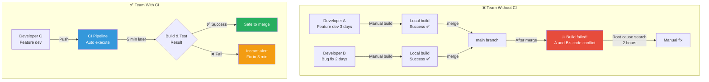
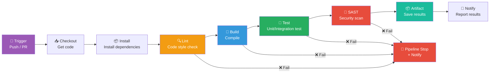
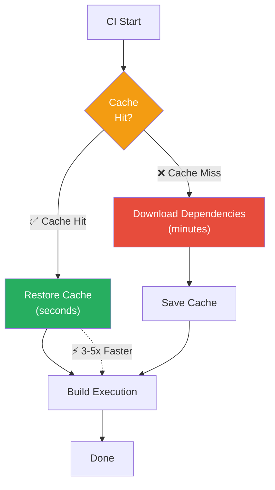
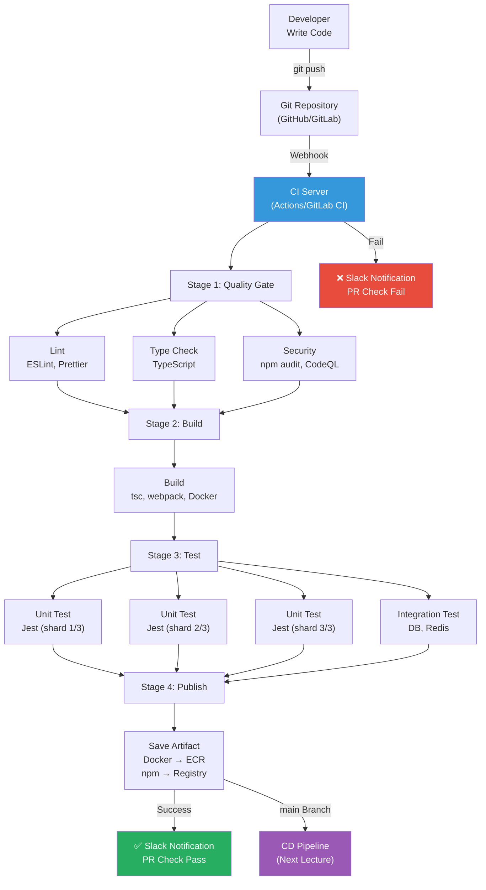

# CI (Continuous Integration) Pipeline

> A system that automatically builds, tests, and quality-checks code when you push it — like a quality inspection line in an automobile factory. Let's move from the era where developers manually checked "does it build?" to a world where the system automatically verifies everything. You've learned [Git basics](./01-git-basics) and [branching strategies](./02-branching), now it's time to add automation on top.

---

## 🎯 Why Learn CI (Continuous Integration)?

### Daily Analogy: Quality Inspection Line in Automobile Factory

Imagine a car assembly line. As parts move along, they're inspected at each stage:

- After engine assembly → Engine test
- After painting → Appearance quality check
- After electronics installation → Electrical system test
- After final assembly → Comprehensive driving test

If an engine is defective, it's caught **before** the painting stage. If you discover engine problems right before delivery? You have to disassemble everything. **The earlier you find defects, the cheaper the fix costs.**

**This is the core philosophy of CI pipeline.**

```
Moments in real work where CI is needed:

• 10 developers modifying code simultaneously       → Conflicts and bugs when integrating
• "It works on my computer"                        → Environment dependency issues
• Code merged Friday evening, outage Monday        → Feedback loop is too long
• During code review: "Did you run tests?"         → Manual verification limit
• Type error appears in production after deploy    → No lint/type check in place
• Using library with security vulnerabilities      → No SAST/SCA
• Build takes 30 minutes, developers skip CI       → Need caching/parallelization
```

### Team Without CI vs Team With CI



### Cost Curve: Finding Defects Later is Expensive

```
Cost of fixing defect by discovery time (relative):

Found during coding        ████                           x1
Found in CI               ████████                       x4
Found in QA               ████████████████               x10
Found in staging          ████████████████████████       x40
Found in production       ████████████████████████████████████████  x100+

→ Goal of CI: Catch defects as left as possible ("Shift Left")
```

---

## 🧠 Grasping Core Concepts

### 1. Continuous Integration (CI)

> **Analogy**: Chefs frequently taste each other's ingredients while cooking together

Multiple chefs are making one course together. They taste the combination **daily** to check overall balance. If you taste for the first time a week later? Everything's broken and needs remaking.

CI's 3 core principles:

- **Frequent Integration**: Merge to main multiple times per day
- **Fast Feedback**: Tell developers results within 10 minutes
- **Automated Testing**: Machines verify, not people

### 2. CI Pipeline

> **Analogy**: Automobile factory assembly line

Code passes through multiple stages (Stage) in sequence. Each stage must pass before moving to the next.

### 3. Build (Build)

> **Analogy**: Assembling LEGO into complete structure

Converting source code into runnable form (binary, Docker image, bundle, etc).

### 4. Artifact (Artifact)

> **Analogy**: Finished product from factory

Result of build process. JAR files, Docker images, npm packages, etc.

### 5. Caching (Caching)

> **Analogy**: Storing ingredients in refrigerator instead of buying from market every time

Storing dependencies (node_modules, .m2, etc) cuts build time dramatically.

### 6. Matrix Build (Matrix Build)

> **Analogy**: Taking same test in multiple classrooms simultaneously

Running tests simultaneously on multiple environments (Node 18/20/22, Ubuntu/macOS/Windows).

---

## 🔍 Exploring in Detail

### 1. CI's Core Principles

#### Frequent Integration — Integrate Often

Martin Fowler's most important CI principle: code isolated too long creates massive conflicts when integrating.

```
❌ Anti-Pattern: Big Bang Integration
─────────────────────────────────────────
Developer A: ──────────────────────── merge ─→ 💥 3000-line conflict
                                              (isolated 2 weeks)

Developer B: ──────────────────────── merge ─→ 💥 2000-line conflict
                                              (isolated 2 weeks)

✅ CI Approach: Frequent Integration
─────────────────────────────────────────
Developer A: ──── merge → merge → merge → merge ─→ ✅ 0-10 line conflicts
              (daily) (daily) (daily) (daily)

Developer B: ─── merge → merge → merge → merge ──→ ✅ 0-10 line conflicts
              (daily) (daily) (daily) (daily)
```

#### Fast Feedback — Speed Matters

CI pipeline must be fast. If developers wait 30 minutes for results, they've moved on to other work, causing context-switch overhead.

```
CI Pipeline Speed Benchmarks:

🟢 Ideal: Under 5 min     → Developer has coffee while waiting
🟡 Acceptable: Under 10   → Results before starting other work
🟠 Warning: 10-20 min     → Feedback loop starts slowing
🔴 Dangerous: Over 20 min → Developers start ignoring CI
```

#### Automated Testing — Machine Reliability

Manual verification has limits. Machines verify consistently.

```
Manual verification issues:
- Humans get tired → Friday afternoon checks are loose
- Humans forget → "Let's skip tests this time"
- Humans are slow → Running 100 test cases manually?
- Humans are subjective → "This is probably fine"

Automated verification:
- Same standard every time
- 24/7 without rest
- Hundreds of tests in minutes
- Objective Pass/Fail judgment
```

---

### 2. CI Pipeline Components

CI pipeline consists of multiple stages (Stage). Each stage must pass to proceed.



#### Stages Explained:

- **Trigger**: When to run pipeline (Push/PR/Schedule/Manual)
- **Checkout**: Get code from Git repository
- **Install**: Download and install project dependencies
- **Lint**: Check code style, rules, potential bugs
- **Build**: Compile/bundle code into runnable form
- **Test**: Run automated tests (unit/integration/E2E)
- **SAST**: Static security analysis (vulnerabilities, secrets)
- **Artifact**: Save build results (Docker images, packages)
- **Notify**: Report results (Slack, email, PR status)

---

### 3. Caching Strategy

The biggest time-sink in CI is downloading dependencies. Caching cuts this dramatically.



#### Cache Key Strategy

Determining whether cache is valid is important.

```yaml
# GitHub Actions caching
- name: Cache node_modules
  uses: actions/cache@v4
  with:
    path: node_modules
    key: node-${{ runner.os }}-${{ hashFiles('package-lock.json') }}
    restore-keys: |
      node-${{ runner.os }}-
    # Cache key strategy:
    # 1st priority: OS + lock file hash match exactly → Perfect cache
    # 2nd priority: OS only matches → Partial cache (partial redownload)
```

#### Caching Effect Comparison

```
Build time before/after caching:

Project Type          Without Cache   With Cache   Savings
─────────────────────────────────────────────────────────
Node.js (Large)       4min 30sec      1min 20sec   70% ↓
Python ML Project     8min 00sec      2min 30sec   69% ↓
Java (Gradle)         6min 00sec      2min 00sec   67% ↓
Go Project            3min 00sec      0min 45sec   75% ↓
Docker Build          12min 00sec     3min 00sec   75% ↓

→ Caching alone reduces CI time by average 60-70%!
```

---

### 4. Parallelization and Matrix Build

#### Parallel Jobs (Parallel Jobs)

Run independent work simultaneously instead of sequentially.

```
Sequential (15 min total):
┌─────────┐ ┌─────────┐ ┌─────────┐ ┌─────────┐ ┌─────────┐
│  Lint   │→│  Build  │→│  Unit   │→│ Integ   │→│  SAST   │
│  3min   │ │  4min   │ │  3min   │ │  3min   │ │  2min   │
└─────────┘ └─────────┘ └─────────┘ └─────────┘ └─────────┘

Parallel (7 min total):
┌─────────┐
│  Lint   │  3min
├─────────┤
│  Build  │  4min ──→ ┌─────────┐ ┌─────────┐
├─────────┤          │  Unit   │ │  SAST   │
│  Types  │  2min     │  3min   │ │  2min   │
└─────────┘          └─────────┘ └─────────┘
                     (After Build, parallel)

→ 15min → 7min (53% saved)
```

#### Matrix Build

Test on multiple environment combinations simultaneously.

```yaml
# Node.js version + OS matrix
jobs:
  test:
    strategy:
      matrix:
        node-version: [18, 20, 22]
        os: [ubuntu-latest, macos-latest, windows-latest]
        # Total 3 x 3 = 9 combinations run simultaneously!
      fail-fast: false               # Continue even if one fails
    runs-on: ${{ matrix.os }}
    steps:
      - uses: actions/checkout@v4
      - uses: actions/setup-node@v4
        with:
          node-version: ${{ matrix.node-version }}
      - run: npm ci
      - run: npm test
```

---

### 5. CI Tool Comparison

#### Main CI Tools at a Glance

| Item | GitHub Actions | GitLab CI | Jenkins | CircleCI |
|------|---------------|-----------|---------|----------|
| **Hosting** | SaaS (GitHub) | SaaS / Self-hosted | Self-hosted | SaaS / Self-hosted |
| **Config** | `.github/workflows/*.yml` | `.gitlab-ci.yml` | `Jenkinsfile` | `.circleci/config.yml` |
| **Language** | YAML | YAML | Groovy (DSL) | YAML |
| **Free** | Public: unlimited<br/>Private: 2,000 min/month | 400 min/month | Free (server cost) | 6,000 min/month |
| **Runner** | GitHub-hosted / Self | GitLab Runner | Agent (node) | Docker / Machine |
| **Pros** | GitHub integration, 19k+ marketplace actions | GitLab integration, Auto DevOps | Unlimited customization | Fast, Docker optimized |
| **Cons** | GitHub dependent | GitLab dependent | High management burden | Cost increases quickly |
| **Learning** | Easy | Easy | Difficult | Moderate |
| **Best For** | GitHub teams | GitLab teams | Large enterprises | Speed-focused teams |

#### GitHub Actions Example

```yaml
# .github/workflows/ci.yml
name: CI

on:
  push:
    branches: [main]
  pull_request:
    branches: [main]

jobs:
  ci:
    runs-on: ubuntu-latest
    steps:
      - uses: actions/checkout@v4
      - uses: actions/setup-node@v4
        with:
          node-version: '20'
          cache: 'npm'
      - run: npm ci
      - run: npm run lint
      - run: npm run build
      - run: npm test -- --coverage
```

---

## 💻 Try It Yourself

### Lab 1: Basic CI Pipeline with GitHub Actions

Node.js project with from-scratch CI setup.

#### Step 1: Project Structure

```bash
mkdir my-ci-project && cd my-ci-project
git init
npm init -y

# Install dev tools
npm install --save-dev typescript jest ts-jest @types/jest eslint prettier
```

#### Step 2: Create Source and Tests

```typescript
// src/calculator.ts
export function add(a: number, b: number): number {
  return a + b;
}

export function divide(a: number, b: number): number {
  if (b === 0) {
    throw new Error('Division by zero');
  }
  return a / b;
}
```

```typescript
// src/__tests__/calculator.test.ts
import { add, divide } from '../calculator';

describe('Calculator', () => {
  describe('add', () => {
    it('should add two positive numbers', () => {
      expect(add(2, 3)).toBe(5);
    });

    it('should handle negative numbers', () => {
      expect(add(-1, 1)).toBe(0);
    });
  });

  describe('divide', () => {
    it('should divide two numbers', () => {
      expect(divide(10, 2)).toBe(5);
    });

    it('should throw on division by zero', () => {
      expect(() => divide(10, 0)).toThrow('Division by zero');
    });
  });
});
```

#### Step 3: CI Pipeline

```yaml
# .github/workflows/ci.yml
name: CI Pipeline

on:
  push:
    branches: [main]
  pull_request:
    branches: [main]

jobs:
  quality:
    name: Code Quality
    runs-on: ubuntu-latest
    steps:
      - uses: actions/checkout@v4
      - uses: actions/setup-node@v4
        with:
          node-version: '20'
          cache: 'npm'
      - run: npm ci
      - run: npm run lint
      - run: npm run build
      - run: npm test -- --coverage

  test:
    name: Test
    needs: quality
    runs-on: ubuntu-latest
    strategy:
      matrix:
        node-version: [18, 20, 22]
    steps:
      - uses: actions/checkout@v4
      - uses: actions/setup-node@v4
        with:
          node-version: ${{ matrix.node-version }}
          cache: 'npm'
      - run: npm ci
      - run: npm test
```

#### Step 4: Test the Pipeline

```bash
# Commit and push to main
git add .
git commit -m "feat: initial project with CI"
git push origin main

# Check GitHub Actions tab to see pipeline run!
```

---

## 🏢 In Real Practice

### Real-world CI Pipeline Architecture



### CI Tips for Real Work

```
🔑 Core Principles for CI Success:

1. "Fix broken build immediately"
   - Broken build affects all developers
   - Some teams have "build fix duty rotation"

2. "Don't ignore CI culture"
   - Slow CI causes developers to bypass it
   - Target under 10 minutes

3. "main is always deployable"
   - Use Branch Protection Rule
   - Merge impossible without CI pass

4. "Don't blindly trust coverage %"
   - 80% coverage is minimum, not goal
   - Test quality matters more than percentage

5. "Never hardcode secrets in CI config"
   - Use GitHub Secrets, GitLab CI Variables
   - Never commit .env files
```

---

## ⚠️ Common Mistakes

### Mistake 1: CI Pipeline Too Slow

Developers ignore slow pipelines. Optimize ruthlessly.

### Mistake 2: Bad Cache Key Setup

Cache key too broad → uses stale dependencies
Cache key too narrow → no cache hits

### Mistake 3: Tests Skipped or Disabled

Never disable tests to make pipeline pass. That defeats CI's purpose.

### Mistake 4: npm install vs npm ci

Use `npm ci` (clean install) in CI, not `npm install` (may modify lock file).

### Mistake 5: Ignoring Broken Builds

Day 1 09:00: Developer A pushes → CI fails
Day 1 10:00: "I'll fix it later"
Day 1 14:00: Developer B pushes → CI fails
Week 1: Team is ignoring CI

**Fix broken builds immediately. It's priority over new feature work.**

---

## 📝 Summary

### Core CI Concepts

```
CI Pipeline 3 Principles:
1. Frequent Integration (multiple times/day)
2. Fast Feedback (within 10 minutes)
3. Automated Verification (machines, not people)

Pipeline Stages:
Trigger → Checkout → Install → Lint → Build → Test → Security → Artifact

Optimization Strategies:
• Caching: 60-75% time savings
• Parallelization: 40-60% time savings
• Impact analysis: 30-50% time savings
• Runner optimization: 20-40% time savings
• Build optimization: 10-30% time savings
```

### CI Maturity Checklist

```
Level 1 — Basics:
  □ CI pipeline exists
  □ Auto-builds on push
  □ Auto-runs tests
  □ Notifies on fail

Level 2 — Intermediate:
  □ Lint + Type Check in CI
  □ Dependency caching
  □ Parallel jobs for speed
  □ Branch Protection Rule set
  □ Test coverage measured

Level 3 — Advanced:
  □ Security scans (SAST/SCA) included
  □ Test splitting/sharding used
  □ Docker build + image scan automated
  □ Monorepo impact analysis applied
  □ Pipeline completes in under 10 minutes

Level 4 — Elite:
  □ CI metrics monitored
  □ Flaky test auto-detection
  □ Build time SLO defined
  □ Pipeline config version-controlled
  □ Pipeline has tests
```

---

## 🔗 Next Steps

### What We Learned

```
✅ CI's core principles (frequent, fast, automated)
✅ Pipeline stages and components
✅ Caching and parallelization for speed
✅ CI tool selection and setup
✅ Real-world pipeline architecture
```

### Next Lecture

[CD Pipeline](./04-cd-pipeline) shows how to safely deploy artifacts built by CI to production with strategies like blue-green, canary, rolling updates.

```
Next topics:
• Continuous Delivery vs Continuous Deployment
• Deployment pipeline and approval gates
• Rollback strategies
• Preview environments
• Feature flags and deployment
```

---

> **Next Preview**: In CD pipeline, we'll learn how to safely get your tested code to users. Blue-green deployment, canary deployment, rolling updates — and how to instantly roll back if something goes wrong!
