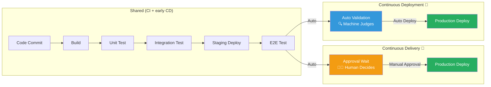
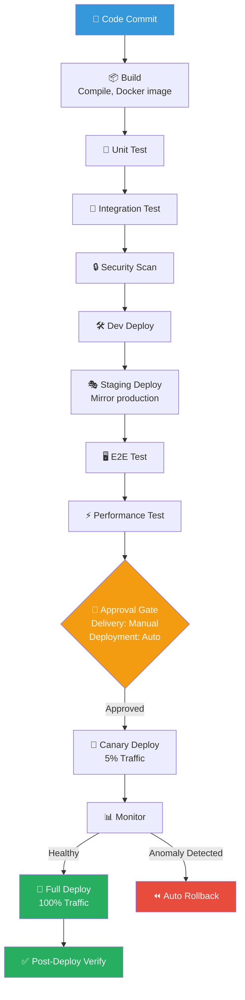
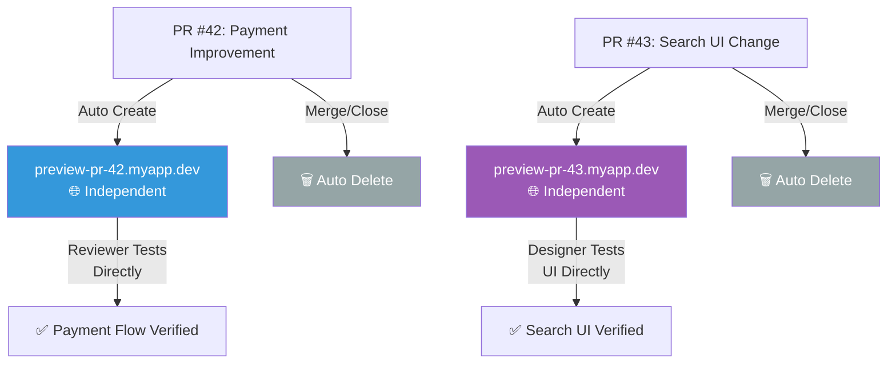
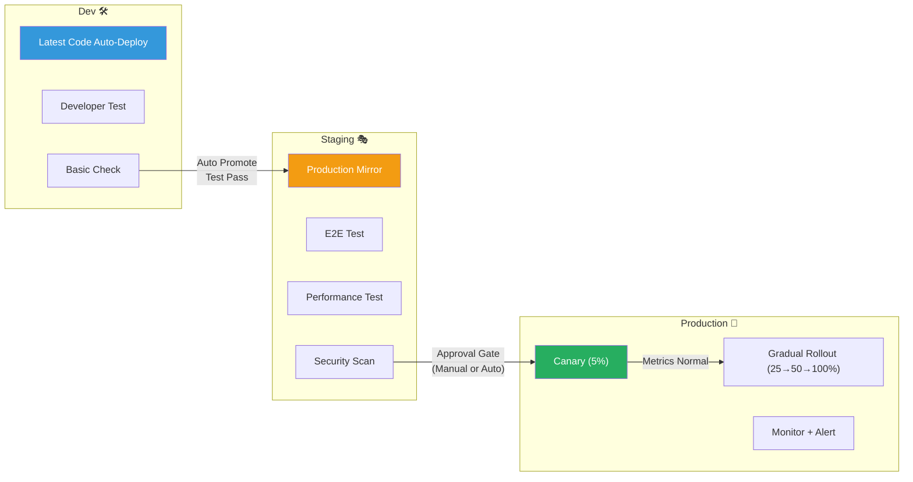

# CD (Continuous Delivery/Deployment) Pipeline

> A system that automatically delivers completed code to users — like a complete parcel delivery system. If CI is the packaging stage, CD is the entire logistics system delivering to customers. Let's see how code that passed CI safely reaches production, and what to do if something goes wrong. We've learned [CI pipeline](./03-ci-pipeline), now let's ensure safe delivery.

---

## 🎯 Why Learn CD Pipelines?

### Daily Analogy: Parcel Delivery System

When you order online:

- **Packaging** (CI): Quality check → Package → Label
- **Distribution Center** (Staging): Sort and final verification
- **Shipping** (Deployment): Deliver to customer
- **Returns** (Rollback): If issue, recover and replace

Without automation:

- Manual labor for every shipment
- Wrong address → wrong delivery
- No emergency delivery available
- Can't track what went wrong

**CD Pipeline automates all of this.**

```
Real-world moments needing CD:

• "Deploying means staying up all night"              → Auto deployment solves this
• "Deployment always causes incidents"                → Staged deployment + auto rollback
• "User sees feature 2 weeks after we finish"        → Shorten deployment cycle
• "Works on staging, broken on production"            → Environment consistency
• "Reverting takes 30+ minutes"                       → One-click rollback
• "Can't test actual behavior before merging PR"      → Preview environments
• "Who deployed what when? No idea"                   → Deployment history tracking
```

---

## 🧠 Core Concepts

### 1. Continuous Delivery vs Continuous Deployment

> **Analogy**: Parcel delivery vs drone auto-delivery

- **Continuous Delivery**: Parcel arrives at door, waits for customer signal to open. Production deployment needs **human approval** before deployment.
- **Continuous Deployment**: Drone automatically places parcel. Auto-deploys to production after tests pass.



#### Comparison Table

| Aspect | Continuous Delivery | Continuous Deployment |
|--------|--------------------|-----------------------|
| **Production Deploy** | Manual approval after | Auto deploy |
| **Human Involvement** | Required in deploy decision | Not needed (fully auto) |
| **Deploy Frequency** | Per team decision (daily/weekly) | Multiple times daily possible |
| **Requirements** | Good tests + staging | Very high test reliability |
| **Risk Level** | Low (human double-check) | Very low (auto trust) |
| **Best For** | Regulated industries, initial adoption | Mature DevOps organizations |
| **Examples** | Most finance/healthcare | Netflix, Amazon, GitHub |
| **Analogy** | Parcel + signature | Drone auto-delivery |

---

### 2. Deployment Pipeline Stages

Code moves through multiple validation stages before reaching production.



---

### 3. Rollback Strategies

When deployment goes wrong, safely restore to previous version.

#### Application Version Rollback

```bash
# Kubernetes rollback (fastest)
kubectl rollout undo deployment/my-app

# Or specific revision
kubectl rollout undo deployment/my-app --to-revision=3

# Or change image tag
kubectl set image deployment/my-app my-app=myregistry/my-app:v2.0
```

#### Traffic-Based Rollback (Fastest)

Instead of removing new version, just switch traffic back to old version.

```yaml
# AWS ALB + Target Group Blue-Green rollback
# Current: Green (v2.1) receiving traffic
# Rollback: Switch listener rule to Blue (v2.0)
# Result: Instant rollback, takes ~2 seconds
```

---

### 4. Preview Environments

Auto-created temporary environments for each PR.



Benefits:

- Reviewers test actual behavior, not just code
- QA tests independently per PR
- Designers verify UI directly
- PM/PO confirm feature implementation
- No environment conflicts between PRs

---

### 5. Promotion Strategy (Dev → Staging → Prod)

Code is gradually promoted through verified environments.



---

### 6. Feature Flags and CD

Feature Flags separate code deployment from feature release.

```
Without Feature Flags:
Deploy Code = Release Feature (simultaneous)
→ Can't deploy incomplete feature
→ Long-lived branches cause merge conflicts

With Feature Flags:
Deploy Code ≠ Release Feature (separate)
→ Deploy incomplete feature with flag OFF
→ Business team decides release timing
→ Problem? Flag OFF = instant disable (no redeploy needed!)
```

---

## 💻 Try It Yourself

### Lab 1: Basic CD Pipeline (GitHub Actions)

#### Step 1: Create Simple App

```javascript
// src/server.js
const http = require('http');
const VERSION = process.env.APP_VERSION || '1.0.0';

const server = http.createServer((req, res) => {
  if (req.url === '/health') {
    res.writeHead(200, { 'Content-Type': 'application/json' });
    res.end(JSON.stringify({ status: 'ok', version: VERSION }));
    return;
  }
  res.writeHead(200, { 'Content-Type': 'text/html' });
  res.end(`<h1>Hello from CD! (v${VERSION})</h1>`);
});

server.listen(3000, () => console.log('Server on port 3000'));
```

```dockerfile
# Dockerfile
FROM node:20-alpine
WORKDIR /app
COPY src/ ./src/
ENV PORT=3000
EXPOSE 3000
CMD ["node", "src/server.js"]
```

#### Step 2: CD Pipeline

```yaml
# .github/workflows/cd-pipeline.yml
name: CD Pipeline

on:
  push:
    branches: [main]
  pull_request:
    branches: [main]

jobs:
  # CI Stage
  build-and-test:
    runs-on: ubuntu-latest
    steps:
      - uses: actions/checkout@v4
      - run: npm test

  # Dev Deploy
  deploy-dev:
    needs: build-and-test
    if: github.ref == 'refs/heads/main'
    runs-on: ubuntu-latest
    steps:
      - name: Deploy to Dev
        run: echo "Deploying to dev..."

  # Staging Deploy
  deploy-staging:
    needs: [build-and-test, deploy-dev]
    if: github.ref == 'refs/heads/main'
    runs-on: ubuntu-latest
    steps:
      - name: Deploy to Staging
        run: echo "Deploying to staging..."
      - name: Run E2E Tests
        run: echo "Running E2E tests..."

  # Production Deploy (Manual Approval)
  deploy-production:
    needs: [build-and-test, deploy-staging]
    if: github.ref == 'refs/heads/main'
    runs-on: ubuntu-latest
    environment:
      name: production           # Requires manual approval in GitHub
    steps:
      - name: Deploy to Production
        run: echo "Deploying to production..."
      - name: Smoke Tests
        run: echo "Verifying deployment..."
```

#### Step 3: GitHub Environment Setup

```
GitHub Settings → Environments → New

1. Create "development"
   - No protection rules (auto-deploy)

2. Create "staging"
   - No protection rules (auto-deploy)

3. Create "production"
   - Required reviewers: Add team lead
   - Deployment branches: main only
```

---

## 🏢 Real-world Scenarios

### Scenario 1: Friday Afternoon Emergency

**Situation**: Production payment error Friday 4 PM

```
Without CD Pipeline:
16:00  Discover bug → "Who deployed last?"
16:30  Identify root cause
17:00  Write hotfix
17:30  Manual deployment → other features break
18:00  Rollback manually (what version was stable?)
19:30  Finally recovered... weekend overtime 😢

With CD Pipeline:
16:00  Discover bug → Auto alert
16:05  One-click rollback → 2 min recovery ✅
16:07  Service verified (auto health check)
16:10  Start root cause analysis calmly
16:30  Hotfix PR created → Preview env test
16:45  Merge → Auto deploy dev → staging → approval → prod
17:00  Hotfix done, go home 🏠
```

---

### Scenario 2: Large Feature Release (Canary + Feature Flag)

```yaml
# Week 1: Internal Only (employees)
feature_flags:
  new_search_engine:
    enabled: true
    rollout: 0
    allowed_groups: ["employees"]

# Week 2: Beta Users 5%
rollout: 5
allowed_groups: ["employees", "beta-testers"]

# Week 3: 25% Rollout (Enhanced monitoring)
rollout: 25

# Week 4: 100% Full Rollout
rollout: 100

# Week 5: Clean up Feature Flag
# Remove flag + delete legacy code (pay down technical debt)
```

---

## ⚠️ Common Mistakes

### Mistake 1: Deploy Without Rollback Plan

❌ "Build succeeds, rollback is someone else's problem"
✅ Every deployment needs:
  - Verified rollback script
  - DB down() migration script
  - Pre-deployment checklist
  - Rollback owner designated

### Mistake 2: Environment Differences

❌ "Works on staging, why not production?"

Real issues:
- Staging: 100 records / Production: 100M records → Query timeout
- Staging: Single server / Production: Load balancer + 3 servers → Session issues
- Staging: HTTP / Production: HTTPS → Certificate errors
- Staging: No time zones / Production: Global → Localization issues

✅ Keep staging identical to production using IaC

### Mistake 3: No Test Coverage

❌ Adopting Continuous Deployment with 20% test coverage
→ Daily production incidents

✅ Start with Continuous Delivery (manual approval)
→ Graduate to Deployment when confident

### Mistake 4: Ignoring Feature Flag Cleanup

❌ "Feature Flags are temporary... but let's leave 150 of them"
→ Code full of unmaintainable if/else branches

✅ Remove released flags within 2 weeks
→ Auto-alert for flags older than 1 month

### Mistake 5: Deploying at Wrong Time

❌ "Let's deploy Friday 5 PM!" → Weekend oncall

✅ Deploy Tuesday-Thursday, 10 AM-2 PM
❌ Avoid: Friday afternoon, Monday morning, holidays, events

---

## 📝 Summary

### CD Concepts

| Concept | Meaning | Analogy |
|---------|---------|---------|
| **Continuous Delivery** | Manual approval before production deploy | Parcel + signature |
| **Continuous Deployment** | Auto deploy if tests pass | Drone auto-delivery |
| **Deployment Pipeline** | Code path from dev to production | Airport boarding process |
| **Approval Gate** | Check before advancing | Security checkpoint |
| **Rollback** | Problem found → restore previous | Car recall |
| **Preview Environment** | PR's temporary test environment | Tasting corner |
| **Promotion** | Gradual code elevation | Employee promotions |
| **Feature Flag** | Separate deploy from release | Light switch |
| **DORA Metrics** | Deployment performance indicators | Health check |
| **Canary Deploy** | Small traffic first validation | Canary in coal mine |

### CD Maturity Checklist

```
Foundation:
□ CI pipeline working
□ Test coverage sufficient (70%+)
□ Container-based deployment
□ Infrastructure as Code

Pipeline Structure:
□ Dev → Staging → Production separated
□ Tests per environment defined
□ Approval gates configured
□ Notifications enabled (Slack/Teams)

Safety:
□ Rollback procedure documented + tested
□ DB migration rollback scripts included
□ Health check endpoint implemented
□ Monitoring + alerting configured
□ Deployment time window guidelines

Advanced:
□ Preview environments auto-created
□ Feature Flag system in place
□ DORA metrics measured
□ Canary/Blue-Green deployment available
```

---

## 🔗 Next Steps

### What We Learned

```
✅ CD concepts (Delivery vs Deployment)
✅ Deployment pipeline stages
✅ Approval gates and promotion strategy
✅ Rollback strategies
✅ Preview environments
✅ Feature Flags for safe deployment
✅ Real-world deployment patterns
```

### Complete CI/CD Journey

```
Git Basics → Branching Strategy → CI Pipeline → CD Pipeline

Your code now flows:
Local Development → Branch Push → CI Testing → CD Staging →
Approval → CD Production → Monitoring → Rollback if needed

Fully automated, safe, fast, and auditable!
```

### Recommended Learning

```
Official Docs:
- Deployment strategies
- Helm/Kustomize for Kubernetes
- Infrastructure as Code (Terraform)

Advanced Topics:
- GitOps (Git as source of truth)
- Progressive delivery
- Chaos engineering (intentional failure testing)
- Observability (monitoring, logging, tracing)
```

---

> **Congratulations!** You now understand the complete software delivery pipeline from version control to production. You're ready to build and operate production systems like a senior engineer!
