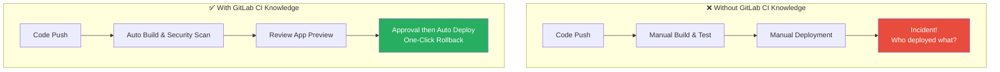
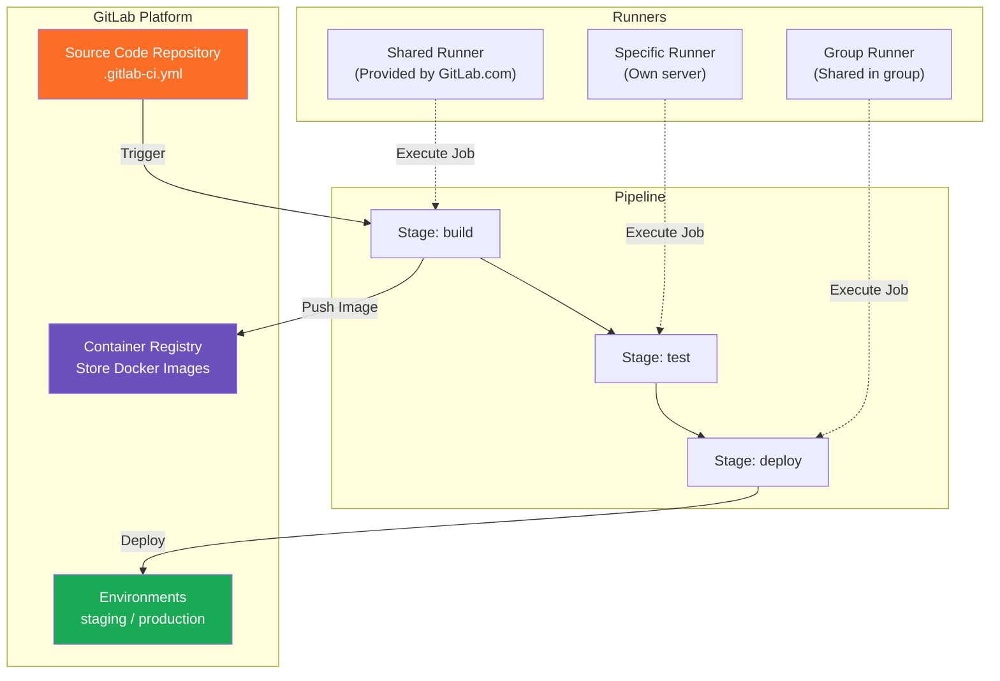
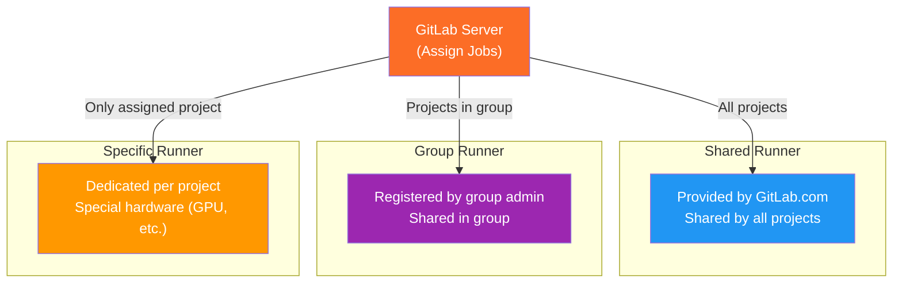
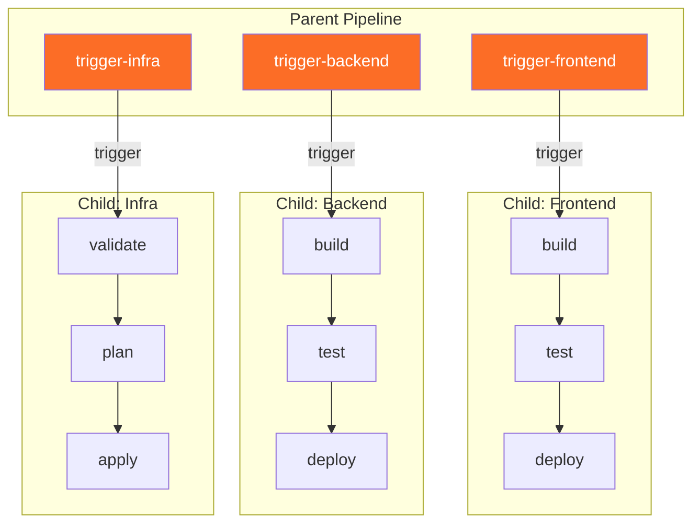
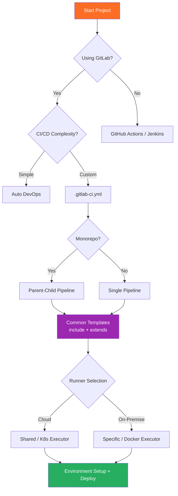

# GitLab CI in Practice

> GitLab CI/CD is an all-in-one DevOps tool with code repositories and CI/CD pipelines integrated into a single platform. While GitHub Actions is like a "smartphone where you pick and choose apps from the store," GitLab CI is like "an all-in-one appliance with all features built-in." Building on the CI/CD concepts learned in [GitHub Actions in Practice](./05-github-actions), let's explore GitLab's powerful features.

---

## 🎯 Why Learn GitLab CI?

### Everyday Analogy: All-in-One Kitchen System

Imagine running a restaurant.

- **GitHub Actions approach**: Buy oven from Company A, refrigerator from Company B, dishwasher from Company C separately. High freedom but integration is cumbersome.
- **GitLab CI approach**: Oven, refrigerator, and dishwasher are one built-in system. Everything managed in one place and integration between components is automatic.

```
Real-world moments when you need GitLab CI:

• Company uses GitLab for source control            → Build pipeline without separate CI tool
• On-premise (self-hosted) environment needed       → GitLab CE/EE + own Runners
• Want to manage code → build → test → deploy in one place  → All-in-one platform
• Need integrated container registry management     → GitLab Container Registry built-in
• Want to bake security scanning into pipeline      → Auto DevOps
• Need complex multi-project pipelines              → Parent-Child / Multi-project Pipeline
```

### Problems Without GitLab CI Knowledge



---

## 🧠 Core Concepts

### 1. .gitlab-ci.yml

> **Analogy**: Restaurant kitchen operation manual

`.gitlab-ci.yml` is a pipeline configuration file placed in the project root. It defines "what work to do, in what order, and under what conditions."

### 2. Pipeline, Stage, Job Relationship

> **Analogy**: Factory production line

- **Pipeline**: The entire process line to complete one product
- **Stage**: Each process step (raw material inspection → assembly → testing → packaging)
- **Job**: Specific work performed at each step (tightening bolts, visual inspection, etc.)

### 3. Runner

> **Analogy**: Delivery rider

The agent that actually executes Jobs. Like a delivery app rider, when a Job order comes in, it's assigned and processed.

### 4. GitLab Container Registry

> **Analogy**: Dedicated warehouse attached to the factory

You can build Docker images and store/manage them directly within the GitLab project without needing external repositories.

### 5. Environment & Review App

> **Analogy**: New menu tasting booth

A system to preview before deployment in an identical environment. Review App automatically creates a temporary environment for each Merge Request.

### Full Architecture at a Glance



---

## 🔍 Understanding Each Component in Detail

### 1. .gitlab-ci.yml Basic Structure

GitLab automatically executes the pipeline when it detects this file.

```yaml
# .gitlab-ci.yml basic structure

# 1) Global settings
image: node:20-alpine          # Default Docker image for all Jobs
variables:                      # Global environment variables
  APP_NAME: "my-app"
  NODE_ENV: "test"

# 2) Define stages (execution order)
stages:
  - build
  - test
  - deploy

# 3) Global cache settings
cache:
  key: ${CI_COMMIT_REF_SLUG}
  paths:
    - node_modules/

# 4) Job definitions
build-job:
  stage: build                  # Which stage this belongs to
  script:                       # Commands to execute
    - npm ci
    - npm run build
  artifacts:                    # Files to pass to next stage
    paths:
      - dist/
    expire_in: 1 hour

test-job:
  stage: test
  script:
    - npm test
  coverage: '/Lines\s*:\s*(\d+\.?\d*)%/'  # Regex to extract coverage

deploy-job:
  stage: deploy
  script:
    - echo "Deploying $APP_NAME..."
  environment:
    name: production
    url: https://my-app.example.com
  when: manual                  # Execute after manual approval
  rules:
    - if: $CI_COMMIT_BRANCH == "main"
```

### 2. Stages and Jobs

#### Stage Execution Rules

```
Stage 1 (build)     Stage 2 (test)      Stage 3 (deploy)
┌─────────────┐     ┌─────────────┐     ┌─────────────┐
│ build-app   │     │ unit-test   │     │ deploy-stg  │
│ build-docs  │ ──→ │ lint        │ ──→ │ deploy-prod │
└─────────────┘     │ e2e-test    │     └─────────────┘
  Parallel         └─────────────┘       Parallel
                     Parallel

  Warning: All jobs in Stage 1 must succeed before Stage 2!
```

#### Job Key Configuration Options

```yaml
comprehensive-job:
  stage: test
  image: python:3.12            # Override Docker image per Job
  rules:                        # Execution conditions
    - if: $CI_PIPELINE_SOURCE == "merge_request_event"
    - if: $CI_COMMIT_BRANCH == "main"
    - when: never
  variables:
    PYTHON_ENV: "testing"
  before_script:
    - pip install -r requirements.txt
  script:
    - pytest tests/ --cov=app
  after_script:                 # Execute regardless of success/failure
    - echo "Testing complete!"
  artifacts:
    paths:
      - coverage/
    reports:
      junit: report.xml         # Display test results in MR
    expire_in: 7 days
  cache:
    key: pip-$CI_COMMIT_REF_SLUG
    paths:
      - .pip-cache/
  needs: ["build-job"]          # Ignore stage order, run immediately after job
  timeout: 30 minutes
  retry:
    max: 2
    when: [runner_system_failure, stuck_or_timeout_failure]
  tags: [docker, linux]         # Run on specific Runner
  parallel: 3                   # Split and run in 3 parallel instances
```

### 3. Variables and Secrets

> **Analogy**: Recipe card (variables) and vault (secrets)

```yaml
# Global variables
variables:
  DATABASE_HOST: "db.example.com"

test-job:
  variables:
    DATABASE_HOST: "test-db.example.com"  # Job level overrides global
  script:
    - echo $DATABASE_HOST
```

```
Variable Priority (highest wins):

1. Trigger variables          ← Variables passed via API/trigger
2. Project CI/CD variables    ← Set in GitLab UI (Settings > CI/CD)
3. Group CI/CD variables      ← Group level settings
4. Instance CI/CD variables   ← GitLab instance level
5. .gitlab-ci.yml job variables    ← Job level
6. .gitlab-ci.yml global variables ← File top-level
7. GitLab built-in variables  ← CI_COMMIT_SHA, CI_PROJECT_NAME, etc.
```

#### Frequently Used Built-in Variables

```yaml
script:
  - echo "Commit: $CI_COMMIT_SHORT_SHA"       # Short commit hash
  - echo "Branch: $CI_COMMIT_REF_NAME"        # Current branch name
  - echo "Pipeline: $CI_PIPELINE_ID"          # Pipeline ID
  - echo "Source: $CI_PIPELINE_SOURCE"        # push, merge_request_event, etc.
  - echo "Registry: $CI_REGISTRY_IMAGE"       # Container Registry address
  - echo "MR: $CI_MERGE_REQUEST_IID"          # MR number (only in MR pipeline)
```

#### Secret Management

```
Settings > CI/CD > Variables > Add Variable

┌─────────────────────────────────────────────────────┐
│  Key:   DOCKER_PASSWORD                             │
│  Value: ********** (masked)                         │
│                                                     │
│  [✅] Protect variable  → Only protected branches   │
│  [✅] Mask variable     → Masked as *** in logs     │
│  Environment scope: production → Specific environ   │
└─────────────────────────────────────────────────────┘
```

### 4. GitLab Runner

#### Runner Type Comparison



#### Runner Installation and Registration

```bash
# 1) Install Runner (Ubuntu)
curl -L "https://packages.gitlab.com/install/repositories/runner/gitlab-runner/script.deb.sh" | sudo bash
sudo apt-get install gitlab-runner

# 2) Register Runner
sudo gitlab-runner register
# → Enter GitLab URL, registration token, description, tags, executor, default image

# 3) Check status
sudo gitlab-runner status
sudo gitlab-runner list
```

#### Executor Types and Configuration

```toml
# /etc/gitlab-runner/config.toml

# Docker executor (most commonly used)
[[runners]]
  name = "docker-runner"
  executor = "docker"
  [runners.docker]
    image = "alpine:latest"
    privileged = false
    volumes = ["/cache"]

# Kubernetes executor (Run as Pod in K8s cluster)
[[runners]]
  name = "k8s-runner"
  executor = "kubernetes"
  [runners.kubernetes]
    namespace = "gitlab-ci"
    cpu_request = "500m"
    memory_request = "256Mi"
```

```
Executor Selection Guide:

┌─────────────────┬──────────────────────────────────────────┐
│ Executor        │ Best For                                 │
├─────────────────┼──────────────────────────────────────────┤
│ Docker          │ Most versatile, isolated env, most CI/CD │
│ Shell           │ Simple scripts, direct server usage      │
│ Kubernetes      │ K8s cluster available, auto-scaling      │
│ Docker+Machine  │ Large projects, cost optimization        │
└─────────────────┴──────────────────────────────────────────┘
```

### 5. Cache and Artifacts

> **Analogy**: Cache is "my desk drawer", Artifacts is "team shared cabinet"

```yaml
build-job:
  script:
    - npm ci && npm run build
  cache:                          # Reuse in next pipeline
    key:
      files: [package-lock.json]  # Update cache when file changes
    paths: [node_modules/]
    policy: pull-push             # Read + write
  artifacts:                      # Pass to next Stage's Jobs
    paths: [dist/]
    expire_in: 1 day

test-job:
  script: npm test
  cache:
    key:
      files: [package-lock.json]
    paths: [node_modules/]
    policy: pull                  # Read only (speed boost)
  dependencies: [build-job]       # Get artifacts from build-job
```

```
┌──────────────┬────────────────────────┬──────────────────────────┐
│              │ Cache                  │ Artifacts                │
├──────────────┼────────────────────────┼──────────────────────────┤
│ Purpose      │ Speed up builds        │ Pass data between Jobs   │
│ Persistence  │ Across pipelines       │ Within pipeline          │
│ Guarantee    │ Best-effort (optional) │ Always guaranteed        │
│ Use Cases    │ node_modules, .m2, pip│ dist/, report.xml        │
│ Download     │ Automatic              │ Possible in GitLab UI    │
└──────────────┴────────────────────────┴──────────────────────────┘
```

### 6. Environments and Review App

```yaml
deploy-staging:
  stage: deploy
  script: ./deploy.sh staging
  environment:
    name: staging
    url: https://staging.example.com
    on_stop: stop-staging          # Link to environment stop Job
  rules:
    - if: $CI_COMMIT_BRANCH == "develop"

stop-staging:
  script: ./teardown.sh staging
  environment:
    name: staging
    action: stop
  when: manual

# Review App — Automatically create temporary environment per MR
review-app:
  script:
    - kubectl apply -f k8s/ --namespace=review-${CI_MERGE_REQUEST_IID}
  environment:
    name: review/${CI_MERGE_REQUEST_SOURCE_BRANCH_NAME}
    url: https://${CI_MERGE_REQUEST_IID}.review.example.com
    on_stop: stop-review
    auto_stop_in: 1 week           # Auto-delete after 1 week
  rules:
    - if: $CI_PIPELINE_SOURCE == "merge_request_event"
```

### 7. include and extends (Code Reuse)

> **Analogy**: Lego blocks — separate common settings and assemble

```yaml
# .gitlab-ci.yml
include:
  - local: '/ci/build.yml'                          # Same project
  - project: 'devops/ci-templates'                  # Different project
    ref: main
    file: '/templates/docker-build.yml'
  - template: Security/SAST.gitlab-ci.yml           # GitLab provided template
```

```yaml
# Inherit common settings with extends
.default-job:
  image: node:20-alpine
  before_script: [npm ci]
  cache:
    key: ${CI_COMMIT_REF_SLUG}
    paths: [node_modules/]
  tags: [docker]

unit-test:
  extends: .default-job
  stage: test
  script: [npm run test:unit]

integration-test:
  extends: .default-job
  stage: test
  script: [npm run test:integration]
  services: [postgres:16-alpine]
```

### 8. GitLab Container Registry

```yaml
variables:
  IMAGE_TAG: $CI_REGISTRY_IMAGE:$CI_COMMIT_SHORT_SHA

# Docker-in-Docker approach
build-dind:
  image: docker:24
  services: [docker:24-dind]
  variables:
    DOCKER_TLS_CERTDIR: "/certs"
  before_script:
    - docker login -u $CI_REGISTRY_USER -p $CI_REGISTRY_PASSWORD $CI_REGISTRY
  script:
    - docker build -t $IMAGE_TAG .
    - docker push $IMAGE_TAG

# Kaniko approach (no privileged needed — more secure)
build-kaniko:
  image:
    name: gcr.io/kaniko-project/executor:debug
    entrypoint: [""]
  script:
    - mkdir -p /kaniko/.docker
    - >
      echo "{\"auths\":{\"$CI_REGISTRY\":{\"auth\":\"$(echo -n ${CI_REGISTRY_USER}:${CI_REGISTRY_PASSWORD} | base64)\"}}}"
      > /kaniko/.docker/config.json
    - >
      /kaniko/executor
      --context $CI_PROJECT_DIR
      --dockerfile $CI_PROJECT_DIR/Dockerfile
      --destination $IMAGE_TAG
      --cache=true
```

```
GitLab Container Registry address format:
  registry.gitlab.com/<namespace>/<project>:<tag>
  registry.gitlab.com/myteam/backend-api:v1.2.3
```

### 9. Merge Request Pipeline

```yaml
# Prevent duplicate pipeline runs (Push + MR simultaneous execution)
workflow:
  rules:
    - if: $CI_PIPELINE_SOURCE == "merge_request_event"
    - if: $CI_COMMIT_BRANCH && $CI_OPEN_MERGE_REQUESTS
      when: never        # Don't run push pipeline if MR is open
    - if: $CI_COMMIT_BRANCH
    - if: $CI_COMMIT_TAG

# Test only changed files
changed-files-test:
  script:
    - git diff --name-only $CI_MERGE_REQUEST_DIFF_BASE_SHA
    - npm run test -- --changedSince=$CI_MERGE_REQUEST_DIFF_BASE_SHA
  rules:
    - if: $CI_PIPELINE_SOURCE == "merge_request_event"
      changes: ["src/**/*", "tests/**/*"]
```

### 10. Parent-Child Pipeline

> **Analogy**: Head office and branches — independent pipelines per microservice

```yaml
# .gitlab-ci.yml (parent)
trigger-frontend:
  trigger:
    include: frontend/.gitlab-ci.yml
    strategy: depend               # Child result affects parent
  rules:
    - changes: ["frontend/**/*"]

trigger-backend:
  trigger:
    include: backend/.gitlab-ci.yml
    strategy: depend
  rules:
    - changes: ["backend/**/*"]
```



### 11. Auto DevOps

> **Analogy**: Autopilot mode — auto build, test, deploy, security scan without .gitlab-ci.yml

```
What Auto DevOps does automatically:

 1. Auto Build              → Build image with Dockerfile or Buildpack
 2. Auto Test               → Auto test with Herokuish
 3. Auto Code Quality       → Code quality analysis
 4. Auto SAST / DAST        → Static/dynamic security analysis
 5. Auto Container Scanning → Docker image vulnerability scan
 6. Auto License            → License compliance check
 7. Auto Review App         → Create temporary env per MR
 8. Auto Deploy             → Auto deploy to Kubernetes
 9. Auto Monitoring         → Auto-setup Prometheus monitoring
```

```yaml
# How to enable
# Method 1: Settings > CI/CD > Auto DevOps > Enable
# Method 2: Selectively include what you need
include:
  - template: Jobs/Build.gitlab-ci.yml
  - template: Security/SAST.gitlab-ci.yml
  - template: Security/Container-Scanning.gitlab-ci.yml

# Customize with variables
variables:
  POSTGRES_ENABLED: "false"           # Disable auto PostgreSQL
  STAGING_ENABLED: "1"                # Enable staging environment
  CANARY_ENABLED: "1"                 # Enable canary deployment
```

---

## 💻 Hands-On Practice

### Practice 1: Node.js Project Basic Pipeline

```yaml
# .gitlab-ci.yml
image: node:20-alpine

stages:
  - install
  - quality
  - build
  - deploy

install-deps:
  stage: install
  script: npm ci --prefer-offline
  cache:
    key:
      files: [package-lock.json]
    paths: [node_modules/]
    policy: pull-push
  artifacts:
    paths: [node_modules/]
    expire_in: 1 hour

lint:
  stage: quality
  needs: [{job: install-deps, artifacts: true}]
  script: npm run lint

unit-test:
  stage: quality
  needs: [{job: install-deps, artifacts: true}]
  script: npm run test -- --coverage
  coverage: '/All files[^|]*\|[^|]*\s+([\d\.]+)/'
  artifacts:
    reports:
      junit: junit.xml
      coverage_report:
        coverage_format: cobertura
        path: coverage/cobertura-coverage.xml

build-app:
  stage: build
  needs: [lint, unit-test]
  script: npm run build
  artifacts:
    paths: [dist/]
    expire_in: 1 day
  dependencies: [install-deps]

deploy-staging:
  stage: deploy
  needs: [build-app]
  script: npx netlify deploy --dir=dist --site=$NETLIFY_SITE_ID --auth=$NETLIFY_AUTH_TOKEN
  environment:
    name: staging
    url: https://staging.example.com
  rules:
    - if: $CI_COMMIT_BRANCH == "develop"

deploy-production:
  stage: deploy
  needs: [build-app]
  script: npx netlify deploy --dir=dist --site=$NETLIFY_SITE_ID --auth=$NETLIFY_AUTH_TOKEN --prod
  environment:
    name: production
    url: https://www.example.com
  when: manual
  rules:
    - if: $CI_COMMIT_BRANCH == "main"
```

### Practice 2: Docker Build + K8s Deployment

```yaml
# .gitlab-ci.yml
variables:
  IMAGE_TAG: $CI_REGISTRY_IMAGE:$CI_COMMIT_SHORT_SHA

stages:
  - test
  - build
  - deploy

test:
  image: python:3.12-slim
  before_script: pip install -r requirements.txt
  script: pytest tests/ -v --junitxml=report.xml
  artifacts:
    reports:
      junit: report.xml

build-image:
  image:
    name: gcr.io/kaniko-project/executor:debug
    entrypoint: [""]
  script:
    - mkdir -p /kaniko/.docker
    - >
      echo "{\"auths\":{\"$CI_REGISTRY\":{\"auth\":\"$(echo -n ${CI_REGISTRY_USER}:${CI_REGISTRY_PASSWORD} | base64)\"}}}"
      > /kaniko/.docker/config.json
    - >
      /kaniko/executor
      --context $CI_PROJECT_DIR
      --dockerfile $CI_PROJECT_DIR/Dockerfile
      --destination $IMAGE_TAG
      --destination $CI_REGISTRY_IMAGE:latest
      --cache=true
  rules:
    - if: $CI_COMMIT_BRANCH == "main"

deploy-staging:
  image: bitnami/kubectl:latest
  script:
    - kubectl set image deployment/my-app my-app=$IMAGE_TAG -n staging
    - kubectl rollout status deployment/my-app -n staging --timeout=300s
  environment:
    name: staging
    url: https://staging.example.com
  rules:
    - if: $CI_COMMIT_BRANCH == "main"

deploy-production:
  image: bitnami/kubectl:latest
  script:
    - kubectl set image deployment/my-app my-app=$IMAGE_TAG -n production
    - kubectl rollout status deployment/my-app -n production --timeout=300s
  environment:
    name: production
    url: https://www.example.com
  when: manual
  rules:
    - if: $CI_COMMIT_BRANCH == "main"
```

### Practice 3: Reusable CI Template

```yaml
# ci/templates/docker-build.yml — Team shared template
.docker-build-template:
  image:
    name: gcr.io/kaniko-project/executor:debug
    entrypoint: [""]
  script:
    - mkdir -p /kaniko/.docker
    - >
      echo "{\"auths\":{\"$CI_REGISTRY\":{\"auth\":\"$(echo -n ${CI_REGISTRY_USER}:${CI_REGISTRY_PASSWORD} | base64)\"}}}"
      > /kaniko/.docker/config.json
    - >
      /kaniko/executor
      --context $CI_PROJECT_DIR/$BUILD_CONTEXT
      --dockerfile $CI_PROJECT_DIR/$BUILD_CONTEXT/$DOCKERFILE_PATH
      --destination $CI_REGISTRY_IMAGE/$SERVICE_NAME:$CI_COMMIT_SHORT_SHA
      --cache=true

.deploy-k8s-template:
  image: bitnami/kubectl:latest
  script:
    - kubectl set image deployment/$SERVICE_NAME $SERVICE_NAME=$CI_REGISTRY_IMAGE/$SERVICE_NAME:$CI_COMMIT_SHORT_SHA -n $DEPLOY_ENV
    - kubectl rollout status deployment/$SERVICE_NAME -n $DEPLOY_ENV --timeout=300s
```

```yaml
# .gitlab-ci.yml — Project using templates
include:
  - project: 'devops/ci-templates'
    ref: main
    file: '/ci/templates/docker-build.yml'

variables:
  SERVICE_NAME: "my-service"
  BUILD_CONTEXT: "."
  DOCKERFILE_PATH: "Dockerfile"

build:
  extends: .docker-build-template
  stage: build

deploy-staging:
  extends: .deploy-k8s-template
  stage: deploy
  variables:
    DEPLOY_ENV: staging
  environment: {name: staging}

deploy-production:
  extends: .deploy-k8s-template
  stage: deploy
  variables:
    DEPLOY_ENV: production
  environment: {name: production}
  when: manual
```

---

## 🏢 Real-World Practices

### Scenario 1: Microservices Organization with Central Templates

```yaml
# Pattern for 20+ services organization
# Central templates in devops/ci-templates, service .gitlab-ci.yml minimal

include:
  - project: 'platform/ci-templates'
    ref: v2.5.0                          # Pin version for stability
    file:
      - '/templates/build.yml'
      - '/templates/test.yml'
      - '/templates/deploy.yml'
      - '/templates/security.yml'

variables:
  SERVICE_NAME: "order-service"
  JAVA_VERSION: "21"

test:
  extends: .java-test
  services: [postgres:16-alpine, redis:7-alpine]
```

### Scenario 2: Financial Services Security Pipeline

```yaml
stages: [build, test, security, compliance, deploy-staging, deploy-production]

include:
  - template: Security/SAST.gitlab-ci.yml
  - template: Security/Dependency-Scanning.gitlab-ci.yml
  - template: Security/Container-Scanning.gitlab-ci.yml
  - template: Security/Secret-Detection.gitlab-ci.yml

license-check:
  stage: compliance
  script: echo "License policy check..."
  allow_failure: false                   # Block deployment on failure

deploy-production:
  stage: deploy-production
  script: ./deploy.sh production
  environment:
    name: production
    deployment_tier: production
  when: manual                           # Manual approval + Protected Environment
  rules:
    - if: $CI_COMMIT_BRANCH == "main"
```

### Scenario 3: Runner Management Strategy

```
┌──────────────────────────────────────────────────────────────┐
│ GitLab.com Shared Runner                                     │
│  → Small teams, simple CI jobs, free quota within limit       │
├──────────────────────────────────────────────────────────────┤
│ AWS EC2 Spot Instance + Docker+Machine Executor              │
│  → Large CI, 70-80% cost savings with Spot, auto-scaling      │
├──────────────────────────────────────────────────────────────┤
│ Kubernetes Executor                                          │
│  → K8s cluster ops teams, Pod-based auto-scaling, isolation  │
├──────────────────────────────────────────────────────────────┤
│ Self-hosted Docker Executor                                  │
│  → GPU/special hardware, on-premise network constraints       │
└──────────────────────────────────────────────────────────────┘
```

### GitHub Actions vs GitLab CI Comparison

```
┌──────────────────────┬──────────────────────────┬──────────────────────────┐
│ Item                 │ GitHub Actions           │ GitLab CI                │
├──────────────────────┼──────────────────────────┼──────────────────────────┤
│ Config file          │ .github/workflows/*.yml  │ .gitlab-ci.yml (single)  │
│ Execution unit       │ Workflow > Job > Step    │ Pipeline > Stage > Job   │
│ Trigger              │ on: push, pull_request   │ rules, workflow:rules    │
│ Reusability          │ Marketplace Actions      │ include + extends        │
│ Execution env        │ GitHub-hosted/Self-h    │ Shared/Group/Specific    │
│ Container Registry   │ ghcr.io (separate)       │ Built-in                 │
│ Environment mgmt     │ Environments             │ Environments + Review App│
│ Cache/Artifacts      │ actions/cache (sep)      │ cache/artifacts (built)  │
│ Security Scanning    │ CodeQL + Marketplace     │ Built-in SAST/DAST/Secrte│
│ Auto DevOps          │ None                     │ Built-in                 │
│ Parent-Child Pipeline│ Reusable Workflows       │ trigger: include         │
│ Self-hosted          │ Limited                  │ GitLab CE/EE (full)      │
│ Free quota           │ 2,000 minutes/month      │ 400 minutes/month        │
│ Strength             │ Open source, Marketplace │ All-in-one, Self-hosted  │
└──────────────────────┴──────────────────────────┴──────────────────────────┘

• GitHub Actions → Open source, startups, GitHub-centric workflows
• GitLab CI → Enterprise, on-premise, all-in-one DevOps needed
```

---

## ⚠️ Common Mistakes

### Mistake 1: Using only/except Instead of rules

```yaml
# ❌ Legacy approach — no longer recommended
deploy-job:
  script: ./deploy.sh
  only: [main]
  except: [tags]

# ✅ Modern approach — use rules
deploy-job:
  script: ./deploy.sh
  rules:
    - if: $CI_COMMIT_BRANCH == "main" && $CI_COMMIT_TAG == null

# ⚠️ Mixing only/except and rules in same Job = Error!
```

### Mistake 2: Using Cache as Artifacts

```yaml
# ❌ Using cache to pass build output — cache not guaranteed!
build:
  script: npm run build
  cache:
    paths: [dist/]

deploy:
  script: ls dist/         # dist/ may not exist!

# ✅ Always use Artifacts for passing build output
build:
  script: npm run build
  artifacts:
    paths: [dist/]
    expire_in: 1 hour
```

### Mistake 3: Docker-in-Docker Security Issues

```yaml
# ❌ privileged: true is security risk
build-image:
  image: docker:24
  services: [docker:24-dind]
  variables:
    DOCKER_TLS_CERTDIR: ""     # TLS disabled? Even worse!

# ✅ Use Kaniko instead — no privileged needed
build-image:
  image:
    name: gcr.io/kaniko-project/executor:debug
    entrypoint: [""]
  script:
    - /kaniko/executor --context $CI_PROJECT_DIR --dockerfile Dockerfile --destination $IMAGE_TAG
```

### Mistake 4: Missing artifacts When Using needs

```yaml
# ❌ Using needs but artifacts don't auto-transfer
test:
  needs: ["build"]
  script: ls dist/          # dist/ may not exist!

# ✅ Explicitly request artifacts
test:
  needs:
    - job: build
      artifacts: true
  script: ls dist/           # Now OK
```

### Mistake 5: Writing Secrets in Files

```yaml
# ❌ Never do this — permanently stored in Git history!
variables:
  AWS_SECRET_ACCESS_KEY: "wJalrXUtnFEMI/K7MDENG/bPxRfiCYEXAMPLEKEY"

# ✅ Set in GitLab UI (Settings > CI/CD > Variables) with Protect + Mask
variables:
  AWS_REGION: "ap-northeast-2"     # Only non-sensitive values in files
```

### Mistake 6: Duplicate Pipeline Runs

```yaml
# ❌ Pipeline runs twice: Push and MR
test:
  script: npm test

# ✅ Use workflow:rules to prevent duplication
workflow:
  rules:
    - if: $CI_PIPELINE_SOURCE == "merge_request_event"
    - if: $CI_COMMIT_BRANCH && $CI_OPEN_MERGE_REQUESTS
      when: never
    - if: $CI_COMMIT_BRANCH
```

### Mistake 7: Runner Tag Mismatch

```yaml
# ❌ Non-existent tags → Job stuck in pending forever!
build:
  tags: [gpu-runner, cuda]

# ✅ Use tags that exactly match registered Runners
build:
  tags: [docker, linux]
```

---

## 📝 Summary

### GitLab CI Core Checklist

```
✅ Basics
  □ .gitlab-ci.yml file structure (image, stages, jobs)
  □ Pipeline → Stage → Job hierarchy and parallel/sequential rules
  □ rules to control execution conditions (instead of only/except)

✅ Execution Environment
  □ Runner types (Shared / Group / Specific)
  □ Executor selection (Docker / Kubernetes / Shell)
  □ Specify specific Runner with tags

✅ Data Management
  □ Distinguish Cache (speed) vs Artifacts (inter-Job passing)
  □ Variable priority and secret management (Protect + Mask in UI)
  □ Job dependencies with needs/dependencies

✅ Advanced Features
  □ include/extends for configuration reuse
  □ environments + Review App
  □ Parent-Child Pipeline (monorepo)
  □ GitLab Container Registry + Kaniko
  □ Auto DevOps usage
```

### Pipeline Design Decision Tree



### .gitlab-ci.yml Keyword Summary

```
Global:   image | variables | stages | cache | workflow | before_script | after_script
Job:      stage | script | image | rules | tags | needs | dependencies
          artifacts | cache | services | environment | when | retry | timeout
          parallel | allow_failure | extends
Reusable: include (local/project/remote/template) | extends | trigger
```

---

## 🔗 Next Steps

### Previous Lecture

- [GitHub Actions in Practice](./05-github-actions): Core concepts and practical application of GitHub Actions

### Next Lecture

- [Jenkins in Practice](./07-jenkins): Oldest and most flexible CI/CD tool, Jenkins Pipeline and Groovy DSL

### Learn Deeper

```
1. GitLab CI Official Documentation    → https://docs.gitlab.com/ee/ci/
2. .gitlab-ci.yml Keyword Reference    → https://docs.gitlab.com/ee/ci/yaml/
3. GitLab Runner Documentation         → https://docs.gitlab.com/runner/
4. Auto DevOps Documentation           → https://docs.gitlab.com/ee/topics/autodevops/
5. GitLab CI/CD Examples Collection    → https://docs.gitlab.com/ee/ci/examples/
```

### Learning Roadmap

```
[Git Basics] → [Branching Strategy] → [CI Concepts] → [CD Concepts]
    ↓
[GitHub Actions] → [GitLab CI ✅ You are here!] → [Jenkins]
    ↓
[Artifact Management] → [Test Automation] → [Deployment Strategy]
    ↓
[GitOps (ArgoCD)] → [Pipeline Security] → [Change Management]
```
