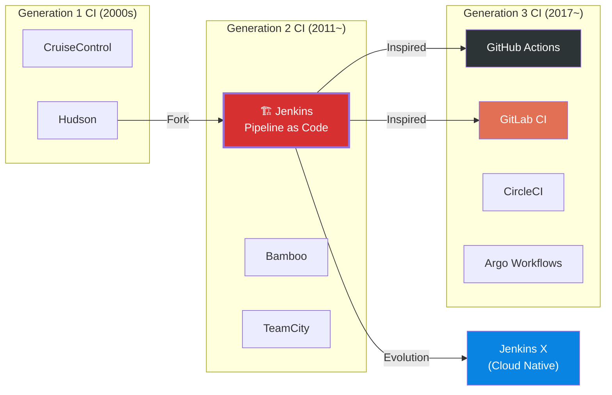
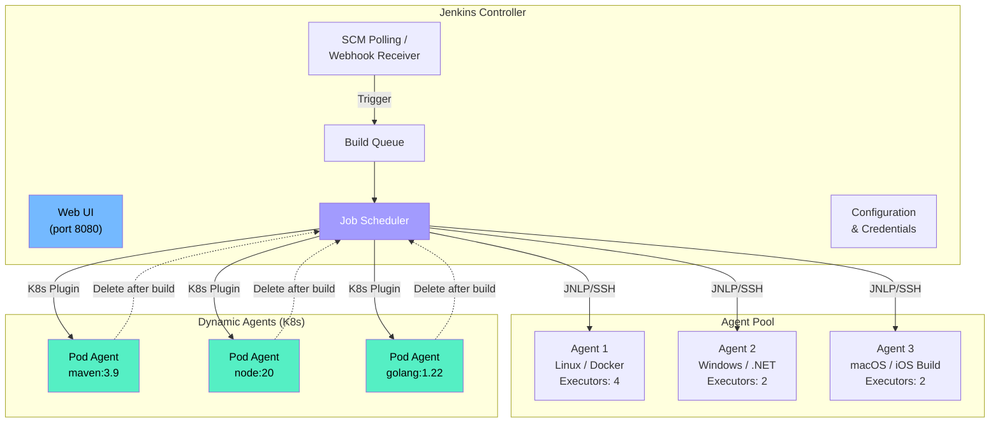
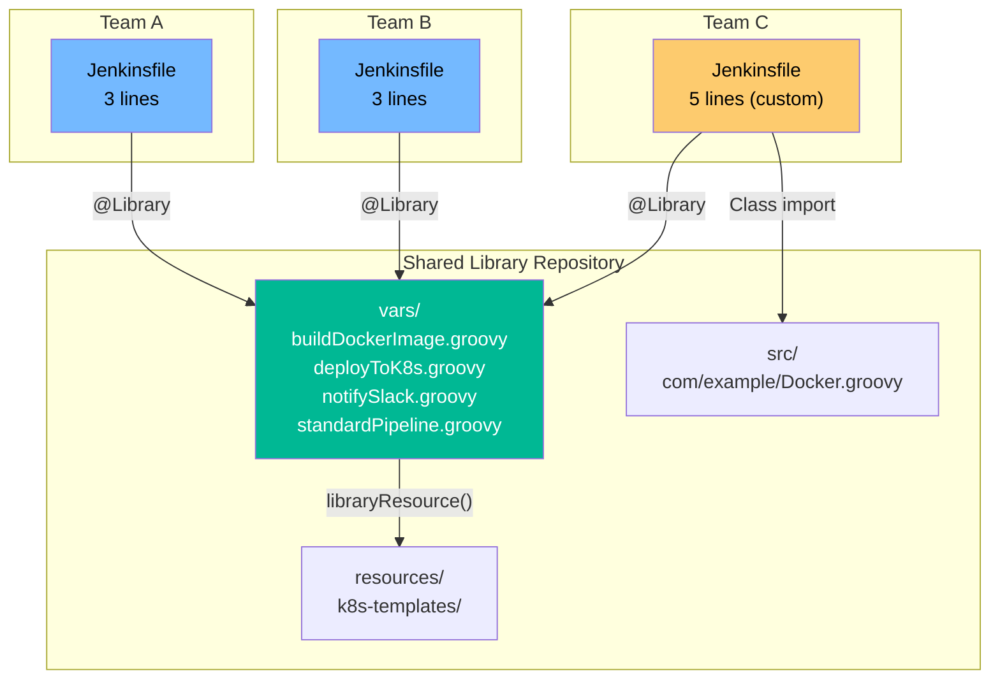

# Jenkins in Practice: Complete Guide

> Jenkins is the "original favorite restaurant" of the CI/CD world. Since 2011, it has been responsible for builds and deployments at countless enterprises, with 1,800+ plugins covering almost every scenario. While modern CI/CD tools ([GitHub Actions](./05-github-actions), [GitLab CI](./06-gitlab-ci)) have emerged, 44% of enterprises worldwide still use Jenkins. The ability to understand and modernize legacy systems is a core skill for DevOps engineers.

---

## 🎯 Why Learn Jenkins?

### Everyday Analogy: The Neighborhood All-Purpose Repair Shop

Imagine a neighborhood fix-it shop that repairs everything. They fix air conditioners, plumbing, electrical systems — anything.

- 30 years of experience means they can solve almost anything
- However, the shop is old with dated décor
- They can handle new smart home devices too, just need to add tools
- Much more versatile than new specialist shops (GitHub Actions, GitLab CI)

**That's exactly what Jenkins is.**

```
Real-world moments when Jenkins appears:

• Joined existing company, entire CI/CD is Jenkins          → Maintenance required
• Need complex build pipelines                               → Flexible Pipeline DSL
• Must build CI/CD in on-premise environment                → No cloud dependency
• 200 teams need to share common build logic                 → Shared Libraries
• Need dynamic build agents on Kubernetes                    → Jenkins on K8s
• Plan legacy Jenkins → modern CI migration                  → Migration strategy
```

### Jenkins in the CI/CD Tool Ecosystem



---

## 🧠 Core Concepts

### 1. Jenkins Architecture: Controller and Agent

> **Analogy**: Construction site supervisor and workers

At a construction site, the supervisor (Controller) plans and directs the entire project. The actual bricklaying and painting is done by workers (Agents). If the supervisor does everything alone, it becomes a bottleneck, so work is distributed to multiple workers.

- **Controller (Master)**: Jenkins' brain. Scheduling, UI, configuration management
- **Agent (Worker/Slave)**: Nodes that execute actual builds
- **Executor**: Threads within an Agent that perform builds (worker's "hands")

### 2. Pipeline as Code

> **Analogy**: Version-controlling recipe as code

Previously, builds were configured through Jenkins UI with clicks (Freestyle Jobs). Now, pipeline is defined in code files called `Jenkinsfile`. Stored with Git, so change history is preserved and code reviews are possible.

### 3. Declarative vs Scripted Pipeline

> **Analogy**: Fixed format vs free form

- **Declarative Pipeline**: Written following a fixed structure. Easy for beginners to read
- **Scripted Pipeline**: Written freely with Groovy script. Better for complex logic

### 4. Plugin Ecosystem

> **Analogy**: Smartphone app store

Jenkins itself has only basic features. Additional functionality is installed via plugins. Git integration, Docker builds, Kubernetes agents, Slack notifications — all are plugins. 1,800+ plugins are available in the "app store".

### 5. Shared Libraries

> **Analogy**: Company template library

Having every team repeat similar build logic is wasteful. Shared Libraries collect common build logic in one Git repository, and all Jenkinsfiles import and use it as a "company template library".

---

## 🔍 Understanding Each Component in Detail

### 1. Jenkins Architecture Deep Dive



#### Controller Responsibilities

| Responsibility | Description |
|------|------|
| **Scheduling** | Decide which Agent executes which build |
| **UI Provision** | Web dashboard for monitoring builds, managing configuration |
| **Auth** | User permission management (RBAC) |
| **Plugin Management** | Install, update, configure plugins |
| **Build History** | Store build logs, artifacts, test results |

#### Agent Connection Methods

```bash
# 1. SSH connection to Agent (most common)
# Controller connects via SSH to Agent and runs build

# 2. JNLP (Java Web Start) connection
# Agent actively connects to Controller (useful behind firewall)
java -jar agent.jar \
  -url http://jenkins-controller:8080 \
  -secret <secret> \
  -name "agent-01" \
  -workDir "/var/jenkins"

# 3. Docker Agent
# Create and destroy Docker container per build
# Use in Jenkinsfile: agent { docker { image 'maven:3.9' } }

# 4. Kubernetes Agent
# Dynamically create Pod in K8s cluster
# Auto-delete after build completion → resource efficient
```

#### Controller Security Principles

```
⚠️ Critical Principle: Never run builds on Controller!

Reasons:
1. Build scripts can access Controller filesystem → security risk
2. Build CPU/memory use locks up UI
3. Build environment may differ from Controller

Setting: Manage Jenkins → Nodes → Built-In Node → Executors: 0
```

---

### 2. Jenkinsfile: Declarative Pipeline

Declarative Pipeline follows a fixed structure, making it easy to read and maintain.

```groovy
// Jenkinsfile (Declarative Pipeline)
pipeline {
    // Which Agent to run on
    agent {
        kubernetes {
            yaml '''
            apiVersion: v1
            kind: Pod
            spec:
              containers:
              - name: maven
                image: maven:3.9-eclipse-temurin-17
                command: ['sleep']
                args: ['infinity']
              - name: docker
                image: docker:24-dind
                securityContext:
                  privileged: true
            '''
        }
    }

    // Environment variables
    environment {
        APP_NAME    = 'my-service'
        REGISTRY    = 'registry.example.com'
        IMAGE_TAG   = "${env.GIT_COMMIT?.take(7) ?: 'latest'}"
        SONAR_TOKEN = credentials('sonarqube-token')  // Reference credential
    }

    // Pipeline options
    options {
        timeout(time: 30, unit: 'MINUTES')        // Overall timeout
        disableConcurrentBuilds()                   // Prevent concurrent builds
        buildDiscarder(logRotator(numToKeepStr: '10'))  // Keep only 10 builds
        timestamps()                                // Add timestamps to logs
    }

    // Pipeline triggers
    triggers {
        pollSCM('H/5 * * * *')  // SCM polling every 5 minutes (H for load distribution)
    }

    // Pipeline parameters
    parameters {
        choice(name: 'ENVIRONMENT', choices: ['dev', 'staging', 'prod'],
               description: 'Select deployment environment')
        booleanParam(name: 'SKIP_TESTS', defaultValue: false,
                     description: 'Skip tests')
        string(name: 'DEPLOY_VERSION', defaultValue: '',
               description: 'Specific version to deploy (empty = latest)')
    }

    stages {
        // ===== Stage 1: Checkout =====
        stage('Checkout') {
            steps {
                checkout scm
                script {
                    env.GIT_COMMIT_MSG = sh(
                        script: 'git log -1 --pretty=%B',
                        returnStdout: true
                    ).trim()
                }
            }
        }

        // ===== Stage 2: Build =====
        stage('Build') {
            steps {
                container('maven') {
                    sh '''
                        echo "Building ${APP_NAME}..."
                        mvn clean package -DskipTests
                    '''
                }
            }
        }

        // ===== Stage 3: Test (Parallel) =====
        stage('Test') {
            when {
                not { expression { params.SKIP_TESTS } }
            }
            parallel {
                stage('Unit Tests') {
                    steps {
                        container('maven') {
                            sh 'mvn test'
                        }
                    }
                    post {
                        always {
                            junit '**/target/surefire-reports/*.xml'
                        }
                    }
                }
                stage('Integration Tests') {
                    steps {
                        container('maven') {
                            sh 'mvn verify -Pintegration-test'
                        }
                    }
                }
                stage('SonarQube Analysis') {
                    steps {
                        container('maven') {
                            sh '''
                                mvn sonar:sonar \
                                  -Dsonar.token=${SONAR_TOKEN}
                            '''
                        }
                    }
                }
            }
        }

        // ===== Stage 4: Docker Build =====
        stage('Docker Build & Push') {
            steps {
                container('docker') {
                    sh '''
                        docker build -t ${REGISTRY}/${APP_NAME}:${IMAGE_TAG} .
                        docker push ${REGISTRY}/${APP_NAME}:${IMAGE_TAG}
                    '''
                }
            }
        }

        // ===== Stage 5: Deploy (Conditional) =====
        stage('Deploy to Dev') {
            when {
                branch 'develop'
            }
            steps {
                sh "kubectl set image deployment/${APP_NAME} app=${REGISTRY}/${APP_NAME}:${IMAGE_TAG} -n dev"
            }
        }

        stage('Deploy to Production') {
            when {
                allOf {
                    branch 'main'
                    expression { params.ENVIRONMENT == 'prod' }
                }
            }
            input {
                message 'Approve production deployment?'
                ok 'Approve Deployment'
                submitter 'admin,deployer'  // Approval authority
                parameters {
                    string(name: 'CONFIRM', defaultValue: '',
                           description: "Type 'yes' to confirm deployment")
                }
            }
            steps {
                sh """
                    kubectl set image deployment/${APP_NAME} \
                      app=${REGISTRY}/${APP_NAME}:${IMAGE_TAG} \
                      -n production
                """
            }
        }
    }

    // ===== Post Actions (Always Execute) =====
    post {
        success {
            slackSend(
                color: 'good',
                message: "✅ ${APP_NAME} build successful: ${env.BUILD_URL}"
            )
        }
        failure {
            slackSend(
                color: 'danger',
                message: "❌ ${APP_NAME} build failed: ${env.BUILD_URL}"
            )
        }
        always {
            cleanWs()  // Clean workspace
        }
    }
}
```

#### Declarative Pipeline Structure

```
pipeline {                    ← Top-level block (required)
├── agent { ... }             ← Where to execute? (required)
├── environment { ... }       ← Environment variables (optional)
├── options { ... }           ← Pipeline options (optional)
├── triggers { ... }          ← Auto triggers (optional)
├── parameters { ... }        ← Input parameters (optional)
├── stages {                  ← Stage container (required)
│   ├── stage('Name') {       ← Individual stage
│   │   ├── when { ... }      ← Conditional execution (optional)
│   │   ├── steps { ... }     ← Execution steps (required)
│   │   └── post { ... }      ← Stage post-processing (optional)
│   │
│   └── stage('Parallel') {   ← Parallel stage
│       └── parallel { ... }
│   }
└── post {                    ← Overall post-processing (optional)
    ├── always { ... }
    ├── success { ... }
    ├── failure { ... }
    ├── unstable { ... }
    └── changed { ... }       ← When status changes vs previous build
}
```

---

### 3. Scripted Pipeline

Scripted Pipeline can use full Groovy language capabilities, allowing complex conditional logic and dynamic stage generation.

```groovy
// Jenkinsfile (Scripted Pipeline)
node('linux') {
    def services = ['user-service', 'order-service', 'payment-service']
    def buildResults = [:]

    try {
        stage('Checkout') {
            checkout scm
        }

        stage('Build All Services') {
            // Dynamically iterate over services and build
            def parallelBuilds = [:]

            services.each { svc ->
                parallelBuilds[svc] = {
                    node('docker') {
                        checkout scm
                        dir(svc) {
                            try {
                                sh "docker build -t registry.example.com/${svc}:${env.BUILD_NUMBER} ."
                                buildResults[svc] = 'SUCCESS'
                            } catch (e) {
                                buildResults[svc] = 'FAILURE'
                                throw e
                            }
                        }
                    }
                }
            }

            // Parallel execution
            parallel parallelBuilds
        }

        stage('Deploy') {
            // Write conditional logic freely
            if (env.BRANCH_NAME == 'main') {
                timeout(time: 10, unit: 'MINUTES') {
                    input message: 'Approve production deployment?'
                }

                services.each { svc ->
                    if (buildResults[svc] == 'SUCCESS') {
                        sh "kubectl apply -f ${svc}/k8s/"
                    } else {
                        echo "Skipping ${svc} - build failed"
                    }
                }
            }
        }

        currentBuild.result = 'SUCCESS'

    } catch (e) {
        currentBuild.result = 'FAILURE'
        throw e

    } finally {
        // Cleanup
        stage('Cleanup & Notify') {
            echo "Build Results: ${buildResults}"

            // Slack notification
            def color = currentBuild.result == 'SUCCESS' ? 'good' : 'danger'
            slackSend(color: color,
                      message: "${currentBuild.result}: ${env.JOB_NAME} #${env.BUILD_NUMBER}")
        }
    }
}
```

#### Declarative vs Scripted Comparison

| Aspect | Declarative | Scripted |
|-----------|-------------|----------|
| **Syntax** | Fixed structure (`pipeline { }`) | Free-form Groovy (`node { }`) |
| **Learning curve** | Low (template-like) | High (requires Groovy knowledge) |
| **Flexibility** | Limited (`script { }` block for extension) | Completely free |
| **Error handling** | `post { }` block | `try/catch/finally` |
| **Parallel execution** | `parallel { }` block | `parallel` function |
| **Code review** | Easy (clear structure) | Difficult (complex logic) |
| **Recommended for** | General CI/CD pipelines | Complex dynamic logic, monorepo |
| **Jenkins official recommendation** | **Recommended** | Legacy compatibility |

> **Practical Tip**: 90% of cases are covered by Declarative Pipeline. Only use `script { }` blocks or Scripted Pipeline when really complex dynamic logic is needed.

---

### 4. Plugin Ecosystem

Jenkins' power comes from plugins. But more plugins means harder management and more security vulnerabilities.

#### TOP 15 Essential Plugins

| Category | Plugin | Purpose |
|----------|---------|------|
| **Pipeline** | Pipeline (workflow-aggregator) | Pipeline as Code core |
| **Pipeline** | Pipeline Stage View | Visual pipeline view |
| **SCM** | Git | Git integration |
| **SCM** | GitHub Branch Source | GitHub multibranch |
| **Build** | Docker Pipeline | Docker build/Agent |
| **Build** | Kubernetes | K8s dynamic Agent |
| **Quality** | JUnit | Test result reports |
| **Quality** | Cobertura / JaCoCo | Code coverage |
| **Quality** | SonarQube Scanner | Static analysis |
| **Security** | Credentials Binding | Secret management |
| **Security** | Role-based Authorization | RBAC |
| **Notification** | Slack Notification | Slack alerts |
| **Management** | Configuration as Code (JCasC) | Jenkins config as code |
| **Management** | Job DSL | Auto job generation |
| **UI** | Blue Ocean | Modern UI (maintenance mode) |

#### Plugin Management Principles

```groovy
// plugins.txt — Pre-install plugins in Docker image
// MUST fix versions!

workflow-aggregator:596.v8c21c963d92d
git:5.2.0
kubernetes:4029.v5712230ccb_f8
docker-workflow:572.v950f58993843
credentials-binding:677.vdc9c71757788
configuration-as-code:1775.v810dc950b_514
pipeline-stage-view:2.34
junit:1265.v65b_14fa_f12f0
slack:684.v833089650554
blueocean:1.27.9
```

```bash
# Install plugins in Docker image (recommended)
# This way plugins are already installed when Jenkins starts
FROM jenkins/jenkins:2.440-lts

COPY plugins.txt /usr/share/jenkins/ref/plugins.txt
RUN jenkins-plugin-cli --plugin-file /usr/share/jenkins/ref/plugins.txt
```

```
⚠️ Plugin Management Core Principles:

1. Pin versions: Installing without versions enables auto-update = potential outages
2. Minimal install: Only install what you need (more plugins = more vulnerabilities)
3. Regular updates: Review updates monthly for security patches
4. Compatibility check: Always verify Jenkins and plugin version compatibility
5. Test before: Validate updates in staging before production
```

---

### 5. Credentials Management

Jenkins safely manages passwords, API keys, SSH keys and other sensitive information.

#### Credential Types

| Type | Purpose | Example |
|------|---------|---------|
| **Username with password** | ID/PW authentication | Docker Registry, DB |
| **Secret text** | Single secret value | API key, token |
| **Secret file** | File-based secret | kubeconfig, service account JSON |
| **SSH Username with private key** | SSH authentication | Git access, server access |
| **Certificate** | Certificate-based auth | TLS client authentication |

#### Using Credentials in Jenkinsfile

```groovy
pipeline {
    agent any

    environment {
        // Reference with credentials() function
        // 'docker-hub-creds' is the Credential ID registered in Jenkins UI
        DOCKER_CREDS = credentials('docker-hub-creds')
        // Username with password → automatically creates DOCKER_CREDS_USR, DOCKER_CREDS_PSW

        AWS_CREDS = credentials('aws-access-key')
        KUBECONFIG_FILE = credentials('k8s-config')  // Secret file
    }

    stages {
        stage('Docker Login') {
            steps {
                sh '''
                    echo "${DOCKER_CREDS_PSW}" | docker login \
                      -u "${DOCKER_CREDS_USR}" --password-stdin
                '''
            }
        }

        stage('Deploy to K8s') {
            steps {
                // Use withCredentials to scope (more secure)
                withCredentials([
                    file(credentialsId: 'k8s-config', variable: 'KUBECONFIG'),
                    string(credentialsId: 'sonar-token', variable: 'SONAR_TOKEN')
                ]) {
                    sh '''
                        kubectl --kubeconfig=${KUBECONFIG} apply -f k8s/
                        echo "SonarQube token length: ${#SONAR_TOKEN}"
                    '''
                    // ⚠️ Jenkins automatically masks credential values in logs
                }
            }
        }
    }
}
```

```
Security Tips:

• Always register Credentials via Jenkins UI or JCasC
• Never hardcode in Jenkinsfile — exposes plaintext to Git!
• Use withCredentials() block to minimize exposure scope
• Can limit Credential Scope to Folder level
• HashiCorp Vault plugin available for external secret management
```

---

### 6. Shared Libraries

Having every team repeat similar pipeline logic violates DRY. Shared Libraries manage common logic centrally.

#### Shared Library Structure

```
jenkins-shared-library/          ← Git repository
├── vars/                        ← Global Variables (most used)
│   ├── buildDockerImage.groovy  ← Called as buildDockerImage() function
│   ├── deployToK8s.groovy       ← Called as deployToK8s() function
│   ├── notifySlack.groovy       ← Called as notifySlack() function
│   └── standardPipeline.groovy  ← Complete pipeline template
├── src/                         ← Class library (advanced)
│   └── com/
│       └── example/
│           └── Docker.groovy    ← Utility class
├── resources/                   ← Resource files
│   └── k8s-templates/
│       └── deployment.yaml
└── README.md
```

#### Example: vars/buildDockerImage.groovy

```groovy
// vars/buildDockerImage.groovy
// Called in Jenkinsfile as: buildDockerImage(app: 'my-svc', tag: '1.0')

def call(Map config = [:]) {
    def app      = config.app ?: error("app parameter required")
    def tag      = config.tag ?: env.GIT_COMMIT?.take(7) ?: 'latest'
    def registry = config.registry ?: 'registry.example.com'
    def dockerfile = config.dockerfile ?: 'Dockerfile'

    echo "🐳 Building Docker image: ${registry}/${app}:${tag}"

    sh """
        docker build \
          -t ${registry}/${app}:${tag} \
          -t ${registry}/${app}:latest \
          -f ${dockerfile} \
          --label git-commit=${env.GIT_COMMIT} \
          --label build-number=${env.BUILD_NUMBER} \
          .
    """

    // Push using Credential
    withCredentials([
        usernamePassword(
            credentialsId: 'docker-registry-creds',
            usernameVariable: 'DOCKER_USER',
            passwordVariable: 'DOCKER_PASS'
        )
    ]) {
        sh """
            echo "\${DOCKER_PASS}" | docker login ${registry} \
              -u "\${DOCKER_USER}" --password-stdin
            docker push ${registry}/${app}:${tag}
            docker push ${registry}/${app}:latest
        """
    }

    return "${registry}/${app}:${tag}"
}
```

#### Example: vars/standardPipeline.groovy (Complete Template)

```groovy
// vars/standardPipeline.groovy
// Team Jenkinsfiles become one-liners!

def call(Map config) {
    pipeline {
        agent {
            kubernetes {
                yaml libraryResource('k8s-templates/build-pod.yaml')
            }
        }

        environment {
            APP_NAME  = config.appName
            IMAGE_TAG = "${env.GIT_COMMIT?.take(7)}"
        }

        stages {
            stage('Build') {
                steps {
                    container('maven') {
                        sh "mvn clean package -DskipTests"
                    }
                }
            }

            stage('Test') {
                steps {
                    container('maven') {
                        sh "mvn test"
                    }
                }
                post {
                    always { junit '**/surefire-reports/*.xml' }
                }
            }

            stage('Docker Build') {
                steps {
                    buildDockerImage(app: config.appName)
                }
            }

            stage('Deploy') {
                when { branch 'main' }
                steps {
                    deployToK8s(
                        app: config.appName,
                        namespace: config.namespace ?: 'default'
                    )
                }
            }
        }

        post {
            always {
                notifySlack(channel: config.slackChannel ?: '#builds')
            }
        }
    }
}
```

#### Team Jenkinsfile Using Shared Library (Just 3 Lines!)

```groovy
// Each team's Jenkinsfile — Shared Library makes it very concise
@Library('jenkins-shared-library') _

standardPipeline(
    appName: 'user-service',
    namespace: 'user-team',
    slackChannel: '#user-team-builds'
)
```

#### Registering Shared Library

```
Jenkins Management → System → Global Pipeline Libraries:

Name:              jenkins-shared-library
Default version:   main
Load implicitly:   ☐ (check to auto-load in all Jenkinsfiles)
Allow default version to be overridden: ☑

Source Code Management:
  Git → https://github.com/org/jenkins-shared-library.git
  Credentials: github-token
```



---

### 7. Multibranch Pipeline

Multibranch Pipeline automatically detects `Jenkinsfile` from all branches in a Git repository and creates independent pipelines per branch.

```groovy
// After Organization Folder or Multibranch Pipeline setup
// Each branch's Jenkinsfile runs automatically

pipeline {
    agent any

    stages {
        stage('Build') {
            steps {
                sh 'mvn clean package'
            }
        }

        stage('Deploy to Dev') {
            when {
                branch 'develop'  // Only on develop branch
            }
            steps {
                sh 'kubectl apply -f k8s/ -n dev'
            }
        }

        stage('Deploy to Staging') {
            when {
                branch 'release/*'  // Only on release branches
            }
            steps {
                sh 'kubectl apply -f k8s/ -n staging'
            }
        }

        stage('Deploy to Production') {
            when {
                branch 'main'  // Only on main branch
            }
            steps {
                input 'Approve production deployment?'
                sh 'kubectl apply -f k8s/ -n production'
            }
        }
    }
}
```

```
Multibranch Pipeline Benefits:

• Auto-create/delete pipelines per branch
• Auto-run PR builds
• Branch-name based conditional deployment
• Organization Folder for multi-repo scanning
• Natural integration with GitHub/GitLab Webhooks
```

---

### 8. Jenkins on Kubernetes (Dynamic Agents)

Running Jenkins on [Kubernetes](../04-kubernetes/01-architecture) allows dynamic Pod creation per build and deletion after completion. Efficiently use resources while keeping build environment clean.

#### Install Jenkins on K8s with Helm

```bash
# Install Jenkins Helm Chart
helm repo add jenkins https://charts.jenkins.io
helm repo update

# Customize values.yaml
cat > jenkins-values.yaml <<'EOF'
controller:
  image: jenkins/jenkins
  tag: "2.440-lts"
  resources:
    requests:
      cpu: "1"
      memory: "2Gi"
    limits:
      cpu: "2"
      memory: "4Gi"

  # JCasC (Jenkins Configuration as Code)
  JCasC:
    configScripts:
      welcome-message: |
        jenkins:
          systemMessage: "Jenkins on Kubernetes - Managed by Helm"

      shared-libraries: |
        unclassified:
          globalLibraries:
            libraries:
            - name: "jenkins-shared-library"
              defaultVersion: "main"
              retriever:
                modernSCM:
                  scm:
                    git:
                      remote: "https://github.com/org/jenkins-shared-library.git"
                      credentialsId: "github-token"

  # Install plugins
  installPlugins:
    - kubernetes:4029.v5712230ccb_f8
    - workflow-aggregator:596.v8c21c963d92d
    - git:5.2.0
    - configuration-as-code:1775.v810dc950b_514
    - credentials-binding:677.vdc9c71757788

agent:
  enabled: true
  # Default Pod templates
  podTemplates:
    maven: |
      - name: maven
        label: maven
        containers:
          - name: maven
            image: maven:3.9-eclipse-temurin-17
            command: "sleep"
            args: "infinity"
            resourceRequestCpu: "500m"
            resourceRequestMemory: "1Gi"
    node: |
      - name: node
        label: node
        containers:
          - name: node
            image: node:20-alpine
            command: "sleep"
            args: "infinity"

persistence:
  enabled: true
  size: 50Gi
  storageClass: "gp3"
EOF

# Install
helm install jenkins jenkins/jenkins \
  -f jenkins-values.yaml \
  -n jenkins --create-namespace
```

---

## 💻 Hands-On Practice

### Practice 1: Complete Node.js Pipeline with Tests

```groovy
// Jenkinsfile
@Library('jenkins-shared-library') _

pipeline {
    agent {
        kubernetes {
            yaml '''
            apiVersion: v1
            kind: Pod
            spec:
              containers:
              - name: node
                image: node:20-alpine
                command: ['sleep']
                args: ['infinity']
            '''
        }
    }

    environment {
        APP_NAME = 'web-app'
        NODE_ENV = 'test'
    }

    stages {
        stage('Checkout') {
            steps {
                checkout scm
            }
        }

        stage('Install') {
            steps {
                sh 'npm ci'
            }
        }

        stage('Quality') {
            parallel {
                stage('Lint') {
                    steps {
                        sh 'npm run lint'
                    }
                }
                stage('Type Check') {
                    steps {
                        sh 'npm run typecheck'
                    }
                }
            }
        }

        stage('Test') {
            steps {
                sh 'npm test -- --coverage'
            }
            post {
                always {
                    junit 'coverage/junit.xml'
                    publishHTML([
                        reportDir: 'coverage',
                        reportFiles: 'index.html',
                        reportName: 'Coverage Report'
                    ])
                }
            }
        }

        stage('Build') {
            steps {
                sh 'npm run build'
            }
        }

        stage('Deploy') {
            when { branch 'main' }
            steps {
                sh 'npm run deploy'
            }
        }
    }

    post {
        always {
            notifySlack(channel: '#builds', status: currentBuild.result)
        }
    }
}
```

---

## 📝 Summary

### Jenkins Core Principles

1. **Separation of Concerns**: Controller manages, Agents execute
2. **Pipeline as Code**: Jenkinsfiles in version control
3. **Plugins for Extensibility**: Thousands of options
4. **Shared Libraries for DRY**: Centralize common logic
5. **Dynamic Agents for Efficiency**: K8s integration
6. **Security First**: Credentials management, RBAC

### When to Choose Jenkins

**Choose Jenkins if:**
- Maintaining existing Jenkins infrastructure
- Complex, custom build logic needed
- On-premise deployment required
- Enterprise RBAC and security policies needed
- Legacy system modernization

**Consider alternatives if:**
- Building new CI/CD from scratch
- GitHub/GitLab hosted
- Want cloud-native simplicity
- Small team with less complexity

---

## 🔗 Next Steps

### Related Lectures

- [Artifact Management](./08-artifact): Repository management for builds
- [Deployment Strategy](./10-deployment-strategy): Rolling, Blue-Green, Canary deployments
- [Pipeline Security](./12-pipeline-security): Securing CI/CD pipelines

### Further Learning

- [Jenkins Official Documentation](https://www.jenkins.io/doc/)
- [Jenkins Pipeline Syntax](https://www.jenkins.io/doc/book/pipeline/syntax/)
- [Jenkins Plugin Documentation](https://plugins.jenkins.io/)
- [Blue Ocean Tutorial](https://www.jenkins.io/doc/book/blueocean/)

