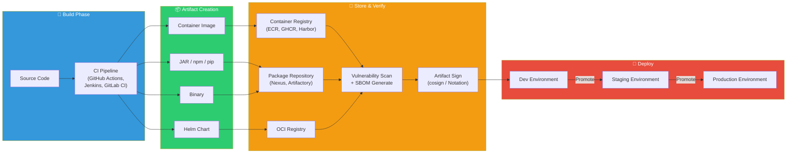

# Artifact Management — Container Registry, Nexus, Artifactory, OCI Artifacts, SBOM

> When you build code in a CI/CD pipeline, you get **artifacts** (build results). Where do you store them? How do you version them? How do you sign them for safety? How do you clean them up when no longer needed? For build results from [GitHub Actions](./05-github-actions) or [Jenkins](./07-jenkins) to reach production, a systematic **Artifact management** strategy is absolutely essential. This lecture covers Container Registry through Nexus, Artifactory, OCI Artifacts, SBOM, signing, versioning strategies, and promotion workflows.

---

## 🎯 Why Learn Artifact Management?

### Everyday Analogy: Parcel Logistics Center

Think of an online shopping mall. When products (Artifacts) are made at the factory (build), they're not sent directly to customers. Instead, they're stored in a **logistics center (Repository)**, go through quality inspection, get labeled (tags), manage shelf life (lifecycle), receive authenticity certificates (signatures), and only then is shipping (deployment) started.

- **Logistics center** = Artifact Repository (ECR, Nexus, Artifactory)
- **Product label** = Version tags (v1.2.3, git SHA, timestamp)
- **Quality inspection** = Vulnerability scan, SBOM generation
- **Authenticity certificate** = Artifact signature (cosign, Sigstore)
- **Shelf life management** = Lifecycle policy, cleanup
- **Regional logistics hubs** = Dev/Staging/Prod Registry separation
- **Country of origin marking** = SBOM (Software Bill of Materials)

### Real-World Moments for Artifact Management

```
Real-world Artifact management situations:
• Where do I store Docker images built in CI?                     → Container Registry
• JAR/WAR files need to be shared across teams                    → Nexus / Artifactory
• Internal npm/pip packages for private repo                      → Private Registry
• Helm Chart versioning and management                            → OCI Registry / ChartMuseum
• What libraries are in deployed software?                        → SBOM (Syft, Trivy)
• Prove image hasn't been tampered with                          → cosign / Sigstore signing
• Old images piling up, storage costs exploding                  → Lifecycle policy
• Promote verified image from dev → staging → prod               → Promotion workflow
• Audit asks "What version is in production?"                    → Version strategy + traceability
```

---

## 🧠 Core Concepts

Artifact management has 6 key components:

### Analogy: Product Logistics Management System

| Logistics World | Artifact Management |
|-----------|--------------|
| Product (finished goods, parts, materials) | **Artifact** (images, JAR, npm packages, Helm Charts) |
| Logistics center / Warehouse | **Repository** (ECR, Nexus, Artifactory) |
| Product barcode / Serial number | **Version tag** (SemVer, Git SHA, timestamp) |
| Country of origin / Ingredients list | **SBOM** (Software Bill of Materials) |
| Authenticity certificate / Tamper seal | **Signature** (cosign, Notation, Sigstore) |
| Expiration date / Inventory cleanup | **Lifecycle policy** (Cleanup, Retention) |

### 1. What is an Artifact?

> **Analogy**: All "products" coming from a factory

An **Artifact** is any result from the build process. Not the code itself, but the "finished product" from building/packaging the code.

| Artifact Type | Example | Repository |
|--------------|------|--------|
| **Container Image** | `myapp:v1.2.3` | ECR, Docker Hub, GHCR, Harbor |
| **Java Package** | `myapp-1.2.3.jar`, `.war` | Nexus, Artifactory (Maven) |
| **Node.js Package** | `@myorg/utils-1.2.3.tgz` | npm Registry, Nexus, Artifactory |
| **Python Package** | `mylib-1.2.3.whl` | PyPI, Nexus, Artifactory |
| **Helm Chart** | `myapp-chart-1.2.3.tgz` | OCI Registry, ChartMuseum |
| **Binary** | `myapp-linux-amd64` | Nexus, Artifactory, S3 |
| **Terraform Module** | `vpc-module-1.0.0.zip` | Terraform Registry |
| **OS Package** | `myapp-1.2.3.rpm/.deb` | Nexus, Artifactory |

### 2. Repository Types

> **Analogy**: Specialized warehouse vs comprehensive logistics center

- **Single-Format Registry**: Store only one type (Docker Hub = container images only)
- **Universal Repository**: Store all types (Nexus, Artifactory = comprehensive logistics center)

### 3. Complete Artifact Flow



---

## 🔍 Understanding Each Component

### 1. Container Registry Comparison

| Item | Docker Hub | AWS ECR | GCP Artifact Registry | GHCR | Harbor |
|------|-----------|---------|----------------------|------|--------|
| **Type** | SaaS | Managed (AWS) | Managed (GCP) | SaaS (GitHub) | Self-hosted |
| **Free Tier** | 1 Private Repo | 500MB/month (Free Tier) | 500MB/month | Unlimited (Public) | OSS (Free) |
| **OCI Support** | O | O | O | O | O |
| **Vulnerability Scan** | Paid (Scout) | Built-in + Enhanced | Auto | Dependabot | Trivy built-in |
| **Signature Support** | DCT (Notary v1) | Limited | cosign integration | cosign integration | cosign + Notation |
| **RBAC** | Team/Org | IAM-based | IAM-based | GitHub Permissions | Fine-grained per project |
| **Geo-Replication** | X | Cross-Region | Multi-Region | X | O (Harbor 2.0+) |
| **CI/CD Integration** | All CI | AWS CodePipeline, GHA | Cloud Build, GHA | GitHub Actions native | Webhook, API |
| **Recommended For** | Open source, personal | AWS environment | GCP environment | GitHub-centric | On-premise, regulated |

#### Docker Hub

```bash
# Docker Hub: Most widely used public registry
# Like the "npm" for open source images

# Login
docker login -u myuser

# Push image
docker tag myapp:v1.0 myuser/myapp:v1.0
docker push myuser/myapp:v1.0

# Pull image (most basic form)
docker pull nginx:latest
# → Registry omitted = Pull from Docker Hub

# ⚠️ Rate Limit Alert!
# Anonymous: 100 pulls / 6 hours
# Authenticated (free): 200 pulls / 6 hours
# Pro/Team: Unlimited
# → MUST login in CI/CD!
```

#### AWS ECR

```bash
# ECR: De facto standard registry in AWS
# IAM-based auth + auto vulnerability scanning

# 1. Create repository
aws ecr create-repository \
    --repository-name myapp \
    --image-scanning-configuration scanOnPush=true \
    --image-tag-mutability IMMUTABLE \
    --region ap-northeast-2

# ⚠️ IMMUTABLE tags = Can't overwrite same tag
#    → Required for production repositories!

# 2. Login (valid for 12 hours)
aws ecr get-login-password --region ap-northeast-2 | \
    docker login --username AWS --password-stdin \
    123456789.dkr.ecr.ap-northeast-2.amazonaws.com

# 3. Push
docker tag myapp:v1.0 \
    123456789.dkr.ecr.ap-northeast-2.amazonaws.com/myapp:v1.0
docker push \
    123456789.dkr.ecr.ap-northeast-2.amazonaws.com/myapp:v1.0
```

#### GitHub Container Registry (GHCR)

```bash
# GHCR: Most naturally integrated with GitHub
# One-click integration with GitHub Actions

# Login (using Personal Access Token)
echo $GITHUB_TOKEN | docker login ghcr.io -u USERNAME --password-stdin

# Push
docker tag myapp:v1.0 ghcr.io/myorg/myapp:v1.0
docker push ghcr.io/myorg/myapp:v1.0

# Use in GitHub Actions (simplest!)
# → Just GITHUB_TOKEN needed for authentication
```

```yaml
# .github/workflows/build-push.yml
name: Build and Push to GHCR

on:
  push:
    branches: [main]

permissions:
  contents: read
  packages: write          # GHCR push permission

jobs:
  build:
    runs-on: ubuntu-latest
    steps:
      - uses: actions/checkout@v4

      - uses: docker/login-action@v3
        with:
          registry: ghcr.io
          username: ${{ github.actor }}
          password: ${{ secrets.GITHUB_TOKEN }}  # No separate Secret needed!

      - uses: docker/build-push-action@v6
        with:
          push: true
          tags: |
            ghcr.io/${{ github.repository }}:${{ github.sha }}
            ghcr.io/${{ github.repository }}:latest
```

#### Harbor (Open Source Enterprise Registry)

```bash
# Harbor: CNCF Graduated project
# Best choice for on-premise + enterprise environments

# Install with Docker Compose (dev/test)
wget https://github.com/goharbor/harbor/releases/download/v2.11.0/harbor-offline-installer-v2.11.0.tgz
tar xvf harbor-offline-installer-v2.11.0.tgz
cd harbor

# Configure harbor.yml
# hostname: harbor.mycompany.com
# https:
#   certificate: /path/to/cert.pem
#   private_key: /path/to/key.pem

./install.sh --with-trivy   # Install with Trivy scanner

# Usage (same UX as Docker Hub)
docker login harbor.mycompany.com
docker tag myapp:v1.0 harbor.mycompany.com/myproject/myapp:v1.0
docker push harbor.mycompany.com/myproject/myapp:v1.0
```

Harbor Key Features:

```
Harbor Strengths:
• Project-level RBAC (Team A only accesses Project A)
• Trivy built-in vulnerability scanning
• Image Replication (Harbor ↔ Harbor, Harbor ↔ ECR/DockerHub)
• Signature verification (cosign + Notation)
• Webhook (CI/CD integration)
• Garbage Collection (cleanup unused layers)
• Robot Account (CI/CD service accounts)
• Proxy Cache (bypass Docker Hub Rate Limit)
```

---

### 2. Nexus Repository Manager

> **Analogy**: Large logistics hub handling all types of parcels

Nexus is Sonatype's **universal Artifact repository**. It manages container images, Java, npm, Python, raw files — almost all package types in one place.

#### Nexus 3 Repository Types

| Type | Role | Analogy |
|------|------|------|
| **Proxy** | Cache external repositories (Maven Central, npm) | Domestic cache of overseas warehouse |
| **Hosted** | Store in-house created Artifacts | Company-exclusive product warehouse |
| **Group** | Combine Proxy + Hosted into one | Unified order reception counter |

#### Install Nexus with Docker Compose

```yaml
# docker-compose.yml
services:
  nexus:
    image: sonatype/nexus3:3.68.0
    container_name: nexus
    ports:
      - "8081:8081"     # Nexus Web UI
      - "8082:8082"     # Docker Registry (hosted)
      - "8083:8083"     # Docker Registry (group)
    volumes:
      - nexus-data:/nexus-data
    environment:
      - INSTALL4J_ADD_VM_PARAMS=-Xms1024m -Xmx2048m -XX:MaxDirectMemorySize=2048m
    restart: unless-stopped

volumes:
  nexus-data:
```

```bash
# Run
docker compose up -d

# Check initial admin password
docker exec nexus cat /nexus-data/admin.password
# → Access http://localhost:8081, change password
```

#### Configure Maven Repository in Nexus

```xml
<!-- settings.xml (developer PC or CI) -->
<settings>
  <mirrors>
    <mirror>
      <id>nexus</id>
      <mirrorOf>*</mirrorOf>
      <!-- Group Repository: combines Hosted + Maven Central Proxy -->
      <url>http://nexus.mycompany.com:8081/repository/maven-group/</url>
    </mirror>
  </mirrors>

  <servers>
    <server>
      <id>nexus-releases</id>
      <username>deployer</username>
      <password>${env.NEXUS_PASSWORD}</password>
    </server>
  </servers>
</settings>
```

---

### 3. Artifact Versioning Strategy

> **Analogy**: Labeling rules for products

Consistent **versioning strategy** is essential to track which code produced which build.

#### 3 Main Versioning Strategies

| Strategy | Format | Example | Pros | Cons |
|------|------|------|------|------|
| **Semantic Versioning** | `MAJOR.MINOR.PATCH` | `v1.2.3` | Clear meaning, compatibility shown | Manual management needed |
| **Git SHA** | `sha-<commit>` | `sha-abc1234` | 100% code traceability | Hard to read |
| **Timestamp** | `YYYYMMDD-HHMMSS` | `20240115-103045` | Clear time order | No code traceability |

#### Recommended: Hybrid Strategy

```bash
# Real-world combines multiple strategies!

# Method 1: SemVer + Git SHA (most recommended!)
IMAGE_TAG="v1.2.3-sha-$(git rev-parse --short HEAD)"
# → myapp:v1.2.3-sha-abc1234

# Method 2: SemVer + Build Number
IMAGE_TAG="v1.2.3-build-${BUILD_NUMBER}"
# → myapp:v1.2.3-build-42

# Method 3: Branch + Git SHA + Timestamp (dev env)
BRANCH=$(git rev-parse --abbrev-ref HEAD | tr '/' '-')
SHORT_SHA=$(git rev-parse --short HEAD)
TIMESTAMP=$(date +%Y%m%d-%H%M%S)
IMAGE_TAG="${BRANCH}-${SHORT_SHA}-${TIMESTAMP}"
# → myapp:feature-login-abc1234-20240115-103045
```

#### GitHub Actions Tagging Strategy

```yaml
# .github/workflows/build.yml
name: Build & Tag

on:
  push:
    branches: [main, develop]
    tags: ['v*']
  pull_request:
    branches: [main]

jobs:
  build:
    runs-on: ubuntu-latest
    steps:
      - uses: actions/checkout@v4

      - name: Docker meta (auto generate tags)
        id: meta
        uses: docker/metadata-action@v5
        with:
          images: ghcr.io/${{ github.repository }}
          tags: |
            # PR: pr-42
            type=ref,event=pr
            # Branch: main, develop
            type=ref,event=branch
            # SemVer: v1.2.3 → 1.2.3, 1.2, 1
            type=semver,pattern={{version}}
            type=semver,pattern={{major}}.{{minor}}
            type=semver,pattern={{major}}
            # Git SHA: sha-abc1234
            type=sha,prefix=sha-
            # latest (only on main branch push)
            type=raw,value=latest,enable={{is_default_branch}}

      - uses: docker/build-push-action@v6
        with:
          push: true
          tags: ${{ steps.meta.outputs.tags }}
          labels: ${{ steps.meta.outputs.labels }}
```

---

### 4. SBOM (Software Bill of Materials)

> **Analogy**: Food's "nutrition label" or car's "parts list"

SBOM is software's "ingredients list". It shows "what libraries, which versions, with which licenses are inside this image/package."

#### Why SBOM Matters

```
Why SBOM becomes increasingly important:

2021: Log4Shell (CVE-2021-44228) incident
→ "Does our system have Log4j?" → No idea...
→ SBOM would answer in 5 minutes!

2022: US Executive Order (EO 14028)
→ US government software supply requires SBOM
→ Spreading worldwide as regulatory trend

2023~: Supply chain attacks surge
→ Malicious code in open source packages (event-stream, ua-parser-js)
→ SBOM for dependency tracking + auto vulnerability alerts
```

#### Syft Generate SBOM

```bash
# Install Syft (Anchore project)
curl -sSfL https://raw.githubusercontent.com/anchore/syft/main/install.sh | sh -s -- -b /usr/local/bin

# Generate SBOM from container image
syft myapp:v1.0 -o spdx-json > sbom-spdx.json
syft myapp:v1.0 -o cyclonedx-json > sbom-cyclonedx.json

# Output example (summary)
syft myapp:v1.0
# NAME                    VERSION      TYPE
# alpine-baselayout       3.4.3        apk
# alpine-keys             2.4          apk
# busybox                 1.36.1       apk
# ca-certificates         20240226     apk
# express                 4.18.2       npm
# lodash                  4.17.21      npm
# ...
# → All OS + language packages in the image listed!
```

#### Trivy for SBOM + Vulnerability Scan

```bash
# Trivy: Generate SBOM and scan simultaneously!
# (Aqua Security project)

# Generate SBOM
trivy image --format spdx-json -o sbom.json myapp:v1.0

# Scan for vulnerabilities based on SBOM
trivy sbom sbom.json

# Direct image scan (SBOM + vulnerabilities in one)
trivy image --severity HIGH,CRITICAL myapp:v1.0
# myapp:v1.0 (alpine 3.19.0)
# ════════════════════════════════════════
# Library        Vulnerability  Severity  Version    Fixed
# ─────────────  ─────────────  ────────  ─────────  ─────────
# libcrypto3     CVE-2024-0727  HIGH      3.1.4-r2   3.1.4-r3
# openssl        CVE-2024-0727  HIGH      3.1.4-r2   3.1.4-r3

# Use in CI (fail on CRITICAL)
trivy image --exit-code 1 --severity CRITICAL myapp:v1.0
# → If any CRITICAL vulnerability, exit code 1 → CI fails
```

---

### 5. Artifact Signing (cosign / Sigstore)

> **Analogy**: Parcel's "tamper seal sticker" — verify who sent it and it wasn't opened

Artifact signing guarantees two things:
1. **Provenance**: "This image really came from our CI"
2. **Integrity**: "No one tampered with it after build"

#### cosign (Sigstore Project)

```bash
# Install cosign
brew install cosign    # macOS
# or
go install github.com/sigstore/cosign/v2/cmd/cosign@latest

# ─────────────────────────────────────
# Method 1: Keyless signing (Sigstore/Fulcio — recommended!)
# → No local key management needed! Sign with OIDC token
# ─────────────────────────────────────
cosign sign ghcr.io/myorg/myapp@sha256:abc123...
# → Browser opens for OIDC auth (GitHub, Google, etc.)
# → Fulcio issues temporary certificate
# → Rekor (transparency log) records signature

# Verify signature
cosign verify ghcr.io/myorg/myapp@sha256:abc123... \
    --certificate-identity=user@example.com \
    --certificate-oidc-issuer=https://github.com/login/oauth

# ─────────────────────────────────────
# Method 2: Key-based signing (offline/airgap environments)
# ─────────────────────────────────────
# Generate key pair
cosign generate-key-pair
# → cosign.key (private key — keep safe!)
# → cosign.pub (public key — distribute for verification)

# Sign
cosign sign --key cosign.key ghcr.io/myorg/myapp:v1.0

# Verify
cosign verify --key cosign.pub ghcr.io/myorg/myapp:v1.0

# ─────────────────────────────────────
# Attach SBOM to image (attestation)
# ─────────────────────────────────────
cosign attest --predicate sbom.spdx.json \
    --type spdxjson \
    ghcr.io/myorg/myapp@sha256:abc123...

# Verify and extract attached SBOM
cosign verify-attestation \
    --type spdxjson \
    ghcr.io/myorg/myapp@sha256:abc123... | \
    jq -r '.payload' | base64 -d | jq '.predicate'
```

#### GitHub Actions with cosign Keyless Signing

```yaml
name: Build, Sign, and Verify

on:
  push:
    tags: ['v*']

permissions:
  contents: read
  packages: write
  id-token: write    # ← Required for cosign keyless signing!

jobs:
  build-sign:
    runs-on: ubuntu-latest
    steps:
      - uses: actions/checkout@v4

      - uses: sigstore/cosign-installer@v3

      - uses: docker/login-action@v3
        with:
          registry: ghcr.io
          username: ${{ github.actor }}
          password: ${{ secrets.GITHUB_TOKEN }}

      - name: Build and push
        id: build
        uses: docker/build-push-action@v6
        with:
          push: true
          tags: ghcr.io/${{ github.repository }}:${{ github.ref_name }}

      # Keyless signing (Sigstore Fulcio + Rekor)
      - name: Sign image
        run: |
          cosign sign --yes \
            ghcr.io/${{ github.repository }}@${{ steps.build.outputs.digest }}
        # --yes: Auto-confirm (CI environment)
        # OIDC token auto-provided by GitHub Actions (id-token: write)

      # Generate + attach SBOM
      - name: Generate and attach SBOM
        run: |
          syft ghcr.io/${{ github.repository }}@${{ steps.build.outputs.digest }} \
            -o spdx-json > sbom.spdx.json

          cosign attest --yes \
            --predicate sbom.spdx.json \
            --type spdxjson \
            ghcr.io/${{ github.repository }}@${{ steps.build.outputs.digest }}
```

---

## 📝 Summary

### Artifact Management Checklist

```
✅ Registry Selection
  □ Choose appropriate registry (ECR for AWS, GHCR for GitHub, Harbor for on-premise)
  □ Configure authentication and RBAC
  □ Set up image tagging strategy

✅ Artifact Lifecycle
  □ Implement versioning strategy (SemVer + Git SHA recommended)
  □ Set up lifecycle policies (retention, cleanup)
  □ Configure image immutability for production

✅ Security & Compliance
  □ Enable vulnerability scanning (Trivy, ECR scanner)
  □ Generate and attach SBOM
  □ Implement artifact signing (cosign keyless recommended)
  □ Verify signatures in deployment (Kyverno policies)

✅ Artifact Flow
  □ Automate SBOM generation in CI
  □ Implement promotion workflow (dev → staging → prod)
  □ Track artifact provenance and dependencies
```

### When to Use Each Tool

| Use Case | Recommended Tool |
|----------|-----------------|
| GitHub-centric workflow | GHCR + cosign keyless |
| AWS environment | ECR + Trivy |
| On-premise/regulated | Harbor + Trivy + cosign |
| Maven/Java artifacts | Nexus OSS |
| Enterprise multi-format | Artifactory |
| SBOM generation | Syft or Trivy |

---

## 🔗 Next Steps

### Related Lectures

- [Container Registry Basics](../03-containers/07-registry): Basic registry usage
- [Deployment Strategy](./10-deployment-strategy): Rolling, Blue-Green, Canary deployments
- [Pipeline Security](./12-pipeline-security): Securing CI/CD pipelines

### Further Learning

- [SBOM Specification](https://spdx.dev/): SPDX standard documentation
- [Sigstore](https://www.sigstore.dev/): Keyless code signing documentation
- [OCI Spec](https://github.com/opencontainers/spec): OCI specifications

