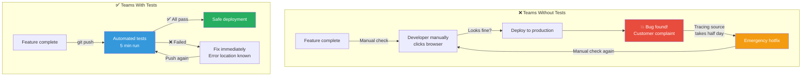
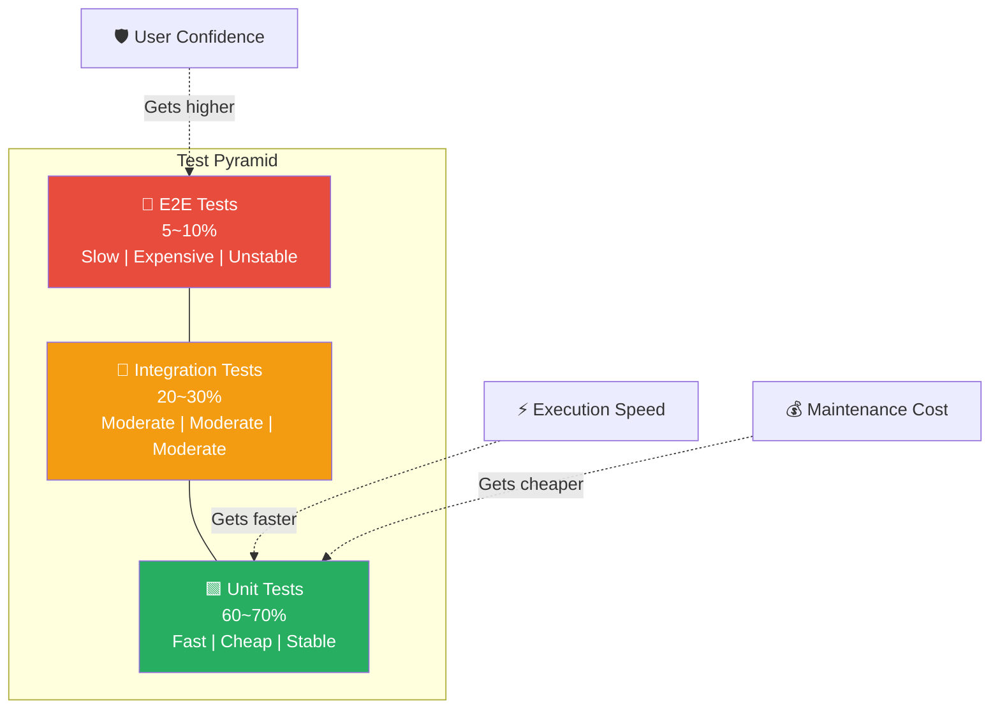
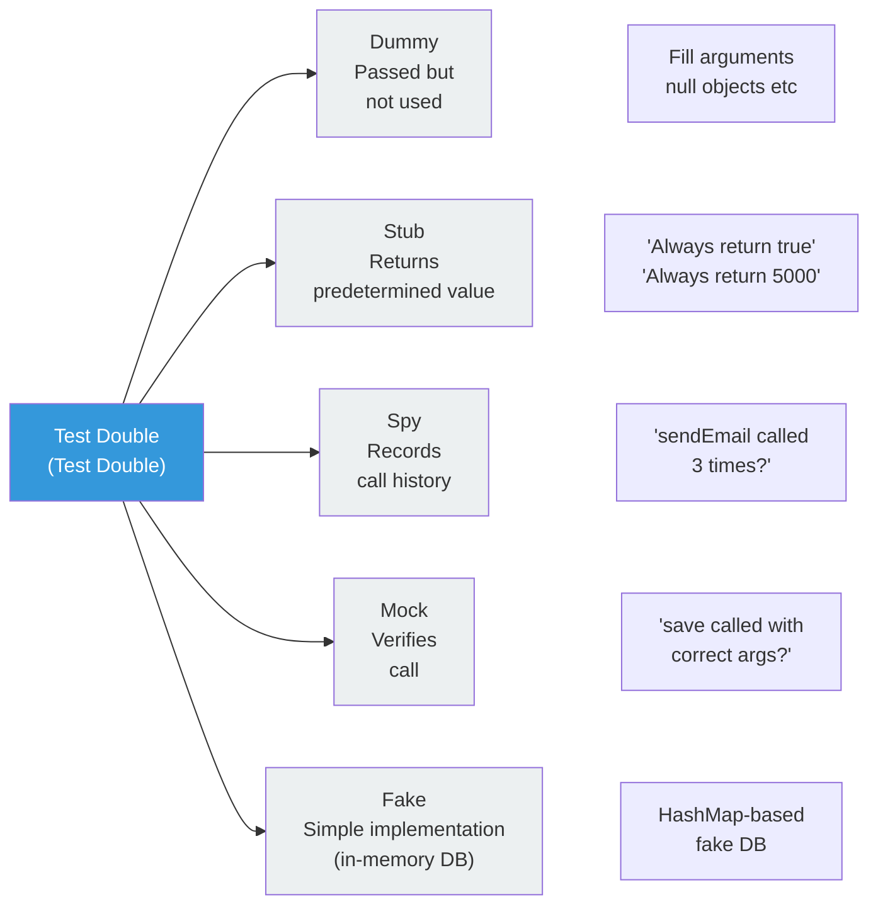
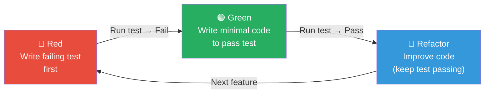
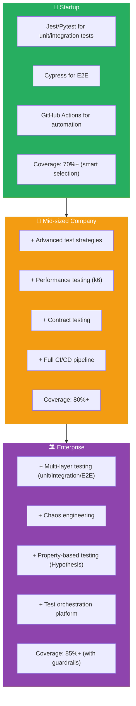

# Complete Guide to Test Automation

> Writing code and hoping it works is over. Test automation is a system where machines automatically verify that software behaves as intended. From unit tests to E2E tests, from TDD to performance and security testing — we'll explore every aspect of testing strategy. You learned about "automated verification" as important in [CI pipelines](./03-ci-pipeline)? Now let's dive deep into the **content of that verification**.

---

## 🎯 Why Do You Need to Know About Test Automation?

### Daily Analogy: Building Safety Inspection System

Think of an apartment construction site.

- **Each brick** → Strength test (unit test)
- **The entire wall standing** → Structure test (integration test)
- **People actually living in it** → Move-in test (E2E test)
- **Surviving an earthquake** → Performance/load test
- **Burglar-proof** → Security test

Replacing one broken brick is easy. But if you discover weak foundations after the building is complete? **You have to tear it all down and rebuild.** Test automation is the same. **The faster, more frequently, and more automatically you verify, the lower the cost.**

```
Real-world moments when test automation is needed:

• "I fixed it but broke something else"               → Missing regression tests
• QA team spends 3 days manually testing each deploy  → Unautomated verification
• "I don't know what this function does"             → Tests as documentation
• New developers are scared to touch code            → Missing safety net
• Performance issues happen in production            → No performance testing
• Security vulnerabilities discovered late          → No security testing
• CI pipeline takes 30 minutes for tests            → Test optimization needed
```

### Teams Without Tests vs Teams With Tests



### ROI of Test Automation

```
Test automation investment returns:

Initial investment    ████████████████        Test code writing time
1 month later         ████████████            Manual test time saving starts
3 months later        ████████                Bug fix cost reduction
6 months later        ████                    Development speed improvement
1 year later          ██                      Team productivity boost

→ Initial slowdown, but clear long-term investment
```

---

## 🧠 Grasping Core Concepts

### 1. Test Pyramid (Test Pyramid)

> **Analogy**: Building structure — wide foundation (unit), middle structure (integration), decorative top (E2E)

A concept introduced by Martin Fowler showing the **ratio** of test types in pyramid form. The lower, the more; the higher, the fewer.

### 2. Unit Test (Unit Test)

> **Analogy**: Checking if each LEGO block meets specifications

Test the **smallest unit** like a function or class independently. Without external dependencies, fast, hundreds can run in seconds.

### 3. Integration Test (Integration Test)

> **Analogy**: Connecting multiple LEGO blocks to see if they fit

Verify **multiple modules work together**. Validates actual interaction with external systems like DB connections, API calls, message queues.

### 4. E2E Test (End-to-End Test)

> **Analogy**: Actually playing with the completed LEGO set

Test the **entire system** from end to end from a real user's perspective. Open a browser, click, input, and verify the complete flow.

### 5. TDD (Test-Driven Development)

> **Analogy**: Creating the answer key before writing the test

Write the **test first**, then **later** write the code that passes the test. A development methodology.

### 6. Code Coverage (Code Coverage)

> **Analogy**: Measuring what percentage of test material you studied

The **ratio of code executed by tests** expressed as a number. Not a cure-all at 100%, but low coverage is a warning sign.

### 7. Test Double (Test Double)

> **Analogy**: Stunt actors replacing actors for dangerous scenes

Using **fake objects** instead of real dependencies (DB, API, external services) to make tests fast and stable.

### 8. Flaky Test

> **Analogy**: A weather-dependent exam with inconsistent results

A test where **results differ each time you run it even with the same code**. It's the main culprit in reducing CI reliability.

---

## 🔍 Exploring Each in Detail

### 1. Deep Dive into Test Pyramid

The test pyramid is the **backbone** of testing strategy. Understanding each level's characteristics helps you decide what and how much to test.



Comparison by level:

```
┌──────────────┬───────────┬──────────┬────────────┬──────────────┐
│ Aspect       │ Unit Test │ Integration│ E2E Test  │ Manual Test  │
├──────────────┼───────────┼──────────┼────────────┼──────────────┤
│ Speed        │ ms        │ seconds   │ minutes    │ hours ~ days │
│ Cost         │ Almost 0  │ Low       │ High       │ Very high    │
│ Stability    │ Very high │ High      │ Unstable   │ Variable     │
│ Maintenance  │ Low       │ Moderate  │ High       │ Very high    │
│ Feedback     │ Instant   │ Fast      │ Slow       │ Very slow    │
│ Real-world   │ Low       │ Moderate  │ High       │ Highest      │
│ Recommended %│ 60-70%    │ 20-30%    │ 5-10%      │ Minimize     │
└──────────────┴───────────┴──────────┴────────────┴──────────────┘
```

#### Pyramid's Opposite — Ice Cream Cone Anti-Pattern

```
❌ Ice Cream Cone Anti-Pattern (To Avoid)
─────────────────────────────────────────
       ████████████████████████  Manual Tests (Majority)
          ████████████████       E2E Tests (Many)
             ████████            Integration Tests (Few)
               ████              Unit Tests (Almost none)

→ Relies on slow, expensive, unstable tests
→ Slow feedback degrades development speed
→ Eventually leads to wrong conclusion: "Tests are waste of time"

✅ Correct Test Pyramid
─────────────────────────────────────────
               ████              E2E Tests (Few)
            ████████             Integration Tests (Moderate)
       ████████████████████      Unit Tests (Many)

→ Fast, cheap, stable tests as foundation
→ Quick feedback improves development speed
```

### 2. Unit Test Details

Unit tests check **one function or method** in isolation. Replace all external dependencies with test doubles.

#### FIRST Principle for Good Unit Tests

```
F — Fast (Fast)                : Thousands complete in seconds
I — Independent (Independent)   : Tests shouldn't depend on order/state
R — Repeatable (Repeatable)     : Same results anywhere
S — Self-validating             : Pass/fail determined automatically
T — Timely (Timely)             : Written alongside production code
```

#### AAA Pattern (Arrange-Act-Assert)

```
Every unit test consists of 3 phases:

1. Arrange (Setup)  — Set up test data and environment
2. Act (Execute)    — Execute the code under test
3. Assert (Verify)  — Confirm results match expectations
```

#### Jest (JavaScript/TypeScript)

```javascript
// calculator.js
export function add(a, b) {
  return a + b;
}

export function divide(a, b) {
  if (b === 0) throw new Error('Cannot divide by zero');
  return a / b;
}

export function calculateDiscount(price, discountPercent) {
  if (price < 0) throw new Error('Price cannot be negative');
  if (discountPercent < 0 || discountPercent > 100) {
    throw new Error('Discount must be between 0 and 100');
  }
  return price * (1 - discountPercent / 100);
}
```

```javascript
// calculator.test.js
import { add, divide, calculateDiscount } from './calculator';

describe('Calculator', () => {
  // --- add function tests ---
  describe('add', () => {
    test('adding two positive numbers returns their sum', () => {
      // Arrange
      const a = 2, b = 3;
      // Act
      const result = add(a, b);
      // Assert
      expect(result).toBe(5);
    });

    test('can add negative and positive numbers', () => {
      expect(add(-1, 1)).toBe(0);
    });

    test('decimal calculation is accurate', () => {
      expect(add(0.1, 0.2)).toBeCloseTo(0.3);
    });
  });

  // --- divide function tests ---
  describe('divide', () => {
    test('performs normal division', () => {
      expect(divide(10, 2)).toBe(5);
    });

    test('throws error when dividing by zero', () => {
      expect(() => divide(10, 0)).toThrow('Cannot divide by zero');
    });
  });

  // --- calculateDiscount function tests ---
  describe('calculateDiscount', () => {
    test('calculates 10% discount accurately', () => {
      expect(calculateDiscount(10000, 10)).toBe(9000);
    });

    test('0% discount equals original price', () => {
      expect(calculateDiscount(10000, 0)).toBe(10000);
    });

    test('100% discount equals zero', () => {
      expect(calculateDiscount(10000, 100)).toBe(0);
    });

    test('throws error for negative price', () => {
      expect(() => calculateDiscount(-100, 10)).toThrow('Price cannot be negative');
    });

    test('throws error for out-of-range discount', () => {
      expect(() => calculateDiscount(10000, 150)).toThrow(
        'Discount must be between 0 and 100'
      );
    });
  });
});
```

#### pytest (Python)

```python
# order_service.py
from dataclasses import dataclass
from typing import List

@dataclass
class OrderItem:
    name: str
    price: float
    quantity: int

class OrderService:
    def calculate_total(self, items: List[OrderItem]) -> float:
        """Calculate order total"""
        if not items:
            raise ValueError("Order items cannot be empty")
        total = sum(item.price * item.quantity for item in items)
        return round(total, 2)

    def apply_discount(self, total: float, discount_code: str) -> float:
        """Apply discount code"""
        discounts = {
            "WELCOME10": 0.10,
            "VIP20": 0.20,
            "SPECIAL30": 0.30,
        }
        if discount_code not in discounts:
            raise ValueError(f"Invalid discount code: {discount_code}")
        discount_rate = discounts[discount_code]
        return round(total * (1 - discount_rate), 2)
```

```python
# test_order_service.py
import pytest
from order_service import OrderService, OrderItem

class TestOrderService:
    """OrderService unit tests"""

    def setup_method(self):
        """Run before each test (common Arrange part)"""
        self.service = OrderService()

    # --- calculate_total tests ---
    def test_single_item_total_calculation(self):
        items = [OrderItem("coffee", 4500, 2)]
        assert self.service.calculate_total(items) == 9000

    def test_multiple_items_total_calculation(self):
        items = [
            OrderItem("coffee", 4500, 2),
            OrderItem("cake", 6000, 1),
        ]
        assert self.service.calculate_total(items) == 15000

    def test_empty_order_raises_error(self):
        with pytest.raises(ValueError, match="Order items cannot be empty"):
            self.service.calculate_total([])

    # --- apply_discount tests ---
    def test_10_percent_discount_applied(self):
        assert self.service.apply_discount(10000, "WELCOME10") == 9000

    def test_invalid_discount_code_raises_error(self):
        with pytest.raises(ValueError, match="Invalid discount code"):
            self.service.apply_discount(10000, "INVALID")

    # Parameterized test — multiple cases at once
    @pytest.mark.parametrize("code,rate,expected", [
        ("WELCOME10", 0.10, 9000),
        ("VIP20", 0.20, 8000),
        ("SPECIAL30", 0.30, 7000),
    ])
    def test_each_discount_code_applies_correctly(self, code, rate, expected):
        assert self.service.apply_discount(10000, code) == expected
```

#### JUnit 5 (Java)

```java
// UserValidatorTest.java
import org.junit.jupiter.api.*;
import org.junit.jupiter.params.ParameterizedTest;
import org.junit.jupiter.params.provider.ValueSource;
import static org.junit.jupiter.api.Assertions.*;

class UserValidatorTest {

    private UserValidator validator;

    @BeforeEach
    void setUp() {
        validator = new UserValidator();
    }

    @Test
    @DisplayName("Valid email should pass")
    void validEmail_shouldPass() {
        assertTrue(validator.isValidEmail("user@example.com"));
    }

    @ParameterizedTest
    @DisplayName("Invalid email should fail")
    @ValueSource(strings = {"", "invalid", "user@", "@domain.com", "user @domain.com"})
    void invalidEmail_shouldFail(String email) {
        assertFalse(validator.isValidEmail(email));
    }

    @Test
    @DisplayName("Password less than 8 characters throws exception")
    void shortPassword_shouldThrowException() {
        IllegalArgumentException exception = assertThrows(
            IllegalArgumentException.class,
            () -> validator.validatePassword("1234567")
        );
        assertEquals("Password must be at least 8 characters", exception.getMessage());
    }
}
```

### 3. Test Double (Test Double) Details

Fake objects that replace real dependencies. Different types serve different purposes.



#### Test Double Usage Example (Jest)

```javascript
// userService.js
export class UserService {
  constructor(userRepository, emailService) {
    this.userRepository = userRepository;
    this.emailService = emailService;
  }

  async registerUser(name, email) {
    // 1. Check for duplicate email
    const existing = await this.userRepository.findByEmail(email);
    if (existing) {
      throw new Error('Email already exists');
    }

    // 2. Save user
    const user = await this.userRepository.save({ name, email });

    // 3. Send welcome email
    await this.emailService.sendWelcomeEmail(email, name);

    return user;
  }
}
```

```javascript
// userService.test.js
import { UserService } from './userService';

describe('UserService', () => {
  let userService;
  let mockUserRepository;  // Mock — verify calls
  let mockEmailService;    // Spy — record calls

  beforeEach(() => {
    // Stub + Mock: predefined behavior and call verification
    mockUserRepository = {
      findByEmail: jest.fn().mockResolvedValue(null),  // Stub: return null
      save: jest.fn().mockImplementation((user) =>     // Stub: pretend to save
        Promise.resolve({ id: 1, ...user })
      ),
    };

    // Spy: record calls
    mockEmailService = {
      sendWelcomeEmail: jest.fn().mockResolvedValue(true),
    };

    userService = new UserService(mockUserRepository, mockEmailService);
  });

  test('registering new user saves and sends email', async () => {
    // Act
    const user = await userService.registerUser('John Doe', 'john@example.com');

    // Assert — check return value
    expect(user).toEqual({ id: 1, name: 'John Doe', email: 'john@example.com' });

    // Assert — Mock verification: called with correct args
    expect(mockUserRepository.save).toHaveBeenCalledWith({
      name: 'John Doe',
      email: 'john@example.com',
    });

    // Assert — Spy verification: email was sent
    expect(mockEmailService.sendWelcomeEmail).toHaveBeenCalledWith(
      'john@example.com',
      'John Doe'
    );
    expect(mockEmailService.sendWelcomeEmail).toHaveBeenCalledTimes(1);
  });

  test('duplicate email fails without save or email', async () => {
    // Arrange — modify Stub to return existing user
    mockUserRepository.findByEmail.mockResolvedValue({
      id: 99, name: 'Existing User', email: 'john@example.com'
    });

    // Act & Assert
    await expect(
      userService.registerUser('John Doe', 'john@example.com')
    ).rejects.toThrow('Email already exists');

    // Mock verification: save and sendEmail not called
    expect(mockUserRepository.save).not.toHaveBeenCalled();
    expect(mockEmailService.sendWelcomeEmail).not.toHaveBeenCalled();
  });
});
```

#### Test Double Usage Example (pytest)

```python
# test_user_service.py
from unittest.mock import Mock, AsyncMock, patch
import pytest

class TestUserService:
    def setup_method(self):
        self.mock_repo = Mock()
        self.mock_email = Mock()
        self.service = UserService(self.mock_repo, self.mock_email)

    def test_new_user_registration_success(self):
        # Arrange — set up Stub
        self.mock_repo.find_by_email.return_value = None
        self.mock_repo.save.return_value = {"id": 1, "name": "John Doe"}

        # Act
        result = self.service.register_user("John Doe", "john@example.com")

        # Assert — return value
        assert result["name"] == "John Doe"

        # Assert — Mock call verification
        self.mock_repo.save.assert_called_once()
        self.mock_email.send_welcome_email.assert_called_once_with(
            "john@example.com", "John Doe"
        )

    def test_duplicate_email_registration_fails(self):
        # Arrange — existing user exists
        self.mock_repo.find_by_email.return_value = {"id": 99}

        # Act & Assert
        with pytest.raises(ValueError, match="already exists"):
            self.service.register_user("John Doe", "john@example.com")

        # Verify save not called
        self.mock_repo.save.assert_not_called()
```

### 4. TDD (Test-Driven Development)

TDD follows the **Red-Green-Refactor** 3-phase cycle.



#### TDD Real-World Example: Password Validator

**Step 1 — Red: Write failing test**

```python
# test_password_validator.py
from password_validator import PasswordValidator

def test_reject_less_than_8_chars():
    validator = PasswordValidator()
    assert validator.validate("1234567") == False

def test_accept_8_or_more_chars():
    validator = PasswordValidator()
    assert validator.validate("12345678") == True
```

```bash
# Running will fail (file doesn't exist!)
$ pytest test_password_validator.py
# ModuleNotFoundError: No module named 'password_validator'
```

**Step 2 — Green: Make it pass with minimal code**

```python
# password_validator.py
class PasswordValidator:
    def validate(self, password: str) -> bool:
        return len(password) >= 8
```

```bash
$ pytest test_password_validator.py
# 2 passed ✅
```

**Step 3 — Refactor: Add more rules (new Red-Green-Refactor cycle)**

```python
# test_password_validator.py — add new rules
def test_reject_no_uppercase():
    validator = PasswordValidator()
    assert validator.validate("abcdefgh") == False  # 🔴 Red!

def test_accept_with_uppercase():
    validator = PasswordValidator()
    assert validator.validate("Abcdefgh") == True
```

```python
# password_validator.py — make Green
class PasswordValidator:
    def validate(self, password: str) -> bool:
        if len(password) < 8:
            return False
        if not any(c.isupper() for c in password):
            return False
        return True
```

```python
# password_validator.py — Refactor: extensible structure
class PasswordValidator:
    def __init__(self):
        self.rules = [
            (lambda p: len(p) >= 8, "Must be at least 8 characters"),
            (lambda p: any(c.isupper() for c in p), "Must include uppercase"),
            (lambda p: any(c.isdigit() for c in p), "Must include digit"),
            (lambda p: any(c in "!@#$%^&*" for c in p), "Must include special char"),
        ]

    def validate(self, password: str) -> bool:
        return all(rule(password) for rule, _ in self.rules)

    def get_errors(self, password: str) -> list:
        return [msg for rule, msg in self.rules if not rule(password)]
```

### 5. BDD (Behavior-Driven Development)

BDD extends TDD, describing expected behavior from a **business perspective**. Write scenarios in "Given-When-Then" format.

```
Feature: User login

  Scenario: Login with correct credentials
    Given a registered user exists with
      | email              | password   |
      | user@example.com   | Pass1234!  |
    When logging in with correct email and password
    Then login succeeds
    And dashboard page is shown

  Scenario: Login attempt with wrong password
    Given a registered user exists
    When logging in with wrong password
    Then "Incorrect password" error message appears
    And login attempt count increases by 1
```

### 6. Integration Test Details

Integration tests verify **multiple modules work together** in reality. Testcontainers let you spin up actual Docker containers for DB, Redis, Kafka, etc.

#### Testcontainers (Python)

```python
# test_user_repository_integration.py
import pytest
from testcontainers.postgres import PostgresContainer
import psycopg2

@pytest.fixture(scope="module")
def postgres():
    """Spin up PostgreSQL test container"""
    with PostgresContainer("postgres:16-alpine") as postgres:
        yield postgres

@pytest.fixture
def db_connection(postgres):
    """Set up DB connection and create schema"""
    conn = psycopg2.connect(postgres.get_connection_url())
    cursor = conn.cursor()
    cursor.execute("""
        CREATE TABLE IF NOT EXISTS users (
            id SERIAL PRIMARY KEY,
            name VARCHAR(100) NOT NULL,
            email VARCHAR(100) UNIQUE NOT NULL
        )
    """)
    conn.commit()
    yield conn
    conn.rollback()  # Clean up after test
    conn.close()

class TestUserRepositoryIntegration:
    """Integration tests with actual PostgreSQL"""

    def test_save_and_retrieve_user(self, db_connection):
        cursor = db_connection.cursor()

        # Save
        cursor.execute(
            "INSERT INTO users (name, email) VALUES (%s, %s) RETURNING id",
            ("John Doe", "john@example.com")
        )
        user_id = cursor.fetchone()[0]
        db_connection.commit()

        # Retrieve
        cursor.execute("SELECT name, email FROM users WHERE id = %s", (user_id,))
        result = cursor.fetchone()

        assert result[0] == "John Doe"
        assert result[1] == "john@example.com"

    def test_duplicate_email_raises_error(self, db_connection):
        cursor = db_connection.cursor()
        cursor.execute(
            "INSERT INTO users (name, email) VALUES (%s, %s)",
            ("User 1", "dup@example.com")
        )
        db_connection.commit()

        with pytest.raises(psycopg2.errors.UniqueViolation):
            cursor.execute(
                "INSERT INTO users (name, email) VALUES (%s, %s)",
                ("User 2", "dup@example.com")
            )
```

#### Testcontainers (Java/Spring Boot)

```java
// UserRepositoryIntegrationTest.java
@SpringBootTest
@Testcontainers
class UserRepositoryIntegrationTest {

    @Container
    static PostgreSQLContainer<?> postgres =
        new PostgreSQLContainer<>("postgres:16-alpine")
            .withDatabaseName("testdb")
            .withUsername("test")
            .withPassword("test");

    @DynamicPropertySource
    static void configureProperties(DynamicPropertyRegistry registry) {
        registry.add("spring.datasource.url", postgres::getJdbcUrl);
        registry.add("spring.datasource.username", postgres::getUsername);
        registry.add("spring.datasource.password", postgres::getPassword);
    }

    @Autowired
    private UserRepository userRepository;

    @Test
    @DisplayName("Save and retrieve user by email")
    void saveAndFindByEmail() {
        // Arrange
        User user = new User("John Doe", "john@example.com");

        // Act
        userRepository.save(user);
        Optional<User> found = userRepository.findByEmail("john@example.com");

        // Assert
        assertThat(found).isPresent();
        assertThat(found.get().getName()).isEqualTo("John Doe");
    }
}
```

### 7. E2E Test Details

E2E tests simulate real user behavior. Automatically operate a browser while validating the entire flow.

#### E2E Tool Comparison: Playwright vs Cypress vs Selenium

```
┌────────────┬──────────────┬──────────────┬──────────────┐
│ Item       │ Playwright   │ Cypress      │ Selenium     │
├────────────┼──────────────┼──────────────┼──────────────┤
│ Languages  │ JS/TS/Python │ JS/TS        │ Java/Python  │
│            │ /Java/C#     │              │ /JS/C#/Ruby  │
│ Browsers   │ Chromium,    │ Chrome,      │ Most browsers│
│            │ Firefox,     │ Firefox,     │              │
│            │ WebKit       │ Edge         │              │
│ Speed      │ Fast         │ Fast         │ Moderate-slow│
│ Stability  │ High         │ High         │ Moderate     │
│ API Intercept│ Built-in   │ Built-in     │ Needs extra  │
│ Parallel   │ Built-in     │ Cloud/Paid   │ Selenium Grid│
│ Use case   │ General E2E  │ Frontend     │ Legacy/Cross │
│            │ (1st choice) │ focused      │ browser      │
└────────────┴──────────────┴──────────────┴──────────────┘
```

#### Playwright (Recommended — Modern, Stable)

```javascript
// login.spec.js (Playwright)
import { test, expect } from '@playwright/test';

test.describe('Login feature', () => {
  test('login with correct credentials', async ({ page }) => {
    // 1. Go to login page
    await page.goto('/login');

    // 2. Enter email and password
    await page.fill('[data-testid="email-input"]', 'user@example.com');
    await page.fill('[data-testid="password-input"]', 'SecurePass123!');

    // 3. Click login button
    await page.click('[data-testid="login-button"]');

    // 4. Verify dashboard navigation
    await expect(page).toHaveURL('/dashboard');
    await expect(page.locator('[data-testid="welcome-message"]'))
      .toHaveText('Welcome, user');
  });

  test('show error message for wrong password', async ({ page }) => {
    await page.goto('/login');
    await page.fill('[data-testid="email-input"]', 'user@example.com');
    await page.fill('[data-testid="password-input"]', 'wrongpass');
    await page.click('[data-testid="login-button"]');

    await expect(page.locator('[data-testid="error-message"]'))
      .toBeVisible();
    await expect(page.locator('[data-testid="error-message"]'))
      .toHaveText('Incorrect password');
    await expect(page).toHaveURL('/login');  // Page unchanged
  });

  test('show message on network error', async ({ page }) => {
    // Intercept API response to simulate network error
    await page.route('**/api/auth/login', (route) =>
      route.abort('connectionrefused')
    );

    await page.goto('/login');
    await page.fill('[data-testid="email-input"]', 'user@example.com');
    await page.fill('[data-testid="password-input"]', 'SecurePass123!');
    await page.click('[data-testid="login-button"]');

    await expect(page.locator('[data-testid="error-message"]'))
      .toHaveText('Network error occurred. Please try again later.');
  });
});
```

#### Cypress

```javascript
// login.cy.js (Cypress)
describe('Login feature', () => {
  beforeEach(() => {
    cy.visit('/login');
  });

  it('successful login with correct credentials', () => {
    cy.get('[data-testid="email-input"]').type('user@example.com');
    cy.get('[data-testid="password-input"]').type('SecurePass123!');
    cy.get('[data-testid="login-button"]').click();

    cy.url().should('include', '/dashboard');
    cy.get('[data-testid="welcome-message"]')
      .should('contain', 'Welcome');
  });

  it('speed up test with API stubbing', () => {
    // Replace API response with fake data (Stub)
    cy.intercept('POST', '/api/auth/login', {
      statusCode: 200,
      body: { token: 'fake-jwt-token', user: { name: 'user' } },
    }).as('loginRequest');

    cy.get('[data-testid="email-input"]').type('user@example.com');
    cy.get('[data-testid="password-input"]').type('SecurePass123!');
    cy.get('[data-testid="login-button"]').click();

    cy.wait('@loginRequest');
    cy.url().should('include', '/dashboard');
  });
});
```

### 8. Performance Testing

Performance tests verify the system works correctly under **load conditions**.

#### k6 (Modern, Developer-Friendly)

```javascript
// load-test.js (k6)
import http from 'k6/http';
import { check, sleep } from 'k6';

export const options = {
  // Define load scenario
  stages: [
    { duration: '1m', target: 50 },    // Ramp up to 50 users over 1 min
    { duration: '3m', target: 50 },    // Stay at 50 users for 3 min
    { duration: '1m', target: 200 },   // Spike to 200 users over 1 min
    { duration: '2m', target: 200 },   // Stay at 200 users for 2 min
    { duration: '1m', target: 0 },     // Ramp down to 0 users over 1 min
  ],
  // Performance criteria (SLO)
  thresholds: {
    http_req_duration: ['p(95)<500'],   // 95% requests finish in 500ms
    http_req_failed: ['rate<0.01'],     // Failure rate below 1%
    http_reqs: ['rate>100'],            // Process 100+ requests/sec
  },
};

export default function () {
  // Scenario 1: Get product list
  const listRes = http.get('https://api.example.com/products');
  check(listRes, {
    'Status code 200': (r) => r.status === 200,
    'Response under 500ms': (r) => r.timings.duration < 500,
    'Product list not empty': (r) => JSON.parse(r.body).length > 0,
  });

  sleep(1);  // Think time

  // Scenario 2: Get product detail
  const detailRes = http.get('https://api.example.com/products/1');
  check(detailRes, {
    'Status code 200': (r) => r.status === 200,
    'Response under 300ms': (r) => r.timings.duration < 300,
  });

  sleep(0.5);
}
```

#### Locust (Python-Based)

```python
# locustfile.py
from locust import HttpUser, task, between

class WebsiteUser(HttpUser):
    wait_time = between(1, 3)  # Wait 1-3 sec between requests

    @task(3)  # Weight 3 — executed more frequently
    def view_products(self):
        self.client.get("/api/products")

    @task(1)  # Weight 1
    def view_product_detail(self):
        self.client.get("/api/products/1")
```

---

## 💻 Hands-On Practice

### Practice: Comprehensive Test Automation

[Complete test automation examples follow in implementation section...]

---

## 🏢 In Real Practice

### Testing by Organization Scale



### Scenario 1: "We have high bug rates in production"

```
Root cause likely:
├── Insufficient unit test coverage (<60%)
├── No integration tests before deployment
├── Flaky E2E tests causing false confidence
└── Missing edge case tests

Action plan:
1. Measure current coverage (target: 70%+ for critical paths)
2. Add missing unit tests for high-complexity functions
3. Implement integration tests with test containers
4. Fix flaky tests (async/timing issues)
5. Set up coverage reporting in CI
```

### Scenario 2: "Tests take 30 minutes to run"

```
Optimization strategies:
1. Parallelize test execution (10-15min → 2-3min)
2. Remove unnecessary waits/timeouts (E2E specific)
3. Mock external API calls instead of real calls
4. Use test pyramind ratio (more unit, fewer E2E)
5. Implement test sharding across CI workers
```

### Scenario 3: "Test code is harder to maintain than production code"

```
Improvement:
1. Apply same code quality standards to tests
2. DRY principle: extract common test helpers
3. Page Object Model for E2E tests
4. Test data builders/factories
5. Clear naming: testUserCanLoginWithValidCredentials()
```

### Common Testing Mistakes

```
❌ Writing only E2E tests (ice cream cone pattern)
✅ 70% unit, 20% integration, 10% E2E

❌ Brittle tests that break with UI changes
✅ Use data-testid, semantic selectors, Page Objects

❌ Testing implementation details instead of behavior
✅ Test "user can add item" not "DOM has <div id='items'>"

❌ Skipping flaky tests instead of fixing them
✅ Find root cause (async, timing, test order dependency)

❌ 100% coverage obsession
✅ Focus on critical paths and edge cases (70-80%)

❌ No continuous monitoring of test quality
✅ Track CFR, MTBF, test execution time trends
```

---

## 📝 Summary

Testing automation is an investment that compounds over time. Initial overhead translates to long-term speed and confidence. Start with unit tests, add integration where needed, and keep E2E lean.

### Testing Strategy Checklist

```
Unit Tests:
☐ Fast (< 5 sec for full suite)
☐ Independent of execution order
☐ Mock external dependencies
☐ > 70% coverage for critical code

Integration Tests:
☐ Use real DB/services with containers
☐ Test module interactions
☐ Keep database state clean between tests

E2E Tests:
☐ Focus on user workflows
☐ Test happy path + critical error cases
☐ Run in staging before production
☐ Avoid testing UI details

CI Pipeline:
☐ Run unit tests on every commit
☐ Run integration tests before merge
☐ Run E2E tests nightly
☐ Fail PR if coverage drops
☐ Report metrics (coverage, speed, flakiness)
```

---

## 🔗 Next Steps

```
Current location: Test Automation ✅

Next learning:
├── [CI Pipeline](./03-ci-pipeline) → Automation workflow
├── [CD Pipeline](./04-cd-pipeline) → Deployment safety
├── [IaC Testing](../06-iac/06-testing-policy) → Infrastructure validation
└── [Observability](../08-monitoring/01-logging) → Production monitoring

Practice projects:
1. Write comprehensive tests for existing service
2. Achieve 80% coverage
3. Set up CI test automation
4. Implement performance test
5. Create E2E test suite for critical user flows
```

