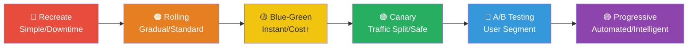
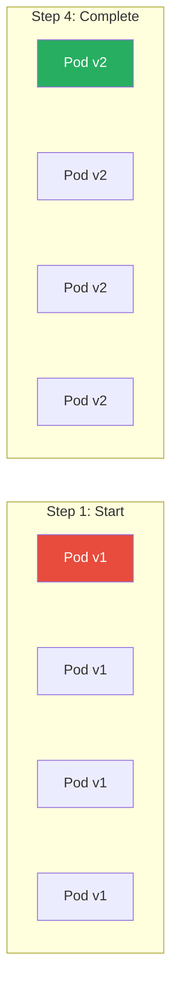
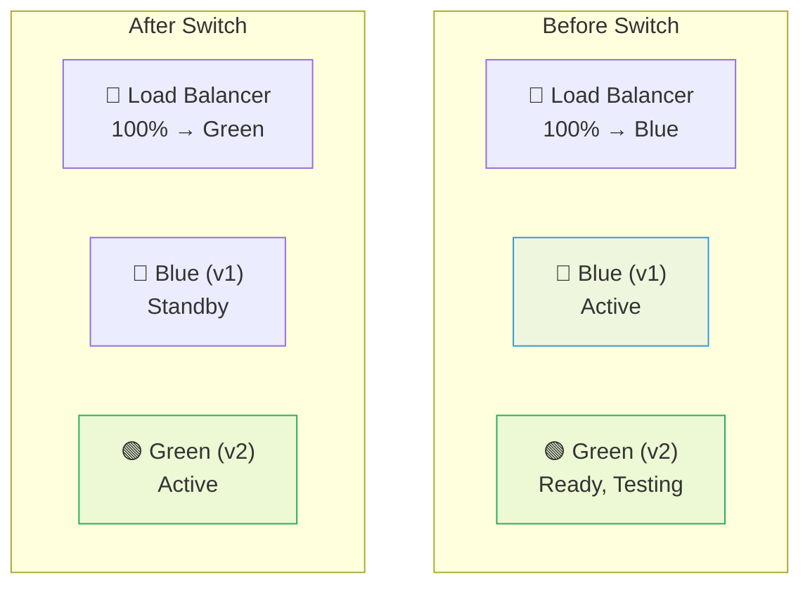
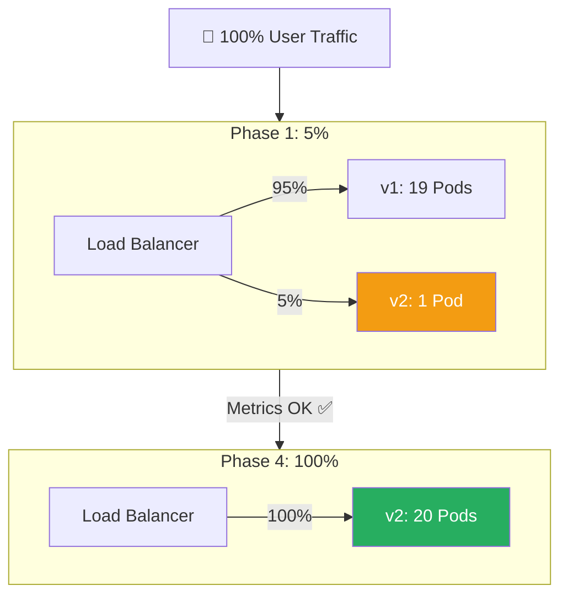

# Deployment Strategy (Deployment Strategy)

> When releasing a new version to users, there isn't just one way. Like moving houses — "move everything at once", "gradually move", or "set up the new house first, then switch in one day" — deployment has context-appropriate strategies. You learned the basics of auto-deployment in [CD Pipelines](./04-cd-pipeline). Now let's deeply understand **how to decide which strategy** to use and implement each in detail.

---

## 🎯 Why Learn Deployment Strategies?

### Daily Analogy: Restaurant Remodeling

Imagine a popular local restaurant needs remodeling.

- **Recreate**: Close completely, remodel, reopen. No customers during remodeling.
- **Rolling Update**: Remodel half the dining area while the other half operates.
- **Blue-Green**: Finish the new restaurant next door, then switch customer flow.
- **Canary**: Invite 10 regular customers to try the remodeled area, gauge reactions, then fully open.
- **A/B Testing**: Send 20-year-old customers to the new interior, 40-year-olds to the old one, compare satisfaction.

### Real-World Moments When Deployment Strategy Matters

```
• Service stops for 1-2 minutes on every deploy         → Need zero-downtime strategy
• One update affects all users; if problems occur       → Need gradual rollout
• Rollback takes 30 minutes                             → Need instant rollback capability
• Unsure if new feature will work                       → Need Canary/A/B testing
• Want to limit exposure to certain users first         → Need Feature Flags
• Big infrastructure change, want zero-risk validation  → Need Shadow Launch
```

---

## 🧠 Grasping Core Concepts

### The Complete Deployment Strategy Spectrum



| Characteristic | Recreate | Rolling | Blue-Green | Canary | A/B Testing | Progressive |
|---|---|---|---|---|---|---|
| **Downtime** | Yes | No | No | No | No | No |
| **Extra Resources** | None | Minimal | 2x | Min-Medium | Medium | Medium |
| **Complexity** | Very Low | Low | Medium | High | Very High | Very High |
| **Rollback Speed** | Slow | Medium | Instant | Fast | Fast | Instant |
| **Traffic Control** | None | None | All/None | % Based | User Based | Auto % |
| **Risk Level** | High | Medium | Low | Very Low | Very Low | Very Low |
| **Best For** | Dev/Test | General Service | Critical Service | Large Scale | Business Experiment | Enterprise |

### Key Terminology

```
Deployment vs Release:
- Deployment: Technical act of pushing code to servers
- Release: Business act of users getting new features
→ Progressive Delivery separates these!

Downtime: Period when service unavailable

Rollback: Reverting to previous version if problems occur

Traffic Splitting: Dividing user requests among versions

Health Check: Periodic verification app is working

Metrics-based Promotion: Using error rate, response time to decide if advancing
```

---

## 🔍 Exploring Each Strategy

### 1. Recreate (Simplest, No Downtime Guarantee)

Completely remove old version, deploy new version.

```
Time progression:

v1 [████████████]
                [Downtime]
v2                          [████████████]

Pros: Simple structure, no version coexistence
Cons: Downtime occurs, slow rollback
```

**When to Use:**
- Development/test environments
- DB schema major changes (versions can't coexist)
- Single-instance apps (no HA anyway)

---

### 2. Rolling Update (Kubernetes Default)

Replace Pod one-by-one (or percentages) with new version while maintaining service.



**Key Parameters:**
- `maxSurge`: Can create extra Pods (e.g., 4 → 5 temporarily)
- `maxUnavailable`: Can remove Pods simultaneously (e.g., 4 → 3 temporarily)

**Kubernetes Configuration:**

```yaml
apiVersion: apps/v1
kind: Deployment
spec:
  replicas: 4
  strategy:
    type: RollingUpdate
    rollingUpdate:
      maxSurge: 1              # Add 1 Pod temporarily
      maxUnavailable: 0        # Always keep 4+ available
  template:
    spec:
      containers:
      - name: my-app
        image: my-app:v2
        readinessProbe:        # Critical for Rolling Update
          httpGet:
            path: /health
            port: 8080
          initialDelaySeconds: 10
          periodSeconds: 5
```

**Rollback:**

```bash
kubectl rollout undo deployment/my-app
kubectl rollout undo deployment/my-app --to-revision=3
```

**Pros:**
- Kubernetes native, no extra tools
- Zero-downtime (with readinessProbe)
- Minimal extra resources

**Cons:**
- Both v1 and v2 run simultaneously (need compatibility)
- Entire replacement takes time
- No traffic ratio control
- Rollback also takes time

---

### 3. Blue-Green Deployment (Instant Switch)

Prepare two identical environments (Blue, Green). Switch traffic at once.



**Kubernetes Implementation:**

```yaml
# Two separate deployments
apiVersion: apps/v1
kind: Deployment
metadata:
  name: my-app-blue
spec:
  replicas: 3
  selector:
    matchLabels:
      app: my-app
      version: blue
  template:
    spec:
      containers:
      - name: my-app
        image: my-app:v1

---
apiVersion: apps/v1
kind: Deployment
metadata:
  name: my-app-green
spec:
  replicas: 3
  template:
    spec:
      containers:
      - name: my-app
        image: my-app:v2

---
apiVersion: v1
kind: Service
metadata:
  name: my-app
spec:
  selector:
    app: my-app
    version: blue    # ← Switch this to 'green' for instant flip!
  ports:
  - port: 80
```

**Switch Script:**

```bash
#!/bin/bash
CURRENT=$(kubectl get svc my-app -o jsonpath='{.spec.selector.version}')
NEW=$([[ "$CURRENT" == "blue" ]] && echo "green" || echo "blue")

kubectl patch svc my-app -p "{\"spec\":{\"selector\":{\"version\":\"$NEW\"}}}"
echo "Switched to $NEW"
```

**Pros:**
- Instant switch / instant rollback
- Test Green fully before switching
- Zero-downtime
- No user on old version during switch

**Cons:**
- 2x resources needed
- DB migration complexity
- Long connections may break on switch
- Complex for stateful apps

---

### 4. Canary Deployment (Gradual, Safe)

Deploy new version to **small traffic**, expand gradually if metrics good.



**Monitoring Metrics:**

```
Automatic Rollback if:
• Error rate > 1%
• P99 response time > 2 seconds
• Health check failures > 3 consecutive

Each phase: 5% → 10% → 25% → 50% → 75% → 100%
With 5-10 minute observation between phases
```

**Nginx Ingress Implementation:**

```yaml
apiVersion: apps/v1
kind: Deployment
metadata:
  name: my-app-stable
spec:
  replicas: 19
  selector:
    matchLabels:
      app: my-app
      track: stable
  template:
    spec:
      containers:
      - name: my-app
        image: my-app:v1

---
apiVersion: apps/v1
kind: Deployment
metadata:
  name: my-app-canary
spec:
  replicas: 1
  template:
    spec:
      containers:
      - name: my-app
        image: my-app:v2

---
# Stable ingress (95%)
apiVersion: networking.k8s.io/v1
kind: Ingress
metadata:
  name: my-app-stable
spec:
  rules:
  - host: api.example.com
    http:
      paths:
      - path: /
        backend:
          service:
            name: my-app-stable
            port: 80

---
# Canary ingress (5% via annotation)
apiVersion: networking.k8s.io/v1
kind: Ingress
metadata:
  name: my-app-canary
  annotations:
    nginx.ingress.kubernetes.io/canary: "true"
    nginx.ingress.kubernetes.io/canary-weight: "5"
spec:
  rules:
  - host: api.example.com
    http:
      paths:
      - path: /
        backend:
          service:
            name: my-app-canary
            port: 80
```

**Pros:**
- Risk minimized (affects small user base)
- Validate with real production traffic
- Metrics-based automation possible
- Quick rollback if issues

**Cons:**
- Complex implementation
- Monitoring/observability required
- Some users experience issues
- Low-traffic services hard to validate statistically

---

### 5. A/B Testing (User Segment Split)

Unlike Canary's random split, A/B uses **specific user segments** for business experiments.

```
Canary: Randomly route 5% to new version
        Goal: Technical validation

A/B:    Route "Premium users" OR "Korean users" to new version
        Goal: Business metrics comparison (conversion, revenue)
```

**Istio VirtualService Example:**

```yaml
apiVersion: networking.istio.io/v1beta1
kind: VirtualService
metadata:
  name: my-app
spec:
  hosts:
  - api.example.com
  http:
  # Rule 1: Premium users → v2
  - match:
    - headers:
        x-user-tier:
          exact: "premium"
    route:
    - destination:
        host: my-app
        subset: v2
  # Rule 2: Korea users → v2
  - match:
    - headers:
        x-user-country:
          exact: "KR"
    route:
    - destination:
        host: my-app
        subset: v2
  # Rule 3: Everyone else → v1
  - route:
    - destination:
        host: my-app
        subset: v1
```

---

### 6. Progressive Delivery (Automated Canary)

Combine Canary + automation + metrics analysis. System automatically decides rollout.

**Argo Rollouts Example:**

```yaml
apiVersion: argoproj.io/v1alpha1
kind: Rollout
metadata:
  name: my-app
spec:
  replicas: 10
  strategy:
    canary:
      steps:
      - setWeight: 10        # 10% traffic
      - pause:
          duration: 5m       # Wait 5 min, monitor metrics
      - setWeight: 25
      - pause:
          duration: 5m
      - setWeight: 50
      - pause:
          duration: 5m
      - setWeight: 100       # Complete rollout

      analysis:
        templates:
        - templateName: success-rate
        - templateName: latency
```

---

## 💻 Hands-On Practice

### Practice: Kubernetes Rolling Update

```bash
# 1. Deploy v1
kubectl apply -f deployment-v1.yaml

# 2. Monitor update (new terminal)
kubectl get pods -l app=webapp --watch

# 3. Update to v2
kubectl set image deployment/webapp webapp=nginx:1.25

# 4. Watch rolling update progress
kubectl rollout status deployment/webapp

# 5. Rollback if needed
kubectl rollout undo deployment/webapp
```

---

## 🏢 Real-World Application

### Decision Tree for Strategy Selection

```
Q1. Can downtime be tolerated?
├─ Yes → Recreate (simplest)
└─ No → Q2

Q2. Can afford 2x infrastructure cost?
├─ Yes → Blue-Green (instant rollback)
└─ No → Q3

Q3. Need pre-deployment validation on production?
├─ Yes → Canary
└─ No → Rolling Update
```

### By Company Size

```
Startup (1-10):
  • Rolling Update (K8s default, no extra cost)
  • Feature Flag: Simple JSON or LaunchDarkly free tier

Mid-size (10-100):
  • Canary + basic monitoring
  • Feature Flag: Unleash or Flagsmith (self-hosted)

Enterprise (100+):
  • Progressive Delivery (Argo Rollouts)
  • Mix strategies by service criticality
```

### By Service Type

```
Internal tools          → Recreate / Rolling
General web service     → Rolling Update
Payment system          → Blue-Green (instant rollback)
Large-scale API        → Canary (progressive)
E-commerce conversion  → A/B Testing (business metrics)
Microservices migration → Shadow Launch
SaaS platform          → Progressive Delivery
```

---

## ⚠️ Common Mistakes

### Mistake 1: Rolling Update Without readinessProbe

```yaml
# ❌ Wrong: No readinessProbe
# Pod gets traffic before initialization
# → 500 errors during startup

# ✅ Correct: Add readinessProbe
readinessProbe:
  httpGet:
    path: /health
    port: 8080
  initialDelaySeconds: 10
  periodSeconds: 5
```

### Mistake 2: Blue-Green DB Migration Issues

```
❌ Scenario:
1. Migrate DB schema v1 → v2 for Green
2. Switch to Green
3. Problems! Need rollback to Blue
4. But Blue can't read v2 schema!

✅ Solution: "Expand and Contract" pattern
Step 1: Add new columns (both v1 and v2 can work)
Step 2: Switch to v2
Step 3: After stability, remove old columns
```

### Mistake 3: Canary Traffic Too Low for Statistics

```
❌ Wrong:
- Total: 100 req/min
- Canary: 1%
- Canary receives: 1 req/min
→ Can't judge error rate statistically

✅ Correct:
- Canary should receive 100+ req/min minimum
- Or increase percentage, or extend observation time
```

---

## 📝 Summary

```
🔴 Recreate: "Take everything down, deploy new"
   → Simple but downtime. Dev/test only.

🟠 Rolling: "Replace one pod at a time"
   → K8s default. Works for most services.

🟡 Blue-Green: "Prepare new, switch instantly"
   → Instant rollback. Costs 2x resources.

🟢 Canary: "Show to 5%, expand if metrics good"
   → Safe for large services. Needs monitoring.

🔵 A/B Testing: "Show variant A to group A, variant B to group B"
   → Business experiment. Needs stats knowledge.

🟣 Progressive: "AI judges whether to expand"
   → Canary automation. Enterprise-grade.
```

---

## 🔗 Next Steps

Now that you understand **how** to deploy safely, the next topics are:
- [GitOps](./11-gitops) - Git-driven infrastructure management
- [Pipeline Security](./12-pipeline-security) - Securing the deployment pipeline
- [Change Management](./13-change-management) - Approval processes and Feature Flags

> **One-line summary**: Deployment strategy is a spectrum from "all-at-once" to "scientifically gradual". Choose based on service criticality, infrastructure budget, and team capability. Always have a rollback plan ready.

