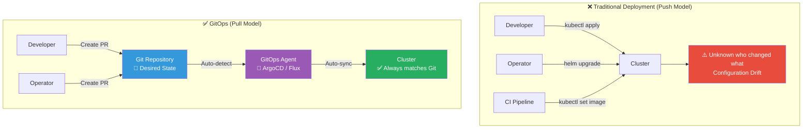
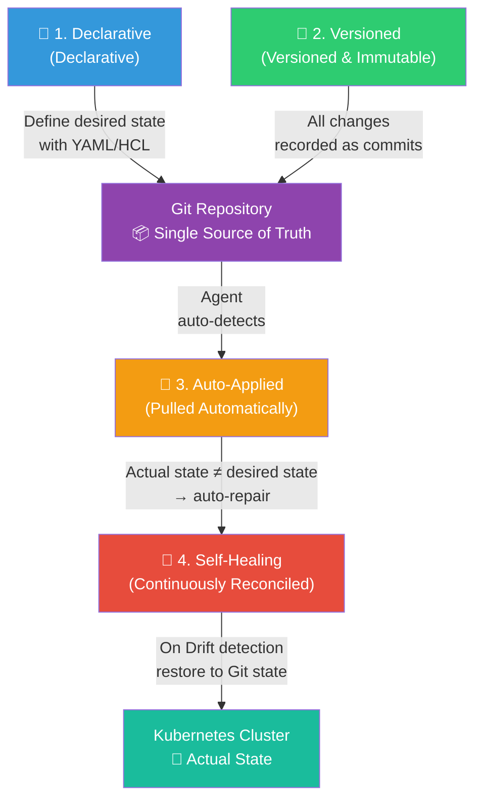
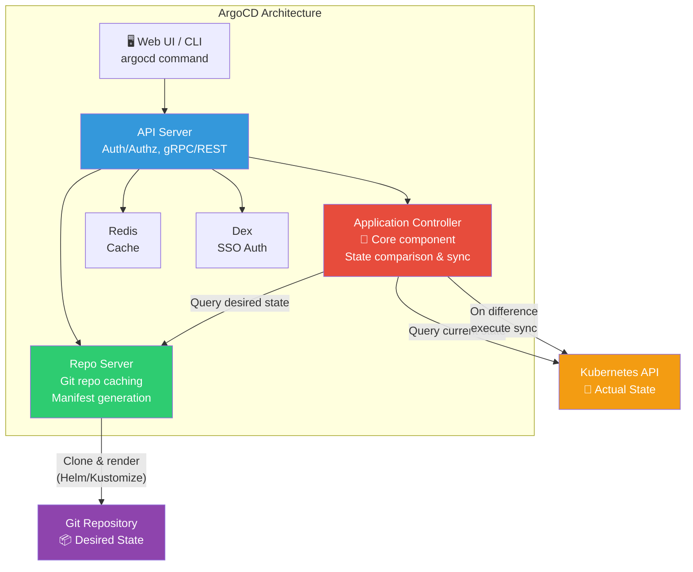
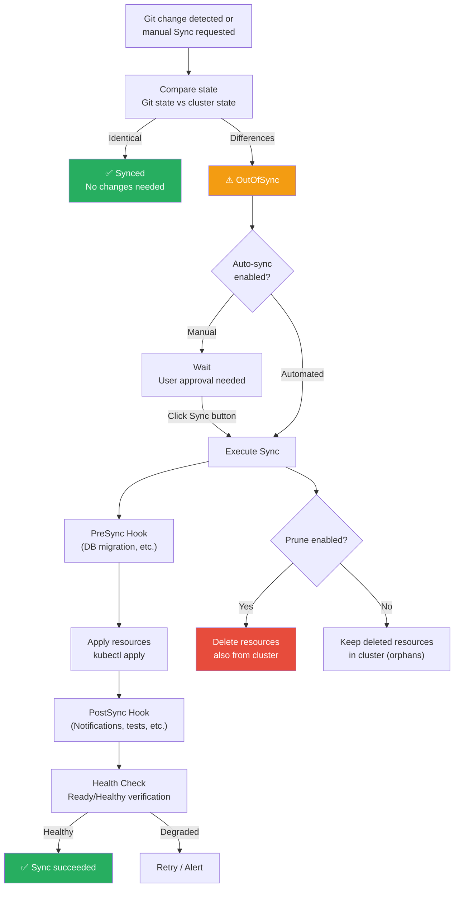
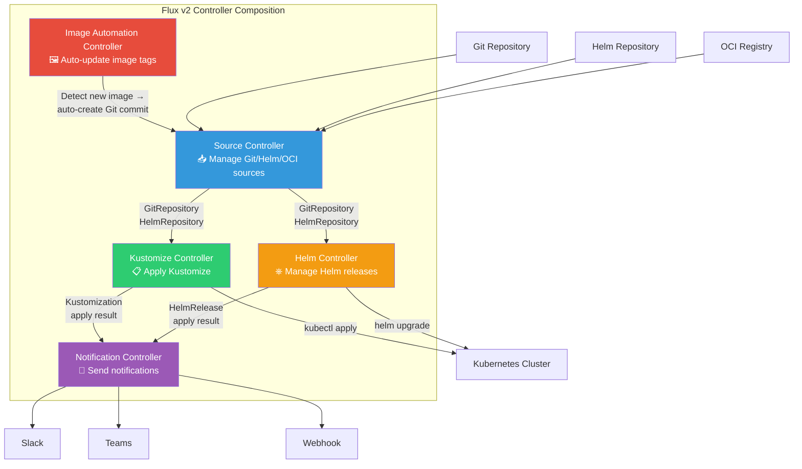

# GitOps — Managing Infrastructure and Applications Centered on Git

> The days of SSH-ing into a server for deployments, running kubectl commands directly, and relying on memory about cluster state are over. **GitOps makes Git repository the Single Source of Truth, and manages the desired state of infrastructure and applications declaratively.** It's an evolution of the automatic deployment you learned in [CD Pipelines](./04-cd-pipeline), extending the philosophy of [IaC concepts](../06-iac/01-concept) to Kubernetes operations.

---

## 🎯 Why Learn GitOps?

### Daily Analogy: Restaurant Order System

Imagine running a restaurant.

**Traditional Approach (Push-based Deployment):**
- Service staff go to the kitchen and shout "Make this please!"
- There's no record of who ordered what
- When multiple staff shout different orders simultaneously, chaos ensues
- If a wrong dish goes out, there's no way to verify what was originally ordered

**GitOps Approach (Pull-based Deployment):**
- All orders are recorded in an **order book (Git)**
- The head chef (ArgoCD/Flux) periodically checks the order book
- If the order book and current cooking state differ, they automatically align
- If a wrong dish goes out, they can fix it by checking the order book
- All change history is preserved, so "What did we order yesterday?" is traceable

```
Moments in practice when GitOps is needed:

• "kubectl apply was executed by someone and the config changed"    → Git as only change pathway
• "Cluster state differs from code"                                 → Automatic sync (Self-healing)
• "I want to rollback deployment but don't remember which version" → Git history = deployment history
• "dev/staging/prod environment configs are all different"          → Manage via Git branches/directories
• "No deployment approval process"                                  → PR review = deployment approval
• "Security audit requires change history"                          → Git log = audit trail
• "Need to deploy consistently across dozens of clusters"           → ApplicationSet for multi-cluster management
```

### Traditional Deployment vs GitOps Comparison



---

## 🧠 Grasping Core Concepts

### 1. Four Principles of GitOps

GitOps is based on four principles defined by Weaveworks (now CNCF).

> **Analogy**: Navigation System

A navigation system works by (1) declaring the destination (2) recording the route (3) auto-guiding (4) re-routing if you deviate. GitOps works exactly the same way.



| Principle | Explanation | Analogy |
|-----------|-------------|---------|
| **Declarative** | System's desired state described declaratively | "Take me to Gangnam Station" (what, not how) |
| **Versioned & Immutable** | Desired state is version-controlled in Git | All contract modification history is recorded |
| **Pulled Automatically** | Approved changes are applied automatically | Navigation auto-reflects new route |
| **Continuously Reconciled** | Agent continuously compares/repairs actual vs desired state | Auto re-routes when you deviate |

### 2. Push Model vs Pull Model

> **Analogy**: Courier delivery vs convenience store pickup

- **Push Model**: CI pipeline directly deploys to cluster (courier delivers to your home)
- **Pull Model**: Agent inside cluster watches Git and deploys itself (pickup from store yourself)

| Feature | Push Model | Pull Model (GitOps) |
|---------|-----------|---------------------|
| **Deployment Subject** | CI/CD Pipeline (external) | GitOps Agent (inside cluster) |
| **Cluster Access** | CI needs kubeconfig | Agent is inside cluster |
| **Security** | Cluster credentials exposed to CI | Credentials never leave cluster |
| **Drift Detection** | Cannot detect (deployment-time only) | Continuous monitoring |
| **Self-healing** | Cannot auto-repair | Auto-repairs |
| **Representative Tools** | Jenkins, GitHub Actions | ArgoCD, Flux |

### 3. Git as Single Source of Truth

> **Analogy**: Official Gazette for Laws

For laws to be effective, they must be published in the Official Gazette. No matter what is promised verbally, if it's not in the gazette, it's not law. In GitOps, **changes not in the Git repository don't exist**.

```
What "Git as Single Source of Truth" means:

1. All cluster resources must be defined in Git
2. Direct changes via kubectl edit/apply are forbidden (agent reverts them)
3. Deployment = committing to Git (merging PR)
4. Rollback = git revert
5. Audit = git log
6. Environment differences = git diff
```

### 4. GitOps Repository Strategy

> **Analogy**: Separating design and construction

Just as architecture firms (App Repo) and construction companies (Config Repo) are separate, separating application code from deployment config is a best practice in GitOps.

```
# 🔴 Antipattern: Monorepo (App + Config mixed)
my-app/
├── src/                    # Application source
├── Dockerfile
├── k8s/                    # K8s manifests (in same repo!)
│   ├── deployment.yaml
│   └── service.yaml
└── .github/workflows/      # CI pipeline

# ✅ Recommended: App Repo + Config Repo separated
# [App Repo] my-app
my-app/
├── src/
├── Dockerfile
├── .github/workflows/ci.yaml   # CI only (build + test + image push)
└── README.md

# [Config Repo] my-app-config
my-app-config/
├── base/                   # Common config
│   ├── deployment.yaml
│   ├── service.yaml
│   └── kustomization.yaml
├── overlays/               # Environment-specific config
│   ├── dev/
│   ├── staging/
│   └── production/
└── README.md
```

**Reasons to Separate:**

| Reason | Explanation |
|--------|-------------|
| **Permission Separation** | Developers access App Repo, operators access Config Repo |
| **Release Frequency Separation** | Code changes and config changes have different cadences |
| **Audit Trail** | Infrastructure changes can be tracked separately |
| **CI/CD Separation** | App Repo CI can trigger Config Repo changes |
| **Security** | Sensitive configs don't mix with dev repos |

---

## 🔍 Exploring Each Strategy

### 1. ArgoCD Architecture

ArgoCD is a CNCF graduated project and the most popular GitOps tool for Kubernetes.

> **Analogy**: Apartment Security System

ArgoCD is like an apartment security system. CCTV (Repo Server) watches the outside (Git), security guards (Application Controller) manage visitors (resources), and the manager's office monitor (API Server + UI) shows the overall situation.



**Key Components:**

| Component | Role |
|-----------|------|
| **API Server** | Communicate with UI/CLI/CI, auth/authz, app management API |
| **Repo Server** | Clone Git repo, render Helm/Kustomize, cache manifests |
| **Application Controller** | Core! Periodically compare Git and cluster state, sync |
| **Redis** | Caching layer for performance optimization |
| **Dex** | SSO/OIDC auth (GitHub, LDAP, SAML, etc.) |

#### ArgoCD Installation (Helm)

Install using Helm from the [Helm/Kustomize chapter](../04-kubernetes/12-helm-kustomize).

```bash
# 1. Add ArgoCD Helm chart repository
helm repo add argo https://argoproj.github.io/argo-helm
helm repo update

# 2. Create argocd namespace
kubectl create namespace argocd

# 3. Write values file (customization)
cat > argocd-values.yaml << 'EOF'
# ArgoCD Helm values
server:
  # Service type for external access
  service:
    type: LoadBalancer
  # Using Ingress
  ingress:
    enabled: true
    ingressClassName: nginx
    hosts:
      - argocd.example.com
    tls:
      - secretName: argocd-tls
        hosts:
          - argocd.example.com

  # HA mode (recommended for production)
  replicas: 2

configs:
  # Register Git repositories to manage
  repositories:
    my-app-config:
      url: https://github.com/my-org/my-app-config.git
      type: git

  # RBAC config
  rbac:
    policy.csv: |
      p, role:dev, applications, get, */*, allow
      p, role:dev, applications, sync, */dev-*, allow
      p, role:ops, applications, *, */*, allow
      g, dev-team, role:dev
      g, ops-team, role:ops

controller:
  # Sync interval (default 3 min)
  args:
    appResyncPeriod: "180"

redis:
  enabled: true
EOF

# 4. Install ArgoCD via Helm
helm install argocd argo/argo-cd \
  --namespace argocd \
  --values argocd-values.yaml \
  --version 5.51.0

# 5. Verify installation
kubectl get pods -n argocd

# 6. Get initial admin password
kubectl -n argocd get secret argocd-initial-admin-secret \
  -o jsonpath="{.data.password}" | base64 -d; echo

# 7. Login to ArgoCD CLI
argocd login argocd.example.com --username admin --password <password-from-above>

# 8. Change password (mandatory!)
argocd account update-password
```

### 2. ArgoCD Core Resources

ArgoCD uses three core CRDs (Custom Resource Definitions).

#### Application

Application is the most basic ArgoCD resource, defining "which Git source to deploy to which cluster".

```yaml
# application.yaml
apiVersion: argoproj.io/v1alpha1
kind: Application
metadata:
  name: my-app
  namespace: argocd
  # Finalizer for auto-cleanup
  finalizers:
    - resources-finalizer.argocd.argoproj.io
spec:
  # Project this app belongs to
  project: default

  # Source: Git repository info
  source:
    repoURL: https://github.com/my-org/my-app-config.git
    targetRevision: main         # Branch, tag, or commit hash
    path: overlays/production    # Path within repo

    # When using Kustomize
    kustomize:
      images:
        - my-app=my-registry.com/my-app:v1.2.3

  # Destination: target cluster for deployment
  destination:
    server: https://kubernetes.default.svc  # Current cluster
    namespace: my-app

  # Sync policy
  syncPolicy:
    automated:              # Enable auto-sync
      prune: true           # Delete from cluster if removed from Git
      selfHeal: true        # Restore to Git state on manual changes
      allowEmpty: false     # Prevent deploying empty resource list
    syncOptions:
      - CreateNamespace=true          # Auto-create namespace
      - PrunePropagationPolicy=foreground  # Guarantee deletion order
      - PruneLast=true                # Execute deletion last
    retry:
      limit: 5              # Retry count on failure
      backoff:
        duration: 5s
        factor: 2
        maxDuration: 3m

  # Ignore differences (fields changed during operation)
  ignoreDifferences:
    - group: apps
      kind: Deployment
      jsonPointers:
        - /spec/replicas   # Ignore replicas managed by HPA
```

#### Application Using Helm Source

```yaml
# helm-application.yaml
apiVersion: argoproj.io/v1alpha1
kind: Application
metadata:
  name: prometheus
  namespace: argocd
spec:
  project: monitoring

  source:
    # Install directly from Helm chart repository
    repoURL: https://prometheus-community.github.io/helm-charts
    chart: kube-prometheus-stack
    targetRevision: 51.2.0
    helm:
      releaseName: prometheus
      # Specify values file directly
      values: |
        prometheus:
          prometheusSpec:
            retention: 30d
            resources:
              requests:
                memory: 2Gi
                cpu: 500m
        grafana:
          enabled: true
          adminPassword: changeme
          ingress:
            enabled: true
            hosts:
              - grafana.example.com

  destination:
    server: https://kubernetes.default.svc
    namespace: monitoring

  syncPolicy:
    automated:
      prune: true
      selfHeal: true
    syncOptions:
      - CreateNamespace=true
      - ServerSideApply=true  # Recommended for charts with many CRDs
```

#### AppProject

AppProject logically groups Applications and sets access control.

```yaml
# appproject.yaml
apiVersion: argoproj.io/v1alpha1
kind: AppProject
metadata:
  name: team-backend
  namespace: argocd
spec:
  description: "Backend team project"

  # Allowed Git sources
  sourceRepos:
    - "https://github.com/my-org/backend-*"
    - "https://github.com/my-org/shared-charts"

  # Allowed deployment targets
  destinations:
    - server: https://kubernetes.default.svc
      namespace: "backend-*"           # Only namespaces starting with backend-
    - server: https://kubernetes.default.svc
      namespace: "shared"

  # Allowed cluster resources (resources outside namespaces)
  clusterResourceWhitelist:
    - group: ""
      kind: Namespace

  # Allowed namespaced resources
  namespaceResourceWhitelist:
    - group: "apps"
      kind: Deployment
    - group: ""
      kind: Service
    - group: ""
      kind: ConfigMap
    - group: ""
      kind: Secret
    - group: networking.k8s.io
      kind: Ingress

  # Denied resources (finer control)
  namespaceResourceBlacklist:
    - group: ""
      kind: ResourceQuota    # Forbid ResourceQuota changes

  # Define roles
  roles:
    - name: developer
      description: "Backend developers"
      policies:
        - p, proj:team-backend:developer, applications, get, team-backend/*, allow
        - p, proj:team-backend:developer, applications, sync, team-backend/*, allow
      groups:
        - backend-developers  # SSO group mapping
    - name: lead
      description: "Backend tech lead"
      policies:
        - p, proj:team-backend:lead, applications, *, team-backend/*, allow
      groups:
        - backend-leads
```

#### ApplicationSet

ApplicationSet automatically generates multiple Applications from a single template. Essential for multi-cluster, multi-environment deployments.

```yaml
# applicationset-environments.yaml
# Auto-generate Applications per environment
apiVersion: argoproj.io/v1alpha1
kind: ApplicationSet
metadata:
  name: my-app-environments
  namespace: argocd
spec:
  generators:
    # List-based generation
    - list:
        elements:
          - env: dev
            cluster: https://kubernetes.default.svc
            namespace: my-app-dev
            revision: develop
            autoSync: true
          - env: staging
            cluster: https://kubernetes.default.svc
            namespace: my-app-staging
            revision: main
            autoSync: true
          - env: production
            cluster: https://prod-cluster.example.com
            namespace: my-app-prod
            revision: main
            autoSync: false    # Production uses manual sync

  template:
    metadata:
      name: "my-app-{{env}}"
      namespace: argocd
    spec:
      project: default
      source:
        repoURL: https://github.com/my-org/my-app-config.git
        targetRevision: "{{revision}}"
        path: "overlays/{{env}}"
      destination:
        server: "{{cluster}}"
        namespace: "{{namespace}}"
      syncPolicy:
        automated:
          prune: "{{autoSync}}"
          selfHeal: "{{autoSync}}"
        syncOptions:
          - CreateNamespace=true

---
# Auto-generate based on Git directories
# Each directory under services/ becomes an Application
apiVersion: argoproj.io/v1alpha1
kind: ApplicationSet
metadata:
  name: microservices
  namespace: argocd
spec:
  generators:
    - git:
        repoURL: https://github.com/my-org/platform-config.git
        revision: main
        directories:
          - path: "services/*"      # services/user-api, services/order-api, etc.
          - path: "services/legacy-*"
            exclude: true            # Exclude directories starting with legacy-

  template:
    metadata:
      name: "{{path.basename}}"     # Directory name becomes app name
    spec:
      project: microservices
      source:
        repoURL: https://github.com/my-org/platform-config.git
        targetRevision: main
        path: "{{path}}"
      destination:
        server: https://kubernetes.default.svc
        namespace: "{{path.basename}}"
      syncPolicy:
        automated:
          prune: true
          selfHeal: true
```

### 3. ArgoCD Sync Strategy

Sync in ArgoCD is the process of applying Git's desired state to the cluster.



#### Sync Options Summary

```yaml
# Detailed sync policy
syncPolicy:
  # --- Auto-sync ---
  automated:
    # Whether to delete cluster resources if removed from Git
    # true: Remove from cluster if not in Git (clean but risky)
    # false: Keep in cluster even if removed from Git (safe but creates orphans)
    prune: true

    # Whether to restore to Git state if manually changed via kubectl
    # true: Auto-revert manual changes (follows GitOps principle)
    # false: Allow manual changes (only shows OutOfSync status)
    selfHeal: true

  syncOptions:
    # Auto-create namespace if doesn't exist
    - CreateNamespace=true

    # Use Server-Side Apply (recommended for large CRDs)
    - ServerSideApply=true

    # Execute Prune in last stage of Sync
    - PruneLast=true

    # Apply Prune propagation policy to specific resources
    - PrunePropagationPolicy=foreground

    # Skip validation during apply (work around CRD schema issues)
    - Validate=false

    # Dry run then execute only if out of sync
    - ApplyOutOfSyncOnly=true

  # Retry configuration on Sync failure
  retry:
    limit: 5
    backoff:
      duration: 5s      # First retry wait
      factor: 2          # Wait time multiplier
      maxDuration: 3m    # Maximum wait time
```

#### Sync Hooks (Synchronization Hooks)

```yaml
# PreSync Hook: DB Migration
apiVersion: batch/v1
kind: Job
metadata:
  name: db-migration
  annotations:
    argocd.argoproj.io/hook: PreSync           # Execute before Sync
    argocd.argoproj.io/hook-delete-policy: HookSucceeded  # Delete after success
spec:
  template:
    spec:
      containers:
        - name: migrate
          image: my-app:v1.2.3
          command: ["python", "manage.py", "migrate"]
      restartPolicy: Never
  backoffLimit: 3

---
# PostSync Hook: Slack notification
apiVersion: batch/v1
kind: Job
metadata:
  name: notify-slack
  annotations:
    argocd.argoproj.io/hook: PostSync          # Execute after Sync
    argocd.argoproj.io/hook-delete-policy: HookSucceeded
spec:
  template:
    spec:
      containers:
        - name: notify
          image: curlimages/curl
          command:
            - curl
            - -X
            - POST
            - -H
            - "Content-Type: application/json"
            - -d
            - '{"text":"my-app v1.2.3 deployment completed!"}'
            - https://hooks.slack.com/services/xxx/yyy/zzz
      restartPolicy: Never
```

#### Sync Wave (Sync Order Control)

```yaml
# Wave 0: Namespace and RBAC first
apiVersion: v1
kind: Namespace
metadata:
  name: my-app
  annotations:
    argocd.argoproj.io/sync-wave: "0"

---
# Wave 1: ConfigMap and Secret
apiVersion: v1
kind: ConfigMap
metadata:
  name: my-app-config
  annotations:
    argocd.argoproj.io/sync-wave: "1"

---
# Wave 2: Deployment
apiVersion: apps/v1
kind: Deployment
metadata:
  name: my-app
  annotations:
    argocd.argoproj.io/sync-wave: "2"

---
# Wave 3: Service and Ingress
apiVersion: v1
kind: Service
metadata:
  name: my-app
  annotations:
    argocd.argoproj.io/sync-wave: "3"
```

### 4. Flux v2 Architecture

Flux v2 is a CNCF graduated project consisting of a set of controllers called GitOps Toolkit. If ArgoCD is an "all-in-one solution", Flux is a "pick-and-choose modular approach".

> **Analogy**: ArgoCD = complete appliance, Flux = flat-pack furniture

ArgoCD is like buying a refrigerator with all features built-in. Flux is like IKEA furniture where you pick the parts you need and assemble them.



**Flux v2 Controller Roles:**

| Controller | Role | CRD |
|-----------|------|-----|
| **Source Controller** | Fetch sources from Git/Helm/OCI repositories | GitRepository, HelmRepository, OCIRepository, Bucket |
| **Kustomize Controller** | Apply Kustomize manifests to cluster | Kustomization |
| **Helm Controller** | Manage Helm charts as releases | HelmRelease |
| **Notification Controller** | Receive/send events (Slack, Teams, etc.) | Provider, Alert, Receiver |
| **Image Automation** | Detect new image tags → auto-commit to Git | ImageRepository, ImagePolicy, ImageUpdateAutomation |

#### Flux Installation and Basic Setup

```bash
# 1. Install Flux CLI
curl -s https://fluxcd.io/install.sh | sudo bash

# 2. Pre-flight cluster check
flux check --pre

# 3. Flux bootstrap (GitHub)
# GitHub Personal Access Token required
export GITHUB_TOKEN=<your-github-token>

flux bootstrap github \
  --owner=my-org \
  --repository=fleet-config \
  --branch=main \
  --path=./clusters/production \
  --personal

# 4. Verify installation
flux check
kubectl get pods -n flux-system
```

#### Flux Resource Examples

```yaml
# 1. Define Git source
apiVersion: source.toolkit.fluxcd.io/v1
kind: GitRepository
metadata:
  name: my-app
  namespace: flux-system
spec:
  interval: 1m              # Poll Git every 1 minute
  url: https://github.com/my-org/my-app-config.git
  ref:
    branch: main
  secretRef:
    name: git-credentials    # Private repo credentials

---
# 2. Deploy via Kustomization
apiVersion: kustomize.toolkit.fluxcd.io/v1
kind: Kustomization
metadata:
  name: my-app
  namespace: flux-system
spec:
  interval: 5m               # Sync every 5 minutes
  targetNamespace: my-app
  sourceRef:
    kind: GitRepository
    name: my-app
  path: ./overlays/production
  prune: true                 # Clean up deleted resources
  healthChecks:               # Health check after deployment
    - apiVersion: apps/v1
      kind: Deployment
      name: my-app
      namespace: my-app
  timeout: 5m

---
# 3. Deploy via Helm
apiVersion: source.toolkit.fluxcd.io/v1
kind: HelmRepository
metadata:
  name: prometheus-community
  namespace: flux-system
spec:
  interval: 30m
  url: https://prometheus-community.github.io/helm-charts

---
apiVersion: helm.toolkit.fluxcd.io/v2
kind: HelmRelease
metadata:
  name: prometheus
  namespace: monitoring
spec:
  interval: 10m
  chart:
    spec:
      chart: kube-prometheus-stack
      version: "51.x"         # SemVer range support
      sourceRef:
        kind: HelmRepository
        name: prometheus-community
        namespace: flux-system
  values:
    prometheus:
      prometheusSpec:
        retention: 30d
    grafana:
      enabled: true
  # Rollback on upgrade failure
  upgrade:
    remediation:
      retries: 3
      remediateLastFailure: true
  # Clean up on install failure
  install:
    remediation:
      retries: 3
```

### 5. ArgoCD vs Flux Comparison

| Item | ArgoCD | Flux v2 |
|------|--------|---------|
| **Architecture** | All-in-one (UI + API + Controller) | Modular (individual controllers combined) |
| **UI** | Rich built-in web UI | No UI (Weave GitOps UI separate) |
| **Multi-tenancy** | Strong RBAC via AppProject | Namespace-based separation |
| **Multi-cluster** | Excellent via ApplicationSet | Managed via Kustomization structure |
| **Helm Support** | Application source support | HelmRelease CRD native support |
| **Kustomize Support** | Application source support | Kustomization CRD native support |
| **Image Automation** | ArgoCD Image Updater (separate) | Image Automation Controller (built-in) |
| **Notifications** | Notification Engine | Notification Controller |
| **Install Complexity** | Simple (one Helm command) | Moderate (flux bootstrap) |
| **Learning Curve** | Low (intuitive UI) | Moderate (CRD understanding needed) |
| **Resource Usage** | Relatively higher | Lightweight |
| **CNCF Status** | Graduated | Graduated |
| **Recommended For** | Large teams where UI matters | Light-weight, code-centric management |

```
Selection Guide:

"Are there many K8s beginners on the team?"
├── Yes → ArgoCD (intuitive UI)
└── No → "Is multi-cluster scale large?"
    ├── Yes → ArgoCD (ApplicationSet)
    └── No → "Want to save resources?"
        ├── Yes → Flux (lightweight)
        └── No → "Is image automation critical?"
            ├── Yes → Flux (native support)
            └── No → Both are great. Choose by team preference!
```

### 6. GitOps with Helm / Kustomize

Patterns for using tools learned in [Helm/Kustomize chapter](../04-kubernetes/12-helm-kustomize) with GitOps.

#### Config Repo Structure (Kustomize-based)

```
my-app-config/
├── base/                           # Common base config
│   ├── kustomization.yaml
│   ├── deployment.yaml
│   ├── service.yaml
│   ├── ingress.yaml
│   └── hpa.yaml
├── overlays/
│   ├── dev/                        # Dev environment
│   │   ├── kustomization.yaml      # replicas: 1, small resources
│   │   └── patch-deployment.yaml
│   ├── staging/                    # Staging environment
│   │   ├── kustomization.yaml      # replicas: 2, medium resources
│   │   └── patch-deployment.yaml
│   └── production/                 # Production environment
│       ├── kustomization.yaml      # replicas: 3, large resources
│       ├── patch-deployment.yaml
│       └── patch-hpa.yaml
└── argocd/                         # ArgoCD Application definitions
    ├── dev.yaml
    ├── staging.yaml
    └── production.yaml
```

```yaml
# base/kustomization.yaml
apiVersion: kustomize.config.k8s.io/v1beta1
kind: Kustomization
resources:
  - deployment.yaml
  - service.yaml
  - ingress.yaml
  - hpa.yaml

# base/deployment.yaml
apiVersion: apps/v1
kind: Deployment
metadata:
  name: my-app
spec:
  replicas: 1
  selector:
    matchLabels:
      app: my-app
  template:
    metadata:
      labels:
        app: my-app
    spec:
      containers:
        - name: my-app
          image: my-registry.com/my-app:latest
          ports:
            - containerPort: 8080
          resources:
            requests:
              cpu: 100m
              memory: 128Mi
            limits:
              cpu: 500m
              memory: 512Mi
          readinessProbe:
            httpGet:
              path: /health
              port: 8080
            initialDelaySeconds: 5
            periodSeconds: 10
```

```yaml
# overlays/production/kustomization.yaml
apiVersion: kustomize.config.k8s.io/v1beta1
kind: Kustomization
namespace: my-app-prod

resources:
  - ../../base

# Override image tag
images:
  - name: my-registry.com/my-app
    newTag: v1.2.3

# Apply patches
patches:
  - path: patch-deployment.yaml

# Add labels
commonLabels:
  env: production

# overlays/production/patch-deployment.yaml
apiVersion: apps/v1
kind: Deployment
metadata:
  name: my-app
spec:
  replicas: 3
  template:
    spec:
      containers:
        - name: my-app
          resources:
            requests:
              cpu: 500m
              memory: 512Mi
            limits:
              cpu: "2"
              memory: 2Gi
```

#### Config Repo Structure (Helm-based)

```
platform-config/
├── charts/                         # Custom Helm charts
│   └── my-app/
│       ├── Chart.yaml
│       ├── templates/
│       │   ├── deployment.yaml
│       │   ├── service.yaml
│       │   └── ingress.yaml
│       └── values.yaml             # Default values
├── environments/
│   ├── dev/
│   │   └── values.yaml             # Dev environment values
│   ├── staging/
│   │   └── values.yaml
│   └── production/
│       └── values.yaml             # Production environment values
└── argocd/
    └── applicationset.yaml         # Auto-generate per environment
```

```yaml
# environments/production/values.yaml
replicaCount: 3

image:
  repository: my-registry.com/my-app
  tag: v1.2.3

resources:
  requests:
    cpu: 500m
    memory: 512Mi
  limits:
    cpu: "2"
    memory: 2Gi

ingress:
  enabled: true
  host: app.example.com
  tls: true

autoscaling:
  enabled: true
  minReplicas: 3
  maxReplicas: 10
  targetCPUUtilization: 70
```

### 7. Secret Management

One of the biggest challenges of GitOps is Secret management. You can't commit plain-text Secrets to Git.

> **Analogy**: Sending a secret letter

If you put a plain-text letter (Secret) in a mailbox (Git), anyone can read it. So you either encrypt it before sending (Sealed Secrets, SOPS), or write only the mailbox number (External Secrets) instead of the letter content.

#### Method 1: Sealed Secrets

Bitnami's Sealed Secrets encrypts Secrets with the cluster's public key and stores in Git.

```bash
# Install Sealed Secrets controller
helm repo add sealed-secrets https://bitnami-labs.github.io/sealed-secrets
helm install sealed-secrets sealed-secrets/sealed-secrets \
  --namespace kube-system

# Install kubeseal CLI
# (via brew, apt, etc.)

# Encrypt plain Secret to SealedSecret
kubectl create secret generic db-creds \
  --from-literal=username=admin \
  --from-literal=password=s3cur3p@ss \
  --dry-run=client -o yaml | \
  kubeseal --format yaml > sealed-db-creds.yaml
```

```yaml
# sealed-db-creds.yaml (Safe to commit to Git!)
apiVersion: bitnami.com/v1alpha1
kind: SealedSecret
metadata:
  name: db-creds
  namespace: my-app
spec:
  encryptedData:
    username: AgBjY2x... # Encrypted value (decryptable only with cluster's private key)
    password: AgA8kT0...
  template:
    metadata:
      name: db-creds
      namespace: my-app
    type: Opaque
```

#### Method 2: SOPS (Secrets OPerationS)

Mozilla SOPS encrypts only values (keeping keys plain-text), enabling Git diff. Supports AWS KMS, GCP KMS, Azure Key Vault, age, PGP.

```yaml
# .sops.yaml (repo root, SOPS config)
creation_rules:
  # Encrypt overlays/production/ paths with AWS KMS
  - path_regex: overlays/production/.*\.yaml$
    kms: "arn:aws:kms:ap-northeast-2:123456789:key/abc-def-123"
  # Encrypt others with age key
  - path_regex: .*\.yaml$
    age: "age1ql3z7hjy54pw3hyww5ayyfg7zqgvc7w3j2elw8zmrj2kg5sfn9aqmcac8p"
```

```bash
# Encrypt Secret file with SOPS
sops -e secrets.yaml > secrets.enc.yaml

# Edit Secret file with SOPS (auto decrypt/encrypt)
sops secrets.enc.yaml

# Use SOPS with Flux (Kustomize Controller auto-decrypts)
# Just configure decryption provider
```

```yaml
# Flux SOPS decryption config
apiVersion: kustomize.toolkit.fluxcd.io/v1
kind: Kustomization
metadata:
  name: my-app
  namespace: flux-system
spec:
  interval: 5m
  sourceRef:
    kind: GitRepository
    name: my-app
  path: ./overlays/production
  prune: true
  decryption:
    provider: sops          # Enable SOPS auto-decryption
    secretRef:
      name: sops-age        # Secret containing age key
```

#### Method 3: External Secrets Operator (ESO)

ESO fetches Secrets from external managers (AWS Secrets Manager, HashiCorp Vault, etc.) and auto-creates K8s Secrets. Git stores only the reference (safest approach).

```yaml
# 1. Define SecretStore (connect to Secret provider)
apiVersion: external-secrets.io/v1beta1
kind: SecretStore
metadata:
  name: aws-secrets-manager
  namespace: my-app
spec:
  provider:
    aws:
      service: SecretsManager
      region: ap-northeast-2
      auth:
        jwt:
          serviceAccountRef:
            name: external-secrets-sa   # Using IRSA

---
# 2. Define ExternalSecret (file committed to Git)
apiVersion: external-secrets.io/v1beta1
kind: ExternalSecret
metadata:
  name: db-creds
  namespace: my-app
spec:
  refreshInterval: 1h          # Sync every 1 hour
  secretStoreRef:
    name: aws-secrets-manager
    kind: SecretStore
  target:
    name: db-creds             # K8s Secret name to create
    creationPolicy: Owner
  data:
    - secretKey: username       # K8s Secret key
      remoteRef:
        key: production/my-app/db   # AWS Secrets Manager key
        property: username          # JSON property
    - secretKey: password
      remoteRef:
        key: production/my-app/db
        property: password
```

```
Secret Management Method Comparison:

| Method           | Encryption Location | What's stored in Git | Decryption | Difficulty |
|------------------|---------------------|----------------------|------------|-----------|
| Sealed Secrets   | Cluster key         | Encrypted Secret     | Sealed Secrets Ctrl | Easy    |
| SOPS             | KMS/age/PGP         | Encrypted values (keys plain) | Flux/ArgoCD plugin | Moderate |
| External Secrets | External service    | Reference info only  | ESO Controller | Moderate |

Recommendation:
• Simple environment, small team       → Sealed Secrets
• Using Flux, Git diff important       → SOPS
• Already using AWS/GCP/Vault          → External Secrets Operator (most recommended)
```

### 8. Image Automation

Automatically update image tags in Config Repo when new container images are built.

> **Analogy**: Auto-updating breaking news

When news outlets get breaking news, they auto-update the main page. Image automation works similarly. When new images are pushed to registry, Config Repo auto-updates.

#### ArgoCD Image Updater

```bash
# Install ArgoCD Image Updater
helm repo add argo https://argoproj.github.io/argo-helm
helm install argocd-image-updater argo/argocd-image-updater \
  --namespace argocd
```

```yaml
# Add image update annotations to Application
apiVersion: argoproj.io/v1alpha1
kind: Application
metadata:
  name: my-app
  namespace: argocd
  annotations:
    # List images to watch
    argocd-image-updater.argoproj.io/image-list: >
      myapp=my-registry.com/my-app

    # Update strategy: semver, latest, digest, etc.
    argocd-image-updater.argoproj.io/myapp.update-strategy: semver

    # SemVer constraint (allow only v1.x.x)
    argocd-image-updater.argoproj.io/myapp.allow-tags: "regexp:^v1\\."

    # Write changes back to Git
    argocd-image-updater.argoproj.io/write-back-method: git
    argocd-image-updater.argoproj.io/write-back-target: kustomization

    # Git commit message template
    argocd-image-updater.argoproj.io/git-branch: main
spec:
  project: default
  source:
    repoURL: https://github.com/my-org/my-app-config.git
    targetRevision: main
    path: overlays/production
  destination:
    server: https://kubernetes.default.svc
    namespace: my-app
```

#### Flux Image Automation

```yaml
# 1. Scan image repository
apiVersion: image.toolkit.fluxcd.io/v1beta2
kind: ImageRepository
metadata:
  name: my-app
  namespace: flux-system
spec:
  image: my-registry.com/my-app
  interval: 5m                    # Scan for new tags every 5 min
  secretRef:
    name: registry-credentials    # Private registry auth

---
# 2. Image policy (which tags to select)
apiVersion: image.toolkit.fluxcd.io/v1beta2
kind: ImagePolicy
metadata:
  name: my-app
  namespace: flux-system
spec:
  imageRepositoryRef:
    name: my-app
  policy:
    semver:
      range: ">=1.0.0"           # Latest SemVer >= 1.0.0
    # Or numeric-based
    # numerical:
    #   order: asc
    # Or alphabetical-based
    # alphabetical:
    #   order: asc

---
# 3. Auto-update (commit to Git)
apiVersion: image.toolkit.fluxcd.io/v1beta2
kind: ImageUpdateAutomation
metadata:
  name: my-app
  namespace: flux-system
spec:
  interval: 30m
  sourceRef:
    kind: GitRepository
    name: my-app
  git:
    checkout:
      ref:
        branch: main
    commit:
      author:
        name: flux-image-automation
        email: flux@example.com
      messageTemplate: |
        chore: update image {{range .Changed.Changes}}
        - {{.OldValue}} -> {{.NewValue}}
        {{end}}
    push:
      branch: main
  update:
    path: ./overlays/production
    strategy: Setters             # Marker-based update
```

```yaml
# Add markers to deployment.yaml (Flux auto-updates this)
apiVersion: apps/v1
kind: Deployment
metadata:
  name: my-app
spec:
  template:
    spec:
      containers:
        - name: my-app
          image: my-registry.com/my-app:v1.2.3  # {"$imagepolicy": "flux-system:my-app"}
```

---

## 💻 Hands-On Practice

### Practice 1: First GitOps Deployment with ArgoCD

```bash
# ──────────────────────────────────────
# Prerequisites: minikube or kind cluster
# ──────────────────────────────────────

# 1. Create kind cluster
kind create cluster --name gitops-lab

# 2. Install ArgoCD
kubectl create namespace argocd
kubectl apply -n argocd \
  -f https://raw.githubusercontent.com/argoproj/argo-cd/stable/manifests/install.yaml

# 3. Port-forward ArgoCD server (new terminal)
kubectl port-forward svc/argocd-server -n argocd 8080:443 &

# 4. Get initial password
ARGO_PWD=$(kubectl -n argocd get secret argocd-initial-admin-secret \
  -o jsonpath="{.data.password}" | base64 -d)
echo "ArgoCD Password: $ARGO_PWD"

# 5. Login to ArgoCD CLI
argocd login localhost:8080 --username admin --password $ARGO_PWD --insecure

# 6. Create sample Application (ArgoCD official example)
argocd app create guestbook \
  --repo https://github.com/argoproj/argocd-example-apps.git \
  --path guestbook \
  --dest-server https://kubernetes.default.svc \
  --dest-namespace default

# 7. Check app status
argocd app get guestbook
# Status: OutOfSync (not synced yet)

# 8. Execute sync
argocd app sync guestbook

# 9. Verify results
argocd app get guestbook
kubectl get pods -l app=guestbook-ui

# 10. Access web UI
echo "Open browser at https://localhost:8080"
echo "Username: admin / Password: $ARGO_PWD"
```

### Practice 2: GitOps Workflow with Config Repo

```bash
# ──────────────────────────────────────
# Experience GitOps workflow with custom Config Repo
# ──────────────────────────────────────

# 1. Create Config Repo directory structure
mkdir -p my-gitops-demo/{base,overlays/{dev,prod},argocd}
cd my-gitops-demo

# 2. Write base manifests
cat > base/deployment.yaml << 'EOF'
apiVersion: apps/v1
kind: Deployment
metadata:
  name: nginx-demo
spec:
  replicas: 1
  selector:
    matchLabels:
      app: nginx-demo
  template:
    metadata:
      labels:
        app: nginx-demo
    spec:
      containers:
        - name: nginx
          image: nginx:1.25
          ports:
            - containerPort: 80
          resources:
            requests:
              cpu: 50m
              memory: 64Mi
            limits:
              cpu: 100m
              memory: 128Mi
EOF

cat > base/service.yaml << 'EOF'
apiVersion: v1
kind: Service
metadata:
  name: nginx-demo
spec:
  selector:
    app: nginx-demo
  ports:
    - port: 80
      targetPort: 80
EOF

cat > base/kustomization.yaml << 'EOF'
apiVersion: kustomize.config.k8s.io/v1beta1
kind: Kustomization
resources:
  - deployment.yaml
  - service.yaml
EOF

# 3. Write dev overlay
cat > overlays/dev/kustomization.yaml << 'EOF'
apiVersion: kustomize.config.k8s.io/v1beta1
kind: Kustomization
namespace: demo-dev
resources:
  - ../../base
commonLabels:
  env: dev
EOF

# 4. Write production overlay
cat > overlays/prod/kustomization.yaml << 'EOF'
apiVersion: kustomize.config.k8s.io/v1beta1
kind: Kustomization
namespace: demo-prod
resources:
  - ../../base
commonLabels:
  env: production
patches:
  - target:
      kind: Deployment
      name: nginx-demo
    patch: |
      - op: replace
        path: /spec/replicas
        value: 3
images:
  - name: nginx
    newTag: "1.25-alpine"
EOF

# 5. Initialize and push to Git
git init
git add .
git commit -m "feat: initial GitOps config"
# git remote add origin <your-repo-url>
# git push -u origin main

# 6. Create ArgoCD Application via CLI
argocd app create nginx-dev \
  --repo <your-repo-url> \
  --path overlays/dev \
  --dest-server https://kubernetes.default.svc \
  --dest-namespace demo-dev \
  --sync-policy automated \
  --auto-prune \
  --self-heal

# 7. Now Git commits trigger auto-deployment!
# Example: change nginx version
cd overlays/prod
# Edit kustomization.yaml, change newTag to 1.26-alpine
git add . && git commit -m "chore: upgrade nginx to 1.26"
git push
# → ArgoCD auto-detects and deploys!
```

### Practice 3: GitOps with Flux

```bash
# ──────────────────────────────────────
# Basic Flux v2 practice
# ──────────────────────────────────────

# 1. Verify Flux CLI
flux --version

# 2. Check cluster compatibility
flux check --pre

# 3. Bootstrap Flux (GitHub example)
export GITHUB_TOKEN=<your-token>
export GITHUB_USER=<your-username>

flux bootstrap github \
  --owner=$GITHUB_USER \
  --repository=flux-demo \
  --branch=main \
  --path=./clusters/my-cluster \
  --personal

# 4. Add Git source
flux create source git my-app \
  --url=https://github.com/$GITHUB_USER/my-app-config \
  --branch=main \
  --interval=1m

# 5. Create Kustomization (deploy)
flux create kustomization my-app \
  --target-namespace=default \
  --source=my-app \
  --path="./overlays/dev" \
  --prune=true \
  --interval=5m

# 6. Check status
flux get kustomizations
flux get sources git

# 7. View events
flux events

# 8. Troubleshooting
flux logs --level=error
flux reconcile kustomization my-app  # Manual sync
```

---

## 🏢 In Production

### Large-Scale GitOps Repository Structure

```
# Config Repo managed by platform team
platform-config/
├── clusters/                       # Per-cluster config
│   ├── dev-cluster/
│   │   ├── kustomization.yaml      # Apps to deploy on this cluster
│   │   └── cluster-config.yaml
│   ├── staging-cluster/
│   │   ├── kustomization.yaml
│   │   └── cluster-config.yaml
│   └── prod-cluster/
│       ├── kustomization.yaml
│       └── cluster-config.yaml
│
├── infrastructure/                 # Common infrastructure components
│   ├── sources/                    # Helm repos, Git sources
│   │   ├── helm-repositories.yaml
│   │   └── git-repositories.yaml
│   ├── controllers/                # Cluster-wide controllers
│   │   ├── ingress-nginx/
│   │   ├── cert-manager/
│   │   ├── external-secrets/
│   │   └── prometheus-stack/
│   └── crds/                       # CRD management
│       └── kustomization.yaml
│
├── apps/                           # Per-app config
│   ├── user-service/
│   │   ├── base/
│   │   └── overlays/
│   │       ├── dev/
│   │       ├── staging/
│   │       └── production/
│   ├── order-service/
│   │   ├── base/
│   │   └── overlays/
│   └── payment-service/
│       ├── base/
│       └── overlays/
│
└── tenants/                        # Team-specific access
    ├── backend-team/
    │   ├── rbac.yaml
    │   └── appproject.yaml
    └── frontend-team/
        ├── rbac.yaml
        └── appproject.yaml
```

### Complete CI/CD + GitOps Pipeline

```mermaid
flowchart LR
    subgraph "App Repo (Developer Area)"
        CODE["Code change<br/>PR created"] --> CI["CI Pipeline<br/>(GitHub Actions)"]
        CI --> BUILD["Build & Test"]
        BUILD --> IMAGE["Build image<br/>& Push"]
    end

    subgraph "Config Repo (GitOps Area)"
        IMAGE -->|"Update image tag<br/>(auto/manual)"| CONFIG["Config Repo<br/>PR created"]
        CONFIG --> REVIEW["PR Review<br/>= Deployment approval"]
        REVIEW --> MERGE["PR Merge"]
    end

    subgraph "Cluster (ArgoCD/Flux)"
        MERGE -->|"Auto-detect"| AGENT["GitOps Agent<br/>State comparison"]
        AGENT -->|"Sync"| DEPLOY["Execute deployment"]
        DEPLOY --> HEALTH["Health check<br/>& Monitoring"]
        HEALTH -->|"Problem detected"| ROLLBACK["Git Revert<br/>= Rollback"]
    end

    style CI fill:#f39c12,color:#fff
    style AGENT fill:#9b59b6,color:#fff
    style HEALTH fill:#27ae60,color:#fff
    style ROLLBACK fill:#e74c3c,color:#fff
```



### Production ArgoCD RBAC Configuration Example

```yaml
# ArgoCD ConfigMap RBAC settings
apiVersion: v1
kind: ConfigMap
metadata:
  name: argocd-rbac-cm
  namespace: argocd
data:
  policy.csv: |
    # Platform team: all permissions
    p, role:platform-admin, applications, *, */*, allow
    p, role:platform-admin, clusters, *, *, allow
    p, role:platform-admin, repositories, *, *, allow
    p, role:platform-admin, projects, *, *, allow

    # Backend team: own project only get/sync
    p, role:backend-dev, applications, get, backend/*, allow
    p, role:backend-dev, applications, sync, backend/*, allow
    p, role:backend-dev, applications, action/*, backend/*, allow
    p, role:backend-dev, logs, get, backend/*, allow

    # Frontend team: own project only
    p, role:frontend-dev, applications, get, frontend/*, allow
    p, role:frontend-dev, applications, sync, frontend/*, allow

    # QA team: view only
    p, role:qa, applications, get, */*, allow
    p, role:qa, logs, get, */*, allow

    # Map SSO groups to roles
    g, platform-team, role:platform-admin
    g, backend-team, role:backend-dev
    g, frontend-team, role:frontend-dev
    g, qa-team, role:qa

  # Default policy (unmatched users)
  policy.default: role:readonly
```

### Production Progressive Delivery (Gradual Deployment)

```yaml
# ArgoCD + Argo Rollouts integration
# Canary deployment strategy
apiVersion: argoproj.io/v1alpha1
kind: Rollout
metadata:
  name: my-app
spec:
  replicas: 10
  selector:
    matchLabels:
      app: my-app
  template:
    metadata:
      labels:
        app: my-app
    spec:
      containers:
        - name: my-app
          image: my-registry.com/my-app:v1.2.3
  strategy:
    canary:
      steps:
        - setWeight: 10        # Route 10% traffic to new version
        - pause:
            duration: 5m       # Wait 5 min (observe metrics)
        - setWeight: 30
        - pause:
            duration: 5m
        - setWeight: 60
        - pause:
            duration: 5m
        - setWeight: 100       # Complete switch
      analysis:
        templates:
          - templateName: success-rate
        startingStep: 1
        args:
          - name: service-name
            value: my-app

---
# Auto-analysis template (error rate based)
apiVersion: argoproj.io/v1alpha1
kind: AnalysisTemplate
metadata:
  name: success-rate
spec:
  metrics:
    - name: success-rate
      interval: 1m
      successCondition: result[0] >= 0.99    # Success rate >= 99%
      failureLimit: 3
      provider:
        prometheus:
          address: http://prometheus.monitoring:9090
          query: |
            sum(rate(http_requests_total{
              service="{{args.service-name}}",
              status=~"2.."
            }[5m])) /
            sum(rate(http_requests_total{
              service="{{args.service-name}}"
            }[5m]))
```

### Production Notification Configuration

```yaml
# ArgoCD Notification setup
apiVersion: v1
kind: ConfigMap
metadata:
  name: argocd-notifications-cm
  namespace: argocd
data:
  # Register Slack service
  service.slack: |
    token: $slack-token
    signingSecret: $slack-signing-secret

  # Notification template
  template.app-sync-succeeded: |
    slack:
      attachments: |
        [{
          "color": "#18be52",
          "title": "{{.app.metadata.name}} deployment succeeded",
          "text": "Environment: {{.app.spec.destination.namespace}}\nVersion: {{.app.status.sync.revision | substr 0 7}}"
        }]

  template.app-sync-failed: |
    slack:
      attachments: |
        [{
          "color": "#E96D76",
          "title": "{{.app.metadata.name}} deployment failed!",
          "text": "Reason: {{.app.status.operationState.message}}"
        }]

  # Trigger (when to send notifications)
  trigger.on-sync-succeeded: |
    - when: app.status.operationState.phase in ['Succeeded']
      send: [app-sync-succeeded]
  trigger.on-sync-failed: |
    - when: app.status.operationState.phase in ['Error', 'Failed']
      send: [app-sync-failed]

  # Default subscription (apply to all apps)
  defaultTriggers: |
    - on-sync-succeeded
    - on-sync-failed
```

---

## ⚠️ Common Mistakes

### Mistake 1: Committing Plain-Text Secrets to Git

```yaml
# ❌ Never do this!
apiVersion: v1
kind: Secret
metadata:
  name: db-creds
type: Opaque
stringData:
  password: "my-super-secret-password"   # 😱 Stays in Git history forever!

# ✅ Use External Secrets Operator
apiVersion: external-secrets.io/v1beta1
kind: ExternalSecret
metadata:
  name: db-creds
spec:
  secretStoreRef:
    name: aws-secrets-manager
  data:
    - secretKey: password
      remoteRef:
        key: production/db-password      # Only store reference
```

```
If already committed:
1. Immediately rotate the Secret value (AWS/GCP console)
2. Clean history using git filter-branch or BFG Repo-Cleaner
3. git push --force (after team notification)
4. Switch to Sealed Secrets or ESO
```

### Mistake 2: selfHeal Conflicts with HPA

```yaml
# ❌ selfHeal reverts HPA's replica changes
syncPolicy:
  automated:
    selfHeal: true        # Git has replicas: 3
                          # HPA scales to replicas: 7
                          # selfHeal reverts back to 3!

# ✅ Use ignoreDifferences to exclude HPA-managed fields
spec:
  ignoreDifferences:
    - group: apps
      kind: Deployment
      jsonPointers:
        - /spec/replicas   # Let HPA manage replicas
```

### Mistake 3: Not Separating App Repo and Config Repo

```
❌ Antipattern:
- App code and K8s manifests in same repo
- CI builds code and manifests together
- Developers accidentally modify manifests
- Deployment history mixed with code changes

✅ Recommended:
- App Repo: source code + Dockerfile + CI pipeline
- Config Repo: K8s manifests + GitOps config
- CI builds image, creates PR in Config Repo with new tag
```

### Mistake 4: Enabling Auto-Sync with Prune on Production Immediately

```yaml
# ❌ Risky: accidental file deletion = production resource deletion
syncPolicy:
  automated:
    prune: true           # Delete from Git = delete from production
    selfHeal: true

# ✅ Production requires phased approach
# Phase 1: Manual sync only
syncPolicy: {}            # Manual Sync only

# Phase 2: Auto-sync without prune
syncPolicy:
  automated:
    prune: false          # Manual deletion only
    selfHeal: true

# Phase 3: Enable prune after sufficient trust
syncPolicy:
  automated:
    prune: true
    selfHeal: true
    allowEmpty: false     # Safety guard: prevent empty resource list
```

### Mistake 5: Deployment Order Issues Without Sync Wave

```yaml
# ❌ No order = simultaneous deploy → CRD doesn't exist when creating CR
# ConfigMap, CRD, CR, Deployment apply simultaneously = error!

# ✅ Use Sync Wave to guarantee order
# Wave -1: CRD first
metadata:
  annotations:
    argocd.argoproj.io/sync-wave: "-1"

# Wave 0: Namespace, ConfigMap, Secret
metadata:
  annotations:
    argocd.argoproj.io/sync-wave: "0"

# Wave 1: Custom Resource (CR)
metadata:
  annotations:
    argocd.argoproj.io/sync-wave: "1"

# Wave 2: Deployment, Service
metadata:
  annotations:
    argocd.argoproj.io/sync-wave: "2"
```

### Mistake 6: No Git Branch Strategy for GitOps

```
❌ Single main branch for all environments
- Developer accidentally modifies production folder = production affected immediately

✅ Environment-protected strategy:
Method 1) Branch strategy
  - develop branch → dev environment
  - main branch → staging/production environment
  - Require 2+ approvals for production branch PR merge

Method 2) Directory strategy + CODEOWNERS
  - overlays/dev/       → Developers can modify freely
  - overlays/staging/   → Tech lead approval required
  - overlays/production/ → SRE team approval required (via CODEOWNERS)
```

```
# CODEOWNERS example
# Require SRE team approval for production changes
overlays/production/** @my-org/sre-team
argocd/**              @my-org/platform-team
```

---

## 📝 Summary

### Core Takeaways

```
GitOps essentials:

1. Four GitOps Principles
   • Declarative: Declare desired state
   • Versioned: All changes recorded in Git
   • Automated: Approved changes auto-applied
   • Self-healing: Auto-repair on drift

2. Pull Model Advantages
   • Cluster credentials never exposed externally (security)
   • Continuous Drift detection + auto-repair
   • Git history = Deployment history = Audit trail

3. ArgoCD vs Flux
   • ArgoCD: Rich UI, ApplicationSet, suits large teams
   • Flux: Lightweight, modular, code-centric, Image Automation built-in

4. Config Repo Separation is Key
   • App Repo (code) + Config Repo (deployment config)
   • Use CODEOWNERS for environment-based approval

5. Secret Management is Critical
   • Sealed Secrets, SOPS, External Secrets Operator
   • Never commit plain-text Secrets to Git
```

### Adoption Roadmap by Phase

```
Phase 1 (1-2 weeks): Foundation
├── Separate Config Repo
├── Install ArgoCD or Flux
├── Deploy first Application with manual Sync
└── Share GitOps concepts with team

Phase 2 (2-4 weeks): Automation
├── Enable auto-sync on dev environment
├── Auto-update Config Repo from CI pipeline
├── Implement Secret management (ESO recommended)
└── Connect Slack notifications

Phase 3 (1-2 months): Stabilization
├── Enable auto-sync + selfHeal on staging
├── Separate team permissions with AppProject/RBAC
├── Implement Image Automation
└── Keep production on manual Sync (PR-approval based)

Phase 4 (2-3 months): Maturity
├── Evaluate production auto-sync (after sufficient trust)
├── Manage multi-cluster with ApplicationSet
├── Adopt Progressive Delivery (Argo Rollouts)
└── Document GitOps operational guide
```

### One-Line Summary

> **"Commit to Git, and it auto-deploys."** GitOps uses Git as the Single Source of Truth, automatically syncing declaratively-defined desired state to the cluster. ArgoCD and Flux are powerful tools that realize this principle.

---

## 🔗 Next Steps

### Related Topics

| Topic | Link | Relationship |
|-------|------|-------------|
| CD Pipeline | [04-cd-pipeline.md](./04-cd-pipeline) | GitOps extends CD foundations |
| Helm / Kustomize | [12-helm-kustomize.md](../04-kubernetes/12-helm-kustomize) | Manifest management tools used with GitOps |
| IaC Concepts | [01-concept.md](../06-iac/01-concept) | Philosophical foundation for GitOps |
| Pipeline Security | [12-pipeline-security.md](./12-pipeline-security) | Secure GitOps environments (next topic) |

### Advanced Learning Path

```
GitOps advanced topics:

1. Argo Rollouts → Progressive Delivery (canary, blue-green)
2. Crossplane → Manage cloud infrastructure via GitOps (Terraform alternative)
3. Backstage + GitOps → Integrate GitOps into developer portal
4. OPA/Gatekeeper → Add policy validation to GitOps pipeline
5. Multi-cluster GitOps → Advanced ApplicationSet patterns
6. GitOps for ML → MLOps pipeline integration
```

### Recommended Resources

```
Official Documentation:
• ArgoCD: https://argo-cd.readthedocs.io
• Flux: https://fluxcd.io/docs
• OpenGitOps: https://opengitops.dev (CNCF GitOps principles)

Hands-On Examples:
• ArgoCD Official Examples: https://github.com/argoproj/argocd-example-apps
• Flux Official Examples: https://github.com/fluxcd/flux2-kustomize-helm-example
```
