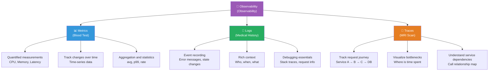
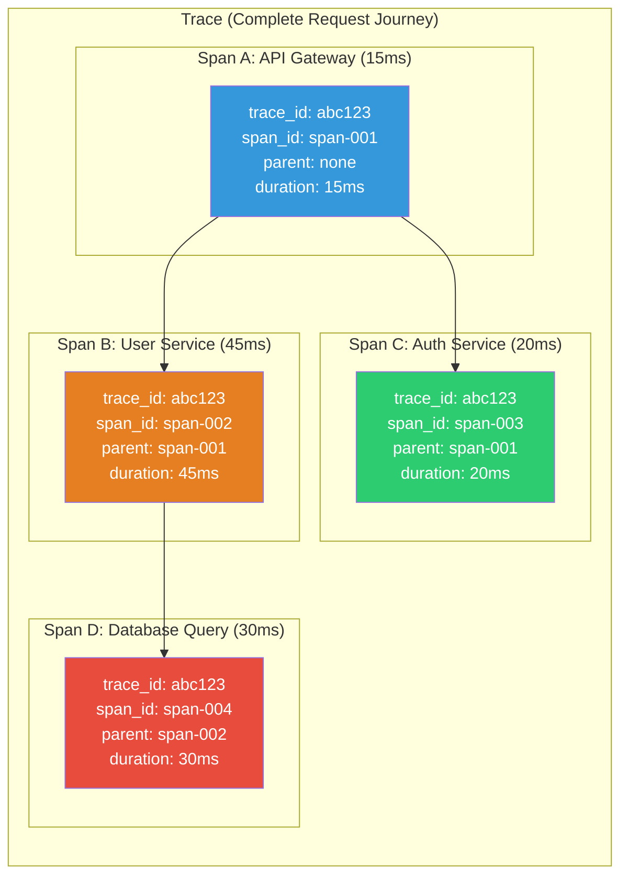
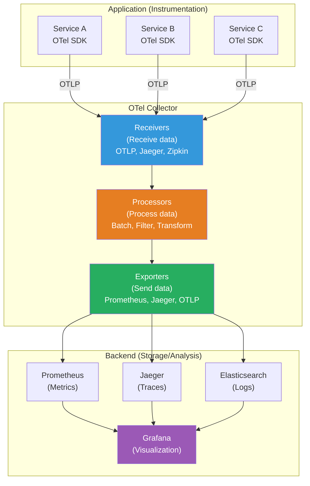
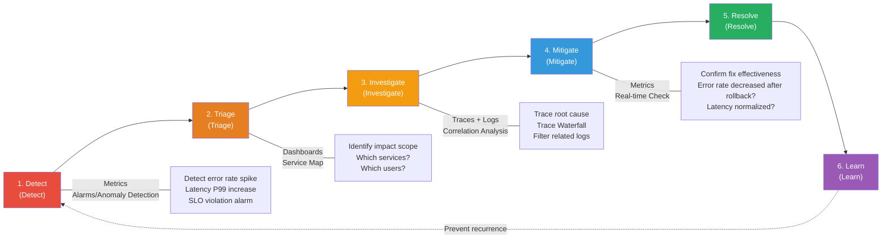
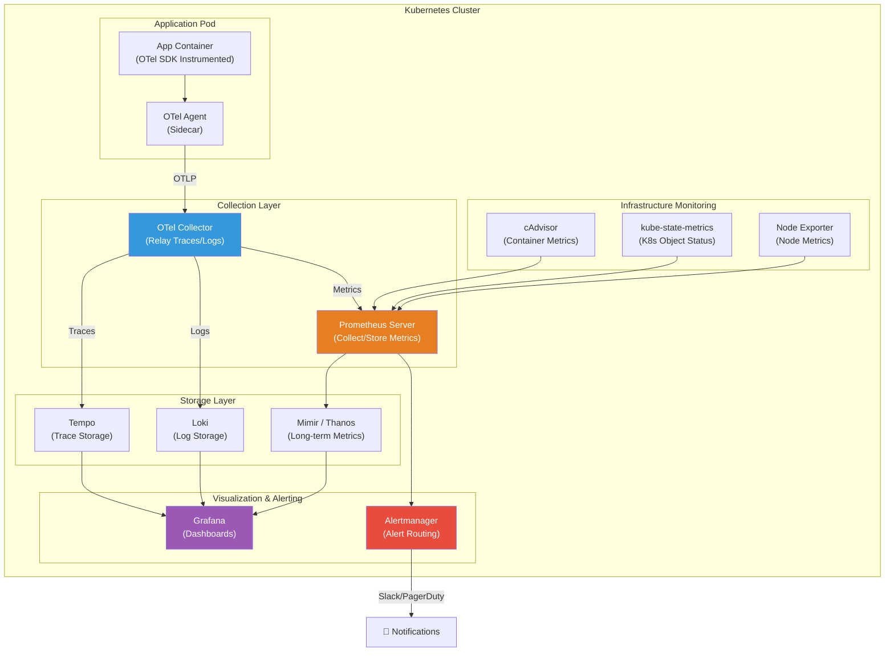

# Why is Observability Needed?

> Operating a system is similar to managing your health. Just as a single thermometer cannot fully reveal your health status, a single CPU usage alarm cannot reveal the true state of your system. You need comprehensive health checks—blood tests (Metrics), medical history (Logs), and MRI scans (Traces)—to understand "why" something is wrong. Let's learn how to properly examine whether the service deployed through the [CD pipeline](../07-cicd/04-cd-pipeline) is working correctly.

---

## 🎯 Why Do You Need to Understand Observability?

### Everyday Analogy: Health Check Story

Imagine you suddenly develop a headache one day.

- **With just a thermometer**: "No fever... but why does it hurt?" (Unknown)
- **With a blood pressure meter too**: "Blood pressure is a bit high" (Some clues, but not the cause)
- **With a comprehensive health checkup**: "Based on blood tests + CT + medical history, it's tension headache from lack of sleep"

**This is the difference between Monitoring and Observability.**

- Monitoring = Thermometer and blood pressure meter (Measuring only what you predefined)
- Observability = Comprehensive health check (Can diagnose even unexpected problems)

```
Real-world moments where Observability is needed:

• "Server CPU is normal, but why is it slow?"              → Can't identify root cause with Metrics alone
• "An error occurred, but where did it start?"             → Need to trace request across distributed system
• "Something feels off after deployment, but I don't know what" → Detect unexpected issues
• "It took 3 hours to find the cause of the outage"        → Insufficient observability
• "The same failure happened again"                        → No pattern analysis
• "I can't tell where the bottleneck is in microservices" → Missing Traces
• "There are logs, but too many to find anything useful"   → No structured logging
```

### Team Without Observability vs Team With Observability

```mermaid
flowchart TD
    subgraph "❌ Team Without Observability"
        A1["Outage Detected!<br/>User complaint received"] -->|"20 min later detected"| A2["What's the problem?"]
        A2 -->|"SSH access"| A3["Search through log files<br/>grep, tail -f"]
        A3 -->|"30 min spent"| A4["Service A seems slow..."]
        A4 -->|"guessing"| A5["Should we check Service B?"]
        A5 -->|"another 30 min"| A6["Oh, it was a DB connection pool issue!"]
        A6 -->|"Total MTTR: 2+ hours"| A7["😰 Customer churn"]
    end

    subgraph "✅ Team With Observability"
        B1["Anomaly detected automatically<br/>Latency P99 spiked"] -->|"Instant alert"| B2["Check dashboard"]
        B2 -->|"1 min"| B3["Trace identifies bottleneck<br/>Service A → DB segment"]
        B3 -->|"2 min"| B4["Auto-filter relevant logs<br/>DB Connection Pool Exhausted"]
        B4 -->|"5 min"| B5["Root cause identified + fix deployed"]
        B5 -->|"Total MTTR: 10 min"| B6["✅ Fast recovery"]
    end

    style A7 fill:#e74c3c,color:#fff
    style A6 fill:#e74c3c,color:#fff
    style B6 fill:#27ae60,color:#fff
    style B5 fill:#27ae60,color:#fff
```



---

## 🧠 Core Concepts

### 1. Monitoring vs Observability

> **Analogy**: CCTV vs Detective

- **Monitoring**: Like CCTV watching **predefined locations**. Good at detecting **known problems**, like "Alert when CPU exceeds 80%".
- **Observability**: Like a detective finding **unexpected problems**. The ability to infer internal system state using only external outputs (Metrics, Logs, Traces).

| Item | Monitoring | Observability |
|------|-----------|---------------|
| **Approach** | Pre-define "what to monitor" | Ask "anything" and find answers |
| **Question Type** | Known questions (Known-Unknowns) | Even unknown questions possible (Unknown-Unknowns) |
| **Example** | "Did CPU exceed 80%?" | "Why did this API suddenly get slower?" |
| **Data** | Pre-selected metrics collection | Rich contextual data collection |
| **Response** | Alert → Run runbook | Exploratory analysis → Root cause discovery |
| **Analogy** | Thermometer (temperature only) | Comprehensive health exam (full picture) |
| **Limitation** | Vulnerable to new failure types | High adoption cost and learning curve |

**Key difference**: Monitoring is a **subset** of Observability. With Observability, Monitoring is naturally included.

### 2. Observability 3 Pillars (Three Axes of Observability)

> **Analogy**: Three types of health exams



- **Metrics (Metrics)** = Blood test: Numerical health indicators. "Blood sugar 120, BP 130/80" → "CPU 45%, Latency P99 200ms"
- **Logs (Logs)** = Medical history: Detailed event records. "Had headache last night" → "2024-01-15 14:30:22 ERROR: Connection refused"
- **Traces (Traces)** = MRI scan: Track internal flow. "Where is blood vessel blocked" → "Request goes through Service A → B → C, with 3 second delay at B"

### 3. MELT (Metrics, Events, Logs, Traces)

MELT is an expansion of 3 Pillars. **Events** is added.

| Component | Description | Example |
|----------|------|------|
| **Metrics** | Quantified time-series data | CPU usage, request count, error rate |
| **Events** | Discrete events at specific moments | Deployment, scaling, config change |
| **Logs** | Timestamped text records | Error logs, access logs, audit logs |
| **Traces** | Request path in distributed systems | Service call chain connected by request ID |

> **Events** record "moments of change". When analyzing outages, it's crucial for finding correlations like "errors spiked right after deployment?".

### 4. Cardinality (Cardinality)

> **Analogy**: Variety of survey responses

In a survey, the "gender" field has few choices (Low Cardinality). But "Please write your address" can have millions of responses (High Cardinality).

- **Low Cardinality**: HTTP methods (GET, POST, PUT, DELETE) → 4 options
- **Medium Cardinality**: HTTP status codes (200, 201, 400, 404, 500...) → Tens of options
- **High Cardinality**: User ID, Request ID, IP address → Millions of options

```
Why is Cardinality important?

Metrics systems (like Prometheus) create time-series per label combination.

Example: http_requests_total{method="GET", status="200", user_id="???"}

• method × status = 4 × 5 = 20 time-series         → ✅ No problem
• method × status × user_id(1 million) = 20 million → 💥 System explosion!

Putting high cardinality labels in Metrics:
  → Memory explosion
  → Query speed plummets
  → Storage costs skyrocket
  → Prometheus can die from OOM (Out of Memory)

Solution:
  → Store high cardinality data in Logs or Traces
  → Only use Low/Medium Cardinality labels in Metrics
  → Put user_id in span attributes in Traces
```

### 5. OpenTelemetry (OTel) Standard

> **Analogy**: USB-C unified standard

In the past, each smartphone had different chargers (micro USB, Lightning, USB-C...). OpenTelemetry is the **USB-C unified standard** for observability data.

- Vendor-neutral standard telemetry collection framework
- CNCF (Cloud Native Computing Foundation) project
- Unifies Metrics, Logs, Traces under one standard

---

## 🔍 Understanding Each in Detail

### 1. Metrics (Metrics) - Blood Test

Metrics are **numerical data over time**. Optimal for quickly determining "if the system is healthy now".

#### Four Types of Metrics

| Type | Description | Analogy | Example |
|------|------|------|------|
| **Counter** | Cumulative increasing value | Pedometer steps | Total requests, total errors |
| **Gauge** | Current value (up/down) | Thermometer | CPU usage, memory usage |
| **Histogram** | Distribution of values | Height distribution graph | Response time distribution (p50, p95, p99) |
| **Summary** | Percentiles calculated directly | Grade percentile | Client-side latency percentiles |

#### Metrics Practical Examples

```yaml
# Metrics in Prometheus format examples

# Counter: Total HTTP requests (cumulative, monotonically increasing)
http_requests_total{method="GET", status="200", path="/api/users"} 158432
http_requests_total{method="POST", status="201", path="/api/orders"} 8291
http_requests_total{method="GET", status="500", path="/api/users"} 42

# Gauge: Current active connection count (can increase or decrease)
active_connections{service="api-gateway"} 1247
active_connections{service="user-service"} 89

# Histogram: Request response time distribution (count per bucket)
http_request_duration_seconds_bucket{le="0.05"} 24054    # <= 50ms: 24,054
http_request_duration_seconds_bucket{le="0.1"}  33421    # <= 100ms: 33,421
http_request_duration_seconds_bucket{le="0.25"} 39182    # <= 250ms: 39,182
http_request_duration_seconds_bucket{le="0.5"}  41038    # <= 500ms: 41,038
http_request_duration_seconds_bucket{le="1.0"}  41892    # <= 1s: 41,892
http_request_duration_seconds_bucket{le="+Inf"} 42000    # Total: 42,000
```

#### USE Method & RED Method

There are systematic frameworks for analyzing system performance.

```
USE Method (Infrastructure/Resource perspective) - Proposed by Brendan Gregg:
┌──────────────────────────────────────────────────┐
│  U - Utilization: How busy is the resource?     │
│      Example: CPU usage 75%, Disk I/O 90%       │
│                                                  │
│  S - Saturation: Are there queued tasks waiting?│
│      Example: CPU run queue length, Disk I/O wait│
│                                                  │
│  E - Errors: Are errors occurring?              │
│      Example: Disk read errors, network drops   │
└──────────────────────────────────────────────────┘

RED Method (Service/Application perspective) - Proposed by Tom Wilkie:
┌──────────────────────────────────────────────────┐
│  R - Rate: How many requests per second?        │
│      Example: 500 req/sec                       │
│                                                  │
│  E - Errors: What's the failure rate?           │
│      Example: 0.5% error rate                   │
│                                                  │
│  D - Duration: How long do requests take?       │
│      Example: p50=20ms, p99=200ms               │
└──────────────────────────────────────────────────┘

When to use what?
• Server/Infrastructure problems → USE Method (CPU, Memory, Disk, Network)
• Service/API problems  → RED Method (Rate, Errors, Duration)
• Both?     → Full visibility from infrastructure to application
```

---

### 2. Logs (Logs) - Medical History

Logs are **detailed event records**. Essential for understanding "exactly what happened".

#### Unstructured Logs vs Structured Logs

```bash
# ❌ Unstructured logs - Easy for humans to read, hard for machines to parse
[2024-01-15 14:30:22] ERROR: Failed to process order #12345 for user john@example.com - database connection timeout after 30s

# ✅ Structured logs (Structured JSON) - Easy for machines to parse, easy to search/filter
{
  "timestamp": "2024-01-15T14:30:22.456Z",
  "level": "ERROR",
  "service": "order-service",
  "trace_id": "abc123def456",
  "span_id": "789ghi012",
  "message": "Failed to process order",
  "order_id": "12345",
  "user_email": "john@example.com",
  "error_type": "DatabaseConnectionTimeout",
  "timeout_seconds": 30,
  "db_host": "prod-db-01.internal",
  "retry_count": 3
}
```

**Why are structured logs important?**

```
When searching with unstructured logs:
  grep "ERROR" app.log | grep "order" | grep "timeout"
  → Inaccurate results, slow, no aggregation possible

When searching with structured logs:
  SELECT * FROM logs
  WHERE level = 'ERROR'
    AND error_type = 'DatabaseConnectionTimeout'
    AND service = 'order-service'
    AND timestamp > NOW() - INTERVAL 1 HOUR
  → Accurate, fast, statistics possible
```

#### Log Level Guidelines

| Level | Purpose | Example | Production |
|-------|------|------|---------|
| **TRACE** | Most detailed debugging | Function enter/exit, variable values | Usually OFF |
| **DEBUG** | Detailed debugging info | SQL queries, API request/response body | Usually OFF |
| **INFO** | Normal operation | Service start, request processing complete | ON |
| **WARN** | Potential issues | Retry occurring, disk 80% | ON |
| **ERROR** | Recoverable errors | DB connection failed, API timeout | ON |
| **FATAL** | Critical errors (service exit) | OOM, missing required config | ON |

---

### 3. Traces (Traces) - MRI Scan

Traces track **the complete journey of a single request through multiple services** in a distributed system.

#### Trace Structure



```
Trace terminology:

• Trace: The complete path of one request through the system
        Collection of all Spans. Identified by unique trace_id.

• Span: Individual operation unit within a Trace
        One task performed in one service.
        Includes start/end time, attributes, events.

• Parent Span: The calling side's Span
• Child Span: The called side's Span

• Context Propagation: Mechanism to pass Trace ID between services
        Passed via HTTP Header, gRPC Metadata, etc.

Example Waterfall View:
├─ API Gateway ──────────────────────────── (120ms)
│  ├─ Auth Service ─────── (20ms)
│  ├─ User Service ──────────────── (80ms)
│  │  ├─ DB Query ──────── (30ms)
│  │  └─ Cache Lookup ── (5ms)
│  └─ Notification ── (10ms)
```

#### Connection of 3 Pillars

Three signals are incomplete separately, but **together they are powerful**.

```
Scenario: "User failed to place an order"

1. Metrics tell us first:
   → Error rate jumped from 0.1% to 5%! (Fast detection)

2. Traces narrow down the scope:
   → Looking at error request's trace,
     Order Service → Payment Service timeout (Identify bottleneck)

3. Logs find the exact cause:
   → Payment Service log:
     "ERROR: Connection pool exhausted. Active: 50/50.
      Waiting: 127. Oldest connection age: 300s"
     → Connection pool is full! (Root cause identified)

4. Action:
   → Increase connection pool size + set idle timeout
   → Prevent recurrence: Add connection pool usage Metric + alarm
```

---

### 4. OpenTelemetry (OTel) Standard - Deep Dive

OpenTelemetry is a **vendor-neutral** observability data collection standard.

#### OTel Architecture



#### OTel Core Components

```
OpenTelemetry composition:

1. API (Interface Definition)
   • Interface used by instrumentation code
   • Vendor-independent abstraction layer

2. SDK (Implementation)
   • Actual implementation of the API
   • Sampling, Batching, Export configuration
   • Language-specific SDKs provided (Java, Python, Go, JS, .NET, etc.)

3. Collector (Data Collector)
   • Agent mode: Runs as sidecar on each host
   • Gateway mode: Central collection server
   • Receiver → Processor → Exporter pipeline

4. OTLP (OpenTelemetry Protocol)
   • Standard protocol for data transmission
   • Supports gRPC and HTTP/JSON
   • Transmits Metrics, Logs, Traces all in one protocol

Why is OTel important?
  → Prevent vendor lock-in: Can switch from Datadog to Grafana without changing app code
  → Standardization: Solve the problem of teams using different libraries
  → Correlation: Connect Metrics/Logs/Traces using trace_id
```

#### OTel Instrumentation Code Example (Python)

```python
from opentelemetry import trace
from opentelemetry.sdk.trace import TracerProvider
from opentelemetry.sdk.trace.export import BatchSpanProcessor
from opentelemetry.exporter.otlp.proto.grpc.trace_exporter import OTLPSpanExporter

# Configure Tracer
provider = TracerProvider()
processor = BatchSpanProcessor(OTLPSpanExporter(endpoint="otel-collector:4317"))
provider.add_span_processor(processor)
trace.set_tracer_provider(provider)
tracer = trace.get_tracer(__name__)

# Manual instrumentation: Add custom Span to business logic
@app.route("/api/orders", methods=["POST"])
def create_order():
    with tracer.start_as_current_span("create_order") as span:
        span.set_attribute("order.user_id", request.json["user_id"])

        with tracer.start_as_current_span("process_payment"):
            result = process_payment(request.json)

        span.add_event("order_created", {"order_id": result["order_id"]})
        return jsonify(result), 201
```

---

### 5. Observability Maturity Model

Organizations' observability levels can be evaluated in stages.

```
Level 0: 🌑 None (No Observability)
├── Failure detection: Only when users report it
├── Data: None or only local server logs
├── Tools: None
├── Culture: "We've been fine so far, why..."
└── MTTR: Hours to days

Level 1: 🌒 Reactive (Reactive Monitoring)
├── Failure detection: Basic infrastructure alarms (CPU, Memory, Disk)
├── Data: Infrastructure Metrics + per-server log files
├── Tools: Nagios, Zabbix, CloudWatch basics
├── Culture: "Respond when alarms go off"
└── MTTR: 1~4 hours

Level 2: 🌓 Proactive (Proactive Monitoring)
├── Failure detection: Application-level Metrics + alarms
├── Data: Centralized logs + APM
├── Tools: Prometheus + Grafana, ELK Stack
├── Culture: "Check dashboards daily"
└── MTTR: 30 min ~ 1 hour

Level 3: 🌔 Observable (Observable)
├── Failure detection: Integrated 3 Pillars + anomaly detection
├── Data: Correlation analysis of Metrics + Logs + Traces
├── Tools: OpenTelemetry + Grafana Stack / Datadog
├── Culture: "Must answer even unexpected questions"
└── MTTR: 5~15 minutes

Level 4: 🌕 Data-Driven (Data-Driven)
├── Failure detection: AIOps, automatic anomaly detection, predictive alarms
├── Data: Complete telemetry + business metrics integration
├── Tools: Full OTel + ML-based analysis + auto-healing (Self-Healing)
├── Culture: "Observability data guides decision-making"
└── MTTR: Auto-recovery or within minutes
```

---

### 6. Role of Observability in Incident Response

When an incident occurs, let's see how Observability helps at each stage.

#### Incident Response Lifecycle



#### Real-world Incident Response Scenario

```
🚨 Scenario: Friday 5 PM, "Payment is not working!" complaint

━━━ Team Without Observability (MTTR: 2+ hours) ━━━
17:00 User complaint received → 17:15 On-call engineer contacted → 17:30 SSH access, search logs
→ 18:30 "External payment API was slow" (guessing) → 18:45 Temporary fix applied
→ Root cause (connection pool exhaustion) unresolved

━━━ Team With Observability (MTTR: 13 minutes) ━━━
16:52 Grafana alert: Error rate exceeds 5% (detected before user complaint!)
16:53 On-call engineer receives PagerDuty notification
16:55 Dashboard: Error type is ConnectionPoolExhausted (92%)
16:57 Jaeger Trace: External API latency spiked → Pool occupied → Pool exhausted
16:59 Logs (filtered by Trace ID): "Connection pool exhausted. Active: 50/50"
17:02 Action: Increase pool size + shorten timeout + enable Circuit Breaker
17:05 Metrics confirmed: Error rate back to normal → Root cause resolved
```

---

### 7. Tool Ecosystem Overview

Observability tools are divided into **open-source** and **commercial (SaaS)** solutions.

#### Open-Source Stack

```
┌─────────────────────────────────────────────────────────┐
│                  Visualization & Dashboards               │
│          Grafana (Integrated Visualization Platform)      │
├──────────┬──────────────┬──────────────┬────────────────┤
│ Metrics  │    Logs      │   Traces     │    Alerting    │
│          │              │              │                │
│Prometheus│ Loki         │ Jaeger       │ Alertmanager   │
│(Collect) │ (Lightweight)│ (Distributed)│ (Alert Mgmt)   │
│          │              │              │                │
│ Thanos   │ Elasticsearch│ Tempo        │ PagerDuty      │
│(LongTerm)│ (Full Search)│ (Large-Scale)│ (On-Call Mgmt) │
│          │              │              │                │
│ Mimir    │ Fluentd      │ Zipkin       │ OpsGenie       │
│(Scalable)│ (Log Collect)│ (Lightweight)│ (Incident Mgmt)│
├──────────┴──────────────┴──────────────┴────────────────┤
│            Data Collection (Instrumentation)             │
│                 OpenTelemetry                            │
└─────────────────────────────────────────────────────────┘
```

#### Key Tool Comparison

| Tool | Area | Characteristics | Best For |
|------|------|------|------------|
| **Prometheus** | Metrics | Pull-based, PromQL, CNCF Graduated | Metrics collection in [Kubernetes](../04-kubernetes/) environment |
| **Grafana** | Visualization | Multiple data sources, dashboards | Integrated monitoring dashboard |
| **Loki** | Logs | Label-based, lightweight, Grafana integrated | Cost-effective log management |
| **Elasticsearch** | Logs | Full-text search, powerful analytics | Large-scale log analysis, complex queries |
| **Jaeger** | Traces | CNCF Graduated, large-scale distributed tracing | Microservices debugging |
| **Tempo** | Traces | Object storage, lightweight | Grafana ecosystem integration |
| **OpenTelemetry** | Collection | Vendor-neutral, CNCF, all signals | Standard telemetry collection |

#### Commercial (SaaS) Solutions

| Tool | Characteristics | Advantages | Pricing |
|------|------|------|----------|
| **Datadog** | All-in-one platform | Easy setup, AI analysis, rich integrations | Per host/event |
| **New Relic** | All-in-one APM | Free tier available, Full Stack observability | Based on data ingestion |
| **Dynatrace** | AI-based APM | Auto-discovery, auto-instrumentation, AI analysis | Per host |
| **Splunk** | Log analysis specialized | Powerful search, security integration | Based on data ingestion |

#### Tool Selection Guide

```
Q1. Budget? → Sufficient: Datadog/New Relic | Limited: Open-source stack
Q2. Operations team? → SRE team available: Customize open-source | Not available: SaaS recommended
Q3. Scale? → Small: Grafana Cloud Free | Medium: Prometheus+Grafana | Large: Thanos/Mimir
Q4. Kubernetes? → Yes: Prometheus de facto standard | No: CloudWatch/Datadog Agent
```

---

## 💻 Hands-On Practice

### Exercise 1: Design Structured Logs

Design a structured log format for actual services.

```json
// Required fields for good structured logs

{
  // === Required Metadata ===
  "timestamp": "2024-01-15T14:30:22.456Z",  // ISO 8601 format
  "level": "ERROR",                          // Log level
  "service": "order-service",                // Service name
  "version": "v2.3.1",                       // Service version
  "environment": "production",               // Environment

  // === Correlation ===
  "trace_id": "abc123def456",                // Distributed trace ID
  "span_id": "789ghi012",                    // Current Span ID
  "request_id": "req-xyz-789",               // Request ID

  // === Event Information ===
  "message": "Payment processing failed",    // Human-readable message
  "error_type": "PaymentGatewayTimeout",     // Error classification
  "error_message": "Connection timed out after 30s",

  // === Business Context ===
  "user_id": "user-12345",                   // Affected user
  "order_id": "order-67890",                 // Related business entity
  "amount": 45000,                           // Business-related value

  // === Technical Context ===
  "host": "pod-order-service-7b9c4",         // Host/Pod name
  "source_file": "payment_handler.py",       // Source code location
  "source_line": 142
}
```

### Exercise 2: Design Prometheus Metrics

Design core Metrics for a simple web service.

```yaml
# 1. RED Method based service Metrics

# Rate: Requests per second
- name: http_requests_total
  type: Counter
  labels: [method, path, status_code]
  description: "Total number of HTTP requests"

# Errors: Error request count (status >= 500)
# → Filter http_requests_total where status_code="5xx"

# Duration: Request processing time
- name: http_request_duration_seconds
  type: Histogram
  labels: [method, path]
  buckets: [0.01, 0.05, 0.1, 0.25, 0.5, 1.0, 2.5, 5.0, 10.0]
  description: "HTTP request duration in seconds"

# 2. USE Method based infrastructure Metrics (usually auto-collected)

# Utilization
- name: node_cpu_seconds_total        # CPU usage
- name: node_memory_MemAvailable_bytes # Available memory

# Saturation
- name: node_load1                    # 1-minute average load
- name: node_disk_io_time_seconds_total # Disk I/O wait

# Errors
- name: node_disk_read_errors_total   # Disk read errors
- name: node_network_receive_errs_total # Network receive errors

# 3. Business Metrics (service-specific custom)

- name: orders_created_total
  type: Counter
  labels: [payment_method, status]
  description: "Total orders created"

- name: order_processing_duration_seconds
  type: Histogram
  labels: [step]  # validate, payment, fulfill
  description: "Order processing step duration"

- name: active_users_gauge
  type: Gauge
  description: "Currently active users"
```

### Exercise 3: Basic PromQL Query Practice

Learn core patterns of Prometheus Query Language.

```promql
# === Rate (Change rate per second) - Essential for Counters! ===
rate(http_requests_total[5m])                          # Requests per second in last 5 min

# === Error rate calculation (most common pattern) ===
(
  rate(http_requests_total{status_code=~"5.."}[5m])
  /
  rate(http_requests_total[5m])
) * 100                                                # Error percentage (%)

# === Latency percentiles (Histogram usage) ===
histogram_quantile(0.99, rate(http_request_duration_seconds_bucket[5m]))  # P99

# === Useful alarm queries ===
# When error rate exceeds 5% continuously
(rate(http_requests_total{status_code=~"5.."}[5m]) / rate(http_requests_total[5m])) > 0.05

# When disk will be full within 24 hours
predict_linear(node_filesystem_avail_bytes[6h], 24*3600) < 0
```

### Exercise 4: OpenTelemetry Collector Configuration Intro

Understand the basic configuration file of OTel Collector.

```yaml
# otel-collector-config.yaml
receivers:
  otlp:
    protocols:
      grpc:
        endpoint: 0.0.0.0:4317
      http:
        endpoint: 0.0.0.0:4318

processors:
  batch:
    timeout: 5s
    send_batch_size: 1000
  memory_limiter:
    limit_mib: 512

exporters:
  prometheus:
    endpoint: 0.0.0.0:8889
  otlp/jaeger:
    endpoint: jaeger:4317
    tls:
      insecure: true
  loki:
    endpoint: http://loki:3100/loki/api/v1/push

# Pipeline configuration: Define which signals go where
service:
  pipelines:
    traces:
      receivers: [otlp]
      processors: [memory_limiter, batch]
      exporters: [otlp/jaeger]
    metrics:
      receivers: [otlp]
      processors: [memory_limiter, batch]
      exporters: [prometheus]
    logs:
      receivers: [otlp]
      processors: [memory_limiter, batch]
      exporters: [loki]
```

---

## 🏢 In Production

### Production Architecture: Observability Stack in Kubernetes Environment

This is the most commonly used configuration in actual production environments.



### Production Case: Connection Between Deployment and Observability

After deployment in the [CD pipeline](../07-cicd/04-cd-pipeline), let's see how Observability ensures deployment safety.

```
Post-deployment observability checklist:

1. 🚦 Immediately after deployment (0~5 min)
   □ Error rate spike (rate(http_requests_total{status=~"5.."}[1m]))
   □ Latency change (histogram_quantile(0.99, ...))
   □ Pod restart status (kube_pod_container_status_restarts_total)

2. 📊 Stabilization period (5~30 min)
   □ Error rate stabilized to pre-deployment level
   □ Resource usage change (CPU, Memory leak check)
   □ Business metrics normal (order count, payment success rate)

3. 🔍 Long-term monitoring (30 min~24 hours)
   □ Memory usage trend (Memory leak possibility)
   □ Gradual performance degradation (Slow Degradation)
   □ External service call pattern changes

Example auto-rollback conditions (Argo Rollouts):
  - Error rate > 5% sustained for 3+ minutes
  - P99 Latency > 2 seconds sustained for 5+ minutes
  - Pod CrashLoopBackOff occurs
```

### Production Tip: Dashboard Design Principles

```
Golden Signals Dashboard (Based on Google SRE Book):
  Row 1: Traffic (QPS, service request ratio, top endpoints)
  Row 2: Errors (Error rate, error type classification, status code distribution)
  Row 3: Latency (P50/P95/P99, by endpoint, histogram)
  Row 4: Saturation (CPU/Memory, disk I/O, connection pool)

Design rules:
  ✅ Top→Bottom: Business impact → Service → Infrastructure
  ✅ Left→Right: Overall → Detailed
  ✅ Colors: Green (normal) / Yellow (caution) / Red (critical)
  ❌ Don't put 30+ panels in one dashboard
```

### Production Tip: Alert Design Principles

```
❌ Poor alerts: "CPU exceeds 80%" (alarms on transient spikes), "Error occurred" (fires on single error)
✅ Good alerts: "Error rate exceeds 5% sustained 5+ minutes", "Disk will reach 100% within 24 hours"

Prevent alert fatigue:
  1. Connect actionable runbook to every alert
  2. Aggressively delete meaningless alerts (alarm noise ≠ safety)
  3. Severity classification: P1 (immediate) / P2 (business hours) / P3 (informational)
  4. Periodic review: "Did we actually take action when this alert fired last month?"
```

### Observability Culture

Observability is not achieved by tools alone. **Culture** must change too.

```
Core principles of observability culture:

1. "I observe what I build" (You Build It, You Observe It)
   → Developers add instrumentation code, create dashboards, set alarms themselves
   → If delegated only to ops, business context is lost

2. "Observability is as important as testing"
   → Add "appropriate instrumentation included?" to PR review checklist
   → Complete feature = Code + Tests + Instrumentation, missing any one is incomplete

3. "Blameless incident culture" (Blameless Post-Mortem)
   → Analyze root cause as system failure, not human failure
   → "John made a mistake" ❌ → "We lacked instrumentation to prevent this mistake" ✅
   → Always ask in incident review: "What observability data would have caught this faster?"

4. "Data-driven decisions based on SLO"
   → "Server seems slow" ❌ → "P99 Latency exceeds SLO (200ms) by 150%" ✅
   → Decide based on data, not gut feeling

5. "Gradual adoption"
   → Don't try to achieve perfect observability immediately
   → Gradual adoption order: Metrics first → Centralized Logs → Traces
```

---

## ⚠️ Common Mistakes

### Mistake 1: Putting High Cardinality Labels in Metrics

```yaml
# ❌ Wrong: Including user_id in Metrics labels
http_requests_total{method="GET", path="/api/users", user_id="user-12345"}
# → With 1 million users, creates 1 million time-series!
# → Prometheus memory explosion → OOM crash

# ✅ Correct: Only include user_id in Trace/Log
http_requests_total{method="GET", path="/api/users", status="200"}
# → Metrics for aggregation, individual user tracking via Traces/Logs

# ❌ Another mistake: Dynamic values in path
http_requests_total{path="/api/users/12345"}
http_requests_total{path="/api/users/67890"}
# → Creates different time-series per user!

# ✅ Fix: Normalize path pattern
http_requests_total{path="/api/users/:id"}
```

### Mistake 2: Logging with Only Strings, Not Structured Logs

```python
# ❌ Wrong: Log only as string
logger.error(f"Order {order_id} failed for user {user_id}: {error}")
# → Search with grep? Regex hell...
# → Aggregation? Impossible...
# → Connect to trace? No trace_id, can't...

# ✅ Correct: Structured logging + include trace_id
logger.error(
    "Order processing failed",
    extra={
        "order_id": order_id,
        "user_id": user_id,
        "error_type": type(error).__name__,
        "error_message": str(error),
        "trace_id": get_current_trace_id(),
        "payment_method": payment_method,
    }
)
```

### Mistake 3: Setting Too Many/Too Sensitive Alarms

```yaml
# ❌ Wrong alarms: Too sensitive
alert: HighCPU
expr: node_cpu_usage > 0.70     # Alarm at 70%
for: 1m                          # Fire after 1 minute
# → Alarms on normal traffic spikes
# → Alert fatigue → Ignore real critical alarms

# ✅ Correct alarms: SLO-based, meaningful thresholds
alert: HighErrorRate
expr: |
  (
    rate(http_requests_total{status=~"5.."}[5m])
    /
    rate(http_requests_total[5m])
  ) > 0.05
for: 5m                          # Only when sustained 5+ minutes
labels:
  severity: critical
annotations:
  summary: "Error rate exceeds 5% ({{ $value | humanizePercentage }})"
  runbook: "https://wiki.internal/runbook/high-error-rate"
  dashboard: "https://grafana.internal/d/service-overview"
```

### Mistake 4: Adopting Tools Without Changing Culture

```
❌ Common pattern:
1. "We adopted Datadog, observability is complete!" → No one looks at dashboards
2. "We created 100 Grafana dashboards!" → 90 are useless
3. "We set 500 alarms!" → Alert fatigue makes everyone ignore them
4. "We instrumented with OpenTelemetry!" → Forgot to include trace_id in logs

✅ Correct approach:
1. Define "what we want to observe" before tool adoption
2. Start with critical services, gradually expand
3. Build habit of dashboard review (include in standups)
4. Derive observability improvements from incident reviews
```

### Mistake 5: Not Setting Sampling When Adopting Traces

```
❌ Wrong: 100% sampling of all requests
   → 10,000 requests/sec × 10 spans = 100,000 spans/sec
   → Enormous storage costs + network overhead

✅ Correct: Intelligent sampling strategy
   • Head-based Sampling: Decide at request start
     - Sample 10% of normal traffic
     - Trace 100% of error requests

   • Tail-based Sampling: Decide after request completion
     - Preserve 100% of requests with high latency
     - Preserve 100% of requests with errors
     - Keep only 5~10% of others

   → Use OTel Collector's tail_sampling processor
```

### Mistake 6: Confusing Monitoring with Observability

```
❌ Misconception: "We have Prometheus + Grafana, so observability is complete"
   → That's just Monitoring!
   → Can only answer "Known-Unknowns" like "Did CPU exceed 80%?"

✅ True Observability:
   → "Why was the order service slow yesterday at 3 PM?
      Can answer without predefined metrics or dashboards,
      by exploring the data"

   Requires:
   • High cardinality data (Traces, structured Logs)
   • Correlation analysis (Connect Metrics/Logs/Traces via trace_id)
   • Ad-hoc query capability ("Show latency distribution for these request conditions")
```

---

## 📝 Summary

### Core Takeaway

```
Observability = Ability to infer internal system state using only external outputs

1. Monitoring vs Observability
   • Monitoring: Answer only predefined questions (Known-Unknowns)
   • Observability: Answer unexpected questions too (Unknown-Unknowns)
   • Monitoring ⊂ Observability (subset relationship)

2. 3 Pillars + MELT
   • Metrics: Numerical data, fast detection, time-series (Blood test)
   • Logs: Event records, detailed debugging, context (Medical history)
   • Traces: Request path tracking, identify bottlenecks, understand dependencies (MRI)
   • Events: Record moments of change, correlation analysis

3. Cardinality
   • Low Cardinality → Suitable for Metrics labels
   • High Cardinality → Store in Traces/Logs
   • Wrong design can cause system explosion

4. OpenTelemetry
   • Vendor-neutral standard (USB-C unified standard)
   • SDK + Collector + OTLP protocol
   • Once instrumented, can send to any backend

5. Maturity Model
   • Level 0~4: None → Reactive → Proactive → Observable → Data-Driven
   • Culture must evolve with tools

6. Observability Culture
   • You Build It, You Observe It
   • Observability as important as testing
   • Blameless Post-Mortem
   • Data-driven SLO-based decisions
```

### Tool Mapping per Pillar

| Pillar | Open-source | Commercial | Standard |
|--------|---------|------|------|
| **Metrics** | Prometheus, Thanos, Mimir | Datadog, New Relic | OpenTelemetry Metrics |
| **Logs** | Loki, ELK Stack, Fluentd | Splunk, Datadog Logs | OpenTelemetry Logs |
| **Traces** | Jaeger, Tempo, Zipkin | Datadog APM, Dynatrace | OpenTelemetry Traces |
| **Visualization** | Grafana | Datadog Dashboard | - |
| **Alerting** | Alertmanager | PagerDuty, OpsGenie | - |

### Big Picture in One View

```
User Request → API Gateway → Service A → Service B → Database
                  │              │            │          │
                  ▼              ▼            ▼          ▼
              [OTel SDK]    [OTel SDK]   [OTel SDK]  [Exporter]
                  │              │            │          │
                  └──────────────┴────────────┴──────────┘
                                    │
                              OTel Collector
                           ┌───────┼───────┐
                           ▼       ▼       ▼
                       Prometheus  Loki   Tempo
                       (Metrics) (Logs) (Traces)
                           └───────┼───────┘
                                   ▼
                               Grafana
                           (Integrated Dashboard)
                                   │
                          ┌────────┼────────┐
                          ▼        ▼        ▼
                       Alerting Dashboard  Exploratory Analysis
                    (Alertmanager) (Visualization) (Ad-hoc Query)
```

---

## 🔗 Next Steps

### Learning Order After This Lecture

```
Current location: ✅ Understand Observability Concepts

Next steps:
├── 📊 Prometheus & Grafana (Metrics collection and visualization)
│   └── → Next lecture: ./02-prometheus.md
│
├── 📝 Log Collection and Analysis (ELK Stack / Loki)
│   └── Fluentd/Fluent Bit → Elasticsearch/Loki → Kibana/Grafana
│
├── 🔗 Distributed Tracing (Jaeger / Tempo)
│   └── OpenTelemetry instrumentation → Trace collection → Analysis
│
├── 🚨 Alerting and Incident Management
│   └── Alertmanager → PagerDuty → On-call system
│
└── 📈 SLO/SLI/SLA and Error Budget
    └── Observability usage from SRE perspective
```

### Related Lectures

- [Kubernetes Architecture](../04-kubernetes/01-architecture) - Understanding observability targets in Kubernetes
- [Kubernetes Health Checks](../04-kubernetes/08-healthcheck) - Relationship between Readiness/Liveness Probe and observability
- [CD Pipeline](../07-cicd/04-cd-pipeline) - Automated rollback based on observability post-deployment
- [Next: Prometheus & Grafana](./02-prometheus) - Metrics collection and visualization hands-on

### Recommended Resources

```
Official Documentation:
  • OpenTelemetry: https://opentelemetry.io/docs/
  • Prometheus: https://prometheus.io/docs/
  • Grafana: https://grafana.com/docs/

Recommended Books:
  • "Observability Engineering" - Charity Majors et al.
  • "Site Reliability Engineering" - Google SRE Book (free online)
  • "Distributed Systems Observability" - Cindy Sridharan (free eBook)

Key Terms:
  Observability, 3 Pillars, MELT, Counter/Gauge/Histogram,
  Structured Logging, Span/Trace/Context Propagation,
  Cardinality, OpenTelemetry(OTel/OTLP), USE/RED Method, Golden Signals
```
