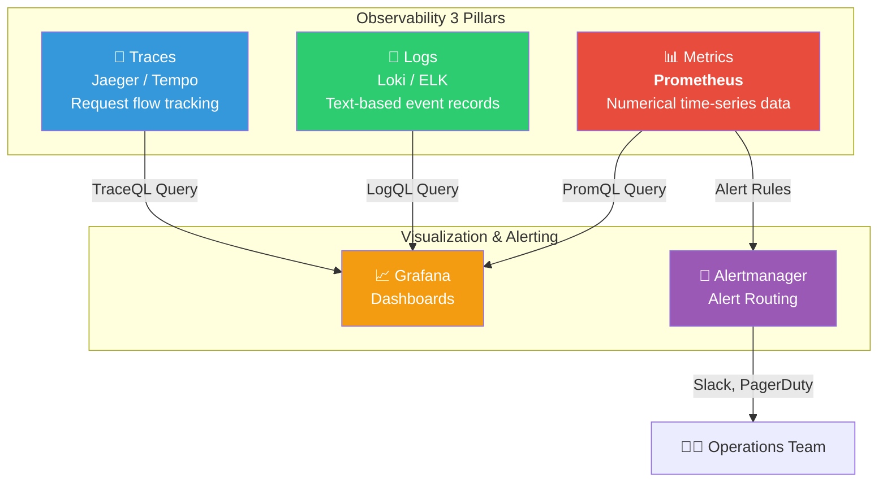
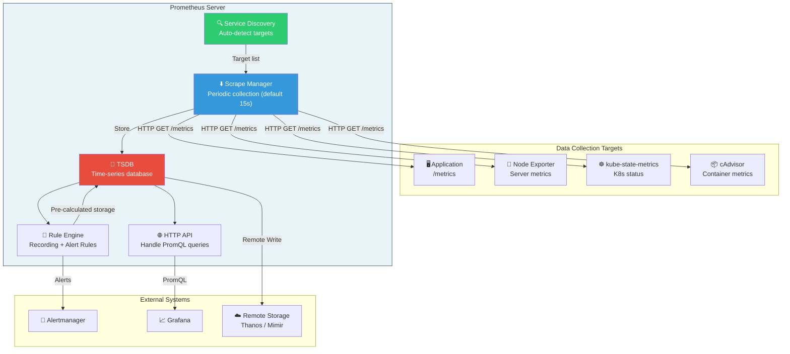
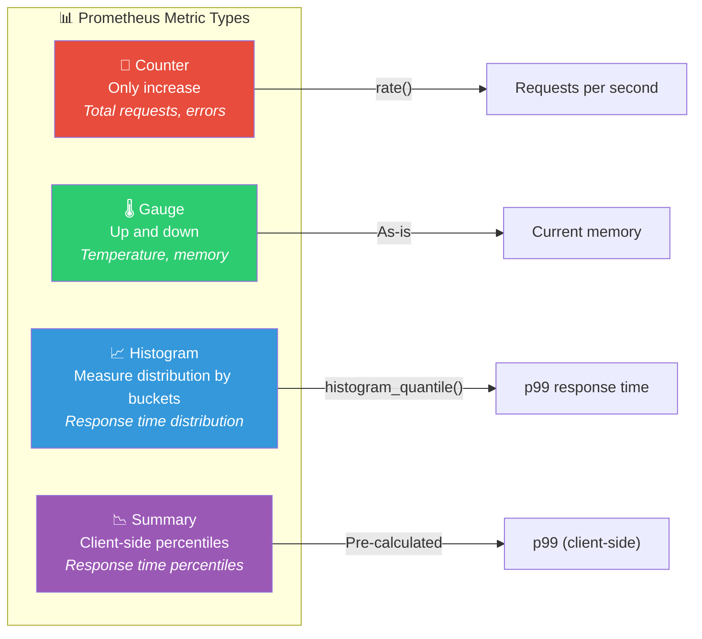
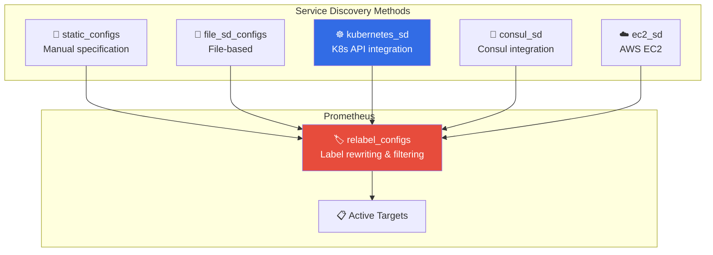
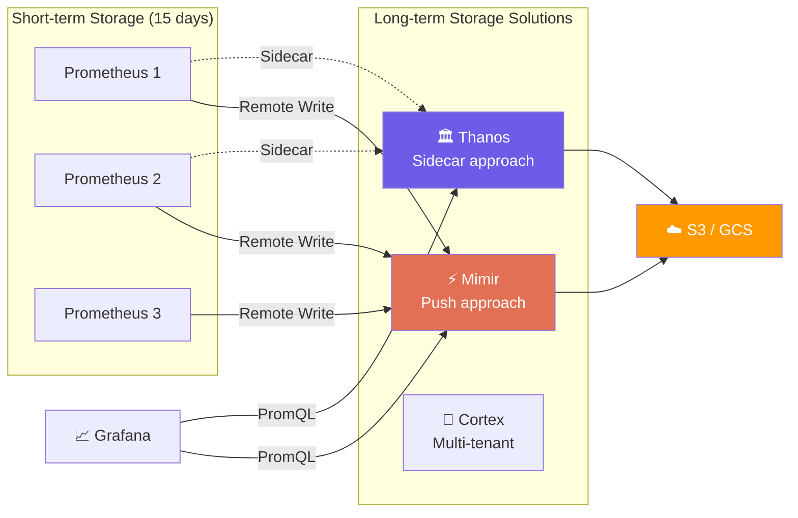

# Complete Prometheus Mastery

> Prometheus is your system's "health check center". It periodically measures the state of servers, containers, and applications, and immediately alerts you when abnormalities are detected. Let's deeply explore **Metrics**, one of the three pillars from [Observability concepts](./01-concept), which is Prometheus's core specialty.

---

## 🎯 Why Do You Need to Know Prometheus?

### Everyday Analogy: Hospital's Health Check System

Imagine a comprehensive health check center at a hospital.

- A nurse **periodically visits patient rooms** to check their status (Pull model)
- Records **numerical data** like temperature, blood pressure, heart rate (Metrics)
- Shows changes over time with **charts** (Time-series data)
- **Immediately alerts the doctor** if temperature exceeds 38°C (Alarms)
- Can answer questions like "What was the average blood pressure over the last hour?" (PromQL)

**Prometheus is exactly this health check system.**

```
Real-world moments where Prometheus is needed:

• "Server CPU usage is gradually increasing, when will it crash?"   → Trend analysis
• "Is API response time P99 meeting the SLA?"                     → histogram_quantile
• "Did error rate increase after yesterday's deployment?"         → Compare rate()
• "Want alerts before Kubernetes Pod gets OOMKilled"             → Alert Rules
• "Want to see total cluster request volume at a glance"         → Aggregation + Grafana
• "Metric queries are slow, dashboard takes too long to load"    → Recording Rules
```

### Prometheus's Position



### Why Prometheus Over Other Tools?

| Comparison | Prometheus | Datadog | CloudWatch | InfluxDB |
|-----------|-----------|---------|------------|----------|
| **Cost** | Free (open-source) | Per host | AWS usage-based | Community free |
| **Pull vs Push** | Pull (proactive collection) | Push (agent) | Push (agent) | Push |
| **Query Language** | PromQL (powerful) | Custom | CloudWatch Insights | InfluxQL/Flux |
| **K8s Integration** | Native support | Good | EKS only | Separate setup |
| **Ecosystem** | CNCF Graduated | Commercial | AWS-specific | Independent |

---

## 🧠 Core Concepts

### 1. Time Series Data

> **Analogy**: Weight scale log — Record weight every morning to see changes over time.

```
# Time series data structure
metric_name{label1="value1", label2="value2"}  value  timestamp

# Real example
http_requests_total{method="GET", path="/api/users", status="200"}  1524  @1679000000
http_requests_total{method="GET", path="/api/users", status="200"}  1587  @1679000015
```

### 2. Pull vs Push Model

> **Analogy**: Health checkup vs 911 call

- **Pull (Prometheus)**: Like health checkup, **periodically visits to check** status
- **Push (Traditional)**: Like 911 call, **self-report when problem occurs**

### 3. Labels

> **Analogy**: Library classification tags — Attach multi-dimensional tags to metrics for flexible queries.

### 4. Exporter

> **Analogy**: Translator — Convert server/DB state into Prometheus-understandable format.

### 5. PromQL

> **Analogy**: SQL for time-series — Ask questions like "What's the request rate per second over the last 5 minutes?"

---

## 🔍 Understanding Each in Detail

### 1. Complete Prometheus Architecture Analysis



#### TSDB Internal Structure

```
data/
├── 01BKGV7JC0RY8A6MACW02A2PJD/    ← Block (2-hour units)
│   ├── chunks/                      ← Actual time-series data
│   ├── index                        ← Label index
│   └── meta.json                    ← Block metadata
├── wal/                             ← Write-Ahead Log (crash recovery)
└── lock
```

| TSDB Characteristic | Description |
|-----------|------|
| **Compression** | ~1-2 bytes per sample |
| **Block Unit** | Create new block every 2 hours |
| **Compaction** | Merge old blocks |
| **Retention** | Default 15 days (configurable) |

#### Pull vs Push: Why Pull?

| Aspect | Pull (Prometheus) | Push (StatsD, InfluxDB) |
|------|-------------------|------------------------|
| **Status Detection** | Detect immediately on scrape failure | Hard to distinguish if target is dead |
| **Load Control** | Prometheus controls speed | Target can overwhelm with data |
| **Debugging** | Check `/metrics` directly in browser | Difficult to inspect intermediate data |
| **Limitation** | Hard to collect behind firewall/NAT | Good for short-lived jobs |

> For short-lived jobs (batch jobs), Prometheus provides **Pushgateway** separately, but Pull is advantageous for regular services.

---

### 2. Metric Types



#### Counter (Counter) — Analogy: Car Odometer

```python
from prometheus_client import Counter

http_requests_total = Counter(
    'http_requests_total', 'Total HTTP requests',
    ['method', 'path', 'status']
)

http_requests_total.labels(method='GET', path='/api/users', status='200').inc()
```

```
Counter rules:
  ✅ http_requests_total, errors_total   → Monotonically increasing values
  ❌ temperature_counter, memory_counter → Use Gauge if it can decrease!
  💡 Naming: Must have _total suffix
```

#### Gauge (Gauge) — Analogy: Car Speedometer

```python
from prometheus_client import Gauge

memory_usage_bytes = Gauge('memory_usage_bytes', 'Memory usage', ['instance'])
memory_usage_bytes.labels(instance='web-01').set(1073741824)  # Can increase or decrease
```

#### Histogram (Histogram) — Analogy: Test Score Distribution Chart

```python
from prometheus_client import Histogram

http_duration = Histogram(
    'http_request_duration_seconds', 'Request duration',
    ['method', 'path'],
    buckets=[0.01, 0.05, 0.1, 0.25, 0.5, 1.0, 2.5, 5.0, 10.0]
)

http_duration.labels(method='GET', path='/api/users').observe(0.157)
```

Histogram automatically creates **3 time-series** internally:

```
http_request_duration_seconds_bucket{le="0.1"}   78     ← <= 100ms: 78 samples
http_request_duration_seconds_bucket{le="0.5"}   99     ← <= 500ms: 99 samples
http_request_duration_seconds_bucket{le="+Inf"}  100    ← Total: 100 samples
http_request_duration_seconds_count              100    ← Total observations
http_request_duration_seconds_sum                12.3   ← Sum of observations
```

#### Summary vs Histogram

| Comparison | Histogram | Summary |
|-----------|-----------|---------|
| **Percentile Calculation** | Server-side (PromQL) | Client-side |
| **Aggregation** | Can sum multiple instances | Cannot sum |
| **Recommendation** | Most cases | Special cases only |

> Production tip: **Almost always use Histogram.** Summary cannot be summed in distributed systems.

---

### 3. PromQL Basics to Advanced

#### Instant Vector vs Range Vector

```promql
http_requests_total{method="GET"}        # Instant: Latest value each
http_requests_total{method="GET"}[5m]    # Range: Last 5 minutes of samples
```

#### Label Matching

```promql
http_requests_total{method="GET"}                        # Exact match
http_requests_total{method!="GET"}                       # Not match
http_requests_total{path=~"/api/.*"}                     # Regex match
http_requests_total{method="GET", status=~"5.."}         # Combined conditions
```

#### Essential Functions

```promql
# rate() — Change rate per second of Counter (recommended for alerts)
rate(http_requests_total[5m])

# irate() — Instant change rate (dashboard spike detection)
irate(http_requests_total[5m])

# increase() — Total increase over period
increase(http_requests_total[1h])         # ≈ rate(x[1h]) * 3600

# histogram_quantile() — Calculate percentile
histogram_quantile(0.99, rate(http_request_duration_seconds_bucket[5m]))

# P99 per service (le is required!)
histogram_quantile(0.99,
  sum(rate(http_request_duration_seconds_bucket[5m])) by (le, service)
)
```

#### Aggregation Operators

```promql
sum(rate(http_requests_total[5m]))                          # Total requests per second
sum(rate(http_requests_total[5m])) by (method)              # Sum per method
avg(node_cpu_seconds_total{mode="idle"}) by (instance)      # Average per instance
count(up == 1)                                              # Number of healthy targets
topk(5, rate(http_requests_total[5m]))                      # Top 5
```

#### Real-world PromQL Pattern Collection

```promql
# Error rate (5xx ratio of total)
sum(rate(http_requests_total{status=~"5.."}[5m]))
  / sum(rate(http_requests_total[5m]))

# CPU usage (%)
100 - (avg by (instance) (rate(node_cpu_seconds_total{mode="idle"}[5m])) * 100)

# Memory usage (%)
(1 - node_memory_MemAvailable_bytes / node_memory_MemTotal_bytes) * 100

# Disk space will run out prediction (within 24 hours)
predict_linear(node_filesystem_avail_bytes{mountpoint="/"}[6h], 3600*24)

# Average response time
rate(http_request_duration_seconds_sum[5m])
  / rate(http_request_duration_seconds_count[5m])

# Pod restart detection
increase(kube_pod_container_status_restarts_total[1h]) > 3
```

---

### 4. Service Discovery



#### kubernetes_sd_configs (Most Commonly Used)

This is the key configuration in [Kubernetes](../04-kubernetes/01-architecture).

```yaml
scrape_configs:
  - job_name: 'kubernetes-pods'
    kubernetes_sd_configs:
      - role: pod    # pod, service, node, endpoints, ingress

    relabel_configs:
      # Keep only Pods with prometheus.io/scrape: "true" annotation
      - source_labels: [__meta_kubernetes_pod_annotation_prometheus_io_scrape]
        action: keep
        regex: true

      # Custom metrics path
      - source_labels: [__meta_kubernetes_pod_annotation_prometheus_io_path]
        action: replace
        target_label: __metrics_path__
        regex: (.+)

      # Custom port
      - source_labels: [__address__, __meta_kubernetes_pod_annotation_prometheus_io_port]
        action: replace
        regex: ([^:]+)(?::\d+)?;(\d+)
        replacement: $1:$2
        target_label: __address__

      # Namespace/Pod name labels
      - source_labels: [__meta_kubernetes_namespace]
        target_label: namespace
      - source_labels: [__meta_kubernetes_pod_name]
        target_label: pod
```

```yaml
# Pod annotation example — Mark like this for auto-collection
apiVersion: v1
kind: Pod
metadata:
  annotations:
    prometheus.io/scrape: "true"
    prometheus.io/port: "8080"
    prometheus.io/path: "/metrics"
```

#### file_sd_configs & consul_sd_configs

```yaml
# File-based
- job_name: 'file-targets'
  file_sd_configs:
    - files: ['/etc/prometheus/targets/*.json']
      refresh_interval: 30s
```

```json
[{
  "targets": ["web-01:9100", "web-02:9100"],
  "labels": { "env": "production", "role": "web" }
}]
```

```yaml
# Consul-based
- job_name: 'consul-services'
  consul_sd_configs:
    - server: 'consul.example.com:8500'
      tags: ['prometheus']
  relabel_configs:
    - source_labels: [__meta_consul_service]
      target_label: service
```

#### relabel_configs Core Actions

```yaml
relabel_configs:
  - action: keep      # Keep targets matching condition
  - action: drop      # Drop targets matching condition
  - action: replace   # Transform label value
  - action: labelmap  # Map meta labels → regular labels
  - action: hashmod   # Shard across multiple Prometheus
```

---

### 5. Production prometheus.yml Configuration

```yaml
global:
  scrape_interval: 15s
  evaluation_interval: 15s
  external_labels:
    cluster: 'production-kr'
    region: 'ap-northeast-2'

rule_files:
  - '/etc/prometheus/rules/alerts/*.yml'
  - '/etc/prometheus/rules/recording/*.yml'

alerting:
  alertmanagers:
    - static_configs:
        - targets: ['alertmanager:9093']

remote_write:
  - url: 'http://mimir:9009/api/v1/push'
    write_relabel_configs:
      - source_labels: [__name__]
        regex: 'go_.*'
        action: drop    # Exclude unnecessary metrics → Save costs

remote_read:
  - url: 'http://mimir:9009/prometheus/api/v1/read'
    read_recent: false

scrape_configs:
  - job_name: 'prometheus'
    static_configs:
      - targets: ['localhost:9090']

  - job_name: 'node-exporter'
    kubernetes_sd_configs:
      - role: pod
    relabel_configs:
      - source_labels: [__meta_kubernetes_pod_label_app]
        action: keep
        regex: node-exporter

  - job_name: 'kube-state-metrics'
    static_configs:
      - targets: ['kube-state-metrics.monitoring:8080']

  - job_name: 'kubernetes-pods'
    kubernetes_sd_configs:
      - role: pod
    relabel_configs:
      - source_labels: [__meta_kubernetes_pod_annotation_prometheus_io_scrape]
        action: keep
        regex: true
      - source_labels: [__meta_kubernetes_namespace]
        target_label: namespace
      - source_labels: [__meta_kubernetes_pod_label_app]
        target_label: app
```

---

### 6. Alert Rules

```yaml
# /etc/prometheus/rules/alerts/infrastructure.yml
groups:
  - name: infrastructure-alerts
    rules:
      - alert: InstanceDown
        expr: up == 0
        for: 3m
        labels:
          severity: critical
        annotations:
          summary: "{{ $labels.instance }} down ({{ $labels.job }})"
          runbook_url: "https://wiki.example.com/runbook/instance-down"

      - alert: HighCpuUsage
        expr: 100 - (avg by (instance) (rate(node_cpu_seconds_total{mode="idle"}[5m])) * 100) > 85
        for: 10m
        labels:
          severity: warning
        annotations:
          summary: "{{ $labels.instance }} CPU {{ $value | printf \"%.1f\" }}%"

      - alert: HighMemoryUsage
        expr: (1 - node_memory_MemAvailable_bytes / node_memory_MemTotal_bytes) * 100 > 90
        for: 5m
        labels:
          severity: warning
        annotations:
          summary: "{{ $labels.instance }} Memory {{ $value | printf \"%.1f\" }}%"

      - alert: DiskWillFillIn24Hours
        expr: predict_linear(node_filesystem_avail_bytes{mountpoint="/"}[6h], 24*3600) < 0
        for: 30m
        labels:
          severity: critical
        annotations:
          summary: "{{ $labels.instance }} disk predicted to saturate within 24 hours"
```

```yaml
# /etc/prometheus/rules/alerts/application.yml
groups:
  - name: application-alerts
    rules:
      - alert: HighErrorRate
        expr: >
          sum(rate(http_requests_total{status=~"5.."}[5m])) by (service)
            / sum(rate(http_requests_total[5m])) by (service) > 0.05
        for: 5m
        labels:
          severity: critical
        annotations:
          summary: "{{ $labels.service }} error rate {{ $value | printf \"%.2f\" }}%"

      - alert: HighLatencyP99
        expr: >
          histogram_quantile(0.99,
            sum(rate(http_request_duration_seconds_bucket[5m])) by (le, service)
          ) > 1.0
        for: 5m
        labels:
          severity: warning

      - alert: PodCrashLooping
        expr: increase(kube_pod_container_status_restarts_total[1h]) > 5
        for: 10m
        labels:
          severity: critical
        annotations:
          summary: "{{ $labels.namespace }}/{{ $labels.pod }} restarted {{ $value }} times in 1 hour"
```

```
Alert evaluation flow:
  Inactive → expr satisfied → Pending (wait for) → for passed → Firing → Send to Alertmanager
                           ↓ condition not met
                           Back to Inactive (no alert sent)
```

---

### 7. Recording Rules (Pre-calculation Rules)

> **Analogy**: Instead of entering complex Excel formulas every time, create auto-calculated columns

```yaml
# /etc/prometheus/rules/recording/sli.yml
groups:
  - name: sli-recording-rules
    interval: 30s
    rules:
      - record: service:http_requests:rate5m
        expr: sum(rate(http_requests_total[5m])) by (service)

      - record: service:http_errors:ratio_rate5m
        expr: >
          sum(rate(http_requests_total{status=~"5.."}[5m])) by (service)
            / sum(rate(http_requests_total[5m])) by (service)

      - record: service:http_request_duration_seconds:p99_rate5m
        expr: >
          histogram_quantile(0.99,
            sum(rate(http_request_duration_seconds_bucket[5m])) by (le, service))

      - record: node:cpu_utilization:ratio
        expr: 1 - avg by (instance) (rate(node_cpu_seconds_total{mode="idle"}[5m]))

      - record: node:memory_utilization:ratio
        expr: 1 - node_memory_MemAvailable_bytes / node_memory_MemTotal_bytes
```

```
Recording Rules naming: level:metric:operations
  service:http_requests:rate5m       → Service level, HTTP requests, 5min rate
  node:cpu_utilization:ratio         → Node level, CPU usage, ratio

Good cases to use:
  ✅ Complex queries repeated in dashboards
  ✅ expr in Alert Rules (improves evaluation speed)
  ✅ Expensive operations like histogram_quantile()

Use Recording Rule in Alert:
  - alert: HighErrorRate
    expr: service:http_errors:ratio_rate5m > 0.05   # Much faster!
```

---

### 8. Remote Write/Read & Long-term Storage

#### Prometheus Local TSDB Limitations

Prometheus's local TSDB is single-node storage. In production environments, you run into several limitations.

```
Local TSDB Limitations:

1. Single Node Constraint
   • Retention period limited by disk capacity (default 15 days)
   • Metric data can be lost on server failure
   • Only vertical scaling possible (bigger disk, more memory)

2. No Global View
   • Cannot combine data from multiple Prometheus instances
   • Cannot see the full picture in multi-cluster/multi-region setups
   • Queries like "What's the error rate across all global services?" are impossible

3. No Long-term Analysis
   • Want to compare with data from 6 months ago, but it's already deleted
   • Need historical data for capacity planning
   • Cannot meet compliance requirements for long-term retention

When is remote storage needed?
  ✅ When you have multiple Prometheus instances (multi-cluster)
  ✅ When metrics need to be retained for more than 15 days
  ✅ When data loss on Prometheus failure is unacceptable
  ✅ When global queries (query data from multiple clusters at once) are needed
  ✅ When compliance requires 1+ year retention
```

#### Remote Write/Read API

Prometheus integrates with external storage through **Remote Write API** and **Remote Read API**.

```yaml
# prometheus.yml — Remote Write configuration
global:
  scrape_interval: 15s

remote_write:
  - url: "http://mimir:9009/api/v1/push"   # Send to remote storage
    queue_config:
      capacity: 10000          # Internal queue size
      max_shards: 30           # Parallel send shards
      max_samples_per_send: 5000  # Max samples per batch
    write_relabel_configs:
      - source_labels: [__name__]
        regex: "go_.*"          # Don't send go_ metrics (cost reduction)
        action: drop

remote_read:
  - url: "http://mimir:9009/prometheus/api/v1/read"
    read_recent: false         # Recent data from local, only old data from remote
```

```
Remote Write Operation Flow:

  Prometheus                   Remote Storage
  ┌──────────┐                ┌──────────────┐
  │ Scrape   │                │              │
  │   ↓      │                │  Mimir /     │
  │ Local    │──Remote Write──│  Thanos /    │──→ S3/GCS
  │ TSDB ↓   │  (HTTP POST)  │  Cortex      │   (Long-term)
  │ PromQL   │                │              │
  └──────────┘                └──────────────┘

  • Remote Write: Prometheus sends collected samples to remote in real-time
  • Remote Read: When PromQL queries data not available locally, fetch from remote
  • WAL-based: Buffer in WAL during network failure, resend later
```

#### Grafana Mimir: Large-Scale Metrics Storage

Grafana Mimir is the successor to Cortex and serves as a **large-scale Prometheus-compatible long-term storage**.

```
Mimir Key Features:
  • Prometheus Remote Write API compatible
  • Horizontal scaling: Can handle billions of active time-series
  • Native multi-tenancy: Data isolation per team/service
  • Long-term storage on S3/GCS/Azure Blob
  • 100% PromQL compatible
  • Simple setup: Can start in single-binary mode
```

```yaml
# Start Mimir with Docker Compose
services:
  mimir:
    image: grafana/mimir:latest
    command: ["-config.file=/etc/mimir/mimir.yaml"]
    ports:
      - "9009:9009"
    volumes:
      - ./mimir.yaml:/etc/mimir/mimir.yaml

# mimir.yaml minimal config
# multitenancy_enabled: false
# blocks_storage:
#   backend: s3
#   s3:
#     endpoint: s3.amazonaws.com
#     bucket_name: my-mimir-data
#     region: ap-northeast-2
# compactor:
#   data_dir: /tmp/mimir/compactor
# store_gateway:
#   sharding_ring:
#     replication_factor: 1
```

#### Thanos: Global Query + Long-term Retention

Thanos uses a **sidecar approach** that attaches to existing Prometheus instances, adding long-term storage and global queries with minimal changes to your existing setup.

```
Thanos Core Components:

  Sidecar     — Sits beside Prometheus, uploads data to object storage
  Store GW    — Queries historical data from object storage
  Querier     — Unified query across multiple Prometheus + Store GW
  Compactor   — Compresses/downsamples blocks in object storage
  Ruler       — Runs global Alert/Recording Rules

Advantages: Extend without changing existing Prometheus setup
Disadvantages: Many components increase operational complexity
```

#### Cortex vs Mimir vs Thanos Comparison



| Comparison | Thanos | Mimir | Cortex |
|-----------|--------|-------|--------|
| **Approach** | Sidecar + Store Gateway | Remote Write | Remote Write |
| **Global View** | Querier integrates | Self-provided | Self-provided |
| **Difficulty** | Intermediate | Low~Intermediate | High |
| **Multi-tenant** | Limited | Native | Native |
| **Existing setup change** | Minimal (just add sidecar) | Add remote_write to Prometheus | Add remote_write to Prometheus |
| **Backend storage** | S3, GCS, Azure Blob | S3, GCS, Azure Blob | S3, GCS, Azure Blob, DynamoDB |
| **Downsampling** | Automatic (5min, 1hour) | None (keeps original) | None |
| **Developed by** | Improbable → CNCF Incubating | Grafana Labs | WeaveWorks → CNCF |
| **Trend** | Stable, widely adopted | Rapidly growing, Cortex successor | Moving to Mimir |

```
Which to choose?

  Want minimal changes to existing Prometheus  → Thanos
  Building new or using Grafana ecosystem     → Mimir
  Already using Cortex                        → Consider migrating to Mimir

  Common: Object storage (S3/GCS) is required,
          100% PromQL compatible so existing dashboards/alerts work as-is
```

---

## 💻 Hands-On Practice

### Exercise 1: Bring Up Prometheus Stack with Docker Compose

```yaml
# docker-compose.yml
version: '3.8'
services:
  prometheus:
    image: prom/prometheus:v2.51.0
    ports: ["9090:9090"]
    volumes:
      - ./prometheus/prometheus.yml:/etc/prometheus/prometheus.yml
      - ./prometheus/rules/:/etc/prometheus/rules/
      - prometheus-data:/prometheus
    command:
      - '--config.file=/etc/prometheus/prometheus.yml'
      - '--storage.tsdb.retention.time=15d'
      - '--web.enable-lifecycle'

  node-exporter:
    image: prom/node-exporter:v1.8.0
    ports: ["9100:9100"]

  alertmanager:
    image: prom/alertmanager:v0.27.0
    ports: ["9093:9093"]
    volumes:
      - ./alertmanager/alertmanager.yml:/etc/alertmanager/alertmanager.yml

  grafana:
    image: grafana/grafana:11.0.0
    ports: ["3000:3000"]
    environment:
      - GF_SECURITY_ADMIN_PASSWORD=admin

volumes:
  prometheus-data:
```

```bash
docker-compose up -d

# Prometheus UI: http://localhost:9090
# Targets: http://localhost:9090/targets
# Grafana: http://localhost:3000 (admin/admin)
```

### Exercise 2: Step-by-step PromQL Practice

```promql
# Step 1: Basics
up                                                    # Target status (1=healthy)
node_memory_MemAvailable_bytes                        # Available memory

# Step 2: Calculations
node_memory_MemAvailable_bytes / node_memory_MemTotal_bytes * 100

# Step 3: rate
rate(prometheus_http_requests_total[5m])              # Requests per second

# Step 4: Aggregation
sum(rate(prometheus_http_requests_total[5m])) by (handler)

# Step 5: Prediction
predict_linear(node_filesystem_avail_bytes{mountpoint="/"}[1h], 3600*24)
```

### Exercise 3: Add Metrics to Flask App

```python
from flask import Flask, request
from prometheus_client import Counter, Histogram, Gauge, generate_latest, CONTENT_TYPE_LATEST
import time

app = Flask(__name__)

REQUEST_COUNT = Counter('app_http_requests_total', 'Total requests', ['method', 'endpoint', 'status'])
REQUEST_DURATION = Histogram('app_http_request_duration_seconds', 'Duration',
    ['method', 'endpoint'], buckets=[0.01, 0.05, 0.1, 0.25, 0.5, 1.0, 2.5, 5.0])
ACTIVE_REQUESTS = Gauge('app_active_requests', 'Active requests')

@app.before_request
def before():
    request.start_time = time.time()
    ACTIVE_REQUESTS.inc()

@app.after_request
def after(response):
    REQUEST_COUNT.labels(request.method, request.path, response.status_code).inc()
    REQUEST_DURATION.labels(request.method, request.path).observe(time.time() - request.start_time)
    ACTIVE_REQUESTS.dec()
    return response

@app.route('/metrics')
def metrics():
    return generate_latest(), 200, {'Content-Type': CONTENT_TYPE_LATEST}

@app.route('/api/users')
def get_users():
    return {'users': ['alice', 'bob']}
```

### Exercise 4: Rule Validation

```bash
# Validate rule syntax
docker exec prometheus promtool check rules /etc/prometheus/rules/alerts.yml

# Validate config file
docker exec prometheus promtool check config /etc/prometheus/prometheus.yml

# Reload configuration
curl -X POST http://localhost:9090/-/reload
```

---

## 🏢 In Production

### Prometheus Operator & ServiceMonitor

In production K8s environments, don't edit prometheus.yml directly. [Prometheus Operator](../04-kubernetes/17-operator-crd) manages it with CRDs.

```yaml
# ServiceMonitor — Auto-discover Service
apiVersion: monitoring.coreos.com/v1
kind: ServiceMonitor
metadata:
  name: my-api-monitor
  labels:
    release: prometheus
spec:
  selector:
    matchLabels:
      app: my-api
  namespaceSelector:
    matchNames: [production]
  endpoints:
    - port: http-metrics
      interval: 15s
      metricRelabelings:
        - sourceLabels: [__name__]
          regex: 'go_.*'
          action: drop
```

```yaml
# PrometheusRule — Alert/Recording Rule CRD
apiVersion: monitoring.coreos.com/v1
kind: PrometheusRule
metadata:
  name: my-api-alerts
  labels:
    release: prometheus
spec:
  groups:
    - name: my-api.rules
      rules:
        - alert: MyAPIHighLatency
          expr: >
            histogram_quantile(0.99,
              sum(rate(app_http_request_duration_seconds_bucket{service="my-api"}[5m])) by (le)
            ) > 1.0
          for: 5m
          labels: { severity: warning, team: backend }
```

### Cardinality Management — Most Important Production Issue

```
❌ Bad: High cardinality IDs in labels
   http_requests_total{user_id="abc123", request_id="req-xyz"}
   → Time-series explosion!

✅ Good: Only low cardinality labels
   http_requests_total{method="GET", status="200", service="api"}
   → method 4 x status 5 x service 10 = 200 series (manageable)

Check cardinality with PromQL:
   topk(10, count by (__name__)({__name__=~".+"}))
   prometheus_tsdb_head_series

Recommended by scale: Small 100K, Medium 500K, Large 2M or less
```

### Advanced Alertmanager Configuration

```yaml
# Alert suppression: if critical, suppress same target's warning
inhibit_rules:
  - source_matchers: [severity = critical]
    target_matchers: [severity = warning]
    equal: ['alertname', 'instance']

route:
  group_by: ['alertname', 'cluster', 'service']
  routes:
    - match: { severity: critical }
      receiver: 'pagerduty-critical'
      continue: true
    - match: { team: backend }
      receiver: 'slack-backend'
```

### Production Checklist

```
□ HA: 2+ Prometheus, 3 Alertmanager cluster
□ Storage: PV(SSD), retention configuration, Remote Write for long-term
□ Security: TLS, Auth, Network Policy, RBAC
□ Performance: Monitor cardinality, Recording Rules, metric_relabel drop
□ Alerting: for clause required, severity system, Runbook URL, Watchdog alert
```

---

## ⚠️ Common Mistakes

### Mistake 1: Using Counter Without rate()

```promql
# ❌ Cumulative value is meaningless
http_requests_total
# ✅ Convert to rate of change per second
rate(http_requests_total[5m])
```

### Mistake 2: rate() Range Smaller Than scrape_interval

```promql
# ❌ scrape_interval 15s but range 15s → Insufficient samples
rate(http_requests_total[15s])
# ✅ 4x scrape_interval or more
rate(http_requests_total[1m])
```

### Mistake 3: High Cardinality Values in Labels

```python
# ❌ user_id has millions of unique values → Time-series explosion
REQUEST_COUNT.labels(user_id='abc-123')
# ✅ Only low cardinality
REQUEST_COUNT.labels(method='GET', status='200')
```

### Mistake 4: Path Labels Not Normalized

```python
# ❌ /api/users/12345 → Infinite time-series
REQUEST_COUNT.labels(path=request.path)
# ✅ Normalize to pattern
import re
REQUEST_COUNT.labels(path=re.sub(r'/\d+', '/:id', request.path))
```

### Mistake 5: Missing for Clause in Alert

```yaml
# ❌ Alert on momentary spike → Alert Fatigue
- alert: HighCpu
  expr: cpu > 80
# ✅ Only when sustained for 10 minutes
- alert: HighCpu
  expr: cpu > 80
  for: 10m
```

### Mistake 6: Missing by(le) in histogram_quantile

```promql
# ❌ Missing le results in meaningless output
histogram_quantile(0.99, sum(rate(bucket[5m])) by (service))
# ✅ le is required
histogram_quantile(0.99, sum(rate(bucket[5m])) by (le, service))
```

### Mistake 7: Not Monitoring Prometheus Itself

```yaml
# Watchdog: Must always be firing. If not, Prometheus is dead!
- alert: Watchdog
  expr: vector(1)
  labels: { severity: none }
```

### Mistake 8: Remote Write Cost Explosion

```yaml
# ❌ Send all metrics
remote_write:
  - url: http://mimir:9009/api/v1/push
# ✅ Filter with write_relabel_configs
    write_relabel_configs:
      - source_labels: [__name__]
        regex: 'go_.*|process_.*'
        action: drop
```

---

## 📝 Summary

### Core Takeaway

```
1. Architecture: Pull-based collection → TSDB storage → Auto Service Discovery
2. Metric Types: Counter(rate), Gauge(as-is), Histogram(quantile), Summary(not recommended)
3. PromQL Essential: rate(), histogram_quantile(), sum() by(), predict_linear()
4. Operations Core: Cardinality management, Recording Rules, Alert for clause, Remote Write filtering
```

### Competency Checklist

```
Level 1 (Beginner):
  □ Explain Pull model, Counter vs Gauge, basic PromQL, run Docker Compose

Level 2 (Intermediate):
  □ 4 metric types, histogram_quantile, k8s_sd, Alert/Recording Rules

Level 3 (Advanced):
  □ Cardinality optimization, relabel_configs, Thanos/Mimir, Operator + ServiceMonitor
```

---

## 🔗 Next Steps

| Recommended Path | Description |
|---------------|------|
| [Grafana Visualization](./03-grafana) | Turn Prometheus metrics into dashboards |
| [K8s Health Checks](../04-kubernetes/08-healthcheck) | Link Liveness/Readiness probes with metrics |
| [K8s Operator](../04-kubernetes/17-operator-crd) | CRD-based Prometheus Operator management |
| [K8s Autoscaling](../04-kubernetes/10-autoscaling) | HPA based on custom metrics |

### Additional Learning Materials

```
Official Documentation:
  - https://prometheus.io/docs/
  - https://prometheus.io/docs/prometheus/latest/querying/
  - https://prometheus.io/docs/alerting/latest/alertmanager/

Recommended Exporters:
  - node_exporter (servers), blackbox_exporter (external endpoints)
  - mysqld_exporter, redis_exporter, postgres_exporter

Long-term Storage: Thanos, Grafana Mimir, VictoriaMetrics
```
