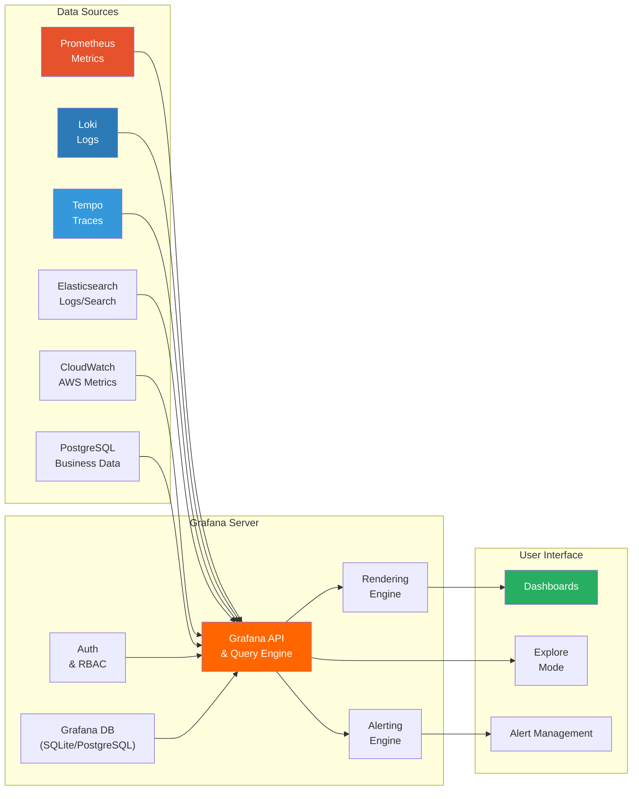

# Grafana Dashboards

> Collecting metrics alone is not enough. You need to **see collected data at a glance** to quickly detect failures and understand system health in real-time. Grafana is an open-source dashboard tool that **visualizes various data sources** like Prometheus, Loki, and Elasticsearch in **one screen**. We learned metric collection from [Prometheus](./02-prometheus), so now it's time to learn how to display that data beautifully and usefully.

---

## 🎯 Why Do You Need to Know Grafana?

### Everyday Analogy: Car Dashboard

Think about driving a car. The speedometer, RPM gauge, fuel level, engine temperature — **all this information is gathered in one dashboard** in front of the driver.

- Looking at the speedometer → Know how fast you're going
- Red fuel gauge → Need to refuel soon
- Rising engine temperature → Need to pull over
- RPM entering red zone → Need to shift gears

What if you had to open the engine hood to find this information? Driving would be impossible.

**Grafana is the dashboard for your server infrastructure.**

```
Real-world moments where Grafana is needed:

• Collecting metrics with Prometheus but only checking via PromQL          → Need visualization
• When outage occurs, checking multiple tools to find the problem          → Need single dashboard
• Having to open terminal every time someone asks "What's CPU at?"        → Need real-time monitoring
• On-call engineer receives outage alert at 3 AM, slow to find cause       → Need alert + dashboard integration
• Dev team, infra team, executives all want different data perspectives     → Need customized dashboards
• Manually creating dashboards and resetting per environment              → Need Dashboard as Code
```

### Team Without Monitoring vs Team With Grafana

```mermaid
flowchart TD
    subgraph "❌ Team Without Monitoring"
        ALERT_X["Outage Detected!<br/>User complaint received"] -->|"30 min later"| LOGIN["Server SSH access"]
        LOGIN --> CMD1["top, htop, df commands"]
        CMD1 --> CMD2["grep log files"]
        CMD2 --> CMD3["check other servers..."]
        CMD3 -->|"2 hours later"| FOUND_X["Root cause identified"]
        FOUND_X --> FIX_X["Manual fix"]
    end

    subgraph "✅ Team With Grafana"
        ALERT_OK["Outage Alert!<br/>Grafana Alert received"] -->|"Instant"| DASH["Check dashboard<br/>CPU/memory/error rate"]
        DASH -->|"5 min"| FOUND_OK["Root cause identified<br/>Specific Pod memory spike"]
        FOUND_OK --> FIX_OK["Immediate action<br/>Pod restart + scaling"]
    end

    style ALERT_X fill:#e74c3c,color:#fff
    style FOUND_X fill:#e67e22,color:#fff
    style ALERT_OK fill:#f39c12,color:#fff
    style FIX_OK fill:#27ae60,color:#fff
    style DASH fill:#3498db,color:#fff
```



### Incident Response Time Comparison

```
Time to recover (MTTR) from outage detection to resolution:

No monitoring      ████████████████████████████████████████████████  120+ min
CLI tools only     ████████████████████████████████                  60 min
Prometheus only    ████████████████████████                          40 min
Grafana dashboard  ████████████                                      15 min
Grafana + Alert    ████                                              5-10 min

→ Adopting Grafana cuts incident response time by 80%+
```

---

## 🧠 Core Concepts

### 1. What is Grafana?

> **Analogy**: Dashboard frame collecting various gauges

Grafana itself doesn't store data. Instead, it **connects to various data sources and visualizes** their data. You can view dozens of data sources in a single dashboard: Prometheus, Loki, Elasticsearch, CloudWatch, MySQL, etc.

```
Grafana's Core Roles:

1. Data visualization   → Display metrics, logs, traces as graphs/tables
2. Dashboard composition → Combine multiple panels for customized view
3. Alert delivery      → Condition-based alerts (Slack, PagerDuty, Email, etc.)
4. Data exploration    → Ad-hoc queries & debugging in Explore mode
5. Access control      → Team and role-based dashboard permissions
```

### 2. Grafana Architecture



### 3. Core Components at a Glance

```
Grafana Components:

┌─────────────────────────────────────────────────────────────┐
│                   Dashboard (Dashboard)                      │
│  ┌──────────────┐  ┌──────────────┐  ┌──────────────┐       │
│  │   Panel 1    │  │   Panel 2    │  │   Panel 3    │       │
│  │  Time Series │  │    Stat      │  │    Gauge     │       │
│  │  (CPU usage) │  │ (Request #)  │  │ (Memory %)   │       │
│  └──────┬───────┘  └──────┬───────┘  └──────┬───────┘       │
│         │                 │                 │               │
│  ┌──────▼───────────────────────────────────▼───────┐       │
│  │           Data Source (Data Source)               │       │
│  │ Prometheus │ Loki │ Elasticsearch │ CloudWatch    │       │
│  └──────────────────────────────────────────────────┘       │
│                                                             │
│  ┌──────────────────────────────────────────────────┐       │
│  │     Variables (Template Variables)                │       │
│  │ $namespace │ $pod │ $instance │ $interval        │       │
│  └──────────────────────────────────────────────────┘       │
│                                                             │
│  ┌──────────────────────────────────────────────────┐       │
│  │       Alerting (Alerting)                        │       │
│  │ Alert Rule → Contact Point → Notification Policy │       │
│  └──────────────────────────────────────────────────┘       │
└─────────────────────────────────────────────────────────────┘
```

### 4. Data Source Types

```
Main data sources by use case:

Data Source         Stores              Query Language      Use Case
────────────────────────────────────────────────────────────────────
Prometheus          Time-series metrics PromQL              Infra/app metrics
Loki                Logs                LogQL               Log aggregation/search
Tempo               Distributed traces  TraceQL             Request tracking
Mimir               Long-term metrics   PromQL              Prometheus retention
Elasticsearch       Logs/search         Lucene/KQL          Full-text log search
CloudWatch          AWS metrics/logs    CloudWatch query    AWS service monitoring
PostgreSQL/MySQL    Business data       SQL                 Business metrics
InfluxDB            Time-series data    Flux/InfluxQL       IoT/time-series specialized
Jaeger              Distributed traces  -                   Trace viewer
```

### 5. Panel Types

```
Panel types by use case:

Panel Type       Best For                  Use Example
──────────────────────────────────────────────────────────
Time Series     Values changing over time CPU usage, request count, latency
Stat            Single key number        Current active users, error rate
Gauge           0-100% range values      Memory usage, disk usage %
Bar Gauge       Comparison of items      CPU usage per Pod
Table           Multi-column data        Top 10 slow queries, instance list
Heatmap         Density/distribution     Request latency distribution
Logs            Log text                 Live app log view
Bar Chart       Category comparison      Errors per service, deployments per env
Pie Chart       Ratios/composition       Traffic source ratio, error type distribution
State Timeline  State change tracking    Service up/down history
Geomap          Location-based data      Traffic per region, CDN node status
Node Graph      Relationships/topology   Service dependency map
```

---

## 🔍 Understanding Each in Detail

### 1. Grafana Installation and Basic Setup

#### Set Up Grafana + Prometheus Environment with Docker Compose

```yaml
# docker-compose.yml
version: '3.8'

services:
  # ── Prometheus (metric collection) ──
  prometheus:
    image: prom/prometheus:v2.51.0
    container_name: prometheus
    ports:
      - "9090:9090"
    volumes:
      - ./prometheus/prometheus.yml:/etc/prometheus/prometheus.yml
      - prometheus_data:/prometheus
    command:
      - '--config.file=/etc/prometheus/prometheus.yml'
      - '--storage.tsdb.retention.time=15d'
      - '--web.enable-lifecycle'
    restart: unless-stopped

  # ── Grafana (visualization) ──
  grafana:
    image: grafana/grafana:10.4.0
    container_name: grafana
    ports:
      - "3000:3000"
    environment:
      # Admin account setup
      - GF_SECURITY_ADMIN_USER=admin
      - GF_SECURITY_ADMIN_PASSWORD=admin123
      # Disable anonymous access
      - GF_AUTH_ANONYMOUS_ENABLED=false
      # Server configuration
      - GF_SERVER_ROOT_URL=http://localhost:3000
    volumes:
      - grafana_data:/var/lib/grafana
      - ./grafana/provisioning:/etc/grafana/provisioning
    depends_on:
      - prometheus
    restart: unless-stopped

  # ── Node Exporter (host metrics) ──
  node-exporter:
    image: prom/node-exporter:v1.7.0
    container_name: node-exporter
    ports:
      - "9100:9100"
    restart: unless-stopped

volumes:
  prometheus_data:
  grafana_data:
```

```bash
# Start environment
docker compose up -d

# Grafana access: http://localhost:3000
# Default account: admin / admin123
```

---

## 💻 Hands-On Practice

### Exercise 1: Build Grafana + Prometheus and Create Basic Dashboard

```bash
# 1. Create project directory
mkdir grafana-lab && cd grafana-lab

# 2. Create directory structure
mkdir -p prometheus
mkdir -p grafana/provisioning/datasources
mkdir -p grafana/provisioning/dashboards/json
```

Use the docker-compose.yml above, then:

```bash
# 3. Start environment
docker compose up -d

# 4. Access Grafana
# Open http://localhost:3000 in browser
# Login: admin / admin123

# 5. Verification
# - Left menu → Connections → Data sources → Prometheus should appear!
# - Explore menu: test PromQL:
#   up
#   node_cpu_seconds_total
```

### Exercise 2: Create Dynamic Dashboard with Template Variables

Similar process as described in the full file, creating namespace and instance variables.

### Exercise 3: Set Up Alert Rules

1. Left menu → Alerting → Alert rules → New alert rule
2. Configure high CPU alert with threshold
3. Set evaluation frequency and duration
4. Add labels and annotations with runbook URL

### Exercise 4: Export Dashboard as JSON and Provision

```bash
# 1. Export dashboard as JSON
# Dashboard → Share → Export → Save to file → dashboard.json

# 2. Store in provisioning directory
cp dashboard.json grafana/provisioning/dashboards/json/my-dashboard.json

# 3. Update provisioning config (as shown in full file)

# 4. Restart Grafana
docker compose restart grafana

# 5. Verify
# → Grafana → Dashboards → "Provisioned Dashboards" folder
#   dashboard should auto-load!

# 6. Commit to Git
git add grafana/provisioning/
git commit -m "feat: add provisioned Grafana dashboard"
```

---

## 🏢 In Production

### Production Grafana Architecture

```
Small scale (Startup):
─────────────────────
- Single Grafana instance (Docker/VM)
- SQLite DB (default)
- Prometheus + Loki integration
- 10-20 dashboards
- Cost: Free (OSS)

Medium scale (Growing company):
──────────────────────────────
- Grafana + PostgreSQL (HA)
- Provisioning for dashboard management
- LDAP/OAuth authentication
- Team folder/permission separation
- 50-100 dashboards
- Cost: Free (OSS) or Grafana Cloud Free tier

Large scale (Enterprise):
────────────────────────
- Grafana Enterprise or Grafana Cloud
- LGTM Stack (Mimir + Loki + Tempo)
- Terraform manages all configurations
- SSO + fine-grained RBAC
- Cross-cluster dashboards
- 500+ dashboards, 1000+ users
- Cost: $8/user/month (Cloud) or Enterprise license
```

### Dashboard as Code Methods

**Method 1: Grafana Provisioning (YAML)** — Most basic
**Method 2: Grafonnet (Jsonnet)** — Programmatic, good for large scale
**Method 3: Terraform (Grafana Provider)** — Full infrastructure as code

---

## ⚠️ Common Mistakes

### Mistake 1: Managing Dashboards Only in UI

```yaml
# ❌ Bad: Manual UI management
- Create dashboard in Grafana UI
- Recreate same dashboard in staging/production manually
- No change history tracking
- Cannot recover if Grafana server fails

# ✅ Good: Code-based management
- Store Dashboard JSON in Git (Provisioning)
- Or generate with Grafonnet/Terraform
- Auto-deploy via CI/CD
- Change history in Git commits
- Recover with docker compose up after server failure
```

### Mistake 2: Putting Everything in One Dashboard

```yaml
# ❌ Bad: Master Dashboard with everything
- CPU, memory, disk (infrastructure)
- API requests, errors (services)
- Revenue, DAU (business)
- DB queries, cache (data)
→ 50 panels, 30-sec load time, nothing is visible

# ✅ Good: Separate by purpose
- Infrastructure Overview (infra team)
- API Service RED Metrics (backend team)
- Business KPI (executives)
- Database Performance (DBA)
→ Each dashboard 10-15 panels, 2-sec load, shows essentials
```

### Mistake 3: Missing for Duration in Alert Rules

```yaml
# ❌ Bad: No for clause, alerts on momentary spike
rules:
  - alert: HighCPU
    expr: cpu_usage > 80
    # → Alerts even on brief spikes during deployment/cron
    # → Alert fatigue

# ✅ Good: Alert only when sustained
rules:
  - alert: HighCPU
    expr: cpu_usage > 80
    for: 5m    # Alert only if sustained 5+ minutes
    # → Ignores brief spikes, catches real problems
```

### Mistake 4: Using Fixed Interval Instead of $__interval

```promql
# ❌ Bad: Fixed 5m interval
rate(http_requests_total[5m])
→ Always 5m interval whether viewing 1 hour or 7 days
→ 7-day view = 2,016 data points → slow

# ✅ Good: Auto-adjusting interval
rate(http_requests_total[$__rate_interval])
→ Grafana auto-adjusts: 1 hour=15s, 7 days=1h
→ Always proper data point count → fast

Use:
- $__interval: General auto interval
- $__rate_interval: Optimized for rate() function
- $__range: Selected time range
```

### Mistake 5: Setting Data Source to Direct Mode

```yaml
# ❌ Bad: Direct access
datasources:
  - name: Prometheus
    access: direct    # Browser directly accesses Prometheus
    # Problems:
    # 1. Browser can't reach internal prometheus:9090
    # 2. CORS setup required
    # 3. Auth exposed in browser

# ✅ Good: Proxy access
datasources:
  - name: Prometheus
    access: proxy     # Grafana server proxies requests
    # Benefits:
    # 1. Only Grafana needs Prometheus access
    # 2. No CORS needed
    # 3. Auth kept on server
```

---

## 📝 Summary

### Key Takeaway

```
Grafana Core Summary:

1. Grafana's Role
   - Single UI for multiple data sources (Prometheus, Loki, Tempo)
   - Provides alerting, exploration, access control
   - No data storage (visualization layer only)

2. Data Sources
   - Prometheus (metrics), Loki (logs), Tempo (traces)
   - CloudWatch, Elasticsearch, SQL DB support
   - use: proxy mode recommended

3. Panel Types
   - Time Series: most common
   - Stat/Gauge: key numbers, 0-100% ranges
   - Table: lists/comparisons, Heatmap: density
   - Logs: real-time log view

4. Dashboard Design
   - USE Method (infrastructure) + RED Method (services)
   - "5-second rule": determine health status immediately
   - Critical metrics top, time series middle, details below

5. Template Variables
   - One dashboard for multiple environments
   - Chained Variables for cascading filters
   - $__rate_interval for auto optimization

6. Unified Alerting
   - Alert Rule → Notification Policy → Contact Point
   - for duration essential (prevent alert fatigue)
   - Runbook URL connects response guidance

7. Dashboard as Code
   - Provisioning (YAML): simplest
   - Grafonnet (Jsonnet): programming, large-scale
   - Terraform: full infrastructure management

8. LGTM Stack
   - Loki (logs) + Grafana (UI) + Tempo (traces) + Mimir (metrics)
   - Signal correlation is key advantage
   - Grafana Alloy for unified collection
```

### Grafana Maturity Checklist

```
Level 1 - Basics:
  [ ] Grafana installed
  [ ] Prometheus Data Source connected
  [ ] Basic infrastructure dashboard (CPU/memory/disk)
  [ ] Team members can access Grafana

Level 2 - Intermediate:
  [ ] RED metric dashboards per service
  [ ] Template Variables enable dynamic filtering
  [ ] Alert Rules configured with Slack/Email
  [ ] Dashboards separated by team folders
  [ ] Log Data Source (Loki/Elasticsearch) connected

Level 3 - Advanced:
  [ ] Dashboard as Code (Provisioning/Terraform) managed
  [ ] Unified Alerting with tiered alert system
  [ ] All alerts include Runbook URL
  [ ] Metrics-Logs-Traces correlation configured
  [ ] Business KPI dashboard shared with executives

Level 4 - Elite:
  [ ] LGTM Stack fully deployed
  [ ] Dashboards deployed via CI/CD pipeline
  [ ] SLO dashboard and error budget automated
  [ ] Monthly alert review improves quality
  [ ] On-call rotation/escalation integrated
```

---

## 🔗 Next Steps

### Related Content

```
Previous:
← Prometheus (./02-prometheus)
   - Metric collection, PromQL, Alertmanager
   - Foundation for understanding Grafana's core data source

Next:
→ Logging (./04-logging)
   - Structured logs, log collection pipeline
   - Loki/Elasticsearch + Grafana log panel
   - Viewing Metrics (Prometheus) + Logs (Loki) together
```

### Recommended Resources

```
Official Documentation:
- Grafana: https://grafana.com/docs/grafana/latest/
- Alerting: https://grafana.com/docs/grafana/latest/alerting/
- Grafonnet: https://github.com/grafana/grafonnet
- Terraform Provider: https://registry.terraform.io/providers/grafana/grafana/

Practice Projects:
1. Docker Compose Grafana+Prometheus with basic dashboard
2. Multi-service dashboard with Template Variables
3. Unified Alerting with Slack notifications
4. Dashboard code management via Provisioning
5. Grafonnet pipeline for dashboard automation

Advanced Topics:
- Complete LGTM Stack (Mimir + Loki + Tempo)
- Grafana SLO for error budget management
- Grafana OnCall for on-call rotation
- Grafana k6 load test visualization
```

---

> **Next lecture preview**: In [Logging](./04-logging), we'll learn structured logging importance, EFK/PLG stack comparison, and log collection pipeline setup. We'll also practice using Loki log panels in Grafana!
