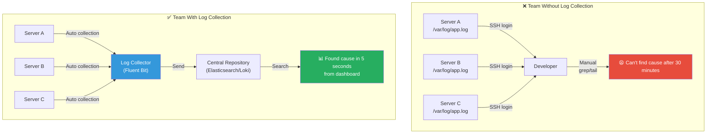
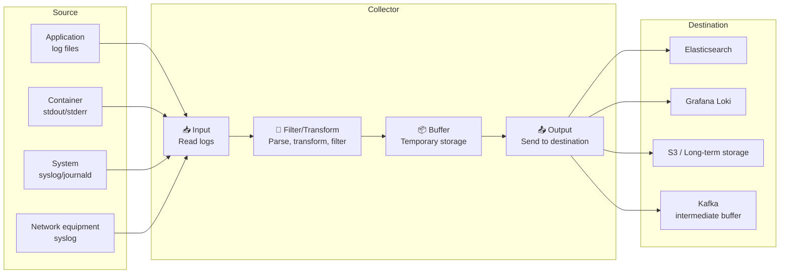
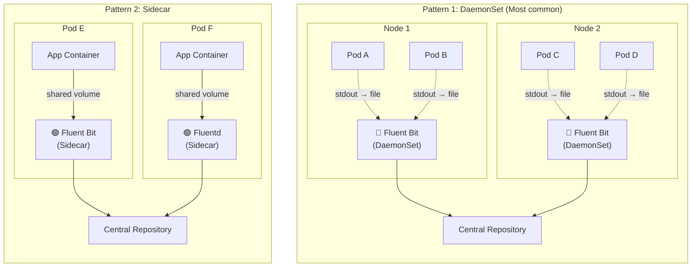
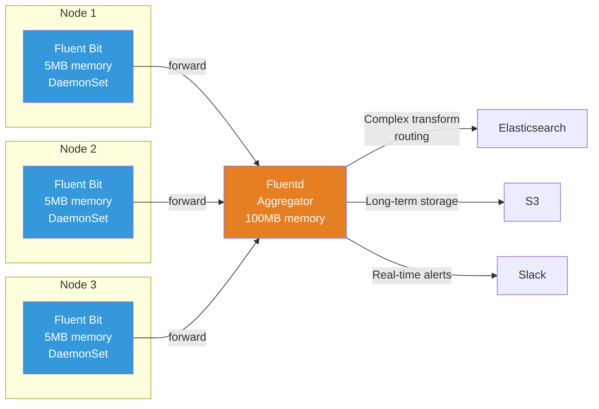
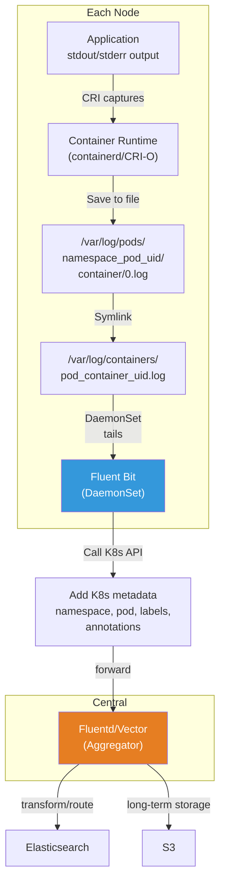

# Log Collection

> Even if your applications diligently produce logs, if you can't **gather them in one place**, you'll have to visit 100 servers one by one during an incident. Log collectors are like delivery workers that **automatically gather logs** scattered throughout your system and send them to a central repository. In the [previous lecture (Structured Logging / ELK / Loki)](./04-logging), we learned how to produce good logs. Now let's explore **how to collect, transform, and deliver those logs**.

---

## 🎯 Why Do You Need to Know About Log Collection?

### Everyday Analogy: Trash Collection System in an Apartment Complex

Imagine an apartment complex. Each unit (server) generates trash (logs).

- **Without collection**: Trash piles up in front of each unit. To find where specific trash came from, you have to walk around the neighborhood
- **With a collection system**: Collection bins (agents) at the entrance of each building, collection trucks (collection pipelines) run at set times to gather everything and take it to a recycling center (central repository)

Log collection is exactly the same:

```
When log collection becomes necessary in practice:

• Logs accumulate simultaneously from 50 servers, how do you find the incident cause?   → Need centralized collection
• In K8s environments where logs disappear when Pods die               → Need real-time collection
• Log formats differ between services (JSON, plain text, syslog)      → Need parsing/transformation
• 100GB of logs pour in daily, how do you reduce storage costs?       → Need filtering/routing
• Log surge suddenly happens and collector goes down              → Need backpressure handling
• Sensitive data (SSN, card numbers) in logs                         → Need masking/filtering
```

### Team Without Log Collection vs. Team With It



### Three Main Roles of Log Collection

```
What log collectors do:

INPUT (Collection)   →    PROCESS (Processing)  →    OUTPUT (Delivery)
━━━━━━━━━━━━━━━      ━━━━━━━━━━━━━━━━━        ━━━━━━━━━━━━━━━
• Tail files         • Parsing (JSON, regex) • Elasticsearch
• Container stdout   • Field add/delete      • S3 / GCS
• Syslog reception   • Sensitive data mask   • Kafka
• journald reading   • Sampling/filtering    • Loki
• HTTP reception     • Log level filter      • CloudWatch
```

---

## 🧠 Grasping Core Concepts

### 1. Structure of Log Collection Pipeline

Logs follow the flow: **creation → collection → processing → delivery → storage**. This is called a **log pipeline**.



### 2. Three Log Collection Patterns

There are three main patterns for collecting logs in environments like Kubernetes.

| Pattern | Analogy | Description | Advantages | Disadvantages |
|---------|---------|-------------|------------|-----------------|
| **DaemonSet** | Security guard stationed at each building | One agent per node | Resource efficient, simple management | Difficult per-Pod fine-tuning |
| **Sidecar** | Dedicated butler in each unit | Collection container added per Pod | Per-Pod customization, good isolation | Large resource overhead |
| **Direct (Agent)** | Send delivery directly | App sends directly to collector | Flexible routing | Adds dependency to app |



### 3. Comparison of Main Log Collection Tools

> Choosing a log collection tool is like choosing a car. Light car (Fluent Bit), sedan (Fluentd), SUV (Logstash), electric car (Vector) - each has its pros and cons.

| Item | Fluent Bit | Fluentd | Logstash | Vector |
|------|-----------|---------|----------|--------|
| **Language** | C | C + Ruby | Java (JRuby) | Rust |
| **Memory** | ~5-10MB | ~40-100MB | ~200-500MB | ~10-30MB |
| **CPU** | Very low | Normal | High | Low |
| **Plugins** | 80+ (built-in) | 1000+ (gem) | 200+ (gem) | 300+ (built-in) |
| **Buffering** | Memory/file | Memory/file | Memory/file | Memory/disk |
| **Config Format** | INI-like / YAML | XML-like (conf) | DSL (conf) | TOML / YAML |
| **K8s Suitability** | DaemonSet optimal | Aggregator optimal | Single/VM env | DaemonSet/Aggregator |
| **Backpressure** | Built-in support | Chunk-based | Supported | Advanced support |
| **Suitable Role** | Edge collector | Central aggregator | Complex transform | All-in-one |
| **Community** | CNCF Graduated | CNCF Graduated | Elastic Inc | Datadog Inc |

### 4. Backpressure Concept

> Analogy: When a highway toll gate is congested, you have to let cars in slowly from the entrance ramp. If you keep pushing them in, everything gets blocked.

**Backpressure** is a mechanism where the collector **adjusts speed** when the log destination (Elasticsearch, etc.) reaches its processing limit.

```
Backpressure flow:

[App] → [Collector Input] → [Buffer 📦] → [Output] → [Destination 💾]
                                  ↓
                        When buffer is full?
                        ┌──────────────────────────────┐
                        │ 1. Pause: Suspend Input       │
                        │ 2. Drop: Discard old logs     │
                        │ 3. Overflow: Switch to disk   │
                        │ 4. Retry: Store in retry Q    │
                        └──────────────────────────────┘
```

---

## 🔍 Understanding Each Tool in Detail

### 1. Fluent Bit — The King of Lightweight Collectors

Fluent Bit is a CNCF Graduated project, an **ultra-lightweight log collector written in C**. It's the most suitable for deploying as a DaemonSet in Kubernetes environments.

#### Fluent Bit Pipeline Structure

```
[Input] → [Parser] → [Filter] → [Buffer] → [Output]
   │          │           │          │          │
   │          │           │          │          └─ Send to destination
   │          │           │          └─ Temporary storage (memory/file)
   │          │           └─ Log transformation/filtering/enrichment
   │          └─ Unstructured → Structured log conversion
   └─ Read log source
```

#### Main Input Plugins

| Plugin | Description | Example Usage |
|--------|-------------|---------------|
| `tail` | Same as tail -f command | Collect /var/log/*.log |
| `systemd` | Read journald logs | System service logs |
| `forward` | Fluentd forward protocol | Fluentd ↔ Fluent Bit integration |
| `http` | Receive via HTTP endpoint | App sends directly |
| `kubernetes_events` | Collect K8s events | Cluster event monitoring |
| `dummy` | Dummy data for testing | Pipeline testing |

#### Fluent Bit Configuration Example (classic format)

```ini
# fluent-bit.conf
# ─── Service configuration ───
[SERVICE]
    Flush        5          # Flush buffer every 5 seconds
    Daemon       Off
    Log_Level    info
    Parsers_File parsers.conf
    HTTP_Server  On         # Enable monitoring endpoint
    HTTP_Listen  0.0.0.0
    HTTP_Port    2020

# ─── Input: Collect container logs ───
[INPUT]
    Name              tail
    Tag               kube.*
    Path              /var/log/containers/*.log
    Parser            cri                # Parse CRI log format
    DB                /var/log/flb_kube.db  # Store offset (resume on restart)
    Mem_Buf_Limit     10MB               # Memory buffer limit (backpressure)
    Skip_Long_Lines   On
    Refresh_Interval  10

# ─── Filter: Add K8s metadata ───
[FILTER]
    Name                kubernetes
    Match               kube.*
    Kube_URL            https://kubernetes.default.svc:443
    Kube_CA_File        /var/run/secrets/kubernetes.io/serviceaccount/ca.crt
    Kube_Token_File     /var/run/secrets/kubernetes.io/serviceaccount/token
    Merge_Log           On         # Expand JSON logs to fields
    K8S-Logging.Parser  On         # Can specify parser via Pod annotation
    K8S-Logging.Exclude On         # Can exclude via Pod annotation

# ─── Filter: Remove unnecessary logs ───
[FILTER]
    Name    grep
    Match   kube.*
    Exclude log ^(GET|HEAD) /health   # Remove health check logs

# ─── Output: Send to Elasticsearch ───
[OUTPUT]
    Name            es
    Match           kube.*
    Host            elasticsearch.logging.svc
    Port            9200
    Logstash_Format On                   # Create date-based indexes
    Logstash_Prefix k8s-logs
    Retry_Limit     5
    Buffer_Size     5MB

# ─── Output: Long-term storage in S3 ───
[OUTPUT]
    Name                         s3
    Match                        kube.*
    bucket                       my-log-archive
    region                       ap-northeast-2
    total_file_size              100M    # Upload in 100MB units
    upload_timeout               10m     # Maximum every 10 minutes
    s3_key_format                /logs/%Y/%m/%d/$TAG/%H_%M_%S.gz
    compression                  gzip
```

#### Fluent Bit YAML Format (recommended from v2.x)

```yaml
# fluent-bit.yaml
service:
  flush: 5
  log_level: info
  http_server: true
  http_listen: 0.0.0.0
  http_port: 2020

pipeline:
  inputs:
    - name: tail
      tag: kube.*
      path: /var/log/containers/*.log
      parser: cri
      db: /var/log/flb_kube.db
      mem_buf_limit: 10MB

  filters:
    - name: kubernetes
      match: kube.*
      merge_log: true
      k8s-logging.parser: true

    - name: modify
      match: kube.*
      # Remove sensitive data fields
      remove: password
      remove: credit_card

  outputs:
    - name: es
      match: kube.*
      host: elasticsearch.logging.svc
      port: 9200
      logstash_format: true
      logstash_prefix: k8s-logs
```

#### Fluent Bit Parser Configuration

```ini
# parsers.conf
# ─── CRI container runtime log parser ───
[PARSER]
    Name        cri
    Format      regex
    Regex       ^(?<time>[^ ]+) (?<stream>stdout|stderr) (?<logtag>[^ ]*) (?<log>.*)$
    Time_Key    time
    Time_Format %Y-%m-%dT%H:%M:%S.%L%z

# ─── Nginx access log parser ───
[PARSER]
    Name        nginx
    Format      regex
    Regex       ^(?<remote>[^ ]*) (?<host>[^ ]*) (?<user>[^ ]*) \[(?<time>[^\]]*)\] "(?<method>\S+)(?: +(?<path>[^\"]*?)(?: +\S*)?)?" (?<code>[^ ]*) (?<size>[^ ]*)(?: "(?<referer>[^\"]*)" "(?<agent>[^\"]*)")?$
    Time_Key    time
    Time_Format %d/%b/%Y:%H:%M:%S %z

# ─── JSON log parser ───
[PARSER]
    Name        json
    Format      json
    Time_Key    timestamp
    Time_Format %Y-%m-%dT%H:%M:%S.%L%z
```

---

### 2. Fluentd — The Powerhouse of Plugin Ecosystem

Fluentd is a CNCF Graduated project, a hybrid of Ruby and C. The biggest advantage is **over 1000 plugins**. If Fluent Bit is a lightweight collector, Fluentd is better suited for the **central aggregator** role.

#### Fluentd vs Fluent Bit Role Separation



#### Fluentd Configuration Example

```xml
# fluent.conf

# ─── Source: Receive forward from Fluent Bit ───
<source>
  @type forward
  port 24224
  bind 0.0.0.0
  # TLS configuration (required for production)
  <transport tls>
    cert_path /etc/fluentd/certs/server.crt
    private_key_path /etc/fluentd/certs/server.key
  </transport>
</source>

# ─── Source: Receive logs via HTTP ───
<source>
  @type http
  port 9880
  bind 0.0.0.0
</source>

# ─── Filter: Parse JSON ───
<filter kube.**>
  @type parser
  key_name log
  reserve_data true
  <parse>
    @type json
    time_key timestamp
    time_format %Y-%m-%dT%H:%M:%S.%L%z
  </parse>
</filter>

# ─── Filter: Enrich records ───
<filter kube.**>
  @type record_transformer
  <record>
    cluster_name "production-apne2"
    environment "production"
    collected_at ${time}
  </record>
</filter>

# ─── Filter: Mask sensitive data ───
<filter kube.**>
  @type record_transformer
  enable_ruby true
  <record>
    log ${record["log"].gsub(/\d{3}-\d{2}-\d{4}/, '***-**-****')}
  </record>
</filter>

# ─── Output: Label-based routing ───
<match kube.production.**>
  @type copy

  # Elasticsearch for real-time search
  <store>
    @type elasticsearch
    host elasticsearch.logging.svc
    port 9200
    logstash_format true
    logstash_prefix prod-logs
    include_tag_key true

    # ⭐ Buffer configuration (key to backpressure)
    <buffer tag, time>
      @type file                        # File buffer (safer than memory)
      path /var/log/fluentd/buffer/es
      timekey 1h                        # 1-hour chunks
      timekey_wait 10m                  # Chunk wait time
      chunk_limit_size 64MB             # Max chunk size
      total_limit_size 2GB              # Total buffer limit
      flush_interval 30s                # Flush every 30 seconds
      retry_max_interval 30s            # Max retry interval
      retry_forever true                # Infinite retry
      overflow_action drop_oldest_chunk # Drop oldest when full
    </buffer>
  </store>

  # S3 for long-term storage
  <store>
    @type s3
    aws_key_id "#{ENV['AWS_ACCESS_KEY_ID']}"
    aws_sec_key "#{ENV['AWS_SECRET_ACCESS_KEY']}"
    s3_bucket my-log-archive
    s3_region ap-northeast-2
    path logs/production/%Y/%m/%d/
    <buffer time>
      @type file
      path /var/log/fluentd/buffer/s3
      timekey 3600
      timekey_wait 600
      chunk_limit_size 256MB
    </buffer>
  </store>
</match>

# ─── Output: Alert error logs only to Slack ───
<match kube.production.error>
  @type slack
  webhook_url "#{ENV['SLACK_WEBHOOK_URL']}"
  channel #alerts
  username fluentd
  flush_interval 60s
</match>
```

#### Fluentd Buffer Management Details

```
Fluentd buffer operation:

                 chunk_limit_size
                 ┌─────────────┐
Input ──→ Stage  │  Chunk #1   │ ──→ Flush at flush_interval ──→ Output ──→ Destination
                 │  (64MB)     │
                 ├─────────────┤
                 │  Chunk #2   │ ──→ Waiting to send
                 │  (32MB)     │
                 ├─────────────┤
                 │  Chunk #3   │ ──→ Still being written (stage)
                 │  (10MB)     │
                 └─────────────┘
                 total_limit_size = 2GB

On send failure:
  retry_wait       → First retry wait: 1 second
  retry_exponential_backoff → 1s, 2s, 4s, 8s, ...
  retry_max_interval → Maximum 30 seconds
  retry_forever      → Never give up

When buffer is full (overflow_action):
  throw_exception    → Raise error (Input stops)
  block              → Block Input (backpressure)
  drop_oldest_chunk  → Delete oldest chunks first
```

---

### 3. Logstash — Master of Complex Transformations

Logstash is the "L" in Elastic Stack (ELK). **Java-based** and uses more memory, but **powerful filter plugins** and **Grok patterns** are its biggest strengths.

#### Logstash Pipeline Structure

```
[Input plugins] → [Filter plugins] → [Output plugins]
      │                  │                  │
      │                  │                  └─ elasticsearch, s3, kafka...
      │                  └─ grok, mutate, date, geoip, aggregate...
      └─ beats, file, kafka, syslog, http...
```

#### Logstash Configuration Example

```ruby
# logstash.conf

# ─── Input: Receive from Filebeat ───
input {
  beats {
    port => 5044
    ssl => true
    ssl_certificate => "/etc/logstash/certs/server.crt"
    ssl_key => "/etc/logstash/certs/server.key"
  }

  # Also receive from Kafka
  kafka {
    bootstrap_servers => "kafka-1:9092,kafka-2:9092"
    topics => ["app-logs"]
    group_id => "logstash-consumers"
    codec => json
  }
}

# ─── Filter: Core log processing ───
filter {
  # 1. Parse JSON logs
  if [message] =~ /^\{/ {
    json {
      source => "message"
      target => "parsed"
    }
  }

  # 2. Parse Nginx access logs with Grok
  if [fields][type] == "nginx-access" {
    grok {
      match => {
        "message" => '%{IPORHOST:client_ip} - %{USER:ident} \[%{HTTPDATE:timestamp}\] "%{WORD:method} %{URIPATHPARAM:request} HTTP/%{NUMBER:http_version}" %{NUMBER:status} %{NUMBER:bytes} "%{DATA:referrer}" "%{DATA:user_agent}"'
      }
    }

    # Parse date
    date {
      match => ["timestamp", "dd/MMM/yyyy:HH:mm:ss Z"]
      target => "@timestamp"
    }

    # Add GeoIP information
    geoip {
      source => "client_ip"
      target => "geo"
    }

    # Parse User-Agent
    useragent {
      source => "user_agent"
      target => "ua"
    }
  }

  # 3. Parse Java stack traces with Grok
  if [fields][type] == "java-app" {
    multiline {
      pattern => "^\s+(at|\.{3}|Caused by)"
      what => "previous"
    }

    grok {
      match => {
        "message" => '%{TIMESTAMP_ISO8601:timestamp} \[%{DATA:thread}\] %{LOGLEVEL:level}\s+%{JAVACLASS:class} - %{GREEDYDATA:log_message}'
      }
    }
  }

  # 4. Transform and clean fields
  mutate {
    # Convert to numeric types
    convert => {
      "status" => "integer"
      "bytes" => "integer"
    }
    # Remove unnecessary fields
    remove_field => ["beat", "input", "prospector", "offset"]
    # Rename fields
    rename => { "host" => "hostname" }
    # Lowercase
    lowercase => ["method"]
  }

  # 5. Mask sensitive data
  mutate {
    gsub => [
      # Mask email
      "message", "[\w+\-.]+@[a-z\d\-]+(\.[a-z\d\-]+)*\.[a-z]+", "[EMAIL_MASKED]",
      # Mask card number
      "message", "\d{4}[\s-]?\d{4}[\s-]?\d{4}[\s-]?\d{4}", "[CARD_MASKED]"
    ]
  }

  # 6. Conditional tagging
  if [status] and [status] >= 500 {
    mutate { add_tag => ["server_error"] }
  }
  if [status] and [status] >= 400 and [status] < 500 {
    mutate { add_tag => ["client_error"] }
  }
}

# ─── Output: Routing ───
output {
  # Default: Elasticsearch
  elasticsearch {
    hosts => ["https://es-node1:9200", "https://es-node2:9200"]
    index => "logs-%{[fields][type]}-%{+YYYY.MM.dd}"
    user => "elastic"
    password => "${ES_PASSWORD}"
    ssl => true
    cacert => "/etc/logstash/certs/ca.crt"
  }

  # Error logs only to separate index
  if "server_error" in [tags] {
    elasticsearch {
      hosts => ["https://es-node1:9200"]
      index => "errors-%{+YYYY.MM.dd}"
      user => "elastic"
      password => "${ES_PASSWORD}"
    }
  }

  # Debug stdout (development only)
  # stdout { codec => rubydebug }
}
```

#### Commonly Used Grok Patterns

```ruby
# Built-in Grok pattern examples

# IP address
%{IP:client_ip}                    # 192.168.1.1

# HTTP logs
%{COMBINEDAPACHELOG}               # Apache/Nginx combined pattern

# Syslog
%{SYSLOGTIMESTAMP:timestamp} %{SYSLOGHOST:host} %{DATA:program}(?:\[%{POSINT:pid}\])?: %{GREEDYDATA:message}

# Java exception
%{JAVASTACKTRACEPART}

# Custom pattern definition (/etc/logstash/patterns/custom)
DURATION %{NUMBER:duration_ms}ms
API_LOG \[%{TIMESTAMP_ISO8601:timestamp}\] %{LOGLEVEL:level} %{WORD:service} %{WORD:method} %{URIPATH:path} %{NUMBER:status} %{DURATION}
```

---

### 4. Vector — Next-Generation Rust-Based Collector

Vector is a **Rust-based** log/metric collector developed by Datadog. High performance and **VRL (Vector Remap Language)** are its key strengths.

#### Vector's Strengths

```
Vector's advantages:

1. Performance
   • Rust-based → Memory safe + High performance
   • Similar memory usage to Fluent Bit
   • 10x faster processing than Logstash

2. VRL (Vector Remap Language)
   • Type-safe transformation language
   • Error detection at compile time
   • More intuitive and powerful than Grok

3. Flexible topology
   • Agent (DaemonSet) mode
   • Aggregator (central collection) mode
   • Both with same binary

4. Observability
   • Built-in metrics / health checks
   • vector top: Real-time performance monitoring
   • vector tap: Real-time log stream inspection
```

#### Vector Configuration Example

```toml
# vector.toml

# ─── Global configuration ───
[api]
  enabled = true
  address = "0.0.0.0:8686"    # For vector top / tap

# ─── Source: Collect Kubernetes logs ───
[sources.kubernetes_logs]
  type = "kubernetes_logs"
  # Automatically collect from /var/log/pods/
  # Auto-add K8s metadata (namespace, pod, container)

# ─── Source: Also collect host metrics (unified logs+metrics) ───
[sources.host_metrics]
  type = "host_metrics"
  collectors = ["cpu", "memory", "disk", "network"]
  scrape_interval_secs = 15

# ─── Transform: Transform logs with VRL ───
[transforms.parse_logs]
  type = "remap"
  inputs = ["kubernetes_logs"]
  source = '''
    # Attempt JSON parsing
    structured, err = parse_json(.message)
    if err == null {
      . = merge(., structured)
      del(.message)
    }

    # Parse timestamp
    .timestamp = parse_timestamp!(.timestamp, format: "%Y-%m-%dT%H:%M:%S%.fZ")

    # Normalize log level
    .level = downcase(string!(.level))
    if .level == "warn" {
      .level = "warning"
    }

    # Add environment info
    .environment = get_env_var("ENVIRONMENT") ?? "unknown"
    .cluster = get_env_var("CLUSTER_NAME") ?? "unknown"
  '''

# ─── Transform: Mask sensitive data ───
[transforms.redact_sensitive]
  type = "remap"
  inputs = ["parse_logs"]
  source = '''
    # Mask email
    if exists(.message) {
      .message = redact(.message, filters: [
        r'\b[\w.+-]+@[\w-]+\.[\w.-]+\b',
      ], redactor: {"type": "text", "replacement": "[EMAIL]"})
    }

    # Mask SSN
    if exists(.message) {
      .message = replace(.message, r'\d{6}-[1-4]\d{6}', "[SSN_MASKED]")
    }

    # Mask card number
    if exists(.message) {
      .message = replace(.message, r'\d{4}[\s-]?\d{4}[\s-]?\d{4}[\s-]?\d{4}', "[CARD_MASKED]")
    }
  '''

# ─── Transform: Filter unnecessary logs ───
[transforms.filter_noise]
  type = "filter"
  inputs = ["redact_sensitive"]
  condition = '''
    # Remove health check, readiness logs
    !match(string(.message) ?? "", r'(GET|HEAD) /(health|ready|live)')
    &&
    # Filter debug level (production)
    .level != "debug"
  '''

# ─── Transform: Routing ───
[transforms.route_logs]
  type = "route"
  inputs = ["filter_noise"]
  [transforms.route_logs.route]
    error = '.level == "error" || .level == "fatal"'
    audit = 'starts_with(string!(.kubernetes.pod_namespace), "kube-") || .type == "audit"'
    app = '.level == "info" || .level == "warning"'

# ─── Sink: Elasticsearch ───
[sinks.elasticsearch]
  type = "elasticsearch"
  inputs = ["route_logs.app", "route_logs.error"]
  endpoints = ["https://elasticsearch.logging.svc:9200"]
  bulk.index = "logs-{{ kubernetes.pod_namespace }}-%Y.%m.%d"
  auth.strategy = "basic"
  auth.user = "elastic"
  auth.password = "${ES_PASSWORD}"
  tls.verify_certificate = true

  # Buffer & Backpressure
  [sinks.elasticsearch.buffer]
    type = "disk"                    # Disk buffer (safe)
    max_size = 5368709120            # 5GB
    when_full = "block"              # Block Input when full

  [sinks.elasticsearch.batch]
    max_bytes = 10485760             # Send in 10MB units
    timeout_secs = 5

# ─── Sink: S3 long-term storage ───
[sinks.s3_archive]
  type = "aws_s3"
  inputs = ["route_logs.app", "route_logs.error", "route_logs.audit"]
  bucket = "my-log-archive"
  region = "ap-northeast-2"
  key_prefix = "logs/%Y/%m/%d/{{ kubernetes.pod_namespace }}/"
  compression = "gzip"
  encoding.codec = "json"

  [sinks.s3_archive.batch]
    max_bytes = 104857600            # 100MB
    timeout_secs = 600               # 10 minutes

# ─── Sink: Error logs only to Slack ───
[sinks.slack_errors]
  type = "http"
  inputs = ["route_logs.error"]
  uri = "${SLACK_WEBHOOK_URL}"
  method = "post"
  encoding.codec = "json"
  [sinks.slack_errors.batch]
    max_events = 1
    timeout_secs = 10
```

#### VRL (Vector Remap Language) Key Syntax

```ruby
# VRL core syntax summary

# 1. Parsing
structured = parse_json!(.message)           # Parse JSON (! = abort on error)
structured, err = parse_json(.message)       # With error handling
syslog = parse_syslog!(.message)             # Parse Syslog
parsed = parse_regex!(.message, r'^(?P<ip>\S+) (?P<method>\S+) (?P<path>\S+)')

# 2. Type conversion
.status = to_int!(.status)                   # Convert to integer
.duration = to_float!(.duration)             # Convert to float
.is_error = to_bool!(.is_error)              # Convert to boolean

# 3. String operations
.message = downcase(.message)                # Lowercase
.path = replace(.path, "/api/v1", "/api/v2") # Replace
.short_msg = truncate(.message, 200)         # Truncate to 200 chars

# 4. Conditional logic
if .status >= 500 {
    .severity = "critical"
} else if .status >= 400 {
    .severity = "warning"
} else {
    .severity = "info"
}

# 5. Field manipulation
del(.temporary_field)                        # Delete field
.new_field = "value"                         # Add field
. = merge(., {"env": "prod", "team": "sre"}) # Add multiple fields

# 6. Error handling
result = parse_json(.message) ?? {}          # Fallback on error
.ip = .client_ip ?? .remote_addr ?? "unknown" # Fallback chain
```

---

### 5. K8s Log Collection Architecture

Log collection in Kubernetes has special considerations. Containers can disappear anytime, and logs go with them.

#### K8s Log Flow



#### Full DaemonSet Pattern Architecture

```yaml
# fluent-bit-daemonset.yaml
apiVersion: apps/v1
kind: DaemonSet
metadata:
  name: fluent-bit
  namespace: logging
  labels:
    app: fluent-bit
spec:
  selector:
    matchLabels:
      app: fluent-bit
  template:
    metadata:
      labels:
        app: fluent-bit
    spec:
      serviceAccountName: fluent-bit
      tolerations:
        # Also run on master nodes (cover all nodes)
        - key: node-role.kubernetes.io/control-plane
          operator: Exists
          effect: NoSchedule
      containers:
        - name: fluent-bit
          image: fluent/fluent-bit:3.1
          resources:
            requests:
              cpu: 50m
              memory: 64Mi
            limits:
              cpu: 200m
              memory: 256Mi
          volumeMounts:
            # Access container log files
            - name: varlog
              mountPath: /var/log
              readOnly: true
            # Container runtime logs (containerd)
            - name: containerlog
              mountPath: /var/log/containers
              readOnly: true
            # Store offset DB (resume on restart)
            - name: fluent-bit-state
              mountPath: /var/log/flb-state
            # Config files
            - name: config
              mountPath: /fluent-bit/etc/
          ports:
            - containerPort: 2020
              name: metrics
          livenessProbe:
            httpGet:
              path: /api/v1/health
              port: 2020
            initialDelaySeconds: 10
            periodSeconds: 30
          readinessProbe:
            httpGet:
              path: /api/v1/health
              port: 2020
            initialDelaySeconds: 5
            periodSeconds: 15
      volumes:
        - name: varlog
          hostPath:
            path: /var/log
        - name: containerlog
          hostPath:
            path: /var/log/containers
        - name: fluent-bit-state
          hostPath:
            path: /var/log/flb-state
            type: DirectoryOrCreate
        - name: config
          configMap:
            name: fluent-bit-config
---
# RBAC - K8s API access permissions
apiVersion: rbac.authorization.k8s.io/v1
kind: ClusterRole
metadata:
  name: fluent-bit
rules:
  - apiGroups: [""]
    resources: ["namespaces", "pods", "pods/log"]
    verbs: ["get", "list", "watch"]
---
apiVersion: rbac.authorization.k8s.io/v1
kind: ClusterRoleBinding
metadata:
  name: fluent-bit
roleRef:
  apiGroup: rbac.authorization.k8s.io
  kind: ClusterRole
  name: fluent-bit
subjects:
  - kind: ServiceAccount
    name: fluent-bit
    namespace: logging
---
apiVersion: v1
kind: ServiceAccount
metadata:
  name: fluent-bit
  namespace: logging
```

#### Sidecar Pattern Example (Special Cases)

```yaml
# sidecar-pattern.yaml
# Use when multiline logs or special parsing is needed
apiVersion: v1
kind: Pod
metadata:
  name: java-app-with-sidecar
  annotations:
    # Tell Fluent Bit DaemonSet to skip this Pod
    fluentbit.io/exclude: "true"
spec:
  containers:
    # Main app container
    - name: java-app
      image: my-java-app:latest
      volumeMounts:
        - name: shared-logs
          mountPath: /app/logs

    # Sidecar log collector
    - name: fluent-bit-sidecar
      image: fluent/fluent-bit:3.1
      resources:
        requests:
          cpu: 20m
          memory: 32Mi
        limits:
          cpu: 100m
          memory: 128Mi
      volumeMounts:
        - name: shared-logs
          mountPath: /app/logs
          readOnly: true
        - name: sidecar-config
          mountPath: /fluent-bit/etc/
  volumes:
    - name: shared-logs
      emptyDir: {}
    - name: sidecar-config
      configMap:
        name: fluent-bit-sidecar-config
---
apiVersion: v1
kind: ConfigMap
metadata:
  name: fluent-bit-sidecar-config
data:
  fluent-bit.conf: |
    [SERVICE]
        Flush        3
        Log_Level    info

    [INPUT]
        Name         tail
        Path         /app/logs/*.log
        # Handle Java multiline stack traces
        Multiline    On
        Parser_Firstline java_multiline
        Tag          java.app

    [OUTPUT]
        Name         forward
        Match        *
        Host         fluentd-aggregator.logging.svc
        Port         24224

  parsers.conf: |
    [PARSER]
        Name         java_multiline
        Format       regex
        Regex        ^(?<time>\d{4}-\d{2}-\d{2} \d{2}:\d{2}:\d{2}\.\d{3}) (?<level>[A-Z]+)\s+\[(?<thread>[^\]]+)\]\s+(?<class>[^\s]+)\s*[-:]\s*(?<message>.*)
        Time_Key     time
        Time_Format  %Y-%m-%d %H:%M:%S.%L
```

---

### 6. Log Parsing, Transformation, and Routing

#### What is Log Parsing?

Converting unstructured logs to structured data.

```
Before transformation (unstructured):
"192.168.1.1 - - [13/Mar/2026:10:15:30 +0900] \"GET /api/users HTTP/1.1\" 200 1234"

After transformation (structured):
{
  "client_ip": "192.168.1.1",
  "timestamp": "2026-03-13T10:15:30+09:00",
  "method": "GET",
  "path": "/api/users",
  "protocol": "HTTP/1.1",
  "status": 200,
  "bytes": 1234
}
```

#### Routing Patterns

```
Routing = Send logs to different destinations based on conditions

                              ┌─→ [error/fatal]  → Elasticsearch (Hot node)
                              │                    + Slack alert
Collected logs → [Routing rules] ─── ├─→ [info/warn]   → Elasticsearch (Warm node)
                              │
                              ├─→ [debug]        → S3 (long-term only)
                              │
                              ├─→ [audit]        → Separate security storage
                              │
                              └─→ [healthcheck]  → /dev/null (discard)

Effects:
• Cost reduction: debug logs go only to cheap S3
• Performance improvement: only important logs real-time searchable
• Security enhancement: separate audit log management
```

---

## 💻 Try It Yourself

### Lab 1: Docker Compose with Fluent Bit + Elasticsearch

```yaml
# docker-compose.yaml
version: "3.8"

services:
  # Sample app generating logs
  log-generator:
    image: alpine:3.19
    command: >
      sh -c 'while true; do
        echo "{\"timestamp\":\"$(date -u +%Y-%m-%dT%H:%M:%SZ)\",\"level\":\"info\",\"service\":\"user-api\",\"message\":\"Request processed\",\"status\":200,\"duration_ms\":$((RANDOM % 500))}"
        sleep 1
        if [ $((RANDOM % 5)) -eq 0 ]; then
          echo "{\"timestamp\":\"$(date -u +%Y-%m-%dT%H:%M:%SZ)\",\"level\":\"error\",\"service\":\"user-api\",\"message\":\"Database connection timeout\",\"status\":500,\"duration_ms\":5000}"
        fi
      done'
    logging:
      driver: fluentd
      options:
        fluentd-address: "localhost:24224"
        tag: "app.log-generator"

  # Fluent Bit collector
  fluent-bit:
    image: fluent/fluent-bit:3.1
    ports:
      - "24224:24224"    # Forward input
      - "2020:2020"      # Metrics
    volumes:
      - ./fluent-bit.conf:/fluent-bit/etc/fluent-bit.conf
      - ./parsers.conf:/fluent-bit/etc/parsers.conf
    depends_on:
      - elasticsearch

  # Elasticsearch storage
  elasticsearch:
    image: docker.elastic.co/elasticsearch/elasticsearch:8.12.0
    environment:
      - discovery.type=single-node
      - xpack.security.enabled=false
      - "ES_JAVA_OPTS=-Xms512m -Xmx512m"
    ports:
      - "9200:9200"
    volumes:
      - es-data:/usr/share/elasticsearch/data

  # Kibana (visualization)
  kibana:
    image: docker.elastic.co/kibana/kibana:8.12.0
    environment:
      - ELASTICSEARCH_HOSTS=http://elasticsearch:9200
    ports:
      - "5601:5601"
    depends_on:
      - elasticsearch

volumes:
  es-data:
```

```ini
# fluent-bit.conf (for lab)
[SERVICE]
    Flush        3
    Log_Level    info
    Parsers_File parsers.conf
    HTTP_Server  On
    HTTP_Listen  0.0.0.0
    HTTP_Port    2020

# Receive Docker logs via forward protocol
[INPUT]
    Name         forward
    Listen       0.0.0.0
    Port         24224

# Parse JSON logs
[FILTER]
    Name         parser
    Match        app.*
    Key_Name     log
    Parser       json
    Reserve_Data On

# Add tag to logs with status >= 500
[FILTER]
    Name         modify
    Match        app.*
    Condition    Key_Value_Matches status ^5\d{2}$
    Add          error_flag true

# Send to Elasticsearch
[OUTPUT]
    Name            es
    Match           app.*
    Host            elasticsearch
    Port            9200
    Logstash_Format On
    Logstash_Prefix app-logs
    Suppress_Type_Name On
    Retry_Limit     5

# Also output to stdout (for debugging)
[OUTPUT]
    Name            stdout
    Match           app.*
    Format          json_lines
```

```ini
# parsers.conf (for lab)
[PARSER]
    Name        json
    Format      json
    Time_Key    timestamp
    Time_Format %Y-%m-%dT%H:%M:%SZ
```

How to run:

```bash
# 1. Create directory and save files
mkdir -p log-collection-lab && cd log-collection-lab
# Save the 3 files above

# 2. Run Docker Compose
docker compose up -d

# 3. Check log collection (wait a moment)
curl -s "http://localhost:9200/app-logs-*/_search?pretty&size=3" | jq '.hits.hits[]._source'

# 4. Check Fluent Bit metrics
curl -s http://localhost:2020/api/v1/metrics | jq .

# 5. Access Kibana
# Open browser to http://localhost:5601
# Create Index Pattern: app-logs-* and check logs

# 6. Cleanup
docker compose down -v
```

### Lab 2: Install and Test Vector

```bash
# Install Vector (Linux)
curl --proto '=https' --tlsv1.2 -sSfL https://sh.vector.dev | bash

# Or run with Docker
docker run -d \
  --name vector \
  -v $(pwd)/vector.toml:/etc/vector/vector.toml \
  -p 8686:8686 \
  timberio/vector:latest-alpine

# Simple test configuration
cat > vector-test.toml << 'EOF'
[sources.demo_logs]
  type = "demo_logs"
  format = "json"
  interval = 1.0

[transforms.parse]
  type = "remap"
  inputs = ["demo_logs"]
  source = '''
    .processed_at = now()
    .environment = "test"

    if .level == "error" {
      .alert = true
    }
  '''

[sinks.console]
  type = "console"
  inputs = ["parse"]
  encoding.codec = "json"
EOF

# Run Vector (test)
vector --config vector-test.toml

# Monitor real-time with vector top (another terminal)
vector top

# Inspect real-time logs with vector tap (another terminal)
vector tap
```

### Lab 3: Test Transformation Logic with VRL Playground

```bash
# Test VRL interactively
# Use vector vrl subcommand

vector vrl << 'EOF'
# Set input data
. = {
  "message": "192.168.1.100 - admin [13/Mar/2026:14:30:00 +0900] \"POST /api/login HTTP/1.1\" 401 0",
  "source": "nginx"
}

# Parse with regex
parsed = parse_regex!(.message, r'^(?P<ip>\S+) - (?P<user>\S+) \[(?P<time>[^\]]+)\] "(?P<method>\S+) (?P<path>\S+) (?P<proto>\S+)" (?P<status>\d+) (?P<bytes>\d+)')

# Merge fields
. = merge(., parsed)
.status = to_int!(.status)
.bytes = to_int!(.bytes)

# Conditional processing
if .status == 401 {
  .security_event = true
  .alert_level = "warning"
}

# Delete original message
del(.message)

# Check result
.
EOF
```

---

## 🏢 In Real-World Scenarios

### Scenario 1: Mid-Size Service (20 nodes, 50GB logs/day)

```
Architecture:

[K8s Cluster - 20 nodes]
    └── Fluent Bit (DaemonSet, 1 per node)
          ├── Filter health check logs (30% reduction)
          ├── Parse JSON + Add K8s metadata
          └── Send via forward protocol
                  │
                  ▼
        Fluentd Aggregator (Deployment, 3 replicas)
          ├── Route by log level
          ├── Mask sensitive data
          └── Send to destinations
              ├── error/warn → Elasticsearch (Hot 7 days)
              ├── info → Elasticsearch (Warm 30 days)
              ├── debug → S3 (90 days then delete)
              └── audit → Separate security cluster

Cost savings:
  • Filtering reduces 30% logs: 50GB → 35GB/day
  • Routing reduces ES cost by 40%
  • S3 long-term storage for compliance
```

### Scenario 2: Large-Scale Service (200 nodes, 1TB logs/day)

```
Architecture:

[K8s Cluster - 200 nodes]
    └── Fluent Bit (DaemonSet)
          └── forward
                │
                ▼
          Kafka Cluster (intermediate buffer)
          ├── topic: logs.app
          ├── topic: logs.system
          └── topic: logs.audit
                │
                ▼
          Vector Aggregator (Deployment, 10 replicas)
          ├── Parse/transform with VRL
          ├── Sample debug logs (1 out of 10 only)
          └── Route
              ├── Elasticsearch (real-time search, 7 days)
              ├── ClickHouse (long-term analysis, 90 days)
              └── S3 Glacier (compliance, 7 years)

Why Kafka in the middle:
  1. Buffers between collector and storage (absorbs backpressure)
  2. Multiple consumers can process same logs differently
  3. Prevents log loss if storage fails
  4. Handles traffic spikes (Black Friday sales, etc.)
```

### Scenario 3: Incident Response — Log Explosion

```
Situation: Deployment failure causes app to emit 10,000 error logs/second

Response flow:
1. Fluent Bit's Mem_Buf_Limit reached → Enter pause mode
   → Input temporarily stops (logs may be lost)

2. Fluent Bit → Fluentd forward slows down
   → Fluentd buffer starts filling

3. Fluentd buffer reaches total_limit_size
   → Execute overflow_action: drop_oldest_chunk

4. SRE team response:
   a) kubectl rollback → Stop error logs
   b) Increase Fluent Bit's Mem_Buf_Limit temporarily
   c) Verify Fluentd buffer cleanup
   d) Verify Elasticsearch index health

Prevention measures:
  • Set log level-based rate limiting
  • Sample same errors (only 1 out of 10)
  • Set Grafana alerts on log volume
  • Add Kafka as buffering layer
```

### Real-World Tip: Control Collection via Pod Annotations

```yaml
# Customize log collection for specific Pods
apiVersion: v1
kind: Pod
metadata:
  name: my-app
  annotations:
    # Fluent Bit: Exclude this Pod
    fluentbit.io/exclude: "true"

    # Fluent Bit: Specify custom parser
    fluentbit.io/parser: "my-custom-parser"

    # Fluentd: Specify custom parser
    fluentd.org/parser: "json"

    # Vector: Custom label
    vector.dev/exclude: "true"
spec:
  containers:
    - name: app
      image: my-app:latest
```

---

## ⚠️ Common Mistakes

### Mistake 1: Using Memory Buffer Only

```
❌ Wrong configuration:
[INPUT]
    Name              tail
    Path              /var/log/containers/*.log
    # Mem_Buf_Limit not set → Unbounded memory growth possible!

✅ Correct configuration:
[INPUT]
    Name              tail
    Path              /var/log/containers/*.log
    Mem_Buf_Limit     10MB    # Must set limit!
    DB                /var/log/flb.db  # Offset store also needed

[SERVICE]
    storage.path       /var/log/flb-storage/   # Disk buffer path
    storage.sync       normal
    storage.checksum   off
    storage.max_chunks_up 128

Why:
  • If destination (ES, etc.) fails, buffer can grow infinitely
  • OOM Kill → Collector Pod restart → Log loss
  • Memory limit + disk buffer combo is safest
```

### Mistake 2: Not Storing Offset (DB) Files on Persistent Volume

```
❌ Wrong setup:
# DB file only stored in container
# Pod restart → DB file lost → Collect from beginning → Duplicate logs!

✅ Correct setup:
# Store DB file on hostPath in DaemonSet
volumeMounts:
  - name: fluent-bit-state
    mountPath: /var/log/flb-state

volumes:
  - name: fluent-bit-state
    hostPath:
      path: /var/log/flb-state
      type: DirectoryOrCreate

# fluent-bit.conf
[INPUT]
    Name    tail
    DB      /var/log/flb-state/tail.db    # Resume after restart
```

### Mistake 3: Putting All Logs into Elasticsearch

```
❌ Wrong approach:
  "Put all logs in ES for searchability!"
  → Monthly ES cost: $5,000+ (100GB/day basis)
  → Indexes too large, search slows down
  → Need 3TB storage for 30-day retention

✅ Correct approach (tiered storage):

  Log Level   │  Storage        │  Retention │  Monthly Cost
  ────────────┼─────────────────┼────────────┼──────────
  error/fatal │  ES Hot node    │  30 days   │  $500
  warn/info   │  ES Warm node   │  14 days   │  $300
  debug       │  S3 Standard    │  90 days   │  $50
  Full backup │  S3 Glacier     │  365 days  │  $20
  ────────────┼─────────────────┼────────────┼──────────
  Total       │                 │            │  $870

  Cost savings: $5,000 → $870 (83% reduction!)
```

### Mistake 4: Doing Too Much Parsing at the Edge

```
❌ Wrong approach:
  Fluent Bit (DaemonSet) doing complex Grok parsing + GeoIP + transforms
  → Node CPU/memory increases
  → 200 nodes × 200MB = 40GB memory waste

✅ Correct approach:
  Fluent Bit (edge):
    • Basic JSON parsing only
    • Add K8s metadata
    • Filter unnecessary logs (health checks)
    → ~50MB per node

  Fluentd/Vector (central):
    • Complex Grok parsing
    • GeoIP transformation
    • Sensitive data masking
    • Routing logic
    → 3 replicas × 500MB = 1.5GB

  Difference: 40GB vs 1.5GB → 96% memory savings
```

### Mistake 5: Running Without Retry Configuration

```
❌ Wrong configuration:
[OUTPUT]
    Name  es
    Match *
    Host  elasticsearch
    # No retry → Log loss on send failure!

✅ Correct configuration:
[OUTPUT]
    Name            es
    Match           *
    Host            elasticsearch
    Retry_Limit     10          # Retry max 10 times
    # Or
    Retry_Limit     False       # Infinite retry (use with Mem_Buf_Limit)

# For Fluentd
<buffer>
  retry_type exponential_backoff
  retry_wait 1s                  # First retry: 1 second
  retry_max_interval 60s         # Max interval: 60 seconds
  retry_forever true             # Never give up
  retry_timeout 72h              # Alternative: give up after 72 hours
</buffer>
```

### Mistake 6: Not Monitoring the Log Collector

```
❌ "Once log collector is installed, it'll run fine on its own"
   → Collector dies silently → A day's logs lost

✅ Must monitor these metrics:

Fluent Bit:
  • fluentbit_input_records_total    → Input log count
  • fluentbit_output_retries_total   → Retries (spike = destination issue)
  • fluentbit_output_errors_total    → Send failures
  • fluentbit_filter_drop_records    → Filtered log count

Vector:
  • vector_component_received_events_total
  • vector_component_sent_events_total
  • vector_buffer_events                    → Buffer size
  • vector_component_errors_total

Grafana alert rules:
  • input_records = 0 for 5 min → "Log collection stopped" alert
  • output_retries > 100/min → "Destination failure suspected" alert
  • buffer_events > 1M → "Buffer danger level" alert
```

---

## 📝 Summary

### Core Concepts Checklist

```
Log collection essentials:

✅ Log collection = INPUT(read) → FILTER(transform) → BUFFER(temp store) → OUTPUT(send)
✅ DaemonSet pattern is default in K8s, Sidecar only for special cases
✅ Fluent Bit = Edge collector (lightweight), Fluentd = Central aggregator (plugin-rich)
✅ Vector = Rust-based all-in-one, VRL for type-safe transforms
✅ Logstash = Powerful Grok patterns, but heavy (better for VM environments)
✅ Must set Backpressure: Mem_Buf_Limit + Disk buffer + Retry
✅ Optimize costs with routing: Important logs to ES, rest to S3
✅ Collector itself needs monitoring: Collect metrics + set alerts
```

### Tool Selection Guide

```
Which tool should you use?

Question 1: Is it a K8s environment?
  ├── Yes → Question 2
  └── No (VM/bare metal) → Logstash or Vector

Question 2: Already using ELK stack?
  ├── Yes → Fluent Bit (DaemonSet) + existing ES
  └── No → Question 3

Question 3: Need complex transformations?
  ├── Yes → Fluent Bit (edge) + Fluentd (central)
  │         or Vector (all-in-one)
  └── No → Fluent Bit standalone sufficient

Question 4: Building new system?
  ├── Yes → Recommend Vector (performance + simplicity)
  └── No → Choose to match existing stack

Popular real-world combinations:
  1st: Fluent Bit (DaemonSet) → Elasticsearch/Loki
  2nd: Fluent Bit (edge) → Fluentd (central) → ES + S3
  3rd: Vector (all-in-one) → ES/Loki + S3
  4th: Fluent Bit → Kafka → Vector → ES + S3 (large scale)
```

### Quick Comparison Table

| Criteria | Fluent Bit | Fluentd | Logstash | Vector |
|----------|-----------|---------|----------|--------|
| **One-liner** | Best K8s edge collector | Best plugin ecosystem | Master of Grok/transforms | Best performance+safety |
| **Recommended Role** | DaemonSet collector | Central Aggregator | Complex ETL | All-in-one Agent |
| **Memory** | 5-10MB | 40-100MB | 200-500MB | 10-30MB |
| **Config Difficulty** | Easy | Normal | Normal | Normal |
| **K8s Compatibility** | Excellent | Good | Normal | Good |
| **Community** | CNCF | CNCF | Elastic | Datadog |
| **Learning Priority** | 1st | 2nd | 3rd | 2nd |

---

## 🔗 Next Steps

### Connection with Previous Lectures

- [Logging (Structured Logging / ELK / Loki)](./04-logging): We learned **how to produce good logs**. This lecture covered **how to collect those logs**
- [K8s DaemonSet](../04-kubernetes/03-statefulset-daemonset): If unfamiliar with DaemonSet, check K8s lecture first. Understand why log collectors are deployed as DaemonSets

### Next Lecture

- [Distributed Tracing (OpenTelemetry / Jaeger / Zipkin)](./06-tracing): Logs alone can't track request flow across microservices. Next lecture covers **Distributed Tracing**, how to connect **logs + metrics + traces** into one coherent view

### Further Learning

```
Advanced learning roadmap:

1. Fluent Bit Official Documentation
   → https://docs.fluentbit.io

2. Vector Official Docs + VRL Playground
   → https://vector.dev/docs
   → https://playground.vrl.dev

3. Fluentd Plugin Directory
   → https://www.fluentd.org/plugins

4. OpenTelemetry Collector (future of log collection)
   → Covered in next lecture (06-tracing)

5. Real-world Projects
   → Deploy Fluent Bit DaemonSet to actual K8s cluster
   → Replace Fluent Bit with Vector, compare performance
   → Build Grafana Loki + Fluent Bit combo
```
