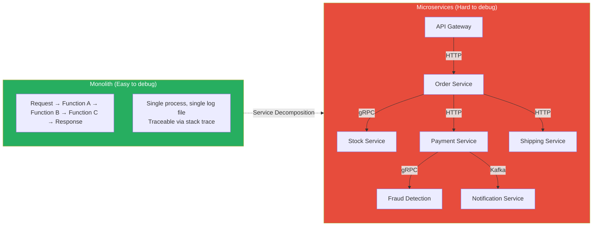
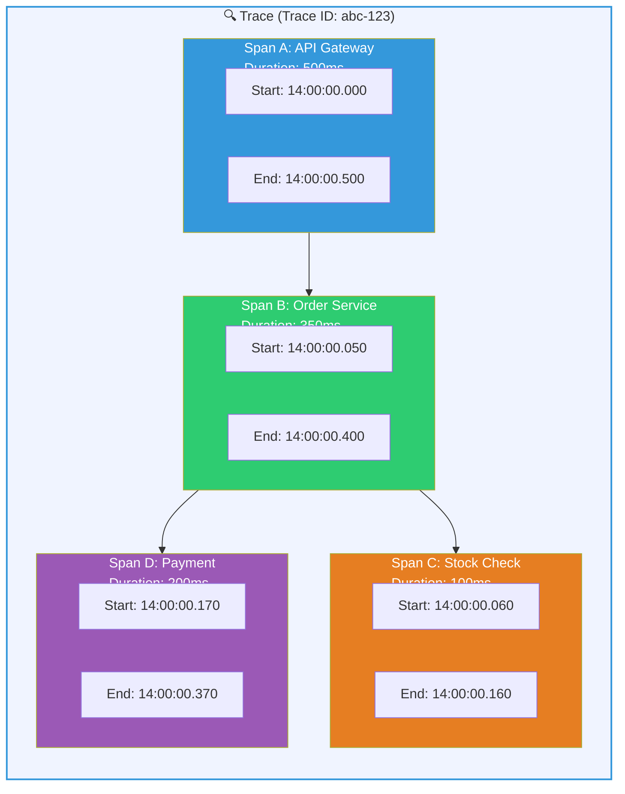
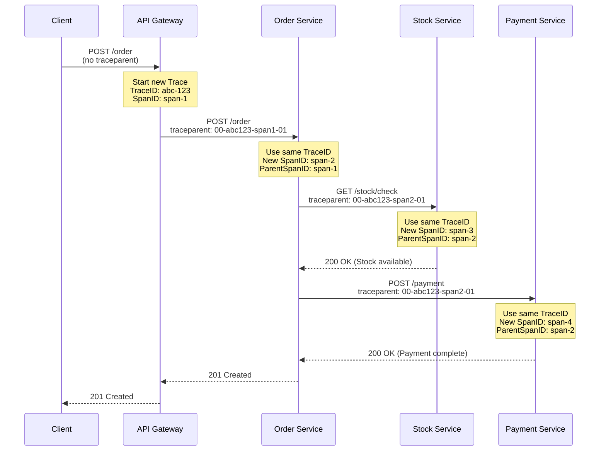
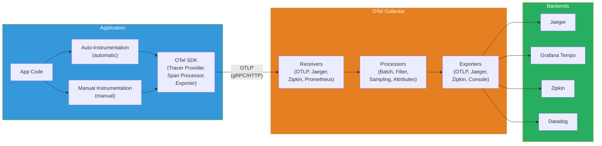
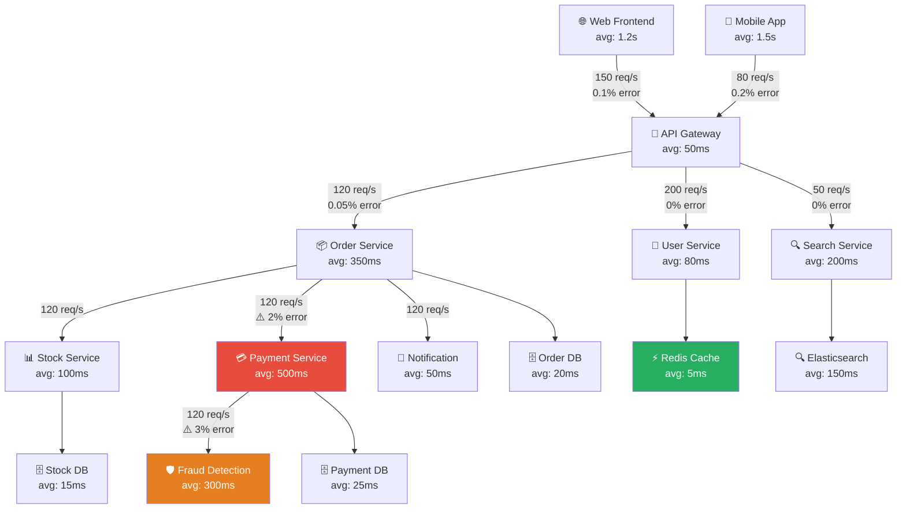
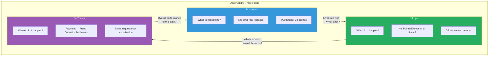

# Distributed Tracing — Following the Journey of Requests

> If logs tell us "what happened", distributed tracing tells us "where it happened, in what order, and how long it took". In the [Logging](./04-logging) lecture, we learned about structured logs, and in [Observability Concepts](./01-concept), we looked at the three pillars: metrics, logs, and traces. Now we'll dive deep into the **third pillar: distributed tracing**. From OpenTelemetry to Jaeger, Zipkin, and Tempo — essential technologies in the microservices era.

---

## 🎯 Why Do You Need to Know About Distributed Tracing?

### Everyday Analogy: Parcel Tracking System

When you shop online, you click "track shipment" and see a screen like this:

```
📦 Order Number: TRACE-ABC-12345

14:00  Seller shipped                      (Order Service)
14:30  Arrived at Seoul logistics center   (Inventory Service)
15:00  Left Seoul logistics center         (Shipping Service)
16:30  Arrived at Busan hub               (Routing Service)
17:00  Left Busan hub                     (Shipping Service)
18:30  Delivery person assigned           (Assignment Service)
19:00  Delivery completed ✅              (Completion Service)
```

Without this tracking system? Nobody could answer "Where is my package?" You'd have to call each logistics center and ask, "Did this package pass through here?"

**Distributed tracing is exactly the software version of this package tracking system.**

### Problems When Distributed Tracing is Absent

```
When distributed tracing becomes necessary in practice:

• "Payment is slow" → Don't know which of 20 services is bottleneck    → Trace identifies bottleneck instantly
• "Intermittent 500 errors" → Can't trace flow with logs alone        → Trace identifies failure point and cause
• "Why does this API take 3 seconds?" → Don't understand inter-service calls → Span timing shows delay analysis
• "What's the blast radius of this outage?" → Can't understand service dependencies → Service Dependency Map shows it
• "Which request generated this log?" → Can't connect logs            → Trace-Log Correlation links them
• "I want to optimize microservice performance" → Can't see full flow → End-to-End Latency analysis
```

### Monolith vs Microservices Debugging



In a monolith, you could see the entire flow with one stack trace. But in microservices, requests **cross multiple services**. Each service only has its own logs, so to see the complete journey of one request, **distributed tracing is essential**.

---

## 🧠 Grasping Core Concepts

To understand distributed tracing, you need to grasp five key components.

### Analogy: Parcel Tracking System

| Parcel World | Distributed Tracing |
|-------------|-------------------|
| Waybill number (tracking number) | **Trace ID** (identifies entire request) |
| Tracking record for each segment | **Span** (unit of work within a service) |
| QR code scan per segment | **Span ID** (identifies each Span) |
| Path connection "Seoul→Busan" | **Parent Span ID** (parent-child relationship between Spans) |
| Notes on waybill (Handle with Care) | **Span Context** (metadata propagated between services) |
| Package sorting center | **Collector** (collects/processes trace data) |
| Package tracking app | **Tracing Backend** (Jaeger, Zipkin, Tempo) |

### Trace, Span, SpanContext Relationship



### Key Terminology

| Term | Description | Analogy |
|------|-------------|---------|
| **Trace** | Entire journey of one request through the system | Complete shipping path of one package |
| **Span** | One unit of work within a Trace (service call, DB query, etc.) | Package's stay at each logistics center |
| **Root Span** | First Span that starts the Trace | When seller first ships the package |
| **Child Span** | Span initiated by another Span | Classification work inside a logistics center |
| **Span Context** | Metadata propagated between services (Trace ID + Span ID + flags) | Waybill info passed to next center |
| **Baggage** | Custom key-value pairs propagated with Span | "Handle with Care" notes on waybill |
| **Span Attributes** | Key-value metadata attached to Span | Detailed processing record for each segment |
| **Span Events** | Events that occur during Span execution (log points) | "Package damage discovered" notes |
| **Span Status** | Span result (OK, ERROR, UNSET) | Success/failure of segment processing |

---

## 🔍 Understanding Each Component in Detail

### 1. Trace and Span Structure

#### Internal Structure of a Span

One Span contains the following information:

```json
{
  "traceId": "5b8aa5a2d2c872e8321cf37308d69df2",
  "spanId": "051581bf3cb55c13",
  "parentSpanId": "ab1f2c3d4e5f6789",
  "operationName": "POST /api/orders",
  "serviceName": "order-service",
  "startTime": "2026-03-13T14:00:00.050Z",
  "duration": "350ms",
  "status": "OK",
  "attributes": {
    "http.method": "POST",
    "http.url": "/api/orders",
    "http.status_code": 201,
    "user.id": "user-42",
    "order.id": "ord-9876"
  },
  "events": [
    {
      "name": "Stock check completed",
      "timestamp": "2026-03-13T14:00:00.160Z",
      "attributes": { "inventory.available": true }
    },
    {
      "name": "Payment request",
      "timestamp": "2026-03-13T14:00:00.170Z",
      "attributes": { "payment.method": "card" }
    }
  ],
  "links": [],
  "spanKind": "SERVER"
}
```

#### Span Kind Types

| Kind | Description | Example |
|------|-------------|---------|
| `CLIENT` | Side that calls another service | HTTP client, gRPC client |
| `SERVER` | Side that receives the call | HTTP server handler |
| `PRODUCER` | Side that sends messages | Kafka producer |
| `CONSUMER` | Side that receives messages | Kafka consumer |
| `INTERNAL` | Internal service work | Business logic, DB query |

---

### 2. W3C Trace Context — Standard Propagation Method

How do we propagate Trace information between microservices? There's a **W3C Trace Context** standard that uses HTTP headers.

#### Propagation Headers

```
# traceparent header (required)
traceparent: 00-5b8aa5a2d2c872e8321cf37308d69df2-051581bf3cb55c13-01

# Format: version-traceId-parentSpanId-traceFlags
# 00      = Version
# 5b8a... = Trace ID (32-char hex, 16 bytes)
# 0515... = Parent Span ID (16-char hex, 8 bytes)
# 01      = Trace Flags (01 = sampled)

# tracestate header (optional)
tracestate: congo=t61rcWkgMzE,rojo=00f067aa0ba902b7
# Vendor-specific info (multi-tracing system compatibility)
```

#### Propagation Flow



The key is: **Trace ID remains the same throughout the entire request**, and **each service generates a new Span ID**. This allows us to reconstruct the entire request's journey later using just the Trace ID.

#### Propagation Method Comparison

| Method | Headers | Features |
|--------|---------|----------|
| **W3C Trace Context** | `traceparent`, `tracestate` | Standard, recommended |
| **B3 (Zipkin)** | `X-B3-TraceId`, `X-B3-SpanId`, etc. | Zipkin native |
| **B3 Single** | `b3` | Single-header B3 version |
| **Jaeger** | `uber-trace-id` | Jaeger native (legacy) |
| **AWS X-Ray** | `X-Amzn-Trace-Id` | AWS-only |

> The current industry standard is **W3C Trace Context**. OpenTelemetry uses W3C as its default propagation method. Choose W3C for new projects.

---

### 3. OpenTelemetry — Unified Standard for Observability

#### What is OpenTelemetry?

OpenTelemetry (shortened to OTel) is an **open-source standard framework for collecting Trace, Metric, and Log data**. It's a CNCF project and one of the most active projects after Kubernetes.

Previously, different vendors had different SDKs: Jaeger client, Zipkin client, Datadog client. OpenTelemetry unified all of these.

```
Before OpenTelemetry:
  App code → Jaeger SDK → Jaeger
  App code → Zipkin SDK → Zipkin
  App code → Datadog SDK → Datadog
  (Vendor lock-in! Must rewrite code to change)

After OpenTelemetry:
  App code → OTel SDK → OTel Collector → Jaeger / Zipkin / Tempo / Datadog
  (Vendor independent! Just change Collector config)
```

#### OpenTelemetry Components



#### OTel SDK Core Configuration

```python
# Python OpenTelemetry SDK initialization example
from opentelemetry import trace
from opentelemetry.sdk.trace import TracerProvider
from opentelemetry.sdk.trace.export import BatchSpanProcessor
from opentelemetry.exporter.otlp.proto.grpc.trace_exporter import OTLPSpanExporter
from opentelemetry.sdk.resources import Resource

# 1. Resource: Define what this service is
resource = Resource.create({
    "service.name": "order-service",        # Service name (required!)
    "service.version": "1.2.0",             # Service version
    "deployment.environment": "production",  # Environment
})

# 2. Exporter: Configure where to send traces
exporter = OTLPSpanExporter(
    endpoint="http://otel-collector:4317",  # Collector address (gRPC)
    insecure=True,
)

# 3. SpanProcessor: Configure how to process
processor = BatchSpanProcessor(
    exporter,
    max_queue_size=2048,          # Max queue size
    max_export_batch_size=512,    # Max Spans per batch
    schedule_delay_millis=5000,   # Export every 5 seconds
)

# 4. TracerProvider: Combine everything
provider = TracerProvider(resource=resource)
provider.add_span_processor(processor)
trace.set_tracer_provider(provider)

# 5. Use Tracer
tracer = trace.get_tracer("order-service", "1.2.0")
```

#### OTLP (OpenTelemetry Protocol)

OTLP is OTel's native protocol. It supports two transmission methods:

| Method | Port | Features |
|--------|------|----------|
| **gRPC** | `4317` | High performance, binary, streaming support |
| **HTTP/protobuf** | `4318` | Firewall-friendly, broader compatibility |

---

### 4. OTel Collector — Central Hub for Trace Data

OTel Collector is an intermediate agent that **receives, processes, and forwards** telemetry data. Instead of sending directly to a backend, using a Collector has many benefits.

```yaml
# otel-collector-config.yaml
receivers:
  # OTLP receiver: receive data from SDK
  otlp:
    protocols:
      grpc:
        endpoint: "0.0.0.0:4317"    # gRPC receive port
      http:
        endpoint: "0.0.0.0:4318"    # HTTP receive port

  # Can also receive Jaeger format (useful for migration)
  jaeger:
    protocols:
      thrift_http:
        endpoint: "0.0.0.0:14268"

processors:
  # Batch processing: Accumulate data for efficient transmission
  batch:
    timeout: 5s                     # Send every 5 seconds
    send_batch_size: 1024           # Send when 1024 items gathered

  # Memory limiter: Prevent Collector OOM
  memory_limiter:
    check_interval: 1s
    limit_mib: 512                  # Max 512MB
    spike_limit_mib: 128

  # Filter unnecessary attributes
  attributes:
    actions:
      - key: "http.user_agent"
        action: delete              # Remove unnecessary attribute
      - key: "environment"
        value: "production"
        action: upsert              # Add/update attribute

  # Tail Sampling: Keep only important traces
  tail_sampling:
    decision_wait: 10s              # Wait 10 seconds for all Spans
    policies:
      - name: error-policy
        type: status_code
        status_code: { status_codes: [ERROR] }  # Keep 100% of error traces
      - name: slow-policy
        type: latency
        latency: { threshold_ms: 2000 }         # Keep 100% of slow requests (>2s)
      - name: default-policy
        type: probabilistic
        probabilistic: { sampling_percentage: 10 } # Sample 10% of rest

exporters:
  # Export to Jaeger
  otlp/jaeger:
    endpoint: "jaeger-collector:4317"
    tls:
      insecure: true

  # Export to Grafana Tempo
  otlp/tempo:
    endpoint: "tempo:4317"
    tls:
      insecure: true

  # Debug: Console output
  debug:
    verbosity: detailed

service:
  pipelines:
    traces:
      receivers: [otlp, jaeger]
      processors: [memory_limiter, batch, tail_sampling]
      exporters: [otlp/jaeger, otlp/tempo]
```

#### Collector Deployment Patterns

| Pattern | Description | Suitable For |
|---------|-------------|---------------|
| **Agent** (sidecar/DaemonSet) | One per node/Pod | K8s DaemonSet, local buffering |
| **Gateway** (centralized) | One Collector pool per cluster | Central processing, tail sampling |
| **Agent + Gateway** (2-tier) | Agent collects → Gateway processes | Large scale, recommended |

```
Agent pattern:           [App] → [Agent Collector] → [Backend]
Gateway pattern:         [App] → [Gateway Collector] → [Backend]
Agent + Gateway:         [App] → [Agent] → [Gateway] → [Backend]
                                 ↑             ↑
                           Local buffering  Sampling/Processing/Routing
```

---

### 5. Auto-Instrumentation vs Manual Instrumentation

#### Auto-Instrumentation — Tracing Without Code Changes

Auto-instrumentation adds tracing **without modifying application code**. It automatically generates Spans at the library/framework level.

```bash
# Python auto-instrumentation install
pip install opentelemetry-distro opentelemetry-exporter-otlp
opentelemetry-bootstrap -a install  # Auto-install instrumentation for detected libraries

# Run without code changes (agent auto-generates Spans)
opentelemetry-instrument \
  --service_name order-service \
  --exporter_otlp_endpoint http://otel-collector:4317 \
  --exporter_otlp_protocol grpc \
  python app.py
```

```bash
# Java auto-instrumentation (most mature agent)
java -javaagent:opentelemetry-javaagent.jar \
  -Dotel.service.name=order-service \
  -Dotel.exporter.otlp.endpoint=http://otel-collector:4317 \
  -jar app.jar
```

```bash
# Node.js auto-instrumentation
npm install @opentelemetry/auto-instrumentations-node
node --require @opentelemetry/auto-instrumentations-node/register app.js

# Configure via environment variables
export OTEL_SERVICE_NAME=order-service
export OTEL_EXPORTER_OTLP_ENDPOINT=http://otel-collector:4317
```

What auto-instrumentation automatically captures:

| Area | Examples |
|------|----------|
| HTTP server/client | Express, Flask, Spring, FastAPI request/response |
| Database | PostgreSQL, MySQL, MongoDB, Redis queries |
| Message queue | Kafka, RabbitMQ, SQS messages |
| gRPC | gRPC client/server calls |
| External HTTP calls | requests, axios, HttpClient calls |

#### Manual Instrumentation — Tracing Business Logic

Auto-instrumentation captures infrastructure-level calls, but **business logic** requires manual instrumentation.

```python
from opentelemetry import trace

tracer = trace.get_tracer("order-service")

# === Create manual Spans ===

# Method 1: Use with statement like decorator (recommended)
def create_order(user_id: str, items: list):
    with tracer.start_as_current_span(
        "create_order",
        attributes={
            "user.id": user_id,
            "order.item_count": len(items),
        }
    ) as span:
        # Business logic
        order = validate_order(items)

        # Add event to Span (log point)
        span.add_event("Order validation complete", {
            "validated_items": len(items),
        })

        # Check stock (child Span auto-created)
        with tracer.start_as_current_span("check_inventory") as inv_span:
            available = check_stock(items)
            inv_span.set_attribute("inventory.all_available", available)

            if not available:
                span.set_status(trace.StatusCode.ERROR, "Insufficient stock")
                span.record_exception(InsufficientStockError("Insufficient stock"))
                raise InsufficientStockError("Insufficient stock")

        # Process payment
        with tracer.start_as_current_span("process_payment") as pay_span:
            payment = process_payment(user_id, calculate_total(items))
            pay_span.set_attribute("payment.id", payment.id)
            pay_span.set_attribute("payment.amount", payment.amount)

        span.set_attribute("order.id", order.id)
        return order
```

```go
// Go manual instrumentation example
package main

import (
    "context"
    "go.opentelemetry.io/otel"
    "go.opentelemetry.io/otel/attribute"
    "go.opentelemetry.io/otel/codes"
)

var tracer = otel.Tracer("order-service")

func CreateOrder(ctx context.Context, userID string, items []Item) (*Order, error) {
    // Start new Span (auto-connected from parent context)
    ctx, span := tracer.Start(ctx, "CreateOrder",
        trace.WithAttributes(
            attribute.String("user.id", userID),
            attribute.Int("order.item_count", len(items)),
        ),
    )
    defer span.End() // End Span when function exits

    // Check inventory (child Span)
    available, err := CheckInventory(ctx, items) // Pass ctx — this is key!
    if err != nil {
        span.RecordError(err)
        span.SetStatus(codes.Error, "Inventory check failed")
        return nil, err
    }

    // Process payment (child Span)
    payment, err := ProcessPayment(ctx, userID, total)
    if err != nil {
        span.RecordError(err)
        span.SetStatus(codes.Error, "Payment failed")
        return nil, err
    }

    span.SetAttributes(attribute.String("order.id", order.ID))
    return order, nil
}
```

#### Auto vs Manual Comparison

| Aspect | Auto | Manual |
|--------|------|--------|
| Code changes | None | Required |
| Config difficulty | Easy | Medium~Hard |
| Coverage | Infrastructure layer (HTTP, DB, MQ) | Up to business logic |
| Detail level | Basic | Very detailed |
| Recommended approach | **Use both together** | Fill gaps left by auto |

> Real-world tip: **Start with auto-instrumentation**, then add **manual instrumentation** for critical business logic. Doing everything manually makes code cluttered with instrumentation.

---

### 6. Tracing Backend Comparison

#### Jaeger

Built by Uber and donated to CNCF. The oldest and most feature-rich distributed tracing system.

```
Jaeger architecture:

[App + OTel SDK]
      │
      ▼ (OTLP / Jaeger Thrift)
[Jaeger Collector]              ← Receive and process data
      │
      ▼
[Storage Backend]               ← Elasticsearch, Cassandra, Kafka
      │
      ▼
[Jaeger Query]                  ← API server
      │
      ▼
[Jaeger UI]                     ← Web UI (search/visualize traces)
```

Jaeger's core features:
- Trace search (service, operation, tag, time range)
- Trace details view (waterfall view)
- Service dependency map (DAG)
- Service-to-service comparison analysis
- Span log and tag search

#### Zipkin

Built by Twitter. Lighter and simpler than Jaeger.

```
Zipkin architecture (simpler):

[App + OTel SDK]
      │
      ▼ (OTLP / Zipkin JSON)
[Zipkin Server]                 ← Collector + Query + UI all-in-one
      │
      ▼
[Storage]                       ← In-memory, MySQL, Cassandra, Elasticsearch
```

#### Grafana Tempo

Built by Grafana Labs. **Object storage-based** trace backend. **No indexing needed** — that's the key.

```
Tempo architecture:

[App + OTel SDK]
      │
      ▼ (OTLP)
[Tempo Distributor]             ← Receive data
      │
      ▼
[Tempo Ingester]                ← Temporary storage (WAL)
      │
      ▼
[Object Storage]                ← S3, GCS, Azure Blob (cheap!)
      │
      ▼
[Tempo Querier]                 ← Query by Trace ID
      │
      ▼
[Grafana]                       ← Visualization (Tempo datasource)
```

#### Backend Comparison Table

| Item | Jaeger | Zipkin | Grafana Tempo |
|------|--------|--------|---------------|
| **Developer** | Uber → CNCF | Twitter | Grafana Labs |
| **Storage** | ES, Cassandra, Kafka | ES, Cassandra, MySQL | S3, GCS (object storage) |
| **Indexing** | Required (ES/Cassandra) | Required (ES/Cassandra) | **Not needed** (Trace ID only) |
| **Operation Cost** | Medium~High | Medium | **Low** (object storage) |
| **Search** | Tag/service/time | Tag/service/time | Direct Trace ID or TraceQL |
| **UI** | Self-hosted | Self-hosted | Grafana (integrated) |
| **Grafana Integration** | Plugin | Plugin | **Native** |
| **Suitable For** | Independent operation, large scale | Small scale, quick start | Grafana stack, cost-conscious |

> **Selection criteria**: Use **Tempo** if already using Grafana, **Jaeger** if you need independent tracing platform, **Zipkin** if you want quick start.

---

### 7. Trace Sampling Strategy

In production, tracing **every request means huge cost and performance hit**. Proper sampling is essential.

#### Head-based Sampling

Decide whether to trace at **request start time**.

```
Decide at request start:
  Request 1 → 🎲 10% chance → ❌ Don't trace
  Request 2 → 🎲 10% chance → ✅ Trace! (trace in all downstream services)
  Request 3 → 🎲 10% chance → ❌ Don't trace
  Request 4 → 🎲 10% chance → ❌ Don't trace

Advantage: Simple, low overhead
Disadvantage: May miss important traces (errors/slow requests in the 90% not traced)
```

```python
# Set Head-based Sampling in OTel SDK
from opentelemetry.sdk.trace.sampling import TraceIdRatioBased

# Sample only 10%
sampler = TraceIdRatioBased(0.1)
provider = TracerProvider(resource=resource, sampler=sampler)
```

#### Tail-based Sampling

Decide **after request completes** by looking at full Trace.

```
Collect all, decide after completion:
  Request 1 (200 OK, 50ms)    → 🤔 Normal  → ❌ Drop
  Request 2 (500 Error)        → 🤔 Error   → ✅ Keep!
  Request 3 (200 OK, 5000ms)  → 🤔 Slow    → ✅ Keep!
  Request 4 (200 OK, 80ms)    → 🤔 Normal  → ❌ Drop

Advantage: Never miss important traces (errors, slow requests)
Disadvantage: Processed in Collector, high memory, complex
```

```yaml
# Configure Tail-based Sampling in OTel Collector
processors:
  tail_sampling:
    decision_wait: 10s    # Wait for all Spans to arrive
    num_traces: 100000    # Max traces to hold in memory
    policies:
      # Policy 1: Always keep traces with errors
      - name: errors
        type: status_code
        status_code:
          status_codes: [ERROR]

      # Policy 2: Keep traces slower than 2 seconds
      - name: slow-requests
        type: latency
        latency:
          threshold_ms: 2000

      # Policy 3: Always keep critical services
      - name: critical-services
        type: string_attribute
        string_attribute:
          key: service.name
          values: [payment-service, auth-service]

      # Policy 4: Sample 5% of the rest
      - name: default
        type: probabilistic
        probabilistic:
          sampling_percentage: 5
```

#### Adaptive Sampling

**Dynamically adjust sampling rate** based on traffic volume.

```
Low traffic (100 req/s): 50% sampling → 50 traces/s
Normal traffic (1000 req/s):  10% sampling → 100 traces/s
High traffic (10000 req/s): 1% sampling → 100 traces/s

→ No matter traffic volume, maintain ~100 traces/s
```

#### Sampling Strategy Comparison

| Strategy | Location | Pros | Cons | When to Use |
|----------|----------|------|------|------------|
| **Head-based** | SDK (in app) | Simple, low overhead | May miss important traces | Low traffic, early stage |
| **Tail-based** | Collector | Preserves important traces | High memory, complex | Production, error tracking important |
| **Adaptive** | SDK or Collector | Predictable cost | Complex | Variable traffic services |
| **Always On** | SDK | 100% tracing | High cost | Dev/staging only |

---

### 8. Trace-Log Correlation — Connecting Traces and Logs

The true power of distributed tracing emerges when **connected to logs**. Include Trace ID in logs, and you can see all logs for one request at once.

#### Including Trace ID in Structured Logs

```python
import logging
from opentelemetry import trace

# Custom log formatter: Auto-include Trace ID
class TraceLogFormatter(logging.Formatter):
    def format(self, record):
        span = trace.get_current_span()
        ctx = span.get_span_context()

        # Add Trace/Span ID to log record
        record.trace_id = format(ctx.trace_id, '032x') if ctx.trace_id else "00000000000000000000000000000000"
        record.span_id = format(ctx.span_id, '016x') if ctx.span_id else "0000000000000000"

        return super().format(record)

# Configure logger
formatter = TraceLogFormatter(
    '{"timestamp": "%(asctime)s", '
    '"level": "%(levelname)s", '
    '"message": "%(message)s", '
    '"trace_id": "%(trace_id)s", '
    '"span_id": "%(span_id)s", '
    '"service": "order-service"}'
)

handler = logging.StreamHandler()
handler.setFormatter(formatter)
logger = logging.getLogger("order-service")
logger.addHandler(handler)
logger.setLevel(logging.INFO)

# Usage example — trace_id and span_id automatically included
def create_order(user_id, items):
    with tracer.start_as_current_span("create_order"):
        logger.info(f"Creating order: user={user_id}, items={len(items)}")
        # Log output:
        # {"timestamp": "2026-03-13 14:00:00", "level": "INFO",
        #  "message": "Creating order: user=42, items=3",
        #  "trace_id": "5b8aa5a2d2c872e8321cf37308d69df2",
        #  "span_id": "051581bf3cb55c13",
        #  "service": "order-service"}
```

#### Trace-Log Connection in Grafana

With Grafana, you can move **Trace → Log** and **Log → Trace** bidirectionally.

```
User flow:
1. Find slow Trace in Tempo (takes 3 seconds)
2. Click bottleneck Span → Click "View Logs"
3. Display all logs with that Trace ID in Loki
4. Discover error log! → Click "View Trace"
5. Return to Trace view and understand context

This bidirectional connection is the key to debugging distributed systems.
```

```yaml
# Grafana datasource config — Tempo ↔ Loki connection
apiVersion: 1
datasources:
  - name: Tempo
    type: tempo
    url: http://tempo:3200
    jsonData:
      tracesToLogs:
        datasourceUid: loki          # Loki datasource UID
        filterByTraceID: true        # Filter logs by Trace ID
        filterBySpanID: true         # Filter logs by Span ID
        mapTagNamesEnabled: true
        mappedTags:
          - key: service.name
            value: service
      nodeGraph:
        enabled: true                # Enable service dependency graph
      serviceMap:
        datasourceUid: prometheus    # Prometheus for service map

  - name: Loki
    type: loki
    url: http://loki:3100
    jsonData:
      derivedFields:
        - datasourceUid: tempo
          matcherRegex: '"trace_id":\s*"([a-f0-9]+)"'   # Extract trace_id from logs
          name: TraceID
          url: '$${__value.raw}'     # Click to open in Tempo
```

---

### 9. Service Dependency Map

By analyzing trace data, we can **automatically visualize service-to-service call relationships**. This is called Service Map or Dependency Map.



What you can understand from Service Map:
- **Service call relationships** (who calls whom?)
- **Call frequency** (how many times per second?)
- **Error rate** (which paths have many errors?)
- **Average response time** (where are bottlenecks?)
- **Blast radius** (if this service dies, what else breaks?)

---

### 10. Latency Analysis

#### Waterfall View

Traces can be visualized as a "waterfall view" where each Span is shown on a time axis indicating **when it started and ended**.

```
                 0ms   100ms   200ms   300ms   400ms   500ms
                  |       |       |       |       |       |
API Gateway       |██████████████████████████████████████████|  500ms
  └─ Order Svc    | |████████████████████████████████████|     350ms
      ├─ Stock    | | |████████████|                            100ms
      ├─ Payment  | |              |██████████████████████|     200ms
      │  └─ Fraud | |              | |████████████████|         150ms
      └─ Notify   | |                                |████|      50ms
                  |       |       |       |       |       |

Analysis results:
- Total request: 500ms
- Biggest bottleneck: Payment (200ms) + Fraud Detection (150ms)
- Stock checked first, then Payment (sequential)
- Notification runs async at end
```

#### P50/P95/P99 Latency

```
Order service latency distribution (last 1 hour):

P50 (median):     120ms  ← Half of requests complete within this
P90:              350ms  ← 90% of requests complete within this
P95:              800ms  ← 95% of requests complete within this
P99:             2500ms  ← 99% of requests complete within this ⚠️
P99.9:           5000ms  ← 99.9% of requests complete within this 🚨

→ P50 is okay but P99 is 2.5 seconds?
→ Means some requests experience extreme delays!
→ Must capture these slow requests with Tail-based Sampling.
```

---

## 💻 Try It Yourself

### Lab 1: Build Full Tracing Stack with Docker Compose

```yaml
# docker-compose.yaml — OTel + Jaeger + Tempo + Grafana
version: '3.9'

services:
  # ===== OpenTelemetry Collector =====
  otel-collector:
    image: otel/opentelemetry-collector-contrib:0.96.0
    container_name: otel-collector
    command: ["--config=/etc/otel-collector-config.yaml"]
    volumes:
      - ./otel-collector-config.yaml:/etc/otel-collector-config.yaml
    ports:
      - "4317:4317"     # OTLP gRPC
      - "4318:4318"     # OTLP HTTP
      - "8888:8888"     # Collector own metrics
      - "8889:8889"     # Prometheus exporter
    depends_on:
      - jaeger
      - tempo

  # ===== Jaeger (All-in-One) =====
  jaeger:
    image: jaegertracing/all-in-one:1.54
    container_name: jaeger
    environment:
      - COLLECTOR_OTLP_ENABLED=true
    ports:
      - "16686:16686"   # Jaeger UI
      - "14268:14268"   # Jaeger HTTP Thrift
      - "14250:14250"   # Jaeger gRPC model

  # ===== Grafana Tempo =====
  tempo:
    image: grafana/tempo:2.4.0
    container_name: tempo
    command: ["-config.file=/etc/tempo.yaml"]
    volumes:
      - ./tempo-config.yaml:/etc/tempo.yaml
      - tempo-data:/var/tempo
    ports:
      - "3200:3200"     # Tempo HTTP
      - "9095:9095"     # Tempo gRPC

  # ===== Grafana =====
  grafana:
    image: grafana/grafana:10.3.3
    container_name: grafana
    environment:
      - GF_SECURITY_ADMIN_PASSWORD=admin
      - GF_AUTH_ANONYMOUS_ENABLED=true
      - GF_AUTH_ANONYMOUS_ORG_ROLE=Admin
    ports:
      - "3000:3000"
    volumes:
      - ./grafana-datasources.yaml:/etc/grafana/provisioning/datasources/datasources.yaml
    depends_on:
      - tempo
      - jaeger

volumes:
  tempo-data:
```

```yaml
# otel-collector-config.yaml
receivers:
  otlp:
    protocols:
      grpc:
        endpoint: "0.0.0.0:4317"
      http:
        endpoint: "0.0.0.0:4318"

processors:
  batch:
    timeout: 5s
    send_batch_size: 1024

  memory_limiter:
    check_interval: 1s
    limit_mib: 256

exporters:
  otlp/jaeger:
    endpoint: "jaeger:4317"
    tls:
      insecure: true

  otlp/tempo:
    endpoint: "tempo:4317"
    tls:
      insecure: true

  debug:
    verbosity: basic

service:
  pipelines:
    traces:
      receivers: [otlp]
      processors: [memory_limiter, batch]
      exporters: [otlp/jaeger, otlp/tempo, debug]
```

```yaml
# tempo-config.yaml
server:
  http_listen_port: 3200

distributor:
  receivers:
    otlp:
      protocols:
        grpc:
          endpoint: "0.0.0.0:4317"

storage:
  trace:
    backend: local
    local:
      path: /var/tempo/blocks
    wal:
      path: /var/tempo/wal

metrics_generator:
  registry:
    external_labels:
      source: tempo
  storage:
    path: /var/tempo/generator/wal
```

```yaml
# grafana-datasources.yaml
apiVersion: 1
datasources:
  - name: Jaeger
    type: jaeger
    url: http://jaeger:16686
    access: proxy
    isDefault: false

  - name: Tempo
    type: tempo
    url: http://tempo:3200
    access: proxy
    isDefault: true
    jsonData:
      nodeGraph:
        enabled: true
```

```bash
# Run
docker-compose up -d

# Check
# Jaeger UI:  http://localhost:16686
# Grafana:    http://localhost:3000  (admin/admin)
# Collector:  http://localhost:8888/metrics
```

### Lab 2: Apply Tracing to Python Flask App

```python
# app.py — Order service example
import time
import random
import logging
from flask import Flask, jsonify, request

from opentelemetry import trace
from opentelemetry.sdk.trace import TracerProvider
from opentelemetry.sdk.trace.export import BatchSpanProcessor
from opentelemetry.exporter.otlp.proto.grpc.trace_exporter import OTLPSpanExporter
from opentelemetry.sdk.resources import Resource
from opentelemetry.instrumentation.flask import FlaskInstrumentor
from opentelemetry.instrumentation.requests import RequestsInstrumentor

# ===== 1. Initialize OpenTelemetry =====
resource = Resource.create({
    "service.name": "order-service",
    "service.version": "1.0.0",
    "deployment.environment": "development",
})

provider = TracerProvider(resource=resource)
provider.add_span_processor(
    BatchSpanProcessor(
        OTLPSpanExporter(endpoint="http://localhost:4317", insecure=True)
    )
)
trace.set_tracer_provider(provider)
tracer = trace.get_tracer("order-service")

# ===== 2. Create Flask app and auto-instrument =====
app = Flask(__name__)
FlaskInstrumentor().instrument_app(app)       # Auto-instrument Flask
RequestsInstrumentor().instrument()            # Auto-instrument HTTP client

# ===== 3. Include Trace ID in logs =====
class TraceFormatter(logging.Formatter):
    def format(self, record):
        span = trace.get_current_span()
        ctx = span.get_span_context()
        record.trace_id = format(ctx.trace_id, '032x') if ctx.trace_id else "-"
        record.span_id = format(ctx.span_id, '016x') if ctx.span_id else "-"
        return super().format(record)

handler = logging.StreamHandler()
handler.setFormatter(TraceFormatter(
    '[%(asctime)s] %(levelname)s [trace=%(trace_id)s span=%(span_id)s] %(message)s'
))
logger = logging.getLogger("order")
logger.addHandler(handler)
logger.setLevel(logging.INFO)

# ===== 4. API endpoints =====
@app.route('/api/orders', methods=['POST'])
def create_order():
    """Create order API — trace business logic with manual Spans"""
    user_id = request.json.get("user_id", "anonymous")

    logger.info(f"Order request received: user={user_id}")

    # Check inventory (manual Span)
    with tracer.start_as_current_span("check_inventory",
        attributes={"user.id": user_id}
    ) as span:
        time.sleep(random.uniform(0.05, 0.15))  # Simulate DB lookup
        available = random.random() > 0.1        # 90% chance in stock
        span.set_attribute("inventory.available", available)

        if not available:
            span.set_status(trace.StatusCode.ERROR, "Insufficient stock")
            logger.warning(f"Out of stock: user={user_id}")
            return jsonify({"error": "Out of stock"}), 409

    # Process payment (manual Span)
    with tracer.start_as_current_span("process_payment",
        attributes={"user.id": user_id, "payment.method": "card"}
    ) as span:
        time.sleep(random.uniform(0.1, 0.5))     # Simulate payment
        success = random.random() > 0.05          # 95% success rate
        span.set_attribute("payment.success", success)

        if not success:
            span.set_status(trace.StatusCode.ERROR, "Payment failed")
            logger.error(f"Payment failure: user={user_id}")
            return jsonify({"error": "Payment failed"}), 402

    # Save order (manual Span)
    with tracer.start_as_current_span("save_order") as span:
        order_id = f"ORD-{random.randint(10000, 99999)}"
        time.sleep(random.uniform(0.01, 0.05))    # Simulate DB save
        span.set_attribute("order.id", order_id)
        logger.info(f"Order created: order={order_id}, user={user_id}")

    return jsonify({"order_id": order_id, "status": "created"}), 201

@app.route('/api/orders/<order_id>', methods=['GET'])
def get_order(order_id):
    """Get order API"""
    with tracer.start_as_current_span("fetch_order",
        attributes={"order.id": order_id}
    ):
        time.sleep(random.uniform(0.01, 0.05))
        return jsonify({"order_id": order_id, "status": "completed"})

@app.route('/health')
def health():
    return jsonify({"status": "ok"})

if __name__ == '__main__':
    app.run(host='0.0.0.0', port=8080, debug=False)
```

```bash
# Install dependencies
pip install flask \
  opentelemetry-api \
  opentelemetry-sdk \
  opentelemetry-exporter-otlp-proto-grpc \
  opentelemetry-instrumentation-flask \
  opentelemetry-instrumentation-requests

# Run app
python app.py

# Send test request
curl -X POST http://localhost:8080/api/orders \
  -H "Content-Type: application/json" \
  -d '{"user_id": "user-42", "items": ["item-1", "item-2"]}'

# Send multiple requests (generate trace data)
for i in $(seq 1 20); do
  curl -s -X POST http://localhost:8080/api/orders \
    -H "Content-Type: application/json" \
    -d "{\"user_id\": \"user-$i\"}" &
done
wait

# Check Jaeger UI: http://localhost:16686
# → Select Service: order-service → Find Traces
```

### Lab 3: Auto-Instrumentation in Kubernetes (Operator Method)

```yaml
# otel-operator-install.yaml
# 1. Install cert-manager (Operator prerequisite)
# kubectl apply -f https://github.com/cert-manager/cert-manager/releases/download/v1.14.4/cert-manager.yaml

# 2. Install OTel Operator
# kubectl apply -f https://github.com/open-telemetry/opentelemetry-operator/releases/latest/download/opentelemetry-operator.yaml
---
# 3. Deploy Collector (DaemonSet pattern)
apiVersion: opentelemetry.io/v1beta1
kind: OpenTelemetryCollector
metadata:
  name: otel-collector
  namespace: observability
spec:
  mode: daemonset     # One per node
  config:
    receivers:
      otlp:
        protocols:
          grpc:
            endpoint: "0.0.0.0:4317"
          http:
            endpoint: "0.0.0.0:4318"
    processors:
      batch:
        timeout: 5s
      memory_limiter:
        check_interval: 1s
        limit_mib: 256
    exporters:
      otlp:
        endpoint: "tempo.observability.svc:4317"
        tls:
          insecure: true
    service:
      pipelines:
        traces:
          receivers: [otlp]
          processors: [memory_limiter, batch]
          exporters: [otlp]
---
# 4. Configure auto-instrumentation (Python app)
apiVersion: opentelemetry.io/v1alpha1
kind: Instrumentation
metadata:
  name: python-instrumentation
  namespace: default
spec:
  exporter:
    endpoint: http://otel-collector-collector.observability.svc:4317
  propagators:
    - tracecontext        # W3C Trace Context
    - baggage             # W3C Baggage
  python:
    env:
      - name: OTEL_PYTHON_LOG_CORRELATION
        value: "true"     # Auto-include Trace ID in logs
---
# 5. Add annotation to app Deployment — that's it!
apiVersion: apps/v1
kind: Deployment
metadata:
  name: order-service
  namespace: default
spec:
  replicas: 3
  selector:
    matchLabels:
      app: order-service
  template:
    metadata:
      labels:
        app: order-service
      annotations:
        # Just one line to enable auto-instrumentation!
        instrumentation.opentelemetry.io/inject-python: "true"
    spec:
      containers:
        - name: order-service
          image: order-service:1.0.0
          ports:
            - containerPort: 8080
          env:
            - name: OTEL_SERVICE_NAME
              value: "order-service"
```

```bash
# Verify auto-instrumentation applied
kubectl get pods -o jsonpath='{.items[*].spec.initContainers[*].name}'
# Output: opentelemetry-auto-instrumentation  ← init container auto-injected

# Check Pod environment variables
kubectl exec order-service-xxx -- env | grep OTEL
# OTEL_SERVICE_NAME=order-service
# OTEL_EXPORTER_OTLP_ENDPOINT=http://otel-collector-collector.observability.svc:4317
# OTEL_TRACES_EXPORTER=otlp
# OTEL_PYTHON_LOG_CORRELATION=true
```

### Lab 4: Search Traces with TraceQL (Grafana Tempo)

```
# TraceQL — Tempo's trace query language

# 1. Find error traces for specific service
{ resource.service.name = "order-service" && status = error }

# 2. Find Spans slower than 2 seconds
{ duration > 2s }

# 3. Find 500 errors on specific HTTP path
{ span.http.url = "/api/orders" && span.http.status_code = 500 }

# 4. Find slow requests on payment service
{ resource.service.name = "payment-service" && duration > 1s }

# 5. Find traces for specific user
{ span.user.id = "user-42" }

# 6. Find traces that went through both services (pipeline)
{ resource.service.name = "order-service" } >> { resource.service.name = "payment-service" }

# 7. Find payment failures followed by retry
{ resource.service.name = "payment-service" && status = error } >>
{ resource.service.name = "payment-service" && status = ok }
```

---

## 🏢 In Real-World Scenarios

### Scenario 1: "Payment is Intermittently Slow"

```
🚨 Situation:
  - 10% of users report "takes 5+ seconds to pay"
  - Server metrics (CPU, memory) are normal
  - No errors in logs

🔍 Debug with Distributed Tracing:

Step 1: Search slow traces in Tempo
  → TraceQL: { resource.service.name = "payment-service" && duration > 3s }
  → Found 10 slow requests

Step 2: Analyze waterfall view
  → API Gateway: 5ms (normal)
  → Order Service: 10ms (normal)
  → Payment Service: 4800ms ← Here!
    └→ Fraud Detection API: 4700ms ← Culprit!

Step 3: Detailed analysis of Fraud Detection Span
  → span.attributes:
    - fraud.model_version: "v2.3"
    - fraud.score_calculation_time: 4500ms
    - fraud.fallback_used: true
  → Recent model update caused timeouts in some cases → fallback logic is slow

Step 4: Fix
  → Rollback Fraud Detection model + adjust fallback timeout
  → P99 response time: 5000ms → 500ms (10x improvement!)
```

### Scenario 2: Understand Outage Blast Radius

```
🚨 Situation:
  - Stock Service down due to DB connection pool exhaustion
  - "How far does this outage reach?"

🔍 Analyze Service Dependency Map:
  1. Check Stock Service node in Grafana Service Map
  2. Identify upstream services calling Stock:
     - Order Service → Stock Service (direct impact)
     - API Gateway → Order Service (cascading impact)
     - Web Frontend → API Gateway (end-user impact)
  3. Identify services NOT calling Stock:
     - User Service ← No impact
     - Search Service ← No impact

📊 Conclusion:
  - Impact: Order creation feature completely broken
  - Not impacted: User profiles, search working fine
  - Mitigation: Deploy Circuit Breaker pattern to isolate Stock Service failure
```

### Scenario 3: Distributed Tracing Rollout Roadmap

```
Phase 1 (1-2 weeks): Foundation
  ├── Deploy OTel Collector (DaemonSet)
  ├── Set up Tempo + Grafana
  └── Apply auto-instrumentation to 1-2 critical services

Phase 2 (3-4 weeks): Expand
  ├── Apply auto-instrumentation to all services (OTel Operator)
  ├── Set up Trace-Log Correlation
  └── Apply Head-based Sampling (10-20%)

Phase 3 (5-8 weeks): Advanced
  ├── Add manual instrumentation for critical business logic
  ├── Switch to Tail-based Sampling
  ├── Build Service Dependency Map dashboard
  └── Set up alerts based on SLOs (P99 latency)

Phase 4 (Ongoing): Operations Optimization
  ├── Tune sampling ratios
  ├── Establish trace retention policy
  ├── Monitor and optimize costs
  └── Team training and onboarding guides
```

### Real-World Tips Summary

| Item | Recommendation |
|------|-----------------|
| **service.name** | MUST set! Without it, traces show as "unknown" |
| **Environment separation** | Use `deployment.environment` attribute for dev/staging/prod |
| **Sampling** | Dev: 100%, Staging: 50%, Prod: 5-20% (tail-based recommended) |
| **Retention** | 7-14 days (balance cost vs debugging need) |
| **Collector deployment** | ALWAYS use Collector. Direct backend send not recommended |
| **Context propagation** | Use W3C Trace Context, legacy systems use B3 compatible |
| **Async messaging** | MUST set Trace Context propagation for Kafka/RabbitMQ |

---

## ⚠️ Common Mistakes

### Mistake 1: Context Propagation Missing

```python
# ❌ Wrong: Not propagating context
import requests

def call_payment_service(order):
    # No traceparent header! → New Trace created
    response = requests.post("http://payment-service/pay", json=order)
    return response

# ✅ Correct: OTel auto-injects header
from opentelemetry.instrumentation.requests import RequestsInstrumentor
RequestsInstrumentor().instrument()  # This one line auto-propagates!

def call_payment_service(order):
    # traceparent header auto-added
    response = requests.post("http://payment-service/pay", json=order)
    return response
```

```
Symptom: Trace breaks at service boundary (many short traces instead of one)
Cause: HTTP client not auto-instrumented, or custom HTTP call
Fix: Install auto-instrumentation library or manually inject W3C header
```

### Mistake 2: service.name Not Set

```python
# ❌ Wrong: no service.name
resource = Resource.create({})  # Empty resource

# ✅ Correct: service.name REQUIRED
resource = Resource.create({
    "service.name": "order-service",  # Required!
})
```

```
Symptom: All Spans show as "unknown_service"
Cause: Resource missing service.name
Fix: Include service.name in Resource.create()
```

### Mistake 3: Span Not Closed

```python
# ❌ Wrong: Span opened but not closed
span = tracer.start_span("my_operation")
do_work()
# span.end() not called → Memory leak, wrong duration

# ✅ Correct: Use with statement for auto-close
with tracer.start_as_current_span("my_operation") as span:
    do_work()
    # Automatically closed when exiting with block
```

### Mistake 4: Too Many Spans Created

```python
# ❌ Wrong: Create Span per item in loop
def process_items(items):
    for item in items:  # If items has 10,000 items?
        with tracer.start_as_current_span(f"process_{item.id}"):
            process(item)
    # → 10,000 Spans created → Performance hit, cost explosion

# ✅ Correct: Batch-level Span
def process_items(items):
    with tracer.start_as_current_span("process_items_batch",
        attributes={"batch.size": len(items)}
    ):
        for item in items:
            process(item)
```

### Mistake 5: 100% Sampling in Production

```
❌ Wrong: Full sampling in production
→ 10,000 requests/sec × 5 Spans average = 50,000 Spans/sec
→ Per day: 4.3 billion Spans
→ Storage explosion, Collector overload, network consumed

✅ Correct approach:
→ Tail-based Sampling: 100% of errors/slow requests
→ Probabilistic: 5-10% of normal requests
→ Result: 50,000 → ~7,500 Spans/sec (85% reduction)
```

### Mistake 6: Not Including Trace ID in Logs

```
❌ Without Trace ID:
[ERROR] 2026-03-13 14:00:05 Payment timeout
→ "Which request is this from?" → No way to know

✅ With Trace ID:
[ERROR] 2026-03-13 14:00:05 [trace=abc123...] Payment timeout
→ Search by Trace ID abc123 → See entire request flow immediately
→ Know exact user, order, affected by this error
```

---

## 📝 Summary

### Quick Distributed Tracing Overview

| Concept | Key Point |
|---------|-----------|
| **Trace** | Entire journey of one request (identified by Trace ID) |
| **Span** | Unit of work within Trace (start/end time, attributes, events) |
| **SpanContext** | Metadata propagated between services (Trace ID + Span ID) |
| **W3C Trace Context** | Standard propagation protocol (`traceparent` header) |
| **OpenTelemetry** | Unified observability standard (SDK + Collector + OTLP) |
| **OTel Collector** | Central hub for collecting/processing/forwarding telemetry |
| **Auto-instrumentation** | Add tracing without code changes (infrastructure level) |
| **Manual instrumentation** | Add tracing for business logic (complements auto) |
| **Jaeger** | Full-featured tracing backend (CNCF) |
| **Zipkin** | Lightweight, simple tracing backend |
| **Grafana Tempo** | Object storage-based, low-cost tracing |
| **Head Sampling** | Decide at request start (simple, may miss errors) |
| **Tail Sampling** | Decide after request complete (accurate, resource-intensive) |
| **Trace-Log connection** | Include Trace ID in logs → bidirectional exploration |
| **Service Map** | Trace-based service dependency visualization |

### Checklist: Distributed Tracing Implementation

```
Distributed Tracing Implementation Checklist:

[ ] Deploy OTel Collector
[ ] Set service.name for all services
[ ] Apply auto-instrumentation (HTTP, DB, message queue)
[ ] Add manual instrumentation for critical business logic
[ ] Verify W3C Trace Context propagation (cross-service test)
[ ] Set up Trace-Log Correlation (include Trace ID in logs)
[ ] Establish production sampling strategy (Tail-based recommended)
[ ] Select and deploy tracing backend (Jaeger/Tempo/Zipkin)
[ ] Build Service Dependency Map dashboard
[ ] Plan storage capacity and retention policy
[ ] Verify Trace Context propagation for async messaging (Kafka, etc.)
[ ] Team training (how to read traces, debugging workflow)
```

### Observability Three Pillars Relationship



**Metrics** detect anomalies → **Logs** reveal causes → **Traces** show locations. Connect all three to achieve true Observability.

---

## 🔗 Next Steps

### What You Learned in This Lecture

- Trace/Span/SpanContext concepts and structure
- W3C Trace Context standard propagation method
- OpenTelemetry SDK, Collector, OTLP roles
- Auto and manual instrumentation differences and combined usage
- Jaeger, Zipkin, Grafana Tempo characteristics and selection criteria
- Head/Tail/Adaptive sampling strategies
- Trace-Log Correlation and Service Dependency Map

### Next Content

- **[Kubernetes Monitoring](./07-k8s-monitoring)**: Learn monitoring K8s clusters with kube-state-metrics and node-exporter. Combined with tracing from this lecture, you can perfectly observe microservices on K8s.

### Good Topics to Study Further

| Topic | Description |
|-------|-------------|
| **APM (Application Performance Monitoring)** | Using commercial APM like Datadog, New Relic |
| **Continuous Profiling** | CPU/memory profiling with pprof, Pyroscope |
| **eBPF-based Observability** | Kernel-level observation with Pixie, Cilium (no code changes) |
| **OpenTelemetry Metrics** | Collecting metrics with OTel alongside traces |
| **TraceQL Advanced** | Master Grafana Tempo's query language |
| **Service Mesh and Tracing** | Auto-tracing with Istio/Linkerd + OTel integration |
