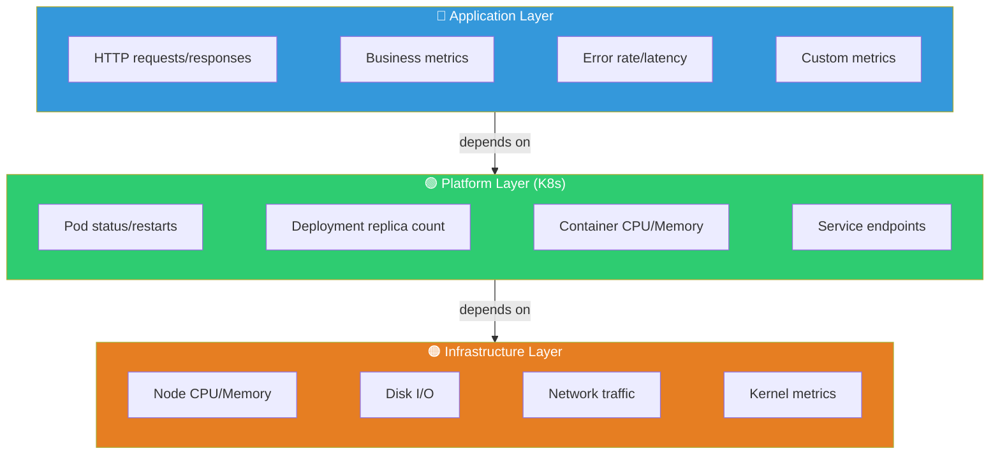
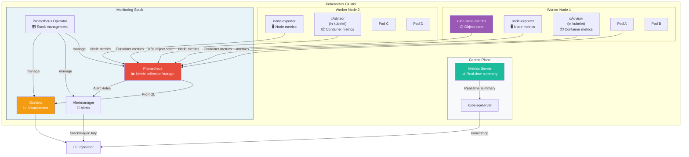
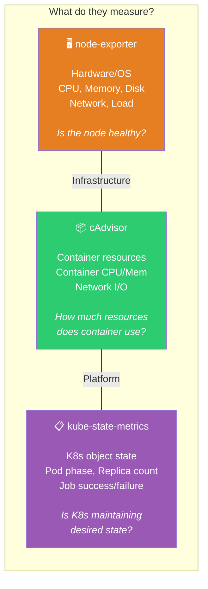
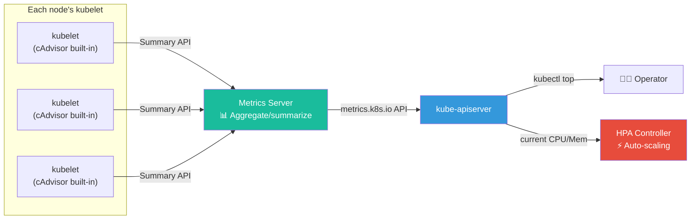
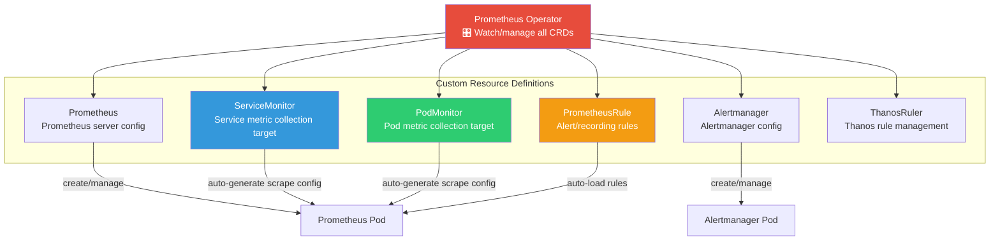

# Complete Kubernetes Monitoring Guide

> Operating a Kubernetes cluster requires answering questions like "Why did the Pod die?", "Is node memory sufficient?", "Why isn't HPA scaling out?" — you need a **K8s-specific monitoring stack**. You learned the basics of metric collection in [Prometheus](./02-prometheus), visualization in [Grafana](./03-grafana), and cluster structure in [K8s Architecture](../04-kubernetes/01-architecture). Now let's combine all of this to **perfectly monitor your K8s cluster**.

---

## 🎯 Why Do You Need to Know About Kubernetes Monitoring?

### Everyday Analogy: Large Shopping Mall Management System

Imagine running a large shopping mall.

- **Building itself** (roof leaks, electrical capacity, HVAC) — this is **infrastructure monitoring**
- **Store operations** (store open/close status, escalators, elevators working) — this is **platform monitoring**
- **Customer experience** (wait times, sales, complaints) — this is **application monitoring**

A mall manager needs to see all three from **one control center** to respond quickly to problems. "Air conditioner broke" (infrastructure), "3rd floor escalator stopped" (platform), "Food court wait time over 30 minutes" (application) — different teams respond to each, but all should be visible on the **same dashboard**.

**Kubernetes monitoring is exactly this control center system.**

```
When K8s monitoring becomes necessary in practice:

• "Pod is CrashLoopBackOff, why?"                  → restart count + OOMKilled metrics
• "Node memory seems low, want to check"           → node-exporter metrics
• "HPA isn't working"                              → Metrics Server status check
• "How much CPU is container using?"               → cAdvisor metrics
• "Is Deployment maintaining desired replicas?"    → kube-state-metrics
• "Want to see cluster-wide resource usage"        → Grafana K8s dashboard
• "Don't know how to set request/limit"            → Tune based on actual usage metrics
```

### VM Monitoring vs K8s Monitoring

```
Traditional VM monitoring:
┌─────────────┐    ┌─────────────┐    ┌─────────────┐
│  Server A   │    │  Server B   │    │  Server C   │
│  - CPU      │    │  - CPU      │    │  - CPU      │
│  - Memory   │    │  - Memory   │    │  - Memory   │
│  - Disk     │    │  - Disk     │    │  - Disk     │
│  - App 1    │    │  - App 1    │    │  - App 1    │
└─────────────┘    └─────────────┘    └─────────────┘
→ Few servers, 1:1 server-to-app ratio, relatively simple

K8s monitoring:
┌──────────────────────────────────────────────────┐
│  Cluster                                          │
│  ┌──────────┐  ┌──────────┐  ┌──────────┐       │
│  │  Node 1  │  │  Node 2  │  │  Node 3  │       │
│  │ ┌──┐┌──┐ │  │ ┌──┐┌──┐ │  │ ┌──┐┌──┐ │       │
│  │ │P1││P2│ │  │ │P3││P4│ │  │ │P5││P6│ │       │
│  │ └──┘└──┘ │  │ └──┘└──┘ │  │ └──┘└──┘ │       │
│  │ ┌──┐┌──┐ │  │ ┌──┐     │  │ ┌──┐┌──┐ │       │
│  │ │P7││P8│ │  │ │P9│     │  │ │PA││PB│ │       │
│  │ └──┘└──┘ │  │ └──┘     │  │ └──┘└──┘ │       │
│  └──────────┘  └──────────┘  └──────────┘       │
│  + Service, Ingress, ConfigMap, Secret, PVC...   │
└──────────────────────────────────────────────────┘
→ Hundreds of Pods, Pod migration, dynamic creation/deletion, K8s object state tracking
```

### Why Traditional Monitoring Alone Isn't Enough

| Item | Traditional VM Monitoring | K8s Monitoring Needed |
|------|---------------------------|----------------------|
| **Target** | Servers (static) | Pods (dynamic creation/deletion) |
| **Lifespan** | Months to years | Minutes to hours |
| **Network** | Static IP | Service/ClusterIP/DNS |
| **State** | Process up/down | Pod phase, conditions, restart count |
| **Scaling** | Manual | Automatic (HPA/VPA metric-based) |
| **Resources** | Server-wide | Per-container request/limit |
| **Discovery** | Manual registration | ServiceMonitor auto-detect |

---

## 🧠 Grasping Core Concepts

### 1. Three Layers of K8s Monitoring

> **Analogy**: If monitoring a car — **engine and body** (Infrastructure), **transmission and suspension** (Platform), **driver experience** (Application) each need watching.



| Layer | Collection Tool | Metric Examples |
|-------|-----------------|-----------------|
| **Infrastructure** | node-exporter | `node_cpu_seconds_total`, `node_memory_MemAvailable_bytes` |
| **Platform (K8s)** | kube-state-metrics, cAdvisor, Metrics Server | `kube_pod_status_phase`, `container_cpu_usage_seconds_total` |
| **Application** | App's `/metrics` endpoint | `http_requests_total`, `order_processing_duration_seconds` |

### 2. Five Core Monitoring Components

> **Analogy**: Five sensor systems in mall's control center

| Component | Analogy | Role | Collection Target |
|-----------|---------|------|------------------|
| **node-exporter** | Building sensors | Node hardware/OS metrics | CPU, Memory, Disk, Network |
| **cAdvisor** | Store-by-store CCTV | Each container's resource usage | Container CPU/Memory/IO |
| **kube-state-metrics** | Store management system | K8s object state info | Pod/Deployment/Node state |
| **Metrics Server** | Real-time scoreboard | Real-time resource summary (kubectl top, HPA) | Node/Pod current CPU/Memory |
| **Prometheus Operator** | Integrated control system | Auto-manage monitoring stack | All of the above integrated |

### 3. Full Architecture at a Glance



---

## 🔍 Understanding Each Component in Detail

### 1. node-exporter — Node Hardware/OS Metrics

> **Analogy**: Building's electricity/water/gas meters — measures the building itself.

node-exporter is the official [Prometheus](./02-prometheus) exporter, deployed as **DaemonSet** on each node to collect hardware and OS-level metrics.

#### Key Metrics

| Metric | Description | PromQL Example |
|--------|-------------|-----------------|
| `node_cpu_seconds_total` | CPU usage time (by mode) | `rate(node_cpu_seconds_total{mode="idle"}[5m])` |
| `node_memory_MemTotal_bytes` | Total memory | Use directly |
| `node_memory_MemAvailable_bytes` | Available memory | Use directly |
| `node_filesystem_avail_bytes` | Disk free space | Use directly |
| `node_disk_io_time_seconds_total` | Disk I/O time | `rate(node_disk_io_time_seconds_total[5m])` |
| `node_network_receive_bytes_total` | Network received | `rate(node_network_receive_bytes_total[5m])` |
| `node_load1` | 1-minute load average | Use directly |

#### Core PromQL — Node Resources

```promql
# CPU usage per node (%)
100 - (avg by(instance) (rate(node_cpu_seconds_total{mode="idle"}[5m])) * 100)

# Memory usage per node (%)
(1 - node_memory_MemAvailable_bytes / node_memory_MemTotal_bytes) * 100

# Disk usage (%)
(1 - node_filesystem_avail_bytes{mountpoint="/"} / node_filesystem_size_bytes{mountpoint="/"}) * 100

# Network receive speed (bytes/sec)
rate(node_network_receive_bytes_total{device!="lo"}[5m])
```

#### Why Deployed as DaemonSet

```
Node 1          Node 2          Node 3
┌──────────┐   ┌──────────┐   ┌──────────┐
│ node-exp │   │ node-exp │   │ node-exp │  ← One per every node
│ :9100    │   │ :9100    │   │ :9100    │
│          │   │          │   │          │
│ [Pod A]  │   │ [Pod C]  │   │ [Pod E]  │
│ [Pod B]  │   │ [Pod D]  │   │ [Pod F]  │
└──────────┘   └──────────┘   └──────────┘
     ↑               ↑              ↑
     └───── Prometheus scrapes from each node ─────┘
```

> DaemonSet is covered in detail in [DaemonSet lecture](../04-kubernetes/03-statefulset-daemonset). It ensures exactly one Pod per node.

---

### 2. cAdvisor — Container Metrics

> **Analogy**: Store-by-store power/water usage meters in mall — measures how much each store consumes.

cAdvisor (Container Advisor) is **built into kubelet**, so no separate installation needed. It tracks each container's CPU, memory, network, and disk I/O.

#### node-exporter vs cAdvisor

```
node-exporter's view:
┌───────────────── Node ──────────────────┐
│  CPU total: 8 cores                     │
│  Memory total: 32GB                     │
│  Disk total: 500GB                      │
│  Network total: 1Gbps                   │
│  ※ "Whole building" resource status    │
└──────────────────────────────────────────┘

cAdvisor's view:
┌───────────────── Node ──────────────────┐
│  ┌─ Container A ─┐  ┌─ Container B ─┐  │
│  │ CPU: 0.5 core│  │ CPU: 1.2 cores│  │
│  │ Mem: 256MB   │  │ Mem: 512MB    │  │
│  │ Net: 10MB/s  │  │ Net: 50MB/s   │  │
│  └──────────────┘  └───────────────┘  │
│  ┌─ Container C ─┐                     │
│  │ CPU: 0.3 core│                     │
│  │ Mem: 128MB   │                     │
│  └──────────────┘                     │
│  ※ "Each store" resource status       │
└──────────────────────────────────────────┘
```

#### Key Metrics

| Metric | Description | Purpose |
|--------|-------------|---------|
| `container_cpu_usage_seconds_total` | Container CPU usage time | Calculate CPU % |
| `container_memory_usage_bytes` | Container memory usage | Monitor memory |
| `container_memory_working_set_bytes` | Actual working memory (OOM detection basis) | Predict OOMKilled |
| `container_network_receive_bytes_total` | Container network received | Traffic monitoring |
| `container_fs_usage_bytes` | Container filesystem usage | Disk monitoring |

#### Core PromQL — Container Resources

```promql
# CPU usage per Pod (as % of request)
sum(rate(container_cpu_usage_seconds_total{container!=""}[5m])) by (pod, namespace)
/
sum(kube_pod_container_resource_requests{resource="cpu"}) by (pod, namespace) * 100

# Memory usage per Pod (working set, OOM detection basis)
sum(container_memory_working_set_bytes{container!=""}) by (pod, namespace)

# Memory usage as % of limit — OOMKilled risk
container_memory_working_set_bytes{container!=""}
/
container_spec_memory_limit_bytes{container!=""} * 100
```

> **Important**: Use `container_memory_working_set_bytes`, not `container_memory_usage_bytes` for OOM detection. The latter includes cache which inflates the value.

---

### 3. kube-state-metrics — K8s Object State Metrics

> **Analogy**: Mall's store management system — "Store A is open", "Store B is remodeling", "Store C closing soon" — tracks **state information**.

kube-state-metrics (KSM) reads object state from Kubernetes API Server and converts it to Prometheus metrics. It's a **completely different perspective** from node-exporter or cAdvisor.

#### Perspective Differences of Three Tools



#### Key Metrics

**Pod-related:**

| Metric | Description | Why Important |
|--------|-------------|---------------|
| `kube_pod_status_phase` | Pod current state (Pending/Running/Failed/Succeeded) | Verify Pod running normally |
| `kube_pod_container_status_restarts_total` | Container restart count | Detect CrashLoopBackOff |
| `kube_pod_container_status_terminated_reason` | Termination reason (OOMKilled, Error, etc.) | Detect OOMKilled |
| `kube_pod_container_resource_requests` | Resource request amount | Resource planning |
| `kube_pod_container_resource_limits` | Resource limit amount | Resource planning |

**Deployment-related:**

| Metric | Description | Why Important |
|--------|-------------|---------------|
| `kube_deployment_spec_replicas` | Desired replica count | Compare desired vs actual |
| `kube_deployment_status_replicas_available` | Available replicas | Service availability |
| `kube_deployment_status_replicas_unavailable` | Unavailable replicas | Detect deployment issues |

**Node-related:**

| Metric | Description | Why Important |
|--------|-------------|---------------|
| `kube_node_status_condition` | Node state (Ready/NotReady/DiskPressure) | Node health |
| `kube_node_status_allocatable` | Allocatable resources | Scheduling availability |

#### Core PromQL — K8s Object State

```promql
# List Pending Pods (Pending > 5 minutes)
kube_pod_status_phase{phase="Pending"} == 1

# Pods restarted > 3 times in last 1 hour (suspect CrashLoopBackOff)
increase(kube_pod_container_status_restarts_total[1h]) > 3

# OOMKilled containers
kube_pod_container_status_terminated_reason{reason="OOMKilled"} > 0

# Deployment with replica mismatch
kube_deployment_spec_replicas
!=
kube_deployment_status_replicas_available

# Node not Ready
kube_node_status_condition{condition="Ready", status="true"} == 0
```

---

### 4. Metrics Server — Data Source for HPA and kubectl top

> **Analogy**: Mall's real-time scoreboard — not detailed history, but **current snapshots** of key numbers.

Metrics Server is **completely different from Prometheus**. Not for long-term storage or complex queries, but providing **current** CPU/Memory usage.

#### Metrics Server vs Prometheus

```
┌─────────────────────────────────────────────────┐
│                  Comparison Items                │
├─────────────────┬───────────────────────────────┤
│  Metrics Server │         Prometheus             │
├─────────────────┼───────────────────────────────┤
│ Real-time snap  │ Time-series data (history)     │
│ Keep recent only│ Store weeks to months          │
│ kubectl top     │ PromQL queries                 │
│ HPA auto-scale  │ Dashboard/alerts               │
│ Lightweight     │ Relatively heavy               │
│ K8s API native  │ Independent system             │
│ Cluster required│ Optional install               │
└─────────────────┴───────────────────────────────┘
```

#### How Metrics Server Works



#### kubectl top Command

```bash
# Resource usage per node
kubectl top nodes
# NAME     CPU(cores)   CPU%   MEMORY(bytes)   MEMORY%
# node-1   450m         22%    3200Mi          41%
# node-2   800m         40%    5600Mi          72%
# node-3   200m         10%    2100Mi          27%

# Resource usage per Pod
kubectl top pods -n my-app
# NAME                        CPU(cores)   MEMORY(bytes)
# my-app-7d6f8c9b5-abc12      50m          128Mi
# my-app-7d6f8c9b5-def34      45m          120Mi
# my-app-7d6f8c9b5-ghi56      60m          135Mi

# Resource usage per container
kubectl top pods -n my-app --containers
# NAME                        NAME          CPU(cores)   MEMORY(bytes)
# my-app-7d6f8c9b5-abc12      app           45m          120Mi
# my-app-7d6f8c9b5-abc12      sidecar       5m           8Mi
```

> **Note**: If `kubectl top` doesn't work, Metrics Server isn't installed. It comes by default on EKS, but requires separate installation on self-managed clusters.

#### HPA and Metrics Server Relationship

```yaml
# HPA uses Metrics Server to check CPU and scale
apiVersion: autoscaling/v2
kind: HorizontalPodAutoscaler
metadata:
  name: my-app-hpa
spec:
  scaleTargetRef:
    apiVersion: apps/v1
    kind: Deployment
    name: my-app
  minReplicas: 2
  maxReplicas: 10
  metrics:
  - type: Resource
    resource:
      name: cpu
      target:
        type: Utilization
        averageUtilization: 70  # Scale out if >70% of request
  - type: Resource
    resource:
      name: memory
      target:
        type: Utilization
        averageUtilization: 80
```

```
HPA workflow:
                                 ┌──────────────┐
                                 │ Metrics Server│
                                 │ "Current 85%"│
                                 └──────┬───────┘
                                        │
                                        ▼
┌──────────────┐   "Exceeds 70%!" ┌──────────────┐
│ HPA          │ ◄──────────────── │ HPA Controller│
│ target: 70%  │                 │ (check every 15s)
└──────────────┘                 └──────┬───────┘
                                        │
                                        ▼ "replica 2→3"
                                 ┌──────────────┐
                                 │ Deployment   │
                                 │ replicas: 3  │
                                 └──────────────┘
```

> HPA details are covered in [Auto-scaling lecture](../04-kubernetes/10-autoscaling).

---

### 5. Prometheus Operator & ServiceMonitor — Monitoring Automation

> **Analogy**: **Automatically install and manage** mall's control center — when new store opens, automatically installs sensors and adds to dashboard.

Prometheus Operator uses K8s's [Operator pattern](../04-kubernetes/17-operator-crd) to manage Prometheus monitoring stack in a **Kubernetes-native way**.

#### CRDs Managed by Prometheus Operator



#### ServiceMonitor — "Collect metrics from this Service"

**Without Operator (manual):**
```yaml
# Directly add scrape target to prometheus.yml (tedious and error-prone)
scrape_configs:
  - job_name: 'my-app'
    kubernetes_sd_configs:
      - role: endpoints
    relabel_configs:
      - source_labels: [__meta_kubernetes_service_name]
        regex: my-app
        action: keep
      # ... dozens of lines of relabel config
```

**With Operator (ServiceMonitor):**
```yaml
# Clean and K8s-native
apiVersion: monitoring.coreos.com/v1
kind: ServiceMonitor
metadata:
  name: my-app-monitor
  namespace: monitoring
  labels:
    release: kube-prometheus-stack  # Prometheus finds ServiceMonitor by this label
spec:
  namespaceSelector:
    matchNames:
      - my-app            # Target namespace
  selector:
    matchLabels:
      app: my-app          # Find Service with this label and
  endpoints:
    - port: metrics        # Collect metrics from this port
      interval: 30s        # Every 30 seconds
      path: /metrics       # From this path
```

#### PodMonitor — Collect directly from Pod without Service

```yaml
# Collect metrics from Pod directly when no Service
apiVersion: monitoring.coreos.com/v1
kind: PodMonitor
metadata:
  name: batch-job-monitor
  namespace: monitoring
spec:
  namespaceSelector:
    matchNames:
      - batch-jobs
  selector:
    matchLabels:
      app: data-processor
  podMetricsEndpoints:
    - port: metrics
      interval: 60s
```

#### ServiceMonitor vs PodMonitor Selection

```
Use ServiceMonitor when:
✅ Application with Service
✅ Multiple Pods grouped under one Service
✅ Can specify metrics port by Service port name

Use PodMonitor when:
✅ Batch Job without Service
✅ Want to collect directly from DaemonSet
✅ Selectively monitor specific Pods only
```

#### PrometheusRule — Manage Alert Rules as K8s Resource

```yaml
apiVersion: monitoring.coreos.com/v1
kind: PrometheusRule
metadata:
  name: k8s-alerts
  namespace: monitoring
  labels:
    release: kube-prometheus-stack
spec:
  groups:
    - name: kubernetes-pod-alerts
      rules:
        # Detect Pod CrashLoopBackOff
        - alert: PodCrashLooping
          expr: |
            increase(kube_pod_container_status_restarts_total[1h]) > 5
          for: 10m
          labels:
            severity: warning
          annotations:
            summary: "Pod {{ $labels.namespace }}/{{ $labels.pod }} is crash looping"
            description: "Pod restarted > 5 times in last 1 hour."

        # Detect OOMKilled
        - alert: ContainerOOMKilled
          expr: |
            kube_pod_container_status_terminated_reason{reason="OOMKilled"} > 0
          for: 0m
          labels:
            severity: critical
          annotations:
            summary: "Container {{ $labels.container }} in {{ $labels.pod }} was OOMKilled"
            description: "Container killed due to memory limit exceeded. Review limit."

        # Detect Deployment replica mismatch
        - alert: DeploymentReplicasMismatch
          expr: |
            kube_deployment_spec_replicas
            !=
            kube_deployment_status_replicas_available
          for: 15m
          labels:
            severity: warning
          annotations:
            summary: "Deployment {{ $labels.deployment }} replica mismatch"
            description: "Desired replicas don't match available for > 15 minutes."
```

---

### 6. kube-prometheus-stack — Install Everything at Once

> **Analogy**: Install **all-in-one package** for mall control system instead of piece by piece.

`kube-prometheus-stack` is a Helm chart that includes everything:

```
kube-prometheus-stack included:
┌──────────────────────────────────────────────┐
│  kube-prometheus-stack (Helm chart)           │
│                                               │
│  ✅ Prometheus Operator     (manage stack)    │
│  ✅ Prometheus              (collect/store)   │
│  ✅ Alertmanager            (route alerts)    │
│  ✅ Grafana                 (visualize)       │
│  ✅ node-exporter           (node metrics)    │
│  ✅ kube-state-metrics      (K8s metrics)     │
│  ✅ Default PrometheusRule  (core alerts)     │
│  ✅ Default Grafana dash    (K8s dashboards)  │
│  ✅ ServiceMonitor setup    (auto-collect)    │
│                                               │
│  ❌ Metrics Server          (install sep)     │
│  ❌ Loki (logging)          (install sep)     │
│  ❌ Tempo (tracing)         (install sep)     │
└──────────────────────────────────────────────┘
```

---

## 💻 Try It Yourself

### Lab 1: Install kube-prometheus-stack

```bash
# 1. Add Helm repo
helm repo add prometheus-community https://prometheus-community.github.io/helm-charts
helm repo update

# 2. Create monitoring namespace
kubectl create namespace monitoring

# 3. Install kube-prometheus-stack (basic)
helm install kube-prometheus-stack prometheus-community/kube-prometheus-stack \
  --namespace monitoring \
  --set grafana.adminPassword=admin123 \
  --set prometheus.prometheusSpec.retention=7d \
  --set prometheus.prometheusSpec.storageSpec.volumeClaimTemplate.spec.resources.requests.storage=50Gi

# 4. Verify installation
kubectl get pods -n monitoring
# NAME                                                     READY   STATUS    RESTARTS   AGE
# kube-prometheus-stack-grafana-xxx                         3/3     Running   0          2m
# kube-prometheus-stack-kube-state-metrics-xxx              1/1     Running   0          2m
# kube-prometheus-stack-operator-xxx                        1/1     Running   0          2m
# kube-prometheus-stack-prometheus-node-exporter-xxx        1/1     Running   0          2m  (DaemonSet)
# alertmanager-kube-prometheus-stack-alertmanager-0         2/2     Running   0          2m
# prometheus-kube-prometheus-stack-prometheus-0             2/2     Running   0          2m
```

### Lab 2: Production values.yaml

```yaml
# values-production.yaml
# kube-prometheus-stack config for production

# --- Prometheus config ---
prometheus:
  prometheusSpec:
    # Metric retention
    retention: 15d
    retentionSize: "45GB"

    # Storage config (MUST use PVC!)
    storageSpec:
      volumeClaimTemplate:
        spec:
          storageClassName: gp3       # For EKS
          accessModes: ["ReadWriteOnce"]
          resources:
            requests:
              storage: 50Gi

    # Resource config
    resources:
      requests:
        cpu: 500m
        memory: 2Gi
      limits:
        cpu: 2000m
        memory: 8Gi

    # Collect ServiceMonitor from all namespaces
    serviceMonitorSelectorNilUsesHelmValues: false
    podMonitorSelectorNilUsesHelmValues: false
    ruleSelectorNilUsesHelmValues: false

    # External labels (for Thanos)
    externalLabels:
      cluster: production
      region: ap-northeast-2

# --- Alertmanager config ---
alertmanager:
  alertmanagerSpec:
    storage:
      volumeClaimTemplate:
        spec:
          storageClassName: gp3
          resources:
            requests:
              storage: 10Gi
    resources:
      requests:
        cpu: 100m
        memory: 256Mi

# --- Grafana config ---
grafana:
  adminPassword: ""  # Manage separately via Secret
  persistence:
    enabled: true
    size: 10Gi
    storageClassName: gp3

  # Auto-load dashboards from ConfigMap
  sidecar:
    dashboards:
      enabled: true
      searchNamespace: ALL

  resources:
    requests:
      cpu: 200m
      memory: 512Mi
    limits:
      cpu: 1000m
      memory: 1Gi

# --- node-exporter config ---
nodeExporter:
  resources:
    requests:
      cpu: 50m
      memory: 64Mi
    limits:
      cpu: 200m
      memory: 128Mi

# --- kube-state-metrics config ---
kubeStateMetrics:
  resources:
    requests:
      cpu: 50m
      memory: 64Mi
    limits:
      cpu: 200m
      memory: 256Mi
```

```bash
# Install for production
helm upgrade --install kube-prometheus-stack \
  prometheus-community/kube-prometheus-stack \
  --namespace monitoring \
  --values values-production.yaml
```

### Lab 3: Install Metrics Server

```bash
# Install Metrics Server (not included in kube-prometheus-stack)
kubectl apply -f https://github.com/kubernetes-sigs/metrics-server/releases/latest/download/components.yaml

# Verify installation
kubectl get pods -n kube-system -l k8s-app=metrics-server

# Verify works (after 1-2 minutes)
kubectl top nodes
kubectl top pods -A
```

> **EKS users**: Metrics Server comes pre-installed. No need to install separately.

### Lab 4: Add Your App Monitoring

```yaml
# Step 1: App Deployment + Service
---
apiVersion: apps/v1
kind: Deployment
metadata:
  name: my-web-app
  namespace: my-app
  labels:
    app: my-web-app
spec:
  replicas: 3
  selector:
    matchLabels:
      app: my-web-app
  template:
    metadata:
      labels:
        app: my-web-app
    spec:
      containers:
        - name: app
          image: my-web-app:latest
          ports:
            - name: http
              containerPort: 8080
            - name: metrics         # Separate metrics port!
              containerPort: 9090
          resources:
            requests:
              cpu: 100m
              memory: 128Mi
            limits:
              cpu: 500m
              memory: 512Mi
---
apiVersion: v1
kind: Service
metadata:
  name: my-web-app
  namespace: my-app
  labels:
    app: my-web-app
spec:
  selector:
    app: my-web-app
  ports:
    - name: http
      port: 80
      targetPort: 8080
    - name: metrics              # Expose metrics port in Service
      port: 9090
      targetPort: 9090
```

```yaml
# Step 2: Create ServiceMonitor
---
apiVersion: monitoring.coreos.com/v1
kind: ServiceMonitor
metadata:
  name: my-web-app-monitor
  namespace: monitoring            # Create in monitoring namespace
  labels:
    release: kube-prometheus-stack  # Must have this label!
spec:
  namespaceSelector:
    matchNames:
      - my-app
  selector:
    matchLabels:
      app: my-web-app
  endpoints:
    - port: metrics
      interval: 30s
      path: /metrics
```

```bash
# Apply ServiceMonitor
kubectl apply -f servicemonitor.yaml

# Verify Prometheus recognizes it
kubectl get servicemonitor -n monitoring

# Check Prometheus Targets
kubectl port-forward -n monitoring svc/kube-prometheus-stack-prometheus 9090:9090
# Browser: http://localhost:9090/targets
```

### Lab 5: Check Core K8s Metrics

```bash
# Port-forward Grafana
kubectl port-forward -n monitoring svc/kube-prometheus-stack-grafana 3000:80
# Browser: http://localhost:3000 (admin / admin123)
```

**Query directly in Prometheus UI:**

```promql
# ===== Infrastructure Layer (node-exporter) =====

# 1. CPU usage per node
100 - (avg by(instance) (rate(node_cpu_seconds_total{mode="idle"}[5m])) * 100)

# 2. Memory usage per node
(1 - node_memory_MemAvailable_bytes / node_memory_MemTotal_bytes) * 100

# 3. Disk usage (> 80% is risky)
(1 - node_filesystem_avail_bytes{mountpoint="/",fstype!="tmpfs"}
     / node_filesystem_size_bytes{mountpoint="/",fstype!="tmpfs"}) * 100


# ===== Platform Layer (kube-state-metrics + cAdvisor) =====

# 4. Running Pods per namespace
count by(namespace) (kube_pod_status_phase{phase="Running"})

# 5. Pending Pods (scheduling issues)
kube_pod_status_phase{phase="Pending"} == 1

# 6. Restarts in last 1 hour (suspect CrashLoopBackOff)
sort_desc(increase(kube_pod_container_status_restarts_total[1h]))

# 7. OOMKilled containers
kube_pod_container_status_terminated_reason{reason="OOMKilled"}

# 8. Container CPU usage (vs request)
sum by(namespace, pod) (rate(container_cpu_usage_seconds_total{container!=""}[5m]))
/
sum by(namespace, pod) (kube_pod_container_resource_requests{resource="cpu"})

# 9. Container memory usage (vs limit, OOM risk)
sum by(namespace, pod) (container_memory_working_set_bytes{container!=""})
/
sum by(namespace, pod) (kube_pod_container_resource_limits{resource="memory"})

# 10. Deployment replica mismatch
kube_deployment_spec_replicas - kube_deployment_status_replicas_available > 0
```

### Lab 6: Resource Request/Limit Tuning Based on Monitoring

> Resource request/limit settings should be based on monitoring data. "Guessing" wastes resources or causes OOMKilled.

```promql
# === Queries for resource tuning ===

# 1. CPU request vs actual usage %
avg by(namespace, pod) (
  rate(container_cpu_usage_seconds_total{container!=""}[30m])
)
/
avg by(namespace, pod) (
  kube_pod_container_resource_requests{resource="cpu"}
) * 100

# 2. Memory request vs actual usage %
avg by(namespace, pod) (
  container_memory_working_set_bytes{container!=""}
)
/
avg by(namespace, pod) (
  kube_pod_container_resource_requests{resource="memory"}
) * 100

# 3. Containers getting CPU throttled (limit too low)
rate(container_cpu_cfs_throttled_seconds_total{container!=""}[5m]) > 0

# 4. Containers with request but no limit (dangerous!)
kube_pod_container_resource_requests{resource="memory"}
unless
kube_pod_container_resource_limits{resource="memory"}
```

**Resource Setting Guide (monitoring-based):**

```
Setting request/limit based on actual usage:

                 Actual Usage
                     │
    ┌────────────────┼────────────────┐
    │                │                │
    ▼                ▼                ▼
 request          avg usage          limit
(guaranteed)    (from monitoring)   (allowed)

Recommended ratios:
• request = 1.2~1.5× average usage
• limit = 1.2~1.5× peak usage (or 2~3× request)

Example (from monitoring):
• Average CPU: 100m, Peak: 300m
  → request: 150m, limit: 500m

• Average Memory: 256Mi, Peak: 400Mi
  → request: 300Mi, limit: 512Mi

Caution:
• limit without request → request = limit (QoS: Guaranteed)
• Neither request nor limit → susceptible to eviction (QoS: BestEffort)
```

---

## 🏢 In Real-World Scenarios

### Scenario 1: New Service Onboarding Checklist

```
Checklist when deploying new service to K8s:

□ 1. Implement /metrics endpoint in application
□ 2. Expose metrics port in Service
□ 3. Create ServiceMonitor or PodMonitor
□ 4. Verify collection in Prometheus Targets
□ 5. Create Grafana dashboard (or use template)
□ 6. Add alert rules via PrometheusRule
□ 7. Set resources.requests/limits
□ 8. Configure HPA (if needed)
□ 9. Set up alert routing to on-call team
□ 10. Tune resources after 1 week of monitoring
```

### Scenario 2: Incident Response Dashboard Order

```
🚨 When incident happens, check dashboards in this order:

Step 1: Cluster Overview
├── Node state: Ready vs NotReady
├── Total Pods: Running / Pending / Failed
└── Cluster CPU/Memory usage

Step 2: Node Details
├── CPU/Memory/Disk usage %
├── Network error rate
└── Kernel metrics (OOM, file descriptors)

Step 3: Workload Details
├── Deployment replica state
├── Pod restart count
├── OOMKilled events
└── Pending Pod causes (Insufficient CPU/Memory)

Step 4: Container Details
├── CPU/Memory usage per container
├── CPU throttling rate
├── Network I/O
└── Usage as % of request/limit

Step 5: Application Metrics
├── HTTP request rate / error rate
├── Response time p50/p95/p99
└── Business metrics
```

### Scenario 3: Recommended Grafana Dashboards

kube-prometheus-stack includes default dashboards. Additionally recommend:

| Dashboard ID | Name | Purpose |
|-------------|------|---------|
| 315 | Kubernetes Cluster Monitoring | Cluster overview |
| 6417 | Kubernetes Cluster (Prometheus) | Detailed cluster monitoring |
| 13770 | K8s Cluster Summary | Concise cluster summary |
| 15760 | K8s Views - Pods | Pod details |
| 1860 | Node Exporter Full | Node metrics details |
| 14981 | K8s Troubleshooting | Incident analysis |

```bash
# Import dashboard in Grafana
# 1. Grafana UI → + → Import
# 2. Enter Dashboard ID (e.g., 315)
# 3. Select Prometheus datasource
# 4. Click Import
```

---

## ⚠️ Common Mistakes

### Mistake 1: ServiceMonitor Label Mismatch

```yaml
# ❌ Wrong — Prometheus ignores this ServiceMonitor
apiVersion: monitoring.coreos.com/v1
kind: ServiceMonitor
metadata:
  name: my-app
  labels:
    app: my-app            # ← Wrong label! Prometheus won't find it
spec:
  selector:
    matchLabels:
      app: my-app
  endpoints:
    - port: metrics
```

```yaml
# ✅ Correct — release: kube-prometheus-stack label is REQUIRED
apiVersion: monitoring.coreos.com/v1
kind: ServiceMonitor
metadata:
  name: my-app
  labels:
    release: kube-prometheus-stack  # ← Prometheus Operator finds by this label
spec:
  selector:
    matchLabels:
      app: my-app
  endpoints:
    - port: metrics
```

```bash
# Debug: Check which labels Prometheus looks for
kubectl get prometheus -n monitoring -o yaml | grep -A5 serviceMonitorSelector
```

### Mistake 2: Using container_memory_usage_bytes for OOM Detection

```promql
# ❌ Wrong OOM prediction — usage includes cache, overstates actual
container_memory_usage_bytes / container_spec_memory_limit_bytes > 0.9

# ✅ Correct OOM prediction — working_set is the real OOM detection basis
container_memory_working_set_bytes / container_spec_memory_limit_bytes > 0.9
```

```
Memory metric breakdown:
┌──────────────────────────────────────────┐
│         container_memory_usage_bytes      │
│  ┌──────────────────┬─────────────────┐  │
│  │   Working Set    │      Cache      │  │
│  │  (in use now)    │  (FS cache)     │  │
│  │  ← OOM basis     │  ← Reclaimable  │  │
│  └──────────────────┴─────────────────┘  │
└──────────────────────────────────────────┘

• container_memory_usage_bytes = working_set + cache
• container_memory_working_set_bytes = actual process memory
• OOM Killer uses working_set_bytes!
```

### Mistake 3: Missing resource requests/limits

```yaml
# ❌ No request/limit — HPA broken, monitoring useless
spec:
  containers:
    - name: app
      image: my-app:latest
      # No resources! → QoS: BestEffort → evicted first
```

```yaml
# ✅ Always set request/limit
spec:
  containers:
    - name: app
      image: my-app:latest
      resources:
        requests:
          cpu: 100m        # "Guarantee at least this"
          memory: 128Mi
        limits:
          cpu: 500m        # "Allow at most this"
          memory: 512Mi
```

```
Without request/limit, you get:
1. HPA doesn't work (no basis for %)
2. kubectl top shows no %
3. Pod evicted first when node low on resources
4. Can impact other Pods (noisy neighbor)
5. Cost calculation impossible
```

### Mistake 4: Confusing Metrics Server and Prometheus

```
Common question: "We have Prometheus, do we need Metrics Server?"

Answer: YES, need both!

Metrics Server is needed for:
• kubectl top (operator's instant check)
• HPA auto-scaling (metrics.k8s.io API)
• VPA resource recommendations
• K8s API integration (other controllers use it)

Prometheus is needed for:
• History data (trend analysis)
• Complex queries (PromQL)
• Alert rules (Alertmanager integration)
• Dashboards (Grafana integration)
• Long-term storage (Thanos/Mimir)

→ Complementary, not replacements!
```

### Mistake 5: Collecting All Metrics Unlimited

```yaml
# ❌ Unlimited collection — Prometheus memory/disk explosion
prometheus:
  prometheusSpec:
    retention: 90d          # Too long
    # No filters, collect everything
```

```yaml
# ✅ Collect only what you need
prometheus:
  prometheusSpec:
    retention: 15d          # 15 days sufficient

# Filter unnecessary metrics in ServiceMonitor
spec:
  endpoints:
    - port: metrics
      interval: 30s
      metricRelabelings:
        # Remove Go runtime metrics
        - sourceLabels: [__name__]
          regex: 'go_.*'
          action: drop
        # Remove unnecessary labels
        - regex: 'pod_template_hash'
          action: labeldrop
```

```
High cardinality causes:
• Prometheus memory bloat
• Query slowdown
• Storage cost increase
• Grafana dashboard lag

Practical targets:
• < 1M time series: Normal
• 1M~5M: Caution needed
• > 5M: Optimization required
```

---

## 📝 Summary

### Core Takeaway

```
K8s Monitoring = 3 Layers × 5 Components

Layers:
┌─────────────────────────────────────────┐
│  Application   App's own metrics        │
│  Platform      K8s objects + containers │
│  Infrastructure Node hardware/OS         │
└─────────────────────────────────────────┘

Components:
┌─────────────────────────────────────────┐
│  node-exporter      → Node metrics      │
│  cAdvisor           → Container metrics  │
│  kube-state-metrics → K8s object state   │
│  Metrics Server     → HPA + kubectl top  │
│  Prometheus Operator→ Auto-management    │
└─────────────────────────────────────────┘
```

### Top 10 Must-Remember Metrics

| Rank | Metric | Meaning | Alert Example |
|------|--------|---------|---------------|
| 1 | `kube_pod_container_status_restarts_total` | Pod restart count | > 5 in 1 hour |
| 2 | `container_memory_working_set_bytes` | Container real memory | > 90% of limit |
| 3 | `kube_pod_status_phase{phase="Pending"}` | Pending Pod | > 15 min |
| 4 | `node_cpu_seconds_total` | Node CPU | > 85% for 10 min |
| 5 | `node_memory_MemAvailable_bytes` | Node available memory | < 10% |
| 6 | `kube_pod_container_status_terminated_reason` | Termination reason | OOMKilled |
| 7 | `container_cpu_cfs_throttled_seconds_total` | CPU throttling | > 50% |
| 8 | `kube_deployment_status_replicas_unavailable` | Deployment mismatch | > 15 min |
| 9 | `node_filesystem_avail_bytes` | Disk free space | > 85% used |
| 10 | `kube_horizontalpodautoscaler_status_current_replicas` | HPA current replicas | Max for 30 min |

### Quick Start Install

```bash
# 1. Install kube-prometheus-stack
helm repo add prometheus-community https://prometheus-community.github.io/helm-charts
helm install kps prometheus-community/kube-prometheus-stack -n monitoring --create-namespace

# 2. Install Metrics Server
kubectl apply -f https://github.com/kubernetes-sigs/metrics-server/releases/latest/download/components.yaml

# 3. Verify
kubectl get pods -n monitoring
kubectl top nodes
kubectl top pods -A

# 4. Access Grafana
kubectl port-forward -n monitoring svc/kps-grafana 3000:80
# http://localhost:3000 (admin / prom-operator)
```

---

## 🔗 Next Steps

### Learning Path After This Lecture

```
K8s Monitoring (this lecture)
    │
    ├── Foundation (already learned)
    │   ├── Prometheus (./02-prometheus) — metric collection/PromQL
    │   ├── Grafana (./03-grafana) — dashboard/visualization
    │   └── K8s Architecture (../04-kubernetes/01-architecture) — cluster structure
    │
    ├── Next topics
    │   ├── APM (./08-apm) — application layer monitoring
    │   ├── Logging (./05-log-collection) — K8s log collection
    │   └── Tracing (./06-tracing) — request flow tracking
    │
    └── K8s Advanced
        ├── Auto-scaling (../04-kubernetes/10-autoscaling) — HPA/VPA details
        ├── Troubleshooting (../04-kubernetes/14-troubleshooting) — incident diagnosis
        └── Helm (../04-kubernetes/12-helm-kustomize) — chart management
```

### Recommended Learning Order

1. **[APM](./08-apm)** - Deep-dive into application layer monitoring
2. **[Log Collection](./05-log-collection)** - Efficient K8s log collection
3. **[Distributed Tracing](./06-tracing)** - Track request flow across services
4. **[K8s Auto-scaling](../04-kubernetes/10-autoscaling)** - Metric-based auto-scaling
5. **[K8s Troubleshooting](../04-kubernetes/14-troubleshooting)** - Solve issues found via monitoring

### Real-World Challenges

```
Level 1 (Beginner):
□ Install kube-prometheus-stack on local cluster (minikube/kind)
□ Check resources with kubectl top
□ Explore Grafana's default K8s dashboard

Level 2 (Intermediate):
□ Add ServiceMonitor to your app
□ Create OOMKilled alert rule
□ Build per-namespace resource dashboard

Level 3 (Advanced):
□ Set up custom metric HPA (Prometheus Adapter)
□ Optimize queries with Recording Rules
□ Integrate multi-cluster metrics (Thanos)
□ Manage metric cardinality and costs
```
