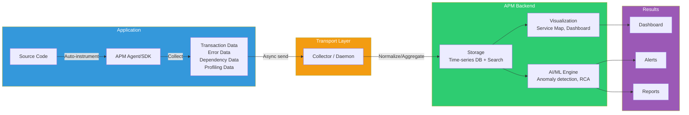

# APM (Application Performance Monitoring) — See All Application Performance at a Glance

> In [Distributed Tracing](./06-tracing), you learned to follow a request's journey. In [Observability Concepts](./01-concept), you examined the three pillars: metrics, logs, and traces. APM brings these three pillars into **one unified view**. Beyond just "is the server alive?", APM measures "what is the actual user experience?", finds bottlenecks, and alerts before problems happen. From Datadog to New Relic, Dynatrace, and AWS X-Ray — welcome to the world of APM that every modern DevOps engineer must know.

---

## 🎯 Why Do You Need to Know About APM?

### Everyday Analogy: Car Dashboard

Imagine you're driving a car.

- **Speedometer only**: "I'm going fast... but is the engine okay?"
- **With warning lights**: "Engine light turned on! But what's wrong?"
- **With diagnostic system**: "Cylinder 3 misfire, fuel economy down 15%, repair recommended"

**APM is exactly this comprehensive diagnostic system.**

- Basic monitoring = Speedometer (simple metrics like CPU, Memory)
- Alerting system = Warning lights (threshold exceeded alerts)
- APM = Comprehensive diagnostic system (performance bottlenecks, error causes, dependency relationships)

### Problems Without APM

```
When APM becomes necessary in practice:

• "Users say it's slow but server metrics are normal"             → Transaction-level performance analysis needed
• "Don't know which API is slowest"                             → Per-endpoint response time analysis needed
• "Error rate increased but don't know where errors originate"  → Error tracking + stack trace needed
• "Can't distinguish between slow DB queries and slow external APIs" → Dependency mapping needed
• "Performance degraded after deployment, can't locate issue"   → Pre/post deployment comparison needed
• "Microservice calls too complex to see whole picture"         → Service map needed
• "Takes 3 hours to find incident root cause every time"        → AI-based root cause analysis needed
```

### Team Without APM vs Team With APM

```mermaid
flowchart TD
    subgraph NO_APM["❌ Team Without APM"]
        N1["User: 'Checkout is slow!'"] -->|"Notice after 20 min"| N2["Where's the slowness?"]
        N2 -->|"SSH to server"| N3["grep logs...<br/>CPU? Memory? DB?"]
        N3 -->|"Guess 30 min"| N4["Must be checkout service..."]
        N4 -->|"Code analysis"| N5["Oh! External payment API<br/>timeout!"]
        N5 -->|"Total MTTR: 2+ hours"| N6["😰 Revenue lost"]
    end

    subgraph YES_APM["✅ Team With APM"]
        Y1["APM auto-detects<br/>Checkout API P99 >3s"] -->|"Instant alert"| Y2["Check Service Map"]
        Y2 -->|"1 min"| Y3["Checkout→Payment API<br/>response time spike"]
        Y3 -->|"2 min"| Y4["Payment API timeout<br/>error stack trace"]
        Y4 -->|"5 min"| Y5["Activate fallback payment<br/>method + contact API provider"]
        Y5 -->|"Total MTTR: 8 min"| Y6["✅ Fast response"]
    end

    style N6 fill:#e74c3c,color:#fff
    style N5 fill:#e74c3c,color:#fff
    style Y6 fill:#27ae60,color:#fff
    style Y5 fill:#27ae60,color:#fff
```



> **Interview question**: "What's the difference between monitoring and APM?"
> - **Monitoring**: Observes infrastructure-level metrics (CPU, Memory, Disk)
> - **APM**: Analyzes application-level performance (transaction response time, error rate, dependency performance)
> - Monitoring answers "is the server healthy?". APM answers "is the user satisfied?"

---

## 🧠 Grasping Core Concepts

### APM's Five Core Components

APM consists of **five core functions**.

| Function | Description | Analogy |
|----------|-------------|---------|
| **Transaction Tracking** | Track user request from start to finish | Patient medical record (intake→exam→test→prescription→payment) |
| **Error Tracking** | Collect error location, frequency, stack trace | Hospital misdiagnosis tracking (when, where, why) |
| **Dependency Mapping** | Visualize service calls and external dependencies | Hospital department patient flow map |
| **Performance Profiling** | Analyze code-level performance bottlenecks | Detailed examination (which organ, which part has issue) |
| **Real User Monitoring** | Measure actual user-perceived performance | Patient satisfaction survey (actual wait time, experience quality) |

### APM Data Flow



### Core Terminology

| Term | Description | Example |
|------|-------------|---------|
| **Transaction** | Complete processing of one user request | `POST /api/checkout` from request to response |
| **Span** | Individual work unit within transaction | DB query, HTTP call, cache lookup |
| **Service Map** | Visual map of service inter-dependencies | Order→Payment→Stock→Shipping dependency graph |
| **Throughput** | Transactions processed per unit time | 500 req/s |
| **Latency (P50/P95/P99)** | Response time percentiles | P99 = 200ms (99% requests within 200ms) |
| **Error Rate** | Percentage of requests that error | 0.5% (5 errors in 1000 requests) |
| **Apdex Score** | User satisfaction index (0~1) | 0.95 (very satisfied), 0.5 (dissatisfied) |
| **Agent** | Data collector installed in application | Datadog Agent, New Relic Agent |
| **Instrumentation** | Process of inserting measurement points in code | Auto vs manual instrumentation |

### Understanding Apdex Score

Apdex (Application Performance Index) quantifies user satisfaction on a 0~1 scale.

```
Apdex = (Satisfied + Tolerating × 0.5) / Total Requests

• Satisfied: Response time ≤ T (e.g., within 0.5s)
• Tolerating: T < Response time ≤ 4T (e.g., 0.5~2s)
• Frustrated: Response time > 4T (e.g., over 2s)

Examples:
• Apdex 0.95: 95% satisfied (excellent)
• Apdex 0.85: 85% satisfied (good)
• Apdex 0.70: 70% satisfied (acceptable)
• Apdex 0.50: 50% satisfied (poor)
```

---

## 🔍 Understanding APM Tools

### 1. Datadog — Most Popular Enterprise APM

**Strengths:**
- Unified platform (metrics, logs, traces, synthetics)
- AI-powered anomaly detection
- Excellent dashboards and alerting
- Real user monitoring (RUM)

**Weaknesses:**
- High cost (usage-based pricing)
- Vendor lock-in
- Sampling may miss rare errors

### 2. New Relic — Developer-Friendly APM

**Strengths:**
- Simple setup and onboarding
- Good documentation
- Reasonable pricing
- Transaction traces with waterfall view

**Weaknesses:**
- Less customization than Datadog
- Limited multi-cloud support

### 3. Dynatrace — AI-First APM

**Strengths:**
- Best AI/ML for anomaly detection
- Excellent automatic root cause analysis
- Full-stack monitoring
- Good for complex environments

**Weaknesses:**
- Steep learning curve
- Premium pricing
- Resource-heavy agent

### 4. AWS X-Ray — AWS-Native Tracing

**Strengths:**
- Native AWS integration
- Serverless-friendly
- Cost-effective for AWS users
- Manages traces efficiently

**Weaknesses:**
- Limited to AWS ecosystem
- Less sophisticated than Datadog/New Relic
- Requires AWS knowledge

### 5. Elastic Stack (ELK) + Custom APM

**Strengths:**
- Open-source and customizable
- Full control
- Lower cost
- Self-hosted

**Weaknesses:**
- Requires engineering effort
- Less polished UX
- Scaling challenges
- Limited built-in ML

### Tool Comparison

| Feature | Datadog | New Relic | Dynatrace | X-Ray | ELK |
|---------|---------|-----------|-----------|-------|-----|
| **Setup Difficulty** | Medium | Easy | Medium | Easy | Hard |
| **Cost** | High | Medium | High | Low* | Low |
| **Anomaly Detection** | Good | Good | Excellent | Basic | Custom |
| **RUM** | Yes | Yes | Yes | No | No |
| **Log Integration** | Native | Native | Native | CloudWatch | Native |
| **Trace Sampling** | Smart | Configurable | Automatic | Configurable | Manual |
| **Learning Curve** | Steep | Gentle | Very Steep | Medium | Very Steep |

---

## 💻 Try It Yourself

### Lab 1: Datadog Free Trial

```bash
# 1. Sign up for Datadog free tier
# https://app.datadoghq.com/signup

# 2. Install Datadog Agent (Docker)
docker run -d \
  -v /var/run/docker.sock:/var/run/docker.sock:ro \
  -v /proc/:/host/proc/:ro \
  -v /sys/:/host/sys/:ro \
  -e DD_API_KEY=<YOUR_API_KEY> \
  -e DD_SITE=datadoghq.com \
  gcr.io/datadoghq/agent:latest

# 3. Send test metrics
# Metrics automatically collected from containers

# 4. View in Datadog
# Dashboards → Infrastructure → Hosts
```

### Lab 2: New Relic Java Agent Setup

```bash
# 1. Download agent
curl -O https://download.newrelic.com/newrelic/java-agent/newrelic-java-x.x.x.jar

# 2. Add to Java app
java -javaagent:./newrelic-java-x.x.x.jar \
  -Dnewrelic.config.file=newrelic.yml \
  -jar myapp.jar

# 3. Configure newrelic.yml
# app_name: my-java-app
# license_key: YOUR_LICENSE_KEY
# transaction_tracer.enabled: true
```

### Lab 3: AWS X-Ray with Python

```python
from aws_xray_sdk.core import xray_recorder
from aws_xray_sdk.core import patch_all

# Patch AWS SDK
patch_all()

@xray_recorder.capture('process_order')
def process_order(order_id):
    # X-Ray automatically traces this function
    # Includes DB calls, external API calls, etc.

    # Add custom metadata
    xray_recorder.put_annotation('order_id', order_id)
    xray_recorder.put_metadata('order_details', {...})

    # Code runs with tracing enabled
    result = checkout(order_id)
    return result
```

### Lab 4: Key Metrics to Implement

```python
# Import instrumentation libraries
from opentelemetry import metrics
from opentelemetry.exporter.otlp.proto.grpc.metric_exporter import OTLPMetricExporter
from opentelemetry.sdk.metrics import MeterProvider
from opentelemetry.sdk.metrics.export import PeriodicExportingMetricReader

# Initialize metrics
reader = PeriodicExportingMetricReader(OTLPMetricExporter(endpoint="apm-collector:4317"))
provider = MeterProvider(metric_readers=[reader])
meter = provider.get_meter("my-app")

# Create custom metrics
request_counter = meter.create_counter(
    "http.requests.total",
    description="Total HTTP requests",
    unit="1",
)

request_duration = meter.create_histogram(
    "http.request.duration",
    description="HTTP request duration",
    unit="ms",
)

# Use metrics
request_counter.add(1, {"method": "GET", "endpoint": "/api/users"})
request_duration.record(150, {"method": "GET", "endpoint": "/api/users"})
```

---

## 🏢 Real-World Scenarios

### Scenario 1: Performance Degradation Investigation

```
Problem: Homepage load time increased from 500ms to 3s

Step 1: APM Dashboard
├── Check Service Map
│   └── Homepage → API Gateway → Product Service → Elasticsearch
├── Identify latency spike
│   └── Product Service response time: 500ms → 2.5s
└── Look at transaction breakdown
    └── DB query: 50ms → 2s (!!!!)

Step 2: Database Analysis
├── Slow query log
│   └── SELECT * FROM products WHERE category = ?
│   └── Before index: 2s, After index: 50ms
└── Check query execution plan
    └── Full table scan detected

Solution: Add index on category column
Result: Homepage load time restored to 500ms
```

### Scenario 2: Error Rate Investigation

```
Problem: Error rate jumped from 0.1% to 5%

APM Error Tracking Shows:
├── Error Type: TimeoutException (60% of errors)
├── Service: PaymentService
├── Stack Trace:
│   └── PaymentService.process()
│       → ExternalPaymentAPI.charge()
│           → Timeout after 5s
└── Affected Transactions:
    └── POST /checkout (all failures)

Root Cause Analysis:
├── External API provider having capacity issues
├── Timeout setting too aggressive (5s)
├── No circuit breaker fallback

Solution:
├── Increase timeout to 10s
├── Implement circuit breaker
├── Route to backup payment processor
└── Monitor external API health
```

### Scenario 3: Capacity Planning

```
APM provides data to estimate capacity needs:

Current State (from APM):
├── Peak throughput: 5,000 req/s
├── Average response time: 200ms
├── 99th percentile response time: 500ms
├── Database connections: 800/1000 (80%)
└── Memory per Pod: 512MB (avg), 750MB (peak)

Forecast with expected 50% user growth:
├── Needed throughput: 7,500 req/s (headroom: 2500)
├── Database connections: 1200 (need to upgrade to 1500)
├── Pod memory: 1GB request (350MB×3 replicas)
└── Cluster capacity: +3 nodes needed
```

---

## ⚠️ Common APM Mistakes

### Mistake 1: Too Much Sampling (Missing Important Errors)

```
❌ Wrong: Sample only 10% of traces
→ May miss rare but critical errors
→ Inaccurate error rate measurement

✅ Correct: Intelligent sampling
→ 100% sampling for errors
→ 100% for high-latency requests
→ 10% for normal successful requests
→ Adjust based on traffic volume
```

### Mistake 2: Not Setting Baselines

```
❌ Wrong: No baseline, only react to absolute numbers
→ "P99 response time is 500ms" — is that good or bad?
→ No context for alerting

✅ Correct: Establish baselines
→ Normal P99: 200ms
→ Alert if > 400ms (2× normal)
→ Track trends over time
→ Compare across regions/endpoints
```

### Mistake 3: Poor Custom Instrumentation

```python
# ❌ Too granular (too many spans)
for item in items:
    with tracer.span(f'process_item_{item.id}'):
        process(item)
# → 10,000 items = 10,000 spans per request (overhead!)

# ✅ Balanced instrumentation
with tracer.span('process_items_batch',
    attributes={'batch_size': len(items)}):
    for item in items:
        process(item)
# → 1 span for entire batch (clean)
```

### Mistake 4: Ignoring RUM (Real User Monitoring)

```
❌ APM shows server response: 100ms
   But RUM shows user experiences: 3s
   Difference: Network latency, JavaScript rendering

✅ Always compare:
   • APM server metrics
   • RUM user experience metrics
   • Investigate gaps
   • Example: Slow JavaScript, large bundles
```

---

## 📝 Summary

### When to Use Which APM

```
For Enterprises (large budget):
→ Datadog or Dynatrace
→ Full feature set, minimal maintenance

For Startups/Medium Companies:
→ New Relic or Datadog
→ Good balance of features and cost

For AWS-Only:
→ X-Ray + CloudWatch
→ Deep AWS integration

For Open-Source Enthusiasts:
→ Elastic Stack or Jaeger
→ Full control, learning curve steep
```

### Key Metrics to Monitor in APM

1. **Throughput** (req/s) — Is traffic normal?
2. **Latency** (P50/P95/P99) — Are users getting good response times?
3. **Error Rate** (%) — Is reliability acceptable?
4. **Apdex Score** — Overall user satisfaction?
5. **Dependency Response Time** — Which service is slowest?
6. **Database Query Time** — Is database the bottleneck?
7. **External API Time** — Are external services reliable?
8. **Memory/CPU** — Enough resources?

---

## 🔗 Next Steps

### Complete Observability Stack

```
This lecture (APM)
    │
    ├── Foundation
    │   ├── Prometheus (metrics)
    │   ├── Distributed Tracing (traces)
    │   ├── Log Collection (logs)
    │   └── K8s Monitoring (platform)
    │
    └── Synthesis
        ├── Unified dashboard (metrics + logs + traces)
        ├── Alerting based on service SLOs
        ├── AI-based anomaly detection
        └── Root cause analysis automation
```

### After APM

1. **SRE/Reliability**: Learn SLO/SLI/SLA management
2. **Performance Engineering**: Optimize based on APM insights
3. **Chaos Engineering**: Test system resilience using APM
4. **Cost Optimization**: Right-size resources based on APM data

---

## Quick APM Decision Tree

```
Choosing an APM tool:

1. Budget?
   ├─ Small → X-Ray (AWS) or free tier New Relic
   └─ Large → Datadog or Dynatrace

2. Team expertise?
   ├─ Quick setup needed → New Relic
   ├─ Customization needed → Datadog
   └─ Self-hosted required → ELK + OpenTelemetry

3. Multi-cloud?
   ├─ AWS only → X-Ray
   ├─ Multi-cloud → Datadog, New Relic, or Dynatrace
   └─ Custom → ELK + Jaeger

4. Time to value?
   ├─ Minutes → New Relic or X-Ray
   ├─ Hours → Datadog
   └─ Days → ELK or self-hosted
```
