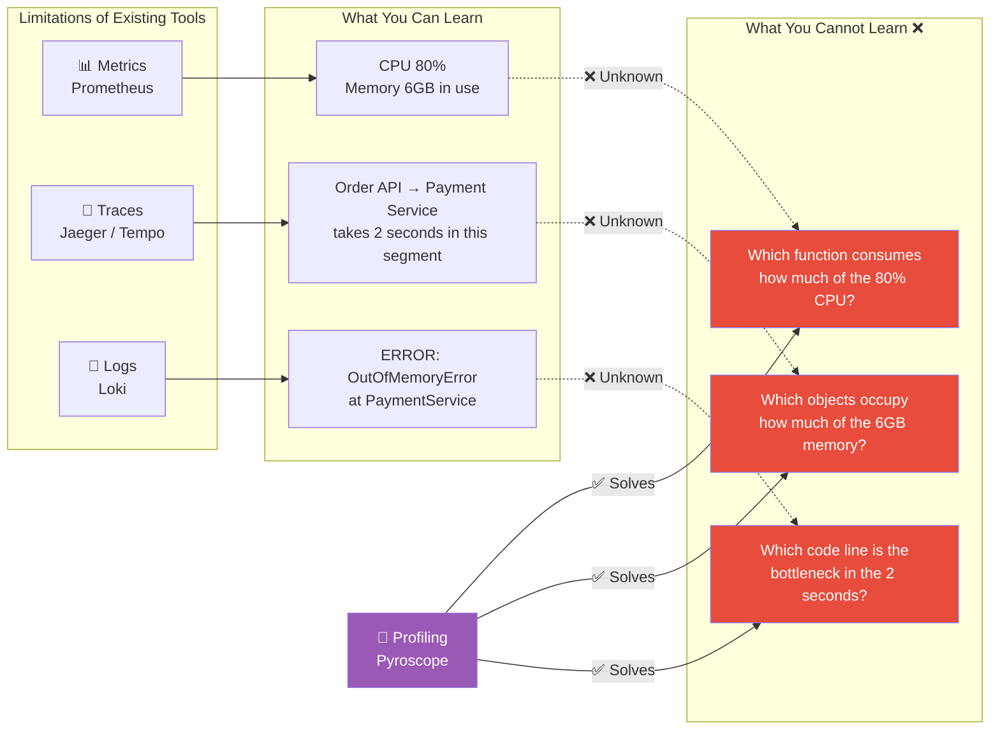
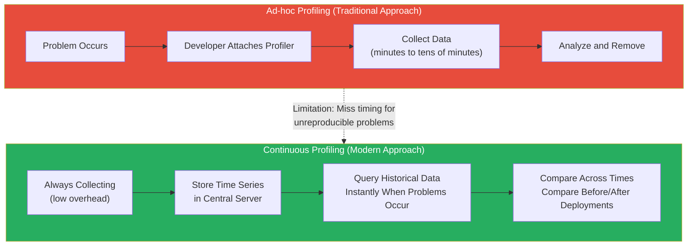
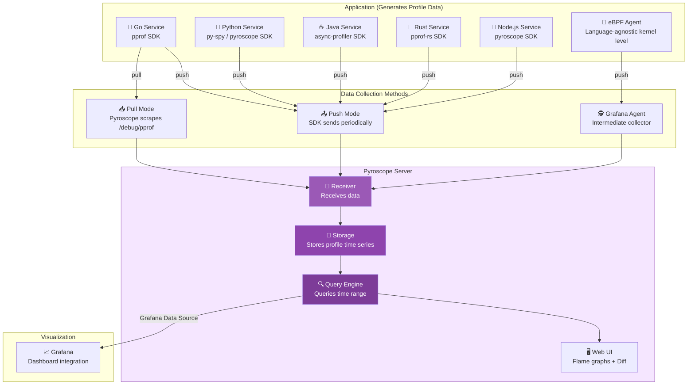
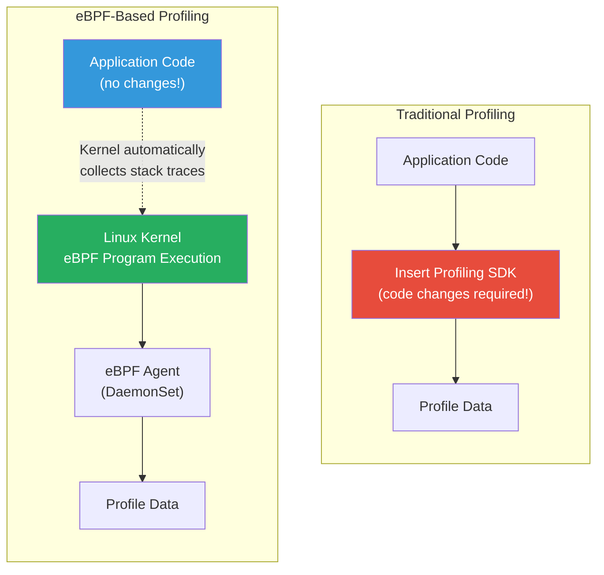
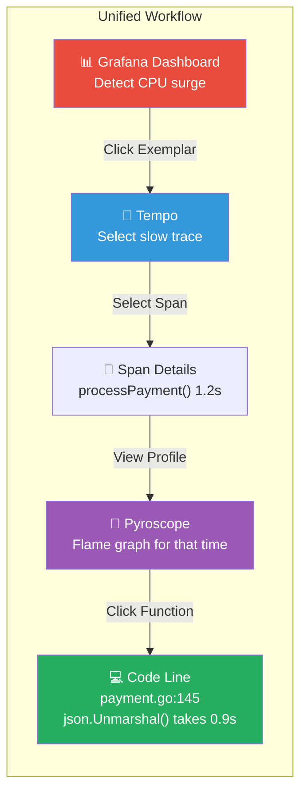
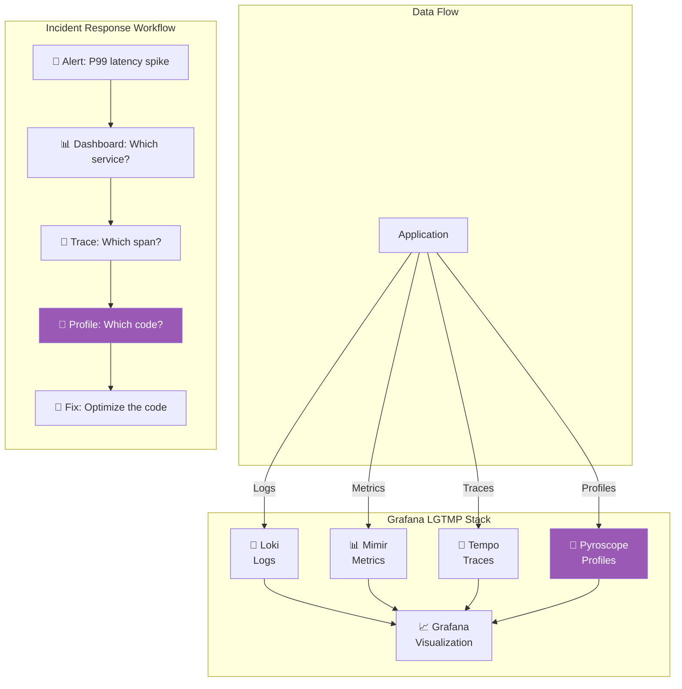

# Continuous Profiling — The Microscope That Finds Hidden Bottlenecks in Your Code

> If metrics tell you "CPU is at 80%", profiling tells you precisely "80% of that is consumed by the `parseJSON()` function taking up 62%". After detecting **what's** slow with [Prometheus](./02-prometheus) and tracking **where** it's slow with [APM/Tracing](./08-apm), now it's time to dig into Continuous Profiling to discover **why** it's slow and **which exact code lines** are the culprit.

---

## 🎯 Why You Need to Understand Continuous Profiling

### Real-World Analogy: The Electricity Detective

Imagine your electricity bill suddenly doubled.

- **Metrics (Prometheus)**: "Your usage this month is 500kWh" (problem detected)
- **Tracing (Jaeger)**: "The living room and kitchen are using the most" (location identified)
- **Profiling (Pyroscope)**: "The living room's 78% consumption comes from a 10-year-old refrigerator, and 15% of the remaining 22% is from a TV on standby power" (root cause at code level)

**Continuous Profiling is exactly this "detailed power consumption analyzer."** It tells you which function uses how much (CPU/memory) and when, down to the code line level.

### Problems Without Continuous Profiling

```
Real-world situations where Continuous Profiling is essential:

• "CPU is at 80%, but which function is consuming the most?"        → CPU profiling
• "Memory keeps growing, where is the leak?"                        → Memory (Heap) profiling
• "GC is running too frequently, which objects are being allocated?" → Allocation profiling
• "Go service has 100K goroutines stacked up!"                      → Goroutine profiling
• "Lock contention seems severe, where is it blocking?"             → Block/Mutex profiling
• "Service is slow only in production, can't reproduce locally..."  → Continuous profiling for constant collection
• "Cloud costs are rising 30% monthly"                              → Profiling to identify inefficient code
```

### Why Existing Observability Tools Alone Aren't Enough



### The Fourth Pillar of Observability

| Pillar | Tool | Answers the Question | Level |
|--------|------|-------------------|-------|
| **Metrics** | Prometheus | "What's wrong?" | Service/Infrastructure |
| **Logs** | Loki / ELK | "What events occurred?" | Events |
| **Traces** | Jaeger / Tempo | "What path did the request take?" | Request Flow |
| **Profiles** | Pyroscope / Phlare | "Which code consumes resources?" | **Code Line** |

---

## 🧠 Core Concepts

### 1. What Is Profiling?

> **Analogy**: Engine diagnostic scanner — Opening the hood and precisely measuring how much fuel each part consumes and where heat is generated.

Profiling is a technique to analyze **resource usage patterns of running programs**. It shows you which functions consume the most CPU time and which code paths allocate the most memory.

### 2. Types of Profiling

| Type | Measures | Key Question | Analogy |
|------|----------|-------------|---------|
| **CPU Profiling** | CPU consumption per function | "Which function runs longest?" | Measuring work hours per employee |
| **Memory (Heap) Profiling** | Memory allocation and usage | "Which objects consume the most memory?" | Inventory status per warehouse |
| **Allocation Profiling** | Number of memory allocations | "Which code puts GC under pressure?" | Frequency of package orders |
| **Goroutine Profiling** | Goroutine count and state | "Where are goroutines blocked?" | Queue bottleneck analysis |
| **Block Profiling** | Synchronization wait time | "Where are we waiting for locks?" | Bathroom line wait time |
| **Mutex Profiling** | Mutex contention | "Which lock is the bottleneck?" | Congestion at a narrow door |
| **I/O Profiling** | Disk/network wait | "Which I/O is slow?" | Delivery delay analysis |

### 3. Ad-hoc vs Continuous Profiling



| Item | Ad-hoc Profiling | Continuous Profiling |
|------|------------------|---------------------|
| **Collection Timing** | Manual after problem | Always automatic |
| **Overhead** | Can be high (5-20%) | Very low (2-5%) |
| **Historical Data** | None | Time series stored |
| **Deployment Comparison** | Impossible | Possible (before/after diff) |
| **Unreproducible Issues** | Likely to miss | Data already available |
| **Production Deployment** | Risk | Safe for continuous operation |

### 4. Sampling-Based Profiling

Profilers typically work on a **sampling basis**. Rather than monitoring every instruction, they take a snapshot at regular intervals (e.g., 100 times per second) asking "which function is executing right now?"

```
Time →    t1   t2   t3   t4   t5   t6   t7   t8   t9   t10
Function: A    A    B    A    C    A    A    B    A    A

Result: A = 7/10 (70%), B = 2/10 (20%), C = 1/10 (10%)
→ Function A is estimated to use about 70% of CPU time
```

The advantage of this approach is **extremely low overhead**. You can get statistically accurate results while barely interfering with program execution.

### 5. Flame Graphs — The Heart of Profiling Visualization

> **Analogy**: Expense analysis treemap in a budget — wider bars represent items (functions) that consume more money (time).

A flame graph is a visualization method for profiling data invented by Brendan Gregg. It visually represents **function call stacks**.

```
┌─────────────────────────────────────────────────────────┐
│                    main() (100%)                         │
├──────────────────────────────┬──────────────────────────┤
│      handleRequest() (65%)   │    backgroundJob() (35%) │
├──────────────┬───────────────┤                          │
│ parseJSON()  │ queryDB()     │                          │
│   (40%)      │  (25%)        │                          │
├──────┬───────┤               │                          │
│decode│ alloc │               │                          │
│(25%) │(15%)  │               │                          │
└──────┴───────┴───────────────┴──────────────────────────┘

How to read:
• Y axis (bottom→top): Call stack depth (bottom is root, top is leaf)
• X axis (width): Percentage of total consumption (wider = more usage)
• Color: Usually random (warm color), meaningless (except diff view: red=increase, blue=decrease)
```

**Key tips for reading flame graphs:**

1. **Find the widest bar first** — that's the function consuming the most resources
2. **Look for "plateaus"** — wide flat sections at the top mean the function itself (not its children) is consuming time
3. **Distinguish Self time vs Total time** — Total includes children, Self is just the function itself

---

## 🔍 Detailed Exploration

### 1. Pyroscope — The Leader in Continuous Profiling

Pyroscope is an open-source Continuous Profiling platform. In 2023, it was acquired by Grafana Labs and integrated into the Grafana ecosystem.

#### Pyroscope Architecture



#### Push Mode vs Pull Mode

| Item | Push Mode | Pull Mode |
|------|-----------|-----------|
| **How It Works** | SDK sends periodically to server | Pyroscope scrapes the endpoint |
| **Suitable Languages** | All languages | Go (has pprof endpoint built-in) |
| **Configuration Location** | Application code | Pyroscope server config |
| **Prometheus Analogy** | Push Gateway | Scrape Target |
| **K8s Environment** | SDK included in Pod | Auto-discovery via Service Discovery |
| **Advantage** | Simple configuration | No application code changes (Go) |

#### Deploy Pyroscope on K8s with Helm Chart

```yaml
# values.yaml - Pyroscope Helm Chart Configuration
pyroscope:
  # Single binary mode (small environments)
  mode: "single-binary"  # or "distributed" (large scale)

  persistence:
    enabled: true
    storageClassName: gp3
    size: 50Gi

  resources:
    requests:
      cpu: 500m
      memory: 1Gi
    limits:
      cpu: 2
      memory: 4Gi

  # Scrape configuration (Pull Mode)
  scrapeConfigs:
    - job_name: "go-services"
      scrape_interval: 15s
      kubernetes_sd_configs:
        - role: pod
      relabel_configs:
        - source_labels: [__meta_kubernetes_pod_annotation_pyroscope_io_scrape]
          action: keep
          regex: "true"
        - source_labels: [__meta_kubernetes_pod_annotation_pyroscope_io_profile_cpu_enabled]
          action: keep
          regex: "true"
      profiling_config:
        pprof_config:
          process_cpu:
            enabled: true
            path: "/debug/pprof/profile"
            delta: true
          memory:
            enabled: true
            path: "/debug/pprof/heap"
            delta: true
          goroutine:
            enabled: true
            path: "/debug/pprof/goroutine"
          block:
            enabled: true
            path: "/debug/pprof/block"
          mutex:
            enabled: true
            path: "/debug/pprof/mutex"

  # Grafana Integration
  grafana:
    datasource:
      enabled: true
```

```bash
# Install Pyroscope with Helm
helm repo add grafana https://grafana.github.io/helm-charts
helm repo update

helm install pyroscope grafana/pyroscope \
  --namespace observability \
  --create-namespace \
  -f values.yaml
```

### 2. Language-Specific Profiling Integration

#### Go — pprof (Native Support)

Go has profiling built into the language itself. Just import the `net/http/pprof` package and you're ready to go.

```go
package main

import (
    "log"
    "net/http"
    _ "net/http/pprof"  // This single line enables profiling endpoints!

    "github.com/grafana/pyroscope-go"
)

func main() {
    // Method 1: Open pprof endpoint (Pull Mode - Pyroscope scrapes it)
    go func() {
        log.Println(http.ListenAndServe(":6060", nil))
    }()

    // Method 2: Push directly to Pyroscope
    pyroscope.Start(pyroscope.Config{
        ApplicationName: "order-service",
        ServerAddress:   "http://pyroscope.observability:4040",

        // Choose which profiles to collect
        ProfileTypes: []pyroscope.ProfileType{
            pyroscope.ProfileCPU,
            pyroscope.ProfileAllocObjects,
            pyroscope.ProfileAllocSpace,
            pyroscope.ProfileInuseObjects,
            pyroscope.ProfileInuseSpace,
            pyroscope.ProfileGoroutines,
            pyroscope.ProfileMutexCount,
            pyroscope.ProfileMutexDuration,
            pyroscope.ProfileBlockCount,
            pyroscope.ProfileBlockDuration,
        },

        // Multidimensional filtering with labels
        Tags: map[string]string{
            "env":     "production",
            "region":  "ap-northeast-2",
            "version": "v2.3.1",
        },
    })

    // Dynamically add labels to specific code sections
    pyroscope.TagWrapper(context.Background(), pyroscope.Labels(
        "controller", "orderHandler",
        "user_tier", "premium",
    ), func(ctx context.Context) {
        handleOrder(ctx)
    })
}
```

```bash
# Use pprof endpoints directly
# Collect CPU profile for 30 seconds
go tool pprof http://localhost:6060/debug/pprof/profile?seconds=30

# Query heap (memory) profile
go tool pprof http://localhost:6060/debug/pprof/heap

# Dump goroutines
go tool pprof http://localhost:6060/debug/pprof/goroutine

# Block profiling (synchronization waits)
go tool pprof http://localhost:6060/debug/pprof/block

# Interactive commands available in pprof:
# (pprof) top10        — Top 10 functions
# (pprof) web          — View graph in browser
# (pprof) list funcName — Line-by-line profile of function
# (pprof) flames        — View as flame graph
```

```
# Example output from go tool pprof
(pprof) top10
Showing nodes accounting for 8.5s, 85% of 10s total
      flat  flat%   sum%        cum   cum%
     3.2s 32.00% 32.00%      3.5s 35.00%  encoding/json.(*decodeState).object
     1.8s 18.00% 50.00%      1.8s 18.00%  runtime.mallocgc
     1.2s 12.00% 62.00%      5.0s 50.00%  main.handleRequest
     0.8s  8.00% 70.00%      0.8s  8.00%  syscall.Syscall
     0.5s  5.00% 75.00%      2.3s 23.00%  database/sql.(*DB).query
     0.4s  4.00% 79.00%      0.4s  4.00%  runtime.gcBgMarkWorker
     0.3s  3.00% 82.00%      0.3s  3.00%  net/http.(*conn).readRequest
     0.2s  2.00% 84.00%      0.2s  2.00%  crypto/tls.(*Conn).Read
     0.1s  1.00% 85.00%      6.2s 62.00%  net/http.(*ServeMux).ServeHTTP

→ JSON decoding takes 32% of total! This is priority #1 for optimization.
```

#### Python — py-spy / cProfile

```python
# Method 1: Pyroscope SDK (Push Mode)
import pyroscope

pyroscope.configure(
    application_name="payment-service",
    server_address="http://pyroscope.observability:4040",
    sample_rate=100,  # Sample 100 times per second
    tags={
        "env": "production",
        "region": "ap-northeast-2",
        "version": "v1.5.0",
    },
)

# Add labels to specific code sections
with pyroscope.tag_wrapper({"endpoint": "/api/payment", "method": "POST"}):
    process_payment(request)


# Method 2: py-spy (external profiler, no code changes)
# pip install py-spy
# py-spy can attach to a running Python process and profile it
```

```bash
# py-spy usage (no code changes needed!)
# Attach to running process
py-spy top --pid 12345

# Generate flame graph SVG
py-spy record -o profile.svg --pid 12345 --duration 30

# Start new process and profile it
py-spy record -o profile.svg -- python app.py

# Output to Speedscope format (web viewer)
py-spy record -o profile.speedscope --format speedscope --pid 12345
```

```python
# Method 3: cProfile (Python built-in)
import cProfile
import pstats

# Profile a function
profiler = cProfile.Profile()
profiler.enable()
process_data()  # Target function to profile
profiler.disable()

# Display results
stats = pstats.Stats(profiler)
stats.sort_stats('cumulative')
stats.print_stats(20)  # Show top 20

# Example output:
#    ncalls  tottime  percall  cumtime  percall filename:lineno(function)
#     1000    5.234    0.005   12.567    0.013 payment.py:45(validate_card)
#    50000    3.821    0.000    3.821    0.000 utils.py:12(hash_token)
#     1000    2.112    0.002    8.445    0.008 db.py:78(execute_query)
```

#### Java — async-profiler

```bash
# async-profiler usage (no code changes!)
# Java 8+, the most accurate JVM profiler

# CPU profiling for 30 seconds
./asprof -d 30 -f profile.html <PID>

# Allocation profiling (tracks memory allocations)
./asprof -e alloc -d 30 -f alloc-profile.html <PID>

# Lock profiling (lock contention analysis)
./asprof -e lock -d 30 -f lock-profile.html <PID>

# Wall Clock profiling (includes I/O waits)
./asprof -e wall -d 30 -f wall-profile.html <PID>

# Save as JFR format for JDK Mission Control
./asprof -d 60 -f recording.jfr <PID>
```

```java
// Continuous Profiling with Pyroscope Java SDK
// build.gradle
// implementation 'io.pyroscope:agent:0.13.0'

import io.pyroscope.javaagent.PyroscopeAgent;
import io.pyroscope.javaagent.config.Config;
import io.pyroscope.http.Format;

public class Application {
    public static void main(String[] args) {
        // Start Pyroscope agent
        PyroscopeAgent.start(
            new Config.Builder()
                .setApplicationName("inventory-service")
                .setServerAddress("http://pyroscope.observability:4040")
                .setProfilingEvent(EventType.ITIMER)  // CPU
                .setProfilingAlloc("512k")             // Sample every 512KB allocation
                .setProfilingLock("10ms")              // Lock waits over 10ms
                .setFormat(Format.JFR)
                .setLabels(Map.of(
                    "env", "production",
                    "region", "ap-northeast-2"
                ))
                .build()
        );

        SpringApplication.run(Application.class, args);
    }
}
```

```bash
# Or use as Java Agent without code changes
java -javaagent:pyroscope.jar \
  -Dpyroscope.application.name=inventory-service \
  -Dpyroscope.server.address=http://pyroscope:4040 \
  -Dpyroscope.format=jfr \
  -jar app.jar
```

### 3. eBPF-Based Profiling — Kernel-Level Profiling Without Code Changes

eBPF (extended Berkeley Packet Filter) is a technology that **safely executes programs in the Linux kernel**. Using it, you can profile applications **without any code changes**.



#### Advantages of eBPF Profiling

| Advantage | Explanation |
|-----------|-------------|
| **Zero Code Changes** | No SDK insertion needed, just deploy DaemonSet |
| **Language Agnostic** | Go, Python, Java, Rust, C++ all supported |
| **Low Overhead** | Kernel-level efficiency (1-3%) |
| **Full Node Coverage** | Single agent per node profiles all Pods |

#### Grafana Alloy (formerly Grafana Agent) eBPF Profiling

```yaml
# Grafana Alloy Configuration - eBPF Profiling
# alloy-config.yaml
discovery.kubernetes "pods" {
  role = "pod"
}

pyroscope.ebpf "instance" {
  forward_to     = [pyroscope.write.endpoint.receiver]
  targets_only   = true
  default_target = {"service_name" = "unspecified"}

  targets = discovery.relabel.pods.output
}

discovery.relabel "pods" {
  targets = discovery.kubernetes.pods.targets

  rule {
    source_labels = ["__meta_kubernetes_pod_phase"]
    regex         = "Succeeded|Failed|Completed"
    action        = "drop"
  }

  rule {
    source_labels = ["__meta_kubernetes_namespace"]
    target_label  = "namespace"
  }

  rule {
    source_labels = ["__meta_kubernetes_pod_name"]
    target_label  = "pod"
  }

  rule {
    source_labels = ["__meta_kubernetes_pod_container_name"]
    target_label  = "container"
  }

  rule {
    action        = "labelmap"
    regex         = "__meta_kubernetes_pod_label_(.+)"
  }
}

pyroscope.write "endpoint" {
  endpoint {
    url = "http://pyroscope.observability:4040"
  }
}
```

```yaml
# Deploy eBPF Agent as Kubernetes DaemonSet
apiVersion: apps/v1
kind: DaemonSet
metadata:
  name: grafana-alloy-ebpf
  namespace: observability
spec:
  selector:
    matchLabels:
      app: alloy-ebpf
  template:
    metadata:
      labels:
        app: alloy-ebpf
    spec:
      hostPID: true      # Need access to host processes
      hostNetwork: true
      containers:
        - name: alloy
          image: grafana/alloy:latest
          args:
            - run
            - /etc/alloy/config.alloy
          securityContext:
            privileged: true         # eBPF requires kernel privileges
            runAsUser: 0
          volumeMounts:
            - name: config
              mountPath: /etc/alloy
            - name: sys-kernel
              mountPath: /sys/kernel
              readOnly: true
          resources:
            requests:
              cpu: 100m
              memory: 256Mi
            limits:
              cpu: 500m
              memory: 512Mi
      volumes:
        - name: config
          configMap:
            name: alloy-ebpf-config
        - name: sys-kernel
          hostPath:
            path: /sys/kernel
```

### 4. Grafana Phlare Integration with Pyroscope

Grafana Phlare was Grafana Labs' own Continuous Profiling backend. In 2023, after acquiring Pyroscope, they **unified Phlare's storage engine with Pyroscope's SDKs/agents** into a single project.

```
Timeline:
2021  Pyroscope launches (independent project)
2022  Grafana Phlare launches (Grafana Labs)
2023  Grafana Labs acquires Pyroscope
2023  Phlare + Pyroscope integration → "Grafana Pyroscope" unified
2024~ Grafana Cloud Profiles (SaaS), Grafana Pyroscope (OSS)
```

| Item | Old Grafana Phlare | Unified Grafana Pyroscope |
|------|-------------------|--------------------------|
| **Storage** | Phlare engine | Phlare engine maintained (high performance) |
| **SDK/Agent** | Limited | Inherits Pyroscope's rich SDK ecosystem |
| **Query Language** | Limited | Improved query capabilities |
| **Grafana Integration** | Native | Native (more robust) |
| **Deployment Modes** | Monolithic / Microservices | Single Binary / Distributed |

### 5. Linking Profiling with Tracing — Exemplar Integration

Profiling's true power emerges when **linked with other observability signals**. Connecting with tracing is especially powerful.



```go
// Link Traces and Profiles in Go
import (
    "github.com/grafana/pyroscope-go"
    "go.opentelemetry.io/otel"
)

func handlePayment(ctx context.Context, req PaymentRequest) error {
    // Create OpenTelemetry Span
    ctx, span := otel.Tracer("payment").Start(ctx, "processPayment")
    defer span.End()

    // Pass Span ID as label to Pyroscope
    // → Later, filter profiles for just this Span
    pyroscope.TagWrapper(ctx, pyroscope.Labels(
        "span_id", span.SpanContext().SpanID().String(),
        "trace_id", span.SpanContext().TraceID().String(),
    ), func(ctx context.Context) {
        // CPU/memory usage in this block is linked to the Span
        result := validateCard(ctx, req.CardNumber)
        chargeAmount(ctx, req.Amount)
        sendReceipt(ctx, req.Email)
    })

    return nil
}
```

### 6. Diff Flame Graphs — Before/After Deployment Comparison

One of Continuous Profiling's killer features is **comparing profiles between two time periods**, which is the Diff view.

```
Before Deployment (v2.3.0)              After Deployment (v2.4.0)
┌─────────────────────┐                 ┌─────────────────────┐
│     main() 100%     │                 │     main() 100%     │
├──────────┬──────────┤                 ├──────────┬──────────┤
│ handler  │ bg job   │                 │ handler  │ bg job   │
│  (60%)   │ (40%)    │                 │  (75%)   │ (25%)    │
├────┬─────┤          │                 ├─────┬────┤          │
│json│ db  │          │                 │json │ db │          │
│25% │35%  │          │                 │50%  │25% │          │
└────┴─────┘          │                 └─────┴────┘          │

Diff View:
┌─────────────────────────────┐
│        main()               │
├──────────────┬──────────────┤
│  handler     │   bg job     │
│  (+15%) 🔴   │  (-15%) 🔵   │
├───────┬──────┤              │
│ json  │ db   │              │
│(+25%) │(-10%)│              │
│ 🔴🔴  │ 🔵   │              │
└───────┴──────┘              │

→ JSON processing increased 25%! Code change in v2.4.0 made it inefficient
→ Check the related commit to find the cause
```

This feature lets you **detect performance regressions immediately after deployment**.

---

## 💻 Hands-On Practice

### Exercise 1: Set Up Pyroscope + Grafana with Docker Compose

```yaml
# docker-compose.yml
version: "3.8"

services:
  # Pyroscope Server
  pyroscope:
    image: grafana/pyroscope:latest
    ports:
      - "4040:4040"
    volumes:
      - pyroscope-data:/data
    environment:
      - PYROSCOPE_STORAGE_PATH=/data
    command:
      - "-config.file=/etc/pyroscope/config.yaml"

  # Grafana (for profile visualization)
  grafana:
    image: grafana/grafana:latest
    ports:
      - "3000:3000"
    environment:
      - GF_AUTH_ANONYMOUS_ENABLED=true
      - GF_AUTH_ANONYMOUS_ORG_ROLE=Admin
    volumes:
      - ./grafana-provisioning:/etc/grafana/provisioning

  # Sample Go Application
  sample-go-app:
    build: ./sample-app-go
    environment:
      - PYROSCOPE_SERVER_ADDRESS=http://pyroscope:4040
    depends_on:
      - pyroscope

  # Sample Python Application
  sample-python-app:
    build: ./sample-app-python
    environment:
      - PYROSCOPE_SERVER_ADDRESS=http://pyroscope:4040
    depends_on:
      - pyroscope

volumes:
  pyroscope-data:
```

```yaml
# grafana-provisioning/datasources/pyroscope.yaml
apiVersion: 1

datasources:
  - name: Pyroscope
    type: grafana-pyroscope-datasource
    uid: pyroscope
    url: http://pyroscope:4040
    access: proxy
    isDefault: false
    jsonData:
      minStep: '15s'
```

### Exercise 2: Find CPU Bottlenecks with Go Sample App

```go
// sample-app-go/main.go
package main

import (
    "crypto/sha256"
    "encoding/json"
    "fmt"
    "math/rand"
    "net/http"
    "os"
    "time"

    "github.com/grafana/pyroscope-go"
)

func main() {
    // Connect to Pyroscope
    pyroscope.Start(pyroscope.Config{
        ApplicationName: "sample-go-app",
        ServerAddress:   os.Getenv("PYROSCOPE_SERVER_ADDRESS"),
        ProfileTypes: []pyroscope.ProfileType{
            pyroscope.ProfileCPU,
            pyroscope.ProfileAllocObjects,
            pyroscope.ProfileAllocSpace,
            pyroscope.ProfileInuseObjects,
            pyroscope.ProfileInuseSpace,
            pyroscope.ProfileGoroutines,
        },
    })

    http.HandleFunc("/api/order", handleOrder)
    http.ListenAndServe(":8080", nil)
}

func handleOrder(w http.ResponseWriter, r *http.Request) {
    // Intentionally CPU-intensive operations
    data := generateData()        // ~10% CPU
    validated := validateData(data) // ~30% CPU (inefficient hashing)
    result := processData(validated) // ~60% CPU (inefficient JSON)

    json.NewEncoder(w).Encode(result)
}

func generateData() []map[string]interface{} {
    data := make([]map[string]interface{}, 100)
    for i := range data {
        data[i] = map[string]interface{}{
            "id":     i,
            "value":  rand.Float64(),
            "status": "pending",
        }
    }
    return data
}

func validateData(data []map[string]interface{}) []map[string]interface{} {
    // Inefficiency: Hash each item 10 times repeatedly
    for _, item := range data {
        hash := fmt.Sprintf("%v", item)
        for j := 0; j < 10; j++ {
            h := sha256.Sum256([]byte(hash))
            hash = fmt.Sprintf("%x", h)
        }
        item["hash"] = hash
    }
    return data
}

func processData(data []map[string]interface{}) map[string]interface{} {
    // Inefficiency: Serialize/deserialize entire dataset 50 times
    var processed []map[string]interface{}
    for range 50 {
        bytes, _ := json.Marshal(data)
        json.Unmarshal(bytes, &processed)
    }

    return map[string]interface{}{
        "count":     len(processed),
        "timestamp": time.Now().Unix(),
    }
}
```

```bash
# Run and generate load
docker compose up -d

# Generate traffic (in separate terminal)
for i in $(seq 1 1000); do
  curl -s http://localhost:8080/api/order > /dev/null &
done

# View Pyroscope UI: http://localhost:4040
# View Grafana: http://localhost:3000 → Explore → Pyroscope datasource
```

### Exercise 3: Profile Python Application

```python
# sample-app-python/app.py
import os
import time
import json
import hashlib
from flask import Flask, jsonify
import pyroscope

# Connect to Pyroscope
pyroscope.configure(
    application_name="sample-python-app",
    server_address=os.getenv("PYROSCOPE_SERVER_ADDRESS", "http://localhost:4040"),
    sample_rate=100,
    tags={"env": "demo", "service": "python-sample"},
)

app = Flask(__name__)


@app.route("/api/analyze")
def analyze():
    with pyroscope.tag_wrapper({"endpoint": "/api/analyze"}):
        data = fetch_data()           # ~15% CPU
        cleaned = clean_data(data)    # ~25% CPU
        result = heavy_computation(cleaned)  # ~60% CPU
        return jsonify(result)


def fetch_data():
    """Generate data (simulates DB query)"""
    time.sleep(0.01)  # I/O simulation
    return [{"id": i, "value": i * 3.14, "text": f"item-{i}" * 100}
            for i in range(500)]


def clean_data(data):
    """Inefficient data cleaning — unnecessary hash repetition"""
    cleaned = []
    for item in data:
        text = item["text"]
        # Inefficiency: Hash same string 20 times
        for _ in range(20):
            text = hashlib.sha256(text.encode()).hexdigest()
        cleaned.append({**item, "hash": text})
    return cleaned


def heavy_computation(data):
    """Inefficient computation — unnecessary JSON serialization"""
    result = data
    # Inefficiency: Serialize/deserialize 50 times
    for _ in range(50):
        serialized = json.dumps(result)
        result = json.loads(serialized)
    return {"count": len(result), "timestamp": time.time()}


if __name__ == "__main__":
    app.run(host="0.0.0.0", port=5000)
```

### Exercise 4: View Profiles in Grafana

```
Steps to view Pyroscope data in Grafana:

1. Open Grafana (http://localhost:3000)
2. Left menu → Explore
3. Select "Pyroscope" as datasource at the top
4. Choose Profile Type:
   - process_cpu        → CPU profile
   - memory (inuse_space) → Current memory usage
   - memory (alloc_space) → Cumulative allocations
   - goroutine           → Goroutine count
5. Set Label Filter: service_name = "sample-go-app"
6. Select time range and click "Run Query"
7. Flame graph appears!

What to look for in the flame graph:
• processData → json.Marshal/Unmarshal is the widest bar
• validateData → sha256.Sum256 repeated hashing is second largest
• Optimizing these two functions = ~90% performance improvement possible
```

### Exercise 5: Analyze with pprof Command Line

```bash
# Go service pprof endpoint direct analysis

# 1. Collect CPU profile (30 seconds)
go tool pprof -http=:8081 http://localhost:6060/debug/pprof/profile?seconds=30

# 2. Analyze heap (memory) profile
go tool pprof -http=:8081 http://localhost:6060/debug/pprof/heap

# 3. Compare two points in time (Diff analysis)
# First save baseline profile
curl -o baseline.pprof http://localhost:6060/debug/pprof/heap

# After code changes, save current profile
curl -o current.pprof http://localhost:6060/debug/pprof/heap

# Diff analysis
go tool pprof -http=:8081 -diff_base=baseline.pprof current.pprof

# 4. Text mode analysis
go tool pprof http://localhost:6060/debug/pprof/profile?seconds=10
# (pprof) top20 -cum      # Top 20 by cumulative time
# (pprof) list handleOrder # Line-by-line profile of function
# (pprof) web              # View call graph in browser
# (pprof) svg > output.svg # Save as SVG
```

---

## 🏢 Real-World Applications

### Case Study 1: Reduce Cloud Costs by 30%

```
Company: E-commerce Platform (monthly AWS bill $50,000)
Problem: Infrastructure costs rising 15% monthly, but traffic only +5%
Root Cause: Auto-scaling based on CPU was over-scaling

After implementing Continuous Profiling:
1. Started collecting CPU profiles with Pyroscope across all services
2. Order service's 60% CPU consumption was from json.Unmarshal()
3. Root cause: No caching of parsed JSON results
4. Fix: Cache parsing results in memory → CPU usage down 60%
5. Result: Scale down from 10 to 4 instances

Results: Monthly savings $15,000 (30%), Pyroscope operational cost $200/month
ROI: 7,400% (investment payoff)
```

### Case Study 2: Identify Memory Leak Root Cause in 3 Minutes

```
Problem: Java service OOMKilled every 6 hours
Before: Heap dump → 100GB+ file → 2 hours to analyze
After: Need 6 hours just to reproduce the problem

With Continuous Profiling:
1. Pyroscope alloc_space profiles stored as time series
2. View memory allocation graph in Grafana → see spike at specific time
3. Flame graph shows CacheManager.put() → HashMap.resize() huge block
4. Root cause: Cache with no TTL accumulating infinite data
5. Fix: Add TTL and maxSize limits

Results: MTTR reduced from 2+ hours to 3 minutes (97% reduction)
```

### Case Study 3: Detect Performance Regression Instantly After Deployment

```
Situation: v3.2.0 deployed → P99 latency jumped 200ms → 800ms
Before: Monitoring alert → log analysis → hypothesis → rollback (30 minutes)

With Continuous Profiling:
1. Pyroscope Diff view comparing v3.1.0 vs v3.2.0 profiles
2. parseUserPreferences() function increased +340% CPU (red)
3. Git blame on that function → PR #1847 changed regex
4. Regex pattern causes catastrophic backtracking
5. Fix: Optimize regex pattern and deploy hotfix

Results: Detection to fix took 12 minutes (vs 30 before = 60% faster)
```

### Production Environment Best Practices

```yaml
# Recommended Pyroscope Configuration (Large Scale)

# 1. Deploy in Distributed Mode (High Availability)
pyroscope:
  mode: "distributed"

  # Ingester: Receive and compress profiles
  ingester:
    replicas: 3
    resources:
      requests:
        cpu: 1
        memory: 4Gi

  # Store-Gateway: Query long-term storage
  storeGateway:
    replicas: 2
    persistence:
      size: 100Gi

  # Compactor: Compress and clean data
  compactor:
    replicas: 1

  # Query Frontend: Cache and distribute queries
  queryFrontend:
    replicas: 2

  # Object Storage (long-term)
  storage:
    backend: s3
    s3:
      bucket: "company-pyroscope-profiles"
      region: "ap-northeast-2"

  # Retention Policy
  retention:
    # Last 7 days: full resolution
    # 7-30 days: 1-minute downsampling
    # 30+ days: delete
    period: 30d

# 2. Sampling Rate Guidelines
# - Dev/Staging: 100Hz (100 times/second)
# - Production (normal): 50Hz
# - Production (high traffic): 19Hz (recommended)
# - Cost-sensitive: 10Hz
```

### Team Adoption Roadmap

```
Continuous Profiling Adoption (12 weeks):

Phase 1: Pilot (Weeks 1-4)
├── Week 1: Deploy single Pyroscope instance
├── Week 2: Integrate SDK into 1-2 core services
├── Week 3: Connect to Grafana and build dashboards
└── Week 4: Find first optimization opportunity

Phase 2: Expansion (Weeks 5-8)
├── Weeks 5-6: Deploy eBPF agent for full service coverage
├── Week 7: Link with Tempo tracing
└── Week 8: Team training and runbook creation

Phase 3: Automation (Weeks 9-12)
├── Weeks 9-10: Automate profile comparison in CI/CD
├── Week 11: Generate cost optimization reports automatically
└── Week 12: Include profiling metrics in SLOs
```

---

## ⚠️ Common Mistakes

### Mistake 1: Using High Sampling Rate in Production

```yaml
# ❌ Wrong:
pyroscope.configure(
    sample_rate=1000,  # 1000 times/second! Overhead explodes
)

# ✅ Correct:
pyroscope.configure(
    sample_rate=100,   # Development
    # sample_rate=19,  # Production (efficient + accurate)
)

Reason:
• High sample rate = high CPU overhead (>5%)
• 19-50Hz is statistically sufficient for production
• High rate only needed for micro-second-level analysis
```

### Mistake 2: Reading Flame Graphs in Call Order

```yaml
# ❌ Wrong Interpretation:
# "Function on left is called first, right is called later"

# ✅ Correct Interpretation:
# X-axis = resource usage percentage (width matters, not position)
# Y-axis = call stack depth (bottom=root, top=leaf)
# Position = alphabetical order (meaningless)
# Focus on: WIDTH (how much resource) not POSITION
```

### Mistake 3: Confusing Self Time and Total Time

```yaml
# ❌ Wrong:
# "processData() takes 85%, let's optimize it!"

Reality:
processData() Total: 85%
├── json.Marshal()    Self: 50%  ← Real culprit!
├── json.Unmarshal()  Self: 30%  ← Real culprit!
└── processData() Self: 5%       ← Actually small

# ✅ Correct:
# Focus on Self Time! That's actual bottleneck
# Total Time = Self + Children
# Self Time = where actual work happens
```

### Mistake 4: Profile Once and Forget

```yaml
# ❌ Wrong:
# "I profiled once, so I'm done"
# → Performance varies by traffic, time of day, data size

# ✅ Correct:
# Keep Continuous Profiling running 24/7
# Trends matter more than snapshots
# Compare: peak hours vs off-peak, before/after deployments
```

### Mistake 5: Enable All Profile Types at Once

```yaml
# ❌ From start:
ProfileTypes: [CPU, AllocObjects, AllocSpace, Inuse*, Goroutines, Mutex*, Block*]
→ Overhead accumulates, storage explodes

# ✅ Gradual enablement:
Stage 1: CPU + InuseSpace (covers 95% of problems)
Stage 2: AllocObjects (if GC issues suspected)
Stage 3: Goroutines (for Go concurrency issues)
Stage 4: Mutex/Block (only if lock contention suspected)
```

### Mistake 6: Assume eBPF Works Everywhere

```yaml
# ❌ Wrong assumption:
# "eBPF will work everywhere!"

Reality:
• Requires Linux kernel 4.9+ (5.8+ recommended)
• AWS EKS: Works on Bottlerocket/AL2023, not all older AMIs
• GKE: Works on Container-Optimized OS
• Windows: NOT supported
• Containers: Need privileged or CAP_BPF
• Some cloud environments block it for security

# ✅ Solution:
# Test eBPF compatibility first
# Fallback to SDK Push Mode if needed
```

---

## 📝 Summary

### Core Takeaways

```
Continuous Profiling adds this value to Observability:

Metrics:  "CPU is 80%"          → WHAT
Logs:     "OOM error occurred"   → WHAT event
Traces:   "Order→Payment slow"   → WHERE
Profiles: "json.Unmarshal 62%"   → WHY (code level)  ← NEW!
```

### Tool Selection Guide

```
Continuous Profiling Needed?
├── Yes → Pyroscope (Grafana ecosystem)
│   ├── Code changeable? → SDK integration (Push Mode)
│   ├── No code changes? → eBPF Agent (DaemonSet)
│   └── Go service? → Pull Mode (pprof endpoint)
│
└── No (one-time analysis)
    ├── Go → go tool pprof
    ├── Python → py-spy
    ├── Java → async-profiler
    └── Generic → perf (Linux)
```

### Observability Stack Position



### Key Takeaway Points

| # | Key Concept | Explanation |
|---|------------|-------------|
| 1 | **Fourth Pillar** | Profiles are the 4th pillar of observability alongside Metrics, Logs, Traces |
| 2 | **Always On** | Low overhead (2-5%) makes it safe to run continuously in production |
| 3 | **Find Wide Bar** | Widest Self Time bar in flame graph = optimization priority #1 |
| 4 | **Use Diff View** | Compare before/after deployment profiles to catch performance regressions |
| 5 | **Cost Savings** | Profiling-driven optimization = infrastructure cost reduction |
| 6 | **Trace Linkage** | Connect profiles to traces by span ID to find "slow code in slow request" instantly |
| 7 | **eBPF First** | Use eBPF when possible — zero code changes, full coverage |

---

## 🔗 Next Steps

### Recommended Learning Path

```
Current: Continuous Profiling (09)
              │
    ┌─────────┼───────────────┐
    ▼         ▼               ▼
APM Link  Dashboard Design  Cost Optimization
(./08-apm) (./10-dashboard)  (Advanced)
```

1. **[APM and Profiling Integration](./08-apm)**: Learn to link APM traces with profiles for "slow request → slow code" one-click tracking
2. **[Dashboard Design](./10-dashboard-design)**: Integrate Metrics + Traces + Profiles into unified dashboards for incident response
3. **[Prometheus Review](./02-prometheus)**: Profiling works best alongside metrics — understand PromQL and metric design

### Advanced Topics

- **Grafana Cloud Profiles**: Managed SaaS Pyroscope to reduce operational burden
- **CI/CD Profile Comparison**: Automatic benchmark comparisons per PR to block performance regressions
- **FinOps and Profiling**: Profile-based right-sizing for cloud cost optimization
- **Custom Profile Types**: Collect profiles for business logic (e.g., "payment processing time profile")
- **OpenTelemetry Profiling Signal**: Track profiling as official OTel signal

### Practice Assignments

```
Assignment 1 (Basics): Set up Pyroscope + sample app with Docker Compose,
                       find 3 bottleneck functions, screenshot flame graphs.

Assignment 2 (Intermediate): Integrate Pyroscope into existing Go/Python service,
                            create before/after Diff report comparing deployments.

Assignment 3 (Advanced): Deploy eBPF agent on Kubernetes cluster,
                        profile all services, connect to Tempo traces,
                        document full workflow for "slow trace → code cause" tracking.
```
