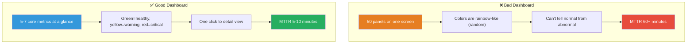
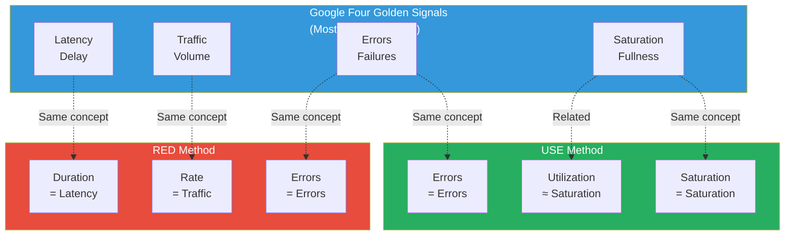
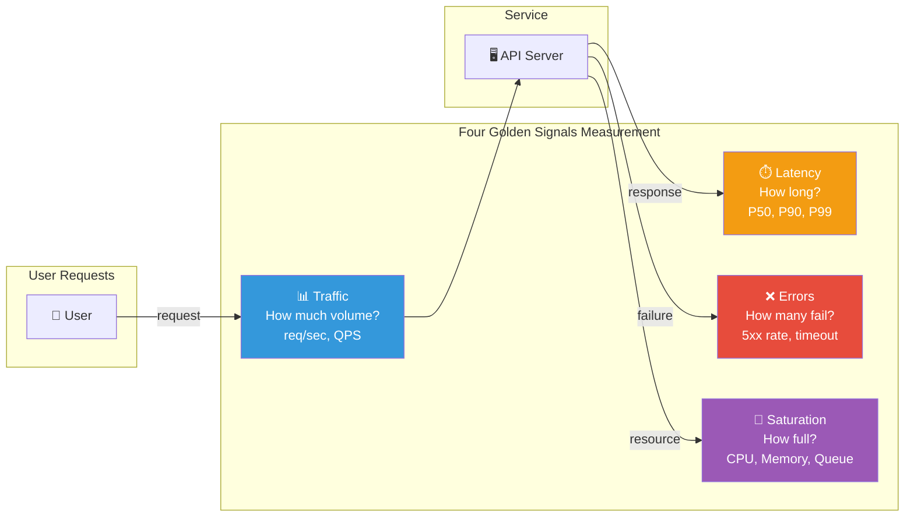
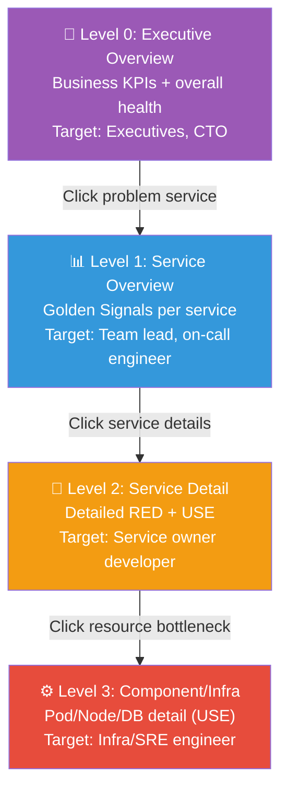
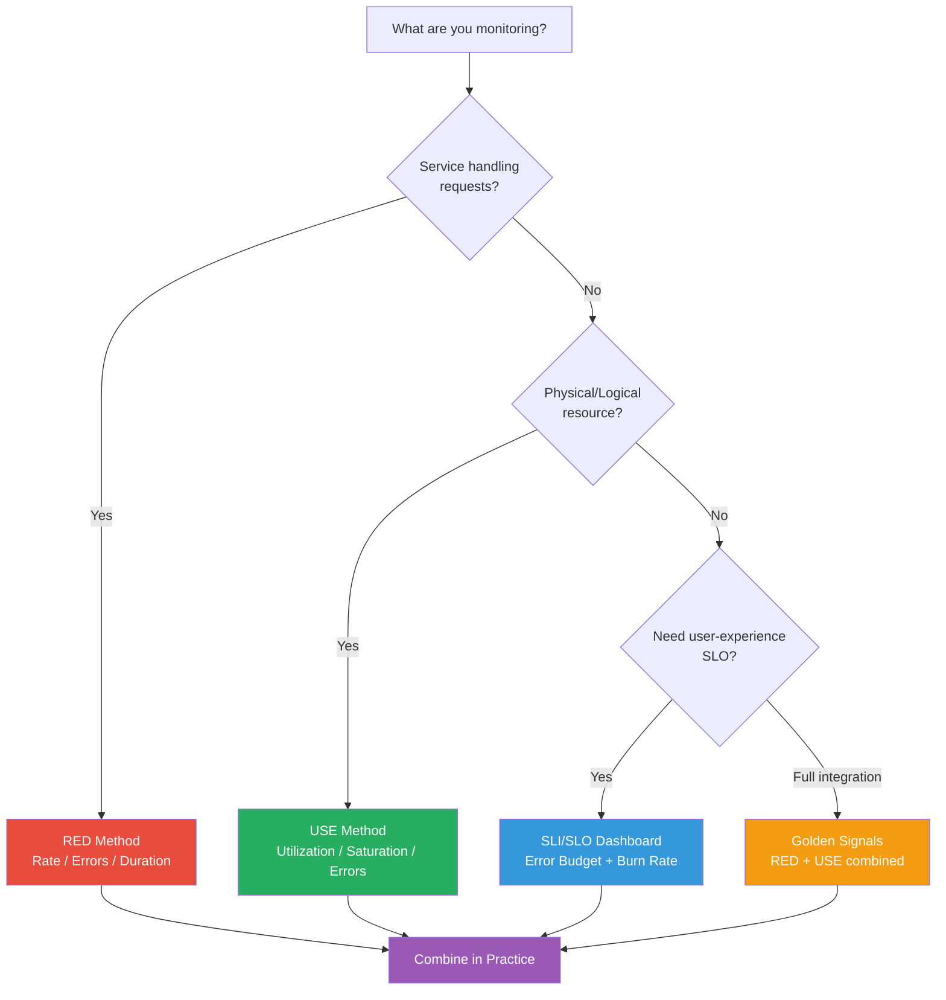

# Dashboard Design — The Skill of Turning Data into Stories

> You've learned to collect metrics with [Prometheus](./02-prometheus) and visualize them with [Grafana](./03-grafana). But dashboards with dozens of panels scattered randomly create chaos, not clarity. The real question isn't "what should we show" but "why are we showing it." This chapter systematically covers **goal-driven dashboard design principles**: RED Method, USE Method, Google's Four Golden Signals, and SLI/SLO dashboards. You'll learn how senior engineers design dashboards that let you diagnose any outage in 3 seconds.

---

## 🎯 Why Dashboard Design Matters

### Real-World Analogy: Car Dashboard vs Airplane Cockpit

A car dashboard has just speed, fuel, and engine temperature. Minimal, focused. An airplane cockpit has hundreds of instruments, but they're not random — they're thoughtfully organized:

- **6 most critical instruments** (Primary Flight Display) are centered
- **Warning lights** are red and in your immediate view
- **Engine status** is grouped on the right side
- **In emergencies**, information is highlighted by priority

If an airplane's instruments were scattered randomly, the pilot would crash during an emergency.

**Server dashboards work the same way.** During an outage, you need to understand the situation in 3 seconds.

```
Real-world situations requiring good dashboard design:

• 30 dashboards but don't know which to check during incidents      → Need hierarchy
• 50 panels but can't tell what's critical                          → Need information density optimization
• Dev team, SRE team, execs want different views                    → Need multi-audience dashboards
• "Error rate is high" vs "which service has high error rate?"      → Need RED/USE methods
• Want to check SLO violations in real-time                         → Need SLI/SLO dashboards
• Can't track who modified what in dashboards                       → Need Dashboard as Code
• 3 AM incident, opened dashboard but can't find the cause          → Need drill-down structure
```

### Good Dashboard vs Bad Dashboard



### Why Dashboard Design Skills Matter

```
Dashboard quality impacts incident response speed:

No design          ██████████████████████████████████  MTTR 60min, False alerts 50%+
Basic metrics only ████████████████████████            MTTR 30min, False alerts 30%
Methodology-based  ████████████████                    MTTR 15min, False alerts 15%
SLI/SLO + Hierarchy ████████                            MTTR 5min,  False alerts 5%

→ Systematic dashboard design speeds up incident response 10x+
```

---

## 🧠 Core Concepts

### 1. Dashboard Design Methodology Overview

When designing dashboards, the question "what should we monitor?" is answered by three proven methodologies:

```
Three Core Dashboard Design Methodologies:

┌─────────────────┬──────────────────┬──────────────────┐
│   RED Method    │   USE Method     │  Golden Signals  │
├─────────────────┼──────────────────┼──────────────────┤
│ Service-focused │ Resource-focused │ User experience  │
│ Rate            │ Utilization      │ Latency          │
│ Errors          │ Saturation       │ Traffic          │
│ Duration        │ Errors           │ Errors           │
│                 │                  │ Saturation       │
├─────────────────┼──────────────────┼──────────────────┤
│ APIs, web       │ CPU, memory,     │ Entire system    │
│ microservices   │ disk, network    │ SRE perspective  │
└─────────────────┴──────────────────┴──────────────────┘
```

### 2. RED Method — The Service-Centric View

> **Analogy**: Restaurant order tracking board

Imagine a restaurant's order status board:

- **Rate** (order rate): "How many orders come in per minute?" — Is business good?
- **Errors** (error rate): "What's our mistake rate?" — Service quality
- **Duration** (prep time): "How long until the meal is ready?" — Customer satisfaction

Three metrics tell you if a restaurant is functioning well.

```
RED Method Formula:

Rate     = Requests processed per second (throughput)
Errors   = Ratio of failed requests (error rate)
Duration = Request processing time (latency distribution)

Apply to: "Any service that receives and processes requests"
→ API Gateway, Web Server, microservices, message consumers
```

### 3. USE Method — The Infrastructure View

> **Analogy**: Road traffic information display

A traffic information board shows:

- **Utilization** (road occupancy): "How full is the road?" — Current usage
- **Saturation** (queuing vehicles): "How many cars are waiting?" — Approaching limit
- **Errors** (accidents): "Any accidents?" — Failures

```
USE Method Formula:

Utilization = Resource usage percentage (0-100%)
Saturation  = Jobs waiting for resource (queue length, wait time)
Errors      = Error events (hardware failures, timeouts)

Apply to: "Any physical/logical resource"
→ CPU, Memory, Disk, Network, DB connection pools, thread pools
```

### 4. Google Four Golden Signals — The SRE Standard

> **Analogy**: Patient vital signs — Just like doctors check temperature, pulse, breathing, and blood pressure first

Google SRE defines four "vital signs" of a system:

```
Four Golden Signals:

1. Latency    (Delay)    — How long to handle a request
                          Measure success and failure separately!
2. Traffic    (Volume)   — Request volume
                          HTTP req/sec, transactions/sec
3. Errors     (Failures) — Failed request ratio
                          Explicit errors (5xx) + implicit errors (slow 200)
4. Saturation (Fullness) — How "full" is the system
                          CPU, memory, I/O, queue length
```

### 5. Relationships Between Three Methodologies



> **Conclusion**: Golden Signals = RED + USE combined. Practically: apply RED to services, USE to infrastructure, and integrate everything with Golden Signals perspective.

### 6. SLI/SLO Dashboard Concepts

> **Analogy**: School report card — SLI is the test score, SLO is the goal grade

- SLI = "Math exam: 85 points" (measured value)
- SLO = "Keep math average above 80" (goal)
- Error Budget = "5 points leeway" (allowed variance)

```
SLI/SLO Dashboard Core Elements:

SLI (Service Level Indicator)
→ Measurable service quality metric
   Example: "% of requests with <200ms response", "% success rate"

SLO (Service Level Objective)
→ Target value for SLI
   Example: "99.9% of requests complete in <200ms", "error rate <0.1%"

Error Budget (Available failure)
→ How much failure is acceptable before violating SLO
   Example: 99.9% SLO → 43.2 minutes allowed downtime monthly

Burn Rate (Consumption speed)
→ How fast the error budget is being consumed
   Example: Burn Rate 2.0 → spending budget 2x faster than normal
```

More detailed SRE concepts covered in [SRE Section](../10-sre/).

---

## 🔍 Detailed Exploration

### 1. RED Method Dashboard Design

#### Rate (Request Rate) Panel

```yaml
# Rate: Requests per second (QPS)
# PromQL Query Patterns

# Total request rate
sum(rate(http_requests_total[5m]))

# Request rate per service
sum by (service) (rate(http_requests_total[5m]))

# Top 10 endpoints by traffic
topk(10, sum by (handler) (rate(http_requests_total[5m])))

# Request rate by status code
sum by (status_code) (rate(http_requests_total[5m]))
```

```
Rate Panel Design Guide:

Panel Type: Time Series (line chart)
Y-axis: req/sec
Aggregation Interval: [5m] (stable graph) or [1m] (sensitive detection)

Add Comparison Baselines:
├── Last week same time (shift 7d)
├── Daily average
└── Peak traffic threshold

Important: rate() range must be ≥4x scrape_interval
           scrape_interval=15s → use [1m] or longer minimum
```

#### Errors (Error Rate) Panel

```yaml
# Errors: Error ratio (%)
# PromQL Query Patterns

# Overall error rate (5xx basis)
sum(rate(http_requests_total{status_code=~"5.."}[5m]))
/
sum(rate(http_requests_total[5m]))
* 100

# Error rate per service
sum by (service) (rate(http_requests_total{status_code=~"5.."}[5m]))
/
sum by (service) (rate(http_requests_total[5m]))
* 100

# gRPC error rate
sum(rate(grpc_server_handled_total{grpc_code!="OK"}[5m]))
/
sum(rate(grpc_server_handled_total[5m]))
* 100
```

```
Errors Panel Design Guide:

Panel Type: Stat (single number) + Time Series (trend)
Display Format: Percentage (%)
Color Thresholds:
├── Green: < 0.1% (normal)
├── Yellow: 0.1% ~ 1% (attention needed)
└── Red: > 1% (critical)

Important Note: "200 OK but took 3 seconds" is also an error!
               → Also classify slow 200s as "implicit errors"
```

#### Duration (Latency) Panel

```yaml
# Duration: Response time distribution
# PromQL Query Patterns (histogram-based)

# P50 (Median)
histogram_quantile(0.50,
  sum by (le) (rate(http_request_duration_seconds_bucket[5m]))
)

# P90
histogram_quantile(0.90,
  sum by (le) (rate(http_request_duration_seconds_bucket[5m]))
)

# P99
histogram_quantile(0.99,
  sum by (le) (rate(http_request_duration_seconds_bucket[5m]))
)

# Average response time
sum(rate(http_request_duration_seconds_sum[5m]))
/
sum(rate(http_request_duration_seconds_count[5m]))
```

```
Duration Panel Design Guide:

Panel Type: Time Series (P50, P90, P99 on single graph)
Y-axis: seconds or milliseconds

Percentile Color Coding:
├── P50 (median): Green — most users' experience
├── P90: Yellow — 10% of users experience this
├── P99: Red — worst user experience
└── Average: Dotted line — reference only (don't trust averages!)

Critical Warning: Never rely on average alone!
Example: P50=50ms, P99=5000ms, Average=200ms
         → Average looks "fine" but 1% of users suffer 5 seconds!
         → Always show percentile distribution
```

#### Complete RED Dashboard Layout

```
┌─────────────────────────────────────────────────────────────────┐
│                    Service: payment-service                       │
├──────────────────┬──────────────────┬───────────────────────────┤
│   📊 Rate (QPS)  │   ❌ Error Rate   │      ⏱️ Duration         │
│   [Stat: 1.2K/s] │   [Stat: 0.03%]  │   [Stat: P99=120ms]     │
│   Color: Blue    │   Color: Green   │   Color: Green          │
├──────────────────┴──────────────────┴───────────────────────────┤
│                  Rate Trend (Time Series)                        │
│   ───── Current  ─ ─ ─ Last Week                                │
├─────────────────────────────────────────────────────────────────┤
│                  Error Rate Trend (Time Series)                  │
│   ▓▓▓ 5xx  ░░░ 4xx                                             │
├─────────────────────────────────────────────────────────────────┤
│                  Latency Distribution (Time Series)              │
│   ───── P50  ───── P90  ───── P99                               │
├─────────────────────────────────────────────────────────────────┤
│         Top 5 Slowest Endpoints (Table)                          │
│   /api/search     P99=350ms    1200 req/s                       │
│   /api/checkout   P99=280ms     800 req/s                       │
└─────────────────────────────────────────────────────────────────┘
```

### 2. USE Method Dashboard Design

#### CPU

```yaml
# USE Method - CPU
# PromQL Query Patterns

# Utilization: CPU usage percentage
1 - avg by (instance) (
  rate(node_cpu_seconds_total{mode="idle"}[5m])
)

# Saturation: CPU run queue (processes waiting)
node_load1  # 1-minute load average
# Or in container environments:
rate(container_cpu_cfs_throttled_seconds_total[5m])

# Errors: CPU errors (hardware level)
node_edac_correctable_errors_total  # ECC memory correction errors
```

#### Memory

```yaml
# USE Method - Memory
# PromQL Query Patterns

# Utilization: Memory usage percentage
1 - (node_memory_MemAvailable_bytes / node_memory_MemTotal_bytes)

# Saturation: Swap usage (when memory exhausted, spills to disk)
node_memory_SwapTotal_bytes - node_memory_SwapFree_bytes

# Or OOM Kill count
increase(node_vmstat_oom_kill[1h])

# Errors: Memory errors
node_edac_uncorrectable_errors_total
```

#### Disk I/O

```yaml
# USE Method - Disk
# PromQL Query Patterns

# Utilization: Disk time used
rate(node_disk_io_time_seconds_total[5m])

# Saturation: I/O wait queue
rate(node_disk_io_time_weighted_seconds_total[5m])

# Errors: Disk I/O errors (requires separate log collection)

# Disk space usage
1 - (node_filesystem_avail_bytes / node_filesystem_size_bytes)
```

#### Network

```yaml
# USE Method - Network
# PromQL Query Patterns

# Utilization: Network bandwidth usage
rate(node_network_receive_bytes_total[5m]) * 8  # bits per second
rate(node_network_transmit_bytes_total[5m]) * 8

# Saturation: Network queue drops
rate(node_network_receive_drop_total[5m])
rate(node_network_transmit_drop_total[5m])

# Errors: Network errors
rate(node_network_receive_errs_total[5m])
rate(node_network_transmit_errs_total[5m])
```

#### USE Method Resource Checklist

```
USE Method Completeness Checklist:

┌──────────────────┬──────────────────┬──────────────────┬──────────────┐
│   Resource       │  Utilization     │  Saturation      │  Errors      │
├──────────────────┼──────────────────┼──────────────────┼──────────────┤
│ CPU              │ CPU usage %      │ Run queue length │ Machine check│
│ Memory           │ Memory usage %   │ Swap usage       │ OOM kills    │
│ Disk I/O         │ I/O utilization  │ I/O wait queue   │ I/O errors   │
│ Disk Space       │ Space usage %    │ Filesystem full  │ R/W errors   │
│ Network          │ Bandwidth usage  │ Dropped packets  │ Net errors   │
│ DB Conn Pool     │ Active ratio %   │ Waiting conns    │ Timeouts     │
│ Thread Pool      │ Active threads % │ Queued jobs      │ Rejected     │
│ File Descriptor  │ Open FD ratio    │ FD limit near    │ EMFILE       │
└──────────────────┴──────────────────┴──────────────────┴──────────────┘
```

### 3. Four Golden Signals Dashboard Design

Golden Signals integrate RED and USE perspectives for comprehensive monitoring:



#### Golden Signals PromQL Query Set

```yaml
# ═══════════════════════════════════════════
# Golden Signals Unified PromQL Query Set
# ═══════════════════════════════════════════

# --- 1. Latency ---
# P99 of successful requests
histogram_quantile(0.99,
  sum by (le) (
    rate(http_request_duration_seconds_bucket{status_code!~"5.."}[5m])
  )
)

# P99 of failed requests (separate measurement!)
histogram_quantile(0.99,
  sum by (le) (
    rate(http_request_duration_seconds_bucket{status_code=~"5.."}[5m])
  )
)

# --- 2. Traffic ---
# Requests per second
sum(rate(http_requests_total[5m]))

# Traffic distribution per service
sum by (service) (rate(http_requests_total[5m]))

# --- 3. Errors ---
# Error ratio (errors / total)
sum(rate(http_requests_total{status_code=~"5.."}[5m]))
/
sum(rate(http_requests_total[5m]))

# --- 4. Saturation ---
# CPU saturation
avg(1 - rate(node_cpu_seconds_total{mode="idle"}[5m]))

# Memory saturation
1 - (sum(node_memory_MemAvailable_bytes) / sum(node_memory_MemTotal_bytes))

# Connection pool saturation (HikariCP example)
hikaricp_connections_active / hikaricp_connections_max
```

### 4. SLI/SLO Dashboard Design

#### SLI Definition Patterns

```yaml
# ═══════════════════════════════════════════
# SLI Definition Examples
# ═══════════════════════════════════════════

# Availability SLI: Success ratio
# "% of requests that succeeded (non-5xx)"
sum(rate(http_requests_total{status_code!~"5.."}[30d]))
/
sum(rate(http_requests_total[30d]))

# Latency SLI: Fast response ratio
# "% of requests completing within 200ms"
sum(rate(http_request_duration_seconds_bucket{le="0.2"}[30d]))
/
sum(rate(http_request_duration_seconds_count[30d]))

# Throughput SLI: Processing ratio
# "% of jobs completed within 5 minutes"
sum(rate(jobs_completed_total[30d]))
/
sum(rate(jobs_submitted_total[30d]))
```

#### Error Budget Calculation

```yaml
# ═══════════════════════════════════════════
# Error Budget Calculation
# ═══════════════════════════════════════════

# SLO = 99.9% (0.999)
# Error Budget = 1 - SLO = 0.1%

# 30-day error budget (in minutes)
# 30 days × 24h × 60min × 0.001 = 43.2 minutes

# Percentage of error budget consumed so far
(1 - (
  sum(rate(http_requests_total{status_code!~"5.."}[30d]))
  /
  sum(rate(http_requests_total[30d]))
)) / (1 - 0.999)

# Burn Rate (how fast budget is consumed)
# Actual error rate / Allowed error rate
(
  sum(rate(http_requests_total{status_code=~"5.."}[1h]))
  /
  sum(rate(http_requests_total[1h]))
) / (1 - 0.999)
```

#### SLI/SLO Dashboard Layout

```
┌─────────────────────────────────────────────────────────────────┐
│                  Service: checkout-service                       │
│                  SLO: 99.9% | Window: 30 days                    │
├───────────────────┬─────────────────┬───────────────────────────┤
│  Current SLI      │  Error Budget   │  Burn Rate                │
│  [Gauge: 99.95%]  │  [Gauge: 52%]   │  [Stat: 0.8x]           │
│  Color: Green     │  Color: Yellow  │  Color: Green            │
│  Goal: 99.9%      │  Remaining: 22.5min │  Normal range         │
├───────────────────┴─────────────────┴───────────────────────────┤
│              SLI Trend (30 days) — Target line 99.9%             │
│  ═══════════════════════════════╗                               │
│  ─── Current SLI   ─ ─ SLO Target ║ ← Below this = violation    │
│  ═══════════════════════════════╝                               │
├─────────────────────────────────────────────────────────────────┤
│              Error Budget Depletion (30 days)                    │
│  100% ████████████████████████░░░░░░░░░░░░░░ 52% remaining      │
│       ^                        ^             ^                   │
│       Month start             Now           Month end (predict)  │
├─────────────────────────────────────────────────────────────────┤
│              Burn Rate Trend (Last 6 hours)                      │
│  Warning: 2.0x ─ ─ ─ ─ ─ ─ ─ ─                                  │
│  Critical: 10.0x ─ ─ ─ ─ ─ ─ ─ ─                                │
│  Current:  ─────── 0.8x (normal)                                │
└─────────────────────────────────────────────────────────────────┘
```

### 5. Dashboard Hierarchy (Drill-Down)

Dashboards must have layered hierarchy. Putting everything on one screen shows nothing.



#### Level 0: Executive Overview

```
Purpose: Answer "Is the whole system OK?" in 3 seconds

┌───────────────────────────────────────────────────┐
│           System Health Overview                   │
├────────┬────────┬────────┬────────┬───────────────┤
│ Order  │ Payment│ Shipping│ Auth   │ Search       │
│ 🟢 OK  │ 🟢 OK  │ 🟡 WARN │ 🟢 OK  │ 🟢 OK        │
├────────┴────────┴────────┴────────┴───────────────┤
│ Total Request Rate: 12.5K/s   Error Rate: 0.02%   │
│ P99 Latency: 180ms            SLO: 99.97%         │
├───────────────────────────────────────────────────┤
│ Error Budget: ████████████████░░░░ 78% remaining  │
│ Active Incidents: 0             Last Deploy: 2h   │
└───────────────────────────────────────────────────┘

Includes:
• Service health status (Traffic Light: green/yellow/red)
• System-wide SLO compliance rate
• Error Budget remaining
• Active incident count
• Recent deployment markers
```

#### Level 1: Service Overview

```
Purpose: "Which service is the problem?" Instant identification

Includes (per service, RED summary):
• Rate: Current rate + trend vs last week
• Errors: Error rate + sparkline trend
• Duration: P50, P99 + SLO status

Structure:
• Each row = one service
• Anomalies sorted to top
• Click to drill into Level 2
```

#### Level 2: Service Detail

```
Purpose: "What's wrong with this service?" Narrow down cause

Includes:
• Full RED Method panels (Rate, Errors, Duration detail)
• Endpoint analysis (Top slow/error endpoints)
• Dependency status (downstream services)
• Recent deployment events (annotations)
• Pod/container status
```

#### Level 3: Component/Infrastructure

```
Purpose: "Infrastructure bottleneck?" Root cause at system level

Includes:
• Full USE Method (CPU, Memory, Disk, Network)
• Per-Pod/Node resource usage
• Database connection pools, slow queries
• Cache hit rate (Redis, Memcached)
• Message queue depth (Kafka lag, SQS depth)
```

### 6. Information Density Optimization

#### Panel Count Guidelines

```
Optimal panels per dashboard:

❌ Bad:    30+ panels  → "Information overload" — nothing visible
⚠️ OK:     15-20 panels → "Bit complex" — scrolling needed in urgent situation
✅ Good:   7-12 panels   → "Core info at glance" — no scroll needed
🎯 Best:   5-7 panels    → "Glance dashboard" — status clear in 3 seconds

Rule: "One dashboard = one question"
├── "Is service healthy?" → Overview (5-7 panels)
├── "Which service broken?" → Service list (7-10 panels)
├── "Why is it broken?" → Detail (10-15 panels)
└── "Infrastructure issue?" → Infra (10-15 panels)
```

#### Visual Hierarchy (Information Priority)

```
Information Priority Based Layout:

┌─────────────────────────────────────────────────┐
│  [1st Priority] Current Status — Stat/Gauge     │
│  "Is everything OK right now?" → Top, largest   │
├─────────────────────────────────────────────────┤
│  [2nd Priority] Trends — Time Series Panel      │
│  "When did it break?" → Middle section          │
├─────────────────────────────────────────────────┤
│  [3rd Priority] Details — Table/Heatmap        │
│  "What specifically failed?" → Bottom section   │
└─────────────────────────────────────────────────┘

Reading pattern: Top → Bottom, Left → Right (Z-pattern)
```

### 7. Color and Layout Principles

#### Color Rules

```
Standard Dashboard Colors:

1. Status Colors (NEVER change):
   🟢 Green (#27ae60): OK, SLO met
   🟡 Yellow (#f39c12): Warning, SLO approaching
   🔴 Red (#e74c3c): Critical, SLO violated

2. Data Series Colors:
   Blue (#3498db): Primary metric (traffic, rate)
   Purple (#9b59b6): Secondary metric
   Cyan (#1abc9c): Baseline for comparison

3. Background Rules:
   Dark theme recommended (less eye strain, better contrast)
   Red is more visible on dark background than light

4. NEVER Do:
   ❌ 7+ different colors (rainbow effect)
   ❌ Red-Green only (colorblind users can't distinguish)
   ❌ Inconsistent colors (different meaning = different color)
```

#### Layout Principles

```
Grafana Layout (24-column grid):

1. Grid System:
   ├── Stat panel: 4-6 columns (4-6 per row)
   ├── Time Series: 12-24 columns (full width)
   └── Table: 12-24 columns (full width)

2. Row (Group) Organization:
   ├── Row 1: "Current Status" (Stat, Gauge)
   ├── Row 2: "Traffic & Error" (Time Series)
   ├── Row 3: "Latency" (Time Series, Heatmap)
   └── Row 4: "Detail Analysis" (Table)

3. Row Folding:
   ├── Default: Show key rows only
   └── Expandable: Detail rows fold/unfold

4. Repeat Pattern:
   ├── Use Variables for service/instance selection
   └── Panels repeat based on variable values
```

### 8. Dashboard Operations Management

#### Dashboard as Code

Dashboards should be managed like code, not just through UI.

```yaml
# Grafana Provisioning Example
# dashboards.yaml
apiVersion: 1
providers:
  - name: 'team-dashboards'
    orgId: 1
    folder: 'Production'
    type: file
    disableDeletion: true
    updateIntervalSeconds: 30
    options:
      path: /var/lib/grafana/dashboards
      foldersFromFilesStructure: true
```

```
Dashboard as Code Implementation:

1. Grafana Provisioning
   ├── JSON files in Git repo
   ├── Auto-deploy via CI/CD
   └── Separate variables per environment

2. Grafonnet (Jsonnet-based)
   ├── Program dashboards programmatically
   ├── Reusable component libraries
   └── Code review + testing

3. Terraform Grafana Provider
   ├── Manage dashboards with Terraform
   ├── State management + change tracking
   └── Unified infrastructure management
```

#### Dashboard Review Process

```
Dashboard Change Workflow:

┌──────────┐    ┌──────────┐    ┌──────────┐    ┌──────────┐
│ 1. Edit  │ →  │ 2. Create│ →  │ 3. Review│ →  │ 4. Deploy│
│ JSON     │    │ PR       │    │ & Approve│    │ via CI/CD│
└──────────┘    └──────────┘    └──────────┘    └──────────┘

Review Checklist:
☐ Purpose of dashboard clear? (One sentence explanation)
☐ Target audience defined?
☐ Panel count appropriate? (7-15)
☐ Color rules followed?
☐ PromQL queries efficient? (Using Recording Rules?)
☐ Drill-down links connected?
☐ Variables properly set up?
☐ Time range default reasonable?
☐ Access permissions correct?
```

#### Version Control and Backup Strategy

```yaml
# Git Repository Structure Example
dashboards/
├── README.md
├── provisioning/
│   └── dashboards.yaml
├── overview/
│   ├── system-health.json         # L0: Executive
│   └── service-overview.json      # L1: Service
├── services/
│   ├── payment-service.json       # L2: Detail
│   ├── order-service.json
│   └── user-service.json
├── infrastructure/
│   ├── kubernetes-cluster.json    # L3: Infra
│   ├── node-resources.json
│   └── database-performance.json
├── slo/
│   ├── checkout-slo.json          # SLI/SLO
│   └── search-slo.json
└── libraries/
    ├── red-method-row.libsonnet   # Reusable Grafonnet components
    └── use-method-row.libsonnet
```

---

## 💻 Hands-On Practice

### Exercise 1: Build RED Method Dashboard

Assuming Prometheus metrics are being collected into Grafana:

#### Step 1: Generate Test Metrics (Demo App)

```yaml
# docker-compose.yaml
version: '3.8'
services:
  prometheus:
    image: prom/prometheus:latest
    ports:
      - "9090:9090"
    volumes:
      - ./prometheus.yml:/etc/prometheus/prometheus.yml

  grafana:
    image: grafana/grafana:latest
    ports:
      - "3000:3000"
    environment:
      - GF_SECURITY_ADMIN_PASSWORD=admin

  # Demo metrics app
  demo-app:
    image: quay.io/brancz/prometheus-example-app:v0.4.0
    ports:
      - "8080:8080"
```

```yaml
# prometheus.yml
global:
  scrape_interval: 15s

scrape_configs:
  - job_name: 'demo-app'
    static_configs:
      - targets: ['demo-app:8080']
```

```bash
# Run and generate traffic
docker-compose up -d

# Generate traffic (separate terminal)
while true; do
  curl -s http://localhost:8080/ > /dev/null
  curl -s http://localhost:8080/err > /dev/null  # Generate errors
  sleep 0.1
done
```

#### Step 2: Build RED Dashboard in Grafana

```
1. Access Grafana (http://localhost:3000, admin/admin)
2. Add Data Source → Prometheus (http://prometheus:9090)
3. Create Dashboard: "RED Method - Demo Service"

Panel Structure:

[Row 1: Current Status]
├── Panel 1 (Stat): Rate
│   Query: sum(rate(http_requests_total[5m]))
│   Unit: req/s
│
├── Panel 2 (Stat): Error Rate
│   Query: sum(rate(http_requests_total{code=~"5.."}[5m]))
│         / sum(rate(http_requests_total[5m])) * 100
│   Unit: percent
│   Thresholds: 0=green, 0.1=yellow, 1=red
│
└── Panel 3 (Stat): P99 Latency
    Query: histogram_quantile(0.99,
            sum by (le) (rate(http_request_duration_seconds_bucket[5m])))
    Unit: seconds

[Row 2: Trends]
├── Panel 4 (Time Series): Request Rate
│   Query A: sum(rate(http_requests_total[5m]))  alias: Current
│   Query B: sum(rate(http_requests_total[5m] offset 7d))  alias: Last Week
│
├── Panel 5 (Time Series): Error Rate Over Time
│   Query: sum(rate(http_requests_total{code=~"5.."}[5m]))
│         / sum(rate(http_requests_total[5m])) * 100
│
└── Panel 6 (Time Series): Latency Distribution
    Query A: histogram_quantile(0.50, ...) alias: P50
    Query B: histogram_quantile(0.90, ...) alias: P90
    Query C: histogram_quantile(0.99, ...) alias: P99
```

### Exercise 2: USE Method Infrastructure Dashboard

```
Panel Structure:

[Row 1: CPU]
├── Panel 1 (Gauge): CPU Utilization %
├── Panel 2 (Time Series): CPU Over Time
└── Panel 3 (Stat): Load Average

[Row 2: Memory]
├── Panel 4 (Gauge): Memory Usage %
└── Panel 5 (Time Series): Memory Breakdown

[Row 3: Disk]
├── Panel 6 (Bar Gauge): Disk Space %
└── Panel 7 (Time Series): Disk I/O

[Row 4: Network]
├── Panel 8 (Time Series): Network Traffic
└── Panel 9 (Stat): Network Errors
```

### Exercise 3: SLI/SLO Dashboard

```
Setup: checkout-service SLO
├── Availability: 99.9% (30-day window)
└── Latency: 99% within 200ms

Panel Structure:

[Row 1: SLO Status]
├── Panel 1 (Gauge): Availability SLI
├── Panel 2 (Gauge): Error Budget Remaining %
└── Panel 3 (Stat): Burn Rate

[Row 2: Trends]
├── Panel 4 (Time Series): SLI + Target Line
└── Panel 5 (Time Series): Error Budget Depletion

[Row 3: Analysis]
├── Panel 6 (Time Series): Multi-Window Burn Rate
└── Panel 7 (Table): SLO Violation Events
```

### Exercise 4: Connect Dashboards with Drill-Down Links

```
Create Data Links:

Level 1 → Level 2:
1. Overview service status panel → Click
2. Edit Panel → Data Links
3. Add:
   Title: "Service Details"
   URL: /d/<dashboard-uid>/service-detail?var-service=${__field.labels.service}
   Open in: New Tab

Level 2 → Level 3:
Similar process for pod/instance links
```

```
Set Up Variables (Filters):

1. Dashboard Settings → Variables → New
   Name: service
   Type: Query
   Query: label_values(http_requests_total, service)
   Refresh: On time range change

2. Apply variable to all panels:
   Before: sum(rate(http_requests_total[5m]))
   After: sum(rate(http_requests_total{service="$service"}[5m]))

3. Enable Multi-select + Include All
   → Single dashboard works for all services
```

---

## 🏢 Real-World Applications

### Case Study 1: E-commerce Platform Dashboard Strategy

```
Company: Mid-size e-commerce (15 microservices, 5M daily requests)

Dashboard Structure:
├── L0: Business Health (1 dashboard)
│   ├── Order success rate, payment success rate, search latency
│   └── Real-time revenue, conversion rate
│
├── L1: Service Map (1 dashboard)
│   ├── 15 service Golden Signals summary
│   └── Service dependency status
│
├── L2: Service Detail (15 dashboards, one per service)
│   ├── RED Method panels
│   └── Endpoint analysis
│
├── L3: Infrastructure (3 dashboards)
│   ├── Kubernetes cluster, MySQL, Redis
│   └── Kafka & message queue
│
└── SLO: SLI/SLO (3 dashboards)
    ├── Checkout (99.95%, P99 < 500ms)
    ├── Search (P99 < 200ms)
    └── Payment (99.99%)

Total: 23 dashboards
On-call workflow: L0 → L1 → L2 → L3 (average 5 min to root cause)
```

### Case Study 2: Optimize Dashboard Performance with Recording Rules

```
Problem: Dashboard loads in 10+ seconds
Root Cause: Every panel re-calculates rate(), histogram_quantile()

Solution: Prometheus Recording Rules

# prometheus-rules.yaml
groups:
  - name: red-method-recording
    interval: 30s
    rules:
      # Pre-calculate Rate
      - record: service:http_requests:rate5m
        expr: sum by (service) (rate(http_requests_total[5m]))

      # Pre-calculate Error Rate
      - record: service:http_errors:ratio_rate5m
        expr: |
          sum by (service) (rate(http_requests_total{status=~"5.."}[5m]))
          / sum by (service) (rate(http_requests_total[5m]))

      # Pre-calculate P99 Latency
      - record: service:http_duration:p99_5m
        expr: |
          histogram_quantile(0.99,
            sum by (service, le) (
              rate(http_request_duration_seconds_bucket[5m])
            )
          )

Results:
Before: 8-12s load time (recalculating each time)
After:  0.5-1s load time (pre-calculated result)

PromQL simplifies:
Before: sum by (service)(rate(http_requests_total[5m]))
After:  service:http_requests:rate5m

Rule: When same PromQL appears 3+ panel times, create Recording Rule
```

### Case Study 3: Team-Based Dashboard Access Strategy

```
Organization Size → Dashboard Strategy:

[Small Team (5-10 people)]
├── 3-5 dashboards
├── UI-based management
└── Everyone has Editor access

[Medium Team (10-50)]
├── 10-30 dashboards
├── Git + Provisioning management
├── Team folders + RBAC
└── PR-based change review

[Large Team (50+)]
├── 50-100+ dashboards
├── Grafonnet + CI/CD
├── LDAP/SSO + detailed RBAC
├── Dashboard SIG oversight
└── Style guide documentation
```

### Case Study 4: Use Deployment Markers (Annotations)

```yaml
# Add Grafana Annotations on deploy
# CI/CD Pipeline Integration

# GitHub Actions Example
- name: Annotate Grafana
  run: |
    curl -X POST http://grafana:3000/api/annotations \
      -H "Authorization: Bearer $GRAFANA_API_KEY" \
      -H "Content-Type: application/json" \
      -d '{
        "dashboardUID": "service-overview",
        "time": '$(date +%s000)',
        "tags": ["deploy", "checkout-service", "v2.3.1"],
        "text": "checkout-service v2.3.1 deployed by CI/CD"
      }'
```

```
Deployment Marker Value:

"Error rate spiked suddenly, why?"
→ Deployment marker shows exactly when
→ "v2.3.1 deployed right before spike → rollback decision" (30 sec to decide)

Without markers: "Hmm, maybe something changed? Let me check git log..."
→ 30 min lost in investigation
```

---

## ⚠️ Common Mistakes

### Mistake 1: "Show Everything on One Dashboard"

```yaml
# ❌ Wrong:
"production-all-in-one" with 80 panels
→ 10s+ load, scroll 5 times, no clue where to look in crisis

# ✅ Correct:
Separate hierarchical dashboards (L0→L1→L2→L3)
7-15 panels per dashboard
One dashboard = one question
```

### Mistake 2: "Only Look at Averages"

```yaml
# ❌ Wrong:
"Average response 200ms, looks fine!"
→ Actually P99 is 5 seconds, 1% of users suffering

# ✅ Correct:
Always show P50 + P90 + P99 together
Never trust average alone
"P99 exceeds SLO" → trigger alert
```

### Mistake 3: "Color Status Without Thresholds"

```yaml
# ❌ Wrong:
Gauge panel shows "75% CPU" but no color threshold
→ "Is 75% high or low? I have no idea"

# ✅ Correct:
All status panels need Threshold configuration
├── CPU: 0-70% green, 70-90% yellow, 90%+ red
├── Memory: 0-80% green, 80-95% yellow, 95%+ red
├── Error rate: 0-0.1% green, 0.1-1% yellow, 1%+ red
└── Disk: 0-70% green, 70-85% yellow, 85%+ red
```

### Mistake 4: "Use rate() with Too Short Range"

```yaml
# ❌ Wrong:
rate(http_requests_total[15s])  # Same as scrape_interval
→ Missing data points, unstable graph

# ✅ Correct:
rate(http_requests_total[5m])  # At least 4x scrape_interval
→ Stable, reliable values

Rule: scrape_interval × 4 minimum for rate() range
      15s → [1m], 30s → [2m], etc.
```

### Mistake 5: "No Dashboard Change Tracking"

```yaml
# ❌ Wrong:
Modify dashboard in Grafana UI
→ Can't track who changed what, when, why
→ "Dashboard was fine yesterday, now broken" → No history

# ✅ Correct:
Dashboard as Code (JSON → Git)
PR-based changes + approvals
Grafana version history (Settings → Versions)
```

### Mistake 6: "Feeling Your Way Without SLI/SLO"

```yaml
# ❌ Wrong:
"Error rate is 0.5%, is that bad?" → No objective measure

# ✅ Correct:
SLO defined: "Error rate < 0.1%"
Current: 0.5% → SLO violation → clear action (stop features, focus on stability)
With numbers, no emotional arguments
```

### Mistake 7: "Apply USE to Services, RED to Infrastructure"

```yaml
# ❌ Wrong:
USE on API services: "API's Utilization?"
RED on CPU: "CPU's Rate?" (doesn't make sense)

# ✅ Correct:
Services (request handlers)      → RED (Rate, Errors, Duration)
Resources (physical/logical)     → USE (Utilization, Saturation, Errors)

Memory Aid:
"Does it handle requests?"    → YES → RED
"Is it being used?"           → YES → USE
```

---

## 📝 Summary

### Core Principles

```
Dashboard Design Core Summary:

1. Methodology Selection
   ├── Service monitoring     → RED Method (Rate, Errors, Duration)
   ├── Resource monitoring    → USE Method (Utilization, Saturation, Errors)
   └── Integrated view        → Golden Signals (Latency, Traffic, Errors, Saturation)

2. SLI/SLO-Based Dashboards
   ├── SLI: Measurable service quality
   ├── SLO: Target for SLI
   ├── Error Budget: Allowed failure
   └── Burn Rate: Consumption speed

3. Dashboard Hierarchy
   ├── L0: Executive (status at a glance)
   ├── L1: Service (identify problem)
   ├── L2: Detail (narrow down cause)
   └── L3: Infra (root cause)

4. Design Principles
   ├── One dashboard = one question
   ├── 7-15 panels per dashboard (scroll-free)
   ├── Color: Green (OK), Yellow (warn), Red (critical)
   ├── Percentiles (P50/90/99) not averages
   └── Drill-down links for hierarchy navigation

5. Operations
   ├── Dashboard as Code (JSON → Git)
   ├── Recording Rules for query optimization
   ├── Deployment markers for change tracking
   └── PR-based review process
```

### Dashboard Design Checklist

```
When Creating New Dashboard:

Planning Phase:
☐ One-sentence purpose statement?
☐ Target audience clear (exec/lead/engineer/SRE)?
☐ Dashboard hierarchy level (L0-L3)?
☐ Correct methodology (RED/USE/Golden Signals)?

Design Phase:
☐ Panel count 7-15?
☐ Layout: Current state → Trend → Detail?
☐ Color rules consistent (green/yellow/red)?
☐ Thresholds on all status panels?
☐ Variables for filtering?
☐ Drill-down links connected?

Implementation:
☐ rate() range ≥ 4x scrape_interval?
☐ Recording Rules for repeated queries?
☐ Dashboard load time < 3 seconds?
☐ JSON committed to Git?

Operations:
☐ Deployment markers configured?
☐ PR review for changes?
☐ Quarterly dashboard review scheduled?
☐ Unused dashboards cleaned up?
```

### Methodology Selection Decision Tree



---

## 🔗 Next Steps

### This Chapter Covered

```
✅ RED Method — Service perspective (Rate, Errors, Duration)
✅ USE Method — Resource perspective (Utilization, Saturation, Errors)
✅ Golden Signals — Google SRE 4-signal framework
✅ SLI/SLO Dashboards — Error budget and burn rate
✅ Hierarchy Design — Multi-level drill-down structure
✅ Information Density — Optimal panel counts and layouts
✅ PromQL Patterns — RED/USE query templates
✅ Operations — Dashboard as Code, review process, version control
```

### Recommended Learning Path

```
Next Topics:

1. [Alerting](./11-alerting)
   → Turn dashboard observations into automated alerts
   → Multi-window burn rate alerts, alert fatigue prevention

2. [SRE Practices](../10-sre/)
   → Apply SLI/SLO to organizational culture
   → Error budget policies, incident management

3. [Prometheus Deep Dive](./02-prometheus)
   → Recording Rules and performance optimization
   → Federation for large-scale deployments

4. [Grafana Advanced](./03-grafana)
   → Provisioning, Alerting, Loki/Tempo integration
   → Unified Metrics-Logs-Traces dashboards
```

### Additional Learning Resources

```
Official Docs:
• Google SRE Book - Chapter 6: Monitoring Distributed Systems
  (https://sre.google/sre-book/monitoring-distributed-systems/)
• USE Method by Brendan Gregg
  (https://www.brendangregg.com/usemethod.html)
• RED Method by Tom Wilkie
  (https://grafana.com/blog/2018/08/02/the-red-method/)

Practical:
• Grafana Dashboard Best Practices
  (https://grafana.com/docs/grafana/latest/dashboards/build-dashboards/best-practices/)
• Prometheus Recording Rules
  (https://prometheus.io/docs/prometheus/latest/configuration/recording_rules/)
• SLO Alerting with Burn Rate
  (https://sre.google/workbook/alerting-on-slos/)
```

---

> **Remember**: A good dashboard isn't about showing everything—it's about showing exactly what's needed for decision-making. In a crisis, you have seconds. If you can't determine the system's status in 3 seconds, the dashboard needs redesign. RED, USE, and Golden Signals are **proven answers** to "what should I monitor." SLI/SLO provide **objective criteria** for "how well are we doing." Together, they let you build dashboards that turn chaos into clarity.
