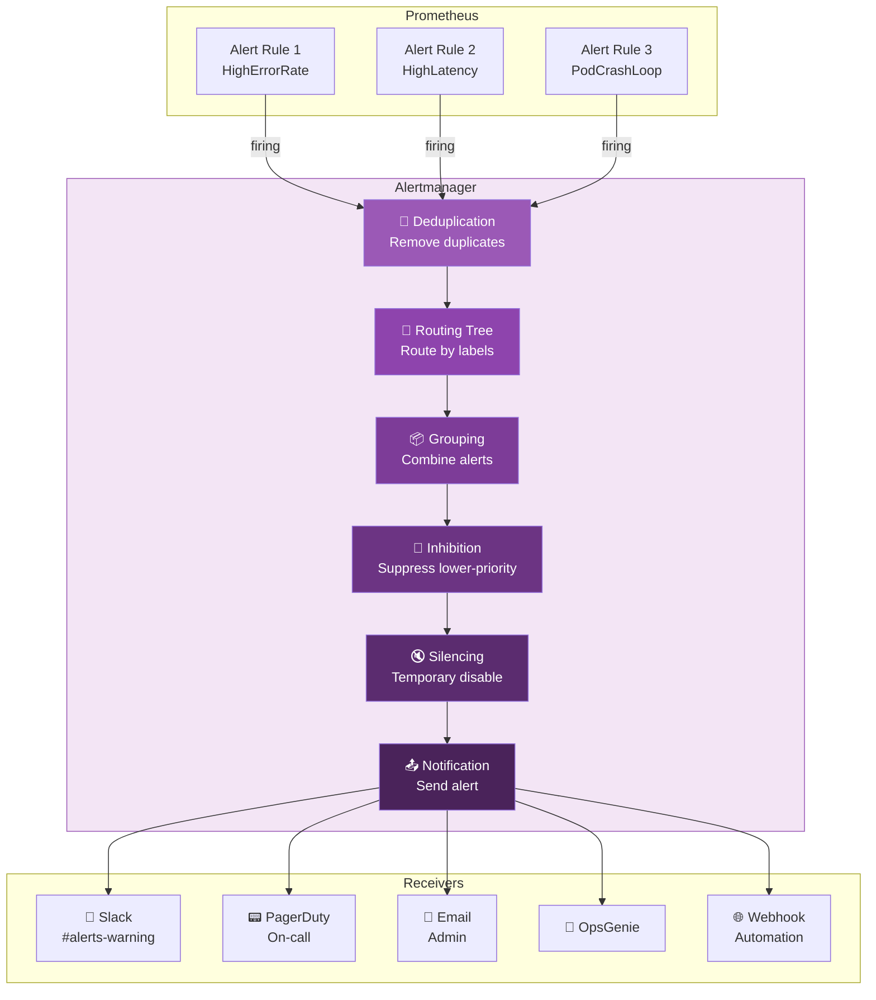
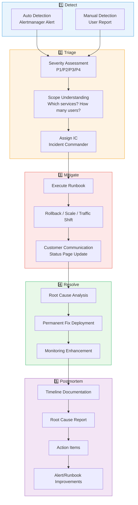

# Alerting Mastery — Becoming the Person Who Knows First About Outages

> Collecting metrics and building dashboards are pointless if no one watches them. Real success means **the right person gets the right information at the right time when problems occur**. You've learned to define [Alert Rules in Prometheus](./02-prometheus) and design [dashboards](./10-dashboard-design). Now let's master the complete lifecycle: how alerts flow from your system, how they're routed intelligently, who receives them, and how they respond—the entire journey from **detection to resolution to prevention**.

---

## 🎯 Why You Need Alerting Mastery

### Real-World Analogy: Apartment Fire Alarm System

Imagine an apartment building's fire alarm system:

- Smoke detector detects smoke (metrics collection + alert rule)
- Alarm sounds (alert triggered)
- Management office identifies which building/floor (alert routing)
- Fire department notified while residents get evacuation notice (escalation)
- Firefighters respond and extinguish the fire (incident response)
- Later, investigation determines fire cause and prevention measures (postmortem)

What if this system failed?

- **Alarm too frequent** → everyone ignores it (Alert Fatigue)
- **No one assigned to listen** → alarm sounds forever (On-call absence)
- **No evacuation plan** → what do residents do? (Runbook absence)
- **Wrong floor notified** → 20th floor evacuation for 2nd floor fire (Routing failure)
- **DB failure → 50 simultaneous alarms** → chaos (Inhibition missing)

**Your alerting system is exactly this fire alarm for your infrastructure.**

```
Real-World Situations Requiring Alert Mastery:

• "Service down at 3 AM, didn't know until morning"       → No alerts configured
• "Got 200 alerts yesterday, missed the real issue"       → Alert Fatigue
• "Alert came but didn't know what to do"                 → Missing Runbooks
• "Same incident woke up 3 people at once"                → Bad routing/grouping
• "DB failed, got 50 cascading alerts"                    → No inhibition
• "SLO violation is severe but no alert"                  → SLO-based alerts missing
• "Same problem recurring monthly"                        → Skipped postmortems
```

### Alert System Maturity Levels

```
Team Maturity Levels:

No alerts           ██████████████████████████████████████  Customers report issues
Basic alerts        ██████████████████████████              Root cause by guessing
Symptom-based       ████████████████████                    Structured response
SLO-based           ████████████████                        Data-driven decisions
Auto-recovery       ████████                                Incidents resolve themselves

→ Level 3 onwards = "alerts actually help"
```

---

## 🧠 Core Concepts

### 1. Alert Lifecycle

> **Analogy**: 911 emergency dispatch system — detection → dispatch → response → resolution → investigation

```mermaid
flowchart LR
    RULE["📏 Alert Rule<br/>Define condition<br/>(Prometheus)"] -->|"Meets condition"| PENDING["⏳ Pending<br/>Wait 'for' duration"]
    PENDING -->|"Duration passed"| FIRING["🔥 Firing<br/>Alert active"]
    FIRING -->|"Send"| AM["📨 Alertmanager<br/>Route + Group"]
    AM -->|"Deliver"| RECEIVER["📱 Receiver<br/>Slack/PagerDuty/Email"]
    RECEIVER -->|"Confirm"| ACK["✅ Acknowledged<br/>Owner assigned"]
    ACK -->|"Fix"| RESOLVE["🔧 Resolved<br/>Problem fixed"]
    RESOLVE -->|"Analyze"| PM["📋 Postmortem<br/>Prevent recurrence"]

    style FIRING fill:#e74c3c,color:#fff
    style AM fill:#9b59b6,color:#fff
    style RESOLVE fill:#27ae60,color:#fff
    style PM fill:#3498db,color:#fff
```



### 2. Alertmanager's Role

> **Analogy**: 911 dispatcher — receives calls and routes to appropriate fire/police/ambulance

| Function | Explanation | Analogy |
|----------|-------------|---------|
| **Routing** | Send alert to right recipient | Route call to correct dispatch center |
| **Grouping** | Combine related alerts | Consolidate 50 fire reports into "downtown area fire" |
| **Inhibition** | Suppress low-priority when high exists | Don't report individual room fires when building burns |
| **Silencing** | Temporarily disable alerts | Turn off alarm during maintenance |
| **Deduplication** | Prevent duplicate delivery | Don't send same alert twice |

### 3. Symptom-based vs Cause-based Alerts

> **Analogy**: Doctor's diagnosis approach

| Aspect | Cause-Based | Symptom-Based |
|--------|------------|---------------|
| **Example** | CPU > 80% | Error rate > 1% |
| **Analogy** | "Blood pressure high" | "Patient has headache" |
| **Advantage** | Shows specific root cause | Direct user impact |
| **Disadvantage** | May not impact users | Requires more investigation |
| **Recommend for Alerts** | Use for dashboard | **Use for alerts** |

```
Alerting Design Rule:

"Is the user experiencing pain?"      → Alert
"Is system resource high?"             → Show on dashboard, don't alert

Examples:
  ✅ Good alerts:    "API 5xx error rate >1%" / "P99 latency >2s"
  ✅ Good alerts:    "Error budget burn rate 14.4x"
  ❌ Bad alerts:     "CPU >80%" / "Memory >90%" (user not yet affected)
  ❌ Bad alerts:     "GC time increased" (underlying symptom, not user impact)
```

### 4. SLO-Based Alerting (Burn Rate)

> **Analogy**: Bank account monitoring — "At this spending rate, I'll be broke when?"

```
SLO: 99.9% availability (30-day Error Budget: 43.2 minutes)

Scenario 1: Slow consumption
  - 0.01% error rate per hour → Monthly budget fine → No alert needed

Scenario 2: Fast consumption (Burn Rate = 14.4x)
  - 1.44% error rate per hour → Budget exhausted in 3 hours! → Alert immediately

Scenario 3: Critical (Burn Rate = 100x)
  - Full outage → Budget exhausted in 30 minutes! → Emergency alert + escalation
```

### 5. On-Call and Escalation

> **Analogy**: Hospital on-call system — resident doctor first, then attending physician if needed

| Concept | Explanation | Analogy |
|---------|-------------|---------|
| **On-call** | Designated person on duty for alerts | Hospital resident on duty |
| **Rotation** | Colleagues take turns | Rotation schedule |
| **Escalation** | If no response, alert next level | No resident answer → call attending |
| **Runbook** | Step-by-step response guide | Patient treatment protocol |

---

## 🔍 Detailed Exploration

### 1. Alertmanager Architecture



#### Routing Tree (Core of Alertmanager)

The **routing tree** is Alertmanager's heart. It examines alert labels and decides which receiver gets it.

```yaml
# alertmanager.yml - Routing Tree Configuration
route:
  # Default receiver (all unmatched alerts)
  receiver: 'slack-default'

  # Grouping: combine alerts with same alertname + cluster
  group_by: ['alertname', 'cluster']

  # Wait before first notification
  group_wait: 30s

  # Wait for additional alerts in same group
  group_interval: 5m

  # Repeat interval for persistent alerts
  repeat_interval: 4h

  # Sub-routes (evaluated top to bottom)
  routes:
    # Critical → PagerDuty
    - match:
        severity: critical
      receiver: 'pagerduty-critical'
      group_wait: 10s          # Urgent, send fast
      repeat_interval: 1h

      # Within critical, DB → DBA team
      routes:
        - match:
            service: database
          receiver: 'pagerduty-dba'

    # Warning → Slack
    - match:
        severity: warning
      receiver: 'slack-warning'
      repeat_interval: 12h     # Don't spam

    # Info → Slack info channel
    - match:
        severity: info
      receiver: 'slack-info'
      repeat_interval: 24h

    # Team-based routing
    - match_re:
        team: 'platform|infra'
      receiver: 'slack-platform'

    - match:
        team: backend
      receiver: 'slack-backend'
```

```
How Routing Tree Works:

Alert: { alertname: "HighErrorRate", severity: "critical", service: "api" }

route (root)
├─ severity: critical? → YES!
│  ├─ receiver: pagerduty-critical
│  └─ service: database? → NO → send to pagerduty-critical
├─ severity: warning? → (skip)
└─ severity: info? → (skip)

Result: Alert goes to pagerduty-critical
```

#### Grouping

```yaml
# Scenario: 100 pods crash simultaneously
# Without grouping: 100 separate alerts (Slack explosion)
# With grouping: 1 alert with all 100 pods

route:
  group_by: ['alertname', 'namespace']
  group_wait: 30s      # Wait 30s, collect related alerts
  group_interval: 5m   # When group changes, resend in 5m
```

```
Grouping Effect:

Before (No grouping):
  🔔 [FIRING] Pod pod-1 CrashLoopBackOff
  🔔 [FIRING] Pod pod-2 CrashLoopBackOff
  🔔 [FIRING] Pod pod-3 CrashLoopBackOff
  ... (97 more)
  → Engineer: "😱 100 Slack messages!"

After (group_by: [alertname, namespace]):
  🔔 [FIRING:100] PodCrashLoopBackOff
     namespace: production
     Affected pods: pod-1, pod-2, pod-3, ... (+97 more)
  → Engineer: "Got it, 100 pods in production crashing"
```

#### Inhibition (Alert Suppression)

```yaml
# Suppress lower-level alerts when higher-level alert exists
# Example: Don't alert about individual pod failures when node is down

inhibit_rules:
  # When cluster down, suppress all other alerts in that cluster
  - source_match:
      alertname: 'ClusterDown'
    target_match_re:
      alertname: '.+'
    equal: ['cluster']

  # When critical exists, suppress warning for same service
  - source_match:
      severity: 'critical'
    target_match:
      severity: 'warning'
    equal: ['alertname', 'namespace']

  # When node down, suppress pod/container alerts on that node
  - source_match:
      alertname: 'NodeDown'
    target_match_re:
      alertname: 'Pod.+'
    equal: ['node']
```

```
Inhibition Effect:

Scenario: Node-3 failure

Before (No inhibition):
  🔴 [CRITICAL] NodeDown - node-3
  🟡 [WARNING] PodCrashLoop - pod-a on node-3
  🟡 [WARNING] PodCrashLoop - pod-b on node-3
  🟡 [WARNING] HighLatency - service-x on node-3
  🟡 [WARNING] HighMemory - pod-c on node-3
  → 5 alerts (4 are noise)

After (Inhibition configured):
  🔴 [CRITICAL] NodeDown - node-3
  → Other 4 auto-suppressed. Only real root cause!
```

#### Silencing (Temporary Disable)

```bash
# Alertmanager UI or amtool for temporary muting
# Useful during planned maintenance, deployments

amtool silence add \
  --alertmanager.url=http://alertmanager:9093 \
  --author="devops-team" \
  --comment="Planned deployment window" \
  --duration=2h \
  alertname="HighCpu" \
  cluster="production"

# View active silences
amtool silence query \
  --alertmanager.url=http://alertmanager:9093

# Expire a silence
amtool silence expire <silence-id> \
  --alertmanager.url=http://alertmanager:9093
```

---

### 2. Alert Rule Design Principles

#### Basic Alert Rule Structure

```yaml
# prometheus-rules.yml
groups:
  - name: service-alerts
    rules:
      - alert: HighErrorRate          # Alert name (PascalCase)
        expr: |                        # PromQL condition
          sum(rate(http_requests_total{status=~"5.."}[5m])) by (service)
          /
          sum(rate(http_requests_total[5m])) by (service)
          > 0.01
        for: 5m                        # Condition must persist 5 min
        labels:
          severity: critical           # Routing label
          team: backend
        annotations:
          summary: "{{ $labels.service }} error rate {{ $value | humanizePercentage }}"
          description: |
            {{ $labels.service }} 5xx error rate exceeds 1%.
            Current: {{ $value | humanizePercentage }}
          runbook_url: "https://wiki.example.com/runbooks/high-error-rate"
          dashboard_url: "https://grafana.example.com/d/svc?var-service={{ $labels.service }}"
```

#### 5 Principles for Good Alert Rules

```
1. Symptom-based (User Impact)
   ✅ "Error rate > 1%" / "P99 latency > 2s"
   ❌ "CPU > 80%" / "Memory > 90%"

2. 'for' Clause Required
   ✅ for: 5m (persistent issues only)
   ❌ No 'for' (false alarms on spikes)

3. Severity Labeling
   critical → Immediate response (PagerDuty)
   warning  → Within-hours response (Slack)
   info     → Reference only (email)

4. Runbook URL Essential
   ✅ Recipient knows exactly what to do
   ❌ "Alert: HighErrorRate" with no instructions

5. Actionable
   ✅ "API memory under pressure, consider scaling"
   ❌ "GC pause increased" (so what, then what?)
```

#### Core Alert Rule Examples

```yaml
groups:
  # === Availability Alerts ===
  - name: availability-alerts
    rules:
      # Service error rate (most important!)
      - alert: HighErrorRate
        expr: |
          sum(rate(http_requests_total{status=~"5.."}[5m])) by (service)
          / sum(rate(http_requests_total[5m])) by (service)
          > 0.01
        for: 5m
        labels:
          severity: critical
        annotations:
          summary: "{{ $labels.service }} error rate {{ $value | humanizePercentage }}"
          runbook_url: "https://wiki.example.com/runbooks/high-error-rate"

      # Service down
      - alert: ServiceDown
        expr: up{job=~".*-service"} == 0
        for: 1m
        labels:
          severity: critical
        annotations:
          summary: "{{ $labels.instance }} service down"
          runbook_url: "https://wiki.example.com/runbooks/service-down"

  # === Latency Alerts ===
  - name: latency-alerts
    rules:
      - alert: HighLatencyP99
        expr: |
          histogram_quantile(0.99,
            sum(rate(http_request_duration_seconds_bucket[5m])) by (le, service)
          ) > 2.0
        for: 10m
        labels:
          severity: warning
        annotations:
          summary: "{{ $labels.service }} P99 delay {{ $value }}s"
          runbook_url: "https://wiki.example.com/runbooks/high-latency"

      # P50 also high = full impact
      - alert: HighLatencyP50
        expr: |
          histogram_quantile(0.5,
            sum(rate(http_request_duration_seconds_bucket[5m])) by (le, service)
          ) > 1.0
        for: 15m
        labels:
          severity: critical
        annotations:
          summary: "{{ $labels.service }} P50 slow {{ $value }}s — ALL USERS AFFECTED"
          runbook_url: "https://wiki.example.com/runbooks/high-latency-critical"

  # === Infrastructure Alerts ===
  - name: infrastructure-alerts
    rules:
      # Pod repeatedly crashing
      - alert: PodCrashLooping
        expr: |
          increase(kube_pod_container_status_restarts_total[1h]) > 5
        for: 10m
        labels:
          severity: warning
        annotations:
          summary: "{{ $labels.namespace }}/{{ $labels.pod }} restarting ({{ $value }}/1h)"
          runbook_url: "https://wiki.example.com/runbooks/pod-crashloop"

      # Disk will fill soon
      - alert: DiskWillFillIn24h
        expr: |
          predict_linear(node_filesystem_avail_bytes{mountpoint="/"}[6h], 24*3600) < 0
        for: 30m
        labels:
          severity: warning
        annotations:
          summary: "{{ $labels.instance }} disk will fill in 24h"
          runbook_url: "https://wiki.example.com/runbooks/disk-full"

      # Node not ready
      - alert: NodeNotReady
        expr: |
          kube_node_status_condition{condition="Ready", status="true"} == 0
        for: 5m
        labels:
          severity: critical
        annotations:
          summary: "Node {{ $labels.node }} NotReady"
          runbook_url: "https://wiki.example.com/runbooks/node-not-ready"
```

---

### 3. SLO-Based Alerting (Burn Rate Alerts)

Burn Rate is the most powerful SLO alerting approach, preventing both under-alerting and alert fatigue.

#### Multi-Window, Multi-Burn-Rate Strategy

Google SRE's recommended approach: **check both long and short time windows** to avoid false positives.

```yaml
groups:
  - name: slo-burn-rate-alerts
    rules:
      # === CRITICAL: 14.4x Burn Rate ===
      # "We'll exhaust budget in ~50 hours at this rate"
      - alert: SLOErrorBudgetBurnHigh
        expr: |
          (
            sum(rate(http_requests_total{status=~"5.."}[1h])) by (service)
            / sum(rate(http_requests_total[1h])) by (service)
          ) > (14.4 * 0.001)   # 14.4x SLO threshold
          and
          (
            sum(rate(http_requests_total{status=~"5.."}[5m])) by (service)
            / sum(rate(http_requests_total[5m])) by (service)
          ) > (14.4 * 0.001)   # BOTH windows must be high
        for: 2m
        labels:
          severity: critical
          alert_type: burn_rate
        annotations:
          summary: "{{ $labels.service }} Budget 14.4x depletion"
          description: "Budget exhausted in ~50 hours. Immediate action needed."
          runbook_url: "https://wiki.example.com/runbooks/slo-burn-high"

      # === HIGH: 6x Burn Rate ===
      # "We'll exhaust budget in ~5 days at this rate"
      - alert: SLOErrorBudgetBurnMedium
        expr: |
          (sum(rate(http_requests_total{status=~"5.."}[6h])) by (service)
           / sum(rate(http_requests_total[6h])) by (service)) > (6 * 0.001)
          and
          (sum(rate(http_requests_total{status=~"5.."}[30m])) by (service)
           / sum(rate(http_requests_total[30m])) by (service)) > (6 * 0.001)
        for: 5m
        labels:
          severity: critical
          alert_type: burn_rate
        annotations:
          summary: "{{ $labels.service }} Budget 6x depletion"

      # === MEDIUM: 3x Burn Rate ===
      # "We'll exhaust budget in ~10 days at this rate"
      - alert: SLOErrorBudgetBurnSlow
        expr: |
          (sum(rate(http_requests_total{status=~"5.."}[1d])) by (service)
           / sum(rate(http_requests_total[1d])) by (service)) > (3 * 0.001)
          and
          (sum(rate(http_requests_total{status=~"5.."}[2h])) by (service)
           / sum(rate(http_requests_total[2h])) by (service)) > (3 * 0.001)
        for: 15m
        labels:
          severity: warning
          alert_type: burn_rate
        annotations:
          summary: "{{ $labels.service }} Budget 3x depletion (business hours)"
```

#### Why Multi-Window?

```
Single long window problem:
  - Past errors keep alert firing even after recovery
  - "Problem fixed 2 hours ago, alert still on"

Single short window problem:
  - Momentary spike triggers false alarm
  - "CPU spike for 30 seconds, irrelevant alert"

Multi-window solution:
  ✅ Long window: "Is budget actually depleting fast?"
  ✅ Short window: "Is it happening RIGHT NOW?"
  ✅ Both true = real issue, not noise
```

---

### 4. External Integration (PagerDuty, OpsGenie, Slack)

#### Receivers Configuration

```yaml
# alertmanager.yml - Receivers Configuration
receivers:
  # === Slack Integration ===
  - name: 'slack-critical'
    slack_configs:
      - api_url: 'https://hooks.slack.com/services/T00/B00/XXXX'
        channel: '#alerts-critical'
        color: '{{ if eq .Status "firing" }}danger{{ else }}good{{ end }}'
        title: '{{ if eq .Status "firing" }}🔴{{ else }}✅{{ end }} [{{ .Status | toUpper }}] {{ .CommonLabels.alertname }}'
        text: >-
          *Environment:* {{ .CommonLabels.namespace }}
          *Service:* {{ .CommonLabels.service }}
          *Severity:* {{ .CommonLabels.severity }}
          *Summary:* {{ .CommonAnnotations.summary }}
          *Runbook:* {{ .CommonAnnotations.runbook_url }}
          *Dashboard:* {{ .CommonAnnotations.dashboard_url }}
          {{ range .Alerts }}
          - *{{ .Labels.instance }}*: {{ .Annotations.description }}
          {{ end }}
        send_resolved: true

  - name: 'slack-warning'
    slack_configs:
      - api_url: 'https://hooks.slack.com/services/T00/B00/YYYY'
        channel: '#alerts-warning'
        color: 'warning'
        title: '🟡 [{{ .Status | toUpper }}] {{ .CommonLabels.alertname }}'
        text: '{{ .CommonAnnotations.summary }}\nRunbook: {{ .CommonAnnotations.runbook_url }}'
        send_resolved: true

  # === PagerDuty Integration ===
  - name: 'pagerduty-critical'
    pagerduty_configs:
      - service_key: '<PagerDuty-Integration-Key>'
        severity: '{{ .CommonLabels.severity }}'
        description: '{{ .CommonAnnotations.summary }}'
        details:
          firing: '{{ .Alerts.Firing | len }}'
          resolved: '{{ .Alerts.Resolved | len }}'
          runbook: '{{ .CommonAnnotations.runbook_url }}'

  - name: 'pagerduty-dba'
    pagerduty_configs:
      - service_key: '<PagerDuty-DBA-Team-Key>'
        severity: 'critical'

  # === OpsGenie Integration ===
  - name: 'opsgenie-oncall'
    opsgenie_configs:
      - api_key: '<OpsGenie-API-Key>'
        message: '{{ .CommonLabels.alertname }}: {{ .CommonAnnotations.summary }}'
        priority: '{{ if eq .CommonLabels.severity "critical" }}P1{{ else }}P3{{ end }}'
        tags: '{{ .CommonLabels.team }},{{ .CommonLabels.severity }}'

  # === Webhook for Automation ===
  - name: 'auto-remediation'
    webhook_configs:
      - url: 'http://auto-remediation:8080/alerts'
        send_resolved: true

  # === Email ===
  - name: 'email-management'
    email_configs:
      - to: 'devops-leads@example.com'
        from: 'alertmanager@example.com'
        smarthost: 'smtp.example.com:587'
        auth_username: 'alertmanager@example.com'
        auth_password: '<password>'
        send_resolved: true
```

#### PagerDuty Integration Architecture

```
Alertmanager → PagerDuty API → PagerDuty Service
                                  ├── Escalation Policy
                                  │   ├── Level 1: On-call (immediate)
                                  │   ├── Level 2: Team lead (5 min)
                                  │   └── Level 3: Manager (15 min)
                                  ├── On-call Schedule
                                  │   ├── Weekday 9-18: Team A
                                  │   ├── Weekday 18-9: Team B
                                  │   └── Weekends: Rotation
                                  └── Notification Rules
                                      ├── Push (immediate)
                                      ├── SMS (1 min)
                                      └── Phone (3 min)
```

---

### 5. On-Call Rotation Management

#### Schedule Design

```
On-Call Rotation Model:

Team: Alice, Bob, Charlie, Dave (4 members)

Week 1: Alice (Primary) / Bob (Secondary)
Week 2: Bob (Primary) / Charlie (Secondary)
Week 3: Charlie (Primary) / Dave (Secondary)
Week 4: Dave (Primary) / Alice (Secondary)

Principles:
  1. Minimum 2 people (Primary + Secondary failsafe)
  2. Weekly handoff (Monday 10:00 AM)
  3. Allow swaps for personal reasons
  4. Never 2+ weeks consecutive (burnout)
  5. Compensation: Bonus pay or compensatory time off
```

#### On-Call Handoff Checklist

```
Outgoing Engineer Responsibilities:
  - Current issue list
  - Unresolved alert status
  - Recent changes/deployments
  - Known unstable services

Incoming Engineer Verification:
  - Alertmanager/PagerDuty status OK
  - Review last 24h alerts
  - Check Silence list (expiration dates)
  - Confirm Runbook access
  - Test VPN/SSH access
  - Review escalation paths

Tools Check:
  - PagerDuty app notification test
  - Slack alert channel
  - Grafana dashboard access
  - kubectl access
  - Emergency contact list
```

---

### 6. Runbook Creation

#### Runbook Template

```markdown
# Runbook: HighErrorRate

## Overview
- **Alert Name**: HighErrorRate
- **Severity**: Critical
- **Impact**: Some user requests return 5xx errors
- **SLO Impact**: 99.9% availability SLO may be violated

## Investigation Steps

### Step 1: Understand Current State (2 minutes)
1. Open [Service Overview Dashboard](link)
2. Check error rate, traffic, latency
3. Identify affected endpoints

### Step 2: Narrow Cause (5 minutes)
1. Recent deployments? `kubectl rollout history deployment/<service>`
2. Pod status? `kubectl get pods -n production -l app=<service>`
3. Pod logs? `kubectl logs -n production -l app=<service> --tail=100`
4. Dependency status (DB, cache, external APIs)?

### Step 3: Immediate Mitigation
| Cause | Action |
|-------|--------|
| Recent deploy | Rollback: `kubectl rollout undo deployment/<service>` |
| Pod OOM | Scale up: `kubectl scale deployment/<service> --replicas=N` |
| DB connection limit | Check pool, maybe restart pods |
| External API down | Check circuit breaker, enable fallback |
| Traffic spike | Manual scale-out or check HPA |

### Step 4: Verify Resolution
1. Error rate back to normal (< 0.1%)?
2. Latency returned to baseline?
3. Alert status changed to "Resolved"?

## Escalation Criteria
- 15 min unresolved → Page team lead
- 30 min unresolved → Page engineering manager + incident bridge
- Customer impact critical → Update status page, notify customers
```

---

### 7. Incident Response Workflow



#### Severity Definitions

| Severity | Definition | Response Time | Example |
|----------|-----------|-----------|---------|
| **P1 (Critical)** | Core service totally down | 5 min | Payment system down, full outage |
| **P2 (High)** | Major functionality severely degraded | 15 min | Some users getting errors, severe slowdown |
| **P3 (Medium)** | Some functionality affected | Business hours | Minor feature broken, admin tool issue |
| **P4 (Low)** | Minor impact | Next sprint | UI glitch, doc typo |

#### Incident Commander Role

```
IC Responsibilities:

1. Communication Coordination
   - Create #incident-YYYY-MM-DD-service channel
   - Status updates every 10 minutes
   - Executive/stakeholder reports
   - Customer communication

2. Role Assignment
   - IC (self): Coordination + communication
   - Ops Lead: Actual troubleshooting
   - Comms Lead: Customer/external messaging

3. Decision Making
   - "Should we rollback?"
   - "Escalate to manager?"
   - "Update status page?"

4. Documentation
   - Log all actions + timeline
   - Collect data for postmortem
```

#### Blameless Postmortem Template

```markdown
# Postmortem: API Service 500 Error Spike

## Summary
- **Time**: 2025-03-15 14:30-15:45 KST (75 minutes)
- **Severity**: P1
- **Impact**: 2,400 failed payments (35% error rate)
- **Detection**: SLO Burn Rate Alert (automatic)
- **Resolution**: Rollback DB connection pool config

## Timeline
| Time | Event |
|------|--------|
| 14:25 | DB connection pool config change deployed |
| 14:30 | SLOErrorBudgetBurnHigh alert triggered (Burn Rate 20x) |
| 14:32 | On-call confirmed, Incident declared |
| 14:35 | IC assigned, #incident channel created |
| 14:40 | Dashboard shows DB connection errors |
| 14:50 | Git blame points to recent config change |
| 15:00 | Rollback executed |
| 15:15 | Error rate declining |
| 15:30 | Fully resolved, < 0.1% error rate |
| 15:45 | Incident closed |

## Root Cause
DB connection pool max: 50 → 200
DB server limit: max_connections=150
→ Connection requests exceeded limit → connection refused → app error

## Action Items
| Task | Owner | Due |
|------|-------|-----|
| Sync DB pool config with DB server limits | Alice | 3/22 |
| Add DB connection error alerting | Bob | 3/22 |
| Implement canary deploy for config changes | Charlie | 4/1 |
| Update Runbook with DB connection section | Dave | 3/20 |

## Lessons
- Config changes need same scrutiny as code changes
- Missing: DB connection limit monitoring
- Blameless: Process failure (validation), not person
```

---

### 8. Grafana Alerting vs Alertmanager

```
Both can send alerts, but different strengths:

Alertmanager:
  - Prometheus ecosystem core alert router
  - HA clustering with gossip protocol
  - Advanced: Inhibition, grouping rules
  - Prometheus evaluates alert conditions

Grafana Alerting:
  - Multi-datasource (Prometheus, Loki, SQL, CloudWatch)
  - Grafana evaluates conditions
  - Simpler Contact Points + Notification Policies
  - Missing: Inhibition (has Mute Timings)
```

| Comparison | Alertmanager | Grafana Alerting |
|-----------|-------------|-----------------|
| **Data Source** | Prometheus only | Multi-source |
| **Rule Evaluation** | Prometheus | Grafana |
| **User Interface** | Simple web UI | Grafana native |
| **HA** | Gossip clustering | Grafana HA |
| **Grouping** | Advanced | Basic |
| **Inhibition** | Full support | Partial (Mute Timings) |
| **Best For** | Large Prometheus-centric | Multi-datasource integration |

---

## 💻 Hands-On Practice

### Exercise 1: Docker Compose Setup

```yaml
# docker-compose.yml
version: '3.8'

services:
  prometheus:
    image: prom/prometheus:v2.50.0
    ports:
      - "9090:9090"
    volumes:
      - ./prometheus.yml:/etc/prometheus/prometheus.yml
      - ./alert-rules.yml:/etc/prometheus/alert-rules.yml

  alertmanager:
    image: prom/alertmanager:v0.27.0
    ports:
      - "9093:9093"
    volumes:
      - ./alertmanager.yml:/etc/alertmanager/alertmanager.yml

  # Test app
  test-app:
    image: prom/pushgateway:v1.7.0
    ports:
      - "9091:9091"

  grafana:
    image: grafana/grafana:10.3.0
    ports:
      - "3000:3000"
    environment:
      - GF_SECURITY_ADMIN_PASSWORD=admin
```

```yaml
# prometheus.yml
global:
  scrape_interval: 15s
  evaluation_interval: 15s

rule_files:
  - "alert-rules.yml"

alerting:
  alertmanagers:
    - static_configs:
        - targets: ['alertmanager:9093']

scrape_configs:
  - job_name: 'prometheus'
    static_configs:
      - targets: ['localhost:9090']
```

```yaml
# alert-rules.yml
groups:
  - name: test-alerts
    rules:
      # Always firing test alert
      - alert: Watchdog
        expr: vector(1)
        labels:
          severity: none
        annotations:
          summary: "Watchdog: Alertmanager is working"

      # Target down detection
      - alert: TargetDown
        expr: up == 0
        for: 1m
        labels:
          severity: critical
        annotations:
          summary: "{{ $labels.job }}/{{ $labels.instance }} down"
          runbook_url: "https://wiki.example.com/runbooks/target-down"
```

```yaml
# alertmanager.yml
global:
  resolve_timeout: 5m

route:
  receiver: 'default'
  group_by: ['alertname', 'severity']
  group_wait: 30s
  group_interval: 5m
  repeat_interval: 4h

  routes:
    - match:
        severity: critical
      receiver: 'critical-alerts'
      group_wait: 10s

    - match:
        alertname: Watchdog
      receiver: 'watchdog'
      repeat_interval: 1m

receivers:
  - name: 'default'
    webhook_configs:
      - url: 'http://test-app:9091/api/v1/alerts'

  - name: 'critical-alerts'
    webhook_configs:
      - url: 'http://test-app:9091/api/v1/alerts'

  - name: 'watchdog'
    webhook_configs:
      - url: 'http://test-app:9091/api/v1/alerts'

inhibit_rules:
  - source_match:
      severity: 'critical'
    target_match:
      severity: 'warning'
    equal: ['alertname']
```

### Exercise 2: amtool CLI Management

```bash
# Check Alertmanager config
amtool --alertmanager.url=http://localhost:9093 config show

# View all alerts
amtool --alertmanager.url=http://localhost:9093 alert query

# Filter by label
amtool --alertmanager.url=http://localhost:9093 alert query \
  alertname="TargetDown"

# Test routing
amtool --alertmanager.url=http://localhost:9093 config routes test \
  severity="critical" alertname="HighErrorRate"

# Create silence
amtool --alertmanager.url=http://localhost:9093 silence add \
  --author="devops" \
  --comment="Maintenance" \
  --duration=2h \
  alertname="TargetDown"

# Validate config
amtool check-config alertmanager.yml
```

### Exercise 3: Kubernetes with kube-prometheus-stack

```bash
# Install with Helm
helm repo add prometheus-community https://prometheus-community.github.io/helm-charts
helm install kube-prom prometheus-community/kube-prometheus-stack \
  --namespace monitoring --create-namespace

# Add custom alert rules via PrometheusRule CRD
kubectl apply -f - <<EOF
apiVersion: monitoring.coreos.com/v1
kind: PrometheusRule
metadata:
  name: custom-alerts
  namespace: monitoring
spec:
  groups:
    - name: custom.rules
      rules:
        - alert: HighPodRestarts
          expr: increase(kube_pod_container_status_restarts_total[1h]) > 5
          for: 10m
          labels:
            severity: warning
          annotations:
            summary: "{{ $labels.namespace }}/{{ $labels.pod }} restarting"
            runbook_url: "https://wiki.example.com/runbooks/pod-restarts"
EOF
```

---

## 🏢 Real-World Applications

### Alert Fatigue Prevention Strategy

```
Alert Fatigue Problem:
  200+ alerts/day → Alert numbness → Miss real P1 issues → Customers suffer

Solution Framework:

1. Symptom-based Only
   ❌ CPU > 80%, Memory > 90% (cause-based noise)
   ✅ Error rate > 1%, P99 latency > 2s (symptom-based)

2. 'for' Duration Critical
   ❌ No 'for' clause: Single CPU spike triggers alert
   ✅ for: 5-10m: Persistent issues only

3. Severity Stratification
   - Critical: IMMEDIATE issue (PagerDuty, on-call woken up)
   - Warning: Day-shift attention (Slack #alerts)
   - Info: FYI only (email, Slack #info-alerts)

4. Monthly Alert Hygiene Reviews
   - Analyze which alerts led to action
   - Suppress repeatedly-ignored alerts
   - Add alerts for issues that weren't caught

Target: 2-5 real alerts/day per on-call
Warning: 20+ alerts = fatigue starting
Crisis: 50+ alerts = system broken
```

### Enterprise Alerting Architecture

```
Alert Sources:
  Prometheus → Alertmanager → Routing Layer → Incident Platform
  Grafana     ↓                               (PagerDuty/OpsGenie)
  CloudWatch  ↓                                    ↓
              Grouping + Inhibition          On-call scheduling
              Silencing                      Escalation policies
              Deduplication                  Notification channels
                  ↓
              Slack / Email / Phone / SMS
```

### Real-World Tips

```
1. Watchdog Alert Always
   - vector(1) continuously firing
   - If Watchdog stops → monitoring system itself dead
   - Connect to DeadManSnitch or PagerDuty Heartbeat

2. Dashboard Links in Alerts
   - annotations.dashboard_url → 1-click to context
   - annotations.runbook_url → step-by-step fix

3. Version Control Alerts
   - alertmanager.yml + prometheus-rules.yml in Git
   - PR review for all alert changes
   - CI: `amtool check-config` validation

4. On-Call Compensation
   - Pay or time-off to prevent burnout
   - No one should be on-call indefinitely

5. Blameless Postmortems
   - Focus on system/process, not person
   - "Why did system allow this mistake?"
   - Improvements go to processes and tools
```

---

## ⚠️ Common Mistakes

### Mistake 1: Missing 'for' Clause

```yaml
# ❌ False alarms on momentary spikes
- alert: HighCpu
  expr: node_cpu_usage > 80

# ✅ Only sustained issues trigger
- alert: HighCpu
  expr: node_cpu_usage > 80
  for: 10m
```

### Mistake 2: All Critical Severity

```yaml
# ❌ Every alert wakes people up
# →Team ignores all alerts (boy who cried wolf)

# ✅ Critical = genuinely urgent only
- alert: DiskUsageHigh
  expr: disk_usage > 70
  labels:
    severity: warning    # Business hours response OK

- alert: DiskUsageCritical
  expr: disk_usage > 90
  labels:
    severity: critical   # Immediate action
```

### Mistake 3: Only Cause-Based Alerts

```yaml
# ❌ CPU/memory high ≠ users affected
- alert: HighCPU
  expr: cpu > 80

# ✅ User impact direct
- alert: HighErrorRate
  expr: error_rate > 0.01

- alert: HighLatency
  expr: p99_latency > 2.0
```

### Mistake 4: No Runbook URL

```yaml
# ❌ Alert with no instructions
- alert: DatabaseConnectionPoolExhausted
  annotations:
    summary: "DB pool 95% full"

# ✅ Immediate action clear
- alert: DatabaseConnectionPoolExhausted
  expr: db_connections_active / db_connections_max > 0.95
  for: 5m
  annotations:
    summary: "{{ $labels.instance }} DB pool {{ $value | humanizePercentage }}"
    runbook_url: "https://wiki.example.com/runbooks/db-pool"
    dashboard_url: "https://grafana.example.com/d/db-overview"
```

### Mistake 5: No Inhibition

```yaml
# ❌ Node down → 50 cascading alerts
# → Information overload

# ✅ Inhibition cleans up noise
inhibit_rules:
  - source_match:
      alertname: NodeDown
    target_match_re:
      alertname: 'Pod.*|Container.*'
    equal: ['node']
```

### Mistake 6: No Grouping

```yaml
# ❌ 100 Pod crashes = 100 Slack messages

# ✅ Grouping combines related
route:
  group_by: ['alertname', 'namespace']
  group_wait: 30s    # Collect for 30s
```

### Mistake 7: Alertmanager Self Not Monitored

```yaml
# Alertmanager failure → no alerts delivered!

# ✅ Monitor the monitoring
- alert: AlertmanagerDown
  expr: up{job="alertmanager"} == 0
  for: 1m
  labels:
    severity: critical
  annotations:
    summary: "Alertmanager down! Alerts not being delivered!"

# Watchdog + external heartbeat
- alert: Watchdog
  expr: vector(1)
  # → Connect to external watchdog service
```

### Mistake 8: Never Review Alerts

```yaml
# ❌ Set once, never touch
# → Environment changes, alerts become useless or noisy

# ✅ Monthly alert hygiene
- Review last month's alerts
- Kill ignored ones
- Find missed issues
- Update thresholds
- Fix Runbooks
```

---

## 📝 Summary

### Core Takeaway

```
Alert System Lifecycle:

1. Rule Definition (Prometheus)  → Condition evaluated
2. Triggering (Pending→Firing)   → Condition met
3. Routing (Alertmanager)        → Match to receiver
4. Grouping/Inhibition           → Reduce noise
5. Silencing                      → Temporary disable
6. Delivery (Slack/PD/Email)     → Person notified
7. Acknowledgment                → Ownership taken
8. Resolution                     → Problem fixed
9. Postmortem                     → Prevent recurrence
```

### Alerting Mastery Checklist

```
Level 1 (Basics):
  □ Understand alert rule structure
  □ Know 5 core design principles
  □ Docker Compose Alertmanager
  □ Watchdog alert importance

Level 2 (Intermediate):
  □ Routing tree, grouping, inhibition
  □ Symptom vs cause-based distinction
  □ PagerDuty/Slack integration
  □ Runbook creation
  □ amtool CLI

Level 3 (Advanced):
  □ SLO multi-window burn rate
  □ Alertmanager HA clustering
  □ On-call rotation + escalation
  □ Incident response workflow
  □ Alert fatigue analysis & fixes
```

### Final Reminders

```
Best Practices Summary:

✅ Alert on symptoms (user impact), monitor causes (dashboard)
✅ Always include 'for' clause (default 5+ minutes)
✅ Runbook URL + Dashboard link = immediate context
✅ Severity stratification (critical/warning/info)
✅ Grouping + Inhibition = signal, not noise
✅ Multi-window burn rate (catch both fast and slow)
✅ On-call compensation = prevent burnout
✅ Blameless postmortems = improve systems
✅ Monthly alert review = healthy alert system
✅ Monitor the monitor (Watchdog + Alertmanager HA)
```

---

## 🔗 Next Steps

### Completed Topics

```
✅ Alert Lifecycle (detection → resolution → prevention)
✅ Alertmanager architecture (routing, grouping, inhibition)
✅ Alert Rule principles (symptom-based, 'for', severity, runbook)
✅ SLO-based alerting (multi-window burn rate)
✅ External integration (PagerDuty, OpsGenie, Slack)
✅ On-call management (rotation, escalation, handoff)
✅ Runbook creation & incident response
✅ Alert fatigue prevention
```

### Recommended Further Learning

```
Deep Dives:

1. [SRE Practices](../10-sre/)
   → SLO/SLI in organizational context
   → Error budget policies
   → Incident management framework

2. [Prometheus Advanced](./02-prometheus)
   → Recording Rules for optimization
   → Alert Rule performance tuning
   → Federation for multi-cluster

3. [Observability as a Team Practice](../10-sre/)
   → Making observability a shared responsibility
   → Training engineers on debugging skills
   → Building observability-first culture

Additional Resources:
  - Google SRE Workbook: Alerting on SLOs
    https://sre.google/workbook/alerting-on-slos/
  - Prometheus Alerting Best Practices
    https://prometheus.io/docs/practices/alerting/
  - PagerDuty Incident Response Guide
  - Etsy Debriefing Facilitation Guide (Blameless Postmortems)
```

### Practice Assignments

```
Assignment 1 (Basics):
  Set up Alertmanager + Prometheus with Docker Compose
  Create 3 sample alert rules
  Test routing via amtool

Assignment 2 (Intermediate):
  Design multi-window burn rate alerts for 99.9% SLO
  Integrate with PagerDuty + Slack
  Create 3 detailed runbooks

Assignment 3 (Advanced):
  Build complete incident response workflow
  Implement HA Alertmanager cluster
  Design on-call rotation schedule + escalation
  Document postmortem process with examples
```

---

> **Final Thought**: The best alerting system is one where alerts are **rare, actionable, and valued**. Your team *wants* to see alerts because each one matters and leads to meaningful action. Achieve this by focusing on symptoms (not causes), investing in runbooks, and fostering a blameless culture where every incident makes your system better. You're not just building an alerting system—you're building trust between your team and your infrastructure.

**You've now completed Observability 08!** Next up: [Security Fundamentals](../09-security/01-identity). But first, make sure your team is comfortable detecting problems (metrics), visualizing them (dashboards), and responding to them (alerts). These three pillars together make your infrastructure truly observable and reliable.
