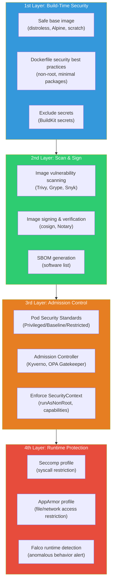
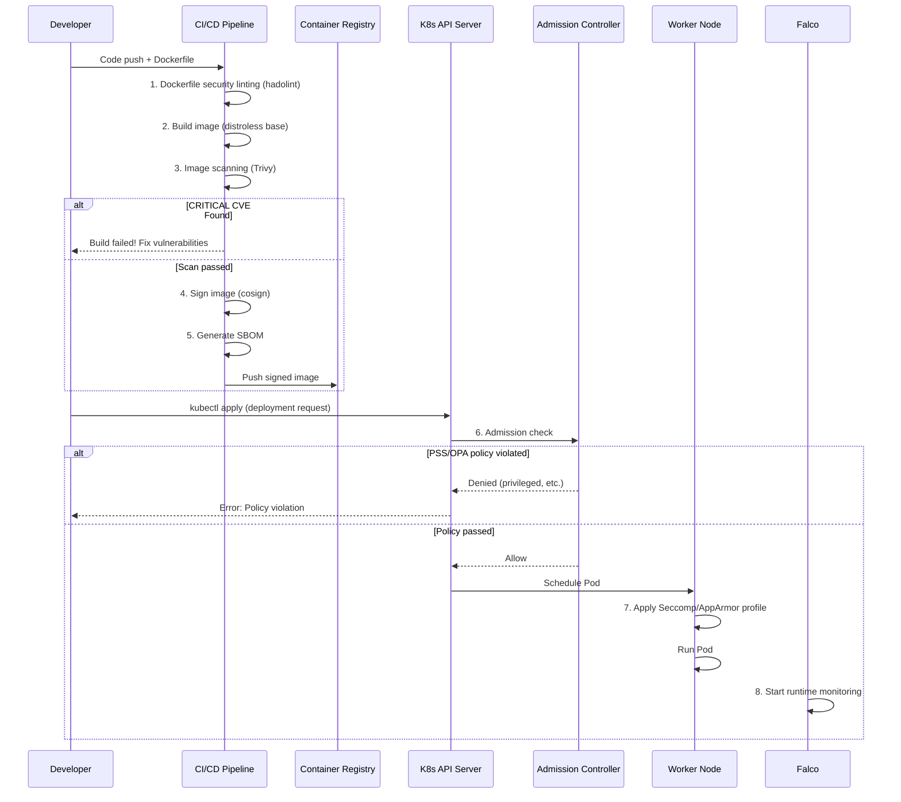
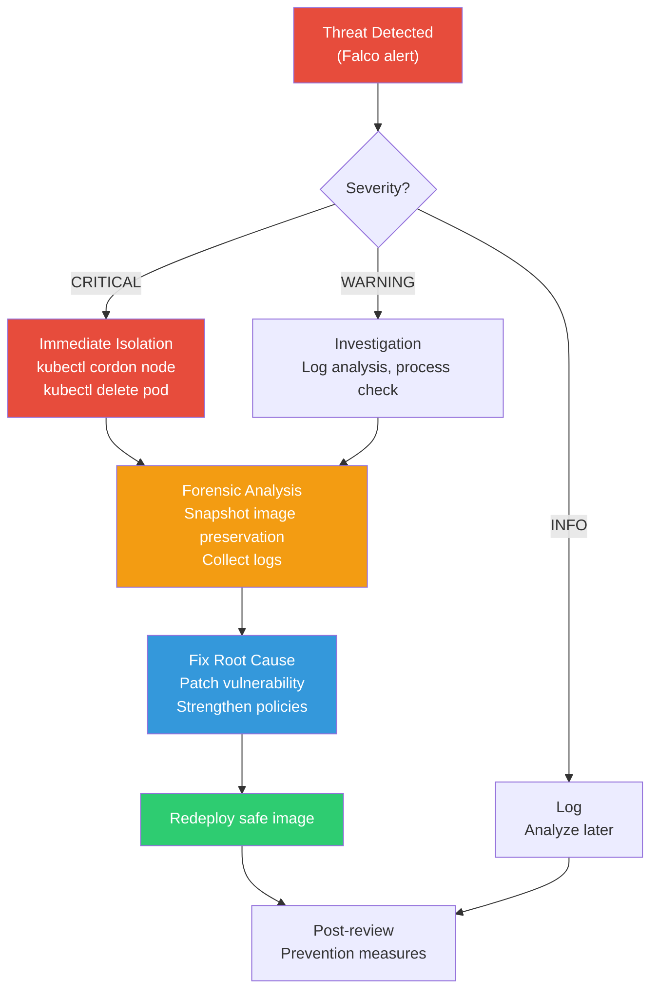

# Container Security

> Containers are fast and convenient, but **deploying them to production with default settings is a security disaster**. Image vulnerabilities, running as root, unlimited system calls, unsigned images — this is a complete overview of **container security that systematically prevents all these threats**.

---

## 🎯 Why Do You Need to Understand Container Security?

```
What happens in real work when you don't understand container security:

• Security audit: "There are 47 CRITICAL CVEs in your image"                 → Image scanning needed
• Breach: "Container escaped to the host"                                   → Root execution + unlimited capabilities
• Compliance: "PCI-DSS: Prove container runs as non-root"                   → Pod Security Standards
• Runtime threat: "Cryptocurrency mining happening inside container"         → No runtime detection like Falco
• Supply chain attack: "I don't know who modified this image"               → No image signing/verification
• CI/CD: "Vulnerable image was deployed to production"                      → No admission controller
```

We've already learned the basics of container security in [Container Foundation Security](../03-containers/09-security) — non-root, image scanning, image signing — and in [Kubernetes Security](../04-kubernetes/15-security) we learned NetworkPolicy, PSS, and Falco. This time, we'll tie it all together into **one comprehensive system** and build a **complete container security strategy from build to runtime**.

---

## 🧠 Grasping Core Concepts

### Analogy: Airport Security System

Let me compare container security to an **airport security system**.

| Airport Security | Container Security | Explanation |
|-------------|--------------|------|
| **Passport check** | Image signature verification (cosign) | "Is this image really built from our CI?" |
| **Baggage X-ray** | Image scanning (Trivy, Grype) | "Are there dangerous vulnerabilities in the image?" |
| **Boarding rules** | Pod Security Standards | "No dangerous settings (privileged) allowed for boarding (deployment)" |
| **In-flight rules** | Seccomp / AppArmor | "Only permitted actions allowed during flight (runtime)" |
| **In-flight security** | Falco (runtime detection) | "Real-time monitoring of suspicious in-flight behavior" |
| **Customs check** | Admission Controller (Kyverno, OPA) | "Deny entry (deployment) if detailed rules are violated" |

### 4-Layer Defense in Container Security



### Timeline of When Security is Applied



### Key Terminology

| Term | Meaning | Analogy |
|------|-----|------|
| **CVE** | Common Vulnerabilities and Exposures, known security vulnerability | Product recall list |
| **SBOM** | Software Bill of Materials, software composition list | Food ingredient label |
| **SLSA** | Supply-chain Levels for Software Artifacts, supply chain security grade | Food safety certification grade |
| **Seccomp** | Secure Computing Mode, Linux syscall filtering | "Only permit these actions" rule table |
| **AppArmor** | Linux security module, process access control | "Only these files/paths can be accessed" rule table |
| **distroless** | Google's minimal container image (no shell, no package manager) | Vacuum-sealed with only essentials |
| **cosign** | Sigstore project's container image signing tool | Notary's official seal |
| **Admission Controller** | K8s controller that intercepts and validates/modifies API requests | Building entrance security checkpoint |

---

## 🔍 Deep Dive into Each Component

### 1. Base Image Selection — The Starting Point of Security

Base image selection is the **most impactful decision in container security**. The more packages included, the wider the attack surface.

#### Base Image Comparison

| Base Image | Size | Shell | Package Manager | CVEs (avg) | Use Case |
|-----------|------|-------|-------------|-------------|------|
| `ubuntu:24.04` | ~77MB | bash | apt | 30~100+ | Dev/debugging |
| `debian:bookworm-slim` | ~52MB | bash | apt | 20~50 | General purpose |
| `alpine:3.20` | ~7MB | sh (busybox) | apk | 5~15 | Lightweight services |
| `gcr.io/distroless/static` | ~2MB | None | None | 0~3 | Go/Rust binaries |
| `gcr.io/distroless/cc` | ~5MB | None | None | 0~5 | C/C++ binaries |
| `gcr.io/distroless/java21` | ~50MB | None | None | 0~5 | Java apps |
| `scratch` | 0MB | None | None | 0 | Completely static binaries |

```dockerfile
# === Go app: scratch image (smallest and safest) ===
FROM golang:1.22-alpine AS builder
WORKDIR /app
COPY go.mod go.sum ./
RUN go mod download
COPY . .
# Disable CGO → completely static binary
RUN CGO_ENABLED=0 GOOS=linux go build -ldflags="-s -w" -o /app/server .

FROM scratch
# SSL certificates (needed for HTTPS requests)
COPY --from=builder /etc/ssl/certs/ca-certificates.crt /etc/ssl/certs/
# Copy executable only
COPY --from=builder /app/server /server
# non-root (use numeric UID — scratch has no /etc/passwd)
USER 65534:65534
ENTRYPOINT ["/server"]
# → Final image: ~10MB, CVEs: 0!

# === Java app: distroless image ===
FROM eclipse-temurin:21-jdk-alpine AS builder
WORKDIR /app
COPY . .
RUN ./gradlew bootJar --no-daemon

FROM gcr.io/distroless/java21-debian12
COPY --from=builder /app/build/libs/*.jar /app/app.jar
USER 65534:65534
ENTRYPOINT ["java", "-jar", "/app/app.jar"]
# → No shell → can't docker exec into shell → attackers can't get in either!

# === Python app: distroless + virtual environment ===
FROM python:3.12-slim AS builder
WORKDIR /app
COPY requirements.txt .
RUN pip install --no-cache-dir --target=/app/deps -r requirements.txt
COPY . .

FROM gcr.io/distroless/python3-debian12
WORKDIR /app
COPY --from=builder /app/deps /app/deps
COPY --from=builder /app .
ENV PYTHONPATH=/app/deps
USER 65534:65534
ENTRYPOINT ["python", "main.py"]
```

> **Real-world tip**: Distroless images have no shell, making debugging difficult. If debugging is needed, use the `gcr.io/distroless/python3-debian12:debug` tag which includes busybox shell. However, **never use debug tag in production!**

---

### 2. Dockerfile Security Best Practices

```dockerfile
# ✅ Security-Hardened Dockerfile — Comprehensive Best Practices

# 1. Use specific version tags (no latest!)
FROM node:20.11.1-alpine3.19 AS builder

# 2. Set working directory
WORKDIR /app

# 3. Copy only dependency files first (cache optimization)
COPY package.json package-lock.json ./

# 4. Install production dependencies only + clean cache
RUN npm ci --omit=dev && npm cache clean --force

# 5. Copy source code
COPY . .

# 6. Build (if needed)
RUN npm run build

# === Production stage ===
FROM node:20.11.1-alpine3.19

# 7. Don't install unnecessary packages
# (Alpine is already minimal, but remove anything not needed)
RUN apk --no-cache upgrade && \
    rm -rf /var/cache/apk/*

# 8. Create and switch to non-root user
RUN addgroup -S appgroup && adduser -S appuser -G appgroup
WORKDIR /app

# 9. Copy files while specifying ownership
COPY --from=builder --chown=appuser:appgroup /app/node_modules ./node_modules
COPY --from=builder --chown=appuser:appgroup /app/dist ./dist
COPY --from=builder --chown=appuser:appgroup /app/package.json ./

# 10. Switch user (all subsequent commands run as appuser)
USER appuser

# 11. Document port (non-privileged port!)
EXPOSE 3000

# 12. Healthcheck
HEALTHCHECK --interval=30s --timeout=3s --start-period=5s --retries=3 \
    CMD node -e "require('http').get('http://localhost:3000/health', (r) => process.exit(r.statusCode === 200 ? 0 : 1))"

# 13. Startup command (use exec form — for signal propagation!)
CMD ["node", "dist/server.js"]
```

#### Dockerfile Security Linting — hadolint

```bash
# hadolint: Dockerfile security/best practice auto-checker

# Install
docker pull hadolint/hadolint

# Scan
docker run --rm -i hadolint/hadolint < Dockerfile
# Dockerfile:1 DL3006 warning: Always tag the version of an image explicitly
# Dockerfile:5 DL3020 error: Use COPY instead of ADD for files and folders
# Dockerfile:8 DL3015 info: Avoid additional packages by specifying --no-install-recommends
# Dockerfile:12 DL3002 warning: Last USER should not be root

# Use in CI (build fails on errors)
docker run --rm -i hadolint/hadolint --failure-threshold error < Dockerfile
```

#### .dockerignore — Exclude Unnecessary Files

```dockerignore
# .dockerignore — Things that shouldn't go in the image!
.git
.gitignore
.env
.env.*
*.md
docker-compose*.yml
Dockerfile*
node_modules
.npm
.cache
coverage
tests
__tests__
*.test.js
*.spec.js
.vscode
.idea
*.pem
*.key
credentials.json
```

---

### 3. Image Scanning — Trivy, Grype, Snyk Container

#### Trivy — Most Popular Open Source Scanner

```bash
# Trivy: Aqua Security's comprehensive security scanner
# → Image vulnerabilities, config errors, secrets, license scanning

# Install
curl -sfL https://raw.githubusercontent.com/aquasecurity/trivy/main/contrib/install.sh | \
    sh -s -- -b /usr/local/bin

# === Basic image scan ===
trivy image myapp:v1.0
# myapp:v1.0 (alpine 3.19)
# Total: 15 (UNKNOWN: 0, LOW: 8, MEDIUM: 4, HIGH: 2, CRITICAL: 1)
#
# ┌──────────────┬────────────────┬──────────┬───────────┬──────────────┐
# │   Library    │ Vulnerability  │ Severity │ Installed │    Fixed     │
# ├──────────────┼────────────────┼──────────┼───────────┼──────────────┤
# │ openssl      │ CVE-2024-XXXX  │ CRITICAL │ 3.1.0     │ 3.1.5        │
# │ curl         │ CVE-2024-YYYY  │ HIGH     │ 8.5.0     │ 8.6.0        │
# └──────────────┴────────────────┴──────────┴───────────┴──────────────┘

# Show CRITICAL/HIGH only
trivy image --severity CRITICAL,HIGH myapp:v1.0

# Show only fixable (exclude unfixed)
trivy image --ignore-unfixed myapp:v1.0

# CI/CD gate: fail build if CRITICAL found!
trivy image --exit-code 1 --severity CRITICAL myapp:v1.0

# JSON output (for automation pipelines)
trivy image --format json --output result.json myapp:v1.0

# Generate SBOM (CycloneDX format)
trivy image --format cyclonedx --output sbom.json myapp:v1.0

# Scan for secrets
trivy image --scanners secret myapp:v1.0

# Scan Dockerfile itself (detect config errors)
trivy config Dockerfile
# MEDIUM: Specify a tag in the 'FROM' statement
# HIGH: Last USER should not be 'root'

# Scan filesystem (source code directory)
trivy fs --scanners vuln,secret .
```

#### Grype — Anchore's Open Source Scanner

```bash
# Grype: Anchore's image vulnerability scanner
# → Similar to Trivy but uses different vulnerability DB → useful for cross-validation!

# Install
curl -sSfL https://raw.githubusercontent.com/anchore/grype/main/install.sh | sh -s -- -b /usr/local/bin

# Basic scan
grype myapp:v1.0
# NAME        INSTALLED  FIXED-IN  TYPE  VULNERABILITY  SEVERITY
# openssl     3.1.0      3.1.5     apk   CVE-2024-XXXX  Critical
# curl        8.5.0      8.6.0     apk   CVE-2024-YYYY  High

# Severity filter
grype myapp:v1.0 --only-fixed --fail-on critical

# SBOM-based scan (generate SBOM with Syft, then scan with Grype)
syft myapp:v1.0 -o cyclonedx-json > sbom.json
grype sbom:sbom.json

# JSON output
grype myapp:v1.0 -o json > grype-result.json
```

#### Snyk Container — Commercial Scanner

```bash
# Snyk Container: commercial vulnerability scanner (free tier available)
# → Detailed remediation guides, strong monitoring features

# Authenticate
snyk auth

# Scan image
snyk container test myapp:v1.0
# Testing myapp:v1.0...
# ✗ Critical severity vulnerability found in openssl
#   Introduced through: openssl@3.1.0
#   Fixed in: 3.1.5
#   Recommendation: Upgrade base image to node:20.11.1-alpine3.19

# Recommend base image upgrade (automatic!)
snyk container test myapp:v1.0 --file=Dockerfile
# Recommendations for base image upgrade:
# Current: node:20-alpine (15 vulnerabilities)
# Minor:   node:20.11.1-alpine3.19 (3 vulnerabilities) ← Recommended!
# Major:   node:22-alpine (0 vulnerabilities)

# Continuous monitoring (register with Snyk → alerts on new CVEs!)
snyk container monitor myapp:v1.0
```

#### Integrate Scanning into CI/CD Pipeline

```yaml
# .github/workflows/container-security.yml
name: Container Security Scan

on:
  push:
    branches: [main]
  pull_request:

jobs:
  scan:
    runs-on: ubuntu-latest
    steps:
      - uses: actions/checkout@v4

      - name: Build image
        run: docker build -t myapp:${{ github.sha }} .

      # Trivy scan
      - name: Trivy scan
        uses: aquasecurity/trivy-action@master
        with:
          image-ref: myapp:${{ github.sha }}
          format: table
          exit-code: 1                    # Fail build if CRITICAL found
          severity: CRITICAL,HIGH
          ignore-unfixed: true

      # Grype cross-validation
      - name: Grype scan
        uses: anchore/scan-action@v3
        with:
          image: myapp:${{ github.sha }}
          fail-build: true
          severity-cutoff: critical

      # Hadolint (Dockerfile linting)
      - name: Hadolint
        uses: hadolint/hadolint-action@v3.1.0
        with:
          dockerfile: Dockerfile
          failure-threshold: error
```

---

### 4. Pod Security Standards (PSS) — K8s Deployment Restrictions

Pod Security Standards is built-in to K8s 1.25 by default. It's applied at the namespace level and has 3 levels.

#### 3 Levels Comparison

```mermaid
flowchart LR
    subgraph PRIV["Privileged (Unrestricted)"]
        P1["No restrictions"]
        P2["All settings allowed"]
        P3["For system daemons"]
    end

    subgraph BASE["Baseline (Basic)"]
        B1["Block known dangerous settings"]
        B2["Prohibit hostNetwork"]
        B3["Prohibit privileged"]
        B4["Prohibit hostPID/IPC"]
    end

    subgraph REST["Restricted (Maximum)"]
        R1["Baseline + additional restrictions"]
        R2["Enforce runAsNonRoot"]
        R3["Drop ALL capabilities"]
        R4["readOnlyRootFilesystem"]
        R5["Seccomp profile required"]
    end

    PRIV -->|"Enhance security"| BASE -->|"Maximum security"| REST

    style PRIV fill:#e74c3c,color:#fff
    style BASE fill:#f39c12,color:#fff
    style REST fill:#2ecc71,color:#fff
```



| Level | Description | Allowed Range | Target |
|------|------|----------|------|
| **Privileged** | Unrestricted | All settings allowed | kube-system, system daemons |
| **Baseline** | Basic protection | Block known dangerous settings | General workloads |
| **Restricted** | Maximum protection | Enforce least privilege | Sensitive workloads |

#### PSS Application Modes

| Mode | Behavior | Use Case |
|------|------|------|
| `enforce` | **Block** Pods violating policy | Production |
| `audit` | Log policy violations to audit log (don't block) | Transition period |
| `warn` | Show warning for violations (don't block) | Dev/Test |

```bash
# Apply PSS to namespace (via labels)
# 1st step: use audit + warn to first assess impact
kubectl label namespace production \
    pod-security.kubernetes.io/audit=restricted \
    pod-security.kubernetes.io/warn=restricted

# 2nd step: apply enforce once no issues
kubectl label namespace production \
    pod-security.kubernetes.io/enforce=restricted \
    pod-security.kubernetes.io/enforce-version=v1.30

# Verify
kubectl get namespace production -o yaml
# metadata:
#   labels:
#     pod-security.kubernetes.io/enforce: restricted
#     pod-security.kubernetes.io/enforce-version: v1.30
#     pod-security.kubernetes.io/audit: restricted
#     pod-security.kubernetes.io/warn: restricted
```

```yaml
# restricted namespace definition (YAML)
apiVersion: v1
kind: Namespace
metadata:
  name: production
  labels:
    pod-security.kubernetes.io/enforce: restricted
    pod-security.kubernetes.io/enforce-version: v1.30
    pod-security.kubernetes.io/audit: restricted
    pod-security.kubernetes.io/warn: restricted
```

```yaml
# ❌ Pod rejected in restricted namespace
apiVersion: v1
kind: Pod
metadata:
  name: bad-pod
  namespace: production
spec:
  containers:
    - name: app
      image: myapp:v1.0
      securityContext:
        privileged: true          # ← restricted violation!
        runAsUser: 0              # ← root execution violation!
# Error: pods "bad-pod" is forbidden:
#   violates PodSecurity "restricted:v1.30":
#   privileged (container "app" must not set securityContext.privileged=true)

# ✅ Pod passes restricted namespace
apiVersion: v1
kind: Pod
metadata:
  name: good-pod
  namespace: production
spec:
  securityContext:
    runAsNonRoot: true
    seccompProfile:
      type: RuntimeDefault
  containers:
    - name: app
      image: myapp:v1.0
      securityContext:
        allowPrivilegeEscalation: false
        runAsNonRoot: true
        runAsUser: 65534
        readOnlyRootFilesystem: true
        capabilities:
          drop: ["ALL"]
      resources:
        limits:
          memory: "256Mi"
          cpu: "500m"
```

---

### 5. SecurityContext — Pod/Container Security Configuration

SecurityContext controls security settings at Pod and Container level.

```yaml
apiVersion: v1
kind: Pod
metadata:
  name: secure-pod
spec:
  # === Pod-level SecurityContext ===
  securityContext:
    runAsNonRoot: true              # Prohibit root execution
    runAsUser: 65534                # nobody user
    runAsGroup: 65534               # nobody group
    fsGroup: 65534                  # Volume file group
    seccompProfile:
      type: RuntimeDefault          # Default Seccomp profile

  containers:
    - name: app
      image: myapp:v1.0

      # === Container-level SecurityContext ===
      securityContext:
        allowPrivilegeEscalation: false  # Block privilege escalation (★ Essential!)
        readOnlyRootFilesystem: true     # Root filesystem read-only
        runAsNonRoot: true               # Prohibit root execution (double-check)
        capabilities:
          drop: ["ALL"]                  # Remove all Linux capabilities
          # add: ["NET_BIND_SERVICE"]    # Add only what's needed (bind to <1024 ports)

      # Need writable space with read-only rootfs
      volumeMounts:
        - name: tmp
          mountPath: /tmp
        - name: cache
          mountPath: /app/cache

  volumes:
    - name: tmp
      emptyDir:
        sizeLimit: "100Mi"      # Enforce size limit!
    - name: cache
      emptyDir:
        sizeLimit: "50Mi"
```

#### SecurityContext Key Fields Summary

| Field | Level | Description | Recommended Value |
|------|------|------|--------|
| `runAsNonRoot` | Pod/Container | Prohibit root execution | `true` |
| `runAsUser` | Pod/Container | UID to run as | `65534` (nobody) |
| `readOnlyRootFilesystem` | Container | rootfs read-only | `true` |
| `allowPrivilegeEscalation` | Container | Block setuid etc | `false` |
| `capabilities.drop` | Container | Remove Linux capabilities | `["ALL"]` |
| `seccompProfile.type` | Pod | Specify Seccomp profile | `RuntimeDefault` |
| `privileged` | Container | Acquire all host permissions | `false` (NEVER true!) |

#### Linux Capabilities — "Drop ALL + Add Only What You Need"

```bash
# Linux capabilities: granular breakdown of root privilege
# Grant specific functions without full root

# Common capabilities:
# NET_BIND_SERVICE  — Bind to ports <1024
# NET_RAW           — Raw sockets (ping, etc)
# SYS_TIME          — Modify system time
# SYS_PTRACE        — Debug other processes
# SYS_ADMIN         — Various admin tasks (★ VERY DANGEROUS!)
# DAC_OVERRIDE      — Override file permissions
# CHOWN             — Change file ownership
# SETUID/SETGID     — Change user/group ID
```

```yaml
# ❌ Dangerous: SYS_ADMIN capability (allows container escape!)
securityContext:
  capabilities:
    add: ["SYS_ADMIN"]
# → Enables mount, cgroup manipulation etc, creating host escape paths

# ❌ Dangerous: NET_RAW (enables ARP spoofing)
securityContext:
  capabilities:
    add: ["NET_RAW"]
# → Can intercept traffic from other Pods on same node

# ✅ Safe: Drop all capabilities
securityContext:
  capabilities:
    drop: ["ALL"]
# → Sufficient for most apps!

# ✅ Safe: Add only what's needed
securityContext:
  capabilities:
    drop: ["ALL"]
    add: ["NET_BIND_SERVICE"]   # Allow binding to port <1024 only
```

---

### 6. Seccomp Profiles — System Call Filtering

Seccomp (Secure Computing Mode) restricts which **Linux system calls a container can make**. There are 300+ system calls in Linux, but a typical web app uses only 50-60.

```yaml
# Apply Seccomp profile to Pod

# 1. RuntimeDefault — K8s/runtime's default profile
apiVersion: v1
kind: Pod
metadata:
  name: seccomp-default
spec:
  securityContext:
    seccompProfile:
      type: RuntimeDefault    # Blocks ~50 dangerous syscalls
  containers:
    - name: app
      image: myapp:v1.0
# RuntimeDefault blocks representative syscalls:
# - mount, umount2       (filesystem mounting)
# - reboot              (system reboot!)
# - kexec_load          (kernel replacement!)
# - ptrace              (debug other processes)
# - personality         (change execution domain)
```

```json
// 2. Custom Seccomp profile — /var/lib/kubelet/seccomp/profiles/strict.json
{
  "defaultAction": "SCMP_ACT_ERRNO",
  "architectures": [
    "SCMP_ARCH_X86_64",
    "SCMP_ARCH_AARCH64"
  ],
  "syscalls": [
    {
      "names": [
        "accept4", "bind", "brk", "chdir", "clock_gettime",
        "close", "connect", "epoll_create1", "epoll_ctl",
        "epoll_wait", "exit", "exit_group", "fcntl", "fstat",
        "futex", "getdents64", "getpeername", "getpid",
        "getsockname", "getsockopt", "ioctl", "listen",
        "lseek", "madvise", "mmap", "mprotect", "munmap",
        "nanosleep", "newfstatat", "openat", "pipe2", "pread64",
        "read", "recvfrom", "recvmsg", "rt_sigaction",
        "rt_sigprocmask", "rt_sigreturn", "sendmsg", "sendto",
        "set_robust_list", "setsockopt", "shutdown", "sigaltstack",
        "socket", "tgkill", "write", "writev"
      ],
      "action": "SCMP_ACT_ALLOW"
    }
  ]
}
```

```yaml
# Apply custom profile
apiVersion: v1
kind: Pod
metadata:
  name: seccomp-custom
spec:
  securityContext:
    seccompProfile:
      type: Localhost
      localhostProfile: profiles/strict.json  # Relative to /var/lib/kubelet/seccomp/
  containers:
    - name: app
      image: myapp:v1.0
```

```bash
# Profile which syscalls an app uses (strace)
# → Useful when creating custom profiles

# 1. Trace syscalls with strace
strace -c -f -p $(pgrep myapp) -e trace=all 2>&1 | tail -20
# % time     seconds  usecs/call     calls    errors syscall
# ------ ----------- ----------- --------- --------- ----------------
#  45.23    0.001234          12       103           read
#  22.10    0.000602           8        75           write
#  15.34    0.000418           6        70           epoll_wait
# ...

# 2. Or use OCI seccomp-bpf tool
# → Auto-generates custom profiles
kubectl run --rm -it trace-app \
    --image=myapp:v1.0 \
    --annotations="seccomp-profile.kubernetes.io/trace=true"
```

---

### 7. AppArmor Profiles — File/Network Access Control

Unlike Seccomp which blocks syscalls, AppArmor controls **file paths, network, and process execution**. While Seccomp says "block this syscall", AppArmor says "block access to this resource".

```
# /etc/apparmor.d/container-strict — custom AppArmor profile

#include <tunables/global>

profile container-strict flags=(attach_disconnected,mediate_deleted) {
  #include <abstractions/base>

  # Network: TCP/UDP only
  network inet tcp,
  network inet udp,
  network inet6 tcp,
  network inet6 udp,
  # Block raw sockets (prevent ARP spoofing)
  deny network raw,
  deny network packet,

  # Filesystem
  /app/** r,                           # Read /app subdirs only
  /app/data/** rw,                     # Read/write /app/data only
  /tmp/** rw,                          # Allow /tmp writes
  deny /etc/shadow r,                  # Block shadow file read
  deny /etc/passwd w,                  # Block passwd write
  deny /proc/*/mem rw,                 # Block other process memory access
  deny /sys/** w,                      # Block /sys writes

  # Execution
  /usr/bin/node ix,                    # Allow node only
  deny /bin/sh x,                      # Block shell execution!
  deny /bin/bash x,                    # Block bash execution!
  deny /usr/bin/wget x,               # Block wget (prevent file downloads)
  deny /usr/bin/curl x,               # Block curl

  # Mount-related blocks
  deny mount,
  deny umount,
  deny pivot_root,
}
```

```bash
# Load AppArmor profile
sudo apparmor_parser -r /etc/apparmor.d/container-strict

# Check profile status
sudo aa-status | grep container-strict
# container-strict (enforce)

# Apply AppArmor profile in Docker
docker run --rm \
    --security-opt apparmor=container-strict \
    myapp:v1.0
```

```yaml
# K8s AppArmor application (v1.30+ native field)
apiVersion: v1
kind: Pod
metadata:
  name: apparmor-pod
spec:
  securityContext:
    appArmorProfile:
      type: Localhost
      localhostProfile: container-strict
  containers:
    - name: app
      image: myapp:v1.0
      securityContext:
        allowPrivilegeEscalation: false
        runAsNonRoot: true

# Legacy method (v1.29 and below — annotation)
# metadata:
#   annotations:
#     container.apparmor.security.beta.kubernetes.io/app: localhost/container-strict
```

#### Seccomp vs AppArmor Comparison

| | Seccomp | AppArmor |
|------|---------|----------|
| **Control Target** | System calls (syscall) | Files, network, processes |
| **Control Method** | "Block this syscall" | "Block access to this path/resource" |
| **Granularity** | Syscall-level | File path, network protocol level |
| **Performance Impact** | Almost none (kernel BPF) | Some overhead |
| **Deployment** | JSON profile | Text profile (apparmor_parser) |
| **K8s Support** | `seccompProfile` field | `appArmorProfile` field (v1.30+) |
| **Recommendation** | Always use RuntimeDefault minimum | Custom profiles for sensitive workloads |

> **Real-world tip**: Seccomp RuntimeDefault **must** be applied. AppArmor is an additional protection layer — apply custom profiles to sensitive workloads (payment, auth, etc). You can use both simultaneously!

---

### 8. Falco — Runtime Threat Detection

Falco is a CNCF graduated project that **detects anomalous runtime behavior in containers/K8s in real-time**. It's the final defense line after build-time scanning and admission controls.

```bash
# Falco installation (Helm)
helm repo add falcosecurity https://falcosecurity.github.io/charts
helm repo update

helm install falco falcosecurity/falco \
    --namespace falco --create-namespace \
    --set falcosidekick.enabled=true \
    --set falcosidekick.config.slack.webhookurl="https://hooks.slack.com/..." \
    --set driver.kind=ebpf   # eBPF driver (recommended over kernel module)

# Verify installation
kubectl get pods -n falco
# NAME                                READY   STATUS    RESTARTS   AGE
# falco-xxxxx                         2/2     Running   0          1m
# falco-falcosidekick-xxxxx           1/1     Running   0          1m
```

#### Falco Default Rules — What Does It Detect?

```yaml
# Falco detects these threats by default:

# 1. Shell execution in container
# - rule: Terminal shell in container
#   condition: >
#     spawned_process and container and
#     proc.name in (bash, sh, zsh, csh, ksh)
#   output: >
#     Shell spawned in a container
#     (user=%user.name container=%container.name shell=%proc.name)
#   priority: WARNING

# 2. Sensitive file read
# - rule: Read sensitive file
#   condition: >
#     open_read and container and
#     fd.name in (/etc/shadow, /etc/sudoers)
#   output: >
#     Sensitive file read in container
#     (file=%fd.name container=%container.name)
#   priority: WARNING

# 3. Package manager execution (runtime package install = anomalous!)
# - rule: Package management in container
#   condition: >
#     spawned_process and container and
#     proc.name in (apt, apt-get, yum, dnf, apk, pip)
#   output: >
#     Package management in running container
#     (command=%proc.cmdline container=%container.name)
#   priority: ERROR
```

#### Custom Falco Rules

```yaml
# falco-custom-rules.yaml (deploy as ConfigMap)
apiVersion: v1
kind: ConfigMap
metadata:
  name: falco-custom-rules
  namespace: falco
data:
  custom-rules.yaml: |
    # 1. Cryptocurrency mining detection
    - rule: Cryptocurrency mining detected
      desc: Detect cryptocurrency mining processes
      condition: >
        spawned_process and container and
        (proc.name in (xmrig, minerd, minergate, ccminer) or
         proc.cmdline contains "stratum+tcp" or
         proc.cmdline contains "cryptonight")
      output: >
        Crypto mining detected!
        (user=%user.name command=%proc.cmdline container=%container.name
         image=%container.image.repository namespace=%k8s.ns.name pod=%k8s.pod.name)
      priority: CRITICAL
      tags: [cryptomining, runtime]

    # 2. Reverse shell detection
    - rule: Reverse shell detected
      desc: Detect reverse shell connections
      condition: >
        spawned_process and container and
        ((proc.name = "bash" and proc.cmdline contains "/dev/tcp") or
         (proc.name = "python" and proc.cmdline contains "socket") or
         (proc.name = "nc" and proc.args contains "-e"))
      output: >
        Reverse shell detected!
        (command=%proc.cmdline container=%container.name pod=%k8s.pod.name)
      priority: CRITICAL
      tags: [reverse_shell, runtime]

    # 3. Unexpected outbound network connection detection
    - rule: Unexpected outbound connection
      desc: Detect outbound connections from containers that shouldn't make them
      condition: >
        outbound and container and
        k8s.ns.name = "production" and
        not (fd.sport in (80, 443, 8080, 5432, 6379, 53))
      output: >
        Unexpected outbound connection
        (command=%proc.cmdline connection=%fd.name container=%container.name)
      priority: WARNING
      tags: [network, exfiltration]
```

```bash
# Check Falco logs
kubectl logs -n falco -l app.kubernetes.io/name=falco --tail=50

# Output example:
# 15:23:45.123456789: Warning Shell spawned in a container
#   (user=root container=web-app shell=bash
#    pod=web-app-7d4f5c image=myapp:v1.0 namespace=production)
#
# 15:24:12.987654321: Error Package management in running container
#   (command=apt-get install nmap container=web-app
#    pod=web-app-7d4f5c namespace=production)
#
# 15:25:33.111222333: Critical Crypto mining detected!
#   (command=xmrig --url=stratum+tcp://pool.example.com
#    container=compromised-pod namespace=production)

# Falcosidekick sends alerts to Slack/PagerDuty/etc
# → Real-time alerts to security team!
```

---

### 9. Admission Controllers — Kyverno & OPA Gatekeeper

While PSS provides only "3 basic levels", Kyverno and OPA Gatekeeper enable **fine-grained custom policies**.

#### Kyverno — Write Policies in YAML

```bash
# Kyverno installation
helm repo add kyverno https://kyverno.github.io/kyverno/
helm install kyverno kyverno/kyverno \
    --namespace kyverno --create-namespace
```

```yaml
# 1. Block latest tag images
apiVersion: kyverno.io/v1
kind: ClusterPolicy
metadata:
  name: disallow-latest-tag
spec:
  validationFailureAction: Enforce    # Audit | Enforce
  rules:
    - name: require-image-tag
      match:
        any:
          - resources:
              kinds: ["Pod"]
      validate:
        message: "Do not use 'latest' tag! Use specific version tag."
        pattern:
          spec:
            containers:
              - image: "!*:latest & *:*"  # Ban latest, require tag

---
# 2. Allow images from specific registry only
apiVersion: kyverno.io/v1
kind: ClusterPolicy
metadata:
  name: restrict-image-registries
spec:
  validationFailureAction: Enforce
  rules:
    - name: allowed-registries
      match:
        any:
          - resources:
              kinds: ["Pod"]
      validate:
        message: "Allowed registry: 123456789.dkr.ecr.ap-northeast-2.amazonaws.com"
        pattern:
          spec:
            containers:
              - image: "123456789.dkr.ecr.ap-northeast-2.amazonaws.com/*"

---
# 3. Enforce resource limits
apiVersion: kyverno.io/v1
kind: ClusterPolicy
metadata:
  name: require-resource-limits
spec:
  validationFailureAction: Enforce
  rules:
    - name: check-limits
      match:
        any:
          - resources:
              kinds: ["Pod"]
      validate:
        message: "CPU and memory limits must be set."
        pattern:
          spec:
            containers:
              - resources:
                  limits:
                    memory: "?*"
                    cpu: "?*"

---
# 4. Auto-mutate (Mutate) — Inject SecurityContext automatically
apiVersion: kyverno.io/v1
kind: ClusterPolicy
metadata:
  name: add-default-securitycontext
spec:
  rules:
    - name: add-security-defaults
      match:
        any:
          - resources:
              kinds: ["Pod"]
      mutate:
        patchStrategicMerge:
          spec:
            securityContext:
              runAsNonRoot: true
              seccompProfile:
                type: RuntimeDefault
            containers:
              - (name): "*"
                securityContext:
                  allowPrivilegeEscalation: false
                  readOnlyRootFilesystem: true
                  capabilities:
                    drop: ["ALL"]
```

#### OPA Gatekeeper — Write Policies in Rego

```bash
# OPA Gatekeeper installation
helm repo add gatekeeper https://open-policy-agent.github.io/gatekeeper/charts
helm install gatekeeper gatekeeper/gatekeeper \
    --namespace gatekeeper-system --create-namespace
```

```yaml
# 1. Define ConstraintTemplate (policy template)
apiVersion: templates.gatekeeper.sh/v1
kind: ConstraintTemplate
metadata:
  name: k8sdisallowedtags
spec:
  crd:
    spec:
      names:
        kind: K8sDisallowedTags
      validation:
        openAPIV3Schema:
          type: object
          properties:
            tags:
              type: array
              items:
                type: string
  targets:
    - target: admission.k8s.gatekeeper.sh
      rego: |
        package k8sdisallowedtags

        violation[{"msg": msg}] {
          container := input.review.object.spec.containers[_]
          tag := split(container.image, ":")[1]
          tag == input.parameters.tags[_]
          msg := sprintf("Image '%v' uses banned tag '%v'!", [container.image, tag])
        }

        violation[{"msg": msg}] {
          container := input.review.object.spec.containers[_]
          not contains(container.image, ":")
          msg := sprintf("Image '%v' has no tag! (interpreted as latest)", [container.image])
        }

---
# 2. Create Constraint (apply policy)
apiVersion: constraints.gatekeeper.sh/v1beta1
kind: K8sDisallowedTags
metadata:
  name: no-latest-tag
spec:
  match:
    kinds:
      - apiGroups: [""]
        kinds: ["Pod"]
    namespaces: ["production", "staging"]
  parameters:
    tags: ["latest", "dev", "test"]
```

#### Kyverno Deep Dive — K8s-Native Policy Engine

Unlike OPA Gatekeeper, Kyverno lets you write policies **in pure YAML without learning Rego**. Since policies are defined as K8s resource patterns, any engineer familiar with K8s can start using it immediately.

```
Kyverno's 3 Policy Types:

1. Validating
   → "Reject deployment if this condition is not met"
   → Examples: Ban latest tag, require resource limits

2. Mutating
   → "Auto-inject/modify settings on deployment"
   → Examples: Auto-add SecurityContext, auto-assign labels

3. Generating
   → "Auto-create companion resources when a resource is created"
   → Examples: Auto-create NetworkPolicy when Namespace is created
```

```yaml
# === Kyverno Production Policy Examples ===

# 1. Allow only approved image registries (Validating)
apiVersion: kyverno.io/v1
kind: ClusterPolicy
metadata:
  name: restrict-image-registries
  annotations:
    policies.kyverno.io/title: Restrict Image Registries
    policies.kyverno.io/severity: high
spec:
  validationFailureAction: Enforce
  background: true
  rules:
    - name: validate-registries
      match:
        any:
          - resources:
              kinds: ["Pod"]
      validate:
        message: >-
          Only approved registries allowed:
          123456789.dkr.ecr.ap-northeast-2.amazonaws.com, gcr.io/distroless
        pattern:
          spec:
            containers:
              - image: "123456789.dkr.ecr.ap-northeast-2.amazonaws.com/* | gcr.io/distroless/*"

---
# 2. Require mandatory labels (Validating)
apiVersion: kyverno.io/v1
kind: ClusterPolicy
metadata:
  name: require-labels
spec:
  validationFailureAction: Enforce
  rules:
    - name: check-required-labels
      match:
        any:
          - resources:
              kinds: ["Deployment", "StatefulSet"]
      validate:
        message: "Labels app, team, and env are required."
        pattern:
          metadata:
            labels:
              app: "?*"
              team: "?*"
              env: "production | staging | dev"

---
# 3. Auto-generate NetworkPolicy on Namespace creation (Generating)
apiVersion: kyverno.io/v1
kind: ClusterPolicy
metadata:
  name: generate-default-networkpolicy
spec:
  rules:
    - name: default-deny
      match:
        any:
          - resources:
              kinds: ["Namespace"]
      generate:
        apiVersion: networking.k8s.io/v1
        kind: NetworkPolicy
        name: default-deny-all
        namespace: "{{request.object.metadata.name}}"
        data:
          spec:
            podSelector: {}
            policyTypes:
              - Ingress
              - Egress
```

#### Kyverno vs OPA Gatekeeper Detailed Comparison

| | Kyverno | OPA Gatekeeper |
|------|---------|----------------|
| **Policy Language** | YAML (low learning curve) | Rego (high learning curve) |
| **Policy Authoring** | K8s resource pattern matching | General-purpose logic programming |
| **Mutate Support** | Native (auto-transform) | Limited (Assign/Modify) |
| **Generate Support** | Native (auto-create resources) | Not supported |
| **Image Verification** | Native cosign/Notary support | Requires external tooling |
| **Complex Logic** | Limited (simple pattern matching) | Powerful (Rego's logic expressiveness) |
| **External Data** | API Call support | OPA data source integration |
| **Resource Usage** | Relatively lightweight | Memory-heavy with Audit feature |
| **Community Policies** | Kyverno Policy Library (150+) | Gatekeeper Library |
| **CNCF Status** | CNCF Incubating | CNCF Graduated |
| **Recommendation** | Small/medium, prefer K8s-native | Large scale, already use OPA, complex logic |

```
Selection Guide:

"30 or fewer policies + K8s team" → Kyverno
  → Only need to know YAML, powerful Mutate/Generate
  → Native image signature verification

"100+ policies + complex org rules" → OPA Gatekeeper
  → Express complex business logic in Rego
  → Use OPA beyond K8s (Terraform, API Gateway)

"First time with both?" → Start with Kyverno
  → Much lower learning cost, covers 80% of use cases
  → Can switch to or run alongside OPA Gatekeeper later
```

---

### 10. Supply Chain Security — cosign & SLSA

#### cosign — Image Signing & Verification

```bash
# cosign: Sigstore project's image signing tool

# Install
go install github.com/sigstore/cosign/v2/cmd/cosign@latest
# Or
brew install cosign

# === Key-based signing ===

# 1. Generate keys
cosign generate-key-pair
# → cosign.key (private) + cosign.pub (public)

# 2. Sign image
cosign sign --key cosign.key myregistry.com/myapp:v1.0
# Pushing signature to: myregistry.com/myapp:sha256-abc123.sig

# 3. Verify image signature
cosign verify --key cosign.pub myregistry.com/myapp:v1.0
# Verification for myregistry.com/myapp:v1.0 --
# The following checks were performed on each of these signatures:
#   - The cosign claims were validated
#   - The signatures were verified against the specified public key
# [{"critical":{"identity":...,"image":...},"optional":{}}]

# === Keyless signing (OIDC-based — more modern!) ===

# Sign from GitHub Actions (keyless)
cosign sign myregistry.com/myapp:v1.0
# → Auto-signs with GitHub OIDC token (no key management needed!)

# Verify keyless signature
cosign verify \
    --certificate-identity "https://github.com/myorg/myrepo/.github/workflows/build.yml@refs/heads/main" \
    --certificate-oidc-issuer "https://token.actions.githubusercontent.com" \
    myregistry.com/myapp:v1.0
```

```yaml
# Automate cosign in CI/CD (GitHub Actions)
# .github/workflows/sign-image.yml
name: Build, Sign, Verify

on:
  push:
    branches: [main]

permissions:
  id-token: write    # Needed for OIDC token issuing
  packages: write    # Needed for image push

jobs:
  build-and-sign:
    runs-on: ubuntu-latest
    steps:
      - uses: actions/checkout@v4

      - name: Install cosign
        uses: sigstore/cosign-installer@v3

      - name: Build and push image
        run: |
          docker build -t ghcr.io/${{ github.repository }}:${{ github.sha }} .
          docker push ghcr.io/${{ github.repository }}:${{ github.sha }}

      - name: Sign image (keyless)
        run: |
          cosign sign ghcr.io/${{ github.repository }}:${{ github.sha }}

      - name: Generate and attach SBOM
        run: |
          syft ghcr.io/${{ github.repository }}:${{ github.sha }} \
              -o cyclonedx-json > sbom.json
          cosign attest --predicate sbom.json \
              ghcr.io/${{ github.repository }}:${{ github.sha }}
```

#### Enforce Signature Verification with Kyverno

```yaml
# Block unsigned image deployments!
apiVersion: kyverno.io/v1
kind: ClusterPolicy
metadata:
  name: verify-image-signature
spec:
  validationFailureAction: Enforce
  rules:
    - name: check-cosign-signature
      match:
        any:
          - resources:
              kinds: ["Pod"]
      verifyImages:
        - imageReferences:
            - "ghcr.io/myorg/*"
          attestors:
            - entries:
                - keyless:
                    subject: "https://github.com/myorg/*"
                    issuer: "https://token.actions.githubusercontent.com"
                    rekor:
                      url: https://rekor.sigstore.dev
```

#### SLSA — Supply Chain Security Level

```
SLSA (Supply-chain Levels for Software Artifacts) — pronounced "salsa"

SLSA Level 0: No security requirements
SLSA Level 1: Document build process (generate build provenance)
SLSA Level 2: Use hosted build service (GitHub Actions, etc)
SLSA Level 3: Build environment isolation + tamper prevention
SLSA Level 4: Two-person review + complete provenance

Most organizations target Level 2~3.
```

```yaml
# SLSA Level 3 build — GitHub Actions with SLSA generator
# .github/workflows/slsa-build.yml
name: SLSA Build

on:
  push:
    tags: ['v*']

jobs:
  build:
    uses: slsa-framework/slsa-github-generator/.github/workflows/generator_container_slsa3.yml@v2.0.0
    with:
      image: ghcr.io/${{ github.repository }}
      digest: ${{ needs.build-image.outputs.digest }}
    secrets:
      registry-username: ${{ github.actor }}
      registry-password: ${{ secrets.GITHUB_TOKEN }}
```

---

## 💻 Hands-On Labs

### Lab 1: Build & Scan Security-Hardened Image

```bash
# 1. Compare vulnerable vs secure image

# Create vulnerable Dockerfile
cat > Dockerfile.insecure << 'EOF'
FROM node:20
WORKDIR /app
COPY . .
RUN npm install
ENV DB_PASSWORD=secret123
EXPOSE 3000
CMD ["node", "server.js"]
EOF

# Create secure Dockerfile
cat > Dockerfile.secure << 'EOF'
FROM node:20.11.1-alpine3.19 AS builder
WORKDIR /app
COPY package*.json ./
RUN npm ci --omit=dev

FROM node:20.11.1-alpine3.19
RUN apk --no-cache upgrade && \
    addgroup -S app && adduser -S app -G app
WORKDIR /app
COPY --from=builder --chown=app:app /app/node_modules ./node_modules
COPY --chown=app:app . .
USER app
EXPOSE 3000
HEALTHCHECK --interval=30s --timeout=3s \
    CMD node -e "require('http').get('http://localhost:3000/health', r => process.exit(r.statusCode === 200 ? 0 : 1))"
CMD ["node", "server.js"]
EOF

# 2. Build images
docker build -t myapp:insecure -f Dockerfile.insecure .
docker build -t myapp:secure -f Dockerfile.secure .

# 3. Compare image sizes
docker images | grep myapp
# myapp   insecure   1.1GB     # 😱
# myapp   secure     180MB     # ✅

# 4. Scan with Trivy
echo "=== Vulnerable image ==="
trivy image --severity CRITICAL,HIGH myapp:insecure
# Total: 47 (HIGH: 35, CRITICAL: 12)  😱

echo "=== Secure image ==="
trivy image --severity CRITICAL,HIGH myapp:secure
# Total: 2 (HIGH: 2, CRITICAL: 0)     ✅

# 5. Scan for secrets
trivy image --scanners secret myapp:insecure
# /app/.env — DB_PASSWORD found!  😱

trivy image --scanners secret myapp:secure
# No secrets found                 ✅

# 6. Check execution user
docker run --rm myapp:insecure whoami
# root  😱

docker run --rm myapp:secure whoami
# app   ✅
```

### Lab 2: Apply Pod Security Standards

```bash
# 1. Create test namespace
kubectl create namespace pss-test

# 2. Apply restricted PSS (with warnings first)
kubectl label namespace pss-test \
    pod-security.kubernetes.io/warn=restricted \
    pod-security.kubernetes.io/audit=restricted

# 3. Try deploying non-compliant Pod
cat << 'EOF' | kubectl apply -f -
apiVersion: v1
kind: Pod
metadata:
  name: test-insecure
  namespace: pss-test
spec:
  containers:
    - name: app
      image: nginx:1.25
EOF
# Warning: would violate PodSecurity "restricted:latest":
#   allowPrivilegeEscalation != false
#   unrestricted capabilities
#   runAsNonRoot != true
#   seccompProfile not set
# → Warn mode allows creation but shows warning!

# 4. Apply enforce mode
kubectl label namespace pss-test \
    pod-security.kubernetes.io/enforce=restricted --overwrite

# 5. Try again
cat << 'EOF' | kubectl apply -f -
apiVersion: v1
kind: Pod
metadata:
  name: test-insecure2
  namespace: pss-test
spec:
  containers:
    - name: app
      image: nginx:1.25
EOF
# Error from server (Forbidden): pods "test-insecure2" is forbidden:
#   violates PodSecurity "restricted:latest"
# → Enforce mode blocks creation! ✅

# 6. Deploy compliant Pod
cat << 'EOF' | kubectl apply -f -
apiVersion: v1
kind: Pod
metadata:
  name: test-secure
  namespace: pss-test
spec:
  securityContext:
    runAsNonRoot: true
    seccompProfile:
      type: RuntimeDefault
  containers:
    - name: app
      image: nginx:1.25
      securityContext:
        allowPrivilegeEscalation: false
        runAsNonRoot: true
        runAsUser: 101          # nginx user
        readOnlyRootFilesystem: true
        capabilities:
          drop: ["ALL"]
      volumeMounts:
        - name: tmp
          mountPath: /tmp
        - name: cache
          mountPath: /var/cache/nginx
        - name: pid
          mountPath: /var/run
  volumes:
    - name: tmp
      emptyDir: {}
    - name: cache
      emptyDir: {}
    - name: pid
      emptyDir: {}
EOF
# pod/test-secure created  ✅

# 7. Cleanup
kubectl delete namespace pss-test
```

### Lab 3: Runtime Threat Detection with Falco

```bash
# 1. Install Falco (Helm)
helm install falco falcosecurity/falco \
    --namespace falco --create-namespace \
    --set driver.kind=ebpf \
    --set falcosidekick.enabled=true

# 2. Monitor Falco logs (terminal 1)
kubectl logs -n falco -l app.kubernetes.io/name=falco -f

# 3. Create test Pod (terminal 2)
kubectl run test-app --image=nginx:1.25 --restart=Never

# 4. Exec into shell (threat simulation)
kubectl exec -it test-app -- /bin/bash

# Falco logs alert: ↓
# Warning: Terminal shell in container
#   (user=root container=test-app shell=bash
#    pod=test-app namespace=default)

# 5. Try package install (more severe threat)
apt-get update && apt-get install -y nmap

# Falco logs: ↓
# Error: Package management process launched in container
#   (command=apt-get install -y nmap container=test-app)

# 6. Access sensitive file
cat /etc/shadow

# Falco logs: ↓
# Warning: Sensitive file opened for reading
#   (file=/etc/shadow container=test-app)

# 7. Cleanup
kubectl delete pod test-app
```

---

## 🏢 In Real-World Operations

### Container Security Strategy by Company Size

```
🏠 Startup (5-20 people):
├── Image scanning: Trivy (integrated into CI/CD)
├── Base image: Alpine-based
├── PSS: Baseline (enforce)
├── SecurityContext: Basic settings (non-root, drop ALL)
├── Runtime: None (resource constraints)
└── Signing: None
→ Cost: $0 (open source only)

🏢 Mid-size (50-200 people):
├── Image scanning: Trivy + Snyk Container
├── Base image: distroless / Alpine
├── PSS: Restricted (enforce) + Kyverno policies
├── SecurityContext: Enhanced (non-root, drop ALL, seccomp)
├── Runtime: Falco (default rules)
├── Signing: cosign (keyless)
└── SBOM: Auto-generated + stored
→ Cost: ~$500/month (Snyk paid)

🏗️ Enterprise (500+ people):
├── Image scanning: Trivy + Snyk + custom scanners
├── Base image: Internal validated base images (Golden Images)
├── PSS: Restricted + OPA Gatekeeper (100+ policies)
├── SecurityContext: Enhanced + custom Seccomp + AppArmor
├── Runtime: Falco + commercial CNAPP (Prisma Cloud, Aqua)
├── Signing: cosign + Notary + enforcement policy
├── SBOM: Auto-generated + auto-tracked for vulns
└── SLSA: Level 3 build pipeline
→ Cost: $5,000~$50,000+/month
```

### Real-World Security Checklist

```
Build-Time:
☐ Dockerfile has USER directive (non-root)
☐ Specific version tags used (no latest)
☐ Multi-stage build used
☐ distroless/Alpine base image
☐ .dockerignore excludes sensitive files
☐ hadolint lint passes

Scan & Sign:
☐ Trivy scan integrated in CI/CD (CRITICAL → fail build)
☐ Secret scanning enabled (trivy --scanners secret)
☐ Image signed (cosign)
☐ SBOM generated and stored

K8s Deployment:
☐ PSS Restricted applied (or Baseline + custom policies)
☐ All SecurityContext fields configured
☐ runAsNonRoot: true
☐ readOnlyRootFilesystem: true
☐ allowPrivilegeEscalation: false
☐ capabilities.drop: ["ALL"]
☐ seccompProfile: RuntimeDefault
☐ resource limits set

Runtime:
☐ Falco installed and alerting enabled
☐ Anomalous behavior response runbook written
☐ Regular image re-scanning (new CVE response)
```

### Security Incident Response Flow



### Production Deployment Security Template

```yaml
# production-secure-deployment.yaml
# Production-ready security-hardened Deployment template

apiVersion: apps/v1
kind: Deployment
metadata:
  name: secure-app
  namespace: production
  labels:
    app: secure-app
    version: v1.0.0
spec:
  replicas: 3
  selector:
    matchLabels:
      app: secure-app
  template:
    metadata:
      labels:
        app: secure-app
        version: v1.0.0
    spec:
      # --- Pod-level security ---
      securityContext:
        runAsNonRoot: true
        runAsUser: 65534
        runAsGroup: 65534
        fsGroup: 65534
        seccompProfile:
          type: RuntimeDefault

      # Disable service account token auto-mount
      automountServiceAccountToken: false

      # Containers
      containers:
        - name: app
          # Use specific digest (prevent tag tampering)
          image: 123456789.dkr.ecr.ap-northeast-2.amazonaws.com/myapp@sha256:abc123...
          ports:
            - containerPort: 8080
              protocol: TCP

          # --- Container-level security ---
          securityContext:
            allowPrivilegeEscalation: false
            readOnlyRootFilesystem: true
            runAsNonRoot: true
            capabilities:
              drop: ["ALL"]

          # --- Resource limits ---
          resources:
            requests:
              memory: "128Mi"
              cpu: "100m"
            limits:
              memory: "256Mi"
              cpu: "500m"

          # --- Healthchecks ---
          livenessProbe:
            httpGet:
              path: /health
              port: 8080
            initialDelaySeconds: 10
            periodSeconds: 15
          readinessProbe:
            httpGet:
              path: /ready
              port: 8080
            initialDelaySeconds: 5
            periodSeconds: 5

          # --- Environment variables (Secret refs) ---
          env:
            - name: DB_PASSWORD
              valueFrom:
                secretKeyRef:
                  name: app-secrets
                  key: db-password

          # --- Volume mounts (read-only rootfs workaround) ---
          volumeMounts:
            - name: tmp
              mountPath: /tmp
            - name: cache
              mountPath: /app/cache

      # --- Volumes ---
      volumes:
        - name: tmp
          emptyDir:
            medium: Memory        # tmpfs (memory instead of disk)
            sizeLimit: "100Mi"
        - name: cache
          emptyDir:
            sizeLimit: "50Mi"

      # --- Topology spreading (availability) ---
      topologySpreadConstraints:
        - maxSkew: 1
          topologyKey: kubernetes.io/hostname
          whenUnsatisfiable: DoNotSchedule
          labelSelector:
            matchLabels:
              app: secure-app
```

---

## ⚠️ Common Mistakes

### Mistake 1: "Run privileged for convenience"

```yaml
# ❌ NEVER do this!
spec:
  containers:
    - name: app
      securityContext:
        privileged: true    # Access to all host devices, filesystems!

# Why dangerous?
# Privileged container escape to host:
# mount /dev/sda1 /mnt → Mount host disk!
# chroot /mnt → Access host root!
# → Entire cluster can be compromised

# ✅ Only in very special cases (CNI, storage drivers, etc)
# Even then: separate service account + minimal namespace!
```

### Mistake 2: "Scan image only at build time"

```bash
# ❌ Build-time scan → Pass → 6 months later new CVE found → Not detected!

# ✅ Set up regular re-scanning
# All images in registry re-scanned periodically
# (via registry features or CronJob)

# ECR automatic scanning (AWS)
aws ecr put-image-scanning-configuration \
    --repository-name myapp \
    --image-scanning-configuration scanOnPush=true

# Harbor automatic scanning
# Administration → Interrogation Services → Vulnerability →
# Schedule "Scan all" (Daily)
```

### Mistake 3: "Deploy without Seccomp"

```yaml
# ❌ No Seccomp = Unconfined (all syscalls allowed!)
spec:
  containers:
    - name: app
      image: myapp:v1.0
      # No seccompProfile
      # → All 300+ syscalls available

# ✅ At minimum use RuntimeDefault!
spec:
  securityContext:
    seccompProfile:
      type: RuntimeDefault    # Blocks ~50 dangerous syscalls
```

### Mistake 4: "readOnlyRootFilesystem causes crashes"

```yaml
# When app crashes with readOnlyRootFilesystem: true

# Cause: App tries to write to /tmp, /var/log, etc

# Solution: Mount those paths as writable
spec:
  containers:
    - name: app
      securityContext:
        readOnlyRootFilesystem: true
      volumeMounts:
        - name: tmp
          mountPath: /tmp
        - name: logs
          mountPath: /var/log/app
        - name: pid
          mountPath: /var/run
  volumes:
    - name: tmp
      emptyDir: { sizeLimit: "100Mi" }
    - name: logs
      emptyDir: { sizeLimit: "200Mi" }
    - name: pid
      emptyDir: { sizeLimit: "1Mi" }

# Tip: Find where app writes
# docker run --read-only myapp:v1.0
# → Find "read-only file system" errors showing paths needing mounts
```

### Mistake 5: "Deploy with latest tag to production"

```bash
# ❌ Dangers of latest tag:
# 1. No reproducibility: "What image did we deploy yesterday?" → Unknown
# 2. No security tracking: Can't verify if CVE version is deployed
# 3. No rollback: latest already overwritten
# 4. Tamperable: Someone could push malicious image with latest tag

# ✅ Correct approaches:
# Method 1: Semantic versioning
image: myapp:v1.2.3

# Method 2: Git SHA
image: myapp:a1b2c3d

# Method 3: Image Digest (most secure! tamper-proof)
image: myapp@sha256:abc123def456...

# Use Kyverno to block latest tag (see policies above)
```

### Mistake 6: "Blindly add capabilities"

```yaml
# ❌ "It doesn't work so add SYS_ADMIN"
securityContext:
  capabilities:
    add: ["SYS_ADMIN"]     # Nearly equivalent to root!

# ❌ "Need networking so add NET_RAW"
securityContext:
  capabilities:
    add: ["NET_RAW"]        # Enables ARP spoofing!

# ✅ Correct approach:
# 1. First understand why it's needed
# 2. If necessary, add only the smallest-scope capability
# 3. NEVER add SYS_ADMIN (find alternative)
securityContext:
  capabilities:
    drop: ["ALL"]
    add: ["NET_BIND_SERVICE"]   # Sufficient for most cases
```

---

## 📝 Wrap-Up

### Core Container Security Summary

```
1st Layer - Build-Time:
   • Use distroless/Alpine base image
   • Specify non-root USER in Dockerfile
   • Use multi-stage build to minimize layers
   • Exclude sensitive files in .dockerignore

2nd Layer - Scan & Sign:
   • Scan image with Trivy/Grype (fail build on CRITICAL)
   • Scan for secrets
   • Sign images with cosign → enforce verification
   • Generate SBOM for component tracking

3rd Layer - Admission Control:
   • Apply PSS Restricted (or minimum Baseline + custom policies)
   • Kyverno/OPA Gatekeeper for detailed policy enforcement
   • Block latest tags, restrict registries

4th Layer - Runtime Protection:
   • Set all SecurityContext fields
   • Seccomp RuntimeDefault at minimum
   • AppArmor custom profiles for sensitive workloads
   • Falco for runtime anomaly detection
```

### Tool Overview

| Security Area | Open Source | Commercial |
|---|---|---|
| Image Scanning | Trivy, Grype | Snyk Container, Prisma Cloud |
| Dockerfile Linting | hadolint | Snyk IaC |
| Image Signing | cosign (Sigstore) | Notary v2 |
| Admission Control | Kyverno, OPA Gatekeeper | Styra DAS |
| Runtime Detection | Falco | Aqua, Sysdig Secure |
| SBOM Generation | Syft, Trivy | Snyk SBOM |
| Supply Chain | SLSA, in-toto | Chainguard |

---

## 🔗 Next Steps

### Connection to Previous/Next Lectures

| Previous Learning | This Lecture Extended | Next |
|---|---|---|
| [Container Foundation Security](../03-containers/09-security) | non-root, Trivy basic → distroless, supply chain | |
| [Dockerfile Writing](../03-containers/03-dockerfile) | Build optimization → security best practices | |
| [K8s Security](../04-kubernetes/15-security) | NetworkPolicy, PSS basic → admission controllers, Falco advanced | |

### Next Lectures

| Next Lecture | Preview |
|---|---|
| [Network Security](./04-network-security) | WAF, DDoS defense, Zero Trust, VPN, mTLS |

### Recommended Learning Resources

```
Official Documentation:
• K8s Pod Security Standards: https://kubernetes.io/docs/concepts/security/pod-security-standards/
• Trivy Documentation: https://aquasecurity.github.io/trivy/
• Falco Documentation: https://falco.org/docs/
• Kyverno Documentation: https://kyverno.io/docs/
• cosign Documentation: https://docs.sigstore.dev/cosign/overview/

Hands-on Labs:
• Kubernetes Goat (vulnerable K8s env for hacking practice): https://madhuakula.com/kubernetes-goat/
• OWASP Container Security: https://cheatsheetseries.owasp.org/cheatsheets/Docker_Security_Cheat_Sheet.html

Certification:
• CKS (Certified Kubernetes Security Specialist) — K8s security specialist certification
```

> **Core Takeaway**: Container security isn't one-tool solution. You need **all 4 defense layers** — Build → Scan → Admission → Runtime. Most important first step: `non-root` + `Trivy scan` + `PSS Baseline` — these three alone dramatically improve security posture!
