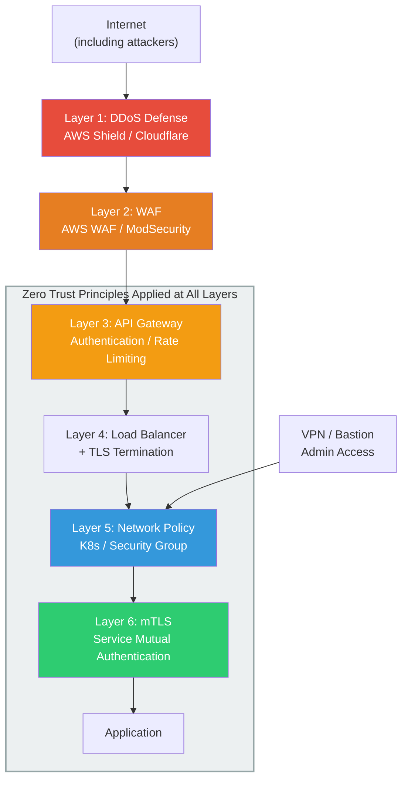
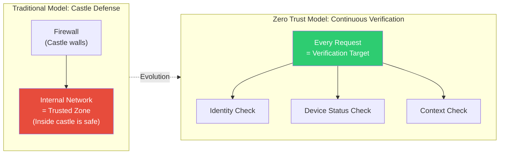
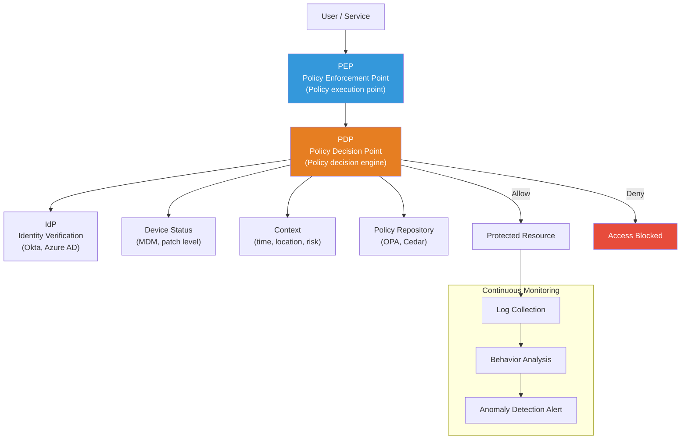
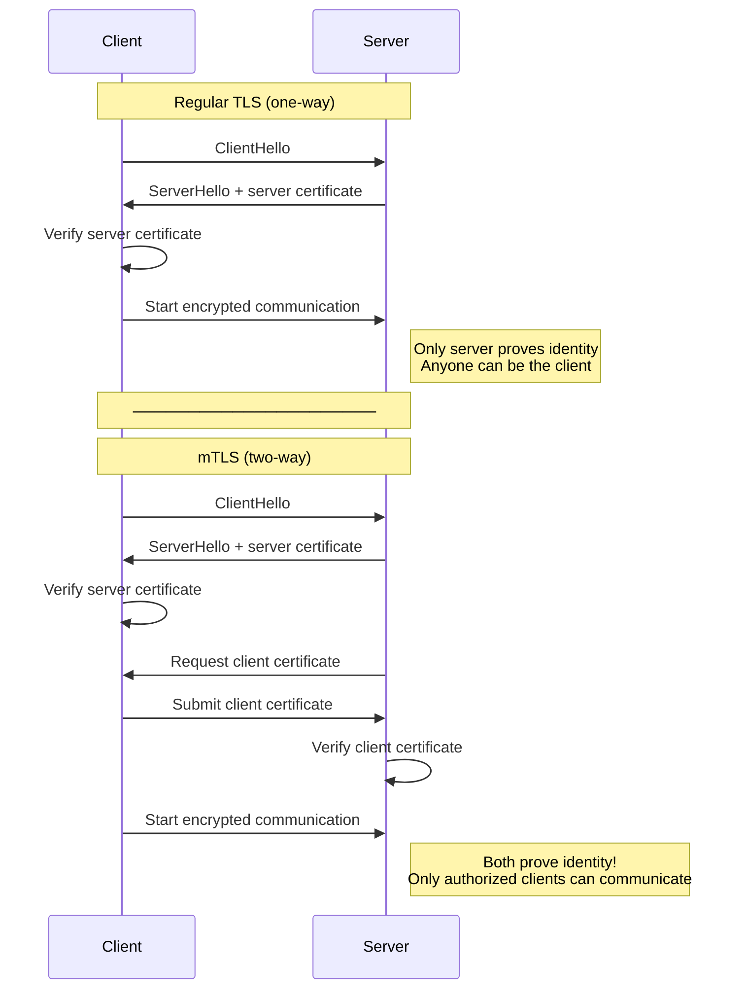
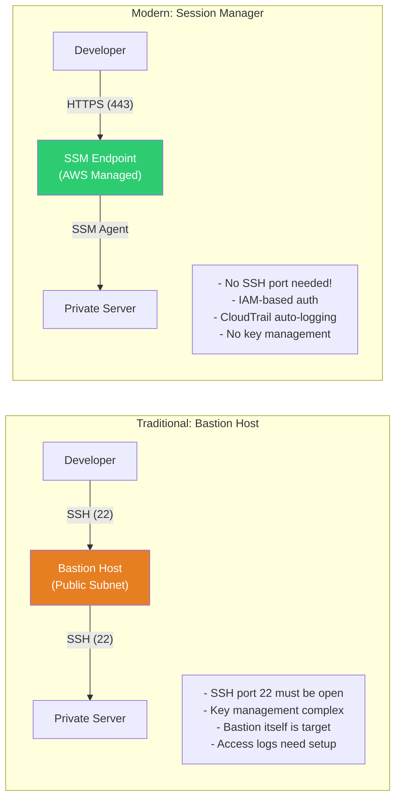
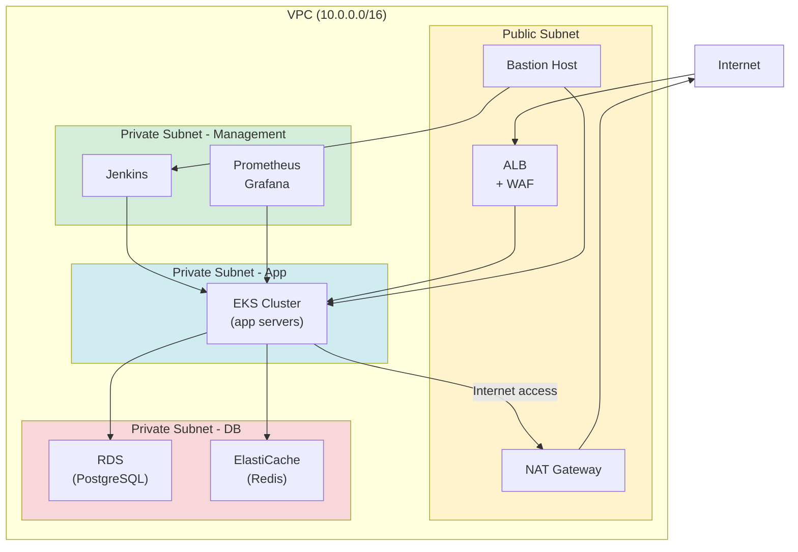
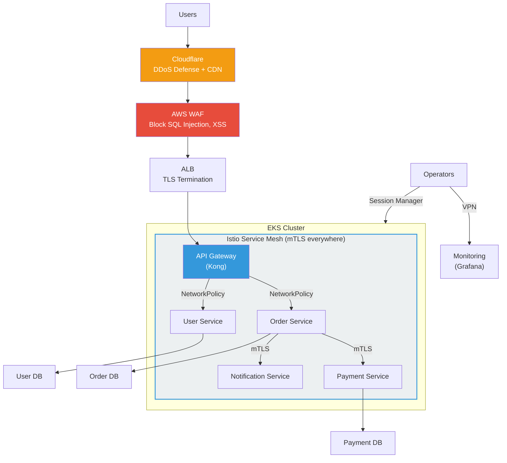

# Network Security (WAF / Zero Trust / mTLS / Network Policy / VPN / Bastion)

> Once your server connects to the internet, attacks begin. In the [Network Fundamentals](../02-networking/09-network-security) section, you learned about WAF and DDoS defense concepts, and in [VPC](../05-cloud-aws/02-vpc), you mastered cloud network isolation. This time, we'll go one step deeper — covering **Zero Trust Architecture, mTLS, K8s Network Policy, VPN, and Bastion Host** — to complete the full picture of practical network security.

---

## 🎯 Why Do You Need to Understand Network Security?

```
Real-world situations where network security matters:
• "We're getting SQL Injection attacks from outside"           → WAF rule configuration
• "Internal service-to-service communication needs encryption" → mTLS (mutual TLS)
• "Security audits require Zero Trust architecture"            → Zero Trust transition
• "Only certain Pods can access the DB"                        → K8s NetworkPolicy
• "Remote workers need to access internal systems"             → VPN / Client VPN
• "SSH access to servers is a security concern"                → Bastion Host / Session Manager
• "We're under DDoS attacks"                                   → Shield / Cloudflare
• "How do we secure API Gateway authentication?"               → API Gateway security policies
• Interview: "What is Zero Trust?"                             → Core security architecture
```

### What You'll Learn in This Lecture

| Topic | One-Line Explanation | Real-World Use |
|------|-----------|----------|
| **WAF** | Inspect HTTP request content and block attacks | SQL Injection, XSS defense |
| **Zero Trust** | "Never trust, always verify" | Strengthen internal network security |
| **mTLS** | Both server and client mutually authenticate with certificates | Service-to-service communication security |
| **Network Policy** | Control traffic between K8s Pods | Microservice network isolation |
| **VPN / Bastion** | Safe access paths to internal networks | Remote work, server management |
| **DDoS Defense** | Block massive traffic attacks | Service availability guarantee |
| **API Gateway Security** | Protect API endpoints | Authentication, rate limiting, access control |

---

## 🧠 Core Concepts

### Analogy: Airport Security System

Let's compare network security to an **airport**. Just as an airport has multiple security layers before you can board:

* **WAF** = Airport security checkpoint. X-rays baggage (HTTP requests) to detect weapons (SQL Injection, XSS)
* **Zero Trust** = "Even inside the airport, show your ID at each zone". You don't stop after entering; you're checked again at the lounge, boarding gate, etc.
* **mTLS** = Airline staff and pilot mutual identification. The pilot shows credentials, and the airline shows flight authorization. Both verify each other!
* **Network Policy** = Zone-based access control. "Passengers can't enter runways", "Baggage handlers can't access passenger terminals"
* **VPN** = Private limousine to the airport. Travels on public roads (internet) but with tinted windows (encryption) so outsiders can't see inside
* **Bastion Host** = Airport information desk. To access internal facilities, you must go through this point
* **DDoS Defense** = Traffic control outside the airport. Prevent thousands of vehicles from overwhelming the airport

### Complete Network Security Architecture



### Traditional Security vs Zero Trust Comparison



---

## 🔍 Understanding Each Component in Detail

### 1. WAF (Web Application Firewall)

WAF is a firewall that inspects the **content** (L7) of HTTP requests and blocks malicious ones. We covered the basics in [Network Security Fundamentals](../02-networking/09-network-security); here we focus on practical configuration.

#### AWS WAF Components

| Component | Explanation | Analogy |
|----------|------|------|
| **Web ACL** | Collection of WAF rules | Entire security checkpoint system |
| **Rule** | One inspection condition | "Liquids over 150ml not allowed" |
| **Rule Group** | Group of rules (Managed / Custom) | Security checkpoint manual set |
| **Condition** | Matching condition (IP, URI, Header, etc.) | Inspection items |
| **Action** | Allow / Block / Count | Pass / Block / Log only |

#### AWS WAF Core Managed Rules

```bash
# Key managed rule groups provided by AWS
AWS-AWSManagedRulesCommonRuleSet       # OWASP Top 10 basic defense
AWS-AWSManagedRulesSQLiRuleSet         # SQL Injection defense
AWS-AWSManagedRulesKnownBadInputsRuleSet  # Block known malicious inputs
AWS-AWSManagedRulesAmazonIpReputationList # Block malicious IPs
AWS-AWSManagedRulesBotControlRuleSet   # Bot traffic control
AWS-AWSManagedRulesLinuxRuleSet        # Linux-specific attack defense
```

#### ModSecurity (Open Source WAF)

ModSecurity is an open source WAF you attach in front of Nginx/Apache. Combined with OWASP Core Rule Set (CRS), it provides defense comparable to AWS WAF.

```nginx
# Nginx + ModSecurity configuration example
# /etc/nginx/nginx.conf

load_module modules/ngx_http_modsecurity_module.so;

http {
    modsecurity on;
    modsecurity_rules_file /etc/nginx/modsec/main.conf;

    server {
        listen 80;
        server_name api.example.com;

        location / {
            proxy_pass http://backend:8080;
        }
    }
}
```

```bash
# /etc/nginx/modsec/main.conf
Include /etc/nginx/modsec/modsecurity.conf
Include /etc/nginx/modsec/crs/crs-setup.conf
Include /etc/nginx/modsec/crs/rules/*.conf

# Custom rule example: block specific User-Agent
SecRule REQUEST_HEADERS:User-Agent "sqlmap|nikto|nmap" \
    "id:10001,phase:1,deny,status:403,msg:'Security scanner blocked'"

# Country-based IP blocking (GeoIP)
SecRule GEO:COUNTRY_CODE "@pm CN RU" \
    "id:10002,phase:1,deny,status:403,msg:'Unauthorized country'"
```

#### OWASP Top 10 and WAF Rule Mapping

| OWASP Top 10 | WAF Defense Rules | Explanation |
|--------------|--------------|------|
| A01: Broken Access Control | Access control rules | Block unauthorized resource access |
| A02: Cryptographic Failures | TLS enforcement rules | Redirect HTTP → HTTPS |
| A03: Injection | SQLi/XSS rules | Detect/block malicious input patterns |
| A04: Insecure Design | Rate Limiting | Compensate for design flaws |
| A05: Security Misconfiguration | Default config check | Block server info exposure |
| A06: Vulnerable Components | Known vulnerability rules | Block patterns like Log4Shell |
| A07: Auth Failures | Brute Force defense | Limit login attempts |
| A09: Logging Failures | WAF logging | Record all blocked events |
| A10: SSRF | SSRF defense rules | Block internal IP access attempts |

---

### 2. Zero Trust Architecture

Zero Trust is a security philosophy that says **"Never trust, always verify"**. It completely reverses the traditional "everything inside the castle is safe" mindset.

#### Zero Trust Core Principles

```
Three core principles of Zero Trust:

1. Never Trust, Always Verify (Never trust, always verify)
   → Internal networks also require authentication/authorization
   → Access based on identity, not location (IP)

2. Least Privilege (Minimum privilege)
   → Allow access only as much as needed, only when needed
   → No excessive privilege grants

3. Assume Breach (Assume compromise)
   → Assume an attacker is already inside
   → Minimize lateral movement
   → Reduce blast radius with Microsegmentation
```

#### Zero Trust Architecture Components



#### Microsegmentation

Traditional network segmentation divides by subnets, but microsegmentation divides **by workload** for fine-grained control.

```
Traditional Segmentation:
┌─────────────────────────────────────┐
│ DMZ Subnet  │ App Subnet  │ DB Subnet  │
│ (web)       │ (app)       │ (DB)       │
│ ─ mutual ─ │ ─ mutual ─ │ ─ mutual ─ │
│  communication  │ communication  │ communication  │
└─────────────────────────────────────┘
→ Unrestricted communication within same subnet (risky!)

Microsegmentation:
┌──────────────────────────────────────────┐
│ [WebServer-A] ←→ [AppServer-A] ←→ [DB-A]  │  ← Order Service
│      ✗             ✗             ✗        │
│ [WebServer-B] ←→ [AppServer-B] ←→ [DB-B]  │  ← Payment Service
│      ✗             ✗             ✗        │
│ [WebServer-C] ←→ [AppServer-C] ←→ [DB-C]  │  ← User Service
└──────────────────────────────────────────┘
→ Workload-level isolation. Even if Order Service is breached, Payment Service stays safe!
```

#### Zero Trust Adoption Stages

| Stage | Content | Tools |
|------|------|------|
| Stage 1: Visibility | Understand all assets and traffic flow | Flow Logs, Service Map |
| Stage 2: Identity-Based Access | Convert from IP-based → Identity-based | SSO, MFA, OAuth 2.0 |
| Stage 3: Least Privilege | Allow access only to needed resources | IAM, RBAC, Network Policy |
| Stage 4: Microsegmentation | Network isolation by workload | Service Mesh, Calico, Cilium |
| Stage 5: Continuous Monitoring | Real-time threat detection, behavior analysis | SIEM, Falco, GuardDuty |

---

### 3. mTLS (Mutual TLS)

#### Regular TLS vs mTLS

Regular TLS only has the **server show its certificate** (client → server: "Are you really the server?"). mTLS has **both sides exchange certificates** (both verify: "Who are you?").



#### cert-manager for Automatic Certificate Management

K8s mTLS implementation with **cert-manager** handling certificate issuance/renewal automatically.

```yaml
# cert-manager setup
# helm install cert-manager jetstack/cert-manager --namespace cert-manager \
#   --set installCRDs=true

# 1. Create CA (Certificate Authority) Issuer
apiVersion: cert-manager.io/v1
kind: ClusterIssuer
metadata:
  name: internal-ca-issuer
spec:
  ca:
    secretName: internal-ca-key-pair

---
# 2. Request per-service certificate
apiVersion: cert-manager.io/v1
kind: Certificate
metadata:
  name: order-service-cert
  namespace: production
spec:
  secretName: order-service-tls
  issuerRef:
    name: internal-ca-issuer
    kind: ClusterIssuer
  commonName: order-service.production.svc.cluster.local
  dnsNames:
    - order-service
    - order-service.production
    - order-service.production.svc.cluster.local
  duration: 2160h    # 90 days
  renewBefore: 360h  # Auto-renew 15 days before expiry
  privateKey:
    algorithm: ECDSA
    size: 256
```

#### mTLS with Service Mesh (Istio Example)

Service Mesh enables mTLS **without changing application code**. The sidecar proxy handles it.

```yaml
# Istio PeerAuthentication - enable mTLS for entire namespace
apiVersion: security.istio.io/v1beta1
kind: PeerAuthentication
metadata:
  name: default
  namespace: production
spec:
  mtls:
    mode: STRICT  # mTLS required (PERMISSIVE = optional)

---
# DestinationRule - enable mTLS for specific service
apiVersion: networking.istio.io/v1beta1
kind: DestinationRule
metadata:
  name: order-service
  namespace: production
spec:
  host: order-service.production.svc.cluster.local
  trafficPolicy:
    tls:
      mode: ISTIO_MUTUAL  # Istio manages certificates automatically
```

```
Service-to-service communication with mTLS enabled:

[Order Service Pod]                          [Payment Service Pod]
┌─────────────────┐                         ┌─────────────────┐
│ App Container   │                         │ App Container   │
│ (HTTP request)  │                         │ (HTTP receive)  │
│      ↓          │                         │      ↑          │
│ Envoy Sidecar   │ ── mTLS encryption ──→  │ Envoy Sidecar   │
│ (manages certs) │   (mutual cert check)   │ (manages certs) │
└─────────────────┘                         └─────────────────┘

→ App just makes HTTP requests.
→ Sidecar automatically handles mTLS!
```

---

### 4. K8s Network Policy

We covered [K8s Security](../04-kubernetes/15-security) NetworkPolicy basics. Here we focus on practical patterns and Calico/Cilium usage.

#### NetworkPolicy Basic Operation Principles

```
NetworkPolicy core rules:
1. No NetworkPolicy → all Pod-to-Pod communication allowed (default)
2. Any NetworkPolicy exists → only explicitly allowed traffic passes
3. Ingress rules = control incoming traffic
4. Egress rules = control outgoing traffic
5. CNI must support NetworkPolicy (Calico, Cilium, Weave)
   ※ Default kubenet, Flannel don't support!
```

#### Practical Pattern: Default Deny + Allowlist

```yaml
# Step 1: Block all traffic (Default Deny)
apiVersion: networking.k8s.io/v1
kind: NetworkPolicy
metadata:
  name: default-deny-all
  namespace: production
spec:
  podSelector: {}      # Apply to all Pods
  policyTypes:
    - Ingress
    - Egress

---
# Step 2: Allow DNS lookups (essential for service names!)
apiVersion: networking.k8s.io/v1
kind: NetworkPolicy
metadata:
  name: allow-dns
  namespace: production
spec:
  podSelector: {}
  policyTypes:
    - Egress
  egress:
    - to:
        - namespaceSelector:
            matchLabels:
              kubernetes.io/metadata.name: kube-system
      ports:
        - protocol: UDP
          port: 53
        - protocol: TCP
          port: 53

---
# Step 3: Allow frontend → API server communication only
apiVersion: networking.k8s.io/v1
kind: NetworkPolicy
metadata:
  name: allow-frontend-to-api
  namespace: production
spec:
  podSelector:
    matchLabels:
      app: api-server
  policyTypes:
    - Ingress
  ingress:
    - from:
        - podSelector:
            matchLabels:
              app: frontend
      ports:
        - protocol: TCP
          port: 8080

---
# Step 4: Allow API server → DB communication only
apiVersion: networking.k8s.io/v1
kind: NetworkPolicy
metadata:
  name: allow-api-to-db
  namespace: production
spec:
  podSelector:
    matchLabels:
      app: database
  policyTypes:
    - Ingress
  ingress:
    - from:
        - podSelector:
            matchLabels:
              app: api-server
      ports:
        - protocol: TCP
          port: 5432
```

#### Calico Advanced Network Policy

Calico provides more powerful features than K8s basic NetworkPolicy.

```yaml
# Calico GlobalNetworkPolicy - apply to entire cluster
apiVersion: projectcalico.org/v3
kind: GlobalNetworkPolicy
metadata:
  name: deny-external-egress
spec:
  # All Pods in production namespace
  selector: projectcalico.org/namespace == 'production'
  types:
    - Egress
  egress:
    # Allow internal cluster communication only
    - action: Allow
      destination:
        nets:
          - 10.0.0.0/8       # Cluster internal IP
    # Allow external HTTPS only (package downloads, etc.)
    - action: Allow
      protocol: TCP
      destination:
        ports:
          - 443
    # Block all other external communication
    - action: Deny

---
# Calico NetworkPolicy - L7 rules (HTTP method/path based)
apiVersion: projectcalico.org/v3
kind: NetworkPolicy
metadata:
  name: allow-readonly-api
  namespace: production
spec:
  selector: app == 'api-server'
  types:
    - Ingress
  ingress:
    - action: Allow
      protocol: TCP
      source:
        selector: app == 'monitoring'
      destination:
        ports:
          - 8080
      http:
        methods: ["GET"]           # Allow GET only
        paths:
          - exact: "/health"       # Allow /health only
          - prefix: "/metrics"     # Allow /metrics/* paths
```

#### Cilium L7 Network Policy

Cilium, based on eBPF, operates at kernel level for faster and finer-grained control.

```yaml
# Cilium CiliumNetworkPolicy - L7 HTTP-based control
apiVersion: cilium.io/v2
kind: CiliumNetworkPolicy
metadata:
  name: api-server-policy
  namespace: production
spec:
  endpointSelector:
    matchLabels:
      app: api-server
  ingress:
    - fromEndpoints:
        - matchLabels:
            app: frontend
      toPorts:
        - ports:
            - port: "8080"
              protocol: TCP
          rules:
            http:
              - method: "GET"
                path: "/api/v1/products"
              - method: "POST"
                path: "/api/v1/orders"
                headers:
                  - 'Content-Type: application/json'
  egress:
    - toEndpoints:
        - matchLabels:
            app: database
      toPorts:
        - ports:
            - port: "5432"
              protocol: TCP
    # Allow external API calls (FQDN based)
    - toFQDNs:
        - matchName: "api.stripe.com"
      toPorts:
        - ports:
            - port: "443"
              protocol: TCP
```

---

### 5. VPN / Bastion Host / Session Manager

We covered [VPN Basics](../02-networking/10-vpn). Here we focus on practical setup.

#### VPN Solution Comparison

| Solution | Type | Advantages | Disadvantages | Best For |
|--------|------|------|------|------------|
| **WireGuard** | P2P / Client | Fast, clean code(4K lines), modern | No management UI | Small teams, performance-focused |
| **OpenVPN** | Client / S2S | Mature ecosystem, diverse auth | Relatively slow | Large orgs, diverse OS |
| **AWS Client VPN** | Client | AWS native, AD integration | Cost, bandwidth limited | AWS-only environments |
| **Tailscale** | Mesh | WireGuard-based, setup simplified | Third-party dependency | Startups, quick setup |
| **AWS S2S VPN** | Site-to-Site | Managed, redundant | Bandwidth limit(1.25Gbps) | Office-to-AWS connection |

#### WireGuard Configuration

```bash
# ===== WireGuard Server Setup (Ubuntu) =====

# 1. Install
sudo apt update && sudo apt install wireguard -y

# 2. Generate keys
wg genkey | tee /etc/wireguard/server_private.key | wg pubkey > /etc/wireguard/server_public.key
chmod 600 /etc/wireguard/server_private.key

# 3. Server configuration file
cat <<'EOF' > /etc/wireguard/wg0.conf
[Interface]
Address = 10.200.0.1/24
ListenPort = 51820
PrivateKey = <server_private_key>

# IP forwarding and NAT
PostUp = iptables -A FORWARD -i wg0 -j ACCEPT; iptables -t nat -A POSTROUTING -o eth0 -j MASQUERADE
PostDown = iptables -D FORWARD -i wg0 -j ACCEPT; iptables -t nat -D POSTROUTING -o eth0 -j MASQUERADE

# Client 1 (Developer A)
[Peer]
PublicKey = <client1_public_key>
AllowedIPs = 10.200.0.2/32

# Client 2 (Developer B)
[Peer]
PublicKey = <client2_public_key>
AllowedIPs = 10.200.0.3/32
EOF

# 4. Start service
sudo systemctl enable --now wg-quick@wg0

# ===== WireGuard Client Setup =====
cat <<'EOF' > /etc/wireguard/wg0.conf
[Interface]
Address = 10.200.0.2/24
PrivateKey = <client_private_key>
DNS = 10.0.0.2

[Peer]
PublicKey = <server_public_key>
Endpoint = vpn.example.com:51820
AllowedIPs = 10.0.0.0/16, 10.200.0.0/24   # VPC CIDR + VPN CIDR
PersistentKeepalive = 25
EOF

sudo wg-quick up wg0
```

#### Bastion Host vs AWS Systems Manager Session Manager



#### Session Manager Setup

```bash
# Assign SSM Agent role to EC2 instance (IAM)
# Required managed policy: AmazonSSMManagedInstanceCore

# Connect from local PC via Session Manager
aws ssm start-session --target i-0abc123def456

# Port forwarding (local → private server)
aws ssm start-session \
    --target i-0abc123def456 \
    --document-name AWS-StartPortForwardingSession \
    --parameters '{"portNumber":["5432"],"localPortNumber":["15432"]}'
# → Connect to localhost:15432 to reach private server's 5432 (PostgreSQL)!

# SSH over Session Manager (use IAM auth instead of SSH key)
# Add to ~/.ssh/config:
# Host i-*
#     ProxyCommand sh -c "aws ssm start-session --target %h --document-name AWS-StartSSHSession --parameters 'portNumber=%p'"
```

#### Security-Hardened Bastion Host

```bash
# Bastion Host security hardening checklist:
# 1. Change SSH port (22 → 2222 etc.)
# 2. Key-based auth only (disable password)
# 3. Apply MFA (Google Authenticator)
# 4. IP whitelisting (Security Group)
# 5. Session timeout
# 6. Access logging (CloudWatch)

# /etc/ssh/sshd_config (Bastion Server)
Port 2222
PermitRootLogin no
PasswordAuthentication no
MaxAuthTries 3
ClientAliveInterval 300
ClientAliveCountMax 2
AllowUsers admin deploy-user
```

---

### 6. DDoS Defense

#### DDoS Attack Types and Defense Layers

| Attack Type | OSI Layer | Example | Defense |
|----------|---------|------|----------|
| **Volumetric** | L3/L4 | UDP Flood, ICMP Flood | AWS Shield, Cloudflare |
| **Protocol** | L3/L4 | SYN Flood, Ping of Death | Shield, Firewall |
| **Application** | L7 | HTTP Flood, Slowloris | WAF, Rate Limiting |

#### AWS Shield Standard vs Advanced

```
AWS Shield Standard (free, auto-applied):
├── L3/L4 DDoS defense (SYN Flood, UDP Flood, etc.)
├── Auto-applied to all AWS resources
├── No setup required
└── Blocks most common DDoS attacks

AWS Shield Advanced ($3,000/month):
├── L3/L4/L7 DDoS defense
├── Real-time attack detection and alerts
├── 24/7 DDoS Response Team (DRT) support
├── Cost protection (refund for scaling costs from DDoS)
├── Global threat dashboard
├── Auto-generate WAF rules
└── Applicable to: CloudFront, ALB, NLB, EIP, Global Accelerator
```

#### DDoS Defense with Cloudflare

```
Traffic flow (with Cloudflare):

Users → Cloudflare Edge (280+ PoP)
         ├── DDoS detection and blocking (L3/L4/L7)
         ├── Bot Management
         ├── WAF (OWASP rules)
         ├── Rate Limiting
         └── Only legitimate traffic → Origin Server (our server)

Configuration essentials:
1. Change DNS to Cloudflare (proxy mode)
2. Never expose Origin IP externally!
3. Origin allows Cloudflare IPs only (Security Group)
4. SSL mode: Full (Strict) recommended
```

---

### 7. API Gateway Security

We covered [API Gateway Basics](../02-networking/13-api-gateway). Here we add security perspective.

#### API Gateway Security Layers

```
API Gateway security checklist:

1. Authentication (Authentication)
   ├── API Key
   ├── OAuth 2.0 / JWT
   ├── Cognito User Pool
   └── IAM authentication (AWS SigV4)

2. Authorization (Authorization)
   ├── Lambda Authorizer (custom logic)
   ├── Cognito Authorizer
   └── IAM Policy

3. Traffic Control
   ├── Rate Limiting (request count limit)
   ├── Throttling (requests per second limit)
   ├── Quota (daily/monthly limits)
   └── Usage Plan (per-API-key limits)

4. Input Validation
   ├── Request Validation (schema validation)
   ├── Request/Response Mapping
   └── Payload Size limit

5. Transport Security
   ├── HTTPS enforcement (TLS 1.2+)
   ├── mTLS authentication
   └── Private API (VPC internal only)
```

#### AWS API Gateway Security Configuration Example

```yaml
# SAM Template - API Gateway security setup
AWSTemplateFormatVersion: '2010-09-09'
Transform: AWS::Serverless-2016-10-31

Resources:
  # API Gateway
  SecureApi:
    Type: AWS::Serverless::Api
    Properties:
      StageName: prod
      # Connect WAF separately via AWS::WAFv2::WebACLAssociation

      # Enable mTLS
      MutualTlsAuthentication:
        TruststoreUri: s3://my-bucket/truststore.pem

      # Domain + TLS setup
      Domain:
        DomainName: api.example.com
        CertificateArn: arn:aws:acm:...
        SecurityPolicy: TLS_1_2

      Auth:
        # Default authentication method
        DefaultAuthorizer: MyCognitoAuthorizer
        Authorizers:
          MyCognitoAuthorizer:
            UserPoolArn: !GetAtt UserPool.Arn
        # Require API key
        ApiKeyRequired: true
        # Usage Plan
        UsagePlan:
          CreateUsagePlan: PER_API
          Throttle:
            BurstLimit: 100      # Max burst requests
            RateLimit: 50        # Average requests per second
          Quota:
            Limit: 10000         # Daily max requests
            Period: DAY
```

---

### 8. Network Segmentation

#### AWS VPC-Based Network Segmentation



#### Security Group Design Principles

```bash
# Security Group design principle: "Open only what's needed, with SG references"

# ALB Security Group
aws ec2 create-security-group --group-name alb-sg --description "ALB"
# → Inbound: 0.0.0.0/0:443 (HTTPS)
# → Outbound: app-sg:8080

# App Security Group
aws ec2 create-security-group --group-name app-sg --description "App"
# → Inbound: alb-sg:8080 (ALB only)
# → Inbound: bastion-sg:22 (Bastion only)
# → Outbound: db-sg:5432 (DB only)
# → Outbound: redis-sg:6379 (Redis only)

# DB Security Group
aws ec2 create-security-group --group-name db-sg --description "DB"
# → Inbound: app-sg:5432 (App only)
# → Outbound: none (DB doesn't need outgoing traffic)

# Key principle: Reference by Security Group ID, not IP!
# → When instances are replaced, rules don't change
# → "Allow traffic from resources in this SG"
```

---

## 💻 Hands-On Exercises

### Exercise 1: AWS WAF Configuration (Terraform)

```hcl
# terraform/waf.tf

# Create WAF Web ACL
resource "aws_wafv2_web_acl" "main" {
  name        = "production-waf"
  description = "Production WAF"
  scope       = "REGIONAL"  # "CLOUDFRONT" for CloudFront

  default_action {
    allow {}
  }

  # Rule 1: AWS Managed - OWASP Common Rule Set
  rule {
    name     = "AWSManagedRulesCommonRuleSet"
    priority = 1

    override_action {
      none {}  # Use managed rule's actions
    }

    statement {
      managed_rule_group_statement {
        name        = "AWSManagedRulesCommonRuleSet"
        vendor_name = "AWS"

        # Override specific rules (Count instead of Block)
        rule_action_override {
          action_to_use {
            count {}
          }
          name = "SizeRestrictions_BODY"
        }
      }
    }

    visibility_config {
      cloudwatch_metrics_enabled = true
      metric_name                = "CommonRuleSet"
      sampled_requests_enabled   = true
    }
  }

  # Rule 2: SQL Injection Defense
  rule {
    name     = "AWSManagedRulesSQLiRuleSet"
    priority = 2

    override_action {
      none {}
    }

    statement {
      managed_rule_group_statement {
        name        = "AWSManagedRulesSQLiRuleSet"
        vendor_name = "AWS"
      }
    }

    visibility_config {
      cloudwatch_metrics_enabled = true
      metric_name                = "SQLiRuleSet"
      sampled_requests_enabled   = true
    }
  }

  # Rule 3: Rate Limiting (2000 requests per minute per IP)
  rule {
    name     = "RateLimitRule"
    priority = 3

    action {
      block {}
    }

    statement {
      rate_based_statement {
        limit              = 2000
        aggregate_key_type = "IP"
      }
    }

    visibility_config {
      cloudwatch_metrics_enabled = true
      metric_name                = "RateLimit"
      sampled_requests_enabled   = true
    }
  }

  # Rule 4: Block specific countries
  rule {
    name     = "GeoBlockRule"
    priority = 4

    action {
      block {}
    }

    statement {
      geo_match_statement {
        country_codes = ["CN", "RU", "KP"]
      }
    }

    visibility_config {
      cloudwatch_metrics_enabled = true
      metric_name                = "GeoBlock"
      sampled_requests_enabled   = true
    }
  }

  # Rule 5: Custom - Protect /admin path
  rule {
    name     = "ProtectAdminPath"
    priority = 5

    action {
      block {}
    }

    statement {
      and_statement {
        statement {
          byte_match_statement {
            search_string         = "/admin"
            positional_constraint = "STARTS_WITH"
            field_to_match {
              uri_path {}
            }
            text_transformation {
              priority = 0
              type     = "LOWERCASE"
            }
          }
        }
        statement {
          not_statement {
            statement {
              ip_set_reference_statement {
                arn = aws_wafv2_ip_set.admin_whitelist.arn
              }
            }
          }
        }
      }
    }

    visibility_config {
      cloudwatch_metrics_enabled = true
      metric_name                = "AdminProtect"
      sampled_requests_enabled   = true
    }
  }

  visibility_config {
    cloudwatch_metrics_enabled = true
    metric_name                = "ProductionWAF"
    sampled_requests_enabled   = true
  }
}

# Admin IP whitelist
resource "aws_wafv2_ip_set" "admin_whitelist" {
  name               = "admin-whitelist"
  scope              = "REGIONAL"
  ip_address_version = "IPV4"
  addresses          = ["203.0.113.0/24"]  # Office IP
}

# Connect WAF to ALB
resource "aws_wafv2_web_acl_association" "alb" {
  resource_arn = aws_lb.main.arn
  web_acl_arn  = aws_wafv2_web_acl.main.arn
}

# WAF logging to CloudWatch
resource "aws_wafv2_web_acl_logging_configuration" "main" {
  log_destination_configs = [aws_cloudwatch_log_group.waf.arn]
  resource_arn            = aws_wafv2_web_acl.main.arn

  logging_filter {
    default_behavior = "DROP"  # Log blocked requests only
    filter {
      behavior    = "KEEP"
      requirement = "MEETS_ANY"
      condition {
        action_condition {
          action = "BLOCK"     # Log blocked requests
        }
      }
    }
  }
}
```

### Exercise 2: K8s Network Policy Step-by-Step Application

```bash
# Step 1: Check current state
kubectl get networkpolicy -A
# → If empty, all Pod-to-Pod communication is allowed!

# Step 2: Prepare test environment
kubectl create namespace netpol-test

# Frontend Pod
kubectl run frontend --image=nginx --labels=app=frontend -n netpol-test
# API server Pod
kubectl run api --image=nginx --labels=app=api -n netpol-test --port=80
# DB Pod
kubectl run db --image=postgres:15 --labels=app=db -n netpol-test \
  --env="POSTGRES_PASSWORD=test123" --port=5432

# Create services
kubectl expose pod api --port=80 -n netpol-test
kubectl expose pod db --port=5432 -n netpol-test

# Step 3: Test before policy (all should succeed)
kubectl exec frontend -n netpol-test -- curl -s --max-time 3 api
kubectl exec frontend -n netpol-test -- curl -s --max-time 3 db:5432
kubectl exec api -n netpol-test -- curl -s --max-time 3 db:5432
echo "→ All communication possible (no NetworkPolicy)"

# Step 4: Apply Default Deny
cat <<'EOF' | kubectl apply -f -
apiVersion: networking.k8s.io/v1
kind: NetworkPolicy
metadata:
  name: default-deny
  namespace: netpol-test
spec:
  podSelector: {}
  policyTypes:
    - Ingress
    - Egress
EOF

# Step 5: Test after (all should fail)
kubectl exec frontend -n netpol-test -- curl -s --max-time 3 api
echo "→ Timeout! (blocked)"

# Step 6: Allow required communication
cat <<'EOF' | kubectl apply -f -
apiVersion: networking.k8s.io/v1
kind: NetworkPolicy
metadata:
  name: allow-dns
  namespace: netpol-test
spec:
  podSelector: {}
  policyTypes:
    - Egress
  egress:
    - to:
        - namespaceSelector:
            matchLabels:
              kubernetes.io/metadata.name: kube-system
      ports:
        - protocol: UDP
          port: 53
---
apiVersion: networking.k8s.io/v1
kind: NetworkPolicy
metadata:
  name: frontend-to-api
  namespace: netpol-test
spec:
  podSelector:
    matchLabels:
      app: api
  ingress:
    - from:
        - podSelector:
            matchLabels:
              app: frontend
      ports:
        - port: 80
---
apiVersion: networking.k8s.io/v1
kind: NetworkPolicy
metadata:
  name: api-to-db
  namespace: netpol-test
spec:
  podSelector:
    matchLabels:
      app: db
  ingress:
    - from:
        - podSelector:
            matchLabels:
              app: api
      ports:
        - port: 5432
EOF

# Step 7: Final test
kubectl exec frontend -n netpol-test -- curl -s --max-time 3 api
echo "→ Success! (frontend → api allowed)"

kubectl exec frontend -n netpol-test -- curl -s --max-time 3 db:5432
echo "→ Failed! (frontend → db blocked)"

kubectl exec api -n netpol-test -- curl -s --max-time 3 db:5432
echo "→ Success! (api → db allowed)"

# Cleanup
kubectl delete namespace netpol-test
```

### Exercise 3: Enable Istio mTLS

```bash
# Step 1: Install Istio
istioctl install --set profile=default -y

# Step 2: Enable sidecar auto-injection in namespace
kubectl label namespace production istio-injection=enabled

# Step 3: Enable Strict mTLS
cat <<'EOF' | kubectl apply -f -
apiVersion: security.istio.io/v1beta1
kind: PeerAuthentication
metadata:
  name: default
  namespace: production
spec:
  mtls:
    mode: STRICT
EOF

# Step 4: Check mTLS status
istioctl x describe pod <pod-name> -n production
# Output shows mTLS information

# Step 5: Add JWT authentication for external requests
cat <<'EOF' | kubectl apply -f -
apiVersion: security.istio.io/v1beta1
kind: RequestAuthentication
metadata:
  name: jwt-auth
  namespace: production
spec:
  selector:
    matchLabels:
      app: api-server
  jwtRules:
    - issuer: "https://auth.example.com"
      jwksUri: "https://auth.example.com/.well-known/jwks.json"
---
apiVersion: security.istio.io/v1beta1
kind: AuthorizationPolicy
metadata:
  name: require-jwt
  namespace: production
spec:
  selector:
    matchLabels:
      app: api-server
  rules:
    - from:
        - source:
            requestPrincipals: ["*"]  # Allow JWT-authenticated requests only
      to:
        - operation:
            methods: ["GET", "POST"]
            paths: ["/api/*"]
EOF

# Step 6: View mTLS in Kiali dashboard
kubectl port-forward svc/kiali -n istio-system 20001:20001
# → http://localhost:20001 shows mTLS status visually
```

### Exercise 4: Secure Server Access with Session Manager

```bash
# Step 1: Create IAM Role for EC2 instance (Terraform)
cat <<'EOF'
resource "aws_iam_role" "ec2_ssm" {
  name = "ec2-ssm-role"
  assume_role_policy = jsonencode({
    Version = "2012-10-17"
    Statement = [{
      Action = "sts:AssumeRole"
      Effect = "Allow"
      Principal = { Service = "ec2.amazonaws.com" }
    }]
  })
}

resource "aws_iam_role_policy_attachment" "ssm" {
  role       = aws_iam_role.ec2_ssm.name
  policy_arn = "arn:aws:iam::aws:policy/AmazonSSMManagedInstanceCore"
}

resource "aws_iam_instance_profile" "ssm" {
  name = "ec2-ssm-profile"
  role = aws_iam_role.ec2_ssm.name
}
EOF

# Step 2: Connect via Session Manager
aws ssm start-session --target i-0abc123def456

# Step 3: Port forwarding (access private RDS)
aws ssm start-session \
    --target i-0abc123def456 \
    --document-name AWS-StartPortForwardingSessionToRemoteHost \
    --parameters '{
        "host": ["mydb.cluster-xyz.ap-northeast-2.rds.amazonaws.com"],
        "portNumber": ["5432"],
        "localPortNumber": ["15432"]
    }'

# → Now connect to localhost:15432 for private RDS!
psql -h localhost -p 15432 -U admin -d mydb

# Step 4: Check Session Manager logs
aws ssm describe-sessions --state History \
    --filters "key=Target,value=i-0abc123def456"
```

---

## 🏢 In Real-World Scenarios

### Network Security Strategy by Company Size

#### Startup (5-20 people)

```
Minimal cost, basic security:
├── WAF: AWS WAF (managed rules)
├── DDoS: AWS Shield Standard (free)
├── VPN: Tailscale or WireGuard
├── Server Access: Session Manager
├── K8s: Basic NetworkPolicy (default deny)
├── TLS: cert-manager + Let's Encrypt
└── Budget: ~$50/month
```

#### Mid-Size Company (20-200 people)

```
Systematic security architecture:
├── WAF: AWS WAF + custom rules + Bot Control
├── DDoS: Cloudflare Pro or AWS Shield Advanced
├── Zero Trust: Cloudflare Access or Zscaler
├── VPN: WireGuard + MFA
├── Server Access: Session Manager + CloudTrail audit
├── K8s: Calico NetworkPolicy + Istio mTLS
├── API GW: Kong / AWS API Gateway + JWT auth
├── Monitoring: GuardDuty + SecurityHub
└── Budget: ~$1,000-5,000/month
```

#### Enterprise / Finance (200+ people)

```
Compliance + defense in depth:
├── WAF: AWS WAF + ModSecurity + dedicated WAF appliance
├── DDoS: Shield Advanced + Cloudflare Enterprise
├── Zero Trust: Enterprise Zero Trust architecture (BeyondCorp model)
├── mTLS: Istio + SPIFFE/SPIRE
├── VPN: AWS S2S VPN + Direct Connect
├── Server Access: Session Manager + PAM (Privileged Access Management)
├── K8s: Cilium + OPA/Gatekeeper
├── Network: Microsegmentation (service-level isolation)
├── Audit: SIEM + SOC operations + automated audit reports
├── Compliance: PCI-DSS, ISMS, SOC2
└── Budget: $10,000+/month
```

### Real-World Security Architecture Example (E-Commerce)



### Security Incident Response Flow

```
Security incident occurs → Response:

1. Detection (Detection)
   └── WAF alert / GuardDuty / Falco / CloudTrail anomaly

2. Analysis (Analysis)
   ├── Review attack pattern from WAF logs
   ├── Identify affected resources
   └── Identify attack vector

3. Containment (Containment)
   ├── Immediately block attacker IP (WAF IP Set)
   ├── Isolate compromised Pod/instance network
   └── Strengthen temporary NetworkPolicy

4. Removal (Eradication)
   ├── Patch vulnerability
   ├── Recreate infected resources
   └── Update threat signatures

5. Recovery (Recovery)
   ├── Normalize service
   ├── Strengthen monitoring
   └── Adjust alert thresholds

6. Learning (Lessons Learned)
   ├── Write post-incident analysis
   ├── Improve WAF rules
   └── Implement recurrence prevention
```

---

## ⚠️ Common Mistakes

### Mistake 1: Installing WAF but Not Monitoring It

```
❌ Wrong approach:
Deploy AWS WAF → apply managed rules → done!

✅ Right approach:
1. Enable WAF in Count mode first (test for 1-2 weeks)
2. Analyze logs to confirm normal traffic isn't blocked
3. Switch to Block mode only after validation
4. Monitor WAF logs regularly
5. Update rules based on new attack patterns

→ WAF false positives can block legitimate users = revenue loss!
```

### Mistake 2: Forgetting DNS Allow in NetworkPolicy

```yaml
# ❌ This alone blocks DNS queries too!
apiVersion: networking.k8s.io/v1
kind: NetworkPolicy
metadata:
  name: default-deny
spec:
  podSelector: {}
  policyTypes:
    - Ingress
    - Egress
# → DNS (UDP 53) is also blocked!
# → "curl api-server" fails because DNS lookup fails!

# ✅ Always add DNS allowlist
# (See Exercise 2 for complete example)
```

### Mistake 3: Attempting Zero Trust Migration All at Once

```
❌ Wrong approach:
"Let's transition entire company to Zero Trust now!" (big bang)
→ Service outages, development chaos, staff rejection

✅ Right approach (gradual):
Stage 1: Visibility (understand traffic flow)          ← 2-4 weeks
Stage 2: New services only (don't touch existing)      ← 1-2 months
Stage 3: Expand to non-critical services               ← 2-3 months
Stage 4: Critical service migration (thorough testing) ← 3-6 months
Stage 5: Legacy service migration                      ← 6-12 months
```

### Mistake 4: Ignoring mTLS Certificate Expiry

```
❌ Not monitoring:
"cert-manager is installed, certificates auto-renew"
→ Certificate expires → service-to-service communication breaks!
   (All traffic fails!)

✅ Proper monitoring:
1. Set renewBefore in certificate (renew 15 days early)
2. Collect cert-manager metrics in Prometheus
3. Alert on cert expiration < 7 days
4. Monitor certificate renewal failures
```

### Mistake 5: Opening Bastion SSH Port to 0.0.0.0/0

```
❌ Security Group:
Inbound: 0.0.0.0/0 → TCP 22 (SSH open to world!)
→ Brute-force attack target

✅ Security Group:
Inbound: 203.0.113.0/24 → TCP 2222 (office IP + non-standard port)
→ Even better: Use Session Manager (don't open SSH at all!)
```

### Mistake 6: VPN Full Tunnel Overhead

```
❌ All traffic via VPN (Full Tunnel):
VPN → YouTube, Netflix, etc.
→ VPN bandwidth explodes, speed degrades, costs spike

✅ Only business traffic via VPN (Split Tunnel):
AllowedIPs = 10.0.0.0/16     # Only VPC CIDR
# AllowedIPs = 0.0.0.0/0     # Don't use this!

→ Personal internet traffic stays direct
→ VPN only handles business traffic
```

### Mistake 7: Relying Only on WAF Rate Limiting for DDoS

```
❌ "WAF Rate Limiting handles all DDoS"
→ WAF only handles L7. L3/L4 attacks (SYN Flood, UDP Flood)
   reach your network before hitting WAF!

✅ Layered DDoS defense:
L3/L4: AWS Shield / Cloudflare (network level)
L7:    WAF Rate Limiting (application level)
→ Both layers needed!
```

---

## 📝 Summary

### Core Summary Table

| Security Layer | Tools | Key Concepts |
|----------|------|----------|
| **Edge / DDoS** | Shield, Cloudflare | Block massive L3/L4 traffic |
| **WAF** | AWS WAF, ModSecurity | Detect/block L7 HTTP attacks |
| **API Gateway** | Kong, AWS API GW | Auth, rate limit, input validation |
| **Zero Trust** | IdP + PDP + PEP | Never trust, always verify |
| **mTLS** | cert-manager, Istio | Service mutual authentication |
| **Network Policy** | Calico, Cilium | Pod-level traffic control |
| **VPN** | WireGuard, OpenVPN | Secure remote access |
| **Bastion / SSM** | Session Manager | Server access control |
| **Segmentation** | VPC, SG, NACL | Network isolation |

### Recommended Priority for Implementation (Real-World)

```
Day 1 (Most Critical):
├── 1. Clean up Security Groups (least privilege)
├── 2. Enforce HTTPS company-wide (TLS certificates)
├── 3. Close SSH port 22, use Session Manager
└── 4. Verify AWS Shield Standard (auto-applied)

Week 1-2 (Next):
├── 5. Deploy WAF (Count mode first)
├── 6. K8s Default Deny NetworkPolicy
├── 7. Configure VPN (for remote access)
└── 8. Enable CloudTrail + GuardDuty

Month 1-3 (Foundation):
├── 9. Implement mTLS (Service Mesh)
├── 10. Zero Trust gradual rollout
├── 11. Microsegmentation
└── 12. SIEM + SOC operations
```

### Interview Questions

```
Q: "What's Zero Trust?"
A: "A security model where you never trust location (IP) alone.
   Instead, continuously verify every access request using identity,
   device status, and context. Core principles:
   1) Never Trust, Always Verify - authenticate everything
   2) Least Privilege - grant minimum necessary permissions
   3) Assume Breach - assume attackers are inside"

Q: "Difference between mTLS and regular TLS?"
A: "Regular TLS is one-way: client verifies server only.
   mTLS is two-way: both client and server verify each other.
   This is essential for service-to-service communication in
   microservices. Istio Service Mesh handles it transparently."

Q: "WAF vs Firewall?"
A: "Firewalls work at L3/L4 (IP/port level).
   WAF works at L7 (HTTP content level).
   WAF detects SQL Injection, XSS, etc. by inspecting
   request content. Firewalls just check IP/port."

Q: "NetworkPolicy not working?"
A: "Common issues:
   1) CNI doesn't support it (use Calico/Cilium, not kubenet/Flannel)
   2) Forgot DNS allow (UDP 53)
   3) Allow rules without Deny (no effect without Default Deny)"
```

---

## 🔗 Next Steps

### Learning Path

| Previous | Current | Next |
|----------|---------|------|
| [Network Basics](../02-networking/09-network-security) | **Network Security Advanced** | [Compliance](./05-compliance) |
| [VPC](../05-cloud-aws/02-vpc) | WAF, DDoS, Segmentation | |
| [K8s Security](../04-kubernetes/15-security) | NetworkPolicy, mTLS | |
| [VPN Basics](../02-networking/10-vpn) | VPN practical config | |
| [TLS/Certificates](../02-networking/05-tls-certificate) | mTLS mutual auth | |
| [Service Mesh](../04-kubernetes/18-service-mesh) | Istio mTLS | |

### Recommended Resources

| Resource | Link | Description |
|------|------|------|
| OWASP Top 10 | owasp.org/Top10 | Top 10 web app security risks |
| NIST Zero Trust | SP 800-207 | Zero Trust architecture standard |
| AWS WAF Best Practices | AWS docs | WAF rule configuration guide |
| Calico Documentation | docs.tigera.io | K8s Network Policy advanced |
| Cilium Documentation | docs.cilium.io | eBPF-based network security |
| Istio Security | istio.io/docs | Service Mesh security (mTLS) |
| WireGuard | wireguard.com | Modern VPN protocol |

---

> **One-Line Takeaway**: Network security isn't one layer but many — Edge (DDoS) → WAF → API GW → Network Policy → mTLS → Application, with Zero Trust principles threading through all layers.
