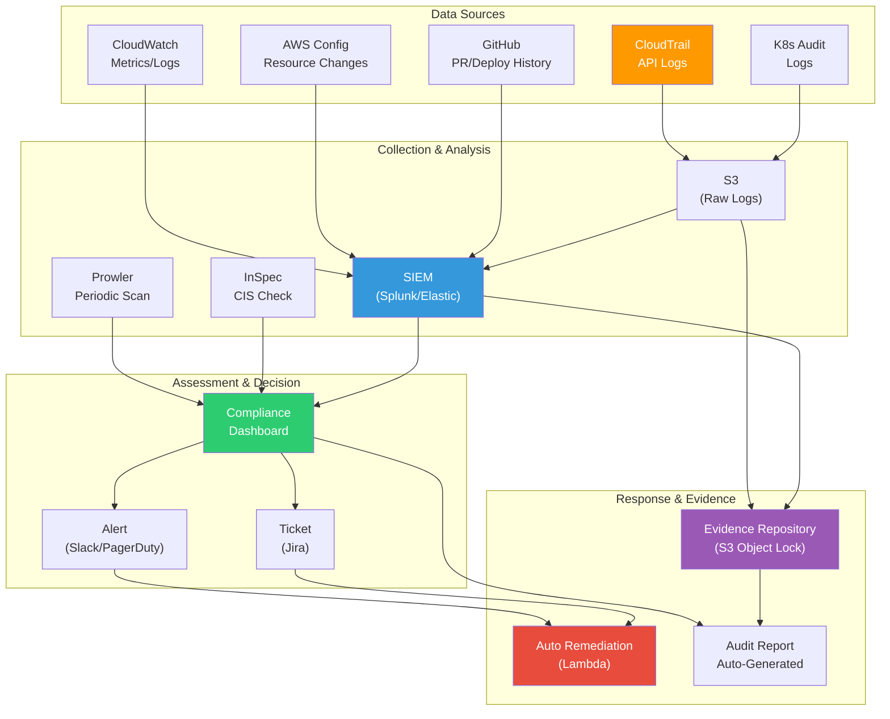

## Overview

Do you remember in elementary school when your teacher would say: "There are class rules, and we need to follow them"? Compliance is like that for companies.

When you build infrastructure and applications, you don't just handle "our company's data". Customers' payment information, personal information, medical records - this data belongs to customers and has strict regulations protecting it.

**Compliance is not "annoying restrictions"**, but rather **"proof that you respect your customers' data and trust"**.

---

## What is Compliance?

Compliance means meeting external regulatory requirements set by government agencies, international standards bodies, or industry bodies.

### Key Concepts

```
┌─────────────────────────────────────────────────────┐
│ 합규 vs 보안: 헷갈리는 개념들                          │
├─────────────────────────────────────────────────────┤
│ 규제(Regulation)                                      │
│ └─ "정부가 의무를 강제하는 법" 예) GDPR, 개인정보보호법  │
│    위반 시: 과징금, 벌금, 영업 중단                     │
│                                                       │
│ 표준(Standard)                                        │
│ └─ "산업이 권장하는 모범 사례" 예) ISO 27001, CIS       │
│    인증 여부는 선택이지만, 고객은 요구할 수 있어요      │
│                                                       │
│ 감사(Audit)                                           │
│ └─ "제3자가 검증하는 행위"                             │
│    SOC2 Type II는 감사를 포함한 인증                   │
│                                                       │
│ 통제(Control)                                         │
│ └─ "규정을 지키기 위한 기술/프로세스 조치"             │
│    예) MFA, 암호화, 로깅, 접근 제어                   │
└─────────────────────────────────────────────────────┘
```

---

## Major Compliance Frameworks

### 1. SOC2 (Service Organization Control 2)

**"서비스 조직이 고객 정보를 안전하게 처리하는가?" 검증**

```yaml
역사: AICPA(미국공인회계사협회)가 2006년 발표
목표: SaaS, 클라우드 서비스 회사의 신뢰성 증명
특징:
  - 미국 중심이지만 글로벌 SaaS에서 거의 필수
  - 고객이 제일 먼저 요구하는 인증 ("SOC2 있어요?" 질문)

인증 유형:
  Type I: "특정 시점에 통제가 설계되어 있는가?" 검증 (짧음)
  Type II: "6-12개월 간 실제로 통제가 작동하는가?" 검증 (엄격함)
  → Type II가 고객이 요구하는 인증

5대 신뢰 기준 (Trust Service Criteria):
  1. Security (CC): 시스템 및 정보 보호
  2. Availability (A): 서비스 가용성
  3. Processing Integrity (PI): 처리 데이터 정확성
  4. Confidentiality (C): 비밀 정보 보호
  5. Privacy (P): 개인정보 보호
```

### 2. ISO 27001 (Information Security Management System)

**"조직의 정보보안 관리체계가 국제 표준을 충족하는가?" 검증**

```yaml
역사: 2005년부터 국제 표준, 2022년 ISO 27001:2022 개정
특징:
  - 가장 인정도 높은 국제 정보보안 표준
  - SOC2보다 포괄적 (조직 전체의 ISMS 검증)
  - 한국의 ISMS-P와 호환성 있음

14개 범주 (Annex A):
  1. Organization of information security
  2. Human resource security
  3. Asset management
  4. Access control
  5. Cryptography
  6. Physical and environmental security
  7. Operations security
  8. Communications security
  9. System acquisition, development and maintenance
  10. Supplier relationships
  11. Information security incident management
  12. Business continuity management
  13. Compliance (legal and regulatory)
  14. Information security assessment
```

### 3. GDPR (General Data Protection Regulation)

**"EU 시민의 개인정보를 어떻게 보호하고 있는가?" 검증**

```yaml
발효: 2018년 5월
영향: EU 시민의 데이터를 다루는 모든 글로벌 회사
위반 벌금:
  경미: €2,000만 또는 매출의 4% (둘 중 큼)
  심각: €2,000만 또는 매출의 4% (더 높은 금액)

6대 적법 근거 (Legal Basis):
  1. 동의 (Consent): 사용자가 명시적 동의
  2. 계약 (Contract): 서비스 제공을 위해 필요
  3. 법적 의무 (Legal Obligation): 법에서 요구
  4. 중요 이익 (Vital Interests): 생명 보호
  5. 공공 작업 (Public Task): 정부 기능
  6. 정당한 이익 (Legitimate Interest): 합리적 비즈니스 이유

핵심 원칙 (7개):
  1. 합법성, 공정성, 투명성
  2. 목적 제한 (수집 목적 외 사용 금지)
  3. 데이터 최소화 (필요한 것만 수집)
  4. 정확성
  5. 보관 제한 (필요한 기간만 보관)
  6. 무결성 및 기밀성
  7. 책임성 (증거 기록 유지)

영향을 받는 개인정보:
  - 이름, 이메일, IP 주소, 쿠키
  - 신용카드, 의료기록, 생체정보
  - 종교, 정치, 성별, 건강 관련 정보 (민감 범주)
```

### 4. HIPAA (Health Insurance Portability and Accountability Act)

**"미국 의료정보를 어떻게 보호하는가?" 검증**

```yaml
역사: 1996년 미국 의료 개혁법
범위: 의료 기관, 건강보험사, 의료 정보 처리 회사
특징: 의료 분야는 거의 필수

핵심 3대 규칙:
  1. Privacy Rule: 의료기록(PHI) 접근 제한
  2. Security Rule: 기술적 보안 조치
  3. Breach Notification Rule: 60일 내 위반 통지

Security Rule의 4대 보안 기준:
  1. 관리 보안 (Administrative): 정책, 교육, 감시
  2. 물리적 보안 (Physical): 시설, 기기 접근 제한
  3. 기술적 보안 (Technical): 암호화, 접근 제어, 감사
  4. 조직적 보안 (Organizational): 계약, 책임 할당

BAA (Business Associate Agreement):
  - HIPAA를 준수하는 3rd party와 체결 필수
  - AWS, Google Cloud, Azure도 BAA 체결 가능
```

### 5. PCI-DSS (Payment Card Industry Data Security Standard)

**"카드 결제 정보를 어떻게 안전하게 처리하는가?" 검증**

```yaml
관리: PCI Security Standards Council (글로벌 카드사 협회)
역사: 2004년부터 시작, 현재 v4.0 (2024년)
특징: "Visa/Mastercard 가맹점이라면 필수"

12대 요구사항:
  1. Firewall 설치
  2. 기본 암호 변경
  3. 전송 중 암호화
  4. 취약점 스캐닝 및 침투 테스트
  5. 악성 코드 보호
  6. 안전한 시스템 개발
  7. 카드 정보 접근 제한
  8. 사용자 식별 및 인증
  9. 물리적 접근 제한
  10. 접근 추적 및 모니터링
  11. 보안 정책 정기 검사
  12. 정책 유지 및 직원 교육

합규 레벨 (처리량에 따라):
  Level 1: 연간 600만+ 거래 (매년 감사 필요)
  Level 2: 100만~600만 거래
  Level 3: 2만~100만 거래
  Level 4: 2만 이하 거래

"범위 축소(Scope Reduction)" 전략:
  카드 정보를 직접 처리하지 않으면 범위 축소
  → Stripe 같은 PG사 이용 → 범위 대폭 축소 가능!
```

### 6. ISMS-P (정보보호관리체계 인증, 한국)

**"한국 기업의 정보보호 관리 체계가 기준을 충족하는가?" 검증**

```yaml
관리: KISA (한국인터넷진흥원)
역사: 2011년부터, ISO 27001과 호환
의무 대상:
  - 매출 100억 이상 또는 직원 1,000명 이상인 기업 (의무)
  - 정부 정보 처리 시스템 운영 기관
  - 핵심 기반시설 운영기관

vs ISO 27001:
  ISO: 국제 표준 (14 범주)
  ISMS-P: 한국 표준 (2.1~2.10 항목, ISO와 호환)
  → ISO 27001 따로, ISMS-P 따로 인증 가능하지만,
    ISO 27001을 따르면 ISMS-P도 충족하는 경우 많음

2024년 개정사항:
  - AI/머신러닝 보안 추가
  - 클라우드 보안 강화
  - 공급망 보안 요구사항 추가
```

### 7. CIS Benchmarks (Center for Internet Security)

**"특정 기술(K8s, AWS, Docker)이 보안 기준을 충족하는가?" 검증**

```yaml
특징:
  - "GDPR이나 SOC2처럼 강제하지는 않지만" 거의 표준
  - 규제 감사 시 "CIS Benchmark 준수" 검증
  - AWS, K8s, Docker 등 기술별 구체적 기준 제시

예시:
  AWS CIS Foundations: 270+ 체크 항목
  K8s CIS Benchmark: 워커 노드, 마스터 노드별 기준
  Docker CIS: 이미지, 런타임 보안 기준

검사 도구:
  - Prowler: AWS 감사 도구 (CIS + PCI-DSS + HIPAA 검사)
  - kube-bench: K8s 감사 도구
  - Aqua: 컨테이너 보안 스캐닝
```

---

## Practical Hands-On

### Lab 1: AWS Config Rules for Compliance Validation

AWS Config는 "우리 AWS 리소스가 규정을 준수하는가?" 자동으로 검사하는 도구예요.

```hcl
# terraform/config-rules.tf
# AWS Config 활성화

# 1. AWS Config 설정 레코더
resource "aws_config_configuration_recorder" "main" {
  name       = "main"
  role_arn   = aws_iam_role.config_role.arn
  depends_on = [aws_iam_role_policy_attachment.config_policy]

  recording_group {
    all_supported = true
  }
}

resource "aws_config_configuration_recorder_status" "main" {
  name       = aws_config_configuration_recorder.main.name
  is_enabled = true
  depends_on = [aws_config_delivery_channel.main]
}

# 2. S3 버킷 설정 저장
resource "aws_s3_bucket" "config_bucket" {
  bucket = "aws-config-bucket-${data.aws_caller_identity.current.account_id}"
}

resource "aws_config_delivery_channel" "main" {
  name           = "main"
  s3_bucket_name = aws_s3_bucket.config_bucket.bucket
  depends_on     = [aws_config_configuration_recorder.main]
}

# 3. Config Rules — 규정 준수 검사

# 1. S3 퍼블릭 접근 금지
resource "aws_config_config_rule" "s3_public_read_prohibited" {
  name = "s3-bucket-public-read-prohibited"

  source {
    owner             = "AWS"
    source_identifier = "S3_BUCKET_PUBLIC_READ_PROHIBITED"
  }

  depends_on = [aws_config_configuration_recorder.main]
}

# 2. S3 퍼블릭 쓰기 금지
resource "aws_config_config_rule" "s3_public_write_prohibited" {
  name = "s3-bucket-public-write-prohibited"

  source {
    owner             = "AWS"
    source_identifier = "S3_BUCKET_PUBLIC_WRITE_PROHIBITED"
  }

  depends_on = [aws_config_configuration_recorder.main]
}

# 3. EC2 인스턴스에 IAM 역할 필수
resource "aws_config_config_rule" "ec2_iam_role" {
  name = "ec2-instance-iam-role"

  source {
    owner             = "AWS"
    source_identifier = "EC2_INSTANCE_MANAGED_BY_SYSTEMS_MANAGER"
  }

  depends_on = [aws_config_configuration_recorder.main]
}

# 4. RDS 암호화
resource "aws_config_config_rule" "rds_encryption" {
  name = "rds-storage-encrypted"

  source {
    owner             = "AWS"
    source_identifier = "RDS_STORAGE_ENCRYPTED"
  }

  depends_on = [aws_config_configuration_recorder.main]
}

# 5. CloudTrail 활성화
resource "aws_config_config_rule" "cloudtrail_enabled" {
  name = "cloudtrail-enabled"

  source {
    owner             = "AWS"
    source_identifier = "CLOUD_TRAIL_ENABLED"
  }

  depends_on = [aws_config_configuration_recorder.main]
}

# 6. IAM root MFA 확인
resource "aws_config_config_rule" "root_mfa" {
  name = "root-account-mfa-enabled"

  source {
    owner             = "AWS"
    source_identifier = "ROOT_ACCOUNT_MFA_ENABLED"
  }

  depends_on = [aws_config_configuration_recorder.main]
}

# 7. IAM 사용자 MFA 확인
resource "aws_config_config_rule" "iam_user_mfa" {
  name = "iam-user-mfa-enabled"

  source {
    owner             = "AWS"
    source_identifier = "IAM_USER_MFA_ENABLED"
  }

  depends_on = [aws_config_configuration_recorder.main]
}

# 8. Security Group 열린 포트 검사
resource "aws_config_config_rule" "restricted_ssh" {
  name = "restricted-ssh"

  source {
    owner             = "AWS"
    source_identifier = "INCOMING_SSH_DISABLED"
  }

  depends_on = [aws_config_configuration_recorder.main]
}

# Auto-Remediation

# 퍼블릭 S3 버킷 자동 차단
resource "aws_config_remediation_configuration" "s3_public_block" {
  config_rule_name = aws_config_config_rule.s3_public_read_prohibited.name
  target_type      = "SSM_DOCUMENT"
  target_id        = "AWS-DisableS3BucketPublicReadWrite"

  parameter {
    name           = "S3BucketName"
    resource_value = "RESOURCE_ID"
  }

  parameter {
    name         = "AutomationAssumeRole"
    static_value = aws_iam_role.remediation_role.arn
  }

  automatic                  = true
  maximum_automatic_attempts = 3
  retry_attempt_seconds      = 60
}
```

---

### Lab 2: Audit Logging Configuration

Audit logging is the foundation of all compliance. You must record "who, when, what, and how".

```yaml
# kubernetes/audit-policy.yaml
# Kubernetes API Server Audit Policy
apiVersion: audit.k8s.io/v1
kind: Policy
rules:
  # Don't log metadata requests
  - level: None
    resources:
      - group: ""
        resources: ["endpoints", "services", "services/status"]
    users: ["system:kube-proxy"]

  # Always log secret access (metadata only, exclude data)
  - level: Metadata
    resources:
      - group: ""
        resources: ["secrets", "configmaps"]

  # Detailed logging for authentication/authorization events
  - level: RequestResponse
    resources:
      - group: "rbac.authorization.k8s.io"
        resources: ["clusterroles", "clusterrolebindings", "roles", "rolebindings"]

  # Detailed logging for pod create/delete events
  - level: RequestResponse
    resources:
      - group: ""
        resources: ["pods"]
    verbs: ["create", "delete", "patch"]

  # Default to metadata only
  - level: Metadata
    omitStages:
      - "RequestReceived"
```

```hcl
# terraform/audit_logging.tf
# Comprehensive audit logging infrastructure

# CloudTrail - API Call Audit
resource "aws_cloudtrail" "compliance_trail" {
  name                       = "compliance-audit-trail"
  s3_bucket_name             = aws_s3_bucket.audit_logs.id
  is_multi_region_trail      = true
  enable_log_file_validation = true
  kms_key_id                 = aws_kms_key.audit_key.arn

  cloud_watch_logs_group_arn = "${aws_cloudwatch_log_group.cloudtrail.arn}:*"
  cloud_watch_logs_role_arn  = aws_iam_role.cloudtrail_cloudwatch.arn

  event_selector {
    read_write_type           = "All"
    include_management_events = true

    data_resource {
      type   = "AWS::S3::Object"
      values = ["arn:aws:s3:::"]
    }
  }

  tags = {
    compliance = "soc2,iso27001"
    data_classification = "confidential"
  }
}

# S3 Bucket - Store Audit Logs (Tamper-Proof)
resource "aws_s3_bucket" "audit_logs" {
  bucket = "company-compliance-audit-logs"
}

resource "aws_s3_bucket_versioning" "audit_logs" {
  bucket = aws_s3_bucket.audit_logs.id
  versioning_configuration {
    status = "Enabled"
  }
}

# Object Lock - Prevent Log Tampering (WORM)
resource "aws_s3_bucket_object_lock_configuration" "audit_logs" {
  bucket = aws_s3_bucket.audit_logs.id

  rule {
    default_retention {
      mode = "COMPLIANCE"
      days = 365  # Cannot be deleted/modified for 1 year
    }
  }
}

# Lifecycle - Long-term Retention Policy
resource "aws_s3_bucket_lifecycle_configuration" "audit_logs" {
  bucket = aws_s3_bucket.audit_logs.id

  rule {
    id     = "archive-old-logs"
    status = "Enabled"

    transition {
      days          = 90
      storage_class = "GLACIER"
    }

    transition {
      days          = 365
      storage_class = "DEEP_ARCHIVE"
    }

    # SOC2/HIPAA recommend keeping for minimum 6-7 years
    expiration {
      days = 2555  # ~7 years
    }
  }
}

# CloudWatch Alerts - Detect Suspicious Activity
resource "aws_cloudwatch_metric_alarm" "root_login" {
  alarm_name          = "root-account-usage"
  comparison_operator = "GreaterThanThreshold"
  evaluation_periods  = 1
  metric_name         = "RootAccountUsage"
  namespace           = "CloudTrailMetrics"
  period              = 300
  statistic           = "Sum"
  threshold           = 0
  alarm_description   = "Root account usage detected - immediate review required"
  alarm_actions       = [aws_sns_topic.security_alerts.arn]
}
```

---

### Lab 3: Automated Evidence Collection

Collecting compliance evidence manually for each audit is inefficient. Let's build a system that automatically collects and stores evidence.

```python
#!/usr/bin/env python3
"""
evidence_collector.py - Automated compliance evidence collection script
For SOC2, ISO 27001, ISMS-P audit preparation
"""

import boto3
import json
import datetime
from pathlib import Path

class ComplianceEvidenceCollector:
    """Automatically collects compliance audit evidence"""

    def __init__(self, output_dir: str = "./evidence"):
        self.session = boto3.Session()
        self.output_dir = Path(output_dir)
        self.output_dir.mkdir(parents=True, exist_ok=True)
        self.timestamp = datetime.datetime.now().strftime("%Y%m%d_%H%M%S")

    def collect_all(self):
        """Collects all evidence"""
        print(f"[{self.timestamp}] Starting compliance evidence collection...")

        evidence = {
            "collection_date": self.timestamp,
            "iam": self._collect_iam_evidence(),
            "encryption": self._collect_encryption_evidence(),
            "logging": self._collect_logging_evidence(),
            "network": self._collect_network_evidence(),
            "config_compliance": self._collect_config_compliance(),
        }

        # Save JSON report
        report_path = self.output_dir / f"evidence_{self.timestamp}.json"
        with open(report_path, "w", encoding="utf-8") as f:
            json.dump(evidence, f, indent=2, default=str, ensure_ascii=False)

        print(f"Evidence report saved: {report_path}")
        return evidence

    def _collect_iam_evidence(self) -> dict:
        """Collect IAM evidence (SOC2-CC6.1, ISO27001-A.9)"""
        iam = self.session.client("iam")

        # Check MFA status
        credential_report = iam.generate_credential_report()
        credential_report = iam.get_credential_report()

        # Password policy
        try:
            password_policy = iam.get_account_password_policy()["PasswordPolicy"]
        except iam.exceptions.NoSuchEntityException:
            password_policy = {"status": "NOT_SET - VIOLATION!"}

        # IAM users list and MFA status
        users = iam.list_users()["Users"]
        user_mfa_status = []
        for user in users:
            mfa_devices = iam.list_mfa_devices(UserName=user["UserName"])
            user_mfa_status.append({
                "username": user["UserName"],
                "mfa_enabled": len(mfa_devices["MFADevices"]) > 0,
                "created": user["CreateDate"],
                "password_last_used": user.get("PasswordLastUsed"),
            })

        return {
            "control": "Access Control",
            "frameworks": ["SOC2-CC6.1", "ISO27001-A.9", "ISMS-P-2.5"],
            "password_policy": password_policy,
            "users_mfa_status": user_mfa_status,
            "total_users": len(users),
            "mfa_enabled_count": sum(1 for u in user_mfa_status if u["mfa_enabled"]),
        }

    def _collect_encryption_evidence(self) -> dict:
        """Collect encryption evidence (SOC2-CC6.7, PCI-DSS-3)"""
        s3 = self.session.client("s3")
        rds = self.session.client("rds")

        # S3 bucket encryption status
        buckets = s3.list_buckets()["Buckets"]
        bucket_encryption = []
        for bucket in buckets:
            try:
                enc = s3.get_bucket_encryption(Bucket=bucket["Name"])
                bucket_encryption.append({
                    "bucket": bucket["Name"],
                    "encrypted": True,
                    "rules": enc["ServerSideEncryptionConfiguration"]["Rules"],
                })
            except s3.exceptions.ClientError:
                bucket_encryption.append({
                    "bucket": bucket["Name"],
                    "encrypted": False,
                    "rules": None,
                })

        # RDS instance encryption status
        db_instances = rds.describe_db_instances()["DBInstances"]
        rds_encryption = [
            {
                "identifier": db["DBInstanceIdentifier"],
                "encrypted": db["StorageEncrypted"],
                "engine": db["Engine"],
            }
            for db in db_instances
        ]

        return {
            "control": "Encryption",
            "frameworks": ["SOC2-CC6.7", "PCI-DSS-3", "ISMS-P-2.7"],
            "s3_buckets": bucket_encryption,
            "rds_instances": rds_encryption,
            "unencrypted_buckets": [b["bucket"] for b in bucket_encryption if not b["encrypted"]],
            "unencrypted_rds": [r["identifier"] for r in rds_encryption if not r["encrypted"]],
        }

    def _collect_logging_evidence(self) -> dict:
        """Collect logging evidence (SOC2-CC7.2, ISO27001-A.12.4)"""
        ct = self.session.client("cloudtrail")

        # CloudTrail status
        trails = ct.describe_trails()["trailList"]
        trail_status = []
        for trail in trails:
            status = ct.get_trail_status(Name=trail["TrailARN"])
            trail_status.append({
                "name": trail["Name"],
                "is_multi_region": trail.get("IsMultiRegionTrail", False),
                "is_logging": status["IsLogging"],
                "has_log_validation": trail.get("LogFileValidationEnabled", False),
                "has_encryption": trail.get("KmsKeyId") is not None,
                "s3_bucket": trail.get("S3BucketName"),
            })

        return {
            "control": "Audit Logging",
            "frameworks": ["SOC2-CC7.2", "ISO27001-A.12.4", "ISMS-P-2.9.4"],
            "cloudtrail_trails": trail_status,
            "compliant": all(
                t["is_logging"] and t["has_log_validation"]
                for t in trail_status
            ),
        }

    def _collect_network_evidence(self) -> dict:
        """Collect network security evidence (SOC2-CC6.6, PCI-DSS-1)"""
        ec2 = self.session.client("ec2")

        # Find 0.0.0.0/0 open in security groups
        sgs = ec2.describe_security_groups()["SecurityGroups"]
        open_sgs = []
        for sg in sgs:
            for rule in sg.get("IpPermissions", []):
                for ip_range in rule.get("IpRanges", []):
                    if ip_range.get("CidrIp") == "0.0.0.0/0":
                        from_port = rule.get("FromPort", "ALL")
                        to_port = rule.get("ToPort", "ALL")
                        open_sgs.append({
                            "sg_id": sg["GroupId"],
                            "sg_name": sg["GroupName"],
                            "port_range": f"{from_port}-{to_port}",
                            "protocol": rule.get("IpProtocol", "all"),
                        })

        return {
            "control": "Network Security",
            "frameworks": ["SOC2-CC6.6", "PCI-DSS-1", "CIS-AWS-5.2"],
            "publicly_accessible_sg_rules": open_sgs,
            "total_security_groups": len(sgs),
            "finding_count": len(open_sgs),
        }

    def _collect_config_compliance(self) -> dict:
        """Collect AWS Config compliance status"""
        config = self.session.client("config")

        try:
            compliance = config.describe_compliance_by_config_rule()
            rules_status = [
                {
                    "rule_name": rule["ConfigRuleName"],
                    "compliance": rule["Compliance"]["ComplianceType"],
                }
                for rule in compliance["ComplianceByConfigRules"]
            ]
        except Exception as e:
            rules_status = [{"error": str(e)}]

        return {
            "control": "Configuration Management",
            "frameworks": ["SOC2-CC8.1", "CIS-AWS-Foundations"],
            "config_rules": rules_status,
        }


if __name__ == "__main__":
    collector = ComplianceEvidenceCollector(
        output_dir="./compliance_evidence"
    )
    evidence = collector.collect_all()

    # Print summary
    print("\n" + "=" * 60)
    print("Compliance Evidence Collection Summary")
    print("=" * 60)

    iam = evidence["iam"]
    print(f"IAM Users: {iam['total_users']}, "
          f"MFA Enabled: {iam['mfa_enabled_count']}")

    enc = evidence["encryption"]
    print(f"Unencrypted S3: {len(enc['unencrypted_buckets'])} buckets")
    print(f"Unencrypted RDS: {len(enc['unencrypted_rds'])} instances")

    log = evidence["logging"]
    print(f"CloudTrail Compliance: {'PASS' if log['compliant'] else 'FAIL'}")

    net = evidence["network"]
    print(f"Publicly Accessible SG Rules: {net['finding_count']}")
```

---

### Lab 4: CI/CD Pipeline Compliance Integration

```yaml
# .github/workflows/compliance-check.yaml
name: Compliance Verification

on:
  pull_request:
    branches: [main]
  schedule:
    # Daily check at 2 AM KST
    - cron: '0 17 * * *'

jobs:
  # Stage 1: Infrastructure Code Policy Validation
  policy-check:
    name: OPA Policy Check
    runs-on: ubuntu-latest
    steps:
      - uses: actions/checkout@v4

      - name: Install OPA
        run: |
          curl -L -o opa https://openpolicyagent.org/downloads/latest/opa_linux_amd64
          chmod +x opa && sudo mv opa /usr/local/bin/

      - name: Validate Terraform against policies
        run: |
          # Convert Terraform plan to JSON
          cd terraform
          terraform init
          terraform plan -out=tfplan
          terraform show -json tfplan > tfplan.json

          # Validate with OPA
          opa eval \
            --data policies/ \
            --input tfplan.json \
            "data.terraform.compliance.deny" \
            --format pretty

          # Fail if violations found
          VIOLATIONS=$(opa eval \
            --data policies/ \
            --input tfplan.json \
            "count(data.terraform.compliance.deny)" \
            --format raw)

          if [ "$VIOLATIONS" -gt 0 ]; then
            echo "Found $VIOLATIONS compliance violations!"
            exit 1
          fi

  # Stage 2: Container Image Security Scan
  container-scan:
    name: Container Security Scan
    runs-on: ubuntu-latest
    steps:
      - uses: actions/checkout@v4

      - name: Build image
        run: docker build -t app:${{ github.sha }} .

      - name: Trivy vulnerability scan
        uses: aquasecurity/trivy-action@master
        with:
          image-ref: app:${{ github.sha }}
          format: 'table'
          exit-code: '1'
          severity: 'CRITICAL,HIGH'

      - name: Dockle best practice check
        run: |
          docker run --rm -v /var/run/docker.sock:/var/run/docker.sock \
            goodwithtech/dockle:latest \
            --exit-code 1 \
            --exit-level warn \
            app:${{ github.sha }}

  # Stage 3: CIS Benchmark Check (InSpec)
  cis-benchmark:
    name: CIS Benchmark Check
    runs-on: ubuntu-latest
    if: github.event_name == 'schedule'
    steps:
      - uses: actions/checkout@v4

      - name: Install InSpec
        run: |
          curl https://omnitruck.chef.io/install.sh | \
            sudo bash -s -- -P inspec

      - name: Run AWS CIS Benchmark
        env:
          AWS_ACCESS_KEY_ID: ${{ secrets.AWS_ACCESS_KEY_ID }}
          AWS_SECRET_ACCESS_KEY: ${{ secrets.AWS_SECRET_ACCESS_KEY }}
          AWS_REGION: ap-northeast-2
        run: |
          inspec exec compliance/cis-aws-profile/ \
            -t aws:// \
            --reporter cli json:cis-report.json

      - name: Upload CIS Report
        uses: actions/upload-artifact@v4
        with:
          name: cis-benchmark-report
          path: cis-report.json
          retention-days: 365  # Keep as audit evidence for 1 year

  # Stage 4: Evidence Collection and Storage
  evidence-collection:
    name: Collect Compliance Evidence
    runs-on: ubuntu-latest
    needs: [policy-check, container-scan]
    if: github.event_name == 'schedule'
    steps:
      - uses: actions/checkout@v4

      - name: Setup Python
        uses: actions/setup-python@v5
        with:
          python-version: '3.11'

      - name: Collect evidence
        env:
          AWS_ACCESS_KEY_ID: ${{ secrets.AWS_ACCESS_KEY_ID }}
          AWS_SECRET_ACCESS_KEY: ${{ secrets.AWS_SECRET_ACCESS_KEY }}
          AWS_REGION: ap-northeast-2
        run: |
          pip install boto3
          python scripts/evidence_collector.py

      - name: Upload evidence to S3
        run: |
          aws s3 cp compliance_evidence/ \
            s3://company-compliance-evidence/$(date +%Y/%m/%d)/ \
            --recursive \
            --sse aws:kms
```

---

### Lab 5: Prowler - AWS Security Audit Tool

Prowler is an open-source tool that audits AWS environments against CIS Benchmarks, PCI-DSS, GDPR, HIPAA and more.

```bash
# Install Prowler
pip install prowler

# Run full CIS AWS Foundations Benchmark check
prowler aws --compliance cis_2.0_aws

# Check specific frameworks
prowler aws --compliance gdpr_aws
prowler aws --compliance hipaa_aws
prowler aws --compliance pci_3.2.1_aws

# Check specific regions only
prowler aws -r ap-northeast-2 --compliance cis_2.0_aws

# Generate HTML report
prowler aws --compliance cis_2.0_aws -M html json

# Check specific services only
prowler aws --services s3 iam cloudtrail --compliance cis_2.0_aws

# Sample output:
# ━━━━━━━━━━━━━━━━━━━━━━━━━━━━━━━━━━━━━━━━━━━━━━━━━━
# Prowler - AWS Security Assessment
# ━━━━━━━━━━━━━━━━━━━━━━━━━━━━━━━━━━━━━━━━━━━━━━━━━━
# Compliance Framework: CIS AWS Foundations v2.0
# Total Checks: 142
# Passed: 118 (83.1%)
# Failed: 21 (14.8%)
# Manual: 3 (2.1%)
# ━━━━━━━━━━━━━━━━━━━━━━━━━━━━━━━━━━━━━━━━━━━━━━━━━━
```

---

## In Practice

### Startup (Early Stage, 0-50 employees) → Minimal Compliance

```
Phase 1: MVP Compliance
━━━━━━━━━━━━━━━━━━━━━━━━━━━━
✅ Basic security setup (MFA, encryption, logging)
✅ Personal information protection law basics
✅ Data classification system
✅ Basic access control (RBAC)
Cost: Minimal (using AWS built-in services)

Phase 2: Growth (50-200 employees)
━━━━━━━━━━━━━━━━━━━━━━━━━━━━
✅ Start SOC2 Type I preparation
✅ CIS Benchmark automatic checks
✅ Compliance as Code (InSpec/OPA)
✅ Centralized logging + monitoring
✅ Incident response procedures documented
Cost: $50K-150K/year (including audit costs)

Phase 3: Expansion (200-1000 employees)
━━━━━━━━━━━━━━━━━━━━━━━━━━━━
✅ SOC2 Type II certification
✅ ISO 27001 certification
✅ ISMS-P certification (if required by Korea)
✅ Automated evidence collection system
✅ Dedicated security team
Cost: $200K-500K/year

Phase 4: Enterprise (1000+ employees)
━━━━━━━━━━━━━━━━━━━━━━━━━━━━
✅ Industry-specific certifications (HIPAA, PCI-DSS)
✅ GRC (Governance, Risk, Compliance) platform
✅ Continuous Monitoring
✅ Third-party risk management
✅ Red Team/Purple Team operations
Cost: $1M+/year
```

### Compliance Automation Architecture



### Regulation Compliance Checklist Summary

```
┌──────────┬──────────┬──────────┬──────────┬──────────┬──────────┐
│          │  SOC2    │ ISO27001 │  GDPR    │  HIPAA   │ PCI-DSS  │
├──────────┼──────────┼──────────┼──────────┼──────────┼──────────┤
│ MFA      │  ✅      │  ✅      │  ✅      │  ✅      │  ✅      │
│ Encryption│ ✅      │  ✅      │  ✅      │  ✅      │  ✅      │
│ Audit Log│  ✅      │  ✅      │  ✅      │  ✅      │  ✅      │
│ Access   │  ✅      │  ✅      │  ✅      │  ✅      │  ✅      │
│ Incident │  ✅      │  ✅      │  72hr    │  60days  │  ✅      │
│  Response│          │          │  notice  │  notice  │          │
│ Vuln     │  ✅      │  ✅      │  -       │  ✅      │  Quarterly│
│  Scan    │          │          │          │          │  ASV scan│
│ Pentest  │  1x/yr   │  -       │  -       │  -       │  1x/yr   │
│          │  recom.  │          │          │          │  required│
│ Data     │  -       │  -       │  ✅ Req. │  ✅ Req. │  -       │
│  Deletion│          │          │          │          │          │
│ Log      │  1yr+    │  Policy  │  -       │  6yr+    │  1yr+    │
│  Retention│         │ defined  │          │          │          │
│ Korea    │  -       │  ISMS-P  │  Privacy │  -       │  e-Finance│
│  Addition│          │  aligned │  Law     │          │  Regulation│
└──────────┴──────────┴──────────┴──────────┴──────────┴──────────┘
```

---

## Common Mistakes

### Mistake 1: "We got certified, now we're secure"

```
❌ Wrong thinking:
"We got SOC2 Type II certified - we're safe now!"

✅ Correct understanding:
Certification is the starting point. You must re-audit annually
and controls must keep working in between.

Analogy: Getting your driver's license doesn't prevent accidents.
Getting certified doesn't prevent security breaches.

Countermeasure:
- Implement Continuous Monitoring
- Automate compliance checks (Compliance as Code)
- Conduct internal audits periodically
```

### Mistake 2: Scope Too Broad

```
❌ Wrong approach:
"Let's put our entire infrastructure in SOC2 scope!"
→ Cost explodes, timeline extends, team burnout

✅ Correct approach:
"Start with core services, gradually expand"
→ Scope Reduction strategy

Examples:
- PCI-DSS: Use payment processor (Stripe) → 80% scope reduction
- SOC2: Certify SaaS product first → internal tools later
- HIPAA: Isolate PHI system in separate VPC → rest out of scope
```

### Mistake 3: Manual Evidence Collection

```
❌ Wrong way:
Auditor: "Show me access change history for 6 months"
Team: (takes 100 screenshots from console)

✅ Right way:
Auditor: "Show me access change history for 6 months"
Team: (pulls report from automated evidence repository)

Countermeasure:
- CloudTrail + S3 Object Lock = automatic log preservation
- Periodic evidence collection script (Lambda/CronJob)
- Evidence repository with tag-based search
```

### Mistake 4: Disconnect Between Dev and Security Teams

```
❌ Wrong structure:
Security: "Follow these policies" (100-page Word doc)
Dev: "I don't want to read it..."
→ Audit finds many violations

✅ Right structure:
Security: "Here's OPA Constraint code"
Dev: "PR shows auto-check, I naturally follow"
→ Shift Left: compliance checked during development

Countermeasure:
- Policy as Code (OPA/InSpec)
- CI/CD automated validation
- Clear error messages on violations
- Security Champion program
```

### Mistake 5: Ignoring Korea-specific Regulations

```
❌ Wrong thinking:
"We have SOC2 and ISO 27001, that's enough for Korea"

✅ Reality:
Korea has additional requirements:
- Personal Information Protection Law: opt-in only
- No social security number collection
- ISMS-P: mandatory for companies above certain size
- e-Finance Supervision: required for financial services
- Access log preservation: minimum 1-2 years

Key differences:
- Korean law is stricter on consent than GDPR
- Mandatory access log preservation
- Separate personal information system access control standards
```

### Mistake 6: Short Log Retention

```
❌ Wrong setting:
cloudwatch_log_retention: 30  # 30 days only

✅ Minimum retention by regulation:
- SOC2:        1 year recommended
- ISO 27001:   per organization policy (usually 1-3 years)
- HIPAA:       6 years minimum
- PCI-DSS:     1 year minimum (90 days immediate access)
- Korea Privacy: 1 year (5+ years: 2 years)
- ISMS-P:      1 year minimum

Countermeasure:
- Default 1 year retention, extend as needed
- After 90 days: auto-transition to Glacier (cost saving)
- S3 Object Lock prevents deletion
```

---

## Summary

### Core Principles

```
1. Understand regulations
   - SOC2: Service organization reliability (Type I = design, Type II = operation)
   - ISO 27001: International information security standard
   - GDPR: EU personal data protection (4% revenue penalty)
   - HIPAA: US medical information protection
   - PCI-DSS: Card payment security (scope reduction is key)
   - ISMS-P: Korean security management system

2. Use technical tools
   - CIS Benchmarks: K8s, AWS, Docker security standards
   - Chef InSpec: Infrastructure state testing (built-in CIS profiles)
   - OPA/Gatekeeper: K8s policy enforcement
   - AWS Config Rules: Automatic compliance validation
   - Prowler: AWS comprehensive audit tool

3. Automation is key
   - Compliance as Code: Manage policies as code
   - CI/CD integration: Auto-validate on every deployment
   - Evidence automation: Collect evidence automatically
   - Auto-remediation: Fix violations automatically

4. Don't forget Korea-specific rules
   - Personal Information Protection Law (opt-in, access logging)
   - ISMS-P (mandatory above threshold)
   - e-Finance Regulation (for financial services)
```

---

## Next Steps

| Sequence | Topic | Link | Related |
|----------|------|------|---------|
| Next | **DevSecOps** | [06-devsecops.md](./06-devsecops) | SAST, DAST, SCA, security pipeline |
| Review | **Secrets Management** | [02-secrets.md](./02-secrets) | Vault, AWS Secrets Manager |
| Reference | **AWS Security Services** | [AWS Security](../05-cloud-aws/12-security) | KMS, WAF, Shield, GuardDuty |

### Recommended Learning Resources

```
Official Docs:
- CIS Benchmarks: https://www.cisecurity.org/cis-benchmarks
- SOC2 Trust Services: AICPA official site
- GDPR Guide: https://gdpr-info.eu/
- KISA ISMS-P: https://isms.kisa.or.kr/

Tools:
- Prowler (AWS audit): https://github.com/prowler-cloud/prowler
- Chef InSpec (infrastructure testing): https://www.inspec.io/
- OPA (policy engine): https://www.openpolicyagent.org/
- kube-bench (K8s CIS): https://github.com/aquasecurity/kube-bench

Practice:
1. Scan your AWS account with Prowler (fastest start)
2. Try OPA Playground - write Rego policies
3. Set up AWS Config Conformance Packs
4. Read KISA ISMS-P certification criteria
```

### Practice Assignments

```
Beginner:
1. Install Prowler, scan your AWS account with CIS Benchmark
2. Review results and document top 5 violations

Intermediate:
3. Apply OPA/Gatekeeper "prevent privileged containers" policy to K8s
4. Set up AWS Config Rules for S3 public access prevention
5. Write InSpec profile for EC2 security checks

Advanced:
6. Build complete Compliance as Code pipeline
   (OPA + InSpec + AWS Config + automated evidence collection)
7. Multi-framework dashboard (SOC2 + CIS + ISMS-P simultaneously)
8. Custom evidence collection system with Lambda + S3 Object Lock
```

---

> **Key Takeaway**: Compliance is not a one-time checkbox - it's a continuous practice of protecting customer data and proving that protection to auditors. Start small with basic controls, automate evidence collection, and scale up as your organization grows.
