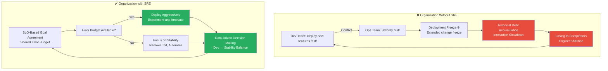
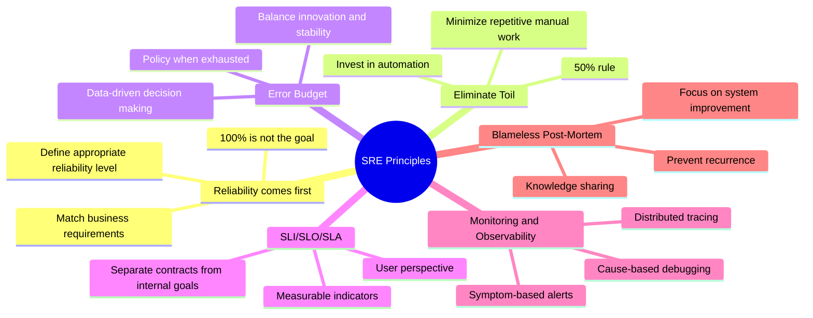
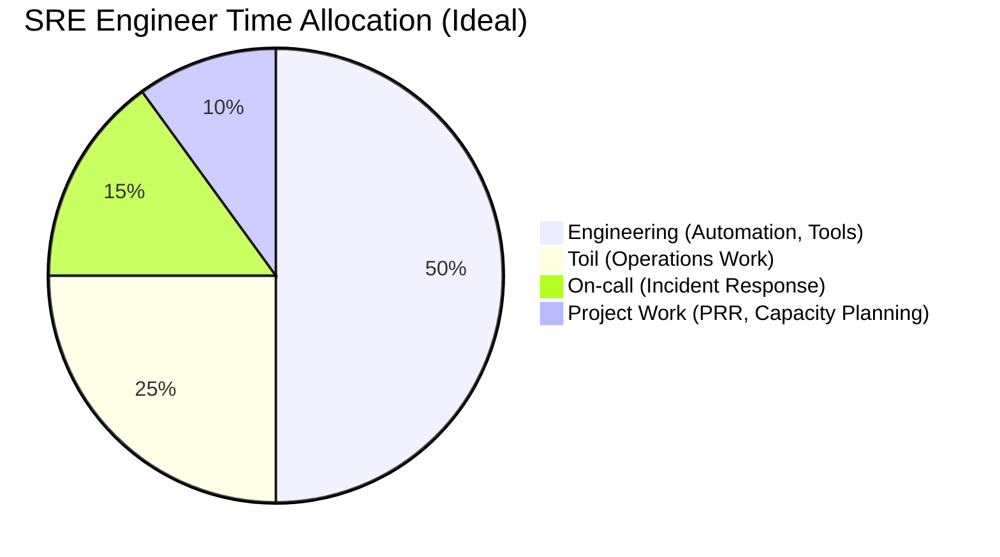
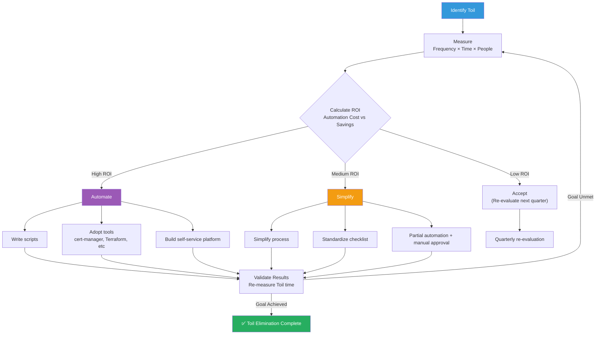
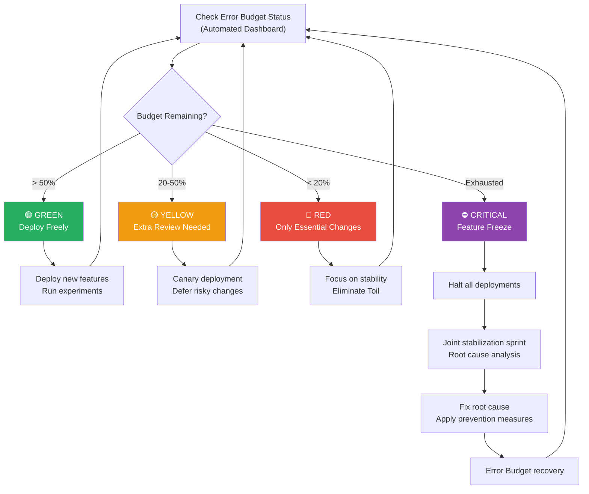
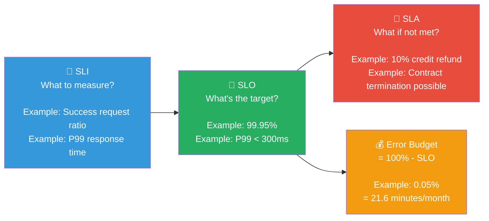
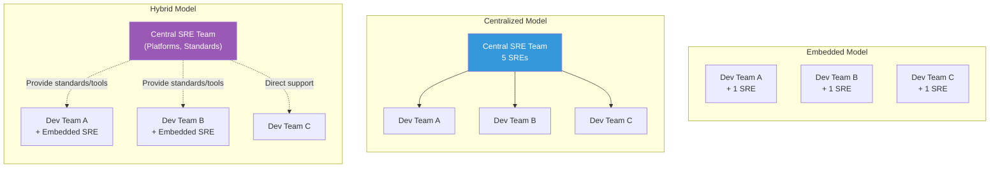

# SRE Principles — How to Engineer Reliability

> What happens when software engineers solve operational problems? Google started with this question and created a field called **Site Reliability Engineering (SRE)**. It's a methodology that approaches "reliably operating a service" using **engineering principles and data** rather than intuition. After learning "how to observe system state" in [Observability](../08-observability/01-concept) and "how to detect problems" in [Alerting](../08-observability/11-alerting), now it's time to get the full picture: **"What is reliability, and how do we systematically manage it?"**

---

## 🎯 Why Learn SRE Principles?

### Daily Analogy: Hospital Emergency Room System

Imagine running the emergency room of a large hospital.

- **Doctors (Developers)**: Treat patients and research new treatment methods
- **Emergency Room Operating System (SRE)**: Manages the environment so doctors can treat patients well
  - When emergency patients arrive, **triage them** → Classify service state with SLI/SLO
  - **Regularly inspect** that medical equipment works properly → Production Readiness Review
  - When medical incidents occur, **analyze the cause but don't blame the doctors** → Blameless Post-Mortem
  - **Automate repetitive tasks** like cleaning operating rooms → Remove Toil
  - There are **limits to emergency room capacity** → Error Budget

Without such a system and relying only on individual doctor capabilities?

- Equipment failures cause delayed response
- The same medical incidents repeat
- Doctors waste time on non-surgical tasks
- The system collapses when too many patients arrive

**SRE is exactly this "emergency room operating system."**

```
Moments when SRE principles are needed in practice:

• "Every deployment causes outages and the team fears deploying"         → Lack of Error Budget policy
• "The service is slow, but 'slow' means different things to everyone"  → SLI/SLO undefined
• "Every outage turns into a blame hunt, no honest reporting happens"    → Lack of Blameless culture
• "Operations team is drowning in repetitive tasks and can't improve"    → Poor Toil management
• "Dev team wants to deploy fast, Ops wants stability"                  → Organization without SRE
• "99.99% availability target but nobody knows why"                     → SLO/SLA confusion
• "New service deployed to production with no monitoring at all"        → No PRR (Production Readiness Review)
```

### Organizations Without SRE vs. SRE-Established Organizations



---

## 🧠 Grasping Core Concepts

### 1. What is SRE?

> **Analogy**: Building facility management team + structural engineer

SRE (Site Reliability Engineering) is a field created by Ben Treynor Sloss at Google in 2003. In one sentence:

> **"The result of assigning operations work to software engineers"**
> — Ben Treynor Sloss, Google VP of Engineering

The core idea is simple: solve **operations problems with software engineering**.

| Traditional Operations (Ops) | SRE Approach |
|-------------------|----------|
| Manually manage servers | Manage with automation code |
| "Let's be careful not to break things" | "Let's manage risk within Error Budget" |
| Outage → Find the culprit | Outage → Find system improvement points |
| Change = Risk | Change = Manageable risk |
| Intuition-based judgment | SLI/SLO data-based judgment |
| Repetitive work = Inevitable | Repetitive work (Toil) = Eliminate |

### 2. SRE Core Principles at a Glance



### 3. SRE vs DevOps vs Platform Engineering

These three are often confused. Let me clarify the key differences.

| Category | DevOps | SRE | Platform Engineering |
|------|--------|-----|---------------------|
| **Definition** | Cultural integration of dev and ops | Engineering-based reliability management | Building internal platform for developers |
| **Focus** | Collaboration culture, CI/CD pipeline | Reliability, SLO, Error Budget | Self-service platform, developer experience |
| **Core Question** | "How can we deploy faster?" | "How reliable should we be?" | "How can developers use this easily?" |
| **Output** | CI/CD pipeline, IaC | SLO dashboard, Error Budget policy | Internal Developer Platform |
| **Analogy** | Construction site collaboration culture | Building structural safety standards | Construction material standardization factory |
| **Metrics** | Deployment frequency, Lead Time | SLO achievement rate, MTTR | Platform adoption rate, developer satisfaction |

> **Core Relationship**: DevOps is **culture and philosophy**, and SRE is **a concrete way to implement** DevOps. Platform Engineering is **productizing** the experience of SRE and DevOps.

```
Google's Expression:
"class SRE implements interface DevOps"

→ SRE is a concrete class implementing the DevOps interface.
→ If DevOps defines "What", SRE defines "How".
```

### 4. SRE Core Terminology Preview

| Term | One-Liner | Analogy |
|------|----------|------|
| **SLI** (Service Level Indicator) | Metric measuring service quality | Thermometer reading |
| **SLO** (Service Level Objective) | Target value for SLI | "Keep temperature 36-37°C" |
| **SLA** (Service Level Agreement) | SLO + compensation conditions for violations | Health insurance policy |
| **Error Budget** | Allowable failure budget | Monthly allowance |
| **Toil** | Automatable repetitive manual work | Daily manual dishwashing |
| **Post-Mortem** | Incident analysis document | Aviation accident investigation report |
| **PRR** | Pre-production readiness checklist | Pre-flight safety check |

---

## 🔍 Deep Dive into Each Topic

### 1. Deep Understanding of SRE Definition (Google SRE Book)

Let's examine the core principles Google's SRE book defines.

#### Principle 1: 100% Reliability Is the Wrong Goal

This is the most important insight in SRE.

```
Why is 99.999% a better goal than 100%?

From user experience perspective:

• Service availability: 99.99% → 52 minutes downtime per year
• User's ISP availability: 99.9% → 8.7 hours downtime per year
• User's WiFi: 99% → 3.6 days downtime per year

→ Even if service is 99.999%, if user's network is 99%
   the availability user experiences is at most 99%!

If 100% is your goal:
❌ You can't change anything (change = risk)
❌ Costs increase exponentially
❌ Innovation speed approaches zero

If appropriate reliability is your goal:
✅ You can experiment within Error Budget
✅ Balance cost and reliability
✅ Make data-driven decisions
```

#### Principle 2: SRE Engineer Time Allocation — The 50% Rule

One of the core rules in Google SRE:

> **Maximum 50% of SRE engineer work time should be spent on operations work (Ops work), with the remaining 50%+ spent on engineering work.**



What if Toil exceeds 50%?

1. The team burns out
2. No time to automate, so Toil increases further
3. Vicious cycle

This is when Google **returns some operations work to the dev team.** This way, the dev team also feels the pain of operations and builds software that's easier to operate.

#### Principle 3: Solve Problems with Engineering

| Traditional Operations Approach | SRE Engineering Approach |
|-----------------|-------------------|
| Manual deployment every time | Automated deployment pipeline |
| Manual recovery on outage | Self-healing recovery |
| Manual scaling when capacity runs out | Auto-scaling + capacity planning |
| Apply configuration changes directly | Manage with code (IaC), review process |
| Judgment based on experience | Judgment based on data (SLI/SLO) |

---

### 2. Toil — Repetitive Work to Eliminate

#### What is Toil?

> **Analogy**: Manually turning lights on every time a customer arrives at a restaurant

Toil is work that satisfies **all of the following** characteristics:

| Toil Characteristic | Description | Example |
|-------------|------|------|
| **Manual** | Humans must do it directly | SSH into server to check logs |
| **Repetitive** | Same work repeats | Weekly certificate renewal |
| **Automatable** | Machines can replace it | Script-replaceable |
| **Tactical** | Immediate response, not long-term strategy | Restart server when alert arrives |
| **Non-growth-focused** | Doesn't make service better | Disk cleanup |
| **Scales with Service (O(n))** | Work increases as service grows | Manual setup for each new server |

#### Toil vs Not Toil — Distinguishing

```
✅ This is Toil:
• Manually running batch job every morning
• SSH into each new server and install agent
• Restart server when alert arrives
• Manually renew SSL certificates
• Weekly manual report data aggregation
• Manually set permissions for new team members

❌ This is NOT Toil:
• Root cause analysis during incident (requires creative thinking)
• Designing new service architecture (strategic work)
• On-call rotation (necessary but not Toil)
• Code review (valuable engineering work)
• Post-mortem writing (learning and improvement)
• Building automation tools (work that reduces Toil)
```

#### How to Measure Toil

To reduce Toil, you must **measure it first**.

```yaml
# Example Toil Tracking Sheet
toil_tracking:
  task: "Manual certificate renewal"
  frequency: "Once per month"
  duration_per_occurrence: "30 minutes"
  monthly_total: "30 minutes"
  affected_engineers: 2
  total_monthly_cost: "1 hour"
  automation_effort: "2 days (cert-manager adoption)"
  roi_breakeven: "2 months"
  priority: "HIGH"

  task: "Disk capacity shortage response"
  frequency: "2 times per week"
  duration_per_occurrence: "15 minutes"
  monthly_total: "2 hours"
  affected_engineers: 3
  total_monthly_cost: "6 hours"
  automation_effort: "1 day (auto cleanup + adjust alert threshold)"
  roi_breakeven: "1 week"
  priority: "CRITICAL"
```

#### Toil Elimination Strategy



---

### 3. Error Budget — The Balancing Scale of Innovation and Stability

#### What is Error Budget?

> **Analogy**: Monthly allowance

Imagine you get 300,000 won monthly allowance.

- If you don't spend it at all? → Can't do anything (100% availability = no innovation)
- If you spend it all? → Month's done (Error Budget exhausted = deployment halt)
- If you spend appropriately? → Buy what you need and save too (balanced operations)

**Error Budget = 100% - SLO**

```
If SLO is 99.9%:
Error Budget = 100% - 99.9% = 0.1%

Monthly basis (30 days):
0.1% × 30 days × 24 hours × 60 minutes = 43.2 minutes

→ It's OK if service is down 43.2 minutes per month!
→ This 43.2 minutes is your "allowance".
```

#### Error Budget Uses

```
What you can do with Error Budget:

🚀 Deploy new features
   → Brief downtime during deployment

🧪 Experiments (canary deployments, A/B testing)
   → Errors from new versions

🔧 Planned maintenance
   → DB migration, infrastructure upgrade

📦 Dependency updates
   → Library/framework version upgrade

🏗️ Architecture changes
   → Microservice separation, database replacement
```

#### Error Budget Policy

Error Budget policy is a rule that **automatically determines team behavior** based on "how much budget is left".

```yaml
# Example Error Budget Policy
error_budget_policy:
  service: "payment-api"
  slo: 99.95%
  measurement_window: "30-day rolling"

  thresholds:
    # Budget sufficient — aggressive innovation mode
    - level: "GREEN"
      condition: "Error Budget > 50% remaining"
      actions:
        - "Deploy new features freely"
        - "Allow experimental changes"
        - "Can increase canary deployment ratio"

    # Budget caution — careful mode
    - level: "YELLOW"
      condition: "Error Budget 20-50% remaining"
      actions:
        - "Additional review required for changes"
        - "Reduce canary deployment ratio"
        - "Defer high-risk changes"
        - "Prioritize Toil elimination"

    # Budget critical — stability-focus mode
    - level: "RED"
      condition: "Error Budget < 20% remaining"
      actions:
        - "Halt deployments except security patches"
        - "Focus only on stability improvements"
        - "Concentrated incident analysis"
        - "Strengthen automation and resilience"

    # Budget exhausted — emergency mode
    - level: "CRITICAL"
      condition: "Error Budget exhausted"
      actions:
        - "Immediately halt all deployments (Feature Freeze)"
        - "Escalate to leadership"
        - "SRE + dev team joint stabilization sprint"
        - "Root cause analysis and long-term solution"
```

#### Error Budget Consumption Flow



---

### 4. SLI / SLO / SLA — Expressing Reliability Numerically

These three are core SRE tools. Let's learn them in order.

#### SLI (Service Level Indicator) — What to Measure

> **Analogy**: Thermometer, blood pressure monitor - measurement tools

SLI is the **numerical measurement of service quality**. The important thing is **measuring from user perspective**.

```
Characteristics of good SLI:

✅ User directly experiences it
✅ Measurable numerically
✅ Expressible as percentage (0-100%)
✅ Aggregated over meaningful time range

Bad SLI:
❌ "Server CPU usage" → User doesn't experience CPU
❌ "Service is slow" → Not numerical
❌ "Lots of errors" → No benchmark
```

**Recommended SLIs by Service Type:**

| Service Type | SLI Type | Measurement | Example |
|------------|---------|----------|------|
| **API Service** | Availability | Successful requests / Total requests | 200 response ratio |
| **API Service** | Latency | P50, P99 response time | P99 < 300ms ratio |
| **Data Pipeline** | Freshness | Latest processing time | Processed within 10 min ratio |
| **Data Pipeline** | Correctness | Correct outputs / Total outputs | Correct result ratio |
| **Storage** | Durability | Data loss rate | Zero loss per year |
| **Storage** | Throughput | Bytes processed per second | Target throughput achievement ratio |

#### SLO (Service Level Objective) — Setting the Goal

> **Analogy**: "Keep temperature 36-37°C" health goal

SLO is the **target value for SLI**. It's the standard: "Users will be satisfied at this level."

```
Example SLO:

Service: payment-api
SLO Period: 30-day rolling window

SLI: Availability
  → SLO: 99.95% (99.95% of requests succeed over 30 days)
  → Error Budget: 0.05% = about 21.6 minutes/month

SLI: Latency (P99)
  → SLO: 99% (99% of requests respond within 300ms)
  → Remaining 1% can exceed 300ms

SLI: Latency (P50)
  → SLO: 99.9% (99.9% of requests respond within 100ms)
  → Majority of requests must be fast
```

**SLO Setting Cautions:**

```
If SLO is too high:
❌ Minimal Error Budget, can't do anything
❌ Unreachable, team morale drops
❌ Exponential cost increase

If SLO is too low:
❌ Users unsatisfied
❌ Error Budget too large, becomes meaningless
❌ No quality control effect

Appropriate SLO Setting Process:
1. Measure actual current performance (4 weeks)
2. Understand user expectations (feedback, surveys)
3. Confirm business requirements (contracts, competitors)
4. Start slightly below current performance
5. Gradually adjust
```

#### SLA (Service Level Agreement) — Promise in Contract

> **Analogy**: Health insurance policy — "If conditions not met, we compensate"

SLA is SLO with **legal/commercial consequences attached**.

```
Core SLO vs SLA Difference:

SLO (Internal Goal):
  "Maintain service availability at 99.95%"
  → If not met? Internal Error Budget policy triggers
  → External impact? None

SLA (External Contract):
  "Guarantee 99.9% availability. Refund credits if not met"
  → If not met? Financial compensation to customer
  → Legally binding

⚠️ Important: SLO > SLA (Internal goal must be stricter!)

Reason: Meeting SLO automatically meets SLA.
If SLO = SLA, SLA violation directly means financial loss.

Typically:
  SLO: 99.95%  →  SLA: 99.9%  (Buffer of 0.05%)
```

#### SLI → SLO → SLA Relationship



---

### 5. Blameless Post-Mortem — Non-Blaming Incident Analysis

#### Why "Blameless"?

> **Analogy**: Aviation accident investigation

When a plane crashes, pilots aren't jailed — the **black box is analyzed**. Why?

- If pilots are punished → Other pilots **hide accidents**
- If black box is analyzed → **System improvements** prevent similar accidents

IT incidents are the same way.

```
❌ Blame Culture:
  "Who made the bad deployment?"
  → Engineers avoid deploying
  → Problems hidden or reported late
  → Same incident repeats

✅ Blameless Culture:
  "What system conditions led to this result?"
  → Honest information sharing
  → Root cause discovery
  → System improvement prevents recurrence
```

#### Post-Mortem Document Structure

```yaml
# Post-Mortem Template
post_mortem:
  title: "2024-12-15 Payment Service Incident"
  severity: "P1 (User Impact)"
  duration: "14:32 ~ 15:17 (45 minutes)"
  impact: "Payment failure rate 30%, ~1,200 users affected"

  authors:
    - "SRE Engineer on duty"
    - "On-call Engineer"

  summary: |
    Payment service DB connection pool exhausted, causing
    payment requests to timeout and fail. Direct cause was
    new feature added in previous deployment without DB
    query optimization, tripling connection usage.

  timeline:
    - time: "14:30"
      event: "v2.3.1 deployment completed"
    - time: "14:32"
      event: "Error rate alert triggered (Error Budget depletion accelerated)"
    - time: "14:35"
      event: "On-call engineer received alert, checked dashboard"
    - time: "14:40"
      event: "DB connection pool exhaustion confirmed"
    - time: "14:45"
      event: "Rollback decision made"
    - time: "14:55"
      event: "v2.3.0 rollback completed"
    - time: "15:17"
      event: "Error rate returned to normal"

  root_cause: |
    New payment feature had N+1 query problem.
    DB queries per payment increased from 3 to 15.
    Load test didn't include new feature.

  # Here's the key! Focus on "what" and "why", not "who"
  contributing_factors:
    - "Load test scenario didn't include new feature"
    - "DB connection pool monitoring alert threshold was too high"
    - "Low canary deployment ratio, failed to catch problem early"
    - "Query performance check missed in code review"

  action_items:
    - action: "Add new feature scenario to load test"
      owner: "QA Team"
      priority: "P1"
      deadline: "2024-12-22"

    - action: "Adjust DB connection pool alert threshold to 70%"
      owner: "SRE Team"
      priority: "P1"
      deadline: "2024-12-17"

    - action: "Add query performance item to code review checklist"
      owner: "Dev Team Lead"
      priority: "P2"
      deadline: "2024-12-29"

    - action: "Increase canary deployment traffic ratio from 5% to 15%"
      owner: "SRE Team"
      priority: "P2"
      deadline: "2024-12-22"

  lessons_learned:
    - "N+1 queries invisible at low traffic → Load testing essential"
    - "Connection pool monitoring needs 70% threshold alert"
    - "Low canary ratio causes late problem detection"

  # ⚠️ Important: Focus on "system gaps", not "human mistakes"
  what_went_well:
    - "Alert triggered within 2 minutes, quick detection"
    - "Rollback automated, completed in 10 minutes"
    - "On-call engineer had immediate Runbook access"
```

---

### 6. Production Readiness Review (PRR)

> **Analogy**: Pre-flight safety checklist before plane takeoff

Before deploying a new service to production, **systematically review: "Is this service ready to operate reliably in production?"**

```yaml
# Production Readiness Review Checklist
prr_checklist:
  # 1. Observability
  observability:
    - "Is SLI defined?"
    - "Has SLO been agreed upon?"
    - "Are metrics being collected? (RED/USE methodology)"
    - "Has dashboard been built?"
    - "Is structured logging applied?"
    - "Is distributed tracing configured?"
    - "Are alert rules configured?"
    # Reference: ../08-observability/ series

  # 2. Incident Response
  incident_response:
    - "Is on-call rotation set up?"
    - "Is escalation path clear?"
    - "Is Runbook documented?"
    - "Is rollback procedure documented?"
    - "Is incident communication channel available?"
    # Reference: ../09-security/07-incident-response.md

  # 3. Capacity Planning
  capacity:
    - "Is current traffic pattern understood?"
    - "Is expected growth rate calculated?"
    - "Is auto-scaling configured?"
    - "Has load testing been performed?"
    - "Are resource limits known?"

  # 4. Change Management
  change_management:
    - "Is deployment pipeline automated?"
    - "Are canary/blue-green deployments possible?"
    - "Is rollback automated?"
    - "Are feature flags used?"
    - "Is configuration change managed as code?"

  # 5. Security
  security:
    - "Are authentication/authorization applied?"
    - "Are secrets safely managed?"
    - "Is vulnerability scanning in CI?"
    - "Are network policies applied?"

  # 6. Dependencies
  dependencies:
    - "Are external dependencies documented?"
    - "Is there fallback for dependency failure?"
    - "Is circuit breaker applied?"
    - "Are timeouts properly configured?"
```

---

### 7. SRE Team Structure

There are three main ways to organize an SRE team.

#### Embedded SRE vs Centralized SRE vs Hybrid

| Model | Description | Advantages | Disadvantages |
|------|------|------|------|
| **Embedded** | SRE belongs to each dev team | High domain understanding, fast response | Hard knowledge sharing between SREs |
| **Centralized** | Separate SRE team manages all services | Consistent standards, concentrated expertise | Lower domain understanding |
| **Hybrid** | Central SRE team + SREs embedded in teams | Balanced approach | Organizational complexity |



**Recommended Model by Organization Size:**

```
Startup (Engineers < 20):
  → No separate SRE team needed
  → All developers apply SRE principles
  → Developers rotate on-call

Growth Stage (Engineers 20-100):
  → Start with Embedded model
  → Deploy SRE-minded engineers to critical services
  → Gradually introduce SRE practices

Large Scale (Engineers 100+):
  → Recommend Hybrid model
  → Central SRE team: manage platforms, tools, standards
  → Embedded SRE: deploy to critical services
  → Non-critical services: central SRE in advisory role
```

---

### 8. Reliability Engineering Culture

SRE isn't complete with just tools and processes. **Culture is the key.**

#### Four Pillars of SRE Culture

```
1. Data-Driven Decision Making
   ─────────────────────
   "The service feels slow" → ❌
   "P99 response time increased 40% week-over-week" → ✅

   All decisions are based on SLI/SLO data.

2. Blameless Culture
   ─────────────────────
   "Who deployed this code?" → ❌
   "What system conditions caused this problem?" → ✅

   Improve the system, not the person.

3. Shared Ownership
   ─────────────────────
   "That's ops team responsibility" → ❌
   "We own the service together and share responsibility" → ✅

   Dev teams and SRE jointly own service reliability.

4. Continuous Improvement
   ─────────────────────
   "It failed, let's make sure it doesn't again" → ❌
   "We learned 3 things, we'll improve within 2 weeks" → ✅

   Actually execute Post-Mortem Action Items.
```

---

### 9. SRE Practices Overview — The Big Picture

Let's overview major SRE practices comprehensively.

```mermaid
flowchart TD
    SRE["🏗️ SRE Practices"]

    SRE --> MEASURE["📏 Measurement"]
    SRE --> RESPOND["🚨 Response"]
    SRE --> PREVENT["🛡️ Prevention"]
    SRE --> IMPROVE["🔄 Improvement"]

    MEASURE --> M1["Define SLI/SLO"]
    MEASURE --> M2["Track Error Budget"]
    MEASURE --> M3["Measure Toil"]
    MEASURE --> M4["Capacity Planning"]

    RESPOND --> R1["On-call System"]
    RESPOND --> R2["Incident Management"]
    RESPOND --> R3["Runbook Management"]
    RESPOND --> R4["Escalation"]

    PREVENT --> P1["PRR"]
    PREVENT --> P2["Chaos Engineering"]
    PREVENT --> P3["Load Testing"]
    PREVENT --> P4["Security Review"]

    IMPROVE --> I1["Blameless Post-Mortem"]
    IMPROVE --> I2["Automate Toil Elimination"]
    IMPROVE --> I3["Architecture Improvement"]
    IMPROVE --> I4["Process Improvement"]

    style SRE fill:#2c3e50,color:#fff
    style MEASURE fill:#3498db,color:#fff
    style RESPOND fill:#e74c3c,color:#fff
    style PREVENT fill:#27ae60,color:#fff
    style IMPROVE fill:#f39c12,color:#fff
```



| Area | Practice | Description | Reference |
|------|---------|------|--------------|
| Measurement | SLI/SLO/SLA | Define reliability goals | [Next Lesson](./02-sli-slo) |
| Measurement | Error Budget | Balance innovation and stability | This Lesson |
| Measurement | Toil Measurement | Track repetitive work | This Lesson |
| Response | On-call | Incident response rotation | [Alerting](../08-observability/11-alerting) |
| Response | Incident Mgmt | Incident management process | [Incident Response](../09-security/07-incident-response) |
| Prevention | PRR | Pre-production readiness check | This Lesson |
| Prevention | Chaos Engineering | Intentional failure injection | Future Lesson |
| Improvement | Post-Mortem | Blameless incident analysis | This Lesson |
| Improvement | Automation | Eliminate Toil | This Lesson |

---

## 💻 Hands-On Practice

### Lab 1: Defining SLI/SLO

Try defining SLI/SLO for your own service.

```yaml
# Lab: Define SLI/SLO for Shopping Mall Service
# Copy this template and adapt to your service

service:
  name: "shopping-api"
  description: "Shopping mall product query and order API"
  owner: "commerce-team"
  tier: "Tier 1 (Critical Service)"

slis:
  # SLI 1: Availability
  - name: "availability"
    description: "Ratio of successfully processed requests"
    formula: "count(http_status < 500) / count(total_requests)"
    measurement_point: "Load balancer access logs"
    good_event: "All responses without HTTP 5xx"
    valid_event: "All HTTP requests"

  # SLI 2: Latency
  - name: "latency"
    description: "Ratio of requests responding within threshold"
    formula: "count(response_time < 300ms) / count(total_requests)"
    measurement_point: "Server-side measurement (middleware)"
    good_event: "Respond within 300ms"
    valid_event: "All HTTP requests (excluding health checks)"

slos:
  - sli: "availability"
    target: 99.95%
    window: "30-day rolling"
    error_budget: "0.05% = ~21.6 minutes/month"

  - sli: "latency"
    target: 99.0%
    window: "30-day rolling"
    error_budget: "1% = 1% of requests can exceed threshold"

error_budget_policy:
  green: "> 50% remaining → Deploy freely"
  yellow: "20-50% → Requires extra review"
  red: "< 20% → Focus on stability only"
  critical: "Exhausted → Feature Freeze"
```

### Lab 2: Identify and Measure Toil

Classify your team's operations work from Toil perspective.

```yaml
# Lab: Toil Assessment Sheet
# List operations tasks and classify them

toil_assessment:
  team: "platform-team"
  assessment_date: "2024-12-15"
  assessment_period: "Last 4 weeks"

  tasks:
    - name: "Manual SSL certificate renewal"
      is_toil: true
      frequency: "Once per month"
      time_per_occurrence: "30 minutes"
      monthly_hours: 0.5
      toil_characteristics:
        manual: true          # Humans must do it
        repetitive: true      # Same each time
        automatable: true     # Can use cert-manager
        tactical: true        # No strategic value
        no_lasting_value: true # Doesn't improve service
        scales_with_service: true  # More certs = more work
      automation_plan: "Adopt cert-manager (est. 2 days)"
      priority: "HIGH"

    - name: "Incident root cause analysis"
      is_toil: false
      reason: "Requires creative thinking, each situation differs, improves service"

    - name: "Daily morning log review"
      is_toil: true
      frequency: "Once per day"
      time_per_occurrence: "20 minutes"
      monthly_hours: 6.7
      automation_plan: "Log-based alerts + anomaly detection (est. 3 days)"
      priority: "CRITICAL"

    # Add your own tasks!
    - name: "_______________"
      is_toil: _____
      frequency: "___"
      time_per_occurrence: "___"
      automation_plan: "___"

  summary:
    total_tasks_assessed: 3
    toil_tasks: 2
    total_monthly_toil_hours: 7.2
    toil_percentage: "___% (percentage of total work time)"
    # Goal: Keep below 50%!
```

### Lab 3: Error Budget Calculator

```python
# error_budget_calculator.py
# Run: python error_budget_calculator.py

def calculate_error_budget(slo_percent, window_days=30):
    """Calculate Error Budget from SLO."""

    error_budget_percent = 100 - slo_percent
    total_minutes = window_days * 24 * 60
    error_budget_minutes = total_minutes * (error_budget_percent / 100)

    print(f"{'=' * 50}")
    print(f"  Error Budget Calculator")
    print(f"{'=' * 50}")
    print(f"  SLO:            {slo_percent}%")
    print(f"  Measurement:    {window_days} days")
    print(f"  Error Budget:   {error_budget_percent}%")
    print(f"  Allowed DT:     {error_budget_minutes:.1f} minutes")
    print(f"                  ({error_budget_minutes/60:.1f} hours)")
    print(f"{'=' * 50}")

    return error_budget_minutes

def check_budget_status(slo_percent, actual_downtime_minutes, window_days=30):
    """Check current Error Budget status."""

    budget = calculate_error_budget(slo_percent, window_days)
    remaining = budget - actual_downtime_minutes
    remaining_percent = (remaining / budget) * 100 if budget > 0 else 0

    print(f"\n  Actual DT:      {actual_downtime_minutes} minutes")
    print(f"  Remaining:      {remaining:.1f} minutes ({remaining_percent:.1f}%)")

    if remaining_percent > 50:
        status = "GREEN - Deploy freely!"
    elif remaining_percent > 20:
        status = "YELLOW - Extra review needed"
    elif remaining_percent > 0:
        status = "RED - Focus on stability"
    else:
        status = "CRITICAL - Feature Freeze! Halt all deployments"

    print(f"  Status:         {status}")
    print(f"{'=' * 50}")

# Try changing these values!
print("\n--- Example 1: Payment Service ---")
check_budget_status(
    slo_percent=99.95,
    actual_downtime_minutes=10,
    window_days=30
)

print("\n--- Example 2: Admin Page ---")
check_budget_status(
    slo_percent=99.5,
    actual_downtime_minutes=200,
    window_days=30
)

print("\n--- Example 3: Core API ---")
check_budget_status(
    slo_percent=99.99,
    actual_downtime_minutes=4,
    window_days=30
)
```

### Lab 4: Blameless Post-Mortem Practice

Read the virtual incident scenario and write a Post-Mortem.

```
📋 Incident Scenario:

Date: 2024-12-10 (Tuesday)
Time: 2:00 PM ~ 3:30 PM
Service: User Authentication Service (auth-service)
Impact: All users cannot login

Timeline:
  14:00 - Developer A deploys Redis cache configuration change
  14:05 - Redis connection error logs spike (but no alert configured)
  14:30 - Support team receives surge of "Can't login" inquiries
  14:35 - Support team reports to dev team Slack
  14:40 - On-call engineer begins investigation
  14:50 - Redis connection config error found
  15:00 - Start rollback (manual rollback)
  15:20 - Rollback completed
  15:30 - Service recovery confirmed

Your Post-Mortem tasks:
  1. Organize the timeline
  2. Identify root cause
  3. List contributing factors — systems, not people!
  4. Write what went well
  5. Add action items with priority and deadline
```

```yaml
# Write your Post-Mortem here!

post_mortem:
  title: "2024-12-10 Auth Service Incident"
  severity: "___"
  duration: "___"
  impact: "___"

  timeline:
    - time: "14:00"
      event: "___"
    # Continue...

  root_cause: |
    ___

  contributing_factors:
    - "___"
    - "___"
    - "___"

  what_went_well:
    - "___"

  action_items:
    - action: "___"
      owner: "___"
      priority: "___"
      deadline: "___"
```

### Lab 5: Apply PRR Checklist

Apply the PRR checklist to your service.

```yaml
# Lab: Perform PRR on Your Service
# Evaluate each item and plan improvements for gaps

prr_assessment:
  service: "my-service"
  date: "2024-12-15"
  reviewer: "___"

  categories:
    observability:
      - item: "Is SLI defined?"
        status: "YES / NO / PARTIAL"
        gap: "___"
        action: "___"

      - item: "Has dashboard been built?"
        status: "___"
        gap: "___"
        action: "___"

      - item: "Are alerts configured?"
        status: "___"
        gap: "___"
        action: "___"

    incident_response:
      - item: "Is on-call rotation set up?"
        status: "___"
        gap: "___"
        action: "___"

      - item: "Is Runbook documented?"
        status: "___"
        gap: "___"
        action: "___"

    # Complete remaining categories...

  overall_readiness: "READY / NOT READY / CONDITIONALLY READY"
  blocking_issues:
    - "___"
  target_resolution_date: "___"
```

---

## 🏢 In Practice

### Scenario 1: "We Want to Introduce SRE to Our Company"

```
Situation:
  - 50-person dev organization
  - 15 microservices in operation
  - 2-3 incidents per month
  - High incident rate post-deployment
  - Conflict between dev and ops teams

Step-by-step Introduction Method:

[Phase 1] Foundation (1-2 months)
  ├─ Define SLI/SLO for 3 critical services
  ├─ Start measuring SLI with existing monitoring data
  ├─ Build Error Budget dashboard (Grafana)
  └─ Team-wide SRE principles training

[Phase 2] Process Introduction (2-3 months)
  ├─ Agree on Error Budget policy (dev + ops)
  ├─ Start Blameless Post-Mortem process
  ├─ Begin Toil measurement (weekly tracking)
  ├─ Refine on-call rotation
  └─ Create PRR checklist

[Phase 3] Culture Establishment (3-6 months)
  ├─ Make SLO-based deployment decisions
  ├─ Run Toil elimination projects quarterly
  ├─ Establish Post-Mortem sharing culture
  ├─ Apply PRR as production deployment gate
  └─ Expand SLI/SLO to remaining services

[Phase 4] Maturity (6+ months)
  ├─ Introduce Embedded SRE or Hybrid model
  ├─ Begin Chaos Engineering
  ├─ Implement SLO-based auto-rollback
  ├─ Enable Error Budget-based auto deployment gate
  └─ Expand to Platform Engineering
```

### Scenario 2: "Our Error Budget Is Exhausted!"

```
Situation:
  - Payment service SLO: 99.95%
  - 20th day of 30: Error Budget exhausted
  - Cause: Last week deployment failure caused 2 hours downtime

Response Process:

1. Immediate Action
   ├─ Declare Feature Freeze (all deployments halted)
   ├─ Notify entire team via Slack/Email
   └─ Report status to leadership

2. Root Cause Analysis (1-2 days)
   ├─ Write Post-Mortem (analyze incident)
   ├─ Identify root cause
   └─ List contributing factors

3. Stabilization Sprint (1-2 weeks)
   ├─ Execute Action Items (fix root cause)
   ├─ Focus on stability improvements only
   │   ├─ Add auto-rollback feature
   │   ├─ Adjust canary deployment ratio
   │   ├─ Strengthen monitoring alerts
   │   └─ Enhance load testing
   └─ Parallel Toil elimination work

4. Recovery Confirmation
   ├─ Error Budget resets next measurement period
   ├─ Confirm improvement effectiveness
   └─ Agree on Feature Freeze lift conditions
```

### Scenario 3: "Dev Team Ignores SLO"

```
Situation:
  - SLO is defined but dev team ignores Error Budget
  - "What's the importance of deploying fast vs SLO?"

Solution Methods:

1. Make Error Budget "Shared Ownership"
   ├─ Add Error Budget widget to dev team dashboard
   ├─ Share Error Budget status in weekly standup
   └─ Involve dev team in stabilization when exhausted

2. Design Incentives
   ├─ Include SLO achievement in team OKRs
   ├─ Allow faster deployment with high Error Budget
   └─ Apply deployment halt to entire team when exhausted

3. Persuade with Data
   ├─ "Last quarter incidents cost 20M won"
   ├─ "Each incident delays development 2 weeks"
   └─ "70% incident recovery time reduction after SLO adoption"

4. Secure Leadership Support
   ├─ Elevate SLO targets to org-wide OKRs
   ├─ Quantify incident costs (revenue loss, churn)
   └─ Get CTO/VP-level sponsor
```

### Scenario 4: Availability Level Comparison

Compare frequently seen availability levels and their implications.

```
Permitted Downtime by Availability Level:

Availability  DT/Year    DT/Month   DT/Week    Use Cases
─────────────────────────────────────────────────────────
99%         3.65 days   7.3 hrs    1.68 hrs   Internal tools, batch systems
99.9%       8.77 hrs    43.8 min   10.1 min   Common web services, B2B SaaS
99.95%      4.38 hrs    21.9 min   5.0 min    E-commerce, customer-facing APIs
99.99%      52.6 min    4.4 min    1.0 min    Payment systems, financial services
99.999%     5.26 min    26 sec     6 sec      Emergency services, critical infra

Cost Curve:
  99%     → 💰
  99.9%   → 💰💰
  99.95%  → 💰💰💰
  99.99%  → 💰💰💰💰💰💰💰
  99.999% → 💰💰💰💰💰💰💰💰💰💰💰💰💰

→ Cost ~10x increases with each additional 9!
→ Choosing "appropriate" level matched to business is key.
```

### Real-World Tip: Common SRE Adoption Anti-patterns

```
Anti-pattern 1: "SRE Team = Ops Team with New Name"
  ❌ Just rename existing ops team to SRE
  ❌ Still manually managing servers
  ✅ SRE should solve operational problems with engineering

Anti-pattern 2: "SLO Defined But No One Checks"
  ❌ SLO dashboard exists but no one looks at it
  ❌ Nothing happens even when Error Budget exhausted
  ✅ Error Budget policy must drive actual behavior change

Anti-pattern 3: "Write Post-Mortem But Don't Execute Action Items"
  ❌ Post-mortems pile up, no improvements happen
  ❌ Same incident happens 3 months later
  ✅ Make Action Items tickets and track them

Anti-pattern 4: "99.99% SLO for Every Service"
  ❌ High SLO uniformly regardless of business importance
  ❌ Error Budget so tight nothing can change
  ✅ Use tiered SLOs based on service importance

Anti-pattern 5: "SRE Owns All Reliability"
  ❌ Only SRE responds to incidents
  ❌ Dev team: "My code is fine"
  ✅ Shared ownership — dev team participates in on-call and post-mortems
```

---

## ⚠️ Common Mistakes

### Mistake 1: Setting SLO Too High

```
❌ Wrong Example:
  "Our service targets 99.999% availability!"

  → Monthly Error Budget: 26 seconds
  → Each deployment must guarantee zero downtime
  → Effectively can't change anything
  → Cost becomes astronomical

✅ Correct Approach:
  1. Measure actual current performance for 4 weeks
  2. Understand user expectations and business requirements
  3. Start SLO slightly below current performance
  4. Adjust gradually quarterly

  Example: Actual performance 99.97% → Start SLO at 99.95%
```

### Mistake 2: Confusing SLO and SLA

```
❌ Wrong Example:
  SLO = SLA = 99.9%

  → SLO failure = immediate financial loss
  → Zero safety margin

✅ Correct Approach:
  SLO: 99.95% (Internal goal, stricter)
  SLA: 99.9%  (External promise, with buffer)

  → Meeting SLO automatically meets SLA
  → SLO failure still has margin before SLA violation
```

### Mistake 3: Mistaking All Operations Work for Toil

```
❌ Wrong Thinking:
  "On-call is Toil, code review is Toil, meetings are Toil"
  → Try automating everything, miss important things

✅ Correct Understanding:
  Toil must meet ALL 6 conditions:
  Manual + Repetitive + Automatable + Tactical + Non-growth + O(n)

  NOT Toil:
  • Incident analysis (requires creative thinking)
  • Architecture design (strategic value)
  • Code review (improves service quality)
  • Team meetings (communication)
```

### Mistake 4: Blaming People in Post-Mortem

```
❌ Wrong Post-Mortem:
  Root Cause: "Developer A wrote incorrect code"
  Action: "Told Developer A to be more careful"

  → Developer B will make same mistake
  → Engineers hide incidents

✅ Correct Post-Mortem:
  Root Cause: "Code review process didn't catch this error type"
  Contributing Factors:
    - "Automated tests didn't cover scenario"
    - "Pre-deployment validation insufficient"
  Actions:
    - "Add linter rule (auto-detect)"
    - "Add scenario to integration tests"
    - "Check metric in canary before full rollout"
```

### Mistake 5: Running Error Budget Only Ceremonially

```
❌ Wrong Operation:
  - Error Budget dashboard exists but nobody checks
  - Budget exhausted but deployments continue
  - "Error Budget? Yeah, we have a dashboard..."

✅ Correct Operation:
  - Error Budget status shared daily via Slack/Email
  - Auto-alert when threshold reached
  - Feature Freeze actually enforced when exhausted
  - Weekly meeting reviews Error Budget status
  - Policy agreed with dev and SRE teams
```

### Mistake 6: Trying Perfect Adoption from Day One

```
❌ Wrong Approach:
  "Implement complete Google-like SRE all at once!"
  → Try deploying SLI/SLO/SLA/Error Budget/Post-Mortem/PRR in 3 months
  → Team burns out
  → "SRE doesn't work for us"

✅ Correct Approach:
  "Start small, expand gradually"
  → Month 1: Define SLI/SLO for 1 critical service
  → Month 2: Start Error Budget tracking
  → Month 3: Conduct first Blameless Post-Mortem
  → Month 4: Begin Toil measurement
  → Month 6: Introduce PRR
  → After: Expand to other services
```

---

## 📝 Wrap-up

### Core SRE Principles Checklist

```
SRE Principles Core Checklist:

□ SRE Definition
  ├─ "Result of software engineers solving operations problems"
  ├─ 100% reliability is wrong goal
  └─ Solve operational problems with engineering

□ SRE vs DevOps vs Platform Engineering
  ├─ DevOps = Culture/Philosophy (What)
  ├─ SRE = Concrete DevOps Implementation (How)
  └─ Platform Engineering = Productizing SRE experience

□ Toil
  ├─ Manual + Repetitive + Automatable + Tactical + Non-growth + O(n)
  ├─ Measure → Prioritize → Automate/Simplify
  └─ 50% Rule: Toil must not exceed 50%

□ Error Budget
  ├─ Error Budget = 100% - SLO
  ├─ Tool for balancing innovation and stability
  ├─ GREEN → YELLOW → RED → CRITICAL policy
  └─ Feature Freeze when exhausted

□ SLI / SLO / SLA
  ├─ SLI: What to measure (user perspective)
  ├─ SLO: Target value (internal goal)
  ├─ SLA: Contractual commitment (external promise)
  └─ SLO > SLA (buffer needed)

□ Blameless Post-Mortem
  ├─ Improve systems, not blame people
  ├─ Actually execute Action Items
  └─ Share knowledge for organizational learning

□ PRR (Production Readiness Review)
  ├─ Systematic pre-production checklist
  └─ Review observability, incident response, capacity, security, dependencies

□ SRE Team Structure
  ├─ Embedded / Centralized / Hybrid
  └─ Choose model matching organization size

□ SRE Culture
  ├─ Data-driven decision making
  ├─ Blameless culture
  ├─ Shared ownership
  └─ Continuous improvement
```

### SRE Core Formulas at a Glance

```
┌─────────────────────────────────────────────────┐
│              SRE Core Formulas                   │
├─────────────────────────────────────────────────┤
│                                                 │
│  Error Budget = 100% - SLO                      │
│                                                 │
│  SLO > SLA (Always stricter internal goal)      │
│                                                 │
│  Toil < 50% (Percentage of engineer work time)  │
│                                                 │
│  SLI = Good Events / Total Events × 100%        │
│                                                 │
│  Allowed DT = Period × Error Budget %           │
│                                                 │
│  MTTR ↓ = Good Observability + Good Runbook     │
│                                                 │
│  Incident Recurrence ↓ = Post-Mortem + Action   │
│                                                 │
└─────────────────────────────────────────────────┘
```

### SRE Maturity Model

```
Level 0: None
  → No incident response system, intuition-based operations

Level 1: Foundation
  → SLI defined, basic monitoring, manual response

Level 2: Systematized
  → SLO agreed, Error Budget tracked, Post-Mortem started

Level 3: Automated
  → Toil automated, auto-rollback, PRR process

Level 4: Optimized
  → SLO-based decision making, Chaos Engineering, predictive capacity planning

Level 5: Culture
  → Blameless is in DNA, organization shares reliability responsibility
```

---

## 🔗 Next Steps

### Immediate Next Lesson

- **[SLI/SLO Hands-On](./02-sli-slo)**: We'll cover SLI selection methods, SLO window design, and Error Budget dashboard implementation with practical code.

### Related Lessons (Review/Prerequisite)

| Lesson | Relationship | Link |
|------|------|------|
| Observability Concepts | What SRE observes | [../08-observability/01-concept.md](../08-observability/01-concept) |
| Prometheus | Tool that measures SLI | [../08-observability/02-prometheus.md](../08-observability/02-prometheus) |
| Grafana | Build SLO/Error Budget dashboard | [../08-observability/03-grafana.md](../08-observability/03-grafana) |
| Alerting | Configure SLO-based alerts | [../08-observability/11-alerting.md](../08-observability/11-alerting) |
| Incident Response | Incident response process | [../09-security/07-incident-response.md](../09-security/07-incident-response) |

### Deeper Learning

```
Recommended Resources:

📚 Books
  • "Site Reliability Engineering" (Google SRE Book) — O'Reilly
    → SRE Bible. Contains Google's actual operational experience.
    → Free online: https://sre.google/sre-book/table-of-contents/

  • "The Site Reliability Workbook" — O'Reilly
    → Practical companion to SRE Book. Covers implementation details.
    → Free online: https://sre.google/workbook/table-of-contents/

  • "Implementing Service Level Objectives" — Alex Hidalgo
    → Specialized in SLI/SLO design.

🌐 Web Resources
  • Google SRE Official Site: https://sre.google/
  • SLO Generator (Google Open Source): SLO calculation tool
  • Atlassian SRE Guide: Practical SRE adoption guide

🎬 Videos
  • "Keys to SRE" — Ben Treynor Sloss (Google)
  • "SRE vs DevOps" — Google Cloud Tech (YouTube)
```

---

> **Next Lesson Preview**: In [SLI/SLO Hands-On](./02-sli-slo), we'll implement the SLI/SLO concepts learned here using real Prometheus queries and Grafana dashboards. We'll build a dashboard that tracks Error Budget exhaustion rate in real-time!
