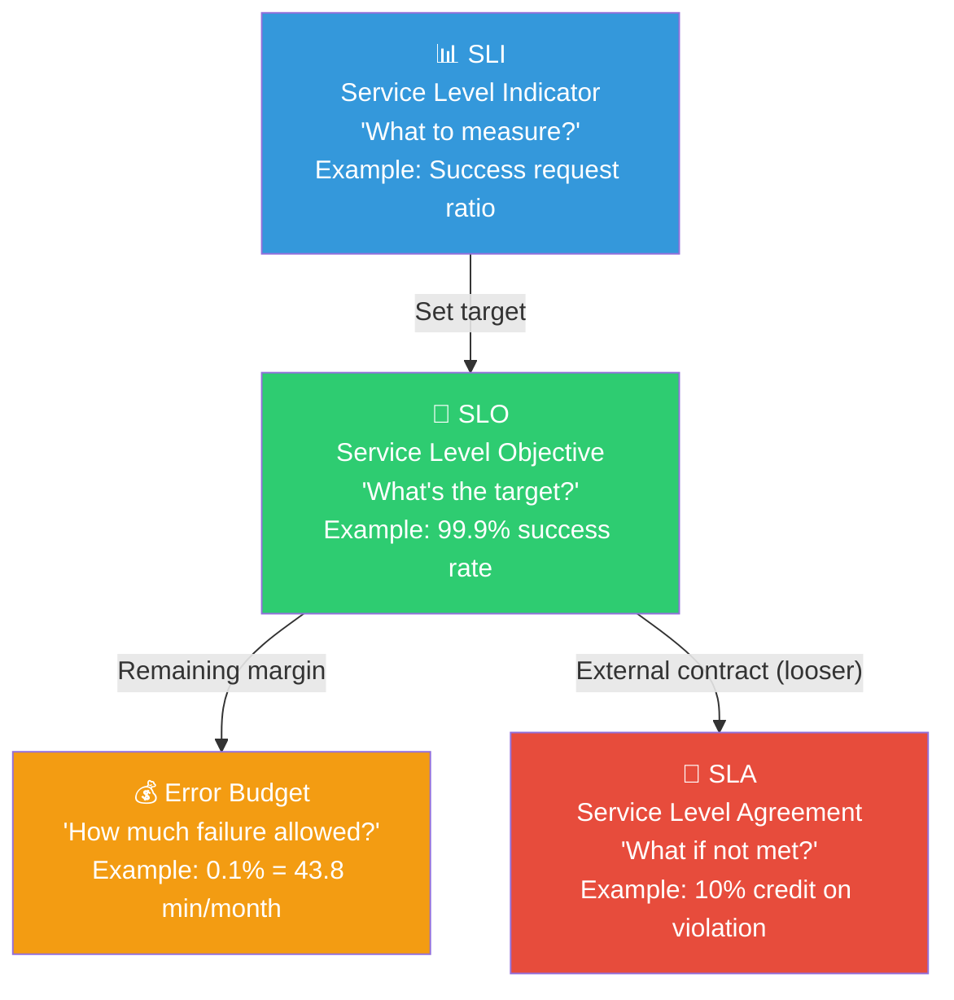
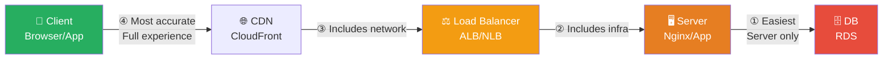
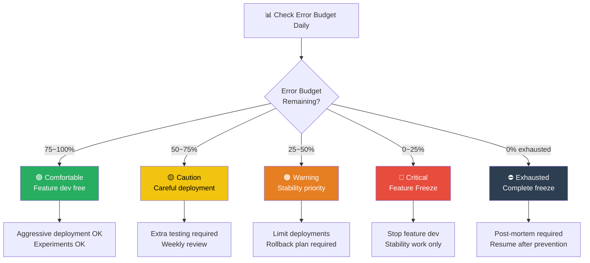
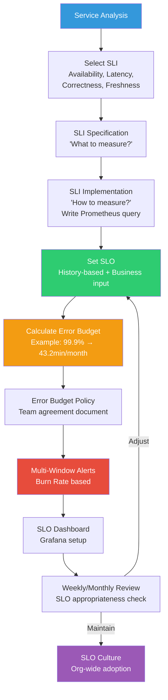

# SLI/SLO Hands-On — Promising Service Reliability with Numbers

> The term "the system is working well" has different meanings for different people. For developers, no errors is OK. For PMs, no user complaints is OK. For executives, no revenue drop is OK. From [SRE Principles](./01-principles), we learned "reliability is the most important feature." Now we'll learn how to **define that reliability with measurable numbers**, and **manage it as a team-agreed target**. SLI, SLO, Error Budget — these three form the heart of SRE.

---

## 🎯 Why Learn SLI/SLO?

### Daily Analogy: Delivery Promise

When shopping online, you often see "guaranteed delivery tomorrow." Let's rephrase this in SRE terms.

- **SLI (Service Level Indicator)**: "Actual time from order to delivery" — a measurable metric
- **SLO (Service Level Objective)**: "99% of orders delivered within 24 hours" — internal team goal
- **SLA (Service Level Agreement)**: "Free shipping if not delivered within 24 hours" — customer contract
- **Error Budget**: "It's OK if 1% is late per month" — failure allowance

Saying "We're fast!" means nothing. Saying "99% of deliveries arrive within 24 hours" becomes a real promise. Same with services.

```
Moments when SLI/SLO are needed in practice:

• "The service is slow" vs "P99 latency exceeded 2 seconds"           → Need SLI quantification
• "Let's target 100% availability!" → Unrealistic                   → Need realistic SLO
• "Deploy new feature vs improve stability, what's first?"          → Use Error Budget for decision
• "Alerts are overwhelming, missing important ones"                 → Need SLO-based alerts
• "We had an incident, should we compensate customers?"             → Need SLA vs SLO criteria
• "Is our reliability better than competitors?"                     → Compare with SLI data
• "Want faster deployment but afraid of incidents"                  → Need Error Budget Policy
```

### Teams Without SLI/SLO vs Teams With SLI/SLO

```mermaid
flowchart TD
    subgraph NO_SLO["❌ Team Without SLI/SLO"]
        N1["'Service seems slow'<br/>Intuition-based"] -->|"Criteria unclear"| N2["Dev vs Ops<br/>'How slow exactly?'"]
        N2 -->|"Conflict"| N3["New features vs Stability<br/>Endless debate"]
        N3 -->|"Political decision"| N4["One side dissatisfied<br/>Team morale drops"]
    end

    subgraph YES_SLO["✅ Team With SLI/SLO"]
        Y1["'P99 latency 1.2s<br/>SLO 1s violated'"] -->|"Data-based"| Y2["Error Budget remaining: 15%<br/>Objective status shared"]
        Y2 -->|"Auto-decide"| Y3["Budget available → Feature dev<br/>Budget exhausted → Stability work"]
        Y3 -->|"Agreed decision"| Y4["Team fully understands<br/>Minimal conflict"]
    end

    style N4 fill:#e74c3c,color:#fff
    style N3 fill:#e67e22,color:#fff
    style Y4 fill:#27ae60,color:#fff
    style Y3 fill:#3498db,color:#fff
```



### SRE Maturity and SLI/SLO

```
SRE Maturity Levels:

Level 0: No monitoring    ██████████████████████████████████████  "Customer tells us"
Level 1: Basic metrics    ████████████████████████████████        "CPU/memory monitoring"
Level 2: Symptom alerts   ████████████████████████                "Error rate, latency"
Level 3: SLI/SLO intro    ████████████████                        "Error Budget management"  ← This is our goal!
Level 4: SLO culture      ████████                                "Org-wide SLO-based decisions"

→ This chapter teaches achieving Level 3~4
```

---

## 🧠 Grasping Core Concepts

### 1. SLI, SLO, SLA Relationships

> **Analogy**: School test — SLI is the test score, SLO is parent agreement, SLA is scholarship criteria

| Concept | Definition | Who Decides | Violation Result | Analogy |
|------|------|------------|-------------|------|
| **SLI** | Metric measuring service quality | Engineering team | - (just measurement) | Test score |
| **SLO** | Internal target for SLI | Engineering + Business | Error Budget exhaustion → Stability work | "Score 90+ " (parent promise) |
| **SLA** | Official customer contract | Business + Legal | Financial compensation (credits/refund) | "Score < 80 reduces allowance" |



**Core Principle: SLO must always be stricter than SLA!**

```
SLO and SLA Relationship:

Internal SLO:  99.95% ← Stricter (internal warning line)
External SLA:  99.9%  ← Looser (customer promise)

Why this way:
Addressing SLO violation with corrective action prevents
reaching SLA violation (safety margin)

Analogy: Fuel warning light at 20% remaining, not 0%
        This gives time to reach gas station
```

### 2. Five Types of SLI

> **Analogy**: Restaurant rating categories — Is taste alone enough? Speed, hygiene, menu variety matter too

| SLI Type | Definition | Calculation | Analogy |
|----------|------|----------|------|
| **Availability** | Ratio of normal service responses | Successful requests / Total requests | Store hours open |
| **Latency** | Time to process requests | P50, P95, P99 response time | How fast food arrives |
| **Throughput** | Number of requests processable | Requests per second (RPS) | Customers served per hour |
| **Correctness** | Ratio returning correct results | Correct responses / Total responses | Orders delivered correctly |
| **Freshness** | Ratio of current data | Update delay < threshold | Today's menu board actually today's |

```
Important SLI by service type:

API Service:       Availability ●●●●● | Latency ●●●●● | Correctness ●●●○○
Payment System:    Availability ●●●●● | Correctness ●●●●● | Latency ●●●○○
Search Engine:     Latency ●●●●● | Freshness ●●●●○ | Throughput ●●●●○
Data Pipeline:     Freshness ●●●●● | Correctness ●●●●● | Throughput ●●●○○
Streaming Service: Availability ●●●●● | Throughput ●●●●● | Latency ●●●●○
CDN/Static Files:  Availability ●●●●● | Latency ●●●●● | Throughput ●●●○○

→ Priorities differ by service characteristics!
```

### 3. Error Budget at a Glance

```
Error Budget Calculation (30-day basis):

SLO Target    Error Budget(%)  Allowed DT(min)   Allowed DT(hours)
──────────    ────────────────  ────────────────  ─────────────────
99%           1.0%              432 min           7 hrs 12 min
99.5%         0.5%              216 min           3 hrs 36 min
99.9%         0.1%              43.2 min          ~43 min
99.95%        0.05%             21.6 min          ~22 min
99.99%        0.01%             4.32 min          ~4 min
99.999%       0.001%            0.432 min         ~26 sec

→ With each additional 9, allowed time drops to 1/10!
→ 99.999% (Five Nines) allows only 26 seconds per month — nearly impossible!
```

---

## 🔍 Detailed Deep Dive

### 1. SLI Specification vs SLI Implementation

SLI involves two steps: first define "what to measure" (Specification), then "how to measure it" (Implementation).

> **Analogy**: "Tasty food" (Specification) vs "Measure umami numerically with MSG meter" (Implementation)

```
SLI Specification (What):
  "Ratio of users experiencing fast API response times"

SLI Implementation (How):
  Method 1: Server-side log based
    → Extract upstream_response_time from Nginx access log
    → Pros: Easy to implement  |  Cons: Doesn't include network delay

  Method 2: Load balancer metrics based
    → Use ALB's TargetResponseTime metric
    → Pros: Includes infrastructure delay  |  Cons: Doesn't include client delay

  Method 3: Client-side measurement
    → Measure actual user experience with browser Performance API
    → Pros: Most accurate  |  Cons: Complex, lots of noise

  Method 4: Synthetic Monitoring
    → Periodically send requests from outside
    → Pros: Consistent measurement  |  Cons: Differs from real user patterns
```

**SLI Measurement Point Accuracy Differences:**



**SLI Type Specification & Implementation Examples:**

| SLI Type | Specification | Implementation (Prometheus) |
|----------|--------------|---------------------------|
| Availability | Ratio of successfully processed requests | `sum(rate(http_requests_total{code!~"5.."}[5m])) / sum(rate(http_requests_total[5m]))` |
| Latency | Ratio responding within 200ms | `sum(rate(http_request_duration_seconds_bucket{le="0.2"}[5m])) / sum(rate(http_request_duration_seconds_count[5m]))` |
| Throughput | Requests processable per second | `sum(rate(http_requests_total[5m]))` |
| Correctness | Ratio returning correct results | `sum(rate(http_requests_total{code="200",result="correct"}[5m])) / sum(rate(http_requests_total{code="200"}[5m]))` |
| Freshness | Ratio updated within N seconds | `sum(data_freshness_seconds < 60) / count(data_freshness_seconds)` |

### 2. SLO Setting Methodology

Setting SLO is both science and art. Too high kills development speed; too low loses users.

#### Method 1: History-Based (Using Past Data)

```
SLO Setting Process (History-Based):

Step 1: Collect recent 30-day SLI data
  → Availability: 99.95%, P99 latency: 450ms, Error rate: 0.03%

Step 2: Set margin from current performance
  → Availability SLO: 99.9% (current 99.95% with 0.05% margin)
  → Latency SLO: P99 < 500ms (current 450ms with 50ms margin)

Step 3: Consult with business team
  → "Is this level fine for user experience?"
  → "Is this sufficient vs competitors?"

Step 4: Trial run for 4 weeks
  → Confirm operating without SLO violation
  → Adjust if needed

Step 5: Adopt as official SLO
  → Team agreement → Documentation → Dashboard → Alerts
```

#### Method 2: User Expectations Based

```
Derive SLO from user behavior data:

"Page load time and bounce rate relationship"

Response Time  Bounce Rate
──────────    ──────
< 200ms       2%      ← Best experience
200-500ms     5%      ← Most satisfied
500ms-1s      12%     ← Dissatisfaction starts
1s-2s         25%     ← Significant bounce
2s-3s         40%     ← Severe bounce
> 3s          55%+    ← Majority bounce

→ SLO Decision: "P99 < 500ms" (maintain bounce rate < 5%)
→ More strict: "P95 < 200ms" (most users get best experience)
```

#### Method 3: Percentile-Based SLO

```
Why percentile instead of average?

Scenario: 10 requests with response times
  50ms, 55ms, 60ms, 65ms, 70ms, 75ms, 80ms, 85ms, 90ms, 5000ms

  Average: 563ms     ← "563ms? Seems slow" (Reality: 9 are fast, 1 extreme)
  P50:     70ms      ← Half are ≤70ms (median)
  P90:     90ms      ← 90% are ≤90ms
  P99:     5000ms    ← Worst 1% is 5 seconds (these users create complaints!)

  → Average hides extreme values
  → P99 shows "unhappiest 1% of users" experience
```

**Recommended SLO Percentile Combinations:**

```
Service Type and Recommended SLO:

┌──────────────────┬──────────────────────────────────────────────┐
│ Service Type     │ Recommended SLO                              │
├──────────────────┼──────────────────────────────────────────────┤
│ User API         │ Availability: 99.9%                          │
│                  │ Latency: P50 < 100ms, P99 < 500ms            │
├──────────────────┼──────────────────────────────────────────────┤
│ Payment System   │ Availability: 99.99%                         │
│                  │ Correctness: 99.999%                         │
│                  │ Latency: P99 < 1s                            │
├──────────────────┼──────────────────────────────────────────────┤
│ Internal Batch   │ Freshness: 99.9% (process within 1 hour)     │
│                  │ Correctness: 99.99%                          │
├──────────────────┼──────────────────────────────────────────────┤
│ Streaming/RT     │ Availability: 99.95%                         │
│                  │ Latency: P99 < 200ms                         │
│                  │ Throughput: > 10K RPS                        │
└──────────────────┴──────────────────────────────────────────────┘
```

### 3. Error Budget Deep Dive

#### Error Budget Calculation Hands-On

```
Error Budget Calculation Formula:

  Error Budget = 1 - SLO Target
  Allowed Downtime = Error Budget × Time Period

Example: SLO 99.9%, 30 days (43,200 minutes)

  Error Budget = 1 - 0.999 = 0.001 (0.1%)
  Allowed Downtime = 0.001 × 43,200 minutes = 43.2 minutes

  So it's OK if service is down 43.2 minutes per month!

Real-World Exhaustion Scenario:
  ─────────────────────────────────────────────────
  Event                        Depletion    Remaining Budget
  ─────────────────────────────────────────────────
  Month start                  -            43.2 min (100%)
  Day 3: Rollback (5 min DT)    -5 min      38.2 min (88.4%)
  Day 10: DB failover (3 min)   -3 min      35.2 min (81.5%)
  Day 15: Network issue (10 min)-10 min     25.2 min (58.3%)  ← Warning!
  Day 20: Major incident (15 min)-15 min    10.2 min (23.6%)  ← Critical!
  Day 25: Keep remaining        conserved   10.2 min (23.6%)
  ─────────────────────────────────────────────────

  → By day 15, over 50% exhausted — must focus on stability!
```

#### Error Budget Policy (Error Budget Policy)

Error Budget Policy is a team agreement document: "If Error Budget reaches X level, we act Y way."

```
Example Error Budget Policy:

┌─────────────────────────┬────────────────────────────────────────────┐
│ Error Budget Remaining   │ Team Action                                │
├─────────────────────────┼────────────────────────────────────────────┤
│ 75~100% (Comfortable)   │ • Feature development proceeds freely       │
│                         │ • Aggressive experiments/deployments OK     │
│                         │ • Can increase canary ratio                 │
├─────────────────────────┼────────────────────────────────────────────┤
│ 50~75% (Caution)        │ • Continue feature dev but carefully        │
│                         │ • Extra testing before deploy required      │
│                         │ • Begin weekly SLO review                   │
├─────────────────────────┼────────────────────────────────────────────┤
│ 25~50% (Warning)        │ • Slow feature development pace             │
│                         │ • Raise stability work priority             │
│                         │ • Limit deployments (max 2/week)            │
│                         │ • Rollback plan required                    │
├─────────────────────────┼────────────────────────────────────────────┤
│ 0~25% (Critical)        │ • 🚨 Stop all feature development (Freeze)  │
│                         │ • Only stability/reliability work           │
│                         │ • Extra review on all changes               │
│                         │ • Report to leadership                      │
├─────────────────────────┼────────────────────────────────────────────┤
│ Exhausted (0%)          │ • 🔴 Complete change freeze                 │
│                         │ • Conduct incident analysis and post-mortem │
│                         │ • Only resume after prevention measures     │
│                         │ • Conservative ops until next period        │
└─────────────────────────┴────────────────────────────────────────────┘
```



### 4. Multi-Window, Multi-Burn-Rate Alerts

Traditional alerting (e.g., "alert if error rate > 1%") has problems. Momentary spikes trigger alerts (false positives), while gradual exhaustion is missed. **Multi-Window, Multi-Burn-Rate Alert** solves this.

> **Analogy**: Checking bank balance — "Spent 500k today" is less useful than "At this rate, you'll run out in 3 days"

#### Burn Rate Concept

```
Burn Rate = Actual Error Rate / SLO Allowed Error Rate

Example: SLO 99.9% (allowed error rate 0.1%)

  Actual Error Rate  Burn Rate   Meaning
  ────────────────  ─────────  ────
  0.1%              1x         → SLO threshold (consume entire month)
  0.2%              2x         → 2x speed (exhaust in 15 days)
  1.0%              10x        → 10x speed (exhaust in 3 days!)
  1.44%             14.4x      → 1% per hour (exhaust in 3 days)
  10%               100x       → About 7 hours to exhaust!
  100%              1000x      → About 43 minutes to completely exhaust!
```

#### Multi-Window Alert Design

```
Multi-Window, Multi-Burn-Rate Alert Strategy:

┌───────────┬────────────┬─────────────┬──────────────┬─────────────────┐
│ Severity  │ Burn Rate  │ Long Window │ Short Window │ Meaning          │
├───────────┼────────────┼─────────────┼──────────────┼─────────────────┤
│ Critical  │ 14.4x      │ 1 hour      │ 5 min        │ Exhaust in 3d!  │
│ (Page)    │            │             │              │ → Immediate     │
├───────────┼────────────┼─────────────┼──────────────┼─────────────────┤
│ Critical  │ 6x         │ 6 hours     │ 30 min       │ Exhaust in 1w!  │
│ (Page)    │            │             │              │ → Quick response │
├───────────┼────────────┼─────────────┼──────────────┼─────────────────┤
│ Warning   │ 3x         │ 1 day       │ 2 hours      │ Exhaust in 10d  │
│ (Ticket)  │            │             │              │ → Business hrs  │
├───────────┼────────────┼─────────────┼──────────────┼─────────────────┤
│ Warning   │ 1x         │ 3 days      │ 6 hours      │ Exhaust in month│
│ (Ticket)  │            │             │              │ → Planned       │
└───────────┴────────────┴─────────────┴──────────────┴─────────────────┘

Why two windows (Long + Short)?

Long Window alone:  Past errors included, alert continues after recovery
Short Window alone: Brief spikes trigger false positives

Both required:      Alert only when sustained condition → High accuracy!
```

#### Prometheus Alert Rules Implementation

```yaml
# Multi-Window, Multi-Burn-Rate Alert Rules
# SLO: 99.9% availability (30-day basis)

groups:
  - name: slo-availability-alerts
    rules:
      # ─── Pre-calculation: Error Rate Recording Rules ───
      - record: slo:error_rate:ratio_rate5m
        expr: |
          sum(rate(http_requests_total{code=~"5.."}[5m]))
          /
          sum(rate(http_requests_total[5m]))

      - record: slo:error_rate:ratio_rate30m
        expr: |
          sum(rate(http_requests_total{code=~"5.."}[30m]))
          /
          sum(rate(http_requests_total[30m]))

      - record: slo:error_rate:ratio_rate1h
        expr: |
          sum(rate(http_requests_total{code=~"5.."}[1h]))
          /
          sum(rate(http_requests_total[1h]))

      - record: slo:error_rate:ratio_rate6h
        expr: |
          sum(rate(http_requests_total{code=~"5.."}[6h]))
          /
          sum(rate(http_requests_total[6h]))

      - record: slo:error_rate:ratio_rate1d
        expr: |
          sum(rate(http_requests_total{code=~"5.."}[1d]))
          /
          sum(rate(http_requests_total[1d]))

      - record: slo:error_rate:ratio_rate3d
        expr: |
          sum(rate(http_requests_total{code=~"5.."}[3d]))
          /
          sum(rate(http_requests_total[3d]))

      # ─── Critical: Burn Rate 14.4x (1h + 5m) ───
      - alert: SLOHighBurnRate_Critical_Fast
        expr: |
          slo:error_rate:ratio_rate1h > (14.4 * 0.001)
          and
          slo:error_rate:ratio_rate5m > (14.4 * 0.001)
        for: 2m
        labels:
          severity: critical
          slo: availability
          burn_rate: "14.4x"
        annotations:
          summary: "SLO Burn Rate 14.4x - Error Budget exhausts in 3 days!"
          description: |
            Service {{ $labels.service }} error rate increasing at 14.4x SLO rate.
            Current 1h error rate: {{ $value | humanizePercentage }}
            Error Budget will be completely exhausted in ~3 days at this rate.
            Immediate action required.
          runbook_url: "https://wiki.example.com/runbooks/slo-burn-rate"

      # ─── Critical: Burn Rate 6x (6h + 30m) ───
      - alert: SLOHighBurnRate_Critical_Slow
        expr: |
          slo:error_rate:ratio_rate6h > (6 * 0.001)
          and
          slo:error_rate:ratio_rate30m > (6 * 0.001)
        for: 5m
        labels:
          severity: critical
          slo: availability
          burn_rate: "6x"
        annotations:
          summary: "SLO Burn Rate 6x - Error Budget exhausts in 1 week!"
          description: |
            Service {{ $labels.service }} error rate increasing at 6x SLO rate.
            Current 6h error rate: {{ $value | humanizePercentage }}

      # ─── Warning: Burn Rate 3x (1d + 2h) ───
      - alert: SLOHighBurnRate_Warning_Slow
        expr: |
          slo:error_rate:ratio_rate1d > (3 * 0.001)
          and
          slo:error_rate:ratio_rate2h > (3 * 0.001)
        for: 10m
        labels:
          severity: warning
          slo: availability
          burn_rate: "3x"
        annotations:
          summary: "SLO Burn Rate 3x - Budget exhausts in 10 days"

      # ─── Warning: Burn Rate 1x (3d + 6h) ───
      - alert: SLOHighBurnRate_Warning_Gradual
        expr: |
          slo:error_rate:ratio_rate3d > (1 * 0.001)
          and
          slo:error_rate:ratio_rate6h > (1 * 0.001)
        for: 30m
        labels:
          severity: warning
          slo: availability
          burn_rate: "1x"
        annotations:
          summary: "SLO Burn Rate 1x - Budget exhaustion expected by month-end"
```

### 5. SLO Dashboard Design (Grafana)

We'll apply the dashboard design principles from [Dashboard Design](../08-observability/10-dashboard-design) to SLO.

#### SLO Dashboard Structure

```
SLO Dashboard Hierarchy:

Level 1: Executive Overview (for leadership)
├── Overall service SLO compliance (green/yellow/red)
├── Error Budget remaining (monthly)
└── Key service status summary

Level 2: Service Overview (for team leads)
├── Service-by-service SLI status (Availability, Latency, Correctness)
├── Error Budget consumption trend (burndown chart)
├── SLO violations history (last 30 days)
└── Alert frequency and MTTR

Level 3: SLI Detail (for engineers)
├── Real-time SLI values (1min/5min/1hour windows)
├── Current Burn Rate
├── Error analysis by type
└── Deployment events overlay
```

#### Core Dashboard JSON (Key Panels)

```json
{
  "panels": [
    {
      "title": "SLO Status Overview",
      "type": "stat",
      "description": "Current SLO achievement rate",
      "targets": [
        {
          "expr": "1 - (sum(rate(http_requests_total{code=~\"5..\"}[30d])) / sum(rate(http_requests_total[30d])))",
          "legendFormat": "Availability SLO"
        }
      ],
      "fieldConfig": {
        "defaults": {
          "thresholds": {
            "steps": [
              { "value": 0, "color": "red" },
              { "value": 0.999, "color": "yellow" },
              { "value": 0.9995, "color": "green" }
            ]
          },
          "unit": "percentunit"
        }
      }
    },
    {
      "title": "Error Budget Remaining",
      "type": "gauge",
      "description": "Monthly Error Budget remaining ratio",
      "targets": [
        {
          "expr": "1 - (sum(increase(http_requests_total{code=~\"5..\"}[30d])) / (sum(increase(http_requests_total[30d])) * (1 - 0.999)))",
          "legendFormat": "Budget Remaining"
        }
      ],
      "fieldConfig": {
        "defaults": {
          "min": 0,
          "max": 1,
          "thresholds": {
            "steps": [
              { "value": 0, "color": "red" },
              { "value": 0.25, "color": "orange" },
              { "value": 0.5, "color": "yellow" },
              { "value": 0.75, "color": "green" }
            ]
          },
          "unit": "percentunit"
        }
      }
    },
    {
      "title": "Error Budget Burndown",
      "type": "timeseries",
      "description": "Error Budget consumption trend (ideal vs actual)",
      "targets": [
        {
          "expr": "1 - (sum(increase(http_requests_total{code=~\"5..\"}[$__range])) / (sum(increase(http_requests_total[$__range])) * 0.001))",
          "legendFormat": "Actual Error Budget"
        }
      ]
    },
    {
      "title": "Burn Rate (Multi-Window)",
      "type": "timeseries",
      "description": "Burn Rate trend by window",
      "targets": [
        {
          "expr": "slo:error_rate:ratio_rate5m / 0.001",
          "legendFormat": "Burn Rate (5m window)"
        },
        {
          "expr": "slo:error_rate:ratio_rate1h / 0.001",
          "legendFormat": "Burn Rate (1h window)"
        },
        {
          "expr": "slo:error_rate:ratio_rate6h / 0.001",
          "legendFormat": "Burn Rate (6h window)"
        }
      ]
    }
  ]
}
```

#### Recommended Dashboard Layout (24-column basis):

```
Row 1: Key Metrics (height 4)
┌────────────┬────────────┬────────────┬────────────┐
│ SLO Rate   │ EB % Left  │ Burn Rate  │ Violations │
│ Stat       │ Gauge      │ Stat       │ Stat       │
│  (6cols)   │  (6cols)   │ (6cols)    │ (6cols)    │
└────────────┴────────────┴────────────┴────────────┘

Row 2: Error Budget Burndown (height 8)
┌────────────────────────────────────────────────────┐
│         Error Budget Burndown Chart                 │
│ Ideal depletion (dashed) vs Actual (solid)          │
│ Deployment event markers included                   │
│                   (24cols)                          │
└────────────────────────────────────────────────────┘

Row 3: SLI Details (height 8)
┌──────────────────────────┬──────────────────────────┐
│ Availability (Error Rate)│ Latency (P50/P95/P99)    │
│ Time Series              │ Time Series              │
│      (12cols)            │       (12cols)           │
└──────────────────────────┴──────────────────────────┘

Row 4: Analysis Tools (height 8)
┌──────────────────────────┬──────────────────────────┐
│ Burn Rate (Multi-Window) │ Latency Heatmap          │
│ Time Series              │ Heatmap                  │
│      (12cols)            │       (12cols)           │
└──────────────────────────┴──────────────────────────┘
```

### 6. SLO Tools: Sloth & Pyrra

Writing Recording and Alert rules manually is error-prone. SLO-specific tools auto-generate them.

#### Sloth

Sloth automatically generates Prometheus Recording and Alert Rules from YAML-defined SLOs.

```yaml
# sloth.yaml - SLO Definition File
version: "prometheus/v1"
service: "api-gateway"
labels:
  owner: "platform-team"
  tier: "tier-1"

slos:
  # ─── Availability SLO ───
  - name: "api-availability"
    objective: 99.9  # 99.9% SLO
    description: "API Gateway Availability SLO"
    sli:
      events:
        error_query: |
          sum(rate(http_requests_total{service="api-gateway",code=~"5.."}[{{.window}}]))
        total_query: |
          sum(rate(http_requests_total{service="api-gateway"}[{{.window}}]))
    alerting:
      name: "APIGatewayAvailability"
      labels:
        team: "platform"
      annotations:
        runbook: "https://wiki.example.com/runbooks/api-availability"
      page_alert:
        labels:
          severity: "critical"
          routing_key: "platform-oncall"
      ticket_alert:
        labels:
          severity: "warning"
          routing_key: "platform-tickets"

  # ─── Latency SLO ───
  - name: "api-latency"
    objective: 99.0  # 99% of requests within 500ms
    description: "API Gateway Latency SLO (P99 < 500ms)"
    sli:
      events:
        error_query: |
          sum(rate(http_request_duration_seconds_count{service="api-gateway"}[{{.window}}]))
          -
          sum(rate(http_request_duration_seconds_bucket{service="api-gateway",le="0.5"}[{{.window}}]))
        total_query: |
          sum(rate(http_request_duration_seconds_count{service="api-gateway"}[{{.window}}]))
    alerting:
      name: "APIGatewayLatency"
      labels:
        team: "platform"
      annotations:
        runbook: "https://wiki.example.com/runbooks/api-latency"
```

```bash
# Sloth Usage
# 1. Create SLO definition file
# 2. Auto-generate Prometheus rules
sloth generate -i sloth.yaml -o prometheus-rules/

# Generated files:
# - recording rules (5m, 30m, 1h, 2h, 6h, 1d, 3d windows)
# - multi-burn-rate alert rules (page + ticket)
# - SLO metadata labels
```

#### Pyrra

Pyrra is a Kubernetes-native SLO management tool, providing CRDs and web UI.

```yaml
# pyrra-slo.yaml - Kubernetes CRD
apiVersion: pyrra.dev/v1alpha1
kind: ServiceLevelObjective
metadata:
  name: api-gateway-availability
  namespace: monitoring
  labels:
    pyrra.dev/team: platform
spec:
  target: "99.9"
  window: 30d
  description: "API Gateway Availability SLO"
  indicator:
    ratio:
      errors:
        metric: http_requests_total{service="api-gateway",code=~"5.."}
      total:
        metric: http_requests_total{service="api-gateway"}
  alerting:
    disabled: false
---
apiVersion: pyrra.dev/v1alpha1
kind: ServiceLevelObjective
metadata:
  name: api-gateway-latency
  namespace: monitoring
spec:
  target: "99"
  window: 30d
  description: "API Gateway Latency SLO (within 500ms)"
  indicator:
    latency:
      success:
        metric: http_request_duration_seconds_bucket{service="api-gateway",le="0.5"}
      total:
        metric: http_request_duration_seconds_count{service="api-gateway"}
```

```bash
# Pyrra Installation and Usage
kubectl apply -f pyrra-slo.yaml

# Access Pyrra Web UI (auto-generated SLO dashboard)
kubectl port-forward svc/pyrra 9099:9099 -n monitoring
# View at http://localhost:9099
```

#### Sloth vs Pyrra Comparison

```
SLO Tools Comparison:

┌─────────────────┬──────────────────────┬──────────────────────┐
│ Aspect          │ Sloth                │ Pyrra                │
├─────────────────┼──────────────────────┼──────────────────────┤
│ Approach        │ CLI-based code gen   │ Kubernetes Operator  │
│ Input           │ YAML file            │ Kubernetes CRD       │
│ Output          │ Prometheus rules     │ Auto-apply + web UI  │
│ Dashboard       │ Generates Grafana    │ Built-in web UI      │
│ K8s Required?   │ No                   │ Yes                  │
│ GitOps Friendly │ High (file-based)    │ High (CRD-based)     │
│ Learning Curve  │ Low                  │ Moderate             │
│ Best For        │ General use          │ Kubernetes           │
└─────────────────┴──────────────────────┴──────────────────────┘
```

### 7. SLO Documentation Template

SLO must be documented and shared across teams.

```markdown
# SLO Documentation Template

## Service Information
- **Service Name**: [e.g., api-gateway]
- **Owner Team**: [e.g., Platform Team]
- **Description**: [e.g., Entry point for all external API traffic]
- **Tier**: [e.g., Tier-1 (Business Critical)]
- **Dependent Services**: [e.g., auth-service, user-service, payment-service]

## SLI Definition

### SLI 1: Availability
- **Specification**: Ratio of successfully processed HTTP requests
- **Implementation**: HTTP 5xx excluded / Total requests
- **Measurement Point**: Application Load Balancer (ALB)
- **Data Source**: Prometheus (ALB exporter)
- **Query**: `sum(rate(http_requests_total{code!~"5.."}[5m])) / sum(rate(http_requests_total[5m]))`

### SLI 2: Latency
- **Specification**: Ratio of requests responding within 500ms
- **Implementation**: Response time ≤500ms / Total requests
- **Measurement Point**: Server-side (application metric)
- **Data Source**: Prometheus (histogram)
- **Query**: `sum(rate(http_request_duration_seconds_bucket{le="0.5"}[5m])) / sum(rate(http_request_duration_seconds_count[5m]))`

## SLO Targets

| SLI | SLO Target | Period | Error Budget (30d) |
|-----|---------|------|-------------------|
| Availability | 99.9% | 30-day rolling | 43.2 minutes |
| Latency (P99 < 500ms) | 99.0% | 30-day rolling | 432 minutes |

## Error Budget Policy
- **75~100%**: Normal development
- **50~75%**: Careful deployment, weekly review
- **25~50%**: Stability priority, limit deployments
- **0~25%**: Feature Freeze
- **Exhausted**: Change freeze, post-mortem required

## Alerting
- **Critical (Page)**: Burn Rate 14.4x (1h/5m), 6x (6h/30m)
- **Warning (Ticket)**: Burn Rate 3x (1d/2h), 1x (3d/6h)
- **Recipients**: Platform On-call (PagerDuty), #platform-alerts (Slack)

## Review Schedule
- **Daily**: Error Budget remaining (auto Slack report)
- **Weekly**: SLO compliance review (team meeting)
- **Monthly**: SLO target appropriateness re-check
- **Quarterly**: Full SLI/SLO re-review

## History
| Date | Change | Reason |
|------|--------|--------|
| 2025-01-15 | Initial SLO | Service launch |
| 2025-04-01 | Latency 99.5%→99.0% | New feature latency |
| 2025-07-01 | Availability 99.9%→99.95% | Infrastructure improvements |
```

### 8. SLA and SLO Relationship

```
SLA ⊂ SLO ⊂ SLI Relationship Summary:

SLI (Metrics — Defined by Engineers)
 │
 ├── Availability: Currently 99.95%
 ├── Latency: P99 currently 320ms
 └── Correctness: Currently 99.99%
       │
       ▼
SLO (Internal Target — Engineered + Business Agreement)
 │
 ├── Availability SLO: 99.9%     ← 0.05% stricter than SLA
 ├── Latency SLO: P99 < 500ms
 └── Correctness SLO: 99.99%
       │
       ▼
SLA (External Contract — Business + Legal)
 │
 ├── Availability SLA: 99.85%    ← Looser than SLO
 ├── Latency SLA: P99 < 1s
 └── Violation: 10% monthly credit
```

```
Real Cloud Vendor SLA Examples:

AWS:
  • EC2:           99.99%  (4.32 min/month downtime allowed)
  • S3:            99.9%   (43.2 min/month downtime allowed)
  • RDS Multi-AZ:  99.95%  (21.6 min/month downtime allowed)
  • Lambda:        99.95%

GCP:
  • Compute Engine: 99.99%
  • Cloud SQL:      99.95%
  • Cloud Run:      99.95%

Azure:
  • VMs:            99.99%  (availability set)
  • Azure SQL:      99.99%

→ Cloud vendors don't promise 100%!
→ Combining services lowers overall availability
```

**Composite Service Availability Calculation:**

```
Serial Configuration (A → B → C): Total = A × B × C
  Example: 99.9% × 99.9% × 99.9% = 99.7% (much lower!)

Parallel Configuration (A || B, redundant): Total = 1 - (1-A) × (1-B)
  Example: 1 - (1-99.9%) × (1-99.9%) = 99.9999%

Real Architecture Calculation:
  CDN(99.9%) → LB(99.99%) → App(99.9%) → DB(99.95%)
  = 0.999 × 0.9999 × 0.999 × 0.9995
  = 99.74%

  → Even with all components >99.9%
    the service only achieves 99.74%!
  → This must be considered when setting SLO
```

---

## 💻 Hands-On Practice

### Lab 1: Define SLI/SLO for Your Service

Let's walk through setting SLI/SLO from scratch for a simple web API.

#### Step 1: Service Analysis and SLI Selection

```bash
# Check current service metrics (Prometheus)
# 1. What metrics are available?
curl -s http://prometheus:9090/api/v1/label/__name__/values | jq '.data[]' | grep http

# Expected results:
# "http_requests_total"
# "http_request_duration_seconds_bucket"
# "http_request_duration_seconds_count"
```

```bash
# 2. Check 30-day availability
curl -s 'http://prometheus:9090/api/v1/query' \
  --data-urlencode 'query=
    1 - (
      sum(increase(http_requests_total{code=~"5.."}[30d]))
      /
      sum(increase(http_requests_total[30d]))
    )
  ' | jq '.data.result[0].value[1]'

# Expected: "0.99957" → Current availability 99.957%
```

```bash
# 3. Check 30-day P99 latency
curl -s 'http://prometheus:9090/api/v1/query' \
  --data-urlencode 'query=
    histogram_quantile(0.99,
      sum(rate(http_request_duration_seconds_bucket[30d])) by (le)
    )
  ' | jq '.data.result[0].value[1]'

# Expected: "0.342" → P99 latency 342ms
```

#### Step 2: Set SLO

```yaml
# my-service-slo.yaml
service: my-web-api
team: backend-team
tier: tier-2

current_performance:  # Last 30 days actual
  availability: 99.957%
  latency_p99: 342ms
  error_rate: 0.043%

slo_targets:  # SLO goals (slightly looser than current)
  availability:
    target: 99.9%           # Current 99.957% with 0.057% margin
    error_budget: 43.2min   # Allowed monthly downtime
    rationale: "Maintain >99.95% based on 30d history, 0.05% safety margin"

  latency:
    target: 99%             # 99% of requests within 500ms
    threshold: 500ms        # Current 342ms with 158ms margin
    error_budget: 432min    # 1% allowed
    rationale: "User bounce data shows <5% at 500ms threshold"
```

#### Step 3: Write Prometheus Recording Rules

```yaml
# prometheus-recording-rules.yaml
groups:
  - name: my-web-api-sli
    interval: 30s
    rules:
      # ─── Availability SLI ───
      - record: my_web_api:sli:availability
        expr: |
          sum(rate(http_requests_total{service="my-web-api",code!~"5.."}[5m]))
          /
          sum(rate(http_requests_total{service="my-web-api"}[5m]))

      # ─── Latency SLI (within 500ms ratio) ───
      - record: my_web_api:sli:latency_good_ratio
        expr: |
          sum(rate(http_request_duration_seconds_bucket{service="my-web-api",le="0.5"}[5m]))
          /
          sum(rate(http_request_duration_seconds_count{service="my-web-api"}[5m]))

      # ─── Error Budget Remaining (30-day rolling) ───
      - record: my_web_api:error_budget:remaining
        expr: |
          1 - (
            sum(increase(http_requests_total{service="my-web-api",code=~"5.."}[30d]))
            /
            (sum(increase(http_requests_total{service="my-web-api"}[30d])) * 0.001)
          )

      # ─── Multi-Window Error Rates ───
      - record: my_web_api:error_rate:5m
        expr: |
          sum(rate(http_requests_total{service="my-web-api",code=~"5.."}[5m]))
          / sum(rate(http_requests_total{service="my-web-api"}[5m]))

      - record: my_web_api:error_rate:30m
        expr: |
          sum(rate(http_requests_total{service="my-web-api",code=~"5.."}[30m]))
          / sum(rate(http_requests_total{service="my-web-api"}[30m]))

      - record: my_web_api:error_rate:1h
        expr: |
          sum(rate(http_requests_total{service="my-web-api",code=~"5.."}[1h]))
          / sum(rate(http_requests_total{service="my-web-api"}[1h]))

      - record: my_web_api:error_rate:6h
        expr: |
          sum(rate(http_requests_total{service="my-web-api",code=~"5.."}[6h]))
          / sum(rate(http_requests_total{service="my-web-api"}[6h]))
```

#### Step 4: Generate with Sloth

```yaml
# sloth-my-web-api.yaml
version: "prometheus/v1"
service: "my-web-api"
labels:
  owner: "backend-team"
  tier: "tier-2"

slos:
  - name: "availability"
    objective: 99.9
    description: "my-web-api HTTP Availability"
    sli:
      events:
        error_query: |
          sum(rate(http_requests_total{service="my-web-api",code=~"5.."}[{{.window}}]))
        total_query: |
          sum(rate(http_requests_total{service="my-web-api"}[{{.window}}]))
    alerting:
      name: "MyWebApiAvailability"
      labels:
        team: "backend"
      annotations:
        runbook: "https://wiki.internal/runbooks/my-web-api-availability"
      page_alert:
        labels:
          severity: "critical"
      ticket_alert:
        labels:
          severity: "warning"

  - name: "latency"
    objective: 99.0
    description: "my-web-api Latency SLO (P99 < 500ms)"
    sli:
      events:
        error_query: |
          (
            sum(rate(http_request_duration_seconds_count{service="my-web-api"}[{{.window}}]))
            -
            sum(rate(http_request_duration_seconds_bucket{service="my-web-api",le="0.5"}[{{.window}}]))
          )
        total_query: |
          sum(rate(http_request_duration_seconds_count{service="my-web-api"}[{{.window}}]))
    alerting:
      name: "MyWebApiLatency"
      labels:
        team: "backend"
      annotations:
        runbook: "https://wiki.internal/runbooks/my-web-api-latency"
```

```bash
# Generate Prometheus rules with Sloth
sloth generate -i sloth-my-web-api.yaml -o rules/

# Verify generated files
ls rules/
# my-web-api-availability.yml
# my-web-api-latency.yml

# Apply to Prometheus
cp rules/*.yml /etc/prometheus/rules/
# Reload Prometheus
curl -X POST http://prometheus:9090/-/reload
```

#### Step 5: Verify Results

```bash
# Check Error Budget remaining
curl -s 'http://prometheus:9090/api/v1/query' \
  --data-urlencode 'query=my_web_api:error_budget:remaining' \
  | jq '.data.result[0].value[1]'

# Expected: "0.87" → 87% budget remaining

# Check Burn Rate
curl -s 'http://prometheus:9090/api/v1/query' \
  --data-urlencode 'query=my_web_api:error_rate:1h / 0.001' \
  | jq '.data.result[0].value[1]'

# Expected: "0.45" → Burn Rate 0.45x (very healthy)
```

---

## 🏢 In Practice

### Case 1: First SLO Adoption in Startup

```
Situation: 20-person startup, no dedicated SRE

Approach:
1. Select 1 most critical service (payment API)
2. Define 2 SLIs only (Availability, Latency)
3. Set conservative SLO based on current performance
4. Manual Error Budget tracking (spreadsheet)
5. Expand after 3 months

Timeline:
  Week 1: Verify metrics collection, define SLI
  Week 2: Set SLO and write Recording Rules
  Week 3: Build Grafana dashboard
  Week 4: Team sync and Error Budget Policy agreement
  Month 2: Add alert rules (Burn Rate based)
  Month 3: Expand to second service

Key Learnings:
  → Don't strive for perfection initially
  → SLO is not "set once and done" — continuously adjust
  → Team agreement more important than technology
```

### Case 2: Scaling SLO Culture in Large Organization

```
Situation: 500-person company, 50+ microservices

Challenges:
  - Different SLO standards per team
  - "Our service doesn't need SLO" resistance
  - SLO violations without consequences

Solutions:
  1. SLO Champion Program
     → 1 champion per team
     → Monthly SLO champion meetup for best practices

  2. Provide Standard Templates
     → Tier-based SLO guidelines
     → Sloth automation pipeline

  3. Integrate with Performance Metrics
     → Include SLO goals in team OKRs
     → Post-mortem mandatory on Error Budget exhaustion

  4. Institutionalize Reviews
     → Monthly org-wide SLO review
     → Quarterly SLO appropriateness check

Results (6 months):
  - 80% services with SLO
  - MTTR: 45min → 12min
  - Alert fatigue: 70% reduction
```

### Case 3: Real Error Budget Exhaustion Response

```
[Day 1] Error Budget: 85% remaining
  → Normal ops, feature development ongoing

[Day 7] Error Budget: 62% remaining (spike after major deploy)
  → Weekly review: issue identified, hotfix deployed
  → Decision: Strengthen test coverage

[Day 14] Error Budget: 45% remaining
  → Policy: Reduce deployment pace
  → Start stability improvement work

[Day 18] Error Budget: 28% remaining
  → Feature Freeze activated
  → All engineers focus on stability
  → Load testing, bottleneck optimization

[Day 25] Error Budget: 22% remaining
  → Maintain freeze, preserve budget
  → Month ends without SLA violation

[Post-Mortem]:
  Root Cause: Integration test gaps
  Prevention: Mandatory E2E tests in staging
  SLO Adjustment: Keep 99.9% (appropriate level)
```

### SLO-Based Alerts vs Traditional Alerts

```
Traditional (Threshold-Based) vs SLO-Based (Burn Rate):

Traditional:
  "Alert if error rate > 1%"
  → Problem: Momentary spike triggers alert (false positive)
  → Problem: Gradual 0.5% over 1 week missed (false negative)
  → Problem: No severity context

SLO-Based:
  "Alert if Error Budget exhausts within 3 days"
  → User-impact based judgment
  → Auto-severity determined
  → False positives drastically reduced

Actual Data Comparison:
  ┌──────────────────┬───────────────┬──────────────┐
  │ Metric           │ Threshold     │ SLO-Based    │
  ├──────────────────┼───────────────┼──────────────┤
  │ Monthly alerts   │ 180           │ 12           │
  │ False positive % │ 45%           │ 5%           │
  │ False negative % │ 15%           │ 3%           │
  │ Avg MTTR         │ 35 min        │ 12 min       │
  │ On-call rating   │ 3.2/10        │ 7.8/10       │
  └──────────────────┴───────────────┴──────────────┘
```

---

## ⚠️ Common Mistakes

### Mistake 1: Setting SLO at 100%

```
❌ Wrong:
  "We target 100% availability!"

Why bad:
  - Error Budget = 0 → Can't change anything
  - Deployment itself can cause errors
  - Teams fear changes → Technical debt
  - Physically impossible

✅ Correct:
  - Payment: 99.99% (very high but not 100%)
  - API: 99.9%
  - Internal tools: 99.5%
  - Batch processing: 99%

Remember: Google doesn't promise 100%!
```

### Mistake 2: Defining SLI as Internal Metrics Only

```
❌ Wrong SLI:
  - CPU usage < 80%
  - Memory < 70%
  - Disk I/O < 1000 IOPS

Why bad:
  - 80% CPU doesn't guarantee user experience
  - 30% CPU with app bugs still fails users
  - These are "causes" not "symptoms"

✅ Correct SLI:
  - Success response ratio
  - Response time
  - Data correctness

Principle: SLI measures "user-perceived quality"
```

### Mistake 3: Set SLO and Forget

```
❌ Wrong Pattern:
  1. Define SLO once
  2. Build dashboard
  3. ... 6 months later: nobody checks

✅ Correct Pattern:
  1. Define SLO + Error Budget Policy
  2. Weekly Error Budget review in meetings
  3. Quarterly SLO appropriateness re-check
  4. SLO changes documented
  5. Process auto-triggered on violations

Principle: SLO is living document, not one-time
```

### Mistake 4: Same SLO for All Services

```
❌ Wrong:
  "All services must be 99.9%"

Why bad:
  - Payment service might need 99.99%
  - Admin tool doesn't need same level
  - User expectations vary

✅ Correct (Tiered):
  Tier 1 (Critical): 99.99%
  Tier 2 (User-facing): 99.9%
  Tier 3 (Internal): 99.5%
  Tier 4 (Batch): 99%
```

### Mistake 5: Misunderstanding Error Budget

```
❌ Wrong:
  "100% remaining budget is good!"

Actual Meaning:
  = No errors all month
  = Might mean no changes/innovation

Error Budget is "innovation fuel":
  - Budget available → Deploy new features
  - Preserving budget → Stops innovation

✅ Healthy State:
  - Month-end: 25~50% remaining
  - Too much: SLO too loose OR no innovation
  - Too little: Stability needs improvement
```

### Mistake 6: Single-Window Alerts

```
❌ Single Window:
  alert: HighErrorRate
  expr: error_rate_5m > 0.001

  Problem: 5-min spike triggers alert
  Problem: Slow burn-down missed

✅ Multi-Window:
  expr: |
    error_rate_1h > (14.4 * 0.001)
    AND
    error_rate_5m > (14.4 * 0.001)

  Benefit: Sustained condition confirmed
  Benefit: False positives eliminated
```

---

## 📝 Wrap-Up

### Core SLI/SLO Summary

```
Essential Points:

1. SLI selection → Choose user-perspective metrics
   Availability, Latency, Correctness, Freshness, Throughput

2. SLO setting → Realistic targets
   Never 100%! Based on past data + business needs

3. Error Budget → Innovation/Stability balance
   Remaining budget → Features | Exhausted → Stability

4. Multi-Window Multi-Burn-Rate Alerts → Accurate alerting
   Fewer false positives, fewer misses

5. Team culture → Agreed policies essential
   Error Budget Policy → Weekly reviews → Quarterly re-checks

6. Automation tools → Sloth, Pyrra prevent mistakes
   Auto-generated rules reduce errors

7. Living document → SLO evolves with service
   Regular review and adjustment cycle
```

### Complete Flow Review



### SLI/SLO Adoption Checklist

```
SLI/SLO Implementation Checklist:

Phase 1: Preparation (1 week)
  □ Select target service (most critical 1~2)
  □ Check current metrics status
  □ Select SLI types (Availability + Latency first)
  □ Analyze 30-day performance data

Phase 2: Setup (1 week)
  □ Write SLI Specification
  □ Write SLI Implementation (Prometheus queries)
  □ Set SLO targets (past data + business agreement)
  □ Calculate Error Budget

Phase 3: Automation (1 week)
  □ Write Recording Rules (or use Sloth/Pyrra)
  □ Set Multi-Window Alert Rules
  □ Build Grafana SLO Dashboard
  □ Integrate with Slack/PagerDuty

Phase 4: Culture (ongoing)
  □ Team agreement on Error Budget Policy
  □ Document with standard template
  □ Start weekly SLO review
  □ Automate monthly Error Budget report
  □ Schedule quarterly re-review

Phase 5: Expansion (3+ months)
  □ Expand SLO to other services
  □ Run SLO champion program
  □ SLO-based decision process
  □ Include SLO in team OKRs
```

---

## 🔗 Next Steps

### Continue Learning

```
Learning Path:

Current: SLI/SLO Hands-On
   │
   ├── Prerequisite (should be done)
   │   ├── SRE Principles (./01-principles)
   │   ├── Prometheus Basics (../08-observability/02-prometheus)
   │   ├── Grafana Basics (../08-observability/03-grafana)
   │   └── Dashboard Design (../08-observability/10-dashboard-design)
   │
   ├── Immediate Next
   │   ├── Incident Management (./03-incident-management) ← Next!
   │   │   → How to respond when SLO violated?
   │   │   → How to write post-mortem?
   │   └── Advanced Alerting (../08-observability/11-alerting)
   │
   └── Deep Dives
       ├── Chaos Engineering → Validate SLO realism
       ├── Capacity Planning → Resources for meeting SLO
       └── Platform Engineering → Build SLO platform
```

### Recommended Resources

```
Official Materials:
  - Google SRE Book, Chapter 4: "Service Level Objectives"
  - Google SRE Workbook, Chapter 2: "Implementing SLOs"
  - Google Cloud: "The Art of SLOs"

Tools:
  - Sloth: https://github.com/slok/sloth
  - Pyrra: https://github.com/pyrra-dev/pyrra
  - OpenSLO: https://openslo.com/ (vendor-neutral standard)

Community:
  - SLOconf: https://www.sloconf.com/ (SLO-focused conference)
```

---

> **Next Lesson Preview**: In [Incident Management](./03-incident-management), we'll learn what happens when SLO is violated. How to detect incidents, communicate during crisis, and conduct blameless post-mortems to prevent recurrence!
