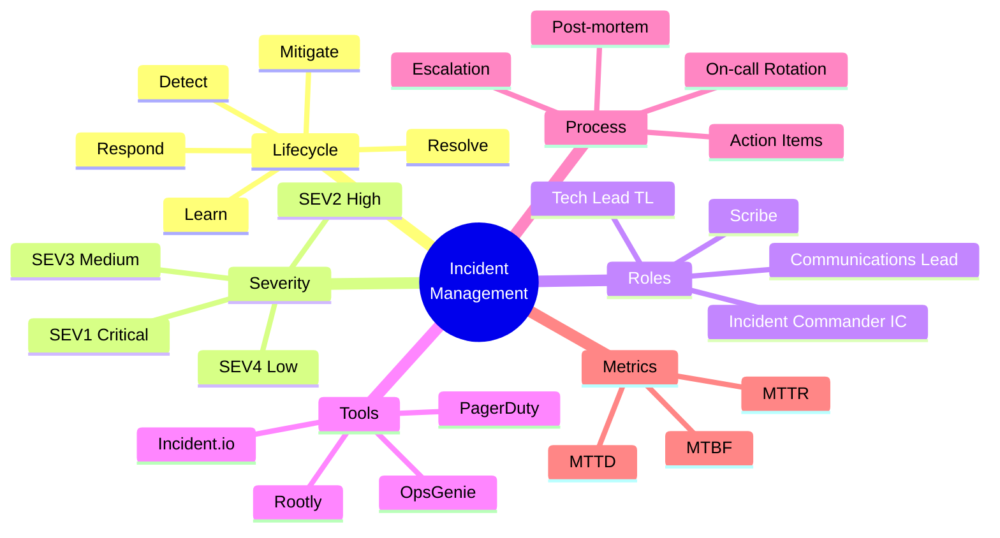
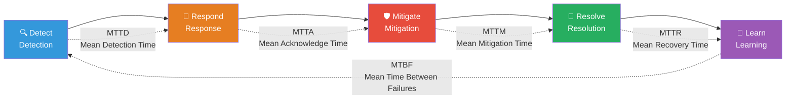
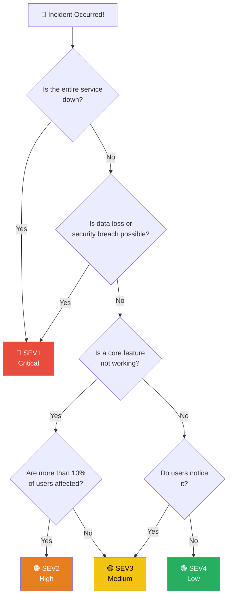
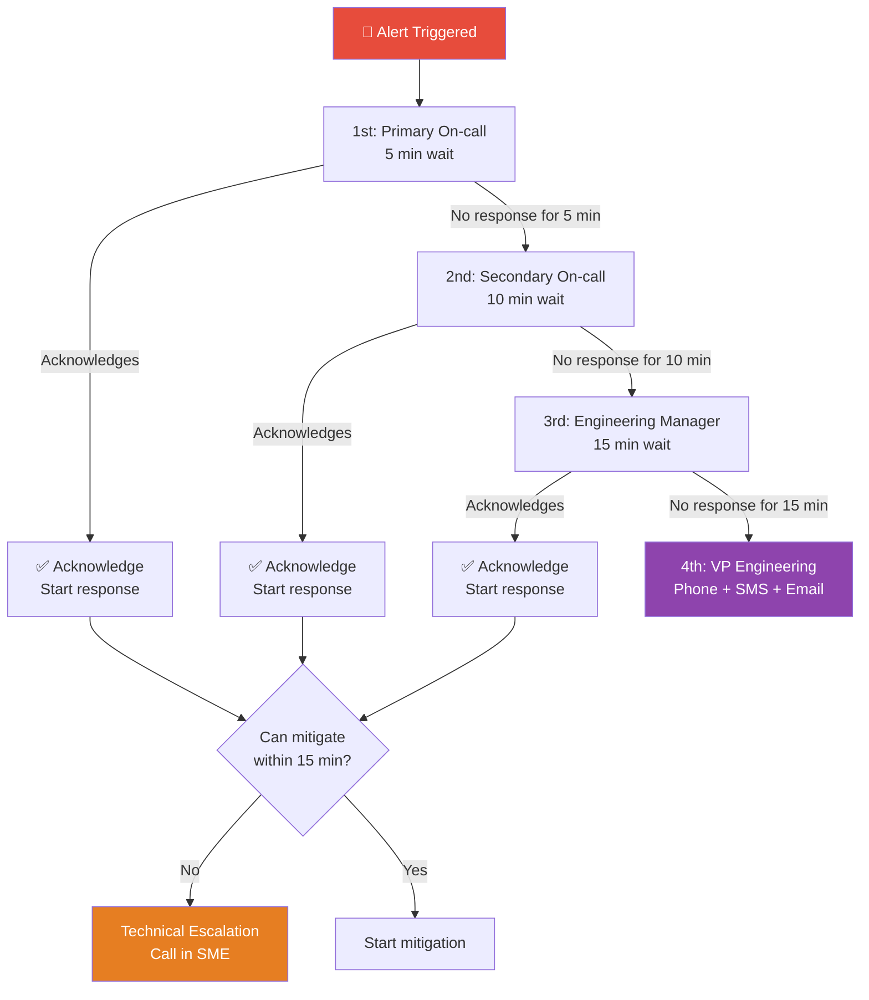
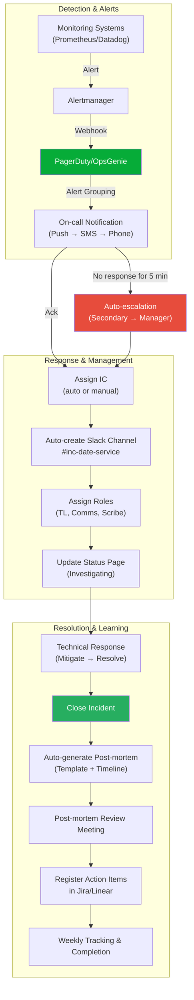

# Complete Mastery of Incident Management — You Can't Prevent Failures, But You Can Design Your Response

> Service failures are a matter of **"when they happen" rather than "if they happen."** Now that you've learned about Error Budget from [SRE Principles](./01-principles) and mastered detecting warning signs from [Alerting](../08-observability/11-alerting), it's time to learn how to systematically manage the **entire incident lifecycle from the moment an alert fires until the end** — this is incident management.

---

## 🎯 Why Do You Need to Know About Incident Management?

### Daily analogy: Emergency Room System

Think of a hospital emergency room.

- A patient is brought in (incident detection)
- A triage nurse **classifies severity** — cardiac arrest? Fracture? Cold? (severity classification)
- A critical patient is **immediately assigned a dedicated medical team** (incident commander)
- If the assigned doctor is unavailable, **another doctor is called** (escalation)
- While treating, **information is communicated to the patient's family** (communication)
- After treatment, **medical records are written** (post-mortem)
- If a similar patient comes again, **the team can respond faster** (improvement)

What happens if the ER operates without a system?

```
What happens in teams without incident management:

  "Service went down at 3 AM but nobody knew"              → No detection system
  "I got the alert but didn't know who should respond"    → No on-call system
  "10 people were looking at the same problem simultaneously" → No incident commander
  "Customer calls flooded in during the outage"            → No communication plan
  "The same failure happened again 3 months later"         → No post-mortem
  "The incident report says 'Kim dev made a mistake'"      → No blameless culture
```

### Chaotic team vs Incident Management team

```mermaid
flowchart TD
    subgraph "❌ Chaotic Team"
        A1["Failure occurs!<br/>Customer complaints received"] -->|"Noticed 30 min later"| A2["'Who should look at this?'<br/>Slack chaos"]
        A2 -->|"Finding owner takes 15 min"| A3["Multiple people investigating<br/>the same issue simultaneously"]
        A3 -->|"No coordination, each working alone"| A4["One person rolls back,<br/>another hotfixes"]
        A4 -->|"Total MTTR: 3 hours"| A5["Customer churn<br/>Team burnout<br/>Recurrence expected"]
    end

    subgraph "✅ Incident Management Team"
        B1["Automatic monitoring detection<br/>PagerDuty alert"] -->|"Noticed within 2 min"| B2["On-call engineer<br/>declares incident"]
        B2 -->|"IC assigns roles"| B3["Coordinated response<br/>with separated duties"]
        B3 -->|"Following runbook"| B4["Mitigate, then fix root cause<br/>and deploy"]
        B4 -->|"Total MTTR: 20 min"| B5["Quick recovery<br/>Post-mortem<br/>Prevention in place"]
    end

    style A5 fill:#e74c3c,color:#fff
    style B5 fill:#27ae60,color:#fff
```



### Why Incident Management Matters from a Business Perspective

```
📊 Cost of Downtime (Industry Average):

  1 hour of SEV1 failure = $100,000 ~ $1,000,000+ loss
  Reducing MTTR by 10 minutes = Saves hundreds of millions annually
  Loss of customer trust → 25% increase in churn rate

📈 Benefits of Implementing Incident Management:
  MTTD (Detection Time)     : 30 min → 2 min     (93% improvement)
  MTTR (Recovery Time)      : 3 hours → 20 min   (89% improvement)
  Recurrence Rate           : 40% → 8%           (80% improvement)
  On-call Burnout           : High → Manageable  (Better retention)
```

---

## 🧠 Core Concepts

### What is an Incident?

**An Incident** is an event that disrupts or threatens normal service operation. It's different from simple bugs or improvements.

```
🔥 Incident
   - A situation that is currently or will soon impact the service
   - Requires immediate response
   - Examples: API response time 10 seconds, payment failure rate spike, database down

🐛 Bug
   - Service works but behaves differently than expected
   - Handled as a regular ticket
   - Examples: UI broken on specific browser, incorrect error message

💡 Improvement
   - Service works but could be better
   - Managed in backlog
   - Examples: Optimize API response speed, improve log format
```

### Key Concepts at a Glance



### Five Pillars of Incident Management

| Pillar | Description | Analogy |
|--------|-------------|---------|
| **Detection** | Quickly discovering the problem | Fire detector |
| **Response** | Right person taking immediate action | Fire trucks dispatched |
| **Communication** | Informing stakeholders of the situation | Evacuation announcement |
| **Resolution** | Removing the root cause of the problem | Extinguishing the fire |
| **Learning** | Establishing measures to prevent recurrence | Fire investigation report |

---

## 🔍 Deep Dive

### 1. Incident Lifecycle

Every incident goes through 5 stages. Skipping any stage causes problems.



#### Stage 1: Detect (Detection)

The stage of becoming aware of the problem. There are several ways to detect it.

```
Detection source priority:

  Priority 1: Automatic monitoring alerts     ← Most ideal (Proactive)
    - Prometheus Alert Rules
    - SLO-based Error Budget Burn Rate alerts
    - APM anomaly detection

  Priority 2: Internal reporting               ← Acceptable
    - Developer discovers after deployment
    - QA team finds during testing
    - Internal tool monitoring

  Priority 3: Customer reporting               ← Needs improvement
    - Support team notification
    - Social media mentions
    - Direct inquiry
```

Improving detection quality is covered in detail in [Alerting](../08-observability/11-alerting). The key is using **symptom-based alerting** and **SLO-based alerts**.

#### Stage 2: Respond (Response)

The stage where appropriate personnel are deployed after detection.

```yaml
# Response stage checklist
respond_checklist:
  - "Has the on-call engineer acknowledged the alert?"
  - "Has an incident channel (Slack/Teams) been created?"
  - "Has incident severity been determined?"
  - "Has an Incident Commander been assigned?"
  - "Have necessary roles (TL, Communications Lead) been assigned?"
  - "Has the status page been updated?"
```

#### Stage 3: Mitigate (Mitigation)

The **first aid** stage of minimizing user impact. The goal is **stopping the bleeding**, not fixing the root cause.

```
Mitigation strategies:

  🔄 Rollback
     - Fastest response when recent deployment is the cause
     - "If problems occur within 30 min of deployment → rollback immediately"

  📈 Scale Out
     - When traffic spike is the cause
     - Auto-scaling or manually adding instances

  🚫 Feature Flag Off
     - When a specific feature is the cause
     - Toggle off that feature only

  🔀 Traffic Shift
     - When a specific region/AZ has issues
     - Reroute traffic via DNS or load balancer

  🗄️ Cache Invalidation
     - When bad cached data is the cause
     - Flush cache and regenerate

  ⏸️ Queue Pause
     - When async processing is overloaded
     - Stop queue consumption for cleanup
```

#### Stage 4: Resolve (Resolution)

The stage of finding and fixing the root cause.

```
Difference between Mitigation and Resolution:

  Mitigate: "We rolled back to restore service"
  Resolve:  "We fixed the memory leak code and deployed"

  Mitigate: "We isolated the problematic server"
  Resolve:  "We replaced the disk and recovered data"

  ⚠️ If you only mitigate without resolving → same failure repeats!
```

#### Stage 5: Learn (Learning)

The stage of preventing recurrence through post-mortems. **The most important yet most often skipped stage**.

```
Core activities in the Learning stage:

  📝 Write post-mortem (within 72 hours)
  👥 Post-mortem review meeting (within 1 week)
  📋 Register and track action items
  📊 Update incident metrics
  📚 Update Runbooks
  🔔 Improve alerting rules
```

---

### 2. Severity Classification

You can't respond to all incidents the same way. **Response level must vary by severity.**

#### SEV Level Definitions

```
┌─────────┬─────────────────────────────────────────────────────────────────┐
│  Level  │  Definition and Criteria                                         │
├─────────┼─────────────────────────────────────────────────────────────────┤
│  SEV1   │  🔴 Critical — Complete service outage                           │
│ (P1)    │  • All users affected                                           │
│         │  • Risk of data loss                                            │
│         │  • Direct revenue impact                                        │
│         │  • Examples: Complete API down, payment system failure, DB down  │
│         │  • Response: Immediate, 24/7, executive notification            │
├─────────┼─────────────────────────────────────────────────────────────────┤
│  SEV2   │  🟠 High — Major feature outage                                  │
│ (P2)    │  • Multiple users affected                                      │
│         │  • Core feature unavailable                                     │
│         │  • No workaround or very inconvenient                           │
│         │  • Examples: Search broken, region unreachable, login fails     │
│         │  • Response: Within 30 min, including off-hours                 │
├─────────┼─────────────────────────────────────────────────────────────────┤
│  SEV3   │  🟡 Medium — Partial feature degradation                         │
│ (P3)    │  • Some users affected                                          │
│         │  • Non-core feature unavailable                                 │
│         │  • Workaround exists                                            │
│         │  • Examples: Notification delay, report slow, specific browser   │
│         │  • Response: During business hours, same day resolution          │
├─────────┼─────────────────────────────────────────────────────────────────┤
│  SEV4   │  🟢 Low — Minor issue                                            │
│ (P4)    │  • Minimal user impact                                          │
│         │  • Cosmetic issue or minor inconvenience                        │
│         │  • Examples: Typo, minor UI break, log warning message           │
│         │  • Response: Backlog, handle in next sprint                      │
└─────────┴─────────────────────────────────────────────────────────────────┘
```

#### Severity Classification Matrix

When confused about which SEV level to assign, use this matrix.



#### Response Guidelines by SEV Level

```yaml
# incident-severity-policy.yaml
severity_levels:
  SEV1:
    response_time: "Within 5 minutes"
    resolution_target: "Within 1 hour"
    on_call: "Immediate page (24/7)"
    escalation: "Auto-escalate if unresponsive for 15 min"
    communication: "Status update every 10 minutes"
    stakeholders: "CTO, VP Engineering, CS Lead"
    postmortem: "Required (within 48 hours)"
    ic_required: true
    war_room: true

  SEV2:
    response_time: "Within 15 minutes"
    resolution_target: "Within 4 hours"
    on_call: "Immediate page (including off-hours)"
    escalation: "Auto-escalate if unresponsive for 30 min"
    communication: "Status update every 30 minutes"
    stakeholders: "Engineering Manager, CS Team"
    postmortem: "Required (within 1 week)"
    ic_required: true
    war_room: false

  SEV3:
    response_time: "Within 1 hour"
    resolution_target: "Within 1 business day"
    on_call: "During business hours only"
    escalation: "If unresponsive for 2 hours"
    communication: "Notification once resolved"
    stakeholders: "Team Lead"
    postmortem: "Optional (if improvement found)"
    ic_required: false
    war_room: false

  SEV4:
    response_time: "Within 1 business day"
    resolution_target: "Within 1 week"
    on_call: "N/A"
    escalation: "If not handled within 1 week"
    communication: "N/A"
    stakeholders: "N/A"
    postmortem: "N/A"
    ic_required: false
    war_room: false
```

---

### 3. Incident Roles

In large incidents, one person can't do everything. **Role separation is key to effective response.**

#### Incident Commander (IC) — Incident Commander

The **overall owner** of the incident. Not the person fixing the code, but the person **coordinating the entire situation**.

```
IC's Responsibilities (like a hospital chief physician):

  ✅ IC Does:
    • Determine and declare incident severity
    • Assign roles (TL, Communications Lead, etc.)
    • Maintain overall situational awareness and make decisions
    • Decide on escalation
    • Manage timeline ("Please share status in 10 minutes")
    • Decide on additional resource allocation

  ❌ IC Doesn't:
    • Directly modify code or debug
    • Perform detailed technical analysis
    • Respond to customers
    • Write post-mortems (separate responsibility)

  💡 Analogy: A fire department commander doesn't fight the fire directly.
           They oversee the entire situation and deploy personnel and equipment.
```

#### Overall Role Structure

```
┌──────────────────────────────────────────────────────────────┐
│                    Incident Commander (IC)                     │
│          Overall coordination, decision-making, escalation     │
├───────────────┬──────────────────┬───────────────────────────┤
│  Tech Lead    │  Comms Lead      │  Scribe                    │
│  Technical    │  Communication   │  Timeline Recording        │
│  Analysis     │                  │                           │
│               │                  │                           │
│  • Root cause │  • Status page   │  • Time-based events      │
│    analysis   │    updates       │    recording              │
│  • Mitigation │  • Slack         │  • Action items           │
│    plan       │    notification  │    recording              │
│  • Technical  │  • Stakeholder   │  • Post-mortem draft      │
│    decisions  │    communication │    preparation            │
│               │  • CS team       │                           │
│  Subject      │    support       │                           │
│  Matter       │                  │                           │
│  Experts      │                  │                           │
│  (SME calls)  │                  │                           │
└───────────────┴──────────────────┴───────────────────────────┘
```

#### Role Distribution for Small Teams

```
Team size-based role distribution:

  2-3 person team:
    • IC + Comms = One person (On-call engineer)
    • TL + Scribe = One person (Support engineer)

  4-6 person team:
    • IC = Senior engineer or EM
    • TL = On-call engineer
    • Comms = EM or PM
    • Scribe = Junior engineer (great learning opportunity!)

  7+ person team:
    • All roles assigned separately
    • SMEs called as needed
```

---

### 4. On-call Operations

On-call is the **24/7 shield protecting the service**. However, poorly managed, it can burn out the team.

#### On-call Rotation Design

```yaml
# on-call-rotation.yaml
rotation:
  name: "Backend Primary On-call"
  type: "weekly"            # weekly, daily, follow-the-sun
  handoff_time: "10:00 KST" # Hand off at business start time
  handoff_day: "Monday"

  participants:
    - name: "Kim Engineer"
      contact:
        phone: "+82-10-xxxx-xxxx"
        slack: "@kim-eng"
    - name: "Lee Engineer"
      contact:
        phone: "+82-10-xxxx-xxxx"
        slack: "@lee-eng"
    - name: "Park Engineer"
      contact:
        phone: "+82-10-xxxx-xxxx"
        slack: "@park-eng"

  # Minimum 3 people required for rotation
  # No person should do on-call for 2+ consecutive weeks

  layers:
    primary:
      escalation_timeout: 5m    # Escalate to Secondary if no response
    secondary:
      escalation_timeout: 10m   # Escalate to Manager if no response
    manager:
      escalation_timeout: 15m   # Escalate to VP if no response
```

#### On-call Best Practices

```
✅ For On-call to Work Well:

  📋 Runbooks Prepared
    • All alerts must have documented response procedures
    • "What do I do when I get this alert?" → Answer should be in Runbook
    • Alert → Runbook link auto-connection

  👥 Appropriate Rotation
    • Minimum 3 people (ideally 5-6)
    • 1 week on-call → minimum 2 weeks off
    • Follow-the-Sun: Distribute by timezone for global teams

  💰 Compensation System
    • On-call stipend (on-call + page-out bonus)
    • Additional pay for night/weekend pages
    • Compensatory time off
    • "No compensation for on-call = Burnout scheduled"

  📱 Handoff
    • During shift change, communicate current issues and cautions
    • Delay handoff if incident is in progress
    • Use handoff checklist

  🧘 Prevent Burnout
    • Target of 2 or fewer alerts per week
    • Aggressively eliminate unnecessary alerts
    • If on-call gets paged at night, allow late arrival next day
    • Regular alert quality reviews
```

#### On-call Handoff Template

```markdown
## On-call Handoff — 2024-W03 (Kim Engineer → Lee Engineer)

### Major Incidents from Last Week
- [INC-0042] Tuesday payment API delay → Resolved (DB index added)
- [INC-0043] Friday CDN cache error → Under monitoring

### Current Items to Watch
- [ ] Wednesday DB migration planned — Alerts may increase
- [ ] New payment module canary deployment — Monitor error rate
- [ ] Redis memory 80% — Near threshold

### Known Flaky Alerts
- `disk-usage-high` on node-07: Temp volume issue, can ignore
- `pod-restart` on cronjob-cleanup: Normal operation, fix planned

### Escalation Contacts
- DB issues: @Park DBA (010-xxxx-xxxx)
- Infrastructure issues: @Choi Infrastructure (010-xxxx-xxxx)
- Payment issues: @Jung Payment Lead (010-xxxx-xxxx)
```

---

### 5. Escalation Policies

Escalation is **a signal that higher-level response is needed**. Don't hesitate to escalate.



#### Two Types of Escalation

```
📈 Functional Escalation
   = "This isn't my area of expertise"
   → Hand off to subject matter expert (SME)
   Example: Backend on-call finds network issue → Call network engineer

📊 Hierarchical Escalation
   = "This needs higher-level decision authority"
   → Report to manager/executive
   Example: Complete service down → Notify CTO, get approval for public notification
```

#### Escalation Decision Criteria

```
When Should You Escalate?

  Immediate escalation:
    ⬆️ SEV1 incidents — mandatory
    ⬆️ Possible data loss
    ⬆️ Security breach (see also: Security Incident Response)
    ⬆️ Legal/compliance impact

  After 15 minutes:
    ⬆️ Can't identify root cause
    ⬆️ Don't know how to mitigate
    ⬆️ Impact scope is expanding

  After 30 minutes:
    ⬆️ Mitigation not working
    ⬆️ Need additional resources
    ⬆️ SEV2 showing signs of becoming SEV1

  ⚠️ "Escalation isn't failure. Late escalation is failure."
```

---

### 6. Communication

During an outage, communication is as important as technical response. **Silence breeds anxiety.**

#### Communication Channels by Purpose

```
Channel-specific purposes:

  🔴 Incident Slack Channel (#inc-20240115-payment-failure)
     • Technical response communication only
     • No bystanders — participants only
     • Record critical decisions

  🟡 Status Page (status.company.com)
     • For external customers
     • Minimize technical details
     • Regular updates (every 10-30 minutes)

  🔵 Internal Notification Channel (#engineering-incidents)
     • Share with all engineering team
     • Summary of progress
     • Request for help

  🟢 Stakeholder Communication (Email/Slack DM)
     • Directly to CTO, PM, CS Lead
     • Focus on business impact
     • Include estimated recovery time
```

#### Status Page Update Template

```markdown
## [Investigating] Payment Processing Delay

📅 2024-01-15 14:30 KST

We're currently experiencing delays in payment processing.
We're investigating and will share updates as we have them.

Affected Services: Payment Service
Impact: Payment processing may take longer than usual.

---

## [Identified] Payment Processing Delay — Root Cause Identified

📅 2024-01-15 14:45 KST

We've identified the issue: the payment gateway connection pool is exhausted,
causing processing delays. We're currently implementing mitigation.

---

## [Monitoring] Payment Processing Delay — Fix Complete, Monitoring

📅 2024-01-15 15:00 KST

Our mitigation is complete. Payment processing speed is returning to normal,
and we're monitoring stability.

---

## [Resolved] Payment Processing Delay — Resolved

📅 2024-01-15 15:30 KST

Payment processing is now fully normal.
Root Cause: Payment gateway connection pool configuration error
Fix: Adjusted connection pool size and added auto-recovery logic
We apologize for the inconvenience.
```

#### Slack Incident Channel Template

```markdown
🚨 **INCIDENT DECLARED** — INC-2024-0115-001

**Severity**: SEV2
**Impact**: Payment API response delay (p99 > 10 sec)
**Incident Commander**: @Kim IC
**Tech Lead**: @Lee TL
**Communications Lead**: @Park Comms

**Timeline**:
• 14:25 — Payment API delay alert triggered
• 14:30 — On-call @Lee TL acknowledged, incident declared
• 14:35 — DB connection pool exhaustion confirmed
• 14:40 — Connection pool size increased
• 14:50 — Response time normalized

**Current Status**: Monitoring
**Next Update**: 15:00

⚠️ This channel is for incident response only.
   Questions/observation → #engineering-incidents please.
```

#### Stakeholder Communication Guide

```
Different stakeholders have different concerns:

  CTO / VP Engineering:
    "How big is the business impact?"
    "When will it be fixed?"
    "Can we prevent this?"
    → Focus on business impact + recovery time

  PM / Product Team:
    "What are customers experiencing?"
    "Is there a workaround?"
    "Does this affect our roadmap?"
    → Focus on user impact + workarounds

  CS / Customer Support:
    "What do we tell customers?"
    "How long should they wait?"
    "Do they need compensation?"
    → Provide talking points + estimated recovery time

  Legal / Compliance:
    "Was data lost?"
    "Any regulation violations?"
    "External reporting needed?"
    → Focus on data impact + compliance issues
```

---

### 7. Blameless Post-mortems

A post-mortem is **not "who did wrong" but "why did the system allow this"**.

#### What is Blameless Culture?

```
❌ Blame Culture:
   "Kim dev deployed wrong config to production."
   → Result: People hide mistakes and don't report problems

✅ Blameless Culture:
   "There was no validation process for production config changes,
    so wrong config could be deployed without review."
   → Result: Focus on system improvement and honest sharing

Core Principles:
  • People make mistakes. Systems should prevent them.
  • Ask "why/how", not "who".
  • If the second person could make the same mistake, it's a system problem.
  • The person who made the mistake learned the most. Punishment destroys learning.
```

#### Post-mortem Template

```markdown
# Post-mortem: [INC-2024-0115-001] Payment API Failure

## Basic Info
| Item | Content |
|------|---------|
| Incident ID | INC-2024-0115-001 |
| Severity | SEV2 |
| Incident Commander | Kim IC |
| Author | Lee TL |
| Written | 2024-01-17 |
| Review Date | 2024-01-22 |

## Summary
On January 15, 2024, from 14:25 to 15:30 (approximately 65 minutes),
the payment API experienced response delays. The root cause was database connection
pool exhaustion, and approximately 30% of payment requests experienced timeout errors.

## Impact
- **Duration**: 65 minutes (14:25 ~ 15:30 KST)
- **Affected Users**: ~12,000
- **Failed Payment Transactions**: ~850
- **Revenue Impact**: ~₩15,000,000 (mostly recovered via client retries)
- **SLA Impact**: Monthly availability 99.95% → 99.91%

## Timeline
| Time (KST) | Event |
|------------|--------|
| 14:20 | DB connection pool usage increasing |
| 14:25 | Payment API p99 latency > 10 sec alert fired |
| 14:28 | On-call @Lee TL acknowledged PagerDuty alert |
| 14:30 | Incident declared, #inc-20240115-payment Slack channel created |
| 14:35 | DB connection pool 100% exhausted confirmed |
| 14:38 | Root cause identified: New batch job consuming excess connections |
| 14:40 | Mitigation: Batch job stopped |
| 14:45 | Connection pool recovery started |
| 14:50 | Payment API response time normalized |
| 15:00 | Batch job restarted with connection limits |
| 15:30 | Stability confirmed, incident closed |

## Root Cause
The new batch job (daily settlement report) was acquiring connections from the
DB connection pool without limit, exhausting the entire connection pool.

**Contributing Factors**:
1. No separate connection pool for batch jobs vs. service workload
2. No load testing performed when deploying batch job
3. Connection pool usage alert threshold was too high (90%)

## What Went Well
- Alert fired accurately within 5 minutes
- On-call engineer acknowledged within 3 minutes
- Root cause identified relatively quickly (8 minutes)
- Status page updates were timely

## What Didn't Go Well
- No separation between batch and service connection pools
- No resource limit policy for batch jobs
- Connection pool alert threshold too high (90%)

## Lucky Breaks
- Not during peak hours (2 PM). If it had been 8 PM, impact would be 5x worse
- Most failed payments recovered via automatic client retries

## Action Items
| # | Action | Priority | Owner | Due | Status |
|---|--------|----------|-------|-----|--------|
| 1 | Separate batch/service connection pools | P1 | @Lee TL | 01/22 | In Progress |
| 2 | Set connection limits for batch jobs | P1 | @Kim BE | 01/19 | Complete |
| 3 | Lower connection pool alert threshold to 70% | P2 | @Park SRE | 01/22 | In Progress |
| 4 | Establish load test process for batch deployments | P2 | @Lee TL | 01/29 | Not Started |
| 5 | Add connection pool auto-recovery logic | P3 | @Kim BE | 02/05 | Not Started |
```

#### Post-mortem Process

```
Post-mortem Steps:

  1️⃣ Draft (within 48 hours of incident end)
     • IC or TL creates using the template above
     • Timeline should be as detailed as possible

  2️⃣ Review Request
     • Share with all incident participants
     • Add missing or incorrect details

  3️⃣ Post-mortem Review Meeting (30-60 minutes)
     • Attendees: IC, TL, involved engineers, EM
     • Review timeline
     • Agree on root cause
     • Prioritize action items
     • ⚠️ No blame, focus on system improvement

  4️⃣ Register Action Items
     • Create tickets in Jira/Linear
     • Must specify owner + deadline
     • Include in sprint planning

  5️⃣ Track and Complete
     • Check progress in weekly meetings
     • Escalate incomplete P1 items
     • Close post-mortem when all items complete
```

---

### 8. Incident Metrics

"What you can't measure, you can't improve." These are the key metrics for measuring incident management effectiveness.

#### Four Core Metrics

```
┌─────────────────────────────────────────────────────────────────┐
│                      Incident Timeline                           │
│                                                                  │
│  Failure        Detection     Acknowledge    Mitigate    Resolve │
│     │             │              │             │           │     │
│     ├── MTTD ────►├── MTTA ─────►├── TTM ─────►├── TTR ───►│     │
│     │             │              │             │           │     │
│     ├───────────── MTTR (Total Recovery Time) ──────────────►│     │
│     │                                              │           │     │
│     │◄────────── MTBF (Time Between Failures) ──────────────►│     │
│                                                                  │
└─────────────────────────────────────────────────────────────────┘

  MTTD (Mean Time To Detect) — Detection Time
    From failure → detection
    Good target: < 5 min
    "How quickly do we notice?"

  MTTA (Mean Time To Acknowledge) — Acknowledgment Time
    From alert → person acknowledges
    Good target: < 5 min
    "How quickly do we start responding?"

  MTTR (Mean Time To Resolve) — Recovery Time
    From failure → full resolution
    Good targets: SEV1 < 1 hour, SEV2 < 4 hours
    "How quickly do we fix it?"

  MTBF (Mean Time Between Failures) — Time Between Failures
    From previous failure resolution → next failure
    Good target: Longer is better
    "How stable are we?"
```

#### Additional Useful Metrics

```yaml
# incident-metrics.yaml
operational_metrics:
  # Alert Quality
  alert_noise_ratio:
    description: "Ratio of true incidents to total alerts"
    target: "> 50%"
    warning: "< 30% means Alert Fatigue risk"

  false_positive_rate:
    description: "Ratio of false positive alerts"
    target: "< 10%"

  # On-call Health
  pages_per_shift:
    description: "Average pages per on-call shift"
    target: "< 2/week"
    critical: "> 5/week = Burnout risk"

  off_hours_pages:
    description: "Ratio of off-hours pages"
    target: "< 30%"

  # Process Health
  postmortem_completion_rate:
    description: "Post-mortem completion rate for SEV1/2"
    target: "100%"

  action_item_completion_rate:
    description: "On-time completion of action items"
    target: "> 80%"

  recurrence_rate:
    description: "Incidents with same root cause"
    target: "< 10%"

  escalation_rate:
    description: "Incidents requiring escalation"
    target: "< 20%"
```

#### Metrics Dashboard Composition

```
Recommended incident metrics dashboard:

  🔴 Real-time Panel (Top)
    • Current ongoing incidents + severity
    • Current on-call person
    • Alert count in last 24 hours

  📊 Weekly Trends (Middle)
    • MTTD / MTTA / MTTR trends
    • Incidents by severity
    • On-call page frequency

  📈 Monthly Report (Bottom)
    • MTBF trend
    • Action item completion rate
    • Recurrence rate
    • Alert noise ratio
    • Top 5 incident causes (by category)
```

---

### 9. Incident Management Tools

#### PagerDuty

The industry-standard on-call and incident management platform.

```yaml
# pagerduty-service-config.yaml (conceptual example)
service:
  name: "Payment API"
  description: "Payment processing service"

  escalation_policy:
    name: "Payment Team Escalation"
    rules:
      - targets:
          - type: "schedule"
            id: "payment-primary-oncall"
        escalation_delay_in_minutes: 5

      - targets:
          - type: "schedule"
            id: "payment-secondary-oncall"
        escalation_delay_in_minutes: 10

      - targets:
          - type: "user"
            id: "engineering-manager"
        escalation_delay_in_minutes: 15

  integrations:
    - type: "prometheus"
      name: "Prometheus Alertmanager"
    - type: "slack"
      name: "#incidents"
    - type: "jira"
      name: "JIRA Incident Project"

  # Alert grouping: Combine same-service alerts within 5 min
  alert_grouping:
    type: "intelligent"
    config:
      time_window: 300  # 5 minutes
```

```
PagerDuty Core Features:

  📞 On-call Scheduling
    • Weekly/daily rotations
    • Holiday/vacation overrides
    • Follow-the-Sun support

  🔔 Alert Delivery
    • Progressive (push → SMS → phone)
    • Acknowledge / Resolve management
    • Automatic escalation

  📊 Analytics Reports
    • Auto-measure MTTA/MTTR
    • On-call load analysis
    • Alert frequency trends

  🔗 Integrations
    • 600+ integrations (Prometheus, Datadog, Slack, Jira, etc.)
    • Terraform Provider (IaC)
```

#### OpsGenie (Atlassian)

An incident management tool with strong integration into the Atlassian ecosystem (Jira, Confluence).

```
OpsGenie Features:

  ✅ Native Jira Integration
    • Incidents → Jira tickets auto-created
    • Post-mortems → Confluence pages auto-created
    • Bi-directional sync

  ✅ Flexible Alerting Policies
    • Team/service-specific escalation
    • Quiet hours filtering
    • Alert content customization

  ✅ Competitive Pricing
    • Cheaper than PagerDuty (especially small teams)
    • Atlassian bundle discounts
```

#### Incident.io

A Slack-native incident management platform. Handle entire incident workflows within Slack.

```
Incident.io Approach:

  💬 Slack-First Workflow
    • Declare incident with /incident slash command
    • Auto-create dedicated Slack channel
    • Assign roles, update status all in Slack
    • Timeline auto-generated from Slack messages

  🔄 Automation
    • Incident declared → channel created → roles assigned → status page updated
    • Resolved → post-mortem template auto-created
    • Action items → Jira/Linear auto-registered

  📊 Insights
    • Incident trend analysis
    • Team/service MTTR comparison
    • Action item completion tracking
```

#### Rootly

Similar to Incident.io with Slack-based incident management, but more focused on workflow automation.

```
Rootly Features:

  🤖 Workflow Automation (Strength)
    • "If SEV1, auto-create Zoom meeting"
    • "After incident closes, auto-draft post-mortem"
    • "If specific service down, auto-attach related Runbook"
    • No-code workflow builder

  🏷️ Service Catalog Integration
    • Map service to on-call, runbooks, dashboards
    • Auto-provide related info when incident occurs

  💰 Price Competitiveness
    • Free tier for startups
```

#### Tool Comparison

```
┌──────────────┬────────────┬─────────────┬──────────────┬────────────┐
│   Feature    │ PagerDuty  │ OpsGenie    │ Incident.io  │ Rootly     │
├──────────────┼────────────┼─────────────┼──────────────┼────────────┤
│ On-call      │ ⭐⭐⭐⭐⭐ │ ⭐⭐⭐⭐    │ ⭐⭐⭐       │ ⭐⭐⭐     │
│ Escalation   │ ⭐⭐⭐⭐⭐ │ ⭐⭐⭐⭐    │ ⭐⭐⭐       │ ⭐⭐⭐     │
│ Slack Integ  │ ⭐⭐⭐     │ ⭐⭐⭐      │ ⭐⭐⭐⭐⭐   │ ⭐⭐⭐⭐⭐ │
│ Workflow     │ ⭐⭐⭐⭐   │ ⭐⭐⭐      │ ⭐⭐⭐⭐     │ ⭐⭐⭐⭐⭐ │
│ Post-mortem  │ ⭐⭐⭐     │ ⭐⭐⭐⭐    │ ⭐⭐⭐⭐⭐   │ ⭐⭐⭐⭐   │
│ Analytics    │ ⭐⭐⭐⭐⭐ │ ⭐⭐⭐      │ ⭐⭐⭐⭐     │ ⭐⭐⭐⭐   │
│ Price        │ $$$        │ $$          │ $$$          │ $$         │
│ Best For     │ Enterprise │ Atlassian   │ Slack-first  │ Startups   │
└──────────────┴────────────┴─────────────┴──────────────┴────────────┘

Recommended Combinations:
  Small team (5-15): OpsGenie or Rootly
  Medium team (15-50): PagerDuty + Incident.io
  Large team (50+): PagerDuty + Incident.io + custom integrations
```

---

### 10. PagerDuty / OpsGenie Workflow

Let's see the full workflow using actual incident management tools.



#### Alertmanager → PagerDuty Integration

```yaml
# alertmanager.yml
global:
  resolve_timeout: 5m

route:
  receiver: 'default-receiver'
  group_by: ['alertname', 'service']
  group_wait: 30s        # Alert grouping wait time
  group_interval: 5m     # Re-alert interval for same group
  repeat_interval: 4h    # Repeat unresolved alerts

  routes:
    # SEV1: Send to PagerDuty immediately (Critical)
    - match:
        severity: critical
      receiver: 'pagerduty-critical'
      group_wait: 0s      # Immediate send
      continue: true       # Also send to Slack

    # SEV2: PagerDuty High
    - match:
        severity: warning
        impact: high
      receiver: 'pagerduty-high'
      continue: true

    # SEV3: Slack only
    - match:
        severity: warning
      receiver: 'slack-warning'

    # SEV4: Email
    - match:
        severity: info
      receiver: 'email-info'

receivers:
  - name: 'pagerduty-critical'
    pagerduty_configs:
      - service_key: '<PAGERDUTY_SERVICE_KEY>'
        severity: 'critical'
        description: '{{ .CommonAnnotations.summary }}'
        details:
          firing: '{{ .Alerts.Firing | len }}'
          dashboard: '{{ .CommonAnnotations.dashboard }}'
          runbook: '{{ .CommonAnnotations.runbook_url }}'

  - name: 'pagerduty-high'
    pagerduty_configs:
      - service_key: '<PAGERDUTY_SERVICE_KEY>'
        severity: 'error'

  - name: 'slack-warning'
    slack_configs:
      - api_url: '<SLACK_WEBHOOK_URL>'
        channel: '#alerts-warning'
        title: '{{ .CommonAnnotations.summary }}'
        text: '{{ .CommonAnnotations.description }}'

  - name: 'email-info'
    email_configs:
      - to: 'team@company.com'
```

#### Managing PagerDuty with Terraform

```hcl
# pagerduty.tf
# On-call Schedule
resource "pagerduty_schedule" "primary" {
  name      = "Backend Primary On-call"
  time_zone = "Asia/Seoul"

  layer {
    name                         = "Weekly Rotation"
    start                        = "2024-01-01T10:00:00+09:00"
    rotation_virtual_start       = "2024-01-01T10:00:00+09:00"
    rotation_turn_length_seconds = 604800  # 1 week

    users = [
      pagerduty_user.kim.id,
      pagerduty_user.lee.id,
      pagerduty_user.park.id,
    ]
  }
}

# Escalation Policy
resource "pagerduty_escalation_policy" "backend" {
  name      = "Backend Escalation Policy"
  num_loops = 2  # Total 2 repeats

  rule {
    escalation_delay_in_minutes = 5
    target {
      type = "schedule_reference"
      id   = pagerduty_schedule.primary.id
    }
  }

  rule {
    escalation_delay_in_minutes = 10
    target {
      type = "schedule_reference"
      id   = pagerduty_schedule.secondary.id
    }
  }

  rule {
    escalation_delay_in_minutes = 15
    target {
      type = "user_reference"
      id   = pagerduty_user.engineering_manager.id
    }
  }
}

# Service
resource "pagerduty_service" "payment_api" {
  name              = "Payment API"
  escalation_policy = pagerduty_escalation_policy.backend.id

  alert_creation = "create_alerts_and_incidents"

  # Intelligent Alert Grouping
  alert_grouping_parameters {
    type = "intelligent"
    config {
      time_window = 300  # 5 minutes
    }
  }

  # Auto-resolve: Auto-resolve if not acknowledged in 4 hours
  auto_resolve_timeout = 14400

  # Acknowledge timeout: Re-alert if not acknowledged in 30 minutes
  acknowledgement_timeout = 1800
}
```

---

## 💻 Try It Yourself

### Practice 1: Incident Response Simulation (Tabletop Exercise)

The best way to practice incident response without actual outages.

```markdown
## 🎮 Tabletop Exercise: "Payment System Failure Scenario"

### Requirements
- Participants: 3-6 people (assign IC, TL, Comms, Scribe roles)
- Slack channel: #tabletop-exercise-001
- Time: 30-45 minutes

### Scenario Cards (Presented sequentially by facilitator)

---

📋 [T+0] Scenario Start
"You receive a PagerDuty alert:
 'Payment API - Error rate > 5%'
 Current time: Tuesday 2 PM"

Questions:
  - What's your first action?
  - What tools do you check?

---

📋 [T+5] Status Update
"Payment API error rate is now 15%.
 Error logs show: 'Connection timeout to payment-gateway.external.com'
 External payment gateway seems unresponsive."

Questions:
  - What severity level? Why?
  - What mitigation steps?
  - Who do you notify?

---

📋 [T+10] Situation Worsens
"Error rate reaches 40%.
 Flood of '... payment failed' from CS team.
 Payment gateway status page says 'Operating normally'."

Questions:
  - Escalate SEV level?
  - Contact external gateway?
  - What's the status page message?
  - Customer messaging?

---

📋 [T+20] New Information
"Network team reports: Firewall rules changed this morning.
 Payment gateway traffic is intermittently blocked."

Questions:
  - Root cause found?
  - Mitigation steps?
  - Who changed the firewall? (Blameless!)

---

📋 [T+30] Resolution
"Firewall rules restored. Payment error rate returns to 0%.
 Stability confirmed after 15 min monitoring."

Questions:
  - Close incident?
  - Follow-up actions?
  - Post-mortem action items?
```

### Practice 2: Writing a Post-mortem

Write a post-mortem based on the scenario above. Use the template provided earlier.

```markdown
## Exercise

Based on the Tabletop Exercise scenario:

1. Fill in each section of the post-mortem template
2. Focus especially on:
   - Accurate timeline recording
   - Distinguish root cause from contributing factors
   - Balance "what went well" vs. "what didn't"
   - Specific action items (owner + deadline + measurable)
3. Verify blameless (non-blaming) language

❌ "Network team's Choi dev changed firewall rules incorrectly"
✅ "The firewall rule change process lacked impact validation for payment services"
```

### Practice 3: Write an On-call Runbook

Create a Runbook for frequently occurring alerts.

```markdown
# Runbook: Payment API — High Error Rate

## Alert Condition
- `payment_api_error_rate > 5%` for 5 minutes

## Severity Determination
| Error Rate | Severity | Response |
|-----------|----------|----------|
| 5-10%     | SEV3     | Start investigation, during business hours |
| 10-30%    | SEV2     | Declare incident, immediate response |
| 30%+      | SEV1     | Declare incident, executive notification |

## Diagnosis Steps

### Step 1: Confirm Impact
```bash
# Check Grafana dashboard
# URL: https://grafana.company.com/d/payment-overview

# Or check directly
curl -s https://api.company.com/payment/health | jq .
```

### Step 2: Identify Error Type
```bash
# Get recent errors
kubectl logs -l app=payment-api --since=10m | grep ERROR | head -20

# Categorize by error type
kubectl logs -l app=payment-api --since=10m | grep ERROR | \
  awk '{print $NF}' | sort | uniq -c | sort -rn
```

### Step 3: Root Cause-Specific Actions

#### Case A: External Gateway Down
- Symptoms: `ConnectionTimeout`, `ServiceUnavailable`
- Actions:
  1. Check external gateway status page
  2. Switch to backup gateway
  ```bash
  kubectl set env deployment/payment-api GATEWAY=secondary
  ```
  3. Contact external gateway support

#### Case B: Database Connection Issue
- Symptoms: `DatabaseConnectionError`, `ConnectionPoolExhausted`
- Actions:
  1. Check DB connection pool status
  2. Identify problematic queries/batch jobs and stop
  3. Increase connection pool if needed

#### Case C: Recent Deployment
- Symptoms: Error spike right after deployment
- Actions:
  1. Check deployment history
  ```bash
  kubectl rollout history deployment/payment-api
  ```
  2. Immediate rollback
  ```bash
  kubectl rollout undo deployment/payment-api
  ```
```

---

This comprehensive guide covers the complete incident management lifecycle from detection through learning. Use these templates and processes to build a reliable, professional incident response culture in your organization.
